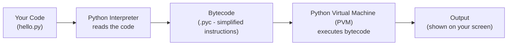
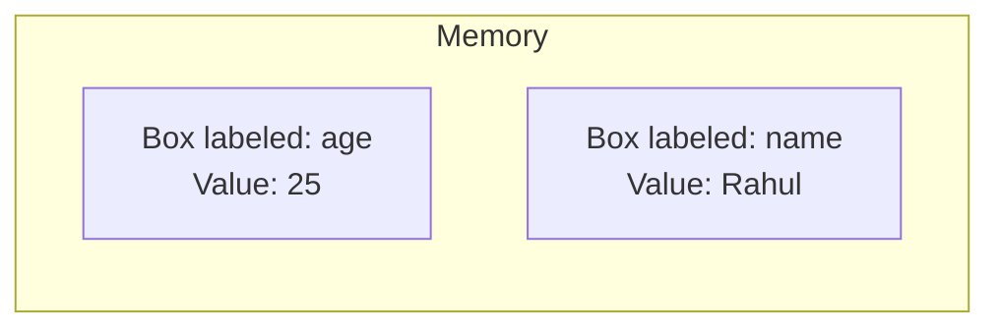
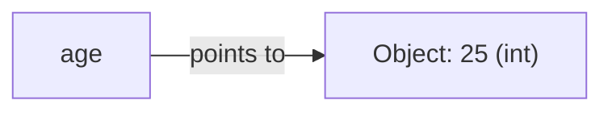
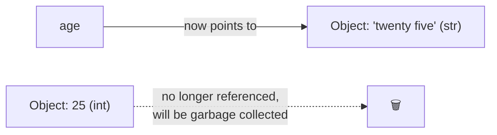
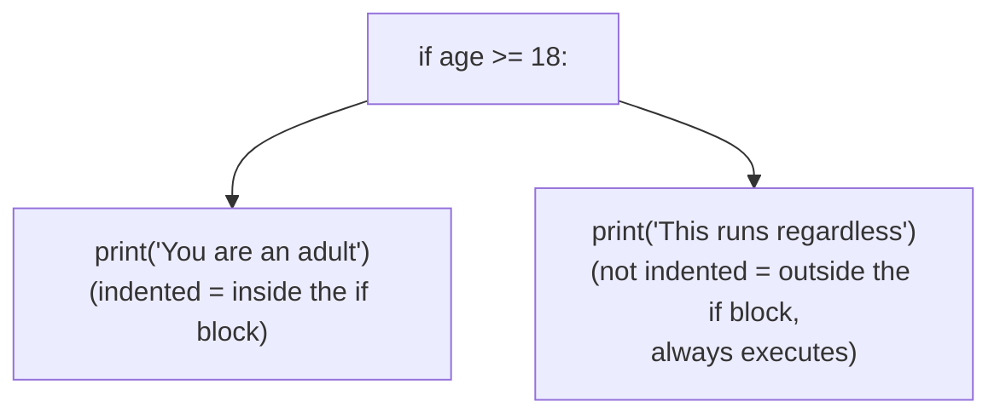
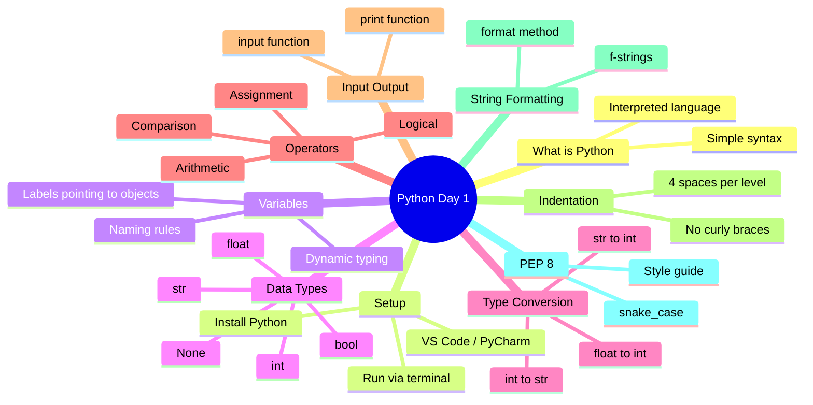

# 📘 DAY 1 — Python Fundamentals (For Absolute Beginners)

> **Goal for Today:** By the end of Day 1, you should understand what Python is, how it works internally (in simple terms), be able to write and run your first programs, and fully understand variables, data types, operators, and input/output.

---

## Table of Contents
1. [What is Python?](#1-what-is-python)
2. [How Python Works Internally](#2-how-python-works-internally)
3. [Installing Python & Setting Up](#3-installing-python--setting-up)
4. [Writing Your First Program](#4-writing-your-first-program)
5. [Comments in Python](#5-comments-in-python)
6. [Variables](#6-variables)
7. [Data Types in Python](#7-data-types-in-python)
8. [Type Conversion (Casting)](#8-type-conversion-casting)
9. [Operators in Python](#9-operators-in-python)
10. [Taking Input and Giving Output](#10-taking-input-and-giving-output)
11. [Indentation Rules (Very Important!)](#11-indentation-rules-very-important)
12. [String Formatting](#12-string-formatting)
13. [PEP 8 — Python's Style Guide](#13-pep-8--pythons-style-guide)
14. [Day 1 Summary Diagram](#14-day-1-summary-diagram)
15. [Practice Questions](#15-practice-questions)

---

## 1. What is Python?

**Python** is a **programming language** — a way of giving instructions to a computer so it does what you want.

Think of it like this: a computer only understands **binary (0s and 1s)**. Humans can't easily write in 0s and 1s, so we invented "programming languages" that are closer to human language. Python is one of these — and it's known for being especially close to plain English, which is why it's a great first language.

### Why is Python popular?
- **Simple syntax** — reads almost like English sentences.
- **Versatile** — used in web development, data science, AI/Machine Learning, automation, scripting, game development, and more.
- **Huge community** — tons of free libraries (pre-written code you can reuse) for almost anything.
- **Interpreted language** — you don't need to "build" or "compile" it separately; it runs line-by-line (explained below).

### Real-life analogy
Imagine you're giving instructions to a friend to make tea:
1. Boil water
2. Add tea leaves
3. Add milk
4. Add sugar
5. Serve

This is exactly what a Python program looks like — a step-by-step list of instructions, executed in order, top to bottom.

---

## 2. How Python Works Internally

This is a concept most beginners skip, but understanding it will make you a much better programmer and help you explain things confidently in interviews.

### Compiled vs Interpreted Languages
- **Compiled languages** (like C, C++): The entire code is translated into machine code (0s and 1s) *before* running, producing an executable file. Think of it like translating an entire book into another language before handing it to someone.
- **Interpreted languages** (like Python): The code is translated and executed **line by line**, on the fly, by a program called an **interpreter**. Think of it like a live translator standing next to you, translating each sentence as you speak.

### What actually happens when you run a Python file?
1. You write code in a `.py` file (plain text).
2. You run it using the **Python Interpreter**.
3. The interpreter converts your code into an intermediate form called **bytecode** (a simplified, low-level version of your code — not quite 0s and 1s, but close).
4. This bytecode is then run by something called the **Python Virtual Machine (PVM)**, which executes it and actually performs the actions on your computer.



**Why does this matter?**
- This is why Python is a bit slower than C/C++ (there's a translation step happening every time), but it's much easier and faster to *write* code in.
- This is also why the *same* Python code can run on Windows, Mac, or Linux without changes — the interpreter handles the differences for you.

---

## 3. Installing Python & Setting Up

### Step 1: Install Python
1. Go to [python.org/downloads](https://www.python.org/downloads/).
2. Download the latest stable version (e.g., Python 3.12+).
3. **Important (Windows users):** During installation, check the box that says **"Add Python to PATH"**. This lets you run Python from anywhere in your terminal/command prompt.

### Step 2: Verify Installation
Open your terminal (Command Prompt on Windows, Terminal on Mac/Linux) and type:
```bash
python --version
```
or
```bash
python3 --version
```
You should see something like `Python 3.12.1`. This confirms Python is installed correctly.

### Step 3: Choose an Editor
You need a place to write code. Recommended options:
- **VS Code** (most popular, free, lightweight) — [code.visualstudio.com](https://code.visualstudio.com/)
- **PyCharm** (feature-rich, great for larger projects)

For VS Code, install the **"Python" extension** (by Microsoft) from the Extensions tab — this gives you syntax highlighting, error detection, and auto-complete.

### Two Ways to Run Python Code
1. **Python Shell / REPL (Interactive Mode):** Type `python` in your terminal — it opens an interactive prompt (`>>>`) where you can type one line at a time and see instant results. Great for quick testing.
2. **Script Mode:** Write code in a `.py` file and run the whole file at once using `python filename.py`. This is what you'll use for real programs.

---

## 4. Writing Your First Program

Let's write the classic first program every programmer writes.

Create a file called `hello.py` and write:

```python
print("Hello, World!")
```

Run it in your terminal:
```bash
python hello.py
```

**Output:**
```
Hello, World!
```

### What just happened? (Line-by-line breakdown)
- `print(...)` — `print` is a **built-in function** in Python. A function is like a mini-tool that performs a specific task. `print` takes whatever you give it and displays it on the screen.
- `"Hello, World!"` — this is a **string** (text data), placed inside quotes. The quotes tell Python "this is text, not code to execute."
- The **parentheses `()`** are how you "call" or "use" a function in Python — you always put the function's inputs (called **arguments**) inside them.

That's it! No need to declare a `main` function like in Java/C, no semicolons, no curly braces. Python just runs top to bottom.

---

## 5. Comments in Python

Comments are notes in your code that Python **ignores** when running — they're purely for humans to read (you, or someone else reading your code later).

```python
# This is a single-line comment
print("This line will run")  # You can also add a comment after code

"""
This is a
multi-line comment
(technically called a docstring,
but often used as a comment block)
"""
```

### Why use comments?
- To explain **why** you wrote something a certain way (not just what it does).
- To temporarily "turn off" a line of code without deleting it, while testing.
- Since you want to **teach others**, comments are your best friend — always explain tricky logic.

---

## 6. Variables

### What is a variable?
A **variable** is simply a **named container that stores a value** in memory, so you can use that value later in your program.

### Real-life analogy
Think of a variable like a labeled box. You put something inside the box (a value), and you write a label on it (the variable name) so you can find it again later.

```python
age = 25
name = "Rahul"
```

Here:
- `age` and `name` are variable names (the labels on the boxes).
- `25` and `"Rahul"` are the values stored inside them.
- `=` is the **assignment operator** — it means "store the value on the right into the variable on the left." (It does **NOT** mean "equals" like in math!)



### How Python variables are different from Java/C++ (Important Concept!)
In languages like Java or C, when you declare a variable, you must specify its type upfront:
```java
int age = 25;   // Java - you must say "int" (integer)
```

In Python, you **never** declare a type. Python figures it out automatically at runtime. This is called **Dynamic Typing**.

```python
age = 25        # Python automatically knows this is an integer
age = "twenty five"   # Now it's automatically a string! No error.
```

**How does this work internally?**
In Python, a variable is **not a box that holds a value directly**. Instead, think of it as a **label/sticky note pointing to an object** somewhere in memory. When you write `age = 25`, Python:
1. Creates an object `25` (an integer) somewhere in memory.
2. Makes the name `age` **point to** that object.

If you then do `age = "twenty five"`, Python creates a *new* string object in memory and just moves the `age` label to point to that new object instead. The old `25` object is left unreferenced and eventually cleaned up automatically (this cleanup process is called **Garbage Collection** — we'll cover this in later days).




### Variable Naming Rules
- Must start with a letter or underscore (`_`), not a number.
- Can contain letters, numbers, and underscores only (no spaces, no special characters like `@`, `-`).
- Case-sensitive: `Age` and `age` are two different variables.
- Cannot use Python's **reserved keywords** (like `if`, `for`, `class`, `True`, etc.) as variable names.

```python
# Valid
name = "Priya"
_score = 90
total_marks = 450

# Invalid (will cause errors)
1name = "Priya"      # ❌ starts with a number
total-marks = 450    # ❌ hyphens not allowed
class = "A"          # ❌ 'class' is a reserved keyword
```

### Multiple Assignment (Python Convenience Feature)
```python
x, y, z = 10, 20, 30     # assign multiple variables in one line
a = b = c = 100          # assign the same value to multiple variables
```

---

## 7. Data Types in Python

A **data type** tells Python what *kind* of value is being stored, so it knows what operations are allowed on it (you can't multiply two words together, for example — but you can add two numbers).

### Core Built-in Data Types

| Data Type | Description | Example |
|-----------|-------------|---------|
| `int` | Whole numbers (no decimal) | `25`, `-10`, `0` |
| `float` | Decimal (floating-point) numbers | `3.14`, `-0.5`, `2.0` |
| `str` | Text (string) — sequence of characters | `"Hello"`, `'Python'` |
| `bool` | Boolean — only `True` or `False` | `True`, `False` |
| `complex` | Complex numbers (rarely used day-to-day) | `3 + 4j` |
| `NoneType` | Represents "no value" or "empty" | `None` |

We'll cover collection data types (list, tuple, set, dict) in detail on **Day 3** — today we focus on these fundamental building blocks.

### Checking a Variable's Type
Python has a built-in function called `type()` that tells you the data type of any value.

```python
age = 25
price = 99.99
name = "Alice"
is_student = True

print(type(age))        # <class 'int'>
print(type(price))      # <class 'float'>
print(type(name))       # <class 'str'>
print(type(is_student)) # <class 'bool'>
```

**Explanation of this code:**
- We created 4 variables of different data types.
- `type(variable)` is a function that returns the data type of whatever you pass into it.
- `print()` then displays that result on the screen.
- The output format `<class 'int'>` simply means "this belongs to the `int` class/category." (Don't worry about the word "class" yet — we'll deep-dive into that on OOP days.)

### Deep Dive: Strings (`str`)
A string is text, always written inside quotes — either single `'...'` or double `"..."` (Python treats them identically).

```python
first_name = "John"
last_name = 'Doe'
full_sentence = "It's a sunny day"   # single quote inside double quotes works fine
```

Strings in Python are **immutable** — meaning once created, they **cannot be changed in place**. Any "modification" actually creates a brand-new string.

```python
name = "John"
name[0] = "K"   # ❌ This will cause an ERROR — strings can't be modified this way
```

We'll explore string operations (slicing, methods) in depth on **Day 3**.

### Deep Dive: Boolean (`bool`)
Booleans represent **truth values** — only two possible values: `True` or `False` (note the capital first letter — this is mandatory in Python).

```python
is_raining = False
is_sunny = True
```

Booleans are the backbone of decision-making in programming (`if` statements, loops) — we'll use them heavily starting Day 2.

### Deep Dive: None
`None` is a special value in Python representing "**nothing**" or "**no value assigned yet**." It's similar to `null` in Java/C++.

```python
result = None   # placeholder — no value yet, will be assigned later
```

---

## 8. Type Conversion (Casting)

Sometimes you need to convert one data type into another. This is called **type conversion** or **casting**.

### Why would you need this?
Imagine you take a number as input from the user — Python always receives input as **text (string)**, even if the user types a number. If you want to do math with it, you must first convert it to `int` or `float`.

```python
age_str = "25"          # this is text, not a number
age_int = int(age_str)  # now it's converted to an actual integer

print(age_str + 5)   # ❌ ERROR — can't add text and number
print(age_int + 5)   # ✅ Works! Output: 30
```

### Common Conversion Functions

| Function | Converts to | Example |
|----------|-------------|---------|
| `int()` | Integer | `int("25")` → `25` |
| `float()` | Float | `float("3.14")` → `3.14` |
| `str()` | String | `str(25)` → `"25"` |
| `bool()` | Boolean | `bool(1)` → `True` |

```python
# More examples
x = int(3.9)      # 3 (decimal part is simply cut off/truncated, NOT rounded!)
y = float(5)       # 5.0
z = str(100)        # "100"
w = bool(0)          # False (0 is considered "falsy")
v = bool(5)          # True (any non-zero number is "truthy")
```

**Important gotcha for interviews:** `int(3.9)` gives `3`, not `4`. Python simply **truncates** (chops off) the decimal part during conversion — it does NOT round. If you want proper rounding, use the `round()` function instead: `round(3.9)` → `4`.

---

## 9. Operators in Python

Operators are special symbols that perform operations on values (called **operands**).

### 9.1 Arithmetic Operators (Math Operations)

| Operator | Meaning | Example | Result |
|----------|---------|---------|--------|
| `+` | Addition | `5 + 3` | `8` |
| `-` | Subtraction | `5 - 3` | `2` |
| `*` | Multiplication | `5 * 3` | `15` |
| `/` | Division (always gives float) | `10 / 3` | `3.333...` |
| `//` | Floor Division (rounds down to nearest whole number) | `10 // 3` | `3` |
| `%` | Modulus (remainder after division) | `10 % 3` | `1` |
| `**` | Exponent (power) | `2 ** 3` | `8` |

**Special note for Java/C++ background:** In Python, `/` **always** returns a float, even if both numbers are integers and divide evenly (`10 / 2` → `5.0`, not `5`). This is different from Java/C++, where integer division truncates automatically. If you specifically want integer-style division in Python, use `//`.

```python
a = 10
b = 3

print(a + b)   # 13
print(a - b)   # 7
print(a * b)   # 30
print(a / b)   # 3.3333333333333335
print(a // b)  # 3   (floor division — drops the decimal part)
print(a % b)   # 1   (remainder: 10 divided by 3 is 3 remainder 1)
print(a ** b)  # 1000 (10 to the power of 3)
```

### 9.2 Comparison (Relational) Operators
These compare two values and always return a **Boolean** (`True`/`False`).

| Operator | Meaning | Example | Result |
|----------|---------|---------|--------|
| `==` | Equal to | `5 == 5` | `True` |
| `!=` | Not equal to | `5 != 3` | `True` |
| `>` | Greater than | `5 > 3` | `True` |
| `<` | Less than | `5 < 3` | `False` |
| `>=` | Greater than or equal to | `5 >= 5` | `True` |
| `<=` | Less than or equal to | `5 <= 3` | `False` |

**Beginner trap:** `=` (single) is for **assignment** (storing a value). `==` (double) is for **comparison** (checking equality). Mixing these up is one of the most common beginner mistakes!

### 9.3 Logical Operators
Used to combine multiple boolean conditions.

| Operator | Meaning | Example |
|----------|---------|---------|
| `and` | True only if BOTH conditions are true | `(5 > 3) and (2 < 4)` → `True` |
| `or` | True if AT LEAST ONE condition is true | `(5 > 3) or (2 > 4)` → `True` |
| `not` | Reverses the boolean value | `not (5 > 3)` → `False` |

*(Note: Python uses the actual words `and`, `or`, `not` — not symbols like `&&`, `||`, `!` as in Java/C++.)*

```python
age = 25
has_id = True

can_enter = (age >= 18) and (has_id == True)
print(can_enter)   # True — because BOTH conditions are true
```

### 9.4 Assignment Operators
Shortcuts for updating a variable's value.

| Operator | Equivalent To | Example |
|----------|---------------|---------|
| `+=` | `x = x + value` | `x += 5` |
| `-=` | `x = x - value` | `x -= 5` |
| `*=` | `x = x * value` | `x *= 5` |
| `/=` | `x = x / value` | `x /= 5` |

```python
score = 10
score += 5   # same as: score = score + 5
print(score)  # 15
```

### 9.5 Bitwise Operators (Good to know for interviews, used rarely day-to-day)
These operate on the actual **binary representation** of numbers.

| Operator | Meaning |
|----------|---------|
| `&` | AND |
| `\|` | OR |
| `^` | XOR |
| `~` | NOT |
| `<<` | Left Shift |
| `>>` | Right Shift |

*(We'll revisit this briefly with practical examples during interview prep on Day 10 — for now, just know these exist.)*

---

## 10. Taking Input and Giving Output

### Output: `print()`
We've already used `print()`. It can take multiple values, separated by commas:

```python
name = "Amit"
age = 28
print("Name:", name, "Age:", age)
# Output: Name: Amit Age: 28
```
**What's happening:** `print()` automatically adds a space between each comma-separated item and prints them all on one line.

### Input: `input()`
The `input()` function **pauses your program** and waits for the user to type something and press Enter. Whatever they type is returned as a **string**.

```python
name = input("Enter your name: ")
print("Hello,", name)
```

**Step-by-step what happens:**
1. Python displays the text `"Enter your name: "` on screen (this is called a **prompt**).
2. The program pauses, waiting for the user to type something.
3. Whatever the user types (until they press Enter) is captured as text and stored into the `name` variable.
4. The program resumes and prints a greeting.

### Important: `input()` ALWAYS returns a string
```python
age = input("Enter your age: ")   # even if user types "25", it's stored as the STRING "25"
print(type(age))   # <class 'str'>

# To use it as a number, you must convert it:
age = int(input("Enter your age: "))
next_year_age = age + 1
print("Next year you'll be:", next_year_age)
```

---

## 11. Indentation Rules (Very Important!)

This is one of the **biggest differences** between Python and languages like Java/C++/JavaScript.

In most languages, code blocks (like the inside of an `if` statement or a loop) are marked using curly braces `{ }`. **Python does NOT use curly braces.** Instead, Python uses **indentation (whitespace/spaces)** to define blocks of code.

```python
# Java/C++ style (NOT Python):
# if (age >= 18) {
#     print("Adult");
# }

# Python style:
age = 20
if age >= 18:
    print("You are an adult")   # this line is indented — it belongs to the 'if' block
print("This runs regardless")    # NOT indented — runs no matter what
```

### Rules to remember:
1. Use **4 spaces** for each level of indentation (this is the PEP 8 standard — don't use Tabs, and definitely don't mix tabs and spaces).
2. Every line inside the same block **must have the exact same indentation level**.
3. A colon `:` is used at the end of a line to signal "a new indented block follows" (used with `if`, `for`, `while`, function definitions, etc. — you'll see this constantly starting Day 2).



**Why does Python do this?** It forces everyone to write clean, consistently formatted code — this is actually one of Python's core philosophies (readable code is better code). It also means you can't "cheat" with messy formatting like you sometimes can in other languages.

**Common beginner error:** `IndentationError: expected an indented block`. This happens when you forget to indent the line right after a colon `:`.

---

## 12. String Formatting

Often you'll want to combine variables with text neatly. Python offers a few ways to do this:

### Method 1: Comma-separated (simplest, but limited control)
```python
name = "Riya"
age = 22
print("My name is", name, "and I am", age, "years old")
```

### Method 2: f-strings (Recommended — modern, clean, and what you should mainly use)
An **f-string** lets you embed variables directly inside a string by putting `f` before the quotes and wrapping variable names in curly braces `{}`.

```python
name = "Riya"
age = 22
print(f"My name is {name} and I am {age} years old")
# Output: My name is Riya and I am 22 years old
```

**Why f-strings are great:**
- Easy to read.
- You can even do calculations inside the curly braces:
```python
price = 100
quantity = 3
print(f"Total cost: {price * quantity}")   # Total cost: 300
```

### Method 3: `.format()` method (older style, still seen in some codebases)
```python
name = "Riya"
age = 22
print("My name is {} and I am {} years old".format(name, age))
```

**For teaching purposes:** Show all three, but tell your students f-strings are the modern standard (Python 3.6+) and what they should default to.

---

## 13. PEP 8 — Python's Style Guide

**PEP** stands for **Python Enhancement Proposal**. **PEP 8** is the official style guide for writing clean, consistent Python code. Following it matters a lot when teaching others and in professional/interview settings, since interviewers notice sloppy code.

### Key PEP 8 rules for Day 1:
- Use **4 spaces** for indentation (never tabs).
- Variable names should be in `snake_case` (lowercase words separated by underscores): `total_marks`, not `TotalMarks` or `totalMarks`.
- Keep lines under ~79-99 characters where possible.
- Use meaningful variable names: `age` is better than `a`; `student_count` is better than `sc`.
- Add spaces around operators: `x = 5 + 3`, not `x=5+3`.
- Use two blank lines to separate top-level functions/classes (relevant from Day 5 onward).

```python
# ❌ Bad style
x=5
y=10
Total=x+y
print(Total)

# ✅ Good style (PEP 8 compliant)
first_number = 5
second_number = 10
total = first_number + second_number
print(total)
```

---

## 14. Day 1 Summary Diagram



---

## 15. Practice Questions

Try these yourself before moving to Day 2. This is important — don't just read, **type and run the code** to build muscle memory.

### Conceptual Questions (for interview prep / to test your understanding)
1. What is the difference between a compiled and an interpreted language?
2. Why does Python not require you to declare a variable's type?
3. What will `type(5.0)` return, and why?
4. What is the difference between `/` and `//` in Python?
5. Why does Python use indentation instead of curly braces?
6. What does `int("25")` do, and why would you need it?
7. What's the difference between `=` and `==`?
8. Why is `int(3.9)` equal to `3` and not `4`?

### Coding Exercises
1. Write a program that takes a user's name and age as input and prints: `"Hello <name>, you will turn <age+1> next year."`
2. Write a program that takes two numbers as input and prints their sum, difference, product, and quotient.
3. Write a program that converts a temperature from Celsius to Fahrenheit. (Formula: `F = (C * 9/5) + 32`)
4. Create three variables of type `int`, `float`, and `str`, and print their types using `type()`.
5. Write a program that swaps the values of two variables **without using a third variable**. (Hint: Python allows `a, b = b, a`)

---

## ✅ Day 1 Checklist — Can you confidently...
- [ ] Explain what Python is and how it's interpreted?
- [ ] Install Python and run a `.py` file from the terminal?
- [ ] Create variables and explain Python's dynamic typing?
- [ ] List and explain the core data types (`int`, `float`, `str`, `bool`, `None`)?
- [ ] Convert between data types using `int()`, `float()`, `str()`?
- [ ] Use arithmetic, comparison, and logical operators correctly?
- [ ] Use `input()` and `print()` together in a program?
- [ ] Explain why indentation matters in Python?
- [ ] Write an f-string?

If you can check all of these confidently (and explain them out loud to someone else), **you're ready for Day 2: Control Flow & Loops.**

---

*Next up (Day 2): if/elif/else, for & while loops, for-else/while-else (Python-only feature), the walrus operator, and truthy/falsy values.*
