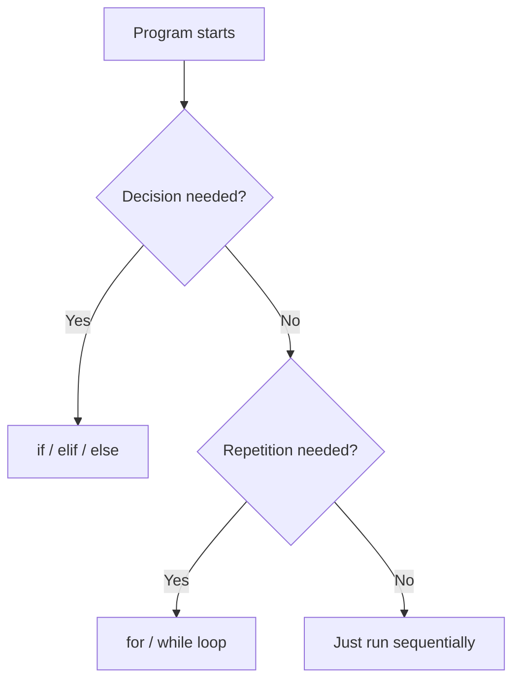
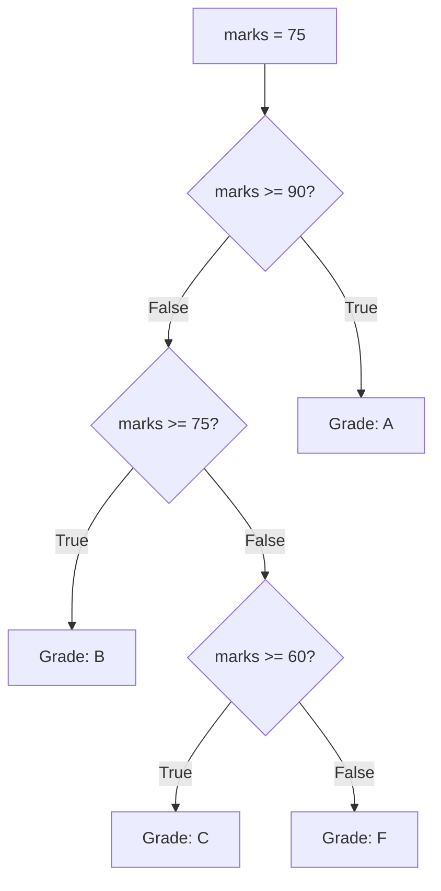
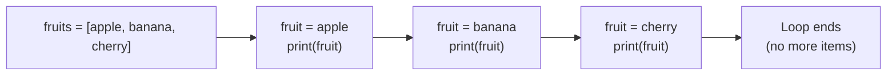
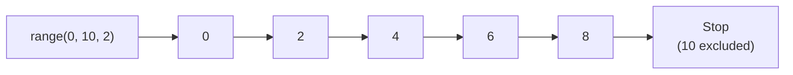
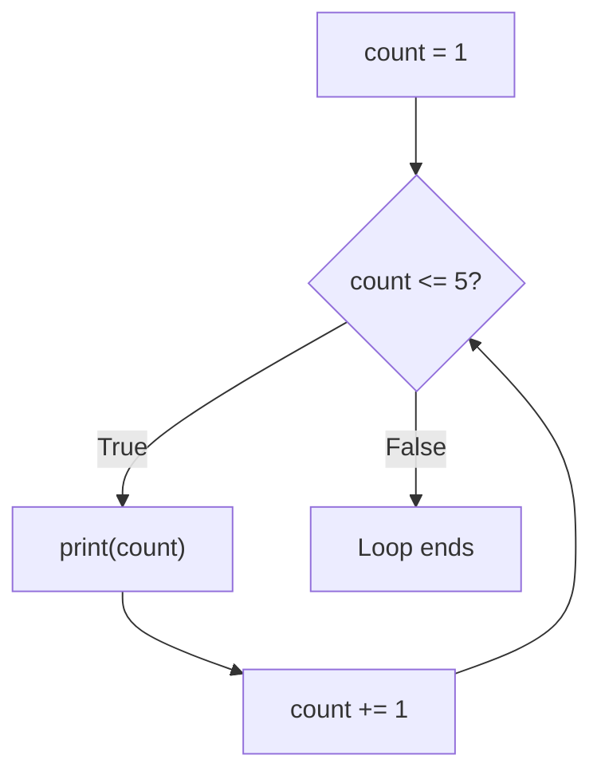
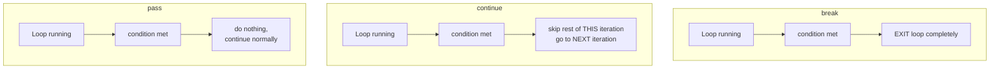
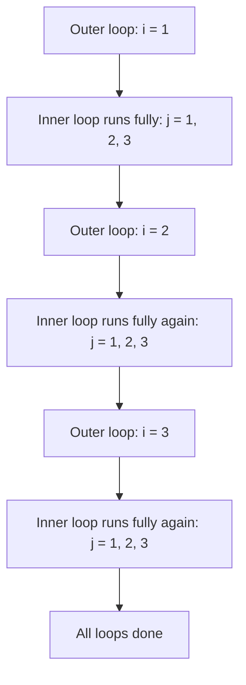
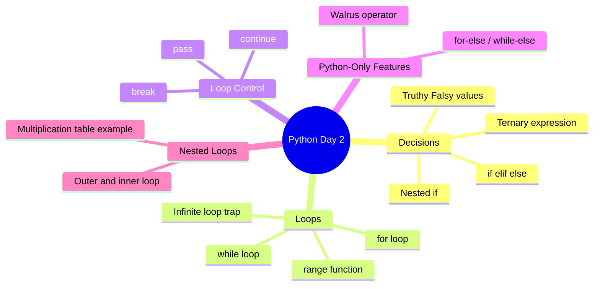

# 📘 DAY 2 — Control Flow & Loops

> **Goal for Today:** Understand how to make your program make *decisions* (if/elif/else) and *repeat actions* (loops). By the end of today, you should be able to write programs that branch based on conditions and iterate over data — the two most fundamental building blocks of all programming logic.

---

## Table of Contents
1. [What is Control Flow?](#1-what-is-control-flow)
2. [Truthy and Falsy Values](#2-truthy-and-falsy-values)
3. [if / elif / else Statements](#3-if--elif--else-statements)
4. [Nested if Statements](#4-nested-if-statements)
5. [Ternary (Conditional) Expressions](#5-ternary-conditional-expressions)
6. [The Walrus Operator `:=`](#6-the-walrus-operator-)
7. [for Loops](#7-for-loops)
8. [The range() Function Deep Dive](#8-the-range-function-deep-dive)
9. [while Loops](#9-while-loops)
10. [break, continue, and pass](#10-break-continue-and-pass)
11. [for-else and while-else (Python-Only Feature)](#11-for-else-and-while-else-python-only-feature)
12. [Nested Loops](#12-nested-loops)
13. [Day 2 Summary Diagram](#13-day-2-summary-diagram)
14. [Practice Questions](#14-practice-questions)

---

## 1. What is Control Flow?

By default, Python runs your code **top to bottom, line by line**, exactly once. **Control flow** is how you change that default behavior — by:
- **Making decisions** — running certain code only *if* a condition is true (`if/elif/else`).
- **Repeating code** — running a block of code multiple times (`for` and `while` loops).

### Real-life analogy
Think about your daily routine:
- "**If** it's raining, take an umbrella. **Else**, wear sunglasses." → this is a **decision**.
- "**While** there are dishes in the sink, keep washing them." → this is a **loop**.

Every program you'll ever write is built from these two ideas, combined in different ways.



---

## 2. Truthy and Falsy Values

Before diving into `if` statements, you need to understand a very **Python-specific concept**: not just `True`/`False`, but *any* value can be evaluated in a "truthy" or "falsy" context.

### What does this mean?
When Python checks a condition (like inside an `if`), it doesn't strictly need a `True`/`False` boolean. It will automatically treat certain values **as if** they were `True` or `False`.

### Values that are considered "Falsy" (treated as False):
```python
False
None
0          # zero (integer)
0.0        # zero (float)
""         # empty string
[]         # empty list
{}         # empty dictionary
()         # empty tuple
set()      # empty set
```

### Everything else is "Truthy" (treated as True):
```python
True
1, -1, 100        # any non-zero number
"hello"           # any non-empty string
[1, 2, 3]         # any non-empty list
" "               # even a string with just a space! (it's not empty)
```

### Why does this matter?
```python
name = ""
if name:
    print("Name provided")
else:
    print("Name is empty")   # This runs! Because "" is falsy
```

**Explanation:** We didn't write `if name != "":` — Python lets us just write `if name:` and it automatically checks whether the string is empty or not. This is considered more "Pythonic" (idiomatic, clean Python style) and you'll see it used constantly in real code and interviews.

**This is a key difference from Java/C++**, where `if` strictly requires a boolean expression. In Python, *any* value can go inside an `if` condition.

---

## 3. if / elif / else Statements

### Basic Syntax
```python
age = 20

if age >= 18:
    print("You are an adult")
```

**Line-by-line breakdown:**
- `if` — the keyword that starts a conditional check.
- `age >= 18` — the **condition** being tested; this evaluates to either `True` or `False`.
- `:` — a colon is **mandatory** at the end of the condition line; it tells Python "an indented block follows."
- The next line is **indented** (4 spaces) — this indented block only runs **if** the condition is `True`.

### Adding else
```python
age = 15

if age >= 18:
    print("You are an adult")
else:
    print("You are a minor")
```
`else` catches **everything that didn't match** the `if` condition. No condition needed for `else` — it's the "otherwise" case.

### Adding elif (else if)
Use `elif` when you have **multiple conditions** to check in sequence.

```python
marks = 75

if marks >= 90:
    print("Grade: A")
elif marks >= 75:
    print("Grade: B")
elif marks >= 60:
    print("Grade: C")
else:
    print("Grade: F")
```

**How this executes step by step:**
1. Python checks `marks >= 90` → `75 >= 90` is `False` → skip this block.
2. Python checks the next `elif`: `marks >= 75` → `75 >= 75` is `True` → runs `print("Grade: B")`.
3. **Once a match is found, Python skips ALL remaining elif/else blocks** — it does NOT continue checking further conditions.
4. Output: `Grade: B`



**Important:** You can have as many `elif` blocks as you want, but only **one** `if` and at most **one** `else`, and the `else` must always come last.

---

## 4. Nested if Statements

You can put an `if` statement **inside** another `if` statement. Each level of nesting requires an additional level of indentation (4 more spaces).

```python
age = 25
has_ticket = True

if age >= 18:
    if has_ticket:
        print("Entry allowed")
    else:
        print("Entry denied - no ticket")
else:
    print("Entry denied - underage")
```

**Explanation:** The inner `if has_ticket:` only gets **checked at all** if the outer condition (`age >= 18`) was `True`. If the outer condition is `False`, Python never even looks at the inner `if` — it jumps straight to the outer `else`.

**Tip for cleaner code:** Instead of deep nesting, you can often combine conditions using `and`:
```python
if age >= 18 and has_ticket:
    print("Entry allowed")
else:
    print("Entry denied")
```
This does the same thing with less nesting — generally preferred style, and interviewers like seeing you simplify logic like this.

---

## 5. Ternary (Conditional) Expressions

This is a **shorthand way** to write a simple if/else in a single line — useful for quick assignments.

### Normal way:
```python
age = 20
if age >= 18:
    status = "Adult"
else:
    status = "Minor"
```

### Ternary way (same result, one line):
```python
age = 20
status = "Adult" if age >= 18 else "Minor"
print(status)   # Adult
```

**How to read this out loud:** *"status equals 'Adult' IF age >= 18, ELSE 'Minor'."* The structure is: `value_if_true if condition else value_if_false`.

**When to use it:** Only for simple, short conditions — assigning a value based on one check. Don't use it for complex logic; it becomes hard to read (nesting ternaries is a common bad practice you should tell your students to avoid).

---

## 6. The Walrus Operator `:=`

Introduced in Python 3.8, this lets you **assign a value to a variable AND use it in the same expression**, in one step. It's called the "walrus operator" because `:=` looks a bit like a walrus's eyes and tusks.

### The problem it solves:
```python
# Without walrus operator - calculating length twice, wasteful
data = [1, 2, 3, 4, 5]
if len(data) > 3:
    print(f"List is long: {len(data)} items")   # len() called again here
```

### With the walrus operator:
```python
data = [1, 2, 3, 4, 5]
if (n := len(data)) > 3:
    print(f"List is long: {n} items")   # reuse 'n', no need to recalculate
```

**Explanation:** `n := len(data)` calculates `len(data)` **and** stores it in `n` **at the same time**, inside the condition itself. Then we can reuse `n` inside the `if` block without recalculating.

**Note:** This is a more advanced/newer feature — you'll see it in real-world code, but you won't need it constantly as a beginner. Good to know for interviews though, since it's a common "what's new in Python" question.

---

## 7. for Loops

A `for` loop is used to **iterate** (go through) a sequence of items, one at a time, running a block of code for each one.

### Real-life analogy
Imagine you have a to-do list, and you go through it item by item, doing each task. That's exactly what a `for` loop does.

### Basic Syntax
```python
fruits = ["apple", "banana", "cherry"]

for fruit in fruits:
    print(fruit)
```

**Output:**
```
apple
banana
cherry
```

**Line-by-line breakdown:**
- `for` — keyword starting the loop.
- `fruit` — a **temporary variable** that Python creates for you; on each pass through the loop, it holds the "current" item from the list.
- `in` — keyword meaning "go through each item in..."
- `fruits` — the list (or any sequence) we're looping over.
- `:` — colon, again signaling "indented block follows."
- The indented line runs **once for every item** in the list.



### Looping over a string
Since a string is just a sequence of characters, you can loop over it too:
```python
for letter in "Python":
    print(letter)
# Output: P, y, t, h, o, n (each on its own line)
```

### Looping with index using enumerate()
Sometimes you want both the **item** and its **position (index)**. Use `enumerate()`:
```python
fruits = ["apple", "banana", "cherry"]

for index, fruit in enumerate(fruits):
    print(index, fruit)
# Output:
# 0 apple
# 1 banana
# 2 cherry
```
**Explanation:** `enumerate(fruits)` wraps the list so that each item comes paired with its index number (starting from 0). We "unpack" this pair into two variables, `index` and `fruit`, at the same time.

---

## 8. The range() Function Deep Dive

Often, you don't want to loop over an existing list — you just want to repeat something a certain **number of times**, or generate a sequence of numbers. That's what `range()` is for.

### range(stop)
```python
for i in range(5):
    print(i)
# Output: 0, 1, 2, 3, 4   (NOTE: starts at 0, stops BEFORE 5, so 5 numbers total)
```
**Key gotcha for beginners:** `range(5)` gives you `0` through `4` — **not** `1` through `5`. It always stops **one before** the number you give it. This trips up almost every beginner at least once.

### range(start, stop)
```python
for i in range(2, 6):
    print(i)
# Output: 2, 3, 4, 5
```

### range(start, stop, step)
```python
for i in range(0, 10, 2):
    print(i)
# Output: 0, 2, 4, 6, 8   (step of 2 means "skip by 2 each time")
```

### Counting backwards
```python
for i in range(10, 0, -1):
    print(i)
# Output: 10, 9, 8, 7, 6, 5, 4, 3, 2, 1
```



**Important internal detail (great for interviews):** `range()` doesn't actually create a full list of numbers in memory all at once. It's a special "lazy" object that generates each number **only when needed**, one at a time. This makes it extremely memory-efficient, even for something like `range(10000000)`. (This concept — generating values on demand — is called **lazy evaluation**, and we'll revisit it properly with **generators** on Day 7.)

---

## 9. while Loops

A `while` loop repeats a block of code **as long as a condition remains True**. Unlike `for` (which is for a known sequence/count), `while` is used when you don't know in advance exactly how many times you'll need to loop.

### Real-life analogy
"**While** you are hungry, keep eating." You don't know exactly how many bites that'll take — you just keep going until the condition (hunger) becomes false.

### Basic Syntax
```python
count = 1

while count <= 5:
    print(count)
    count += 1   # IMPORTANT: must update the variable, or loop runs forever!
```

**Output:**
```
1
2
3
4
5
```

**Line-by-line breakdown:**
1. `count = 1` — set up a starting value.
2. `while count <= 5:` — Python checks: is `count <= 5`? If `True`, enter the loop body.
3. `print(count)` — prints the current value.
4. `count += 1` — increases `count` by 1 (shorthand for `count = count + 1`).
5. Python goes back to step 2 and re-checks the condition. This repeats until `count` becomes `6`, at which point `6 <= 5` is `False`, and the loop stops.

### ⚠️ The Infinite Loop Trap
```python
count = 1
while count <= 5:
    print(count)
    # forgot to increase count!
```
This will run **forever** (or until you manually stop the program with `Ctrl + C`), because `count` never changes, so the condition `count <= 5` is always `True`. **Always double-check that your `while` loop's condition will eventually become False.**



### for vs while — when to use which?
| Use `for` when... | Use `while` when... |
|---|---|
| You know the number of iterations (looping over a list, or a fixed range) | You don't know how many times you'll loop — you're waiting for some condition to change |
| Example: "print every item in this list" | Example: "keep asking the user for input until they type 'quit'" |

---

## 10. break, continue, and pass

These are three special keywords that let you control loop behavior more precisely.

### break — exits the loop immediately
```python
for num in range(1, 10):
    if num == 5:
        break   # stop the loop entirely as soon as num is 5
    print(num)
# Output: 1, 2, 3, 4   (stops before printing 5, loop ends completely)
```
**Real-life analogy:** Searching for your keys in a bag — the moment you find them, you **stop searching**. That's `break`.

### continue — skips just the current iteration, loop keeps going
```python
for num in range(1, 6):
    if num == 3:
        continue   # skip printing 3, but continue the loop for remaining numbers
    print(num)
# Output: 1, 2, 4, 5   (3 is skipped, but loop continues to 4 and 5)
```
**Real-life analogy:** Going through a playlist and skipping just one song you don't like, then continuing to the next song.

### pass — does absolutely nothing (a placeholder)
```python
for num in range(1, 6):
    if num == 3:
        pass   # placeholder - do nothing, plan to add logic here later
    print(num)
# Output: 1, 2, 3, 4, 5   (pass doesn't skip or stop anything — it's a no-op)
```
**When is `pass` used?** When Python's syntax *requires* a code block (e.g., after a colon), but you don't have any logic to put there yet. Without `pass`, Python would throw a syntax error for an "empty" block. Common while writing the skeleton/structure of a program before filling in details.



---

## 11. for-else and while-else (Python-Only Feature)

This is a feature that's **unique to Python** — Java, C++, and most other languages don't have this, so it often confuses experienced programmers moving to Python, and is a favorite interview question.

### The Rule
The `else` block attached to a loop runs **only if the loop completed fully WITHOUT hitting a `break`**.

Think of it as: *"else = if the loop finished naturally."*

### Example without break (else runs)
```python
for i in range(1, 4):
    print(i)
else:
    print("Loop finished completely!")

# Output:
# 1
# 2
# 3
# Loop finished completely!
```

### Example with break (else is SKIPPED)
```python
for i in range(1, 10):
    if i == 3:
        break
    print(i)
else:
    print("Loop finished completely!")

# Output:
# 1
# 2
# (else block does NOT run, because we exited early via break)
```

### Practical use case: Searching for something
```python
numbers = [2, 4, 6, 8, 10]
search_for = 5

for num in numbers:
    if num == search_for:
        print("Found it!")
        break
else:
    print("Number not found in the list")

# Output: Number not found in the list
# (because the loop completed fully without breaking - 5 isn't in the list)
```

**Why is this useful?** It's a clean way to write "search and report if not found" logic, without needing an extra flag variable like `found = False` that you'd typically need in other languages.

`while-else` works exactly the same way — the `else` runs only if the `while` loop's condition became `False` naturally, without a `break`.

---

## 12. Nested Loops

Just like `if` statements, loops can be **nested inside each other** — a loop inside another loop. The inner loop completes **all** of its iterations for **each single iteration** of the outer loop.

### Example: Multiplication Table
```python
for i in range(1, 4):          # outer loop: 1, 2, 3
    for j in range(1, 4):      # inner loop: 1, 2, 3 (runs fully, for EACH value of i)
        print(f"{i} x {j} = {i*j}")
    print("---")
```

**Output:**
```
1 x 1 = 1
1 x 2 = 2
1 x 3 = 3
---
2 x 1 = 2
2 x 2 = 4
2 x 3 = 6
---
3 x 1 = 3
3 x 2 = 6
3 x 3 = 9
---
```

**Step-by-step what's happening:**
1. Outer loop starts: `i = 1`.
2. Inner loop runs **completely** for `i = 1`: `j` goes `1, 2, 3`, printing 3 lines.
3. `"---"` prints once.
4. Outer loop moves to `i = 2`. Inner loop runs completely again: `j` goes `1, 2, 3` again.
5. This repeats until the outer loop finishes (`i = 3` is the last value).



**Common use cases for nested loops:** printing patterns/shapes, working with grids or 2D data (like a tic-tac-toe board), comparing every item in one list against every item in another.

---

## 13. Day 2 Summary Diagram



---

## 14. Practice Questions

### Conceptual Questions (for interview prep)
1. What's the difference between `break` and `continue`?
2. When does the `else` block of a `for` loop execute, and when is it skipped?
3. Why is `range(5)` equal to `0,1,2,3,4` and not `1,2,3,4,5`?
4. What are "truthy" and "falsy" values in Python? Give 3 examples of each.
5. What's the danger with `while` loops that `for` loops don't usually have?
6. What does the walrus operator `:=` do, and why is it useful?
7. If you have 3 `elif` blocks and the first one matches, what happens to the rest?

### Coding Exercises
1. Write a program to check if a number is **positive, negative, or zero** using if/elif/else.
2. Write a program that prints all **even numbers from 1 to 50** using a `for` loop and `range()`.
3. Write a program using a `while` loop that keeps asking the user to enter a number, and stops when they enter `0`.
4. Write a program to print the following pattern using nested loops:
   ```
   *
   * *
   * * *
   * * * *
   ```
5. Write a program that loops through numbers 1 to 20, and uses `continue` to skip multiples of 3, and `break` if the number exceeds 15.
6. Using `for-else`, write a program that checks whether a given number is **prime** (Hint: loop from 2 to number-1, checking divisibility; if none divide evenly, it's prime).

---

## ✅ Day 2 Checklist — Can you confidently...
- [ ] Write an if/elif/else chain and explain the order Python checks conditions?
- [ ] Explain truthy vs falsy values with examples?
- [ ] Write a ternary expression?
- [ ] Write a `for` loop over a list and over a `range()`?
- [ ] Explain why `range(5)` doesn't include 5?
- [ ] Write a `while` loop and avoid creating an infinite loop?
- [ ] Explain the difference between `break`, `continue`, and `pass`?
- [ ] Explain what makes `for-else` / `while-else` special (and why other languages don't have it)?
- [ ] Write and trace through a nested loop by hand?

If you can check all of these confidently, **you're ready for Day 3: Data Structures Part 1 — Strings & Lists.**

---

*Next up (Day 3): String methods & slicing in depth, Lists (creation, indexing, slicing, methods), List comprehensions, and the crucial concept of mutable vs immutable data.*
