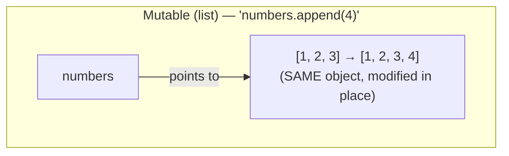
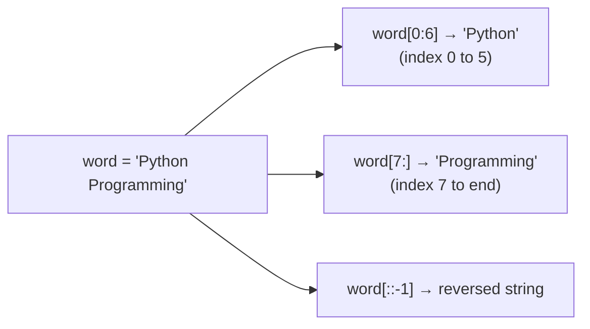
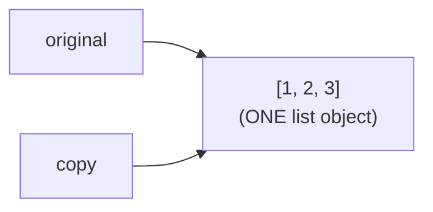
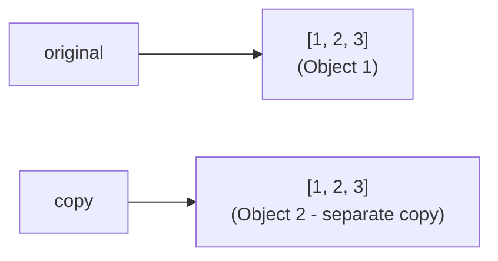
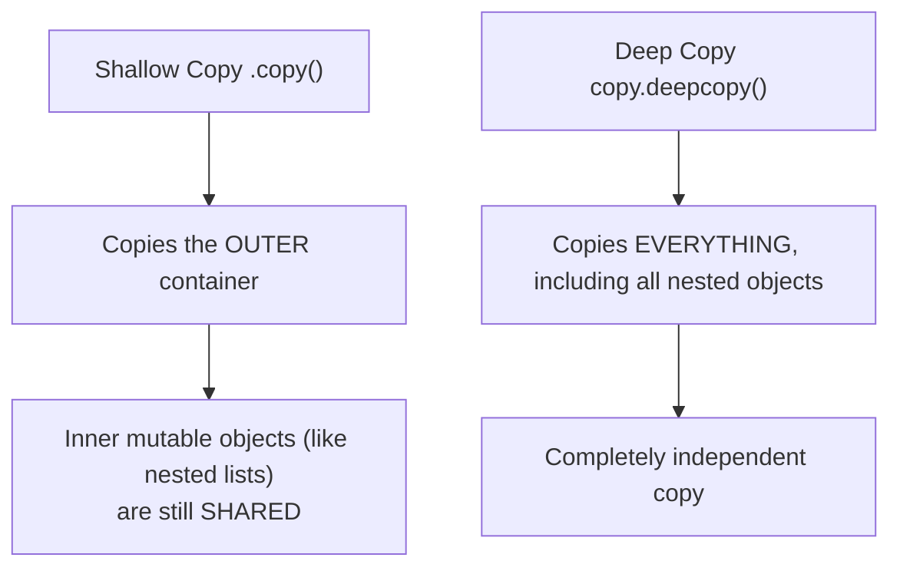
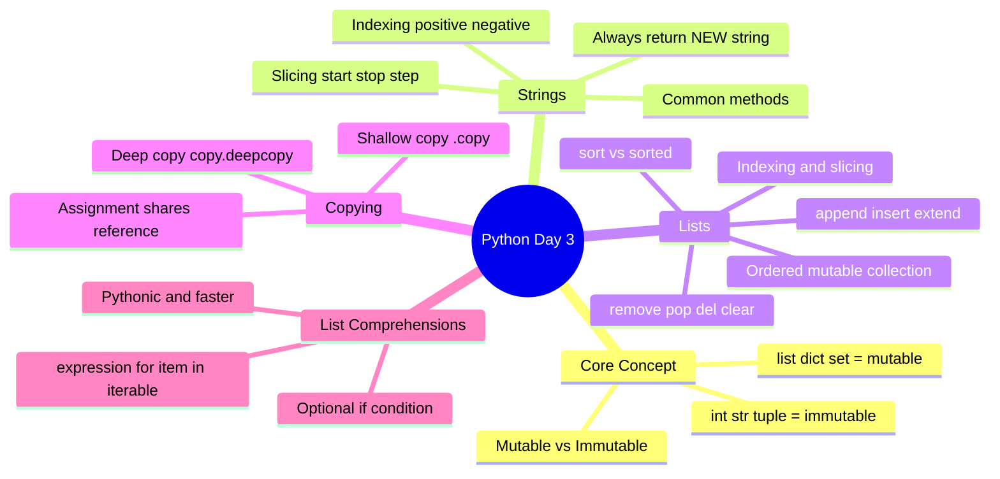

# 📘 DAY 3 — Data Structures Part 1: Strings & Lists

> **Goal for Today:** Master strings (text handling) and lists (Python's most-used data structure) in depth — including indexing, slicing, methods, and list comprehensions. Also fully understand the **mutable vs immutable** concept, which is one of the most important (and most-asked-in-interviews) ideas in Python.

---

## Table of Contents
1. [What is a Data Structure?](#1-what-is-a-data-structure)
2. [Mutable vs Immutable — The Core Concept](#2-mutable-vs-immutable--the-core-concept)
3. [Strings Deep Dive](#3-strings-deep-dive)
4. [String Indexing](#4-string-indexing)
5. [String Slicing](#5-string-slicing)
6. [Common String Methods](#6-common-string-methods)
7. [Lists — Introduction](#7-lists--introduction)
8. [List Indexing & Slicing](#8-list-indexing--slicing)
9. [Common List Methods](#9-common-list-methods)
10. [Copying Lists (The Right Way)](#10-copying-lists-the-right-way)
11. [List Comprehensions](#11-list-comprehensions)
12. [Day 3 Summary Diagram](#12-day-3-summary-diagram)
13. [Practice Questions](#13-practice-questions)

---

## 1. What is a Data Structure?

A **data structure** is simply a way of **organizing and storing multiple pieces of data together**, so you can work with them efficiently.

So far (Day 1-2), you've only stored **one value at a time** in a variable:
```python
name = "Riya"
age = 22
```

But real programs need to handle **collections** of data — a list of students, a set of unique tags, a dictionary of prices. That's what data structures are for.

Today we cover **Strings** (which you've already met, but we go deeper) and **Lists** (the most commonly used Python data structure). Tomorrow (Day 4) we cover Tuples, Sets, and Dictionaries.

---

## 2. Mutable vs Immutable — The Core Concept

This is **the single most important concept** for today, and one of the top interview topics in Python. Understand this deeply before moving forward.

### Definitions
- **Mutable** = **can be changed** after creation (you can modify it in place).
- **Immutable** = **cannot be changed** after creation (any "change" actually creates a brand new object).

### Quick Reference Table
| Data Type | Mutable or Immutable? |
|---|---|
| `int`, `float`, `bool` | Immutable |
| `str` (string) | Immutable |
| `tuple` | Immutable |
| `list` | **Mutable** |
| `dict` | **Mutable** |
| `set` | **Mutable** |

### Why does this matter? A practical demonstration.

Recall from Day 1: a variable is like a **label pointing to an object in memory**. Let's see what happens when we "change" an immutable object (a string) vs a mutable object (a list).

**Immutable example (string):**
```python
name = "John"
print(id(name))    # id() shows the memory address of the object

name = name + " Smith"
print(id(name))    # this will be a DIFFERENT address!
```
**What happened:** Python did NOT modify `"John"` in memory. Instead, it created a brand new string object `"John Smith"` somewhere else in memory, and just moved the `name` label to point to this new object. The original `"John"` object still exists (briefly) until it's cleaned up.

**Mutable example (list):**
```python
numbers = [1, 2, 3]
print(id(numbers))   # memory address

numbers.append(4)
print(id(numbers))   # SAME address!
```
**What happened:** Python modified the **same** list object directly in memory — no new object was created. The list "grew" in place.

```mermaid
flowchart TB
    subgraph Immutable["Immutable (str) — 'name = name + \" Smith\"'"]
    direction LR
    L1["name"] -->|was pointing to| S1["'John'<br/>(old object)"]
    L2["name"] -->|now points to| S2["'John Smith'<br/>(brand NEW object)"]
    end
```



### Why this matters in real programs (a classic bug + classic interview question)
```python
def add_item(item, my_list=[]):    # ⚠️ DANGER: mutable default argument
    my_list.append(item)
    return my_list

print(add_item("apple"))    # ['apple']
print(add_item("banana"))   # ['apple', 'banana']   ⚠️ Unexpected! We wanted just ['banana']
```
**Why this happens:** Default argument values in Python functions are created **only once**, when the function is defined — not every time it's called. Since lists are mutable, the *same* list object keeps getting reused and modified across calls. This is one of Python's most famous "gotchas" and a favorite interview question. (We'll cover functions properly on Day 5 — just remember this concept for now.)

**Key takeaway:** Because lists/dicts/sets are mutable, if you assign `list_b = list_a`, both variables point to the **same** list — changing one changes the other! We'll see this in detail in the [Copying Lists](#10-copying-lists-the-right-way) section.

---

## 3. Strings Deep Dive

A **string** is an ordered sequence of characters. You already know how to create one — now let's explore what you can *do* with it.

### Strings are Sequences
Because a string is a sequence, each character has a **position number**, called an **index**, starting from **0** (not 1!).

```
 P    y    t    h    o    n
 0    1    2    3    4    5   ← positive indices (left to right)
-6   -5   -4   -3   -2   -1   ← negative indices (right to left)
```

This dual-direction indexing (positive AND negative) is a Python-specific convenience — negative indices let you count from the **end** without knowing the string's length.

---

## 4. String Indexing

```python
word = "Python"

print(word[0])    # P   (first character)
print(word[5])    # n   (last character - 6 letters, indices 0 to 5)
print(word[-1])   # n   (last character, using negative index)
print(word[-6])   # P   (first character, using negative index)
```

**Explanation:** `word[index]` retrieves the single character at that position. `word[-1]` is a very common, idiomatic way to get the "last item" without needing to know the string's length.

**Error to watch for:** `word[6]` would cause an `IndexError: string index out of range`, because valid indices only go up to `5` (since there are 6 characters, indexed 0-5).

---

## 5. String Slicing

**Slicing** lets you extract a **sub-portion** (a "slice") of a string, not just a single character. The syntax is:

```python
string[start:stop:step]
```

- `start` — index to begin from (inclusive — this index IS included)
- `stop` — index to stop at (**exclusive** — this index is NOT included, same rule as `range()` from Day 2!)
- `step` — how many characters to jump each time (optional, default is 1)

```python
word = "Python Programming"

print(word[0:6])     # "Python"        (characters at index 0,1,2,3,4,5)
print(word[7:])      # "Programming"   (from index 7 to the end - leaving 'stop' blank means "go to the end")
print(word[:6])      # "Python"        (from the start to index 5 - leaving 'start' blank means "from the beginning")
print(word[:])       # "Python Programming"  (the entire string - a full copy)
print(word[::2])     # "Pto rgamn"     (every 2nd character)
print(word[::-1])    # "gnimmargorP nohtyP"  (REVERSES the string! step of -1 means go backwards)
```

**Explanation of `word[::-1]` (a very popular interview trick):** When `step` is negative, Python reads the string **backwards**. Since `start` and `stop` are left blank, it means "from the very end to the very beginning" — the result is the entire string, reversed. This is the fastest, most Pythonic way to reverse a string.



---

## 6. Common String Methods

A **method** is a function that "belongs to" a specific data type and is called using dot notation: `variable.method()`. Since strings are immutable, **every string method returns a NEW string** — it never changes the original.

```python
text = "  Hello World  "

print(text.upper())        # "  HELLO WORLD  "        (converts to uppercase)
print(text.lower())        # "  hello world  "        (converts to lowercase)
print(text.strip())        # "Hello World"             (removes leading/trailing whitespace)
print(text.replace("World", "Python"))  # "  Hello Python  "  (replaces a substring)
print(text.split())        # ['Hello', 'World']        (splits into a LIST of words, by whitespace)

name = "Python"
print(len(name))           # 6                          (length of the string)
print(name.startswith("Py"))  # True
print(name.endswith("on"))    # True
print(name.find("th"))        # 2   (index where "th" FIRST starts; returns -1 if not found)
print("Py" in name)           # True  (checks if substring exists at all)

# Joining a list of strings into one string
words = ["Learn", "Python", "Daily"]
sentence = " ".join(words)
print(sentence)   # "Learn Python Daily"
```

**Important:** `text.upper()` does **NOT** change `text` itself (remember — strings are immutable!). If you want to keep the change, you must reassign it: `text = text.upper()`.

### Quick Reference Table
| Method | Purpose |
|---|---|
| `.upper()` / `.lower()` | Change case |
| `.strip()` | Remove leading/trailing whitespace |
| `.replace(old, new)` | Replace substring |
| `.split(separator)` | Split string into a list |
| `.join(list)` | Combine list into a string |
| `.find(substring)` | Get index of substring (or -1) |
| `.startswith()` / `.endswith()` | Check beginning/end |
| `len(string)` | Get length |

---

## 7. Lists — Introduction

A **list** is Python's go-to data structure for storing an **ordered, changeable (mutable) collection of items**. Lists can hold items of *any* data type — even a mix of types in the same list.

### Real-life analogy
Think of a list like a **shopping list** written on paper — you can add items, remove items, cross things out, reorder them, and check off items — all without needing a fresh sheet of paper each time. Compare this to a string, which is more like a printed receipt — fixed, unchangeable.

### Creating a List
```python
fruits = ["apple", "banana", "cherry"]
numbers = [1, 2, 3, 4, 5]
mixed = [1, "hello", 3.14, True]     # lists can mix data types!
empty_list = []
```

### Internal Detail (Interview-relevant)
Internally, a Python list is implemented as a **dynamic array** — meaning it automatically resizes itself in memory as you add or remove items, so you don't have to manage its size manually (unlike a fixed-size array in C/Java).

---

## 8. List Indexing & Slicing

Good news — lists use the **exact same indexing and slicing rules as strings** (since both are "sequence" types in Python)!

```python
fruits = ["apple", "banana", "cherry", "date", "elderberry"]

print(fruits[0])       # "apple"        (first item)
print(fruits[-1])      # "elderberry"   (last item)
print(fruits[1:3])     # ['banana', 'cherry']   (index 1 up to, not including, 3)
print(fruits[:2])      # ['apple', 'banana']
print(fruits[::-1])    # reversed list
```

### KEY DIFFERENCE from strings: Lists can be modified via indexing!
```python
fruits[1] = "blueberry"   # ✅ Works! Lists are mutable.
print(fruits)   # ['apple', 'blueberry', 'cherry', 'date', 'elderberry']
```
Remember, this would **fail** for a string (`name[0] = "K"` gives an error) — this is the practical, hands-on difference between mutable and immutable that we discussed earlier.

---

## 9. Common List Methods

```python
fruits = ["apple", "banana"]

# Adding items
fruits.append("cherry")          # adds ONE item to the END
print(fruits)   # ['apple', 'banana', 'cherry']

fruits.insert(1, "mango")        # inserts "mango" AT index 1, shifting others right
print(fruits)   # ['apple', 'mango', 'banana', 'cherry']

fruits.extend(["fig", "grape"])  # adds MULTIPLE items from another list, one by one
print(fruits)   # ['apple', 'mango', 'banana', 'cherry', 'fig', 'grape']

# Removing items
fruits.remove("mango")           # removes the FIRST matching item by VALUE
print(fruits)   # ['apple', 'banana', 'cherry', 'fig', 'grape']

popped_item = fruits.pop()       # removes and RETURNS the LAST item (or a given index)
print(popped_item)   # 'grape'
print(fruits)         # ['apple', 'banana', 'cherry', 'fig']

fruits.pop(0)                    # removes item AT index 0
print(fruits)   # ['banana', 'cherry', 'fig']

del fruits[0]                    # another way to delete by index (no return value)
print(fruits)   # ['cherry', 'fig']

fruits.clear()                   # removes ALL items
print(fruits)   # []

# Other useful methods
numbers = [5, 3, 8, 1, 9]
numbers.sort()                   # sorts the list IN PLACE (modifies original, ascending order)
print(numbers)   # [1, 3, 5, 8, 9]

numbers.sort(reverse=True)       # sort descending
print(numbers)   # [9, 8, 5, 3, 1]

numbers.reverse()                # reverses the current order (not sorting, just flipping)
print(numbers)   # [1, 3, 5, 8, 9]

print(len(numbers))              # 5    (number of items)
print(numbers.count(5))          # 1    (how many times '5' appears)
print(numbers.index(8))          # 3    (index of first occurrence of '8')
print(3 in numbers)              # True (membership check)
```

### `append()` vs `extend()` — A Common Interview Trap!
```python
a = [1, 2, 3]
a.append([4, 5])
print(a)   # [1, 2, 3, [4, 5]]   ← adds the WHOLE list as ONE single item (nested list!)

b = [1, 2, 3]
b.extend([4, 5])
print(b)   # [1, 2, 3, 4, 5]     ← adds EACH item individually
```
**Explanation:** `append()` always adds exactly **one** item, no matter what you give it (even if that item is itself a list). `extend()` takes another iterable and adds **each of its elements** individually to the end.

### sort() vs sorted() — Another Common Interview Trap!
```python
numbers = [5, 3, 8, 1]

numbers.sort()          # modifies the ORIGINAL list in place; returns None
print(numbers)          # [1, 3, 5, 8]

numbers2 = [5, 3, 8, 1]
result = sorted(numbers2)   # returns a NEW sorted list; original stays untouched
print(result)            # [1, 3, 5, 8]
print(numbers2)          # [5, 3, 8, 1]   ← unchanged!
```
**Key difference:** `.sort()` is a **list method** — it changes the list itself and gives back `None`. `sorted()` is a **built-in function** — it works on any iterable and always returns a **brand new** sorted list, leaving the original untouched. Interviewers love asking "what's the difference?" — now you know.

---

## 10. Copying Lists (The Right Way)

This directly builds on the mutable vs immutable concept from earlier, and is a **very common source of bugs** for beginners.

### The WRONG way (creates a shared reference, not a copy!)
```python
original = [1, 2, 3]
copy = original          # ⚠️ this does NOT create a new list!

copy.append(4)
print(original)    # [1, 2, 3, 4]   ← original changed too! Unexpected!
print(copy)         # [1, 2, 3, 4]
```
**Why this happens:** Remember, variables are just labels pointing to objects. `copy = original` just makes `copy` point to the **exact same list object** as `original` — they're two names for the same thing. Modifying one modifies "the only list that exists."



### The RIGHT way — Shallow Copy
```python
original = [1, 2, 3]
copy = original.copy()      # OR: copy = original[:]      OR: copy = list(original)

copy.append(4)
print(original)   # [1, 2, 3]        ← unaffected!
print(copy)        # [1, 2, 3, 4]
```
Now `copy` is a genuinely **separate list object** in memory, so changes to one don't affect the other.



### The catch: Shallow Copy vs Deep Copy (important interview topic!)
A `.copy()` is called a **shallow copy** — it copies the *outer* list, but if the list contains other mutable objects (like a nested list), those inner objects are **still shared**!

```python
original = [[1, 2], [3, 4]]
shallow = original.copy()

shallow[0].append(99)
print(original)   # [[1, 2, 99], [3, 4]]  ← the INNER list was still shared, so it changed too!
```

To fully separate **everything**, including nested structures, use a **deep copy**:
```python
import copy   # this is a built-in Python module (a pre-written set of tools)

original = [[1, 2], [3, 4]]
deep = copy.deepcopy(original)

deep[0].append(99)
print(original)   # [[1, 2], [3, 4]]   ← completely unaffected now!
print(deep)         # [[1, 2, 99], [3, 4]]
```
**About the `copy` module:** This is part of Python's **Standard Library** — a collection of modules that come pre-installed with Python (no need to install anything extra). We import it using `import copy` to access its `deepcopy()` function, which recursively copies every nested object, not just the outer layer.



---

## 11. List Comprehensions

This is one of Python's **most loved and most "Pythonic"** features — a concise way to create a new list based on an existing iterable, in a single line.

### The problem it solves
Normal (verbose) way to create a list of squares:
```python
squares = []
for num in range(1, 6):
    squares.append(num ** 2)
print(squares)   # [1, 4, 9, 16, 25]
```

### List comprehension way (same result, one line!)
```python
squares = [num ** 2 for num in range(1, 6)]
print(squares)   # [1, 4, 9, 16, 25]
```

**How to read this out loud:** *"Give me `num ** 2`, FOR each `num` IN `range(1, 6)`."* The structure is:
```
[expression for item in iterable]
```

### Adding a condition (filtering)
```python
even_squares = [num ** 2 for num in range(1, 11) if num % 2 == 0]
print(even_squares)   # [4, 16, 36, 64, 100]
```
**How to read this:** *"Give me `num ** 2`, FOR each `num` IN `range(1,11)`, but ONLY IF `num` is even."*

This is equivalent to the longer version:
```python
even_squares = []
for num in range(1, 11):
    if num % 2 == 0:
        even_squares.append(num ** 2)
```

### More examples
```python
# Convert a list of strings to uppercase
words = ["hello", "world"]
upper_words = [word.upper() for word in words]
print(upper_words)   # ['HELLO', 'WORLD']

# Extract vowels from a word
word = "programming"
vowels = [letter for letter in word if letter in "aeiou"]
print(vowels)   # ['o', 'a', 'i']
```

**Why are list comprehensions preferred (Pythonic)?**
- More concise and readable (once you're used to the syntax).
- Generally **faster** than an equivalent `for` loop with `.append()`, due to internal optimizations in Python.
- Extremely common in real-world Python code and in interviews — being fluent in these signals strong Python skills.

**When NOT to use them:** If the logic becomes too complex (e.g., multiple nested conditions), a regular `for` loop is more readable. Don't force everything into a one-liner just to look clever — readability matters more.

---

## 12. Day 3 Summary Diagram



---

## 13. Practice Questions

### Conceptual Questions (for interview prep)
1. What's the difference between mutable and immutable data types? Give 2 examples of each.
2. Why does `list_b = list_a` NOT create a true copy of a list?
3. What's the difference between a shallow copy and a deep copy?
4. What's the difference between `.append()` and `.extend()`?
5. What's the difference between `.sort()` and `sorted()`?
6. Why does `word[::-1]` reverse a string?
7. What will `"Python"[10]` do, and why?
8. Explain what a list comprehension does, using your own example.

### Coding Exercises
1. Given the string `"  Learning Python is Fun  "`, remove the extra spaces and convert it to uppercase.
2. Write a program to check if a given string is a **palindrome** (reads the same forwards and backwards) — e.g., "madam". (Hint: use slicing!)
3. Given a list `[10, 20, 30, 40, 50]`, write code to reverse it **without using `.reverse()`** (use slicing instead).
4. Write a list comprehension to generate a list of cubes of numbers from 1 to 10.
5. Write a list comprehension that extracts all words longer than 4 letters from this list: `["cat", "elephant", "dog", "giraffe", "ant"]`.
6. Demonstrate with code (and explain) the difference between a shallow copy and a deep copy using a nested list.

---

## ✅ Day 3 Checklist — Can you confidently...
- [ ] Explain mutable vs immutable with a memory-level example?
- [ ] Index and slice both strings and lists confidently (including negative indices)?
- [ ] List at least 6 string methods and what they do?
- [ ] List at least 8 list methods and what they do?
- [ ] Explain the difference between `append()` and `extend()`?
- [ ] Explain the difference between `.sort()` and `sorted()`?
- [ ] Explain why `copy = original` is dangerous, and how to properly copy a list?
- [ ] Explain the difference between a shallow copy and a deep copy?
- [ ] Write a list comprehension with and without a filtering condition?

If you can check all of these confidently, **you're ready for Day 4: Data Structures Part 2 — Tuples, Sets & Dictionaries.**

---

*Next up (Day 4): Tuples (immutability & packing/unpacking), Sets (uniqueness & set operations), Dictionaries (key-value pairs & dict comprehensions), and how to decide which data structure to use in real scenarios.*
