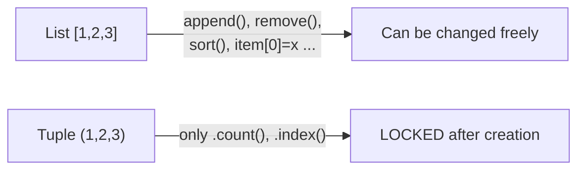
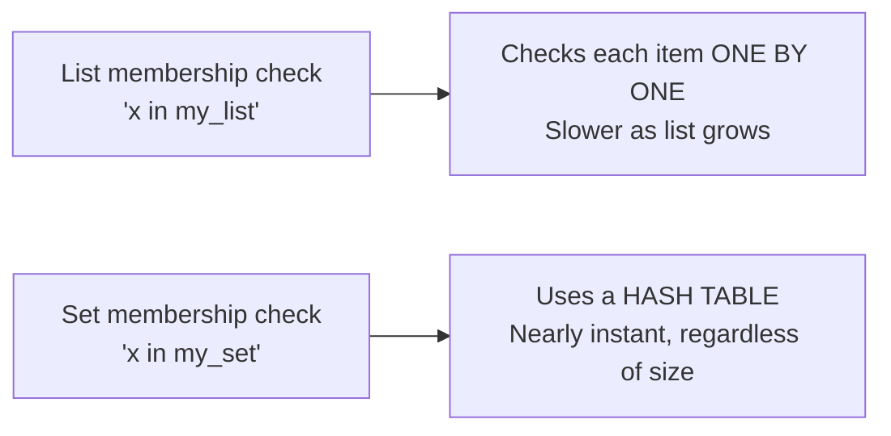
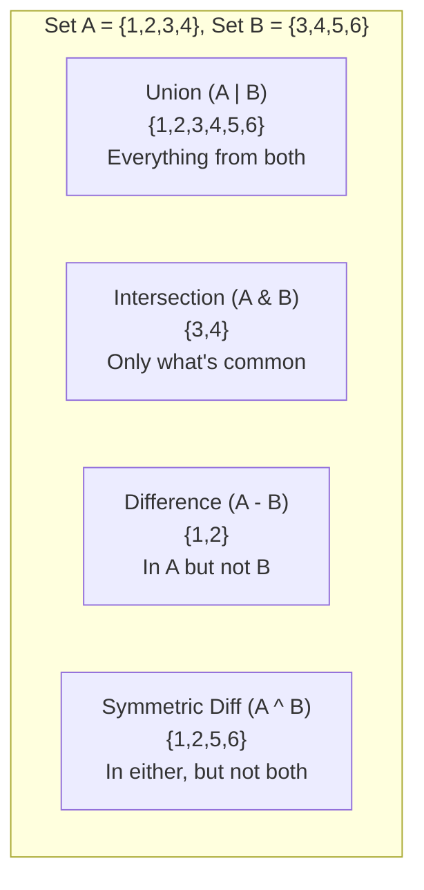
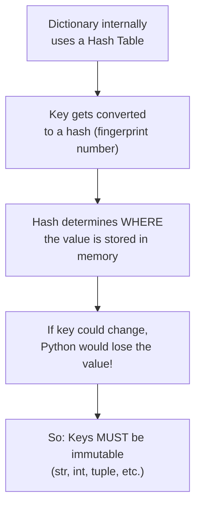
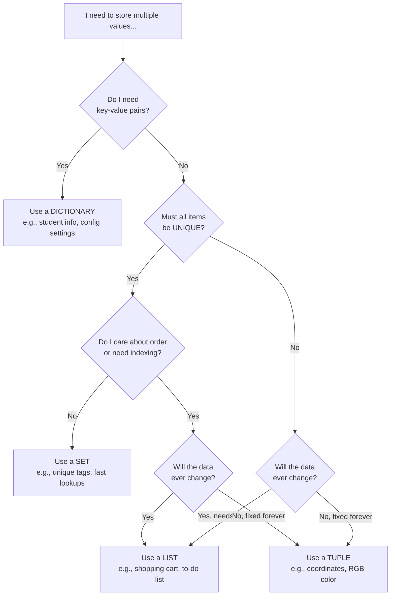
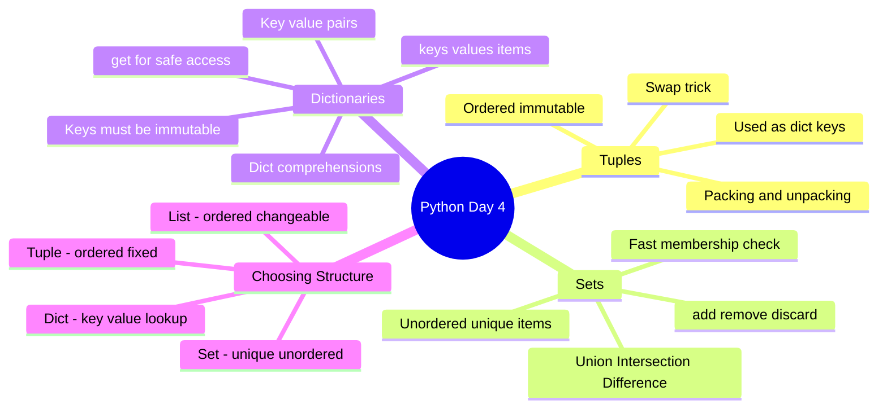

# 📘 DAY 4 — Data Structures Part 2: Tuples, Sets & Dictionaries

> **Goal for Today:** Complete your understanding of Python's core data structures by learning Tuples (immutable sequences), Sets (unique collections), and Dictionaries (key-value pairs). By the end, you should be able to confidently decide **which data structure to use** for any given real-world scenario — a skill interviewers specifically test for.

---

## Table of Contents
1. [Recap: Four Core Data Structures](#1-recap-four-core-data-structures)
2. [Tuples](#2-tuples)
3. [Tuple Packing & Unpacking](#3-tuple-packing--unpacking)
4. [Why Do Tuples Even Exist? (When to Use Them)](#4-why-do-tuples-even-exist-when-to-use-them)
5. [Sets](#5-sets)
6. [Set Operations (Math-Style)](#6-set-operations-math-style)
7. [Dictionaries](#7-dictionaries)
8. [Dictionary Methods](#8-dictionary-methods)
9. [Looping Through Dictionaries](#9-looping-through-dictionaries)
10. [Dictionary Comprehensions](#10-dictionary-comprehensions)
11. [Choosing the Right Data Structure](#11-choosing-the-right-data-structure)
12. [Day 4 Summary Diagram](#12-day-4-summary-diagram)
13. [Practice Questions](#13-practice-questions)

---

## 1. Recap: Four Core Data Structures

By the end of today, you'll know all four of Python's built-in collection types:

| Structure | Ordered? | Mutable? | Allows Duplicates? | Syntax |
|---|---|---|---|---|
| **List** (Day 3) | ✅ Yes | ✅ Yes | ✅ Yes | `[1, 2, 3]` |
| **Tuple** | ✅ Yes | ❌ No | ✅ Yes | `(1, 2, 3)` |
| **Set** | ❌ No* | ✅ Yes | ❌ No | `{1, 2, 3}` |
| **Dictionary** | ✅ Yes (insertion order, since Python 3.7) | ✅ Yes | Keys: ❌ No, Values: ✅ Yes | `{"key": "value"}` |

*(Sets don't maintain a guaranteed order the way lists/tuples do — more on this below.)*

Understanding these differences at a glance is exactly what separates someone who's memorized syntax from someone who **understands** Python — which matters both for interviews and for teaching others.

---

## 2. Tuples

A **tuple** is an **ordered, immutable** collection — basically, "a list that can never be changed after creation."

### Creating a Tuple
```python
coordinates = (10, 20)
colors = ("red", "green", "blue")
single_item_tuple = (5,)     # ⚠️ NOTE the comma! Without it, Python treats (5) as just the number 5, not a tuple!
empty_tuple = ()
```

**Beginner trap:** `(5)` is just `5` wrapped in parentheses (an integer, not a tuple). You **must** include a trailing comma — `(5,)` — to tell Python "this is a one-item tuple." This is a genuinely common interview "gotcha" question.

### Tuples Support Indexing & Slicing (just like lists)
```python
point = (10, 20, 30)

print(point[0])      # 10
print(point[-1])     # 30
print(point[0:2])    # (10, 20)
```

### But Tuples CANNOT Be Modified
```python
point = (10, 20, 30)
point[0] = 99   # ❌ ERROR: TypeError: 'tuple' object does not support item assignment
```
This is the defining feature of a tuple — once created, its contents are **locked**. No `append()`, `remove()`, `sort()`, or item reassignment.

### Tuple Methods (there are only 2, since tuples can't be modified!)
```python
numbers = (10, 20, 30, 20, 10)

print(numbers.count(20))    # 2   (how many times 20 appears)
print(numbers.index(30))    # 2   (index of the first occurrence of 30)
```
Compare this to lists, which have 10+ methods — tuples have almost none, precisely *because* their whole purpose is to stay unchanged.



---

## 3. Tuple Packing & Unpacking

### Packing — combining multiple values into a single tuple
```python
person = "Riya", 25, "Engineer"    # parentheses are actually optional here!
print(person)    # ('Riya', 25, 'Engineer')
print(type(person))   # <class 'tuple'>
```
**What happened:** Python automatically "packed" the three comma-separated values into a tuple, even without explicit parentheses.

### Unpacking — extracting values from a tuple into separate variables
```python
person = ("Riya", 25, "Engineer")

name, age, profession = person
print(name)         # Riya
print(age)          # 25
print(profession)   # Engineer
```
**Important rule:** The number of variables on the left **must match** the number of items in the tuple, or Python raises a `ValueError`.

### Using unpacking to swap variables (you saw this trick in Day 1!)
```python
a = 5
b = 10
a, b = b, a    # swap without a temporary variable!
print(a, b)    # 10 5
```
**How this works internally:** Python first packs the right-hand side `b, a` into a temporary tuple `(10, 5)`, THEN unpacks it into `a, b`. This all happens instantly, which is why it works without needing a helper variable — something Java/C++ developers usually find delightful, since it typically requires a temp variable in those languages.

### Unpacking with `*` (catching "the rest")
```python
numbers = (1, 2, 3, 4, 5)

first, *middle, last = numbers
print(first)    # 1
print(middle)   # [2, 3, 4]   ← NOTE: this becomes a LIST, not a tuple!
print(last)     # 5
```
**Explanation:** The `*middle` syntax means "give me everything else here, as a list." This is very useful when you know you want the first and/or last item, but don't care how many items are in between.

---

## 4. Why Do Tuples Even Exist? (When to Use Them)

A common beginner question: *"If lists can do everything tuples can (and more), why use tuples at all?"*

### Reason 1: Data Integrity / Safety
Use a tuple when you want to guarantee that data **cannot accidentally be changed** later in your program. For example, GPS coordinates, RGB color values, or a date `(year, month, day)` — these shouldn't change once defined.

```python
DATE_OF_BIRTH = (1998, 5, 14)   # this should never change - a tuple enforces that
```

### Reason 2: Performance
Tuples are slightly **faster** and use **less memory** than lists, because Python doesn't need to allocate extra space for potential resizing (since tuples never grow or shrink).

### Reason 3: Dictionary Keys (Important!)
As you'll see shortly, dictionary keys **must be immutable**. This means a tuple CAN be used as a dictionary key, but a list CANNOT.

```python
locations = {
    (28.6139, 77.2090): "New Delhi",
    (19.0760, 72.8777): "Mumbai"
}
print(locations[(28.6139, 77.2090)])   # New Delhi
```
This is a genuinely important, practical use case — you'll see this pattern in real code (e.g., using `(x, y)` grid coordinates as dictionary keys in games or maps).

---

## 5. Sets

A **set** is an **unordered collection of unique items** — duplicates are automatically removed, and there is no guaranteed order.

### Real-life analogy
Think of a set like a **bag of unique stickers** — you can't have two identical stickers in the same bag; if you try to add a duplicate, nothing happens (it's simply ignored).

### Creating a Set
```python
fruits = {"apple", "banana", "cherry"}
numbers = {1, 2, 3, 2, 1}   # duplicates removed automatically!
print(numbers)   # {1, 2, 3}

empty_set = set()   # ⚠️ NOTE: {} creates an empty DICTIONARY, not a set! Use set() explicitly.
```

**Beginner trap:** `{}` looks like it should create an empty set, but Python interprets it as an empty **dictionary** instead (since dictionaries are used far more often). Always use `set()` to create an empty set.

### Key Properties of Sets
1. **No duplicates allowed** — automatically enforced.
2. **Unordered** — items have no fixed position, so **you cannot index or slice a set** (`fruits[0]` will cause an error).
3. **Mutable** — you can add/remove items, but individual items themselves must be immutable (so you can have a set of tuples, but not a set of lists).

```python
fruits = {"apple", "banana"}

fruits.add("cherry")           # add a single item
print(fruits)   # {'apple', 'banana', 'cherry'}  (order may vary!)

fruits.remove("banana")        # removes item; ERRORS if item doesn't exist
fruits.discard("mango")        # removes item; does NOT error if item doesn't exist (safer!)

print(len(fruits))             # number of items
print("apple" in fruits)       # True - membership check (VERY fast for sets!)
```

### Why use a set? Two big practical reasons:

**1. Removing duplicates from a list, instantly:**
```python
numbers = [1, 2, 2, 3, 3, 3, 4]
unique_numbers = list(set(numbers))
print(unique_numbers)   # [1, 2, 3, 4]   (order not guaranteed, but duplicates gone)
```

**2. Extremely fast membership checking:**
Checking `"apple" in fruits` on a **set** is dramatically faster than checking `"apple" in fruits_list` on a **list**, especially for large collections. This is because sets use a **hash table** internally (similar to dictionaries — same concept, just no values, only keys). A list has to check items one by one (slow, especially as it grows); a set can jump almost directly to the answer.



---

## 6. Set Operations (Math-Style)

Sets support classic mathematical set operations — these are frequently asked in interviews.

```python
set_a = {1, 2, 3, 4}
set_b = {3, 4, 5, 6}

# Union: all items from BOTH sets (duplicates merged)
print(set_a | set_b)              # {1, 2, 3, 4, 5, 6}
print(set_a.union(set_b))         # same result, method form

# Intersection: items that appear in BOTH sets
print(set_a & set_b)              # {3, 4}
print(set_a.intersection(set_b))  # same result

# Difference: items in set_a but NOT in set_b
print(set_a - set_b)              # {1, 2}
print(set_a.difference(set_b))    # same result

# Symmetric Difference: items in EITHER set, but NOT in both
print(set_a ^ set_b)              # {1, 2, 5, 6}
print(set_a.symmetric_difference(set_b))  # same result
```



**Real-world use case:** Comparing two sets of user IDs — e.g., "which users are in BOTH group A and group B" (intersection), or "which users are ONLY in group A" (difference).

---

## 7. Dictionaries

A **dictionary** stores data as **key-value pairs**. Instead of accessing items by numeric position (like lists), you access them by a unique **key** — almost always a more meaningful and readable way to organize data.

### Real-life analogy
Think of a real dictionary (the book) — you look up a **word** (the key) to find its **definition** (the value). You don't look up definitions by page number; you look them up by the word itself. That's exactly how a Python dictionary works.

### Creating a Dictionary
```python
student = {
    "name": "Amit",
    "age": 21,
    "course": "Computer Science"
}
```

**Explanation:** Each entry is a `key: value` pair, separated by commas, all wrapped in curly braces `{}`. Keys are usually strings (but can be any immutable type — numbers, tuples), and values can be **anything** — including other lists or dictionaries.

### Accessing Values
```python
print(student["name"])     # "Amit"
print(student["age"])      # 21

# Safer way - using .get() (won't crash if key doesn't exist)
print(student.get("grade"))            # None  (key doesn't exist, but no error!)
print(student.get("grade", "N/A"))     # "N/A" (custom default value if key is missing)
```
**Why `.get()` is important:** Using `student["grade"]` directly would raise a `KeyError` if `"grade"` doesn't exist. `.get()` is the safer, more defensive way to access dictionary values, especially when you're not 100% sure the key exists — commonly preferred in real-world code.

### Adding & Updating Values
```python
student["grade"] = "A"          # adds a NEW key-value pair (since "grade" didn't exist)
student["age"] = 22             # UPDATES the existing "age" value
print(student)
# {'name': 'Amit', 'age': 22, 'course': 'Computer Science', 'grade': 'A'}
```
**Key rule:** If the key already exists, this **updates** the value. If it doesn't exist, this **creates** a new key-value pair. Same syntax handles both cases.

### Removing Values
```python
del student["grade"]              # removes the "grade" key entirely
removed_value = student.pop("age")   # removes AND returns the value
print(removed_value)   # 22
```

### Important Rule: Keys must be Immutable (and Unique)
```python
valid_dict = {
    "name": "Amit",       # string key - OK
    1: "one",              # integer key - OK
    (1, 2): "a tuple key"  # tuple key - OK (tuples are immutable)
}

invalid_dict = {
    [1, 2]: "value"    # ❌ ERROR! Lists are mutable, so they CANNOT be dictionary keys
}
```
**Why must keys be immutable?** Internally, dictionaries use a **hash table** (same underlying mechanism as sets). Python calculates a "hash" (a unique fingerprint number) for each key to store and locate it quickly. If a key could change after being hashed, Python would lose track of where the value is stored — so Python simply forbids mutable objects as keys. (This is another classic, high-value interview question.)



---

## 8. Dictionary Methods

```python
student = {"name": "Amit", "age": 21, "course": "CS"}

print(student.keys())      # dict_keys(['name', 'age', 'course'])   - all the keys
print(student.values())    # dict_values(['Amit', 21, 'CS'])         - all the values
print(student.items())     # dict_items([('name', 'Amit'), ('age', 21), ('course', 'CS')])  - key-value PAIRS

print("name" in student)   # True   - checks if a KEY exists (does NOT check values)
print(len(student))        # 3      - number of key-value pairs

student.update({"age": 22, "city": "Delhi"})   # updates existing keys, adds new ones
print(student)   # {'name': 'Amit', 'age': 22, 'course': 'CS', 'city': 'Delhi'}
```

---

## 9. Looping Through Dictionaries

```python
student = {"name": "Amit", "age": 21, "course": "CS"}

# Loop through KEYS (default behavior)
for key in student:
    print(key)
# Output: name, age, course

# Loop through VALUES
for value in student.values():
    print(value)
# Output: Amit, 21, CS

# Loop through KEY-VALUE PAIRS (most commonly used!)
for key, value in student.items():
    print(f"{key}: {value}")
# Output:
# name: Amit
# age: 21
# course: CS
```
**Explanation of `.items()` loop:** `.items()` gives you each key-value pair as a tuple, and we **unpack** it directly into `key` and `value` variables (same unpacking concept from earlier in this file!). This is the most common and useful way to loop through a dictionary.

---

## 10. Dictionary Comprehensions

Just like list comprehensions (Day 3), you can build a dictionary in one concise line.

```python
# Normal way
squares = {}
for num in range(1, 6):
    squares[num] = num ** 2
print(squares)   # {1: 1, 2: 4, 3: 9, 4: 16, 5: 25}

# Dictionary comprehension way
squares = {num: num ** 2 for num in range(1, 6)}
print(squares)   # {1: 1, 2: 4, 3: 9, 4: 16, 5: 25}
```
**Structure:** `{key_expression: value_expression for item in iterable}`

### With a condition (filtering)
```python
student_scores = {"Amit": 85, "Riya": 45, "John": 90, "Sara": 30}

passed_students = {name: score for name, score in student_scores.items() if score >= 50}
print(passed_students)   # {'Amit': 85, 'John': 90}
```

---

## 11. Choosing the Right Data Structure

This is one of the most valuable things you can master — and a favorite interview question ("Why would you use a dictionary here instead of a list?").



### Quick Decision Guide with Examples
| Scenario | Best Structure | Why |
|---|---|---|
| A student's name, age, and grades | Dictionary | Need labeled, meaningful access (`student["name"]`) |
| A to-do list that changes daily | List | Ordered, needs frequent additions/removals |
| GPS coordinates `(lat, long)` | Tuple | Fixed pair, should never change |
| List of unique visitor IDs to a website | Set | Duplicates don't matter/shouldn't exist, need fast lookups |
| RGB color value `(255, 0, 0)` | Tuple | Fixed, represents one unchanging value |
| Tags on a blog post (no duplicates) | Set | Order doesn't matter, uniqueness does |
| A phonebook (name → number) | Dictionary | Classic key-value lookup scenario |

---

## 12. Day 4 Summary Diagram



---

## 13. Practice Questions

### Conceptual Questions (for interview prep)
1. Why can't lists be used as dictionary keys, but tuples can?
2. What's the difference between `.remove()` and `.discard()` on a set?
3. Why is checking membership (`in`) faster on a set than on a list?
4. What does `{}` create in Python — a set or a dictionary? Why?
5. What's the difference between `dict["key"]` and `dict.get("key")`?
6. Explain tuple unpacking with an example using the `*` operator.
7. Why would you choose a tuple over a list for storing a date `(year, month, day)`?
8. What are the four mathematical set operations, and what does each do?

### Coding Exercises
1. Create a tuple of your 5 favorite movies, then unpack the first, last, and middle ones into separate variables using `*`.
2. Given two lists of numbers, use sets to find the numbers that appear in **both** lists.
3. Write a program to remove all duplicate values from a list while preserving the original list's order (Hint: you can't just do `list(set(...))` if order matters — think about why).
4. Create a dictionary representing a product (`name`, `price`, `quantity`), then write code to calculate the total cost (`price * quantity`).
5. Write a dictionary comprehension that maps each word in a list to its length: `["python", "is", "fun"]` → `{"python": 6, "is": 2, "fun": 3}`.
6. Given a dictionary of student scores, write code to find the student with the **highest** score (Hint: look into `max()` with a `key` argument — feel free to search this one, it's a good learning exercise).

---

## ✅ Day 4 Checklist — Can you confidently...
- [ ] Explain the difference between a list, tuple, set, and dictionary in one sentence each?
- [ ] Create, index, and unpack a tuple?
- [ ] Explain why tuples are used as dictionary keys but lists aren't?
- [ ] Create a set and perform union/intersection/difference operations?
- [ ] Explain why sets offer faster membership checks than lists?
- [ ] Create a dictionary, access values safely with `.get()`, and loop through it with `.items()`?
- [ ] Explain why dictionary keys must be immutable?
- [ ] Write both a list comprehension and a dictionary comprehension from memory?
- [ ] Given a real scenario, correctly choose which data structure fits best?

If you can check all of these confidently, **you're ready for Day 5: Functions & Scope.**

---

*Next up (Day 5): Function definitions, parameters (positional, keyword, default, `*args`, `**kwargs`), return values, variable scope (LEGB rule), recursion, and higher-order functions (`map`, `filter`, `reduce`).*
