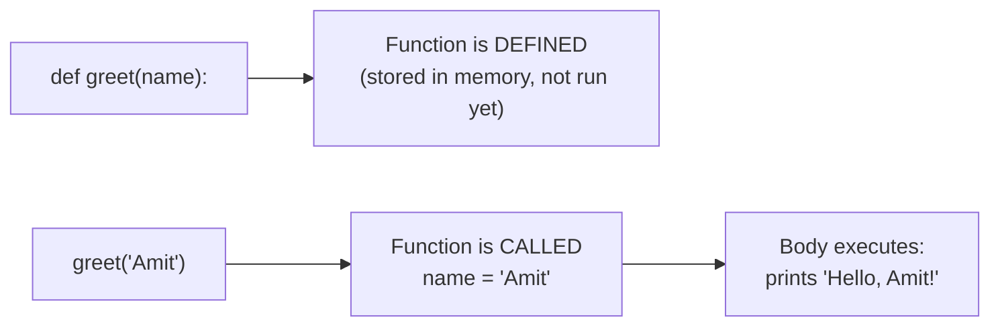
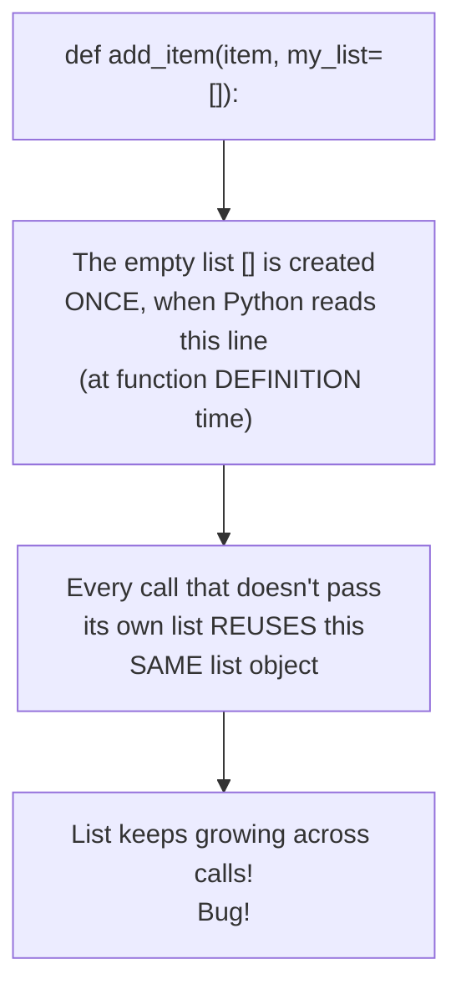
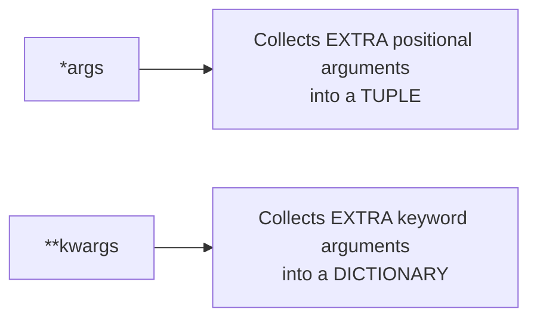
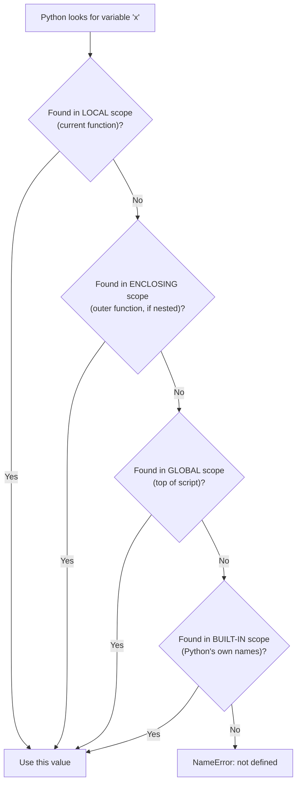
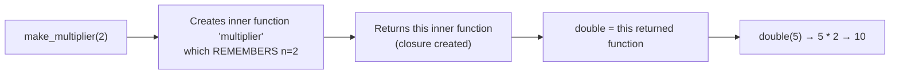
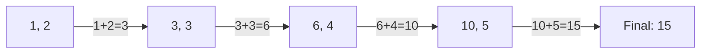
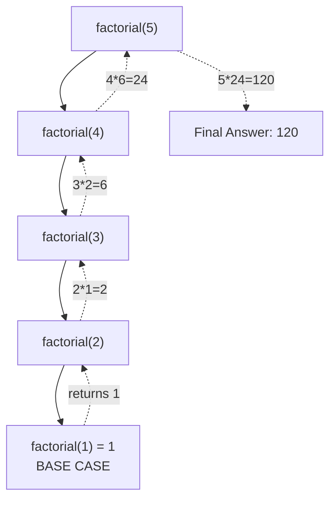
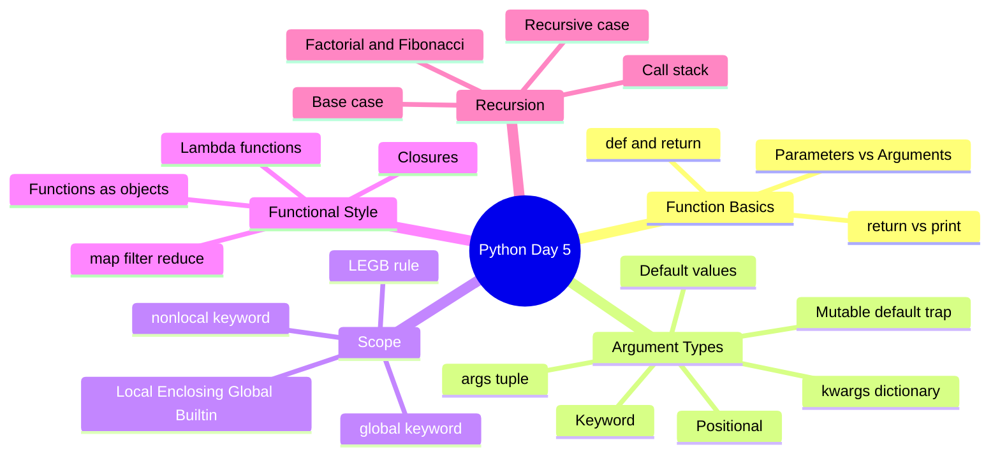

# 📘 DAY 5 — Functions & Scope

> **Goal for Today:** Learn how to package reusable blocks of logic into functions — including all the different ways to pass arguments, how Python decides which variables are visible where (scope), recursion, and treating functions as first-class objects. This is where Python programming starts feeling truly powerful.

---

## Table of Contents
1. [What is a Function and Why Use One?](#1-what-is-a-function-and-why-use-one)
2. [Defining and Calling a Function](#2-defining-and-calling-a-function)
3. [Parameters vs Arguments](#3-parameters-vs-arguments)
4. [The return Statement](#4-the-return-statement)
5. [Types of Arguments](#5-types-of-arguments)
6. [Default Arguments (and the Mutable Default Trap)](#6-default-arguments-and-the-mutable-default-trap)
7. [*args — Variable Positional Arguments](#7-args--variable-positional-arguments)
8. [**kwargs — Variable Keyword Arguments](#8-kwargs--variable-keyword-arguments)
9. [Variable Scope & the LEGB Rule](#9-variable-scope--the-legb-rule)
10. [global and nonlocal Keywords](#10-global-and-nonlocal-keywords)
11. [Lambda Functions](#11-lambda-functions)
12. [Functions as First-Class Objects](#12-functions-as-first-class-objects)
13. [Higher-Order Functions: map, filter, reduce](#13-higher-order-functions-map-filter-reduce)
14. [Recursion](#14-recursion)
15. [Day 5 Summary Diagram](#15-day-5-summary-diagram)
16. [Practice Questions](#16-practice-questions)

---

## 1. What is a Function and Why Use One?

A **function** is a **named, reusable block of code** that performs a specific task. You've already been *using* functions since Day 1 (`print()`, `len()`, `type()`, `int()`) — today you learn to **write your own**.

### Real-life analogy
Think of a function like a **kitchen appliance** — say, a blender. You don't rebuild a blender from scratch every time you want a smoothie. You just put ingredients in (**input**), press the button (**call it**), and get a smoothie out (**output**). You can reuse the same blender endlessly, for different ingredients.

### Why use functions?
- **Avoid repeating code (DRY principle — "Don't Repeat Yourself").** If you find yourself copy-pasting the same logic multiple times, it belongs in a function.
- **Organize your program** into logical, named chunks — easier to read, debug, and maintain.
- **Reusability** — write the logic once, use it anywhere, as many times as needed.
- **Easier testing** — you can test one function in isolation, without running your entire program.

---

## 2. Defining and Calling a Function

```python
def greet():
    print("Hello! Welcome to Python.")

greet()   # calling/invoking the function
```

**Line-by-line breakdown:**
- `def` — keyword that means "I'm **def**ining a function."
- `greet` — the function's name (follow the same naming rules as variables — `snake_case`, descriptive).
- `()` — parentheses, where **parameters** (inputs) would go, if any (empty here).
- `:` — colon, signaling an indented block follows (same rule as `if`/`for`/`while`).
- The indented line(s) below are the **function body** — the code that runs each time the function is called.
- `greet()` on the last line — this is how you **call** (execute) the function. Just writing `greet` without parentheses does NOT run it — it only refers to the function object itself (we'll revisit this idea in section 12).

### With a Parameter
```python
def greet(name):
    print(f"Hello, {name}! Welcome to Python.")

greet("Amit")     # Hello, Amit! Welcome to Python.
greet("Priya")    # Hello, Priya! Welcome to Python.
```
**Explanation:** `name` is a **parameter** — a placeholder variable that receives whatever value is passed in when the function is called. Each call can pass a **different** value, making the function flexible and reusable.



---

## 3. Parameters vs Arguments

These terms are often used interchangeably, but technically:
- **Parameter** = the variable name listed in the function's **definition**.
- **Argument** = the actual **value** you pass in when **calling** the function.

```python
def add(a, b):      # 'a' and 'b' are PARAMETERS
    return a + b

result = add(5, 3)  # '5' and '3' are ARGUMENTS
```
Knowing this distinction precisely is a small thing, but it signals attention to detail — worth mentioning correctly in an interview.

---

## 4. The return Statement

`return` sends a value **back** out of the function, to wherever the function was called from. This is how a function can "give you a result" that you can store or use further.

```python
def add(a, b):
    return a + b

result = add(5, 3)
print(result)    # 8
```

### return vs print() — a critical distinction for beginners
```python
def add_v1(a, b):
    print(a + b)     # just DISPLAYS the result, doesn't give it back

def add_v2(a, b):
    return a + b      # actually RETURNS the result to be used further

x = add_v1(5, 3)   # prints "8" to the screen, but...
print(x)            # None!  Because add_v1 never used 'return', so it gives back nothing (None by default)

y = add_v2(5, 3)   # nothing printed here
print(y)            # 8   ← because 'y' actually received the returned value
```
**This is one of the most common beginner confusions.** `print()` just shows something on screen — it doesn't hand a value back to your program. `return` is what allows you to actually **use** the function's result elsewhere (store it, do more math with it, pass it to another function, etc.). A function with no explicit `return` automatically returns `None`.

### A function can return multiple values
```python
def get_min_max(numbers):
    return min(numbers), max(numbers)   # this packs both values into a tuple automatically!

lowest, highest = get_min_max([5, 2, 9, 1, 7])
print(lowest, highest)   # 1 9
```
**Explanation:** This uses the same "packing" concept from Day 4 — `return min(numbers), max(numbers)` packs both values into a tuple `(1, 9)`, which we then unpack into `lowest` and `highest`.

### return immediately exits the function
```python
def check_age(age):
    if age < 0:
        return "Invalid age"   # function EXITS here if this runs
    if age < 18:
        return "Minor"
    return "Adult"

print(check_age(25))    # Adult
print(check_age(-5))    # Invalid age
```
As soon as Python hits a `return`, it **immediately stops executing** the rest of the function — no code after `return` (within that path) will run.

---

## 5. Types of Arguments

Python offers several flexible ways to pass arguments into functions.

### Positional Arguments (the default way)
Arguments are matched to parameters **based on their order/position**.
```python
def describe_pet(animal, name):
    print(f"I have a {animal} named {name}.")

describe_pet("dog", "Rex")     # I have a dog named Rex.
describe_pet("Rex", "dog")     # I have a Rex named dog.   ⚠️ Order matters! Wrong result if swapped.
```

### Keyword Arguments
You explicitly specify **which parameter** each value goes to, by name — so order no longer matters.
```python
describe_pet(animal="dog", name="Rex")
describe_pet(name="Rex", animal="dog")    # Same result! Order doesn't matter with keyword arguments.
```
**Why use keyword arguments?** They make function calls much more **readable**, especially for functions with many parameters — anyone reading the code instantly knows what each value represents, without needing to check the function definition.

### Mixing Positional and Keyword Arguments
```python
describe_pet("dog", name="Rex")   # ✅ OK - positional first, then keyword
# describe_pet(animal="dog", "Rex")   # ❌ ERROR - can't have positional AFTER keyword
```
**Rule:** Positional arguments must always come **before** keyword arguments in a function call.

---

## 6. Default Arguments (and the Mutable Default Trap)

A **default argument** provides a fallback value, used automatically if the caller doesn't provide one.

```python
def greet(name, greeting="Hello"):
    print(f"{greeting}, {name}!")

greet("Amit")                    # Hello, Amit!          (uses default greeting)
greet("Amit", "Good morning")    # Good morning, Amit!   (overrides the default)
```
**Rule:** Parameters with default values must come **after** parameters without defaults in the function definition:
```python
def greet(greeting="Hello", name):   # ❌ ERROR - non-default argument follows default argument
```

### ⚠️ Revisiting the Mutable Default Argument Trap (mentioned back on Day 3!)
This is a genuinely important, classic Python interview question. Now that you know functions properly, let's fully understand it.

```python
def add_item(item, my_list=[]):    # ⚠️ DANGER
    my_list.append(item)
    return my_list

print(add_item("apple"))    # ['apple']
print(add_item("banana"))   # ['apple', 'banana']  ⚠️ we expected just ['banana']!
```

**Why this happens:** Default argument values are evaluated **only ONCE — at the moment the function is defined**, not every time it's called. Since `[]` is mutable, that **same** list object is reused across every call that doesn't explicitly pass its own list, and it keeps growing.

**The fix — use `None` as the default, and create the list fresh inside the function:**
```python
def add_item(item, my_list=None):
    if my_list is None:
        my_list = []      # a brand NEW list is created on EVERY call
    my_list.append(item)
    return my_list

print(add_item("apple"))    # ['apple']
print(add_item("banana"))   # ['banana']   ✅ correct now!
```



**This question is extremely commonly asked in Python interviews** — being able to explain not just "avoid mutable defaults" but **why** it happens (default values are evaluated once, at definition time) will set you apart.

---

## 7. *args — Variable Positional Arguments

Sometimes you don't know in advance **how many** arguments a function will receive. `*args` lets a function accept **any number** of positional arguments.

```python
def add_all(*args):
    print(args)          # args is actually a TUPLE of all passed values
    return sum(args)

print(add_all(1, 2))           # (1, 2)          → 3
print(add_all(1, 2, 3, 4, 5))  # (1, 2, 3, 4, 5) → 15
```

**Explanation:** `*args` collects **all** the positional arguments passed into the function and packs them into a single tuple named `args`. (The name `args` is just a convention — the important part is the `*`, not the word "args" itself, though you should stick to this convention since everyone recognizes it.)

**When is this useful?** Anytime you want a function to be flexible about how many inputs it accepts — e.g., a function to calculate the sum/average/max of "however many numbers the user gives."

---

## 8. **kwargs — Variable Keyword Arguments

Similarly, `**kwargs` lets a function accept **any number** of keyword arguments (name=value pairs).

```python
def print_profile(**kwargs):
    print(kwargs)         # kwargs is a DICTIONARY of all passed keyword arguments
    for key, value in kwargs.items():
        print(f"{key}: {value}")

print_profile(name="Amit", age=25, city="Delhi")
# {'name': 'Amit', 'age': 25, 'city': 'Delhi'}
# name: Amit
# age: 25
# city: Delhi
```

**Explanation:** `**kwargs` collects all the keyword arguments into a **dictionary** named `kwargs`, where each argument's name becomes a key, and its value becomes the dictionary's value.

### Using *args and **kwargs together
```python
def describe(*args, **kwargs):
    print("Positional:", args)
    print("Keyword:", kwargs)

describe(1, 2, 3, name="Amit", age=25)
# Positional: (1, 2, 3)
# Keyword: {'name': 'Amit', 'age': 25}
```
**Rule for order in a function definition:** regular parameters → `*args` → default parameters → `**kwargs`. `*args` must always come before `**kwargs`.



**Why this matters for interviews:** `*args`/`**kwargs` show up constantly in real-world Python code (especially in libraries/frameworks) to make functions flexible. You'll also see this exact syntax again on Day 6-7 when working with classes and decorators.

---

## 9. Variable Scope & the LEGB Rule

**Scope** determines **where in your code a variable is accessible/visible**. This is a concept that trips up even experienced developers moving to Python, so take your time here.

### Local Scope
A variable created **inside** a function only exists inside that function — it's invisible outside.
```python
def my_function():
    x = 10   # local variable - only exists inside this function
    print(x)

my_function()   # 10
print(x)         # ❌ ERROR: NameError: name 'x' is not defined
```

### Global Scope
A variable created **outside** any function, at the top level of your script, is accessible everywhere (including inside functions, for *reading*).
```python
y = 100   # global variable

def show_y():
    print(y)   # ✅ can READ the global variable from inside the function

show_y()   # 100
```

### The LEGB Rule (how Python searches for a variable)
When your code refers to a variable name, Python looks for it in this exact order:

1. **L**ocal — inside the current function
2. **E**nclosing — inside any "outer" function (if this function is nested inside another)
3. **G**lobal — at the top level of the script/module
4. **B**uilt-in — Python's own built-in names (like `print`, `len`, `str`)

Python stops at the **first** place it finds the name — it doesn't keep searching further out once found.

```python
x = "global x"

def outer():
    x = "enclosing x"
    def inner():
        x = "local x"
        print(x)     # looks LOCAL first → finds "local x" → stops here
    inner()

outer()   # local x
```

```python
x = "global x"

def outer():
    x = "enclosing x"
    def inner():
        print(x)     # no local x here → looks ENCLOSING → finds "enclosing x"
    inner()

outer()   # enclosing x
```



---

## 10. global and nonlocal Keywords

By default, you can **read** a global variable inside a function, but you **cannot modify** it directly — Python assumes any variable you assign to inside a function is a **new local variable**, unless told otherwise.

### The Problem
```python
count = 0

def increment():
    count = count + 1   # ❌ ERROR: UnboundLocalError
    print(count)

increment()
```
**Why this fails:** The moment Python sees `count = ...` **inside** the function, it decides `count` is a **local** variable for the entire function — even on the line where you're trying to read the "global" `count`. So `count + 1` tries to use a local `count` that doesn't have a value yet. This confuses almost every beginner at least once.

### The Fix: `global` keyword
```python
count = 0

def increment():
    global count      # tells Python: "use the GLOBAL count, don't create a local one"
    count = count + 1
    print(count)

increment()   # 1
increment()   # 2
print(count)   # 2   ← the global variable was genuinely modified
```

### `nonlocal` — same idea, but for nested/enclosing functions
```python
def outer():
    x = 10
    def inner():
        nonlocal x       # refers to the 'x' in the ENCLOSING function, not global, not local
        x += 5
        print(x)
    inner()
    print(x)     # the outer x was modified too!

outer()
# 15
# 15
```
**Difference between `global` and `nonlocal`:** `global` reaches all the way to the top-level (module) scope. `nonlocal` reaches only to the nearest **enclosing function's** scope (used specifically with nested functions).

**Best practice note (worth mentioning when teaching):** Relying heavily on `global` is generally considered poor practice in real-world code, since it makes functions less predictable/harder to test (a function that silently changes external state is riskier). It's good to know how it works, but prefer passing values in and returning values out wherever possible.

---

## 11. Lambda Functions

A **lambda function** is a small, **anonymous** (unnamed) function, written in a single line — useful for short, throwaway pieces of logic.

### Syntax
```python
lambda arguments: expression
```

```python
# Regular function
def square(x):
    return x ** 2

# Equivalent lambda function
square_lambda = lambda x: x ** 2

print(square(5))          # 25
print(square_lambda(5))   # 25
```

**Explanation:** `lambda x: x ** 2` means "a function that takes `x` and returns `x ** 2`" — all in one line, with an **implicit return** (no `return` keyword needed; whatever the expression evaluates to is automatically returned).

### Lambdas with multiple arguments
```python
add = lambda a, b: a + b
print(add(3, 4))   # 7
```

### When are lambdas actually used?
Lambdas are rarely assigned to a variable like above (if you're doing that, just use a regular `def` — it's more readable). Their real power is being used **inline**, especially as a quick argument to another function — which leads perfectly into the next section.

```python
students = [("Amit", 25), ("Riya", 22), ("John", 30)]

# Sort by age (the second item in each tuple) using a lambda as the sorting key
students.sort(key=lambda student: student[1])
print(students)   # [('Riya', 22), ('Amit', 25), ('John', 30)]
```
**Explanation:** `sort()` accepts a `key` parameter — a function that tells it **what to sort by**. Instead of writing a whole separate named function just for this one-time use, a lambda lets us define that logic inline, right where it's needed.

---

## 12. Functions as First-Class Objects

This is a genuinely important conceptual shift from languages like Java/C++ (pre-Java 8), and interviewers love testing this.

**"First-class object"** means functions in Python can be treated just like any other value — you can:
- Assign a function to a variable
- Pass a function as an argument to another function
- Return a function from another function
- Store functions in a list/dictionary

```python
def greet():
    return "Hello!"

# Assign a function to a variable (note: NO parentheses - we're not calling it, just referencing it)
my_func = greet
print(my_func())    # Hello!   - calling it via the new variable name

# Pass a function as an argument
def call_function(func):
    return func()

print(call_function(greet))   # Hello!

# Return a function from another function
def make_multiplier(n):
    def multiplier(x):
        return x * n
    return multiplier    # returning the INNER function itself, not calling it

double = make_multiplier(2)
triple = make_multiplier(3)
print(double(5))    # 10
print(triple(5))    # 15
```

**Explanation of `make_multiplier`:** This is called a **closure** — the inner `multiplier` function "remembers" the value of `n` from its enclosing scope, even after `make_multiplier` has finished running. This is an advanced but important concept — you'll see this exact pattern again on **Day 7**, when we cover decorators, which are built entirely on this idea.



---

## 13. Higher-Order Functions: map, filter, reduce

A **higher-order function** is simply a function that takes another function as an argument (or returns one) — exactly what we just demonstrated in section 12. Python has 3 famous built-in higher-order functions that work beautifully with lambdas.

### map() — applies a function to EVERY item in an iterable
```python
numbers = [1, 2, 3, 4, 5]
squared = list(map(lambda x: x ** 2, numbers))
print(squared)   # [1, 4, 9, 16, 25]
```
**Explanation:** `map(function, iterable)` applies `function` to **every single item** and gives back a "map object" (a lazy iterator, similar to `range()` from Day 2), which we convert into a list using `list()` to actually see the results.

**Equivalent using a list comprehension (Day 3) — often preferred as more "Pythonic":**
```python
squared = [x ** 2 for x in numbers]
```

### filter() — keeps only items where the function returns True
```python
numbers = [1, 2, 3, 4, 5, 6, 7, 8, 9, 10]
evens = list(filter(lambda x: x % 2 == 0, numbers))
print(evens)   # [2, 4, 6, 8, 10]
```
**Explanation:** `filter(function, iterable)` tests every item with `function`. If it returns `True`, the item is **kept**; if `False`, it's **discarded**.

**Equivalent using list comprehension:**
```python
evens = [x for x in numbers if x % 2 == 0]
```

### reduce() — combines all items into a SINGLE value
Unlike `map` and `filter`, `reduce` isn't a built-in — it must be imported from the `functools` module.
```python
from functools import reduce

numbers = [1, 2, 3, 4, 5]
total = reduce(lambda a, b: a + b, numbers)
print(total)   # 15
```
**Explanation — how reduce works step by step:**
1. Takes the first two items: `1, 2` → applies the lambda → `1 + 2 = 3`
2. Takes that result and the next item: `3, 3` → `3 + 3 = 6`
3. Takes that result and the next item: `6, 4` → `6 + 4 = 10`
4. Takes that result and the last item: `10, 5` → `10 + 5 = 15`
5. Final result: `15`



**About `functools`:** This is another built-in Standard Library module (like `copy` from Day 3), containing useful "functional programming" tools. We `import` it specifically to access `reduce`.

**Practical note:** In modern Python, `map`/`filter` are commonly replaced with list comprehensions (considered cleaner/more readable), but `reduce` is still genuinely useful for "combine everything into one value" tasks (sums, products, finding a max, merging things). Knowing all three is important for interviews even if you use comprehensions more often in daily coding.

---

## 14. Recursion

**Recursion** is when a function **calls itself** to solve a smaller version of the same problem, until it reaches a simple base case it can answer directly.

### Real-life analogy
Imagine looking through a stack of boxes, where each box contains a smaller box inside, until you reach the smallest box with no box inside. You open a box, and if there's another box inside, you repeat the exact same "open the box" action on it — until you hit the smallest one (the base case), then you start closing/returning back up.

### Classic Example: Factorial
Mathematically: `5! = 5 × 4 × 3 × 2 × 1 = 120`. Notice `5! = 5 × 4!`, and `4! = 4 × 3!`, and so on — each version of the problem is a smaller version of the same problem. That's the essence of recursion.

```python
def factorial(n):
    if n == 0 or n == 1:      # BASE CASE - stops the recursion
        return 1
    else:
        return n * factorial(n - 1)    # RECURSIVE CASE - calls itself with a smaller value

print(factorial(5))   # 120
```

### Every recursive function needs TWO essential parts:
1. **Base Case** — the simplest scenario, where the function returns a direct answer WITHOUT calling itself again. This is what **stops** the recursion (without this, you get infinite recursion, similar to an infinite loop, and Python will eventually raise a `RecursionError`).
2. **Recursive Case** — where the function calls itself with a **smaller/simpler** version of the original problem, gradually working toward the base case.

### Tracing through factorial(5) step by step:
```
factorial(5) → 5 * factorial(4)
factorial(4) → 4 * factorial(3)
factorial(3) → 3 * factorial(2)
factorial(2) → 2 * factorial(1)
factorial(1) → 1   ← BASE CASE reached, starts "unwinding" back up

Now the calls resolve backward, like a stack of dominoes falling back:
factorial(2) = 2 * 1 = 2
factorial(3) = 3 * 2 = 6
factorial(4) = 4 * 6 = 24
factorial(5) = 5 * 24 = 120
```



**How Python manages this internally — the Call Stack:** Every time a function calls itself, Python pushes a new "frame" onto something called the **call stack** (remembering where to return to and what its local variables are). When a function returns, its frame gets popped off the stack. If recursion goes too deep without reaching a base case, the stack fills up and Python throws a `RecursionError: maximum recursion depth exceeded` — a well-known interview topic.

### Another Classic Example: Fibonacci
```python
def fibonacci(n):
    if n <= 1:              # BASE CASE
        return n
    return fibonacci(n - 1) + fibonacci(n - 2)   # RECURSIVE CASE

for i in range(8):
    print(fibonacci(i), end=" ")
# Output: 0 1 1 2 3 5 8 13
```

### Recursion vs Loops — when to use which?
| Recursion | Loops (iteration) |
|---|---|
| More elegant for naturally recursive problems (tree structures, factorial, Fibonacci) | Generally more memory-efficient (no call stack buildup) |
| Can be easier to read for certain problems | Usually faster in Python for simple repetition |
| Risk of `RecursionError` for very deep recursion | No such depth limit |

**Introducing Memoization (a quick preview):** Notice that naive recursive Fibonacci recalculates the same values repeatedly (very inefficient for large `n`). A technique called **memoization** (caching previous results) fixes this — we'll properly cover this with the `@lru_cache` decorator on **Day 9**.

---

## 15. Day 5 Summary Diagram



---

## 16. Practice Questions

### Conceptual Questions (for interview prep)
1. What's the difference between a parameter and an argument?
2. Why does using a mutable default argument (like `[]`) cause bugs?
3. Explain the LEGB rule in your own words.
4. Why does modifying a global variable inside a function require the `global` keyword?
5. What's the difference between `*args` and `**kwargs`?
6. What is a closure? Give an example.
7. Every recursive function needs two essential parts — what are they, and why?
8. What's the practical difference between `map()`/`filter()` and list comprehensions?

### Coding Exercises
1. Write a function `is_prime(n)` that returns `True` or `False` depending on whether `n` is a prime number.
2. Write a function that accepts any number of numbers using `*args` and returns their average.
3. Write a function `make_power(exponent)` that returns a new function which raises any number to that exponent (a closure, similar to the `make_multiplier` example).
4. Use `filter()` and a lambda to extract all words longer than 5 characters from a list of words.
5. Write a recursive function to reverse a string (without using slicing `[::-1]`).
6. Write a recursive function to calculate the sum of a list of numbers.

---

## ✅ Day 5 Checklist — Can you confidently...
- [ ] Define a function with parameters and explain `return` vs `print()`?
- [ ] Use positional, keyword, and default arguments correctly?
- [ ] Explain the mutable default argument trap and how to fix it?
- [ ] Use `*args` and `**kwargs` in a function, and explain what type each becomes inside the function?
- [ ] Explain the LEGB rule and trace through a nested function example?
- [ ] Explain when and why you'd need `global` or `nonlocal`?
- [ ] Write a lambda function and use it with `sort()`, `map()`, or `filter()`?
- [ ] Explain what a closure is?
- [ ] Write a recursive function with a clear base case and recursive case?

If you can check all of these confidently, **you're ready for Day 6: OOP Part 1 — Classes, Objects & Core Concepts.**

---

*Next up (Day 6): Classes and objects, `__init__`, `self`, instance vs class variables, instance/class/static methods, and encapsulation.*
