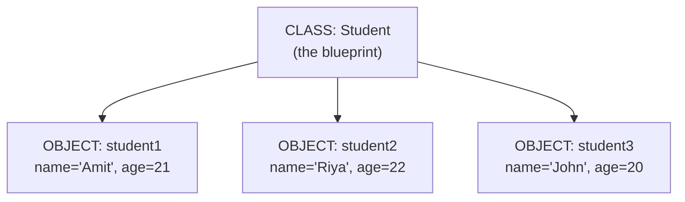
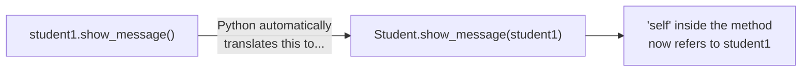
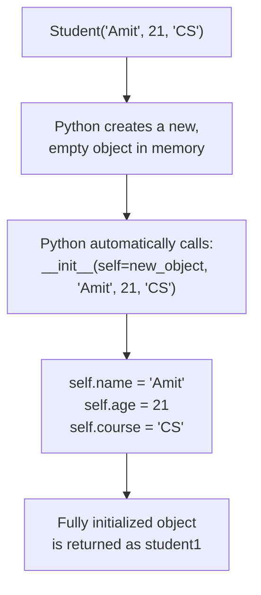
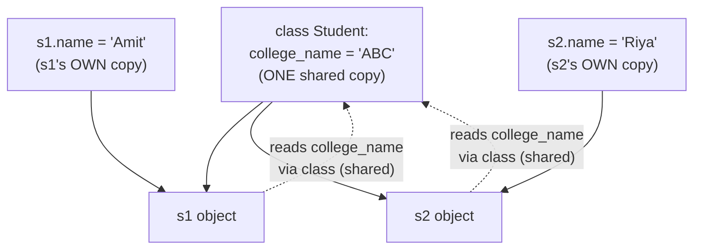
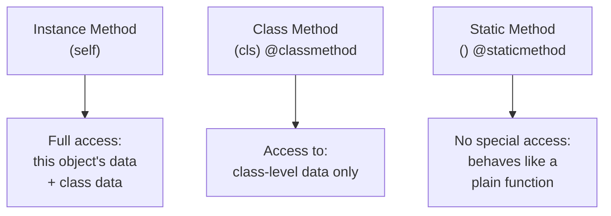
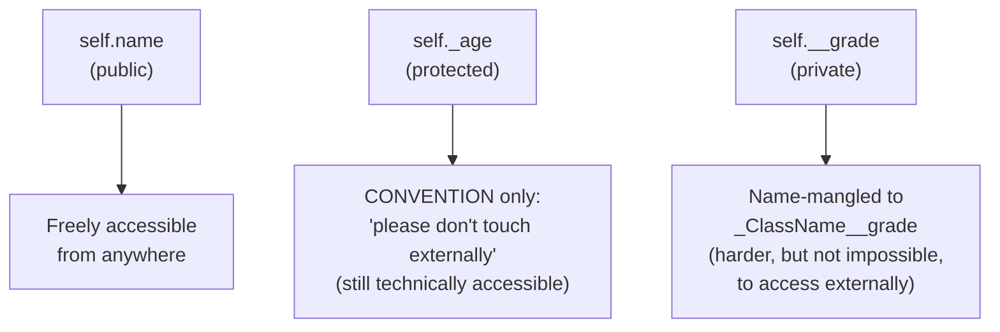
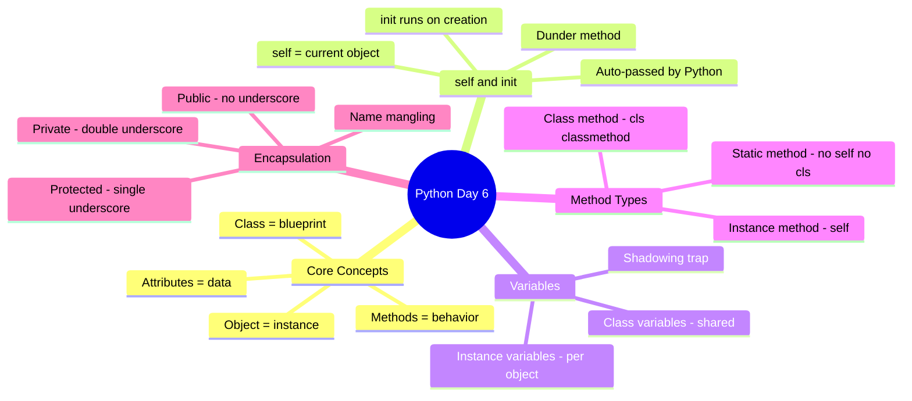

# 📘 DAY 6 — Object-Oriented Programming (OOP) Part 1: Classes & Objects

> **Goal for Today:** Understand the core building blocks of Object-Oriented Programming in Python — classes, objects, the `__init__` method, `self`, instance vs class variables, and the three types of methods. OOP is how real-world software is modeled and organized, and it's a massive part of both interviews and professional Python code.

---

## Table of Contents
1. [What is OOP and Why Does It Exist?](#1-what-is-oop-and-why-does-it-exist)
2. [Classes and Objects — The Core Idea](#2-classes-and-objects--the-core-idea)
3. [Creating Your First Class](#3-creating-your-first-class)
4. [Understanding `self`](#4-understanding-self)
5. [The `__init__` Method (Constructor)](#5-the-__init__-method-constructor)
6. [Instance Variables vs Class Variables](#6-instance-variables-vs-class-variables)
7. [Instance Methods](#7-instance-methods)
8. [Class Methods](#8-class-methods)
9. [Static Methods](#9-static-methods)
10. [Comparing All Three Method Types](#10-comparing-all-three-method-types)
11. [Encapsulation — Python's Approach](#11-encapsulation--pythons-approach)
12. [Day 6 Summary Diagram](#12-day-6-summary-diagram)
13. [Practice Questions](#13-practice-questions)

---

## 1. What is OOP and Why Does It Exist?

**Object-Oriented Programming (OOP)** is a way of organizing code around **"objects"** — self-contained units that bundle together **data** (called attributes/properties) and **behavior** (called methods/functions) that belong together.

### Why not just use variables and functions (what we've done so far)?
Imagine you're building a system to manage 500 students. Without OOP, you'd need separate variables for every student's name, age, and grades — completely disconnected from each other, and you'd have to manually keep track of "which age belongs to which name." This becomes chaotic fast.

With OOP, you create ONE blueprint called `Student`, and each individual student becomes a **self-contained object** with their own name, age, and grades bundled together — plus behaviors like `student.calculate_average()`.

### Real-life analogy: Blueprint vs House
Think of a **class** as an **architectural blueprint** for a house — it defines what every house built from it *will have* (rooms, doors, windows) and what it *can do* (open door, turn on lights), but the blueprint itself isn't a house you can live in.

An **object** is an actual **house built from that blueprint** — a real, concrete thing you can walk into. You can build many houses (objects) from the same blueprint (class), and each one can be painted a different color, have different furniture, etc., while still following the same fundamental structure.



**You've been using classes this whole time without realizing it!** Every data type you've used — `int`, `str`, `list`, `dict` — is actually a **class** in Python. When you write `age = 25`, you're creating an **object** (called an "instance") of the `int` class. This is why `type(25)` shows `<class 'int'>` — you were seeing this since Day 1!

---

## 2. Classes and Objects — The Core Idea

| Term | Meaning |
|---|---|
| **Class** | The blueprint/template that defines what attributes and behaviors objects of this type will have |
| **Object** (or **Instance**) | An actual "thing" created from the class, with real, specific values |
| **Attribute** | A variable that belongs to an object (its data — e.g., `name`, `age`) |
| **Method** | A function that belongs to a class/object (its behavior — e.g., `calculate_average()`) |
| **Instantiation** | The act of creating an object from a class |

---

## 3. Creating Your First Class

```python
class Student:
    pass    # placeholder - empty class for now (remember 'pass' from Day 2!)

student1 = Student()    # creating (instantiating) an OBJECT from the class
print(type(student1))    # <class '__main__.Student'>
```

**Line-by-line breakdown:**
- `class` — keyword to define a new class.
- `Student` — the class name. **Convention: class names use `PascalCase`** (each word capitalized, no underscores) — this is different from the `snake_case` convention used for variables and functions. This is a PEP 8 rule, and following it signals professional-quality code.
- `:` — colon, again signaling an indented block follows.
- `pass` — since we haven't added any attributes/methods yet, `pass` is a placeholder so Python doesn't error on an empty block.
- `student1 = Student()` — this **calls** the class like a function, which **creates a new object** (instance) of that class.

---

## 4. Understanding `self`

Before we go further, you MUST understand `self` — it appears in almost every method you'll write, and confuses nearly every beginner (and every Java/C++ developer, who are used to `this` being implicit).

### What is `self`?
`self` refers to **the specific object that a method is being called on** — it's how an object accesses **its own** attributes and methods, from inside the class definition.

### Why do we need to write `self` explicitly? (Difference from Java's `this`)
In Java, `this` is implicit — you don't need to declare it as a parameter. In Python, `self` **must be explicitly listed as the first parameter** of every instance method. Python doesn't do anything "magic" behind the scenes — `self` is just a regular parameter that Python **automatically fills in** with the object itself, whenever you call a method using the `object.method()` syntax.

```python
class Student:
    def show_message(self):
        print("This method belongs to a Student object")

student1 = Student()
student1.show_message()

# What Python ACTUALLY does behind the scenes when you write student1.show_message():
# Student.show_message(student1)   ← Python automatically passes student1 AS 'self'
```
**Explanation:** When you call `student1.show_message()`, Python automatically converts this into `Student.show_message(student1)` — passing `student1` itself as the first argument, which lands in the `self` parameter. This is why `self` must always be the **first** parameter in any instance method — Python fills it in for you automatically; you never manually pass it yourself.

**Note:** `self` is just a **name convention** — you could technically call it anything (`this`, `obj`, etc.), but literally the entire Python community uses `self`, and you should too. Never break this convention.



---

## 5. The `__init__` Method (Constructor)

`__init__` is a special method that runs **automatically** every time you create a new object from a class. It's used to set up the object's **initial attributes** (its starting data). This is called a **constructor** (it "constructs"/initializes the object).

```python
class Student:
    def __init__(self, name, age, course):
        self.name = name        # creates an ATTRIBUTE called 'name' on this object
        self.age = age
        self.course = course

student1 = Student("Amit", 21, "Computer Science")
student2 = Student("Riya", 22, "Data Science")

print(student1.name)    # Amit
print(student2.name)    # Riya
print(student1.age)     # 21
```

**Line-by-line breakdown:**
- `def __init__(self, name, age, course):` — defines the constructor. `self` is always first (as we just learned); `name`, `age`, `course` are regular parameters that you pass in when creating the object.
- `self.name = name` — this is the crucial line. The **left side** (`self.name`) creates/sets an **attribute** called `name` that belongs to **this specific object**. The **right side** (`name`) is just the local parameter value that was passed in. These look similar but do very different things!
- When you write `Student("Amit", 21, "Computer Science")`, Python automatically calls `__init__(self, "Amit", 21, "Computer Science")` behind the scenes, with `self` referring to the brand-new object being created.

### Why double underscores (`__init__`)?
Methods surrounded by double underscores like `__init__` are called **"dunder" methods** (short for "**d**ouble **under**score") or **magic methods**. They're special methods that Python calls **automatically** in specific situations — `__init__` is called automatically during object creation. We'll explore several more dunder methods on **Day 7** (like `__str__`, `__len__`, `__eq__`).



---

## 6. Instance Variables vs Class Variables

This distinction is another common interview topic.

### Instance Variables
Variables defined using `self.variable_name` inside `__init__` (or other methods) — these belong to **each individual object separately**. Every object has its own independent copy.

```python
class Student:
    def __init__(self, name, age):
        self.name = name    # instance variable - unique to each object
        self.age = age

s1 = Student("Amit", 21)
s2 = Student("Riya", 22)

print(s1.name, s2.name)   # Amit Riya   ← completely independent values
```

### Class Variables
Variables defined **directly inside the class**, but **outside** any method — these are **shared by ALL objects** of that class (there's only ONE copy, shared across every instance).

```python
class Student:
    college_name = "ABC Institute of Technology"   # CLASS variable - shared by everyone

    def __init__(self, name, age):
        self.name = name      # instance variable - unique per object
        self.age = age

s1 = Student("Amit", 21)
s2 = Student("Riya", 22)

print(s1.college_name)   # ABC Institute of Technology
print(s2.college_name)   # ABC Institute of Technology  ← SAME value, shared class variable
```

**When to use a class variable:** For data that should genuinely be the **same across every object** — like a school's name (all students attend the same school), a company name, a fixed tax rate, or a counter tracking "how many objects have been created."

### A subtle but important trap: Modifying a class variable via an instance
```python
class Student:
    college_name = "ABC Institute"

s1 = Student()
s2 = Student()

s1.college_name = "XYZ Institute"   # ⚠️ this does NOT change the class variable!

print(s1.college_name)   # XYZ Institute   (s1 now has its OWN instance variable, shadowing the class one)
print(s2.college_name)   # ABC Institute   (unaffected - still using the shared class variable)
print(Student.college_name)   # ABC Institute   (the actual class variable is untouched)
```
**What actually happened:** `s1.college_name = "XYZ Institute"` didn't modify the shared class variable — it created a **new instance variable** on `s1` specifically, which now "shadows" (hides) the class variable **for `s1` only**. To genuinely change the class variable for everyone, you must modify it via the class itself: `Student.college_name = "XYZ Institute"`.



---

## 7. Instance Methods

These are the "normal" methods you've already seen — they take `self` as the first parameter and can access/modify the object's own instance variables.

```python
class Student:
    def __init__(self, name, marks):
        self.name = name
        self.marks = marks    # a list of marks

    def calculate_average(self):    # INSTANCE METHOD
        return sum(self.marks) / len(self.marks)

    def display_info(self):         # INSTANCE METHOD
        print(f"{self.name}'s average marks: {self.calculate_average()}")

s1 = Student("Amit", [85, 90, 78, 92])
s1.display_info()    # Amit's average marks: 86.25
```
**Explanation:** Instance methods are the most common type of method — they operate on a **specific object's** data (accessed via `self`). Note how `display_info` even calls **another** instance method (`self.calculate_average()`) — this is completely normal and common in real code.

---

## 8. Class Methods

A **class method** operates on the **class itself**, rather than any specific object. It's marked with the `@classmethod` **decorator** (we'll properly cover decorators on Day 7 — for now, just think of `@classmethod` as a label that changes how the method behaves) and takes `cls` (short for "class") as its first parameter, instead of `self`.

```python
class Student:
    college_name = "ABC Institute"
    total_students = 0    # class variable to track a count

    def __init__(self, name):
        self.name = name
        Student.total_students += 1   # increment the shared counter every time a new student is created

    @classmethod
    def get_total_students(cls):     # CLASS METHOD
        return cls.total_students

    @classmethod
    def change_college(cls, new_name):   # CLASS METHOD
        cls.college_name = new_name

s1 = Student("Amit")
s2 = Student("Riya")
s3 = Student("John")

print(Student.get_total_students())   # 3
Student.change_college("XYZ Institute")
print(Student.college_name)            # XYZ Institute
```

**Explanation:** `cls` refers to the **class itself** (similar to how `self` refers to the specific object). Class methods are used when you need to work with **class-level data** (like `college_name` or `total_students`) rather than any individual object's data. You typically call class methods on the class itself (`Student.get_total_students()`), though calling them on an instance (`s1.get_total_students()`) also works and gives the same result.

**Common real-world use case:** "Alternative constructors" — a class method that creates and returns an object in a different way than the standard `__init__`. For example, creating a `Student` object by parsing a string like `"Amit,21,CS"` — you'd write a `@classmethod` called `from_string()` that parses the string and calls `cls(...)` to build the object.

---

## 9. Static Methods

A **static method** belongs to the class **conceptually** (it's grouped/organized with the class because it's related), but it does **NOT** need access to the object (`self`) or the class (`cls`) at all. It's marked with `@staticmethod`.

```python
class MathUtils:
    @staticmethod
    def add(a, b):        # STATIC METHOD - no self, no cls!
        return a + b

    @staticmethod
    def is_even(n):
        return n % 2 == 0

print(MathUtils.add(5, 3))       # 8
print(MathUtils.is_even(10))     # True
```

**Explanation:** Notice there's no `self` or `cls` parameter at all — a static method behaves just like a regular, standalone function, except it's organized/namespaced inside the class for logical grouping. It doesn't need to know about any particular object or the class's shared data — it's purely a utility function that happens to conceptually belong here.

**When to use a static method:** When you have a helper/utility function that's **related to the class's purpose**, but doesn't need to read or modify any instance or class data. For example, a `Calculator` class might have a static method `is_valid_number(value)` that just checks if input is numeric — it doesn't need any specific calculator object's data to do that job.

---

## 10. Comparing All Three Method Types

| Method Type | Decorator | First Parameter | Can Access Instance Data? | Can Access Class Data? | Typical Use Case |
|---|---|---|---|---|---|
| **Instance Method** | none | `self` | ✅ Yes | ✅ Yes (via self) | Most common — object-specific behavior |
| **Class Method** | `@classmethod` | `cls` | ❌ No | ✅ Yes | Alternative constructors, class-wide operations |
| **Static Method** | `@staticmethod` | none | ❌ No | ❌ No | Utility/helper functions related to the class |

```python
class Example:
    class_data = "shared"

    def instance_method(self):
        print("I can access self AND the class:", self.class_data)

    @classmethod
    def class_method(cls):
        print("I can access the class only:", cls.class_data)

    @staticmethod
    def static_method():
        print("I can't access self or cls at all — I'm independent")
```



---

## 11. Encapsulation — Python's Approach

**Encapsulation** is the OOP principle of **bundling data and the methods that operate on it together**, while **restricting direct access** to some of an object's internal details — protecting data from accidental or unauthorized modification.

### Python's Approach: "We're All Consenting Adults Here"
This is a genuinely important difference from Java/C++, and a great interview talking point. Java has **strict**, compiler-enforced access modifiers (`private`, `protected`, `public`). Python has **no true private variables** — instead, it uses **naming conventions** to signal intent, trusting developers to respect them (this reflects Python's philosophy: "we don't need to force restrictions, we just clearly communicate intent").

### Three Levels (by convention, not enforcement)

**1. Public (default) — no underscore**
```python
class Student:
    def __init__(self, name):
        self.name = name    # PUBLIC - accessible from anywhere, no restrictions

s1 = Student("Amit")
print(s1.name)   # Amit  - freely accessible
```

**2. Protected — single leading underscore `_variable`**
```python
class Student:
    def __init__(self, name):
        self._age = 21    # PROTECTED (by convention) - "please don't touch this directly from outside"

s1 = Student("Amit")
print(s1._age)   # 21   -- this STILL WORKS! Python doesn't actually stop you.
```
**Meaning:** A single underscore is a **signal to other developers**: "this is intended for internal use within the class (or its subclasses) — please don't access it directly from outside code." Python does **not** technically enforce this; it's purely a convention, respected by well-behaved developers and tools (like IDEs, which will warn you).

**3. Private — double leading underscore `__variable`**
```python
class Student:
    def __init__(self, name):
        self.__grade = "A"    # PRIVATE - Python actively makes this harder to access accidentally

s1 = Student("Amit")
# print(s1.__grade)   # ❌ ERROR: AttributeError
print(s1._Student__grade)   # 'A'   -- but it's STILL technically accessible via "name mangling"!
```

**What's happening here — Name Mangling:** When you use a double underscore prefix, Python automatically **renames** the attribute internally to `_ClassName__attributename` (this is called **name mangling**). This makes it genuinely inconvenient (though not truly impossible) to access from outside the class by accident, which discourages misuse — but a determined developer can still access it if they really want to, using the mangled name.



### Why does this matter, and how do you properly control access?
The Pythonic way to protect data while still allowing controlled access is through **properties** (using the `@property` decorator) — this lets you add validation logic when getting/setting an attribute, while still letting users interact with it like a normal attribute. This is a slightly more advanced topic we'll touch on during **Day 9** (alongside other decorators), but it's good to know it exists.

**Interview-ready summary:** *"Python doesn't have true private variables like Java. It uses naming conventions — a single underscore signals 'internal use, please don't touch,' and a double underscore triggers name mangling, making accidental external access harder. This reflects Python's philosophy of trusting developers rather than strictly enforcing rules at the language level."*

---

## 12. Day 6 Summary Diagram



---

## 13. Practice Questions

### Conceptual Questions (for interview prep)
1. What's the difference between a class and an object?
2. Why must `self` be explicitly written as the first parameter in Python, unlike Java's implicit `this`?
3. What's the difference between an instance variable and a class variable? Give an example of when you'd use each.
4. What happens when you assign a value to `instance.class_variable` directly — does it change the class variable for everyone?
5. What's the difference between `@classmethod` and `@staticmethod`? When would you use each?
6. Why doesn't Python have true "private" variables like Java? What does it use instead?
7. What is name mangling, and why does Python do this for double-underscore attributes?

### Coding Exercises
1. Create a `Car` class with instance attributes `brand`, `model`, and `year`. Add an instance method `display_info()` that prints them nicely.
2. Create a `BankAccount` class with a `balance` (protected, using `_balance`). Add instance methods `deposit(amount)` and `withdraw(amount)` that properly increase/decrease the balance, with a check that prevents withdrawing more than the current balance.
3. Add a class variable `total_accounts` to your `BankAccount` class that increments every time a new account is created, and a `@classmethod` to retrieve the total count.
4. Create a `Rectangle` class with `length` and `width`. Add a `@staticmethod` called `is_square(length, width)` that returns `True` if the dimensions form a square.
5. Demonstrate (with code) the "shadowing" trap: create a class with a class variable, then show what happens when you set that same-named attribute on an individual instance.

---

## ✅ Day 6 Checklist — Can you confidently...
- [ ] Explain the difference between a class and an object using the blueprint/house analogy?
- [ ] Explain what `self` actually is, and why Python requires it explicitly?
- [ ] Write a class with an `__init__` method that sets up instance attributes?
- [ ] Explain the difference between instance variables and class variables, with an example?
- [ ] Explain the "shadowing" trap when assigning to a class variable via an instance?
- [ ] Write and explain the difference between an instance method, class method, and static method?
- [ ] Explain Python's approach to encapsulation (public/protected/private) and how it differs from Java?
- [ ] Explain what name mangling is?

If you can check all of these confidently, **you're ready for Day 7: OOP Part 2 — Inheritance, Polymorphism & Advanced OOP.**

---

*Next up (Day 7): Inheritance (single & multiple), Method Resolution Order (MRO), polymorphism & duck typing, abstract classes, and dunder/magic methods with operator overloading.*
