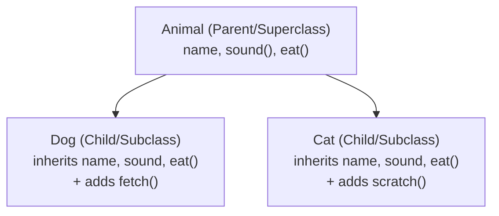
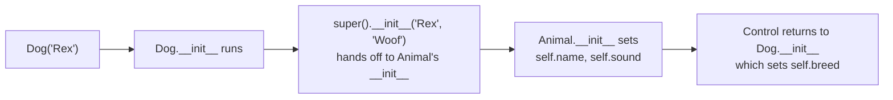
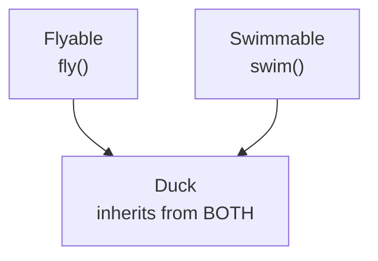
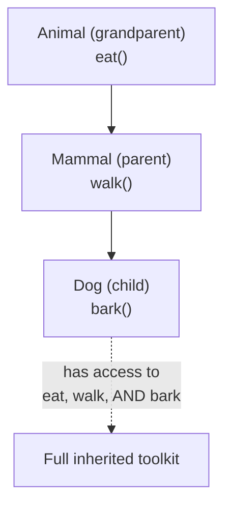
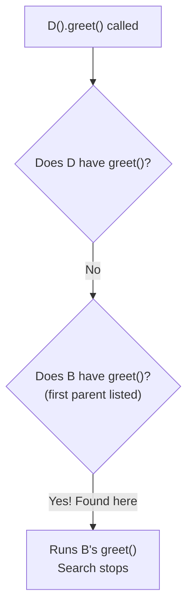
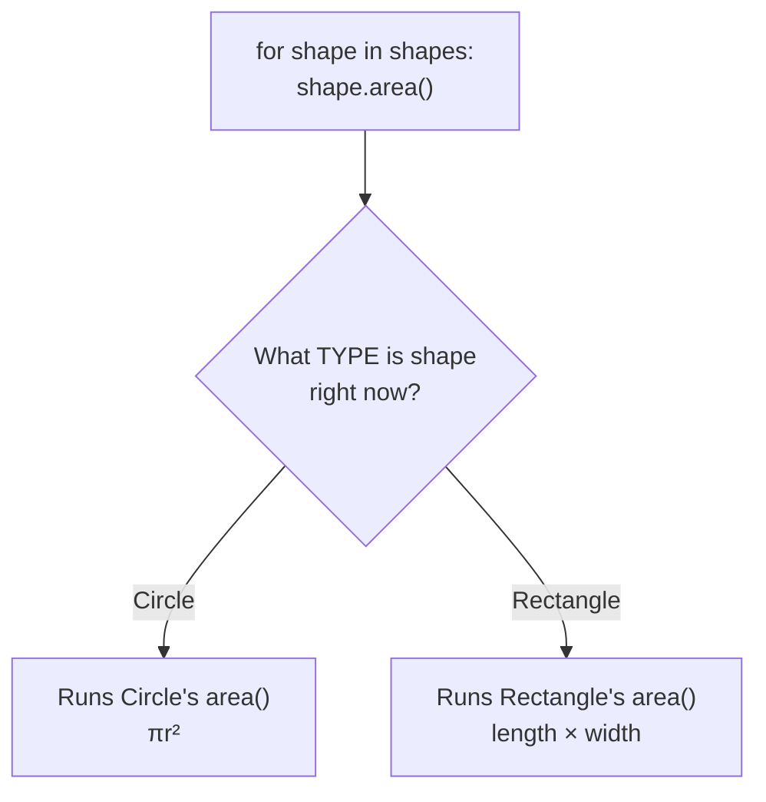
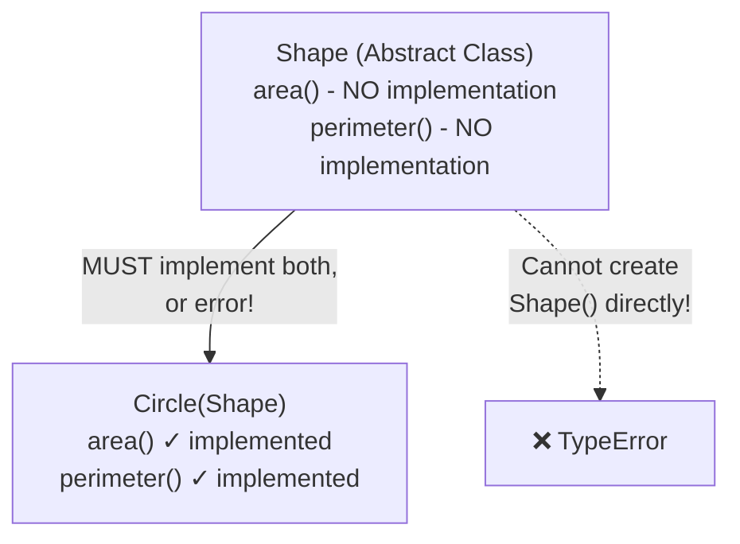
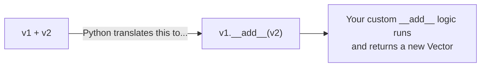
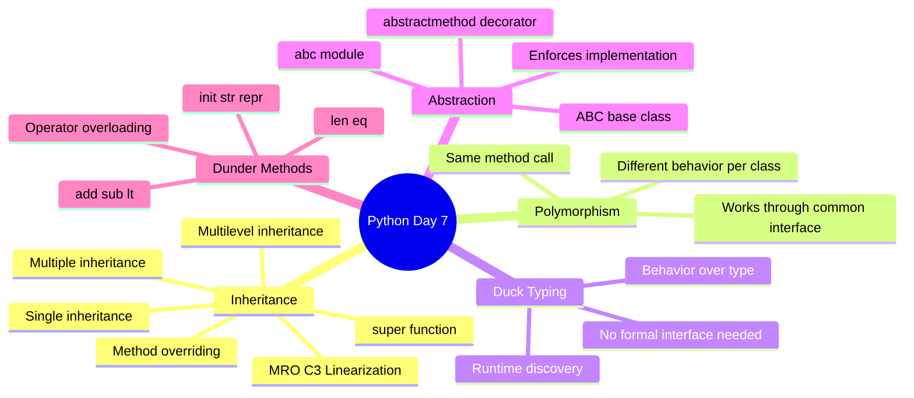

# 📘 DAY 7 — Object-Oriented Programming (OOP) Part 2: Inheritance, Polymorphism & Advanced OOP

> **Goal for Today:** Build on Day 6's foundation by learning how classes can inherit from each other, how Python resolves conflicts when multiple classes are involved, how objects of different types can be treated uniformly (polymorphism), abstract classes, and Python's magic/dunder methods. This is the day that turns "I know classes" into "I understand OOP design."

---

## Table of Contents
1. [What is Inheritance?](#1-what-is-inheritance)
2. [Single Inheritance](#2-single-inheritance)
3. [The super() Function](#3-the-super-function)
4. [Method Overriding](#4-method-overriding)
5. [Multiple Inheritance (Python-Specific!)](#5-multiple-inheritance-python-specific)
6. [Multilevel Inheritance](#6-multilevel-inheritance)
7. [Method Resolution Order (MRO)](#7-method-resolution-order-mro)
8. [Polymorphism](#8-polymorphism)
9. [Duck Typing](#9-duck-typing)
10. [Abstraction & Abstract Classes](#10-abstraction--abstract-classes)
11. [Dunder (Magic) Methods](#11-dunder-magic-methods)
12. [Operator Overloading](#12-operator-overloading)
13. [Day 7 Summary Diagram](#13-day-7-summary-diagram)
14. [Practice Questions](#14-practice-questions)

---

## 1. What is Inheritance?

**Inheritance** allows one class (called the **child** or **subclass**) to **automatically receive** all the attributes and methods of another class (called the **parent** or **superclass**), without rewriting any code. The child can then also add its own new features, or modify/override inherited ones.

### Real-life analogy
Think of inheritance like genetics — a child inherits traits from their parents (eye color, height tendencies) automatically, but can also have unique traits of their own. You don't need to "re-teach" a child how to breathe — they inherit that capability automatically from being human, and then develop their own unique personality on top of it.

### Why use inheritance?
- **Code reuse** — avoid rewriting the same attributes/methods across similar classes.
- **Logical hierarchy** — models real-world "is-a" relationships (a `Dog` **is a** kind of `Animal`; a `Car` **is a** kind of `Vehicle`).
- **Extensibility** — you can add new specialized classes without touching the original parent class.



---

## 2. Single Inheritance

**Single inheritance** means one child class inherits from exactly **one** parent class.

```python
class Animal:                     # PARENT class
    def __init__(self, name):
        self.name = name

    def eat(self):
        print(f"{self.name} is eating")

    def sleep(self):
        print(f"{self.name} is sleeping")

class Dog(Animal):                # CHILD class - inherits from Animal
    def bark(self):
        print(f"{self.name} is barking")

d = Dog("Rex")
d.eat()      # Rex is eating     ← inherited from Animal!
d.sleep()    # Rex is sleeping   ← inherited from Animal!
d.bark()     # Rex is barking    ← defined in Dog itself
```

**Line-by-line breakdown:**
- `class Dog(Animal):` — the parentheses after the class name specify the **parent class** to inherit from. This single line gives `Dog` automatic access to everything `Animal` has.
- Notice `Dog` doesn't define its own `__init__` here — it automatically **uses Animal's `__init__`** since it doesn't define its own. This means `Dog("Rex")` still works, calling `Animal.__init__` behind the scenes.
- `d.eat()` and `d.sleep()` work even though we never wrote those methods in `Dog` — they were inherited directly from `Animal`.
- `bark()` is a **new** method that only exists on `Dog`, not on `Animal` (a plain `Animal` object couldn't call `.bark()`).

### Checking Inheritance Relationships
```python
print(isinstance(d, Dog))       # True
print(isinstance(d, Animal))    # True  ← a Dog IS ALSO an Animal!
print(issubclass(Dog, Animal))  # True
```

---

## 3. The super() Function

When a child class **does** define its own `__init__` (or wants to extend a parent method rather than fully replace it), `super()` lets you call the **parent class's version** of a method from within the child.

```python
class Animal:
    def __init__(self, name, sound):
        self.name = name
        self.sound = sound

    def make_sound(self):
        print(f"{self.name} says {self.sound}")

class Dog(Animal):
    def __init__(self, name):
        super().__init__(name, "Woof")   # calls Animal's __init__, filling in "Woof" automatically
        self.breed = "Unknown"            # THEN adds a new attribute specific to Dog

d = Dog("Rex")
d.make_sound()      # Rex says Woof
print(d.breed)        # Unknown
```

**Explanation:** `super().__init__(name, "Woof")` calls `Animal`'s `__init__` method, passing `name` and `"Woof"` to it — so `Animal` handles setting `self.name` and `self.sound`, exactly as it normally would. Then, **after** that, `Dog`'s own `__init__` continues and adds `self.breed`.

**Why use `super()` instead of just rewriting the parent's logic yourself?**
1. **Avoids code duplication** — you don't need to retype `self.name = name` again in `Dog`.
2. **Stays in sync automatically** — if `Animal`'s `__init__` logic ever changes/improves later, `Dog` automatically benefits, without needing any edits.



---

## 4. Method Overriding

**Overriding** means a child class defines a method with the **exact same name** as one in the parent class, replacing (customizing) that behavior specifically for the child.

```python
class Animal:
    def make_sound(self):
        print("Some generic animal sound")

class Dog(Animal):
    def make_sound(self):              # OVERRIDES Animal's make_sound
        print("Woof Woof!")

class Cat(Animal):
    def make_sound(self):              # OVERRIDES Animal's make_sound differently
        print("Meow!")

a = Animal()
d = Dog()
c = Cat()

a.make_sound()   # Some generic animal sound
d.make_sound()   # Woof Woof!    ← Dog's own version runs, not Animal's
c.make_sound()   # Meow!         ← Cat's own version runs, not Animal's
```

**Explanation:** Even though `Dog` and `Cat` both inherit from `Animal` (which already has a `make_sound` method), each child provides its **own** version. When you call `d.make_sound()`, Python looks at `Dog` **first** — since `Dog` has its own `make_sound`, that's the one used, completely replacing/hiding the parent's version for this class.

**Using `super()` to extend rather than fully replace:**
```python
class Dog(Animal):
    def make_sound(self):
        super().make_sound()          # first run the PARENT's version
        print("...and also Woof Woof!")   # THEN add extra behavior

d = Dog()
d.make_sound()
# Some generic animal sound
# ...and also Woof Woof!
```
This pattern — calling `super()` and then adding more — is very common in real-world code, especially when extending/customizing established behavior rather than throwing it away entirely.

---

## 5. Multiple Inheritance (Python-Specific!)

**This is a genuinely big difference from Java**, which does NOT allow a class to inherit from more than one class directly (Java only allows multiple *interfaces*). Python **does** allow a class to inherit from **multiple parent classes simultaneously** — a favorite interview talking point for Java-background developers learning Python.

```python
class Flyable:
    def fly(self):
        print("I can fly!")

class Swimmable:
    def swim(self):
        print("I can swim!")

class Duck(Flyable, Swimmable):    # inherits from BOTH classes
    pass

d = Duck()
d.fly()     # I can fly!    ← from Flyable
d.swim()    # I can swim!   ← from Swimmable
```

**Explanation:** `Duck(Flyable, Swimmable)` means `Duck` inherits from **both** `Flyable` and `Swimmable` at once, gaining access to methods from **both** parent classes. This models real-world scenarios well — a duck genuinely can both fly and swim, and neither ability alone fully captures what a duck is.



**Caution/downside:** Multiple inheritance can get genuinely confusing if the parent classes have **methods with the same name** — which parent's version wins? This leads us directly into the next topic: **Method Resolution Order**.

---

## 6. Multilevel Inheritance

This is different from multiple inheritance — **multilevel inheritance** is a **chain**: A → B → C, where each class inherits from the one before it (like grandparent → parent → child).

```python
class Animal:
    def eat(self):
        print("Eating...")

class Mammal(Animal):        # Mammal inherits from Animal
    def walk(self):
        print("Walking...")

class Dog(Mammal):            # Dog inherits from Mammal (which already inherits from Animal)
    def bark(self):
        print("Barking...")

d = Dog()
d.eat()     # Eating...     ← inherited from Animal (grandparent!)
d.walk()    # Walking...    ← inherited from Mammal (parent)
d.bark()    # Barking...    ← Dog's own method
```

**Explanation:** `Dog` doesn't directly inherit from `Animal` — but it inherits from `Mammal`, which itself inherits from `Animal`. So `Dog` ends up with access to **everything** in the whole chain: its own methods, `Mammal`'s methods, AND `Animal`'s methods.



---

## 7. Method Resolution Order (MRO)

**This is one of the most commonly asked Python interview questions for anyone with intermediate+ experience**, precisely because Python supports multiple inheritance and needs a clear, predictable rule for resolving conflicts.

### The Problem MRO Solves
```python
class A:
    def greet(self):
        print("Hello from A")

class B(A):
    def greet(self):
        print("Hello from B")

class C(A):
    def greet(self):
        print("Hello from C")

class D(B, C):     # inherits from BOTH B and C
    pass

d = D()
d.greet()   # Which one runs?? B's? C's? A's?
```

### The Answer: MRO (Method Resolution Order)
Python uses an algorithm called **C3 Linearization** to determine a strict, predictable **order** in which classes are checked when looking for a method. You can actually **see** this order yourself:

```python
print(D.mro())
# [<class 'D'>, <class 'B'>, <class 'C'>, <class 'A'>, <class 'object'>]

d.greet()   # Hello from B
```
**Explanation:** Python checks classes in this exact order: `D` → `B` → `C` → `A` → `object` (the base class every Python class ultimately inherits from). Since `D` itself has no `greet()`, Python moves to `B` — which **does** have a `greet()` — so that's the one used. `C`'s version is never reached, because Python found a match at `B` first.

### The General Rule (Simplified)
- Python checks the **class itself first**, then goes through **parent classes left-to-right, as listed in the class definition**, and only moves "up" to a grandparent class after **all** same-level parents have been checked.
- You can always verify the exact order using `ClassName.mro()` or `ClassName.__mro__`.



**Interview tip:** If asked about MRO, mention it uses the **C3 Linearization algorithm**, and that you can inspect it directly with `ClassName.mro()`. This shows genuine depth of knowledge, not just surface familiarity.

---

## 8. Polymorphism

**Polymorphism** (Greek for "many forms") means **objects of different classes can be treated through a common interface** — the same method call (`.make_sound()`, `.area()`, etc.) behaves **differently** depending on which actual object it's called on. You've technically already seen this in action with method overriding (section 4)!

### Example: Polymorphism in Action
```python
class Shape:
    def area(self):
        pass

class Circle(Shape):
    def __init__(self, radius):
        self.radius = radius
    def area(self):
        return 3.14159 * self.radius ** 2

class Rectangle(Shape):
    def __init__(self, length, width):
        self.length = length
        self.width = width
    def area(self):
        return self.length * self.width

shapes = [Circle(5), Rectangle(4, 6), Circle(2)]

for shape in shapes:
    print(f"Area: {shape.area()}")
# Area: 78.53975
# Area: 24
# Area: 12.56636
```

**Explanation of why this is powerful:** The `for` loop doesn't need to know or care whether `shape` is a `Circle` or a `Rectangle` — it just calls `shape.area()` on each one, and **each object correctly runs its own version** of `area()`. This is the essence of polymorphism: writing code that works uniformly across many different (but related) object types, without needing `if isinstance(shape, Circle): ... elif isinstance(shape, Rectangle): ...` type checks everywhere.



---

## 9. Duck Typing

This is a **very Python-specific mindset**, and represents a real philosophical difference from Java's stricter type system — a great topic to bring up in interviews to show deeper understanding.

### The Phrase: "If it walks like a duck and quacks like a duck, it's a duck"
In Python, an object's **suitability** for use is determined by whether it **has the methods/attributes you need** — NOT by what class it officially belongs to or what interface it explicitly implements. Python doesn't check "is this officially a Duck class?" — it just checks "does this object have a `.quack()` method? If so, good enough, let's use it."

```python
class Duck:
    def quack(self):
        print("Quack quack!")

class Person:
    def quack(self):               # Person isn't a Duck at all, but has a matching method!
        print("I'm imitating a duck: Quack quack!")

def make_it_quack(thing):
    thing.quack()      # doesn't check the TYPE of 'thing' at all - just tries calling .quack()

make_it_quack(Duck())     # Quack quack!
make_it_quack(Person())    # I'm imitating a duck: Quack quack!
```

**Explanation:** `make_it_quack()` doesn't perform any type-checking (like `if isinstance(thing, Duck)`). It simply **trusts** that whatever is passed in has a `.quack()` method, and calls it. Both `Duck` and `Person` objects work perfectly fine here, **even though `Person` has no inheritance relationship with `Duck` whatsoever** — they just both happen to have a method with the matching name.

**Why does this matter?** This is fundamentally different from Java, where you'd typically need `Person` to formally `implement` a `Quackable` interface before it could be used this way — the compiler would enforce this at compile-time. Python's duck typing is more flexible (less rigid, less code needed) but places more responsibility on the developer to ensure objects genuinely behave correctly (Python only discovers a missing method at **runtime**, when the code actually tries to call it — not in advance, like Java's compiler would catch).

---

## 10. Abstraction & Abstract Classes

**Abstraction** means hiding complex internal implementation details and exposing only the essential, high-level interface. An **abstract class** is a class that's designed to **never be instantiated directly** — it exists purely as a **template/contract**, forcing any child class to implement certain specific methods.

### Creating an Abstract Class using the `abc` module
```python
from abc import ABC, abstractmethod    # ABC = "Abstract Base Class", part of Python's Standard Library

class Shape(ABC):                       # inherits from ABC to become abstract
    @abstractmethod
    def area(self):                     # this method has NO implementation - it's just a REQUIREMENT
        pass

    @abstractmethod
    def perimeter(self):
        pass

class Circle(Shape):
    def __init__(self, radius):
        self.radius = radius

    def area(self):                     # MUST implement this, or Python will raise an error
        return 3.14159 * self.radius ** 2

    def perimeter(self):                # MUST implement this too
        return 2 * 3.14159 * self.radius

c = Circle(5)
print(c.area())    # 78.53975

# shape = Shape()   # ❌ ERROR: Can't instantiate abstract class Shape with abstract methods area, perimeter
```

**Explanation:**
- `from abc import ABC, abstractmethod` — imports tools from Python's built-in `abc` (Abstract Base Classes) module.
- `class Shape(ABC):` — by inheriting from `ABC`, `Shape` becomes an abstract class, meaning it **cannot be instantiated directly** (you can never write `Shape()` and get a working object).
- `@abstractmethod` — this decorator marks a method as **required**: any child class **must** override/implement this method, or Python will refuse to let you create an object from that child class.
- This **enforces a contract**: "Any class that claims to be a `Shape` MUST provide its own `area()` and `perimeter()` methods." If `Circle` forgot to implement `perimeter()`, trying to create `Circle(5)` would raise a `TypeError`.

### Why use abstract classes?
- **Enforces consistency** across related classes — guarantees every "Shape" genuinely has an `area()` method, preventing bugs where someone forgets to implement it.
- **Communicates design intent clearly** — it explicitly signals "this class is a template, not meant to be used directly."
- **Compare to Java:** This is Python's equivalent to Java's `interface` or `abstract class` concept — though Python's version is opt-in via the `abc` module rather than a core language keyword, reflecting Python's more flexible, convention-based philosophy (similar to what we saw with encapsulation on Day 6).



---

## 11. Dunder (Magic) Methods

Recall from Day 6: **dunder methods** (double-underscore methods, like `__init__`) are special methods Python calls **automatically** in specific situations. Let's explore several more important ones.

### `__str__` — Controls what `print()` shows
```python
class Student:
    def __init__(self, name, age):
        self.name = name
        self.age = age

s = Student("Amit", 21)
print(s)    # <__main__.Student object at 0x000001A2B3C4D5E0>   ← ugly, unhelpful default!
```

Without a custom `__str__`, Python's default representation is just a generic memory address — not useful at all. Let's fix it:

```python
class Student:
    def __init__(self, name, age):
        self.name = name
        self.age = age

    def __str__(self):
        return f"Student(name={self.name}, age={self.age})"

s = Student("Amit", 21)
print(s)    # Student(name=Amit, age=21)   ← much better!
```
**Explanation:** Whenever you `print()` an object (or use `str(object)`), Python **automatically calls** that object's `__str__` method (if it has one) to decide what text to display. This is exactly analogous to Java's `toString()` method, if you're familiar with that.

### `__repr__` — The "developer-facing" representation
```python
class Student:
    def __init__(self, name, age):
        self.name = name
        self.age = age

    def __repr__(self):
        return f"Student('{self.name}', {self.age})"

s = Student("Amit", 21)
print(s)          # Student('Amit', 21)   (used when no __str__ exists)
print([s])         # [Student('Amit', 21)]   ← inside a list, __repr__ is always used
```
**`__str__` vs `__repr__` (a real interview question):** `__str__` is meant to be a **readable, user-friendly** display. `__repr__` is meant to be an **unambiguous, developer-facing** representation — ideally, something that could be copy-pasted back into Python to recreate the exact same object. If a class only defines `__repr__` (not `__str__`), Python falls back to using `__repr__` for `print()` too.

### `__len__` — Controls what `len()` returns
```python
class Playlist:
    def __init__(self, songs):
        self.songs = songs

    def __len__(self):
        return len(self.songs)

p = Playlist(["Song A", "Song B", "Song C"])
print(len(p))    # 3    ← len() automatically calls our __len__ method!
```

### `__eq__` — Controls what `==` means for your objects
```python
class Point:
    def __init__(self, x, y):
        self.x = x
        self.y = y

    def __eq__(self, other):
        return self.x == other.x and self.y == other.y

p1 = Point(1, 2)
p2 = Point(1, 2)
print(p1 == p2)    # True   ← without __eq__, this would be False (different objects in memory)!
```
**Why does this matter?** By default, `==` on objects checks if they're **literally the same object in memory** (like Java's `==` for objects, before overriding `equals()`). By defining `__eq__`, we tell Python **how to genuinely compare** two `Point` objects based on their actual data (their `x` and `y` values), rather than just their memory identity.

### Quick Reference of Common Dunder Methods
| Method | Triggered By | Purpose |
|---|---|---|
| `__init__` | Object creation | Set up initial attributes |
| `__str__` | `print(obj)`, `str(obj)` | User-friendly display |
| `__repr__` | `repr(obj)`, developer console | Unambiguous, debug-friendly display |
| `__len__` | `len(obj)` | Define what "length" means for this object |
| `__eq__` | `obj1 == obj2` | Define equality comparison |

---

## 12. Operator Overloading

This builds directly on dunder methods — **operator overloading** means defining what standard Python operators (`+`, `-`, `*`, `<`, etc.) should do when used with your **custom** objects (which Python doesn't know how to handle by default).

```python
class Vector:
    def __init__(self, x, y):
        self.x = x
        self.y = y

    def __add__(self, other):        # defines what '+' means for two Vector objects
        return Vector(self.x + other.x, self.y + other.y)

    def __str__(self):
        return f"Vector({self.x}, {self.y})"

v1 = Vector(2, 3)
v2 = Vector(4, 1)

v3 = v1 + v2    # Python automatically calls v1.__add__(v2) behind the scenes!
print(v3)         # Vector(6, 4)
```

**Explanation:** Normally, Python has **no idea** how to "add" two `Vector` objects — `+` is only defined for built-in types like `int` and `str` by default. By defining `__add__`, we teach Python exactly what `+` should mean for our custom class — in this case, adding the `x` and `y` components separately, matching real vector addition math.

### More Operator Overloading Examples
```python
class Vector:
    def __init__(self, x, y):
        self.x = x
        self.y = y

    def __add__(self, other):
        return Vector(self.x + other.x, self.y + other.y)

    def __sub__(self, other):          # for '-'
        return Vector(self.x - other.x, self.y - other.y)

    def __eq__(self, other):           # for '=='
        return self.x == other.x and self.y == other.y

    def __lt__(self, other):           # for '<'  (compares "magnitude", as an example)
        return (self.x**2 + self.y**2) < (other.x**2 + other.y**2)

    def __str__(self):
        return f"Vector({self.x}, {self.y})"
```

### Quick Reference: Operators and Their Dunder Methods
| Operator | Dunder Method |
|---|---|
| `+` | `__add__` |
| `-` | `__sub__` |
| `*` | `__mul__` |
| `/` | `__truediv__` |
| `==` | `__eq__` |
| `<` | `__lt__` |
| `>` | `__gt__` |
| `len()` | `__len__` |

**Why does this matter in real code?** This is precisely how Python's own built-in types work internally! When you write `5 + 3`, Python is essentially calling `(5).__add__(3)` behind the scenes. When you write `"hello" + "world"`, Python calls `"hello".__add__("world")`. Now you understand what's genuinely happening under the hood every time you use an operator — everything in Python ultimately routes through these dunder methods.



---

## 13. Day 7 Summary Diagram



---

## 14. Practice Questions

### Conceptual Questions (for interview prep)
1. What's the difference between overriding a method and overloading an operator?
2. Why does Python allow multiple inheritance while Java doesn't?
3. What is MRO, and what algorithm does Python use to compute it? How can you check a class's MRO?
4. What is polymorphism, and how does it reduce the need for `if/elif` type-checking?
5. Explain duck typing in your own words, with an example different from the one given here.
6. What's the difference between `__str__` and `__repr__`?
7. Why can't you instantiate an abstract class directly?
8. What does `super()` actually do, and why is it preferred over hardcoding the parent class name?

### Coding Exercises
1. Create a base class `Employee` with `name` and `salary`. Create child classes `Manager` and `Developer` that each override a method `work()` differently.
2. Create an abstract class `PaymentMethod` with an abstract method `process_payment(amount)`. Implement two child classes: `CreditCard` and `PayPal`, each with their own `process_payment()` logic.
3. Create a `Book` class with `title` and `price`. Implement `__str__` and `__eq__` so that two books are considered equal if they have the same title and price.
4. Create a `Fraction` class (with `numerator` and `denominator`) and overload the `+` operator (`__add__`) to properly add two fractions together.
5. Create three unrelated classes (`Dog`, `Duck`, `Robot`) that each have a `.make_sound()` method (no shared parent class needed). Write a function that loops through a list of all three and calls `.make_sound()` on each — demonstrating duck typing.
6. Create classes `A`, `B`, `C`, `D` demonstrating diamond-shaped multiple inheritance (like in the MRO example), then print `D.mro()` and explain the output.

---

## ✅ Day 7 Checklist — Can you confidently...
- [ ] Explain inheritance and write a child class that inherits from a parent?
- [ ] Use `super()` correctly to call a parent's `__init__` or method?
- [ ] Explain the difference between method overriding and multiple inheritance?
- [ ] Explain what MRO is and how Python resolves conflicts in multiple inheritance?
- [ ] Explain polymorphism with a real example (not just the definition)?
- [ ] Explain duck typing and how it differs from Java's stricter typing?
- [ ] Create an abstract class using `abc` and `@abstractmethod`?
- [ ] Implement `__str__`, `__eq__`, and at least one operator overload (`__add__`, etc.)?

If you can check all of these confidently, **you're ready for Day 8: Exception Handling, File Handling & Modules.**

---

*Next up (Day 8): try/except/else/finally, custom exceptions, file reading/writing, working with CSV/JSON, modules & packages, and the `__name__ == "__main__"` pattern.*
