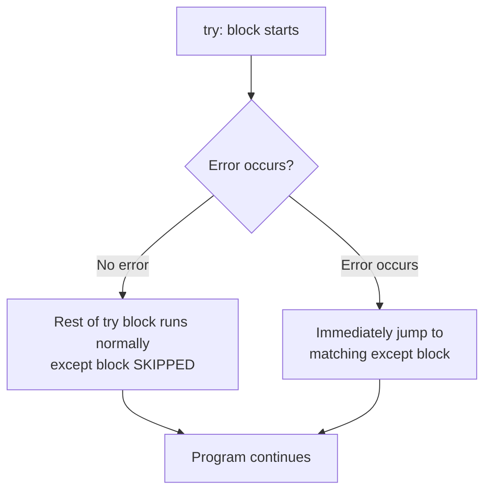
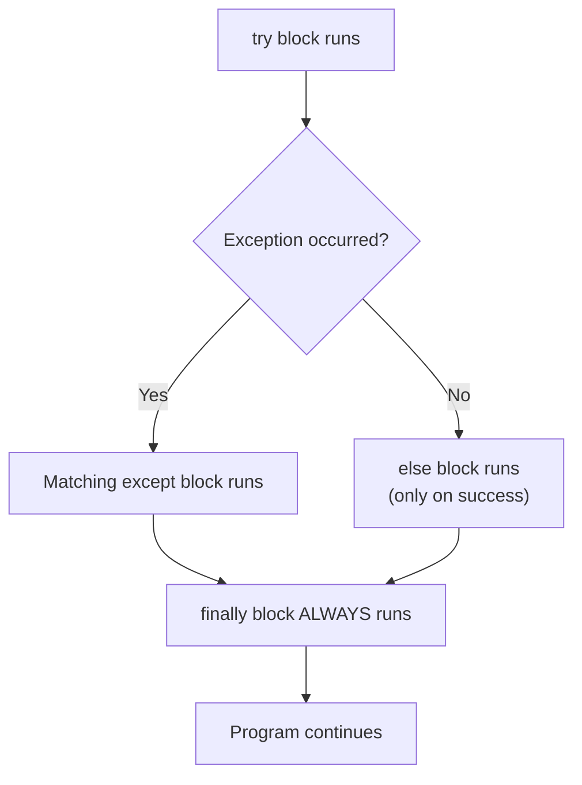
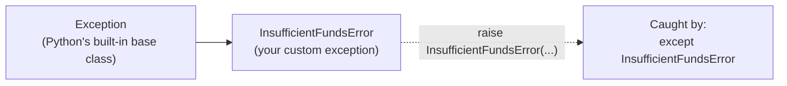
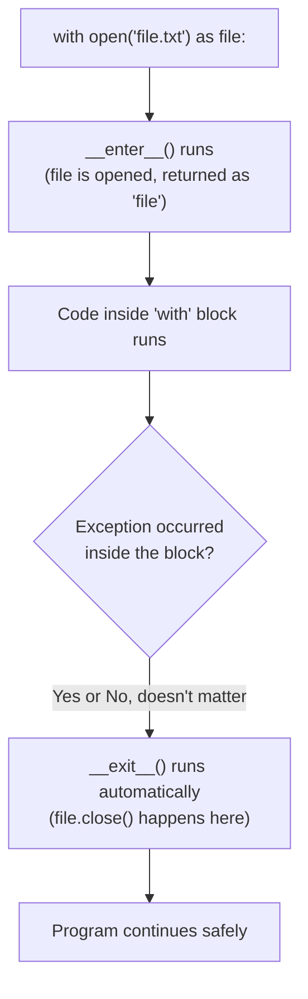
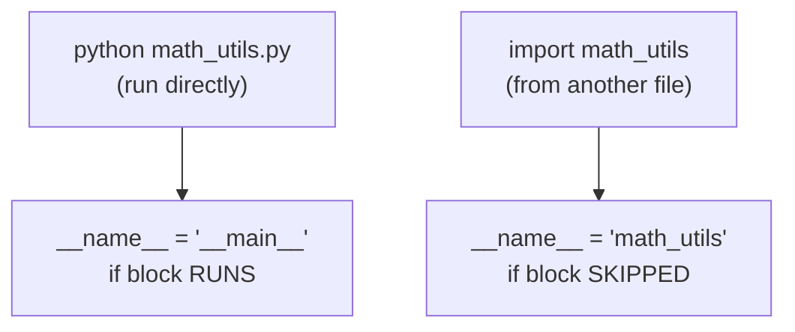
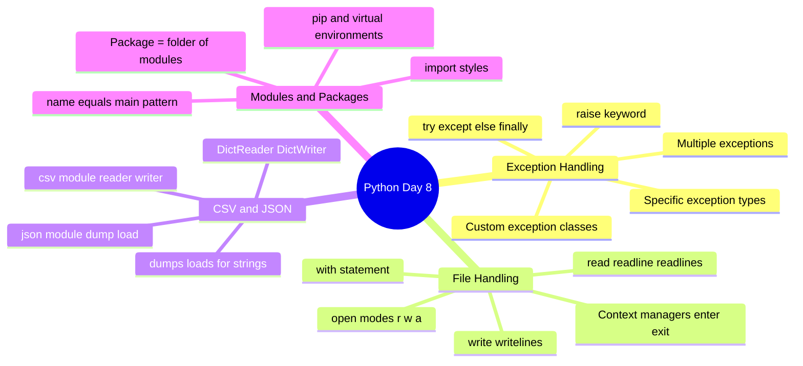

# 📘 DAY 8 — Exception Handling, File Handling & Modules

> **Goal for Today:** Learn how to write programs that fail gracefully instead of crashing (exception handling), how to read and write files (including CSV and JSON), and how to organize code across multiple files using modules and packages. These are essential, everyday-use skills for any real Python program.

---

## Table of Contents
1. [What is an Exception?](#1-what-is-an-exception)
2. [try / except Basics](#2-try--except-basics)
3. [Catching Specific Exception Types](#3-catching-specific-exception-types)
4. [else and finally Clauses](#4-else-and-finally-clauses)
5. [Catching Multiple Exceptions](#5-catching-multiple-exceptions)
6. [Raising Your Own Exceptions](#6-raising-your-own-exceptions)
7. [Custom Exception Classes](#7-custom-exception-classes)
8. [File Handling Basics](#8-file-handling-basics)
9. [The with Statement (Context Managers)](#9-the-with-statement-context-managers)
10. [Reading Files — Different Methods](#10-reading-files--different-methods)
11. [Writing and Appending to Files](#11-writing-and-appending-to-files)
12. [Working with CSV Files](#12-working-with-csv-files)
13. [Working with JSON Files](#13-working-with-json-files)
14. [Modules and Packages](#14-modules-and-packages)
15. [The `if __name__ == "__main__":` Pattern](#15-the-if-__name__--__main__-pattern)
16. [Day 8 Summary Diagram](#16-day-8-summary-diagram)
17. [Practice Questions](#17-practice-questions)

---

## 1. What is an Exception?

An **exception** is an **error that occurs while your program is running** (not a syntax error caught before running, but a genuine problem that happens *during* execution) — like trying to divide by zero, opening a file that doesn't exist, or converting `"abc"` into a number.

### Why does this matter?
Without handling, an exception **crashes your entire program** immediately at the point it occurs. In real applications (especially anything interacting with users, files, or networks), you need your program to **anticipate** possible failures and respond gracefully, instead of just crashing.

```python
number = int("abc")   # ❌ this crashes with: ValueError: invalid literal for int() with base 10: 'abc'
print("This line never runs")   # program stops before reaching here
```

### Real-life analogy
Think of exception handling like a **safety net** for a trapeze artist. The artist (your code) still attempts the risky move (the operation that might fail), but if something goes wrong, the net (your `except` block) catches them instead of letting them crash to the floor (the program crashing entirely).

---

## 2. try / except Basics

```python
try:
    number = int("abc")
    print(number)
except:
    print("Something went wrong!")

print("Program continues normally")
```

**Output:**
```
Something went wrong!
Program continues normally
```

**Line-by-line breakdown:**
- `try:` — marks the beginning of a block of code that **might** raise an exception. Python attempts to run everything inside this block.
- If an error occurs anywhere inside the `try` block, Python **immediately stops** executing the rest of that block and jumps to the matching `except` block.
- `except:` — catches **any** exception (this is a "bare except" — generally **not recommended** in real code, more on this below) and runs its indented block instead of crashing.
- After the `except` block finishes, the program **continues normally** with whatever comes after the entire try/except structure — it doesn't crash.



---

## 3. Catching Specific Exception Types

**Using a bare `except:` (catching everything) is considered bad practice**, because it catches EVERY possible error — including ones you didn't anticipate and may not want to silently hide (like typos in your code, or a `KeyboardInterrupt` when a user presses Ctrl+C). The Pythonic, professional approach is to catch **specific** exception types.

```python
try:
    number = int(input("Enter a number: "))
    result = 100 / number
    print(result)
except ValueError:
    print("That wasn't a valid number!")
except ZeroDivisionError:
    print("You can't divide by zero!")
```

**Explanation:** Python has many **built-in exception types**, each representing a specific kind of error. By naming the specific exception (`ValueError`, `ZeroDivisionError`), you catch **only** that particular problem — if some completely different, unanticipated error occurs, it will still crash the program (which is actually a *good* thing — it means you'll notice and fix genuinely unexpected bugs, rather than silently hiding them).

### Common Built-in Exception Types
| Exception | When It Occurs |
|---|---|
| `ValueError` | Invalid value for an operation (e.g., `int("abc")`) |
| `TypeError` | Wrong data type used in an operation (e.g., `"5" + 5`) |
| `ZeroDivisionError` | Dividing by zero |
| `IndexError` | Accessing a list index that doesn't exist |
| `KeyError` | Accessing a dictionary key that doesn't exist |
| `FileNotFoundError` | Trying to open a file that doesn't exist |
| `AttributeError` | Calling a method/attribute that doesn't exist on an object |
| `NameError` | Using a variable that hasn't been defined |

### Accessing the Actual Error Message
```python
try:
    result = 10 / 0
except ZeroDivisionError as e:     # 'as e' captures the actual exception object
    print(f"Error occurred: {e}")
    # Output: Error occurred: division by zero
```
**Explanation:** `as e` captures the specific exception **object** into a variable, so you can inspect details about what went wrong — very useful for logging or displaying meaningful error messages to users.

---

## 4. else and finally Clauses

### else — runs ONLY if the try block succeeded (no exception occurred)
```python
try:
    number = int(input("Enter a number: "))
except ValueError:
    print("Invalid input!")
else:
    print(f"You entered: {number}")   # only runs if NO exception happened in try
```
**Explanation:** This mirrors the `for-else`/`while-else` concept from Day 2! Here, `else` means "if the try block finished successfully, without hitting any exception." It's a clean way to separate "code that might fail" (in `try`) from "code that should only run after success" (in `else`).

### finally — ALWAYS runs, no matter what
```python
try:
    file = open("data.txt", "r")
    content = file.read()
except FileNotFoundError:
    print("File not found!")
finally:
    print("This ALWAYS runs, whether there was an error or not")
```
**Explanation:** The `finally` block runs **no matter what happens** — whether the `try` succeeded, whether an exception was caught, or even if the exception was NOT caught at all (in which case `finally` still runs before the program crashes). This makes it perfect for **cleanup tasks** — like closing a file or a database connection — that absolutely must happen regardless of success or failure.

### Full Structure — All Four Together
```python
try:
    number = int(input("Enter a number: "))
    result = 100 / number
except ValueError:
    print("That's not a valid number!")
except ZeroDivisionError:
    print("Can't divide by zero!")
else:
    print(f"Result: {result}")
finally:
    print("Execution complete.")
```



---

## 5. Catching Multiple Exceptions

You can catch several exception types with a **single** `except` block by grouping them in a tuple:

```python
try:
    value = int(input("Enter a number: "))
    result = 10 / value
except (ValueError, ZeroDivisionError) as e:
    print(f"An error occurred: {e}")
```
**Explanation:** This catches **either** a `ValueError` OR a `ZeroDivisionError` with the same handling logic. Use this when multiple different errors should be handled in exactly the same way; otherwise, prefer separate `except` blocks (as in section 4) if each error needs its **own specific** response message/logic.

---

## 6. Raising Your Own Exceptions

Sometimes YOU want to deliberately trigger an exception — for example, if user input technically "works" (no built-in error), but violates a business rule you've defined (like a negative age). Use the `raise` keyword.

```python
def set_age(age):
    if age < 0:
        raise ValueError("Age cannot be negative!")
    print(f"Age set to {age}")

set_age(25)     # Age set to 25
set_age(-5)     # ❌ raises: ValueError: Age cannot be negative!
```

**Explanation:** `raise ValueError("...")` deliberately **triggers** an exception, with a custom, meaningful error message. This is how you enforce your own program's rules/constraints. This exception can then be caught elsewhere using a `try/except`, just like any built-in exception:

```python
try:
    set_age(-5)
except ValueError as e:
    print(f"Invalid input: {e}")   # Invalid input: Age cannot be negative!
```

---

## 7. Custom Exception Classes

For larger, real-world programs, it's common to create your **own exception types**, tailored specifically to your application's needs — making your error handling much more precise and readable. This directly uses what you learned about classes and inheritance on Days 6-7!

```python
class InsufficientFundsError(Exception):    # inherits from the built-in Exception class
    """Raised when a withdrawal exceeds the available balance."""
    pass

class BankAccount:
    def __init__(self, balance):
        self.balance = balance

    def withdraw(self, amount):
        if amount > self.balance:
            raise InsufficientFundsError(f"Cannot withdraw {amount}. Balance is only {self.balance}.")
        self.balance -= amount
        print(f"Withdrew {amount}. New balance: {self.balance}")

account = BankAccount(100)

try:
    account.withdraw(500)
except InsufficientFundsError as e:
    print(f"Transaction failed: {e}")
# Transaction failed: Cannot withdraw 500. Balance is only 100.
```

**Explanation:**
- `class InsufficientFundsError(Exception):` — creates a brand-new exception type by **inheriting from Python's built-in `Exception` class** (this is exactly the inheritance concept from Day 7, applied to error handling!). This makes `InsufficientFundsError` behave exactly like a real exception, but with a name that's meaningful and specific to our program.
- The `"""..."""` right after the class definition is a **docstring** — a special string used to document what the class/function does (mentioned briefly on Day 1; this is its proper use case).
- We can now `raise` and `except` this custom exception exactly like any built-in one — but our error messages and error **types** are now much more descriptive and specific to our actual application logic.

**Why create custom exceptions?** In a large real-world application, distinguishing between `InsufficientFundsError`, `InvalidAccountError`, `AccountFrozenError`, etc. (instead of generic `ValueError` for everything) makes your code dramatically easier to debug, maintain, and handle correctly at different points in a large codebase.



---

## 8. File Handling Basics

Now let's shift to reading and writing files — how your program can persist data beyond just running in memory.

### The open() Function
```python
file = open("example.txt", "r")   # opens a file
content = file.read()               # reads its content
print(content)
file.close()                        # IMPORTANT: always close a file when done!
```

### File Modes
| Mode | Meaning |
|---|---|
| `"r"` | Read (default) — file must already exist, or you'll get a `FileNotFoundError` |
| `"w"` | Write — creates a new file, or **completely overwrites/erases** an existing one! |
| `"a"` | Append — adds new content to the **end** of an existing file (creates the file if it doesn't exist) |
| `"r+"` | Read and Write |
| `"rb"` / `"wb"` | Read/Write in **binary** mode (for non-text files like images) |

**⚠️ Critical warning:** Opening a file in `"w"` mode **immediately erases all existing content** the moment the file is opened — even before you write anything new. Be very careful with this mode; it's a common way beginners accidentally lose data.

### Why must you always `.close()` a file?
When a file is open, your program holds a "lock"/connection to it at the operating system level. If you forget to close it:
- Other programs (or even parts of your own program) may not be able to access the file properly.
- Changes you "wrote" might not actually be saved to disk yet (they can remain stuck in a temporary buffer).
- You can run out of available file handles if your program opens many files without closing them (a real issue in larger programs).

**This manual `open()`/`close()` pattern is error-prone** — if an exception occurs between `open()` and `close()`, the `close()` line might never run! This leads us directly to the much better, standard solution: the `with` statement.

---

## 9. The with Statement (Context Managers)

```python
with open("example.txt", "r") as file:
    content = file.read()
    print(content)
# file is AUTOMATICALLY closed here, even if an error occurred inside the 'with' block!
```

**Explanation:** The `with` statement automatically handles **closing the file for you**, guaranteed — even if an exception occurs partway through reading/writing. This is by far the standard, professional, Pythonic way to work with files. You should almost always use `with` instead of manual `open()`/`close()`.

### How `with` Actually Works Internally (great for interviews)
The `with` statement works with objects that implement two special dunder methods: `__enter__` and `__exit__`. This is called the **Context Manager** protocol.
- `__enter__` — runs automatically when entering the `with` block (for files, this is essentially what `open()` already does).
- `__exit__` — runs automatically when **leaving** the `with` block, **no matter how** it's left (normal completion OR an exception) — this is where the file's `.close()` genuinely happens.



**Good to know:** You can build your **own** custom context managers using this same `__enter__`/`__exit__` pattern for things like database connections, locks, or timers — a nice, natural extension of the OOP dunder method knowledge from Day 7.

---

## 10. Reading Files — Different Methods

```python
# Method 1: read() - reads the ENTIRE file as one single string
with open("example.txt", "r") as file:
    content = file.read()
    print(content)

# Method 2: readline() - reads just ONE line at a time
with open("example.txt", "r") as file:
    first_line = file.readline()
    second_line = file.readline()
    print(first_line)
    print(second_line)

# Method 3: readlines() - reads ALL lines into a LIST of strings (one string per line)
with open("example.txt", "r") as file:
    lines = file.readlines()
    print(lines)   # ['Line 1\n', 'Line 2\n', 'Line 3\n']

# Method 4: Looping directly over the file object (MOST memory-efficient for large files!)
with open("example.txt", "r") as file:
    for line in file:
        print(line.strip())    # .strip() removes the trailing newline character '\n'
```

**Explanation of Method 4 (best practice for large files):** Looping directly over the file object reads **one line at a time**, on demand — similar in spirit to how `range()` (Day 2) generates numbers lazily rather than all at once. This means even a multi-gigabyte file can be processed **without** loading the entire thing into memory simultaneously — genuinely important for real-world data processing.

---

## 11. Writing and Appending to Files

```python
# Writing (creates new file OR overwrites existing content!)
with open("output.txt", "w") as file:
    file.write("Hello, World!\n")
    file.write("This is a new line.\n")

# Appending (adds to the END, without erasing existing content)
with open("output.txt", "a") as file:
    file.write("This line is added at the end.\n")

# Writing multiple lines at once from a list
lines = ["First line\n", "Second line\n", "Third line\n"]
with open("output.txt", "w") as file:
    file.writelines(lines)
```
**Explanation:** `.write()` writes a single string (you must manually add `"\n"` for a new line — Python doesn't add it automatically). `.writelines()` writes an entire list of strings at once (again, each string should already include its own `"\n"` if you want them on separate lines).

---

## 12. Working with CSV Files

**CSV (Comma-Separated Values)** is an extremely common, simple format for storing tabular data (like a spreadsheet) as plain text — each line is a row, and commas separate the columns.

```python
import csv    # built-in Standard Library module for working with CSV files

# Writing to a CSV file
with open("students.csv", "w", newline="") as file:
    writer = csv.writer(file)
    writer.writerow(["Name", "Age", "Course"])         # header row
    writer.writerow(["Amit", 21, "Computer Science"])
    writer.writerow(["Riya", 22, "Data Science"])

# Reading from a CSV file
with open("students.csv", "r") as file:
    reader = csv.reader(file)
    for row in reader:
        print(row)   # each row is returned as a LIST of strings
# ['Name', 'Age', 'Course']
# ['Amit', '21', 'Computer Science']
# ['Riya', '22', 'Data Science']
```

**About the `csv` module:** This is another built-in Standard Library module (like `copy` and `functools` from earlier days), specifically designed to correctly handle CSV formatting details (like properly handling commas that appear *inside* a text value, or special quoting rules) that you'd otherwise have to handle manually and error-pronely with basic string splitting.

**Note on `newline=""`:** This is a small but important technical detail when writing CSVs on Windows — without it, you may get unwanted blank rows between each line, due to how Windows handles line endings. Always include it when writing CSVs.

### A More Convenient Way: DictReader / DictWriter
```python
with open("students.csv", "r") as file:
    reader = csv.DictReader(file)     # reads each row as a DICTIONARY, using the header row as keys!
    for row in reader:
        print(row)
# {'Name': 'Amit', 'Age': '21', 'Course': 'Computer Science'}
# {'Name': 'Riya', 'Age': '22', 'Course': 'Data Science'}
```
**Explanation:** `DictReader` automatically uses the **first row** (the header) as dictionary keys, giving you each row as a neat `{column_name: value}` dictionary — often far more convenient and readable than working with plain lists/indices.

---

## 13. Working with JSON Files

**JSON (JavaScript Object Notation)** is the most widely used format for structured data exchange — especially common when working with APIs, web applications, and configuration files. It maps very naturally onto Python's dictionaries and lists.

```python
import json    # built-in Standard Library module for working with JSON

# Python dictionary → JSON file
student = {
    "name": "Amit",
    "age": 21,
    "courses": ["Python", "Data Structures"],
    "is_active": True
}

with open("student.json", "w") as file:
    json.dump(student, file, indent=4)     # writes the dictionary as JSON, 'indent' makes it nicely formatted
```

**What the resulting `student.json` file looks like:**
```json
{
    "name": "Amit",
    "age": 21,
    "courses": [
        "Python",
        "Data Structures"
    ],
    "is_active": true
}
```

```python
# JSON file → Python dictionary
with open("student.json", "r") as file:
    data = json.load(file)
    print(data)          # {'name': 'Amit', 'age': 21, 'courses': [...], 'is_active': True}
    print(data["name"])   # Amit
    print(type(data))     # <class 'dict'>
```

**Explanation:**
- `json.dump(data, file, indent=4)` — converts (**serializes**) a Python object into JSON text and writes it directly to the given file. `indent=4` makes the output human-readable, with 4-space indentation (otherwise it'd all be on one cramped line).
- `json.load(file)` — reads JSON text from a file and converts (**deserializes**) it back into native Python objects (dictionaries, lists, strings, numbers, booleans).

### JSON ↔ Python Type Mapping
| JSON | Python |
|---|---|
| `object {}` | `dict` |
| `array []` | `list` |
| `string` | `str` |
| `number` | `int` or `float` |
| `true` / `false` | `True` / `False` |
| `null` | `None` |

### Bonus: Working with JSON as a plain string (not a file)
```python
data = {"name": "Amit", "age": 21}

json_string = json.dumps(data)      # 'dumps' = "dump string" - converts dict to a JSON STRING (not a file)
print(json_string)                    # '{"name": "Amit", "age": 21}'
print(type(json_string))              # <class 'str'>

parsed_back = json.loads(json_string)   # 'loads' = "load string" - converts JSON STRING back to a dict
print(parsed_back)                       # {'name': 'Amit', 'age': 21}
```
**Naming distinction (a small but real interview detail):** `dump`/`load` work with **files**; `dumps`/`loads` (with the extra "s", meaning "string") work with **strings** directly, without needing a file at all.

---

## 14. Modules and Packages

### What is a Module?
A **module** is simply a single `.py` file containing Python code (functions, classes, variables) that you can **import** and reuse in other files, instead of rewriting everything from scratch. You've actually been using modules this entire course — `csv`, `json`, `copy`, `functools` are all modules from Python's **Standard Library**.

### Creating and Using Your Own Module
Imagine you have a file called `math_utils.py`:
```python
# math_utils.py
def add(a, b):
    return a + b

def subtract(a, b):
    return a - b

PI = 3.14159
```

In another file, `main.py` (in the same folder):
```python
# main.py
import math_utils

print(math_utils.add(5, 3))         # 8
print(math_utils.PI)                # 3.14159
```
**Explanation:** `import math_utils` loads the entire `math_utils.py` file, making everything inside it accessible via `math_utils.functionname` — this dot notation should feel familiar, since it's the exact same syntax used for calling methods on objects.

### Different Import Styles
```python
import math_utils                       # import the whole module; access via math_utils.add()

from math_utils import add                # import ONE specific thing directly; use just add() (no prefix)

from math_utils import add, subtract       # import MULTIPLE specific things

from math_utils import *                    # import EVERYTHING directly (⚠️ generally discouraged - see below)

import math_utils as mu                     # import with an ALIAS (shorter name) - very common practice
print(mu.add(5, 3))
```

**Why avoid `from module import *`?** It dumps **every** name from that module directly into your current file's namespace, which can silently **overwrite** your own variables/functions if they happen to share a name, and makes it unclear (to anyone reading your code) exactly where a given function came from. Explicit imports (`from module import specific_thing`) or aliased imports (`import module as alias`) are considered much better, more professional practice.

### What is a Package?
A **package** is simply a **folder containing multiple related modules**, organized together (like a "module of modules"). For a folder to be recognized as a proper Python package, it traditionally needs a special (often empty) file called `__init__.py` inside it (though modern Python versions have relaxed this requirement somewhat).

```
my_project/
│
├── main.py
└── utilities/              ← this folder is a PACKAGE
    ├── __init__.py
    ├── math_utils.py       ← a MODULE inside the package
    └── string_utils.py     ← another MODULE inside the package
```

```python
# main.py
from utilities import math_utils
from utilities.string_utils import capitalize_words

print(math_utils.add(5, 3))
print(capitalize_words("hello world"))
```

### Virtual Environments and pip (Brief but Important Overview)
- **`pip`** is Python's package installer — used to install third-party libraries (modules/packages that other people have written and published) that don't come built-in with Python. Example: `pip install requests` installs a popular library for making web requests.
- **Virtual environments** are isolated, self-contained Python setups for each individual project — so that different projects on your machine can use different (even conflicting) versions of the same library, without interfering with each other. You create one using `python -m venv myenv`, then activate it before installing project-specific packages. This is standard professional practice for any real project — always use a virtual environment rather than installing everything globally on your system.

---

## 15. The `if __name__ == "__main__":` Pattern

You'll see this exact line at the bottom of nearly every serious Python script, and it's a common thing interviewers ask beginners to explain.

### The Problem It Solves
```python
# math_utils.py
def add(a, b):
    return a + b

print("This module was loaded!")    # ⚠️ this runs EVERY time this file is imported anywhere!
```
If another file does `import math_utils`, that `print()` statement runs immediately, even though we only wanted to *use* the `add()` function — we didn't ask for that print statement to run.

### The Fix
```python
# math_utils.py
def add(a, b):
    return a + b

if __name__ == "__main__":
    print("This only runs if math_utils.py is executed DIRECTLY, not when imported!")
    print(add(5, 3))    # useful for quick testing of this file, on its own
```

**Explanation of how this works:** Every Python file has a special built-in variable called `__name__`.
- If you **run the file directly** (e.g., `python math_utils.py` in the terminal), Python automatically sets `__name__` to the string `"__main__"`.
- If the file is instead **imported** by another file (`import math_utils`), Python sets `__name__` to the module's actual name (`"math_utils"`) instead — **not** `"__main__"`.

So `if __name__ == "__main__":` is really asking: **"Was this file run directly by the user, or was it just imported by some other file?"** This lets you include test code, demos, or "run this script standalone" logic that only executes when the file is the **main** entry point of the program — not when it's silently being reused as a module elsewhere.



---

## 16. Day 8 Summary Diagram



---

## 17. Practice Questions

### Conceptual Questions (for interview prep)
1. What's the difference between `except:` (bare) and `except ValueError:`? Why is the bare version discouraged?
2. When does the `finally` block run, compared to `else`?
3. Why should you use `with open(...)` instead of manually calling `open()` and `close()`?
4. What are `__enter__` and `__exit__`, and how do they relate to the `with` statement?
5. What's the difference between `json.dump()`/`json.load()` and `json.dumps()`/`json.loads()`?
6. What does `if __name__ == "__main__":` actually check, and why is it useful?
7. Why is `from module import *` generally discouraged?
8. How would you create a custom exception, and why would you want to?

### Coding Exercises
1. Write a function that takes two numbers and divides them, properly handling both `ValueError` (if input isn't a number) and `ZeroDivisionError`.
2. Create a custom exception `NegativeValueError` and use it in a function that calculates the square root of a number (raise the exception if the number is negative).
3. Write a program that reads a text file and counts the total number of words in it (use `with` and proper file handling).
4. Create a CSV file of 5 products (`name`, `price`, `quantity`) and write a program that reads it back and calculates the total inventory value.
5. Create a Python dictionary representing a small library catalog (list of books with title/author/year) and save it as a JSON file, then write separate code to load it back and print all book titles.
6. Create your own module `calculator.py` with `add`, `subtract`, `multiply`, `divide` functions, include a `if __name__ == "__main__":` block that tests all four functions, then import and use just the `add` function from a separate `main.py` file.

---

## ✅ Day 8 Checklist — Can you confidently...
- [ ] Write a try/except block that catches a specific exception type?
- [ ] Explain the difference between `else` and `finally` in exception handling?
- [ ] Raise your own exception using `raise`, and create a custom exception class?
- [ ] Open, read, and write a file using the `with` statement?
- [ ] Explain what `__enter__`/`__exit__` do and why `with` is preferred over manual open/close?
- [ ] Read and write both CSV and JSON files?
- [ ] Explain the difference between `dump`/`load` and `dumps`/`loads`?
- [ ] Import a module in at least 3 different ways?
- [ ] Explain exactly what `if __name__ == "__main__":` does and why it's useful?

If you can check all of these confidently, **you're ready for Day 9: Concurrency, Memory & Advanced Interview Topics.**

---

*Next up (Day 9): The GIL (Global Interpreter Lock), threading vs multiprocessing vs asyncio, memory management & garbage collection, decorators, `functools` tools, and type hints.*
