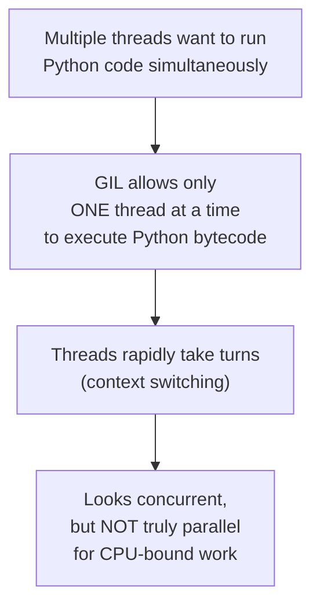
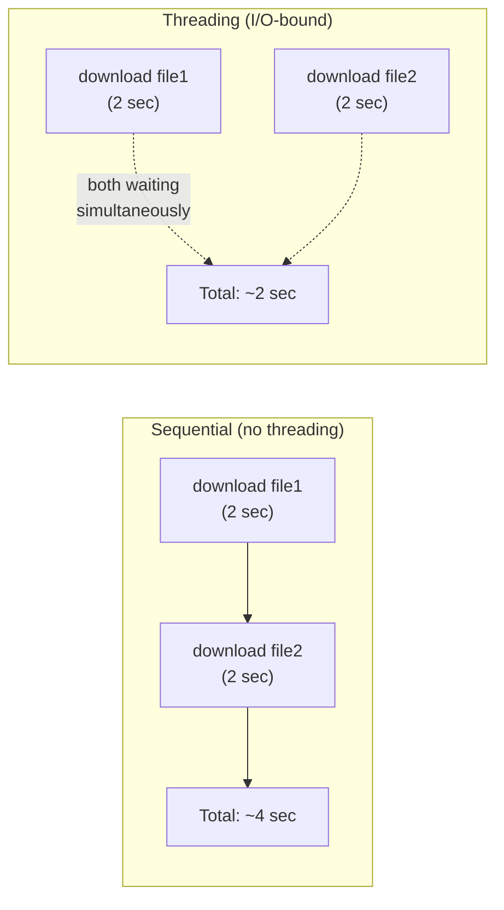
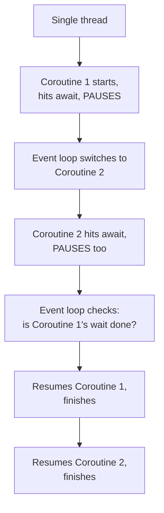
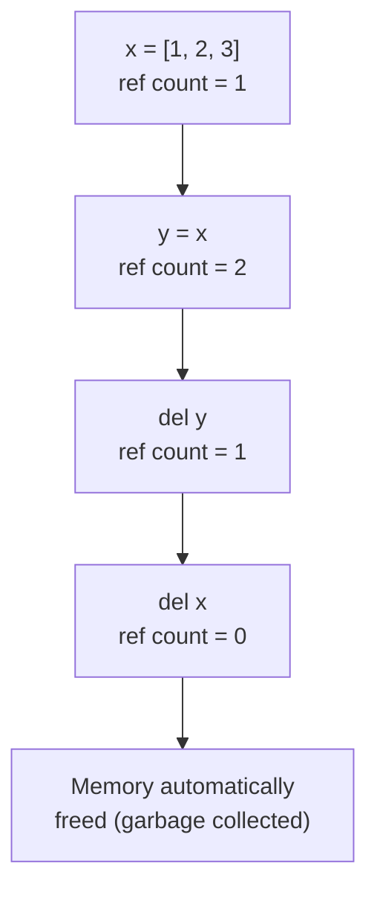
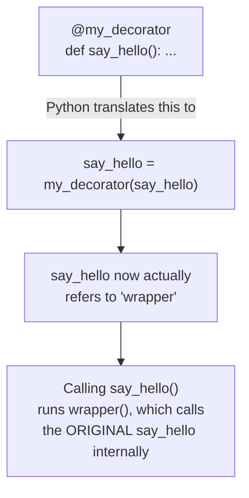
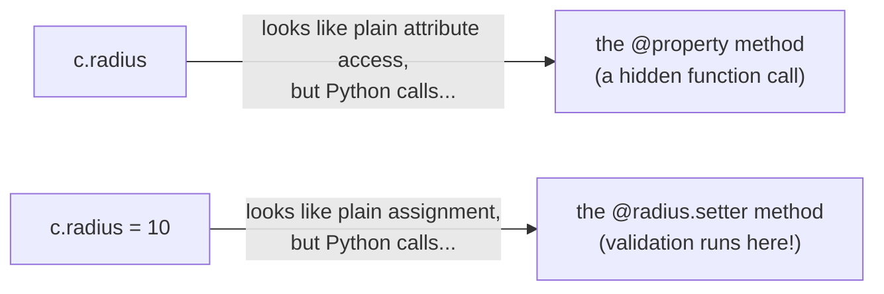
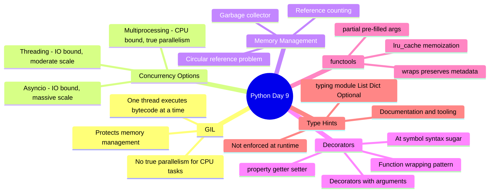

# 📘 DAY 9 — Concurrency, Memory & Advanced Interview Topics

> **Goal for Today:** This is the day that separates beginner Python users from genuinely strong candidates in interviews. You'll learn the GIL (the #1 most-asked Python-specific interview question), threading vs multiprocessing vs asyncio, how memory management and garbage collection work, decorators, useful `functools` tools, and type hints.

---

## Table of Contents
1. [The GIL — Global Interpreter Lock](#1-the-gil--global-interpreter-lock)
2. [Threading](#2-threading)
3. [Multiprocessing](#3-multiprocessing)
4. [Asyncio (Asynchronous Programming)](#4-asyncio-asynchronous-programming)
5. [Threading vs Multiprocessing vs Asyncio — When to Use Which](#5-threading-vs-multiprocessing-vs-asyncio--when-to-use-which)
6. [Memory Management & Reference Counting](#6-memory-management--reference-counting)
7. [Garbage Collection](#7-garbage-collection)
8. [Decorators — The Core Concept](#8-decorators--the-core-concept)
9. [Decorators with Arguments](#9-decorators-with-arguments)
10. [Built-in Decorators: @property](#10-built-in-decorators-property)
11. [Useful functools Tools](#11-useful-functools-tools)
12. [Type Hints & the typing Module](#12-type-hints--the-typing-module)
13. [Day 9 Summary Diagram](#13-day-9-summary-diagram)
14. [Practice Questions](#14-practice-questions)

---

## 1. The GIL — Global Interpreter Lock

**This is quite possibly the single most-asked Python-specific interview question for anyone beyond entry-level.** If you learn to explain just one thing perfectly from this entire 10-day course, make it this.

### What is the GIL?
The **GIL (Global Interpreter Lock)** is a mechanism in **CPython** (the standard, most widely used Python interpreter — the one you've been using this whole time) that allows **only ONE thread to execute Python bytecode at a time**, even on a computer with multiple CPU cores.

### Why does the GIL exist?
Python manages memory automatically (recall: reference counting, covered later today). The GIL exists to protect this memory management system from **race conditions** — situations where multiple threads try to modify the same piece of memory simultaneously, corrupting data. Rather than adding complex, fine-grained locking everywhere in the interpreter (which would slow down single-threaded programs), Python's designers chose one single, simple lock around the entire interpreter.

### Real-life analogy
Imagine a single-lane bridge (your CPU/interpreter) with multiple cars (threads) wanting to cross. Even though there might be multiple lanes theoretically available elsewhere (multiple CPU cores), **only one car can be on the bridge at any given moment**. Cars take turns very quickly, giving the illusion of simultaneous crossing, but strictly speaking, only one is ever actually crossing at any instant.



### The Practical Consequence
Because of the GIL, using **multiple threads in Python does NOT speed up CPU-heavy tasks** (like heavy number crunching) — even on a multi-core machine, only one thread actually executes Python code at any given instant.

**However**, threading is STILL genuinely useful for **I/O-bound tasks** — situations where your program spends most of its time **waiting** (for a file to be read, a network request to complete, a database query to return) rather than actively computing. This is because the GIL is **released** while a thread is waiting on I/O, allowing other threads to run during that wait time.

### Quick Interview-Ready Summary
> *"The GIL is a lock in CPython that ensures only one thread executes Python bytecode at a time, protecting the interpreter's memory management from race conditions. This means Python threads don't achieve true parallelism for CPU-bound tasks, but they're still effective for I/O-bound tasks, since the GIL is released during I/O waits. To achieve genuine CPU parallelism in Python, you need multiprocessing instead, which uses separate processes, each with their own Python interpreter and memory space, and therefore their own separate GIL."*

---

## 2. Threading

**Threading** runs multiple "threads" of execution **within the same process**, sharing the same memory space. As established above, due to the GIL, threads in Python are best suited for **I/O-bound** tasks (waiting on files, network requests, user input) — not CPU-heavy computation.

```python
import threading
import time

def download_file(filename):
    print(f"Starting download: {filename}")
    time.sleep(2)    # simulates waiting for a slow network download (I/O-bound wait)
    print(f"Finished download: {filename}")

# Without threading - runs one after another (sequential)
start = time.time()
download_file("file1.txt")
download_file("file2.txt")
print(f"Sequential time: {time.time() - start:.2f} seconds")   # ~4 seconds

# With threading - runs "simultaneously" (concurrently)
start = time.time()
t1 = threading.Thread(target=download_file, args=("file1.txt",))
t2 = threading.Thread(target=download_file, args=("file2.txt",))

t1.start()    # starts the thread
t2.start()

t1.join()     # waits for t1 to finish before continuing
t2.join()     # waits for t2 to finish before continuing

print(f"Threaded time: {time.time() - start:.2f} seconds")   # ~2 seconds (both waited SIMULTANEOUSLY!)
```

**Explanation:**
- `threading.Thread(target=function, args=(...))` — creates a new thread that will run the given function with the given arguments, once started.
- `.start()` — actually begins running the thread.
- `.join()` — pauses the **main** program at this line, waiting until that specific thread has fully finished, before moving on. Without `.join()`, your main program might finish (and the whole program could exit) before the threads complete their work.
- Since both "downloads" are just `time.sleep()` (simulating **waiting**, not actual CPU computation), the GIL is released during each sleep, allowing both threads to "wait" at the same time — cutting total wait time roughly in half.



---

## 3. Multiprocessing

**Multiprocessing** runs code in **entirely separate processes**, each with its **own** Python interpreter and its **own** memory space — meaning each process has its **own separate GIL**. This is how Python achieves **genuine parallelism** on multi-core CPUs, making it the correct choice for **CPU-bound** tasks (heavy computation — math, image processing, data crunching).

```python
import multiprocessing
import time

def heavy_computation(n):
    total = sum(i * i for i in range(n))
    print(f"Computed sum of squares up to {n}: {total}")

if __name__ == "__main__":     # IMPORTANT: multiprocessing requires this guard on some systems!
    start = time.time()

    p1 = multiprocessing.Process(target=heavy_computation, args=(10_000_000,))
    p2 = multiprocessing.Process(target=heavy_computation, args=(10_000_000,))

    p1.start()
    p2.start()

    p1.join()
    p2.join()

    print(f"Multiprocessing time: {time.time() - start:.2f} seconds")
```

**Explanation:** The syntax closely mirrors threading (`Process` instead of `Thread`, but the same `.start()`/`.join()` pattern) — but internally, each `Process` is a **completely separate program**, with its own memory and its own GIL, genuinely running **at the same time** on different CPU cores. This is why multiprocessing (not threading) is the correct tool when you need real parallel computation.

**Why `if __name__ == "__main__":` is important here (connecting back to Day 8!):** On some operating systems (notably Windows), each new process **re-imports** the main script from scratch to set itself up. Without the `__main__` guard, this could cause each new process to recursively spawn even more processes infinitely! This is a very practical, real-world reason the pattern from Day 8 genuinely matters.

**Trade-off:** Multiprocessing has more **overhead** than threading (creating a whole new process with its own memory space is "heavier"/slower than creating a lightweight thread), and sharing data between processes is more complex (since they don't share memory by default — you'd need special tools like `multiprocessing.Queue` or `multiprocessing.shared_memory`).

---

## 4. Asyncio (Asynchronous Programming)

**Asyncio** is a **third** approach to concurrency, using a single thread but cleverly switching between multiple tasks whenever one is **waiting** — achieving concurrency **without** the overhead of multiple threads or processes at all. It's Python's modern, increasingly popular solution for I/O-bound tasks (especially with many, many simultaneous operations — like a web server handling thousands of connections).

```python
import asyncio

async def download_file(filename):     # 'async def' defines a COROUTINE (a special, pausable function)
    print(f"Starting download: {filename}")
    await asyncio.sleep(2)               # 'await' pauses THIS task, letting others run during the wait
    print(f"Finished download: {filename}")

async def main():
    await asyncio.gather(                # runs multiple coroutines CONCURRENTLY
        download_file("file1.txt"),
        download_file("file2.txt")
    )

asyncio.run(main())    # starts the asyncio event loop and runs 'main'
```

**Explanation of key new keywords:**
- `async def` — defines a **coroutine**, a special kind of function that can be **paused and resumed**, instead of running start-to-finish uninterrupted like a normal function.
- `await` — pauses the **current** coroutine at this exact point (typically while waiting for something, like `asyncio.sleep()` or a network request), and lets the **event loop** run some other waiting coroutine in the meantime, then comes back once the awaited thing is ready.
- `asyncio.gather(...)` — runs multiple coroutines **concurrently**, all managed within a single thread.
- `asyncio.run(main())` — starts Python's **event loop** (the underlying engine that manages switching between coroutines) and runs your top-level coroutine.

### The Big Conceptual Difference from Threading
Threading achieves concurrency by having the **operating system** rapidly switch between threads (somewhat unpredictably, at any point). Asyncio achieves concurrency **cooperatively** — a coroutine explicitly says "I'm waiting now, someone else can run" via `await`, and control only switches at these **specific, deliberate points**. This makes asyncio code more predictable (no confusing race conditions from unexpected interruptions) but requires you to write functions specifically designed for this pattern (`async def`, `await`) — you can't just drop `await` into any ordinary function.



---

## 5. Threading vs Multiprocessing vs Asyncio — When to Use Which

| Approach | Best For | Achieves True Parallelism? | Overhead |
|---|---|---|---|
| **Threading** | I/O-bound tasks (file/network waiting), moderate number of tasks | ❌ No (limited by GIL) | Low-Medium |
| **Multiprocessing** | CPU-bound tasks (heavy computation) | ✅ Yes (separate GIL per process) | High (separate memory per process) |
| **Asyncio** | I/O-bound tasks, especially MANY simultaneous operations (e.g., thousands of network connections) | ❌ No (single thread) | Very Low |

```mermaid
flowchart TD
    Start["What kind of task<br/>are you optimizing?"] --> Q1{"CPU-heavy computation<br/>(math, image processing)?"}
    Q1 -->|Yes| MP["Use MULTIPROCESSING<br/>Real parallelism, bypasses GIL"]
    Q1 -->|No, it's I/O-bound<br/>(waiting on network/files)| Q2{"How many concurrent<br/>tasks/connections?"}
    Q2 -->|Few to moderate| TH["Use THREADING<br/>Simple, works well enough"]
    Q2 -->|Many (hundreds/thousands)| AS["Use ASYNCIO<br/>Very lightweight, scales well"]
```

**Interview-ready summary:** *"Use multiprocessing for CPU-bound work to genuinely bypass the GIL. Use threading or asyncio for I/O-bound work, where the GIL isn't the bottleneck. Asyncio scales better than threading for a very large number of concurrent I/O operations, since it avoids the overhead of creating many OS-level threads."*

---

## 6. Memory Management & Reference Counting

Let's return to how Python actually manages memory internally — genuinely useful for interviews, and it deepens your understanding of concepts from earlier days (like mutability, from Day 3).

### Reference Counting
Every object in Python has an internal **reference count** — a running tally of **how many variables/places** are currently pointing to it. When this count drops to **zero** (nothing references the object anymore), Python automatically frees that memory.

```python
import sys

x = [1, 2, 3]
print(sys.getrefcount(x))   # shows the reference count (will be slightly higher than expected,
                              # since passing x into getrefcount() itself temporarily adds a reference)

y = x     # now TWO variables point to the same list
print(sys.getrefcount(x))   # count increased

del y     # removes one reference
print(sys.getrefcount(x))   # count decreased back down
```

**Explanation:** Every time you do `y = x`, create a new variable referencing an existing object, add it to a list, or pass it into a function, Python's reference count for that object **increases**. Every time a variable goes out of scope, gets reassigned, or is explicitly `del`eted, the count **decreases**. Once it hits zero, the object is no longer reachable by any part of your program, and Python's memory manager reclaims that memory automatically.



---

## 7. Garbage Collection

Reference counting alone has one specific weakness: it **cannot detect circular references** — situations where two (or more) objects reference each other, keeping their reference counts above zero **forever**, even though nothing else in the program can actually reach them anymore.

### The Circular Reference Problem
```python
class Node:
    def __init__(self):
        self.other = None

a = Node()
b = Node()

a.other = b    # a references b
b.other = a    # b references a

del a
del b
# Even after deleting BOTH variables, 'a' and 'b' still reference EACH OTHER internally!
# Reference counting alone would never reach 0 for either object - memory leak!
```

**This is where Python's Garbage Collector (GC) comes in.** In addition to reference counting, Python periodically runs a separate garbage collection algorithm (specifically designed to detect "islands" of objects that only reference each other, with no external references reaching them) and cleans these up too, preventing memory leaks.

```python
import gc

gc.collect()   # manually triggers a garbage collection cycle (rarely needed manually, but good to know it exists)
```

**Interview-ready summary:** *"Python primarily uses reference counting for memory management — when an object's reference count hits zero, it's immediately freed. However, reference counting alone can't handle circular references, where objects reference each other in a cycle with no external references. Python's garbage collector specifically detects and cleans up these circular reference cycles, running periodically in the background, in addition to the constant reference counting."*

---

## 8. Decorators — The Core Concept

**Decorators** are one of Python's most powerful and distinctive features — a way to **modify or enhance a function's behavior without changing the function's own code**. This directly builds on **closures**, which you learned about on Day 5 — if that concept felt shaky, this is a great moment to revisit it.

### Building Up to a Decorator, Step by Step

**Step 1: Recall that functions can be passed as arguments and returned from other functions (Day 5).**
```python
def my_decorator(func):
    def wrapper():
        print("Something happens BEFORE the function runs")
        func()                                                  # calls the ORIGINAL function
        print("Something happens AFTER the function runs")
    return wrapper    # returns the new, enhanced version

def say_hello():
    print("Hello!")

decorated_function = my_decorator(say_hello)   # manually "decorating" say_hello
decorated_function()
# Something happens BEFORE the function runs
# Hello!
# Something happens AFTER the function runs
```

**Explanation:** `my_decorator` takes a function (`func`) as input, and defines a **new** function (`wrapper`) that adds extra behavior **before and after** calling the original `func`. It then returns this new `wrapper` function. This is exactly the closure pattern from Day 5 — `wrapper` "remembers" `func` even after `my_decorator` has finished running.

**Step 2: Python's `@` syntax is just convenient shorthand for exactly this pattern.**
```python
@my_decorator
def say_hello():
    print("Hello!")

say_hello()
# Something happens BEFORE the function runs
# Hello!
# Something happens AFTER the function runs
```

**Explanation:** `@my_decorator` placed directly above `def say_hello():` is **exactly equivalent** to writing `say_hello = my_decorator(say_hello)` — Python automatically "wraps" `say_hello` with `my_decorator`'s enhanced behavior, the moment it's defined. This is purely **syntactic sugar** (a nicer, shorter way to write something you could technically write manually) for the manual pattern in Step 1.



### A Practical Example: Timing a Function
```python
import time

def timer(func):
    def wrapper(*args, **kwargs):     # using *args/**kwargs (Day 5!) so this works with ANY function signature
        start = time.time()
        result = func(*args, **kwargs)   # calls the original function with whatever arguments it received
        end = time.time()
        print(f"{func.__name__} took {end - start:.4f} seconds")
        return result                      # IMPORTANT: pass through the original return value!
    return wrapper

@timer
def slow_function():
    time.sleep(1)
    print("Function complete")

slow_function()
# Function complete
# slow_function took 1.0002 seconds
```

**Explanation of `*args, **kwargs` here:** Since decorators are meant to be **reusable** across many different functions (which might take different numbers/types of arguments), `wrapper(*args, **kwargs)` allows this decorator to work correctly no matter what arguments the decorated function actually needs — this directly reuses the Day 5 concept in a genuinely practical, real-world way.

---

## 9. Decorators with Arguments

Sometimes you want the decorator **itself** to accept configuration arguments (not just the function it's decorating) — this requires an extra layer of nesting (a function that returns a decorator, which returns a wrapper).

```python
def repeat(times):                        # this OUTER function takes the decorator's OWN argument
    def decorator(func):                    # this is the actual decorator
        def wrapper(*args, **kwargs):
            for _ in range(times):
                result = func(*args, **kwargs)
            return result
        return wrapper
    return decorator

@repeat(times=3)
def greet(name):
    print(f"Hello, {name}!")

greet("Amit")
# Hello, Amit!
# Hello, Amit!
# Hello, Amit!
```

**Explanation:** `@repeat(times=3)` first **calls** `repeat(3)`, which returns the actual `decorator` function — **that's** what gets applied to `greet`. This is genuinely three levels of nested functions (`repeat` → `decorator` → `wrapper`), which can feel like a lot at first — but it follows the exact same closure principles from Day 5, just with one extra layer for the decorator's own configuration argument.

---

## 10. Built-in Decorators: @property

You already met `@staticmethod` and `@classmethod` on Day 6 — here's another essential built-in decorator: `@property`. This connects directly back to the encapsulation discussion from Day 6.

```python
class Circle:
    def __init__(self, radius):
        self._radius = radius     # "protected" convention, from Day 6

    @property
    def radius(self):              # this method can now be accessed LIKE AN ATTRIBUTE, not a method call!
        return self._radius

    @radius.setter
    def radius(self, value):       # this runs whenever someone tries to SET circle.radius = something
        if value < 0:
            raise ValueError("Radius cannot be negative!")
        self._radius = value

    @property
    def area(self):                 # a "computed" property - calculated fresh each time it's accessed
        return 3.14159 * self._radius ** 2

c = Circle(5)
print(c.radius)     # 5          ← accessed like an attribute, NOT c.radius()!
print(c.area)         # 78.53975   ← also looks like a plain attribute, but is actually calculated live

c.radius = 10        # this actually calls our radius.setter method behind the scenes!
print(c.radius)       # 10
print(c.area)          # 314.159

c.radius = -5         # ❌ raises ValueError: Radius cannot be negative!
```

**Explanation — why is this genuinely useful?**
- `@property` lets you define a method that behaves **exactly like a plain attribute** from the outside (`c.radius`, not `c.radius()`), while still secretly running actual code (validation, computed values) behind the scenes.
- `@radius.setter` lets you add **validation logic** for whenever someone tries to **assign** a new value — here, blocking negative radius values, something a plain public attribute could never enforce.
- This is Python's proper, Pythonic solution to the encapsulation question from Day 6: instead of making `radius` fully private and forcing users to call `get_radius()`/`set_radius()` methods (the more Java-like approach), Python lets users interact with `circle.radius` completely naturally, like a normal attribute — while you retain full control and validation behind the scenes.



---

## 11. Useful functools Tools

We met `functools.reduce` on Day 5 — here are a few more genuinely useful tools from this same Standard Library module.

### `@lru_cache` — Automatic Memoization
Remember the inefficient recursive Fibonacci from Day 5, which recalculated the same values repeatedly? Here's the fix:

```python
from functools import lru_cache

@lru_cache(maxsize=None)     # maxsize=None means "cache unlimited results"
def fibonacci(n):
    if n <= 1:
        return n
    return fibonacci(n - 1) + fibonacci(n - 2)

print(fibonacci(35))    # calculates almost instantly, thanks to caching!
```

**Explanation:** `@lru_cache` automatically **remembers (caches)** the result of a function call for each unique set of arguments. If `fibonacci(10)` is called again later, Python doesn't recompute it — it instantly returns the **previously cached** result. ("LRU" stands for "Least Recently Used" — describing the specific strategy used to decide which old cached results to discard first, if `maxsize` is limited.) This turns an exponentially slow naive recursive Fibonacci into a genuinely fast function, with literally just one added line of code — a great, concrete demonstration of a decorator's real power.

### `functools.partial` — Pre-filling Function Arguments
```python
from functools import partial

def multiply(a, b):
    return a * b

double = partial(multiply, 2)    # "pre-fills" the first argument (a=2), leaving 'b' to be provided later
print(double(5))    # 10   (equivalent to multiply(2, 5))
print(double(10))   # 20   (equivalent to multiply(2, 10))
```
**Explanation:** `partial()` creates a **new function** based on an existing one, with some arguments already "locked in." This is useful when you need to pass a function somewhere (like into `map()`) but want to pre-configure some of its arguments in advance.

### `functools.wraps` — Preserving Function Metadata in Decorators
```python
from functools import wraps

def my_decorator(func):
    @wraps(func)    # preserves the ORIGINAL function's name/docstring, even though it's now wrapped
    def wrapper(*args, **kwargs):
        return func(*args, **kwargs)
    return wrapper

@my_decorator
def greet():
    """Says hello."""
    print("Hello!")

print(greet.__name__)    # 'greet'   (WITHOUT @wraps, this would incorrectly show 'wrapper'!)
print(greet.__doc__)     # 'Says hello.'
```
**Explanation:** Without `@wraps(func)`, a decorated function's `__name__` and docstring would get **overwritten** by the inner `wrapper` function's own metadata, making debugging confusing (e.g., error messages/documentation tools would show "wrapper" instead of the actual, meaningful function name). `@wraps` fixes this by copying over the original function's metadata onto the wrapper. **Best practice: always use `@wraps` in any decorator you write.**

---

## 12. Type Hints & the typing Module

Since you come from Java/C++ (statically-typed languages), this section should feel especially familiar and welcome. **Type hints** let you optionally annotate what types of values a function expects and returns — purely for documentation/tooling purposes (Python does **NOT** enforce these at runtime; they're a signal, not a rule).

### Basic Type Hints
```python
def add(a: int, b: int) -> int:     # 'a' and 'b' should be int; function returns an int
    return a + b

name: str = "Amit"      # type hints work on regular variables too
age: int = 25
price: float = 99.99
is_active: bool = True
```

**Important clarification:** These hints are **NOT enforced** by Python itself at runtime — you could still technically call `add("hello", "world")` and Python won't stop you (it would just fail inside the function when trying to do `"hello" + "world"` incorrectly, or worse, silently "succeed" doing string concatenation instead of the intended math). Type hints exist purely to:
- Make code **self-documenting** — anyone reading the function signature instantly understands what's expected.
- Allow **IDE tools** (like VS Code) to catch potential type mismatches **before** running the code, and provide better autocomplete suggestions.
- Enable external **static type checkers** (like `mypy`), which CAN be run separately to actually enforce and catch type errors, as a genuinely separate step from just running your Python code normally.

### Type Hints for Collections (using the `typing` module)
```python
from typing import List, Dict, Tuple, Optional

def get_names(students: List[str]) -> List[str]:      # a list of strings, returning a list of strings
    return [name.upper() for name in students]

def get_student_ages(data: Dict[str, int]) -> None:     # dict with string keys, int values; returns nothing
    for name, age in data.items():
        print(f"{name}: {age}")

def find_student(name: str) -> Optional[str]:             # might return a str, OR might return None
    students = {"Amit": "Found"}
    return students.get(name)
```

**Explanation:**
- `List[str]` — a list where every item is a string.
- `Dict[str, int]` — a dictionary with string keys and integer values.
- `Optional[str]` — means "either a `str`, OR `None`" — very useful for functions that might not find/return anything.
- `-> None` — signals the function doesn't return any meaningful value (just like a function with no `return` statement, from Day 5).

**Note:** In modern Python (3.9+), you can often use the plain built-in types directly (`list[str]`, `dict[str, int]`) without needing to `import` from `typing` at all — but you'll still see the `typing` module used constantly in real-world/older codebases, so it's important to recognize both styles.

**Why this matters for interviews:** Being comfortable with type hints signals that you write **production-quality, maintainable** code — increasingly expected in professional Python roles, especially at companies with larger codebases where type safety genuinely helps prevent bugs at scale.

---

## 13. Day 9 Summary Diagram



---

## 14. Practice Questions

### Conceptual Questions (for interview prep — these are HIGH PRIORITY for interviews)
1. Explain the GIL in your own words, in under 30 seconds, as if answering in an interview.
2. Why doesn't threading speed up CPU-bound tasks in Python, but multiprocessing does?
3. When would you choose asyncio over threading?
4. What's the difference between reference counting and garbage collection? Why does Python need both?
5. Explain how the `@` decorator syntax relates to closures (from Day 5).
6. Why must a decorator's `wrapper` function use `*args, **kwargs`?
7. What does `@property` actually let you do that a plain attribute can't?
8. Are type hints enforced by Python at runtime? What's their actual purpose then?

### Coding Exercises
1. Write a decorator `log_calls` that prints the function name and its arguments every time the decorated function is called.
2. Use `@lru_cache` to optimize a recursive function that calculates the nth Fibonacci number, and compare (conceptually) its speed to the non-cached version for `fibonacci(30)`.
3. Create a `Temperature` class with a `celsius` attribute, and use `@property`/`@setter` to add a computed `fahrenheit` property (read-only) that's always automatically derived from `celsius`.
4. Write a simple threading example that "downloads" 3 files concurrently (using `time.sleep()` to simulate the download) and prints the total time taken.
5. Add type hints to a function you wrote on a previous day (e.g., the `is_prime` function from Day 5), including its parameter and return types.
6. Write a decorator `repeat(n)` that runs the decorated function `n` times (similar to the example in section 9), and use it on a simple print function.

---

## ✅ Day 9 Checklist — Can you confidently...
- [ ] Explain the GIL clearly and concisely, as if in an interview?
- [ ] Explain when to use threading vs multiprocessing vs asyncio?
- [ ] Explain reference counting and why garbage collection is still needed on top of it?
- [ ] Write a basic decorator from scratch, and explain how it relates to closures?
- [ ] Write a decorator that itself accepts arguments?
- [ ] Explain what `@property` does and why it's more Pythonic than getter/setter methods?
- [ ] Use `@lru_cache` to optimize a recursive function?
- [ ] Write basic type hints for a function's parameters and return value?

If you can check all of these confidently, **you're ready for Day 10: Interview Mastery + Teaching Practice — the final day!**

---

*Next up (Day 10 — Final Day): Rapid-fire interview Q&A, Pythonic coding patterns, common gotchas, a complete mini-project, and a teach-back exercise where you explain concepts back to me.*
