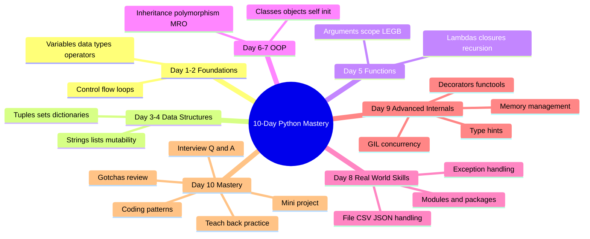

# 📘 DAY 10 (FINAL DAY) — Interview Mastery + Teaching Practice

> **Goal for Today:** Consolidate everything from the past 9 days into interview-ready answers, practice common Pythonic coding patterns, review the classic "gotchas" that trip up even experienced developers, build one complete mini-project tying everything together, and finish with a teach-back exercise to truly cement your understanding.

---

## Table of Contents
1. [How to Use This Final Day](#1-how-to-use-this-final-day)
2. [Rapid-Fire Interview Q&A (30+ Questions)](#2-rapid-fire-interview-qa-30-questions)
3. [Common Coding Patterns (Pythonic Style)](#3-common-coding-patterns-pythonic-style)
4. [The Ultimate Gotchas List](#4-the-ultimate-gotchas-list)
5. [Time & Space Complexity Basics](#5-time--space-complexity-basics)
6. [Mini-Project: Student Management System](#6-mini-project-student-management-system)
7. [The Teach-Back Exercise](#7-the-teach-back-exercise)
8. [10-Day Journey — Full Recap Map](#8-10-day-journey--full-recap-map)
9. [Where to Go From Here](#9-where-to-go-from-here)

---

## 1. How to Use This Final Day

Today is different from the previous 9 — there's very little **new** material. Instead, this is a **consolidation and practice day**. Here's how to get the most value:

1. **Go through the Q&A section** — cover the answer, try to answer each question out loud yourself first, THEN check against the explanation.
2. **Type out the coding patterns** — don't just read them, actually run them.
3. **Build the mini-project** — this is where everything from Days 1-9 comes together in one real program.
4. **Do the teach-back exercise at the end** — this is the single most important part for solidifying your understanding, especially since your goal is to teach others.

---

## 2. Rapid-Fire Interview Q&A (30+ Questions)

Organized by topic, matching your 10-day journey. Try answering before reading the explanation.

### Fundamentals (Days 1-2)
**Q1: What's the difference between a compiled and an interpreted language?**
> Compiled languages translate the entire program into machine code before running (producing an executable). Interpreted languages, like Python, translate and execute code line-by-line, on the fly, via an interpreter — Python specifically compiles to bytecode first, then the Python Virtual Machine executes that bytecode.

**Q2: What's the difference between `is` and `==`?**
> `==` checks if two variables have **equal values**. `is` checks if two variables point to the **exact same object in memory** (identity comparison). Two different objects can have equal values (`==` is `True`) while being different objects (`is` is `False`).
```python
a = [1, 2, 3]
b = [1, 2, 3]
print(a == b)   # True  (same values)
print(a is b)   # False (different objects in memory!)

c = a
print(a is c)   # True  (c points to the SAME object as a)
```

**Q3: Why is `range(5)` equal to `0,1,2,3,4` and not `1,2,3,4,5`?**
> Python's `range()`, like slicing, follows the convention that the `stop` value is **exclusive** (not included). This keeps it consistent with `range(len(items))` correctly covering all valid indices of a list.

**Q4: What are truthy and falsy values?**
> Values Python treats as `True` or `False` in a boolean context, even if they aren't literally `True`/`False`. Falsy: `0`, `0.0`, `""`, `[]`, `{}`, `()`, `None`, `False`. Everything else is truthy.

### Data Structures (Days 3-4)
**Q5: What's the difference between mutable and immutable data types?**
> Mutable objects (list, dict, set) can be changed in place after creation. Immutable objects (int, str, tuple) cannot — any "change" actually creates a brand new object in memory.

**Q6: Why can't a list be a dictionary key, but a tuple can?**
> Dictionary keys must be hashable, which requires immutability — Python computes a hash (a fixed fingerprint) for each key to locate its value quickly. Since lists can change after creation, their hash would become unreliable, so Python disallows them as keys. Tuples, being immutable, are safely hashable.

**Q7: What's the difference between a shallow copy and a deep copy?**
> A shallow copy (`.copy()`) creates a new outer container, but nested mutable objects inside it are still shared with the original. A deep copy (`copy.deepcopy()`) recursively copies every nested object too, creating a fully independent copy.

**Q8: `.append()` vs `.extend()` — what's the difference?**
> `.append()` adds exactly one item to a list (even if that item is itself a list, it gets added as a single nested item). `.extend()` adds each element of an iterable individually.

**Q9: `.sort()` vs `sorted()` — what's the difference?**
> `.sort()` is a list method that sorts in place and returns `None`. `sorted()` is a built-in function that works on any iterable and returns a brand new sorted list, leaving the original untouched.

### Functions & Scope (Day 5)
**Q10: Why is using a mutable default argument (like `[]`) dangerous?**
> Default argument values are evaluated only ONCE, at function definition time — not on every call. Since lists are mutable, that same list object gets reused and modified across every call that doesn't pass its own list, causing unexpected shared state. Fix: use `None` as the default, and create a fresh list inside the function.

**Q11: Explain the LEGB rule.**
> When Python looks up a variable name, it searches in this order: Local (current function) → Enclosing (any outer function, if nested) → Global (top-level of the script) → Built-in (Python's own names like `print`). It stops at the first match found.

**Q12: What's the difference between `*args` and `**kwargs`?**
> `*args` collects extra positional arguments into a tuple. `**kwargs` collects extra keyword arguments into a dictionary.

**Q13: What is a closure?**
> A function that "remembers" variables from its enclosing scope, even after the outer function has finished executing. This happens when an inner function is returned from an outer function and references the outer function's variables.

### OOP (Days 6-7)
**Q14: Why does Python require `self` to be explicitly written, unlike Java's implicit `this`?**
> Python doesn't have hidden/implicit mechanisms for method calls — `self` is just a regular parameter that Python automatically fills in with the calling object when you use `object.method()` syntax. This reflects Python's "explicit is better than implicit" philosophy.

**Q15: What's the difference between an instance method, class method, and static method?**
> Instance methods (`self`) access both instance and class data. Class methods (`@classmethod`, `cls`) access only class-level data, not instance-specific data. Static methods (`@staticmethod`) access neither — they behave like plain functions logically grouped inside the class.

**Q16: How does Python handle encapsulation differently from Java?**
> Python has no true private variables enforced by the compiler. It uses naming conventions instead: single underscore (`_var`) signals "internal use, please don't touch" (not enforced), and double underscore (`__var`) triggers name mangling (renamed internally to `_ClassName__var`), making accidental external access harder but not impossible.

**Q17: What is MRO, and how does Python resolve it?**
> Method Resolution Order — the specific sequence Python follows when searching for a method/attribute across a class hierarchy, especially relevant with multiple inheritance. Python uses the C3 Linearization algorithm; you can check it via `ClassName.mro()`.

**Q18: What is duck typing?**
> "If it walks like a duck and quacks like a duck, it's a duck" — Python cares whether an object HAS the needed method/attribute, not what class it officially belongs to. There's no formal interface requirement; compatibility is checked at runtime, when the method is actually called.

**Q19: What's the difference between `__str__` and `__repr__`?**
> `__str__` provides a readable, user-friendly string representation (used by `print()`). `__repr__` provides an unambiguous, developer-facing representation, ideally one that could recreate the object if run in Python. If only `__repr__` exists, Python falls back to it for `print()` too.

### Exceptions & Files (Day 8)
**Q20: Why is a bare `except:` considered bad practice?**
> It catches EVERY exception, including ones you didn't anticipate (like typos causing `NameError`, or `KeyboardInterrupt`), silently hiding genuine bugs. Catching specific exception types is safer and more intentional.

**Q21: Why use `with open(...)` instead of manual `open()`/`close()`?**
> `with` guarantees the file is closed automatically, even if an exception occurs partway through — using the context manager protocol (`__enter__`/`__exit__`). Manual `close()` calls can be skipped entirely if an error happens before reaching that line.

**Q22: What does `if __name__ == "__main__":` actually do?**
> Checks whether the current file is being run directly (`__name__` is `"__main__"`) versus being imported by another file (`__name__` becomes the module's name instead). Code inside this block only runs when the file is executed directly, not when imported.

### Concurrency & Advanced (Day 9)
**Q23: Explain the GIL.**
> The Global Interpreter Lock is a mechanism in CPython that allows only one thread to execute Python bytecode at a time, protecting the interpreter's memory management from race conditions. This means Python threads don't achieve true CPU parallelism, though they're still useful for I/O-bound tasks since the GIL is released during I/O waits.

**Q24: When would you use multiprocessing instead of threading?**
> For CPU-bound tasks (heavy computation), since multiprocessing uses separate processes, each with its own interpreter and GIL, achieving genuine parallel execution across CPU cores. Threading is limited by the shared GIL for CPU-bound work.

**Q25: How does Python manage memory?**
> Primarily through reference counting — each object tracks how many references point to it, and is freed when that count hits zero. Additionally, a garbage collector runs periodically to detect and clean up circular references (objects referencing each other in a cycle), which reference counting alone can't resolve.

**Q26: How does the `@` decorator syntax relate to closures?**
> A decorator is a function that takes another function as input, defines an inner "wrapper" function that adds behavior around the original, and returns that wrapper. The `@decorator` syntax above a function definition is shorthand for `func = decorator(func)`. The wrapper function is a closure — it "remembers" the original function even after the decorator function itself has finished running.

**Q27: Are type hints enforced by Python at runtime?**
> No — they're purely for documentation, IDE tooling, and optional external static type checkers (like `mypy`). Python itself will not stop you from violating a type hint at runtime.

### General Python Philosophy
**Q28: What does "Pythonic" mean?**
> Writing code that follows Python's idioms and conventions — readable, concise, using built-in features as intended (e.g., list comprehensions over manual loops where appropriate, `with` for file handling, `enumerate()` instead of manual index tracking) rather than just "code that happens to run."

**Q29: What is PEP 8?**
> Python's official style guide, covering naming conventions (`snake_case` for variables/functions, `PascalCase` for classes), indentation (4 spaces), line length, and other formatting standards for writing clean, consistent, readable Python code.

**Q30: What's the difference between a list comprehension and a generator expression?**
> A list comprehension `[x for x in range(10)]` builds the entire list in memory immediately. A generator expression `(x for x in range(10))` (same syntax, but with parentheses) creates a lazy iterator that produces values one at a time, on demand — much more memory-efficient for large datasets, similar in spirit to how `range()` works.

---

## 3. Common Coding Patterns (Pythonic Style)

These patterns show up constantly in real interviews and real code — practice recognizing and writing them fluently.

### Pattern 1: Counting Frequencies (using a dictionary)
```python
def count_frequencies(items):
    frequency = {}
    for item in items:
        frequency[item] = frequency.get(item, 0) + 1
    return frequency

print(count_frequencies(["a", "b", "a", "c", "b", "a"]))
# {'a': 3, 'b': 2, 'c': 1}
```
**Explanation:** `frequency.get(item, 0)` safely returns the current count (or `0` if the item hasn't been seen yet, using the `.get()` default value from Day 4), then adds 1. This avoids needing a separate check like `if item in frequency`.

### Pattern 2: Two-Pointer Technique
Used for problems involving sorted arrays, pairs, or reversing — using two index variables that move toward each other or in tandem.
```python
def is_palindrome(s):
    left, right = 0, len(s) - 1
    while left < right:
        if s[left] != s[right]:
            return False
        left += 1
        right -= 1
    return True

print(is_palindrome("racecar"))   # True
print(is_palindrome("hello"))     # False
```
**Explanation:** `left` starts at the beginning, `right` starts at the end. They move toward the middle, comparing characters at each step. If any mismatch is found, it's not a palindrome. This is far more memory-efficient than reversing the whole string for very long inputs.

### Pattern 3: Sliding Window
Used for problems involving contiguous subarrays/substrings (like "find the max sum of any 3 consecutive numbers").
```python
def max_sum_subarray(numbers, k):
    window_sum = sum(numbers[:k])     # sum of the FIRST window
    max_sum = window_sum

    for i in range(len(numbers) - k):
        window_sum = window_sum - numbers[i] + numbers[i + k]   # slide the window: remove old, add new
        max_sum = max(max_sum, window_sum)

    return max_sum

print(max_sum_subarray([2, 1, 5, 1, 3, 2], 3))   # 9  (5+1+3)
```
**Explanation:** Instead of recalculating the sum from scratch for every possible window (slow), we maintain a running sum and just "slide" it — subtracting the element leaving the window and adding the element entering it. Much more efficient.

### Pattern 4: Using a Set for Fast Lookups
```python
def has_duplicate(numbers):
    seen = set()
    for num in numbers:
        if num in seen:      # set membership check - very fast (Day 4!)
            return True
        seen.add(num)
    return False

print(has_duplicate([1, 2, 3, 4, 2]))   # True
print(has_duplicate([1, 2, 3, 4, 5]))   # False
```

### Pattern 5: Using `zip()` to Iterate Multiple Lists Together
```python
names = ["Amit", "Riya", "John"]
ages = [21, 22, 20]

for name, age in zip(names, ages):
    print(f"{name} is {age} years old")
# Amit is 21 years old
# Riya is 22 years old
# John is 20 years old
```
**Explanation:** `zip()` pairs up corresponding items from multiple iterables, letting you loop through them together in a clean, readable way — much better than manually indexing (`names[i]`, `ages[i]`) with a `range(len(...))` loop.

### Pattern 6: Sorting with a Custom Key
```python
students = [("Amit", 85), ("Riya", 92), ("John", 78)]

# Sort by score, descending
sorted_students = sorted(students, key=lambda student: student[1], reverse=True)
print(sorted_students)   # [('Riya', 92), ('Amit', 85), ('John', 78)]
```

---

## 4. The Ultimate Gotchas List

A consolidated list of the classic Python "traps" — all covered across the past 9 days, gathered here as a final review sheet.

```python
# GOTCHA 1: Mutable default arguments (Day 5)
def add_item(item, my_list=[]):   # ❌ shared across calls!
    my_list.append(item)
    return my_list

# GOTCHA 2: Assignment doesn't copy lists (Day 3)
a = [1, 2, 3]
b = a           # ❌ b and a point to the SAME list
b.append(4)     # this also changes 'a'!

# GOTCHA 3: Integer division behavior
print(5 / 2)    # 2.5   (always float)
print(5 // 2)   # 2     (floor division)
print(int(3.9)) # 3     (truncates, doesn't round!)

# GOTCHA 4: Modifying a global variable requires the 'global' keyword (Day 5)
count = 0
def increment():
    count += 1   # ❌ UnboundLocalError without 'global count'

# GOTCHA 5: '==' vs 'is' (this file, Q2)
a = [1, 2, 3]
b = [1, 2, 3]
print(a == b)   # True (values match)
print(a is b)   # False (different objects)

# GOTCHA 6: Late binding in closures/loops (a NEW one for today!)
functions = []
for i in range(3):
    functions.append(lambda: i)   # ⚠️ all three lambdas share the SAME 'i' variable!

print([f() for f in functions])   # [2, 2, 2]   ← NOT [0, 1, 2] as you might expect!

# THE FIX: capture the current value using a default argument
functions_fixed = []
for i in range(3):
    functions_fixed.append(lambda i=i: i)   # 'i=i' captures the CURRENT value at definition time

print([f() for f in functions_fixed])   # [0, 1, 2]   ✅ correct now!

# GOTCHA 7: Empty {} creates a dict, not a set (Day 4)
empty = {}
print(type(empty))   # <class 'dict'>, NOT set!

# GOTCHA 8: String immutability
name = "John"
# name[0] = "K"   # ❌ ERROR - strings can't be modified via indexing

# GOTCHA 9: Comparing floats directly
print(0.1 + 0.2 == 0.3)   # False!  (floating-point precision issue - a classic across ALL languages)
# Fix: use a small tolerance instead
print(abs((0.1 + 0.2) - 0.3) < 1e-9)   # True
```

**Explanation of Gotcha #6 (new today — a genuinely favorite senior-level interview question):** Closures capture **variables**, not their **values** at the time the closure was created. Since all three lambdas reference the *same* `i` variable (not a snapshot of its value at that point in the loop), and the loop has finished running by the time you actually *call* the lambdas, `i` has already reached its final value (`2`) for all of them. The fix uses a default argument (`lambda i=i: i`), which **does** get evaluated immediately at definition time (default argument values are evaluated once, remember Gotcha #1!), correctly "freezing" each lambda's own copy of `i`.

**Gotcha #9 explanation:** This isn't Python-specific — it's how virtually all programming languages represent decimal numbers in binary (floating-point) format, which can't perfectly represent every decimal fraction. Good to know as a general computing fact, and a common "gotcha" question across many languages, not just Python.

---

## 5. Time & Space Complexity Basics

A brief, practical introduction — enough to hold your own in an interview discussion about efficiency, even if you're not deep into algorithms yet.

### What is Big O Notation?
**Big O notation** describes how an algorithm's running time (or memory usage) **grows** as the input size (`n`) grows — it's about the **trend/rate of growth**, not exact timing.

| Notation | Name | Example |
|---|---|---|
| `O(1)` | Constant time | Accessing a list item by index: `my_list[5]` |
| `O(log n)` | Logarithmic time | Binary search |
| `O(n)` | Linear time | Looping through a list once |
| `O(n log n)` | Log-linear time | Python's built-in `sorted()` |
| `O(n²)` | Quadratic time | Nested loop over the same list (comparing every pair) |

```python
# O(1) - constant time - doesn't matter how big the list is
def get_first(items):
    return items[0]

# O(n) - linear time - grows directly with input size
def find_max(items):
    max_val = items[0]
    for item in items:      # one pass through the whole list
        if item > max_val:
            max_val = item
    return max_val

# O(n²) - quadratic time - nested loop over the same data
def has_duplicate_slow(items):
    for i in range(len(items)):
        for j in range(len(items)):
            if i != j and items[i] == items[j]:
                return True
    return False

# Compare to the O(n) version using a set (from Pattern 4 above) - MUCH faster for large lists!
```

**Why this matters practically:** The `has_duplicate_slow` function above and the `has_duplicate` function from Pattern 4 (using a set) solve the exact same problem, but the set-based version is dramatically faster for large inputs, precisely **because** of the fast O(1) membership checking we learned sets provide back on Day 4. This is a great, concrete example connecting a "computer science" concept (Big O) to something practical you've already learned this week.

**Interview tip:** You don't need to be a complexity-analysis expert as a beginner, but being able to say *"this nested loop approach is O(n²), but I could optimize it to O(n) using a set/dictionary for lookups"* demonstrates real understanding, and is often exactly what interviewers are listening for.

---

## 6. Mini-Project: Student Management System

This project deliberately uses concepts from **almost every single day** of this course — a genuine capstone. Build this yourself, step by step, referring back to earlier days as needed.

```python
# student_manager.py

import json
from abc import ABC, abstractmethod


class InvalidGradeError(Exception):          # Day 8: custom exception
    """Raised when a grade is outside the valid 0-100 range."""
    pass


class Person(ABC):                             # Day 7: abstract base class
    def __init__(self, name, age):
        self.name = name                        # Day 6: instance variables
        self._age = age                          # Day 6: protected convention

    @abstractmethod
    def get_role(self):                          # Day 7: must be implemented by subclasses
        pass

    def __str__(self):                            # Day 7: dunder method
        return f"{self.get_role()}: {self.name}"


class Student(Person):                           # Day 7: inheritance
    total_students = 0                            # Day 6: class variable

    def __init__(self, name, age):
        super().__init__(name, age)                # Day 7: super()
        self.grades = {}                             # Day 4: dictionary
        Student.total_students += 1

    def get_role(self):                            # Day 7: method overriding
        return "Student"

    def add_grade(self, subject, grade):
        if not (0 <= grade <= 100):                  # Day 2: comparison chaining
            raise InvalidGradeError(f"Grade {grade} is invalid. Must be 0-100.")   # Day 8: raise
        self.grades[subject] = grade

    def calculate_average(self):
        if not self.grades:                            # Day 2: truthy/falsy check on empty dict
            return 0
        return sum(self.grades.values()) / len(self.grades)   # Day 4: dict.values()

    @classmethod                                       # Day 6: class method
    def get_total_students(cls):
        return cls.total_students

    def to_dict(self):                                  # for JSON export (Day 8)
        return {
            "name": self.name,
            "age": self._age,
            "grades": self.grades,
            "average": round(self.calculate_average(), 2)
        }


def save_students_to_json(students, filename):          # Day 8: file handling
    data = [student.to_dict() for student in students]     # Day 3: list comprehension
    with open(filename, "w") as file:                        # Day 8: context manager
        json.dump(data, file, indent=4)
    print(f"Saved {len(students)} students to {filename}")


def get_top_student(students):
    return max(students, key=lambda s: s.calculate_average())   # Day 5: lambda as key


# --- Main program ---
if __name__ == "__main__":                              # Day 8: main guard

    students = [Student("Amit", 21), Student("Riya", 22), Student("John", 20)]

    try:                                                    # Day 8: exception handling
        students[0].add_grade("Python", 92)
        students[0].add_grade("Math", 85)

        students[1].add_grade("Python", 95)
        students[1].add_grade("Math", 90)

        students[2].add_grade("Python", 70)
        students[2].add_grade("Math", 65)

        # students[0].add_grade("Science", 150)   # uncomment to see InvalidGradeError in action

    except InvalidGradeError as e:
        print(f"Error adding grade: {e}")

    for student in students:                                # Day 2: for loop
        print(student)                                         # calls __str__ automatically (Day 7)
        print(f"  Average: {student.calculate_average():.2f}")

    print(f"\nTotal students created: {Student.get_total_students()}")

    top = get_top_student(students)
    print(f"Top student: {top.name} with average {top.calculate_average():.2f}")

    save_students_to_json(students, "students_output.json")
```

**Take this project further as practice:**
- Add a `Teacher` class (also inheriting from `Person`), demonstrating polymorphism when printed alongside `Student` objects in the same list.
- Add a decorator (Day 9) that logs every time `add_grade()` is called.
- Add type hints (Day 9) to every function/method.
- Use `@property` (Day 9) to make `grades` read-only from outside the class, only modifiable via `add_grade()`.

---

## 7. The Teach-Back Exercise

This is genuinely the **most valuable exercise** in the entire course, especially since your goal is to teach others. Research consistently shows that **explaining a concept out loud, in your own words, to someone else (even an imaginary student)** cements understanding far better than re-reading notes.

### How to do this:
Pick **3 concepts** from the list below. For each one, explain it **out loud** (or write it out, as if writing a short lesson) as if you're teaching a complete beginner who has some other programming background but is new to Python — **without looking back at the earlier days' notes**. Then check yourself against the explanations you've already read.

### Suggested concepts to teach back (pick 3):
1. Why is Python dynamically typed, and what does that actually mean at the memory level?
2. The difference between mutable and immutable objects, with a real example.
3. The LEGB rule, using a nested function example.
4. Why tuples exist when lists can do everything tuples can.
5. Instance methods vs class methods vs static methods, with a clear example of when to use each.
6. Duck typing, and how it differs from Java's approach.
7. How a decorator works, building up from the concept of closures.
8. The GIL, and why it means threading doesn't speed up CPU-bound work.
9. The mutable default argument trap — what happens and why.
10. The difference between `.sort()` and `sorted()`, or `.append()` and `.extend()`.

### A Good Teach-Back Should Include:
- **A simple analogy** (like the ones used throughout this course — blueprints/houses, labeled boxes, safety nets).
- **A concrete code example** you can run.
- **The "why"**, not just the "what" — anyone can recite a definition; understanding shows when you can explain *why* something works the way it does.
- **A common mistake** beginners make with this concept, and how to avoid it.

**If you can do this confidently for even 5-6 of the concepts across this whole course, you are genuinely ready to both teach Python to others AND handle a solid range of Python interview questions.**

---

## 8. 10-Day Journey — Full Recap Map



---

## 9. Where to Go From Here

You've now covered the full spectrum from absolute basics to genuinely advanced, interview-relevant Python concepts. Here's how to keep growing:

- **Practice coding problems regularly** — platforms with algorithm challenges will help you apply the patterns from Section 3 (two-pointer, sliding window, sets for lookups) repeatedly, until they become second nature.
- **Build small real projects** — extend the mini-project above, or build something you personally find interesting (a budget tracker, a quiz app, a simple web scraper). Real projects surface real gaps in understanding that pure study can't.
- **Explore one framework/library deeply** — depending on your interests: `pandas`/`numpy` (data), `Flask`/`Django` (web development), `pytest` (testing) are all natural next steps.
- **Teach someone, for real** — you set out to learn Python well enough to teach others. Actually doing it (even teaching just one friend, or writing a blog post) will reveal exactly which concepts you've truly mastered and which need more review — there's no better test of understanding.
- **Review this material periodically** — spaced repetition (revisiting concepts after a few days, then a few weeks) is far more effective for long-term retention than a single intensive pass.

Congratulations on completing all 10 days — you've built a genuinely solid, comprehensive foundation in Python, from basic syntax to OOP design to concurrency internals. That's a real, substantial achievement. Good luck with your interviews and your teaching!
