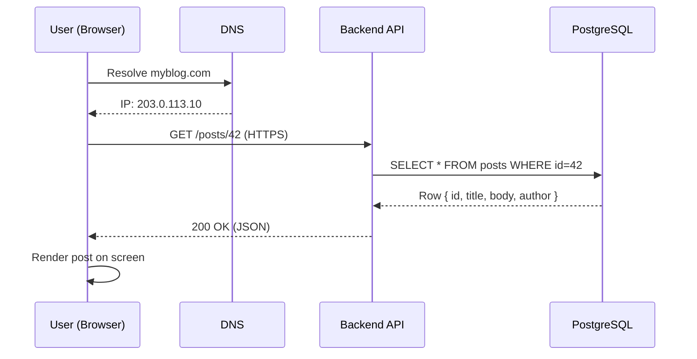
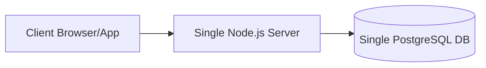
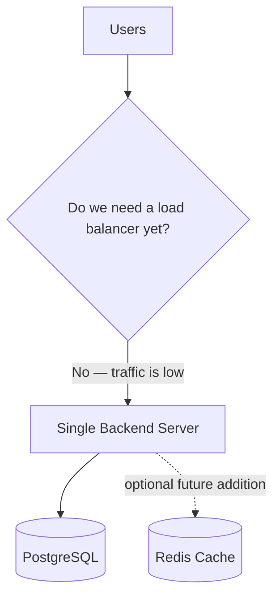
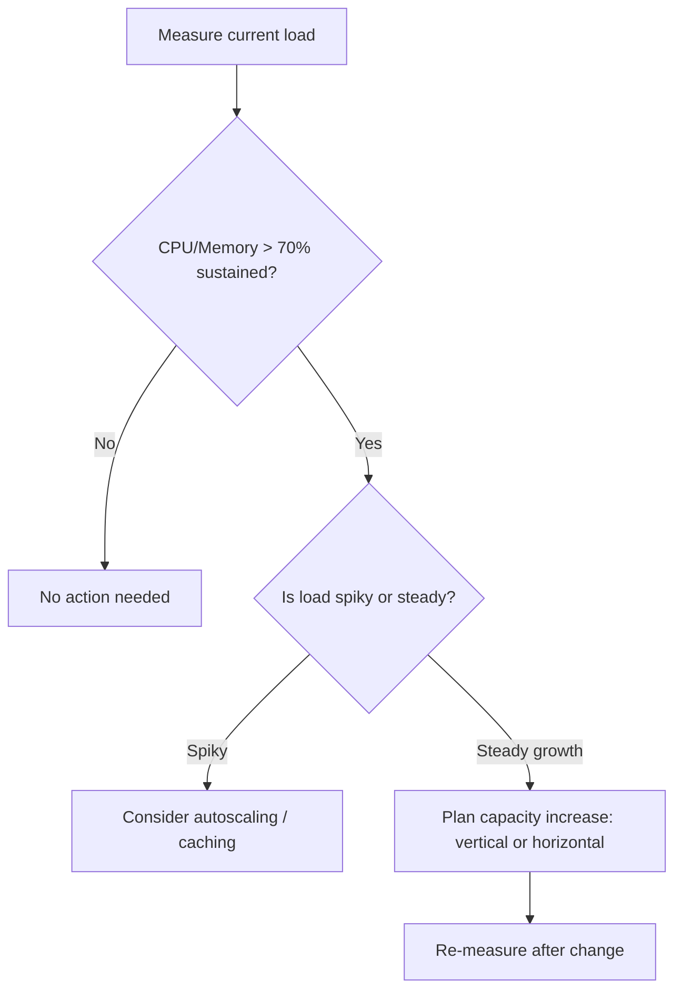
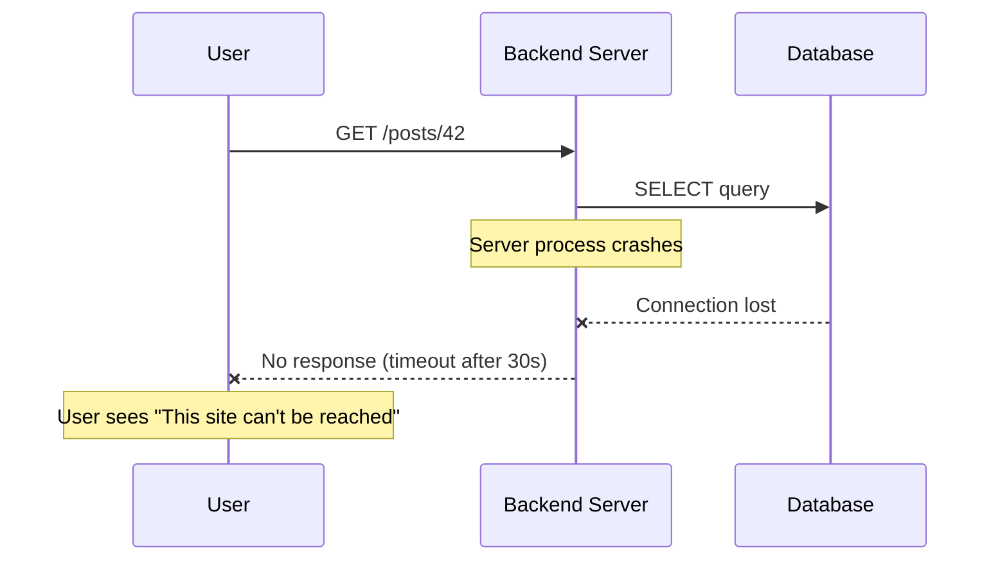
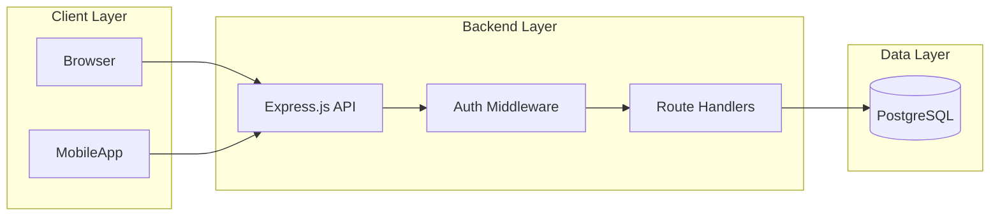
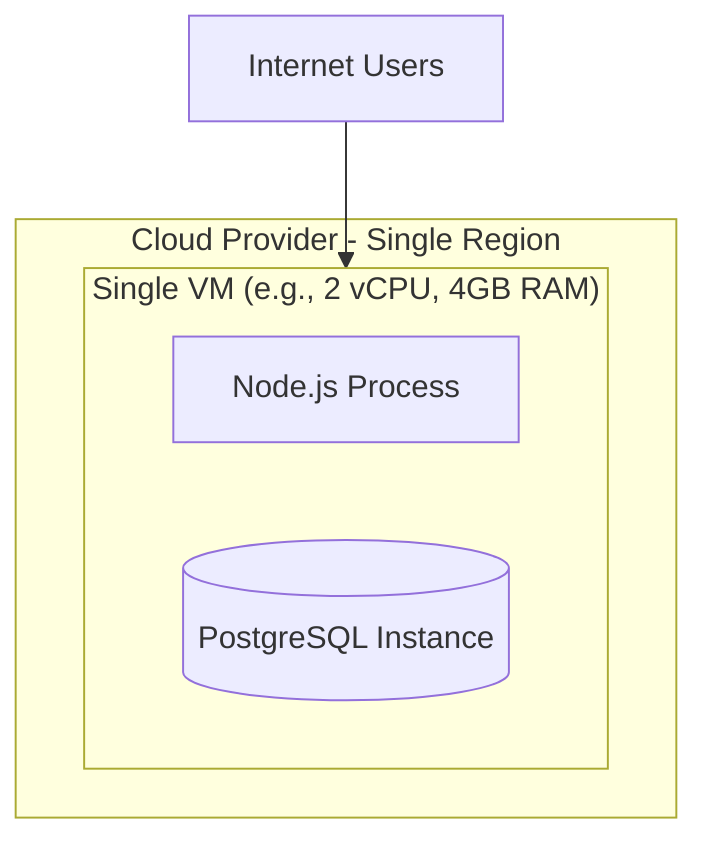

# Module 1 — Introduction to System Design

> **Masterclass:** System Design Masterclass (30 Modules)
> **Level:** Beginner
> **Audience:** Node.js backend developers, SDE‑2 / Senior Backend interview candidates, engineers transitioning into architecture roles
> **Prerequisite:** Basic programming knowledge, familiarity with building a REST API in any language

---

## 1. Introduction

Every large system you've ever used — Netflix, Amazon, WhatsApp, Uber — started life as something embarrassingly small: a single server, a single database, a handful of routes. The difference between that toy version and the production system serving hundreds of millions of people isn't "better code." It's **system design** — the set of decisions about how components are structured, how they talk to each other, and how they behave under load, failure, and growth.

This module is the foundation for the entire masterclass. Every later module (caching, load balancing, sharding, microservices, FAANG interviews) is really just a deeper dive into a decision you'll first encounter here. If you rush this module, everything downstream will feel like memorized trivia. If you internalize it, everything downstream will feel like common sense applied to a new context.

We are going to build your mental model from first principles — starting with *why* system design exists as a discipline at all, before touching a single diagram.

---

## 2. Learning Objectives

By the end of this module, you will be able to:

1. Explain **why** system design exists as a discipline, not just what it is.
2. Distinguish **High-Level Design (HLD)** from **Low-Level Design (LLD)** and know when interviewers/teams expect each.
3. Separate **functional requirements** from **non-functional requirements** in any problem statement.
4. Define and reason about **scalability, reliability, availability, and maintainability** using precise, defensible definitions (not buzzwords).
5. Identify and articulate **trade-offs** — the single most important interview and real-world skill in system design.
6. Read and draw basic **ASCII, Mermaid flowchart, and sequence diagrams** for a request's journey through a system.
7. Perform a first, simple **capacity estimation**.
8. Recognize common **anti-patterns** beginners fall into.
9. Walk through the **request lifecycle** of a simple client → API → database system end to end.

---

## 3. Why This Concept Exists

Imagine you build a personal blog. One Node.js process, one Postgres database, running on a single $5/month VM. It works. Your friends read it. Done.

Now imagine that blog goes viral. Suddenly:

- 50,000 people hit it in one hour instead of 50.
- Your single server's CPU pins at 100%.
- Your database starts timing out because too many connections are open at once.
- The server crashes, and because you have only one, the *entire* site goes down.
- You fix it, redeploy, and it crashes again the next day when a bigger spike hits.

Nothing about your *code* was wrong. Your business logic was fine. What broke was everything **around** the code — the architecture. This is the gap system design fills.

**System design exists because software that works in a demo does not automatically work at scale, under failure, or under concurrent load.** These are different problems from "does the feature work correctly," and they require a different, deliberate discipline to solve:

- How do we serve more users than one machine can handle? → **Scalability**
- How do we stay up when a machine dies? → **Reliability / Fault tolerance**
- How do we make sure users can always reach us? → **Availability**
- How do we keep changing the system for years without it collapsing under its own complexity? → **Maintainability**
- How do we protect user data and prevent abuse? → **Security**

Every topic in this 30-module course is an answer to one of these five questions, applied to a specific piece of the stack (databases, caches, queues, gateways, etc.).

### Why companies ask System Design in interviews

Writing a correct `for` loop tells an interviewer you can code. It tells them **nothing** about whether you can be trusted to design the checkout system for an e-commerce company that will run for five years, handle Black Friday traffic, survive data-center outages, and be modified safely by fifty other engineers. System design interviews exist to simulate exactly that kind of judgment in 45 minutes.

---

## 4. Problem Statement

Let's make this concrete with the problem we'll use throughout this module:

> **Design a simple blogging platform** where users can read and write blog posts. It currently runs on one server and one database. Traffic is starting to grow. Design the system so it can scale, stay available, and remain maintainable — without over-engineering it before it's needed.

This is deliberately simple — it's Module 1. We are not sharding databases yet (Module 15) or adding Kafka (Module 11). We're building the **vocabulary and reasoning process** you'll reuse in every later module and in every interview.

---

## 5. Real-World Analogy

**System design is city planning, not architecture of a single building.**

- A single building (a function, a class) can be perfect in isolation — well-lit, structurally sound — and still fail the city if there's no road to reach it, no water pipe connected, and no plan for what happens when 10,000 people want to enter at once.
- A city planner asks: Where do roads go? How many lanes? What happens during a rush hour spike (scalability)? What happens if one road floods (reliability)? Can an ambulance always get through (availability)? Can the city add a new district in 10 years without tearing down downtown (maintainability)?
- **Vertical scaling** is like making one road wider (add lanes to the same road).
- **Horizontal scaling** is like building three parallel roads and sending some cars down each (Module 2).
- A **load balancer** is the traffic officer standing at the fork, directing cars evenly.
- A **cache** is the convenience store near the neighborhood entrance — most people don't need to drive downtown (the database) for milk; you keep milk close by.
- A **CDN** is a chain of those convenience stores, one in every neighborhood, close to where people actually live.

Keep this analogy running in your head. Nearly every system design concept has a direct city-planning parallel, and it's a great tool for building intuition before diving into technical precision.

---

## 6. Technical Definition

**System Design** is the process of defining the architecture, components, modules, interfaces, and data flow of a system to satisfy specified functional and non-functional requirements, under real-world constraints of cost, scale, and time.

Two complementary levels exist:

### High-Level Design (HLD)
The 30,000-foot view. What are the major components (services, databases, caches, queues), how do they connect, and what does data flow look like? HLD answers: *"What are the pieces and how do they fit together?"*

### Low-Level Design (LLD)
The zoomed-in view. Class diagrams, database schemas, API contracts, specific algorithms, concurrency handling within *one* component. LLD answers: *"How exactly is each piece built?"*

**Analogy:** HLD is the city map showing districts and highways. LLD is the blueprint of one building's electrical wiring.

Most system design interviews (and this masterclass) focus primarily on HLD, dipping into LLD for critical pieces (e.g., "design the rate limiter's internal algorithm").

---

## 7. Core Terminology

| Term | Precise Definition | One-line Intuition |
|---|---|---|
| **Functional Requirement** | What the system must *do* — features and behaviors | "Users can post a blog" |
| **Non-Functional Requirement (NFR)** | How well the system must do it — qualities | "99.9% uptime, <200ms response" |
| **Scalability** | Ability to handle growing load by adding resources | "Can it grow?" |
| **Reliability** | Ability to work correctly even when components fail | "Does it keep working when things break?" |
| **Availability** | Percentage of time the system is operational and reachable | "Is it *up* right now?" |
| **Maintainability** | Ease of understanding, modifying, and extending the system over time | "Can new engineers change it safely?" |
| **Latency** | Time taken to process a single request | "How fast is one request?" |
| **Throughput** | Number of requests processed per unit time | "How many requests per second?" |
| **Trade-off** | A deliberate sacrifice of one quality to gain another | "You can't max out everything at once" |
| **Bottleneck** | The single slowest component limiting overall system performance | "The weakest link in the chain" |

### Availability vs. Reliability — a common confusion

These sound similar but are **not** the same:

- A system can be **available** (you can reach it, it responds) but **unreliable** (it sometimes returns wrong answers or corrupts data).
- A system can be **reliable** (correct every time it runs) but have poor **availability** (it's frequently completely down for maintenance).

Interview tip: if you conflate these two, it's an immediate signal to an interviewer that your understanding is shallow. Always define them separately.

---

## 8. Internal Working

Let's trace what actually happens, physically and logically, when this simple blog platform handles one request — because every advanced system in this course is built by inserting new components into this exact skeleton.

### The skeleton: Client → Network → Backend → Database

1. **Client** (browser/mobile app) constructs an HTTP request: `GET /posts/42`.
2. **DNS resolution** turns `myblog.com` into an IP address.
3. **TCP connection** is established (and TLS handshake, if HTTPS) to that IP.
4. The **HTTP request** travels over the internet to the server.
5. The **backend API** (Node.js/Express process) receives it, parses the route, and calls the relevant handler.
6. The handler executes a **database query** (`SELECT * FROM posts WHERE id = 42`).
7. The **database** looks up the row (via an index, hopefully) and returns it.
8. The backend **serializes** the row into JSON.
9. The **HTTP response** travels back over the network to the client.
10. The client **renders** the post.

This is the same skeleton whether you're looking at a personal blog or Netflix's homepage. What changes as systems grow is **what gets inserted into this pipeline** — caches, load balancers, CDNs, queues, gateways — and **how many replicas** of each piece exist.

---

## 9. Request Lifecycle

### ASCII Diagram — Simple Blog Request Lifecycle

```
   [Browser]
       │  1. DNS lookup: myblog.com → 203.0.113.10
       ▼
   [DNS Server] ── returns IP ──▶ [Browser]
       │
       │  2. TCP + TLS handshake
       ▼
   [Browser] ───────── HTTPS GET /posts/42 ─────────▶ [Backend API : Node.js/Express]
                                                              │
                                                              │  3. Route matched
                                                              │  4. Query DB
                                                              ▼
                                                        [PostgreSQL]
                                                              │
                                                              │  5. Row returned
                                                              ▼
                                                        [Backend API]
                                                              │
                                                              │  6. JSON serialized
                                                              ▼
   [Browser] ◀──────────── 200 OK { post JSON } ─────────────┘
       │
       │  7. Render page
       ▼
   [User sees blog post]
```

### Mermaid Sequence Diagram



**Step-by-step explanation:**
- **DNS resolution** happens once (and is cached by the OS/browser afterward) — this is why the *first* visit to a site often feels slightly slower.
- **TLS handshake** adds round trips but is required for HTTPS security; HTTP/2 and connection reuse mitigate this cost for subsequent requests (Module 4).
- The **backend never blocks on the network**, only on the database call — this is why database latency is almost always the dominant cost in this basic skeleton.
- The **database index** lookup on `id` is what makes step 5 fast (an unindexed table would force a full table scan — see Module 5).

---

## 10. Architecture Overview

### Current architecture (single server, works for small scale)



### Where this breaks

| Load Level | What Happens | Root Cause |
|---|---|---|
| Low traffic (< 100 req/s) | Works fine | Single server handles it |
| Medium traffic (100–1000 req/s) | Slow responses, occasional timeouts | CPU/memory saturation on one box |
| High traffic (> 1000 req/s) | Crashes, connection pool exhaustion | Single point of failure + no horizontal capacity |
| Server crash (any traffic level) | **Total outage** | No redundancy — one server is one server |

This table is the entire justification for Modules 2 through 30. Every technique introduced later (load balancing, caching, replication, sharding, queues) exists to push one or more rows of this table further to the right.

---

## 11. Capacity Estimation (Introductory)

Capacity estimation is a skill you must build early — it's expected in almost every real interview, and it grounds architecture decisions in numbers instead of guesses.

**Scenario:** Our blog has 1 million registered users. 10% are active daily (**DAU** = 100,000). Each active user views 5 posts per session.

**Step 1 — Requests per day:**
```
100,000 DAU × 5 views = 500,000 read requests/day
```

**Step 2 — Requests per second (average):**
```
500,000 requests / 86,400 seconds ≈ 5.8 requests/sec (average)
```

**Step 3 — Peak load (traffic is never uniform — apply a peak factor, typically 3–10x average):**
```
5.8 × 5 (peak factor) ≈ 29 requests/sec at peak
```

**Step 4 — Storage estimation (assume 10,000 new posts/day, 2 KB average size):**
```
10,000 × 2 KB = 20 MB/day → ~7.3 GB/year
```

**Why this matters:** 29 req/s peak is *trivial* — a single well-configured server handles this easily. This tells us: **do not over-engineer.** No microservices, no Kafka, no sharding needed yet. This number is the single most important output of this section — knowing when *not* to add complexity is as important as knowing how to add it.

Compare this to Instagram-scale (billions of requests/day) — the same math, just with numbers three to four orders of magnitude larger, is what justifies the architectures in Modules 25–30.

---

## 12. High-Level Design (HLD)

For our current scale (29 req/s peak), the HLD is intentionally minimal:



**Design decision and justification:** At this scale, introducing a load balancer, multiple servers, or a cache adds *operational complexity* (more things to deploy, monitor, and debug) without a corresponding *performance* benefit. This is a core system design principle you must carry into every interview:

> **Design for the scale stated in the requirements — not for imagined future scale, unless the interviewer/spec explicitly asks you to plan for growth.**

We will revisit this exact HLD in Module 8 (Load Balancing) once we introduce a growth scenario that actually justifies it.

---

## 13. Low-Level Design (LLD)

At LLD, we care about the concrete API contract and schema for our blog:

### Simplified class structure (Node.js, conceptual)

```
PostController
 ├── getPost(id)
 ├── createPost(data)
 └── listPosts(page, limit)

PostRepository
 ├── findById(id)
 ├── insert(post)
 └── findPaginated(offset, limit)

Post (data model)
 ├── id: UUID
 ├── title: string
 ├── body: text
 ├── authorId: UUID
 └── createdAt: timestamp
```

**Why separate Controller from Repository?** This is a maintainability decision (NFR), not a functional one. If we later swap PostgreSQL for another database (Module 15's replication, or a NoSQL store), only `PostRepository` changes — `PostController` and all business logic remain untouched. This separation of concerns is a microcosm of every architecture decision in this course: **isolate what changes from what stays stable.**

---

## 14. ASCII Diagrams

### Vertical vs. Horizontal Scaling Preview (fully covered in Module 2)

```
VERTICAL SCALING                 HORIZONTAL SCALING

   [Server]                         [LB]
      │                               │
   CPU ↑ RAM ↑                ┌───────┼───────┐
   (bigger box)                ▼       ▼       ▼
                            [Server][Server][Server]
```

---

## 15. Mermaid Flowcharts

### Decision Flow: "Do I need to scale yet?"



---

## 16. Mermaid Sequence Diagrams

### Failure Scenario: Server Crashes Mid-Request



**Why this matters:** With a single server, there is no fallback. This diagram is the visual justification for **redundancy** — a concept every later module builds on (multiple servers, replicas, multi-region deployments).

---

## 17. Component Diagrams



**Component responsibilities:**
- **Auth Middleware:** validates JWT/session before requests reach business logic (Module 20 goes deep here).
- **Route Handlers:** pure business logic, no knowledge of HTTP internals ideally.
- **PostgreSQL:** single source of truth for post data.

---

## 18. Deployment Diagrams



**Real-world note:** Many real production incidents at small companies trace directly to this diagram: application and database sharing the *same* machine, competing for the *same* CPU and memory. This is a legitimate starting point for a side project, but the first meaningful production improvement is almost always **separating the database onto its own instance** — before adding any caching or load balancing.

---

## 19. Network Diagrams

```
                Internet
                    │
              ┌─────▼─────┐
              │  Firewall  │  ← blocks unwanted ports/IPs
              └─────┬─────┘
                    │  Port 443 (HTTPS) open
              ┌─────▼─────┐
              │   VM/Host  │
              │ ┌────────┐ │
              │ │ Node.js│ │  ← listens on :3000, proxied via :443
              │ └────────┘ │
              │ ┌────────┐ │
              │ │Postgres│ │  ← listens on :5432, NOT exposed to internet
              │ └────────┘ │
              └────────────┘
```

**Critical security point:** The database port (5432) should **never** be directly reachable from the public internet. Only the application server should be able to reach it, ideally over a private network/VPC. This single misconfiguration is one of the most common real-world breach vectors — worth internalizing now, expanded fully in Module 20 (Security).

---

## 20. Database Design

### Simple schema for our blog

```sql
CREATE TABLE users (
    id UUID PRIMARY KEY DEFAULT gen_random_uuid(),
    username VARCHAR(50) UNIQUE NOT NULL,
    email VARCHAR(255) UNIQUE NOT NULL,
    password_hash TEXT NOT NULL,
    created_at TIMESTAMP DEFAULT now()
);

CREATE TABLE posts (
    id UUID PRIMARY KEY DEFAULT gen_random_uuid(),
    author_id UUID REFERENCES users(id),
    title VARCHAR(200) NOT NULL,
    body TEXT NOT NULL,
    created_at TIMESTAMP DEFAULT now()
);

CREATE INDEX idx_posts_author_id ON posts(author_id);
CREATE INDEX idx_posts_created_at ON posts(created_at DESC);
```

**Why the index on `created_at`?** Blog homepages almost always show "latest posts first." Without this index, that common query forces a full table scan and a sort operation on every request — a classic beginner mistake that silently degrades performance as the `posts` table grows. This is your first taste of Module 5's deeper indexing content.

---

## 21. API Design

### REST API contract

| Method | Endpoint | Description | Auth Required |
|---|---|---|---|
| `GET` | `/posts` | List posts (paginated) | No |
| `GET` | `/posts/:id` | Get single post | No |
| `POST` | `/posts` | Create a post | Yes |
| `PUT` | `/posts/:id` | Update a post | Yes (owner only) |
| `DELETE` | `/posts/:id` | Delete a post | Yes (owner only) |

### Node.js/Express implementation example

```javascript
const express = require('express');
const router = express.Router();

// GET /posts?page=1&limit=20
router.get('/posts', async (req, res) => {
  const page = parseInt(req.query.page) || 1;
  const limit = Math.min(parseInt(req.query.limit) || 20, 100); // cap limit
  const offset = (page - 1) * limit;

  try {
    const posts = await postRepository.findPaginated(offset, limit);
    res.status(200).json({ page, limit, data: posts });
  } catch (err) {
    console.error('Failed to fetch posts:', err);
    res.status(500).json({ error: 'Internal server error' });
  }
});

// GET /posts/:id
router.get('/posts/:id', async (req, res) => {
  const post = await postRepository.findById(req.params.id);
  if (!post) return res.status(404).json({ error: 'Post not found' });
  res.status(200).json(post);
});

module.exports = router;
```

**Design notes embedded in this code:**
- **`limit` is capped at 100** — an unbounded `limit` query param is a real-world denial-of-service vector (someone requests `limit=10000000`). Always validate and cap client-controlled pagination inputs.
- **Try/catch around the DB call** — a single unhandled promise rejection in Node.js can crash the entire process, taking down *every* user's request, not just the failing one. This is a direct, code-level consequence of the "single server = single point of failure" architecture discussed above.

---

## 22. Scalability Considerations

At this module's scale, scalability considerations are mostly about **not prematurely optimizing**, but you should already be able to identify the levers available:

| Lever | What It Does | When to Reach for It |
|---|---|---|
| Vertical scaling | Bigger server | Quick fix, low engineering effort, has a ceiling |
| Horizontal scaling | More servers + load balancer | Needed once vertical hits diminishing returns (Module 2, 8) |
| Caching | Serve repeat reads from memory | Read-heavy workloads (Module 7) |
| CDN | Serve static assets from edge locations | Global user base, static content (Module 10) |
| Database replication | Read replicas to offload the primary | Read-heavy DB load (Module 15) |

---

## 23. Reliability & Fault Tolerance

Even in Module 1, one reliability principle must be internalized immediately:

> **A system with exactly one instance of any critical component has a Single Point of Failure (SPOF).**

In our current architecture, both the Node.js server *and* the PostgreSQL database are SPOFs. Fixing this (via replicas, redundancy, health checks) is the subject of Modules 15 and 18 — but recognizing the SPOF *today*, even before you know the fix, is the actual skill being tested in interviews.

---

## 24. Security Considerations

At the introductory level, three non-negotiables:

1. **Never trust client input** — validate and sanitize everything (SQL injection prevention via parameterized queries, not string concatenation).
2. **Never expose infrastructure ports** (like the database) directly to the internet — see Section 19's network diagram.
3. **Never store plaintext passwords** — always hash with a strong algorithm (bcrypt/argon2), never MD5/SHA1 alone.

```javascript
// WRONG — vulnerable to SQL injection
const query = `SELECT * FROM posts WHERE id = '${req.params.id}'`;

// RIGHT — parameterized query
const query = 'SELECT * FROM posts WHERE id = $1';
db.query(query, [req.params.id]);
```

---

## 25. Performance Optimization

At this scale, the highest-leverage, lowest-effort optimizations are:

1. **Add indexes** on frequently queried columns (Section 20).
2. **Enable connection pooling** to the database instead of opening a new connection per request (huge overhead saved).
3. **Enable gzip/Brotli compression** on HTTP responses.
4. **Set appropriate `Cache-Control` headers** for static assets.

```javascript
const { Pool } = require('pg');
const pool = new Pool({ max: 20 }); // connection pool, not one-off connections
```

---

## 26. Monitoring & Observability

Even a single-server system needs the "three pillars" (full depth in Module 19):

- **Logs**: What happened? (`console.log` today; structured logging later)
- **Metrics**: How much/how fast? (requests/sec, error rate, latency percentiles)
- **Traces**: Where exactly did time go for *this* request?

**Minimum viable monitoring for Module 1's system:** track CPU, memory, and error rate. If you have zero visibility into these three numbers, you will not know a problem exists until a user complains — the worst possible way to find out.

---

## 27. Common Bottlenecks

| Bottleneck | Symptom | Likely Cause |
|---|---|---|
| CPU-bound | High latency under load, CPU at 100% | Inefficient code, missing caching, no horizontal scale |
| Database connections exhausted | `too many connections` errors | No connection pooling, N+1 query problem |
| Memory leak | Gradual slowdown, eventual crash/restart | Unbounded caches, unclosed resources |
| Slow queries | High latency on specific endpoints | Missing indexes, unoptimized queries |

---

## 28. Trade-off Analysis

This is the single most tested skill in real interviews. Every system design decision trades one quality for another. Practice articulating trade-offs explicitly, using this format:

> "I chose **X** over **Y** because it optimizes for **[quality A]**, at the cost of **[quality B]**, which is an acceptable trade given **[stated requirement/constraint]**."

**Example for this module:**

> "I chose a single server + single database for the current requirements (29 req/s peak) rather than a load-balanced multi-server setup, because it optimizes for **simplicity and low operational cost**, at the cost of **fault tolerance** (single point of failure), which is acceptable given the stated traffic is well within a single machine's capacity. I would revisit this the moment traffic estimates exceed roughly 60–70% of one server's sustained capacity."

Notice this answer does three things every strong trade-off answer does: **states the choice, names both qualities involved, and ties the acceptability back to the stated numbers** — not vibes.

---

## 29. Anti-patterns & Common Mistakes

1. **Premature optimization / over-engineering.** Adding Kafka, microservices, and Redis to a system doing 30 req/s. This *increases* operational risk without benefit.
2. **No separation between app and database tiers.** Discussed in Section 18.
3. **Ignoring non-functional requirements entirely** in an interview — designing only for "does it work" and never mentioning scale, failure, or security.
4. **Designing without asking clarifying questions.** Real interviews (and real projects) are almost always *underspecified* on purpose. Jumping straight to a diagram without asking "how many users?", "read-heavy or write-heavy?", "do we need strong consistency?" is one of the most common ways candidates fail system design interviews.
5. **Treating HLD and LLD as the same activity.** Conflating "what are the components" with "what's the exact schema" wastes interview time and muddies real design docs.

---

## 30. Production Best Practices

- Always separate the application tier from the data tier onto different machines/instances, even at small scale.
- Always define your non-functional requirements *explicitly* in a design doc — "should be fast" is not a requirement; "p99 latency under 300ms at 500 req/s" is.
- Always instrument before you scale — you cannot make good scaling decisions without metrics.
- Always ask: "What happens when this component fails?" for every component in your diagram, even in Module 1-level systems.

---

## 31. Real-World Examples

- **Netflix** started as a DVD-by-mail service with a simple monolithic web app; its now-famous microservices/chaos-engineering architecture (Module 27) emerged only after streaming scale demanded it — validating this module's core lesson: architecture should evolve with demonstrated need.
- **Amazon's early architecture** (pre-2001) was a large monolith; the well-known shift to service-oriented architecture was driven directly by scaling and team-coordination pain — a real-world instance of the maintainability NFR winning out as the org grew.
- **Instagram's early stack** (2010) was a *single* Django app and *one* PostgreSQL instance — remarkably close to this module's HLD — supporting their first 25,000 users within a day of launch, before any sharding or caching layer was added.

The lesson across all three: **every hyperscale system you admire began at, or below, the complexity level of this module.** Complexity was earned, not assumed.

---

## 32. Node.js Implementation Examples

A minimal, production-conscious Express server reflecting this module's principles:

```javascript
const express = require('express');
const { Pool } = require('pg');
const compression = require('compression');

const app = express();
const pool = new Pool({ max: 20, idleTimeoutMillis: 30000 });

app.use(compression());       // Section 25: performance
app.use(express.json({ limit: '100kb' })); // limit request body size (security)

app.get('/posts/:id', async (req, res) => {
  const start = Date.now();
  try {
    const result = await pool.query(
      'SELECT id, title, body, created_at FROM posts WHERE id = $1',
      [req.params.id]
    );
    if (result.rows.length === 0) {
      return res.status(404).json({ error: 'Post not found' });
    }
    res.status(200).json(result.rows[0]);
  } catch (err) {
    console.error('DB error:', err);
    res.status(500).json({ error: 'Internal server error' });
  } finally {
    console.log(`GET /posts/${req.params.id} took ${Date.now() - start}ms`); // minimal observability
  }
});

process.on('unhandledRejection', (reason) => {
  console.error('Unhandled rejection:', reason); // prevent silent crashes
});

app.listen(3000, () => console.log('Server running on port 3000'));
```

---

## 33. Interview Questions

### Easy
1. What is the difference between High-Level Design and Low-Level Design?
2. Define scalability in your own words, with an example.
3. What is a non-functional requirement? Give three examples.
4. What is a single point of failure?
5. Why is it bad practice to expose your database port directly to the internet?
6. What's the difference between latency and throughput?

### Medium
7. Explain the difference between availability and reliability with an example where a system is one but not the other.
8. You're told a system must support "high consistency." What trade-off does this likely force elsewhere?
9. Walk through what happens, step by step, when a user requests a webpage, from DNS resolution to rendering.
10. Why might adding a cache actually make a system *less* reliable if not designed carefully?
11. How would you estimate the number of servers needed for a system handling 10,000 requests/second, if one server can handle 500 req/s?
12. What questions would you ask before starting to design "a URL shortener"?

### Hard
13. A system has 99.9% availability. How many minutes of downtime does that allow per year? Is that enough for a payments system? Justify.
14. Design decisions differ if a system is "read-heavy" vs. "write-heavy." Explain how, concretely, for a blogging platform.
15. Your interviewer says "assume infinite scale is required from day one." What's the risk in taking this literally, and how would you push back constructively?
16. Explain why "premature horizontal scaling" can sometimes make a system *harder* to reason about and debug than a well-optimized single server.
17. A junior engineer proposes adding a message queue (Module 11) to the Module 1 blog system "to be safe." How do you evaluate whether this is justified?

---

## 34. Scenario-Based Design Questions

1. **Scenario:** Your blog platform, built as described in this module, suddenly gets featured on a major news site and traffic increases 50x overnight. Walk through your immediate diagnostic steps and short-term mitigation, without yet redesigning the whole system.
2. **Scenario:** A stakeholder asks you to "make the system 100% available." Explain why this is not achievable and propose a realistic target with justification.
3. **Scenario:** You inherit a codebase where the application server and database run on the same VM, and there's no monitoring. Prioritize your first three changes and justify the order.
4. **Scenario:** Your interviewer gives you only "design a system like Twitter" with no numbers. Demonstrate the clarifying questions you'd ask before drawing anything.
5. **Scenario:** Product wants a new feature shipped in two days that requires a schema change to a table with 50 million rows. What non-functional concerns do you raise?
6. **Scenario:** You must choose between two candidate designs: (a) a single powerful server, (b) three modest servers behind a load balancer, for a system with unpredictable, spiky traffic. Compare them explicitly on cost, reliability, and complexity.
7. **Scenario:** A post-mortem reveals an outage was caused by an unbounded `limit` query parameter allowing a user to request 5 million rows in one call. Propose the fix and a broader defensive coding principle.
8. **Scenario:** Your company's blog is now read in 6 different countries with a noticeable difference in latency by region. Without yet learning CDNs formally (Module 10), reason from first principles about why distance causes latency and what general category of solution would help.
9. **Scenario:** You're asked whether the blog platform needs "strong consistency" for its comment counts. Discuss what could go wrong with eventual consistency here, and whether it's actually a real problem for this use case.
10. **Scenario:** Two engineers disagree: one wants to scale vertically, one wants to scale horizontally, for a database experiencing high read load. Mediate the disagreement using the concepts from this module.

---

## 35. Hands-on Exercises

1. Draw the ASCII request lifecycle diagram (Section 9) from memory for a system you've personally built (a college project, a personal app, anything).
2. Write down 5 functional and 5 non-functional requirements for a "note-taking app" before writing any code or diagrams.
3. Take the Node.js code in Section 32 and identify three additional production-readiness gaps not yet addressed (hint: think about rate limiting, authentication, and structured logging).
4. Perform your own capacity estimation (Section 11) for a hypothetical app with 50,000 DAU, each performing 10 actions/day. Compute average and peak req/s.
5. Identify every single point of failure in the deployment diagram (Section 18) and propose, in one sentence each, what you'd change to remove it (you'll formally learn the *how* in later modules — this exercise builds the *instinct* first).

---

## 36. Mini Project

**Build:** A minimal blog REST API in Node.js + Express + PostgreSQL implementing the schema (Section 20) and API contract (Section 21).

**Requirements:**
- Implement `GET /posts`, `GET /posts/:id`, `POST /posts`.
- Use parameterized queries only (no string concatenation).
- Add a connection pool, not per-request connections.
- Add basic request logging with response time (as in Section 32).
- Cap pagination `limit` at 100.
- Write down, in a short `DESIGN.md`, your functional and non-functional requirements *before* writing code.

**Success criteria:** The API works correctly, and your `DESIGN.md` clearly separates functional from non-functional requirements and states at least two trade-offs you made.

---

## 37. Advanced Project

**Build:** Extend the Mini Project with:

1. A simple **capacity estimation document** assuming 200,000 DAU, computing average and peak req/s and recommending whether the current single-server architecture is still sufficient (show your math).
2. A **failure injection test**: manually kill the database mid-request (e.g., stop the Postgres container while a request is in flight) and document exactly what the client experiences. Then add basic error handling so the client gets a clean `503 Service Unavailable` instead of a hung connection.
3. A written **trade-off analysis** (using the Section 28 format) justifying why you are, or are not, ready to introduce a load balancer and second server at this stage.
4. A **basic monitoring dashboard** (even a simple `/health` endpoint reporting DB connectivity and process uptime) as your first observability primitive, to be expanded in Module 19.

**Success criteria:** You can explain, out loud, to another engineer, exactly what breaks first as load increases on your system, and why — backed by the failure injection test you actually ran, not assumptions.

---

## 38. Summary

- System design exists because code that works in isolation does not automatically work at scale, under failure, or under concurrent load.
- **HLD** = component-level architecture; **LLD** = detailed internal design of individual components.
- Every requirement is either **functional** (what it does) or **non-functional** (how well it does it) — always separate these explicitly.
- **Scalability, reliability, availability,** and **maintainability** are the four qualities nearly every later module optimizes for, in some combination.
- **Trade-offs are unavoidable** — the skill is naming them explicitly, not avoiding them.
- **Capacity estimation** turns vague scale concerns into concrete numbers that justify (or rule out) architectural complexity.
- The biggest beginner mistake is **premature complexity** — solving problems you don't have yet, at the cost of problems you do have (operational overhead, cost, debuggability).

---

## 39. Revision Notes

- HLD = "what pieces, how connected" · LLD = "how exactly built"
- FR = what it does · NFR = how well (scale, speed, uptime, safety)
- Availability ≠ Reliability — memorize the distinction with an example each
- SPOF = single point of failure — find it in *every* diagram you draw
- Capacity estimation formula chain: DAU → daily requests → avg req/s → peak req/s (×3–10 peak factor)
- Never expose DB ports publicly; never concatenate SQL strings; never store plaintext passwords
- Trade-off answer template: "I chose X over Y, optimizing for A at the cost of B, acceptable because [numbers/requirements]."

---

## 40. One-Page Cheat Sheet

```
SYSTEM DESIGN — MODULE 1 CHEAT SHEET
─────────────────────────────────────
HLD  → components & connections (the map)
LLD  → internals of one component (the blueprint)

FR   → what the system does
NFR  → how well it does it (scale/speed/uptime/security)

KEY QUALITIES
  Scalability     = handles growing load
  Reliability     = correct even amid failures
  Availability    = reachable/up % of time
  Maintainability = safe & easy to change over time

CAPACITY ESTIMATION CHAIN
  DAU → requests/day → req/s avg → req/s peak (avg × 3-10x)

RED FLAGS TO CATCH IN ANY DIAGRAM
  ☐ Single point of failure?
  ☐ DB port exposed publicly?
  ☐ Unbounded client input (limit, size, rate)?
  ☐ No monitoring/observability?
  ☐ Complexity not justified by stated scale?

TRADE-OFF TEMPLATE
  "Chose X over Y → optimizes [A], costs [B],
   acceptable because [requirement/number]."

GOLDEN RULE
  Design for the stated scale — not imagined scale —
  unless told otherwise. Complexity must be earned.
```

---

## Key Takeaways

- System design bridges the gap between "code that works" and "systems that survive scale, failure, and time."
- Precision in vocabulary (availability vs. reliability, FR vs. NFR, HLD vs. LLD) is not pedantry — it's what separates senior engineers from juniors in both real design docs and interviews.
- Trade-off articulation, backed by numbers, is the single highest-leverage skill this module teaches.
- Every SPOF you can spot today is a concept you'll formally solve in Modules 2–30.

## 20 Practice Questions
*(See Section 33 — 6 Easy, 6 Medium, 5 Hard — plus these 3 additional rapid-fire questions:)*
18. Name one real-world system that started as a monolith and evolved due to scale.
19. Why is "make it infinitely scalable" a red flag phrase in a requirements conversation?
20. What's the very first clarifying question you should ask in almost any system design interview?

## 10 Scenario-Based Questions
*(See Section 34 in full.)*

## 5 Design Assignments
*(See Sections 36–37 — Mini Project and Advanced Project — plus these three shorter assignments:)*
1. Write a one-page NFR specification for a system of your choice (any app you use daily).
2. Diagram the request lifecycle (ASCII or Mermaid) for an app you use daily, identifying every SPOF.
3. Perform a capacity estimation for that same app using publicly estimated user numbers, and state whether you believe its actual architecture (as far as you can infer) matches the scale.

## Suggested Next Module

**→ Module 2: Scalability Fundamentals** — where we take the SPOFs and capacity ceilings identified here and formally introduce vertical scaling, horizontal scaling, and the stateless vs. stateful service distinction that makes horizontal scaling possible at all.
