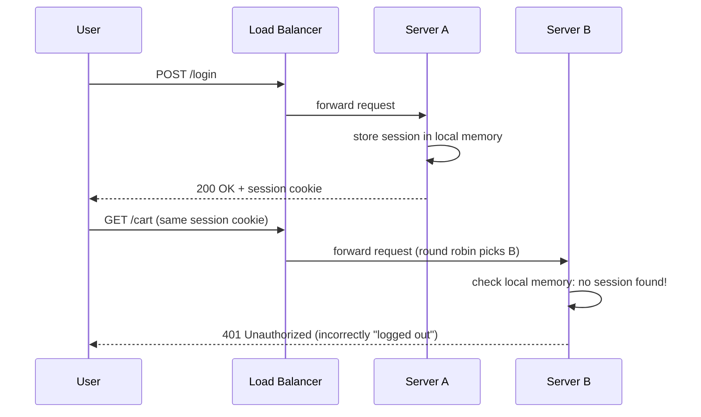
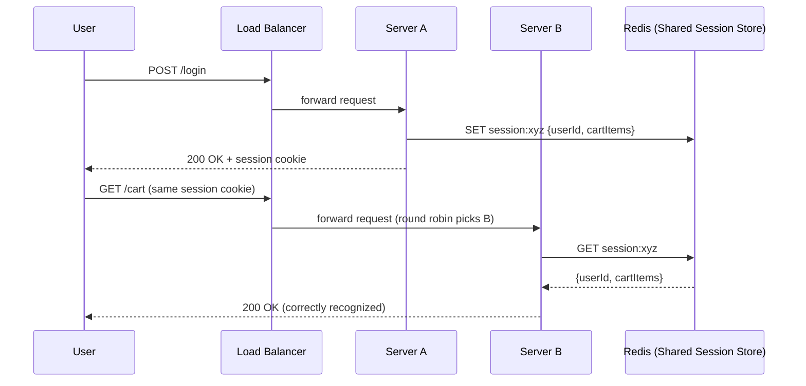
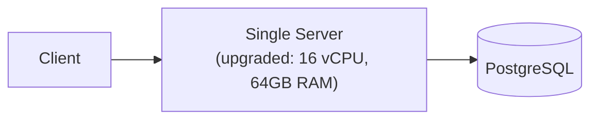
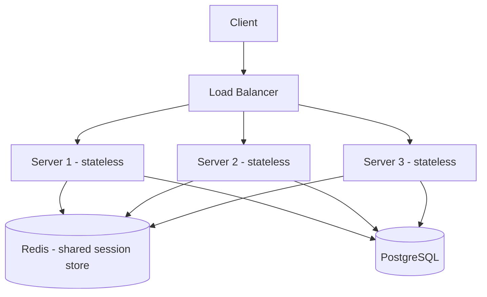
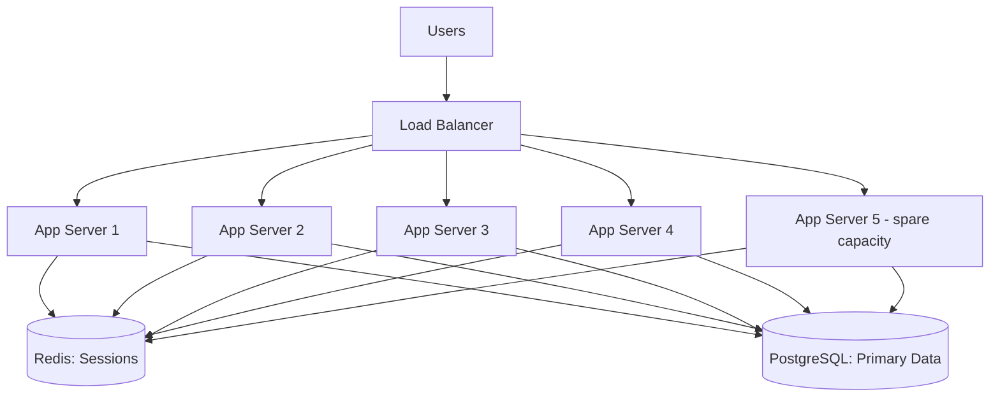
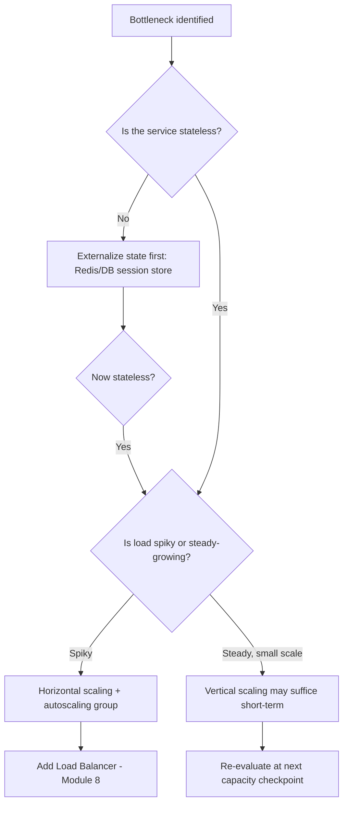
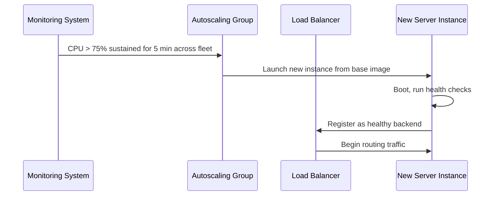
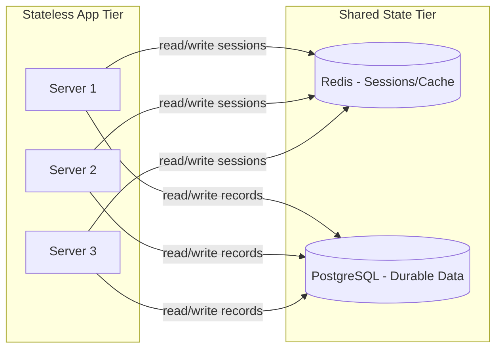
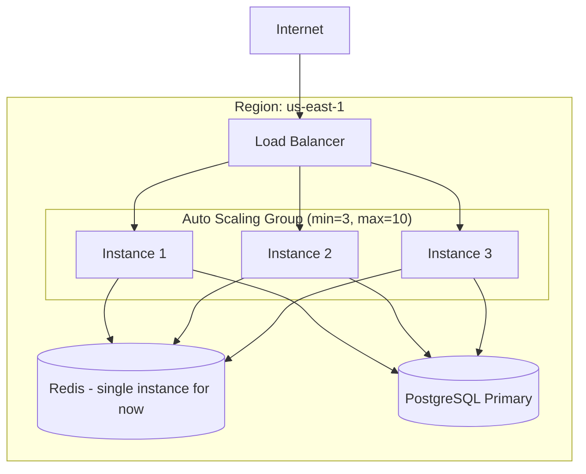

# Module 2 — Scalability Fundamentals

> **Masterclass:** System Design Masterclass (30 Modules)
> **Level:** Beginner
> **Audience:** Node.js backend developers, SDE‑2 / Senior Backend interview candidates, engineers transitioning into architecture roles
> **Prerequisite:** Module 1 — Introduction to System Design

---

## 1. Introduction

In Module 1 we ended with a blog platform that worked fine at 29 requests/second but had zero redundancy — a single server, single database, and no plan for growth. This module answers the question that naturally follows: **when load grows beyond what one machine can handle, what exactly do you do?**

The answer sounds simple — "add more resources" — but *how* you add resources, and what assumptions you must satisfy first, is where most engineers (and most interview candidates) get vague. This module makes it precise: vertical vs. horizontal scaling, stateless vs. stateful services, and the concept of a bottleneck — the ideas every later module (caching, load balancing, sharding, microservices) assumes you already have cold.

---

## 2. Learning Objectives

By the end of this module, you will be able to:

1. Precisely define **vertical scaling** and **horizontal scaling**, and state the ceiling and failure mode of each.
2. Explain why **statelessness** is a prerequisite for effective horizontal scaling — not just a nice-to-have.
3. Distinguish **stateful** from **stateless** services with concrete examples, and identify how to make a stateful service scalable.
4. Identify a **bottleneck** in a system diagram and reason about which scaling technique addresses it.
5. Distinguish **latency** from **throughput** and explain why optimizing one can sometimes hurt the other.
6. Perform capacity estimation to decide *whether*, and *how*, to scale a given system.
7. Recognize the operational and cost trade-offs of each scaling strategy.
8. Avoid the most common beginner mistake: horizontally scaling a system that still holds session state in local memory.

---

## 3. Why This Concept Exists

Every physical resource — CPU, RAM, disk I/O, network bandwidth — is finite on any single machine. No matter how well-optimized your code is, there exists *some* load level at which one machine cannot keep up. This is not a hypothetical; it is a hard physical limit, and it is the single most reliable prediction you can make about any growing system.

Scalability, as a discipline, exists to answer one question with rigor: **"When we hit that ceiling, what do we do, and what do we need to have designed *in advance* to make that option available?"**

This "designed in advance" clause is the crux of the module. You cannot horizontally scale a service that stores session data in local server memory without first making it stateless — the scaling technique itself is easy; the *preparation* is the hard, easily-skipped part, and it's exactly what beginners miss.

---

## 4. Problem Statement

> Our blog platform from Module 1 has grown. Capacity estimation now shows **600 requests/second at peak** — far beyond what our single server can handle (assume one server comfortably handles ~150 req/s before latency degrades). Additionally, users are now logging in, and we've added session-based authentication stored in server memory. Design how this system scales, and identify what must change *before* scaling is possible.

This problem statement is deliberately layered — it has both a raw *capacity* problem and a hidden *architecture* trap (session state), which mirrors how real growth reveals itself in production.

---

## 5. Real-World Analogy

**Vertical scaling is upgrading one chef to a faster, more skilled chef.** They can now cook more dishes per hour — but there's a hard ceiling: no human chef, no matter how skilled, can serve 10,000 meals in one hour. Eventually you *must* hire more chefs.

**Horizontal scaling is hiring more chefs and adding more kitchen stations.** Now capacity scales roughly linearly with headcount — but only if the kitchen is organized so any chef can cook any order. If instead each chef privately remembers "table 5 ordered steak medium-rare" in their own head and no one else's, and a customer's next request happens to go to a *different* chef, chaos follows. This is exactly the **stateful service problem**: local memory is like a chef's private memory — useless to every other chef (server) in the fleet.

The fix in the restaurant is a shared order ticket system that any chef can read — the equivalent of moving session state out of server memory into a shared store like Redis (Module 7).

---

## 6. Technical Definition

**Vertical Scaling (Scaling Up):** Increasing the capacity of a single machine — more CPU cores, more RAM, faster disks — without changing the number of machines.

**Horizontal Scaling (Scaling Out):** Increasing capacity by adding more machines running the same service, and distributing load across them.

**Stateless Service:** A service instance that stores no client-specific data between requests; any instance can handle any request because no instance holds unique information another instance lacks.

**Stateful Service:** A service instance that stores client- or session-specific data locally, making that instance the *only* one that can correctly serve requests tied to that data.

**Bottleneck:** The single resource or component whose capacity limit determines the maximum throughput of the entire system, regardless of how much headroom other components have.

---

## 7. Core Terminology

| Term | Precise Definition | One-line Intuition |
|---|---|---|
| **Vertical Scaling** | Add more power to one machine | "Bigger box" |
| **Horizontal Scaling** | Add more machines | "More boxes" |
| **Stateless Service** | No server-local client data | "Any server can answer" |
| **Stateful Service** | Server-local client data | "Only *this* server remembers" |
| **Session Affinity / Sticky Session** | Routing a client's requests to the same server every time | "Band-aid for statefulness" |
| **Bottleneck** | The limiting resource | "The slowest link" |
| **Throughput** | Requests handled per unit time | "Volume" |
| **Latency** | Time for one request to complete | "Speed" |
| **Scaling Ceiling** | Maximum capacity achievable via a given strategy | "Where this technique stops working" |
| **Elasticity** | Ability to scale resources up/down automatically with demand | "Breathing capacity" |

### Latency vs. Throughput — why they aren't the same lever

A common beginner error is assuming "faster" always means "handles more." Consider two designs:

- **Design A:** Each request takes 10ms, one server, single-threaded processing → ~100 req/s max.
- **Design B:** Each request takes 50ms (slower per-request!) but the server processes 50 requests concurrently (async I/O) → up to 1000 req/s.

Design B has **worse latency** but **better throughput**. This is why Node.js's async, non-blocking model is well-suited to I/O-heavy APIs: it sacrifices a small amount of per-request speed (event loop scheduling overhead) for dramatically higher concurrent throughput. Always ask *which* metric a design decision is actually optimizing.

---

## 8. Internal Working

### How vertical scaling actually helps (and where it stops helping)

When you increase CPU cores or RAM on a machine, you are increasing the *ceiling* of concurrent work that machine's OS and application runtime can perform before resources are exhausted. In Node.js specifically:

- More **CPU cores** help only if you run multiple Node.js processes (via the `cluster` module or a process manager like PM2) — a single Node.js process uses **one core** for its main event loop, regardless of how many cores the machine has.
- More **RAM** raises the ceiling on how much data (connections, cached objects, in-flight request buffers) the process can hold before hitting memory pressure and triggering garbage collection pauses or OOM kills.
- More **disk I/O / network bandwidth** matters proportionally to how I/O-bound your workload is.

**The ceiling:** at some point, you cannot buy a bigger machine (cloud providers cap instance sizes), the cost curve becomes non-linear (very large instances cost disproportionately more per unit of capacity), and — critically — a single machine remains a **single point of failure** no matter how large it is. Module 1 already established why that's unacceptable for anything beyond a toy project.

### How horizontal scaling actually helps

Instead of one large machine, you run **N** smaller machines, each capable of independently handling requests, and place a distributing mechanism (a load balancer, Module 8) in front of them. Capacity now scales roughly linearly with `N` — **provided** every instance is interchangeable, which is only true if the service is stateless.

### The stateful trap, precisely

Say our blog server, on login, stores `sessions[userId] = { loggedInAt, cartItems }` directly in a JavaScript object in server memory. Now:

1. User logs in → request lands on **Server A** → session stored in Server A's memory only.
2. User's next request → load balancer routes it to **Server B** (round robin, Module 8) → Server B has never seen this session → user appears logged out.

This is not a hypothetical bug — it is a **guaranteed** failure mode of naive horizontal scaling, and it is one of the most common real interview "gotcha" follow-ups: *"Great, you added a load balancer and three servers — now what happens to a user's session?"*

**The fix:** move session state out of server memory into a shared, external store (Redis is the standard choice — full detail in Module 7) so *any* server can look up *any* session. This is the concrete meaning of "statelessness" — the server itself holds no unique data; all unique data lives in a shared backing store.

---

## 9. Request Lifecycle

### Mermaid Sequence Diagram — The Stateful Trap



### Mermaid Sequence Diagram — The Fix (Externalized Session Store)



**Step-by-step explanation:** In the fixed version, *neither* Server A nor Server B holds the session locally. Both treat Redis as the single shared source of truth for session data. This is the core mechanism that makes horizontal scaling actually work for real, stateful-feeling applications — the statefulness is real, it's just relocated to a purpose-built shared store instead of scattered across ephemeral server memory.

---

## 10. Architecture Overview

### Before: Vertical scaling only (Module 1's system, upgraded)



### After: Horizontal scaling with externalized state



**Key architectural shift:** notice the database and Redis are now the *only* components holding state. Every application server is now, by design, disposable and interchangeable — you can kill any one of Server 1/2/3 and restart it without losing any user's session or data. This "disposable server" property, more than the raw count of machines, is what horizontal scaling actually buys you in terms of reliability (Module 18 formalizes this as "cattle, not pets").

---

## 11. Capacity Estimation

**Given:** Peak load = 600 req/s. One server handles ~150 req/s before latency degrades (measured via load testing, not guessed).

**Step 1 — Servers needed (naive):**
```
600 req/s ÷ 150 req/s per server = 4 servers
```

**Step 2 — Add headroom for failure tolerance (N+1 or N+2 redundancy — Module 18):**
```
4 servers (minimum) + 1 extra = 5 servers deployed
```
This ensures that if **one** server fails, the remaining 4 still cover the full 600 req/s load without a capacity cliff during recovery.

**Step 3 — Vertical vs. horizontal cost comparison (illustrative):**

| Strategy | Config | Approx. Monthly Cost* | Fault Tolerance |
|---|---|---|---|
| Vertical only | 1 × very large instance (64 vCPU) | $$$$ (super-linear cost) | None — still 1 SPOF |
| Horizontal | 5 × modest instances (4 vCPU each) | $$ (roughly linear cost) | High — survives 1+ failures |

*Illustrative only — actual cloud pricing varies by provider and instance family, and large instances often carry a real per-vCPU cost premium beyond a certain size.

**Conclusion for our scenario:** Horizontal scaling is the correct choice here — not only is it typically cheaper at this scale, it directly solves the reliability gap vertical scaling cannot.

---

## 12. High-Level Design (HLD)



**Design justification:** All application servers are identical, interchangeable, stateless deployments of the same code — a property that must be true *before* the load balancer (Module 8) can distribute traffic arbitrarily across them. This module doesn't yet cover the load balancer's internal algorithm — that's Module 8 — but you must understand *why* it can only work correctly once statelessness is achieved.

---

## 13. Low-Level Design (LLD)

### Before (stateful — broken under horizontal scaling)

```javascript
// BAD: in-memory session store, breaks the moment you run >1 instance
const sessions = {};

app.post('/login', (req, res) => {
  const sessionId = generateId();
  sessions[sessionId] = { userId: req.body.userId, cartItems: [] }; // local memory!
  res.cookie('sessionId', sessionId);
  res.status(200).json({ message: 'Logged in' });
});

app.get('/cart', (req, res) => {
  const session = sessions[req.cookies.sessionId]; // only exists on THIS process
  if (!session) return res.status(401).json({ error: 'Unauthorized' });
  res.json(session.cartItems);
});
```

### After (stateless — safe under horizontal scaling)

```javascript
const { createClient } = require('redis');
const redis = createClient();

app.post('/login', async (req, res) => {
  const sessionId = generateId();
  await redis.set(
    `session:${sessionId}`,
    JSON.stringify({ userId: req.body.userId, cartItems: [] }),
    { EX: 3600 } // 1 hour TTL
  );
  res.cookie('sessionId', sessionId);
  res.status(200).json({ message: 'Logged in' });
});

app.get('/cart', async (req, res) => {
  const raw = await redis.get(`session:${req.cookies.sessionId}`);
  if (!raw) return res.status(401).json({ error: 'Unauthorized' });
  const session = JSON.parse(raw);
  res.json(session.cartItems);
});
```

**LLD-level design notes:**
- `EX: 3600` sets a **TTL** so abandoned sessions self-expire — a memory-management concern that becomes critical once you have millions of sessions (Module 7 covers eviction policies in depth).
- Any of the 5 app server processes can run this exact code, unmodified, because no unique state lives in the process itself.

---

## 14. ASCII Diagrams

```
VERTICAL SCALING CEILING

  Capacity
     │                                    ● ← diminishing returns / cost cliff
     │                              ●
     │                        ●
     │                  ●
     │            ●
     │      ●
     │●
     └─────────────────────────────────────▶ Machine Size ($$$)


HORIZONTAL SCALING (near-linear, with overhead)

  Capacity
     │                                  ●
     │                            ●
     │                      ●
     │                ●
     │          ●
     │    ●
     └─────────────────────────────────────▶ Number of Servers (N)
```

---

## 15. Mermaid Flowcharts

### Decision Flow: Which Scaling Strategy?



---

## 16. Mermaid Sequence Diagrams

*(Already covered in depth in Section 9 — "The Stateful Trap" and "The Fix" sequence diagrams are the canonical sequence diagrams for this module.)*

### Additional: Server Added to Fleet at Runtime (Elastic Scaling)



---

## 17. Component Diagrams



**Why this separation matters architecturally:** Notice all state has been pushed into exactly two components. This is deliberate — it means only **these two** components need the heavy reliability investment (replication, backups, failover) covered in Modules 15 and 18, while the app tier can be treated as freely disposable and cheaply replicated.

---

## 18. Deployment Diagrams



**Deployment-level note:** the Auto Scaling Group's `min=3` guarantees baseline redundancy even at low traffic, and `max=10` caps runaway cost in case of an unexpected traffic spike or a misconfigured retry storm (a real, common incident cause covered further in Module 18's discussion of retry policies).

---

## 19. Network Diagrams

```
        Internet
            │
      ┌─────▼─────┐
      │Load Balancer│  ← Public IP, only this is internet-facing
      └─────┬─────┘
            │  Private subnet only below this line
   ┌────────┼────────┬────────┐
   ▼        ▼        ▼        ▼
[App-1]  [App-2]  [App-3]  [App-N]
   │        │        │        │
   └────────┴────┬───┴────────┘
                 ▼
         [Redis]  [PostgreSQL]
       (private subnet, no public IP, no internet route)
```

**Security note carried over from Module 1:** none of the app servers, Redis, or PostgreSQL should have public IPs. Only the load balancer is internet-facing. This is a direct application of the **principle of least exposure** — the smaller your internet-facing surface area, the smaller your attack surface (deepened in Module 20).

---

## 20. Database Design

At this module's stage, the schema itself (Module 1, Section 20) doesn't change — what changes is *how we connect to it*. With 5 app servers each holding, say, a connection pool of 20, the database must now support:

```
5 servers × 20 connections/server = 100 concurrent connections
```

**This number matters.** PostgreSQL's default `max_connections` is often 100 — meaning our horizontally-scaled app tier alone could exhaust the database's entire connection budget, leaving zero headroom for admin/migration tools. This is a real, common production incident, and it's the first hint of a bottleneck *shifting* rather than disappearing — a theme Module 6 (Storage) and Module 15 (Replication) build on directly.

```sql
-- Check and raise if needed (requires restart for max_connections)
SHOW max_connections;
ALTER SYSTEM SET max_connections = 200;
```

**Better long-term fix (foreshadowing Module 7):** put a connection pooler (like PgBouncer) *in front of* PostgreSQL so hundreds of app-level connections multiplex over a small number of actual database connections.

---

## 21. API Design

The API contract from Module 1 doesn't change at this layer — scaling is, by design, meant to be **transparent to the API consumer**. This is itself an important design principle:

> **A well-designed scaling strategy should require zero changes to the public API contract.** If clients need to change how they call your API because you scaled your backend, that's a sign state leaked into the interface somewhere (e.g., sticky session cookies tied to a specific server's identity).

---

## 22. Scalability Considerations

| Consideration | Vertical Scaling | Horizontal Scaling |
|---|---|---|
| Implementation effort | Low (resize instance) | Medium (requires statelessness, LB) |
| Ceiling | Hard ceiling (max instance size) | Very high (add more machines) |
| Cost curve | Often super-linear at high end | Roughly linear |
| Fault tolerance | None (still 1 machine) | High (N-1 survivability) |
| Downtime during scale-up | Often requires restart | Zero (add instances without touching existing ones) |
| Prerequisite | None | **Statelessness** |

---

## 23. Reliability & Fault Tolerance

Horizontal scaling is not just a *capacity* strategy — it is also, inseparably, a **reliability** strategy, because it eliminates the single-point-of-failure identified in Module 1. But this benefit is only real if:

1. The load balancer performs **health checks** and stops routing to unhealthy instances (Module 8).
2. State genuinely lives outside the app tier (Section 9's fix).
3. The database/Redis tier itself doesn't become the new SPOF — which is precisely why Module 15 (Replication) and Module 18 (Reliability) exist as *later* modules building on this one.

---

## 24. Security Considerations

- **Session store security:** Redis holding session tokens must itself be secured (auth enabled, not exposed publicly, ideally encrypted at rest) — externalizing state solves a scaling problem but *introduces* a new component that needs its own security posture.
- **Load balancer as the sole public entry point** simplifies your security perimeter — you now only need to harden and monitor one ingress point instead of N.

---

## 25. Performance Optimization

- **Connection pooling to Redis and PostgreSQL**, not one connection per request, matters even more once you have multiple app servers each independently opening connections (Section 20).
- **Horizontal scaling does not fix inefficient code** — 5 servers each running an O(n²) algorithm on a growing dataset will eventually hit the same wall, just at 5x the load level instead of 1x. Always profile and fix algorithmic inefficiencies *before* assuming "just add more servers" solves a performance complaint.

---

## 26. Monitoring & Observability

With multiple servers, monitoring must now be **aggregated**, not per-machine:

- Per-server CPU/memory (to catch an unbalanced load distribution — a sign your load balancing algorithm, Module 8, may need adjustment)
- **Fleet-wide** request rate, error rate, and p50/p95/p99 latency
- Redis and PostgreSQL connection counts (Section 20's bottleneck risk)

**A common real-world failure mode to monitor for:** one server silently receiving disproportionate traffic due to a load balancer misconfiguration or a client-side connection-reuse quirk — invisible unless you specifically compare per-server metrics side by side.

---

## 27. Common Bottlenecks

| Bottleneck | Symptom | Fix Direction |
|---|---|---|
| App CPU/memory | High latency at moderate load | Horizontal scale app tier |
| Database connections | `too many connections` errors | Connection pooler (PgBouncer), or scale DB (Module 15) |
| Shared session store (Redis) | Redis becomes the new single point of failure | Redis replication/clustering (Module 7) |
| Load balancer itself | LB CPU maxed, or LB is a single instance | Scale/redundant LB tier (Module 8) |

**Important insight:** scaling one tier often reveals the bottleneck **one layer deeper**. This is not a failure of the process — it's the expected, iterative nature of real system design. You fix the bottleneck you can currently see; fixing it exposes the next one.

---

## 28. Trade-off Analysis

> "I chose **horizontal scaling with externalized session state** over **vertical scaling** for the app tier, optimizing for **fault tolerance and near-linear cost scaling**, at the cost of **added architectural complexity** (load balancer, shared session store, distributed debugging), which is acceptable because our peak load (600 req/s) and reliability requirements exceed what a single machine can safely and durably provide."

> "I chose to **keep the database vertically scaled for now** rather than sharding it immediately, optimizing for **simplicity**, at the cost of **the database remaining a comparative bottleneck and SPOF**, which is acceptable short-term because our current write load doesn't yet exceed a single well-provisioned instance's capacity — I would revisit this the moment write throughput approaches that ceiling (Module 15)."

Notice the second trade-off explicitly flags an intentionally *deferred* problem — a strong interview signal that you understand sequencing, not just techniques in isolation.

---

## 29. Anti-patterns & Common Mistakes

1. **Horizontally scaling a stateful service** without first externalizing state — guarantees intermittent, hard-to-reproduce bugs (Section 9).
2. **Using sticky sessions as a permanent fix** instead of true statelessness — sticky sessions (routing a user always to the same server) *mask* the stateful design flaw rather than fixing it, and they reintroduce a partial SPOF (if that one server dies, that user's session is still lost).
3. **Assuming horizontal scaling is "free" complexity-wise** — it introduces distributed system problems (partial failures, network partitions, harder debugging) that a single-server system never had.
4. **Scaling the wrong tier.** Adding app servers when the actual bottleneck is the database accomplishes nothing except more concurrent connections hitting the same overloaded database, often making things *worse*.
5. **No load testing before or after scaling** — capacity numbers (like "150 req/s per server") must be measured under realistic load, not assumed from CPU specs.

---

## 30. Production Best Practices

- Treat statelessness as a **non-negotiable prerequisite**, checked and enforced (e.g., via code review policy: "no `req`-scoped data may be stored outside of a request-scoped variable") before any horizontal scaling initiative begins.
- Always load-test to find the *actual* per-instance capacity ceiling rather than estimating from CPU/RAM specs alone — real-world I/O wait, garbage collection pauses, and downstream dependency latency all affect this number.
- Prefer **auto-scaling groups** with sane `min`/`max` bounds over manually provisioned fixed fleets, once traffic patterns are variable.
- Always ask, for every new piece of state introduced into a service: "if I add a second instance right now, does this state break?"

---

## 31. Real-World Examples

- **Twitter's early "Fail Whale" era** was largely a story of a monolithic Ruby on Rails application that had not yet solved statelessness and horizontal scaling for its core timeline-serving logic, leading to frequent outages under viral spikes — a direct, famous, real-world instance of this module's core lesson.
- **Netflix** runs thousands of stateless microservice instances behind load balancers; virtually no application-tier instance holds unique, unrecoverable state — all durable/session state lives in dedicated data stores (Cassandra, EVCache), letting any instance be terminated and replaced at any time without user impact (this is the foundation of their well-known Chaos Monkey resilience testing, covered in Module 18).
- **Stack Overflow**, notably, scaled primarily *vertically* for many years, famously running on a surprisingly small number of very powerful servers — a valid counter-example showing vertical scaling remains a legitimate strategy when your workload profile (highly cacheable, read-heavy, well-optimized) keeps you well under any single machine's ceiling. This is a useful example to cite in interviews to show you know horizontal scaling isn't *always* the "correct" default answer.

---

## 32. Node.js Implementation Examples

### Using Node.js `cluster` module for vertical-scaling-within-a-machine (multi-core utilization)

```javascript
const cluster = require('cluster');
const os = require('os');
const express = require('express');

if (cluster.isPrimary) {
  const numCPUs = os.cpus().length;
  console.log(`Primary process ${process.pid} forking ${numCPUs} workers`);
  for (let i = 0; i < numCPUs; i++) {
    cluster.fork();
  }
  cluster.on('exit', (worker) => {
    console.log(`Worker ${worker.process.pid} died — forking a replacement`);
    cluster.fork(); // basic self-healing
  });
} else {
  const app = express();
  app.get('/health', (req, res) => res.status(200).send('OK'));
  app.listen(3000, () => console.log(`Worker ${process.pid} started`));
}
```

**Why this matters:** a single Node.js process only uses one CPU core. On an 8-core machine, running one bare `node server.js` process wastes 7 cores. The `cluster` module (or a process manager like PM2 in cluster mode) is "vertical scaling done right" *within* one machine, and is a genuine prerequisite step most teams do *before* even reaching for horizontal scaling across machines.

---

## 33. Interview Questions

### Easy
1. Define vertical scaling and horizontal scaling in one sentence each.
2. What is a stateless service? Give an example of state that commonly breaks statelessness.
3. Why does a single Node.js process not automatically use all CPU cores on a machine?
4. What is a sticky session, and why is it considered a workaround rather than a real fix?
5. Name one downside of vertical scaling that horizontal scaling solves.
6. What must be true of a service before it can be horizontally scaled safely?

### Medium
7. A team says "we horizontally scaled and it's still slow." What questions would you ask to diagnose this?
8. Explain, with a concrete example, how optimizing for latency can sometimes reduce throughput.
9. Why can adding more app servers sometimes make a database problem *worse* instead of better?
10. Design the minimum change needed to make an existing stateful Express app safely horizontally scalable.
11. What's the relationship between connection pool size, number of app servers, and a database's `max_connections` setting?
12. Explain why "cattle, not pets" is a useful mental model for horizontally scaled infrastructure.

### Hard
13. You've horizontally scaled to 10 servers but throughput only doubled instead of scaling 10x. What are three possible root causes?
14. Design a strategy to migrate a live, stateful production service to a stateless architecture with zero downtime.
15. A load-tested single server handles 150 req/s, but in production with 5 servers behind a load balancer you're only seeing 400 req/s combined, not 750. Walk through your debugging approach.
16. Discuss the trade-offs of vertical vs. horizontal scaling specifically for a relational database's primary write node, given that databases have unique constraints (like single-writer models) that stateless app servers don't.
17. When, if ever, is vertical scaling the *better* choice even at large scale? Defend with a real or plausible scenario.

---

## 34. Scenario-Based Design Questions

1. **Scenario:** Your app went from 1 server to 5 servers behind a load balancer, but users report being randomly logged out. Diagnose and fix.
2. **Scenario:** Finance asks you to justify the cost of horizontal scaling vs. simply buying one very large server. Present both sides with numbers.
3. **Scenario:** During a load test, CPU on all 5 app servers sits at 20% but latency is still high. Where do you look next?
4. **Scenario:** A teammate proposes sticky sessions as "a quick fix" for the login bug in Scenario 1. Explain why you'd push back, and what you'd propose instead.
5. **Scenario:** Your database's `max_connections` limit is being hit intermittently after scaling the app tier from 2 to 8 servers. Propose two different fixes with different trade-offs.
6. **Scenario:** You need to scale a legacy monolith that stores file uploads directly on local disk. What has to change before you can horizontally scale it?
7. **Scenario:** Traffic is highly spiky (10x for 2 hours daily, otherwise low). Compare a fixed 10-server fleet vs. an autoscaling group with min=2, max=10.
8. **Scenario:** An interviewer asks you to design for "1 million concurrent WebSocket connections." Explain why this specific requirement makes horizontal scaling non-trivial in a way that stateless HTTP APIs are not.
9. **Scenario:** Your CTO wants "zero downtime deploys." Explain how a stateless, horizontally scaled architecture enables this, referencing rolling deployments.
10. **Scenario:** You must choose between scaling your app tier horizontally now, versus first optimizing a known-inefficient database query. Reason about which to prioritize and why.

---

## 35. Hands-on Exercises

1. Take the Module 1 mini project API and deliberately add an in-memory session store; reproduce the "random logout" bug locally by running two instances on different ports behind a simple round-robin proxy.
2. Fix the bug from Exercise 1 by externalizing sessions to Redis, and verify the fix by re-running the same test.
3. Load test a single instance of your API (using a tool like `autocannon` or `k6`) to find its actual req/s ceiling, rather than guessing.
4. Convert a single-process Node.js server to use the `cluster` module, and measure the throughput difference under load test, before and after.
5. Diagram (ASCII or Mermaid) the full deployment architecture you'd propose for the 600 req/s scenario in Section 4, labeling every component's state (stateless vs. stateful).

---

## 36. Mini Project

**Build:** Convert the Module 1 blog API into a horizontally-scalable architecture.

**Requirements:**
- Externalize session/auth state to Redis (no in-memory session objects).
- Run at least 2 instances of the app on different ports.
- Put a simple reverse proxy (even a basic Nginx config or a small Node.js proxy) in front, round-robin routing between instances.
- Load test with both single-instance and 2-instance setups; record and compare throughput.
- Document, in `SCALING.md`, the before/after architecture diagrams and the specific bug this migration fixes.

**Success criteria:** You can demonstrate, with actual load test numbers, that the 2-instance setup handles meaningfully more sustained load than 1 instance, and that sessions remain valid regardless of which instance handles a given request.

---

## 37. Advanced Project

**Build:** Extend the Mini Project with production-realistic constraints.

1. Add a **health check endpoint** (`/health`) and configure your proxy to stop routing to an instance that fails it — then kill one instance mid-load-test and confirm traffic reroutes without user-visible errors.
2. Introduce an intentional **connection pool exhaustion scenario**: configure a very low `max_connections` on your database and scale app instances until you reproduce the `too many connections` error; then fix it with a connection pooler (e.g., PgBouncer) and re-test.
3. Write a **capacity estimation and cost comparison document** (using Section 11's format) comparing your horizontally-scaled setup against a hypothetical single large vertically-scaled instance, using realistic cloud pricing for your provider of choice.
4. Implement a basic **autoscaling trigger simulation**: a script that monitors aggregate CPU across your instances and logs a "would scale out now" event when a threshold is crossed for a sustained period — you won't wire this to real infrastructure yet (that's beyond this module), but you'll build the exact decision logic real autoscaling groups use.

**Success criteria:** You can explain, with evidence from your own tests, exactly where the next bottleneck in your system now sits after this module's fixes — setting up the motivating problem for Module 3 (Networking Fundamentals) and beyond.

---

## 38. Summary

- **Vertical scaling** raises one machine's ceiling; it's simple but has a hard limit and remains a single point of failure.
- **Horizontal scaling** adds more machines and scales near-linearly, but **requires statelessness** as a hard prerequisite.
- **Stateful services** break under naive horizontal scaling because different instances don't share the same local memory — the fix is externalizing state to a shared store (e.g., Redis).
- **Sticky sessions** are a workaround, not a fix — they mask statefulness rather than resolving it, and reintroduce partial fragility.
- Scaling one tier frequently **reveals the next bottleneck** one layer deeper (e.g., database connections) — this is expected, iterative system design, not a mistake.
- **Latency and throughput** are related but distinct; some optimizations trade one for the other.

---

## 39. Revision Notes

- Vertical = bigger box, ceiling exists, still 1 SPOF
- Horizontal = more boxes, near-linear, requires statelessness first
- Stateless = no server-local client data → any instance can serve any request
- Sticky sessions = band-aid, not a cure, for statefulness
- Always externalize session/user state (Redis) before horizontally scaling
- Scaling app tier can shift the bottleneck to the database — check connection limits
- Latency ≠ throughput — know which one a given change actually improves

---

## 40. One-Page Cheat Sheet

```
SYSTEM DESIGN — MODULE 2 CHEAT SHEET
─────────────────────────────────────
VERTICAL SCALING          HORIZONTAL SCALING
  bigger machine            more machines
  hard ceiling              near-linear, high ceiling
  still 1 SPOF              N-1 survivable
  simple                    requires statelessness first!

STATELESS PREREQUISITE CHECKLIST
  ☐ No session data in server-local memory
  ☐ Uploaded files not stored on local disk only
  ☐ No in-memory caches holding unique-per-user data
  ☐ Any instance could restart right now with zero data loss

BOTTLENECK HUNTING
  Scaling app tier → often reveals DB connection limit next
  Always load-test to find REAL per-instance ceiling — never guess

TRADE-OFF TEMPLATE (reuse from Module 1)
  "Chose X over Y → optimizes [A], costs [B],
   acceptable because [requirement/number]."

GOLDEN RULE
  Externalize state BEFORE scaling out — not after.
```

---

## Key Takeaways

- Scaling is not one technique but a decision tree — vertical vs. horizontal, gated by whether your service is actually stateless.
- The hardest part of horizontal scaling is rarely the load balancer — it's making sure no unique, unrecoverable state lives only on one instance.
- Fixing one bottleneck routinely surfaces the next one deeper in the stack; this is the normal shape of system design work, not a sign of failure.

## 20 Practice Questions
*(See Section 33 — 6 Easy, 6 Medium, 5 Hard — plus 3 rapid-fire additions:)*
18. What's the first thing you should check if horizontal scaling doesn't improve throughput as expected?
19. Why is a load-tested capacity number more trustworthy than one estimated from CPU specs alone?
20. Name one real company that scaled primarily vertically for a long time, and why that was a valid choice.

## 10 Scenario-Based Questions
*(See Section 34 in full.)*

## 5 Design Assignments
*(See Sections 36–37 — Mini Project and Advanced Project — plus:)*
1. Diagram your own personal project's current scaling ceiling and identify whether it's currently stateless or stateful.
2. Write a one-page migration plan to make a hypothetical stateful service stateless with zero downtime.
3. Compute a capacity estimation and cost comparison (vertical vs. horizontal) for a system of your choosing using real published cloud pricing.

## Suggested Next Module

**→ Module 3: Networking Basics for System Design** — now that we can scale to multiple servers, we need to understand exactly how requests physically travel across networks to reach them — DNS, IP addressing, ports, and the routing layer that everything from load balancers to CDNs is built on top of.
