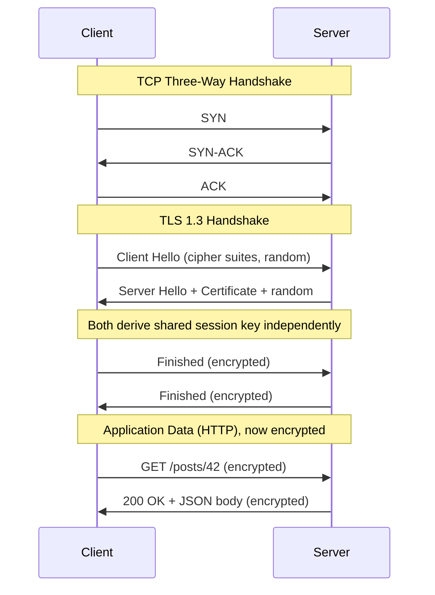
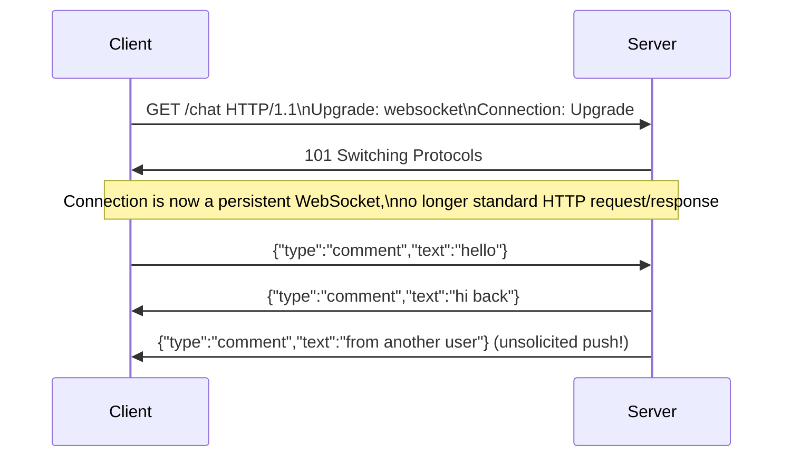
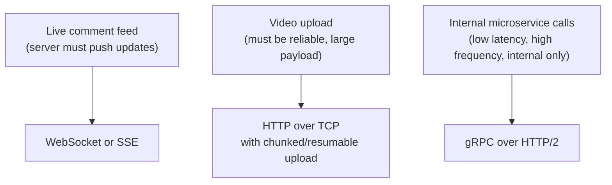
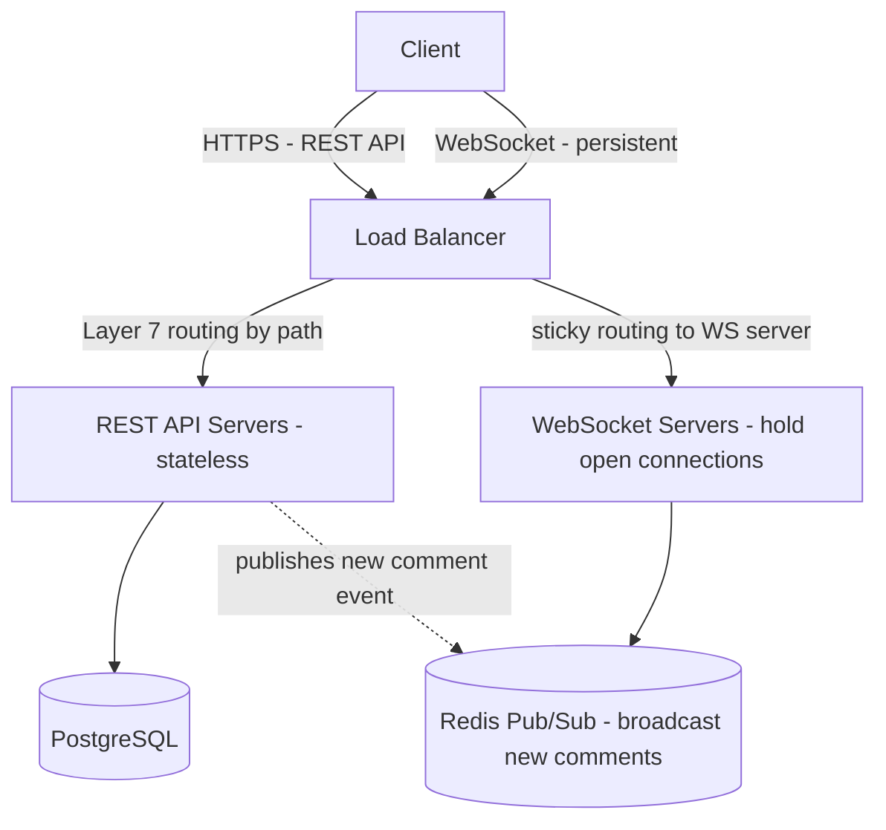
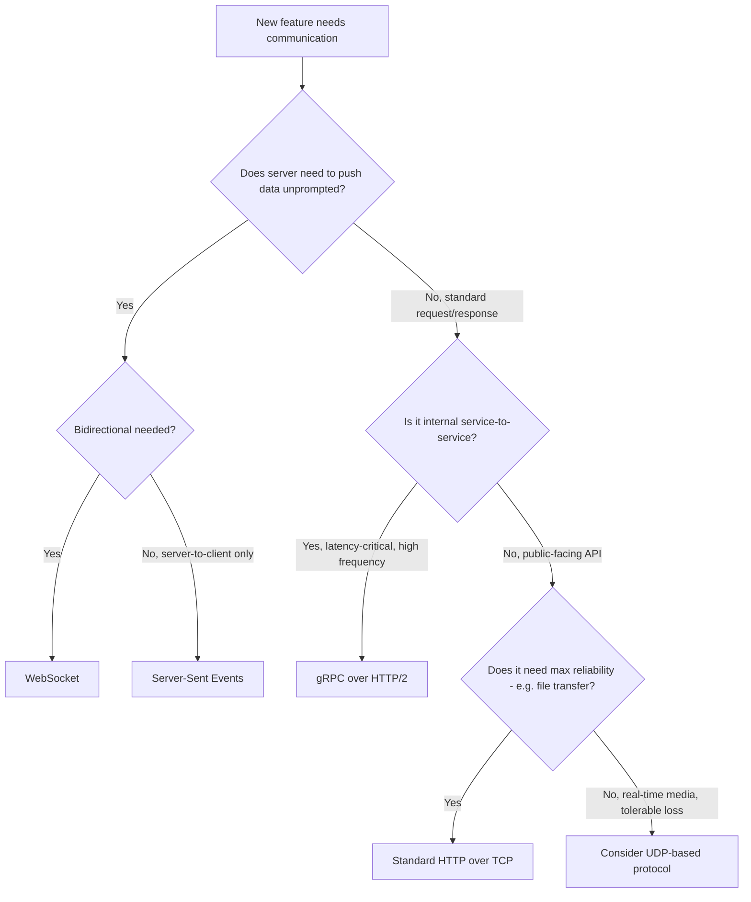
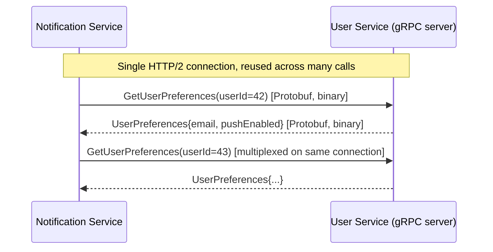
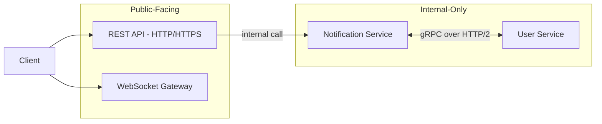
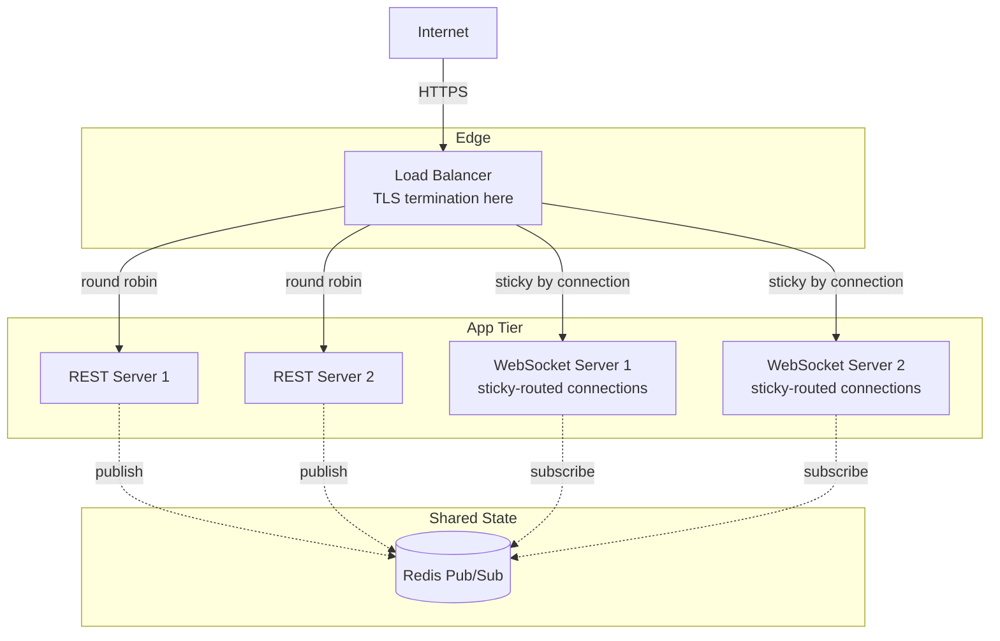

# Module 4 — HTTP, HTTPS, TCP & UDP

> **Masterclass:** System Design Masterclass (30 Modules)
> **Level:** Beginner
> **Audience:** Node.js backend developers, SDE‑2 / Senior Backend interview candidates, engineers transitioning into architecture roles
> **Prerequisite:** Module 1 — Introduction to System Design, Module 2 — Scalability Fundamentals, Module 3 — Networking Basics

---

## 1. Introduction

Module 3 established how a packet finds its way to the correct machine and port. This module goes one level deeper: **what actually happens during that connection** — the handshake that establishes trust and ordering, the encryption that keeps it private, and the application-layer protocol (HTTP) that gives the bytes meaning.

Every later module assumes you understand this layer implicitly. When Module 8 discusses Layer 4 vs. Layer 7 load balancing, "Layer 4" means TCP and "Layer 7" means HTTP — a distinction that is meaningless without this module. When Module 25 discusses real-time systems, WebSockets and Server-Sent Events are direct extensions of the HTTP evolution covered here. This is the protocol vocabulary for the rest of the course.

---

## 2. Learning Objectives

By the end of this module, you will be able to:

1. Explain the **TCP three-way handshake** and why TCP guarantees ordered, reliable delivery.
2. Explain **UDP** and identify when its lack of guarantees is a feature, not a limitation.
3. Explain the **TLS handshake** and what HTTPS actually adds over HTTP.
4. Enumerate core **HTTP methods** and their correct semantic use (idempotency, safety).
5. Explain what changed in **HTTP/2** (multiplexing, header compression) and **HTTP/3** (QUIC, UDP-based).
6. Explain how **WebSocket** differs fundamentally from request/response HTTP.
7. Explain what **gRPC** is and why it's often chosen for internal service-to-service communication.
8. Choose the correct protocol for a given system design scenario and justify the choice.

---

## 3. Why This Concept Exists

Module 3 told us packets can find their way from a client to a server. But packets, by themselves, guarantee nothing — they can arrive out of order, get duplicated, get lost entirely, or be intercepted and read by anyone on the path. If two computers are going to have a meaningful, reliable, and private conversation over an untrusted public network, they need agreed-upon rules for that conversation. That is what the transport layer (TCP/UDP) and the application layer (HTTP) exist to provide.

This module exists because **the specific rules you pick have massive system design consequences.** Choosing TCP over UDP trades speed for reliability. Choosing HTTP/1.1 over HTTP/2 leaves performance on the table for free. Choosing WebSocket over polling changes your entire server-side connection model. These are not implementation details — they are architecture decisions with real trade-offs, and this module is where you learn to make them deliberately instead of by default.

---

## 4. Problem Statement

> Our blog platform (Modules 1–3) now needs three new features: (1) a **live comment feed** that updates in real time without the user refreshing, (2) a **video upload** feature where large files must be transferred reliably, and (3) an internal **notification service** that other internal microservices call frequently with strict latency requirements. For each feature, identify the correct transport/application protocol, and justify why the "default" choice (a normal HTTP REST call) is or isn't sufficient.

---

## 5. Real-World Analogy

**TCP is a certified, tracked mail delivery service.** Every package gets a tracking number, delivery is confirmed, and if a package is lost or damaged in transit, the sender is notified and resends it. It's slower and involves more overhead (signatures, tracking, confirmations) but you can trust every package arrives, intact, in order.

**UDP is dropping postcards in a mailbox with no tracking.** Fast, cheap, minimal overhead — but no guarantee a postcard arrives, arrives in order, or arrives at all. This sounds strictly worse, until you consider: for a live video call, if one video frame ("postcard") is lost, you don't want the sender to pause everything and resend it — by the time it arrives, it's stale anyway. You'd rather skip it and keep the stream flowing. This is exactly why real-time video/voice (and DNS lookups, and online gaming) use UDP.

**HTTPS is TCP's certified mail service placed inside a sealed, tamper-evident envelope.** The mail carrier (network) can still see the sender and recipient addresses (IP addresses are visible), but cannot read the contents without breaking a seal that would be detectably broken (TLS encryption + integrity checking).

**WebSocket is upgrading from "mail a letter, wait for a reply letter" to "open a phone line and keep talking."** Regular HTTP is a new letter for every question; WebSocket opens one persistent connection where both sides can speak at any time — essential for the "live comment feed" in our problem statement.

---

## 6. Technical Definition

**TCP (Transmission Control Protocol):** A connection-oriented transport protocol providing reliable, ordered, error-checked delivery of a byte stream between applications, via a handshake, acknowledgments, and retransmission of lost data.

**UDP (User Datagram Protocol):** A connectionless transport protocol providing fast, minimal-overhead delivery of discrete packets ("datagrams") with **no** guarantee of delivery, ordering, or duplicate protection.

**HTTP (Hypertext Transfer Protocol):** An application-layer protocol defining how clients and servers structure requests and responses, built (traditionally) on top of TCP.

**HTTPS:** HTTP layered on top of **TLS (Transport Layer Security)**, providing encryption, integrity, and authentication of the connection.

**WebSocket:** A protocol providing a persistent, full-duplex (both directions simultaneously) communication channel over a single long-lived TCP connection, initiated via an HTTP "upgrade" handshake.

**gRPC:** A high-performance remote procedure call (RPC) framework built on HTTP/2, using Protocol Buffers for compact, strongly-typed message serialization.

---

## 7. Core Terminology

| Term | Precise Definition | One-line Intuition |
|---|---|---|
| **Three-Way Handshake** | SYN, SYN-ACK, ACK sequence establishing a TCP connection | "Are you there? Yes. Confirmed." |
| **TLS Handshake** | Negotiation of encryption keys/algorithm before secure data transfer | "Agreeing on a secret code" |
| **Idempotent (HTTP method)** | Repeating the request has the same effect as doing it once | "Doing it twice = doing it once" |
| **Safe (HTTP method)** | The request does not change server state | "Just looking, not touching" |
| **Multiplexing (HTTP/2)** | Multiple requests/responses interleaved over one connection | "One phone line, many conversations at once" |
| **Head-of-Line Blocking** | One slow/stuck item delays everything behind it in the same queue | "Traffic jam behind one stalled car" |
| **QUIC (HTTP/3)** | A UDP-based transport protocol providing TCP-like reliability without TCP's head-of-line blocking | "TCP's guarantees, UDP's flexibility" |
| **Full-Duplex** | Both parties can send data simultaneously over the same connection | "Both people talking on a phone call at once" |

### HTTP Method Semantics — safety and idempotency, precisely

| Method | Safe? | Idempotent? | Typical Use |
|---|---|---|---|
| `GET` | Yes | Yes | Retrieve a resource |
| `HEAD` | Yes | Yes | Retrieve headers only |
| `PUT` | No | Yes | Replace a resource entirely |
| `DELETE` | No | Yes | Remove a resource |
| `POST` | No | **No** | Create a resource / non-idempotent action |
| `PATCH` | No | Not guaranteed | Partial update |

**Why idempotency matters concretely:** recall Module 3's discussion of unreliable networks — a client that doesn't receive a response might retry. If that request was a `PUT` (idempotent), retrying is safe: applying the same replacement twice yields the same final state. If it was a naive `POST` (non-idempotent) for "charge this credit card," retrying on a network timeout can cause a **double charge** — the exact real-world failure mode that motivates idempotency keys (Module 3, Section 21).

---

## 8. Internal Working

### The TCP three-way handshake, precisely

1. **Client → Server: SYN** ("I'd like to start a connection, here's my initial sequence number")
2. **Server → Client: SYN-ACK** ("Acknowledged, here's *my* initial sequence number")
3. **Client → Server: ACK** ("Acknowledged — connection established")

Only after this handshake completes can actual application data (like an HTTP request) begin flowing. This is why **every new TCP connection costs at least one full round trip before any real data moves** — a direct, concrete cost that motivates connection reuse (`Keep-Alive`, HTTP/2 multiplexing) discussed below.

### Why TCP is reliable: sequence numbers and acknowledgments

Every byte sent over TCP is numbered. The receiver acknowledges which bytes it has received; if the sender doesn't receive an acknowledgment within an expected time, it **retransmits** the unacknowledged data. This is the literal mechanism behind "TCP guarantees delivery" — it's not magic, it's numbered packages plus a resend-on-timeout policy, executed by the operating system's network stack, invisible to your application code.

### Why UDP is fast: none of the above

UDP simply sends a datagram and moves on — no handshake, no sequence numbers, no acknowledgment, no retransmission. This is precisely why UDP has lower latency and overhead: **it does less work.** The trade-off is that your *application* must handle any reliability it needs itself, or accept the occasional loss (as video/audio streaming does).

### The TLS handshake, precisely (simplified TLS 1.3 flow)

1. **Client Hello:** client proposes supported encryption algorithms (cipher suites) and a random value.
2. **Server Hello + Certificate:** server picks a cipher suite, sends its **TLS certificate** (proving its identity, signed by a trusted Certificate Authority) and its own random value.
3. **Key exchange:** both sides independently compute a shared **session key** using the exchanged randoms and asymmetric cryptography, without ever transmitting the key itself over the network (this is the core trick of public-key cryptography).
4. **Finished:** both sides confirm they've derived matching session keys; all subsequent data is encrypted with this shared symmetric key (symmetric encryption is used for the actual data because it's dramatically faster than asymmetric encryption for bulk data).

**Why this adds latency:** the TLS handshake requires its own round trip(s) **on top of** the TCP handshake. TLS 1.3 (the modern standard) reduced this to effectively one round trip, down from two in TLS 1.2 — a meaningful, measurable latency win at scale, which is why upgrading to TLS 1.3 is a legitimate, concrete performance optimization, not just a security one.

### How HTTP/2 solves TCP's head-of-line blocking (partially)

In HTTP/1.1, without pipelining tricks, each TCP connection could really only have one request in flight at a time efficiently — browsers worked around this historically by opening multiple parallel TCP connections (typically 6) to the same server, which is wasteful (each connection pays its own handshake cost).

HTTP/2 introduces **multiplexing**: multiple requests and responses are broken into frames and interleaved over a **single** TCP connection, then reassembled at the other end. This eliminates the "6 parallel connections" workaround and its overhead. However, because it's still built on TCP, if a single TCP packet is lost, **all** multiplexed streams on that connection must wait for retransmission — this is HTTP/2's residual head-of-line blocking, and it's the exact motivation for HTTP/3.

### How HTTP/3 (QUIC) solves it fully

HTTP/3 runs over **QUIC**, a new transport protocol built on **UDP** (not TCP), that reimplements reliability and ordering *per-stream* rather than per-connection. A lost packet on one stream no longer blocks the other streams — each stream's loss recovery is independent. This is a rare, elegant case of "go around the old layer's limitation entirely by rebuilding the needed guarantees on top of the lower-overhead protocol (UDP)" instead of patching TCP further.

---

## 9. Request Lifecycle

### Mermaid Sequence Diagram — Full TCP + TLS + HTTP Request



**Step-by-step explanation:** notice the request itself (`GET /posts/42`) doesn't happen until **after** two full setup phases. This is precisely why connection reuse matters — subsequent requests over the *same* already-established TCP+TLS connection skip both setup phases entirely, which is one of the concrete performance benefits of HTTP/2's multiplexed single connection.

### Mermaid Sequence Diagram — WebSocket Upgrade Handshake



**Why this matters for the Section 4 "live comment feed" requirement:** notice the server can send data to the client (`"from another user"`) **without the client having requested it.** This is impossible in standard request/response HTTP — the server can *only* respond to a request, never push unprompted. This single capability is the entire reason WebSocket (or Server-Sent Events, a simpler one-directional alternative) is the correct protocol choice for real-time features, not "just poll the server every second with HTTP GET" (a common, inefficient beginner workaround).

---

## 10. Architecture Overview

### Protocol choice mapped to our Section 4 requirements



**Design justification for each:**
- **Live comments → WebSocket:** requires server-initiated push; a persistent connection avoids the overhead of repeated TCP+TLS handshakes that naive polling would incur.
- **Video upload → HTTP over TCP:** large file transfer *needs* TCP's reliability guarantees (no missing/corrupted chunks of video data); UDP would be actively wrong here.
- **Internal notification service → gRPC over HTTP/2:** internal, high-frequency, latency-sensitive calls benefit from gRPC's compact binary serialization (Protocol Buffers) and HTTP/2 multiplexing — details in Section 13 and Module 16 (Microservices).

---

## 11. Capacity Estimation

**Scenario:** Comparing the overhead cost of polling vs. WebSocket for the live comment feature, with 10,000 concurrently active users.

**Polling approach (naive, e.g., poll every 3 seconds):**
```
10,000 users × (1 request / 3 sec) = 3,333 requests/sec
Each request re-pays: TCP handshake (if not reused) + full HTTP headers (~500 bytes overhead)
```

**WebSocket approach (persistent connection):**
```
10,000 users × 1 persistent connection = 10,000 open connections (one-time cost)
Messages sent only when there's an actual new comment — potentially far fewer than 3,333/sec
```

**Conclusion:** polling's request *rate* scales with user count regardless of actual activity, while WebSocket's message rate scales with actual *event* frequency — for a feature where most users are idle most of the time (typical for a comment feed), WebSocket is dramatically more efficient. The trade-off, covered in Section 22, is that WebSocket requires the server to **hold 10,000 concurrent open connections in memory**, which has its own capacity implications distinct from stateless HTTP request handling.

---

## 12. High-Level Design (HLD)



**Why WebSocket servers need a different scaling pattern than REST servers:** recall Module 2's stateless prerequisite for horizontal scaling. A WebSocket connection is inherently **stateful at the TCP level** — a specific client is connected to a specific server instance, and that connection cannot be transparently moved to another instance the way a stateless HTTP request can. This is why the diagram shows a **Redis Pub/Sub** layer: when a new comment is created (via the stateless REST API), it's published to Redis, and **every** WebSocket server subscribed to that channel pushes it to *its own* connected clients — solving the "how do all instances know about this event" problem without requiring WebSocket connections themselves to be stateless.

---

## 13. Low-Level Design (LLD)

### WebSocket server implementation (Node.js, using `ws`)

```javascript
const WebSocket = require('ws');
const Redis = require('ioredis');

const wss = new WebSocket.Server({ port: 8080 });
const redisSub = new Redis();
const clients = new Set();

wss.on('connection', (socket) => {
  clients.add(socket);
  socket.on('close', () => clients.delete(socket));
});

// Subscribe to the shared channel — any server instance receives every published comment
redisSub.subscribe('new-comments');
redisSub.on('message', (channel, message) => {
  for (const client of clients) {
    if (client.readyState === WebSocket.OPEN) {
      client.send(message); // push to every connected client on THIS instance
    }
  }
});
```

### Publishing a new comment from the stateless REST API

```javascript
const redisPub = new Redis();

app.post('/posts/:id/comments', async (req, res) => {
  const comment = await commentRepository.insert(req.params.id, req.body);
  await redisPub.publish('new-comments', JSON.stringify(comment)); // fan-out to all WS servers
  res.status(201).json(comment);
});
```

**LLD-level design note:** the REST endpoint that *creates* a comment never talks to WebSocket clients directly — it only publishes an event. This decoupling means the REST API tier remains fully stateless (Module 2's requirement intact) while the WebSocket tier handles the stateful, real-time delivery — a clean separation of concerns directly enabled by understanding *why* these are fundamentally different connection models (Section 6).

---

## 14. ASCII Diagrams

```
TCP HANDSHAKE (3 steps, 1.5 round trips before data flows)

  Client                          Server
    │──────────── SYN ───────────▶│
    │◀────────── SYN-ACK ─────────│
    │──────────── ACK ────────────▶│
    │                              │
    │◀════ Application data now flows ════▶│


HTTP/1.1 vs HTTP/2 CONNECTION USAGE

  HTTP/1.1 (workaround: multiple connections)
    Conn 1 ──▶ Request A
    Conn 2 ──▶ Request B
    Conn 3 ──▶ Request C
    (each connection pays its OWN handshake cost)

  HTTP/2 (multiplexed, single connection)
    Conn 1 ──▶ [Request A][Request B][Request C] (interleaved frames)
    (one handshake, shared across all requests)
```

---

## 15. Mermaid Flowcharts

### Decision Flow: Choosing the Right Protocol



---

## 16. Mermaid Sequence Diagrams

*(Sections 9 covers the two canonical sequence diagrams for this module — TCP+TLS+HTTP handshake, and WebSocket upgrade. Additional diagram below.)*

### gRPC Call Over HTTP/2 (Internal Service-to-Service)



**Why this matters for our Section 4 notification service:** each call reuses the same underlying HTTP/2 connection (no repeated handshakes) and serializes data as compact binary Protocol Buffers rather than verbose JSON text — both directly reducing latency and bandwidth for high-frequency internal calls, which is exactly the stated requirement.

---

## 17. Component Diagrams



**Why public-facing and internal-only protocols differ:** public APIs favor **HTTP/REST with JSON** for broad client compatibility (every language and browser understands JSON over HTTP trivially) at the cost of some verbosity/performance; internal service-to-service calls favor **gRPC** because both ends are code you control, so you can commit to a stricter, faster binary contract without worrying about arbitrary third-party client compatibility (fully expanded in Module 16).

---

## 18. Deployment Diagrams



**Deployment-level note — "TLS termination":** the load balancer decrypts HTTPS traffic and forwards plain HTTP internally within the trusted private network (Module 3's private subnet). This is standard practice: it centralizes certificate management at one layer instead of every app server managing its own TLS certificates, at the (generally accepted) cost of internal traffic being unencrypted — acceptable within a properly isolated private subnet, though some highly-regulated environments re-encrypt internally too (mTLS, covered in Module 20).

---

## 19. Network Diagrams

```
CONNECTION REUSE COMPARISON

  WITHOUT Keep-Alive (HTTP/1.0 default)
  Request 1: [TCP handshake][TLS handshake][HTTP req/res][TCP close]
  Request 2: [TCP handshake][TLS handshake][HTTP req/res][TCP close]
  Request 3: [TCP handshake][TLS handshake][HTTP req/res][TCP close]
  (full setup cost paid EVERY request)

  WITH Keep-Alive / HTTP/2 multiplexing
  [TCP handshake][TLS handshake]
    ├─ Request 1 [HTTP req/res]
    ├─ Request 2 [HTTP req/res]
    └─ Request 3 [HTTP req/res]
  (setup cost paid ONCE, amortized across all requests)
```

---

## 20. Database Design

Protocol choice has one direct, common database design implication: **connection protocol for the database client itself.** PostgreSQL, for example, uses its own binary wire protocol over TCP (not HTTP) between the application and the database — this is why database drivers maintain **persistent TCP connections** (connection pools, Module 1 Section 25) rather than opening a new connection per query, for exactly the same handshake-cost reasons established in this module.

```javascript
// The connection pool exists precisely BECAUSE TCP+auth handshake cost is real
const { Pool } = require('pg');
const pool = new Pool({
  max: 20,
  idleTimeoutMillis: 30000, // keep connections alive and reusable, don't pay handshake cost repeatedly
});
```

---

## 21. API Design

Applying this module's concepts to concrete API design decisions:

- **Use `GET` only for safe, side-effect-free reads** — a `GET` that secretly increments a view counter as a side effect violates HTTP semantics and breaks caching assumptions (browsers/CDNs assume `GET` is safe to cache and replay).
- **Design `POST` endpoints that must be retried safely (e.g., payments) with an idempotency key**, directly addressing the non-idempotent nature of `POST` established in Section 7.
- **Prefer `PUT` for full-resource replacement, `PATCH` for partial updates** — using the semantically correct method communicates intent clearly to API consumers and enables correct caching/proxy behavior.

```javascript
// Idempotency key pattern for a non-idempotent POST (payment creation)
app.post('/payments', async (req, res) => {
  const idempotencyKey = req.headers['idempotency-key'];
  const existing = await paymentRepository.findByIdempotencyKey(idempotencyKey);
  if (existing) {
    return res.status(200).json(existing); // safe to "retry" — returns the original result
  }
  const payment = await paymentRepository.create(req.body, idempotencyKey);
  res.status(201).json(payment);
});
```

---

## 22. Scalability Considerations

| Consideration | REST/HTTP | WebSocket |
|---|---|---|
| Statelessness | Naturally stateless (Module 2) | Inherently stateful (connection tied to one server) |
| Horizontal scaling | Trivial — any instance handles any request | Requires sticky routing + shared pub/sub for cross-instance events |
| Connection count per server | Low (request, respond, done) | High (must hold every active connection open) |
| Load balancer requirement | Simple round robin works | Needs sticky sessions or connection-aware routing (Module 8) |

**Key scalability insight:** choosing WebSocket is not just a protocol decision — it's implicitly choosing a **different scaling model** than the stateless HTTP servers built in Modules 1–2. This is precisely why Section 12's HLD introduces a dedicated WebSocket tier rather than adding WebSocket handling to the existing stateless REST servers.

---

## 23. Reliability & Fault Tolerance

- **TCP's reliability guarantees are per-connection, not per-application** — if a WebSocket server crashes, every client connected to it is disconnected and must reconnect; the *TCP layer* can't save you from an *application/server* failure. Client-side reconnect logic with backoff is a required companion to any WebSocket design.
- **UDP-based protocols (like QUIC/HTTP/3) must implement their own reliability where needed** — this isn't a flaw, it's a deliberate design choice to implement reliability *per-stream* rather than inheriting TCP's coarser, connection-wide guarantees (Section 8).
- **Idempotency (Section 7, 21) is a reliability technique**, not just an API nicety — it's the direct mitigation for the fact that networks (Module 3) can silently drop responses even after a request was successfully processed.

---

## 24. Security Considerations

- **Always use HTTPS/WSS (WebSocket Secure), never plain HTTP/WS, for anything carrying real user data** — plain HTTP is trivially interceptable on shared/untrusted networks (public WiFi being the classic example).
- **TLS certificate validation must not be disabled**, even "temporarily for testing" — a startlingly common real-world vulnerability is code that disables certificate verification (`rejectUnauthorized: false` in Node.js) and ships to production, defeating TLS's entire purpose.
- **gRPC's mTLS (mutual TLS) support** is often used for internal service-to-service authentication, verifying *both* the client's and server's identity — not just the server's, as in typical public HTTPS (deepened in Module 20).

---

## 25. Performance Optimization

- **Reuse connections** (`Keep-Alive`, HTTP/2 multiplexing, gRPC's persistent channels) to amortize handshake cost across many requests — this is the single highest-leverage, protocol-level performance optimization available, and it's often simply a matter of *not disabling* defaults, or upgrading library versions.
- **Upgrade to TLS 1.3** where possible — fewer round trips than TLS 1.2 for the same security guarantees (Section 8).
- **Consider HTTP/2 or HTTP/3** for high-request-volume public APIs, especially over higher-latency/lossy networks (mobile) where HTTP/3's improved loss recovery has the largest measurable benefit.
- **Use binary serialization (Protocol Buffers via gRPC)** for high-frequency internal calls instead of JSON, reducing both payload size and serialization/parsing CPU cost.

---

## 26. Monitoring & Observability

Protocol-specific metrics worth tracking beyond Module 3's networking metrics:

- **TLS handshake duration** (separate from TCP connect time) — a spike often indicates certificate chain issues or CPU exhaustion on the terminating load balancer.
- **Active WebSocket connection count per server instance** — critical for capacity planning of the stateful WS tier (Section 22); an imbalance here (one instance holding far more connections than others) indicates a sticky-routing problem.
- **HTTP status code distribution** (4xx vs. 5xx rates) — 4xx spikes often indicate client-side/API-contract issues, while 5xx spikes indicate server-side problems; conflating them in dashboards hides the actual root cause category.

---

## 27. Common Bottlenecks

| Bottleneck | Symptom | Root Cause |
|---|---|---|
| Repeated TCP+TLS handshakes | High latency despite low payload size | `Keep-Alive` disabled, or client opening new connections per request |
| WebSocket server memory | Server crashes or degrades under many concurrent connections | Each open connection consumes memory/file descriptors; server under-provisioned or leaking closed-but-untracked sockets |
| Naive polling for "real-time" features | High request rate, high server load, poor actual real-time feel | Should be WebSocket/SSE instead of interval-based `GET` polling |
| JSON serialization overhead | High CPU on high-frequency internal calls | Should consider gRPC/Protocol Buffers for internal service-to-service traffic |

---

## 28. Trade-off Analysis

> "I chose **WebSocket** over **HTTP polling** for the live comment feature, optimizing for **real-time responsiveness and reduced request volume at scale**, at the cost of **a fundamentally different, stateful scaling model requiring sticky routing and a pub/sub fan-out layer**, which is acceptable because the feature's core value proposition (real-time updates) is not achievable with acceptable latency/efficiency via polling."

> "I chose **gRPC over HTTP/2** for internal service-to-service calls rather than plain REST/JSON, optimizing for **latency and bandwidth efficiency at high call frequency**, at the cost of **reduced human-readability of wire traffic and a stricter schema (Protocol Buffers) requiring coordinated updates between services**, which is acceptable because these are internal services under our own team's control, not public third-party-facing APIs."

---

## 29. Anti-patterns & Common Mistakes

1. **Polling via repeated HTTP `GET` requests to simulate "real-time" features** — works, but wastes resources and adds latency compared to WebSocket/SSE; a classic sign of not knowing the right tool exists.
2. **Using `GET` for state-changing operations** (e.g., `GET /deletePost?id=42`) — breaks caching assumptions, gets accidentally triggered by prefetching/crawlers, and violates HTTP semantics.
3. **Disabling TLS certificate validation "temporarily"** and shipping it to production (Section 24) — one of the most common and dangerous real-world security regressions.
4. **Treating WebSocket servers as stateless and load-balancing them with plain round robin** without sticky routing or a pub/sub fan-out layer — breaks the moment a client's follow-up interaction lands on a different instance than their open connection.
5. **Choosing UDP for data that genuinely requires reliability** (e.g., financial transaction data) purely for a latency win — a serious design error; UDP's speed comes specifically *from* dropping the guarantees that matter for this kind of data.
6. **Not setting request timeouts**, silently trusting a hung TCP connection to eventually resolve on its own (directly echoing Module 3's Section 32 lesson).

---

## 30. Production Best Practices

- Default to **HTTPS everywhere**, including internal service-to-service traffic where feasible (or explicitly document and isolate the trust boundary if not, per Module 20).
- Use **HTTP/2 or later** for any new public API where client support allows — the multiplexing benefit is essentially "free" performance.
- For real-time features, default to **WebSocket or Server-Sent Events**, never interval-based polling, once the feature genuinely requires low-latency server-initiated updates.
- Build **idempotency into any non-idempotent, retryable operation** from day one — retrofitting it after a production double-charge incident is far more painful.
- Choose **gRPC for internal, high-frequency service-to-service communication**; choose **REST/JSON for public-facing APIs** prioritizing broad compatibility and human debuggability.

---

## 31. Real-World Examples

- **Slack and Discord** both rely heavily on WebSocket connections for real-time messaging delivery — precisely the "server must push unprompted" requirement from Section 9's diagram, at a scale of millions of concurrent connections, necessitating the sticky-routing + pub/sub architecture pattern from Section 12.
- **Google popularized gRPC internally** (originally as "Stubby") for exactly the reason described in Section 17 — enormous internal service-to-service call volume where binary serialization and connection reuse translate into meaningful infrastructure cost and latency savings at their scale.
- **Google Chrome and major CDNs (Cloudflare, Google) drove HTTP/3/QUIC adoption** specifically to reduce the impact of packet loss on mobile networks, where TCP's connection-wide head-of-line blocking (Section 8) was a measurably worse user experience than QUIC's per-stream loss recovery — a direct, large-scale validation of this module's technical explanation.

---

## 32. Node.js Implementation Examples

### Enabling HTTP Keep-Alive explicitly for outbound calls (client-side connection reuse)

```javascript
const https = require('https');
const axios = require('axios');

const keepAliveAgent = new https.Agent({ keepAlive: true, maxSockets: 50 });

const client = axios.create({
  httpsAgent: keepAliveAgent, // reuse TCP+TLS connections across requests to the same host
  timeout: 3000,
});

// Subsequent calls to the same host reuse the underlying connection instead of
// re-paying the TCP + TLS handshake cost from Section 8/19 every time.
async function getUserPreferences(userId) {
  const res = await client.get(`https://user-service.internal/users/${userId}/preferences`);
  return res.data;
}
```

### Server-Sent Events (simpler one-directional alternative to WebSocket)

```javascript
app.get('/comments/stream', (req, res) => {
  res.setHeader('Content-Type', 'text/event-stream');
  res.setHeader('Cache-Control', 'no-cache');
  res.setHeader('Connection', 'keep-alive');

  const sendComment = (comment) => {
    res.write(`data: ${JSON.stringify(comment)}\n\n`); // SSE wire format
  };

  const subscriber = new Redis();
  subscriber.subscribe('new-comments');
  subscriber.on('message', (channel, message) => sendComment(JSON.parse(message)));

  req.on('close', () => subscriber.disconnect());
});
```

**When to choose SSE over WebSocket:** SSE is simpler to implement and works over plain HTTP (no protocol upgrade), but is **one-directional (server → client only)**. For our comment feed, if clients never need to send data over this same channel (they'd post new comments via a normal `POST`, not over the stream), SSE is a legitimate, simpler alternative to full WebSocket — a genuine trade-off worth stating explicitly in an interview.

---

## 33. Interview Questions

### Easy
1. What are the three steps of the TCP handshake, and what does each step confirm?
2. What is the key difference between TCP and UDP in one sentence?
3. Why is `POST` not idempotent, but `PUT` is?
4. What does HTTPS add on top of HTTP?
5. What is the main new capability WebSocket provides that plain HTTP request/response cannot?
6. Name one real-world use case where UDP's lack of reliability guarantees is actually beneficial.

### Medium
7. Explain what "head-of-line blocking" means in the context of HTTP/1.1 and how HTTP/2 partially addresses it.
8. Why does HTTP/3 use UDP as its base transport instead of TCP, despite UDP's lack of built-in reliability?
9. Walk through the TLS handshake and explain why TLS 1.3 has lower latency than TLS 1.2.
10. Why is a WebSocket server harder to horizontally scale than a stateless REST API server?
11. Design an idempotency mechanism for a `POST /orders` endpoint, and explain what problem it actually solves.
12. When would you choose gRPC over a plain REST/JSON API, and when would you choose the opposite?

### Hard
13. A mobile client on a lossy cellular network reports significantly worse performance on HTTP/2 than expected. Explain the likely root cause and how HTTP/3 addresses it.
14. Design the server-side architecture for a WebSocket-based live chat feature that must scale horizontally across multiple server instances, addressing how messages reach clients connected to different instances.
15. Explain, precisely, why disabling TLS certificate validation defeats the security purpose of HTTPS, even if the connection is still "encrypted."
16. A payment API using `POST` experiences occasional double-charges under network instability. Diagnose the root cause using this module's concepts and design a fix.
17. Compare Server-Sent Events and WebSocket for a stock price ticker feature, and justify which you'd choose and why.

---

## 34. Scenario-Based Design Questions

1. **Scenario:** Users on slow, high-latency mobile networks report your app feels sluggish even though your server response times (measured server-side) are fast. Using this module's concepts, propose two possible causes and fixes.
2. **Scenario:** Your team wants to add a "typing indicator" feature to the comment section. Which protocol would you propose, and how would it interact with the existing REST API for actually posting comments?
3. **Scenario:** An engineer proposes using UDP for a file upload feature "because it's faster." Explain why this is a poor choice and what specifically would break.
4. **Scenario:** During a security review, it's discovered that an internal service disabled TLS certificate validation months ago in a "temporary" test. Walk through the risk and your remediation plan.
5. **Scenario:** Your gRPC-based internal notification service needs to also expose a public-facing API for third-party integrations. Would you expose gRPC directly, or design something different? Justify.
6. **Scenario:** Your WebSocket server fleet needs to scale from 2 to 10 instances during a traffic spike. What specifically has to be true of your load balancer and backend architecture for this to work correctly?
7. **Scenario:** A `PATCH` endpoint is discovered to have non-idempotent behavior due to a bug (it appends to a list rather than replacing it). Explain why this is a correctness issue independent of any performance concern.
8. **Scenario:** You need to reduce API latency for global mobile users without redesigning your entire backend. What protocol-level changes (not infrastructure/CDN) might you investigate first, based on this module?
9. **Scenario:** Your team debates whether the "live comment feed" truly needs WebSocket or whether Server-Sent Events would suffice. Walk through the deciding question you'd ask.
10. **Scenario:** An internal service migration from REST/JSON to gRPC is proposed. What's the biggest organizational (not purely technical) risk of this migration, given gRPC's stricter schema requirements?

---

## 35. Hands-on Exercises

1. Use browser developer tools (Network tab) to inspect a real website's requests; identify which use HTTP/1.1, HTTP/2, or HTTP/3 (shown as "h2" or "h3" in the protocol column).
2. Write a small Node.js script using the `ws` library to open a WebSocket connection to a public echo server (e.g., `wss://echo.websocket.org`) and log messages sent and received.
3. Use `openssl s_client -connect example.com:443` to manually inspect a TLS handshake and certificate details for a real domain.
4. Implement both a polling-based and a Server-Sent-Events-based version of a simple "get latest count" feature, and compare the number of network requests each generates over a 60-second period with no actual updates.
5. Deliberately implement a non-idempotent `POST` endpoint, then simulate a client retry (by calling it twice) and observe the incorrect duplicate side effect; fix it with an idempotency key and re-verify.

---

## 36. Mini Project

**Build:** A real-time comment feature added to the Module 1–2 blog API, using WebSocket and Redis Pub/Sub.

**Requirements:**
- Implement a stateless `POST /posts/:id/comments` REST endpoint that persists the comment and publishes it to a Redis channel.
- Implement a WebSocket server that subscribes to that channel and pushes new comments to all connected clients in real time.
- Demonstrate the fan-out working correctly across **at least 2 WebSocket server instances** (a comment posted while a client is connected to instance A must reach a client connected to instance B).
- Add basic client-side reconnect logic with exponential backoff for dropped WebSocket connections.

**Success criteria:** Opening two browser tabs, each connected to a different WebSocket server instance, and posting a comment via the REST API from either tab results in **both** tabs receiving the update in real time.

---

## 37. Advanced Project

**Build:** Extend the Mini Project with protocol-level performance analysis and a gRPC internal service.

1. Implement a small **gRPC service** (e.g., a "UserPreferencesService" with a `GetPreferences` RPC) and call it from your main REST API server, measuring and logging call latency.
2. Implement the **same functionality as a plain REST/JSON internal HTTP call**, and measure/compare latency and payload size between the two approaches under repeated calls.
3. Capture and inspect real TLS handshake timing for your deployed API (using browser dev tools or `openssl s_client -connect ... -tim`), and document how much of total request latency it represents for a single, non-reused connection versus a reused (Keep-Alive) one.
4. Write an **idempotency-safe payment-like endpoint** (`POST /orders`) that correctly handles duplicate retries, and write an automated test that fires the same request twice concurrently and asserts only one order is created.

**Success criteria:** You have measured, real numbers (not just theoretical claims) comparing gRPC vs. REST/JSON latency/payload size for the same operation, and a demonstrated, tested idempotency guarantee — setting up the transition into Module 5 (Databases), where we go deep on what happens on the *other side* of that database connection this module has treated as a black box so far.

---

## 38. Summary

- **TCP** trades overhead for reliability (handshake, acknowledgments, retransmission); **UDP** trades reliability for speed and simplicity — the right choice depends entirely on whether your data can tolerate loss.
- **TLS** adds encryption and authentication on top of TCP, at the cost of an additional handshake — TLS 1.3 reduced this cost versus TLS 1.2.
- **HTTP method semantics (safety, idempotency)** are not bureaucratic pedantry — they have real, concrete correctness implications under retries and unreliable networks.
- **HTTP/2 multiplexing** and **HTTP/3's QUIC** both exist to solve the same fundamental problem (head-of-line blocking) at different layers, with HTTP/3 solving it more completely by rebuilding reliability on UDP per-stream.
- **WebSocket** provides genuine bidirectional, server-initiated communication that request/response HTTP structurally cannot — but this comes with a fundamentally different, stateful scaling model.
- **gRPC** is the right default for internal, high-frequency service-to-service calls; REST/JSON remains the right default for public-facing APIs.

---

## 39. Revision Notes

- TCP handshake: SYN → SYN-ACK → ACK (1.5 round trips before data flows)
- TLS handshake adds encryption setup on top — TLS 1.3 is faster than TLS 1.2
- `GET`/`HEAD` = safe; `PUT`/`DELETE` = idempotent; `POST` = neither — design idempotency keys for retryable POSTs
- HTTP/2 = multiplexing over 1 TCP connection; HTTP/3 = QUIC over UDP, fixes remaining head-of-line blocking
- WebSocket = persistent, full-duplex, server can push unprompted — but stateful, needs sticky routing + pub/sub for scale
- gRPC = binary (Protobuf) + HTTP/2, best for internal high-frequency calls
- Connection reuse (Keep-Alive/multiplexing) is the single highest-leverage protocol performance win

---

## 40. One-Page Cheat Sheet

```
SYSTEM DESIGN — MODULE 4 CHEAT SHEET
─────────────────────────────────────
TCP  → reliable, ordered, handshake required, more overhead
UDP  → fast, no guarantees, no handshake, less overhead
TLS  → encryption + auth on top of TCP, adds its own handshake

HTTP METHOD SEMANTICS
  Safe (no side effects):        GET, HEAD
  Idempotent (repeat = same):    GET, HEAD, PUT, DELETE
  NOT idempotent:                POST (needs idempotency key if retried)

PROTOCOL EVOLUTION
  HTTP/1.1 → multiple TCP conns (workaround for HOL blocking)
  HTTP/2   → multiplexed single TCP conn (HOL blocking reduced, not eliminated)
  HTTP/3   → QUIC over UDP (HOL blocking eliminated, per-stream reliability)

REAL-TIME PROTOCOL CHOICE
  Server → Client only:     Server-Sent Events (simpler)
  Bidirectional needed:     WebSocket
  Internal, high-frequency: gRPC over HTTP/2

GOLDEN RULES
  Reuse connections — handshake cost is real and avoidable
  Never disable TLS cert validation, even "temporarily"
  Idempotency keys for any retryable non-idempotent operation
  WebSocket = stateful scaling model, NOT stateless like REST
```

---

## Key Takeaways

- Every protocol choice in this module is a deliberate trade-off between overhead and guarantees (TCP vs UDP), or between simplicity and capability (HTTP vs WebSocket) — there is no universally "best" choice, only the correct choice for a stated requirement.
- Idempotency and connection reuse are not optional polish — they are direct, necessary responses to the unreliable-network reality established in Module 3.
- Choosing WebSocket is also choosing a different scaling model than stateless REST — a decision with real architectural consequences, not just a protocol swap.

## 20 Practice Questions
*(See Section 33 — 6 Easy, 6 Medium, 5 Hard — plus 3 rapid-fire additions:)*
18. Why does reusing a TCP connection across multiple HTTP requests improve performance?
19. What specific problem does an idempotency key solve that a unique request ID alone does not (hint: think about what the server must do with it)?
20. Why is gRPC generally a poor choice for a public, third-party-facing API, even though it's excellent for internal calls?

## 10 Scenario-Based Questions
*(See Section 34 in full.)*

## 5 Design Assignments
*(See Sections 36–37 — Mini Project and Advanced Project — plus:)*
1. Write a one-page comparison of WebSocket vs. Server-Sent Events vs. polling for three different hypothetical features, recommending one for each with justification.
2. Diagram (Mermaid sequence diagram) the full connection lifecycle — TCP, TLS, and one HTTP/2 multiplexed exchange — for a request to a real API of your choice.
3. Design an idempotency key strategy for a hypothetical "transfer money between accounts" endpoint, including how long keys should be retained and why.

## Suggested Next Module

**→ Module 5: Databases (SQL vs NoSQL)** — with networking and protocols now understood end to end, we turn to what's actually happening on the other side of that database connection: how SQL and NoSQL databases differ fundamentally in data modeling, consistency guarantees, and the trade-offs that determine which one is the right choice for a given workload.
