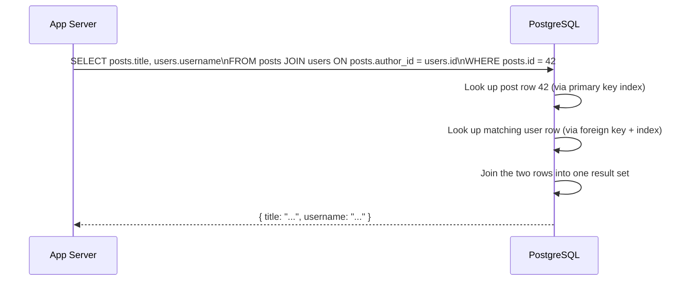
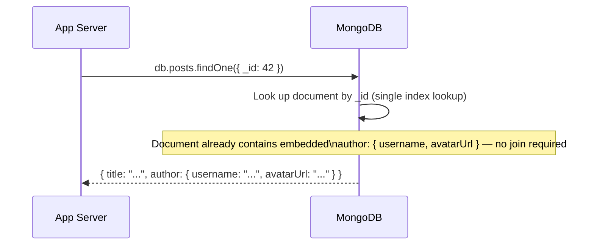
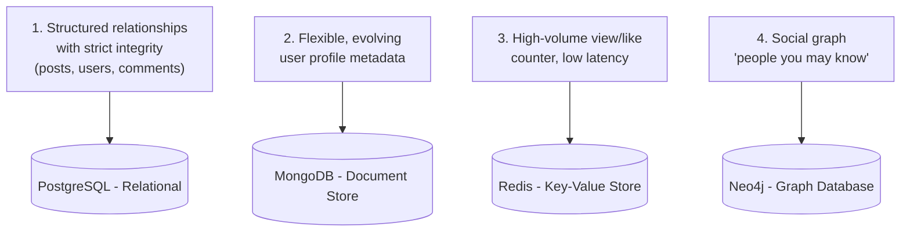
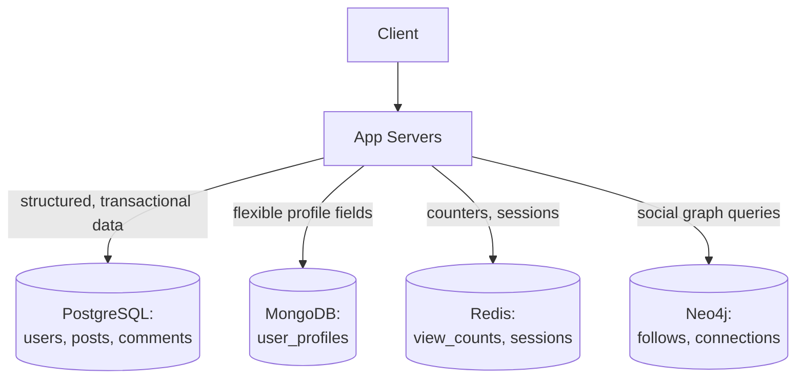
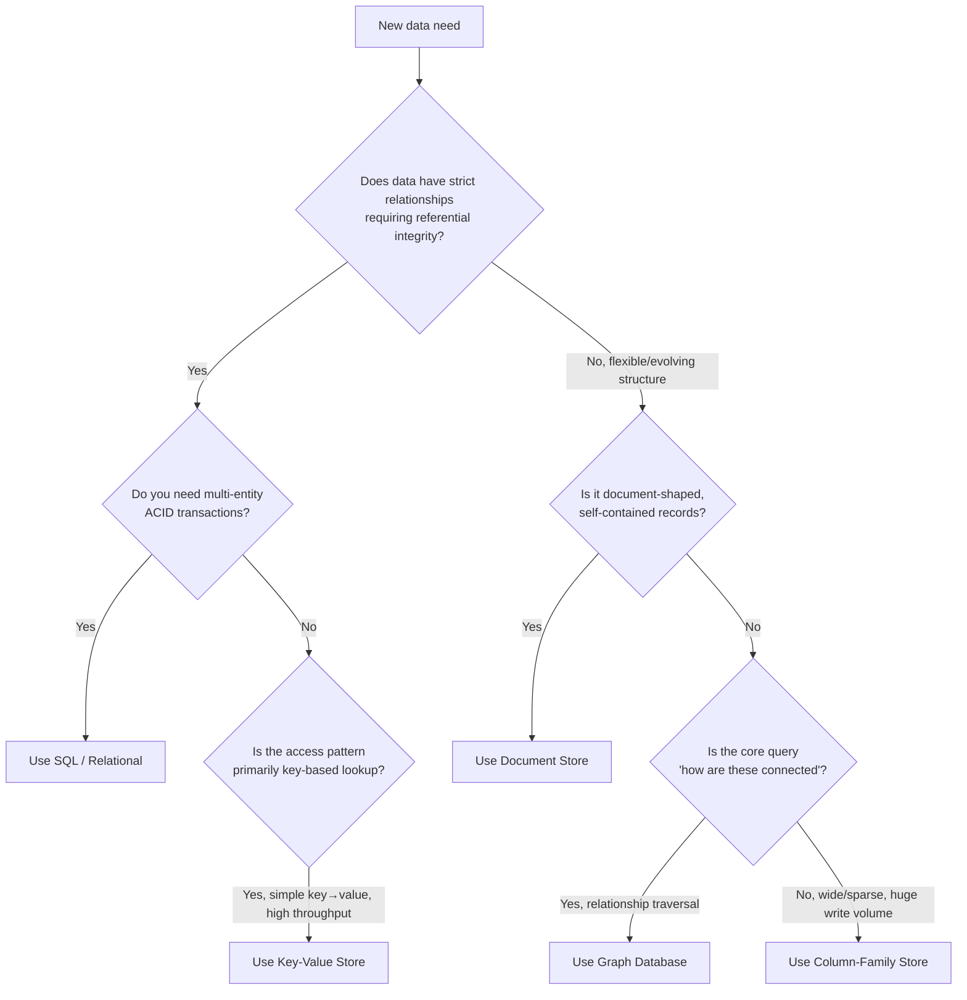
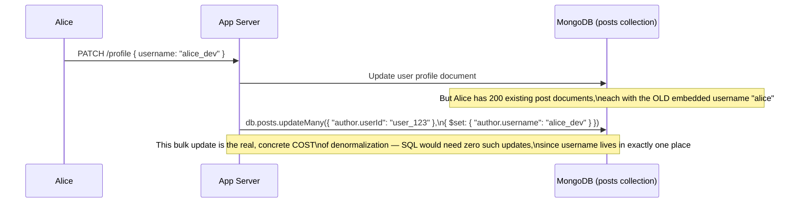
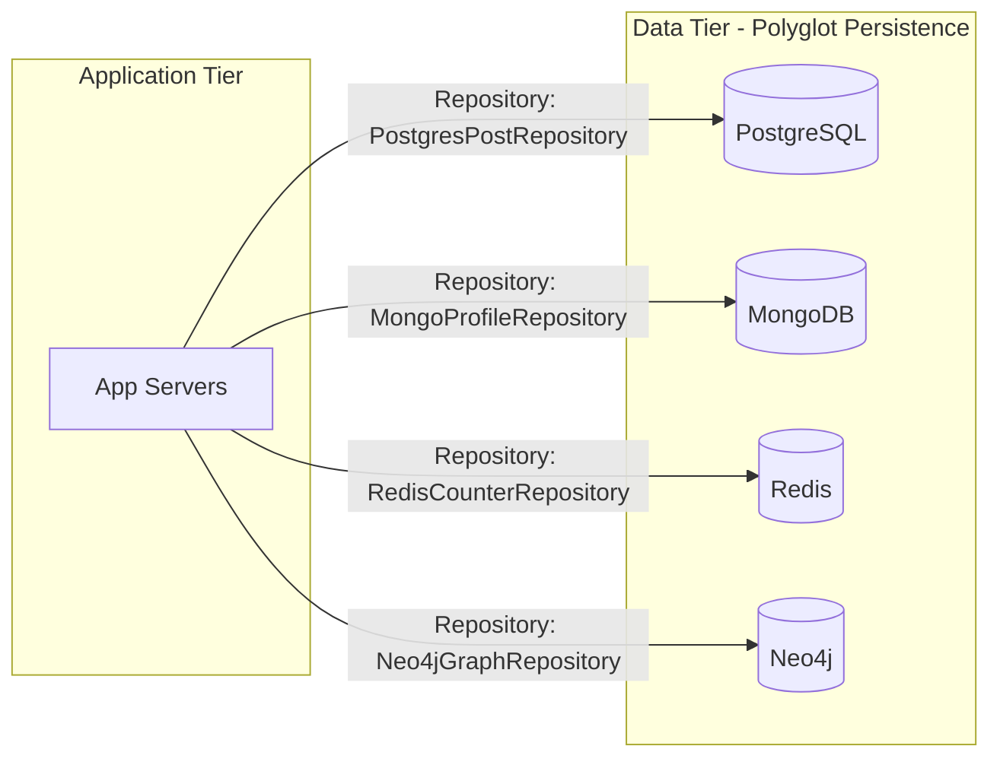
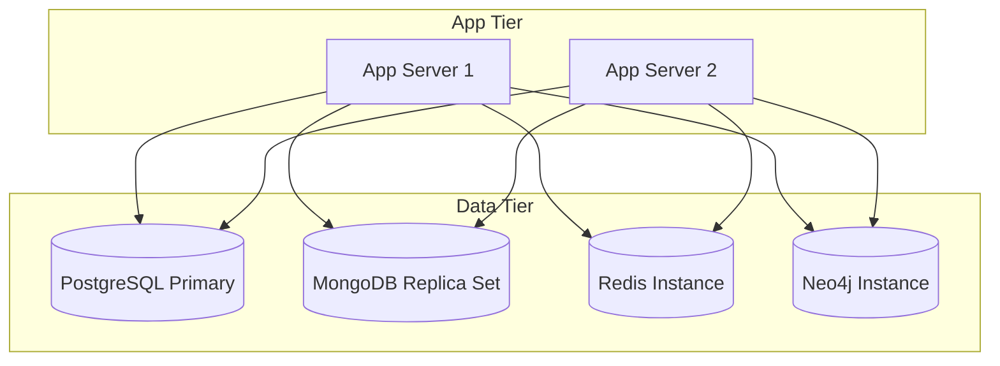

# Module 5 — Databases (SQL vs NoSQL)

> **Masterclass:** System Design Masterclass (30 Modules)
> **Level:** Beginner
> **Audience:** Node.js backend developers, SDE‑2 / Senior Backend interview candidates, engineers transitioning into architecture roles
> **Prerequisite:** Modules 1–4 (System Design Intro, Scalability, Networking, HTTP/TCP/UDP)

---

## 1. Introduction

Every module so far has treated "the database" as a black box labeled `[(PostgreSQL)]` in a diagram. That's no longer sufficient. From here forward, the *kind* of database you choose, and how you model data within it, becomes one of the highest-leverage decisions in the entire system — harder to change later than almost anything else we've discussed, because data migrations are slow, risky, and often require downtime or dual-write complexity.

This module builds the first-principles foundation for that decision: what SQL and NoSQL actually *are*, why both exist, and — critically — that "NoSQL" is not one thing but an umbrella covering several fundamentally different data models, each suited to different problems. Modules 6 (Storage Systems), 14 (Consistency Models), and 15 (Replication & Sharding) all build directly on the vocabulary established here.

---

## 2. Learning Objectives

By the end of this module, you will be able to:

1. Explain what makes a database **relational (SQL)** vs. **non-relational (NoSQL)**, precisely — not by buzzword, but by data model.
2. Explain **ACID** properties and why relational databases were built around them.
3. Explain **BASE** and why many NoSQL systems trade ACID guarantees for availability and scale.
4. Identify the **major NoSQL categories** (document, key-value, column-family, graph) and match each to a representative use case.
5. Explain **normalization** and **denormalization**, and articulate the trade-off between them.
6. Explain what a **database index** is, how it works internally (B-trees, at a conceptual level), and why it has write-side costs.
7. Reason about **query patterns first, schema second** — a core NoSQL/SQL decision-making principle.
8. Choose the correct database type for a given workload and defend the choice using trade-offs, not preference.

---

## 3. Why This Concept Exists

For decades, "database" meant "relational database" — tables, rows, foreign keys, SQL queries, and the ACID guarantees that made banks trust them with money. This model is extraordinarily good at one thing: enforcing **structural correctness and consistency** across related pieces of data, even under concurrent writes.

But relational databases were designed in an era before "a billion users, spread across the globe, generating a firehose of loosely-structured events" was a normal engineering problem. When Amazon, Google, and later companies hit workloads at that scale — where a single machine (Module 2) plainly could not hold or serve the data, and strict ACID consistency across a globally-distributed dataset was either impossible or prohibitively slow — an entire family of alternative data stores emerged, collectively (if imprecisely) named "NoSQL." They deliberately relax some of the guarantees relational databases hold sacred, in exchange for horizontal scalability, flexible schemas, or specialized access patterns.

**Neither is "better."** This module exists because that phrase — "SQL vs. NoSQL" — is one of the most misunderstood dichotomies in software engineering, and getting the choice wrong for your actual workload is one of the most expensive, hardest-to-reverse mistakes a system design can contain.

---

## 4. Problem Statement

> Our blog platform now needs to store four new kinds of data: (1) **structured post/user/comment relationships** with strict integrity requirements (a comment must always belong to a valid post and user), (2) **flexible, evolving user profile metadata** (bio, social links, preferences — fields that change frequently and vary per user), (3) **a real-time view/like counter** that must handle extremely high write volume with minimal latency, and (4) a **"people you may know" style social graph**. For each, determine whether SQL or a specific category of NoSQL is the better fit, and justify it using the data model — not just "NoSQL is faster."

---

## 5. Real-World Analogy

**A relational (SQL) database is a meticulously organized filing cabinet with cross-referenced index cards.** Every folder (table) has a strict, predefined structure. If a "Comment" card references an "Author" card, the cabinet's rules physically prevent you from filing a comment that references an author who doesn't exist (a **foreign key constraint**). This rigor is exactly what you want for anything where a broken reference is unacceptable — like account balances or order records.

**A document (NoSQL) database is a set of self-contained folders, each holding one full report about one thing.** Each report (document) can vary — Report A about "Employee Bio" might have 5 fields, Report B might have 12, and adding a new field to future reports doesn't require going back and reformatting every existing folder. This flexibility is exactly what you want for evolving, semi-structured data like user profiles.

**A key-value store is a coat-check counter.** You hand over a ticket number (key), and get back exactly one item (value) — fast, simple, no relationships, no querying "which coats are blue." This simplicity is exactly why it's blazingly fast for things like session storage (Module 2) or a view counter.

**A graph database is a literal map of relationships — a corkboard with pins and string connecting them.** "Who does this person know, who do they know, and how are two people connected 3 hops apart?" is a natural, efficient question to ask a corkboard, and an extremely unnatural, slow one to ask a filing cabinet full of independent folders (this is precisely why "friends of friends" queries in a relational database require expensive multi-way joins that get worse with each additional hop).

---

## 6. Technical Definition

**SQL (Relational) Database:** A database organizing data into structured tables with predefined schemas, rows, and columns, using foreign keys to enforce relationships, and queried via Structured Query Language (SQL). Examples: PostgreSQL, MySQL, SQL Server.

**NoSQL Database:** An umbrella term for non-relational databases that relax the rigid tabular schema and/or the full ACID guarantee set, typically in exchange for horizontal scalability, schema flexibility, or specialized data-access performance. Major categories:

- **Document stores** (MongoDB, Couchbase): store self-contained, semi-structured documents (typically JSON/BSON).
- **Key-value stores** (Redis, DynamoDB, Memcached): store simple key → value pairs, optimized for extremely fast lookups.
- **Column-family stores** (Cassandra, HBase): store data in column-oriented fashion, optimized for very high write throughput and wide, sparse datasets.
- **Graph databases** (Neo4j, Amazon Neptune): store nodes and edges explicitly, optimized for relationship-traversal queries.

**ACID:** **A**tomicity, **C**onsistency, **I**solation, **D**urability — a set of guarantees ensuring database transactions are processed reliably.

**BASE:** **B**asically **A**vailable, **S**oft state, **E**ventual consistency — a looser guarantee model many NoSQL systems adopt, prioritizing availability and partition tolerance over immediate consistency (directly connects to Module 13's CAP Theorem).

---

## 7. Core Terminology

| Term | Precise Definition | One-line Intuition |
|---|---|---|
| **Schema** | The predefined structure (columns, types, constraints) of stored data | "The shape data must fit" |
| **Normalization** | Organizing data to minimize redundancy, via splitting into related tables | "Store each fact exactly once" |
| **Denormalization** | Deliberately duplicating data to optimize read performance | "Store the same fact in multiple places, on purpose" |
| **Foreign Key** | A column referencing another table's primary key, enforcing referential integrity | "This must point to something real" |
| **Index** | A separate, ordered data structure enabling fast lookups without scanning every row | "A shortcut lookup table" |
| **Join** | A SQL operation combining rows from two or more tables based on a related column | "Merging related filing folders on the fly" |
| **Transaction** | A group of operations that succeed or fail together, atomically | "All or nothing" |
| **Sharding Key / Partition Key** | The field used to determine which physical partition/node a piece of data lives on | "Which filing cabinet drawer this goes in" |

### ACID, precisely — because "consistency" here means something specific

- **Atomicity:** a transaction either fully completes or fully fails — no partial updates left behind (e.g., a bank transfer either moves money from *and* to both accounts, or neither).
- **Consistency (ACID sense):** a transaction can only bring the database from one *valid* state to another *valid* state, per its defined constraints (foreign keys, unique constraints, etc.) — **this is a different meaning of "consistency" than the CAP theorem's "consistency,"** which is a common source of interview confusion (fully disambiguated in Module 13).
- **Isolation:** concurrent transactions don't interfere with each other's intermediate states — each transaction behaves as if it ran alone, even when running alongside others.
- **Durability:** once a transaction is committed, it survives even a subsequent crash (typically via write-ahead logging to disk).

---

## 8. Internal Working

### How a relational database enforces a foreign key constraint

When you attempt `INSERT INTO comments (post_id, ...) VALUES (999, ...)`, and no post with `id = 999` exists, PostgreSQL's storage engine checks the constraint **before** committing the write and rejects it with an error. This check happens on every write touching a foreign-key column — which is precisely the *cost* side of the trade-off: **referential integrity checking adds write-time overhead**, in exchange for guaranteeing you can never end up with an orphaned comment.

A document database has no equivalent built-in mechanism — if you store a comment document with an `authorId` field pointing to a deleted user, nothing in the database itself stops this or notices it. **This isn't a bug in document databases; it's a deliberate absence of a feature**, trading write-time safety for write-time speed and flexibility, and pushing referential integrity enforcement (if needed at all) into application code.

### How an index actually works (conceptual B-tree)

Without an index, finding a row matching `WHERE email = 'x@example.com'` requires a **full table scan** — checking every single row, one by one, an O(n) operation that gets slower as the table grows. An index on `email` maintains a separate, sorted tree structure (typically a **B-tree**) mapping email values to their row locations, letting the database narrow the search in **O(log n)** time — dramatically faster for large tables.

```
B-TREE INDEX (simplified conceptual structure)

                [ m ]
               /      \
          [ f ]        [ t ]
         /    \        /    \
     [a-e]  [g-l]  [n-s]  [u-z]
```

**The write-side cost, precisely:** every `INSERT` or `UPDATE` touching an indexed column must also update this tree structure, not just the raw table data. This is why **indexes speed up reads but slow down writes** — a real, measurable trade-off, and why you should index columns you actually query on, not every column "just in case" (Section 27).

### Why document databases scale writes more easily (conceptually)

A document is typically **self-contained** — everything needed to render "this blog post" (including, potentially, denormalized author name and avatar) lives in one document, retrievable in a single lookup with no joins. This means a document store doesn't need to coordinate a multi-table, multi-node join operation to answer a read — which is precisely the property that makes it easier to **shard** (Module 15) across many nodes: each document lives wholly on one node, with no cross-node join required to reconstruct it.

---

## 9. Request Lifecycle

### Mermaid Sequence Diagram — SQL Read Requiring a Join



### Mermaid Sequence Diagram — Document Store Read, No Join Needed



**Step-by-step comparison:** the SQL version requires the database engine to perform two lookups and a join operation. The document version requires exactly one lookup, because the author's display data was **denormalized** (duplicated) directly into the post document at write time. This is the concrete mechanism behind the common claim "document databases are faster for reads" — it's not magic, it's **paying a storage/write-time cost (duplicated data, kept in sync manually) to avoid a read-time cost (the join).**

---

## 10. Architecture Overview

### Mapping Section 4's four data needs to the right database type



**Design justification for each, tied directly to data model — not vibes:**
- **Need 1 → SQL:** requires enforced referential integrity (a comment must reference a real post/user) and multi-entity transactional consistency (e.g., deleting a user should cleanly cascade or restrict related comments) — exactly what ACID and foreign keys are built for.
- **Need 2 → Document store:** profile fields vary per user and change over time without requiring a formal schema migration for every new optional field — exactly the flexibility a document model provides.
- **Need 3 → Key-value store:** a view/like counter is an extremely simple read/write pattern (increment a number by key) at very high frequency — a key-value store's minimal overhead per operation directly serves this, and Redis's atomic `INCR` command handles concurrent increments correctly without needing full ACID transaction machinery.
- **Need 4 → Graph database:** "friends of friends" and multi-hop relationship traversal queries are native, efficient operations in a graph database, and become progressively more expensive multi-way joins in a relational model as hop count increases.

---

## 11. Capacity Estimation

**Scenario:** Comparing the view-counter workload (Need 3) under a relational vs. key-value approach, at 5,000 view-increment events/second.

**Relational approach (naive):**
```sql
UPDATE posts SET view_count = view_count + 1 WHERE id = 42;
```
Each `UPDATE` requires: acquiring a row lock, writing to the write-ahead log (durability), and updating any indexes on the row — meaningful overhead per operation, and row-level lock contention if many increments target the *same* popular post simultaneously.

**Key-value approach (Redis):**
```
INCR post:42:views
```
Redis performs this **in-memory**, as a single atomic operation, with orders-of-magnitude lower per-operation overhead than a disk-backed relational `UPDATE` with lock and WAL overhead.

**Rough estimation:** a well-tuned PostgreSQL instance might sustain a few thousand simple `UPDATE`s/sec before contention becomes a problem for a hot row; Redis can typically sustain 100,000+ simple operations/sec on modest hardware. At 5,000 increments/sec concentrated on popular posts (hot-row contention), the key-value approach is not just *faster* — it avoids a **lock-contention bottleneck** the relational approach would hit directly. (Periodically flushing the Redis counter back to PostgreSQL for durability is a common hybrid pattern, covered further in Module 7.)

---

## 12. High-Level Design (HLD)



**This is called "polyglot persistence"** — deliberately using multiple database types within one system, each for the workload it's best suited to, rather than forcing every kind of data into a single database technology. This is a legitimate, common production pattern, **not** over-engineering — provided each database is justified by a genuinely distinct access pattern, as established in Section 10, and not added merely because a new technology seemed interesting (Section 29's anti-pattern list revisits this).

---

## 13. Low-Level Design (LLD)

### Relational schema (Need 1) — from Module 1, extended with constraints

```sql
CREATE TABLE users (
    id UUID PRIMARY KEY DEFAULT gen_random_uuid(),
    username VARCHAR(50) UNIQUE NOT NULL,
    email VARCHAR(255) UNIQUE NOT NULL
);

CREATE TABLE posts (
    id UUID PRIMARY KEY DEFAULT gen_random_uuid(),
    author_id UUID NOT NULL REFERENCES users(id) ON DELETE CASCADE,
    title VARCHAR(200) NOT NULL,
    body TEXT NOT NULL
);

CREATE TABLE comments (
    id UUID PRIMARY KEY DEFAULT gen_random_uuid(),
    post_id UUID NOT NULL REFERENCES posts(id) ON DELETE CASCADE,
    author_id UUID NOT NULL REFERENCES users(id) ON DELETE RESTRICT,
    body TEXT NOT NULL
);
```

**Design note on `ON DELETE CASCADE` vs. `ON DELETE RESTRICT`:** deleting a post cascades to delete its comments (they're meaningless without the post), but deleting a user is *restricted* if they have existing comments (preventing accidental orphaning of comment history) — a precise, deliberate policy decision enforced *by the database itself*, not by application code remembering to check.

### Document schema (Need 2) — flexible profile metadata

```javascript
// MongoDB document — no fixed schema enforced by the database itself
{
  _id: "user_123",
  bio: "Software engineer, coffee enthusiast",
  socialLinks: { twitter: "@example", github: "example" },
  preferences: { theme: "dark", emailDigest: "weekly" }
  // A future user's document might have entirely different optional fields —
  // no migration required for this flexibility, unlike the SQL table above.
}
```

**LLD-level design note:** notice there's no upfront declaration of every possible field — a new `preferences.language` field can be added to new documents immediately, while old documents without it simply lack that key (application code handles the default). This is the concrete meaning of "flexible schema," and it's a genuine advantage for Need 2's stated requirement (frequently evolving optional fields) — and a genuine *liability* if applied to Need 1's requirement (where you *want* the database to reject invalid states).

---

## 14. ASCII Diagrams

```
NORMALIZED (SQL)                    DENORMALIZED (Document)

  users                                posts
  ┌────┬──────────┐                    ┌────────────────────────┐
  │ id │ username │                    │ title, body,           │
  ├────┼──────────┤                    │ author: {               │
  │ 1  │ alice    │                    │   username: "alice",   │
  └────┴──────────┘                    │   avatarUrl: "..."      │
        ▲                              │ }  ← duplicated data     │
        │ foreign key                 └────────────────────────┘
  posts │
  ┌────┬───────────┬───────┐          (No join needed to render
  │ id │ author_id │ title │           the post with author info —
  ├────┼───────────┼───────┤           but if alice changes her
  │ 1  │ 1         │ "..." │           username, EVERY post document
  └────┴───────────┴───────┘           mentioning her must be updated)
  (single source of truth,
   join required to combine)
```

---

## 15. Mermaid Flowcharts

### Decision Flow: SQL vs. NoSQL



---

## 16. Mermaid Sequence Diagrams

*(Section 9 covers the two canonical sequence diagrams — SQL join vs. document no-join read. Additional diagram below.)*

### Denormalization Sync Problem — Username Change



**Why this matters:** this is the precise, unavoidable cost side of the Section 9 "no join needed" read-time benefit. Denormalization isn't free — it converts an occasional read-time join cost into an occasional (but potentially expensive, at scale) write-time synchronization cost. Choosing denormalization is a bet that reads happen far more often than the data changes — true for a username, likely false for, say, a rapidly fluctuating stock price embedded in many documents.

---

## 17. Component Diagrams



**Why the Repository pattern (Module 1, Section 13) matters even more here:** with four different database technologies in play, isolating each behind its own repository interface means application/business logic never directly depends on any specific database's query syntax — if Need 3's counter ever needs to move from Redis to a different key-value store, only `RedisCounterRepository`'s internals change.

---

## 18. Deployment Diagrams



**Deployment-level note:** notice MongoDB is deployed as a **replica set** even at this early stage, while PostgreSQL is shown as a single primary — this foreshadows Module 15, but the immediate point is that different data stores often warrant different redundancy strategies based on how critical and how read-heavy their specific workload is; this isn't shown as uniform "add 3 replicas to everything" cargo-culting.

---

## 19. Network Diagrams

Database network placement follows the exact same principle established in Module 3: **every one of these four data stores should sit in a private, non-internet-routable subnet**, reachable only from the application tier's security group — polyglot persistence multiplies the number of data stores, and therefore multiplies the number of potential misconfigurations, making disciplined, consistent network isolation *more* important, not less, as this architecture grows.

```
  App Tier Security Group
          │
          ├──▶ PostgreSQL SG (allow 5432 from App Tier SG only)
          ├──▶ MongoDB SG    (allow 27017 from App Tier SG only)
          ├──▶ Redis SG      (allow 6379 from App Tier SG only)
          └──▶ Neo4j SG      (allow 7687 from App Tier SG only)

  (Each database in its OWN private subnet/security group —
   a breach of one does not automatically expose the others)
```

---

## 20. Database Design

### Normalization vs. denormalization — the actual decision framework

| Factor | Favors Normalization (SQL) | Favors Denormalization (NoSQL/Document) |
|---|---|---|
| Write frequency of the duplicated field | Low (rarely changes) | — |
| Read frequency relative to writes | — | High (read far more than written) |
| Need for strict consistency across copies | High | Low/tolerable |
| Need for enforced referential integrity | High | Low |
| Query pattern | Ad-hoc, varied joins across entities | Known, fixed access patterns per document type |

**The single most important NoSQL modeling principle, stated directly:** in relational modeling, you typically design the schema first, then write whatever queries you need. In document/NoSQL modeling, **you must design around your known query patterns first** — because without a general-purpose join engine, a document schema optimized for the wrong access pattern forces expensive application-side workarounds. This is precisely why Section 13's document example embeds author info: it was designed *because* "render a post with its author's name" is a known, extremely common query, not as a default habit.

---

## 21. API Design

Database choice has direct API design consequences:

- **SQL-backed endpoints** naturally support rich, ad-hoc filtering/sorting (`GET /posts?sortBy=views&authorId=123`) since the query engine can flexibly combine conditions across indexed columns.
- **Document-store-backed endpoints** perform best when the API's access patterns match the document's designed shape (`GET /posts/:id` returning the whole embedded structure in one call) — arbitrary ad-hoc filtering across nested fields is possible but often less efficient than in a well-indexed relational table.
- **Key-value-backed endpoints** are typically narrow and specific (`GET /posts/:id/views`) — you generally cannot ask a key-value store "which keys have a value greater than 100" efficiently; that's not what it's built for.

---

## 22. Scalability Considerations

| Consideration | SQL | Document | Key-Value | Graph |
|---|---|---|---|---|
| Horizontal write scaling | Harder (Module 15 covers sharding strategies) | Easier (documents are naturally shardable) | Very easy (simple key-based partitioning) | Harder (relationship traversal across shards is complex) |
| Read scaling | Read replicas (Module 15) | Read replicas / sharding | Trivial replication | Specialized clustering |
| Schema evolution at scale | Requires migrations, can be slow on huge tables | Trivial — no schema migration needed | N/A — no schema | Moderate |

**Key insight:** the "SQL doesn't scale" claim is an oversimplification — modern relational databases scale substantially with the right techniques (Module 15). The more precise, defensible claim is: **NoSQL data models were designed with horizontal scaling as a first-class goal from the start, while relational databases were designed for strong consistency first and had horizontal scaling techniques added on top later.** This distinction matters in interviews — the imprecise version invites easy pushback.

---

## 23. Reliability & Fault Tolerance

- **ACID transactions provide strong correctness guarantees during partial failures** — if a multi-step relational transaction fails halfway, atomicity guarantees it rolls back completely, leaving no inconsistent partial state (directly relevant to Need 1's requirement).
- **BASE-model NoSQL systems accept temporary inconsistency** as the cost of remaining available during network partitions (deepened fully in Module 13's CAP Theorem and Module 14's Consistency Models) — this is a deliberate trade-off, not a defect.
- **Denormalized data (Section 16) introduces a distinct failure mode**: if a bulk sync update (like the username change) fails partway through, some documents may reflect the old value and some the new — a genuine consistency risk that normalized SQL data doesn't have, because there's only ever one copy to update.

---

## 24. Security Considerations

- Enforce **least-privilege database credentials** per service/repository — the `RedisCounterRepository`'s credentials shouldn't have access to modify the PostgreSQL `users` table, even though they're used by the same application tier.
- **Document stores' flexible schema can be a security liability** if not paired with application-level input validation — without a rigid schema rejecting unexpected fields, a malicious or buggy client could inject unexpected structure into stored documents (a real-world NoSQL injection risk, distinct from but analogous to SQL injection).
- **Foreign key constraints double as a security/data-integrity backstop** — even if application code has a bug that would otherwise create an orphaned reference, the database itself prevents it.

---

## 25. Performance Optimization

- **Index only the columns you actually query on** (Section 8) — over-indexing slows every write for marginal or no read benefit.
- **Denormalize deliberately and sparingly** (Section 16) — only for fields that are read far more often than they change, with a clear plan for keeping duplicates in sync.
- **Use key-value stores for hot, simple, high-frequency data** (counters, sessions, feature flags) rather than routing this traffic through a relational database's heavier transactional machinery.
- **Batch writes where possible** in document stores (e.g., `updateMany` in Section 16) rather than many individual small writes, to reduce per-operation overhead.

---

## 26. Monitoring & Observability

Database-specific metrics, per type:

- **SQL:** query latency (especially slow-query logs), lock wait time, index hit ratio, connection pool saturation (Module 1, Section 20).
- **Document stores:** document size distribution (oversized documents are a common MongoDB anti-pattern), query plan/index usage (`explain()` equivalents).
- **Key-value stores:** hit/miss ratio, memory usage, eviction rate (Module 7 covers this deeply for caching specifically).
- **Graph databases:** traversal depth and query time for multi-hop queries, which scale non-linearly with hop count.

---

## 27. Common Bottlenecks

| Bottleneck | Symptom | Root Cause |
|---|---|---|
| Missing index | Slow specific queries, full table scans | Query pattern not matched by any existing index |
| Over-indexing | Slow writes across the board | Too many indexes maintained per write |
| Hot row contention | High latency on writes to popular records | Many concurrent writers targeting the same row (Section 11) |
| Unsynchronized denormalized data | Stale/incorrect displayed data | Sync update logic missing or failing silently |
| Wrong database for the access pattern | Consistently awkward, slow, or complex queries | Data model doesn't match the actual query needs (Section 20) |

---

## 28. Trade-off Analysis

> "I chose **PostgreSQL** for posts/users/comments, optimizing for **enforced referential integrity and transactional consistency**, at the cost of **more rigid schema evolution and join overhead on reads**, which is acceptable because this data's correctness requirements (no orphaned comments, consistent author references) outweigh the flexibility MongoDB would offer here."

> "I chose **MongoDB** for user profile metadata, optimizing for **schema flexibility as profile fields evolve over time without migrations**, at the cost of **no enforced referential integrity and a self-managed consistency model**, which is acceptable because profile metadata has low correctness stakes compared to, say, financial or relational post/comment data."

> "I chose **Redis** for the view counter, optimizing for **extremely high write throughput with minimal per-operation overhead**, at the cost of **needing a separate durability/backup strategy since Redis is primarily in-memory**, which is acceptable because losing a small window of view-count increments during a rare failure is a tolerable business risk, unlike losing actual post content."

---

## 29. Anti-patterns & Common Mistakes

1. **"NoSQL is always faster/more scalable" as a blanket justification** — the real answer depends entirely on data model fit (Section 10), not a generic performance claim.
2. **Choosing a database technology because it's trendy**, without a genuinely distinct access pattern to justify it — polyglot persistence (Section 12) is legitimate only when each store solves a real, distinct problem; five databases each holding data that would've been fine in one is unjustified complexity.
3. **Using a document store for highly relational data with strict integrity needs** (e.g., financial ledgers) purely for perceived scalability — later discovering the application now has to manually re-implement referential integrity checks that a relational database would have provided for free.
4. **Denormalizing without a sync strategy** — embedding data that changes, without a plan (or code) to propagate that change everywhere it's duplicated (Section 16's exact failure mode).
5. **Ignoring query patterns when designing a document schema** — designing a MongoDB schema the way you'd design a normalized SQL schema (many small, cross-referencing collections) defeats the entire point of the document model and often performs *worse* than SQL would have, due to application-side "joins" (multiple round-trip queries).
6. **Over-indexing a relational table** "just in case," silently degrading write performance across the entire application.

---

## 30. Production Best Practices

- Choose a database technology **per workload's actual access pattern**, justified explicitly (Section 10's framework) — not per team preference or industry trend.
- For document stores, **model around your top 3–5 known queries first**, and only add flexibility where genuinely needed.
- Whenever denormalizing, **write down (and ideally automate/test) the exact sync mechanism** that keeps duplicated data consistent, and monitor for sync failures.
- Apply **least-privilege database credentials per service**, even within a single polyglot system.
- Periodically **review index usage** (most relational databases expose index-usage statistics) and drop unused indexes that are silently taxing write performance.

---

## 31. Real-World Examples

- **Amazon's DynamoDB** was built internally (originally described in Amazon's "Dynamo" paper) specifically because their shopping cart service needed availability and horizontal scale that their existing relational infrastructure struggled to provide at Amazon's scale — a textbook real-world instance of the BASE trade-off (Section 6) being chosen deliberately for a specific, identified workload, not as a blanket replacement for all their databases (Amazon still uses relational databases extensively elsewhere).
- **Facebook's social graph** is famously served by a graph-optimized system (originally TAO, built atop MySQL with a graph-aware caching layer) precisely because "friends of friends" type queries at Facebook's scale would be prohibitively expensive as naive multi-way SQL joins — directly validating this module's Need 4 reasoning.
- **Instagram**, even at massive scale, continues to rely heavily on PostgreSQL (sharded, per Module 15) for its core relational data, demonstrating that "SQL doesn't scale" is not literally true — it scales with the right supporting techniques, and Instagram's engineering blog has publicly documented exactly this journey.

---

## 32. Node.js Implementation Examples

### Repository pattern across two database types (concrete implementation of Section 17)

```javascript
// PostgresPostRepository.js — relational, strict integrity
class PostgresPostRepository {
  async findById(id) {
    const { rows } = await pgPool.query(
      `SELECT p.id, p.title, p.body, u.username
       FROM posts p JOIN users u ON p.author_id = u.id
       WHERE p.id = $1`,
      [id]
    );
    return rows[0];
  }
}

// MongoProfileRepository.js — document, flexible schema
class MongoProfileRepository {
  async findByUserId(userId) {
    return db.collection('profiles').findOne({ userId });
  }
  async update(userId, fields) {
    return db.collection('profiles').updateOne(
      { userId },
      { $set: fields }, // arbitrary fields, no schema migration required
      { upsert: true }
    );
  }
}

// RedisCounterRepository.js — key-value, atomic high-throughput increments
class RedisCounterRepository {
  async incrementViews(postId) {
    return redisClient.incr(`post:${postId}:views`); // atomic, no lock contention
  }
  async getViews(postId) {
    return redisClient.get(`post:${postId}:views`);
  }
}
```

**Why the interfaces look different across repositories:** this is intentional and correct — forcing a uniform interface across fundamentally different data models (e.g., pretending Redis supports rich filtering like SQL) would hide real capability differences and invite misuse. The Repository pattern isolates *where* database-specific code lives, not what operations are possible.

---

## 33. Interview Questions

### Easy
1. What is the core structural difference between a SQL and a NoSQL database?
2. Name the four ACID properties and briefly define each.
3. What is a foreign key, and what problem does it solve?
4. What is the difference between a document store and a key-value store?
5. What is denormalization, and why would you deliberately duplicate data?
6. Name one real-world use case each for a graph database and a key-value store.

### Medium
7. Explain BASE and how it differs philosophically from ACID.
8. Why does adding an index speed up reads but slow down writes?
9. Design a schema for a blog's comments in both a relational and a document-store style, and explain the trade-off between them.
10. Why is "NoSQL is always more scalable" considered an oversimplified or misleading claim?
11. Explain the "design around query patterns first" principle for document databases with a concrete example.
12. What's the real cost of denormalizing a username into thousands of documents, and how would you mitigate it?

### Hard
13. Design a polyglot persistence architecture for an e-commerce platform, justifying which database type you'd use for: inventory, shopping cart, product catalog search, and order history.
14. A team wants to move a highly relational financial ledger system from PostgreSQL to MongoDB "for scalability." What questions would you ask, and what risks would you flag?
15. Explain how a graph database avoids the exponential join cost that a relational database incurs for multi-hop relationship queries.
16. Design a synchronization mechanism to keep a denormalized "author name" field consistent across millions of documents when a user changes their username, considering failure scenarios.
17. Compare the referential integrity guarantees of SQL foreign keys against an application-level "manual" integrity check in a NoSQL system — under what failure scenario does the SQL approach still hold and the application-level approach fail?

---

## 34. Scenario-Based Design Questions

1. **Scenario:** Your team is building a new feature storing user-generated survey responses where every survey has a different, custom set of questions. Which database type fits best, and why?
2. **Scenario:** A junior engineer proposes storing financial transaction records in MongoDB "because it's more flexible." Push back constructively, citing specific risks.
3. **Scenario:** Your relational `posts` table has grown to 500 million rows and a specific `WHERE tag = 'nodejs'` query has become slow. Diagnose likely causes and propose a fix using this module's concepts (before reaching for sharding, which is Module 15).
4. **Scenario:** You're asked to design "people you may know" for a new social app from scratch. Walk through why a graph database is a natural fit, and what a relational equivalent query would look like (and why it's worse).
5. **Scenario:** A denormalized product catalog document store shows stale prices to some users after a price update. Diagnose and propose a fix.
6. **Scenario:** Your key-value store (Redis) holding session data unexpectedly restarts and loses all data. What does this reveal about the trade-off you made choosing it, and how would you mitigate the risk going forward?
7. **Scenario:** An interviewer asks you to design "Instagram's photo metadata storage." Reason through SQL vs. NoSQL for: photo metadata, follower relationships, and like counts, treating each as a potentially different database choice.
8. **Scenario:** Your team over-indexed a heavily-written table "to make every possible query fast," and write latency has degraded significantly. Propose a remediation process.
9. **Scenario:** You must choose between a normalized and denormalized schema for a product review system where reviews rarely change but are read millions of times per day. Justify your choice using the Section 20 framework.
10. **Scenario:** A stakeholder insists "we should just use one database for everything, to keep things simple." Present the trade-off between this simplicity and the polyglot persistence approach.

---

## 35. Hands-on Exercises

1. Design and create both a normalized SQL schema and an equivalent denormalized MongoDB document schema for a simple "recipe" app (recipes, ingredients, authors), and write the query needed to "get a recipe with its author's name" in both.
2. Add an index to a large table (create a table with 100,000+ synthetic rows) and measure query time before and after, using `EXPLAIN ANALYZE` in PostgreSQL.
3. Implement Redis's `INCR` command for a simple counter and fire 1,000 concurrent increment requests at it; verify the final count is exactly correct (demonstrating atomicity without explicit locking).
4. Model a small social graph (5–10 people, some "follows" relationships) in both a relational join-table style and (conceptually, or using a free graph DB tool) a graph style, and compare how you'd write a "friends of friends" query in each.
5. Deliberately create a denormalized field (e.g., duplicate a username across 3 "documents"), update the source value, and write the exact sync code needed to propagate that change — then discuss what happens if that sync code fails halfway.

---

## 36. Mini Project

**Build:** Extend the blog platform (Modules 1–4) with polyglot persistence for the four Section 4 needs.

**Requirements:**
- Keep posts/users/comments in PostgreSQL with proper foreign key constraints (`ON DELETE CASCADE`/`RESTRICT` as appropriate).
- Add a MongoDB-backed user profile service with at least 3 optional, evolvable fields.
- Add a Redis-backed view counter using atomic `INCR`, with an endpoint to read the current count.
- Implement the Repository pattern (Section 32) so each database's access logic is isolated behind its own class/module.
- Document, in `DATA_MODEL.md`, why each database was chosen for its specific data, using the Section 28 trade-off format.

**Success criteria:** All four data needs work correctly end to end, and your `DATA_MODEL.md` clearly justifies each database choice by access pattern and consistency requirement — not just "it's what I know."

---

## 37. Advanced Project

**Build:** Extend the Mini Project with a denormalization sync mechanism and a graph-based feature.

1. Denormalize the post author's username into each post document (if you migrate posts to a hybrid model) or into a separate cached read-model, and implement the exact `updateMany`-style sync logic (Section 16) that runs when a user changes their username.
2. Write an automated test that changes a username and verifies all previously-created posts reflect the new value after the sync completes.
3. Using a free-tier graph database (e.g., Neo4j AuraDB free tier) or an in-memory graph structure, implement a simple "users you may know" feature based on 2-hop "follows" relationships, and compare the query's complexity/readability against an equivalent SQL self-join.
4. Write a **failure injection test**: simulate the sync update from step 1 failing halfway (e.g., updating only some documents), and document what inconsistent state results — then propose (in writing, referencing Module 14's future content on consistency models) how you'd detect and repair this in production.

**Success criteria:** You have a working, tested denormalization sync mechanism, a working graph-based relationship query, and a clear, honest written account of what breaks if that sync mechanism fails partway — setting up Module 6 (Storage Systems), which examines what's actually happening underneath these databases at the disk/storage level.

---

## 38. Summary

- **SQL (relational) databases** enforce structure and referential integrity via schemas, foreign keys, and ACID transactions — ideal when correctness and relationships matter most.
- **NoSQL is not one thing** — document, key-value, column-family, and graph stores each solve a fundamentally different access-pattern problem, and should be chosen based on data model fit, not general "scalability" claims.
- **ACID vs. BASE** represents a genuine philosophical trade-off between strict correctness and availability/flexibility under scale and failure — directly foreshadowing Module 13's CAP Theorem.
- **Indexes trade write speed for read speed** — index deliberately, based on real query patterns.
- **Denormalization trades write-time sync complexity for read-time simplicity** — a deliberate bet that reads vastly outnumber writes for the duplicated field.
- **Polyglot persistence** (using multiple database types in one system) is a legitimate, common pattern — provided each choice is justified by a genuinely distinct access pattern.

---

## 39. Revision Notes

- SQL = strict schema, foreign keys, ACID, joins; NoSQL = umbrella (document/key-value/column/graph), each with different strengths
- ACID: Atomicity, Consistency (constraint-based), Isolation, Durability
- BASE: Basically Available, Soft state, Eventual consistency
- Index = faster reads, slower writes (B-tree lookup vs. full scan)
- Denormalization = faster reads, sync complexity/risk on writes
- Document DB design principle: model around known queries first, not schema first
- Graph DB: native for multi-hop relationship queries; SQL: exponentially costly joins for the same
- Polyglot persistence is legitimate when justified per-workload, an anti-pattern when trend-driven

---

## 40. One-Page Cheat Sheet

```
SYSTEM DESIGN — MODULE 5 CHEAT SHEET
─────────────────────────────────────
SQL (Relational)              NoSQL (umbrella term)
  Fixed schema                  Document: flexible, self-contained records
  Foreign keys, joins           Key-Value: simple, ultra-fast key lookup
  ACID transactions             Column-family: huge write volume, wide/sparse
  Strong integrity              Graph: relationship traversal queries

ACID                          BASE
  Atomicity                    Basically Available
  Consistency (constraints)    Soft state
  Isolation                    Eventual consistency
  Durability

INDEX TRADE-OFF: faster reads, slower writes (B-tree maintenance cost)
DENORMALIZATION TRADE-OFF: faster reads, write-time sync complexity/risk

CHOOSE BY DATA MODEL, NOT HYPE
  Strict relationships + integrity     → SQL
  Flexible, evolving, self-contained   → Document
  Simple key lookup, high throughput   → Key-Value
  "How are these connected?"           → Graph

GOLDEN RULE
  Model document/NoSQL schemas around KNOWN QUERY PATTERNS first.
  Model SQL schemas around DATA INTEGRITY first.
```

---

## Key Takeaways

- "SQL vs. NoSQL" is really "which of five+ distinct data models fits this specific access pattern" — treating it as a single binary choice is the most common conceptual error in this space.
- ACID and BASE represent a genuine, deliberate trade-off between correctness/consistency and availability/flexibility — neither is a strictly superior default.
- Indexing and denormalization are both "pay now or pay later" trade-offs — the skill is knowing which side of each trade-off your specific workload should be on.

## 20 Practice Questions
*(See Section 33 — 6 Easy, 6 Medium, 5 Hard — plus 3 rapid-fire additions:)*
18. Why is a full table scan sometimes actually faster than using an index (hint: think about very small tables)?
19. What's the difference between "consistency" in ACID and "consistency" in the CAP theorem?
20. Why would a column-family store like Cassandra be a poor fit for a banking ledger requiring multi-row transactions?

## 10 Scenario-Based Questions
*(See Section 34 in full.)*

## 5 Design Assignments
*(See Sections 36–37 — Mini Project and Advanced Project — plus:)*
1. Design a polyglot persistence architecture for a ride-sharing app (driver locations, ride history, user profiles, ratings), justifying each database choice.
2. Write a one-page comparison of the write-time cost of denormalization vs. the read-time cost of joins, using concrete numbers from your own testing (Exercise 2).
3. Propose an index strategy (which columns, why) for a hypothetical `orders` table given three known, common query patterns you define yourself.

## Suggested Next Module

**→ Module 6: Storage Systems** — now that we understand *how* data is modeled and queried, we go one level deeper into *where* it physically lives: HDDs vs. SSDs, and the distinction between object, block, and file storage that underlies every database and file-serving system we've discussed so far.
