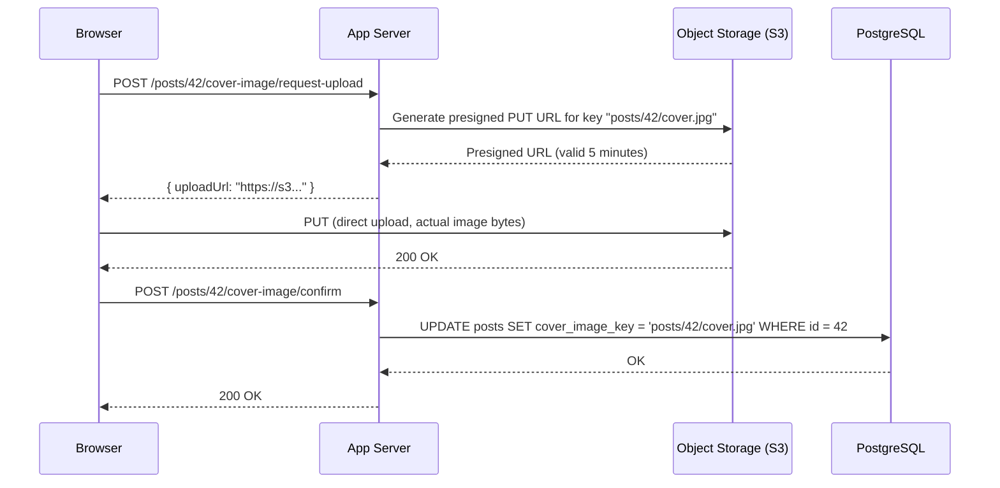
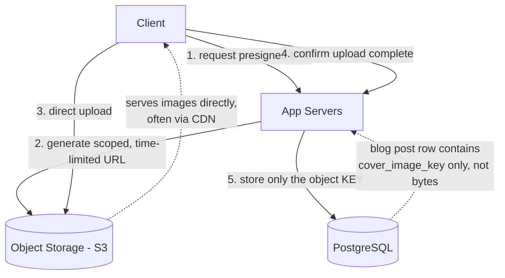
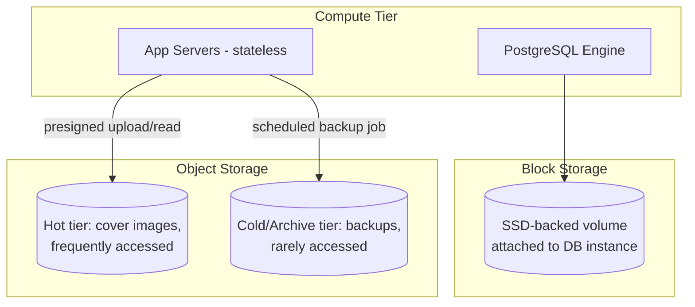
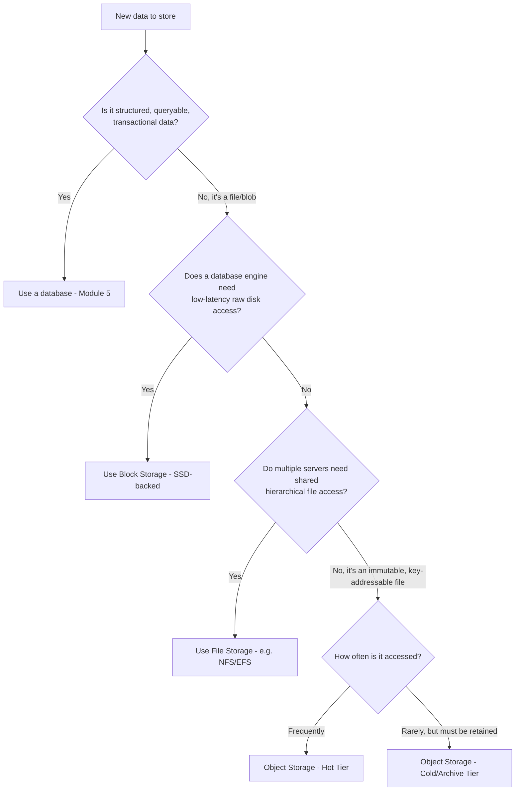
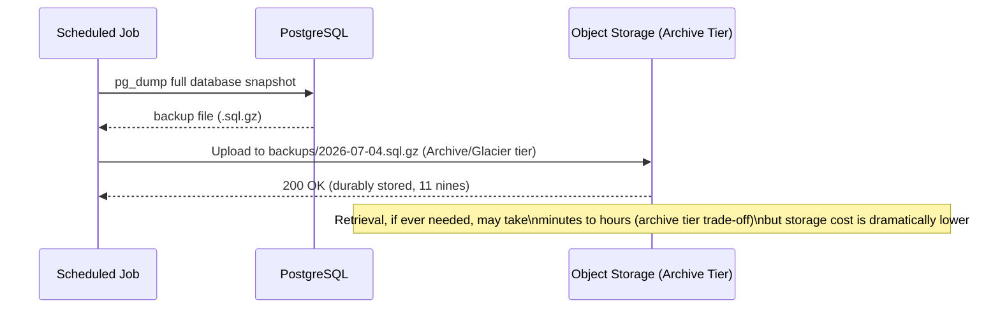
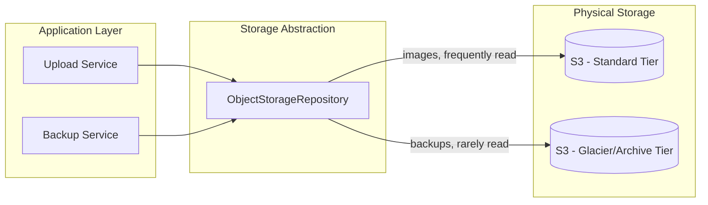

# Module 6 — Storage Systems

> **Masterclass:** System Design Masterclass (30 Modules)
> **Level:** Intermediate
> **Audience:** Node.js backend developers, SDE‑2 / Senior Backend interview candidates, engineers transitioning into architecture roles
> **Prerequisite:** Modules 1–5 (System Design Intro, Scalability, Networking, HTTP/TCP/UDP, Databases)

---

## 1. Introduction

Module 5 treated "the database" as a queryable abstraction — rows, documents, keys. But every database, ultimately, has to write its bytes down somewhere physical, and every blog post's uploaded cover image, every video a user submits, every log file a service emits, needs a storage substrate too. This module answers: **where does data actually live, physically and architecturally, and what are the fundamentally different ways of storing it?**

This is the module that explains why "just store the file in the database" and "just store the file on the server's disk" are both common beginner mistakes with specific, predictable failure modes — and sets up Module 7 (Caching), which is really just "temporarily keep frequently-accessed storage results somewhere faster."

---

## 2. Learning Objectives

By the end of this module, you will be able to:

1. Explain the physical difference between **HDD and SSD** storage and its real performance implications.
2. Distinguish **block storage**, **file storage**, and **object storage** by their access model — not just by product name.
3. Explain why storing large binary files (images, videos) directly in a relational database is an anti-pattern.
4. Explain **durability** guarantees storage systems provide, and how they differ from database-level durability (Module 5).
5. Reason about **read-heavy vs. write-heavy** storage access patterns and how they inform storage tier choice.
6. Design a correct architecture for user file uploads (e.g., blog cover images) using object storage plus a CDN-ready structure.
7. Understand **storage cost tiers** (hot/cold/archive) and when to use each.

---

## 3. Why This Concept Exists

Databases (Module 5) are optimized for structured, queryable data — fast lookups, joins, transactions. But not all data is like that. A 4K video file, a user's profile photo, a nightly database backup, or a year of application logs are **large, unstructured, or semi-structured blobs** that don't benefit from a relational engine's query capabilities, and actively hurt its performance if crammed into it.

Storage systems exist because **the physical and access-pattern characteristics of data vary enormously**, and a single storage technology cannot be simultaneously optimal for high-frequency small transactional writes (a database's job), low-latency block-level access for an operating system (a virtual disk's job), and durable, infinitely-scalable storage of huge, rarely-modified files (an object store's job). Recognizing which category your data actually falls into — and choosing the matching storage type — is a foundational, frequently-tested system design skill.

---

## 4. Problem Statement

> Our blog platform (Modules 1–5) now needs to support: (1) **user-uploaded cover images** for blog posts (a few MB each, millions of them over time, rarely modified once uploaded), (2) the **PostgreSQL database's own underlying disk**, which needs fast, low-latency read/write access for the database engine itself, and (3) **nightly full-database backups** that must be retained for 90 days but are almost never actually read. For each, determine the correct storage type, and explain why storing the cover images directly as `BYTEA` blobs inside PostgreSQL — a real, tempting shortcut — would be a mistake.

---

## 5. Real-World Analogy

**Block storage is a blank ledger of numbered pages handed to a single accountant.** The accountant (operating system/database engine) decides what to write on which page and keeps their own private index. This is fast and flexible for the *one* accountant using it, but if you handed the same ledger to two accountants at once, they'd overwrite each other's pages without any of the safety a database enforces (Module 5) — this is why block storage is typically attached to and used exclusively by **one** machine/database instance at a time.

**File storage is a shared office filing cabinet with labeled folders and subfolders**, accessible by multiple people (machines) at once through an agreed-upon directory structure (a *file system*) — think a shared network drive.

**Object storage is a warehouse with a check-in desk.** You hand the clerk a box (your file) and get back a receipt with a unique tracking code (a key/URL). You don't get to organize the warehouse's internal aisles yourself, and you can't "partially edit" a box once it's checked in — you replace the whole box or you don't. But the warehouse can be enormous, is built by the operator to never lose your box (extreme durability), and thousands of people can simultaneously check in or retrieve *different* boxes without stepping on each other. This is exactly the model for user-uploaded images, videos, and backups.

---

## 6. Technical Definition

**HDD (Hard Disk Drive):** Storage using spinning magnetic platters and a physical read/write head; higher latency due to mechanical seek time, but historically cheaper per GB.

**SSD (Solid State Drive):** Storage using flash memory with no moving parts; dramatically lower latency and higher throughput than HDDs, at a higher cost per GB (though the gap has narrowed significantly).

**Block Storage:** Storage presented as raw, fixed-size blocks with no inherent file structure, typically attached to a single compute instance (e.g., AWS EBS), on top of which the OS/database imposes its own file system or storage engine.

**File Storage:** Storage organized as a hierarchical directory/file structure, accessible over a network protocol (e.g., NFS, SMB) by multiple clients simultaneously (e.g., AWS EFS).

**Object Storage:** Storage organized as a flat namespace of immutable objects, each retrieved by a unique key, typically accessed over HTTP(S) APIs, with virtually unlimited horizontal scalability (e.g., AWS S3, Google Cloud Storage).

---

## 7. Core Terminology

| Term | Precise Definition | One-line Intuition |
|---|---|---|
| **Seek Time** | Time for an HDD's read/write head to physically move to the correct location | "How long the mechanical arm takes to get there" |
| **IOPS** | Input/Output Operations Per Second — a measure of storage throughput for small operations | "How many individual reads/writes per second" |
| **Durability** | Probability that stored data survives over time without loss (often expressed as "eleven 9s") | "Will this still exist in 10 years?" |
| **Availability (storage)** | Probability that stored data is retrievable *right now* | "Can I get it this instant?" |
| **Object Key** | The unique identifier used to retrieve an object from object storage | "The warehouse receipt code" |
| **Presigned URL** | A time-limited, permission-scoped URL granting temporary direct access to an object | "A temporary claim ticket" |
| **Storage Tier (hot/cold/archive)** | Classification of storage by access frequency and retrieval speed, priced accordingly | "How often you actually need it back" |
| **Multipart Upload** | Splitting a large file upload into smaller parts uploaded independently, then reassembled | "Shipping a large item in several boxes" |

### Durability vs. Availability, for storage specifically — don't confuse with Module 1's definitions

This directly extends Module 1, Section 7's availability/reliability distinction, applied specifically to storage:

- **Durability** answers: "Over a long period, what's the probability this data is never lost?" (Object stores like S3 famously advertise "11 nines" — 99.999999999% — durability, achieved via replicating every object across multiple physical devices/facilities.)
- **Availability** answers: "Right now, can I successfully retrieve it?" (A storage system can be extremely durable — your data is safe — while briefly unavailable, e.g., during a transient network issue or maintenance window.)

A backup with 99.999999999% durability but only 99.9% availability means: your data will almost certainly *never be lost*, but you might occasionally have to wait or retry to *access* it right now. For our Section 4 backup use case, durability matters far more than availability — you're not retrieving backups every second, but you absolutely cannot tolerate losing one.

---

## 8. Internal Working

### Why HDDs are slower than SSDs, mechanically

An HDD stores data on spinning magnetic platters. To read a specific piece of data, the drive must **physically move a read/write head** to the correct track (seek time, typically several milliseconds) and wait for the correct sector to rotate underneath it (rotational latency). This is a genuine mechanical process — bound by physics, not just engineering optimization.

An SSD has **no moving parts** — it reads/writes electrically to flash memory cells directly. This is why SSD latency is measured in microseconds to a fraction of a millisecond, roughly 100x+ faster for random access patterns than a typical HDD. This is precisely why virtually all modern database deployments (Module 5) use SSD-backed block storage — a database's performance is highly sensitive to random read/write latency (index lookups, WAL writes), exactly where HDDs are weakest.

### Why you shouldn't store large binary blobs directly in a relational database

Storing a 5MB image as a `BYTEA`/`BLOB` column in PostgreSQL seems convenient — one system, one backup process, transactional consistency with the referencing row. But this has real, compounding costs:

1. **Database backup size and time balloon** — your database backup (Section 4's Need 3) now must include every binary blob ever uploaded, dramatically increasing backup size, duration, and restore time.
2. **Buffer cache pollution** — the database engine's in-memory cache (used to keep frequently-accessed *rows* fast) gets filled with large binary data instead, degrading performance for the actual transactional queries the database is optimized for.
3. **Replication overhead** — every replica (Module 15) must also replicate every binary blob, multiplying network and storage cost across your entire database fleet.
4. **No native CDN/HTTP-serving integration** — object storage integrates directly and efficiently with CDNs (Module 10) for serving files at the edge; a database blob requires your application to fetch-then-serve it, adding unnecessary load to your database and app tier for what is fundamentally a static-file-serving problem.

**The correct pattern:** store the actual image bytes in object storage (S3-style), and store only the **object key/URL** as a simple text column in PostgreSQL, referencing it. This keeps the database doing what it's good at (structured, transactional, relational data) and lets object storage do what *it's* good at (durable, scalable, HTTP-servable blob storage) — a direct application of Module 5's "choose the right tool for the access pattern" principle, extended to storage.

### How object storage achieves extreme durability

Object stores like S3 achieve their advertised "11 nines" durability by **automatically replicating every object across multiple devices, and often multiple physically separate facilities**, within a region. When you upload an object, the storage service doesn't return success until enough replicas have been durably written — this is conceptually similar to Module 15's database replication, but implemented transparently by the storage provider, with no schema or query engine involved at all — just key-based blob storage and retrieval.

---

## 9. Request Lifecycle

### Mermaid Sequence Diagram — Correct Image Upload Flow (Presigned URL Pattern)



**Step-by-step explanation — why this pattern, and not "upload through the app server":** the actual image bytes flow **directly from the client to S3**, never passing through the app server at all. This is a deliberate, important design decision: if uploads went through the app server (`Client → API → S3`), every upload would consume app server bandwidth, memory, and a request-handling slot for the entire duration of a potentially large file transfer — needlessly loading the stateless app tier (Module 2) with work it isn't well-suited for. The **presigned URL** pattern lets the app server do only the cheap part (generate a short-lived, scoped permission) while the expensive part (the actual byte transfer) happens directly between client and object storage.

---

## 10. Architecture Overview



**Design justification, tying back to Section 4:**
- **Cover images → Object storage**, with PostgreSQL storing only the lightweight key reference — solves Need 1 without database bloat (Section 8).
- **PostgreSQL's own data files → Fast SSD-backed block storage**, attached directly to the database instance — solves Need 2's low-latency requirement.
- **Nightly backups → Object storage, in a colder/archive tier** — solves Need 3's "rarely read, must be durably retained" requirement cheaply (Section 20 goes deeper on tiering).

---

## 11. Capacity Estimation

**Scenario:** Estimating object storage needs for the cover image feature at scale.

**Given:** 10,000 new posts/day, each with one 2MB cover image, retained indefinitely.

**Step 1 — Daily storage growth:**
```
10,000 images/day × 2 MB = 20,000 MB/day = 20 GB/day
```

**Step 2 — Annual storage growth:**
```
20 GB/day × 365 days ≈ 7.3 TB/year
```

**Step 3 — Request rate for image retrieval (read-heavy, assume each image viewed 50x on average over its lifetime, spread over a year, plus new uploads):**
```
(10,000 new images/day × 50 views) / 86,400 sec/day ≈ 5.8 requests/sec average
  (peak, using a 5x factor from Module 1's method) ≈ 29 requests/sec peak
```

**Conclusion:** 7.3 TB/year is trivial for object storage (designed for exabyte scale) but would be a genuinely significant and fast-growing burden if stored as database blobs (Section 8) — directly quantifying why the architectural choice matters, not just qualitatively but numerically, at realistic scale.

---

## 12. High-Level Design (HLD)



**HLD-level insight:** notice this diagram has **three physically and architecturally distinct storage systems** serving one application — this is not accidental complexity, it's the direct, correct consequence of Section 4's three genuinely different access patterns (low-latency transactional, write-once-read-many blobs, rarely-accessed archival), matching Module 5's polyglot persistence lesson applied one layer deeper, at the storage substrate itself.

---

## 13. Low-Level Design (LLD)

### Generating a presigned upload URL (Node.js, AWS S3 SDK)

```javascript
const { S3Client, PutObjectCommand } = require('@aws-sdk/client-s3');
const { getSignedUrl } = require('@aws-sdk/s3-request-presigner');

const s3 = new S3Client({ region: 'us-east-1' });

async function generateUploadUrl(postId, contentType) {
  const key = `posts/${postId}/cover.jpg`;
  const command = new PutObjectCommand({
    Bucket: 'myblog-images',
    Key: key,
    ContentType: contentType, // restrict to expected types (Section 24: security)
  });
  const uploadUrl = await getSignedUrl(s3, command, { expiresIn: 300 }); // 5 min
  return { uploadUrl, key };
}
```

### Storing only the key reference in PostgreSQL

```sql
ALTER TABLE posts ADD COLUMN cover_image_key VARCHAR(255);
-- Stores "posts/42/cover.jpg", NOT the image bytes themselves
```

**LLD-level design note:** `expiresIn: 300` (5 minutes) directly implements the "time-limited" property described in Section 7's Presigned URL definition — this prevents a leaked upload URL from being reusable indefinitely, a meaningful, concrete security boundary (deepened in Section 24).

---

## 14. ASCII Diagrams

```
HDD (mechanical)                      SSD (electronic)

  ┌─────────────┐                      ┌─────────────┐
  │  ⟲ spinning  │                      │ flash memory │
  │   platter    │  ← read/write head   │    cells     │  ← no moving parts
  │              │    physically moves  │              │
  └─────────────┘                      └─────────────┘
  Seek time: ~5-10ms                    Latency: ~0.1ms
  (mechanical limit)                    (electronic limit)


STORAGE TYPE ACCESS MODELS

  BLOCK STORAGE              FILE STORAGE              OBJECT STORAGE
  ┌──┬──┬──┬──┐              /shared/                   bucket/
  │01│02│03│04│  raw blocks    ├─ folder1/                ├─ posts/42/cover.jpg
  └──┴──┴──┴──┘              │   └─ file.txt            └─ backups/2026-07-04.sql
  (OS/DB imposes structure)   (hierarchical, network)    (flat namespace, HTTP API)
  Usually: 1 attached client  Multiple clients, shared    Effectively unlimited clients
```

---

## 15. Mermaid Flowcharts

### Decision Flow: Which Storage Type?



---

## 16. Mermaid Sequence Diagrams

*(Section 9 covers the canonical presigned-URL upload sequence diagram. Additional diagram below.)*

### Nightly Backup Flow to Cold Storage



**Why archive tier is correct here, precisely:** this directly applies Section 20's durability-vs-availability distinction — we need extremely high **durability** (a 90-day-old backup must never be silently lost) but tolerate low **availability speed** (retrieving an old backup, if a real disaster recovery event ever requires it, can reasonably take longer, given how rarely this happens) — and archive tiers are priced to reflect exactly this trade-off, often at a fraction of hot-tier storage cost.

---

## 17. Component Diagrams



**Why a shared `ObjectStorageRepository` abstraction, even across different tiers:** this mirrors Module 5's Repository pattern — application code calling "store this object" or "retrieve this object" shouldn't need to know or care which storage tier or even which underlying provider is used; tier selection can be a configuration/policy decision made once, in one place, rather than scattered across every call site.

---

## 18. Deployment Diagrams

```mermaid
flowchart TB
    subgraph Compute Region
        subgraph DB Instance
            PGEngine[PostgreSQL Process]
            EBSVolume[(Attached SSD Block Volume)]
            PGEngine --- EBSVolume
        end
        AppServers[App Server Fleet]
    end
    subgraph Managed Object Storage - Multi-AZ by default
        S3Standard[(S3 Standard - Cover Images)]
        S3Glacier[(S3 Glacier - Backups)]
    end
    AppServers -->|API calls| S3Standard
    AppServers -->|scheduled jobs| S3Glacier
```

**Deployment-level note:** notice the block storage volume is **tightly coupled to one specific database instance** (Section 6's definition — block storage is typically single-attached), while object storage is **inherently multi-AZ/regionally distributed** by the provider, with no equivalent single-instance coupling — a structural difference with real implications for how each is backed up, migrated, and scaled.

---

## 19. Network Diagrams

Object storage, unlike databases (Module 3's private-subnet principle), is typically accessed via the **public internet or a private VPC endpoint**, using standard HTTPS — this is actually a deliberate, different security model than "never expose this to the internet":

```
  App Server (private subnet)
         │
         │  HTTPS API calls (with IAM-scoped credentials or presigned URLs)
         ▼
  Object Storage Service (provider-managed, internet-reachable by design)
         │
         │  Access controlled via: bucket policy + IAM + presigned URL expiry
         ▼
  Individual objects (never directly browsable/listable without explicit permission)
```

**Why this is a different, and still valid, security model:** object storage access control relies on **cryptographically signed requests and fine-grained bucket/object policies**, not network-path isolation (Module 3) — because the entire product's purpose is to be reachable (for uploads/downloads) from many, arbitrary clients over the internet, not just from a fixed, known set of internal servers. The security guarantee shifts from "unreachable" to "reachable only with valid, scoped credentials" — a legitimate, industry-standard pattern, provided bucket policies are configured correctly (a common, real-world source of data breaches when misconfigured to allow public read/write, Section 29).

---

## 20. Database Design

Storage tiering directly informs a schema-level design decision: **never store storage tier or provider-specific paths directly in business logic — store an abstract key, and resolve tier/URL at read time.**

```sql
ALTER TABLE posts ADD COLUMN cover_image_key VARCHAR(255); -- abstract key: "posts/42/cover.jpg"
-- NOT: "https://myblog-images.s3.us-east-1.amazonaws.com/posts/42/cover.jpg"
```

**Why store the key, not the full URL:** if you ever migrate storage providers, move to a CDN-fronted URL (Module 10), or change bucket naming, storing only the abstract key means **zero database rows need updating** — the application layer's URL-resolution logic changes in exactly one place. Storing the full, provider-specific URL directly in the database couples your data permanently to today's infrastructure choice — a subtle but consequential modeling decision, directly extending Module 5's "isolate what changes from what stays stable" principle (Module 1, Section 13) to storage architecture.

---

## 21. API Design

```
POST   /posts/:id/cover-image/request-upload   → returns { uploadUrl, key }
POST   /posts/:id/cover-image/confirm           → persists the key after client confirms upload success
GET    /posts/:id                                → returns resolved, CDN-ready image URL (built from key)
```

**Why "confirm" is a separate step from "request-upload":** the app server generating a presigned URL has **no automatic way of knowing** whether the client actually completed the upload to S3 successfully (recall Module 3's unreliable-network lesson) — a separate confirmation step (ideally verified server-side, e.g., checking the object actually exists in S3 before trusting the confirmation) prevents a blog post from referencing a `cover_image_key` that was never actually successfully uploaded.

---

## 22. Scalability Considerations

| Consideration | Block Storage | File Storage | Object Storage |
|---|---|---|---|
| Horizontal scalability | Limited — typically single-instance attached | Moderate — shared, but has throughput ceilings | Extremely high — designed for massive, multi-tenant scale |
| Cost at scale | Higher per-GB, tied to provisioned volume size | Moderate | Lowest per-GB, especially cold/archive tiers |
| Best fit | Database engines, OS boot volumes | Shared config/media across a small fleet | User uploads, backups, static assets, logs, ML datasets |

**Key insight for interviews:** when asked to scale "file storage" as a generic term, always clarify **which** storage type is actually meant — the scaling story for a database's attached block volume (Module 15's replication/sharding) is completely different from scaling object storage (which the provider already handles transparently at effectively unlimited scale for your purposes).

---

## 23. Reliability & Fault Tolerance

- **Block storage volumes should be regularly snapshotted** — a single volume, even if durable, represents a form of the SPOF principle (Module 1) if never backed up separately; most cloud providers support scheduled, automated snapshots.
- **Object storage's built-in multi-facility replication (Section 8)** already provides strong reliability by default — this is a genuine operational advantage over managing your own replication/backup strategy for block storage.
- **Backup restore testing is a commonly skipped but critical practice** — a backup that has never been test-restored is an unverified assumption, not a guarantee; "we have backups" and "we have confirmed our backups actually restore correctly" are meaningfully different reliability postures.

---

## 24. Security Considerations

- **Never make an object storage bucket publicly writable**, and default to **private** with access via presigned URLs or authenticated API calls, not public bucket policies — misconfigured public buckets are a leading real-world cause of major data breaches.
- **Validate `ContentType` and file size on presigned upload requests** (Section 13's example) to prevent, e.g., a client uploading an executable disguised as an image, or an abnormally large file consuming unexpected storage/cost.
- **Set short expiry windows on presigned URLs** (Section 13's 5-minute example) — a long-lived or non-expiring upload/download URL, if leaked or logged somewhere insecure, remains a usable access credential for its entire validity window.
- **Encrypt backups at rest**, and restrict who/what can access the archive-tier bucket — a backup is a complete copy of your entire database, making it an extremely high-value target if compromised.

---

## 25. Performance Optimization

- **Use multipart upload** (Section 7) for large files (e.g., video uploads referenced in Module 4's problem statement) — splitting a large upload into parallel parts improves throughput and allows resuming a failed part without re-uploading the entire file.
- **Serve object storage content through a CDN** (Module 10) rather than directly, for frequently-accessed public assets — reduces both latency (edge caching) and direct load/cost on the origin object storage.
- **Choose the correct storage tier deliberately** (Section 11/16) — storing rarely-accessed backups in a hot tier wastes money for no performance benefit, since nothing is gained from low-latency access you're not actually using.

---

## 26. Monitoring & Observability

- **Storage growth rate** (Section 11's capacity estimation, tracked over time, not just estimated once) — catches unexpected growth (e.g., a bug causing duplicate uploads) before it becomes a cost or capacity surprise.
- **Presigned URL generation failure rate** — a spike often indicates an IAM permission or provider-side issue worth catching early.
- **Backup job success/failure and duration** — a silently failing nightly backup job is a real, common, and dangerous production blind spot; alerting on backup failure (not just logging it) is a baseline best practice.
- **Block storage IOPS and latency** for the database's underlying volume — a database performance problem (Module 5) sometimes traces back to an underprovisioned or throttled storage volume, not the query or schema at all.

---

## 27. Common Bottlenecks

| Bottleneck | Symptom | Root Cause |
|---|---|---|
| Database bloat from stored blobs | Slow backups, degraded query cache efficiency | Large binary files stored directly in the database (Section 8) |
| Presigned URL misuse | Unauthorized uploads/downloads | Overly long expiry, or leaked URLs |
| Block storage IOPS throttling | Database slowness despite low CPU | Underprovisioned storage volume for the actual I/O demand |
| Unmonitored backup failures | Silent data-loss risk discovered only during a real incident | No alerting on backup job outcomes |
| Public bucket misconfiguration | Data breach | Bucket policy incorrectly grants public read/write access |

---

## 28. Trade-off Analysis

> "I chose **object storage with a presigned URL upload pattern** over routing uploads through the app server, optimizing for **app-tier resource efficiency and upload scalability**, at the cost of **additional architectural complexity (a two-step request/confirm flow, and provider-specific SDK usage)**, which is acceptable because the app tier's stateless, lightweight-request design (Module 2) would otherwise be undermined by large file transfer load."

> "I chose the **archive/cold storage tier** for nightly backups over the standard hot tier, optimizing for **storage cost**, at the cost of **slower retrieval time in the rare event a restore is actually needed**, which is acceptable because backups are read far less often than they're written, and disaster recovery time objectives for this system tolerate a delay measured in hours, not seconds."

---

## 29. Anti-patterns & Common Mistakes

1. **Storing large binary files directly in a relational database** (`BYTEA`/`BLOB` columns for images/videos) — the single most common storage anti-pattern covered in this module (Section 8).
2. **Routing large file uploads through the stateless app tier** instead of using a direct-to-storage presigned URL pattern — needlessly consumes app server resources for a task better delegated to purpose-built object storage.
3. **Misconfigured public bucket policies**, accidentally exposing private user data (Section 24) — a leading real-world breach vector, often introduced by copy-pasted "make it public for testing" configuration that's never reverted.
4. **Never testing backup restores** — treating "backup job ran successfully" as equivalent to "we can actually recover from this backup," which is an unverified and sometimes false assumption.
5. **Storing full, provider-specific URLs in the database** instead of abstract keys (Section 20) — creates unnecessary coupling to a specific storage provider/configuration.
6. **Using the same storage tier for everything regardless of access frequency** — paying hot-tier prices for cold-tier data (or vice versa, risking slow access for data that's actually needed quickly).

---

## 30. Production Best Practices

- Default all object storage buckets to **private**, and grant access explicitly and narrowly (presigned URLs, scoped IAM roles) — never default to public.
- Use **presigned URLs with short expiry windows** for any client-facing upload/download flow.
- Store only **abstract object keys** in your database, resolving to full URLs (potentially CDN-fronted) at read time.
- Choose **storage tiers deliberately** based on actual access frequency, and revisit this choice periodically as access patterns evolve.
- **Regularly test backup restores**, not just backup creation, as part of a genuine disaster-recovery readiness practice.
- **Never store user-uploaded binary content in your primary relational database** — always delegate to object storage.

---

## 31. Real-World Examples

- **Instagram and virtually every major photo/video platform** store the actual media bytes in object storage (or a similarly-architected proprietary system), with their relational/NoSQL databases holding only metadata and object references — directly validating this module's core Section 8 lesson at massive real-world scale.
- **Netflix** stores its entire video catalog in object storage (historically and currently, largely on AWS S3), with metadata about titles, encodings, and availability managed separately in purpose-built databases — a canonical real-world instance of the Section 12 HLD pattern.
- **Numerous, well-publicized data breaches** (several major companies over the years) have resulted specifically from **misconfigured public S3 buckets** — this is not a hypothetical risk invented for this module; it is one of the most common, real, and preventable classes of security incident in cloud-hosted systems, directly motivating Section 24's guidance.

---

## 32. Node.js Implementation Examples

### Full upload confirmation flow with server-side verification

```javascript
const { S3Client, HeadObjectCommand } = require('@aws-sdk/client-s3');
const s3 = new S3Client({ region: 'us-east-1' });

app.post('/posts/:id/cover-image/confirm', async (req, res) => {
  const { key } = req.body;

  // Verify the object actually exists in S3 before trusting the client's claim
  try {
    await s3.send(new HeadObjectCommand({ Bucket: 'myblog-images', Key: key }));
  } catch (err) {
    return res.status(400).json({ error: 'Upload not found — confirmation rejected' });
  }

  await postRepository.updateCoverImageKey(req.params.id, key);
  res.status(200).json({ message: 'Cover image confirmed' });
});
```

**Why the `HeadObjectCommand` check matters:** without it, a client could call `/confirm` with a fabricated key that was never actually uploaded, causing the blog post to reference a nonexistent image — a direct, concrete mitigation for the "never trust client input" principle established back in Module 1, Section 24, applied specifically to the two-step upload flow's trust boundary.

---

## 33. Interview Questions

### Easy
1. What is the fundamental physical difference between an HDD and an SSD?
2. Name the three main storage types covered in this module and one example use case for each.
3. Why is storing a large image directly in a relational database column considered an anti-pattern?
4. What is a presigned URL, and why does it typically have a short expiry?
5. What's the difference between durability and availability in the context of storage?
6. Why would you use a colder/archive storage tier for backups instead of the standard hot tier?

### Medium
7. Design the correct upload flow for a user-uploaded profile picture feature, explaining why the file shouldn't pass through your app server.
8. Explain why block storage is typically attached to a single compute instance, while object storage is accessed by many clients simultaneously.
9. What real, measurable costs does storing binary blobs in PostgreSQL impose on database backups and replication?
10. Why should you store an abstract object key in your database instead of a full, provider-specific URL?
11. A backup job has been reporting "success" for months, but a real restore attempt fails. What practice would have caught this earlier?
12. Explain the security risk of a misconfigured public object storage bucket, and how you'd prevent it.

### Hard
13. Design a video upload and processing pipeline (upload, transcoding, storage, serving) using the storage concepts from this module, and identify which storage type fits each stage.
14. A database's query performance has degraded, and profiling shows high I/O wait time despite reasonable CPU usage. Using this module's concepts, propose two possible root causes and how you'd distinguish between them.
15. Design a multi-region disaster recovery strategy for both a database's block storage and its object-storage-backed user uploads, addressing the different replication/backup mechanisms each requires.
16. Explain, with concrete numbers, why storing 10 million 5MB user-uploaded images in a database "for consistency with the rest of the schema" is architecturally unsound, quantifying the backup/replication cost this would add.
17. Design an access control strategy for a multi-tenant SaaS product's object storage, ensuring Tenant A can never access Tenant B's uploaded files, even via a leaked object key.

---

## 34. Scenario-Based Design Questions

1. **Scenario:** A teammate proposes storing user-uploaded PDFs as `BYTEA` in PostgreSQL "to keep everything in one transaction." Explain the trade-offs and propose an alternative that still preserves data consistency between the file and its metadata row.
2. **Scenario:** Your object storage bill has grown 10x in three months with no corresponding user growth. Walk through your diagnostic approach.
3. **Scenario:** A security scan discovers your S3 bucket is publicly listable. Walk through immediate remediation steps and how you'd prevent recurrence.
4. **Scenario:** Your database's disk I/O is saturated during peak hours, but CPU is fine. Propose two different storage-level interventions and their trade-offs.
5. **Scenario:** You need to support video uploads up to 2GB, but your current app-server-mediated upload flow times out for large files. Redesign the flow using this module's concepts.
6. **Scenario:** A disaster recovery drill reveals your 90-day-old backups are corrupted and unusable. Propose both an immediate mitigation and a long-term process fix.
7. **Scenario:** Your product needs "cover images" to load near-instantly for users worldwide. Using only this module's concepts (not yet Module 10's CDN specifics), what storage-level choice would you scrutinize first?
8. **Scenario:** An engineer suggests using a shared network file system (file storage) instead of object storage for millions of user-uploaded images, "since it's simpler to reason about as files." Evaluate this proposal.
9. **Scenario:** Legal requires that deleted user images be "truly gone" within 30 days, but your backups retain them for 90 days. Discuss the tension and a possible resolution.
10. **Scenario:** A presigned upload URL was accidentally logged in plaintext in your application logs. Assess the actual risk window and your response.

---

## 35. Hands-on Exercises

1. Create a free-tier S3 (or equivalent) bucket, generate a presigned upload URL using the AWS SDK, and successfully upload a file directly from a script (not through any intermediary server).
2. Attempt to access an object in your bucket via a direct URL without a presigned signature, and confirm it correctly fails (verifying your bucket is not publicly accessible).
3. Measure and compare the latency of 100 small random reads against an SSD-backed volume vs. (if available to you) an HDD-backed volume, or research and cite published benchmark figures if hardware access isn't available.
4. Design a `pg_dump`-based backup script that uploads the resulting file to an archive-tier bucket, and successfully perform (and verify) a full restore from it into a fresh, empty database.
5. Deliberately misconfigure a test bucket to be publicly readable, verify you can access an object without authentication, then fix the policy and re-verify access is correctly denied.

---

## 36. Mini Project

**Build:** A complete, correctly-architected cover image upload feature for the Module 1–5 blog platform.

**Requirements:**
- Implement the presigned URL request/upload/confirm flow (Sections 9, 21, 32) end to end.
- Server-side verify the object exists in storage before persisting the reference (Section 32).
- Store only the abstract object key in PostgreSQL, not a full URL (Section 20).
- Set a short (≤10 minute) expiry on all presigned URLs.
- Add basic validation of content type and maximum file size on the upload request.

**Success criteria:** A client can successfully upload a cover image directly to object storage without the bytes ever passing through your app server, and the blog post record correctly references the confirmed, verified image key.

---

## 37. Advanced Project

**Build:** Extend the Mini Project with backup infrastructure and a security audit.

1. Implement a scheduled backup job that dumps the PostgreSQL database and uploads it to an archive-tier bucket, with success/failure logging and alerting on failure.
2. Perform and document a full **backup restore test**: take a real backup, delete/corrupt your working database, and restore fully from the backup — measuring and recording total restore time.
3. Conduct a **self-audit** of your object storage bucket's access policy, confirming (with an actual unauthenticated request attempt) that objects are not publicly accessible, and document your findings.
4. Implement **multipart upload** for a hypothetical large file (e.g., a >100MB test file), splitting it into at least 3 parts, uploading each, and confirming successful reassembly.

**Success criteria:** You have a working, tested backup-and-restore cycle with measured restore time, documented proof that your bucket correctly denies unauthenticated access, and a working multipart upload — setting up Module 7 (Caching), where we address the natural next question this module raises: "object storage and databases are durable, but how do we make frequently-accessed data *fast* without paying full storage-layer latency on every single read?"

---

## 38. Summary

- **HDDs and SSDs** differ fundamentally at the physical level (mechanical vs. electronic), directly explaining SSD's dramatic latency advantage for the random-access patterns databases need.
- **Block, file, and object storage** are three distinct access models, each suited to a different real access pattern — a database engine's raw disk, a shared network file system, and a scalable, HTTP-addressable blob store, respectively.
- **Storing large binary blobs directly in a relational database is a well-documented anti-pattern**, with real, compounding costs to backup size, cache efficiency, and replication overhead.
- **Presigned URLs** allow direct, secure client-to-storage transfer, keeping the stateless app tier free of large file transfer burden.
- **Durability and availability are distinct storage properties** — a backup can be extremely durable while being deliberately less immediately available, and this trade-off should inform storage tier selection.
- **Storing abstract object keys, not full URLs**, in your database preserves flexibility to change storage providers or serving strategy later.

---

## 39. Revision Notes

- HDD = mechanical (seek time, slower); SSD = electronic (near-instant, faster) — matters most for random access (databases)
- Block storage = raw, single-attached (databases); File storage = shared hierarchical (NFS); Object storage = flat, key-addressable, HTTP (S3-style)
- Never store large blobs in a relational database — store the key, put the bytes in object storage
- Presigned URLs = direct client-to-storage transfer, short expiry, server verifies upload before trusting it
- Durability = will it ever be lost (long-term); Availability = can I get it right now (immediate)
- Storage tiers: hot (frequent, fast, costly) vs. cold/archive (rare, slow, cheap) — match tier to actual access frequency
- Store abstract keys, not full provider-specific URLs, in your database schema

---

## 40. One-Page Cheat Sheet

```
SYSTEM DESIGN — MODULE 6 CHEAT SHEET
─────────────────────────────────────
HDD: mechanical, slower (ms seek time)     SSD: electronic, faster (µs latency)

BLOCK STORAGE     → raw disk, single-attached (databases, OS volumes)
FILE STORAGE      → shared hierarchical, network protocol (NFS/EFS)
OBJECT STORAGE    → flat, key-addressable, HTTP API (S3-style; uploads, backups, media)

NEVER store large blobs in a relational database:
  ✗ BYTEA/BLOB column with a 5MB image
  ✓ Object storage + abstract key column in DB

PRESIGNED URL PATTERN
  1. Client asks app server for upload permission
  2. App server generates short-lived, scoped presigned URL
  3. Client uploads DIRECTLY to storage (bypasses app server)
  4. Client confirms; app server VERIFIES object exists before trusting it

DURABILITY ≠ AVAILABILITY
  Durability  = will it ever be lost (long-term guarantee)
  Availability = can I retrieve it right now (immediate guarantee)

STORAGE TIER RULE
  Match tier to ACTUAL access frequency, not assumption
  Hot = frequent + fast + costly | Cold/Archive = rare + slow + cheap

GOLDEN RULE
  Store the KEY in your database. Store the BYTES in object storage.
  Never the reverse.
```

---

## Key Takeaways

- Storage type selection is governed by the same "match the tool to the access pattern" principle established for databases in Module 5 — now applied one layer deeper, to physical/blob storage.
- Storing binary blobs in a relational database is a seemingly convenient shortcut with real, compounding, and often underestimated costs.
- Durability and availability are genuinely separate guarantees — conflating them leads to mismatched, costly, or risky storage tier decisions.

## 20 Practice Questions
*(See Section 33 — 6 Easy, 6 Medium, 5 Hard — plus 3 rapid-fire additions:)*
18. Why might an archive-tier object have a retrieval delay measured in hours, and why is that an acceptable trade-off for backups?
19. What's the practical difference between "our backup job succeeded" and "we have confirmed disaster recovery readiness"?
20. Why does multipart upload improve reliability, not just speed, for large file transfers?

## 10 Scenario-Based Questions
*(See Section 34 in full.)*

## 5 Design Assignments
*(See Sections 36–37 — Mini Project and Advanced Project — plus:)*
1. Design a complete storage architecture (block/file/object, with tiers) for a video-sharing platform, justifying each choice.
2. Write a one-page incident postmortem (real or hypothetical) for a misconfigured public bucket breach, including root cause and prevention steps.
3. Calculate, with your own assumptions, the annual storage cost difference between storing 1 million user documents as database blobs vs. object storage with key references, citing realistic per-GB pricing.

## Suggested Next Module

**→ Module 7: Caching** — now that data is durably and appropriately stored across databases, block volumes, and object storage tiers, we address the next natural question: how do we avoid paying full storage-layer latency on every single read, by keeping frequently-accessed data somewhere dramatically faster?
