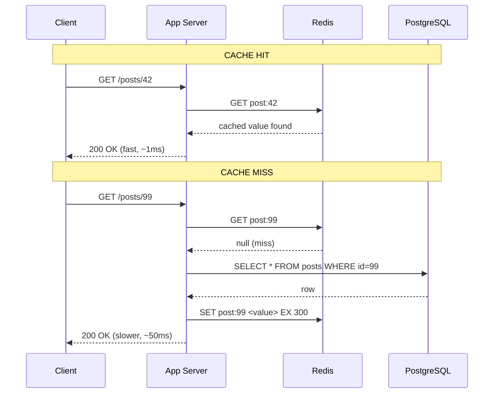
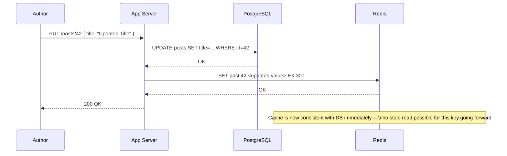
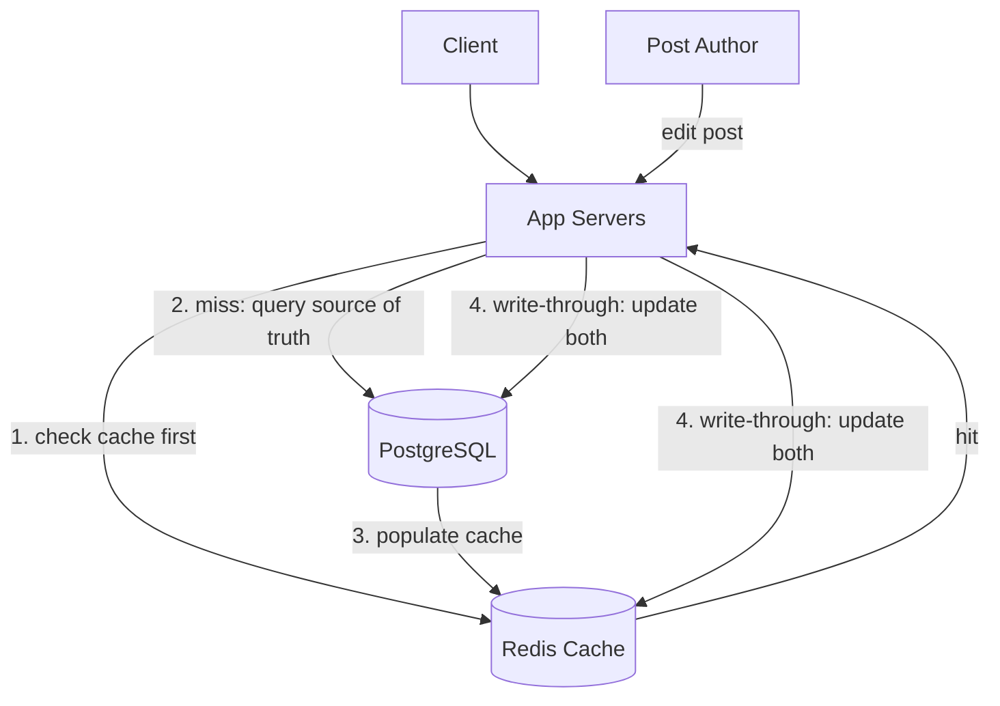
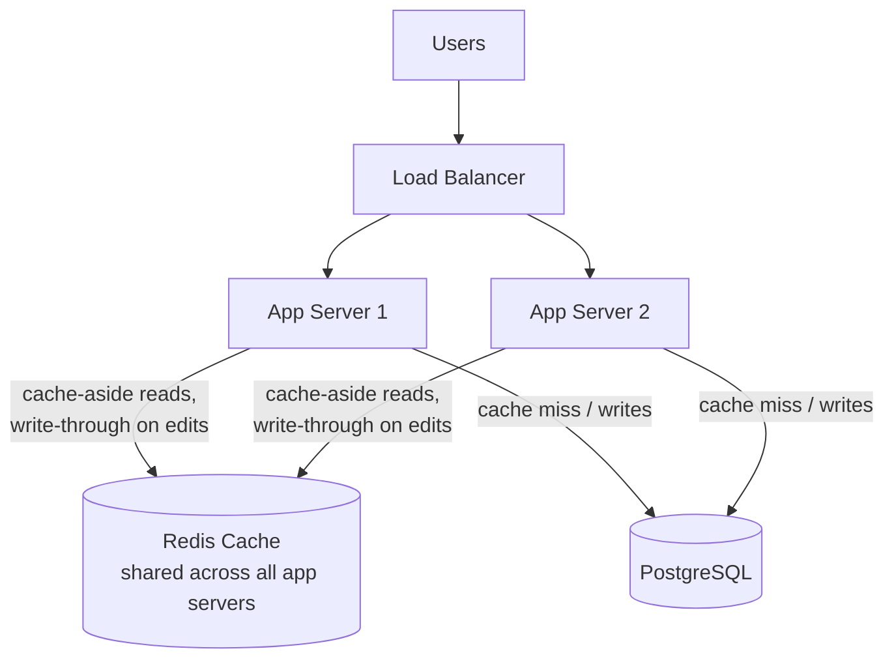
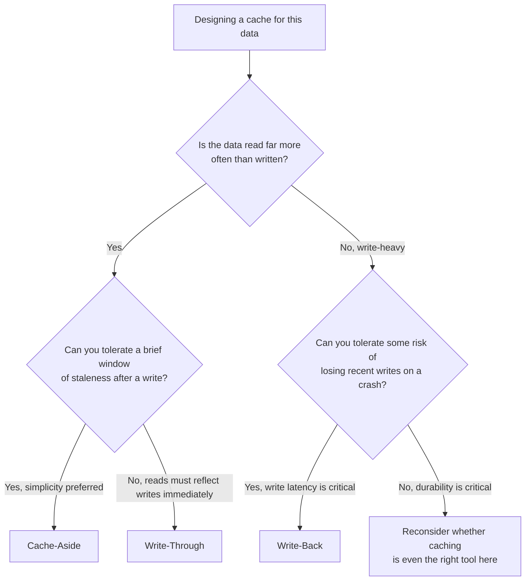
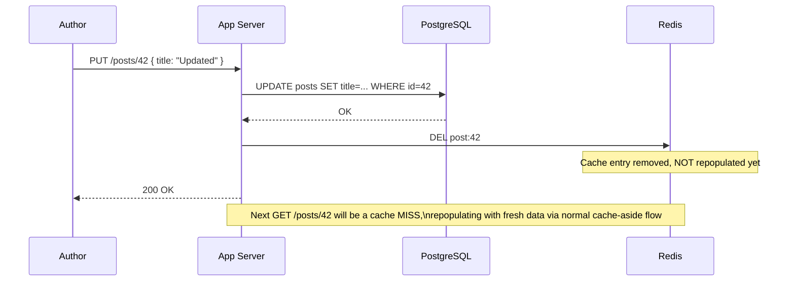
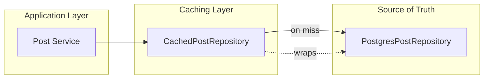
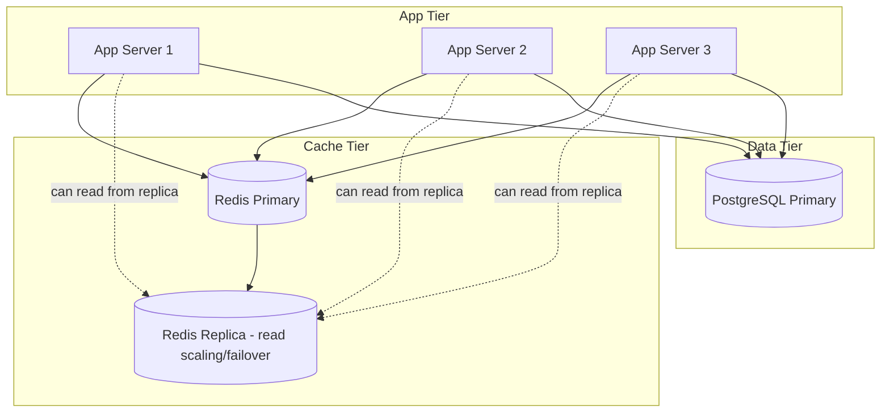

# Module 7 — Caching

> **Masterclass:** System Design Masterclass (30 Modules)
> **Level:** Intermediate
> **Audience:** Node.js backend developers, SDE‑2 / Senior Backend interview candidates, engineers transitioning into architecture roles
> **Prerequisite:** Modules 1–6 (System Design Intro, Scalability, Networking, HTTP/TCP/UDP, Databases, Storage Systems)

---

## 1. Introduction

Module 6 ended with a direct question: databases and object storage are durable, but durable and fast are not the same thing. Every read still has to travel to disk (even SSD, Module 6, has real latency relative to memory), potentially traverse a network hop (Module 3), and — for a relational query — potentially execute a join (Module 5). If the same data is requested a thousand times a minute, doing this full round trip every single time is enormously wasteful.

Caching is the answer, and it is arguably the single highest-leverage performance technique in this entire masterclass — a well-placed cache can turn a 50ms database round trip into a 1ms memory lookup. But caching also introduces one of system design's most notorious hard problems — cache invalidation — and this module treats that problem with the seriousness it deserves, not as an afterthought.

---

## 2. Learning Objectives

By the end of this module, you will be able to:

1. Explain **why caching works**, rooted in the concept of data access locality (some data is requested far more often than other data).
2. Explain and correctly apply the **Cache-Aside**, **Write-Through**, and **Write-Back** patterns, with their distinct trade-offs.
3. Explain major **eviction policies** (LRU, LFU, FIFO, TTL-based) and when each is appropriate.
4. Diagnose and design mitigations for **cache stampede** and **cache penetration** — two specific, common, production-breaking failure modes.
5. Reason about **cache invalidation strategies** and why "there are only two hard problems in computer science" jokes about this for good reason.
6. Design a Redis-backed caching layer for a real read-heavy endpoint, including TTL and key design.
7. Recognize when caching is the wrong tool, or is being used to paper over a deeper architectural problem.

---

## 3. Why This Concept Exists

Not all data is accessed equally. In almost every real system, a small fraction of data (a viral blog post, a trending product, a popular user's profile) accounts for a disproportionate fraction of total reads — a pattern often loosely called the "80/20 rule" or, more formally, connected to **Zipf's law** in many real-world access distributions. If 80% of your read traffic targets 5% of your data, then keeping just that 5% somewhere extremely fast eliminates the vast majority of expensive full-round-trip reads, without needing to make *every* piece of data equally fast (which would be enormously more expensive).

Caching exists because **memory is roughly 100-1000x faster than disk-backed storage** (Module 6 established the SSD-vs-HDD latency gap; memory is faster still than even SSD), and because most real workloads have exploitable access locality. It's not a universal law that caching helps — a workload with perfectly uniform, unpredictable access patterns gains little from caching — but this uniform-access scenario is rare in practice, which is exactly why caching is nearly ubiquitous in production systems.

---

## 4. Problem Statement

> Our blog platform's `GET /posts/:id` endpoint (Module 1) now handles 5,000 requests/second at peak. Analysis shows the top 100 posts account for 70% of all reads. Every request currently hits PostgreSQL directly, and the database is now the primary bottleneck (Module 2, Section 27's "bottleneck shifts deeper" lesson, realized). Design a caching layer to address this — and specifically address what happens when a cached post is updated (the author edits it), and what happens if 5,000 requests simultaneously hit an *expired* cache entry for the same popular post.

---

## 5. Real-World Analogy

**A cache is a small, fast convenience store near your neighborhood, stocked with the handful of items most people actually buy — milk, bread, eggs — instead of everyone driving to the distant central warehouse (the database) for every single purchase.** Most days, this works beautifully: the store has what you need, and you never make the long trip. This is the **cache hit** case.

Occasionally, the store is out of something (a **cache miss**) — you still have to drive to the warehouse, but only for that one item, and the store restocks afterward so the next customer doesn't have to make the same trip.

Now imagine the store's *entire inventory* expires at midnight simultaneously (naive TTL expiration), and at 12:00:01 AM, every single customer in the neighborhood shows up needing milk at the exact same moment — the warehouse is instantly overwhelmed by a flood of identical requests it was never meant to handle directly, all at once. This is a **cache stampede**, and Section 8 covers precisely how to prevent it.

And if a malicious customer keeps asking the store for "unicorn-flavored ice cream" — an item that will never exist — the store has nothing to cache, and every single request for it goes all the way to the warehouse, wasting the warehouse's time on a request the store can never help with. This is **cache penetration**, covered in the same section.

---

## 6. Technical Definition

**Cache:** A high-speed data storage layer that stores a subset of data, typically transient in nature, so future requests for that data can be served faster than accessing the underlying, slower primary data store.

**Cache Hit:** A request successfully served from the cache, without needing to query the underlying data store.

**Cache Miss:** A request not found in the cache, requiring a fallback query to the underlying data store (and typically populating the cache for next time).

**Cache-Aside (Lazy Loading):** The application checks the cache first; on a miss, it queries the database, then writes the result into the cache for future reads.

**Write-Through:** Every write goes to the cache *and* the database synchronously, keeping them always in sync at write time.

**Write-Back (Write-Behind):** Writes go to the cache immediately, and are asynchronously flushed to the database later, prioritizing write latency over immediate database durability.

**Eviction Policy:** The rule determining which cached items are removed when the cache reaches capacity (e.g., LRU, LFU, FIFO).

**Cache Stampede:** A failure mode where many concurrent requests for the same expired/missing cache key simultaneously overwhelm the underlying data store.

**Cache Penetration:** A failure mode where requests for data that doesn't exist (and thus can never be cached) repeatedly bypass the cache and hit the underlying data store.

---

## 7. Core Terminology

| Term | Precise Definition | One-line Intuition |
|---|---|---|
| **TTL (Time To Live)** | Duration after which a cached entry automatically expires | "Expiration date" |
| **LRU (Least Recently Used)** | Eviction policy removing the item not accessed for the longest time | "Haven't touched it in a while — gone" |
| **LFU (Least Frequently Used)** | Eviction policy removing the item accessed the fewest times | "Barely ever wanted — gone" |
| **FIFO (First In, First Out)** | Eviction policy removing the oldest-inserted item, regardless of access pattern | "Oldest stock leaves first" |
| **Hit Ratio** | Percentage of requests successfully served from cache | "How often the convenience store has what you need" |
| **Cache Coherence / Invalidation** | Ensuring cached data doesn't diverge from the true source of truth | "Making sure the store isn't selling expired info" |
| **Negative Caching** | Caching the *absence* of a result, to prevent repeated futile lookups | "Remembering that unicorn ice cream doesn't exist, so don't ask the warehouse again" |
| **Thundering Herd** | Synonym for cache stampede — many requests "stampeding" the backend simultaneously | — |

---

## 8. Internal Working

### Cache-Aside, step by step, and its specific failure mode

1. Application receives a request for `post:42`.
2. Checks Redis: `GET post:42`.
3. **Cache hit:** return immediately.
4. **Cache miss:** query PostgreSQL for post 42, then `SET post:42 <value> EX 300` (5-minute TTL), then return the result.

This is simple and widely used, but has a precise, well-known weakness: **if `post:42` is extremely popular and its TTL expires, and 5,000 concurrent requests arrive in the same instant, all 5,000 will experience a cache miss simultaneously** (since none of them have written the fresh value back yet) — and all 5,000 will independently query PostgreSQL at once. This is the **cache stampede**, and it's not a hypothetical: it's the *direct, mechanical* consequence of naive cache-aside logic applied to a popular key at the exact moment its TTL expires, which is precisely the scenario posed in Section 4's problem statement.

### Solving cache stampede — the standard mitigation techniques

**1. Mutex/lock-based repopulation:** only the *first* request that experiences a miss is allowed to query the database and repopulate the cache; all other concurrent requests for the same key wait briefly (or receive a slightly stale value) instead of all hitting the database simultaneously.

```javascript
async function getPostWithLock(postId) {
  const cached = await redis.get(`post:${postId}`);
  if (cached) return JSON.parse(cached);

  const lockKey = `lock:post:${postId}`;
  const acquired = await redis.set(lockKey, '1', 'NX', 'EX', 5); // only ONE request wins this

  if (acquired) {
    const post = await postRepository.findById(postId);
    await redis.set(`post:${postId}`, JSON.stringify(post), 'EX', 300);
    await redis.del(lockKey);
    return post;
  } else {
    // Someone else is already repopulating — wait briefly and retry the cache
    await sleep(50);
    return getPostWithLock(postId); // retry, likely hits cache now
  }
}
```

**2. Staggered/jittered TTLs:** instead of every cache entry expiring at exactly the same fixed interval, add a small random offset (`TTL = 300 + random(0, 30)` seconds) so that even popular keys don't all expire in the exact same instant, spreading the repopulation load over time instead of concentrating it.

**3. Probabilistic early refresh:** proactively refresh a cache entry slightly *before* it actually expires (with some probability that increases as expiry approaches), so a fresh value is very likely already in place by the time the old one would have expired — avoiding the miss entirely for hot keys.

### Solving cache penetration — negative caching

If clients repeatedly request `GET /posts/999999999` (a nonexistent post), cache-aside's normal logic provides no help — there's nothing to cache, so every single request falls through to the database, which then must repeatedly confirm "this doesn't exist." The fix: **explicitly cache the "not found" result itself** (typically with a shorter TTL than valid entries), so subsequent requests for the same nonexistent key are served (with a 404) directly from cache, never reaching the database at all.

```javascript
async function getPostSafely(postId) {
  const cached = await redis.get(`post:${postId}`);
  if (cached === 'NULL_MARKER') return null; // negative cache hit — don't query DB
  if (cached) return JSON.parse(cached);

  const post = await postRepository.findById(postId);
  if (!post) {
    await redis.set(`post:${postId}`, 'NULL_MARKER', 'EX', 60); // shorter TTL for negative cache
    return null;
  }
  await redis.set(`post:${postId}`, JSON.stringify(post), 'EX', 300);
  return post;
}
```

---

## 9. Request Lifecycle

### Mermaid Sequence Diagram — Cache-Aside, Hit and Miss



### Mermaid Sequence Diagram — Write-Through on Post Edit



**Step-by-step explanation:** this second diagram directly answers Section 4's invalidation question — rather than only *deleting* the stale cache entry on write (a valid, simpler alternative) and waiting for the next read to repopulate it (cache-aside), this write-through approach proactively updates the cache with the new value **at write time**, ensuring the very next read is already a cache hit with correct data, at the cost of the write path now depending on Redis's availability too (Section 23 discusses this trade-off).

---

## 10. Architecture Overview



**Why Redis specifically, tying back to Module 5's data model lesson:** Redis is a key-value store (Module 5, Section 6) — exactly the right data model for caching, where access is almost always "give me the value for this exact key," not complex querying. This is not a coincidence; it's the same "match the tool to the access pattern" principle from Module 5, applied to the cache layer itself.

---

## 11. Capacity Estimation

**Scenario:** Sizing the Redis cache for our 5,000 req/s blog read workload, where the top 100 posts account for 70% of traffic.

**Step 1 — Estimate cached data size:**
```
Assume top 1,000 posts (generous headroom beyond the "hot 100") are cached,
average post size (with metadata) ≈ 5 KB
1,000 × 5 KB = 5 MB
```

**Step 2 — Compare to available memory:** even a small, inexpensive Redis instance (a few hundred MB to a few GB of RAM) comfortably holds this — the *entire* hot dataset fits trivially in memory, confirming caching is an excellent fit here, numerically, not just intuitively.

**Step 3 — Hit ratio impact on database load:**
```
70% of 5,000 req/s = 3,500 req/s served from cache (no DB hit)
30% of 5,000 req/s = 1,500 req/s still reach the database
```
This alone reduces database load by 70% — directly resolving the Section 4 bottleneck, without adding a single new database server (Module 2's scaling techniques), purely by exploiting access locality (Section 3).

---

## 12. High-Level Design (HLD)



**Why the cache is shared (one Redis instance/cluster), not per-app-server local memory:** this directly echoes Module 2's stateless-service lesson — if each app server cached posts in its own local memory, different instances could serve different, inconsistent cached values for the same post, and cache warmup would need to happen independently on every instance. A **shared cache** ensures all app servers see the same cached state and benefit from any single instance's cache population, exactly like the shared session store pattern from Module 2.

---

## 13. Low-Level Design (LLD)

### Full cache-aside implementation with stampede and penetration protection combined

```javascript
const redis = require('./redisClient');
const postRepository = require('./postRepository');

async function getPost(postId) {
  const cacheKey = `post:${postId}`;
  const cached = await redis.get(cacheKey);

  if (cached === 'NULL_MARKER') return null; // negative cache (Section 8)
  if (cached) return JSON.parse(cached);      // normal cache hit

  const lockKey = `lock:${cacheKey}`;
  const acquiredLock = await redis.set(lockKey, '1', 'NX', 'EX', 5); // stampede protection (Section 8)

  if (!acquiredLock) {
    await sleep(50);
    return getPost(postId); // another request is repopulating; retry shortly
  }

  try {
    const post = await postRepository.findById(postId);
    if (!post) {
      await redis.set(cacheKey, 'NULL_MARKER', 'EX', 60);
      return null;
    }
    const jitter = Math.floor(Math.random() * 30); // staggered TTL (Section 8)
    await redis.set(cacheKey, JSON.stringify(post), 'EX', 300 + jitter);
    return post;
  } finally {
    await redis.del(lockKey);
  }
}
```

**LLD-level design note:** notice this single function directly incorporates **three** distinct mitigations from Section 8 (negative caching, mutex-based stampede protection, and TTL jitter) — this is what a genuinely production-grade cache-aside implementation looks like, not the simplified two-branch version most tutorials show; the "simple" version is correct only until you hit real, popular-key traffic.

---

## 14. ASCII Diagrams

```
CACHE HIT RATIO OVER TIME (illustrative, cache-aside, cold start)

  Hit %
   100│                              ●───●───●───●
      │                        ●
    75│                  ●
      │            ●
    50│      ●
      │  ●
     0└──────────────────────────────────────────▶ Time
       cold        cache warming up          steady state

  (Immediately after deployment/cache-flush, hit ratio starts at 0%
   and climbs as popular keys get populated — this is "cache warmup",
   and explains why a fresh cache deployment briefly increases DB load)
```

```
STAMPEDE, WITHOUT vs WITH MUTEX PROTECTION

  WITHOUT lock (5,000 concurrent requests, key just expired)
    Req 1 ──▶ DB
    Req 2 ──▶ DB
    Req 3 ──▶ DB     ← all 5,000 hit the database simultaneously
    ...
    Req 5000 ─▶ DB

  WITH lock
    Req 1 ──▶ acquires lock ──▶ DB ──▶ repopulates cache
    Req 2 ──▶ lock held, waits ──▶ retries ──▶ CACHE HIT
    Req 3 ──▶ lock held, waits ──▶ retries ──▶ CACHE HIT
    ...
    Req 5000 ─▶ lock held, waits ─▶ retries ─▶ CACHE HIT
    (only ONE request ever reaches the database)
```

---

## 15. Mermaid Flowcharts

### Decision Flow: Which Caching Pattern?



---

## 16. Mermaid Sequence Diagrams

*(Section 9 covers the two canonical sequence diagrams for this module. Additional diagram below.)*

### Cache Invalidation via Delete-on-Write (Simpler Alternative to Write-Through)



**Why "delete" is sometimes preferred over "update" on write:** this is simpler to implement correctly (no risk of writing a subtly wrong value into the cache at write time) and avoids doing potentially wasted work if the post is edited multiple times in quick succession before being read again — the trade-off is one guaranteed cache miss on the next read, versus write-through's guarantee of always-warm cache at the cost of more write-path complexity.

---

## 17. Component Diagrams



**Why `CachedPostRepository` wraps `PostgresPostRepository` rather than replacing it (the Decorator pattern):** this keeps caching logic **completely separate** from actual data-access logic — `PostgresPostRepository` has no awareness that caching even exists, and `CachedPostRepository` has no awareness of SQL. This mirrors the Repository pattern principle from Modules 1 and 5: isolate what changes (whether/how caching is applied) from what stays stable (how data is actually fetched from its source of truth).

```javascript
class CachedPostRepository {
  constructor(underlyingRepo, redisClient) {
    this.underlying = underlyingRepo;
    this.redis = redisClient;
  }
  async findById(id) {
    const cached = await this.redis.get(`post:${id}`);
    if (cached) return JSON.parse(cached);
    const post = await this.underlying.findById(id); // delegates to Postgres repo
    if (post) await this.redis.set(`post:${id}`, JSON.stringify(post), 'EX', 300);
    return post;
  }
}
```

---

## 18. Deployment Diagrams



**Deployment-level note:** even the cache itself now has a **replica** — this foreshadows Module 15's replication concepts, but the immediate point is: if the cache is genuinely load-bearing for your database's survival (Section 27's bottleneck lesson), the cache itself becomes a component worth protecting from single-instance failure — a naive assumption that "it's just a cache, it doesn't need redundancy" can be dangerously wrong once your database can no longer survive the full traffic load alone.

---

## 19. Network Diagrams

Cache placement follows the same private-subnet principle established in Module 3 — Redis should never be directly internet-reachable, and should sit in the same trusted private network as the application tier and database:

```
  App Tier Security Group
          │
          ├──▶ Redis SG (allow 6379 from App Tier SG only)
          └──▶ PostgreSQL SG (allow 5432 from App Tier SG only)

  (Redis is just as sensitive as the database it protects —
   it often holds session tokens, Module 2, and cached user data)
```

---

## 20. Database Design

Caching introduces a subtle but important schema-adjacent decision: **cache key design**. A well-designed key namespace prevents collisions and enables targeted invalidation:

```
GOOD key design:
  post:42                    → a single post
  post:42:comments           → that post's comments (separate, independently invalidatable)
  user:123:profile           → a user's profile
  posts:list:page:1:sort:new → a specific paginated listing (Section 27 revisits this)

BAD key design:
  data_42                    → ambiguous, collision-prone, impossible to reason about
```

**Why this matters for invalidation specifically:** if editing a post also needs to invalidate a cached "list of posts by this author" entry, a clear, structured key namespace (e.g., `user:123:posts:list`) lets you invalidate precisely the affected keys, rather than either under-invalidating (leaving stale data) or over-invalidating (flushing far more of the cache than necessary, hurting hit ratio for unrelated data).

---

## 21. API Design

Caching should generally be **invisible to API consumers** — the same principle established in Module 2, Section 21 for scaling. A `GET /posts/42` response should look identical whether served from cache or database. The one legitimate API-level signal worth considering: an `ETag` or `Last-Modified` header, enabling **HTTP-level caching** (browser/CDN caching, distinct from but complementary to server-side Redis caching, and foreshadowing Module 10's CDN caching).

```javascript
app.get('/posts/:id', async (req, res) => {
  const post = await getPost(req.params.id); // server-side cache-aside, Section 13
  if (!post) return res.status(404).json({ error: 'Not found' });
  res.set('ETag', post.updatedAt); // enables client/CDN-level caching too
  res.status(200).json(post);
});
```

---

## 22. Scalability Considerations

| Consideration | Impact |
|---|---|
| Cache hit ratio | Directly determines how much database load reduction you actually achieve — must be measured, not assumed (Section 11) |
| Cache memory capacity | Must accommodate the genuinely "hot" dataset; an undersized cache causes excessive eviction and thrashing |
| Cache as a new potential bottleneck | At sufficient scale, the cache itself may need horizontal scaling (Redis Cluster) or replication (Section 18) |
| Multi-region caching | A cache in one region doesn't help users served from another region — multi-region deployments (Module 27+) need per-region caching strategies |

---

## 23. Reliability & Fault Tolerance

- **What happens if Redis goes down entirely?** With cache-aside, the application should be designed to **gracefully fall back to the database** on a cache connection failure, rather than treating a cache outage as a total application outage — a cache should be a performance optimization, not a hard dependency for correctness.

```javascript
async function getPostResilient(postId) {
  try {
    const cached = await redis.get(`post:${postId}`);
    if (cached) return JSON.parse(cached);
  } catch (err) {
    console.error('Redis unavailable, falling back to DB directly:', err);
    // Deliberately swallow the cache error and fall through to the DB
  }
  return postRepository.findById(postId); // DB is the resilient fallback
}
```

- **Write-through's reliability trade-off, precisely:** if writes go to both cache and database synchronously, a cache failure during a write can either (a) be treated as non-fatal (write to DB succeeds, cache write is best-effort) or (b) block the entire write — choice (a) is almost always correct, since the database remains the true source of truth and the cache entry will simply be repopulated (or correctly missed) on the next read.
- **Write-back's reliability risk, explicitly:** if data is only in the cache and the cache crashes before flushing to the database, **that write is genuinely lost** — this is why write-back is reserved for workloads that can tolerate this risk in exchange for write latency, and rarely used for data with strict durability requirements (directly connecting back to Module 5's ACID durability guarantee, which write-back explicitly forgoes for the cached layer).

---

## 24. Security Considerations

- **Never cache sensitive data (passwords, full payment details) in plaintext**, even in an internal, private-subnet-protected Redis instance — defense in depth (Module 3) means assuming any single layer could eventually be compromised.
- **Cache poisoning risk:** if cache keys are derived from unsanitized user input, a malicious actor might craft input that collides with or overwrites another user's cached data — always validate/sanitize any user-supplied value used to construct a cache key.
- **Session data cached in Redis (Module 2) must be protected with the same rigor as the database** — Redis is not "just a cache" from a security posture standpoint when it holds session tokens or other sensitive state.

---

## 25. Performance Optimization

- **Measure and tune TTL based on actual data volatility** — a rarely-changing "About the Author" bio can have a long TTL (hours); a frequently-updated "current view count" needs a much shorter one, or a different pattern (Section 11's counter use case, revisited from Module 5).
- **Batch cache reads where possible** (`MGET` for multiple keys in one round trip) rather than issuing many sequential single-key `GET` calls, reducing network round-trip overhead (Module 3/4's connection-cost lessons apply here too).
- **Monitor and tune hit ratio actively** — a consistently low hit ratio (e.g., under 50%) for a supposedly "hot" dataset suggests either a TTL that's too short, a cache that's too small (excessive eviction), or a workload that doesn't actually have the access locality (Section 3) you assumed it did.

---

## 26. Monitoring & Observability

- **Cache hit ratio** — the single most important caching metric; track it per key namespace (Section 20), not just globally, since a low global average can hide one namespace performing excellently and another performing poorly.
- **Eviction rate** — a rising eviction rate under stable traffic suggests the cache is undersized for its working set.
- **Cache latency itself** — even though caches are fast by design, a degrading Redis instance (e.g., approaching memory limits, or under CPU pressure) can start adding meaningful latency, defeating its own purpose if unmonitored.
- **Stampede/lock-contention indicators** — a spike in database queries correlated with specific key expirations is a direct sign of an under-protected hot key (Section 8).

---

## 27. Common Bottlenecks

| Bottleneck | Symptom | Root Cause |
|---|---|---|
| Cache stampede | Periodic DB load spikes correlated with TTL expiration | No stampede protection on hot keys (Section 8) |
| Cache penetration | Sustained DB load from nonexistent-key lookups | No negative caching (Section 8) |
| Low hit ratio | Cache present but DB load barely reduced | TTL too short, cache too small, or access pattern lacks locality |
| Stale reads after writes | Users see outdated data after an edit | Missing or delayed invalidation (Section 9/16) |
| Cache as new SPOF | Total outage when cache goes down, not just slowdown | No graceful fallback to source of truth on cache failure (Section 23) |
| Paginated list caching complexity | Cache constantly invalidated by any single item change | Caching a broad "list" key that's invalidated by any underlying change, rather than caching individual items and composing lists at read time |

---

## 28. Trade-off Analysis

> "I chose **cache-aside with a short TTL plus explicit delete-on-write invalidation** over write-through, optimizing for **implementation simplicity and reduced write-path complexity**, at the cost of **a brief window where a just-edited post could theoretically be served stale from another cache-aside race**, which is acceptable because our data isn't safety-critical, and the staleness window is bounded and small."

> "I chose to add **mutex-based stampede protection** specifically for our top 100 posts' cache keys, optimizing for **database load stability during TTL expiration events**, at the cost of **added implementation complexity and a small latency penalty for the unlucky request that must wait for the lock**, which is acceptable because a full stampede (5,000 simultaneous DB hits) is a far worse outcome than a handful of requests waiting an extra 50ms."

---

## 29. Anti-patterns & Common Mistakes

1. **Treating the cache as the source of truth** — if the cache is ever the *only* place a piece of data exists (outside of write-back's deliberate, accepted risk), you've built a reliability hazard, not a performance optimization.
2. **No graceful fallback on cache failure** — an application that throws a 500 error when Redis is briefly unreachable has converted a performance layer into an availability dependency, undermining Module 1's reliability principles.
3. **Ignoring cache stampede risk for genuinely hot keys** — works fine in testing (low concurrency), fails dramatically in production at the exact moment it matters most (Section 4's scenario).
4. **No negative caching**, leaving the system vulnerable to cache penetration from either legitimate edge cases (deleted content) or deliberate abuse (scanning for valid IDs).
5. **Caching everything with the same TTL**, ignoring that different data has wildly different volatility and staleness tolerance (Section 25).
6. **Using caching to paper over a fundamentally inefficient query or schema** instead of fixing the underlying inefficiency — a cache can mask a slow, unindexed query (Module 5, Section 8) for a while, but doesn't fix it, and the problem resurfaces at full force the moment cache coverage has any gap.

---

## 30. Production Best Practices

- Always design a **graceful fallback path** for cache unavailability — a cache should degrade performance, never cause an outage on its own.
- Apply **stampede and penetration protection** proactively for any endpoint serving genuinely hot or adversarially-probeable keys, not reactively after an incident.
- **Monitor hit ratio per key namespace**, and treat a persistently low ratio as a signal to revisit TTL, cache sizing, or whether caching is even the right fit for that specific data.
- **Never use caching as a substitute for fixing a genuinely slow underlying query** — treat it as complementary to, not a replacement for, database-level optimization (Module 5).
- Choose **cache-aside as the default pattern** for most read-heavy workloads; reserve write-through for cases needing guaranteed immediate read-after-write consistency, and write-back only for workloads that can tolerate the durability risk it introduces.

---

## 31. Real-World Examples

- **Facebook's Memcache deployment** (extensively documented in their engineering publications) is one of the largest, most heavily studied caching systems in the industry, explicitly built with lease-based mechanisms functionally similar to this module's mutex-based stampede protection, precisely because Facebook's scale makes even rare stampede events operationally significant.
- **Twitter's timeline architecture** relies heavily on caching (historically via a large-scale Redis/Memcache-based system) to avoid recomputing or re-querying a user's home timeline on every single request — a direct, massive-scale instance of the access-locality principle (Section 3): most timeline reads are far more frequent than the underlying tweet-creation writes.
- **Nearly every major e-commerce platform** caches product catalog data aggressively (product details change relatively rarely but are read constantly, especially for popular items) while deliberately *not* caching real-time inventory counts the same way, or using very short TTLs/different patterns for them — a practical, industry-standard application of this module's "match TTL and pattern to data volatility" lesson (Section 25).

---

## 32. Node.js Implementation Examples

### Batch cache reads with `MGET` (performance optimization from Section 25)

```javascript
async function getMultiplePosts(postIds) {
  const keys = postIds.map(id => `post:${id}`);
  const cachedValues = await redis.mget(keys); // single round trip for all keys

  const results = [];
  const missedIds = [];

  cachedValues.forEach((value, i) => {
    if (value) results[i] = JSON.parse(value);
    else missedIds.push(postIds[i]);
  });

  if (missedIds.length > 0) {
    const dbPosts = await postRepository.findByIds(missedIds); // single batched DB query for all misses
    for (const post of dbPosts) {
      await redis.set(`post:${post.id}`, JSON.stringify(post), 'EX', 300);
    }
  }

  return results; // (simplified — real implementation merges cached + freshly-fetched results in order)
}
```

**Why this matters:** fetching 20 posts individually would mean 20 separate Redis round trips (Module 3/4's connection-overhead lesson) even on all cache hits; `MGET` reduces this to one round trip, and any misses are similarly batched into a single database query rather than 20 individual ones — a direct, compounding performance win for any endpoint returning a list of items.

---

## 33. Interview Questions

### Easy
1. What is a cache hit and a cache miss?
2. Explain the Cache-Aside pattern in your own words.
3. What is TTL, and why does every cache entry typically need one?
4. Name three eviction policies and briefly describe each.
5. What is a cache stampede, in one sentence?
6. Why shouldn't a cache be treated as the sole source of truth for critical data?

### Medium
7. Compare Write-Through and Write-Back, and identify the key reliability trade-off between them.
8. Explain cache penetration and how negative caching solves it.
9. Design a mutex-based stampede protection mechanism for a hot cache key, explaining what happens to requests that don't acquire the lock.
10. Why should a well-designed application gracefully degrade, not fail entirely, when its cache becomes unavailable?
11. Explain why caching a paginated "list of posts" endpoint is more complex to invalidate correctly than caching individual post lookups.
12. What's the relationship between a cache's hit ratio and the actual database load reduction it provides — walk through the math for a given hit ratio and request rate.

### Hard
13. Design a full caching strategy (pattern, TTL approach, invalidation, stampede/penetration protection) for a product catalog page on a high-traffic e-commerce site.
14. A cache's hit ratio is unexpectedly low despite caching data that should have strong access locality. Walk through your diagnostic approach.
15. Explain, precisely, why write-back caching risks data loss in a way write-through does not, and describe a workload where this risk is nonetheless an acceptable trade-off.
16. Design a cache invalidation strategy for a social media "like count" that must remain reasonably accurate (not necessarily perfectly real-time) under extremely high write volume.
17. A cache stampede mitigation using a mutex lock introduces a new failure mode: what happens if the process holding the lock crashes before releasing it? Propose a fix.

---

## 34. Scenario-Based Design Questions

1. **Scenario:** After a full cache flush (e.g., a Redis restart), your database experiences a severe load spike immediately afterward. Diagnose and propose a mitigation for this "cold cache" problem.
2. **Scenario:** Users report seeing an old version of a blog post's title minutes after the author edited it. Diagnose using this module's invalidation concepts.
3. **Scenario:** Your Redis instance briefly goes down during a deploy, and your entire application returns 500 errors during that window. Redesign the caching logic to prevent this.
4. **Scenario:** A specific product page ("Black Friday deal of the day") receives 50,000 requests/second for a few hours. Design the caching approach specifically for this single, extremely hot key.
5. **Scenario:** An attacker is scanning your API with sequential, mostly-invalid post IDs, causing sustained elevated database load. Propose a fix using this module's concepts.
6. **Scenario:** Your team debates whether to use Write-Through or Cache-Aside for a "user account settings" feature where reads must always reflect the very latest write. Recommend one and justify.
7. **Scenario:** A cache's hit ratio dashboard shows 95% for "individual post" lookups but only 10% for "paginated post list" lookups. Explain the likely cause and propose an improved design.
8. **Scenario:** Your team wants to cache real-time stock prices with a 5-minute TTL "to reduce load." Evaluate whether this is an appropriate use of caching, and what risk it introduces.
9. **Scenario:** A mutex-holding process crashes mid-repopulation, leaving the lock held. Walk through the user-facing impact and your fix.
10. **Scenario:** You must decide whether to cache an expensive, multi-table joined query result as a whole, or cache each underlying table's rows individually and join them in application code. Discuss the trade-offs of each approach.

---

## 35. Hands-on Exercises

1. Implement Cache-Aside for a simple key-value lookup backed by a slow, artificially-delayed function (simulate a 200ms "database" call), and measure the latency difference between a cache hit and miss.
2. Reproduce a cache stampede locally: fire 100 concurrent requests for the same key at the exact moment its TTL expires (using a very short TTL like 1 second), and count how many "database" calls occur.
3. Implement the mutex-based stampede fix from Section 13, and re-run the same test, confirming only one underlying call occurs.
4. Implement negative caching for a "not found" lookup, and verify via logging that repeated requests for a nonexistent key stop reaching your simulated database after the first request.
5. Measure and log the cache hit ratio for a simple simulated workload where 80% of requests target 20% of keys (a Zipfian-like distribution), comparing it against a uniformly random access pattern.

---

## 36. Mini Project

**Build:** A production-grade caching layer for the blog platform's `GET /posts/:id` endpoint.

**Requirements:**
- Implement Cache-Aside with a TTL, including jitter (Section 8/13).
- Implement negative caching for nonexistent post IDs.
- Implement mutex-based stampede protection for concurrent misses on the same key.
- Implement a graceful fallback to PostgreSQL if Redis is unreachable (Section 23), logging but not failing the request.
- Implement delete-on-write invalidation when a post is edited.
- Add basic hit/miss ratio logging.

**Success criteria:** Under a simulated load test with concurrent requests to the same key at TTL expiration, your database receives only a small number of queries (not one per concurrent request), and your logs show a measurable, correct hit ratio.

---

## 37. Advanced Project

**Build:** Extend the Mini Project with write-through caching, batch reads, and a full failure-mode test suite.

1. Implement a **write-through variant** for a "user profile" endpoint where reads must always reflect the latest write, and compare its behavior against the cache-aside post endpoint under the same edit-then-read test.
2. Implement `MGET`-based batch reading (Section 32) for a "list of posts by author" endpoint, and measure the round-trip count reduction compared to N individual `GET` calls.
3. Write an automated test that kills your Redis connection mid-test and asserts that reads still succeed (via the graceful fallback), while logging a clear warning.
4. Write an automated test that simulates a mutex-holder crash (e.g., killing the process after acquiring the lock but before releasing it) and verify your system doesn't deadlock — either via the lock's own TTL expiring (a required safety net) or another mechanism, and document the maximum time a request could theoretically wait in this failure case.

**Success criteria:** You have a working write-through endpoint, measured batch-read performance improvement, and a demonstrated, tested recovery from both a full cache outage and a crashed-lock-holder scenario — setting up Module 8 (Load Balancing), which addresses how requests get correctly and efficiently distributed across the multiple app server instances that both this cache layer and the underlying database now need to serve.

---

## 38. Summary

- Caching works because most real workloads exhibit **access locality** — a small subset of data accounts for most reads — and memory is dramatically faster than disk-backed storage.
- **Cache-Aside, Write-Through, and Write-Back** represent a spectrum of trade-offs between implementation simplicity, read-after-write consistency, and durability risk.
- **Cache stampede** and **cache penetration** are specific, well-understood, production-breaking failure modes with established mitigations (mutex locks, TTL jitter, negative caching) — not edge cases to discover the hard way in production.
- A cache should always have a **graceful fallback** to the source of truth — it is a performance layer, not a hard dependency for correctness or availability.
- **Cache key design and TTL strategy** should be deliberate, matched to each data type's actual volatility and access pattern — not uniform defaults applied blindly.

---

## 39. Revision Notes

- Cache-Aside: read-through-on-miss, simple, default choice
- Write-Through: write to cache + DB together, always-warm, more write-path complexity
- Write-Back: write to cache only, async flush to DB, fastest writes, real data-loss risk
- Cache stampede fix: mutex lock (only one request repopulates) + TTL jitter
- Cache penetration fix: negative caching (cache the "not found" result too)
- Always have a graceful DB fallback if the cache is down — never let the cache become a hard dependency
- Cache key design should be structured and namespaced for precise, targeted invalidation
- Match TTL to data volatility — not a single blanket TTL for everything

---

## 40. One-Page Cheat Sheet

```
SYSTEM DESIGN — MODULE 7 CHEAT SHEET
─────────────────────────────────────
CACHE-ASIDE     → check cache, miss → query DB → populate cache (default choice)
WRITE-THROUGH   → write to cache AND DB together (always-warm, more write complexity)
WRITE-BACK      → write to cache only, async flush later (fastest, real data-loss risk)

EVICTION POLICIES
  LRU  → evict least recently accessed
  LFU  → evict least frequently accessed
  FIFO → evict oldest inserted, regardless of access

TWO FAILURE MODES TO ALWAYS DESIGN FOR
  Cache Stampede    → mutex lock + TTL jitter
  Cache Penetration → negative caching (cache the "not found" too)

GOLDEN RULES
  Cache is a PERFORMANCE layer, never the sole source of truth
  Always have a graceful fallback if the cache is unavailable
  Match TTL to actual data volatility, not a blanket default
  Structure cache keys for precise, targeted invalidation
  Caching masks a slow query — it doesn't fix it
```

---

## Key Takeaways

- Caching's entire value proposition rests on real-world access locality — verify this assumption with actual hit-ratio measurement, don't just assume it.
- Cache stampede and cache penetration are not edge cases — they are the default, predictable behavior of a naive cache-aside implementation under real, popular-key traffic, and must be designed for proactively.
- A cache must degrade gracefully; treating it as infallible converts a performance optimization into a new, avoidable single point of failure.

## 20 Practice Questions
*(See Section 33 — 6 Easy, 6 Medium, 5 Hard — plus 3 rapid-fire additions:)*
18. Why is a cache with a 100% hit ratio sometimes actually a red flag worth investigating (hint: think about whether your TTLs are too long for the data's freshness needs)?
19. What's the difference between an eviction and an expiration (TTL-based removal)?
20. Why would you choose a shorter TTL for a negative-cache entry than for a normal positive-cache entry?

## 10 Scenario-Based Questions
*(See Section 34 in full.)*

## 5 Design Assignments
*(See Sections 36–37 — Mini Project and Advanced Project — plus:)*
1. Design a caching strategy for a news website's homepage, addressing how you'd handle breaking news requiring near-immediate invalidation versus older, stable articles.
2. Write a one-page postmortem (real or hypothetical) for a cache stampede incident, including root cause, immediate mitigation, and long-term fix.
3. Propose a cache key namespace design for a hypothetical multi-tenant SaaS product, ensuring one tenant's cache invalidation never affects another's data.

## Suggested Next Module

**→ Module 8: Load Balancing** — with a fast, resilient caching layer in place, we return to a question first raised in Module 2: now that we have multiple app server instances, exactly how does a load balancer decide which one gets each incoming request, and what algorithms and health-check mechanisms make that decision correctly and reliably?
