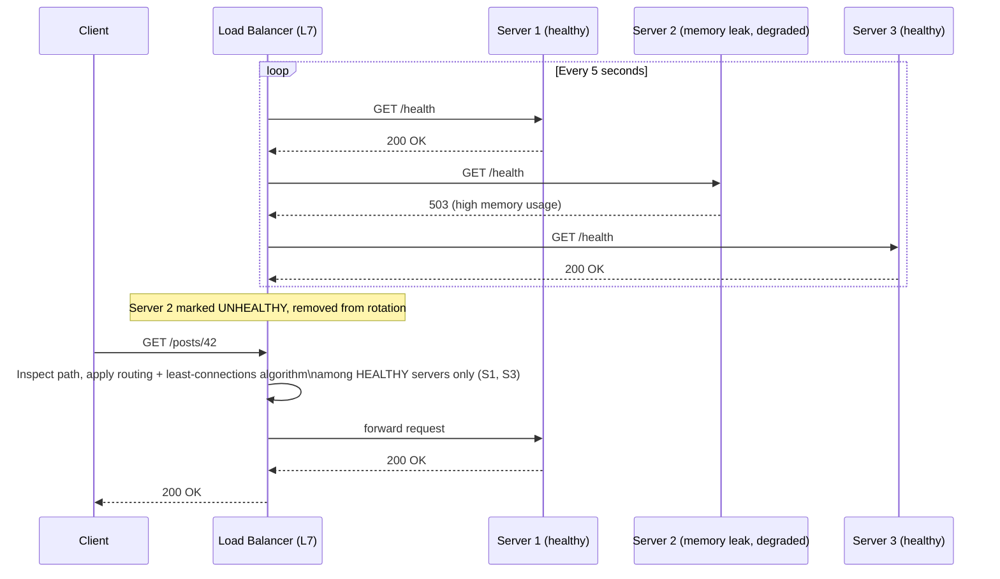
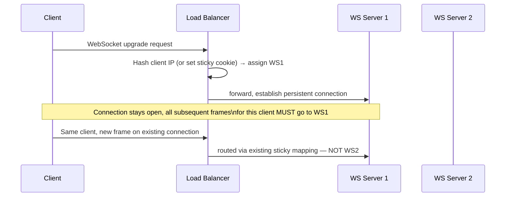
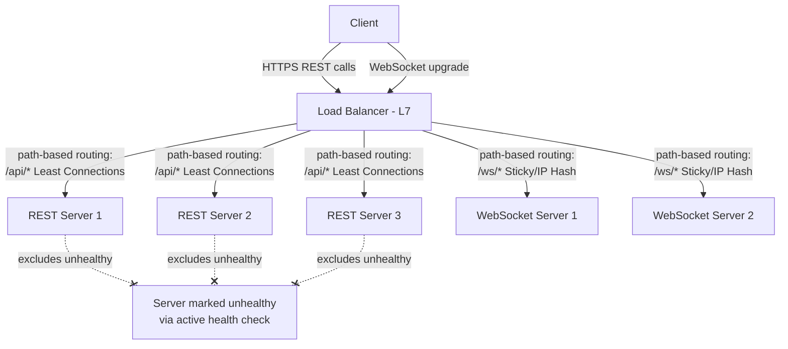
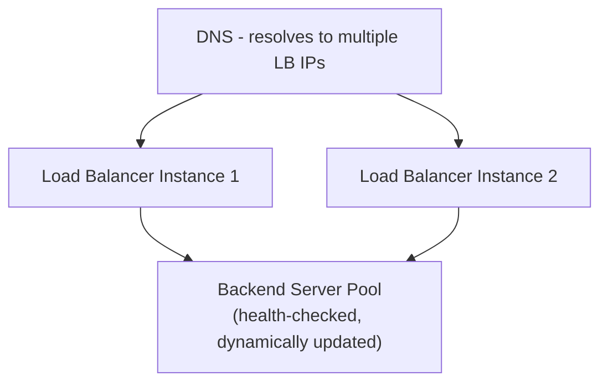
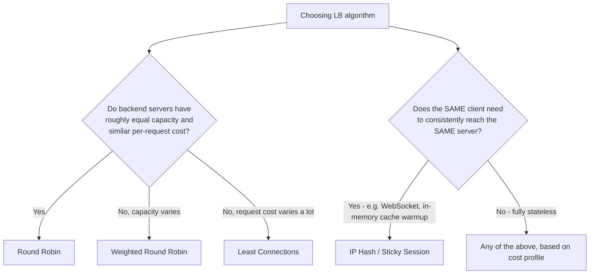
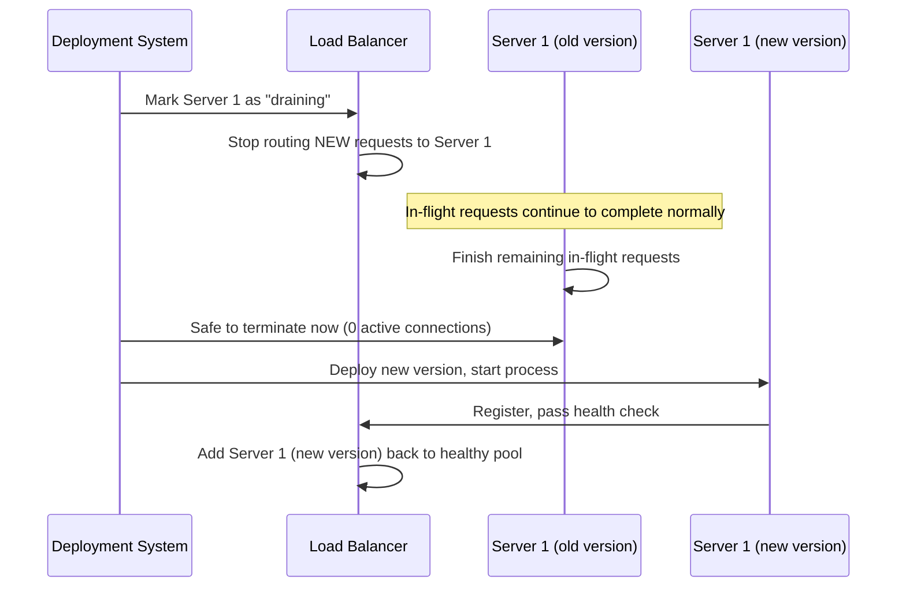
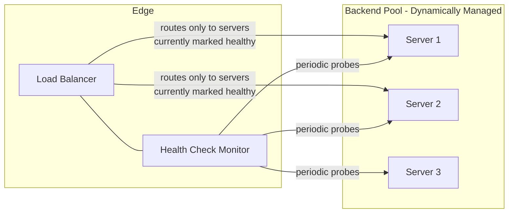
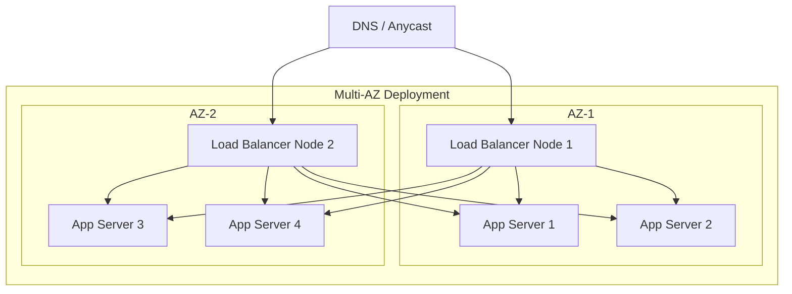

# Module 8 — Load Balancing

> **Masterclass:** System Design Masterclass (30 Modules)
> **Level:** Intermediate
> **Audience:** Node.js backend developers, SDE‑2 / Senior Backend interview candidates, engineers transitioning into architecture roles
> **Prerequisite:** Modules 1–7 (System Design Intro through Caching)

---

## 1. Introduction

Since Module 2, nearly every diagram in this course has included a box labeled `[Load Balancer]` sitting calmly in front of multiple app servers, with an arrow simply saying "distributes traffic." We've relied on it without asking exactly how it decides *which* server gets *which* request, what happens when a server silently stops working but hasn't crashed, or what "Layer 4 vs. Layer 7" — a phrase you'll hear in nearly every real infrastructure conversation — actually means.

This module opens that box. Load balancing is the mechanism that makes Module 2's entire horizontal scaling story actually work in practice — without it, "add more servers" is just a diagram, not a functioning system.

---

## 2. Learning Objectives

By the end of this module, you will be able to:

1. Explain the difference between **Layer 4** and **Layer 7** load balancing, and when each is the correct choice.
2. Explain and compare core load balancing algorithms: **Round Robin, Least Connections, IP Hash**.
3. Explain **sticky sessions** precisely — what problem they solve, and why they're a partial workaround, not a full solution (tying back to Module 2).
4. Design and reason about **health checks** — active and passive — and their role in reliability.
5. Diagnose **uneven load distribution** across a server fleet and identify likely root causes.
6. Design a load-balanced architecture combining Layer 4 and Layer 7 concerns appropriately.
7. Recognize load balancer-specific failure modes and how to avoid the load balancer itself becoming a single point of failure.

---

## 3. Why This Concept Exists

Module 2 established that horizontal scaling requires stateless, interchangeable server instances. But "interchangeable instances exist" and "requests actually reach the right, healthy instance efficiently" are two different problems. Without a deliberate traffic-distribution mechanism, a client would need to somehow know which of your 5 servers is least busy, healthiest, and reachable *right now* — information the client has no way of obtaining and shouldn't need to care about.

Load balancing exists to solve this exact problem: it's the **traffic officer** (Module 2's city-planning analogy) standing at the fork in the road, with visibility into all lanes (servers), directing each car (request) to the lane that will serve it best — while also being the one who notices if a lane is closed (a server is down) and stops sending cars there. This module formalizes exactly how that officer makes each decision.

---

## 4. Problem Statement

> Our blog platform now runs 5 stateless app server instances (Module 2) behind a load balancer, plus a shared Redis cache (Module 7) and PostgreSQL database. Recently: (1) one server has been silently failing to respond to some requests due to a memory leak, but hasn't crashed, so it's still receiving traffic, (2) our WebSocket-based comment feature (Module 4) requires each client to stay connected to the *same* server instance, and (3) traffic monitoring shows one server consistently receiving roughly double the requests of the others. Diagnose each issue and design the load balancing strategy that resolves all three.

---

## 5. Real-World Analogy

**A Layer 4 load balancer is a traffic officer who only looks at which highway lane a car is in and its license plate — not what's inside the car or where the car is ultimately going within the building.** It routes based on network-level information (IP address, port) without inspecting the actual cargo (the HTTP request content). This is fast, because there's less to inspect, but it can't make smart decisions based on *what* is being requested.

**A Layer 7 load balancer is a receptionist who reads the visitor's stated purpose before directing them.** "You're here for a return? Third floor, customer service. You're here for a delivery? Loading dock, around back." This requires understanding the actual content of the request (the HTTP path, headers, cookies) — slower to process per-request than the Layer 4 officer, but able to make far smarter, content-aware routing decisions (e.g., routing `/api/*` to one server pool and `/static/*` to another).

**Sticky sessions are the receptionist recognizing a returning visitor and sending them back to the same desk they were at before** — useful when that desk (server) is holding something specific to them (like an open WebSocket connection, Module 4), but if that specific desk closes for the day (the server crashes), the visitor's continuity is lost anyway — which is exactly why sticky sessions are a workaround for statefulness, not a cure (Module 2, Section 29 revisited).

---

## 6. Technical Definition

**Load Balancer:** A system that distributes incoming network traffic across multiple backend servers, to maximize throughput, minimize response time, and avoid overloading any single server.

**Layer 4 (L4) Load Balancing:** Load balancing performed at the transport layer (TCP/UDP, Module 4), routing based on IP address and port information only, without inspecting the application-layer content.

**Layer 7 (L7) Load Balancing:** Load balancing performed at the application layer (HTTP, Module 4), routing based on request content such as URL path, headers, or cookies.

**Health Check:** A periodic probe the load balancer sends to each backend server to determine whether it should continue receiving traffic.

**Sticky Session (Session Affinity):** A load balancing configuration that routes a given client's requests consistently to the same backend server, typically via a cookie or the client's source IP.

---

## 7. Core Terminology

| Term | Precise Definition | One-line Intuition |
|---|---|---|
| **Round Robin** | Distributes requests sequentially, in order, across all servers | "Next in line, every time" |
| **Weighted Round Robin** | Round robin, but servers with higher weight receive proportionally more requests | "Bigger servers get more turns" |
| **Least Connections** | Routes each new request to the server with the fewest currently active connections | "Send it to whoever's least busy right now" |
| **IP Hash** | Routes based on a hash of the client's IP address, consistently sending the same client to the same server | "Same customer, same desk, every time — without a cookie" |
| **Active Health Check** | The load balancer proactively pings each server on a schedule to check its health | "Regularly checking in" |
| **Passive Health Check** | The load balancer infers health from real traffic (e.g., a server returning errors/timeouts is marked unhealthy) | "Noticing when real requests start failing" |
| **Drain / Graceful Shutdown** | Removing a server from rotation and letting its in-flight requests finish before terminating it | "Stop sending new customers, let the current ones finish" |

---

## 8. Internal Working

### How Round Robin actually distributes load, and where it breaks down

Round Robin simply cycles: request 1 → Server A, request 2 → Server B, request 3 → Server C, request 4 → Server A, and so on. This works well **when every request takes roughly the same amount of server time to process.** It breaks down precisely when requests have highly variable processing cost — if Server A happens to receive several slow, expensive requests in a row purely by the luck of the rotation, it can become overloaded relative to Server B and C, even though each received an equal *count* of requests. This is a direct, mechanical explanation for part of Section 4's third issue (uneven load despite, seemingly, "fair" distribution).

### How Least Connections addresses this

Rather than blindly cycling, Least Connections routes each new request to whichever server currently has the **fewest active, in-flight connections** — a real-time measure of actual current load, not just historical request count. This directly corrects Round Robin's weakness: if Server A is bogged down with several slow requests, its active connection count rises, and the load balancer naturally routes subsequent new requests elsewhere, until Server A catches up. This is very likely the fix for the Section 4 "double traffic" issue, if the root cause is uneven request processing time rather than a load balancer misconfiguration.

### How active health checks catch a "zombie" server

Recall Section 4's first issue: a server is up (accepting TCP connections) but failing to respond correctly to some requests due to a memory leak — this is a genuinely tricky failure mode because the server hasn't crashed; a naive "is the port open" check would report it as healthy. An **active health check** should call a dedicated `/health` endpoint that performs a **meaningful** check (e.g., confirming the app can still respond correctly, not just that the TCP port accepts connections), on a regular interval (e.g., every 5 seconds), with a defined failure threshold (e.g., 3 consecutive failures) before marking the server unhealthy and removing it from rotation.

```javascript
// A health check that's too shallow — passes even during the memory-leak scenario
app.get('/health', (req, res) => res.status(200).send('OK')); // just confirms process is alive

// A meaningful health check — actually exercises a real dependency
app.get('/health', async (req, res) => {
  try {
    await db.query('SELECT 1'); // confirms DB connectivity, not just process liveness
    const memUsage = process.memoryUsage().heapUsed / 1024 / 1024;
    if (memUsage > 1500) { // MB threshold — catches the memory leak scenario
      return res.status(503).json({ status: 'degraded', reason: 'high memory usage' });
    }
    res.status(200).json({ status: 'healthy' });
  } catch (err) {
    res.status(503).json({ status: 'unhealthy', error: err.message });
  }
});
```

**Why the shallow health check fails Section 4's exact scenario:** a memory-leaking server can still respond `200 OK` to a trivial liveness ping right up until it eventually crashes — the health check must probe something that actually correlates with the server's ability to correctly serve real requests, not merely "is the process running."

### Why sticky sessions solve Section 4's second issue, but only partially

For the WebSocket comment feature, the load balancer must route a given client to the **same server instance** across the lifetime of that persistent connection (Module 4, Section 22's "WebSocket is inherently stateful" lesson) — this is precisely what sticky sessions (via IP Hash or a cookie-based mechanism) provide. But recall Module 2's warning: **if that specific server crashes, the client's connection and its state are lost regardless of the sticky routing rule** — sticky sessions solve "route consistently while things are healthy," not "survive a server failure." This is why Module 4's Section 12 architecture *also* introduced Redis Pub/Sub — sticky routing handles the *connection*, while Pub/Sub handles making sure the *data* (new comments) still reaches every server's connected clients, decoupling correctness from which specific server a client happens to be stuck to.

---

## 9. Request Lifecycle

### Mermaid Sequence Diagram — Layer 7 Load Balancing with Health-Check-Driven Routing



**Step-by-step explanation:** notice the health check loop runs **independently and continuously**, separate from actual client requests — this is what allows the load balancer to proactively stop routing to Server 2 *before* a real user's request would have hit the degraded instance, directly resolving Section 4's first issue.

### Mermaid Sequence Diagram — Sticky Session Routing for WebSocket



---

## 10. Architecture Overview



**HLD-level insight, resolving all three Section 4 issues in one architecture:** this single load balancer applies **different algorithms to different traffic types based on path** (a Layer 7 capability) — Least Connections for stateless REST traffic (addressing issue 3's uneven load) and sticky/IP Hash for WebSocket traffic (addressing issue 2's connection continuity need) — while continuous active health checks (addressing issue 1) apply uniformly across all backend pools.

---

## 11. Capacity Estimation

**Scenario:** Determining whether a single load balancer instance can handle our current traffic, or whether the load balancer itself needs redundancy/scaling.

**Given:** 5,000 req/s peak (Module 7's figure), and a typical modern load balancer (e.g., a managed cloud load balancer or a well-tuned Nginx instance) can handle tens of thousands of requests/second for simple routing decisions.

**Step 1 — Headroom check:**
```
5,000 req/s peak vs. ~30,000+ req/s typical single-instance LB capacity
→ substantial headroom; a single LB instance is not yet the bottleneck
```

**Step 2 — But recall Module 1's SPOF lesson:** capacity headroom doesn't address *reliability*. Even comfortably within capacity, **a single load balancer instance remains a single point of failure** — if it goes down, all 5,000 req/s of traffic loses its entry point, regardless of how healthy the 5 app servers behind it are. This directly motivates Section 18's redundant load balancer deployment pattern — the fix here is about **fault tolerance, not capacity**, a distinction worth stating explicitly in an interview (echoing Module 1, Section 7's availability-vs-reliability precision).

---

## 12. High-Level Design (HLD)



**Design justification:** this pattern — **multiple load balancer instances**, often behind a DNS-level or cloud-provider-managed layer that itself handles failover between them — directly resolves the Section 11 SPOF concern. Most managed cloud load balancers (AWS ALB/NLB, GCP Load Balancer) handle this redundancy transparently, but it's essential to understand *why* it's happening under the hood, especially when designing or operating a self-managed load balancer tier (e.g., Nginx/HAProxy instances you provision yourself).

---

## 13. Low-Level Design (LLD)

### Example Nginx configuration implementing path-based Layer 7 routing with Least Connections and health checks

```nginx
upstream rest_backend {
    least_conn;  # Least Connections algorithm (Section 8)
    server 10.0.1.5:3000 max_fails=3 fail_timeout=15s;
    server 10.0.1.6:3000 max_fails=3 fail_timeout=15s;
    server 10.0.1.7:3000 max_fails=3 fail_timeout=15s;
}

upstream websocket_backend {
    ip_hash;  # Sticky routing via client IP (Section 6)
    server 10.0.1.8:8080;
    server 10.0.1.9:8080;
}

server {
    listen 443 ssl;

    location /api/ {
        proxy_pass http://rest_backend;
        health_check interval=5s fails=3 passes=2 uri=/health; # active health check
    }

    location /ws/ {
        proxy_pass http://websocket_backend;
        proxy_http_version 1.1;
        proxy_set_header Upgrade $http_upgrade;      # required for WebSocket upgrade (Module 4)
        proxy_set_header Connection "upgrade";
    }
}
```

**LLD-level design notes:** `max_fails=3 fail_timeout=15s` implements passive health checking — Nginx will stop routing to a server after 3 failed requests within 15 seconds, automatically. Combined with the active `health_check` directive, this gives the system both proactive (scheduled polling) and reactive (real traffic-based) detection of the exact "zombie server" scenario from Section 4.

---

## 14. ASCII Diagrams

```
ROUND ROBIN vs LEAST CONNECTIONS UNDER VARIABLE REQUEST COST

  ROUND ROBIN (request COUNT is balanced, but not necessarily LOAD)
    Server A: [slow][slow][fast] → overloaded despite "equal" request count
    Server B: [fast][fast][fast] → underutilized
    Server C: [fast][fast][fast] → underutilized

  LEAST CONNECTIONS (adapts to ACTUAL current load)
    Server A: [slow]           ← fewer NEW requests routed here while busy
    Server B: [fast][fast][fast][fast]  ← absorbs more, since it's actually free
    Server C: [fast][fast][fast][fast]
```

```
HEALTH CHECK STATE MACHINE

  [HEALTHY] ──3 consecutive failures──▶ [UNHEALTHY, removed from rotation]
      ▲                                          │
      └──────── 2 consecutive successes ─────────┘
                (re-added to rotation)
```

---

## 15. Mermaid Flowcharts

### Decision Flow: Choosing a Load Balancing Algorithm



---

## 16. Mermaid Sequence Diagrams

*(Section 9 covers the two canonical sequence diagrams for this module. Additional diagram below.)*

### Graceful Deployment (Rolling Update) Using Drain



**Why this matters operationally:** without a drain step, terminating Server 1 immediately would **abruptly cut off any in-flight requests** it was actively handling — a direct, real-world cause of user-visible errors during routine deployments. "Drain before terminate" is a simple, essential practice connecting this module's health-check mechanism to safe, zero-downtime deployment practices (foreshadowing Module 18's broader reliability patterns).

---

## 17. Component Diagrams



**Why health monitoring is conceptually a separate component from routing, even when bundled into the same software:** this separation of concerns clarifies that the load balancer's routing decision is always downstream of, and gated by, the current health state — a router that could route to unhealthy servers wouldn't actually be solving Section 4's first problem at all, no matter how sophisticated its algorithm.

---

## 18. Deployment Diagrams



**Deployment-level note:** load balancer nodes themselves are deployed **redundantly across availability zones**, and — critically — each load balancer node can route to **backend servers in either AZ**, not just its own. This directly resolves Section 11's SPOF concern at the load balancer layer itself, mirroring the exact "no single point of failure" principle applied earlier to app servers (Module 2) and NAT gateways (Module 3).

---

## 19. Network Diagrams

```
  Internet
     │
  ┌──▼───────────────────┐
  │  DNS: myblog.com      │
  │  → resolves to LB's    │
  │    anycast/multi-IP     │
  └──┬───────────────────┘
     │
  ┌──▼───────────────────┐    Public Subnet
  │   Load Balancer(s)     │  (only public-facing component)
  └──┬───────────────────┘
     │  Private subnet only below
  ┌──▼──────┬────────┬──────┐
  ▼         ▼        ▼      ▼
[App-1]  [App-2]  [App-3] [App-N]  Private Subnet
```

This is identical to Module 3's network diagram — the load balancer is, and remains, the **sole public-facing entry point**, with every backend server safely isolated in a private subnet. This module has simply added the *decision logic* (algorithms, health checks) governing exactly how that single entry point distributes traffic across the private backend pool.

---

## 20. Database Design

Load balancing rarely changes database schema directly, but it has one important, often-overlooked implication: **connection pool sizing must account for the number of backend server instances**, exactly as flagged back in Module 2, Section 20. Adding a 6th app server behind the load balancer, without revisiting the database's `max_connections` budget, risks the exact connection-exhaustion bottleneck already established:

```
5 servers × 20 pooled connections = 100 connections
+ 1 new server × 20 pooled connections = 120 connections
→ Check this against PostgreSQL's max_connections BEFORE scaling out the LB's backend pool
```

**This is a direct, recurring cross-module consequence** — every time Module 8's load balancer adds a new backend server to increase capacity, Module 5's database connection ceiling must be re-checked; scaling one tier without checking the next is exactly the "bottleneck shifts deeper" pattern established in Module 2, Section 27.

---

## 21. API Design

Load balancing should be **entirely invisible to API consumers** (the same principle established in Module 2's "transparent scaling" lesson) — with one legitimate exception worth knowing: **the `X-Forwarded-For` header**, which the load balancer adds to preserve the original client IP address, since from the backend server's perspective, every request now appears to originate from the load balancer's IP, not the real client's.

```javascript
app.use((req, res, next) => {
  // Trust the load balancer's X-Forwarded-For header for the real client IP
  const clientIp = req.headers['x-forwarded-for']?.split(',')[0] || req.socket.remoteAddress;
  req.realClientIp = clientIp;
  next();
});
```

**Why this matters concretely:** any application logic depending on client IP (rate limiting by IP in Module 21, geolocation, abuse detection) will be silently, incorrectly uniform (every request "from" the load balancer's IP) unless this header is correctly read and trusted — a common, easy-to-miss bug when introducing a load balancer into a previously single-server architecture.

---

## 22. Scalability Considerations

| Consideration | Impact |
|---|---|
| Backend pool elasticity | Load balancer must dynamically detect newly added/removed servers (via service discovery or auto-registration), not a static, manually-maintained list |
| Algorithm choice at scale | Least Connections requires the LB to track real-time connection state per server — slightly more overhead than stateless Round Robin, generally negligible at reasonable scale |
| Sticky sessions at scale | Reduce the load balancer's flexibility to freely redistribute load, since a subset of traffic is pinned — a real, if usually small, scalability cost of Section 8's WebSocket accommodation |
| Global scale (multi-region) | A single load balancer, however redundant within one region, doesn't address users in a different region — this motivates Module 10's CDN and later modules' multi-region patterns |

---

## 23. Reliability & Fault Tolerance

- **Health checks are the load balancer's core reliability mechanism** — without them, a load balancer is just a traffic splitter, blind to backend failures (exactly Section 4's first problem, unaddressed).
- **The load balancer tier itself must be redundant** (Section 12/18) — a single load balancer instance, however good its algorithm, remains a SPOF for the entire system's ingress traffic.
- **Graceful draining (Section 16)** prevents deployments and scale-down events from causing user-visible errors — a frequently overlooked but essential reliability practice.
- **Circuit breaker behavior at the load balancer level** (briefly foreshadowing Module 18) — some advanced load balancers can detect a backend that's failing consistently and temporarily stop sending it *any* traffic, even below the raw health-check failure threshold, if error rates spike sharply.

---

## 24. Security Considerations

- **TLS termination at the load balancer** (introduced in Module 4, Section 18) centralizes certificate management at one layer — but means traffic between the load balancer and backend servers is typically plain HTTP within the trusted private subnet; verify this trust boundary matches your actual security requirements (some regulated environments re-encrypt internally, Module 20).
- **The load balancer is a natural point for basic security controls**: rate limiting (Module 21), IP allowlisting/blocklisting, and WAF (Web Application Firewall, Module 20) rules are often applied here, before traffic even reaches application servers.
- **Health check endpoints should not leak sensitive information** — a `/health` endpoint returning detailed internal error messages or stack traces to any caller (recall it may need to be reachable by the load balancer, sometimes from outside the tightest security boundary) is a minor but real information-disclosure risk.

---

## 25. Performance Optimization

- **Choose Least Connections over Round Robin for workloads with variable per-request cost** (Section 8) — a direct, load-balancer-level performance win requiring no application code changes.
- **Tune health check interval and failure threshold carefully** — too aggressive (checking every second, failing after 1 miss) risks flapping servers in and out of rotation on transient blips; too lax (checking every minute, failing after 10 misses) delays detection of a genuinely failing server, extending the Section 4 "zombie server" problem's real-world impact window.
- **Enable connection keep-alive between the load balancer and backend servers** (Module 4's connection-reuse lesson, applied at this layer too) to avoid repeated TCP handshake overhead on the internal hop.

---

## 26. Monitoring & Observability

- **Per-server request count and latency**, not just aggregate — this is precisely the metric that reveals Section 4's third issue (one server receiving double the traffic); an aggregate-only dashboard would hide this entirely.
- **Health check pass/fail history per server** — a server flapping between healthy/unhealthy repeatedly is a distinct, worth-investigating signal from one that's cleanly and permanently unhealthy.
- **Active connection count per server**, especially relevant when using Least Connections, to confirm the algorithm is actually achieving balanced real-time load, not just balanced request counts.
- **Load balancer's own resource utilization** (CPU, memory, network) — Section 11 established headroom exists today, but this should be continuously monitored, not assumed to remain true indefinitely as traffic grows.

---

## 27. Common Bottlenecks

| Bottleneck | Symptom | Root Cause |
|---|---|---|
| Uneven load despite "balanced" algorithm | One server consistently more loaded | Round Robin used with highly variable request cost — switch to Least Connections |
| Zombie server serving degraded responses | Elevated error rate, not caught by shallow health check | Health check only verifies liveness, not actual functional health (Section 8) |
| Sticky-session imbalance | Some servers overloaded due to pinned traffic, can't rebalance | Over-reliance on sticky sessions for traffic that didn't actually need it |
| Load balancer as SPOF | Total outage, not just degraded performance, when LB instance fails | No redundant load balancer tier (Section 12) |
| Stale backend pool | Requests routed to terminated/replaced servers | No dynamic service discovery — static server list not updated on scale events |

---

## 28. Trade-off Analysis

> "I chose **Least Connections** over **Round Robin** for our REST API backend pool, optimizing for **balanced actual server load under variable request processing time**, at the cost of **slightly more overhead maintaining real-time connection counts per server**, which is acceptable because our workload has genuinely variable per-request cost (Section 4's observed imbalance), making Round Robin's simpler, connection-count-blind approach measurably worse in practice."

> "I chose **IP Hash-based sticky sessions** for our WebSocket backend pool specifically, rather than applying it uniformly across all traffic, optimizing for **connection continuity for stateful WebSocket clients**, at the cost of **reduced load-rebalancing flexibility for that specific traffic slice**, which is acceptable because WebSocket connections are inherently stateful (Module 4) and our stateless REST traffic doesn't need or benefit from this constraint."

---

## 29. Anti-patterns & Common Mistakes

1. **Shallow health checks that only verify process liveness**, missing genuinely degraded-but-running servers (Section 4's exact zombie-server scenario) — one of the most common, costly load balancing mistakes in real production incidents.
2. **A single, non-redundant load balancer instance** treated as sufficiently reliable because "it's just a load balancer, it barely does any work" — capacity headroom does not equal fault tolerance (Section 11).
3. **Applying sticky sessions universally**, out of habit or as a blanket "just in case" measure, rather than scoping it specifically to genuinely stateful traffic (WebSocket) — unnecessarily reduces load-balancing flexibility for the stateless majority of traffic.
4. **Ignoring `X-Forwarded-For`**, causing IP-dependent logic (rate limiting, geolocation, abuse detection) to silently misbehave once a load balancer is introduced.
5. **No graceful draining on deployment/scale-down**, causing avoidable, user-visible errors during routine operational events.
6. **Static, manually-maintained backend server lists** that fall out of sync with the actual running fleet, especially in auto-scaled environments (Module 2's ASG pattern) — routing to servers that no longer exist, or missing newly launched ones.

---

## 30. Production Best Practices

- Use **meaningful, dependency-aware health checks** (Section 8), not mere liveness pings, for any server whose failure mode could be "running but broken."
- Deploy **redundant load balancer instances**, never a single instance, regardless of how much capacity headroom exists.
- **Scope sticky sessions narrowly** to genuinely stateful traffic paths, using Layer 7 path-based routing (Section 13) to apply different algorithms to different traffic types within the same overall architecture.
- Always **drain connections before terminating a server** during deployments or scale-down events.
- Use **dynamic service discovery** (auto-registration/deregistration) for the backend pool in any environment using auto-scaling, rather than static configuration.
- Monitor **per-server**, not just aggregate, metrics — aggregate dashboards structurally hide the exact class of imbalance problem this module addresses.

---

## 31. Real-World Examples

- **AWS's Application Load Balancer (ALB) and Network Load Balancer (NLB)** are the productized, managed embodiment of exactly the Layer 7 vs. Layer 4 distinction this module establishes — ALB operates at Layer 7 (path/host-based routing, WebSocket support), NLB at Layer 4 (raw TCP/UDP, extreme throughput, static IP support) — real infrastructure choices engineers make daily, directly mapping to this module's core vocabulary.
- **Google's internal load balancing infrastructure (Maglev, publicly documented in their research papers)** operates at massive scale using consistent hashing techniques conceptually related to this module's IP Hash algorithm, specifically to maintain connection affinity efficiently across an enormous, dynamically changing backend fleet.
- **Netflix's Eureka and Ribbon** (open-sourced components of their microservices infrastructure) implement client-side load balancing with dynamic service discovery and health-aware routing — demonstrating that load balancing logic isn't always a separate hardware/software appliance; it can be embedded directly in client libraries, a pattern increasingly relevant as we approach Module 16's microservices content.

---

## 32. Node.js Implementation Examples

### A minimal Node.js reverse proxy implementing Least Connections (educational — illustrates the algorithm, not a production LB replacement)

```javascript
const http = require('http');
const httpProxy = require('http-proxy');

const servers = [
  { target: 'http://10.0.1.5:3000', activeConnections: 0 },
  { target: 'http://10.0.1.6:3000', activeConnections: 0 },
  { target: 'http://10.0.1.7:3000', activeConnections: 0 },
];

const proxy = httpProxy.createProxyServer({});

function pickLeastConnectionsServer() {
  return servers.reduce((min, s) => (s.activeConnections < min.activeConnections ? s : min));
}

const server = http.createServer((req, res) => {
  const target = pickLeastConnectionsServer();
  target.activeConnections++;

  proxy.web(req, res, { target: target.target }, (err) => {
    console.error('Proxy error:', err);
    res.writeHead(502);
    res.end('Bad Gateway');
  });

  res.on('finish', () => { target.activeConnections--; }); // decrement when request completes
});

server.listen(80);
```

**Educational note:** this illustrates the *algorithm* precisely — `activeConnections` is incremented when routing begins and decremented on completion, so `pickLeastConnectionsServer` always reflects genuinely current load, exactly as described conceptually in Section 8. Production systems use battle-tested software (Nginx, HAProxy, cloud-managed load balancers) rather than a hand-rolled proxy like this, but understanding this simplified version demystifies what those production tools are actually doing internally.

---

## 33. Interview Questions

### Easy
1. What is the core difference between Layer 4 and Layer 7 load balancing?
2. Explain Round Robin and Least Connections, and describe a scenario where they'd produce different outcomes.
3. What is a health check, and why does a load balancer need one?
4. What is a sticky session, and what specific problem does it solve?
5. Why is a single load balancer instance still a reliability risk, even with plenty of capacity headroom?
6. What does the `X-Forwarded-For` header do, and why does it matter once a load balancer is introduced?

### Medium
7. Design a health check that would correctly detect the "zombie server" scenario (up, but functionally degraded) described in this module.
8. Explain why sticky sessions are considered a partial, not full, solution to the statefulness problem raised in Module 2.
9. A load balancer using Round Robin shows one server consistently more loaded than others despite equal request counts. Diagnose and propose a fix.
10. Design the routing configuration for a system needing both stateless REST traffic and stateful WebSocket traffic behind one load balancer.
11. Explain the purpose of connection draining during a deployment, and what happens to users if it's skipped.
12. Why must a load balancer's backend server list be dynamically, not statically, maintained in an auto-scaled environment?

### Hard
13. Design a complete load balancing strategy for a system needing: path-based routing, algorithm choice per traffic type, active and passive health checks, and redundant load balancer instances — justify each decision.
14. Explain how IP Hash-based sticky routing could still fail to provide true session continuity in certain real-world network conditions (hint: consider clients behind a shared corporate NAT or a shifting mobile IP).
15. A health check interval is set very aggressively (every 1 second, failing after 1 miss). What operational problem does this likely cause, and how would you tune it?
16. Design a load balancing and health-check strategy resilient to a "cascading failure" scenario, where one overloaded server's health check failures cause traffic to shift to remaining servers, overloading them in turn.
17. Compare client-side load balancing (as in Netflix's Ribbon) against a centralized load balancer appliance, discussing trade-offs in latency, complexity, and failure isolation.

---

## 34. Scenario-Based Design Questions

1. **Scenario:** A server is returning `200 OK` health checks but real user requests to it are timing out. Diagnose the gap and redesign the health check.
2. **Scenario:** After introducing a load balancer, your rate-limiting-by-IP feature (Module 21 preview) stops working correctly — every user appears to share the same IP. Diagnose and fix.
3. **Scenario:** During a deployment, users briefly see connection errors as old server instances are terminated. Propose the specific configuration change that would prevent this.
4. **Scenario:** Your team must decide between Round Robin and Least Connections for a backend pool serving a mix of very fast cached responses and occasional slow, uncached database queries. Recommend one and justify.
5. **Scenario:** A WebSocket-based feature works fine with 2 backend servers but breaks intermittently after scaling to 5. Diagnose using this module's sticky session concepts.
6. **Scenario:** Your load balancer instance itself becomes a bottleneck under an unexpected traffic surge. Propose both an immediate and a long-term architectural response.
7. **Scenario:** A newly auto-scaled server instance isn't receiving any traffic even though it launched successfully and appears healthy in its own logs. Diagnose likely causes related to service discovery/registration.
8. **Scenario:** An interviewer asks you to design load balancing for a globally distributed user base with servers in 3 regions. What does this module's content NOT yet address, and what would you need to learn next (pointing toward later modules)?
9. **Scenario:** Your health check endpoint queries the database on every check, and during a brief database slowdown, ALL servers get marked unhealthy simultaneously, causing a full outage. Diagnose this cascading failure and propose a fix.
10. **Scenario:** A stakeholder asks whether load balancing alone guarantees zero downtime during deployments. Explain precisely what load balancing does and does not guarantee, and what additional practices are needed.

---

## 35. Hands-on Exercises

1. Configure Nginx (or HAProxy) locally with 3 simple Node.js backend instances, using Round Robin, and verify even distribution using logging on each backend.
2. Switch the same setup to Least Connections, deliberately make one backend artificially slow (e.g., add a `setTimeout` delay to one endpoint), and observe how traffic distribution shifts.
3. Implement a meaningful health check endpoint (checking a real dependency, not just liveness) and configure your load balancer to use it; then deliberately break the dependency and observe the backend being removed from rotation.
4. Configure sticky sessions (IP Hash or cookie-based) for a subset of routes only, and verify via logging that the same client consistently reaches the same backend for those routes, while other routes remain freely load-balanced.
5. Simulate a graceful deployment: mark one backend as draining, send a long-running request to it, and verify it completes successfully even as the load balancer stops sending it new requests.

---

## 36. Mini Project

**Build:** A complete Layer 7 load-balanced deployment for the blog platform (Modules 1–7), using Nginx or a cloud-managed load balancer.

**Requirements:**
- Path-based routing separating `/api/*` (REST, Least Connections) from `/ws/*` (WebSocket, sticky/IP Hash).
- A meaningful `/health` endpoint checking real dependency connectivity (database and Redis), used for active health checking.
- Passive health check configuration (e.g., `max_fails`/`fail_timeout` in Nginx) as a secondary detection layer.
- Correct handling of `X-Forwarded-For` in application code for any IP-dependent logic.
- A documented, tested graceful draining procedure for deployments.

**Success criteria:** You can deliberately degrade one backend server's health (e.g., artificially spike its memory usage or break its database connection) and observe, via logs/metrics, that the load balancer correctly stops routing to it within your configured detection window, without any user-visible impact beyond that window.

---

## 37. Advanced Project

**Build:** Extend the Mini Project with redundant load balancer instances and a full failure-injection test suite.

1. Deploy **two load balancer instances** in front of the same backend pool, with a DNS or cloud-managed mechanism directing traffic to either, and verify the system survives one load balancer instance being taken down entirely.
2. Write an automated test that artificially overloads one backend server (e.g., a slow endpoint under load) and measures, quantitatively, whether Least Connections successfully reduces its relative share of new traffic compared to a Round Robin baseline.
3. Implement and test the **cascading health-check failure scenario** from Scenario 9 (Section 34): make your health check depend on the database, artificially slow the database, and observe whether all backends get incorrectly marked unhealthy simultaneously — then redesign the health check to avoid this (e.g., using a cached/short-circuited dependency check with its own separate timeout).
4. Document, with real measured numbers, the user-visible impact (if any) of a rolling deployment with proper draining versus one without it, using a load-testing tool to generate continuous traffic during both deployment styles.

**Success criteria:** You have empirical proof that your load-balanced system survives a load balancer instance failure, a measured demonstration of Least Connections outperforming Round Robin under your specific variable-cost workload, and a documented fix for the cascading health-check failure mode — setting up Module 9 (Reverse Proxy & API Gateway), which examines the layer immediately behind the load balancer that handles routing, authentication, and cross-cutting request concerns in more architectural depth.

---

## 38. Summary

- **Layer 4 load balancing** routes on network-level information (fast, content-blind); **Layer 7** routes on application-level content (slower per-request, but capable of path/header-aware decisions).
- **Round Robin** assumes uniform request cost; **Least Connections** adapts to real-time, variable load — the correct choice depends on your actual workload's cost profile.
- **Sticky sessions** solve connection continuity for genuinely stateful traffic (like WebSocket) but remain a partial workaround, not a cure, for statefulness — and shouldn't be applied broadly to stateless traffic.
- **Health checks must be meaningful**, testing real functional health, not mere process liveness — shallow health checks fail to catch "zombie" servers that are up but broken.
- **The load balancer tier itself needs redundancy** — capacity headroom does not eliminate its status as a potential single point of failure.
- **Graceful draining** during deployments and scale-down events prevents avoidable, user-visible errors.

---

## 39. Revision Notes

- L4 = TCP/IP-level routing, fast, content-blind; L7 = HTTP-level routing, content-aware, more overhead
- Round Robin = equal request count; Least Connections = adapts to real-time load — choose based on request cost variability
- Sticky sessions (IP Hash/cookie) = needed for stateful (WebSocket) traffic, partial fix only — server crash still loses state
- Health checks must test REAL functional health (DB connectivity, resource thresholds), not just process liveness
- Load balancer itself needs redundancy — capacity ≠ fault tolerance
- Always read `X-Forwarded-For` for real client IP once a load balancer is introduced
- Drain connections before terminating a server — avoid abrupt in-flight request termination

---

## 40. One-Page Cheat Sheet

```
SYSTEM DESIGN — MODULE 8 CHEAT SHEET
─────────────────────────────────────
LAYER 4  → TCP/IP level, fast, content-blind
LAYER 7  → HTTP level, content-aware (path/header/cookie routing), more overhead

ALGORITHMS
  Round Robin        → equal count, assumes uniform request cost
  Weighted RR         → proportional to declared server capacity
  Least Connections   → adapts to REAL-TIME active load (best for variable cost)
  IP Hash / Sticky     → same client → same server (needed for stateful traffic)

HEALTH CHECKS
  Active   → LB proactively pings a /health endpoint on a schedule
  Passive  → LB infers health from real traffic failures
  MUST test real functional health, not just "is the process alive"

GOLDEN RULES
  Load balancer needs its OWN redundancy — it's not exempt from SPOF risk
  Sticky sessions: scope narrowly to genuinely stateful traffic only
  Always drain before terminating a server (deploys, scale-down)
  Trust X-Forwarded-For for real client IP, not the connection source
  Monitor PER-SERVER metrics — aggregate dashboards hide imbalance
```

---

## Key Takeaways

- Load balancing is what makes Module 2's horizontal scaling story actually functional — the algorithm and health-check choices here directly determine whether "add more servers" translates into real, balanced, reliable capacity.
- A health check is only as good as what it actually verifies — testing liveness instead of functional health is a common, costly gap between a diagram and a resilient production system.
- The load balancer is infrastructure, and infrastructure is not exempt from the single-point-of-failure principle established all the way back in Module 1.

## 20 Practice Questions
*(See Section 33 — 6 Easy, 6 Medium, 5 Hard — plus 3 rapid-fire additions:)*
18. Why might Least Connections still occasionally misbehave immediately after a new, empty-connection-count server joins the pool (hint: a "thundering herd" toward the seemingly least-loaded new server)?
19. What's the practical difference between marking a server "unhealthy" via active vs. passive health checks, in terms of detection speed?
20. Why does TLS termination at the load balancer change the security trust boundary for internal traffic?

## 10 Scenario-Based Questions
*(See Section 34 in full.)*

## 5 Design Assignments
*(See Sections 36–37 — Mini Project and Advanced Project — plus:)*
1. Design a load balancing strategy for a video streaming service distinguishing between video-chunk delivery traffic and account/API traffic.
2. Write a one-page postmortem (real or hypothetical) for a "zombie server" incident, including the health check gap and your redesigned check.
3. Propose a health check strategy that avoids the cascading-failure risk (Scenario 9) while still meaningfully verifying database connectivity.

## Suggested Next Module

**→ Module 9: Reverse Proxy & API Gateway** — with traffic now correctly and reliably distributed across a healthy backend pool, we go one step further architecturally: examining the reverse proxy and API gateway layer that often sits alongside or behind the load balancer, handling routing, authentication, and cross-cutting concerns for increasingly complex backend topologies.
