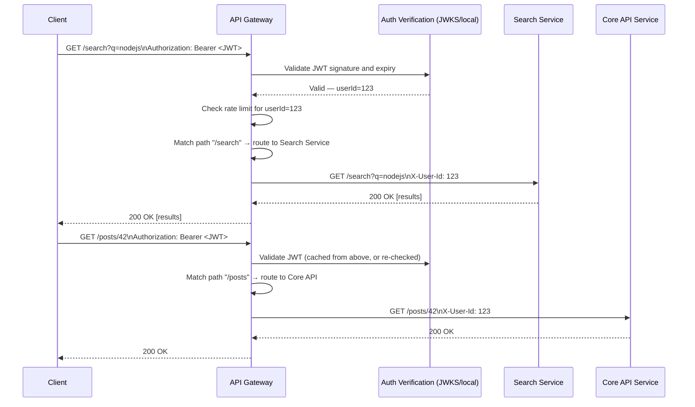
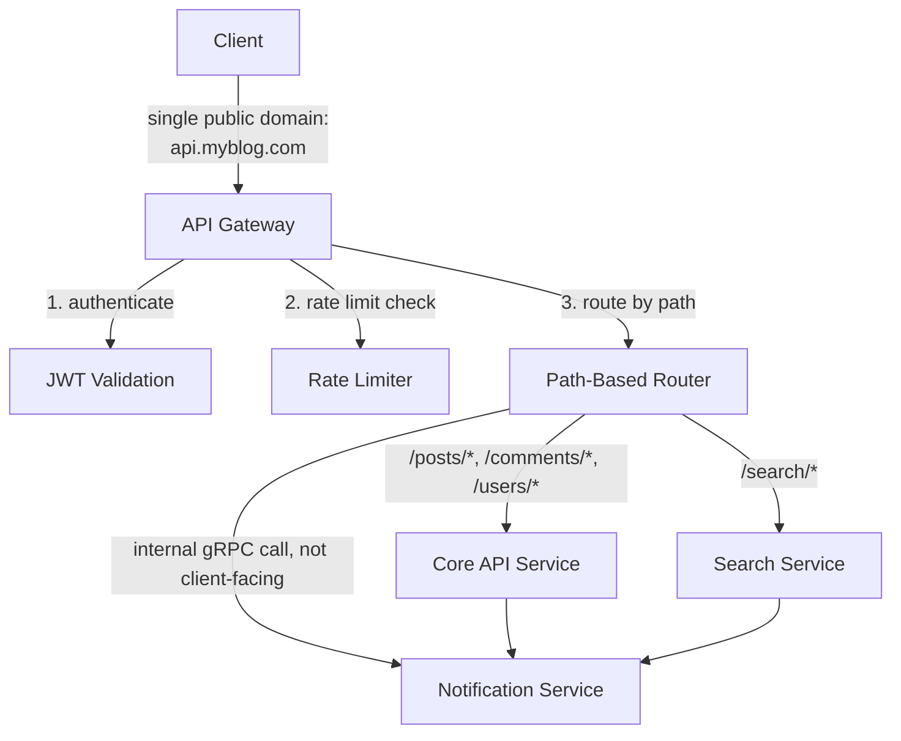
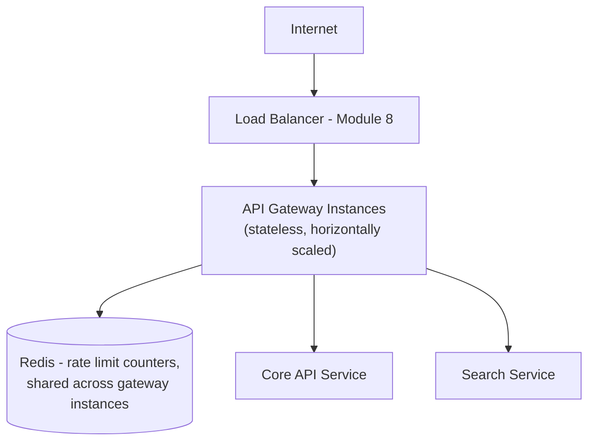
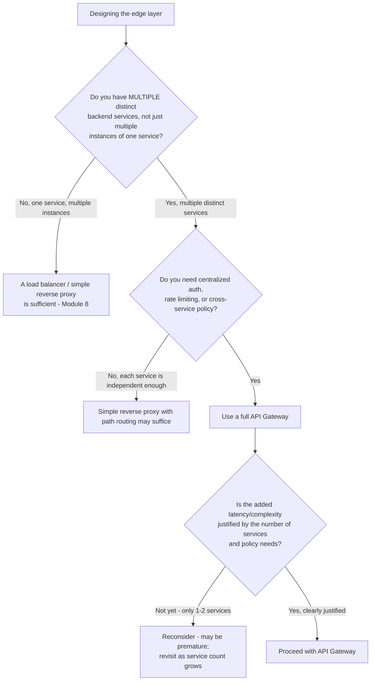
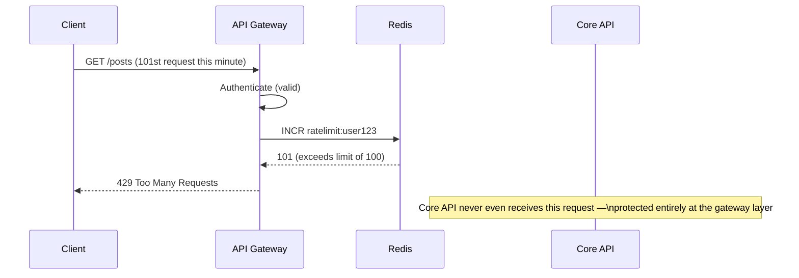
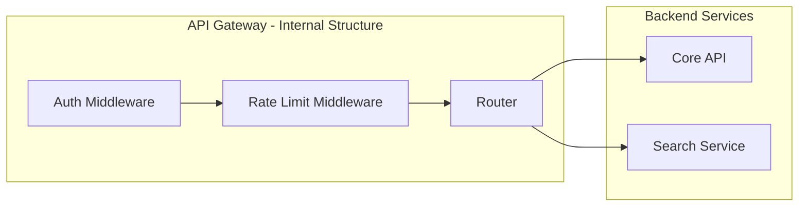

# Module 9 — Reverse Proxy & API Gateway

> **Masterclass:** System Design Masterclass (30 Modules)
> **Level:** Intermediate
> **Audience:** Node.js backend developers, SDE‑2 / Senior Backend interview candidates, engineers transitioning into architecture roles
> **Prerequisite:** Modules 1–8 (System Design Intro through Load Balancing)

---

## 1. Introduction

Module 8 gave the load balancer a precise job: distribute traffic across healthy, interchangeable server instances. But real systems need more than traffic distribution — they need a place to terminate TLS, enforce authentication once instead of in every service, rate-limit abusive clients, and route different kinds of requests to entirely different backend systems (not just different instances of the *same* backend). This module introduces the reverse proxy and its more sophisticated descendant, the API Gateway — the layer that handles all of this, and which becomes indispensable the moment your backend stops being "one kind of server" and becomes several.

This module also directly sets up Module 16 (Microservices), where "route `/users/*` to the User Service and `/orders/*` to the Order Service" becomes a core architectural necessity, not just a convenience.

---

## 2. Learning Objectives

By the end of this module, you will be able to:

1. Define **reverse proxy** precisely, and distinguish it from a forward proxy.
2. Explain how an **API Gateway** extends reverse proxy functionality with authentication, rate limiting, and routing across distinct backend services.
3. Explain **why Nginx** is commonly used as a reverse proxy, and what specific problems it solves at the edge.
4. Design **routing rules** that direct different request types to different backend services.
5. Implement **authentication centralization** at the gateway layer, and understand its trade-offs versus per-service auth.
6. Implement basic **rate limiting** at the gateway layer, distinguishing it from Module 21's deeper algorithmic treatment.
7. Recognize when an API Gateway is warranted, versus when it's premature complexity for a small system.

---

## 3. Why This Concept Exists

Module 8's load balancer solves "many identical servers, one traffic distribution decision." But as a system grows, backends stop being identical. You might have a REST API service, a WebSocket service (Module 4), a static asset server, and eventually — as Module 16 will formalize — several independent microservices, each responsible for a different business capability (users, orders, payments). Someone has to decide, for every incoming request, *which* of these systems should handle it, and to enforce policies (authentication, rate limits, request logging) that shouldn't have to be reimplemented identically inside every single one of those systems.

The reverse proxy and API Gateway exist to be that "someone" — a single, deliberate architectural chokepoint where routing and cross-cutting concerns are handled once, consistently, instead of being duplicated (and inevitably drifting out of sync) across every backend service.

---

## 4. Problem Statement

> Our blog platform is evolving beyond a single monolithic backend: we're introducing a separate **Search Service** (Module 23 preview) for full-text post search, a **Notification Service** (Module 4's gRPC-based service), and keeping the original **Core API** for posts/comments/users. All three need: consistent authentication (a request shouldn't need to separately prove its identity to each service), a single public domain (`api.myblog.com`) routing to the correct internal service based on path, and protection from abusive clients sending excessive requests. Design the layer that provides this.

---

## 5. Real-World Analogy

**A reverse proxy is a company's front desk receptionist who receives every visitor and internal delivery, and forwards each to the correct internal department — but visitors experience it as "one building," never seeing the internal departmental structure.** A visitor doesn't need to know that the accounting department is on floor 3 and shipping is in a separate building across the parking lot; the receptionist figures that out and routes them correctly, and every visitor uses the exact same front door.

**An API Gateway is that receptionist, but empowered to also check ID at the door (authentication), enforce "no more than 3 visits per hour per visitor" (rate limiting), and keep a single visitor log for the entire building (centralized logging)** — rather than each department separately checking ID and keeping its own guest book, with all the duplicated effort and inevitable inconsistency that implies.

**A forward proxy, by contrast, is a corporate IT department's outbound internet filter** — it sits in front of *clients* (employees) making requests *out* to the internet, controlling and monitoring their outbound access, the mirror image of a reverse proxy's role protecting servers from inbound clients. This distinction — direction of protection — is the single cleanest way to keep "forward" vs. "reverse" straight.

---

## 6. Technical Definition

**Reverse Proxy:** A server that sits in front of one or more backend servers, intercepting client requests and forwarding them to the appropriate backend, while presenting a single, unified interface to clients.

**Forward Proxy:** A server that sits in front of clients, forwarding their outbound requests to the internet on their behalf, typically used for access control, caching, or anonymization of the client.

**API Gateway:** A specialized reverse proxy that additionally provides application-layer capabilities such as authentication/authorization, rate limiting, request/response transformation, and routing across multiple distinct backend services (often microservices).

---

## 7. Core Terminology

| Term | Precise Definition | One-line Intuition |
|---|---|---|
| **Upstream** | The backend server(s) a reverse proxy forwards requests to | "What's behind the proxy" |
| **Path-based Routing** | Directing requests to different backends based on URL path prefix | "`/search/*` goes here, `/orders/*` goes there" |
| **Host-based Routing** | Directing requests based on the requested hostname | "`api.example.com` vs. `admin.example.com`" |
| **Authentication Centralization** | Verifying identity once, at the gateway, rather than redundantly in every backend service | "Check ID once at the front door" |
| **Rate Limiting (gateway-level)** | Restricting the number of requests a client can make in a given time window | "No more than N visits per hour" |
| **Request/Response Transformation** | Modifying a request or response as it passes through the gateway (e.g., adding headers, reshaping JSON) | "Translating between what the client expects and what the backend provides" |
| **Service Discovery Integration** | The gateway dynamically learning which backend instances/services are currently available | "An always-current internal directory" |

---

## 8. Internal Working

### How path-based routing actually decides where a request goes

When a request arrives at `api.myblog.com/search?q=nodejs`, the gateway inspects the URL path (`/search`) against a configured routing table, finds a match, and forwards the request — with the path potentially rewritten — to the internal address of the Search Service (e.g., `http://search-service.internal:4000/`). This lookup happens on **every single request**, which is why routing tables are typically simple, fast prefix/pattern matches rather than complex logic — the gateway must not become a bottleneck itself (echoing Module 8's Layer 7 latency trade-off, now applied to a gateway making routing *and* policy decisions, not just load-balancing decisions).

### Why centralizing authentication at the gateway is powerful — and its real trade-off

**Without gateway-level auth:** the Core API, Search Service, and Notification Service would each need to independently validate a JWT (Module 20 preview), each maintaining its own copy of validation logic, secret/public key management, and error handling — a direct violation of the "isolate what changes from what stays stable" principle (Module 1, Section 13); if the JWT validation logic needs to change (e.g., rotating signing keys), it must be changed correctly in three separate places.

**With gateway-level auth:** the gateway validates the JWT once, and — if valid — forwards the request to the appropriate backend with the verified identity attached (e.g., via an internal header like `X-User-Id`), which backend services can trust **because they only ever receive traffic that has already passed through the gateway** (enforced via network isolation, Module 3's private-subnet principle — backends should not be independently reachable, bypassing the gateway).

**The real trade-off, stated precisely:** this creates a **trust dependency** — every backend service now implicitly trusts that any request it receives has already been authenticated by the gateway, which means the network path *must* guarantee backends are unreachable except through the gateway (otherwise, a request that bypasses the gateway could forge an `X-User-Id` header and impersonate any user). This is why gateway-level auth is not "set it and forget it" — it requires an accompanying, enforced network topology decision.

```javascript
// Backend service — TRUSTS the gateway's header, does NOT re-validate the JWT itself
app.get('/posts', (req, res) => {
  const userId = req.headers['x-user-id']; // trusted ONLY because network isolation
  // guarantees this request could only have come through the authenticated gateway
  // ... proceed with business logic
});
```

---

## 9. Request Lifecycle

### Mermaid Sequence Diagram — API Gateway Handling Authentication and Routing



**Step-by-step explanation:** notice the client authenticates **once per request** to a single endpoint (the gateway), regardless of which of the three backend services ultimately handles it — this directly resolves Section 4's stated requirement ("a request shouldn't need to separately prove its identity to each service") and demonstrates path-based routing sending semantically different requests to entirely different internal systems, not just different instances of one system (the key distinction from Module 8's load balancing).

---

## 10. Architecture Overview



**HLD-level insight:** notice the **Notification Service is not directly reachable from the gateway's client-facing routing table** — it's called internally, service-to-service (Module 4's gRPC pattern), by the Core API when needed (e.g., "a new comment was posted, notify the post's author"). This is a deliberate architectural distinction: **not every internal service needs to be, or should be, exposed through the public API Gateway** — some exist purely to serve other internal services, and exposing them unnecessarily widens the attack surface (Module 20) for no benefit.

---

## 11. Capacity Estimation

**Scenario:** Estimating the added latency overhead the gateway itself introduces, given our established 5,000 req/s peak load (Module 7/8).

**Step 1 — Per-request gateway overhead (illustrative, based on typical gateway processing):**
```
JWT validation: ~0.5ms (cryptographic signature check)
Rate limit check (Redis lookup, Module 21 detail): ~0.5ms
Routing decision: ~0.1ms (simple pattern match)
Total added latency: ~1.1ms per request
```

**Step 2 — Compare against typical end-to-end request latency (e.g., 50ms for a cached read, per Module 7's numbers):**
```
1.1ms / 50ms ≈ 2.2% latency overhead
```

**Conclusion:** the gateway's added latency is a small, generally acceptable fraction of total request time for this workload — but this number should always be **measured**, not assumed, especially as authentication logic grows more complex (e.g., checking permissions against a database rather than just validating a JWT signature) or as rate limiting logic becomes more sophisticated (Module 21). This is exactly the kind of number worth stating explicitly in an interview to justify that the gateway isn't a naive, unaccounted-for tax on every request.

---

## 12. High-Level Design (HLD)



**Why the gateway sits *behind* the load balancer, not instead of it:** the load balancer (Module 8) still handles the job it's good at — distributing traffic across multiple, redundant, horizontally-scaled gateway instances (the gateway itself must be stateless and scalable, exactly per Module 2's principles, since it's now a critical, high-traffic chokepoint) — while the gateway handles the job *it's* good at (routing across different backend services, centralized policy enforcement). These are complementary layers, not competing ones, and conflating them is a common conceptual error worth explicitly avoiding in an interview.

---

## 13. Low-Level Design (LLD)

### Example gateway routing and rate-limiting logic (Node.js, using `express` as a simplified gateway)

```javascript
const express = require('express');
const { createProxyMiddleware } = require('http-proxy-middleware');
const jwt = require('jsonwebtoken');
const redis = require('./redisClient');

const app = express();

// 1. Authentication middleware — applied to ALL routes, once
async function authenticate(req, res, next) {
  const token = req.headers.authorization?.split(' ')[1];
  if (!token) return res.status(401).json({ error: 'Missing token' });
  try {
    const payload = jwt.verify(token, process.env.JWT_PUBLIC_KEY);
    req.userId = payload.sub;
    next();
  } catch (err) {
    res.status(401).json({ error: 'Invalid or expired token' });
  }
}

// 2. Rate limiting middleware — simple fixed window (Module 21 covers this deeply)
async function rateLimit(req, res, next) {
  const key = `ratelimit:${req.userId}`;
  const count = await redis.incr(key);
  if (count === 1) await redis.expire(key, 60); // 1-minute window
  if (count > 100) return res.status(429).json({ error: 'Rate limit exceeded' });
  next();
}

app.use(authenticate);
app.use(rateLimit);

// 3. Path-based routing to distinct backend services
app.use('/search', createProxyMiddleware({
  target: 'http://search-service.internal:4000',
  changeOrigin: true,
  onProxyReq: (proxyReq, req) => proxyReq.setHeader('X-User-Id', req.userId),
}));

app.use(['/posts', '/comments', '/users'], createProxyMiddleware({
  target: 'http://core-api.internal:3000',
  changeOrigin: true,
  onProxyReq: (proxyReq, req) => proxyReq.setHeader('X-User-Id', req.userId),
}));

app.listen(8080);
```

**LLD-level design notes:** authentication and rate limiting are implemented as **middleware applied before routing** — meaning no request reaches any backend service without first passing both checks, precisely enforcing the "trust dependency" described in Section 8. The `X-User-Id` header injection is the exact mechanism backends rely on to trust identity without re-validating the JWT themselves.

---

## 14. ASCII Diagrams

```
BEFORE: EACH SERVICE HANDLES AUTH INDEPENDENTLY (duplicated, drift-prone)

  Client ──▶ Core API      [validates JWT itself]
  Client ──▶ Search Service [validates JWT itself — separately implemented]
  Client ──▶ Notification   [validates JWT itself — separately implemented]

  (3 independent JWT validation implementations — a key rotation
   requires updating all 3, correctly, in sync)


AFTER: CENTRALIZED AT THE GATEWAY

  Client ──▶ [API Gateway: validates JWT ONCE] ──┬──▶ Core API (trusts X-User-Id)
                                                   ├──▶ Search Service (trusts X-User-Id)
                                                   └──▶ Notification (trusts X-User-Id)

  (1 validation implementation — a key rotation requires updating exactly 1 place)
```

---

## 15. Mermaid Flowcharts

### Decision Flow: Do You Need an API Gateway, or Is a Simple Reverse Proxy Enough?



---

## 16. Mermaid Sequence Diagrams

*(Section 9 covers the canonical gateway authentication/routing sequence diagram. Additional diagram below.)*

### Rate Limit Exceeded Flow



**Why this matters architecturally:** the Core API service is **completely shielded** from this abusive traffic — it never spends a single CPU cycle or database connection handling the 101st request, because the gateway rejected it before any routing occurred. This is a direct, concrete illustration of why centralizing rate limiting at the gateway protects *every* downstream service simultaneously, rather than requiring each to implement its own defense.

---

## 17. Component Diagrams



**Why middleware order matters, precisely:** authentication runs **before** rate limiting in this design — this is a deliberate choice: rate limiting by `userId` requires knowing who the user *is*, which only exists after successful authentication. An alternative design might rate-limit by IP *before* authentication (to protect against unauthenticated request floods, e.g., login endpoint abuse) — the correct ordering depends on what you're protecting against, and a mature gateway often applies **both**, at different stages, for different threat models (deepened in Module 20 and Module 21).

---

## 18. Deployment Diagrams

```mermaid
flowchart TB
    subgraph Public Entry
        LB[Load Balancer]
    end
    subgraph Gateway Tier - stateless, autoscaled
        GW1[Gateway Instance 1]
        GW2[Gateway Instance 2]
        GW3[Gateway Instance 3]
    end
    subgraph Shared State
        Redis[(Redis - rate limit counters)]
    end
    subgraph Backend Services - private subnet, NOT independently internet-reachable
        Core[Core API]
        Search[Search Service]
    end
    LB --> GW1 & GW2 & GW3
    GW1 & GW2 & GW3 --> Redis
    GW1 & GW2 & GW3 --> Core
    GW1 & GW2 & GW3 --> Search
```

**Deployment-level note, critical to the whole module's trust model:** backend services are placed in a private subnet with **no direct route from the public internet or load balancer** — only the gateway tier can reach them (Module 3's network isolation principle, now applied specifically to enforce the "backends trust the gateway's auth" assumption from Section 8). Without this network-level enforcement, the entire centralized-auth trust model would be merely conventional, not actually secure — anyone who discovered a backend's internal address could bypass the gateway entirely.

---

## 19. Network Diagrams

```
  Internet
     │
  ┌──▼─────────────┐   Public Subnet
  │  Load Balancer   │
  └──┬─────────────┘
     │
  ┌──▼─────────────┐   Public/DMZ Subnet
  │   API Gateway     │  (the ONLY layer that can reach backend services)
  └──┬─────────────┘
     │  Private subnet — NO route from Load Balancer or Internet directly
  ┌──▼──────┬─────────┐
  ▼         ▼         ▼
[Core API][Search][Notification]  ← unreachable except via Gateway's private route
```

**This diagram is the network-level enforcement of Section 8's trust dependency** — it's not merely a "please only use the gateway" convention; it's a hard, structural guarantee (via security groups/subnet routing, Module 3) that no request can reach a backend service without first passing through the gateway's authentication and rate-limiting middleware.

---

## 20. Database Design

The gateway itself is typically stateless (Section 12), but its **rate limiting state** (Section 13's Redis counters) is a small but important exception worth designing deliberately:

```
Key design: ratelimit:{userId}:{window}
Example:    ratelimit:123:2026-07-04T14:35
```

**Why include the time window in the key** rather than relying solely on TTL: this makes each time window's counter a genuinely distinct key, simplifying reasoning about exactly when a given count resets, and avoids subtle bugs where a `TTL`-only approach could behave unexpectedly under clock skew or Redis restarts (Module 21 goes much deeper into sliding window vs. fixed window rate limiting algorithms — this module only needs the basic mechanism).

---

## 21. API Design

A well-designed API Gateway should present a **clean, unified API surface to clients**, regardless of how many internal services actually implement it:

```
Client-Facing (unified, via Gateway):
  GET  /posts/:id
  GET  /search?q=...
  POST /comments

Internally (hidden from clients):
  Core API:         http://core-api.internal:3000/posts/:id, /comments
  Search Service:   http://search-service.internal:4000/search
```

**Why this matters for future flexibility:** if the Search Service is later rewritten, replaced with a third-party solution (e.g., Elasticsearch as a managed service, Module 23), or merged back into the Core API, **the client-facing `/search` endpoint contract doesn't need to change at all** — only the gateway's internal routing configuration does. This is the API-level expression of the same "isolate what changes from what stays stable" principle this module has applied at the auth and routing layers.

---

## 22. Scalability Considerations

| Consideration | Impact |
|---|---|
| Gateway statelessness | Must remain stateless (Module 2) to scale horizontally behind the load balancer — any per-request state (beyond rate-limit counters, externalized to Redis) reintroduces Module 2's stateful-scaling trap |
| Rate limit counter contention | High-traffic users hitting the same Redis key repeatedly can create hot-key contention (Module 7's lessons on hot keys apply here too) |
| Routing table complexity | As service count grows, routing rules must remain simple, fast pattern matches — avoid embedding complex business logic in the gateway itself |
| Gateway as a new bottleneck | Since ALL traffic to ALL services now flows through this one layer, the gateway tier's own capacity must scale ahead of aggregate backend traffic growth |

---

## 23. Reliability & Fault Tolerance

- **The gateway is now a single, critical chokepoint for every backend service** — if it goes down, *all* services become unreachable simultaneously, even if every backend service itself is perfectly healthy. This is a direct, important escalation of Module 1's SPOF principle: centralizing cross-cutting concerns concentrates risk as well as reducing duplication, and the gateway tier must be built with the same (or greater) redundancy rigor as the load balancer tier (Module 8, Section 18).
- **A failing backend service should not take down the gateway itself** — the gateway must implement timeouts and, ideally, circuit-breaking behavior (Module 18 formalizes this) when a specific backend is unresponsive, so that, e.g., a Search Service outage doesn't exhaust the gateway's own connection pool or thread capacity and degrade unrelated Core API traffic passing through the same gateway instances.
- **Rate limiter availability matters too** — if Redis (holding rate-limit counters) becomes unavailable, the gateway must have a defined failure policy: fail open (allow all traffic through, risking abuse) or fail closed (reject all traffic, risking a full outage) — this is a genuine, deliberate trade-off decision, not an oversight to discover during an actual Redis outage.

---

## 24. Security Considerations

- **The gateway is the single most valuable target in the entire architecture** — since it holds authentication logic and has network access to every backend service, a compromise here is far more severe than compromising any individual backend; it warrants the strongest security hardening in the system.
- **Backends must never be reachable except through the gateway** (Section 19) — this isn't optional hardening, it's the structural foundation the entire centralized-auth model depends on.
- **The gateway should validate and sanitize all incoming requests** before forwarding — a natural place to apply basic WAF-style protections (Module 20) once, for all backend services simultaneously.
- **Internal trust headers (`X-User-Id`) must never be settable by the client directly** — the gateway must strip any client-supplied version of this header before setting its own verified value, or a malicious client could simply set `X-User-Id: victim` themselves and bypass authentication entirely.

```javascript
// Critical security step: strip any client-supplied trust headers before setting the verified one
app.use((req, res, next) => {
  delete req.headers['x-user-id']; // never trust a client-supplied version
  next();
});
```

---

## 25. Performance Optimization

- **Cache JWT public keys / JWKS responses** (Module 20 preview) rather than fetching them on every single request — repeated network calls to an identity provider for key material on every request would add significant, avoidable latency.
- **Keep routing table lookups O(1) or O(log n)** (e.g., a trie or hash-map-based prefix match) rather than a linear scan through many rules, especially as the number of backend services grows.
- **Use connection pooling/keep-alive** between the gateway and backend services (Module 4's connection-reuse lesson, applied at yet another layer) to avoid repeated handshake overhead on high-frequency internal calls.

---

## 26. Monitoring & Observability

- **Per-backend-service latency and error rate, as measured at the gateway** — this gives a consistent, centralized view across all services without needing to aggregate disparate per-service dashboards, since every request passes through this one layer regardless of destination.
- **Authentication failure rate** — a spike can indicate either a client-side bug (e.g., expired token handling) or an active credential-stuffing attack attempt.
- **Rate limit rejection rate**, segmented by user/IP — helps distinguish a few abusive clients from a broader, legitimate traffic growth pattern that might instead warrant raising limits.
- **Gateway's own resource utilization and request queue depth** — since it's now the mandatory path for all traffic, its own health must be monitored at least as rigorously as any backend service.

---

## 27. Common Bottlenecks

| Bottleneck | Symptom | Root Cause |
|---|---|---|
| Gateway CPU saturation from cryptographic JWT validation | High latency across ALL services simultaneously | Insufficient gateway tier scaling relative to aggregate traffic (Section 22) |
| Hot rate-limit key contention | Elevated Redis latency for one specific heavy user | Single counter key receiving extremely high concurrent increment volume |
| One backend's slowness degrading unrelated traffic | Search Service outage also slows down Core API requests | No per-backend timeout/circuit breaking at the gateway (Section 23) |
| Routing table misconfiguration | Requests silently routed to the wrong or a nonexistent service | Overlapping or incorrectly ordered path-matching rules |

---

## 28. Trade-off Analysis

> "I chose to **centralize authentication at the API Gateway** rather than in each backend service, optimizing for **consistency and single-point maintainability of auth logic**, at the cost of **creating a hard network-isolation requirement (backends must be unreachable except via the gateway) and concentrating risk into one critical chokepoint**, which is acceptable because the maintenance and consistency benefits at 3+ services outweigh the added deployment/network rigor required."

> "I chose a **fail-open policy for rate limiting** if Redis becomes unavailable, optimizing for **overall service availability during a Redis outage**, at the cost of **temporarily losing abuse protection during that window**, which is acceptable because a brief window of unmitigated (but not certain) abuse risk is preferable to a full, guaranteed outage of every backend service caused by a single Redis dependency failure."

---

## 29. Anti-patterns & Common Mistakes

1. **Introducing a full API Gateway for a single monolithic service** — Section 15's decision flow directly flags this: if there's only one backend service, a simple reverse proxy or the load balancer from Module 8 alone is sufficient, and a full gateway adds latency and operational complexity without a corresponding benefit.
2. **Trusting a client-supplied identity header without stripping it first** (Section 24) — a critical, easily-missed security vulnerability that completely undermines centralized authentication.
3. **Allowing backend services to remain independently reachable from the internet** alongside the gateway — silently defeats the entire centralized-security model, since attackers can simply bypass the gateway.
4. **No defined failure policy for the rate limiter's backing store** — discovering during a real Redis outage that the gateway either fails open or closed, without that having been a deliberate decision, is a preventable operational surprise.
5. **Embedding complex business logic in gateway routing rules** — the gateway should route and enforce cross-cutting policy, not make business decisions; business logic belongs in the backend services themselves.
6. **No per-backend timeout/isolation**, allowing one slow or failing service to degrade the gateway's ability to serve unrelated traffic to healthy services (Section 23).

---

## 30. Production Best Practices

- Introduce an API Gateway **only once you have multiple distinct backend services** with a genuine need for centralized cross-cutting policy — not preemptively for a single-service system.
- **Enforce network isolation** so backend services are truly unreachable except through the gateway — a structural, not conventional, guarantee.
- **Always strip client-supplied trust headers** before setting your own verified versions.
- **Define an explicit failure policy** (fail open vs. fail closed) for every dependency the gateway relies on (rate limiter store, auth key provider), and document the reasoning.
- **Apply per-backend timeouts and circuit breaking** so no single backend service's failure can degrade the gateway's ability to serve other, healthy services.
- **Scale the gateway tier proactively**, ahead of aggregate backend traffic growth, since it now sits on the critical path for literally all traffic.

---

## 31. Real-World Examples

- **Netflix's Zuul** (and later, Spring Cloud Gateway) is one of the most well-documented real-world API Gateway implementations, built specifically to handle authentication, routing, and resilience concerns across Netflix's famously large microservices fleet — a direct, large-scale validation of this module's core motivation (Section 3).
- **Kong, AWS API Gateway, and Google Cloud Endpoints** are widely-used managed/open-source API Gateway products, each implementing this module's core capabilities (routing, auth, rate limiting) as productized, configurable infrastructure rather than hand-rolled code — demonstrating that this is a standard, well-established architectural layer, not a niche pattern.
- **Amazon's internal service-oriented architecture transition** (referenced in Module 1) relied heavily on well-defined internal API boundaries, with gateway-like components managing cross-service routing and policy as the number of independent internal services grew from a handful to many thousands — illustrating this module's Section 15 decision flow playing out at real, evolving organizational scale.

---

## 32. Node.js Implementation Examples

### Per-backend timeout and basic circuit breaking (addressing Section 23's isolation requirement)

```javascript
const axios = require('axios');

const circuitState = { search: { failures: 0, open: false, openedAt: null } };
const FAILURE_THRESHOLD = 5;
const OPEN_DURATION_MS = 30000; // 30 seconds before retrying

async function callSearchService(query, userId) {
  const state = circuitState.search;

  // If circuit is open, fail fast WITHOUT even attempting the call — protects the gateway itself
  if (state.open) {
    if (Date.now() - state.openedAt < OPEN_DURATION_MS) {
      throw new Error('Search service circuit open — failing fast');
    }
    state.open = false; // attempt to close the circuit after the cool-down period
  }

  try {
    const res = await axios.get('http://search-service.internal:4000/search', {
      params: { q: query },
      headers: { 'X-User-Id': userId },
      timeout: 2000, // explicit timeout — never let one slow backend hang the gateway indefinitely
    });
    state.failures = 0; // reset on success
    return res.data;
  } catch (err) {
    state.failures++;
    if (state.failures >= FAILURE_THRESHOLD) {
      state.open = true;
      state.openedAt = Date.now();
    }
    throw err;
  }
}
```

**Why this directly resolves Section 23's isolation concern:** once the Search Service fails 5 times in a row, the circuit "opens" and subsequent requests fail **immediately**, without even attempting a network call — meaning the gateway's own resources (connection pool, event loop time) are no longer consumed waiting on a backend that's known to be failing, protecting unrelated traffic to the Core API passing through the same gateway instances. (Module 18 covers the full Circuit Breaker pattern and its states in complete depth — this is a working preview.)

---

## 33. Interview Questions

### Easy
1. What is a reverse proxy, and how does it differ from a forward proxy?
2. What additional capabilities does an API Gateway provide beyond a basic reverse proxy?
3. Why would you centralize authentication at a gateway rather than in each backend service?
4. What is path-based routing, and give an example.
5. Why must backend services be unreachable except through the gateway for centralized auth to actually be secure?
6. When might introducing a full API Gateway be premature for a given system?

### Medium
7. Explain the security risk of trusting a client-supplied `X-User-Id` header without first stripping any client-provided version of it.
8. Design the routing configuration for a system with a Core API, a Search Service, and an internal-only Notification Service.
9. What's the trade-off between "fail open" and "fail closed" for a gateway's rate limiter if its backing store becomes unavailable?
10. Why does centralizing cross-cutting concerns at a gateway also concentrate risk, and how would you mitigate that?
11. Explain why per-backend timeouts at the gateway are necessary even if each individual backend service has its own internal timeout handling.
12. How does an API Gateway's role differ from, and complement, a load balancer's role in the same architecture?

### Hard
13. Design a complete API Gateway architecture for a system with 5 microservices, addressing authentication, rate limiting, routing, per-backend isolation, and gateway tier redundancy.
14. Explain how you would migrate an existing monolith with built-in authentication to a gateway-centralized model with zero downtime and no security regression during the transition.
15. A gateway's JWT validation depends on fetching public keys from an external identity provider on every request, adding significant latency. Redesign this to eliminate the redundant network calls without sacrificing key rotation support.
16. Design a circuit-breaking strategy for a gateway routing to 5 backend services, ensuring one failing service cannot degrade the gateway's ability to serve the other 4.
17. Discuss the security implications of allowing even one backend service to remain directly internet-reachable "temporarily, for a migration," alongside a otherwise-centralized gateway architecture.

---

## 34. Scenario-Based Design Questions

1. **Scenario:** A backend service was accidentally left with a public IP during a migration, alongside your gateway architecture. Assess the security implications and remediation steps.
2. **Scenario:** Your gateway's JWT validation logic has a bug causing all requests to fail simultaneously. Discuss the blast radius compared to if each service had its own (also buggy) validation logic, and what this implies about testing rigor for gateway-level code.
3. **Scenario:** The Search Service becomes slow (5+ second response times) but not fully down. Users report that even simple `/posts/:id` requests to the unrelated Core API are now also slow. Diagnose and fix.
4. **Scenario:** Your team is building their very first backend service and debates whether to introduce an API Gateway "to be ready for microservices later." Advise them using this module's decision framework.
5. **Scenario:** Redis, backing your rate limiter, goes down for 10 minutes. Walk through what happens under a fail-open vs. fail-closed policy, and which you'd choose for a payments-adjacent API vs. a public blog-reading API.
6. **Scenario:** A client reports that changing their JWT's `sub` claim value in a decoded, re-encoded (unsigned) token lets them impersonate another user. Diagnose the gateway-level vulnerability.
7. **Scenario:** You need to add a 4th backend service (a Recommendations Service) to your existing gateway architecture with zero downtime for existing traffic. Walk through your deployment approach.
8. **Scenario:** Your gateway tier's CPU usage is dominated by JWT signature verification under high traffic. Propose two different optimizations.
9. **Scenario:** An engineer proposes removing the gateway and letting each service handle its own auth again, "for simplicity and lower latency." Evaluate this trade-off given your current 3-service architecture.
10. **Scenario:** A rate limit configured per-user is being trivially bypassed by an attacker creating many new accounts. Propose an additional layer of protection at the gateway.

---

## 35. Hands-on Exercises

1. Build a minimal Express-based gateway routing two different paths to two different locally-running "backend" servers, verifying correct routing via logging on each backend.
2. Add JWT-based authentication middleware to your gateway from Exercise 1, and verify requests without a valid token are rejected before ever reaching either backend.
3. Add the client-header-stripping security fix (Section 24) and write a test proving a client-supplied `X-User-Id` header is ignored/overwritten, not trusted.
4. Implement basic fixed-window rate limiting (Section 13) using Redis, and verify via a load test that the 101st request within a minute is correctly rejected with a 429.
5. Implement the circuit breaker pattern (Section 32) for one of your two backends, artificially make it fail repeatedly, and verify the gateway stops attempting calls to it (failing fast) after the configured threshold.

---

## 36. Mini Project

**Build:** A complete API Gateway for the blog platform's Core API and a second, simulated Search Service.

**Requirements:**
- Centralized JWT authentication applied to all routes.
- Path-based routing to both backend services.
- Client-supplied trust header stripping (Section 24).
- Basic rate limiting (Section 13), with a defined fail-open or fail-closed policy for Redis unavailability, documented and justified.
- Per-backend request timeout configured explicitly for each proxied route.

**Success criteria:** A request without a valid JWT is rejected at the gateway before reaching any backend; a request exceeding the rate limit is rejected with a 429; and an attempt to spoof `X-User-Id` via a client header is correctly overwritten with the gateway's own verified value.

---

## 37. Advanced Project

**Build:** Extend the Mini Project with circuit breaking, gateway redundancy, and a security audit.

1. Implement the full circuit breaker pattern (Section 32) for both backend routes, with configurable failure thresholds and open-circuit duration, and write an automated test that artificially fails one backend and confirms the circuit opens and the gateway fails fast without attempting further calls.
2. Deploy at least 2 gateway instances behind a simple load balancer (Module 8), sharing the same Redis-backed rate limit state, and verify rate limits are correctly enforced *across* instances (a user shouldn't be able to double their effective rate limit by being routed to different gateway instances).
3. Conduct a **self-audit**: attempt to directly reach a backend service, bypassing the gateway, from outside its private network, and document that this correctly fails — providing empirical, not just diagrammatic, proof of your network isolation.
4. Write a load test that intentionally exceeds the rate limit for a single user and measures the gateway's own latency/CPU impact of rejecting a large volume of over-limit requests, confirming rejection itself remains cheap and doesn't become its own bottleneck.

**Success criteria:** You have working, tested circuit breaking, confirmed cross-instance rate limit consistency, and empirical proof that backend services are genuinely unreachable except through the gateway — setting up Module 10 (CDN), which addresses the next layer outward: how to serve content even faster by moving it physically closer to users, before requests ever reach this gateway at all.

---

## 38. Summary

- A **reverse proxy** sits in front of backend servers and presents a unified interface to clients; an **API Gateway** extends this with authentication, rate limiting, and routing across genuinely distinct backend services.
- **Centralizing authentication** at the gateway eliminates duplicated, drift-prone per-service auth logic, but creates a hard **network-isolation requirement** — backends must be unreachable except through the gateway, or the entire trust model collapses.
- **Client-supplied trust headers must always be stripped** before the gateway sets its own verified version — a critical, easily-missed security control.
- **The gateway becomes the single most critical chokepoint** in the architecture — it requires its own redundancy, per-backend timeout/circuit-breaking isolation, and rigorous monitoring, since its failure affects every service simultaneously.
- **An API Gateway is not always warranted** — for a single monolithic backend, it's premature complexity; it earns its place once multiple distinct services need consistent, centralized cross-cutting policy.

---

## 39. Revision Notes

- Reverse proxy = unified interface in front of backends; Forward proxy = protects/controls outbound client traffic
- API Gateway = reverse proxy + auth + rate limiting + routing across distinct services
- Centralized auth requires: network isolation (backends unreachable except via gateway) + stripping client-supplied trust headers
- Gateway is now a critical SPOF-risk chokepoint — needs its own redundancy, same as the load balancer tier
- Per-backend timeouts/circuit breaking prevent one failing service from degrading the gateway for all other traffic
- Introduce a gateway only once you have multiple distinct services needing centralized policy — not preemptively

---

## 40. One-Page Cheat Sheet

```
SYSTEM DESIGN — MODULE 9 CHEAT SHEET
─────────────────────────────────────
REVERSE PROXY  → unified front door for backend server(s)
FORWARD PROXY  → controls/anonymizes OUTBOUND client traffic (opposite direction)
API GATEWAY    → reverse proxy + auth + rate limiting + multi-service routing

CENTRALIZED AUTH REQUIRES
  ☐ Backends unreachable except via gateway (network isolation, Module 3)
  ☐ Client-supplied trust headers (X-User-Id) ALWAYS stripped before re-setting
  ☐ Gateway tier itself redundant (it's now everyone's single point of failure)

PER-BACKEND ISOLATION
  ☐ Explicit timeout per proxied route
  ☐ Circuit breaker: fail fast after N failures, retry after cool-down

RATE LIMITER FAILURE POLICY — decide explicitly, don't discover during an outage
  Fail OPEN  → availability favored, abuse risk during outage
  Fail CLOSED → security favored, full outage risk during dependency failure

WHEN TO INTRODUCE A GATEWAY
  1 service, multiple instances     → load balancer alone is enough (Module 8)
  Multiple distinct services + need
  for centralized policy            → API Gateway justified
```

---

## Key Takeaways

- The API Gateway is where "many different services" becomes "one coherent, secure, policy-enforced API" — its value grows directly with the number of distinct backend services, and is genuinely unjustified complexity below that threshold.
- Centralizing authentication is only as secure as the network isolation enforcing it — the policy and the network topology must be designed together, not independently.
- Concentrating cross-cutting concerns into one layer concentrates both benefit (no duplication) and risk (one failure affects everyone) — both sides of this trade-off must be actively managed, not just the upside.

## 20 Practice Questions
*(See Section 33 — 6 Easy, 6 Medium, 5 Hard — plus 3 rapid-fire additions:)*
18. Why is failing to strip a client-supplied `X-User-Id` header a complete bypass of gateway-centralized authentication, not just a minor bug?
19. What's the practical difference between rate-limiting by user ID versus by IP address at the gateway, and when would you use each?
20. Why should the gateway's own routing logic avoid embedding real business logic?

## 10 Scenario-Based Questions
*(See Section 34 in full.)*

## 5 Design Assignments
*(See Sections 36–37 — Mini Project and Advanced Project — plus:)*
1. Design a gateway architecture for a food delivery platform with separate Restaurant, Order, and Delivery-Tracking services, including which (if any) should be internal-only.
2. Write a one-page security review of a hypothetical gateway configuration, identifying at least three vulnerabilities from this module's anti-patterns list.
3. Propose a circuit-breaker configuration (thresholds, cool-down duration) for a gateway route to a historically flaky third-party-dependent service, with justification.

## Suggested Next Module

**→ Module 10: CDN** — with routing, authentication, and rate limiting now centralized at the API Gateway, we move one layer further out: how CDNs place content physically closer to users at the network edge, reducing the geographic latency problem first identified back in Module 3, before requests ever reach the gateway or origin infrastructure at all.
