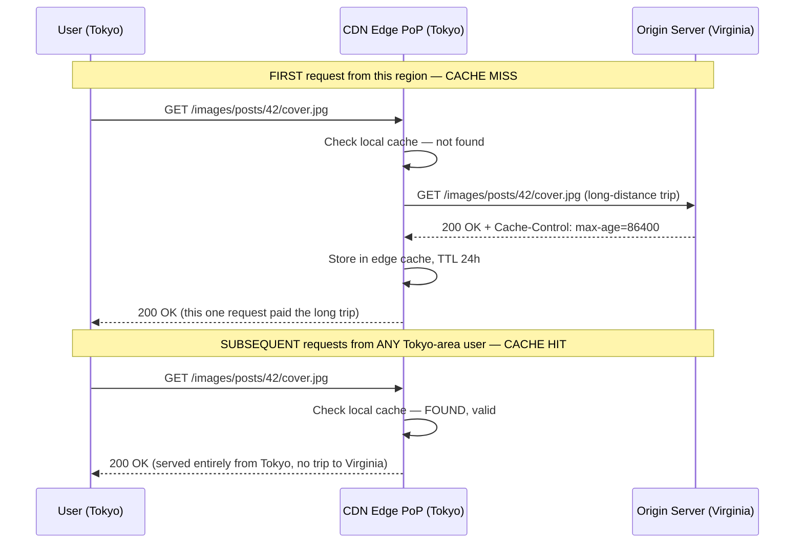
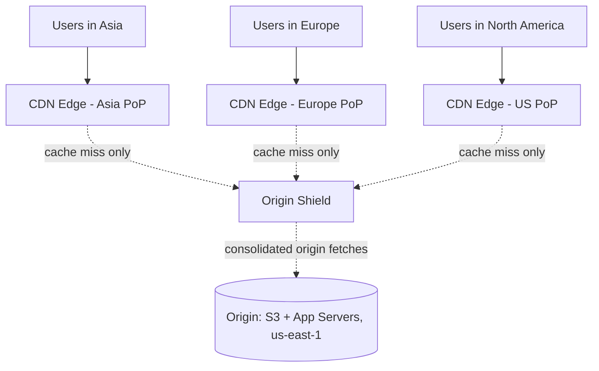
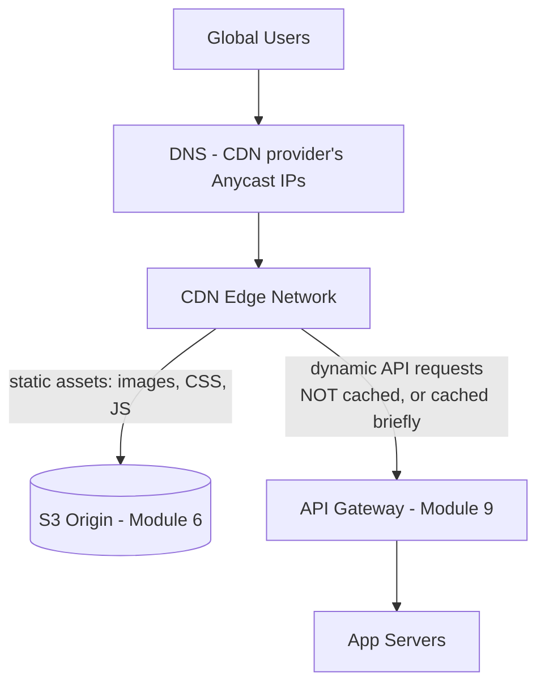
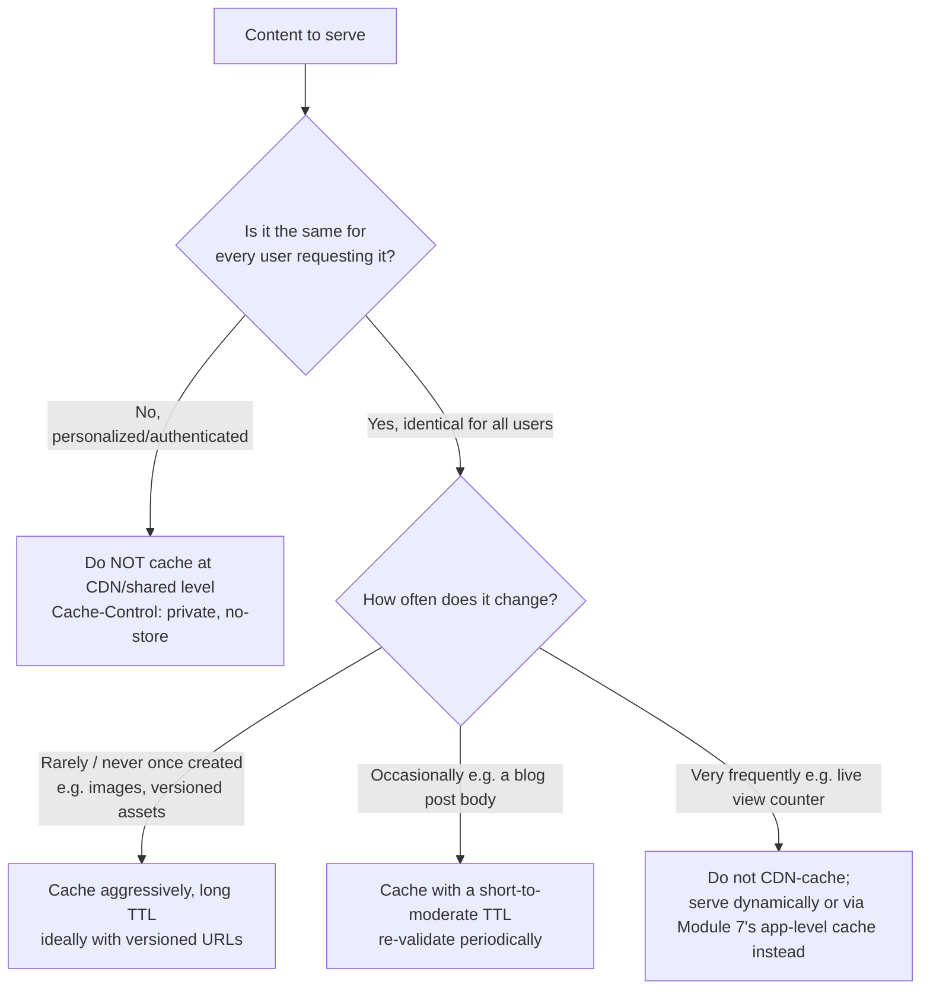
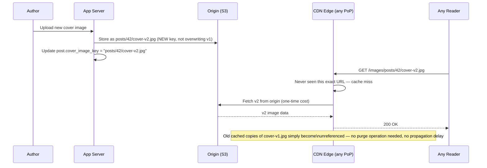
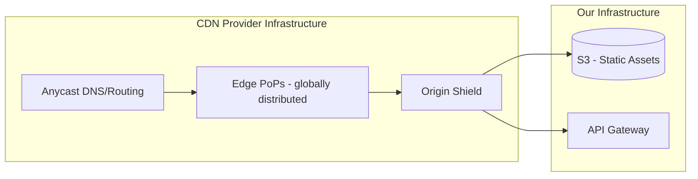

# Module 10 — CDN

> **Masterclass:** System Design Masterclass (30 Modules)
> **Level:** Intermediate
> **Audience:** Node.js backend developers, SDE‑2 / Senior Backend interview candidates, engineers transitioning into architecture roles
> **Prerequisite:** Modules 1–9 (System Design Intro through Reverse Proxy & API Gateway)

---

## 1. Introduction

Module 3 identified a hard, physical truth we've deferred ever since: distance causes latency that no amount of compute scaling, caching, or clever gateway routing can fix, because the speed of light through fiber is a fixed constant, not an engineering variable. A user in Sydney hitting a server in `us-east-1` pays a real, physics-bound round-trip cost no `Least Connections` algorithm or Redis cache can eliminate — because the *server itself*, however fast, is still far away.

This module finally resolves that deferred problem. A CDN (Content Delivery Network) doesn't make your origin server faster — it makes the **distance** shorter, by placing copies of your content at edge locations physically near your users, all around the world. This is the natural companion to Module 7's caching (in fact, a CDN is best understood as caching applied geographically) and directly enables the global, multi-region thinking that later modules (27, 30) build toward.

---

## 2. Learning Objectives

By the end of this module, you will be able to:

1. Explain precisely **why** a CDN reduces latency — grounded in Module 3's physical distance argument, not vaguely.
2. Distinguish **static content caching** (the classic CDN use case) from more advanced **dynamic content acceleration**.
3. Explain **edge servers**, **Points of Presence (PoPs)**, and how a CDN's global distribution actually works.
4. Explain **cache invalidation** at CDN scale, and why it's harder than Module 7's single-cache invalidation problem.
5. Design correct **cache headers** (`Cache-Control`, `ETag`) to control CDN caching behavior precisely.
6. Reason about **origin shielding** and its role in preventing origin overload during cache misses.
7. Recognize when a CDN is the right fix for a latency problem, versus when the actual bottleneck lies elsewhere (Module 3's diagnostic framework, revisited).

---

## 3. Why This Concept Exists

Module 3 established that network latency has a genuine physical floor determined by distance — a round trip between Sydney and Virginia cannot be faster than the time light takes to traverse that path through real fiber-optic cable, regardless of server hardware, code efficiency, or caching at the origin. If your entire user base were in one city, this would never matter. But any product with a global (or even just multi-region) audience runs directly into this constraint, and no technique covered in Modules 1–9 addresses it, because all of them optimize *what happens once a request arrives at your infrastructure* — none of them shorten the physical journey *to* that infrastructure.

CDNs exist specifically to solve this **one problem**: bring a copy of the content physically closer to the requester, so the "long trip" only has to happen once (when the CDN's edge node first fetches from origin), and every subsequent nearby user gets served from a location that's genuinely close to them. This is a direct, deliberate application of Module 7's caching principles, but distributed geographically rather than centrally.

---

## 4. Problem Statement

> Our blog platform serves users worldwide, but all infrastructure lives in a single AWS region (`us-east-1`). Users in Asia and Australia report page loads that feel meaningfully slower than users in North America, even though our application-level metrics (Module 7's cache hit ratio, Module 5's query times) look identical regardless of the requesting region. Additionally, our cover images (Module 6, stored in S3) are requested extremely frequently and are read-heavy, rarely-changing content — ideal caching candidates. Design the solution, and explain specifically why application-level optimizations alone cannot fix the reported regional latency disparity.

---

## 5. Real-World Analogy

**A CDN is a chain of regional distribution warehouses for a company that used to ship every single order directly from one central factory.** If the factory is in Ohio, a customer in Tokyo waits for their package to cross an ocean every single time, no matter how efficient the factory's internal packing process is (that's your application/database optimization — Modules 5–9 — all of which happen *at the factory*, and none of which shorten the ocean crossing). Once the company opens a regional warehouse in Tokyo, stocked with copies of the popular items, most Tokyo customers get their order fulfilled from the nearby warehouse — the long ocean trip only happens once, when the Tokyo warehouse itself restocks from the factory.

This is precisely the distinction between **origin** (the factory — your actual servers) and **edge** (the regional warehouse — a CDN Point of Presence) that this module formalizes.

---

## 6. Technical Definition

**CDN (Content Delivery Network):** A geographically distributed network of proxy servers (edge servers) that cache and serve content from locations physically close to end users, reducing latency by minimizing the physical distance data must travel.

**Edge Server:** A server at a CDN's Point of Presence (PoP), physically located close to end users, that caches and serves content on the CDN provider's behalf.

**Point of Presence (PoP):** A physical data center location where a CDN provider operates edge servers, typically one of many spread across major population centers worldwide.

**Origin Server:** The original, authoritative source server from which a CDN fetches content when it doesn't already have a valid cached copy.

**Cache Invalidation (CDN context):** The process of purging or expiring cached content across some or all of a CDN's globally distributed edge servers, so they stop serving a stale version.

---

## 7. Core Terminology

| Term | Precise Definition | One-line Intuition |
|---|---|---|
| **Static Content** | Content that doesn't change per-request or per-user (images, CSS, JS bundles, videos) | "The same for everyone, every time" |
| **Dynamic Content** | Content that varies per-request or per-user (a personalized feed, an authenticated API response) | "Different depending on who's asking" |
| **Cache-Control Header** | An HTTP header instructing caches (browser, CDN) how and how long to cache a response | "The care label on the package" |
| **TTL (CDN context)** | How long an edge server retains a cached object before re-validating with origin | "Same concept as Module 7, applied at the edge" |
| **Cache Purge / Invalidation** | Explicitly telling the CDN to discard a cached object before its TTL naturally expires | "Recall notice sent to every warehouse" |
| **Origin Shield** | An intermediate caching layer between edge servers and the origin, consolidating cache-miss traffic | "One warehouse that restocks all the others, so the factory isn't hit by every regional warehouse independently" |
| **Anycast Routing** | A networking technique routing a client's request to the topologically/geographically nearest PoP automatically | "Automatically finds you the nearest warehouse" |

---

## 8. Internal Working

### How a CDN actually reduces the latency Module 3 identified

Recall Module 3, Section 11's math: latency is fundamentally a function of physical distance (plus processing time at each hop). A CDN doesn't change the speed of light — it changes **which two points** the long-distance trip happens between. Without a CDN: `[User in Tokyo] ←→ [Origin in Virginia]` — every single request pays the full transoceanic round trip. With a CDN: `[User in Tokyo] ←→ [Edge PoP in Tokyo]` for the vast majority of requests (cache hits), and only `[Edge PoP in Tokyo] ←→ [Origin in Virginia]` on a cache miss — a trip that happens once, then benefits every subsequent nearby user.

This is precisely why Section 4's problem statement is correct that "application-level optimizations alone cannot fix this" — Module 5's query optimization, Module 7's Redis caching, and Module 9's gateway all operate **at the origin**, in Virginia. No matter how fast the origin responds *once the request arrives*, the request and response still have to physically cross the ocean, twice, for every single Tokyo user, until something is placed physically closer to them.

### How Anycast routing finds the nearest PoP

CDN providers typically advertise the **same IP address from many physical locations simultaneously** using a network routing technique called Anycast. Standard internet routing protocols (BGP) naturally direct a user's request to the topologically nearest of these locations, without the user's DNS resolution or application code needing any awareness of geography at all — the network layer itself resolves "nearest" transparently. This is why a CDN can be added to an existing system with minimal application changes: you point your DNS at the CDN, and Anycast handles the rest.

### The harder problem: CDN-scale cache invalidation

Module 7's Redis cache invalidation (delete a key, done) becomes significantly harder at CDN scale. If a blog post's cover image is updated, and that image was cached across **hundreds of edge PoPs worldwide**, invalidation requires either:

1. **Global purge propagation** — explicitly telling every PoP to discard the cached object, which takes real, non-instant time to propagate across a globally distributed system (often seconds, sometimes longer depending on the provider).
2. **Versioned URLs** — instead of invalidating `cover.jpg` in place, generate a *new* URL (`cover-v2.jpg` or `cover.jpg?v=1720000000`) for the updated content, so old cached copies simply become irrelevant (nothing references them anymore) rather than needing to be actively purged.

**Versioned URLs are almost always the superior approach at scale**, precisely because they sidestep the propagation-delay problem entirely — there's no window where some PoPs have purged and others haven't, because you're not purging anything; you're just pointing to a new, never-before-cached URL.

---

## 9. Request Lifecycle

### Mermaid Sequence Diagram — CDN Cache Miss (First Request From a Region), Then Hit



**Step-by-step explanation, directly resolving Section 4:** the very first Tokyo-area request for this image pays the full origin round trip — but every subsequent request, from *any* nearby user, for the next 24 hours (the configured TTL), is served entirely locally. This is precisely why a CDN's benefit compounds with user volume: the more popular a piece of static content is, the higher the fraction of requests served as fast, local cache hits.

---

## 10. Architecture Overview



**Why an Origin Shield, resolving a subtler version of Section 4's problem:** without a shield, if the same cache-miss event happens to occur nearly simultaneously across many different PoPs (e.g., right after a global cache purge, Section 8), **each PoP independently fetches from origin**, potentially causing a mini cache-stampede (Module 7's exact concept) at the origin, multiplied across dozens of PoPs. An **origin shield** is an additional caching layer sitting between edge PoPs and the true origin, consolidating those redundant fetches into far fewer actual origin requests — directly extending Module 7's stampede-protection lesson to a globally distributed caching topology.

---

## 11. Capacity Estimation

**Scenario:** Estimating the latency improvement a CDN provides for our cover images, using Module 3's measured network path data.

**Given (illustrative, based on typical intercontinental network latency):**
```
Tokyo user → us-east-1 origin (direct):  ~180ms round trip
Tokyo user → Tokyo edge PoP (CDN hit):    ~15ms round trip
```

**Step 1 — Latency improvement for cache hits:**
```
180ms - 15ms = 165ms improvement per request (≈ 92% reduction)
```

**Step 2 — Given our cover images are read far more often than written (Module 6's access pattern), and assuming a CDN hit ratio of ~95% for this static content:**
```
95% of image requests: ~15ms (CDN hit)
5% of image requests:  ~180ms (cache miss, full origin trip)
Weighted average: (0.95 × 15) + (0.05 × 180) = 14.25 + 9 = 23.25ms average
```

**Conclusion, tying back to Section 4:** this is a **dramatic, measurable, numbers-backed improvement** — from a guaranteed 180ms for every Tokyo user, to a weighted average of ~23ms — directly and quantifiably resolving the reported regional latency disparity, for exactly the class of content (static, read-heavy, rarely-changing images) a CDN is best suited to.

---

## 12. High-Level Design (HLD)



**HLD-level insight — the critical distinction this module requires you to make:** notice **static assets (images) and dynamic API requests are routed differently** through the same CDN. This directly connects to Section 7's static-vs-dynamic distinction: a CDN excels at caching static content aggressively, but a personalized, authenticated API response (e.g., "this specific user's draft posts") generally **should not** be cached the same way — caching it naively could leak one user's data to another, an important, sometimes underappreciated interview point (deepened in Section 24).

---

## 13. Low-Level Design (LLD)

### Correctly configuring Cache-Control headers for different content types

```javascript
// Static, versioned asset — cache aggressively, for a long time, since the URL itself changes on update
app.get('/images/posts/:id/cover-:version.jpg', (req, res) => {
  res.set('Cache-Control', 'public, max-age=31536000, immutable'); // 1 year — safe because URL is versioned
  res.sendFile(getImagePath(req.params.id, req.params.version));
});

// Dynamic, personalized content — must NOT be cached by shared/CDN caches
app.get('/api/me/drafts', authenticate, (req, res) => {
  res.set('Cache-Control', 'private, no-store'); // never cache this in a SHARED cache
  res.json(getDraftsForUser(req.userId));
});

// Semi-dynamic content that's the same for all users but changes moderately often
app.get('/posts/:id', async (req, res) => {
  const post = await getPost(req.params.id); // Module 7's cache-aside, upstream of this
  res.set('Cache-Control', 'public, max-age=60'); // short TTL — CDN re-validates frequently
  res.json(post);
});
```

**LLD-level design notes:** `immutable` on the versioned image tells browsers/CDNs they never need to re-validate this exact URL at all during its `max-age` — a strong, safe optimization *because* the versioning scheme (Section 8) guarantees this exact URL's content will never change. `private, no-store` on the personalized drafts endpoint is a critical security control (Section 24) — without it, a misconfigured shared CDN cache could theoretically serve one user's private drafts to another user requesting the same path, a serious data leak.

---

## 14. ASCII Diagrams

```
WITHOUT CDN                              WITH CDN

  [User: Tokyo]                            [User: Tokyo]
       │                                        │
       │ 180ms                                  │ 15ms (cache hit)
       ▼                                        ▼
  [Origin: Virginia]                      [Edge PoP: Tokyo]
       ▲                                        │
       │ (only on cache miss,                   │ 180ms (rare, cache miss only)
       │  amortized across many users)          ▼
       └────────────────────────────────  [Origin: Virginia]

  EVERY request pays 180ms                Most requests pay ~15ms;
                                           only the rare miss pays 180ms,
                                           and benefits ALL subsequent
                                           nearby users afterward
```

---

## 15. Mermaid Flowcharts

### Decision Flow: Should This Content Be CDN-Cached?



---

## 16. Mermaid Sequence Diagrams

*(Section 9 covers the canonical CDN miss/hit sequence diagram. Additional diagram below.)*

### Versioned URL Update Flow (Avoiding Invalidation Propagation Delay)



**Why this avoids Section 8's propagation-delay problem entirely:** there is no window where some PoPs serve the old image and others serve the new one due to purge timing — because nothing was ever purged. The new URL was simply never cached anywhere until the first request for it, at which point it's fetched fresh, correctly, everywhere.

---

## 17. Component Diagrams



**Why the Origin Shield sits between all edge PoPs and both origin types:** this single consolidation point protects **both** our static asset origin (S3) and our dynamic API origin (via the Gateway) from the multiplied cache-miss traffic a large, globally distributed PoP network could otherwise generate — a direct architectural application of Section 10's stampede-prevention lesson to two different origin types simultaneously.

---

## 18. Deployment Diagrams

```mermaid
flowchart TB
    subgraph CDN Provider - Managed, Global
        PoP1[PoP: Tokyo]
        PoP2[PoP: Frankfurt]
        PoP3[PoP: Virginia]
        Shield[Origin Shield - single region]
    end
    subgraph Our Origin Infrastructure - us-east-1
        LB[Load Balancer]
        Gateway[API Gateway]
        S3[(S3)]
    end
    PoP1 & PoP2 & PoP3 --> Shield
    Shield --> LB --> Gateway
    Shield --> S3
```

**Deployment-level note:** notice our own infrastructure remains entirely in a **single region** in this diagram — the CDN provider's globally distributed PoPs are what provide the geographic benefit, without requiring us to operate infrastructure in every region ourselves. This is a genuinely important, cost-effective distinction from full multi-region deployment (Module 27+): a CDN solves the *static content and cacheable-response* latency problem globally, at a fraction of the cost and complexity of replicating your entire application stack across regions — though it does **not** solve latency for genuinely dynamic, uncacheable, personalized requests, which still travel to the single origin region regardless.

---

## 19. Network Diagrams

```
  User (Tokyo)
       │
       │  Anycast routing — automatically finds nearest PoP
       ▼
  ┌─────────────────┐
  │  CDN Edge: Tokyo  │  ← "close" in network terms, not just geographic distance
  └─────────┬─────────┘
            │  Only on cache miss — CDN provider's own
            │  optimized backbone network (often faster
            │  than public internet transit)
            ▼
  ┌─────────────────┐
  │  Origin Shield     │
  └─────────┬─────────┘
            │
            ▼
  ┌─────────────────┐
  │  Origin: us-east-1 │
  └─────────────────┘
```

**A subtle but real point worth knowing:** many CDN providers route cache-miss traffic (edge → origin) over their **own private backbone network**, which is often faster and more reliable than the public internet path a direct client-to-origin request would take — meaning even the "rare" cache-miss trip frequently benefits from the CDN's infrastructure, not just the cache-hit trips.

---

## 20. Database Design

CDN caching has one clear database design implication, directly extending Module 6, Section 20's lesson: **store versioned keys/identifiers for CDN-cacheable assets, not mutable ones.**

```sql
ALTER TABLE posts ADD COLUMN cover_image_key VARCHAR(255);
-- Value: "posts/42/cover-v2.jpg" — the VERSION is embedded in the key itself,
-- enabling the versioned-URL CDN strategy from Section 8/16 without any
-- additional schema changes beyond what Module 6 already established.
```

**No new schema pattern is actually required here** — this module's requirement (versioned, immutable object keys) is a direct, natural continuation of Module 6's "store abstract keys, not full URLs" principle; the CDN simply resolves those keys to edge-cached URLs at serve time, and the versioning discipline established for good storage hygiene turns out to be exactly what's needed for effective, invalidation-free CDN caching too.

---

## 21. API Design

```
GET /images/posts/:id/cover-:version.jpg   → long-TTL, immutable, CDN-cached aggressively
GET /posts/:id                              → short-TTL, CDN-cached with re-validation
GET /api/me/drafts                          → private, no-store, NEVER CDN-cached
```

**A critical API design discipline this module introduces:** every endpoint's `Cache-Control` header should be a **deliberate design decision made at the time the endpoint is built**, not an afterthought — Section 13's three examples show three genuinely different, correct choices for three genuinely different content types, and getting this wrong in either direction (caching something personalized, or failing to cache something safely cacheable) has real correctness or performance consequences.

---

## 22. Scalability Considerations

| Consideration | Impact |
|---|---|
| CDN hit ratio | Directly determines what fraction of global traffic bypasses the origin entirely — the single most important CDN-specific metric, mirroring Module 7's cache hit ratio lesson at a geographic scale |
| Origin shield capacity | Must handle the *aggregate* cache-miss traffic across all PoPs combined — sized differently than sizing for total global request volume |
| Versioned asset storage growth | Storing `cover-v1.jpg`, `cover-v2.jpg`, etc. indefinitely (Section 8) grows storage usage over time — a real, if usually minor, cost trade-off for invalidation-free caching, addressable with a lifecycle policy (Module 6) to eventually archive/delete old versions |
| Dynamic content acceleration | Some CDNs offer additional optimizations (TCP/TLS connection reuse at the edge, route optimization) even for uncacheable dynamic content — a more advanced capability beyond basic static caching |

---

## 23. Reliability & Fault Tolerance

- **A CDN adds a genuinely new, large-scale dependency to your system** — if the CDN provider experiences an outage, cached content may become unavailable even though your own origin is perfectly healthy; this is a real trade-off, and major, well-publicized CDN outages have taken down large portions of the internet in the past, precisely because so many independent companies depend on a small number of CDN providers.
- **Origin shields (Section 10) also protect origin reliability** — by consolidating cache-miss traffic, they prevent a global cache-invalidation event (or a novel piece of content going viral) from directly overwhelming the origin with a multiplied version of Module 7's cache stampede problem.
- **Graceful degradation planning:** a well-designed system should consider what happens if the CDN is unreachable — can clients fall back to hitting the origin directly (at the cost of losing the latency benefit, but preserving availability), or does a CDN outage constitute a full outage? This should be a deliberate architectural decision, not an unexamined assumption.

---

## 24. Security Considerations

- **Never allow personalized or sensitive content to be cached at a shared CDN layer** (Section 13's `private, no-store` example) — a misconfiguration here is a genuine, serious data leak risk, since a shared cache serving one user's cached authenticated response to a different user is a real, documented class of production incident.
- **CDNs are also a natural place for DDoS mitigation** — since a CDN's edge network has enormous aggregate capacity distributed globally, it can absorb and filter volumetric attacks before they ever reach your actual origin infrastructure, a valuable security benefit beyond pure latency reduction.
- **Signed URLs / signed cookies** (an extension of Module 6's presigned URL concept) allow a CDN to serve otherwise-private content (e.g., paid video content) only to requests carrying a valid, time-limited signature — combining CDN performance benefits with access control for non-fully-public content.

---

## 25. Performance Optimization

- **Maximize cacheable content's TTL wherever safely possible** — the longer a valid cache entry can live at the edge, the higher your effective hit ratio, directly reducing both latency and origin load.
- **Use versioned URLs for anything that changes** (Section 8) rather than relying on short TTLs and frequent re-validation — this achieves both a *long* TTL (excellent cache efficiency) and *correctness* (no stale content risk) simultaneously, which a short-TTL approach cannot offer as cleanly.
- **Compress assets before they reach the CDN** (gzip/Brotli, echoing Module 1's performance section) — smaller cached objects mean faster edge delivery and reduced bandwidth cost, compounding across every cache hit globally.
- **Consider an origin shield** specifically when you have many PoPs and any risk of correlated cache misses (post-purge, or a newly viral piece of content) that could otherwise stampede the origin (Section 10).

---

## 26. Monitoring & Observability

- **CDN cache hit ratio, per content type/path** — directly analogous to Module 7's per-namespace hit ratio lesson, now applied geographically; a low hit ratio for content you expected to cache well (e.g., due to a misconfigured `Cache-Control` header) is a clear, actionable signal.
- **Per-region latency, measured from real user monitoring (RUM)**, not just synthetic checks from your own region — this is the only way to actually confirm the Section 4 problem is resolved, rather than assumed resolved.
- **Origin request volume, before and after CDN introduction** — a dramatic drop directly quantifies the CDN's real-world load-reduction benefit on your origin infrastructure.
- **CDN provider status and incident history** — since the CDN is now a genuine dependency (Section 23), monitoring its own health/status is a legitimate, necessary operational practice.

---

## 27. Common Bottlenecks

| Bottleneck | Symptom | Root Cause |
|---|---|---|
| Low CDN hit ratio despite cacheable content | Users still experience high latency | Misconfigured or missing `Cache-Control` headers; TTL too short for the content's actual volatility |
| Origin overload after a global purge | Sudden origin traffic spike | No origin shield consolidating multiplied cache-miss traffic across PoPs (Section 10) |
| Stale content served to some users, fresh to others | Inconsistent user experience during an update | Relying on purge propagation instead of versioned URLs (Section 8) |
| Personalized content accidentally cached | One user sees another user's data | Missing or incorrect `private, no-store` directive on authenticated/personalized endpoints (Section 24) |
| CDN outage causing full unavailability | Site down despite healthy origin | No fallback/degradation plan for CDN provider outages (Section 23) |

---

## 28. Trade-off Analysis

> "I chose to **serve cover images via a CDN with versioned URLs** rather than relying on TTL-based expiration and purge requests, optimizing for **cache correctness with zero invalidation propagation delay and maximal achievable TTL**, at the cost of **accumulating multiple stored versions of each image over time**, which is acceptable because storage cost for a few extra image versions per post is negligible compared to the reliability and performance benefit."

> "I chose to **not CDN-cache the `/api/me/drafts` endpoint at all**, optimizing for **correctness and user data privacy**, at the cost of **every request to this endpoint paying full origin latency, including for users far from `us-east-1`**, which is acceptable because personalized, sensitive content must never risk being served to the wrong user, and this endpoint's usage pattern (a user checking their own drafts) doesn't justify the risk for the latency gain."

---

## 29. Anti-patterns & Common Mistakes

1. **Caching personalized or authenticated content at a shared CDN layer** without `private`/`no-store` — a serious, real-world data leak risk (Section 24).
2. **Relying solely on purge requests for frequently-updated content** instead of adopting versioned URLs — introduces unnecessary propagation-delay risk and operational purge-management overhead (Section 8).
3. **Assuming a CDN fixes all latency problems**, including for genuinely dynamic, uncacheable, personalized API responses — a CDN helps enormously with static/cacheable content, but does nothing for content that fundamentally cannot be cached (Section 12's HLD distinction).
4. **No origin shield for a large, many-PoP CDN deployment**, risking a multiplied cache-stampede on the origin after any correlated cache-miss event.
5. **Treating the CDN as a fire-and-forget setup with no monitoring** — a misconfigured `Cache-Control` header can silently produce a near-zero hit ratio for content that should have cached beautifully, with no alert unless hit ratio is actively monitored.
6. **No fallback plan for a CDN provider outage**, discovering only during a real incident that "CDN down" effectively means "entire site down."

---

## 30. Production Best Practices

- **Default to versioned, immutable URLs** for any static asset that can change over its lifetime (images, JS/CSS bundles) — this is the single most robust, scalable caching strategy this module covers.
- **Explicitly set `Cache-Control` on every endpoint**, as a deliberate decision, not a framework default — distinguish clearly between public/cacheable and private/uncacheable content.
- **Use an origin shield** for any CDN deployment with meaningful PoP count and any risk of correlated cache misses.
- **Monitor CDN hit ratio and per-region real-user latency** as first-class, ongoing metrics, not one-time setup verification.
- **Plan explicitly for CDN provider outages** — know whether your system can gracefully fall back to direct origin access, and what the user-facing impact of a CDN outage would be.

---

## 31. Real-World Examples

- **Cloudflare, Akamai, and Amazon CloudFront** are the dominant commercial CDN providers, each operating hundreds of PoPs worldwide — their existence and scale are the direct, large-scale, real-world validation of this module's entire premise (Section 3): geographic latency is a problem significant enough to sustain an entire, massive industry built solely around solving it.
- **A well-documented 2021 Fastly CDN outage** took down a significant portion of the internet (including major news sites and platforms) for roughly an hour, directly illustrating Section 23's reliability trade-off — CDN concentration creates systemic risk at internet scale, not just for any single company relying on it.
- **YouTube and Netflix** rely extensively on CDN-like edge caching infrastructure (Netflix notably operates its own purpose-built CDN, Open Connect, installed directly within ISP networks) specifically for video content delivery — an even more aggressive, purpose-built application of this module's core "move the content physically closer to the user" principle, justified by video's enormous bandwidth demands.

---

## 32. Node.js Implementation Examples

### Generating versioned asset URLs based on content hash (a robust alternative to manual version numbers)

```javascript
const crypto = require('crypto');
const fs = require('fs');

function generateVersionedKey(postId, fileBuffer) {
  const hash = crypto.createHash('sha256').update(fileBuffer).digest('hex').slice(0, 10);
  return `posts/${postId}/cover-${hash}.jpg`; // content-hash-based versioning
}

// Usage during upload confirmation (Module 6, Section 32's flow)
app.post('/posts/:id/cover-image/confirm', async (req, res) => {
  const fileBuffer = await fetchUploadedBytes(req.body.key); // conceptual — actual bytes verification
  const versionedKey = generateVersionedKey(req.params.id, fileBuffer);
  await postRepository.updateCoverImageKey(req.params.id, versionedKey);
  res.status(200).json({ key: versionedKey });
});
```

**Why content-hash-based versioning is even more robust than a simple incrementing version number:** the key is deterministically derived from the file's actual content — identical content always produces the identical key, and any change to the content produces a guaranteed-different key. This eliminates any risk of a race condition around manually incrementing a version counter, and is the same underlying technique widely used by modern frontend build tools (e.g., webpack's content-hashed filenames) for exactly this CDN-caching reason.

---

## 33. Interview Questions

### Easy
1. What is a CDN, and what specific problem does it solve that application-level optimization cannot?
2. What is the difference between an edge server and an origin server?
3. Why does physical distance cause latency that caching at the origin cannot fix?
4. What is a Point of Presence (PoP)?
5. Why should personalized/authenticated content generally not be cached by a shared CDN layer?
6. What is the purpose of an origin shield?

### Medium
7. Explain why versioned URLs are often preferred over purge-based invalidation for CDN-cached content.
8. Design the correct `Cache-Control` header strategy for three different types of content on a typical web application.
9. Why can a CDN outage cause a full site outage even if your own origin infrastructure is completely healthy?
10. Explain how Anycast routing allows a CDN to automatically direct users to their nearest PoP.
11. A CDN's hit ratio for a specific asset type is unexpectedly low. What are two likely root causes, and how would you diagnose between them?
12. Why does a CDN with many PoPs need an origin shield to avoid a variant of the cache stampede problem from Module 7?

### Hard
13. Design a complete CDN caching strategy for an e-commerce site with product images, product descriptions, real-time inventory counts, and personalized shopping carts, justifying the caching approach for each.
14. Explain the specific, concrete risk of caching an authenticated API response at a shared CDN layer, and how you'd detect if this had already happened in a production incident.
15. A company's cover images are updated frequently, and their current CDN strategy relies on short TTLs with frequent re-validation. Propose a redesign using content-hash-based versioned URLs, and quantify the expected hit ratio improvement.
16. Design a graceful degradation strategy for a system whose CDN provider becomes fully unavailable, addressing both static asset delivery and DNS/routing considerations.
17. Discuss how a CDN's DDoS mitigation capability changes the security posture of an origin server that previously had to defend against volumetric attacks directly.

---

## 34. Scenario-Based Design Questions

1. **Scenario:** Users in Australia report slow page loads despite your application metrics showing fast database and cache response times. Diagnose using this module's concepts, distinguishing this from a Module 5/7 problem.
2. **Scenario:** After deploying a CDN, a security audit discovers that one user's personalized dashboard was briefly served to a different user from a shared cache. Diagnose the root cause and propose the fix.
3. **Scenario:** Your CDN's origin experiences a severe traffic spike immediately following a bulk cache-purge operation across all PoPs. Propose an architectural fix.
4. **Scenario:** Your product team wants images to update "instantly" when an author re-uploads a cover photo, with zero risk of stale content anywhere globally. Design the caching/versioning strategy that achieves this.
5. **Scenario:** Your CDN provider experiences a multi-hour global outage. Walk through the user-facing impact on your system and any mitigation you could have pre-built.
6. **Scenario:** An engineer proposes CDN-caching the `/api/me/notifications` endpoint "since it's read far more than written." Evaluate this proposal given the endpoint's personalized nature.
7. **Scenario:** You need to serve a paid, access-restricted video course through a CDN without making it freely downloadable by anyone with the URL. Propose a solution.
8. **Scenario:** Your team is debating whether to invest in a CDN or in full multi-region deployment (Module 27 territory) to address global latency complaints. Compare the cost, complexity, and coverage trade-offs of each, given your current single-region, largely static-content-heavy workload.
9. **Scenario:** A specific blog post goes unexpectedly viral, generating massive simultaneous global read traffic. Walk through how your CDN and origin shield architecture handles this differently than it would have without a CDN.
10. **Scenario:** Your monitoring shows a 98% CDN hit ratio for images but only a 20% hit ratio for the `/posts/:id` JSON endpoint. Is this necessarily a problem? Discuss what further investigation you'd do before concluding either way.

---

## 35. Hands-on Exercises

1. Use browser developer tools to inspect the `Cache-Control` and `Age` (or CDN-specific cache-status) headers on responses from a real, CDN-fronted website of your choice, and identify which content types are cached and for how long.
2. Deploy a simple static asset (e.g., a logo image) behind a free-tier CDN service, set an explicit `Cache-Control` header, and verify (via the CDN's cache-status header, or a change in response time on repeated requests) that subsequent requests are served from cache.
3. Implement content-hash-based versioned URLs (Section 32) for a set of test images, and verify that updating an image's content produces a new URL rather than requiring any purge operation.
4. Deliberately misconfigure a personalized endpoint's `Cache-Control` header to be publicly cacheable, observe (in a controlled test, not production) that a shared cache would serve it identically to different simulated "users," and then correct it with `private, no-store`.
5. Measure and compare response latency for a static asset both with and without CDN fronting, from at least two geographically distant testing locations if possible (e.g., using a cloud-based latency testing tool or VPN to simulate different regions).

---

## 36. Mini Project

**Build:** A CDN-fronted asset delivery layer for the blog platform's cover images (Module 6), using content-hash-based versioning.

**Requirements:**
- Implement content-hash-based versioned key generation (Section 32) for uploaded cover images.
- Configure a CDN (a real free-tier provider, or a locally simulated reverse-proxy cache standing in for one) in front of the image-serving path, with long-TTL, immutable `Cache-Control` headers.
- Verify that re-uploading a modified image produces a new URL, with no purge operation required.
- Explicitly configure and test that a personalized endpoint (e.g., a user's draft posts list) is correctly marked `private, no-store` and is never cached by the CDN layer.

**Success criteria:** You can demonstrate, via cache-status headers or measured latency differences, that repeated requests for the same versioned image are served from cache, while requests to the personalized endpoint are never cached, and updating an image never requires an explicit purge.

---

## 37. Advanced Project

**Build:** Extend the Mini Project with origin shield simulation, hit ratio monitoring, and a graceful degradation plan.

1. Simulate an origin shield locally (e.g., a second caching layer between your "edge" simulation and your true origin) and demonstrate, via logging, that a correlated burst of cache misses across multiple simulated "PoPs" results in only one actual origin fetch, not many.
2. Implement basic CDN hit ratio logging/monitoring for your image-serving path, and run a load test that intentionally includes both cache hits and misses, reporting the resulting measured hit ratio.
3. Write a documented graceful degradation plan (and, if feasible, a working fallback configuration) for what happens if your CDN layer becomes unreachable — can clients fall back to direct origin access, and what's the user-facing latency/availability impact?
4. Conduct a **security test**: attempt to access another simulated "user's" personalized endpoint response from a shared cache after a first user has requested it, and confirm — empirically — that no cross-user data leakage occurs, documenting the specific header configuration that prevents it.

**Success criteria:** You have a working origin-shield simulation with measured, reduced origin load during a correlated cache-miss burst, a documented and at least partially tested graceful degradation plan for CDN outages, and empirical proof that personalized content cannot leak across users through the caching layer — setting up Module 11 (Message Queues), which addresses a different kind of latency and coupling problem: how services communicate asynchronously, without requiring the sender to wait for the receiver at all.

---

## 38. Summary

- A **CDN solves a problem no other technique in this course can**: the physical latency imposed by geographic distance, by placing cached content at edge locations physically close to users.
- **Static, read-heavy, rarely-changing content** (images, JS/CSS bundles) is the ideal CDN caching candidate; **personalized/authenticated content** must generally never be cached at a shared CDN layer, for both correctness and security reasons.
- **Versioned, content-hash-based URLs** are a more robust invalidation strategy than TTL-plus-purge, eliminating propagation-delay risk entirely.
- **Origin shields** extend Module 7's cache-stampede protection to a globally distributed, multi-PoP caching topology.
- **A CDN introduces a new, real dependency** — provider outages have historically caused major, internet-wide impact, and graceful degradation planning is a genuine, necessary architectural consideration, not paranoia.

---

## 39. Revision Notes

- CDN solves DISTANCE-caused latency — no origin-side optimization (caching, query tuning, gateway logic) can substitute for this
- Static/read-heavy/rarely-changing content: cache aggressively, ideally with versioned URLs
- Personalized/authenticated content: `private, no-store` — never shared-cache this
- Versioned URLs > purge-based invalidation — no propagation delay, no correctness window
- Origin shield = Module 7's stampede protection, applied across many PoPs
- CDN outage = real dependency risk — plan graceful degradation explicitly
- Content-hash-based keys are a robust, race-condition-free versioning technique

---

## 40. One-Page Cheat Sheet

```
SYSTEM DESIGN — MODULE 10 CHEAT SHEET
─────────────────────────────────────
CDN solves: DISTANCE-caused latency (a physics problem, not a code problem)
  Origin optimization (DB, cache, gateway) does NOT shorten physical distance

CACHE-CONTROL DECISION TABLE
  Static, same for everyone, rarely changes  → public, max-age=long, immutable + versioned URL
  Same for everyone, changes moderately      → public, max-age=short
  Personalized / authenticated               → private, no-store — NEVER shared-cache

VERSIONED URLS > PURGE-BASED INVALIDATION
  ✓ No propagation delay across PoPs
  ✓ No "some users see old, some see new" window
  ✓ Content-hash-based keys avoid version-counter race conditions

ORIGIN SHIELD
  Consolidates cache-miss traffic across ALL PoPs → protects origin
  from a multiplied, geographically-distributed cache stampede (Module 7)

GOLDEN RULES
  Never CDN-cache personalized/authenticated responses
  Prefer versioned URLs over purge for anything that changes
  Monitor hit ratio + real per-region user latency, not just setup completion
  Plan for CDN provider outages — it's now a real, external dependency
```

---

## Key Takeaways

- A CDN is the one technique in this masterclass that directly addresses the physical, distance-based latency constraint identified back in Module 3 — no amount of origin-side optimization substitutes for it.
- The static-vs-personalized distinction for cacheability is not a performance nuance — getting it wrong on the personalized side is a genuine security and correctness failure, not just a missed optimization.
- Versioned, content-hash-based URLs solve CDN cache invalidation more robustly than purge operations, by eliminating the propagation-delay problem entirely rather than managing it.

## 20 Practice Questions
*(See Section 33 — 6 Easy, 6 Medium, 5 Hard — plus 3 rapid-fire additions:)*
18. Why does a CDN's benefit compound with a piece of content's popularity, rather than providing a flat, fixed improvement per request?
19. What's the difference between a CDN's role in caching static assets and its role in DDoS mitigation — are these related or independent benefits?
20. Why might a CDN provider route cache-miss traffic over its own private backbone rather than the public internet, and why does this matter even for "rare" cache misses?

## 10 Scenario-Based Questions
*(See Section 34 in full.)*

## 5 Design Assignments
*(See Sections 36–37 — Mini Project and Advanced Project — plus:)*
1. Design a complete CDN strategy for a news website distinguishing breaking-news articles (rapidly changing), archived articles (never changing), images, and a personalized "saved articles" feature.
2. Write a one-page incident postmortem (real or hypothetical) for a personalized content leak through a shared CDN cache, including root cause and the specific header fix.
3. Propose a graceful degradation architecture for a hypothetical CDN provider outage affecting a global e-commerce platform, addressing both static assets and checkout flow availability.

## Suggested Next Module

**→ Module 11: Message Queues** — with content delivery now optimized for global users, we turn to a different kind of system design problem entirely: how services communicate asynchronously, decoupling the sender from needing the receiver to be available or fast, right now — the foundation for event-driven architecture (Module 17) and reliable, resilient inter-service communication (Module 18).
