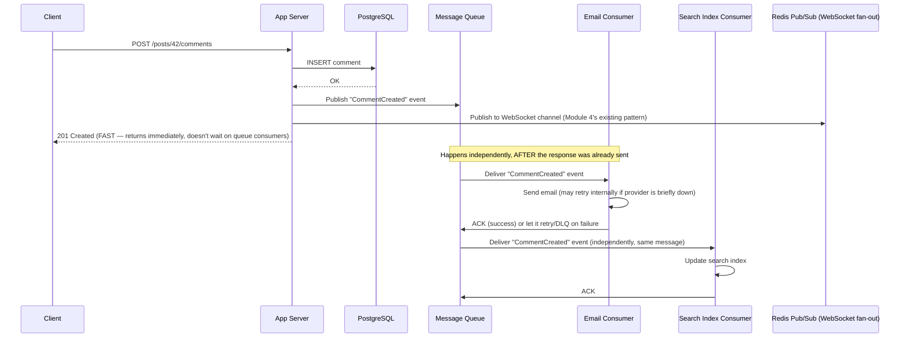
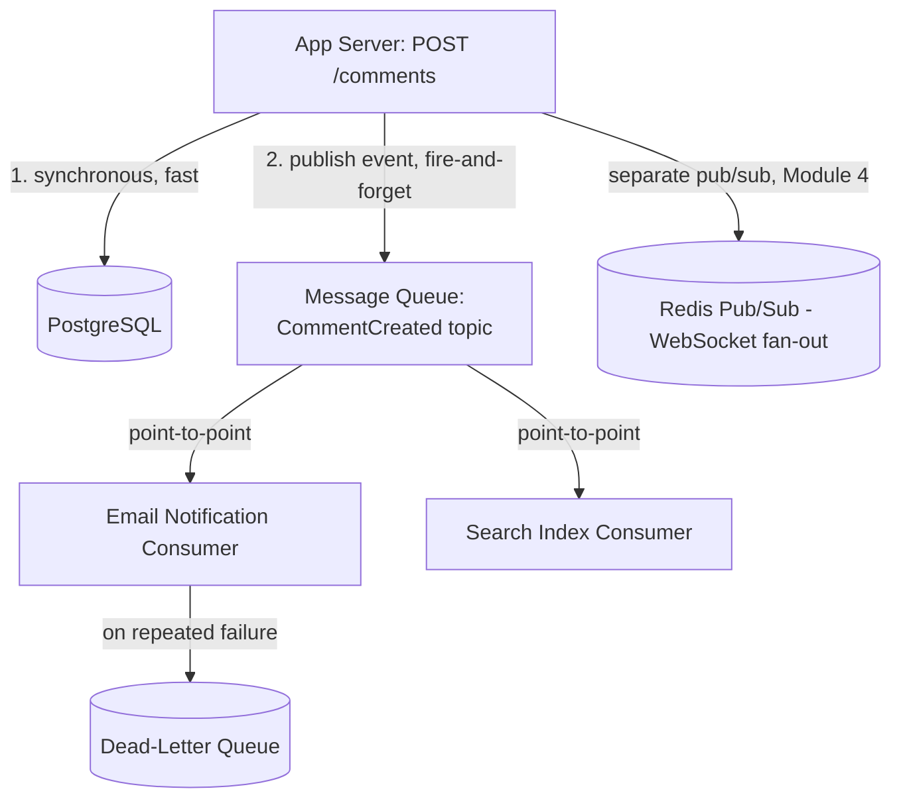
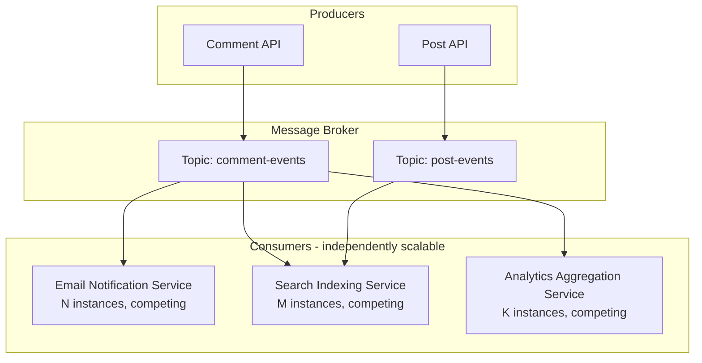
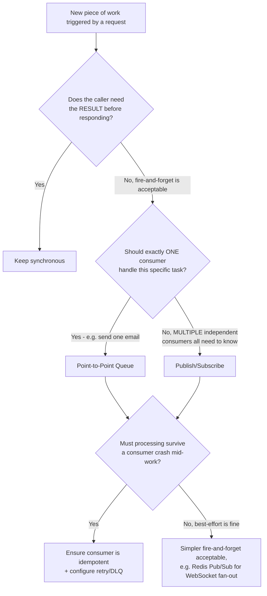
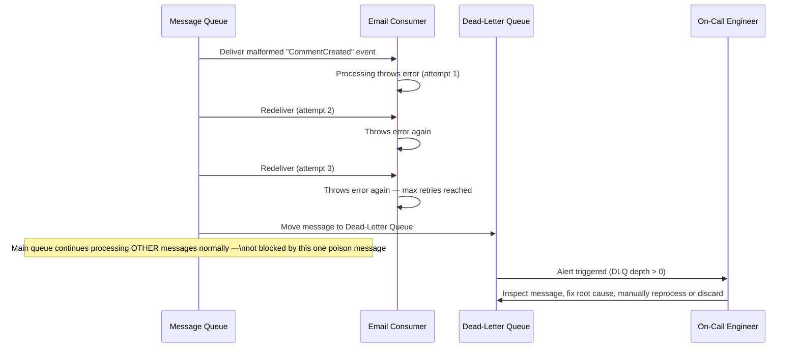
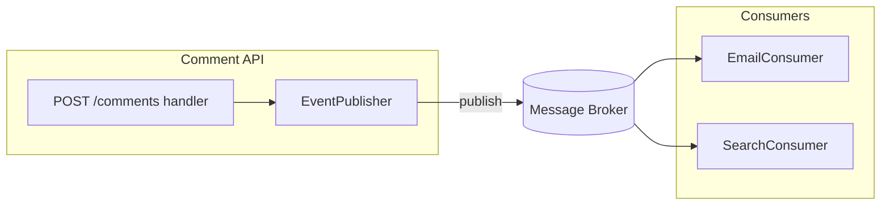
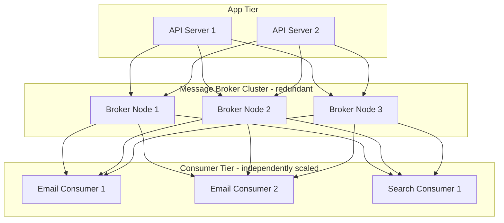

# Module 11 — Message Queues

> **Masterclass:** System Design Masterclass (30 Modules)
> **Level:** Intermediate
> **Audience:** Node.js backend developers, SDE‑2 / Senior Backend interview candidates, engineers transitioning into architecture roles
> **Prerequisite:** Modules 1–10 (System Design Intro through CDN)

---

## 1. Introduction

Every interaction we've designed so far has been **synchronous**: a client sends a request, and waits — through the load balancer (Module 8), the gateway (Module 9), the cache (Module 7), the database (Module 5) — until a response comes back. This model is intuitive and works well for most reads. But it breaks down the moment a request needs to trigger **slow, unrelated, or unreliable work** that the caller shouldn't have to wait for.

If a user uploads a video (Module 6), should their `POST /videos` request hang open for the 90 seconds it takes to transcode it? If posting a comment should trigger an email notification (Module 4's Notification Service) to the post's author, should the comment fail entirely if the email provider is briefly down? Message queues exist to answer "no" to both — decoupling the *triggering* of work from the *completion* of that work, and this module builds the reasoning for exactly when and how to do that safely.

---

## 2. Learning Objectives

By the end of this module, you will be able to:

1. Explain the difference between **synchronous** and **asynchronous** communication, and why asynchronous processing improves both perceived latency and system resilience.
2. Explain the **producer-consumer** model and how a message queue decouples them in time and failure domain.
3. Distinguish **point-to-point queues** from **publish/subscribe (pub/sub)** messaging patterns.
4. Explain **at-least-once**, **at-most-once**, and **exactly-once** delivery semantics, and why "exactly-once" is far harder to achieve than it sounds.
5. Design **idempotent consumers** to correctly handle duplicate message delivery.
6. Explain **dead-letter queues** and their role in handling permanently failing messages.
7. Compare **Kafka, RabbitMQ, and SQS** at a conceptual level, and choose the right one for a given workload.

---

## 3. Why This Concept Exists

Every module so far has implicitly assumed the caller of a service can afford to wait for that service's full response. This is a reasonable assumption for a fast, cacheable read (Module 7). It becomes an increasingly poor assumption as operations get slower, less reliable, or need to trigger multiple independent side effects. If "post a comment" also needs to "send an email," "update a search index" (Module 23), and "notify connected WebSocket clients" (Module 4), doing all four synchronously means the *slowest and least reliable* of the four determines the entire request's latency and failure rate — the comment-posting request now fails if the email provider has a bad day, even though posting the comment itself succeeded perfectly.

Message queues exist to break this coupling. The producer (the comment-posting endpoint) does the minimum necessary synchronous work (save the comment), then hands off everything else as a **message** to a queue and returns immediately. One or more **consumers** process that message independently, on their own time, with their own retry and failure handling — meaning a slow or failing downstream system degrades *its own* processing, not the original user-facing request's latency or success.

---

## 4. Problem Statement

> Our blog platform's `POST /posts/:id/comments` endpoint (Module 4) currently does four things synchronously: saves the comment to PostgreSQL, publishes to Redis Pub/Sub for connected WebSocket clients, calls the Notification Service to email the post's author, and updates a search index (Module 23 preview). Recently, the email provider had a 30-second outage, during which **every comment submission across the entire platform failed**, even though the database and WebSocket delivery were working perfectly. Redesign this flow so that a slow or failing downstream dependency can never cause the core comment-posting action to fail or feel slow to the user.

---

## 5. Real-World Analogy

**A message queue is a restaurant's order ticket rail.** When a waiter takes an order, they don't personally walk into the kitchen, cook the meal, and bring it back before taking the next table's order — they write the order on a ticket, clip it to the rail, and immediately move on to serve other tables. The kitchen staff (consumers) pull tickets off the rail at their own pace and cook each order independently. If the grill briefly breaks down, the waiter can still take new orders — tickets simply pile up on the rail until the grill is fixed, rather than the entire restaurant grinding to a halt because the waiter is standing at a broken grill waiting for it to unstick.

This is precisely the decoupling Section 4 is missing: today, the "waiter" (our API endpoint) personally walks the order to *every* kitchen station (database, WebSocket, email, search index) and waits for all four to finish before serving the next customer — meaning one broken station stalls the entire restaurant.

**Pub/Sub, specifically, is a restaurant with an intercom announcement instead of a single ticket rail** — when the kitchen calls out "Table 5's order is ready," it doesn't matter to the kitchen *how many* staff (the busser, the drink runner, the manager tracking table turnover) are listening for that announcement, or whether any of them are currently busy; each interested party independently hears and acts on the same announcement, at their own pace, without the kitchen needing to know or care who's listening.

---

## 6. Technical Definition

**Message Queue:** A form of asynchronous service-to-service communication in which messages are stored in a queue until they are processed and deleted by a consumer, decoupling the producer's and consumer's timing and failure characteristics.

**Producer:** A service or component that creates and sends messages to a queue.

**Consumer:** A service or component that receives and processes messages from a queue.

**Point-to-Point Queue:** A messaging pattern where each message is delivered to and processed by exactly one consumer, even if multiple consumers are listening (they compete for messages).

**Publish/Subscribe (Pub/Sub):** A messaging pattern where each published message is delivered to **every** subscriber interested in that message's topic/channel, not just one.

**Dead-Letter Queue (DLQ):** A separate queue where messages that repeatedly fail processing are routed, so they can be inspected or retried manually rather than blocking or being silently lost.

---

## 7. Core Terminology

| Term | Precise Definition | One-line Intuition |
|---|---|---|
| **Asynchronous Processing** | Work performed independently of, and without blocking, the original request/response cycle | "Do it later, don't make them wait" |
| **Decoupling** | Reducing direct dependency between components so one's failure/slowness doesn't propagate to the other | "One broken station doesn't stall the restaurant" |
| **At-Least-Once Delivery** | A message is guaranteed to be delivered, but may be delivered more than once | "You'll get it — maybe more than once" |
| **At-Most-Once Delivery** | A message is delivered zero or one times — never duplicated, but may be lost | "You might get it once, or not at all" |
| **Exactly-Once Delivery** | A message is delivered precisely once, never duplicated, never lost | "The theoretical ideal — genuinely hard to guarantee end-to-end" |
| **Idempotent Consumer** | A consumer designed so processing the same message multiple times produces the same result as processing it once | "Doing it twice = doing it once" (echoes Module 4's HTTP idempotency lesson) |
| **Backpressure** | A mechanism preventing a producer from overwhelming a queue/consumer faster than it can be processed | "Slow down, the kitchen can't keep up" |
| **Message Acknowledgment (ACK)** | A consumer's explicit signal to the queue that a message was successfully processed and can be removed | "Order ticket marked complete, safe to discard" |

---

## 8. Internal Working

### Why "exactly-once" delivery is genuinely hard, not just a configuration setting

It's tempting to think a message queue could simply guarantee "each message processed exactly once" as a feature you enable. In reality, this requires solving a fundamentally hard distributed systems problem: what happens if a consumer processes a message, but **crashes after processing it but before acknowledging it**? The queue has no way to know whether the work was actually completed — from its perspective, an unacknowledged message might mean "never processed" or "processed, but the ACK was lost." The only safe assumption a queue can make is to **redeliver** the message, which means the consumer might process it again — this is precisely why **at-least-once delivery** (with the possibility of duplicates) is the realistic, commonly-implemented guarantee, and true exactly-once semantics require the *consumer itself* to be idempotent (Section 9's example), effectively achieving exactly-once *processing outcomes* even though delivery itself is at-least-once. Systems claiming "exactly-once" almost always mean this composite guarantee, not a magic queue-level property.

### Point-to-point vs. pub/sub, mechanically

In a **point-to-point queue**, if 3 consumer instances are all listening to the same queue, a given message is delivered to **exactly one** of them — they compete for messages, which is precisely the mechanism that enables horizontal scaling of consumers (add more consumer instances to process a growing backlog faster, echoing Module 2's horizontal scaling principle, now applied to message processing capacity).

In **pub/sub**, if 3 subscribers are all listening to the same topic, a given published message is delivered to **all three**, independently. This is exactly the mechanism Module 4, Section 12 already used for the WebSocket comment fan-out (Redis Pub/Sub) — each WebSocket server instance needed to independently receive *every* new comment event, not compete for who gets it.

**Section 4's four side effects require different patterns for different needs:** WebSocket fan-out needs pub/sub (every connected server must know); email sending and search indexing are naturally point-to-point (only one consumer needs to actually process each comment for these specific tasks) — recognizing which pattern each use case actually needs is a core, testable system design skill this module builds.

### How a dead-letter queue prevents a "poison message" from causing infinite retries

If a message is fundamentally malformed or triggers a bug that always fails (a "poison message"), a naive retry-forever policy would have the consumer attempt, fail, and retry that **same** message endlessly — potentially blocking the queue from making progress on messages behind it, or consuming resources indefinitely. A **dead-letter queue** configuration specifies: after N failed processing attempts, move the message to a separate DLQ instead of retrying again — the main queue keeps flowing, and the problematic message is preserved (not silently dropped) for manual inspection or a separate, deliberate reprocessing attempt later.

---

## 9. Request Lifecycle

### Mermaid Sequence Diagram — Decoupled Comment Posting (Resolving Section 4)



**Step-by-step explanation, directly resolving Section 4:** the client receives `201 Created` **immediately after the database write and message publish** — it never waits for the email or search indexing to complete. If the email provider is down for 30 seconds, the `EmailConsumer` simply retries (or the message sits safely in the queue) for those 30 seconds — the comment-posting endpoint itself is completely unaffected, exactly resolving the reported incident.

---

## 10. Architecture Overview



**HLD-level insight:** notice this diagram uses **two different asynchronous mechanisms** for two different needs — the durable message queue (with retry and DLQ semantics) for work that must eventually, reliably complete (email, search indexing), and the existing lightweight Redis Pub/Sub (Module 4) for the WebSocket fan-out, where a missed message (a client briefly disconnected) is a much lower-stakes, more tolerable failure than a lost email or un-indexed comment. **Not every asynchronous need requires the same tool** — this distinction is a frequently tested, nuanced interview point.

---

## 11. Capacity Estimation

**Scenario:** Estimating the queue throughput needed for our comment-posting event at peak load.

**Given:** 500 comments/second at peak (a reasonable extrapolation from our established 5,000 req/s overall peak, Module 7).

**Step 1 — Messages published per second:**
```
500 comments/sec × 1 "CommentCreated" event each = 500 messages/sec published
```

**Step 2 — Consumer throughput required (2 consumers: email, search):**
```
Email Consumer must process ≥ 500 messages/sec (or queue backlog grows unboundedly)
Search Consumer must process ≥ 500 messages/sec (independently, same requirement)
```

**Step 3 — Sizing consumer instances, given each email-send takes ~200ms (mostly waiting on the external provider):**
```
1 consumer instance, processing sequentially: 1000ms / 200ms = 5 messages/sec (far short of 500 needed)
Required instances (naive): 500 / 5 = 100 consumer instances running sequentially

OR, if each consumer instance processes messages concurrently (e.g., Node.js's async I/O,
handling many in-flight email sends at once rather than one at a time):
far fewer instances needed — this is precisely why async, I/O-bound consumers
(a direct callback to Module 4's Node.js concurrency discussion) are so effective here
```

**Conclusion:** this calculation reveals a concrete, common design decision — a **naively sequential consumer** would need an impractically large number of instances; an **async, concurrent consumer** (processing many in-flight external calls simultaneously, exactly as Module 4 described for Node.js's event loop model) achieves the same throughput with dramatically fewer resources — directly connecting this module's capacity planning to Module 4's transport-layer concurrency lessons.

---

## 12. High-Level Design (HLD)



**HLD-level insight:** notice **each consumer service scales independently** (N, M, K instances, potentially very different numbers) based on its *own* processing cost and throughput requirement (Section 11's math) — this is a direct extension of Module 2's horizontal scaling principle, but now applied per-consumer-type rather than uniformly across one monolithic app tier, and is one of the clearest, most concrete benefits of decoupling via a message queue: **each piece of asynchronous work can be scaled to match its own specific bottleneck**, independently of the others.

---

## 13. Low-Level Design (LLD)

### Idempotent consumer implementation (directly solving Section 8's at-least-once duplicate risk)

```javascript
async function handleCommentCreatedEvent(message) {
  const { commentId, eventId } = message; // eventId: unique ID for THIS specific event delivery

  // Idempotency check — has this exact event already been processed?
  const alreadyProcessed = await redis.get(`processed:${eventId}`);
  if (alreadyProcessed) {
    console.log(`Event ${eventId} already processed, skipping duplicate delivery`);
    return; // safe no-op — this is what makes the consumer idempotent
  }

  await sendCommentNotificationEmail(commentId); // the actual side effect

  // Mark as processed, with a TTL longer than any plausible redelivery window
  await redis.set(`processed:${eventId}`, '1', 'EX', 86400); // 24h
}
```

**Why this directly resolves Section 8's exactly-once discussion:** even if the message queue redelivers the same `CommentCreated` event twice (a legitimate, expected behavior under at-least-once delivery, e.g., after a consumer crash-before-ACK scenario), this consumer's idempotency check ensures the email is only actually *sent* once — achieving the practically important guarantee ("the author receives exactly one email") without requiring the underlying queue to solve the theoretically harder "deliver the message exactly once" problem at all.

### Producer publishing an event (Node.js, using a generic queue client pattern)

```javascript
const { v4: uuidv4 } = require('uuid');

app.post('/posts/:id/comments', async (req, res) => {
  const comment = await commentRepository.insert(req.params.id, req.body);

  await queueClient.publish('comment-events', {
    eventId: uuidv4(), // unique per publish — enables consumer-side idempotency (above)
    type: 'CommentCreated',
    commentId: comment.id,
    postId: req.params.id,
    timestamp: Date.now(),
  }); // fire-and-forget from the API's perspective — does NOT await consumer processing

  res.status(201).json(comment); // returns immediately, exactly resolving Section 4
});
```

---

## 14. ASCII Diagrams

```
SYNCHRONOUS (BEFORE) — one slow/failing dependency blocks everything

  Client ──▶ API ──▶ DB (fast) ──▶ Email (SLOW/FAILING) ──▶ Search (fast) ──▶ Response
                                        │
                                        └─ entire request blocked/failed here


ASYNCHRONOUS (AFTER) — decoupled, independent failure domains

  Client ──▶ API ──▶ DB (fast) ──▶ Publish event ──▶ Response (FAST, immediate)
                                        │
                                        ├──▶ Email Consumer   (fails/retries independently)
                                        ├──▶ Search Consumer  (succeeds independently)
                                        └──▶ Analytics Consumer (succeeds independently)
```

```
POINT-TO-POINT vs PUB/SUB

  POINT-TO-POINT (competing consumers — message goes to ONE)
    Queue: [msg1][msg2][msg3]
       Consumer A ◀── msg1
       Consumer B ◀── msg2
       Consumer A ◀── msg3
    (each message processed exactly once, by whichever consumer picks it up)

  PUB/SUB (broadcast — message goes to ALL subscribers)
    Topic: msg1 published
       Subscriber A ◀── msg1 (own copy)
       Subscriber B ◀── msg1 (own copy)
       Subscriber C ◀── msg1 (own copy)
    (every subscriber processes every message independently)
```

---

## 15. Mermaid Flowcharts

### Decision Flow: Synchronous, Point-to-Point Queue, or Pub/Sub?



---

## 16. Mermaid Sequence Diagrams

*(Section 9 covers the canonical decoupled comment-posting sequence diagram. Additional diagram below.)*

### Dead-Letter Queue Flow for a Poison Message



**Why this matters, directly extending Section 8's DLQ concept:** without this mechanism, a single malformed message could either (a) block the entire queue if processed strictly in order and retried forever, or (b) be silently dropped after some retry limit, losing data with no trace. The DLQ gives you the third, correct option: **isolate the problem, keep the system flowing, and preserve the evidence** for deliberate human investigation.

---

## 17. Component Diagrams



**Why `EventPublisher` is a distinct abstraction from `CommentHandler`, mirroring the Repository pattern (Modules 1, 5, 7):** the comment-posting handler shouldn't need to know *which* message broker technology is in use, or how many consumers exist downstream — it simply calls `publish(eventType, payload)`. This isolation means switching from, say, RabbitMQ to Kafka (Section 18) later requires changing only `EventPublisher`'s internals, not every place in the codebase that publishes an event.

---

## 18. Deployment Diagrams



**Deployment-level note:** the message broker itself is deployed as a **redundant cluster** (3 nodes), directly echoing Module 1's SPOF principle — a message queue that's meant to improve system reliability (Section 3) would be self-defeating if it were itself a single point of failure; production message broker deployments (Kafka, RabbitMQ clusters) are built with this redundancy as a baseline expectation, not an afterthought.

---

## 19. Network Diagrams

Message brokers follow the same private-subnet principle established in Module 3 — never directly internet-reachable, accessible only from the app tier and consumer tier's security groups:

```
  App Tier SG ──┐
                ├──▶ Message Broker SG (allow broker port from App Tier + Consumer Tier SGs only)
  Consumer Tier SG ──┘

  (Message brokers often carry sensitive event payloads —
   deserves the same network isolation rigor as a database, Module 5)
```

---

## 20. Database Design

Message queues introduce one important database-adjacent design pattern worth knowing: the **Transactional Outbox Pattern** — solving the subtle problem of ensuring a database write and a message publish either **both** happen or **neither** does (avoiding the risk of saving a comment successfully but failing to publish its event, or vice versa, due to a crash between the two operations).

```sql
-- Instead of: [INSERT comment] then [separately, possibly-failing: publish event]
-- Use a single transaction writing BOTH the comment AND an "outbox" record:

BEGIN;
INSERT INTO comments (id, post_id, body) VALUES (...);
INSERT INTO outbox_events (id, event_type, payload, published) VALUES (..., 'CommentCreated', '...', false);
COMMIT;

-- A SEPARATE background process reads unpublished outbox_events rows,
-- publishes them to the message queue, and marks them published —
-- this process can safely retry without risk, since the DB write already succeeded atomically
```

**Why this matters, precisely:** without this pattern, "save to DB" and "publish event" are two separate, non-atomic operations (Section 13's simple example) — if the process crashes between them, you get a comment with **no** corresponding event ever published, silently breaking Section 4's entire asynchronous flow for that one comment. The Outbox Pattern uses the database's own ACID transaction guarantee (Module 5) to make the *decision* to publish atomic with the data write itself, even though the *actual publish* happens slightly later, asynchronously (deepened further in Module 28's Outbox Pattern coverage).

---

## 21. API Design

Introducing asynchronous processing should, wherever possible, remain **invisible to the API consumer's contract** — `POST /posts/:id/comments` still returns `201 Created` with the comment object, exactly as before. The one legitimate exception: for genuinely long-running asynchronous work the client *does* need to track (e.g., video transcoding, Module 6's problem statement), an API should expose a **status-checking pattern**:

```
POST /videos                    → 202 Accepted { jobId: "abc123", status: "processing" }
GET  /videos/jobs/abc123        → { status: "processing" | "complete" | "failed" }
```

**Why `202 Accepted`, not `201 Created`, for this specific case:** HTTP's `202` status code exists precisely for "the request was accepted, but processing is not yet complete" — a precise, correct application of HTTP semantics (Module 4) to the asynchronous processing pattern this module introduces.

---

## 22. Scalability Considerations

| Consideration | Impact |
|---|---|
| Independent consumer scaling | Each consumer type scales to match its own bottleneck (Section 12) — a slow email provider doesn't force over-provisioning the search indexing consumer |
| Queue depth as a scaling signal | A growing, sustained backlog (queue depth increasing over time) is a direct, measurable signal that a consumer needs more instances — a natural autoscaling trigger |
| Broker partitioning (Kafka-specific) | High-throughput topics are split into partitions, allowing parallel consumption — directly analogous to Module 5's database sharding, applied to message streams |
| Producer backpressure | If producers publish faster than consumers can ever process (Section 7), the queue grows unboundedly — requiring either more consumers, load shedding, or a producer-side rate limit |

---

## 23. Reliability & Fault Tolerance

- **Message queues fundamentally improve reliability by isolating failure domains** — this is Section 4's core resolved problem: a failing email provider no longer causes user-facing comment-posting failures.
- **But the queue itself must be reliable**, or you've just moved the single point of failure rather than eliminating it (Section 18's redundant broker cluster).
- **The Transactional Outbox Pattern (Section 20)** closes a subtle reliability gap that a naive "save then publish" sequence leaves open.
- **Idempotent consumers (Section 13)** are not optional polish — they are the practical mechanism that makes at-least-once delivery (the realistic guarantee, Section 8) behave, from a business outcomes perspective, like exactly-once processing.
- **Dead-letter queues (Section 16)** prevent a single malformed message from either blocking the entire pipeline or being silently, permanently lost.

---

## 24. Security Considerations

- **Message payloads may contain sensitive data** — apply the same encryption-in-transit and access-control discipline used for databases (Module 5) and caches (Module 7); a message queue is not exempt from data protection requirements just because it's "just infrastructure plumbing."
- **Validate message schemas at the consumer**, even for internally-produced messages — a bug in a producer shouldn't be able to crash every consumer instance processing its malformed output; defensive parsing (with DLQ routing on failure, Section 16) is the correct response, not blind trust.
- **Least-privilege access** to topics/queues — a consumer that only needs to read from `comment-events` shouldn't have publish access to unrelated topics, limiting the blast radius of a compromised consumer service.

---

## 25. Performance Optimization

- **Batch message consumption where the workload allows it** — processing 100 messages in one batched database write is often far more efficient than 100 individual writes, directly echoing Module 7's `MGET` batching lesson, now applied to consumer-side processing.
- **Use concurrent, async consumers for I/O-bound work** (Section 11's calculation) rather than sequential processing loops, dramatically reducing the number of consumer instances needed for the same throughput.
- **Right-size partition/shard count (Kafka-style brokers)** to match your desired maximum consumer parallelism — under-partitioning caps how many consumer instances can usefully process a topic in parallel, regardless of how many you deploy.

---

## 26. Monitoring & Observability

- **Queue depth (backlog size)** — the single most important message-queue-specific health metric; a steadily growing backlog is a direct, early signal of a consumer falling behind, well before it becomes a user-visible problem.
- **Consumer lag** (Kafka-specific term, but the concept applies broadly) — how far behind the latest published message a consumer currently is, both in message count and time.
- **DLQ depth** — should typically be near zero; any sustained growth indicates a systematic processing bug worth investigating immediately, not just an occasional fluke.
- **Message processing latency (publish-to-consume time)** — distinguishes "the queue is healthy but consumers are slow" from "messages aren't being picked up at all."

---

## 27. Common Bottlenecks

| Bottleneck | Symptom | Root Cause |
|---|---|---|
| Growing queue backlog | Delayed side effects (emails arrive minutes late) | Consumer throughput below producer publish rate (Section 11/22) |
| Poison message blocking progress | Entire topic/partition stalls | No dead-letter queue configured, or retry-forever policy |
| Duplicate side effects | Users receive the same email twice | Consumer not idempotent, under normal at-least-once redelivery (Section 8/13) |
| Lost events on crash | Some comments never trigger their downstream effects | No Transactional Outbox Pattern — a crash between DB write and publish silently drops the event (Section 20) |
| Broker as new SPOF | Total async-processing outage | Non-redundant broker deployment (Section 18) |

---

## 28. Trade-off Analysis

> "I chose to **decouple email notification and search indexing via a message queue** rather than calling them synchronously within the comment-posting request, optimizing for **request latency and resilience to downstream provider outages**, at the cost of **added architectural complexity (a message broker, idempotent consumer design, DLQ monitoring) and eventual, not immediate, consistency for these side effects**, which is acceptable because neither email delivery nor search index freshness needs to be instantaneous, and the previous incident (a full outage caused by an email provider blip) is a far worse outcome than a few seconds of eventual consistency."

> "I chose to implement the **Transactional Outbox Pattern** rather than publishing directly after the database write, optimizing for **guaranteed event delivery even across a mid-process crash**, at the cost of **an additional background polling/relay process and a small publish-latency delay**, which is acceptable because silently losing comment-notification events entirely is a worse failure mode than a brief delay in their delivery."

---

## 29. Anti-patterns & Common Mistakes

1. **Treating every asynchronous need as requiring the same tool** — using a heavyweight, durable message queue for the WebSocket fan-out (which Module 4's lighter Redis Pub/Sub already handles well) is unnecessary complexity; conversely, using ephemeral Pub/Sub for work that must never be silently lost (email, billing events) is under-engineering the reliability requirement.
2. **Non-idempotent consumers**, assuming delivery will always happen exactly once — a correct assumption only until the first consumer crash-before-ACK event, which real systems experience regularly at scale.
3. **No dead-letter queue**, resulting in either an indefinitely blocked queue or silently, permanently lost messages when a poison message inevitably appears.
4. **Publishing an event immediately after a database write, without the Outbox Pattern**, silently dropping events on any crash between the two operations (Section 20).
5. **A non-redundant, single-instance message broker** in production — reintroducing exactly the single point of failure this module's entire premise is meant to eliminate.
6. **No queue depth or consumer lag monitoring**, discovering a backlog problem only when users notice delayed emails or stale search results, rather than proactively.

---

## 30. Production Best Practices

- **Choose point-to-point vs. pub/sub deliberately**, per use case, rather than defaulting to one pattern for everything.
- **Design every consumer to be idempotent** from day one — retrofitting idempotency after a real duplicate-processing incident is far more painful than building it in from the start.
- **Always configure a dead-letter queue** with alerting on non-zero depth, for any queue processing business-critical messages.
- **Use the Transactional Outbox Pattern** for any event whose loss would be a meaningful business problem (billing, critical notifications) — accept the added complexity as the cost of that guarantee.
- **Deploy message brokers redundantly**, with the same reliability rigor applied to databases and load balancers.
- **Monitor queue depth, consumer lag, and DLQ depth** as first-class, alerted metrics, not secondary or manually-checked ones.

---

## 31. Real-World Examples

- **Uber's trip lifecycle events** (documented in their engineering blog) rely heavily on Kafka-based event streaming to decouple the many independent systems (billing, driver matching, analytics, notifications) that need to react to "a trip started" or "a trip ended" — a large-scale, real-world instance of exactly this module's pub/sub pattern (Section 8), where many independent consumers all need to know about the same event.
- **Amazon's order processing pipeline** (referenced in numerous AWS architecture case studies) uses SQS extensively to decouple order placement from inventory management, shipping, and notification systems — directly validating this module's core Section 3 motivation at massive real-world e-commerce scale.
- **Well-documented "duplicate charge" incidents** across various payment processors have historically traced back to exactly Section 8's non-idempotent-consumer failure mode — a payment consumer processing a redelivered message without an idempotency check, charging a customer twice for what the queue (correctly, per at-least-once semantics) delivered twice.

---

## 32. Node.js Implementation Examples

### Consumer with batched processing and graceful backpressure handling

```javascript
const BATCH_SIZE = 50;

async function consumeBatch(queueClient) {
  while (true) {
    const messages = await queueClient.receiveBatch('comment-events', BATCH_SIZE);
    if (messages.length === 0) {
      await sleep(1000); // no messages — back off briefly rather than tight-looping
      continue;
    }

    const results = await Promise.allSettled(
      messages.map(msg => handleCommentCreatedEvent(msg)) // Section 13's idempotent handler
    );

    for (let i = 0; i < results.length; i++) {
      if (results[i].status === 'fulfilled') {
        await queueClient.ack(messages[i]); // explicit ACK only on confirmed success
      }
      // Failed messages are intentionally NOT acked — the queue will redeliver them,
      // eventually routing to the DLQ after the configured max-retry threshold (Section 16)
    }
  }
}
```

**Why explicit, per-message ACK matters:** batching messages for efficiency (Section 25) doesn't mean treating them as an all-or-nothing unit — `Promise.allSettled` ensures one failing message within a batch doesn't prevent the other 49 successful messages from being correctly acknowledged and removed from the queue, while the single failure is left for retry/DLQ handling independently.

---

## 33. Interview Questions

### Easy
1. What is the core difference between synchronous and asynchronous communication?
2. Explain the producer-consumer model in your own words.
3. What is the difference between a point-to-point queue and publish/subscribe?
4. What is a dead-letter queue, and why is it needed?
5. Why is "exactly-once" delivery considered difficult to achieve in distributed systems?
6. What does it mean for a consumer to be idempotent?

### Medium
7. Design an idempotent consumer for a payment-processing message, explaining specifically what state it must track.
8. Explain the Transactional Outbox Pattern and the specific failure scenario it prevents.
9. A message queue's backlog is steadily growing under stable traffic. What are two possible root causes, and how would you distinguish between them?
10. Why might you choose pub/sub for a "new comment" event but point-to-point for a "process payment" event?
11. Explain how independent consumer scaling (Section 12) is a direct extension of the horizontal scaling principle from Module 2.
12. What's the risk of not having a dead-letter queue, and what's the risk of retrying a poison message forever without one?

### Hard
13. Design a complete asynchronous processing architecture for an e-commerce order pipeline, addressing which steps should be synchronous, which asynchronous, and which pattern (point-to-point vs. pub/sub) fits each asynchronous step.
14. Explain, precisely, why at-least-once delivery combined with an idempotent consumer achieves a practically equivalent outcome to true exactly-once delivery, without requiring the underlying infrastructure to solve the harder problem.
15. A consumer processes a message, performs an irreversible side effect (charges a credit card), then crashes before acknowledging it. Walk through what happens next under at-least-once semantics, and how you'd prevent a duplicate charge.
16. Design a monitoring and alerting strategy for a message-queue-based system that would have caught Section 4's original incident (a downstream failure silently causing user-facing failures) even before the queue-based redesign existed.
17. Compare Kafka's partition-based parallelism model against a traditional point-to-point queue's competing-consumers model, discussing when each approach to consumer scaling is more appropriate.

---

## 34. Scenario-Based Design Questions

1. **Scenario:** After introducing a message queue for email notifications, users report emails sometimes arrive twice. Diagnose using this module's concepts and propose the specific fix.
2. **Scenario:** A search indexing consumer has been silently falling behind for days, and users now notice search results don't reflect the last week of new posts. Propose both the immediate fix and the monitoring change that would have caught this earlier.
3. **Scenario:** Your team debates whether the "new comment" event should be published via Kafka (durable, replayable) or lightweight Redis Pub/Sub (Module 4). Walk through the deciding factors.
4. **Scenario:** A deployment bug causes a burst of malformed messages to be published to the `comment-events` topic. Walk through what happens with and without a dead-letter queue configured.
5. **Scenario:** Your process crashes immediately after committing a database transaction but before publishing the corresponding event. Diagnose using the Transactional Outbox Pattern and explain how it would have prevented data loss here.
6. **Scenario:** An interviewer asks you to design "Uber's trip completion notification system," touching riders, drivers, billing, and analytics. Map out which pattern (sync, async point-to-point, async pub/sub) each downstream consumer should use.
7. **Scenario:** Your message broker cluster experiences a partial outage, and producers start failing to publish. Discuss what should happen to the original user-facing request in this case, and what trade-off is involved in the answer.
8. **Scenario:** A junior engineer proposes making the email notification synchronous again "since the queue felt like overkill for a small feature." Evaluate this proposal given the module's Section 4 incident history.
9. **Scenario:** Your consumer occasionally throws an unhandled exception mid-batch (Section 32's pattern), and you need to ensure it doesn't lose track of which messages in the batch actually succeeded. Walk through the correct handling.
10. **Scenario:** You need to add a brand-new consumer (e.g., an Analytics Service) that must process every historical "CommentCreated" event ever published, not just new ones going forward. Discuss how this requirement affects your choice of message broker technology.

---

## 35. Hands-on Exercises

1. Set up a local message queue (e.g., RabbitMQ or Redis-based, via Docker) and implement a simple producer publishing "OrderCreated" events and a consumer processing them, logging each step.
2. Deliberately make your consumer non-idempotent, simulate a redelivery (publish the same message twice manually), and observe the duplicate side effect; then fix it with an idempotency check and re-verify.
3. Configure a dead-letter queue with a max-retry threshold of 3, publish a deliberately malformed message, and verify it lands in the DLQ after exactly 3 failed attempts, while subsequent normal messages continue processing unaffected.
4. Implement the Transactional Outbox Pattern for a simple "create order + publish event" flow, and write a test that simulates a crash between the DB write and the publish step, verifying the event is still eventually published by your relay process.
5. Load-test your consumer with a burst of messages exceeding its current processing rate, observe the resulting queue backlog growth, then scale up consumer instances and verify the backlog drains.

---

## 36. Mini Project

**Build:** A decoupled comment-notification pipeline for the blog platform, resolving Module 11's exact Section 4 incident.

**Requirements:**
- Implement the `POST /posts/:id/comments` endpoint to save the comment synchronously, then publish a `CommentCreated` event asynchronously, returning immediately without waiting on any consumer.
- Implement an idempotent Email Consumer that sends a notification and tracks processed event IDs to prevent duplicate sends.
- Implement a dead-letter queue with a 3-attempt retry threshold, and verify a malformed message correctly lands there without blocking other messages.
- Simulate an email provider outage (e.g., a function that always throws for 30 seconds) and verify the comment-posting endpoint remains fast and successful throughout.

**Success criteria:** During your simulated email provider outage, the `POST /comments` endpoint continues returning `201 Created` quickly and correctly, while the Email Consumer's messages queue up (or retry) and are successfully processed once the simulated outage ends — directly, empirically resolving the module's opening incident.

---

## 37. Advanced Project

**Build:** Extend the Mini Project with the Transactional Outbox Pattern, independent consumer scaling, and full observability.

1. Implement the Transactional Outbox Pattern (Section 20) for the comment-creation flow, and write a test that simulates a process crash immediately after the database commit but before the publish step, verifying a separate relay process still eventually publishes the event.
2. Add a second consumer (e.g., a Search Indexing Consumer) processing the same `CommentCreated` topic independently (point-to-point, competing with the Email Consumer's own separate consumer group), and scale each consumer type to a different number of instances based on a measured processing-cost difference between them.
3. Implement queue depth and DLQ depth monitoring/logging, and simulate a consumer falling behind (e.g., artificially slowing it down) to confirm your monitoring correctly surfaces the growing backlog before it becomes a severe delay.
4. Write a full incident-response document simulating "Section 4's original incident, post-redesign": artificially fail the Email Consumer's downstream dependency for 60 seconds under sustained comment-posting load, and document — with actual measurements — that the user-facing endpoint's latency and success rate remain completely unaffected throughout.

**Success criteria:** You have a working, tested Outbox Pattern implementation, two independently-scaled consumers processing the same topic, functioning backlog monitoring, and a documented, measured incident simulation proving the exact original failure mode is now fully resolved — setting up Module 12 (Distributed Systems Fundamentals), which formalizes the broader coordination, failure-handling, and consensus concepts that message queues are themselves one practical instance of.

---

## 38. Summary

- **Message queues decouple producers from consumers** in both time and failure domain, allowing a slow or failing downstream dependency to degrade only its own processing, not the original triggering request.
- **Point-to-point queues** deliver each message to exactly one competing consumer (ideal for scaling a single task's throughput); **pub/sub** delivers each message to every subscriber (ideal when multiple independent systems all need to know about the same event).
- **At-least-once delivery is the realistic, common guarantee** — true exactly-once delivery is a genuinely hard distributed systems problem, and is practically achieved by combining at-least-once delivery with **idempotent consumers**.
- **Dead-letter queues** prevent a single poison message from blocking an entire pipeline or being silently, permanently lost.
- **The Transactional Outbox Pattern** closes the gap between "database write succeeded" and "event was published," preventing silent event loss on a mid-process crash.
- **Each consumer type can and should scale independently**, based on its own specific throughput bottleneck — a direct, powerful extension of Module 2's horizontal scaling principle.

---

## 39. Revision Notes

- Sync = caller waits for full completion; Async (queue) = caller returns immediately, work happens independently
- Point-to-point = one consumer per message (competing); Pub/Sub = every subscriber gets every message
- At-least-once delivery (realistic) + idempotent consumer = practically exactly-once processing outcome
- Dead-letter queue = isolates poison messages after N failed attempts, keeps the main queue flowing
- Transactional Outbox Pattern = atomic "decide to publish" via DB transaction, actual publish happens via separate relay
- Each consumer type scales independently, based on its own bottleneck (Module 2's principle, applied per-consumer)
- Message broker itself must be deployed redundantly — it's not exempt from the SPOF principle

---

## 40. One-Page Cheat Sheet

```
SYSTEM DESIGN — MODULE 11 CHEAT SHEET
─────────────────────────────────────
SYNC   → caller waits for full completion (fast path, tightly coupled)
ASYNC (QUEUE) → caller returns immediately, work decoupled in time + failure domain

POINT-TO-POINT  → one message → ONE consumer (competing, scales THROUGHPUT)
PUB/SUB         → one message → ALL subscribers (scales INDEPENDENT REACTIONS)

DELIVERY GUARANTEES
  At-most-once   → may be LOST, never duplicated
  At-least-once  → may be DUPLICATED, never lost (the realistic default)
  Exactly-once   → theoretical ideal; achieved practically via
                   at-least-once + IDEMPOTENT CONSUMER

DEAD-LETTER QUEUE
  After N failed attempts → move to DLQ, don't block main queue, don't silently drop

TRANSACTIONAL OUTBOX PATTERN
  Write DB row + outbox row in ONE transaction → separate relay publishes later
  Prevents: DB write succeeds, event publish silently lost on crash

GOLDEN RULES
  Always design consumers to be IDEMPOTENT — assume redelivery WILL happen
  Always configure a DLQ with alerting — never retry-forever, never silently drop
  Scale each consumer type independently, based on ITS OWN bottleneck
  Message broker needs its OWN redundancy — not exempt from SPOF principle
```

---

## Key Takeaways

- Message queues exist to prevent one slow or failing downstream dependency from becoming everyone's problem — the exact, concrete incident this module opened with.
- At-least-once delivery plus idempotent consumers is the practical, achievable path to what feels like exactly-once processing — chasing true exactly-once delivery at the infrastructure level is usually the wrong problem to solve.
- Not every asynchronous need requires the same tool — matching point-to-point vs. pub/sub, and lightweight vs. durable messaging, to each specific use case is the real design skill this module tests.

## 20 Practice Questions
*(See Section 33 — 6 Easy, 6 Medium, 5 Hard — plus 3 rapid-fire additions:)*
18. Why does batching consumer message processing improve efficiency, and what care must be taken with per-message acknowledgment within a batch?
19. What's the practical difference between a growing queue backlog and consumer lag, and why might you track both?
20. Why is a message broker cluster deployed redundantly, mirroring which earlier module's core reliability principle?

## 10 Scenario-Based Questions
*(See Section 34 in full.)*

## 5 Design Assignments
*(See Sections 36–37 — Mini Project and Advanced Project — plus:)*
1. Design a complete asynchronous event architecture for a ride-sharing app's "trip completed" event, identifying every downstream consumer and the pattern (point-to-point/pub-sub) each requires.
2. Write a one-page postmortem (real or hypothetical) for a duplicate-charge incident caused by a non-idempotent payment consumer, including the specific fix.
3. Propose a dead-letter queue alerting and remediation runbook for a production message-queue-based system, including specific thresholds and escalation steps.

## Suggested Next Module

**→ Module 12: Distributed Systems Fundamentals** — with asynchronous, decoupled communication now established, we zoom out to the broader theoretical foundation underlying message queues, replication, and every multi-node system in this course: what makes distributed systems fundamentally harder than single-machine systems, and the coordination, failure-handling, and consensus concepts that address that difficulty.
