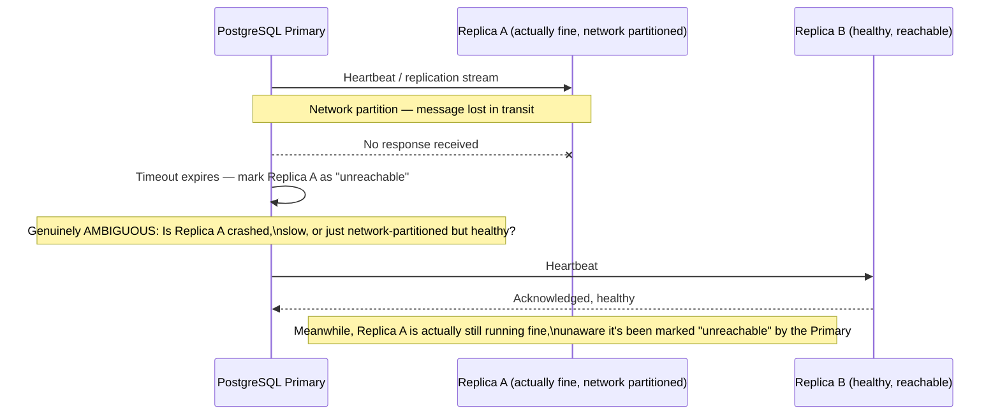
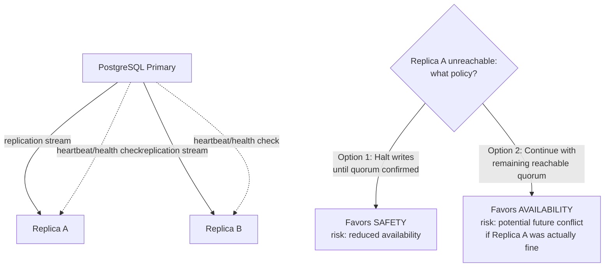
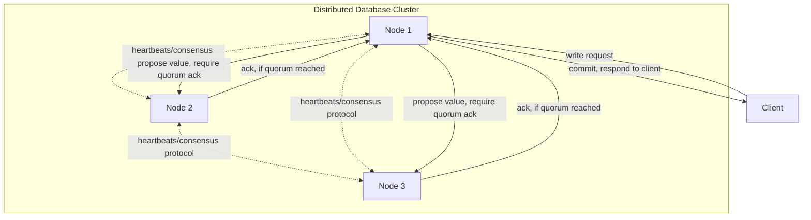
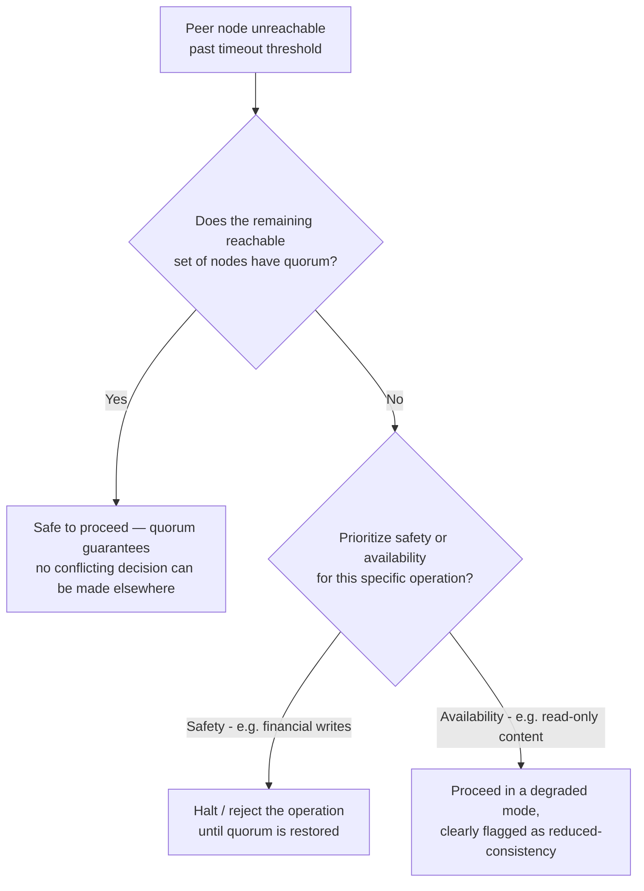
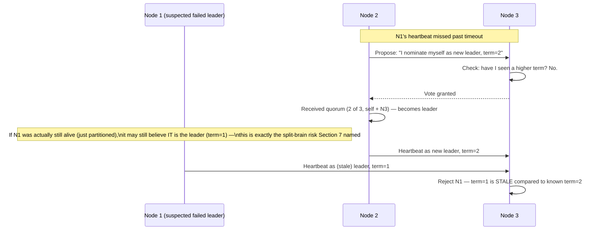
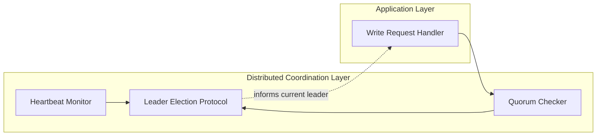
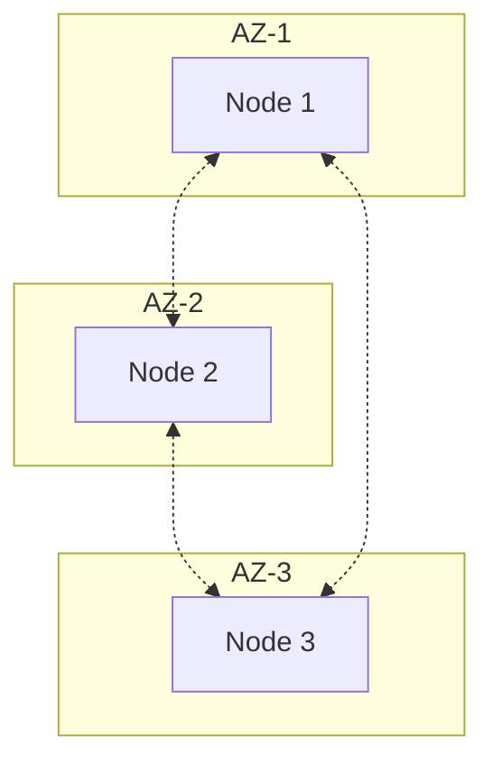

# Module 12 — Distributed Systems Fundamentals

> **Masterclass:** System Design Masterclass (30 Modules)
> **Level:** Intermediate
> **Audience:** Node.js backend developers, SDE‑2 / Senior Backend interview candidates, engineers transitioning into architecture roles
> **Prerequisite:** Modules 1–11 (System Design Intro through Message Queues)

---

## 1. Introduction

Every module since Module 2 has quietly been building a distributed system, without ever naming the theoretical foundation underneath it. Multiple app servers (Module 2), a database and its replicas (foreshadowed in Modules 5–6), a message broker cluster (Module 11), a load balancer tier (Module 8) — every one of these is a collection of independent machines that must coordinate, agree, and continue functioning even when some of them fail or become unreachable. This module finally names that discipline explicitly: **distributed systems theory** — and gives you the vocabulary (coordination, failure handling, consensus, leader election) that every remaining module in this course, especially CAP Theorem (Module 13), Consistency Models (Module 14), and Replication (Module 15), depends on.

If Module 1 was "why system design exists," this module is "why distributed systems are *harder* than single-machine systems" — a distinction worth internalizing precisely, because it's the exact gap that turns a working prototype into a production incident.

---

## 2. Learning Objectives

By the end of this module, you will be able to:

1. Explain precisely **why distributed systems are fundamentally harder** than single-machine systems — grounded in specific, named failure modes, not vague intuition.
2. Explain the **network partition** and why "the network is reliable" is a dangerous assumption (directly building on Module 3).
3. Explain **partial failure** and why it's qualitatively different from total failure.
4. Explain **clock synchronization problems** and why "just check the timestamp" is often an unreliable strategy across machines.
5. Explain **consensus** as a problem, and why it's provably impossible to solve perfectly under certain conditions (FLP impossibility, at a conceptual level).
6. Explain **leader election** and why exactly one node must be authoritative for certain decisions.
7. Distinguish **coordination-requiring** operations from ones that can be handled independently by any node.

---

## 3. Why This Concept Exists

A single machine has properties distributed systems can't take for granted: if a function call fails, you generally know it failed. If two operations happen "at the same time" on one machine, there's a single, unambiguous clock determining their true order. If a component crashes, everything downstream of it also stops (nothing partially continues in a confusing intermediate state).

None of these properties hold once you have multiple machines communicating over a network (Module 3). A request can fail to get a response not because it failed, but because the *response* got lost on the way back — from the caller's perspective, these are indistinguishable, yet they demand different handling (this is exactly why Module 4 introduced idempotency, and Module 11 introduced at-least-once delivery — both are *direct, practical responses* to this module's theoretical problem). Two machines' clocks can drift apart by meaningful amounts, making "which write happened first" a genuinely hard question to answer reliably. And a system with 10 machines can be in a state where 6 are healthy, 3 are slow, and 1 is unreachable but not crashed — a **partial failure** state that has no equivalent on a single machine, and that most of this module is dedicated to reasoning about correctly.

Distributed systems theory exists because these problems are not implementation bugs to be coded around — they are fundamental, provable properties of systems that communicate over unreliable networks, and every module from here to the end of this course is, in some way, a practical engineering response to one of these fundamental limits.

---

## 4. Problem Statement

> Our blog platform now has: 5 stateless app servers (Module 2), a 3-node message broker cluster (Module 11), and is planning a move to a **replicated PostgreSQL setup** (foreshadowing Module 15) with one primary and two replicas. During a recent network hiccup, the primary database briefly couldn't reach one replica — but the replica was actually still running fine; it just couldn't communicate. The operations team needs to decide: should writes be rejected during this kind of ambiguous state, or allowed to continue against the reachable nodes? Using this module's concepts, explain precisely why this is a genuinely hard question with no universally correct answer — and why "just detect the failure and handle it" understates the difficulty.

---

## 5. Real-World Analogy

**A single machine is like one person doing a task alone — if they stop, you know they stopped, and there's no ambiguity about what state the work is in.** A distributed system is like a team of people in different cities, coordinating entirely by mail (the network), where a letter can be delayed, lost, or arrive out of order, and — critically — **if you don't receive a reply from a colleague, you cannot tell whether they never got your letter, got it but their reply was lost, or got it and is simply still working on it.** All three possibilities look identical from where you're standing: silence.

This is the **partial failure** problem, precisely: from the primary database's point of view in Section 4, "the replica is unreachable" is genuinely ambiguous between "the replica crashed," "the replica is fine but the network between us is broken," and "the replica is just slow right now." Each of these three realities warrants a *different* response, but the observable symptom is identical — this is not a detection problem you can solve with a better timeout value; it's a fundamental information problem.

**Clock synchronization is like each team member in a different city trusting their own personal watch to sequence events across the whole team** — if Alice's watch runs 3 seconds fast, an event she logs as happening "before" Bob's might actually have happened after, from a true, external observer's perspective. This is precisely why distributed systems generally cannot trust wall-clock timestamps alone to determine true event ordering across machines (Section 8 goes deeper).

---

## 6. Technical Definition

**Distributed System:** A system composed of multiple independent computers that communicate and coordinate their actions by passing messages over a network, appearing to users as a single coherent system.

**Network Partition:** A failure condition in which network connectivity between some nodes is disrupted, dividing the system into groups that can each communicate internally but not with each other.

**Partial Failure:** A failure mode unique to distributed systems in which some components of the system fail or become unreachable while others continue operating normally, producing a system-wide state that is neither "fully working" nor "fully failed."

**Consensus:** The problem of getting multiple distributed nodes to agree on a single value or decision, despite the possibility of node failures and unreliable communication.

**Leader Election:** The process by which distributed nodes select a single node (the leader) to be responsible for coordinating a specific task or making authoritative decisions on behalf of the group.

**FLP Impossibility Result:** A foundational theoretical result (Fischer, Lynch, Paterson, 1985) proving that in an asynchronous distributed system, it is impossible to guarantee consensus can always be reached in bounded time if even one node may fail — a precise, mathematical explanation for why "perfect" consensus is fundamentally, not just practically, hard.

---

## 7. Core Terminology

| Term | Precise Definition | One-line Intuition |
|---|---|---|
| **Asynchronous Network Model** | A theoretical model assuming no bound on message delay — a message might take arbitrarily long to arrive | "Mail with no guaranteed delivery time" |
| **Synchronous Network Model** | A theoretical model assuming a known, bounded maximum message delay | "Mail guaranteed to arrive within N days" |
| **Byzantine Failure** | A failure mode where a node behaves arbitrarily or maliciously, potentially sending incorrect or contradictory information | "A team member who lies, not just one who's silent" |
| **Fail-Stop Failure** | A simpler failure model where a node either works correctly or stops completely (crashes) — no in-between, no lying | "A team member who either works or goes silent — never lies" |
| **Quorum** | The minimum number of nodes that must agree for a decision to be considered valid | "Enough votes to pass a motion" |
| **Split-Brain** | A dangerous scenario where a network partition causes two groups of nodes to each independently believe they are the sole authoritative leader | "Two team leads, each unaware the other exists, both making final decisions" |
| **Heartbeat** | A periodic signal a node sends to indicate it's still alive and reachable | "I'm still here" check-in, sent regularly |

### Fail-Stop vs. Byzantine — why most of this course assumes the simpler model

Nearly every system in this course (and most real production systems) is designed under the **fail-stop** assumption: a node either works correctly or stops entirely — it never sends deliberately false or contradictory information. **Byzantine fault tolerance** (handling nodes that might actively lie, e.g., in blockchain/cryptocurrency consensus, or defending against a compromised, malicious node) is a strictly harder, more expensive problem, generally reserved for adversarial contexts. Recognizing which model your system actually needs to defend against — most business systems need fail-stop tolerance, not Byzantine tolerance — is a genuine, practical design decision, not just an academic distinction.

---

## 8. Internal Working

### Why "just detect the failure" understates the problem, precisely

Section 4/5 established that a silent, unreachable replica is ambiguous between three distinct realities. A naive engineer's instinct is "add a timeout — if we don't hear back in 5 seconds, treat it as failed." This is a real, necessary, and correct **practical** response — but it does not eliminate the underlying ambiguity, it merely **chooses a policy for handling it**. Consider what actually happens if the replica wasn't dead, just slow (a genuine possibility under real network conditions, Module 3):

1. The primary times out and marks the replica as failed.
2. The primary might promote instructions or reconfigure based on this belief.
3. The "failed" replica, still actually running, might come back and behave as though nothing happened — potentially now disagreeing with the primary about the current state of the world.

This is precisely the **split-brain** risk named in Section 7 — and it's why distributed systems require explicit mechanisms (quorums, leader election protocols, Module 15's replication consistency models) to handle this ambiguity *safely*, rather than simply "detecting" and moving on as if the ambiguity had been resolved.

### Why clocks can't be fully trusted for ordering events across machines

Even with modern clock synchronization protocols (NTP), machine clocks can drift by milliseconds to seconds relative to each other, and under certain conditions (a machine under heavy load, a bad NTP configuration) by much more. If Server A logs "wrote value X at 10:00:00.100" and Server B logs "wrote value Y at 10:00:00.099," you **cannot safely conclude** that Y was written before X in true, global order — Server B's clock might simply be running slightly behind Server A's. This is why many distributed systems use **logical clocks** (like Lamport timestamps or vector clocks — conceptual tools, not detailed here, but named so you recognize them) instead of, or alongside, wall-clock time, to establish a *causally correct* ordering of events that doesn't depend on perfectly synchronized physical clocks.

### Why consensus is provably hard (FLP, explained without the formal proof)

The FLP result (Section 6) proves that in a fully asynchronous network (no upper bound on message delay — Section 7's model), it's impossible to build a consensus algorithm that is **simultaneously guaranteed to always terminate** (reach a decision) **and always be correct**, if even one node might fail. Intuitively: if you can never be sure whether a silent node has crashed or is just extremely slow (Section 5's ambiguity again), you can never be *certain* it's safe to proceed without that node's input — waiting forever isn't practical, but proceeding without certainty risks correctness.

**This is why real-world consensus algorithms (Raft, Paxos — named here, deepened conceptually in Module 22's Distributed Locking and referenced again in Module 28) don't defy this theoretical result — they work around it practically**, typically by using timeouts and majority quorums (Section 7) to make forward progress in the common case, accepting a small, well-understood risk of delay (not incorrectness) during genuinely adversarial network conditions. Understanding this distinction — the theory says "can't guarantee both always," practice says "make a deliberate, safe trade-off" — is exactly the kind of nuanced answer that distinguishes a strong system design interview response.

---

## 9. Request Lifecycle

### Mermaid Sequence Diagram — Ambiguous Replica Failure (Section 4's Exact Scenario)



**Step-by-step explanation, directly illustrating Section 4's dilemma:** at the point marked "genuinely ambiguous," the Primary has **no way to distinguish** Replica A having crashed from Replica A being merely partitioned. Any policy it adopts next (continue writes using only Replica B as the quorum, or halt writes entirely until Replica A is confirmed) is a **deliberate trade-off between availability and safety**, not a resolution of the underlying ambiguity — this exact tension is what Module 13's CAP Theorem formalizes precisely.

---

## 10. Architecture Overview



**HLD-level insight:** this diagram doesn't resolve Section 4's question — it **can't**, because this module's entire point is that this decision is a genuine, deliberate trade-off, not a bug to be fixed. What this module equips you to do is **articulate the trade-off precisely** ("Option 1 favors safety at the cost of availability during ambiguous partitions; Option 2 favors availability at the cost of a small window of potential inconsistency risk") — exactly the reasoning Module 13 will formalize into the CAP Theorem's precise vocabulary.

---

## 11. Capacity Estimation

Distributed systems theory doesn't lend itself to a traditional req/s capacity estimation the way earlier modules did — but it does have a directly relevant quorum-sizing calculation worth understanding numerically:

**Scenario:** With 3 database nodes (1 primary, 2 replicas, Section 4), how many nodes must agree for a decision (e.g., confirming a write is durably committed) to tolerate 1 node failure safely?

**Step 1 — Quorum formula (majority-based):**
```
Quorum size = floor(N / 2) + 1, where N = total nodes
N = 3 → Quorum = floor(3/2) + 1 = 1 + 1 = 2
```

**Step 2 — What this guarantees:** with a quorum of 2 out of 3, **any two nodes agreeing is sufficient**, and critically, **it's mathematically impossible for two different, non-overlapping groups of nodes to both independently reach a quorum at the same time** (since any two groups of 2 out of 3 nodes must share at least one common node) — this is precisely the mathematical property that prevents the "split-brain" scenario (Section 7) from occurring, *given* the system correctly enforces quorum-based decisions.

**Step 3 — Scaling this to 5 nodes:**
```
N = 5 → Quorum = floor(5/2) + 1 = 2 + 1 = 3
```
**Conclusion:** a 5-node cluster can tolerate **2** simultaneous node failures while still reaching a valid quorum (3 out of the remaining nodes) — directly quantifying the reliability benefit of a larger cluster, and setting up a very concrete, numbers-backed answer for "how many nodes do you need to tolerate X failures" in an interview.

---

## 12. High-Level Design (HLD)



**HLD-level insight:** notice the write is only considered successful **after a quorum of nodes acknowledges it**, not merely after the client's directly-contacted node accepts it — this is the practical, engineering embodiment of Section 11's quorum math, and it's precisely the mechanism that gives a distributed system its failure tolerance: any single node (including the one the client happened to talk to) can fail without losing already-committed data, because a quorum of *other* nodes also has it.

---

## 13. Low-Level Design (LLD)

### A simplified heartbeat and failure-detection implementation (illustrating Section 8/9's ambiguity concretely)

```javascript
const HEARTBEAT_INTERVAL_MS = 1000;
const FAILURE_TIMEOUT_MS = 5000; // 5 missed heartbeats before marking unreachable

class NodeHealthMonitor {
  constructor(nodeId) {
    this.nodeId = nodeId;
    this.lastHeartbeatReceived = Date.now();
    this.status = 'healthy';
  }

  recordHeartbeat() {
    this.lastHeartbeatReceived = Date.now();
    if (this.status === 'unreachable') {
      console.warn(`Node ${this.nodeId} reachable again — but was it ever actually down?`);
      // Precisely Section 8's ambiguity: we CANNOT know if it crashed and recovered,
      // or was simply partitioned the whole time and never stopped running.
    }
    this.status = 'healthy';
  }

  checkHealth() {
    const elapsed = Date.now() - this.lastHeartbeatReceived;
    if (elapsed > FAILURE_TIMEOUT_MS && this.status === 'healthy') {
      console.error(`Node ${this.nodeId} marked UNREACHABLE — reason is AMBIGUOUS:\n` +
        `  could be: crashed, network partition, or severe slowness`);
      this.status = 'unreachable';
      // This is a POLICY DECISION, not a resolved fact — the code cannot know which
      // of the three ambiguous realities (Section 5) actually occurred.
    }
    return this.status;
  }
}
```

**LLD-level design note:** the code comments here are doing real, deliberate work — they're marking the exact point where the implementation must proceed on a **policy decision** rather than a **known fact**, which is the single most important practical lesson this module aims to instill: distributed systems code that doesn't acknowledge this ambiguity explicitly is code that will eventually make an unexamined, potentially unsafe assumption during a real partition event.

---

## 14. ASCII Diagrams

```
PARTIAL FAILURE — a state with no single-machine equivalent

  Single machine:  [WORKING] or [CRASHED]  — only two possible states

  Distributed system (5 nodes):
    Node 1: [healthy]
    Node 2: [healthy]
    Node 3: [SLOW — technically still working]
    Node 4: [UNREACHABLE — crashed? partitioned? unknown]
    Node 5: [healthy]

  This system is neither "fully working" nor "fully failed" —
  it's in a genuinely ambiguous, PARTIAL state requiring an explicit policy decision
```

```
QUORUM PREVENTING SPLIT-BRAIN (N=3, Quorum=2)

  Partition scenario: Node 1 isolated from Node 2 and Node 3

  Group A: {Node 1}         — only 1 node, CANNOT reach quorum of 2
  Group B: {Node 2, Node 3} — 2 nodes, CAN reach quorum of 2

  Only Group B can make authoritative decisions — Group A correctly
  recognizes it lacks quorum and must NOT act as if it's still in charge
  (this is exactly what prevents split-brain, GIVEN correct quorum enforcement)
```

---

## 15. Mermaid Flowcharts

### Decision Flow: How Should a Node Respond to an Unreachable Peer?



---

## 16. Mermaid Sequence Diagrams

*(Section 9 covers the canonical ambiguous-failure sequence diagram. Additional diagram below.)*

### Leader Election After a Suspected Failure



**Why the "term" number matters, precisely:** this is the mechanism (used by real consensus protocols like Raft) that resolves Section 9's ambiguity **after the fact**, safely — even if the old leader (Node 1) never learns it was replaced and continues believing it's in charge, every *other* node correctly rejects its now-stale authority once a higher term exists, preventing it from causing actual harm (like accepting writes that conflict with the new leader's decisions) even while the ambiguity about *why* it went silent is never fully resolved.

---

## 17. Component Diagrams



**Why these are modeled as distinct components, even when using an off-the-shelf consensus library:** understanding that failure detection (heartbeats), quorum validation, and leader election are **conceptually separate concerns**, even when a real system (etcd, ZooKeeper, a managed database's internal replication logic) bundles them into one product, is precisely what lets you reason correctly about *where* a specific problem (like Section 4's ambiguous replica) actually lives, rather than treating "the consensus system" as one indivisible black box.

---

## 18. Deployment Diagrams



**Deployment-level note, directly connecting to Module 3's networking foundation:** spreading the 3 nodes of a quorum-based cluster across **3 different availability zones** ensures that a single AZ-level failure (a genuine, real-world event — power, networking, or facility issues affecting one AZ) can take out **at most 1 node**, never enough to break quorum (Section 11's math: losing 1 of 3 still leaves 2, meeting the quorum requirement) — a direct, deliberate application of distributed systems theory to real infrastructure placement decisions.

---

## 19. Network Diagrams

This module's core lesson is best expressed as a *failure* to a network diagram, not a structure:

```
  NORMAL STATE                          PARTITION STATE

  N1 ──── N2                            N1 ──── N2
   │       │                             │        ╲
   │       │                             │         X (link severed)
   └── N3 ─┘                             └── N3 ────┘

  All nodes can reach                   N1 can reach N2 and N3 fine.
  each other directly                   N2 and N3 can reach each other fine.
                                         But imagine N1's link to BOTH
                                         N2 and N3 is severed —
                                         N1 is now isolated, alone,
                                         while N2+N3 retain quorum
```

**Why this diagram matters more as a "what can go wrong" illustration than a "how to build it" one:** Module 3 taught you networks are physical infrastructure with real, if usually rare, failure modes (severed links, router failures, misconfigurations). This module's entire point is that **your distributed system's coordination logic must be correct even in the partition-state diagram**, not just the normal-state one — designing and testing only against the "everything is connected" assumption is a common, serious gap between a working demo and a production-grade distributed system.

---

## 20. Database Design

Distributed systems theory directly justifies a schema-adjacent decision worth flagging even before Module 15's full replication treatment: **avoid designing schemas or application logic that assumes a single, globally authoritative "now"** across multiple nodes, given Section 8's clock-drift lesson.

```sql
-- RISKY: assumes wall-clock timestamps from different nodes are perfectly comparable
SELECT * FROM events WHERE created_at > (SELECT MAX(created_at) FROM other_node_events);

-- SAFER: use a monotonically increasing, centrally-issued sequence/logical clock
-- for cross-node ordering-sensitive logic, rather than trusting wall-clock time alone
```

**Why this matters concretely:** if two nodes' clocks differ by even 50ms, wall-clock-based ordering logic can silently produce an incorrect result under the exact conditions (near-simultaneous writes from different nodes) where correctness matters most — a genuinely subtle, real-world bug class this module equips you to recognize before it's written, not just debug after the fact.

---

## 21. API Design

Distributed systems theory rarely dictates a specific API shape directly, but it does justify one important design principle worth stating: **APIs that expose or depend on cross-node ordering guarantees should document those guarantees explicitly and precisely**, rather than leaving clients to assume stronger guarantees than the system actually provides.

```
GET /events?after=<logical_sequence_number>   ← precise, unambiguous ordering cursor
GET /events?after=<wall_clock_timestamp>       ← RISKY: ambiguous under clock drift (Section 8/20)
```

---

## 22. Scalability Considerations

| Consideration | Impact |
|---|---|
| Quorum size vs. cluster size | Larger clusters tolerate more simultaneous failures (Section 11) but require more nodes to agree per decision, potentially increasing write latency |
| Leader-based coordination bottleneck | If all writes must go through a single elected leader (Section 16), that leader can become a throughput bottleneck as cluster size/traffic grows — a direct echo of Module 2's single-point-of-coordination concern |
| Cross-region consensus latency | Requiring a quorum across geographically distant nodes (Module 3's distance-latency lesson) can add significant latency to every coordinated decision — a genuine cost of spreading a quorum-based cluster across regions for disaster-recovery purposes |

---

## 23. Reliability & Fault Tolerance

- **Quorum-based systems trade some availability for strong safety guarantees** — this module's entire Section 4 dilemma is this trade-off made concrete; there is no configuration that eliminates it, only ones that choose a side deliberately (fully formalized in Module 13).
- **Fail-stop assumptions must be validated against your actual threat model** — if you genuinely need to tolerate a node behaving maliciously or sending corrupted data (Byzantine failure, Section 7), fail-stop-only protocols (the vast majority covered elsewhere in this course) are insufficient, and you need Byzantine fault-tolerant consensus (a substantially more complex, expensive class of protocol, common in blockchain systems, out of scope for most business applications).
- **Leader election protocols must correctly handle stale leaders** (Section 16's term-number mechanism) — a "recovered" former leader that doesn't know it's been replaced is a real, common scenario that a correct protocol must safely neutralize, not merely hope doesn't happen.

---

## 24. Security Considerations

- **Consensus and leader election protocols must be protected from unauthorized participation** — an attacker able to inject themselves as a fake "node" into your cluster's coordination protocol could potentially manipulate quorum decisions; production consensus systems require authenticated, encrypted inter-node communication (Module 20's mTLS is directly relevant here).
- **Byzantine fault tolerance becomes a genuine security requirement**, not just a reliability one, in any context where a compromised node (not merely a crashed one) is a realistic threat — this reframes Section 7's fail-stop-vs-Byzantine distinction as a security architecture decision, not purely an availability one.

---

## 25. Performance Optimization

- **Minimize the number of nodes required for a quorum decision on the hot path** — while Section 11 showed larger clusters tolerate more failures, every additional required acknowledgment adds latency to the corresponding operation; this is a genuine throughput-vs-fault-tolerance trade-off, not a free scaling dimension.
- **Co-locate quorum members within acceptable latency bounds** for latency-sensitive operations, while still spreading them across failure domains (Section 18) — balancing Module 3's distance-latency lesson against this module's failure-domain-separation lesson is a real, nuanced infrastructure placement decision.

---

## 26. Monitoring & Observability

- **Heartbeat miss rate and failure-detection latency** — directly measuring how quickly and reliably your system distinguishes healthy from unreachable nodes (Section 13).
- **Leader election frequency** — a cluster re-electing its leader unusually often is a strong signal of network instability or misconfigured timeout thresholds, worth investigating even if each individual election completes "successfully."
- **Quorum health** (how many nodes are currently reachable relative to the required quorum size) as a first-class, alerted metric — approaching the quorum threshold (e.g., 2 of 3 nodes reachable, one more failure away from losing quorum entirely) is a critical, proactive warning sign.

---

## 27. Common Bottlenecks

| Bottleneck | Symptom | Root Cause |
|---|---|---|
| Frequent, unnecessary leader re-elections | Periodic latency spikes, brief write unavailability | Heartbeat timeout tuned too aggressively for actual network conditions (echoing Module 8's health-check-tuning lesson) |
| Split-brain due to missing/misconfigured quorum enforcement | Two nodes both believe they're the authoritative leader simultaneously | Quorum logic not correctly implemented or bypassed under a specific edge case |
| Wall-clock-dependent ordering bugs | Subtle, hard-to-reproduce data inconsistencies under near-simultaneous writes | Application logic trusting timestamp comparison across nodes without accounting for clock drift (Section 8/20) |
| Latency-sensitive operations blocked on distant quorum members | High write latency for otherwise-fast operations | Quorum spread across nodes with poor mutual network latency (Section 25) |

---

## 28. Trade-off Analysis

> "I chose to **require quorum acknowledgment before considering a write committed**, optimizing for **strong safety guarantees against split-brain and data loss during partitions**, at the cost of **reduced availability during a genuine partition where quorum cannot be reached**, which is acceptable because our system's correctness requirements (Module 5's ACID-adjacent guarantees for post/comment data) outweigh the rare cost of temporarily rejecting writes during an unlikely, severe network partition."

> "I chose to **spread our 3-node cluster across 3 separate availability zones** rather than co-locating them for lower inter-node latency, optimizing for **failure-domain isolation (Section 18)**, at the cost of **slightly higher latency per quorum-requiring operation due to cross-AZ network hops**, which is acceptable because tolerating a full AZ outage without losing quorum is a stronger reliability guarantee than the latency cost it introduces."

---

## 29. Anti-patterns & Common Mistakes

1. **Assuming "unreachable" means "crashed"** — building failure-handling logic that treats network partition and node crash identically, when they may warrant genuinely different responses (Section 8's core lesson).
2. **Trusting wall-clock timestamps for cross-node event ordering** — a subtle, real, and recurring class of distributed systems bug (Section 8/20).
3. **No quorum enforcement**, allowing a minority partition to continue acting as if it's authoritative — the direct cause of split-brain scenarios.
4. **Designing for fail-stop when the actual threat model requires Byzantine tolerance** (or, just as commonly, over-engineering Byzantine tolerance for a threat model that only ever needs fail-stop) — matching the failure model to the actual risk is a deliberate, important decision, not a default.
5. **Tuning heartbeat/failure-detection timeouts without empirical basis**, causing either excessive false-positive failure detection (unnecessary leader re-elections) or dangerously slow real-failure detection.
6. **Treating "the consensus system handles it" as a black box excuse** to avoid understanding what guarantees it actually provides, and under which specific failure models — leading to incorrect assumptions about what the system will and won't tolerate correctly.

---

## 30. Production Best Practices

- **Always design failure-handling logic around the fact that "unreachable" is ambiguous** — decide explicitly, and document, how your system resolves that ambiguity for each specific operation.
- **Use logical clocks or centrally-issued sequence numbers**, not wall-clock timestamps, for any cross-node ordering-sensitive logic.
- **Enforce quorum-based decision-making** for any operation where split-brain would be genuinely dangerous (financial writes, leader authority).
- **Spread coordination-critical nodes across independent failure domains** (availability zones), while remaining mindful of the latency cost this introduces.
- **Monitor quorum health and leader election frequency** as first-class, proactively alerted signals, not just individual node health.
- **Explicitly identify whether your system needs fail-stop or Byzantine fault tolerance**, and choose protocols/architecture matched to that determination — don't default to either without deliberation.

---

## 31. Real-World Examples

- **Google's Chubby lock service and Spanner database** (both extensively documented in Google's published research papers) are foundational, real-world implementations of exactly this module's concepts — Chubby uses a Paxos-based consensus protocol for distributed locking and leader election at massive scale, directly informing the industry's broader understanding of practical consensus.
- **etcd** (the distributed key-value store underlying Kubernetes' cluster coordination) uses the **Raft consensus algorithm**, and its documentation explicitly discusses quorum requirements and leader election in terms directly mirroring this module's Section 11 and Section 16 — a widely-used, production-grade, and refreshingly well-documented real system to study for anyone wanting to go deeper than this module's conceptual treatment.
- **The 2012 GitHub incident involving a network partition between their primary and secondary MySQL databases** (documented publicly in their post-incident report) is a well-known, real-world instance of exactly Section 4's dilemma playing out — an ambiguous partition leading to a difficult, consequential decision about availability versus consistency, with real, publicly-analyzed consequences.

---

## 32. Node.js Implementation Examples

### A minimal quorum-checking function (illustrating Section 11's math in code)

```javascript
class QuorumCluster {
  constructor(nodeIds) {
    this.nodeIds = nodeIds;
    this.quorumSize = Math.floor(nodeIds.length / 2) + 1; // Section 11's formula
  }

  hasQuorum(reachableNodeIds) {
    const reachableCount = reachableNodeIds.filter(id => this.nodeIds.includes(id)).length;
    return reachableCount >= this.quorumSize;
  }
}

const cluster = new QuorumCluster(['node1', 'node2', 'node3']);
console.log(cluster.quorumSize); // 2 — matches Section 11's calculation

console.log(cluster.hasQuorum(['node2', 'node3'])); // true — 2 of 3, meets quorum
console.log(cluster.hasQuorum(['node1']));           // false — only 1 of 3, NO quorum
```

**Why this simple function is the practical core of everything this module discusses:** every leader election, every safe write-commit decision, and every split-brain prevention mechanism ultimately reduces to a version of this exact check — "do I currently have enough agreement to safely proceed?" Understanding this function deeply is understanding the operational heart of distributed consensus, even before layering on the additional complexity of real protocols like Raft or Paxos.

---

## 33. Interview Questions

### Easy
1. What makes a distributed system fundamentally different from a single-machine system?
2. What is a network partition?
3. Explain partial failure and why it has no equivalent on a single machine.
4. What is a quorum, and why does it prevent split-brain scenarios?
5. What is the difference between fail-stop and Byzantine failure models?
6. Why can't you always trust wall-clock timestamps to order events across different machines?

### Medium
7. Explain why an unreachable node is fundamentally ambiguous, and name the three distinct realities that could explain it.
8. Calculate the quorum size for a 7-node cluster, and explain how many simultaneous node failures it can tolerate while still functioning.
9. Explain leader election and why a "term" or similar mechanism is needed to handle a recovered, formerly-partitioned leader safely.
10. Why does spreading a quorum-based cluster across multiple availability zones improve fault tolerance, and what's the corresponding cost?
11. Explain, at a conceptual level, why the FLP impossibility result doesn't mean real distributed systems can't work in practice.
12. Why might a system deliberately choose to reject an operation during an ambiguous partition, rather than optimistically proceeding?

### Hard
13. Design a leader election protocol for a 5-node cluster, addressing how it correctly handles a former leader that becomes partitioned and later reconnects.
14. Explain, with a concrete example, how relying on wall-clock timestamps for conflict resolution across multiple database replicas could produce an incorrect result, and propose an alternative.
15. A production incident report describes a "split-brain" event where two nodes both believed they were the primary database. Using this module's concepts, write the root-cause analysis explaining how this class of failure occurs and what specific mechanism would have prevented it.
16. Discuss the trade-off between quorum size and both fault tolerance and write latency, and propose a cluster size and quorum configuration for a system requiring tolerance of 2 simultaneous node failures with minimized latency.
17. Explain why Byzantine fault-tolerant consensus is significantly more complex and expensive than fail-stop consensus, and describe a realistic scenario where the added complexity would actually be justified.

---

## 34. Scenario-Based Design Questions

1. **Scenario:** Your 3-node database cluster experiences a network partition isolating 1 node from the other 2. Using quorum math, determine which side can safely continue accepting writes, and explain why.
2. **Scenario:** A post-incident review reveals your system's leader election protocol didn't include a "term" mechanism, and a stale, recovered former leader caused a data conflict. Propose the specific fix.
3. **Scenario:** Two of your application servers each log an event with a timestamp, and the logs appear to show Server B's event happening before Server A's — but you suspect clock drift. Explain how you'd verify or refute true ordering without relying solely on the logged timestamps.
4. **Scenario:** Your team is deciding cluster size for a new coordination service and must tolerate exactly 2 simultaneous node failures. Determine the minimum cluster size and resulting quorum requirement.
5. **Scenario:** An engineer proposes treating "no heartbeat response in 500ms" as definitive proof a node has crashed, and immediately taking over its responsibilities. Evaluate this proposal using this module's ambiguity concepts.
6. **Scenario:** Your system needs to defend against a scenario where a compromised, malicious node might send intentionally incorrect data to peers. Discuss how this changes your required failure model and consensus approach.
7. **Scenario:** During a genuine, sustained network partition, your 5-node cluster splits into a 3-node group and a 2-node group. Walk through which group retains quorum and what the minority group should correctly do.
8. **Scenario:** A stakeholder asks why your distributed system sometimes takes a few extra seconds to respond during "network issues" rather than just failing fast or succeeding immediately. Explain, using this module's concepts, why this delay is a deliberate, correct trade-off rather than a performance bug.
9. **Scenario:** You're designing a coordination service that must remain correct even if nodes are deployed across 3 different cloud providers with highly variable inter-node latency. Discuss how this affects your quorum and timeout configuration decisions.
10. **Scenario:** An interviewer asks you to explain, in one sentence, why distributed systems can't simply "check if a node is down" the way a single-machine system checks if a function threw an exception. Provide that precise, defensible one-sentence answer.

---

## 35. Hands-on Exercises

1. Implement the `QuorumCluster` class from Section 32, and write test cases covering: full cluster reachable, exactly-quorum reachable, and below-quorum reachable, verifying the boolean result matches Section 11's math for cluster sizes of 3, 5, and 7.
2. Simulate a network partition locally (e.g., using Docker network rules, or simply blocking traffic between two local processes with a firewall rule) between 3 locally-running Node.js processes exchanging heartbeats, and observe how long it takes for the isolated process to be marked unreachable by the others.
3. Implement a simplified leader election with term numbers (Section 16), and simulate a "recovered stale leader" scenario, verifying peers correctly reject its outdated term.
4. Write a small script comparing two locally-running processes' `Date.now()` values at the "same" logical moment (e.g., triggered by a shared signal), and measure the actual observed clock drift between them over a test run.
5. Design (on paper or in Mermaid) the quorum and availability-zone placement for a hypothetical 5-node cluster required to tolerate 2 simultaneous node failures, explicitly stating the quorum size and which failure scenarios it does and does not survive.

---

## 36. Mini Project

**Build:** A minimal, working 3-node heartbeat and quorum-checking system in Node.js, directly implementing this module's core mechanisms.

**Requirements:**
- Implement 3 independent Node.js processes exchanging periodic heartbeats over HTTP or TCP.
- Implement failure detection with a configurable timeout (Section 13), explicitly logging the ambiguity ("marked unreachable — reason unknown: crash, partition, or slowness") rather than asserting a specific cause.
- Implement the `QuorumCluster` quorum-checking logic (Section 32), and have each node log whether it currently believes the cluster has quorum.
- Simulate a network partition (blocking one process's communication) and observe/log the system's behavior and quorum determination on both sides of the simulated partition.

**Success criteria:** Running your 3-process system and artificially blocking one node's network communication produces correct, logged quorum determinations on both the majority and minority sides, with explicit acknowledgment in your logs of the underlying ambiguity about the isolated node's true state.

---

## 37. Advanced Project

**Build:** Extend the Mini Project with leader election, term numbers, and a split-brain prevention test.

1. Implement a simplified leader election protocol (Section 16) on top of your Mini Project's heartbeat system, including term numbers, and verify via logging that exactly one node is recognized as leader under normal conditions.
2. Simulate a partition isolating the current leader from the other two nodes, verify the majority side correctly elects a new leader with an incremented term, and then simulate the original leader "recovering" (its network connectivity restored) and verify it's correctly demoted/rejected due to its stale term.
3. Write an automated test that would have caught a **missing** term-number check (i.e., temporarily remove the term validation, and demonstrate that the resulting system incorrectly allows the stale leader's commands to be accepted — a concrete, working demonstration of the split-brain risk this mechanism prevents).
4. Document, with actual logs/timestamps from your test runs, the real time window between a partition occurring and a new leader being safely elected, and discuss what this measured "unavailability window" implies about the safety/availability trade-off for a real production system.

**Success criteria:** You have a working, tested leader election system with term-based stale-leader rejection, and a concrete, working demonstration (via the deliberately-broken test) of exactly what goes wrong without it — setting up Module 13 (CAP Theorem), which takes this module's "safety vs. availability during a partition" tension and formalizes it into the single most quoted, and most frequently misunderstood, theorem in distributed systems.

---

## 38. Summary

- **Distributed systems are fundamentally harder than single-machine systems** because of network partitions, partial failure, and clock synchronization problems — none of which have single-machine equivalents.
- **An unreachable node is genuinely ambiguous** — crashed, partitioned, or merely slow are indistinguishable from the observer's perspective, and every failure-handling policy is a deliberate choice made under this irreducible uncertainty.
- **Wall-clock timestamps cannot be safely trusted** for ordering events across different machines due to clock drift — logical clocks or centrally-issued sequence numbers are the safer alternative.
- **Consensus is provably hard** (FLP impossibility) in a fully asynchronous, failure-prone network — real systems work around this practically using timeouts and quorums, accepting a bounded risk of delay rather than incorrectness.
- **Quorum-based decision-making** is the core mechanism preventing split-brain, and its required size is a direct, calculable function of desired fault tolerance (Section 11).
- **Leader election with term numbers** safely handles a recovered, formerly-partitioned leader without requiring the system to ever fully resolve the underlying ambiguity about what happened to it.

---

## 39. Revision Notes

- Distributed systems face 3 problems single machines don't: network partitions, partial failure, clock drift
- Unreachable node = ambiguous (crashed / partitioned / slow) — handling this is a policy decision, not a detection problem
- Wall-clock timestamps unreliable across machines — use logical clocks/sequence numbers for cross-node ordering
- FLP impossibility: can't guarantee consensus always terminates correctly in async networks with failures — real systems use timeouts + quorums as a practical workaround
- Quorum = floor(N/2)+1 — mathematically guarantees no two disjoint groups can both reach quorum simultaneously (prevents split-brain)
- Leader election needs term numbers to safely reject a stale, recovered former leader
- Fail-stop (crash or work correctly) vs. Byzantine (may lie/behave arbitrarily) — match your protocol to your actual threat model

---

## 40. One-Page Cheat Sheet

```
SYSTEM DESIGN — MODULE 12 CHEAT SHEET
─────────────────────────────────────
WHY DISTRIBUTED SYSTEMS ARE HARDER (no single-machine equivalent)
  Network partitions   → some nodes can't reach others
  Partial failure       → system is neither fully up nor fully down
  Clock drift            → wall-clock ordering across machines is unreliable

UNREACHABLE NODE = AMBIGUOUS between:
  1. Crashed    2. Network partitioned (but alive)    3. Just slow
  → handling this is a POLICY decision, not a detection problem

QUORUM = floor(N/2) + 1
  N=3 → quorum=2 (tolerates 1 failure)
  N=5 → quorum=3 (tolerates 2 failures)
  Guarantees: no two disjoint groups can BOTH reach quorum → prevents split-brain

FLP IMPOSSIBILITY (conceptual)
  Async network + possible node failure → can't guarantee consensus
  ALWAYS terminates correctly. Real systems use timeouts + quorums
  as a practical, bounded-risk workaround, not a violation of the theorem.

LEADER ELECTION
  Needs TERM NUMBERS to safely reject a stale, recovered former leader

FAIL-STOP vs BYZANTINE
  Fail-stop  → node crashes or works correctly, never lies (most systems)
  Byzantine  → node may behave arbitrarily/maliciously (blockchain, adversarial contexts)

GOLDEN RULE
  Never assume "unreachable" means "crashed" — design explicitly for the ambiguity.
```

---

## Key Takeaways

- The single most important idea in this module is that an unreachable node's true state is **fundamentally, not just practically, unknowable** from the observer's side — every downstream mechanism (quorums, leader election, timeouts) exists to make safe progress *despite* this irreducible uncertainty, not to eliminate it.
- Quorum-based decision-making is the mathematical foundation preventing split-brain, and its size is a direct, calculable trade-off between fault tolerance and coordination cost.
- This module's "safety vs. availability during a partition" tension isn't a gap to be closed — it's about to be formally named and given a precise vocabulary in Module 13's CAP Theorem.

## 20 Practice Questions
*(See Section 33 — 6 Easy, 6 Medium, 5 Hard — plus 3 rapid-fire additions:)*
18. Why does a larger quorum-based cluster generally have higher write latency, even though it tolerates more failures?
19. What's the practical difference between designing for fail-stop tolerance and designing for Byzantine fault tolerance, in terms of protocol complexity?
20. Why is it insufficient to say a leader election protocol "picks a new leader when the old one is unreachable" without also specifying how it handles the old leader's eventual return?

## 10 Scenario-Based Questions
*(See Section 34 in full.)*

## 5 Design Assignments
*(See Sections 36–37 — Mini Project and Advanced Project — plus:)*
1. Design a quorum and availability-zone placement strategy for a 7-node coordination cluster required to tolerate the simultaneous loss of one entire availability zone (assume 3 AZs available).
2. Write a one-page explanation, suitable for a non-distributed-systems engineer, of why "just detect when a node is down" understates the real difficulty of distributed failure handling.
3. Propose a term-number-based leader election protocol for a hypothetical 5-node cluster, and walk through, step by step, how it correctly handles a partitioned-then-recovered former leader.

## Suggested Next Module

**→ Module 13: CAP Theorem** — with the foundational vocabulary of partial failure, quorums, and consensus now established, we formalize this module's central, recurring tension — safety versus availability during a network partition — into the CAP Theorem's precise, rigorous, and frequently misunderstood framework.
