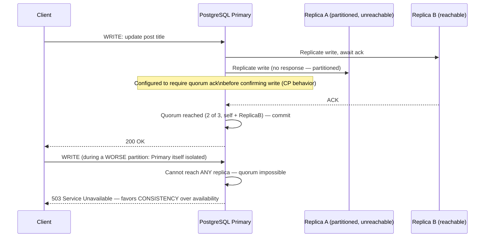
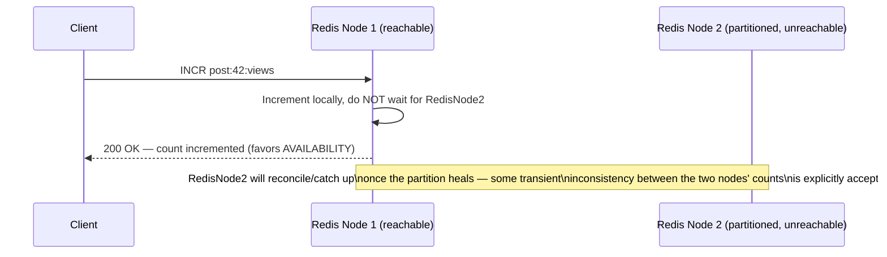
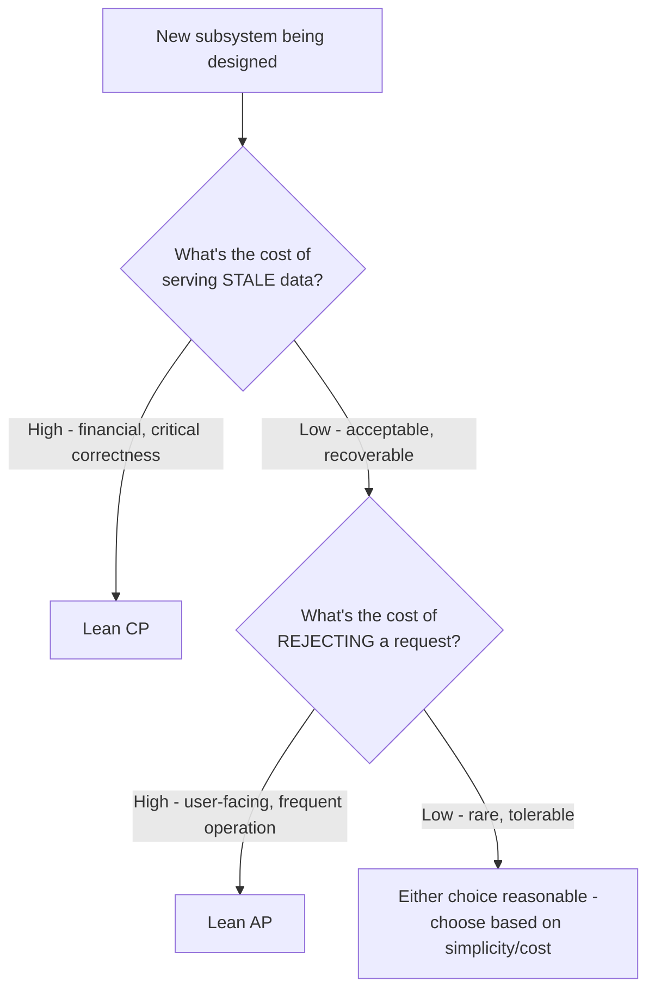
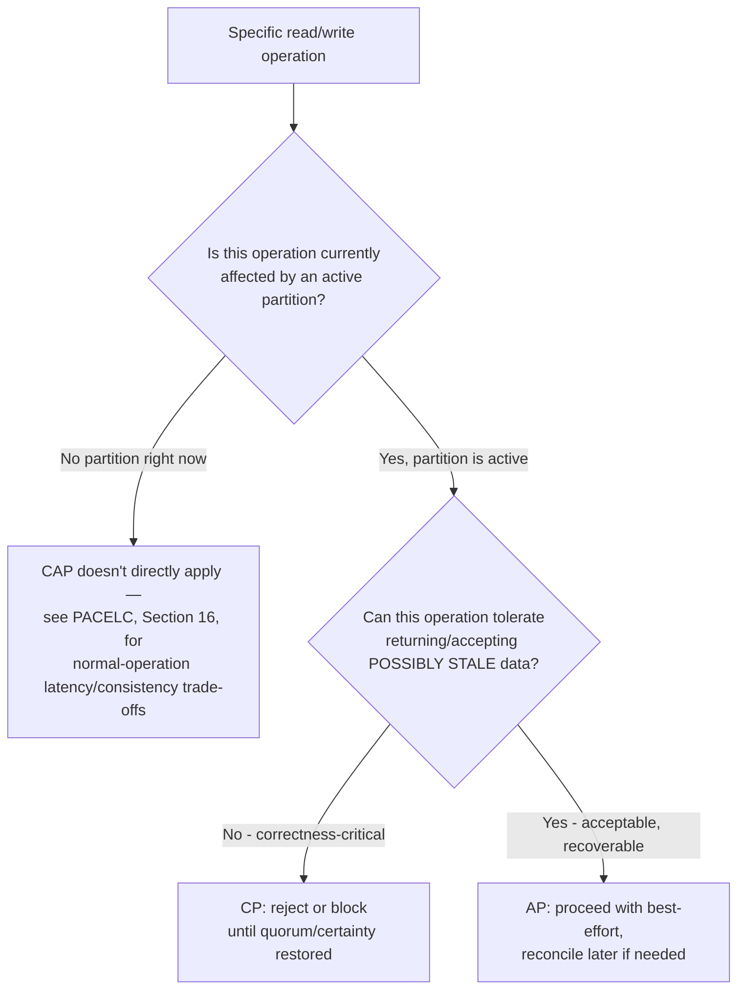
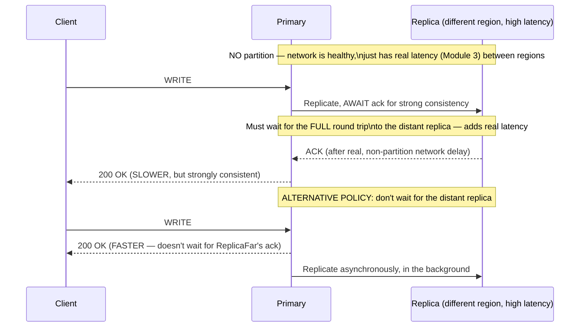
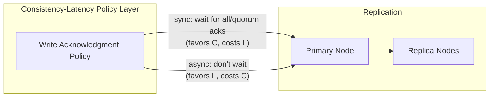
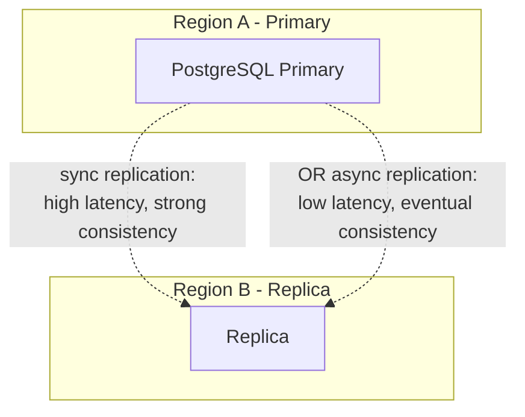

# Module 13 — CAP Theorem

> **Masterclass:** System Design Masterclass (30 Modules)
> **Level:** Intermediate
> **Audience:** Node.js backend developers, SDE‑2 / Senior Backend interview candidates, engineers transitioning into architecture roles
> **Prerequisite:** Modules 1–12 (System Design Intro through Distributed Systems Fundamentals)

---

## 1. Introduction

Module 12 ended with a deliberately unresolved tension: when a network partition makes a node unreachable, should the system favor safety (halt, wait for certainty) or availability (proceed with what's reachable, accept some risk)? This module gives that tension a name, a precise definition, and — just as importantly — corrects the single most common misunderstanding about it in the entire industry.

The CAP Theorem is probably the most frequently *cited* and most frequently *misapplied* piece of distributed systems theory in system design interviews. This module aims to leave you able to state it precisely, apply it correctly, and — critically — explain exactly where the popular simplified version ("you can only pick two of three") breaks down.

---

## 2. Learning Objectives

By the end of this module, you will be able to:

1. State the **CAP Theorem** precisely: Consistency, Availability, Partition tolerance, and the actual claim it makes.
2. Explain why **"pick two of three" is a misleading simplification**, and state the theorem's real, more precise claim.
3. Distinguish **CAP's "Consistency"** from **ACID's "Consistency"** (Module 5) — a critical, frequently confused distinction.
4. Classify real systems as **CP**, **AP**, or explain why "CA" is not a meaningful category for any system that must tolerate partitions.
5. Apply CAP reasoning to **concrete design decisions** (Module 12's replica scenario, resolved with CAP's vocabulary).
6. Explain **PACELC**, the CAP Theorem's practical extension addressing the latency/consistency trade-off *even without* a partition.
7. Correctly answer the classic interview question "is your system CP or AP" without falling into the theorem's most common misapplications.

---

## 3. Why This Concept Exists

Module 12 established that network partitions are a real, unavoidable fact of distributed systems — not a rare edge case to be engineered away, but a certainty over a long enough time horizon (Module 3's networking fundamentals already told us networks are unreliable; a partition is simply networking unreliability severe enough to fully separate nodes). Given that partitions **will** happen, every distributed system that replicates data across multiple nodes faces an unavoidable choice at the exact moment a partition occurs: continue serving requests using only the reachable subset of nodes (favoring **availability**), or refuse to serve requests that can't be safely, consistently answered (favoring **consistency**).

The CAP Theorem exists to make this choice explicit, rigorous, and impossible to avoid through cleverness — it's not a design flaw to be engineered around; it's a mathematically provable property of any system that replicates state across a network. Understanding CAP precisely is what separates an engineer who can *design* systems that make this trade-off deliberately from one who discovers the trade-off was already made for them, accidentally, the first time a real partition occurs in production.

---

## 4. Problem Statement

> Directly continuing Module 12's scenario: our PostgreSQL primary and its two replicas experience a network partition isolating one replica. The team must decide the system's behavior during this partition — and separately, must decide it **again** for a different subsystem: the blog's Redis-backed view counter (Module 7), where losing a few increments during a rare partition is a trivial, acceptable cost. Using CAP's precise vocabulary, explain why these two subsystems may reasonably make **opposite** choices, and why a single, platform-wide "CAP category" doesn't actually make sense as a design target.

---

## 5. Real-World Analogy

**Imagine two bank tellers at different branches of the same bank, and the phone line between the two branches goes down (the partition).** A customer walks into Branch A and asks to withdraw $500. Branch A's teller has no way to confirm with Branch B what the account's true, most current balance is (Branch B might have just processed a large deposit or withdrawal seconds ago).

The bank has exactly two honest options: **(1) refuse the withdrawal** until the phone line is restored and the branches can confirm a consistent view of the balance (favoring **Consistency** — never risk giving out money based on possibly-stale information) — or **(2) allow the withdrawal based on Branch A's last-known balance** (favoring **Availability** — the customer is served, but there's now a real risk the two branches' independent actions could, in combination, overdraw the account once the phone line is restored and the truth reconciles).

**There is no third option that avoids this choice entirely** — that's the actual, precise claim of CAP: **during a genuine partition, you must choose between consistency and availability for that operation; you cannot have the full strength of both simultaneously.** Critically, note this dilemma **only exists because the phone line is down** — when the branches can talk to each other normally, the bank can (and does) provide both a consistent and available experience. This is precisely why "pick two of three, all the time" is the wrong mental model — Section 8 makes this exact correction.

---

## 6. Technical Definition

**CAP Theorem (precisely stated):** In a distributed system that replicates data across multiple nodes, when a network partition occurs, the system must choose between **Consistency** (every read receives the most recent write, or an error) and **Availability** (every request receives a non-error response, even if it might not reflect the most recent write) — it cannot guarantee both simultaneously during that partition.

**Consistency (CAP sense):** Every node in the system returns the same, most up-to-date data for any given read, at any given time — equivalent to what distributed systems literature calls **linearizability**.

**Availability (CAP sense):** Every request to a non-failed node receives a response (success or failure of the operation itself, but not a timeout/no-response) — the system remains responsive.

**Partition Tolerance:** The system continues to operate (in some capacity) despite network partitions between nodes.

**CP System:** A system that, during a partition, chooses to preserve Consistency at the cost of Availability (some requests may be rejected or blocked).

**AP System:** A system that, during a partition, chooses to preserve Availability at the cost of Consistency (some requests may return stale or conflicting data).

---

## 7. Core Terminology

| Term | Precise Definition | One-line Intuition |
|---|---|---|
| **Linearizability** | A strong consistency guarantee where every operation appears to happen instantaneously at a single point in time, with a global, agreed-upon order | "As if there were only ever one copy of the data" |
| **Partition Tolerance** | The system's ability to continue functioning, in some capacity, despite a network partition | "Doesn't fall over completely just because a network link failed" |
| **PACELC** | An extension of CAP addressing the trade-off between latency and consistency **even when there's no partition** | "CAP's sequel — what do you trade off on a normal, healthy day?" |
| **Eventual Consistency** | A consistency model where, given enough time without new writes, all replicas will converge to the same value (deepened fully in Module 14) | "Everyone agrees... eventually" |
| **CA System (theoretically)** | A system that provides both Consistency and Availability, but only by **not tolerating partitions at all** | "Only makes sense if partitions are assumed impossible — rarely realistic" |

---

## 8. Internal Working

### The single most important correction this module makes: "pick two of three" is misleading

The popular phrase "CAP means you can only pick 2 of the 3" is **not quite what the theorem says**, and this imprecision is the single most common way CAP gets misapplied in interviews and real design discussions. Here's the precise correction:

**Partition tolerance isn't really a "choice" a distributed system gets to opt out of.** Networks *will* partition eventually (Module 3's unreliable-network reality, Module 12's "networks are fundamentally unreliable" foundation) — this is a fact about the physical world, not a design decision. A system that claims to "give up" partition tolerance to keep both Consistency and Availability is really just a system that **hasn't yet experienced a partition**, or is a single-node system where the concept of a network partition between replicas doesn't apply at all. **The real, actionable choice CAP describes is: given that a partition WILL occur, what does your system do during it — favor C, or favor A?** This is why "CP" and "AP" are the two meaningful, real-world categories, and "CA" is really only a legitimate description of a **non-distributed, single-node system**, or a distributed system's behavior *during the (usually far more common) non-partitioned periods* — which is precisely what **PACELC** (Section 6, deepened below) exists to address separately.

### Why CAP's "Consistency" is not the same as ACID's "Consistency" (Module 5)

This is the second most common point of confusion, and worth stating with total precision:

- **ACID Consistency (Module 5, Section 7):** a transaction only moves the database from one *valid* state to another, per defined constraints (foreign keys, unique constraints) — this is about respecting **application-defined invariants**.
- **CAP Consistency:** every read reflects the most recent write, i.e., **linearizability** — this is about **replica agreement**, entirely independent of any application-level business rule.

A system can be **ACID-consistent** (never violates a foreign key constraint) while being **CAP-inconsistent** (a read from Replica B might return slightly stale data compared to what was just written to the Primary) — these are two entirely different axes, and a system can score differently on each, independently. **Conflating them is one of the most reliable ways to lose credibility in a system design interview** — always specify which "consistency" you mean.

### Resolving Section 4's dilemma with precise CAP vocabulary

**The PostgreSQL replica cluster (Module 12's scenario):** if this system requires every read to reflect the absolute latest write (e.g., critical financial data), it should behave as a **CP system** during the partition — rejecting or blocking operations that can't be safely, consistently answered given the isolated replica, exactly Module 12's "Option 1: halt writes" choice.

**The Redis-backed view counter:** losing a few increments during a rare partition is an explicitly acceptable cost (stated in the Section 4 problem) — this system should behave as an **AP system** during a partition, continuing to serve and accept view-count updates from whichever nodes remain reachable, accepting the small risk of undercounting rather than showing users an error or blocking the page from loading.

**Why "the platform" doesn't have one single CAP category:** these are two **different subsystems with different correctness requirements**, and CAP is applied *per-subsystem*, or even *per-operation-type*, not as a single label for an entire platform. This is precisely why Section 4's question ("why might these reasonably make opposite choices") has a clean, precise answer once you stop thinking of CAP as a single, platform-wide checkbox.

---

## 9. Request Lifecycle

### Mermaid Sequence Diagram — CP Behavior During a Partition (PostgreSQL Scenario)



**Step-by-step explanation:** in the first case, quorum (Module 12, Section 11) is still achievable, so the write proceeds safely. In the second, more severe partition (where the Primary itself can't reach a quorum of replicas), a **CP system correctly chooses to reject the write** rather than risk an inconsistent state — this is the precise, concrete moment where "CP" stops being an abstract label and becomes an actual `503` response a real user sees.

### Mermaid Sequence Diagram — AP Behavior During the Same Partition (View Counter Scenario)



**Step-by-step explanation, directly resolving Section 4:** notice this is the **same underlying failure condition** (a partition) as the previous diagram, but the system's designed *response* to it is deliberately different — favoring a fast, successful response over waiting for cross-node agreement, exactly matching the view counter's stated tolerance for eventual, not immediate, consistency.

---

## 10. Architecture Overview

```mermaid
flowchart TB
    subgraph CP Subsystem - Core Transactional Data
        PGPrimary[PostgreSQL Primary]
        PGReplicaA[Replica A]
        PGReplicaB[Replica B]
        PGPrimary -->|quorum-required writes| PGReplicaA
        PGPrimary -->|quorum-required writes| PGReplicaB
    end
    subgraph AP Subsystem - View Counters, Non-Critical Aggregates
        RedisNode1[Redis Node 1]
        RedisNode2[Redis Node 2]
        RedisNode1 -.best-effort async replication.-> RedisNode2
    end
```

**HLD-level insight:** this diagram makes Section 4's resolution architecturally explicit — **two different consistency/availability postures, deliberately chosen per subsystem, coexisting within the same overall platform.** This is the correct, mature response to the classic (and slightly misleading) interview question "is your system CP or AP?" — the strongest answer is almost always **"it depends on which subsystem, and here's my reasoning for each,"** not a single, platform-wide label.

---

## 11. Capacity Estimation

CAP doesn't have a traditional throughput-style capacity estimation, but it does have a directly relevant **cost-of-choice** calculation worth making concrete:

**Scenario:** Estimating the real-world impact of choosing CP (reject writes during partition) versus AP (allow writes, risk conflict) for the PostgreSQL scenario, given historical partition frequency.

**Given (illustrative):** network partitions between availability zones occur, on average, for a total of 10 minutes per month (a realistic, if illustrative, figure for well-run cloud infrastructure), and the system handles 500 writes/second at peak.

**CP choice — cost is rejected writes during the partition window:**
```
10 minutes/month × 60 sec × 500 writes/sec (worst case, if the partition hits peak traffic)
= 300,000 potentially-rejected write attempts per month, in the worst case
```

**AP choice — cost is potential conflicting/lost data requiring reconciliation:**
```
Same 300,000 writes proceed, but some fraction may conflict with writes
on the other side of the partition, requiring conflict resolution logic
(Module 14 deepens this) once the partition heals
```

**Conclusion:** neither number is "correct" in isolation — this calculation exists to make the trade-off **quantifiable and discussable** rather than abstract. For blog post content (our core scenario), the CP choice's cost (a small window of rejected writes, clearly communicated to the user as "try again shortly") is generally far more acceptable than the AP choice's cost (silently losing or conflicting a user's edit) — directly justifying the Section 9 diagram's CP choice for this specific subsystem, with real numbers behind the reasoning.

---

## 12. High-Level Design (HLD)



**HLD-level insight:** this decision flow operationalizes Section 8's core lesson — CAP isn't a single, upfront platform-wide architectural decision made once; it's a **per-subsystem question**, answered by comparing the real, concrete cost of staleness against the real, concrete cost of unavailability for that *specific* piece of data.

---

## 13. Low-Level Design (LLD)

### Implementing explicit CP behavior (Node.js, quorum-gated write)

```javascript
async function writeWithConsistencyGuarantee(query, params, requiredAcks) {
  const ackPromises = replicaConnections.map(conn =>
    conn.query(query, params).catch(() => null) // failed/unreachable replicas resolve to null
  );

  const results = await Promise.all(ackPromises);
  const successfulAcks = results.filter(r => r !== null).length;

  if (successfulAcks < requiredAcks) {
    throw new UnavailableError(
      `CP guarantee cannot be met: only ${successfulAcks}/${requiredAcks} replicas acknowledged`
    ); // Explicitly favors CONSISTENCY — reject rather than risk an inconsistent commit
  }

  return { committed: true, acks: successfulAcks };
}
```

### Implementing explicit AP behavior (Node.js, best-effort write)

```javascript
async function writeWithAvailabilityPriority(key, value) {
  try {
    await primaryRedisNode.set(key, value); // succeed as long as ONE reachable node accepts it
    return { success: true, note: 'Other nodes will reconcile asynchronously' };
  } catch (err) {
    // Only fail if even the SINGLE most-available path is down —
    // this function is designed to almost never reject a request
    console.warn('Best-effort write failed, but not blocking user-facing response:', err);
    return { success: false, degraded: true };
  }
}
```

**LLD-level design notes:** notice these two functions encode **fundamentally different failure philosophies** in their very structure — the CP version's default behavior is to `throw` (reject) unless a strong condition is met; the AP version's default behavior is to succeed unless *everything* fails, and even then, it degrades gracefully rather than throwing. This structural difference is the concrete, code-level expression of Section 6's CP/AP definitions.

---

## 14. ASCII Diagrams

```
THE MISLEADING VERSION                    THE PRECISE VERSION

  "Pick 2 of 3:                            "Partitions WILL happen — that's
   C, A, or P"                              not optional. The real choice is:
                                             during a partition, favor C or A?"

  ┌─────┐  ┌─────┐  ┌─────┐                        PARTITION OCCURS
  │  C  │  │  A  │  │  P  │                              │
  └─────┘  └─────┘  └─────┘                    ┌─────────┴─────────┐
  (pick any 2,                                 ▼                   ▼
   as if this is                          Favor C               Favor A
   a free choice)                      (reject/block)      (serve possibly-stale)

  MISLEADING because "P" isn't          PRECISE because this framing matches
  really optional in any real            what actually happens in production
  distributed system                     distributed systems
```

---

## 15. Mermaid Flowcharts

### Decision Flow: CP or AP for This Specific Operation?



---

## 16. Mermaid Sequence Diagrams

*(Section 9 covers the two canonical CP/AP behavior sequence diagrams. Additional diagram below.)*

### PACELC in Action — The Trade-off That Exists Even WITHOUT a Partition



**Why this matters, precisely — introducing PACELC (Section 7):** CAP only describes behavior **during a partition**. But Section 16's diagram shows a **real, separate, and equally important trade-off** that exists during completely normal, healthy operation: do you wait for a distant replica's acknowledgment (favoring **Consistency**, at the cost of **Latency**), or respond immediately and replicate in the background (favoring **Latency**, at the cost of **Consistency**)? **PACELC** — "**P**artition: **A**vailability or **C**onsistency; **E**lse (no partition): **L**atency or **C**onsistency" — names this second, independent trade-off explicitly, and is considered by many distributed systems practitioners to be a more complete, practically useful framework than CAP alone, precisely because most of a system's actual operating time is spent in the "Else" (no partition) branch, not the rare partition branch CAP focuses on exclusively.

---

## 17. Component Diagrams



**Why this policy is modeled as a distinct, configurable component:** many real databases (PostgreSQL's synchronous vs. asynchronous replication settings, for instance) expose this **exact** PACELC trade-off as an explicit configuration choice — recognizing it as a first-class, deliberate "Write Acknowledgment Policy" rather than an implicit side effect of database configuration helps you reason about, and correctly justify, whichever setting you choose in a real system or interview.

---

## 18. Deployment Diagrams



**Deployment-level note, directly connecting Modules 3, 12, and 13:** the choice between synchronous and asynchronous cross-region replication is **simultaneously** a Module 3 latency question (how far apart are these regions, physically), a Module 12 consensus question (how many nodes must acknowledge before committing), and this module's PACELC question (are you willing to pay that latency cost for stronger consistency, during normal operation, not just during a partition) — this is a genuinely good illustration of how the modules in this course compound rather than existing in isolation.

---

## 19. Network Diagrams

CAP and PACELC don't introduce new network topology concepts beyond what Modules 3 and 12 already established — but they do reframe *how you should interpret* a partition or high-latency link you observe in a network diagram: not merely as "a problem to fix," but as **"a condition my system's design must have an explicit, deliberate, pre-decided policy for."**

```
  Healthy network (no partition)
    → PACELC's "Else" branch applies: Latency vs. Consistency trade-off (Section 16)

  Partitioned network
    → CAP's core claim applies: Consistency vs. Availability trade-off (Section 6)

  (Same physical network diagram can be in either state at different times —
   your system's design must have a correct, deliberate policy for BOTH states)
```

---

## 20. Database Design

CAP reasoning directly informs a real, common database configuration decision: **synchronous vs. asynchronous replication**, exposed literally by name in PostgreSQL:

```sql
-- Synchronous replication: favors CONSISTENCY (CP-leaning), costs LATENCY (PACELC's "Else" branch)
ALTER SYSTEM SET synchronous_commit = 'on';
ALTER SYSTEM SET synchronous_standby_names = 'replica_a, replica_b';

-- Asynchronous replication: favors AVAILABILITY/LATENCY, costs CONSISTENCY
ALTER SYSTEM SET synchronous_commit = 'off';
```

**Why this single configuration line is the entire module distilled into one decision:** choosing `synchronous_commit = 'on'` means a write isn't acknowledged to the client until the specified replicas confirm receipt — directly implementing CP behavior during a partition (the write blocks/fails if those replicas are unreachable) **and** the higher-latency side of PACELC's trade-off during normal operation (every write pays the full round-trip cost to those replicas, always, not just during partitions).

---

## 21. API Design

A mature API should, where consistency guarantees genuinely vary by operation (Section 12's per-operation framing), **communicate this explicitly** rather than leaving clients to assume a uniform guarantee across the entire API:

```
POST /posts/:id           → strongly consistent (CP) — 503 possible during severe partition
POST /posts/:id/view      → best-effort (AP) — always succeeds, count may be briefly approximate
```

**Why this matters for API consumers:** a client integrating with `/posts/:id/view` should never need retry logic for consistency reasons (it's designed to always succeed); a client integrating with `POST /posts/:id` should be built to handle an occasional `503` gracefully (e.g., with backoff and retry) — documenting which guarantee applies to which endpoint lets API consumers build correctly, rather than discovering the difference through production incidents.

---

## 22. Scalability Considerations

| Consideration | CP Systems | AP Systems |
|---|---|---|
| Write throughput under normal conditions | Often lower (waiting for quorum/sync acks) | Often higher (accepts writes without waiting) |
| Behavior under partition | Reduced availability, but no silent data conflicts | Full availability, but possible conflicting writes to reconcile |
| Horizontal scaling of writes | Harder — more nodes to coordinate for quorum | Easier — nodes can often accept writes independently |
| Client complexity | Simpler (single consistent view) | More complex (must handle eventual consistency, possible conflicts, Module 14) |

---

## 23. Reliability & Fault Tolerance

- **CAP is fundamentally a statement about the trade-off between two different *kinds* of reliability** — "reliably correct" (Consistency) versus "reliably responsive" (Availability) — recognizing that these are two distinct reliability goals that can conflict is itself a maturation of Module 1's initial, simpler reliability discussion.
- **A system's CP/AP choice should be revisited as business requirements evolve** — a feature that started as "acceptable to be eventually consistent" (a comment counter) might later become correctness-critical (if it starts driving billing decisions, for instance) — the CAP classification isn't a permanent, one-time architectural label.
- **PACELC reminds us that most reliability-relevant trade-offs happen during normal operation, not rare partitions** — over-indexing all your reliability planning on the rare partition scenario, while ignoring the constant, everyday latency-consistency trade-off, is a common blind spot this module corrects.

---

## 24. Security Considerations

- **AP systems accepting writes during a partition can create a window for replay or double-submission abuse** — if a client's request is accepted independently by two partitioned sides, and reconciliation logic isn't carefully designed, this can be exploited (e.g., a double-spend-like scenario) — directly connecting back to Module 4's idempotency and Module 11's idempotent-consumer lessons, now motivated by a CAP-level design choice rather than just network unreliability.
- **CP systems' explicit rejection behavior should be communicated safely** — a `503` response during a partition shouldn't leak internal topology details (which specific replica is unreachable, cluster internals) to the client, balancing this module's transparency goals against Module 20's information-disclosure concerns.

---

## 25. Performance Optimization

- **Apply CP guarantees only where genuinely needed, per Section 12's decision flow** — blanket, platform-wide strong consistency is a common, real-world performance anti-pattern; the view counter scenario (Section 4) exists precisely to demonstrate that not every piece of data needs the same guarantee.
- **Reconsider synchronous replication scope carefully** (Section 20) — requiring acknowledgment from a *distant*, high-latency replica for every write, when only local quorum is actually needed for your correctness requirement, needlessly pays PACELC's latency cost without a corresponding consistency benefit beyond what local quorum already provides.

---

## 26. Monitoring & Observability

- **Track rejected-write rate during partition events specifically** for CP subsystems — this directly measures the real, concrete cost of the CP choice (Section 11's estimation, validated against real production data over time).
- **Track reconciliation/conflict rate** for AP subsystems — measuring how often the "accept now, reconcile later" bet actually results in a real conflict needing resolution, which informs whether the AP choice remains the right one as the system evolves.
- **Distinguish partition-caused unavailability from other causes** in your monitoring/alerting — a `503` during a genuine, deliberate CP response to a partition is a fundamentally different signal than a `503` caused by an application bug, and conflating them in a dashboard obscures the real story.

---

## 27. Common Bottlenecks

| Bottleneck | Symptom | Root Cause |
|---|---|---|
| Overly broad CP guarantees | Unnecessary write latency/rejections for non-critical data | Applying strong consistency uniformly instead of per-subsystem (Section 12) |
| Conflating CAP-C with ACID-C | Confused, incorrect design discussions and interview answers | Not distinguishing replica-agreement consistency from application-invariant consistency (Section 8) |
| Ignoring PACELC's "Else" branch | Consistently high latency attributed to "networking," when it's actually a chosen sync-replication trade-off | Treating CAP as the only relevant framework, missing the far more commonly-relevant normal-operation trade-off |
| Undifferentiated `503` monitoring | Inability to distinguish deliberate CP rejections from real application failures | No tagging/categorization of rejection reasons in observability tooling |

---

## 28. Trade-off Analysis

> "I chose **CP behavior (synchronous quorum acknowledgment)** for core post/comment writes, optimizing for **guaranteed correctness and no silent data conflicts**, at the cost of **reduced availability during genuine partition events, and higher baseline write latency even during normal operation (PACELC)**, which is acceptable because this data's correctness matters more than the rare cost of a brief, clearly-communicated unavailability window."

> "I chose **AP behavior (asynchronous, best-effort writes)** for the view counter, optimizing for **maximum availability and lower latency**, at the cost of **potential undercounting during a partition, requiring eventual reconciliation**, which is acceptable because a view counter's business value doesn't justify paying either the latency or availability cost that CP would require."

---

## 29. Anti-patterns & Common Mistakes

1. **Stating "CAP means pick 2 of 3" without qualification** — the most common, and most consequential, oversimplification (Section 8); a strong interview answer always includes the correction that partition tolerance isn't really optional.
2. **Conflating CAP Consistency with ACID Consistency** — treating them as the same concept leads to genuinely incorrect design reasoning, not just imprecise terminology (Section 8).
3. **Assigning one CAP category to an entire platform**, rather than reasoning per-subsystem or even per-operation (Section 12) — a real system almost always contains both CP and AP components, deliberately.
4. **Ignoring PACELC and reasoning about consistency/latency trade-offs only in terms of rare partition events** — missing the far more common, everyday trade-off that exists during normal, healthy operation.
5. **Choosing CP by default "to be safe" without examining the actual cost of staleness** for that specific data — over-applying strong consistency has real, measurable performance and availability costs (Section 25) that aren't automatically justified just because "consistency sounds safer."

---

## 30. Production Best Practices

- **Always specify which subsystem/operation you're discussing** when applying CAP reasoning — never make a claim about "the system's" CAP category as a whole.
- **Explicitly distinguish CAP-Consistency from ACID-Consistency** in design documents and discussions, to avoid genuine confusion, not just imprecise language.
- **Use PACELC, not just CAP, when reasoning about a system's day-to-day behavior** — most operational time is spent in PACELC's "Else" branch, not CAP's partition branch.
- **Quantify the cost of each choice** (Section 11's estimation approach) rather than defaulting to CP "to be safe" or AP "to be fast" without examining actual, specific costs.
- **Tag and monitor rejection/conflict rates separately by cause** (deliberate CP rejection vs. genuine failure; AP reconciliation conflicts) to validate your chosen trade-offs against real production behavior over time.

---

## 31. Real-World Examples

- **Amazon's DynamoDB** (also referenced in Module 5) explicitly offers **both** strongly consistent and eventually consistent read options **per-request** — a direct, productized acknowledgment that CAP's trade-off should be made per-operation, not as a single, fixed platform-wide setting, exactly matching this module's Section 12 recommendation.
- **MongoDB's configurable write concern and read preference settings** allow engineers to explicitly choose, per-operation, how many replicas must acknowledge a write before it's considered successful — directly implementing this module's Section 20 PostgreSQL example's logic in a different database technology, reinforcing that this is a general distributed systems pattern, not a PostgreSQL-specific quirk.
- **Daniel Abadi's original PACELC paper** (referenced by name in Section 16) is explicitly, publicly framed as a response to the industry's frequent oversimplification of CAP — a well-documented, citable academic source directly validating this module's Section 8 correction, useful to reference if pushed on this point in a rigorous interview setting.

---

## 32. Node.js Implementation Examples

### A configurable, per-operation consistency policy (unifying Section 13's CP/AP functions into one interface)

```javascript
const ConsistencyPolicy = { STRONG: 'strong', BEST_EFFORT: 'best_effort' };

async function write(key, value, policy) {
  if (policy === ConsistencyPolicy.STRONG) {
    return writeWithConsistencyGuarantee(
      'UPDATE data SET value = $1 WHERE key = $2', [value, key], /* requiredAcks */ 2
    ); // Section 13's CP function
  } else {
    return writeWithAvailabilityPriority(key, value); // Section 13's AP function
  }
}

// Usage — the CAP choice is explicit, visible, and made per call site:
await write('posts:42:title', 'Updated Title', ConsistencyPolicy.STRONG);
await write('posts:42:views', currentViews + 1, ConsistencyPolicy.BEST_EFFORT);
```

**Why exposing this as an explicit parameter, rather than a hidden global setting, matters:** it makes Section 12's "per-operation, not per-platform" principle **structurally enforced in the code itself** — any future engineer calling `write()` is forced to consciously choose a policy, rather than inheriting an implicit, possibly-wrong default silently applied to every operation regardless of its actual requirements.

---

## 33. Interview Questions

### Easy
1. State the CAP Theorem in your own words.
2. Why is "pick 2 of 3" considered a misleading simplification of CAP?
3. What is the difference between a CP system and an AP system?
4. Why can't "CA" describe a real distributed system that must tolerate partitions?
5. Give an example of data where an AP approach's staleness risk would be acceptable.
6. Give an example of data where a CP approach's availability risk would be acceptable.

### Medium
7. Explain the precise difference between CAP's "Consistency" and ACID's "Consistency."
8. What is PACELC, and why does it address a scenario CAP doesn't cover?
9. Explain why a real system typically contains both CP and AP subsystems rather than being classifiable as one or the other overall.
10. Design the write-acknowledgment policy for a hypothetical feature, and justify whether it should behave as CP or AP.
11. Why does synchronous replication implement both a CP-leaning partition behavior and a specific PACELC trade-off during normal operation?
12. Explain what "linearizability" means and how it relates to CAP's definition of Consistency.

### Hard
13. Design a system with both a CP subsystem (financial transactions) and an AP subsystem (activity feed) within the same platform, and justify the boundary between them.
14. A candidate claims their system is "CA" — critique this claim precisely, using this module's core correction.
15. Explain, with a concrete numeric example, how you would quantify the trade-off between choosing CP and AP for a specific piece of data, given a known partition frequency and traffic volume.
16. Discuss how DynamoDB's per-request consistency option reflects a more nuanced, practical application of CAP than a single, fixed database-wide consistency setting.
17. Explain the relationship between PACELC's "Else" branch and the everyday cost of synchronous cross-region replication, even on a network with zero partitions.

---

## 34. Scenario-Based Design Questions

1. **Scenario:** An interviewer asks "is your system CP or AP?" for a system you're designing that includes both payment processing and a "likes" counter. Give the strongest possible answer.
2. **Scenario:** A stakeholder insists "we should just make everything strongly consistent to be safe." Push back constructively using this module's cost-quantification approach (Section 11).
3. **Scenario:** During a postmortem, an engineer says "the CAP theorem means we had to choose between consistency and availability, so the outage was unavoidable." Evaluate this claim's precision.
4. **Scenario:** Your system's cross-region replica requires synchronous acknowledgment for all writes, and users report high write latency even though no partition has occurred in months. Diagnose using PACELC.
5. **Scenario:** A teammate uses "consistency" in a design discussion, and you're unsure whether they mean CAP-consistency or ACID-consistency. Explain why this ambiguity matters and how you'd resolve it.
6. **Scenario:** You're designing a feature where staleness of up to 60 seconds is explicitly acceptable, but complete failure to load is not. Classify this as CP or AP and justify.
7. **Scenario:** A new team member proposes classifying your entire microservices platform as "AP" in the architecture documentation. Explain why this is likely an oversimplification and what you'd propose instead.
8. **Scenario:** Your system needs to decide, in real time, whether to serve a request from a partitioned minority node. Walk through the reasoning your system should apply, referencing Module 12's quorum concepts alongside this module's CP/AP framing.
9. **Scenario:** A hypothetical DynamoDB-style database offers both strongly consistent and eventually consistent reads per request. Design a rule for when your application code should choose each option.
10. **Scenario:** Your company is choosing between two database configurations: one with synchronous cross-AZ replication (higher latency, stronger consistency) and one with asynchronous replication (lower latency, eventual consistency). Neither involves an active partition. Frame this decision using PACELC rather than CAP.

---

## 35. Hands-on Exercises

1. Configure a local PostgreSQL primary-replica setup with `synchronous_commit` toggled between `on` and `off`, and measure the resulting write latency difference under normal (non-partitioned) conditions — a direct, empirical demonstration of PACELC's "Else" branch.
2. Implement both the CP (`writeWithConsistencyGuarantee`) and AP (`writeWithAvailabilityPriority`) functions from Section 13, and write tests simulating a partition (by making one replica connection fail) for each, verifying the CP version correctly rejects and the AP version correctly proceeds.
3. Write a one-paragraph classification (CP or AP, with justification) for five different real features you use daily (e.g., a messaging app's "delivered" receipt, a social media like count, a bank balance display, a search autocomplete suggestion, a document collaboration cursor position).
4. Simulate the Section 11 cost calculation using your own assumed numbers for a hypothetical system, and produce a one-page written recommendation (CP or AP) for a specific piece of data, backed by your numbers.
5. Research and summarize, in your own words, one paragraph explaining why Daniel Abadi's PACELC framing is considered a meaningful addition to, not merely a restatement of, the original CAP theorem.

---

## 36. Mini Project

**Build:** A working demonstration of deliberate, per-subsystem CP and AP behavior using the blog platform's existing components.

**Requirements:**
- Implement the unified `write()` function from Section 32, with explicit `STRONG` and `BEST_EFFORT` policy options.
- Apply `STRONG` to the blog post title-update path, and `BEST_EFFORT` to the view-counter increment path.
- Simulate a partition (blocking one backing node's connectivity) and demonstrate, via actual test output, that the strong-consistency path correctly rejects during the simulated partition while the best-effort path continues to succeed.
- Document, in `CAP_DECISIONS.md`, the specific justification (using Section 11's cost-quantification approach) for each of the two choices.

**Success criteria:** Your test suite demonstrates both behaviors correctly and distinctly under the same simulated partition condition, and your documentation clearly, quantitatively justifies why each path received its specific CP or AP treatment.

---

## 37. Advanced Project

**Build:** Extend the Mini Project with PACELC-aware configuration and a full cost/benefit report.

1. Implement a configurable replication acknowledgment policy (Section 20's `synchronous_commit`-style setting, implemented at the application level if not using PostgreSQL directly) and measure write latency under three configurations: no replica acknowledgment required, one replica required, and all replicas required — under normal, non-partitioned conditions.
2. Using your Section 1 measurements, produce a PACELC-framed report explicitly separating "cost during normal operation" (latency, measured) from "cost during partition" (availability/consistency, from the Mini Project's simulated test).
3. Implement basic reconciliation logic for the AP view-counter path: simulate two nodes independently incrementing during a partition, then implement and test the merge/reconciliation logic that combines their counts correctly once the simulated partition heals.
4. Write a decision memo, addressed to a hypothetical stakeholder, recommending CP or AP treatment for three new hypothetical features of your choosing, each requiring you to apply this module's full decision framework (Section 12) and PACELC framing explicitly.

**Success criteria:** You have measured, real latency numbers demonstrating PACELC's normal-operation trade-off, working reconciliation logic for your AP path tested against a simulated partition-then-heal scenario, and a decision memo that correctly and precisely applies this module's full framework to novel, previously-undiscussed features — setting up Module 14 (Consistency Models), which takes the "eventual consistency" and "reconciliation" concepts introduced here and formalizes them into the precise spectrum of consistency guarantees real distributed databases actually offer.

---

## 38. Summary

- **The CAP Theorem's precise claim**: during a network partition, a distributed system must choose between Consistency (linearizable reads) and Availability (always responding) — it cannot guarantee full strength of both simultaneously.
- **"Pick 2 of 3" is a misleading simplification** — partition tolerance isn't a real, optional choice for any genuinely distributed system; the real, actionable choice is what to do *during* an (inevitable) partition.
- **CAP's Consistency and ACID's Consistency are different concepts** — one is about replica agreement (linearizability), the other about respecting application-defined invariants; conflating them is a serious, common error.
- **CAP applies per-subsystem, not platform-wide** — a mature system deliberately contains both CP and AP components, chosen based on each specific data type's actual cost of staleness versus cost of unavailability.
- **PACELC extends CAP to normal, non-partitioned operation**, naming the everyday latency-versus-consistency trade-off that governs a system's behavior far more often than the comparatively rare partition scenario CAP focuses on.

---

## 39. Revision Notes

- CAP's real claim: during a PARTITION, choose Consistency OR Availability — not "pick any 2 of 3, always"
- Partition tolerance isn't optional for real distributed systems — "CA" only describes non-partition-prone (often single-node) systems
- CAP-Consistency = linearizability (replica agreement) ≠ ACID-Consistency (invariant preservation) — different axes entirely
- Apply CAP per-subsystem/per-operation, never as one platform-wide label
- PACELC: even with NO partition, trade Latency vs. Consistency ("Else" branch) — this governs day-to-day behavior far more often
- Quantify the real cost (rejected writes vs. conflict/reconciliation rate) rather than defaulting to CP "to be safe"

---

## 40. One-Page Cheat Sheet

```
SYSTEM DESIGN — MODULE 13 CHEAT SHEET
─────────────────────────────────────
CAP'S PRECISE CLAIM
  During a PARTITION: choose Consistency OR Availability (not both, fully)
  Partition tolerance is NOT a real opt-out for distributed systems
  "CA" ≈ only meaningful for single-node / non-partition-prone systems

CAP-CONSISTENCY ≠ ACID-CONSISTENCY
  CAP-C  = linearizability (replica agreement, "most recent write")
  ACID-C = invariant preservation (foreign keys, constraints) — Module 5

CP vs AP — DECIDE PER SUBSYSTEM, NOT PLATFORM-WIDE
  CP → reject/block during partition (financial data, core records)
  AP → serve possibly-stale during partition (counters, likes, feeds)

PACELC (the trade-off EVEN WITHOUT a partition)
  P: partition → A or C (CAP's classic branch)
  Else (healthy network) → L(atency) or C(onsistency)
  Most systems spend FAR more time in the "Else" branch

GOLDEN RULES
  Never say "our system is CP" or "AP" without specifying WHICH subsystem
  Always distinguish CAP-C from ACID-C explicitly
  Quantify staleness-cost vs unavailability-cost — don't default to "safe"
  Remember PACELC governs your EVERYDAY latency, not just rare partitions
```

---

## Key Takeaways

- The single highest-value correction in this module is recognizing that CAP's real question is "what do you do *during* an inevitable partition," not "which 2 of 3 properties do you get to keep forever" — this reframing alone elevates most interview answers on this topic.
- CAP-Consistency and ACID-Consistency are genuinely different concepts measuring different things, and precision here is a direct, visible signal of real understanding versus memorized buzzwords.
- A mature system's CAP posture is a mosaic of per-subsystem decisions, each justified by a concrete comparison of staleness cost versus unavailability cost — never a single, platform-wide label.

## 20 Practice Questions
*(See Section 33 — 6 Easy, 6 Medium, 5 Hard — plus 3 rapid-fire additions:)*
18. Why does a system's CAP classification potentially need to change as a feature's business importance evolves over time?
19. What's the precise relationship between quorum-based writes (Module 12) and CP behavior under CAP?
20. Why is "our database vendor handles CAP for us" an incomplete statement, given that many databases expose per-operation consistency configuration?

## 10 Scenario-Based Questions
*(See Section 34 in full.)*

## 5 Design Assignments
*(See Sections 36–37 — Mini Project and Advanced Project — plus:)*
1. Classify and justify (CP or AP) five distinct subsystems of a hypothetical ride-sharing app: driver location updates, fare calculation, trip history, driver ratings, and payment processing.
2. Write a one-page explanation, suitable for a non-technical stakeholder, of why "just make everything consistent" is not a free choice, using a concrete cost comparison.
3. Design a PACELC-aware replication configuration for a hypothetical globally-distributed application, specifying which regions require synchronous versus asynchronous acknowledgment and why.

## Suggested Next Module

**→ Module 14: Consistency Models** — with CAP's Consistency-versus-Availability trade-off now precisely understood, we zoom into "Consistency" itself, which turns out not to be a single guarantee but a spectrum — strong consistency, eventual consistency, read-after-write consistency, and causal consistency — each offering a different, deliberate point on the trade-off this module has now made explicit.
