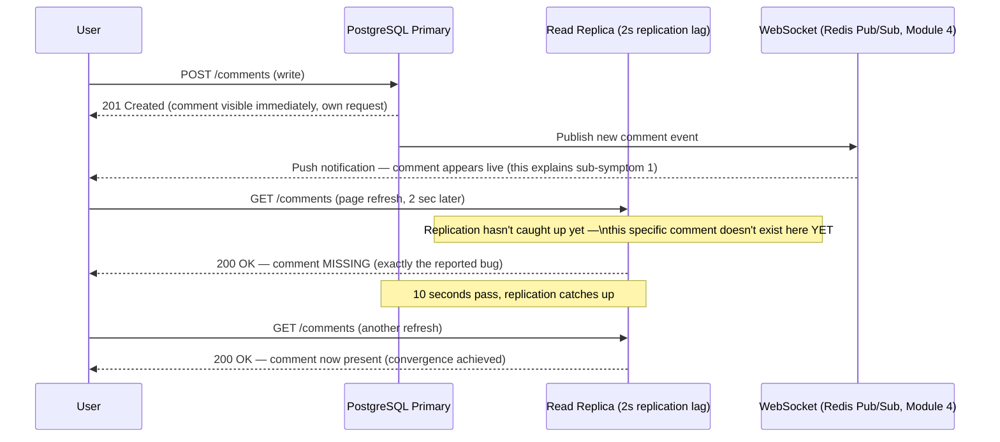
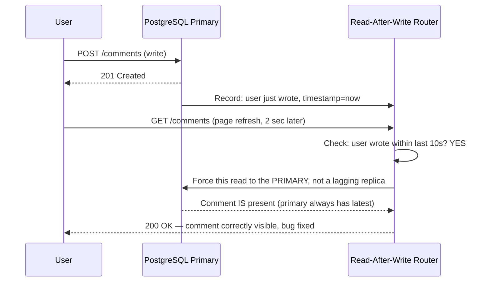
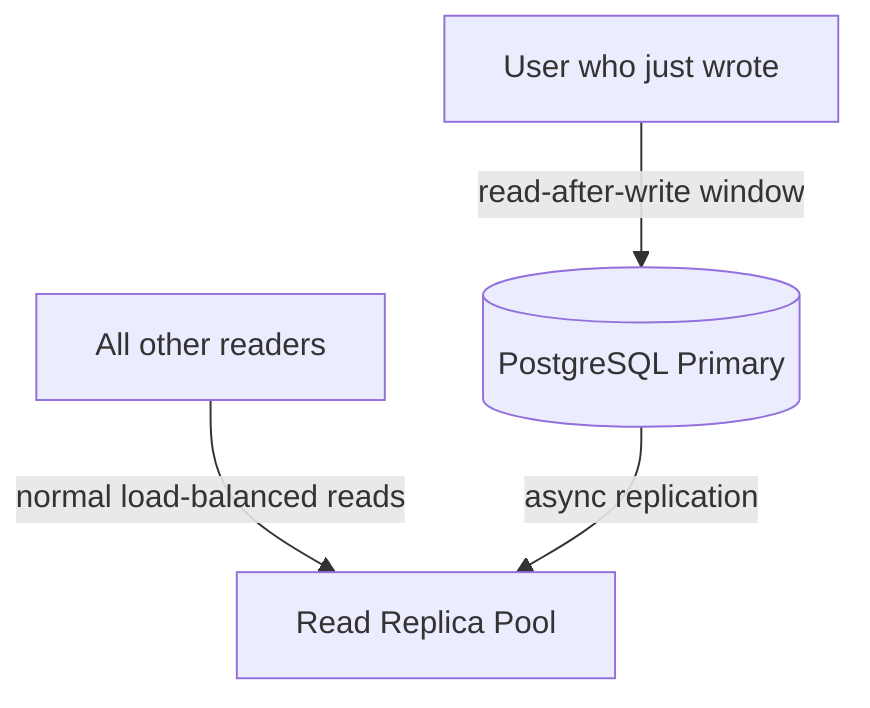
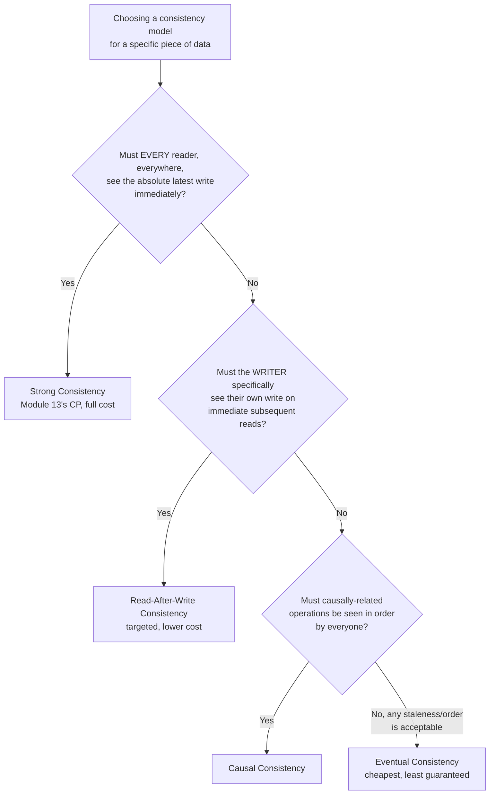
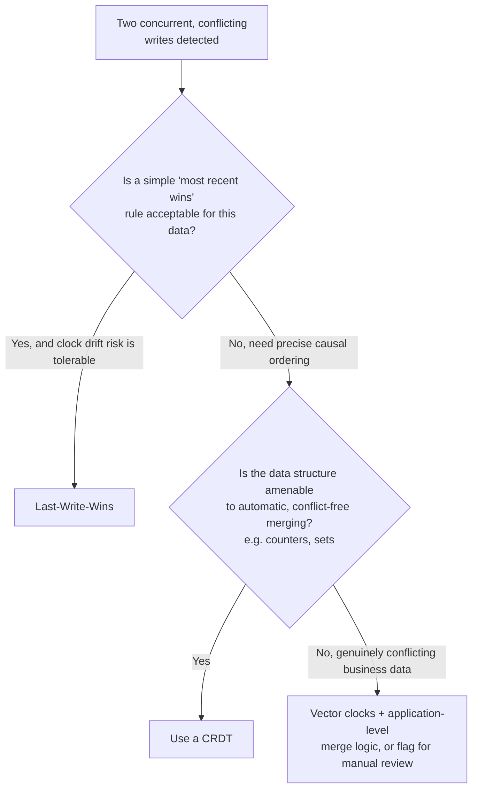
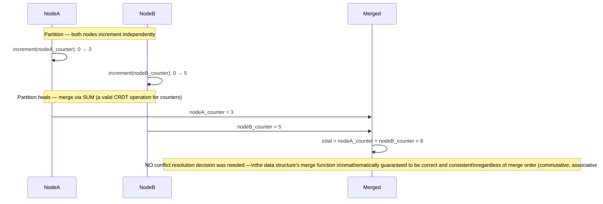
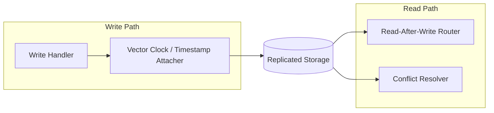
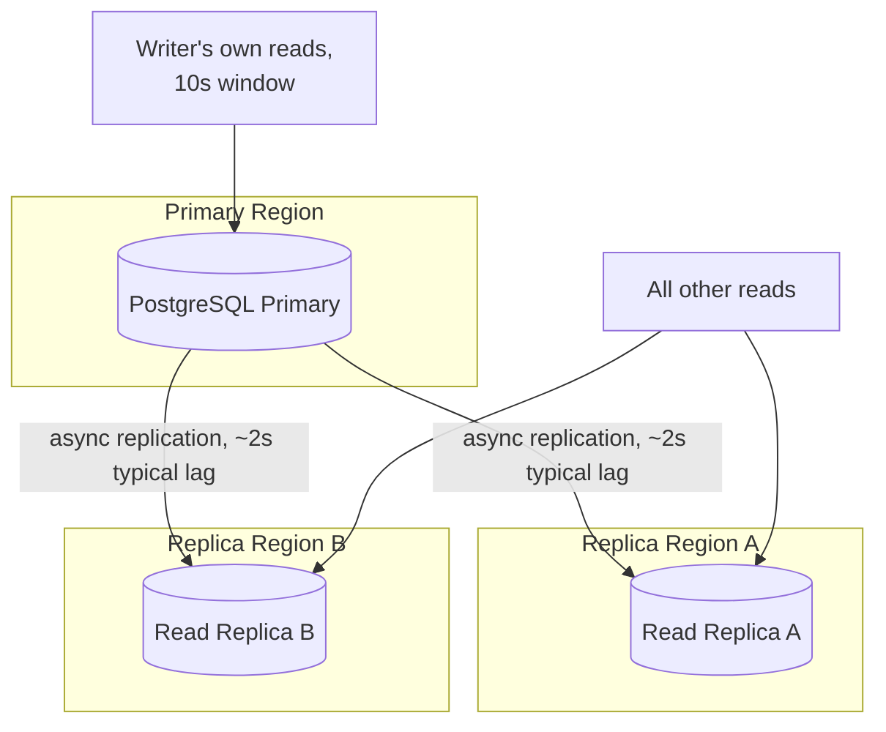

# Module 14 — Consistency Models

> **Masterclass:** System Design Masterclass (30 Modules)
> **Level:** Advanced
> **Audience:** Node.js backend developers, SDE‑2 / Senior Backend interview candidates, engineers transitioning into architecture roles
> **Prerequisite:** Modules 1–13 (System Design Intro through CAP Theorem)

---

## 1. Introduction

Module 13 used the word "Consistency" as if it were a single, binary property — either you have it (CP) or you've traded it away (AP). In reality, "consistency" is a **spectrum** with well-defined, named points along it, each offering a different, precise guarantee about what a reader can expect to see relative to writes happening elsewhere in the system. This module names those points precisely: **strong consistency**, **eventual consistency**, **read-after-write consistency**, and **causal consistency** — and gives you the vocabulary to choose correctly among them, rather than defaulting to the vague binary Module 13 necessarily simplified.

This module also directly resolves a loose thread from Module 13's Advanced Project: the "reconciliation logic" for the AP view-counter path needs a *precise* definition of what guarantee it's actually providing once the partition heals — that precise definition is exactly what this module supplies.

---

## 2. Learning Objectives

By the end of this module, you will be able to:

1. Explain **strong consistency (linearizability)** precisely, and its real performance cost.
2. Explain **eventual consistency** and the specific, bounded promise it makes (and doesn't make).
3. Explain **read-after-write (your-writes-visible) consistency** and why it's often the actual guarantee users expect, even when they say "consistency."
4. Explain **causal consistency** and why it sits at a genuinely useful middle point between strong and eventual.
5. Design **conflict resolution strategies** (last-write-wins, vector clocks, CRDTs at a conceptual level) for eventually consistent systems.
6. Map **real user-facing symptoms** (e.g., "my comment disappeared after I posted it") to the specific consistency model gap that caused them.
7. Choose the correct consistency model **per feature**, continuing Module 13's per-subsystem reasoning with much greater precision.

---

## 3. Why This Concept Exists

Module 13 established that AP systems accept some staleness in exchange for availability — but "some staleness" is dangerously vague. Vague enough that two engineers can both say "our system is eventually consistent" while building systems with wildly different, and sometimes unacceptable, real-world behavior. Does "eventually" mean milliseconds or hours? Can a user ever see their *own* write disappear and reappear? Can two users watching the same data see it change in a different *order* relative to each other?

Consistency models exist to answer these questions precisely, with formal, well-studied guarantees that have been implemented and battle-tested across real distributed databases. Understanding them precisely is what lets you specify, not just "this data is eventually consistent," but exactly **what a reader is guaranteed to see, and under what conditions** — which is the difference between a deliberate design decision and an accident waiting to become a support ticket.

---

## 4. Problem Statement

> Our blog platform's comment system (Modules 4, 11) uses Redis Pub/Sub for WebSocket fan-out and an eventually-consistent read replica (Module 15 preview) for the comments list API. A user reports: "I posted a comment, saw it appear immediately in my own browser, but when I refreshed the page two seconds later, my comment was gone — then it reappeared 10 seconds after that." Using this module's precise vocabulary, diagnose exactly which consistency guarantee is missing, propose the specific model that would fix this exact user-facing symptom, and explain why "just make everything strongly consistent" (Module 13's over-broad instinct) is not the most targeted fix.

---

## 5. Real-World Analogy

**Strong consistency is a single, shared whiteboard in one room that everyone reads from and writes to directly.** The moment someone writes on it, everyone looking at it sees the update instantly, and there's never any ambiguity about what's currently written — because there's only ever one whiteboard, one copy of the truth. This is exactly what it costs to guarantee: everyone must be in the same room, looking at the same physical object, which is slow and doesn't scale to a global audience (echoing Module 13's PACELC latency cost).

**Eventual consistency is a chain of photocopiers, each making a copy of the whiteboard on their own schedule, and distributing those copies to different regional offices.** Immediately after someone updates the original whiteboard, offices with stale, older photocopies won't see the change yet — but given enough time (with no new writes), every office's photocopy will eventually match the original. This is Section 4's exact symptom, mechanically explained: the user's own browser (which just made the write) might be looking at a *fresh* copy or the original, while a refresh moments later happens to route to a regional office whose photocopy hasn't caught up yet — hence "disappearing," only to "reappear" once that office's copy catches up.

**Read-after-write consistency is a rule added to the photocopier system: "the person who just wrote on the whiteboard is guaranteed to always be shown either the original or a copy that includes their own change — never an older one."** This is a much cheaper, more targeted guarantee than "everyone, always, sees the same whiteboard instantly" (strong consistency) — it only protects the *writer's own* subsequent reads, not every reader globally, but it happens to be exactly the guarantee that would fix Section 4's reported symptom.

**Causal consistency is a rule that photocopies must preserve "reply order"** — if Office B's copy shows a reply to a message, it's guaranteed to also show the original message being replied to (never the reply without its cause) — even though Office B might still be behind on other, causally-unrelated whiteboard updates from Office C.

---

## 6. Technical Definition

**Strong Consistency (Linearizability):** Every read reflects the most recent completed write, and all operations across all nodes appear to occur in a single, globally agreed-upon order — equivalent to CAP's precise definition of "Consistency" (Module 13, Section 6).

**Eventual Consistency:** Given no new writes to a piece of data, all replicas will, after some unspecified but finite amount of time, converge to the same value — makes no guarantee about *how long* convergence takes, nor about what any individual read sees *before* convergence.

**Read-After-Write Consistency (also called "your-writes-visible"):** A guarantee that a process which just performed a write will always see that write (or a later one) on its own subsequent reads, even if other processes may not yet see it.

**Causal Consistency:** A guarantee that operations which are causally related (one happened because of, or after seeing, another) are observed by all nodes in that same causal order — while operations with no causal relationship may be observed in different orders by different nodes.

**Conflict Resolution:** The process of determining the correct final value when two or more concurrent, conflicting writes have been accepted independently (typically under an AP/eventually-consistent model) and must be reconciled.

---

## 7. Core Terminology

| Term | Precise Definition | One-line Intuition |
|---|---|---|
| **Convergence** | The point at which all replicas of a piece of data hold the same value | "Everyone's photocopy finally matches" |
| **Staleness Window** | The time period during which a replica's data may not yet reflect the latest write | "How out-of-date a copy might be, right now" |
| **Last-Write-Wins (LWW)** | A simple conflict resolution strategy where the write with the latest timestamp is kept, others discarded | "Most recent timestamp survives, others are simply overwritten" |
| **Vector Clock** | A data structure tracking causal relationships between events across multiple nodes, more precise than a single timestamp | "A per-node counter set, revealing 'happened-before' relationships" |
| **CRDT (Conflict-free Replicated Data Type)** | A data structure specifically designed so that concurrent updates from different replicas can always be merged automatically, without conflict | "A data structure engineered to never actually need conflict resolution" |
| **Monotonic Read Consistency** | A guarantee that once a process has seen a value, it will never subsequently see an *older* value | "Time never appears to move backwards for you specifically" |

---

## 8. Internal Working

### Diagnosing Section 4's exact symptom, precisely

The user's report decomposes into two distinct sub-symptoms, each mapping to a different missing guarantee:

1. **"I posted a comment, saw it appear immediately in my own browser"** — this worked because the browser was likely rendering its own optimistic local state, or the WebSocket push (Module 4's Redis Pub/Sub) delivered the new comment directly, bypassing the eventually-consistent read replica entirely.
2. **"When I refreshed the page two seconds later, my comment was gone"** — the page refresh triggered a fresh `GET /posts/:id/comments` call, which was served by a **read replica** that had not yet received the new comment via replication (Section 5's "office with a stale photocopy") — this is eventual consistency's staleness window, made directly, jarringly visible to the exact user who caused the write.
3. **"Then it reappeared 10 seconds after that"** — the replica's replication lag caught up, and convergence (Section 7) occurred, exactly as eventual consistency promises it eventually will.

**The precise fix is read-after-write consistency, not strong consistency across the board.** The core insight: **the reported symptom only matters for the writer's own immediate subsequent reads** — other users, who never wrote this comment, might be perfectly fine seeing a few seconds of staleness (the same argument Module 13 made for the view counter). Applying full strong consistency (Module 13's CP-everywhere over-broad instinct) would fix this symptom, but at the cost of the full latency/availability penalty (Module 13's PACELC) for **every single reader**, when the actual problem only affects the **one user who just wrote**.

### How read-after-write consistency is actually implemented

The most common practical technique: **route the writer's own subsequent reads to the primary (or a replica confirmed to be caught up), for a short window after their write**, rather than allowing them to be randomly load-balanced (Module 8) to any replica, some of which may be lagging.

```javascript
async function getCommentsForUser(postId, userId) {
  const recentWriteTimestamp = await redis.get(`user:${userId}:last_comment_write`);
  const isWithinReadAfterWriteWindow = recentWriteTimestamp &&
    (Date.now() - Number(recentWriteTimestamp) < 10000); // 10-second window

  if (isWithinReadAfterWriteWindow) {
    return commentRepository.findByPostId(postId, { useReplica: false }); // force PRIMARY read
  }
  return commentRepository.findByPostId(postId, { useReplica: true }); // normal load-balanced replica read
}
```

**Why this precisely and narrowly fixes Section 4's symptom, without Module 13's over-broad cost:** only the specific user who just wrote gets routed to the primary, and only for a short window afterward — every *other* reader continues to benefit from the replica's lower latency and load-balanced availability (Module 8), completely unaffected by this targeted fix.

### Why causal consistency matters even when full strong consistency is too expensive

Consider a scenario Section 4 doesn't cover but is closely related: a comment reply. If Comment B is a reply to Comment A, and a reader sees Comment B (the reply) rendered on the page, **causal consistency guarantees they must also see Comment A** (the original) — even under an eventually consistent system that hasn't fully converged yet for *other*, unrelated data. Without this guarantee, a reader could see a confusing reply to a comment that, from their perspective, doesn't yet exist — a genuinely disorienting user experience that eventual consistency alone (with no causal ordering guarantee) doesn't prevent.

---

## 9. Request Lifecycle

### Mermaid Sequence Diagram — Section 4's Bug, Precisely Diagrammed



### Mermaid Sequence Diagram — The Fix, Read-After-Write Consistency Applied



**Step-by-step explanation:** the fix targets **exactly** the failure point identified in Section 8 — routing only the affected user's immediate subsequent read to a source guaranteed to be current, while leaving the broader read-scaling architecture (replicas, Module 8's load balancing) completely intact for everyone else.

---

## 10. Architecture Overview



**HLD-level insight:** this diagram is the direct architectural resolution of Section 4 — notice the vast majority of read traffic (everyone who *isn't* the writer) still benefits from the full replica pool's scalability (Module 2's horizontal read scaling), while only a narrow, specifically-identified slice of traffic (the writer's own immediate reads) receives the more expensive, primary-routed treatment — a precise, cost-proportional fix rather than a blanket, expensive one.

---

## 11. Capacity Estimation

**Scenario:** Estimating the added load on the PostgreSQL primary from implementing read-after-write consistency.

**Given:** 500 comments posted/second at peak (Module 11's figure), and each commenter checks their own comment (triggering a read-after-write-routed read) an average of 1.5 times within the 10-second window.

**Step 1 — Additional primary read load:**
```
500 writes/sec × 1.5 read-after-write reads each = 750 additional reads/sec routed to the PRIMARY
```

**Step 2 — Compare against total read volume (recall Module 7's 5,000 req/s figure, mostly reads):**
```
750 / 5,000 ≈ 15% of total read traffic now requires primary routing
```

**Conclusion:** this is a **meaningful, non-trivial** additional load on the primary — a genuinely important number to have calculated *before* implementing this fix, since it directly informs whether the primary's current capacity (Module 5/6) can absorb this 750 req/s addition, or whether it requires its own scaling consideration. This is exactly the kind of quantitative check that separates "I'll add read-after-write consistency" as a hand-wave from a properly justified, capacity-aware design decision.

---

## 12. High-Level Design (HLD)



**HLD-level insight:** this decision flow is a direct, precise refinement of Module 13, Section 12's cruder CP-vs-AP flow — it replaces the binary choice with **four genuinely distinct points on a spectrum**, letting you match a feature's actual requirement far more precisely, and typically far more cheaply, than defaulting to either extreme.

---

## 13. Low-Level Design (LLD)

### Vector clocks for causal consistency (conceptual implementation)

```javascript
class VectorClock {
  constructor(nodeId, nodeIds) {
    this.nodeId = nodeId;
    this.clock = Object.fromEntries(nodeIds.map(id => [id, 0]));
  }

  increment() {
    this.clock[this.nodeId]++;
    return { ...this.clock };
  }

  // Determines if `a` happened-before `b` (a is a causal ancestor of b)
  static happenedBefore(a, b) {
    return Object.keys(a).every(node => a[node] <= b[node]) &&
           Object.keys(a).some(node => a[node] < b[node]);
  }

  static areConcurrent(a, b) {
    return !VectorClock.happenedBefore(a, b) && !VectorClock.happenedBefore(b, a);
  }
}

// Usage: attach a vector clock snapshot to every write, to determine causal ordering later
const clockA = new VectorClock('nodeA', ['nodeA', 'nodeB']);
const commentAClock = clockA.increment(); // { nodeA: 1, nodeB: 0 }

const clockB = new VectorClock('nodeB', ['nodeA', 'nodeB']);
clockB.clock = { ...commentAClock }; // nodeB has seen commentA's clock (causally aware)
const replyClock = clockB.increment(); // { nodeA: 1, nodeB: 1 }

console.log(VectorClock.happenedBefore(commentAClock, replyClock)); // true — reply causally follows comment
```

**LLD-level design note:** this is precisely the mechanism that would let a system correctly enforce Section 8's "never show a reply without its parent comment" causal guarantee — by comparing vector clocks, the system can determine that `replyClock` causally depends on `commentAClock`, and can therefore refuse to display the reply on any replica that hasn't yet also received the original comment.

### Last-write-wins conflict resolution (simpler, more common in practice)

```javascript
function resolveConflict(writeA, writeB) {
  // Simplest strategy: whichever write has the later timestamp wins, other is discarded
  return writeA.timestamp >= writeB.timestamp ? writeA : writeB;
  // WARNING: relies on wall-clock timestamps — recall Module 12, Section 8's
  // clock-drift lesson; LWW is simple but can silently pick the WRONG winner
  // if clocks are meaningfully out of sync between the nodes that produced writeA and writeB
}
```

**Why this LLD example deliberately includes its own warning:** Last-Write-Wins is the **most commonly used** conflict resolution strategy in practice (it's simple, and "good enough" for many use cases, like the Section 4 view-counter scenario from Module 13), but it inherits exactly the clock-drift risk Module 12 warned about — a genuinely important, precise caveat to state explicitly in any design discussion recommending LWW.

---

## 14. ASCII Diagrams

```
THE CONSISTENCY SPECTRUM (strongest to weakest guarantee)

  STRONG          CAUSAL           READ-AFTER-WRITE      EVENTUAL
  (linearizable)  (preserves        (writer sees own       (converges
                   cause→effect      writes; others         eventually,
                   order for all)    may lag)                no ordering
                                                              guarantee)

  Highest cost                                              Lowest cost
  (latency,                                                 (fastest,
  availability)                                             most available)

  Use for:         Use for:          Use for:                Use for:
  financial        comment threads,  "did my own post        view counts,
  transactions,     reply chains      save?" UX                like counts,
  inventory                                                    activity feeds
```

---

## 15. Mermaid Flowcharts

*(Section 12 covers the canonical consistency-model decision flow for this module.)*

### Conflict Resolution Decision Flow



---

## 16. Mermaid Sequence Diagrams

*(Section 9 covers the two canonical sequence diagrams for this module. Additional diagram below.)*

### CRDT-Based Conflict-Free Counter (Conceptual)



**Why this matters, directly extending Module 13's view-counter scenario:** a naively-implemented "shared counter" under AP/eventual consistency risks exactly the kind of conflict Section 13's Last-Write-Wins warning describes (which write "wins"?). A **CRDT-based counter**, by contrast, is specifically designed so that merging two independently-incremented copies is always simply correct (summing per-node counters) — **no conflict resolution decision is ever needed**, because the data structure's mathematics guarantees a correct merge regardless of order or timing. This is precisely why Module 13's Advanced Project asked you to implement reconciliation logic for the view counter — a per-node counter CRDT is the theoretically clean, precise answer to that exercise.

---

## 17. Component Diagrams



**Why `ClockAttacher` and `ConflictResolver` are distinct, explicit components:** this structure makes visible exactly **where** in the system causal metadata is created (at write time) and exactly **where** conflicts are resolved (at merge/read time) — a system that handles this implicitly, scattered across ad-hoc code, is far harder to reason about correctly than one where these responsibilities are isolated, named components, directly echoing this course's repeated "isolate what changes" architectural principle.

---

## 18. Deployment Diagrams



**Deployment-level note:** this is the concrete, multi-region realization of Section 10's HLD — read-after-write routing must correctly identify and redirect only the writer's own traffic to the primary, **regardless of which region that writer happens to be closest to**, a real, non-trivial routing requirement once the architecture spans multiple regions (foreshadowing Module 27's fuller multi-region treatment).

---

## 19. Network Diagrams

Consistency model choice has a direct, quantifiable relationship to Module 3's network latency lessons: **strong consistency requires a round trip to wherever the authoritative copy lives**, while eventual consistency allows reading from whichever replica is closest:

```
  STRONG CONSISTENCY READ                 EVENTUALLY CONSISTENT READ

  User (Tokyo) ──────────────────▶        User (Tokyo) ──▶ Nearby Replica (Tokyo)
              180ms to Primary                          15ms, but possibly stale
              (Virginia, Module 3's
              distance-latency cost)
```

**This is precisely why global-scale systems often deliberately choose eventual or causal consistency for as much data as their correctness requirements allow** — every strong-consistency read pays Module 3's full distance-latency cost, while an eventually-consistent read can be served from the nearest replica (Module 10's CDN-adjacent reasoning, now applied to database reads rather than static content).

---

## 20. Database Design

Different consistency models map to different, concrete PostgreSQL/read-replica configuration choices, extending Module 13, Section 20's `synchronous_commit` example:

```sql
-- For data needing READ-AFTER-WRITE consistency specifically:
-- Application-level routing (Section 8's getCommentsForUser) is typically used,
-- since PostgreSQL doesn't have a single built-in "read-your-writes" flag —
-- this guarantee is usually implemented at the application/routing layer, not the DB layer.

-- For data needing CAUSAL consistency:
-- Some databases (e.g., MongoDB with "causally consistent sessions") support this natively:
-- session = client.startSession({ causalConsistency: true });
-- All reads/writes within this session are guaranteed causally ordered.
```

**Why this matters:** not every consistency model is a database configuration flag — read-after-write and causal consistency are often **application-layer responsibilities** (as Section 8/13 implemented), while strong vs. eventual is more often a genuine database/replication configuration choice (Module 13, Section 20). Knowing *which layer* is responsible for enforcing a given guarantee is itself an important, testable piece of system design knowledge.

---

## 21. API Design

Building on Module 13, Section 21's per-endpoint consistency labeling, this module lets us be more precise still:

```
GET /posts/:id/comments                    → eventual consistency (default, fast, replica-served)
GET /posts/:id/comments?after_my_write=true → read-after-write consistency (forces primary read
                                               for a short window after the caller's own write)
```

**Why exposing this as an explicit, opt-in query parameter (rather than always forcing it) is a deliberate design choice:** it lets the client signal precisely when the stronger guarantee is needed (e.g., immediately after the user's own comment submission), rather than unconditionally paying Section 11's calculated primary-load cost for every single comment-list request, most of which don't actually need it.

---

## 22. Scalability Considerations

| Consistency Model | Read Scalability | Write Scalability | Latency (Module 3/13's PACELC) |
|---|---|---|---|
| Strong | Limited — often single authoritative source | Limited — requires coordination | High (round trip to authoritative source) |
| Read-After-Write | High for most traffic, targeted exception for writers | Same as underlying replication strategy | Low for most reads, high only for the writer's own window |
| Causal | Moderate — requires tracking/propagating causal metadata | Moderate | Low-to-moderate |
| Eventual | Highest — any replica can serve any read | Highest — writes accepted independently | Lowest |

---

## 23. Reliability & Fault Tolerance

- **Read-after-write consistency's primary-routing requirement reintroduces a partial dependency on the primary's availability** for the specific, narrow slice of traffic it affects — directly connecting back to Module 13's CP-during-partition cost, now scoped precisely rather than applied broadly.
- **CRDTs (Section 16) provide a genuinely elegant reliability property**: because their merge function is mathematically guaranteed correct regardless of order, they eliminate an entire class of reconciliation bugs that Last-Write-Wins or manual conflict resolution can introduce — a real, meaningful reliability advantage for the specific data shapes (counters, sets, certain collaborative structures) they support.
- **Causal consistency's ordering guarantee prevents a specific, real class of confusing failure** (Section 8's "reply without its parent") that pure eventual consistency doesn't protect against, at a lower cost than full strong consistency.

---

## 24. Security Considerations

- **Vector clocks and causal metadata can leak information about system topology or timing** if exposed directly to clients — treat causal metadata as internal implementation detail, not a client-facing API contract, unless deliberately designed and reviewed as such.
- **Read-after-write routing logic must correctly and securely identify "the writer"** (Section 8's `userId`-keyed lookup) — an insecure or spoofable identification mechanism here could let a malicious client force disproportionate load onto the primary by falsely claiming eligibility for primary-routed reads, a subtle but real abuse vector worth considering.

---

## 25. Performance Optimization

- **Scope read-after-write consistency as narrowly as possible** (Section 11's calculated cost) — both in *which users* it applies to (only recent writers) and *how long* the window lasts (Section 8's 10-second example is a deliberate, tunable trade-off between correctness and primary load).
- **Prefer CRDTs over general-purpose conflict resolution wherever the data shape allows** — eliminating the need for conflict resolution logic entirely is strictly better than needing to run it correctly and efficiently.
- **Batch causal metadata propagation where possible**, rather than attaching and checking vector clocks on every single, individual operation, if per-operation overhead becomes measurable at scale.

---

## 26. Monitoring & Observability

- **Replication lag, measured directly** (the actual time gap between a write committing on the primary and appearing on each replica) — this is the literal, measurable size of the eventual-consistency staleness window (Section 7), and should be a first-class, alerted metric, not an assumed constant.
- **Read-after-write routing hit rate** — what fraction of reads are actually being routed to the primary due to the recency window, directly validating (or invalidating) the Section 11 capacity estimate against real production traffic.
- **Conflict resolution frequency and outcome distribution** (for LWW or vector-clock-based systems) — a rising conflict rate can signal increasing concurrent-write contention worth investigating architecturally, not just resolving mechanically.

---

## 27. Common Bottlenecks

| Bottleneck | Symptom | Root Cause |
|---|---|---|
| Replication lag spikes | Eventual consistency staleness window grows unexpectedly | Replica under resource pressure, or network degradation between primary and replica (Module 3) |
| Read-after-write window miscalibrated | Either the original bug persists (window too short) or excessive primary load (window too long) | Window duration not matched to actual, measured replication lag |
| Last-Write-Wins silently picking the wrong winner | Data appears to "revert" unexpectedly | Clock drift (Module 12) between nodes producing conflicting writes |
| Causal metadata overhead at scale | Elevated latency/storage cost for high-frequency operations | Vector clocks or causal tracking applied more broadly than actually required |

---

## 28. Trade-off Analysis

> "I chose **read-after-write consistency**, scoped to a 10-second window for the writer only, over full strong consistency for the comments feature, optimizing for **fixing the exact reported user-facing bug at a fraction of the cost**, at the cost of **added routing complexity and a calculated 15% increase in primary read load (Section 11)**, which is acceptable because the primary has sufficient headroom to absorb this increase, and the alternative (strong consistency for all readers) would cost far more in latency and availability for the 99%+ of reads that don't actually need it."

> "I chose a **CRDT-based counter** over Last-Write-Wins for the view-count reconciliation logic (extending Module 13's Advanced Project), optimizing for **mathematically guaranteed-correct merges with zero conflict resolution logic needed**, at the cost of **a slightly more specialized data structure and merge implementation than a simple LWW timestamp comparison**, which is acceptable because counters are exactly the data shape CRDTs handle elegantly, and eliminating an entire class of clock-drift-related bugs (Section 13's LWW warning) is a meaningful reliability win."

---

## 29. Anti-patterns & Common Mistakes

1. **Saying "eventually consistent" without specifying the staleness window or bound** — a genuinely meaningless claim without a measured or configured bound (Section 26's replication-lag monitoring exists precisely to make this concrete).
2. **Applying strong consistency platform-wide to fix a narrow, specific symptom** (Section 4's exact trap) — a common, expensive overcorrection when a targeted read-after-write fix would resolve the actual reported issue at a fraction of the cost.
3. **Using Last-Write-Wins for data where clock drift risk is unacceptable**, without at least considering vector clocks or a CRDT alternative (Section 13's explicit warning).
4. **Exposing internal causal metadata (vector clocks) directly in a public API** — an implementation detail leak with both security (Section 24) and API-stability implications.
5. **Assuming causal consistency where only eventual consistency is actually implemented** — a genuine correctness gap (Section 8's "reply without its parent" scenario) if the underlying system doesn't actually track and enforce causal ordering.
6. **Never measuring actual replication lag**, treating eventual consistency's staleness window as a theoretical concern rather than an observable, sometimes-surprising real number.

---

## 30. Production Best Practices

- **Match the consistency model to the specific, precise requirement of each feature** (Section 12's decision flow), rather than defaulting to either extreme of the spectrum.
- **Measure and monitor actual replication lag** continuously — treat it as a real, variable, observable system property, not an assumed constant.
- **Scope read-after-write consistency narrowly** — to the specific writer, for the shortest window that empirically resolves the actual user-facing symptom.
- **Prefer CRDTs for conflict-prone data shapes that support them** (counters, sets, some collaborative editing structures) over general-purpose, more error-prone conflict resolution.
- **Document, per API endpoint, exactly which consistency guarantee applies** (Section 21), so consumers can build correctly against the actual guarantee, not an assumed one.

---

## 31. Real-World Examples

- **Amazon's shopping cart service** (the original motivating use case for DynamoDB, referenced in Modules 5 and 13) is a widely-cited real example of a system deliberately choosing eventual consistency with application-level conflict resolution (merging cart contents rather than picking a single "winning" cart) — precisely because losing a "last write wins" battle over a shopping cart (silently dropping an item a customer added) is a worse user experience than briefly showing a slightly stale cart that then correctly merges.
- **Google Docs and other collaborative editing tools** rely on data structures and algorithms closely related to CRDTs (Section 16) to allow multiple simultaneous editors to make independent, concurrent changes that always merge correctly, without requiring a central lock or strong consistency across every keystroke — a large-scale, real-world validation of Section 16's "no conflict resolution decision needed" property.
- **Facebook's and Twitter's various consistency model choices across different subsystems** (documented in various engineering blog posts over the years) explicitly differentiate between strongly consistent needs (e.g., a user's own post immediately visible to them — read-after-write) and eventually consistent, high-scale needs (e.g., global like/follower counts) — a direct, large-scale, real-world instance of this module's Section 12 decision framework in practice.

---

## 32. Node.js Implementation Examples

### A simple CRDT-style G-Counter (Grow-only Counter) implementation, resolving Module 13's Advanced Project precisely

```javascript
class GCounter {
  constructor(nodeId) {
    this.nodeId = nodeId;
    this.counts = {}; // per-node counts, e.g., { nodeA: 3, nodeB: 5 }
  }

  increment(amount = 1) {
    this.counts[this.nodeId] = (this.counts[this.nodeId] || 0) + amount;
  }

  value() {
    return Object.values(this.counts).reduce((sum, c) => sum + c, 0);
  }

  // Merging two G-Counters is ALWAYS correct, regardless of order — the CRDT guarantee
  merge(other) {
    const merged = new GCounter(this.nodeId);
    const allNodes = new Set([...Object.keys(this.counts), ...Object.keys(other.counts)]);
    for (const node of allNodes) {
      merged.counts[node] = Math.max(this.counts[node] || 0, other.counts[node] || 0);
    }
    return merged;
  }
}

// Simulating Module 13's exact partition scenario:
const nodeA = new GCounter('nodeA');
nodeA.increment(3); // views incremented locally during partition

const nodeB = new GCounter('nodeB');
nodeB.increment(5); // views incremented locally during partition, independently

const reconciled = nodeA.merge(nodeB);
console.log(reconciled.value()); // 8 — correct, deterministic, no conflict resolution decision needed
```

**Why `Math.max` per node, not simple addition, is the correct merge operation:** using `Math.max` per-node-key (rather than blindly summing) makes this merge **idempotent** — merging the same state twice doesn't double-count — a subtle but critical CRDT correctness property that a naive "just add the totals together" approach would violate if the same merge were accidentally applied more than once (a real, plausible scenario under Module 11's at-least-once delivery semantics).

---

## 33. Interview Questions

### Easy
1. What is the difference between strong consistency and eventual consistency?
2. What does "read-after-write consistency" specifically guarantee, and for whom?
3. What is causal consistency, and how does it differ from full strong consistency?
4. What is Last-Write-Wins, and what's its main risk?
5. What is a CRDT, and what problem does it solve?
6. Why is "eventually consistent" considered an incomplete statement without more detail?

### Medium
7. Diagnose the exact consistency-model gap behind a user reporting "my own comment disappeared after I posted it, then came back later."
8. Design a targeted fix for the above symptom that doesn't require applying strong consistency to the entire system.
9. Explain why a G-Counter CRDT's merge function uses `max` per node rather than summing the merged totals directly.
10. Why might causal consistency be preferable to eventual consistency for a comment-reply feature specifically?
11. Explain the clock-drift risk inherent in Last-Write-Wins conflict resolution, referencing Module 12's foundational lesson.
12. Design an API contract that lets clients explicitly opt into read-after-write consistency only when needed.

### Hard
13. Design a complete consistency strategy for a collaborative document editor, addressing which operations need causal consistency, which need strong consistency, and which can be eventually consistent.
14. Explain, with a vector clock example, how a causally consistent system determines that two operations are concurrent versus causally ordered.
15. A shopping cart service uses eventual consistency with a custom merge function instead of Last-Write-Wins. Explain why LWW would be a poor choice for this specific data, and design the merge logic that should replace it.
16. Discuss the trade-off between the size of a read-after-write consistency window and both correctness (does it fully fix the symptom) and cost (primary load), and propose a method for empirically determining the correct window size for a real system.
17. Design a monitoring and alerting strategy that would proactively catch a growing eventual-consistency staleness window before it produces user-visible symptoms like Section 4's bug report.

---

## 34. Scenario-Based Design Questions

1. **Scenario:** A user reports that after editing their profile, the change didn't appear when they immediately viewed their own profile page, but did appear a few seconds later. Diagnose and propose the specific, targeted fix.
2. **Scenario:** Your team debates whether a "notification read/unread" status needs causal consistency or if eventual consistency is sufficient. Walk through the reasoning.
3. **Scenario:** Two users simultaneously edit the same shared document field during a network partition, and your system uses Last-Write-Wins. Diagnose why one user's edit was silently lost, and propose an alternative approach.
4. **Scenario:** Your monitoring shows replication lag has grown from 200ms to 8 seconds over the past week, with no corresponding traffic increase. Propose your diagnostic approach.
5. **Scenario:** An interviewer asks you to design "Google Docs' collaborative editing consistency model." Discuss which parts of this module's spectrum apply to which aspects of the feature.
6. **Scenario:** Your read-after-write consistency window is set to 10 seconds, but users occasionally still report the bug when they refresh very quickly. Propose two possible explanations and fixes.
7. **Scenario:** A finance team requests that transaction history "always be immediately visible to the account holder after each transaction," but is fine with other views (e.g., aggregate reports) being eventually consistent. Design the appropriate mixed-consistency architecture.
8. **Scenario:** You need to implement a "friend request accepted" notification that must never be shown before the "friend request sent" notification, even under eventual consistency elsewhere in the system. Propose the consistency model and mechanism.
9. **Scenario:** Your team is evaluating whether to build custom vector-clock-based conflict resolution or adopt an off-the-shelf CRDT library for a real-time collaborative feature. Discuss the trade-offs of each approach.
10. **Scenario:** A stakeholder asks why your system's consistency guarantees differ across different API endpoints, viewing this as inconsistent design. Explain why this is actually a deliberate, well-reasoned choice, not an inconsistency in the pejorative sense.

---

## 35. Hands-on Exercises

1. Implement the `GCounter` CRDT from Section 32, simulate a partition (two independent increment sequences), merge them, and verify the result matches manual addition — then verify that merging twice (simulating a duplicate merge) does NOT double-count, confirming idempotency.
2. Implement the read-after-write routing function from Section 8, write a test simulating a "recent writer" and a "normal reader" hitting the same endpoint, and verify they're routed to different sources (primary vs. replica) correctly.
3. Implement Last-Write-Wins conflict resolution, then deliberately introduce simulated clock drift (offsetting one write's timestamp) and observe it incorrectly "winning" against a chronologically later write — a concrete demonstration of Section 13's warning.
4. Implement the `VectorClock` class from Section 13, and write test cases verifying `happenedBefore` and `areConcurrent` correctly classify at least three different pairs of causally related and unrelated events.
5. Measure real replication lag on a local PostgreSQL primary-replica setup by writing a row, then polling the replica in a tight loop and recording the time until the row appears — producing your own empirical staleness-window measurement.

---

## 36. Mini Project

**Build:** A fix for the exact Module 14 Section 4 bug, implemented end to end on the blog platform.

**Requirements:**
- Implement the read-after-write routing logic (Section 8/13) for the comments-list endpoint, keyed by user ID and a configurable time window.
- Implement replication lag measurement/logging (Section 26) between your primary and replica.
- Write an automated test that reproduces the original bug (a comment temporarily missing from a replica-served read) and then verifies the fix (the same read, within the write-after window, correctly shows the comment via primary routing).
- Document, in `CONSISTENCY_MODEL.md`, which consistency guarantee applies to which specific endpoint in your API, following Section 21's labeling approach.

**Success criteria:** Your automated test suite demonstrates both the original bug (without the fix) and its resolution (with the fix), and your documentation clearly specifies the consistency guarantee for every comment-related endpoint.

---

## 37. Advanced Project

**Build:** Extend the Mini Project with a CRDT-based counter and a causal consistency mechanism for comment replies.

1. Implement the `GCounter` CRDT (Section 32) for the view-count feature, replacing any Last-Write-Wins or naive-sum approach, and write a test simulating a partition-then-merge scenario, verifying correctness and idempotency.
2. Implement basic causal consistency for comment replies using vector clocks (Section 13): ensure a reply is never returned by the API without its parent comment also being present in the same response, even under simulated replication lag affecting the parent comment specifically.
3. Measure and report the actual added primary-read load (Section 11's estimate) from your read-after-write implementation under a realistic load test, comparing your measured number against the calculated estimate.
4. Write a decision document classifying every major data type in your blog platform (posts, comments, view counts, user profiles, notifications) along this module's consistency spectrum, with justification for each — producing a comprehensive, precise consistency model specification for the entire system built across this masterclass so far.

**Success criteria:** You have a working, tested CRDT-based counter with demonstrated idempotent merging, a working causal consistency guarantee for comment replies with a test proving it holds even under simulated lag, measured (not just estimated) primary-load impact, and a complete, per-data-type consistency classification document — setting up Module 15 (Database Replication & Sharding), which examines in full depth the replication mechanisms (leader-follower, multi-leader) that this module has been assuming as a backdrop throughout.

---

## 38. Summary

- **Consistency is a spectrum, not a binary** — strong, causal, read-after-write, and eventual consistency each offer a distinct, precise guarantee with a different cost, and real systems should choose deliberately among them per data type.
- **Read-after-write consistency** is often the actual guarantee users expect when they informally say "I want consistency" — and is dramatically cheaper to provide than full strong consistency, because it only needs to protect the writer's own immediate subsequent reads.
- **Causal consistency** prevents a specific, real class of confusing failure (effects appearing before their causes) at a lower cost than full strong consistency.
- **CRDTs eliminate conflict resolution entirely** for data shapes they support (counters, sets), providing a mathematically guaranteed-correct merge regardless of order — a meaningfully stronger reliability property than Last-Write-Wins.
- **Last-Write-Wins is simple but inherits clock-drift risk** (Module 12) — a real, if often small, correctness risk worth explicitly weighing against its simplicity.

---

## 39. Revision Notes

- Consistency spectrum: Strong (linearizable) → Causal (preserves cause→effect order) → Read-After-Write (writer sees own writes) → Eventual (converges, no ordering promise)
- Read-after-write = cheapest fix for "why did MY OWN write disappear" bugs — route only the writer's subsequent reads to a guaranteed-current source
- Causal consistency prevents "effect before cause" (e.g., reply shown without its parent comment)
- CRDTs (e.g., G-Counter) = mathematically guaranteed-correct merges, NO conflict resolution logic needed, use `max` per node for idempotent merging
- Last-Write-Wins = simple, common, but inherits clock-drift risk (Module 12) — silently picks wrong winner if clocks are skewed
- Always measure actual replication lag — "eventually consistent" without a measured bound is an incomplete, unverifiable claim

---

## 40. One-Page Cheat Sheet

```
SYSTEM DESIGN — MODULE 14 CHEAT SHEET
─────────────────────────────────────
THE CONSISTENCY SPECTRUM (strongest → weakest, cost decreasing)
  Strong (linearizable)     → everyone sees latest write, always
  Causal                    → cause→effect order preserved for all
  Read-After-Write          → WRITER sees own writes; others may lag
  Eventual                  → converges eventually, no ordering promise

READ-AFTER-WRITE = the cheap, targeted fix for
  "why did MY OWN write temporarily disappear?" bugs
  → route ONLY the writer's own reads to a guaranteed-current source

CONFLICT RESOLUTION OPTIONS
  Last-Write-Wins  → simple, BUT inherits clock-drift risk (Module 12)
  Vector Clocks     → precise causal ordering, more overhead
  CRDTs             → mathematically guaranteed-correct merge, NO
                       conflict decision needed (counters, sets, etc.)

GOLDEN RULES
  Never say "eventually consistent" without a measured staleness bound
  Match consistency model to the SPECIFIC feature's actual requirement
  Prefer read-after-write over full-strong when only the writer is affected
  Prefer CRDTs over LWW wherever the data shape allows it
  Always measure real replication lag — don't assume it
```

---

## Key Takeaways

- "Consistency" is not one guarantee — it's a spectrum, and the specific point you choose should be driven by the exact user-facing requirement, not a vague sense of caution.
- Read-after-write consistency is very often the actual fix for "consistency bugs" users report, at a fraction of full strong consistency's cost — precisely diagnosing which guarantee is missing (Section 8's method) is the real skill.
- CRDTs represent a genuinely elegant category of solution: eliminating the need for conflict resolution decisions entirely, for the specific data shapes they support, rather than managing conflict resolution more cleverly.

## 20 Practice Questions
*(See Section 33 — 6 Easy, 6 Medium, 5 Hard — plus 3 rapid-fire additions:)*
18. Why is read-after-write consistency considered a special case optimized for a narrower guarantee than full strong consistency?
19. What specific property of a G-Counter's merge function makes it safe to apply even if the same merge accidentally happens twice?
20. Why might a system deliberately choose different consistency models for different fields within the very same database record?

## 10 Scenario-Based Questions
*(See Section 34 in full.)*

## 5 Design Assignments
*(See Sections 36–37 — Mini Project and Advanced Project — plus:)*
1. Classify, along this module's full spectrum, the appropriate consistency model for five distinct fields of a hypothetical multiplayer game's player profile (health, inventory, chat messages, leaderboard rank, friend list).
2. Design a causal consistency mechanism for a threaded discussion forum, ensuring replies never appear before their parent posts, even under significant replication lag.
3. Write a one-page comparison of Last-Write-Wins versus a CRDT-based approach for a hypothetical "shared shopping list" feature where multiple users can add/remove items concurrently.

## Suggested Next Module

**→ Module 15: Database Replication & Sharding** — with the full spectrum of consistency models now precisely understood, we examine the actual replication mechanisms — leader-follower, multi-leader, read replicas — and the sharding strategies that put these consistency models into concrete, physical, production practice.
