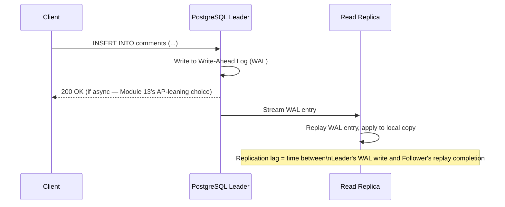
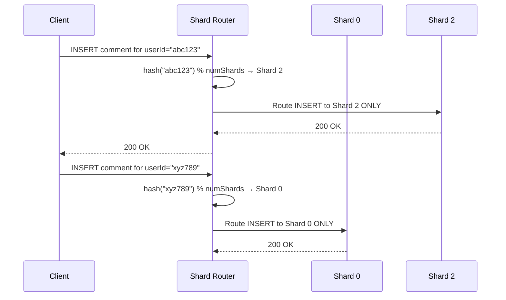
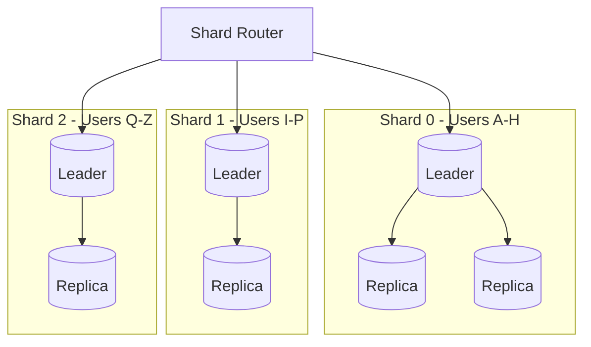
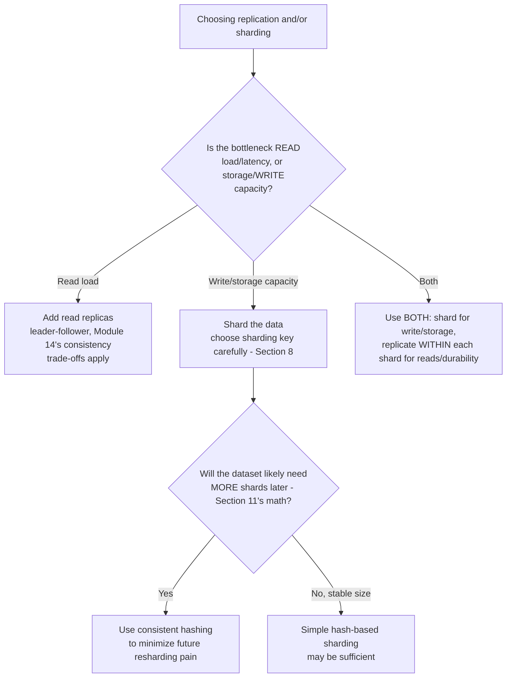
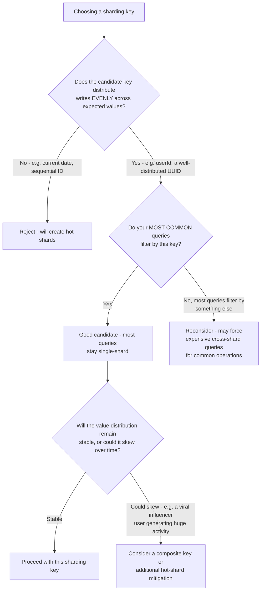
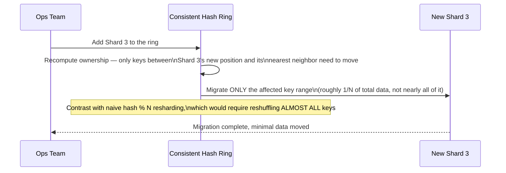
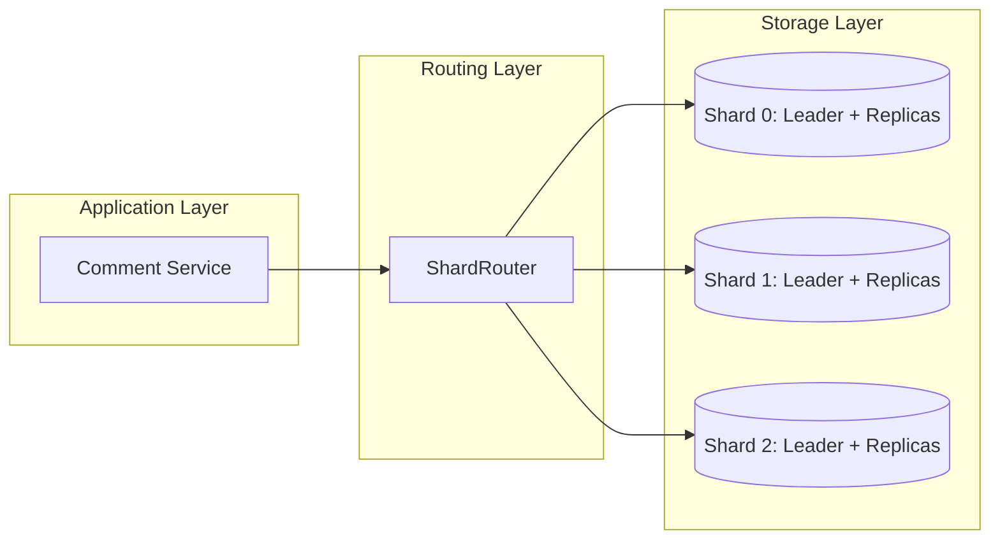
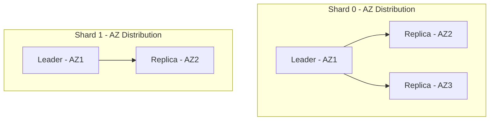

# Module 15 — Database Replication & Sharding

> **Masterclass:** System Design Masterclass (30 Modules)
> **Level:** Advanced
> **Audience:** Node.js backend developers, SDE‑2 / Senior Backend interview candidates, engineers transitioning into architecture roles
> **Prerequisite:** Modules 1–14 (System Design Intro through Consistency Models)

---

## 1. Introduction

For fourteen modules, we've referred to "the read replica," "the primary," and "the database" as though their internal mechanics were self-evident. Module 12 gave us quorums and leader election. Module 13 gave us CAP's C-vs-A trade-off. Module 14 gave us the precise consistency spectrum those replicas actually deliver. This module finally builds the thing itself: **how replication and sharding actually work**, mechanically — leader-follower replication, multi-leader replication, and the horizontal partitioning strategy (sharding) that lets a single logical database scale writes beyond what any one machine can handle.

This is the module where Modules 2's "just add more servers" finally gets applied to the one component we've been treating as unshardable since Module 1: the database itself.

---

## 2. Learning Objectives

By the end of this module, you will be able to:

1. Explain **leader-follower (primary-replica) replication** mechanically, including how writes propagate.
2. Explain **multi-leader replication** and the specific conflict problem it introduces that leader-follower avoids.
3. Explain **read replicas** and how they resolve the read-scaling bottleneck, connecting directly to Module 14's consistency trade-offs.
4. Explain **horizontal sharding** and how a sharding key determines data placement.
5. Explain **vertical partitioning** and how it differs fundamentally from sharding.
6. Design a **sharding key strategy** that avoids hot-spotting and uneven data distribution.
7. Reason about **resharding** — the operational challenge of changing shard count after the fact — and why it must be planned for in advance.

---

## 3. Why This Concept Exists

Module 2 established horizontal scaling for stateless app servers: add more machines, put a load balancer in front, done. The database was explicitly excluded from that story because a database holds **state** — you can't simply run five independent, unsynchronized copies and load-balance between them the way you can with stateless app servers, because each copy would immediately diverge the moment it received a different write.

Replication and sharding exist to solve two **different** problems that both stem from this constraint. **Replication** solves the *read scaling and durability* problem: keep multiple synchronized copies of the *same* data, so reads can be distributed (Module 14's replica pool) and a single machine failure doesn't lose data (Module 1's SPOF principle). **Sharding** solves the *write scaling and storage capacity* problem: split the data itself across multiple machines, so no single machine needs to hold or process the entire dataset. These are complementary, not competing, techniques — most large-scale production databases use both simultaneously, and confusing the two (a genuinely common interview mistake) suggests a real gap in understanding, not just terminology.

---

## 4. Problem Statement

> Our blog platform's PostgreSQL database now handles both problems simultaneously: (1) **read load** has grown to the point where even with Module 7's caching, the primary database's read capacity is a bottleneck for cache misses, and (2) **write load and storage** have grown to where a single machine can no longer comfortably hold and process the entire `posts` and `comments` tables, now numbering in the hundreds of millions of rows across a rapidly growing user base. Design solutions for both problems, using replication for (1) and sharding for (2), and explain precisely why fixing one does not fix the other.

---

## 5. Real-World Analogy

**Replication is making several identical, synchronized photocopies of the entire company filing cabinet, and placing one copy in each regional office.** Every copy holds the *same* complete set of files — this helps because now each office can look up any record locally (faster reads, Module 14's replica-pool benefit) and if one office burns down, the records aren't lost (durability, Module 1's SPOF principle). But every single office's copy is still the *entire* filing cabinet — this does nothing to help if the cabinet itself has grown too large for any *one* office to physically store or for one clerk to file new documents into fast enough.

**Sharding is instead splitting the filing cabinet's contents across offices by a rule — e.g., "Customers A–M go to the East office, N–Z go to the West office."** Now no single office holds the entire dataset, and — critically — **new filings (writes) for "Customer A" only ever need to go to the East office**, distributing the *write* workload across offices too, not just providing redundant *copies* of a single write bottleneck. This is precisely why sharding, not replication, is the answer to Section 4's second problem (a single machine can't hold or write fast enough for the full dataset) — replication alone would just give you several complete, still-individually-oversized copies of the same too-large cabinet.

---

## 6. Technical Definition

**Leader-Follower (Primary-Replica) Replication:** A replication topology where one node (the leader/primary) accepts all writes, and one or more follower/replica nodes receive a continuous stream of those writes to keep their copy synchronized, typically also serving read traffic.

**Multi-Leader Replication:** A replication topology where more than one node can accept writes independently, with changes propagated to other leaders — introducing the possibility of conflicting concurrent writes that must be resolved (Module 14's conflict resolution techniques).

**Sharding (Horizontal Partitioning):** Splitting a dataset across multiple database instances (shards) based on a **sharding key**, such that each shard holds a distinct subset of the rows, collectively covering the entire dataset with no overlap.

**Vertical Partitioning:** Splitting a dataset by **columns** rather than rows — e.g., storing frequently-accessed columns in one table/store and rarely-accessed columns in another — a fundamentally different technique from sharding, which splits by rows.

**Resharding:** The process of changing the number of shards (typically increasing it as data grows) and redistributing existing data accordingly — an operationally complex, high-risk process if not planned for from the start.

---

## 7. Core Terminology

| Term | Precise Definition | One-line Intuition |
|---|---|---|
| **Replication Lag** | The delay between a write committing on the leader and appearing on a follower (Module 14's staleness window, precisely named) | "How far behind a follower currently is" |
| **Sharding Key (Partition Key)** | The field used to determine which shard a given row belongs to | "The rule deciding which drawer this file goes in" |
| **Hash-Based Sharding** | Determining shard placement by hashing the sharding key and mapping the hash to a shard | "Evenly scatter files by a scrambled version of their name" |
| **Range-Based Sharding** | Determining shard placement by which value range the sharding key falls into (e.g., A–M, N–Z) | "Files grouped by alphabetical range" |
| **Hot Spot / Hot Shard** | A shard receiving disproportionately more traffic than others, due to an uneven sharding key distribution | "One drawer everyone needs, the others sit idle" |
| **Cross-Shard Query** | A query that must gather and combine data from multiple shards, since no single shard holds the full answer | "Asking multiple offices and combining their answers" |
| **Consistent Hashing** | A hashing technique that minimizes data movement when the number of shards changes | "A scattering rule that barely reshuffles anything when you add a new drawer" |

---

## 8. Internal Working

### How leader-follower replication actually propagates writes

When a write commits on the leader, PostgreSQL (and most relational databases) doesn't literally re-run the SQL statement on each follower — it streams the **Write-Ahead Log (WAL)**, the same durability mechanism from Module 5's ACID discussion, to each follower, which replays those log entries to reconstruct the identical sequence of changes. This is precisely why replication lag (Section 7) exists at all: streaming and replaying the WAL takes real, non-zero time, bounded by network latency (Module 3) between leader and follower, and by the follower's own processing speed.

**Synchronous vs. asynchronous replication (Module 13, Section 20, now explained mechanically):** in synchronous mode, the leader waits for a follower's WAL-replay acknowledgment before confirming the write to the client — directly implementing CP behavior at the mechanical level. In asynchronous mode, the leader confirms immediately and the WAL streams to followers independently — directly implementing the AP/eventually-consistent behavior Module 14 examined.

### Why multi-leader replication introduces conflicts leader-follower avoids entirely

In leader-follower replication, there is **exactly one** node accepting writes — by construction, two conflicting writes for the same row can never happen concurrently on different nodes, because only one node ever accepts writes at all. Multi-leader replication deliberately relaxes this (usually to allow writes to be accepted locally in multiple geographic regions, avoiding Module 3's distance-latency cost for every single write) — but this means **two different leaders can each accept a conflicting write for the same row at nearly the same moment**, before either has learned about the other's write. This is **exactly** the conflict scenario Module 14's Last-Write-Wins, vector clocks, and CRDTs were built to resolve — multi-leader replication is the concrete architectural context that actually *produces* the conflicts those techniques exist to handle.

### How hash-based sharding actually distributes rows, and why hot spots occur

```javascript
function getShardForUser(userId, numShards) {
  const hash = crypto.createHash('md5').update(userId).digest('hex');
  const hashInt = parseInt(hash.slice(0, 8), 16); // take first 8 hex chars as an integer
  return hashInt % numShards; // maps to shard 0, 1, 2, ... numShards-1
}
```

This distributes rows **roughly evenly** across shards, provided the sharding key (here, `userId`) has enough natural variety. **Hot spots occur when the sharding key is poorly chosen** — for example, sharding blog posts by `createdDate` (range-based) means *all* of today's newly-created posts land on the single shard responsible for "today," while shards for old date ranges sit comparatively idle; every write for new content concentrates on one shard, precisely the "hot shard" problem named in Section 7. This is why Section 4's write-scaling problem requires **deliberate sharding key selection**, not just "turn on sharding" — a poorly chosen key can leave you with the *appearance* of horizontal write scaling while all the actual write traffic still funnels through one overloaded shard.

### Why resharding is operationally hard, and consistent hashing's role

If you shard using simple `hash(key) % numShards` (Section 8's example) and later need to go from 4 shards to 5, **almost every row's shard assignment changes** — `hash(key) % 4` and `hash(key) % 5` agree only by coincidence for any given key — requiring a massive, disruptive data migration just to add capacity. **Consistent hashing** (Section 7) is specifically designed so that changing the number of shards only requires moving a small, proportional fraction of the data (roughly `1/numShards` of it), not nearly all of it — directly solving this operational problem, and explaining why it's the standard technique in real-world sharded systems (Cassandra, DynamoDB) rather than naive modulo-based sharding.

---

## 9. Request Lifecycle

### Mermaid Sequence Diagram — Leader-Follower Write Propagation



### Mermaid Sequence Diagram — Sharded Write, Correctly Routed



**Step-by-step explanation, resolving Section 4's write-scaling problem:** notice each write is routed to **exactly one shard**, determined entirely by the sharding key — this is precisely how sharding distributes write load: `userId="abc123"`'s writes never touch Shard 0, and `userId="xyz789"`'s writes never touch Shard 2, meaning the two users' write traffic genuinely, physically doesn't compete for the same machine's resources at all.

---

## 10. Architecture Overview



**HLD-level insight, directly resolving Section 4's "why doesn't fixing one fix the other" question:** this diagram shows **both** techniques applied together, at different levels — sharding splits the data itself across 3 independent leader-follower clusters (solving the write/storage-capacity problem), and **within each shard**, standard leader-follower replication (solving the read-scaling/durability problem) still applies. A system with only sharding (no replication per shard) would still have 3 separate single points of failure; a system with only replication (no sharding) would still have every write funneling through one, ever-growing leader.

---

## 11. Capacity Estimation

**Scenario:** Determining the number of shards needed for our `comments` table, given current and projected growth.

**Given:** 500 million comment rows currently, average row size 500 bytes, and a target of keeping each shard under 50 million rows for comfortable single-machine performance (Module 5/6's query-performance considerations).

**Step 1 — Minimum shard count:**
```
500,000,000 rows / 50,000,000 rows per shard = 10 shards minimum
```

**Step 2 — Storage per shard:**
```
50,000,000 rows × 500 bytes = 25 GB per shard (very manageable for a single modern instance)
```

**Step 3 — Accounting for growth (assume 20% annual growth, planning 2 years ahead):**
```
500M × 1.2 × 1.2 ≈ 720M rows in 2 years
720,000,000 / 50,000,000 ≈ 15 shards needed in 2 years
```

**Conclusion, directly motivating Section 8's resharding discussion:** provisioning exactly 10 shards today means you'll need to reshard (a genuinely disruptive operation, per Section 8) within roughly 2 years at current growth rates — this is precisely the kind of forward-looking capacity math that should inform **whether to over-provision shard count upfront** (e.g., start with 15–20 shards, even though 10 would suffice today, specifically to defer the operational pain of resharding) — a real, deliberate trade-off between "premature complexity today" and "guaranteed operational pain later," worth stating explicitly in an interview.

---

## 12. High-Level Design (HLD)



**HLD-level insight:** this decision flow directly operationalizes Section 4's "replication and sharding solve different problems" lesson into an actionable design process — and Branch E is precisely the architecture shown in Section 10's diagram, the correct answer for a system (like ours) experiencing both bottlenecks simultaneously.

---

## 13. Low-Level Design (LLD)

### A shard router implementation (Node.js), combining hashing and connection management

```javascript
const crypto = require('crypto');

class ShardRouter {
  constructor(shardConnectionPools) {
    this.pools = shardConnectionPools; // array of pg.Pool instances, one per shard
  }

  getShardIndex(shardingKey) {
    const hash = crypto.createHash('md5').update(String(shardingKey)).digest('hex');
    const hashInt = parseInt(hash.slice(0, 8), 16);
    return hashInt % this.pools.length;
  }

  async query(shardingKey, sql, params) {
    const shardIndex = this.getShardIndex(shardingKey);
    return this.pools[shardIndex].query(sql, params);
  }

  // Cross-shard query — must fan out to ALL shards and combine results (Section 7's cost)
  async queryAllShards(sql, params) {
    const results = await Promise.all(
      this.pools.map(pool => pool.query(sql, params))
    );
    return results.flatMap(r => r.rows); // combine, application-side
  }
}

// Usage
const router = new ShardRouter([pool0, pool1, pool2]); // 3 shards
await router.query('user123', 'INSERT INTO comments (user_id, body) VALUES ($1, $2)', ['user123', 'Hello']);

// A query that CANNOT be routed to a single shard (e.g., "all comments containing 'nodejs'")
const allResults = await router.queryAllShards('SELECT * FROM comments WHERE body ILIKE $1', ['%nodejs%']);
```

**LLD-level design note, directly illustrating Section 7's cross-shard query cost:** `query()` (single-shard) is fast and scales linearly with shard count, exactly as intended. `queryAllShards()` (cross-shard) must contact **every** shard and combine results in application code — this is strictly more expensive and doesn't benefit from sharding's scaling property at all; recognizing which of your application's actual queries fall into which category, **before** choosing a sharding key, is essential — a sharding key that makes your *most common* query cross-shard is a design failure, even if it distributes data evenly.

---

## 14. ASCII Diagrams

```
LEADER-FOLLOWER vs MULTI-LEADER — where conflicts CAN occur

  LEADER-FOLLOWER (single write path — conflicts IMPOSSIBLE by construction)
    Client ──▶ [LEADER] ──replicate──▶ [Follower A]
                                  └──replicate──▶ [Follower B]

  MULTI-LEADER (multiple write paths — conflicts POSSIBLE)
    Client A ──▶ [Leader 1] ──┐
                                ├──both accept writes for SAME row──▶ CONFLICT
    Client B ──▶ [Leader 2] ──┘   (Module 14's resolution techniques required)
```

```
HASH-BASED SHARDING — even distribution (GOOD sharding key)

  userId: "alice" → hash → shard 2
  userId: "bob"   → hash → shard 0
  userId: "carol" → hash → shard 1
  (roughly even spread across all shards)

RANGE-BASED SHARDING BY DATE — hot spot risk (POOR sharding key for write-heavy data)

  Shard 0: 2024 posts  ← cold, rarely written to anymore
  Shard 1: 2025 posts  ← cold
  Shard 2: 2026 posts  ← EVERY new write lands here — HOT SHARD
```

---

## 15. Mermaid Flowcharts

### Decision Flow: Choosing a Sharding Key



---

## 16. Mermaid Sequence Diagrams

*(Section 9 covers the two canonical sequence diagrams for this module. Additional diagram below.)*

### Resharding via Consistent Hashing — Minimal Data Movement



**Why this matters, directly resolving Section 8/11's resharding pain point:** this is the concrete mechanism that makes growing from, say, 10 to 15 shards (Section 11's 2-year projection) an operationally manageable event rather than a system-wide, all-hands migration — consistent hashing is specifically engineered to make this exact scenario (adding capacity as data grows) cheap and safe.

---

## 17. Component Diagrams



**Why `ShardRouter` is an isolated component, mirroring this course's repeated Repository pattern principle (Modules 1, 5, 7, 9, 11):** `CommentService` calls `router.query(userId, sql, params)` without any awareness of how many shards exist or how they're distributed — if the sharding key, hashing algorithm, or shard count changes (Section 16's resharding), only `ShardRouter`'s internals need to change, and every consumer of it continues working unmodified.

---

## 18. Deployment Diagrams



**Deployment-level note, directly connecting to Module 12's failure-domain lesson:** each shard's leader and its replicas are spread across **different availability zones**, exactly as Module 12's quorum-placement discussion recommended — this ensures a single AZ failure affects at most one replica per shard, never an entire shard's worth of data simultaneously, combining this module's sharding technique with Module 12's failure-domain isolation principle.

---

## 19. Network Diagrams

Sharding introduces one network-topology consideration beyond what earlier modules established: the **Shard Router must be reachable by the application tier, and each shard must be reachable by the router — but shards generally don't need to communicate directly with each other** (unlike consensus clusters, Module 12):

```
  App Tier ──▶ Shard Router ──┬──▶ Shard 0 (private subnet)
                                ├──▶ Shard 1 (private subnet)
                                └──▶ Shard 2 (private subnet)

  (Shards typically don't need direct shard-to-shard connectivity,
   simplifying the network topology relative to a consensus cluster, Module 12)
```

---

## 20. Database Design

Sharding directly informs schema design in one critical way: **the sharding key should ideally be part of every table's primary or composite key within a shard**, and **foreign-key-style relationships across shards must be handled at the application layer**, since PostgreSQL's native foreign key constraints (Module 5) cannot span separate shard instances:

```sql
-- Within a single shard, foreign keys work exactly as in Module 5:
CREATE TABLE comments (
    id UUID PRIMARY KEY,
    user_id UUID NOT NULL, -- the sharding key
    post_id UUID NOT NULL,
    body TEXT
);
-- A foreign key to `posts(id)` only works if `posts` is sharded by the SAME key
-- and happens to co-locate with this comment's shard — otherwise, this constraint
-- CANNOT be enforced by the database at all, and must be validated in application code.
```

**Why this is a genuinely important, often underappreciated cost of sharding:** Module 5's entire pitch for relational databases was enforced referential integrity — sharding **partially surrenders this benefit** for any relationship that crosses shard boundaries, pushing that validation responsibility into application code, exactly the kind of precise, honest trade-off this course has repeatedly emphasized stating explicitly rather than glossing over.

---

## 21. API Design

Sharding should, like every other module's infrastructure change, remain **invisible to external API consumers** — the `GET /users/:id/comments` endpoint's contract doesn't change based on how many shards exist behind it. The one legitimate internal design consideration: **API request parameters should include, or allow deriving, the sharding key early**, so the routing decision (Section 13) can happen as soon as possible in the request lifecycle, rather than requiring an initial unsharded lookup just to *find* the sharding key.

```
GET /users/:userId/comments   → userId is directly available for shard routing, no extra lookup needed
GET /comments/:commentId      → commentId alone doesn't reveal the shard —
                                  requires either a global lookup index, or
                                  embedding shard info in the ID itself (a common technique)
```

**Why this second example matters:** a comment ID that **encodes its shard number directly** (e.g., a composite ID like `shard2-a1b2c3`) lets `GET /comments/:commentId` route correctly without any additional lookup — a genuinely practical technique worth knowing, since not every entity's natural ID is also a convenient sharding key.

---

## 22. Scalability Considerations

| Consideration | Replication | Sharding |
|---|---|---|
| Solves | Read scaling, durability | Write scaling, storage capacity |
| Adds | Replication lag (Module 14) | Cross-shard query cost, application-level referential integrity |
| Scaling ceiling | Bounded by leader's write capacity (all replicas serve the SAME writes) | Much higher — write load itself is distributed across shards |
| Operational complexity | Moderate | High — routing logic, resharding planning, cross-shard query handling |

**The critical, combined insight:** replication alone **cannot** solve Section 4's write-scaling problem, no matter how many followers you add — every follower still receives the *same* write stream from the *same* single leader, so the leader's write throughput remains the hard ceiling. Only sharding addresses this, by giving each shard's leader a genuinely smaller, independent slice of the total write workload.

---

## 23. Reliability & Fault Tolerance

- **Sharding without per-shard replication multiplies your single-point-of-failure risk** — with 10 unreplicated shards, you now have 10 independent single points of failure instead of 1, each capable of taking down access to its specific slice of data; Section 10's "shard AND replicate within each shard" architecture is not optional complexity, it's the necessary reliability floor.
- **Cross-shard operations complicate failure handling** — if a write needs to touch two shards (a cross-shard transaction, generally avoided by careful sharding key design, Section 15) and one shard fails mid-operation, you face a distributed transaction problem directly connecting back to Module 12's consensus and Module 11's Transactional Outbox concepts, now at the sharding layer.
- **Resharding must be planned as a first-class operational event**, with rollback capability and careful monitoring (Section 16's consistent-hashing approach specifically exists to make this less risky) — an unplanned, ad-hoc resharding under production pressure is a common source of serious incidents.

---

## 24. Security Considerations

- **The Shard Router becomes a sensitive, high-value component** (similar to Module 9's API Gateway observation) — it has connectivity to every shard, and a compromise here has a broader blast radius than compromising a single shard directly.
- **Cross-shard queries (Section 13's `queryAllShards`) can be a resource-exhaustion vector** if not rate-limited or bounded — a malicious or buggy client triggering many expensive, full-fan-out queries could degrade every shard simultaneously, a direct echo of Module 9's per-backend isolation lesson, now relevant across an entire shard fleet at once.

---

## 25. Performance Optimization

- **Choose a sharding key that keeps your most common queries single-shard** (Section 15) — this is the single highest-leverage sharding decision, since cross-shard queries fundamentally don't benefit from sharding's scaling property.
- **Add read replicas within each shard independently**, sized to that shard's specific read load — a hot shard (Section 8) may legitimately need more replicas than a cold one, a form of per-shard capacity tuning enabled by treating each shard as its own independently-scaled leader-follower cluster.
- **Use consistent hashing from the start**, even if you don't yet need more than a few shards — retrofitting it after adopting naive modulo-based sharding is far more disruptive than starting with it (Section 11/16).

---

## 26. Monitoring & Observability

- **Per-shard load and size metrics** — critical for detecting hot shards (Section 8) before they become a user-visible bottleneck; an aggregate, cluster-wide metric alone hides exactly this class of problem, echoing Module 8's per-server monitoring lesson at the sharding layer.
- **Replication lag per shard's replicas** — Module 14's staleness-window monitoring, now applied independently to each of potentially many shards, since different shards may experience different lag under different load patterns.
- **Cross-shard query frequency and cost** — a rising trend here signals either a sharding-key mismatch with actual query patterns (Section 15), or organic growth in genuinely cross-cutting queries that may warrant a different architectural approach (e.g., a dedicated search index, Module 23).

---

## 27. Common Bottlenecks

| Bottleneck | Symptom | Root Cause |
|---|---|---|
| Hot shard | One shard's latency/load far exceeds others | Poorly chosen sharding key concentrating traffic (Section 8) |
| Cross-shard query overload | High latency, high resource use for "simple" queries | Sharding key doesn't align with actual common query patterns (Section 15) |
| Leader write ceiling reached despite many replicas | Write latency degrades even with a large replica fleet | Replication alone can't scale writes — sharding is required (Section 22) |
| Painful, risky resharding events | Extended migrations, temporary inconsistency during shard-count changes | Naive modulo-based sharding instead of consistent hashing (Section 8/16) |
| Broken referential integrity across shards | Orphaned or inconsistent cross-entity references | Foreign-key-style relationships spanning shard boundaries, unenforced by the database (Section 20) |

---

## 28. Trade-off Analysis

> "I chose to **shard the `comments` table by `userId`** rather than by `postId` or creation date, optimizing for **even write distribution and keeping our most common query (\"get a user's comments\") single-shard**, at the cost of **making \"get all comments for a given post\" a cross-shard query**, which is acceptable because per-user comment lookups are far more frequent in our access patterns than the cross-post aggregation query, per our measured traffic."

> "I chose **consistent hashing over naive modulo-based sharding** from the start, optimizing for **minimal data movement during future resharding events (Section 11's 2-year growth projection)**, at the cost of **slightly more complex routing logic to implement initially**, which is acceptable because the operational cost of a naive resharding event, once we inevitably need more shards, would far exceed this upfront complexity."

---

## 29. Anti-patterns & Common Mistakes

1. **Believing replication alone solves write-scaling problems** — a critical, common misconception (Section 22); every follower in a leader-follower topology still processes the exact same write stream as the leader.
2. **Choosing a sharding key based on convenience (e.g., auto-incrementing ID, current date) rather than actual query and write-distribution patterns** — the single most consequential sharding decision, and the most commonly gotten wrong (Section 8/15).
3. **Sharding without replicating within each shard**, multiplying single points of failure rather than distributing load safely (Section 23).
4. **Using naive modulo-based sharding without considering future resharding cost** — a decision that seems reasonable at small scale and becomes a genuine operational crisis exactly when the system is successful enough to need more shards.
5. **Designing schemas with cross-shard foreign-key-style relationships**, without an explicit plan for application-level referential integrity enforcement (Section 20).
6. **No per-shard monitoring**, relying on aggregate metrics that mask hot-shard problems until they're severe enough to be user-visible.

---

## 30. Production Best Practices

- **Use replication and sharding together, deliberately, for their distinct purposes** — replication for read scaling and durability, sharding for write scaling and storage capacity.
- **Select a sharding key based on measured query and write-distribution patterns**, not convenience or intuition — validate the choice against real or realistic traffic data before committing to it.
- **Use consistent hashing from the outset**, even for a small initial shard count, to avoid a costly naive-to-consistent-hashing migration later.
- **Replicate within every shard**, treating each shard as its own independently-reliable leader-follower cluster, never a single, unreplicated instance.
- **Monitor per-shard metrics explicitly** — load, size, and replication lag — not just cluster-wide aggregates.
- **Plan for resharding as a first-class, rehearsed operational process**, not an improvised response to a capacity crisis.

---

## 31. Real-World Examples

- **Instagram's well-documented PostgreSQL sharding strategy** (referenced in Module 5) shards by `user_id`, explicitly chosen because the overwhelming majority of their queries are naturally scoped to a single user — a direct, real-world validation of this module's Section 15 sharding-key selection principle.
- **MongoDB's built-in sharding architecture** uses a dedicated routing layer (`mongos`) functionally equivalent to this module's `ShardRouter` (Section 13/17), and explicitly supports both range-based and hash-based sharding strategies, letting engineers choose based on the exact trade-offs this module discusses.
- **Vitess** (originally built at YouTube, now a widely-adopted open-source project) provides sharding and resharding automation specifically for MySQL, directly addressing this module's Section 8/16 resharding-pain problem as its core value proposition — strong evidence that resharding operational complexity is a significant, real, industry-wide problem, not a theoretical concern.

---

## 32. Node.js Implementation Examples

### Detecting a hot shard via per-shard load comparison (extending Section 26's monitoring lesson into working code)

```javascript
class ShardLoadMonitor {
  constructor(numShards) {
    this.requestCounts = new Array(numShards).fill(0);
  }

  recordRequest(shardIndex) {
    this.requestCounts[shardIndex]++;
  }

  detectHotShards(thresholdMultiplier = 2) {
    const avg = this.requestCounts.reduce((a, b) => a + b, 0) / this.requestCounts.length;
    return this.requestCounts
      .map((count, index) => ({ index, count, isHot: count > avg * thresholdMultiplier }))
      .filter(shard => shard.isHot);
  }
}

const monitor = new ShardLoadMonitor(3);
monitor.recordRequest(2); monitor.recordRequest(2); monitor.recordRequest(2); monitor.recordRequest(2);
monitor.recordRequest(0);
monitor.recordRequest(1);

console.log(monitor.detectHotShards()); // flags shard 2 — receiving 4x the average load
```

**Why this simple monitor directly operationalizes Section 26's lesson:** it doesn't fix a hot shard automatically (that generally requires a sharding key redesign or resharding, Section 8/16) — but it makes the **detection** concrete and automatable, which is the necessary first step before any remediation can happen at all; you cannot fix a hot-shard problem you haven't measured and confirmed.

---

## 33. Interview Questions

### Easy
1. What is the fundamental difference between what replication solves and what sharding solves?
2. Explain leader-follower replication in your own words.
3. What is a sharding key, and why does choosing it well matter?
4. What is the difference between hash-based and range-based sharding?
5. What is a hot shard, and what typically causes one?
6. What is a cross-shard query, and why is it more expensive than a single-shard query?

### Medium
7. Explain why adding more read replicas cannot solve a write-throughput bottleneck.
8. Design a sharding key for a multi-tenant SaaS application's customer data, justifying your choice against likely query patterns.
9. Explain why multi-leader replication introduces conflicts that leader-follower replication cannot experience by construction.
10. What is consistent hashing, and what specific operational problem does it solve compared to naive modulo-based sharding?
11. Why can't a foreign key constraint be enforced by the database across two different shards?
12. Design a monitoring strategy that would detect a hot shard before it becomes a user-visible performance problem.

### Hard
13. Design a complete sharded and replicated database architecture for a social media platform's posts and comments, addressing sharding key choice, per-shard replication, and how you'd handle a "get all comments for a post" query if posts and comments are sharded by different keys.
14. Explain, precisely, why range-based sharding by creation date is a poor choice for a write-heavy, continuously-growing dataset, and propose an alternative that preserves useful range-query capability without the hot-shard risk.
15. A system originally sharded with naive `hash(key) % N` now needs to go from 8 to 12 shards. Explain exactly why this is disruptive, and how consistent hashing would have changed the outcome.
16. Design an application-level referential integrity enforcement strategy for a "user" and "order" relationship where users and orders are sharded independently by different keys.
17. Discuss the trade-offs between choosing a sharding key that optimizes for even write distribution versus one that optimizes for keeping the most common read queries single-shard, using a concrete example where these two goals conflict.

---

## 34. Scenario-Based Design Questions

1. **Scenario:** Your team has added 10 read replicas to handle growing read traffic, but write latency continues to degrade as data grows. Diagnose using this module's core distinction.
2. **Scenario:** After sharding by `createdDate`, your most recent shard is consistently overloaded while older shards sit nearly idle. Diagnose and propose a redesigned sharding strategy.
3. **Scenario:** Your application frequently needs to query "all orders for a given product," but your database is sharded by `customerId`. Discuss the resulting query cost and propose two different mitigation strategies.
4. **Scenario:** Your team needs to go from 5 to 8 shards as data grows, and the naive modulo-based sharding scheme currently in use would require migrating roughly 90% of existing data. Propose the fix, and explain what should have been done from the start.
5. **Scenario:** A cross-shard query aggregating data from all 15 shards is timing out under load. Propose both an immediate mitigation and a longer-term architectural fix.
6. **Scenario:** Your multi-leader replication setup (used to reduce write latency for geographically distributed users) has produced a data conflict where two regions updated the same user's profile within milliseconds of each other. Walk through how you'd resolve this, referencing Module 14's techniques.
7. **Scenario:** An interviewer asks you to design "Instagram's photo storage sharding strategy." Walk through your reasoning for choosing a sharding key, referencing the real-world example from Section 31.
8. **Scenario:** Your team wants to enforce that a comment can never reference a nonexistent post, but posts and comments are sharded independently by different keys. Propose how you'd maintain this invariant without a native cross-shard foreign key.
9. **Scenario:** A stakeholder asks whether adding more shards will also improve read latency for a specific, very popular single row (e.g., a viral post's comment count). Explain why sharding alone doesn't help this specific case, and what would.
10. **Scenario:** You're evaluating whether to shard your database now, at a moderate scale, or wait until it becomes an urgent problem. Walk through the trade-offs of proactive versus reactive sharding, referencing this module's resharding-pain lessons.

---

## 35. Hands-on Exercises

1. Set up a local PostgreSQL primary with one streaming replica (using Docker or local installation), write a row to the primary, and measure the actual time until it appears on the replica — a direct, empirical replication-lag measurement.
2. Implement the `ShardRouter` class from Section 13 with 3 in-memory "shards" (simple JavaScript Maps standing in for real databases), and verify that routing by a given key consistently and correctly maps to the same shard across multiple calls.
3. Implement both a naive modulo-based sharding function and a basic consistent-hashing-based one, then simulate adding a 4th shard to a 3-shard setup with each approach, measuring what percentage of keys change shard assignment in each case.
4. Implement the `ShardLoadMonitor` from Section 32, simulate an uneven request distribution across 5 shards, and verify it correctly flags the hot shard(s).
5. Design (on paper or in Mermaid) a sharding strategy for a hypothetical multi-tenant SaaS application, explicitly stating your chosen sharding key and justifying it against at least 3 example query patterns you define yourself.

---

## 36. Mini Project

**Build:** A sharded and replicated comment storage system for the blog platform, directly resolving Module 15's Section 4 scenario.

**Requirements:**
- Implement the `ShardRouter` (Section 13) routing comments by `userId` across at least 3 shards (can be simulated with separate SQLite files, separate PostgreSQL databases, or in-memory stores for this exercise).
- Implement basic leader-follower replication simulation for at least one shard (a simple write-then-propagate-to-a-copy mechanism, if a full PostgreSQL replica setup isn't feasible in your environment).
- Implement both a single-shard query path (`getCommentsByUser`) and a cross-shard query path (`searchAllComments`), and measure/log the latency difference between them under a simulated dataset.
- Implement the `ShardLoadMonitor` (Section 32) and simulate an uneven write pattern that produces a detectable hot shard.

**Success criteria:** Your system correctly routes writes and single-shard reads to the right shard consistently, your cross-shard query correctly aggregates results from all shards (with measurably higher latency than the single-shard path), and your hot-shard monitor correctly flags an artificially-induced imbalance.

---

## 37. Advanced Project

**Build:** Extend the Mini Project with consistent hashing, a resharding simulation, and application-level referential integrity.

1. Replace your naive modulo-based sharding with a consistent-hashing implementation, and write a test that adds a new shard to your existing 3-shard setup, measuring and reporting the actual percentage of keys that changed shard assignment — comparing this directly against the naive approach's percentage from Exercise 3.
2. Implement a basic application-level referential integrity check (Section 20): before inserting a comment referencing a `postId`, verify the post exists (potentially in a different shard, or an unsharded `posts` table), and reject the insert if it doesn't — with a test proving this check correctly catches an orphaned reference that a cross-shard foreign key couldn't have enforced natively.
3. Simulate a full resharding event using your consistent-hashing implementation: go from 3 to 5 shards, and verify that all previously-written data remains correctly retrievable after the migration (no data loss, correct new routing).
4. Write a decision document proposing a sharding strategy for a hypothetical, much larger-scale version of the blog platform (assume 10x current data volume), including your chosen sharding key, projected shard count using Section 11's capacity-estimation method, and your resharding plan for the following 2 years of projected growth.

**Success criteria:** You have measured, real evidence that consistent hashing moves dramatically less data during a shard-count change than naive modulo-based sharding, a working application-level referential integrity check with a passing test proving its necessity, and a complete, numbers-backed sharding strategy document for projected future scale — setting up Module 16 (Microservices Design), which examines how these same data-ownership and boundary-drawing principles apply not just within a database, but across entire, independently-deployable services.

---

## 38. Summary

- **Replication and sharding solve different problems**: replication addresses read scaling and durability (multiple synchronized copies of the *same* data); sharding addresses write scaling and storage capacity (splitting the data itself across independent instances).
- **Leader-follower replication** avoids write conflicts by construction (exactly one write path); **multi-leader replication** trades this safety for reduced write latency across regions, at the cost of needing conflict resolution (Module 14's techniques).
- **Sharding key selection is the single most consequential sharding decision** — it must balance even write/data distribution against keeping your most common queries single-shard, and a poor choice produces hot shards or excessive cross-shard queries.
- **Consistent hashing minimizes data movement during resharding**, a critical operational advantage over naive modulo-based sharding, which requires migrating almost all data on any shard-count change.
- **Sharding surrenders some of the database's native referential integrity guarantees** (Module 5) for any relationship crossing shard boundaries, pushing that responsibility into application code.
- **Real systems combine both techniques**: sharding for write/storage scaling, with independent leader-follower replication within each shard for read scaling and reliability.

---

## 39. Revision Notes

- Replication solves READ scaling + durability; Sharding solves WRITE scaling + storage capacity — different problems, often used together
- Leader-follower: single write path, conflicts impossible by construction; Multi-leader: multiple write paths, conflicts possible, needs Module 14's resolution techniques
- Sharding key must balance: even distribution (avoid hot shards) AND keeping common queries single-shard
- Consistent hashing: adding/removing a shard moves only ~1/N of data, vs. naive modulo's near-total reshuffle
- Cross-shard queries are expensive — don't design a sharding key that forces your most common query to be cross-shard
- Foreign keys don't work across shards — application code must enforce cross-shard referential integrity
- Always replicate WITHIN each shard — sharding without replication multiplies single points of failure

---

## 40. One-Page Cheat Sheet

```
SYSTEM DESIGN — MODULE 15 CHEAT SHEET
─────────────────────────────────────
REPLICATION solves: READ scaling + durability (same data, multiple copies)
SHARDING solves:    WRITE scaling + storage capacity (data split across instances)
  → Different problems. Real systems use BOTH, together.

LEADER-FOLLOWER   → 1 write path, conflicts IMPOSSIBLE by construction
MULTI-LEADER       → N write paths, conflicts POSSIBLE (needs Module 14's resolution)

SHARDING KEY SELECTION CHECKLIST
  ☐ Distributes writes evenly (avoid hot shards)
  ☐ Keeps MOST COMMON queries single-shard
  ☐ Distribution stays stable over time (no viral-user skew risk)

CONSISTENT HASHING > naive hash % N
  Adding a shard: consistent hashing moves ~1/N of data
                  naive modulo moves ALMOST ALL of it

CROSS-SHARD QUERIES
  Expensive — fan out to ALL shards, combine in application code
  Design sharding key so your COMMON queries avoid this

GOLDEN RULES
  Replication alone NEVER solves a write-throughput bottleneck
  Always replicate WITHIN each shard — sharding ≠ reliability by itself
  Foreign keys don't span shards — enforce cross-shard integrity in app code
  Use consistent hashing from day one, even with few shards
```

---

## Key Takeaways

- Replication and sharding are complementary, not interchangeable — the most common conceptual error in this space is believing more replicas can fix a write-scaling problem, when only sharding actually distributes write load.
- Sharding key selection is a genuinely high-stakes, hard-to-reverse decision — it must be validated against real query and write patterns, not chosen for convenience, because a poor choice either creates hot shards or forces expensive cross-shard queries for common operations.
- Consistent hashing exists specifically to make the inevitable future event of "we need more shards" operationally survivable rather than catastrophic — planning for this from day one is far cheaper than retrofitting it under pressure.

## 20 Practice Questions
*(See Section 33 — 6 Easy, 6 Medium, 5 Hard — plus 3 rapid-fire additions:)*
18. Why does a well-chosen sharding key sometimes conflict with a database's native referential integrity guarantees, and how is that trade-off typically resolved?
19. What's the precise relationship between a shard's leader-follower replication setup and Module 12's quorum concepts, when a shard's leader fails?
20. Why is it important to validate a candidate sharding key against real or realistic query patterns before committing to it, rather than relying on intuition alone?

## 10 Scenario-Based Questions
*(See Section 34 in full.)*

## 5 Design Assignments
*(See Sections 36–37 — Mini Project and Advanced Project — plus:)*
1. Design a complete replication and sharding architecture for a ride-sharing app's trip records, including sharding key choice and per-shard replication strategy.
2. Write a one-page postmortem (real or hypothetical) for a hot-shard incident caused by sharding on creation date, including the root cause and redesigned sharding key.
3. Propose a consistent-hashing-based resharding plan for growing from 4 to 6 shards, estimating the percentage of data that would need to move.

## Suggested Next Module

**→ Module 16: Microservices Design** — with data-layer scaling (replication and sharding) now fully understood, we apply these same data-ownership and boundary-drawing principles one level up the stack: how to split an entire application into independently deployable services, each owning its own data, and the architectural discipline required to do this without simply recreating a distributed monolith.
