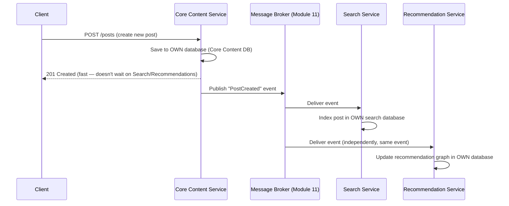
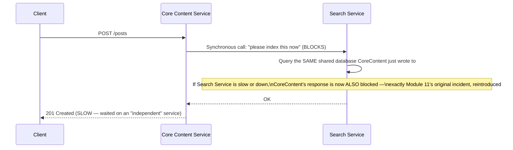
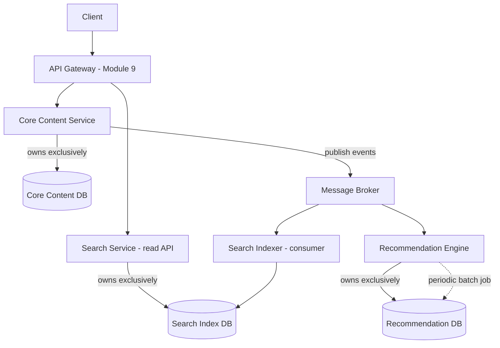
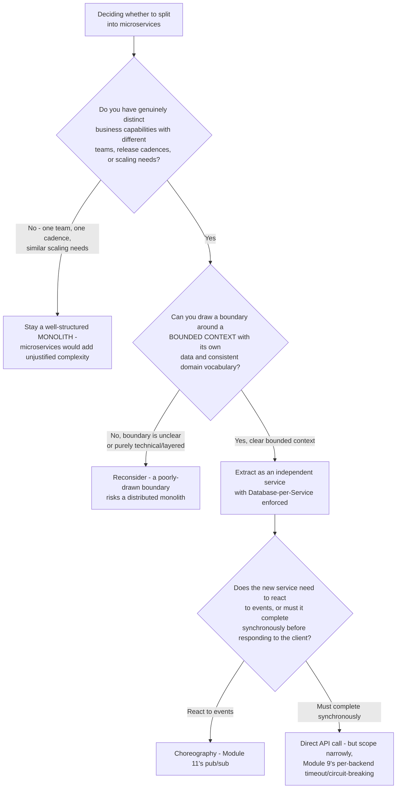
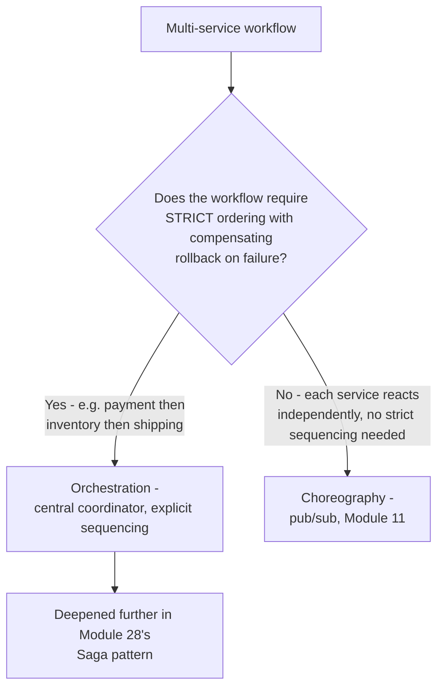
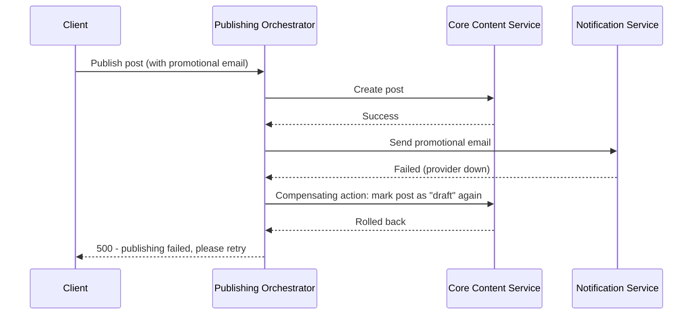
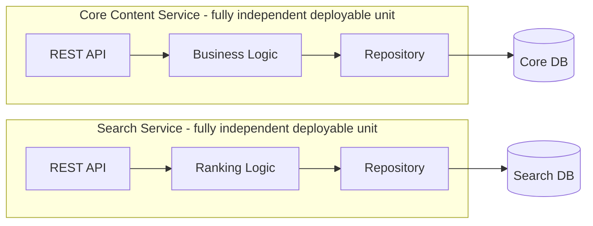
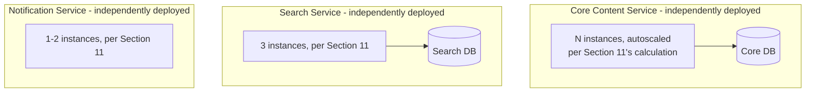

# Module 16 — Microservices Design

> **Masterclass:** System Design Masterclass (30 Modules)
> **Level:** Advanced
> **Audience:** Node.js backend developers, SDE‑2 / Senior Backend interview candidates, engineers transitioning into architecture roles
> **Prerequisite:** Modules 1–15 (System Design Intro through Database Replication & Sharding)

---

## 1. Introduction

Module 15 ended with a direct preview of this module's core question: the same data-ownership and boundary-drawing discipline used to choose a sharding key now gets applied one level up — not to rows within a database, but to entire capabilities within an application. Our blog platform has, since Module 9, already been quietly evolving in this direction: a Core API, a Search Service, a Notification Service, all reachable through a single API Gateway. This module finally names that architecture precisely — **microservices** — and, more importantly, gives you the discipline to draw service boundaries correctly, because a poorly-decomposed microservices architecture is demonstrably worse than the monolith it replaced.

This module's central warning, stated upfront: microservices are not a default best practice. They are a deliberate trade of operational complexity for organizational and deployment independence, and the single most common failure mode covered here is paying that complexity cost without earning the corresponding benefit — the "distributed monolith."

---

## 2. Learning Objectives

By the end of this module, you will be able to:

1. Define **microservices architecture** precisely, and distinguish it from a monolith and from a "distributed monolith."
2. Apply **service boundary** design principles, especially bounded contexts and data ownership, to decompose a system correctly.
3. Explain **inter-service communication** patterns (synchronous vs. asynchronous, Module 4 and Module 11's techniques applied here) and when to use each.
4. Explain the **Database-per-Service** pattern and why shared databases between services are an anti-pattern.
5. Reason about the **organizational and deployment trade-offs** microservices introduce, not just the technical ones.
6. Recognize a **distributed monolith** and diagnose the specific symptoms that indicate a failed decomposition.
7. Decide, for a given system, whether microservices are actually justified — or whether a well-structured monolith is the better choice.

---

## 3. Why This Concept Exists

A monolith — one codebase, one deployment unit, one database — is simple to reason about, easy to test end-to-end, and has zero network calls between its internal components (Module 4's entire protocol discussion is irrelevant *within* a monolith, since function calls replace network requests). This simplicity is genuinely valuable, and Module 1 explicitly warned against premature complexity for exactly this reason.

But a monolith has real, well-documented limits as an organization and codebase grow: every team touching the same codebase must coordinate deployments (a bug in the Search feature can block a release of an unrelated Payments fix), the entire application must scale as one unit even if only one feature is actually under heavy load (recall Module 2's lesson that different workloads have different scaling needs — a monolith can't scale its parts independently), and the codebase's internal coupling tends to grow over time, making changes progressively riskier (Module 1's "maintainability" NFR, under sustained pressure).

Microservices exist to address these organizational and operational scaling problems — **not** primarily as a performance optimization. Understanding this motivation precisely is what lets you correctly identify when microservices solve a problem you actually have, versus when they're solving a problem you've only read about.

---

## 4. Problem Statement

> Our blog platform, as built across Modules 1–15, has grown to include: core post/comment/user management, a search feature (Module 23 preview), a notification system (Module 4's gRPC service), and now a new requirement — a recommendation engine suggesting related posts. The engineering team has grown to 4 independent squads, each wanting to deploy their feature independently without coordinating releases with the others, and each feature has genuinely different scaling needs (search is read-heavy and CPU-intensive; notifications are bursty and I/O-bound; recommendations require periodic batch computation). Design the service decomposition, explicitly justifying each boundary — and identify which parts of this system, if any, should *not* be split into separate services.

---

## 5. Real-World Analogy

**A monolith is one large, general department store where every employee can walk into any aisle and directly rearrange any shelf.** This works fine when the store is small — everyone knows the whole layout, and coordination is easy because there's essentially one team. As the store grows into a massive supercenter, this breaks down: the electronics team rearranging shelves can accidentally disrupt the grocery team's carefully-planned seasonal display, because there's no enforced boundary between departments — everyone shares the same floor space (the same codebase, the same database).

**Microservices are turning that supercenter into a shopping mall of genuinely independent stores, each with its own staff, own inventory system, own opening hours, and own storage room.** The electronics store can restock, rearrange, or even completely renovate without asking the grocery store's permission, because they don't share a storage room (Section 6's Database-per-Service principle) or a staff roster (independent deployment). Customers walk through a shared mall corridor (the API Gateway, Module 9) that makes it feel like one coherent experience, without needing to know or care that each store is run entirely independently behind its storefront.

**But — and this is the analogy's crucial warning — if two "independent" stores in the mall still secretly share the *same* storage room and call each other on the phone before making any decision, you haven't actually built a mall of independent stores.** You've built one supercenter with extra walls and phone bills — this is precisely the **distributed monolith** (Section 7), and it's strictly worse than the original supercenter: all the original coordination problems remain, but now with the added cost and latency of phone calls (network requests) between departments that still can't actually act independently.

---

## 6. Technical Definition

**Microservices Architecture:** An architectural style structuring an application as a collection of independently deployable services, each owning a specific business capability and its own data, communicating over well-defined APIs.

**Bounded Context:** A concept from Domain-Driven Design describing a boundary within which a specific business domain model applies consistently — the primary, recommended basis for drawing microservice boundaries.

**Database-per-Service Pattern:** A principle stating each microservice owns and exclusively accesses its own database, with no other service permitted to directly query or modify it — all cross-service data access happens through the owning service's API.

**Distributed Monolith (Anti-pattern):** A system split into multiple, separately-deployed services that nonetheless remain tightly coupled — through a shared database, synchronous call chains requiring coordinated deployment, or unclear ownership boundaries — inheriting the operational complexity of a distributed system without the independence benefits that justify it.

---

## 7. Core Terminology

| Term | Precise Definition | One-line Intuition |
|---|---|---|
| **Service Boundary** | The line separating what one microservice owns and is responsible for, versus another | "Where one store's storage room ends and another's begins" |
| **Data Ownership** | The principle that exactly one service is authoritative for a given piece of data | "Exactly one store owns and stocks this specific product" |
| **Service-to-Service Communication** | How microservices call each other — synchronously (Module 4's REST/gRPC) or asynchronously (Module 11's message queues) | "How stores coordinate without sharing a storage room" |
| **Choreography** | A communication style where services react independently to events, with no central coordinator (Module 11's pub/sub, applied here) | "Each store reacts to announcements independently" |
| **Orchestration** | A communication style where a central coordinator explicitly directs which services to call and in what order | "A mall manager directing exactly which stores act, and when" |
| **Strangler Fig Pattern** | An incremental migration strategy that gradually replaces monolith functionality with microservices, routing traffic progressively (deepened in Module 28) | "New growth gradually replaces the old structure, piece by piece" |

---

## 8. Internal Working

### How to correctly identify service boundaries using bounded contexts

The single most consequential decision in microservices design is **where to draw the boundaries**, and the discipline for doing this correctly comes from Domain-Driven Design's **bounded context** concept: identify a cohesive area of business capability where a specific set of terms and rules apply consistently, and draw the service boundary around that entire cohesive area — not around arbitrary technical layers (e.g., "all database code" as one service, "all API code" as another — a common, serious mistake, Section 29).

For Section 4's scenario, the natural bounded contexts are:
- **Core Content** (posts, comments, users) — the central business capability, with its own consistent domain vocabulary ("post," "author," "comment").
- **Search** — a genuinely distinct capability (indexing, ranking, full-text query) with its own specialized domain concerns (Module 23), even though it operates on data that *originates* from Core Content.
- **Notifications** — a distinct capability (delivery channels, user preferences, retry/delivery guarantees, Module 11's patterns) that reacts to events from other services but has its own independent concerns.
- **Recommendations** — a distinct capability (batch computation, ML-adjacent logic, Module 24 preview) with fundamentally different operational characteristics (periodic batch jobs, not per-request logic) from the others.

**Why this is the correct basis, and not, say, "the frontend team" vs. "the backend team":** a bounded context boundary aligns service ownership with a **cohesive area of business logic and its own data**, which is precisely what lets each resulting service evolve independently — a boundary drawn along technical layers (frontend/backend) or organizational convenience alone tends to produce services that still need to change *together* whenever a single business capability changes, exactly the coupling microservices are meant to eliminate.

### Why the Database-per-Service pattern is non-negotiable, precisely

If the Search Service and Core Content Service **shared** the same PostgreSQL database (a common, tempting shortcut), then a schema change made by the Core Content team (e.g., renaming a column) could silently break the Search Service, **without either team necessarily realizing it during development** — this reintroduces exactly the tight coupling and coordinated-deployment requirement (Section 3's original monolith problem) that microservices were adopted to eliminate, except now with the *additional* cost of network calls and distributed systems complexity (Module 12) on top. **Database-per-Service is what actually enforces the bounded context boundary** at the data layer — without it, "microservices" is really just a monolith with extra network hops, which is precisely the distributed monolith anti-pattern (Section 7).

### Choreography vs. orchestration, mechanically

**Choreography** (Module 11's pub/sub pattern, applied at the service level): when a new post is created, the Core Content Service publishes a `PostCreated` event. The Search Service and Recommendation Service each independently subscribe to this event and react — index the post, or recompute related-post suggestions — **without the Core Content Service needing to know these other services even exist.** This is loosely coupled and highly independent, but can make the overall *system-wide* flow harder to trace and reason about, since no single place describes "everything that happens when a post is created."

**Orchestration**: an explicit coordinator (an "Order Processing Service," in a common e-commerce example) calls the Payment Service, then the Inventory Service, then the Shipping Service, in a defined sequence, handling failures and compensating actions explicitly at each step. This makes the overall flow easy to trace in one place, but creates tighter coupling — the orchestrator must know about, and directly depend on, every service it coordinates.

**For Section 4's scenario:** choreography (pub/sub) is the better fit for Search and Recommendations reacting to `PostCreated` events — these are genuinely independent reactions with no need for centralized sequencing. If a future feature required strict, multi-step sequencing with compensating rollback logic (e.g., "publish a post, and if promotional email sending fails, roll back the publish"), orchestration would likely be the better-suited pattern — this exact trade-off is deepened further in Module 17 (Event-Driven Architecture) and Module 28 (Distributed Design Patterns' Saga pattern).

---

## 9. Request Lifecycle

### Mermaid Sequence Diagram — Correct Choreography-Based Service Interaction



**Step-by-step explanation, directly resolving Section 4:** notice **each service reads and writes only to its own database** (Section 6's Database-per-Service pattern, enforced), and Core Content's response to the client doesn't wait on Search or Recommendations — this is a direct, combined application of Module 2's stateless-service, Module 11's async decoupling, and this module's data-ownership principles, all working together.

### Mermaid Sequence Diagram — The Distributed Monolith Anti-Pattern, For Contrast



**Why this diagram is a direct regression, worth recognizing precisely:** this "microservices" architecture has reintroduced **exactly** the synchronous-coupling failure mode Module 11 solved for a monolith, except now it's slower (network calls, Module 3/4's overhead) and harder to debug (two separate codebases, two separate logs) than the original monolith ever was — a textbook, avoidable distributed monolith.

---

## 10. Architecture Overview



**HLD-level insight, directly resolving Section 4's full decomposition requirement:** notice **four genuinely independent data stores**, each owned by exactly one service, connected only through the API Gateway (client-facing, synchronous) and the message broker (service-to-service, asynchronous) — no service reaches directly into another's database, and no service's failure mode can propagate synchronously into another's request path, exactly satisfying the four squads' independent-deployment requirement stated in Section 4.

---

## 11. Capacity Estimation

**Scenario:** Justifying independent scaling as a genuine, quantifiable benefit of this decomposition (extending Module 11's per-consumer scaling lesson to entire services).

**Given:** Core Content Service handles 5,000 req/s (Module 7's established figure); Search Service, due to CPU-intensive ranking computation, can only handle 200 req/s per instance; Notification Service is I/O-bound and can handle 2,000 req/s per instance (mostly waiting on external providers, Module 4's async concurrency benefit).

**Step 1 — Required instances per service, independently:**
```
Core Content: 5,000 / (per-instance capacity, e.g., 150 from Module 2) ≈ 34 instances
Search:       (assume 500 req/s actual search traffic) / 200 ≈ 3 instances
Notification: (assume 1,000 req/s actual notification traffic) / 2,000 ≈ 1 instance (with 1 spare for redundancy)
```

**Conclusion, directly validating Section 4's stated scaling-needs justification:** each service's **actual required instance count is wildly different**, precisely because their per-request cost profiles are wildly different (CPU-bound ranking vs. I/O-bound delivery vs. high-throughput CRUD) — in a monolith, this entire application would need to scale as **one** unit, sized to the *most demanding* workload's needs, wastefully over-provisioning the other three capabilities' compute. This is the concrete, numbers-backed version of Section 3's "different workloads have different scaling needs" motivation.

---

## 12. High-Level Design (HLD)



**HLD-level insight:** this decision flow makes explicit that **microservices are not the default answer** — Branch C is a completely legitimate, often correct outcome, and recognizing this is itself the mark of a mature system design perspective, not a failure to "modernize."

---

## 13. Low-Level Design (LLD)

### A concrete illustration of the Database-per-Service boundary, enforced at the network layer (Module 3, extended)

```javascript
// Search Service — CANNOT directly query Core Content's database.
// It can ONLY call Core Content's API, or consume its published events.

class SearchService {
  constructor(searchDbConnection, coreContentApiClient) {
    this.searchDb = searchDbConnection;       // Search Service's OWN database
    this.coreContentApi = coreContentApiClient; // the ONLY way to reach Core Content's data
  }

  async indexPost(postCreatedEvent) {
    // Event already contains the data needed — no need to call back to Core Content at all
    await this.searchDb.query(
      'INSERT INTO search_index (post_id, title, body) VALUES ($1, $2, $3)',
      [postCreatedEvent.postId, postCreatedEvent.title, postCreatedEvent.body]
    );
  }

  async enrichSearchResult(postId) {
    // If the event didn't carry enough data, MUST call the owning service's API —
    // NEVER query Core Content's database directly, even if network-reachable
    const post = await this.coreContentApi.getPost(postId);
    return { ...post, searchRelevanceScore: this.computeRelevance(postId) };
  }
}
```

**LLD-level design note, directly enforcing Section 8's non-negotiable principle:** the class structure itself makes the boundary explicit — there is no database connection object anywhere in this class pointing at Core Content's database; the *only* path to that data is through `coreContentApiClient`, an HTTP/gRPC client (Module 4) calling Core Content's own, versioned, owned API. This structural enforcement is what actually prevents a well-intentioned future engineer from "just adding a quick direct query" under deadline pressure — the seed of most real-world distributed monoliths.

---

## 14. ASCII Diagrams

```
CORRECT MICROSERVICE BOUNDARY (bounded context + data ownership)

  [Core Content Service] ──owns──▶ [Core Content DB]
           │
           │ publishes events / exposes API (the ONLY access path)
           ▼
  [Search Service]        ──owns──▶ [Search DB]
  [Recommendation Service] ──owns──▶ [Recommendation DB]


DISTRIBUTED MONOLITH (shared DB — the anti-pattern)

  [Core Content Service] ──┐
                             ├──▶ [SHARED Database]  ← BOTH services directly query this
  [Search Service]        ──┘
  (A schema change by either team can silently break the OTHER service —
   exactly the coupling microservices are meant to eliminate)
```

---

## 15. Mermaid Flowcharts

*(Section 12 covers the canonical microservices decision flow for this module.)*

### Decision Flow: Choreography or Orchestration for a Given Workflow?



---

## 16. Mermaid Sequence Diagrams

*(Section 9 covers the two canonical sequence diagrams for this module — correct choreography, and the distributed monolith anti-pattern for contrast.)*

### Orchestration Example — Contrasted With Section 9's Choreography



**Why this specific workflow warrants orchestration over choreography, precisely:** because it has an **explicit compensating rollback requirement** ("if the promotional email fails, the post shouldn't have been fully published") — this kind of strict, conditional, multi-step business rule is exactly what Section 8/15 identifies as orchestration's strength, in direct contrast to Section 9's `PostCreated` fan-out, which had no such rollback requirement and was correctly handled via simpler choreography.

---

## 17. Component Diagrams



**Why each service internally repeats the same layered structure (API / Logic / Repository) established all the way back in Module 1:** this is a deliberate, important point — microservices don't replace the internal architectural discipline earlier modules established; each service is, internally, a small, well-structured application in its own right, applying the exact same separation-of-concerns principles (Module 1, Section 13's Repository pattern) — microservices architecture is about the boundaries *between* these well-structured units, not a replacement for structuring each one well internally.

---

## 18. Deployment Diagrams



**Deployment-level note, directly validating Section 11's capacity math:** each service is deployed with an **independently-sized, independently-scaled fleet** — this is the deployment-level realization of the entire module's core benefit; a monolith deployment diagram would show one, single fleet sized to accommodate the maximum of all four workloads combined, wasting resources on the three less-demanding capabilities whenever the fourth's specific load spikes.

---

## 19. Network Diagrams

Each microservice follows Module 3's private-subnet principle independently, with the API Gateway (Module 9) remaining the sole client-facing entry point:

```
  Internet ──▶ API Gateway ──┬──▶ Core Content Service (private subnet A)
                               ├──▶ Search Service (private subnet B)
                               └──▶ Notification Service (private subnet C)

  Each service's DATABASE is reachable ONLY by its own service's subnet —
  Search Service's subnet has NO route to Core Content's database subnet,
  enforcing Section 8's Database-per-Service boundary at the network layer,
  not just as an application-code convention
```

**Why enforcing this at the network layer, not just as a coding guideline, matters:** a coding guideline ("please don't query another service's database directly") can be violated by a rushed engineer under deadline pressure; a **network-level block** (no routing path exists between Search's subnet and Core Content's database subnet) makes the violation **structurally impossible**, not merely discouraged — directly echoing Module 9's "network isolation, not convention" lesson for gateway trust, now applied to inter-service data boundaries.

---

## 20. Database Design

Section 8/13's Database-per-Service principle has one further important nuance: **services may sometimes need a read-only, denormalized copy of another service's data**, to avoid excessive cross-service API calls for every single request:

```javascript
// Search Service maintains its OWN, denormalized copy of post title/body,
// populated via the PostCreated event (Section 9) — NOT a live query to Core Content
CREATE TABLE search_index (
    post_id UUID PRIMARY KEY,
    title TEXT,
    body TEXT,
    indexed_at TIMESTAMP
);
-- This is Search's OWN table, in Search's OWN database — populated by consuming
-- events, not by directly reading Core Content's `posts` table.
```

**Why this isn't a violation of Database-per-Service, but rather its correct application:** this is precisely Module 5's denormalization trade-off (Section 16 of that module) applied at the service level — Search Service pays a **data synchronization cost** (keeping its denormalized copy up to date via events) in exchange for **never needing a synchronous cross-service call** for its core read path, directly avoiding the distributed-monolith coupling risk Section 9's second diagram illustrated.

---

## 21. API Design

Each microservice's API should be designed as if it might have **external, arbitrary consumers** (even if, today, only the API Gateway and sibling services call it) — a discipline that pays off precisely when a service's consumers inevitably grow beyond what was originally anticipated:

```
Core Content Service's OWN API (versioned, documented, stable contract):
  GET  /internal/v1/posts/:id
  POST /internal/v1/posts

Search Service's OWN API:
  GET  /internal/v1/search?q=...
```

**Why explicit versioning (`v1`) matters even for internal-only APIs:** as the number of services and consuming teams grows, the ability to evolve one service's API without breaking every consumer simultaneously (Module 9's centralized-gateway-but-independent-services tension) becomes essential — versioning is the concrete mechanism that allows Core Content to introduce a `v2` API for a breaking change, while Search Service continues safely calling `v1` until it's ready to migrate.

---

## 22. Scalability Considerations

| Consideration | Monolith | Microservices |
|---|---|---|
| Scaling granularity | Entire application scales as one unit | Each service scales independently, matched to its own load profile (Section 11) |
| Deployment independence | None — every deploy affects the whole system | Full — each service deploys on its own schedule |
| Cross-service call overhead | None (function calls) | Real, measurable network overhead (Module 3/4) for every cross-service interaction |
| Operational complexity | Lower — one codebase, one deployment pipeline, one set of logs | Higher — many codebases, many pipelines, distributed tracing needed (Module 19) |

**The precise, honest trade-off this table encodes:** microservices trade **increased operational complexity** for **increased deployment and scaling independence** — this module's entire purpose is ensuring you make this trade deliberately, having actually confirmed you need the independence, rather than paying the complexity cost reflexively.

---

## 23. Reliability & Fault Tolerance

- **Each service's failure should be isolated from the others** — Module 9's per-backend circuit breaking, applied here, ensures a Search Service outage doesn't cascade into Core Content Service failures, directly extending that module's gateway-level isolation to the broader inter-service communication pattern.
- **Choreography-based systems (Section 8) are more resilient to a single consumer's failure** than orchestration-based ones — if the Search Indexer consumer is down, `PostCreated` events simply queue up (Module 11's backpressure handling) rather than blocking the publishing flow, whereas an orchestrator directly calling a failed service must explicitly handle that failure inline.
- **Database-per-Service, combined with Module 15's per-shard replication, means each service's data-layer reliability is now an independent concern** — a Search DB outage affects only search functionality, not the ability to create or view posts, a genuine, valuable reliability isolation benefit of correct decomposition.

---

## 24. Security Considerations

- **Each service should have its own least-privilege database credentials and service identity** (extending Module 9's gateway auth model) — a compromised Search Service instance shouldn't have any credential capable of accessing Core Content's database, directly enforced by the Database-per-Service boundary (Section 19's network-level enforcement).
- **Inter-service authentication (mTLS, Module 20 preview)** becomes necessary once you have many independent services calling each other — trusting "internal network" alone is a weaker security posture than explicitly authenticating service-to-service calls, especially as the service count and blast radius of any one compromise grows.
- **Event payloads (Section 9's `PostCreated` event) may need their own access control considerations** — not every service subscribing to a broadly-published event should necessarily receive every field, particularly if some fields are sensitive.

---

## 25. Performance Optimization

- **Minimize synchronous cross-service call chains** — every hop adds Module 3/4's network latency; a request requiring 5 sequential synchronous service calls pays 5x the network overhead of a single monolith function-call chain, a real, often underestimated cost of over-decomposition.
- **Prefer denormalized, event-populated local copies** (Section 20) over live cross-service queries for frequently-needed data, directly trading a small data-freshness cost (Module 14's consistency spectrum, applied here) for eliminated per-request network overhead.
- **Batch or cache cross-service API calls** where a single request would otherwise need many small ones — the same lessons from Module 7 (caching) and Module 11 (batching) apply directly to inter-service communication, not just database access.

---

## 26. Monitoring & Observability

- **Distributed tracing becomes essential, not optional**, once a single user request may span multiple services — a request ID must propagate across every service boundary so its full journey can be reconstructed (deepened fully in Module 19).
- **Per-service health, latency, and error-rate dashboards**, mirroring Module 8's per-server monitoring principle, now applied per-service rather than per-server instance.
- **Event lag/backlog monitoring** (Module 11's queue-depth lesson) for every choreography-based consumer, since a silently lagging Search Indexer produces a subtle, easy-to-miss "search results are out of date" symptom rather than an obvious failure.

---

## 27. Common Bottlenecks

| Bottleneck | Symptom | Root Cause |
|---|---|---|
| Distributed monolith | Deploys still require cross-team coordination despite "separate" services | Shared database, or excessive synchronous coupling between services (Section 7/9) |
| Excessive cross-service chatter | High latency, high error rate for seemingly simple requests | Poor bounded-context boundary forcing many small cross-service calls (Section 8/25) |
| Orphaned/inconsistent denormalized data | Search results reference deleted posts, or show stale titles | Event-driven synchronization (Section 20) not reliably implemented — revisit Module 11's Transactional Outbox Pattern |
| Untraceable cross-service failures | "Something is slow" with no clear root cause across many services | No distributed tracing/correlation ID propagation (Section 26) |
| Premature microservices adoption | High operational overhead with no corresponding deployment/scaling benefit realized | Splitting a system into services before genuinely distinct bounded contexts, teams, or scaling needs existed (Section 12's Branch C) |

---

## 28. Trade-off Analysis

> "I chose to **extract Search as an independent microservice with its own database**, rather than keeping it as a module within the Core Content monolith, optimizing for **independent scaling (Section 11's CPU-bound workload) and independent deployment for the Search team**, at the cost of **added network latency for search-related requests and data synchronization complexity via events (Section 20)**, which is acceptable because Search's genuinely distinct scaling profile and team ownership justify the added operational cost."

> "I chose **choreography (pub/sub) over orchestration** for the post-creation-triggers-indexing-and-recommendations flow, optimizing for **loose coupling and resilience to any single consumer's downtime**, at the cost of **making the full, system-wide effect of 'a post was created' harder to trace in one place**, which is acceptable because this specific workflow has no compensating-rollback requirement, unlike the promotional-email publishing flow (Section 16), which correctly used orchestration instead."

---

## 29. Anti-patterns & Common Mistakes

1. **Drawing service boundaries along technical layers** (a "database service," an "API service") rather than bounded contexts (business capabilities) — produces services that must still change together whenever a business capability changes, defeating the entire purpose (Section 8).
2. **Sharing a database between services** — the single most common, most damaging distributed-monolith-producing mistake (Section 7/14).
3. **Excessive synchronous coupling between "independent" services**, recreating monolith-style blocking call chains with added network overhead and no corresponding benefit (Section 9's second diagram).
4. **Adopting microservices before genuinely needing them** — paying real, ongoing operational complexity costs (Section 22) without earning independent-deployment or independent-scaling benefits that justify them (Section 12's Branch C exists precisely to prevent this).
5. **No distributed tracing**, making cross-service failures and performance problems nearly impossible to diagnose once a request's journey spans several services (Section 26).
6. **Choosing orchestration or choreography by habit rather than by the specific workflow's actual rollback/sequencing requirements** (Section 8/15/16).

---

## 30. Production Best Practices

- **Draw service boundaries around bounded contexts**, validated against real business capability, team structure, and scaling-need differences — not technical convenience.
- **Enforce Database-per-Service at the network layer**, not merely as a coding convention, to make violations structurally impossible rather than just discouraged.
- **Default to asynchronous, choreographed communication** for workflows without strict sequencing/rollback needs, reserving orchestration for those that genuinely require it.
- **Version every service's API from day one**, even for internal-only consumers, anticipating future consumer growth and the need to evolve independently.
- **Invest in distributed tracing and per-service observability** before the service count grows large enough that debugging without it becomes untenable.
- **Regularly audit for distributed-monolith symptoms** (Section 27) — coordinated deploys, shared databases, excessive synchronous chains — since these tend to creep in gradually, not appear all at once.

---

## 31. Real-World Examples

- **Amazon's transition to a service-oriented architecture** (referenced in Modules 1 and 9) is one of the most-cited real-world examples of exactly this module's motivation — driven by organizational scaling needs (many independent teams needing independent deployment) more than raw performance, directly validating Section 3's core premise.
- **Netflix's microservices architecture** (referenced across Modules 8, 9, and 18) explicitly enforces Database-per-Service and heavy use of asynchronous, choreographed communication via events, and their well-documented engineering culture explicitly warns against the distributed-monolith failure mode this module names.
- **Segment's widely-read 2020 engineering blog post "Goodbye Microservices"** is a notable, honest, real-world account of a company that adopted microservices, found the operational overhead outweighed the benefit for their specific scale and team structure, and deliberately **consolidated back toward a more monolithic architecture** — a valuable, concrete counter-example directly validating this module's Section 12 "microservices are not always the right answer" lesson.

---

## 32. Node.js Implementation Examples

### An event-driven, denormalized read model (Section 20's pattern, implemented concretely)

```javascript
// Search Service's event consumer — populates its OWN database, never reads Core Content's directly
async function handlePostCreatedEvent(event) {
  await searchDb.query(
    `INSERT INTO search_index (post_id, title, body, indexed_at)
     VALUES ($1, $2, $3, NOW())
     ON CONFLICT (post_id) DO UPDATE SET title = $2, body = $3, indexed_at = NOW()`,
    [event.postId, event.title, event.body]
  ); // idempotent upsert — safe under Module 11's at-least-once delivery semantics
}

// Core Content Service's event publisher — the ONLY thing Search Service depends on
async function createPost(postData) {
  const post = await coreContentDb.query(
    'INSERT INTO posts (title, body, author_id) VALUES ($1, $2, $3) RETURNING *',
    [postData.title, postData.body, postData.authorId]
  );
  await eventPublisher.publish('PostCreated', {
    postId: post.rows[0].id,
    title: post.rows[0].title,
    body: post.rows[0].body,
  }); // Search Service will react independently — Core Content doesn't wait or know how
  return post.rows[0];
}
```

**Why the `ON CONFLICT ... DO UPDATE` upsert matters, directly connecting to Module 11's idempotency lesson:** because message delivery is at-least-once (Module 11, Section 8), this event handler might run twice for the same `PostCreated` event — the upsert makes reprocessing safe and idempotent, exactly the discipline Module 11 established, now applied at the service-boundary level rather than within a single service.

---

## 33. Interview Questions

### Easy
1. What is a microservices architecture, and how does it differ from a monolith?
2. What is a bounded context, and why is it recommended as the basis for service boundaries?
3. What is the Database-per-Service pattern, and why is a shared database considered an anti-pattern?
4. What is a distributed monolith, and what specific symptoms indicate one?
5. What's the difference between choreography and orchestration?
6. Name one genuine benefit and one genuine cost of adopting microservices.

### Medium
7. Design service boundaries for a food delivery app (restaurants, orders, delivery tracking, payments), justifying each boundary using bounded contexts.
8. Explain why sharing a database between two "independent" services recreates monolith-style coupling.
9. A team has split their monolith into 5 services, but every deployment still requires all 5 to be released together. Diagnose this as a distributed monolith and identify the likely root cause.
10. Design a choreography-based event flow for an e-commerce "order placed" event, identifying which services would independently react and why.
11. Explain why a workflow requiring compensating rollback logic is better suited to orchestration than choreography.
12. Why might a service maintain a denormalized, event-populated copy of another service's data rather than calling that service's API on every request?

### Hard
13. Design a complete microservices decomposition for a ride-sharing platform, addressing bounded contexts, Database-per-Service enforcement, choreography vs. orchestration for at least two distinct workflows, and network-level boundary enforcement.
14. A company reports their microservices migration increased their deployment frequency but also significantly increased production incidents related to cross-service failures. Diagnose likely causes and propose remediation.
15. Explain, with a concrete example, why drawing service boundaries along technical layers (e.g., "database team," "API team") rather than business capabilities tends to produce services that still must change together.
16. Design a strategy for migrating a monolith's "Search" functionality into an independent microservice using the Strangler Fig pattern, addressing how traffic is incrementally shifted without a risky, all-at-once cutover.
17. Discuss the organizational (not purely technical) signals that indicate a system is ready for microservices decomposition, and contrast them with the technical signals covered elsewhere in this module.

---

## 34. Scenario-Based Design Questions

1. **Scenario:** Your team has 3 engineers and one moderately-trafficked application. A candidate interviewing for your team asks why you haven't adopted microservices. Give your strongest, most defensible answer.
2. **Scenario:** After splitting into microservices, your team discovers that the Search Service and Core Content Service still share the same PostgreSQL instance "temporarily, during the migration." Assess the risk and propose remediation steps.
3. **Scenario:** A new feature requires the Payment Service to call the Inventory Service, which calls the Shipping Service, and any failure must roll back all prior steps. Design the appropriate communication pattern.
4. **Scenario:** Your Search Service's read model becomes inconsistent with Core Content after a bug causes some `PostCreated` events to be dropped. Diagnose using Module 11's concepts and propose a fix.
5. **Scenario:** An engineering leader wants to split the monolith into microservices primarily to "look more modern to candidates during hiring." Evaluate this motivation against this module's actual justification criteria.
6. **Scenario:** Two services need to coordinate a complex, multi-step business process with several possible failure and rollback points. Your team is debating choreography vs. orchestration. Walk through the deciding factors.
7. **Scenario:** Your organization has grown to 15 engineering teams, each needing independent release cycles, but your system remains one large monolith, and every release requires a multi-team coordination meeting. Make the case for decomposition, referencing this module's actual justification criteria (not just "microservices are modern").
8. **Scenario:** A "microservice" you're reviewing has zero database of its own and every single endpoint proxies directly to another service's database via a shared connection. Assess whether this qualifies as a genuine microservice.
9. **Scenario:** You're asked to design the boundary between a "User Service" and an "Authentication Service." Discuss whether these should be one service or two, using bounded-context reasoning.
10. **Scenario:** Segment's real-world "Goodbye Microservices" story (Section 31) is presented to your team as a reason to avoid microservices entirely. Give a nuanced response distinguishing when their reasoning does and doesn't apply to your own system's context.

---

## 35. Hands-on Exercises

1. Design (in Mermaid) a microservices decomposition for a hypothetical hotel booking platform, explicitly identifying at least 3 bounded contexts and justifying each boundary.
2. Implement two small Node.js services (e.g., a "Users" service and an "Orders" service), each with its own separate database (even two separate SQLite files), and implement Section 13's pattern — one service calling the other's API, never its database directly.
3. Implement a choreography-based flow: a "Users" service publishing a `UserCreated` event, and an "Orders" service consuming it to create a denormalized welcome-order record, using a simple local message queue (e.g., Redis Pub/Sub).
4. Deliberately reproduce Section 9's distributed-monolith anti-pattern (make one service synchronously call another and block on it), then measure and log the added latency and failure-propagation risk this introduces compared to the choreography-based version.
5. Write a one-page bounded-context analysis for your own personal or work project (or a hypothetical one), identifying whether it currently would or wouldn't justify a microservices decomposition, using Section 12's decision flow explicitly.

---

## 36. Mini Project

**Build:** A working, correctly-decomposed two-service system for the blog platform, directly implementing this module's Core Content and Search Service boundary.

**Requirements:**
- Implement Core Content Service and Search Service as two genuinely separate Node.js applications, each with its own database.
- Implement the `PostCreated` event choreography (Section 9/32) connecting them, with idempotent event handling (Module 11's lesson, applied here).
- Enforce Database-per-Service at the code level (Section 13) — Search Service's code should have no database credentials or connection capability for Core Content's database at all.
- Implement basic per-service health check endpoints (Module 8's pattern) for both services independently.

**Success criteria:** Both services can be started, stopped, and deployed independently without affecting the other's availability (except for the expected, asynchronous event-processing delay), and you can demonstrate — by attempting and failing — that Search Service's code cannot reach Core Content's database directly.

---

## 37. Advanced Project

**Build:** Extend the Mini Project with a third orchestrated service, distributed tracing, and a distributed-monolith detection exercise.

1. Add a third service (e.g., a Notification Service) and implement an **orchestrated** workflow requiring compensating rollback (Section 16's promotional-email example), demonstrating the orchestrator correctly rolling back a partially-completed action on failure.
2. Implement basic distributed tracing: propagate a correlation/request ID across all three services' logs for a single, traced request, and produce a reconstructed timeline showing the full cross-service journey of one request.
3. Deliberately introduce a distributed-monolith symptom (e.g., have Search Service synchronously block on a call to Core Content for a specific endpoint), measure the resulting latency and failure-propagation cost, then refactor it back to the correct choreographed pattern and measure the improvement.
4. Write a decision document proposing which additional capabilities of the full 30-module blog platform (built across this masterclass) should versus shouldn't be extracted into their own microservices, using Section 12's decision framework explicitly for each candidate capability.

**Success criteria:** You have a working, three-service system with both choreographed and orchestrated workflows correctly implemented, working distributed tracing reconstructing a full request's cross-service journey, a measured demonstration of the distributed-monolith cost and its fix, and a complete, framework-justified decomposition recommendation for the platform — setting up Module 17 (Event-Driven Architecture), which deepens this module's choreography pattern into the full event sourcing, CQRS, and Saga patterns that production-grade microservices systems rely on.

---

## 38. Summary

- **Microservices exist primarily to solve organizational and deployment-scaling problems** — independent release cycles and independent, workload-matched scaling — not primarily as a raw performance optimization.
- **Bounded contexts, not technical layers or convenience, should determine service boundaries** — a boundary drawn around a cohesive business capability with its own consistent domain vocabulary produces services that can genuinely evolve independently.
- **Database-per-Service is non-negotiable** — a shared database between "independent" services silently recreates the exact coupling microservices are meant to eliminate, and should be enforced at the network layer, not just as a coding convention.
- **Choreography suits independent, non-sequential reactions to events; orchestration suits workflows requiring strict sequencing and compensating rollback** — choosing based on the specific workflow's actual requirements, not habit or preference.
- **The distributed monolith** — separately deployed services that remain tightly coupled through shared databases or excessive synchronous chains — is strictly worse than the original monolith, inheriting distributed-systems complexity without independence benefits.
- **Microservices are not always the right choice** — a well-structured monolith remains the correct choice for systems without genuinely distinct bounded contexts, teams, or scaling needs, and recognizing this is itself a mark of mature system design judgment.

---

## 39. Revision Notes

- Microservices solve ORGANIZATIONAL scaling (independent teams/deploys) and WORKLOAD-MATCHED scaling — not primarily raw performance
- Draw boundaries around BOUNDED CONTEXTS (business capability + consistent domain vocabulary) — never technical layers
- Database-per-Service is non-negotiable — enforce at the NETWORK layer, not just convention
- Choreography (pub/sub) = independent reactions, no strict sequencing; Orchestration = explicit sequencing + compensating rollback
- Distributed monolith = separate deploys, still tightly coupled (shared DB or excessive sync calls) — worse than the original monolith
- Denormalized, event-populated local copies (per service) are the correct way to avoid excessive cross-service calls — not a Database-per-Service violation
- Microservices are NOT the default right answer — a well-structured monolith remains correct for many systems

---

## 40. One-Page Cheat Sheet

```
SYSTEM DESIGN — MODULE 16 CHEAT SHEET
─────────────────────────────────────
MICROSERVICES exist for: independent DEPLOYMENT + independent, workload-matched SCALING
  NOT primarily for raw performance — that's often a side effect, not the goal

DRAW BOUNDARIES AROUND: Bounded Contexts (business capability + domain vocabulary)
  NEVER around: technical layers ("DB team", "API team") or convenience

DATABASE-PER-SERVICE — non-negotiable
  ☐ Each service owns its OWN database exclusively
  ☐ Enforced at the NETWORK layer (no route exists), not just code convention
  ☐ Cross-service data access ONLY via the owning service's API or published events

CHOREOGRAPHY vs ORCHESTRATION
  Choreography → independent reactions, no strict sequencing (pub/sub, Module 11)
  Orchestration → explicit sequencing + compensating rollback needed

DISTRIBUTED MONOLITH — the anti-pattern to actively guard against
  Symptoms: shared DB, coordinated deploys required, excessive sync call chains
  → Worse than the original monolith: same coupling + added network complexity

GOLDEN RULE
  Microservices are a deliberate trade of complexity for independence.
  Confirm you NEED the independence before paying the complexity cost.
```

---

## Key Takeaways

- Microservices are a solution to organizational and deployment-scaling problems, and applying them without those problems present is paying real, ongoing complexity cost for no corresponding benefit — Section 12's "stay a monolith" branch is a legitimate, frequently correct answer.
- The single highest-leverage decision in this entire module is drawing service boundaries around genuine bounded contexts, enforced by Database-per-Service at the network layer — everything else follows correctly from getting this right, and nothing fixes it if you get it wrong.
- The distributed monolith is the specific, well-documented failure mode to actively audit for — it's not a rare edge case, it's the default outcome of decomposing a system without rigorously enforcing data ownership boundaries.

## 20 Practice Questions
*(See Section 33 — 6 Easy, 6 Medium, 5 Hard — plus 3 rapid-fire additions:)*
18. Why does versioning a service's API matter even when, today, only internal services consume it?
19. What's the precise difference between a service maintaining its own denormalized copy of data (acceptable) and directly querying another service's database (a violation)?
20. Why is "our team wants to use microservices to look modern" considered a weak justification compared to the criteria this module establishes?

## 10 Scenario-Based Questions
*(See Section 34 in full.)*

## 5 Design Assignments
*(See Sections 36–37 — Mini Project and Advanced Project — plus:)*
1. Design a complete bounded-context decomposition for a hypothetical online learning platform (courses, enrollments, video streaming, certificates, discussion forums), justifying each boundary.
2. Write a one-page case, using this module's actual decision criteria, for or against microservices adoption for a hypothetical 5-person startup building an MVP.
3. Propose a Strangler Fig migration plan for incrementally extracting a "Notifications" module out of an existing monolith into an independent service with zero downtime.

## Suggested Next Module

**→ Module 17: Event-Driven Systems** — with service boundaries and basic choreography now established, we go deeper into the full architectural patterns that production microservices systems build on top of asynchronous events: event sourcing, CQRS, the Saga pattern for distributed transactions, and the event bus architecture connecting it all.
