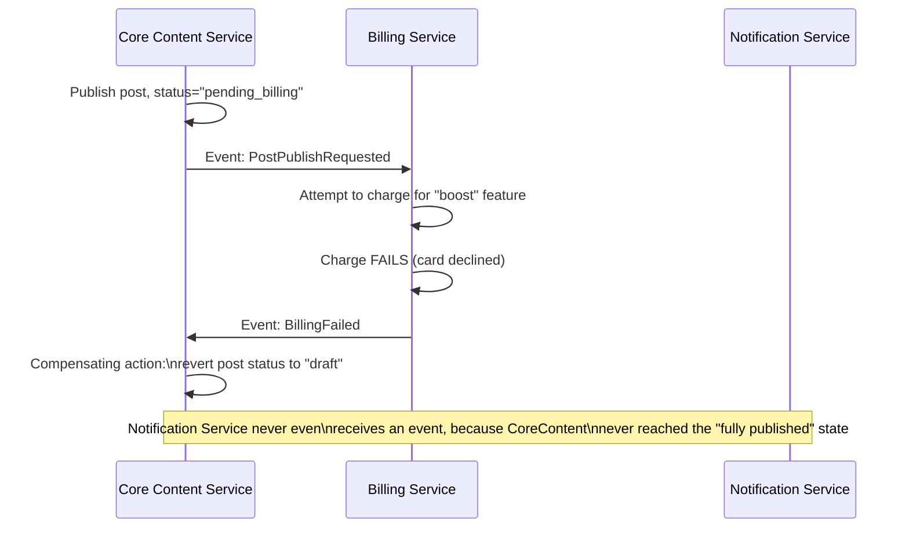
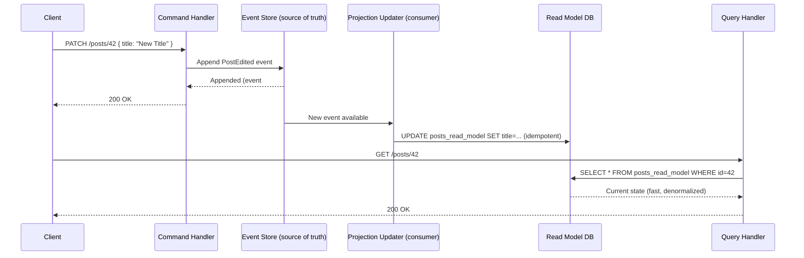
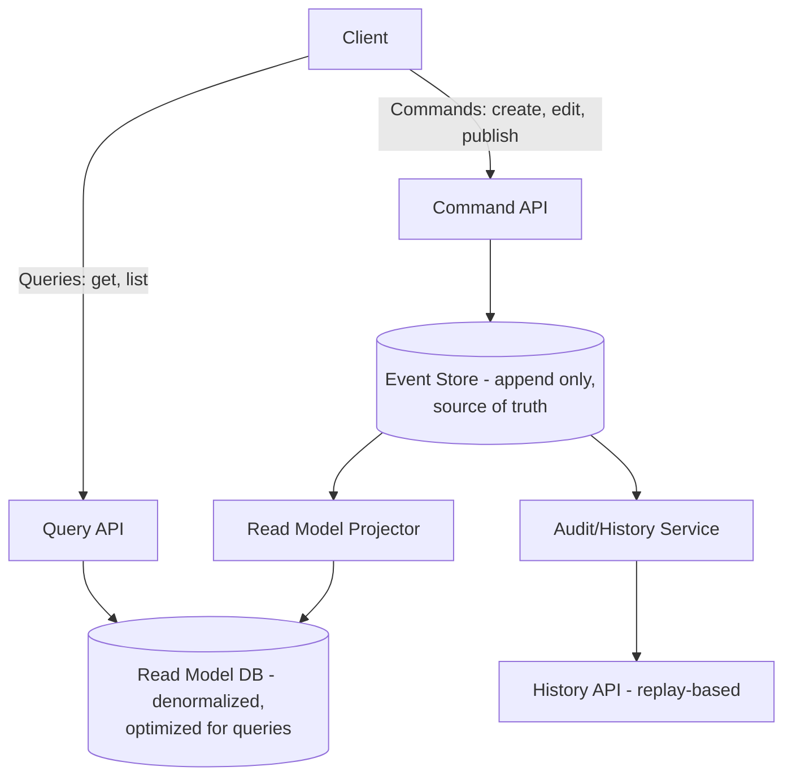
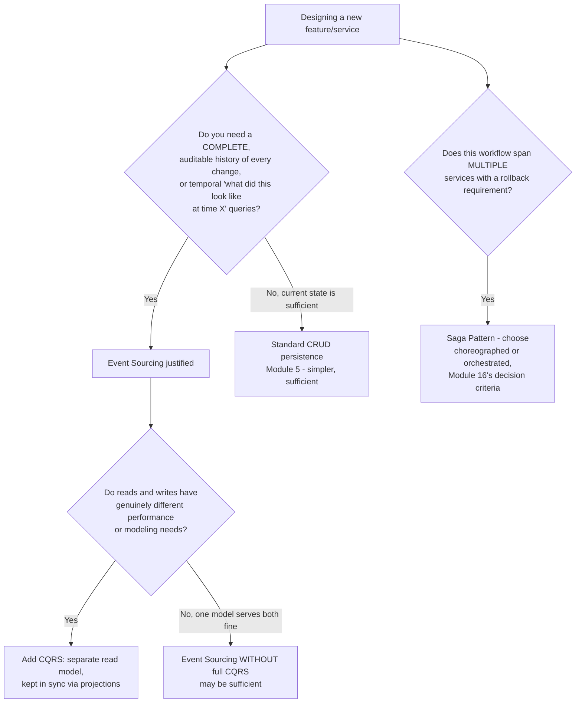
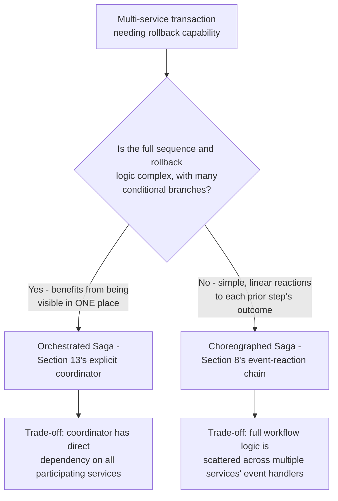
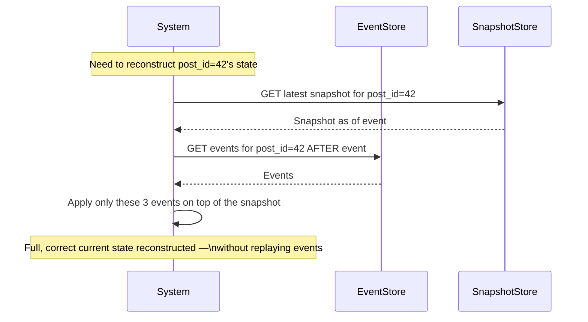
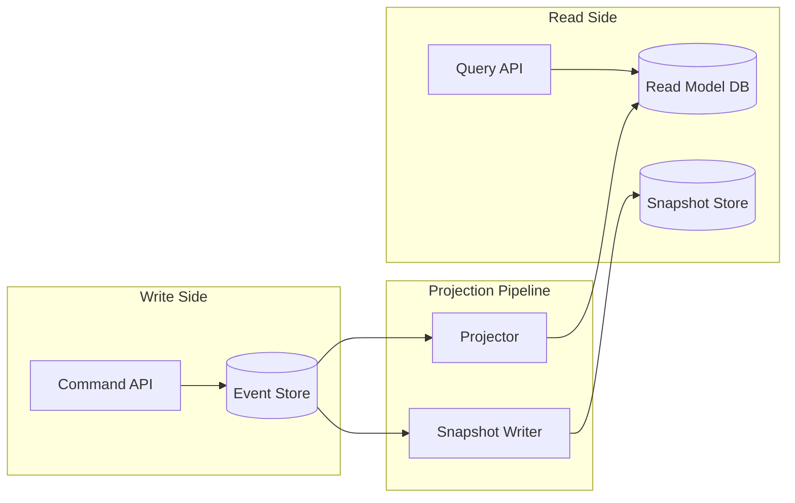
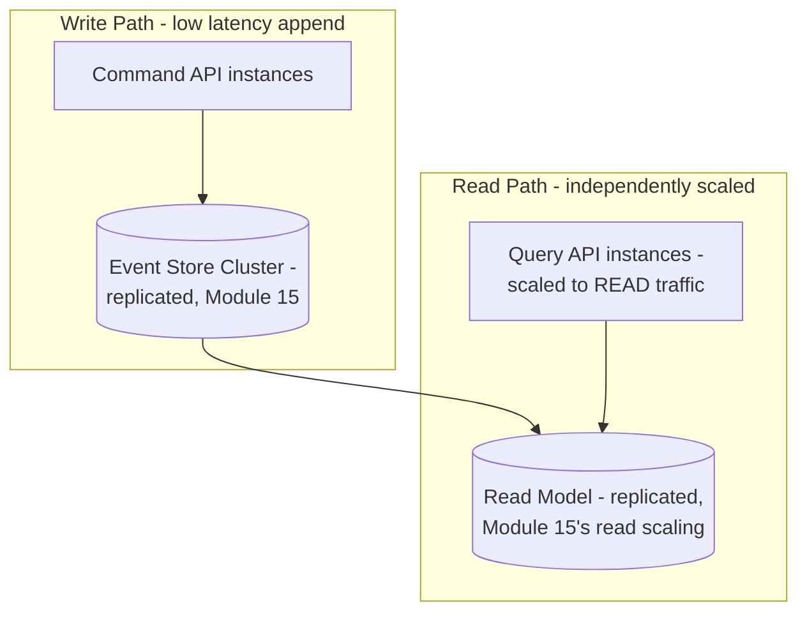

# Module 17 — Event-Driven Systems

> **Masterclass:** System Design Masterclass (30 Modules)
> **Level:** Advanced
> **Audience:** Node.js backend developers, SDE‑2 / Senior Backend interview candidates, engineers transitioning into architecture roles
> **Prerequisite:** Modules 1–16 (System Design Intro through Microservices Design)

---

## 1. Introduction

Module 16 introduced choreography — services reacting independently to published events — as the preferred communication pattern for loosely-coupled microservices. This module takes that single idea and builds it into a complete architectural discipline. We formalize the **event bus**, introduce **event sourcing** (storing the sequence of changes as the source of truth, not just the current state), **CQRS** (splitting how you write data from how you read it), and the **Saga pattern** (Module 16's orchestrated rollback example, given its proper name and full treatment).

These four patterns are deeply related, frequently combined, and represent the architectural backbone of how large, event-driven microservices systems — the kind Module 16's Section 31 real-world examples actually run — are built in practice.

---

## 2. Learning Objectives

By the end of this module, you will be able to:

1. Explain the **Event Bus** architecture and how it generalizes Module 11's point-to-point/pub-sub patterns into a system-wide backbone.
2. Explain **Event Sourcing** — storing an append-only log of events as the source of truth, rather than just current state.
3. Explain **CQRS (Command Query Responsibility Segregation)** and why separating write and read models solves a real, specific problem.
4. Explain the **Saga Pattern** for managing distributed transactions across services without two-phase commit.
5. Distinguish **orchestrated Sagas** from **choreographed Sagas**, and choose correctly between them.
6. Design an **event schema and versioning strategy** that allows event-driven systems to evolve safely over time.
7. Recognize when event sourcing and CQRS are justified, versus when they add unjustified complexity (continuing Module 16's discipline of deliberate trade-offs).

---

## 3. Why This Concept Exists

Module 16 established that choreography — services reacting to events — is often superior to tight, synchronous coupling. But "publish an event when something happens" raises deeper questions once you follow it to its logical conclusion. If every meaningful state change in your system is captured as an event, why store *only* the current state at all — why not store the full sequence of events as the authoritative record, and derive current state from replaying them? This is **event sourcing**, and it unlocks capabilities (complete audit history, the ability to replay history to rebuild a corrupted read model, temporal queries — "what did this look like last Tuesday?") that a traditional "just store current state" model cannot easily provide.

Once you're storing events as the source of truth, a second question follows naturally: since the *write* side (append an event) and the *read* side (query current or historical state) now have genuinely different shapes and performance needs, why force them through the same data model at all? This is **CQRS** — a direct, logical extension of the same reasoning that led Module 15 to separate replicas (read-optimized) from the leader (write-optimized), now applied to the data *model* itself, not just its physical replication.

Finally, once you have many independent services each owning their own data (Module 16's Database-per-Service), a transaction spanning several of them (Module 16, Section 16's promotional-email rollback example) can no longer rely on a single database's ACID transaction guarantee (Module 5) — there is no single database anymore. The **Saga pattern** exists to provide a disciplined, well-understood way to manage this exact situation: a sequence of local transactions, each in its own service, with explicit compensating actions if a later step fails.

---

## 4. Problem Statement

> Our blog platform's "publish a post" workflow (Module 16, Section 16) now needs three additional, non-negotiable capabilities: (1) a complete, immutable audit trail of every edit ever made to a post, for compliance purposes, (2) the ability to reconstruct a post's exact state at any point in its history (for a "view edit history" feature), and (3) a "Publish Post" action that must coordinate Core Content, Notification, and a new Billing Service (for premium "boosted" posts) — where a Billing failure must cleanly roll back the post's published status. Design the architecture satisfying all three requirements, and name the specific pattern addressing each.

---

## 5. Real-World Analogy

**Event sourcing is a bank keeping every single transaction ledger entry ever made, forever, rather than just today's account balance.** Your current balance is never stored directly — it's always *calculated* by replaying every deposit and withdrawal from account opening to now. This sounds wasteful until you realize its enormous benefit: if a dispute arises about your balance from six months ago, the bank can reconstruct *exactly* what it was at that moment, by replaying the ledger only up to that point — a capability a system that only ever stored "current balance" could never provide, because the intermediate history was never a first-class citizen. This directly resolves Section 4's compliance and edit-history requirements.

**CQRS is that same bank having two, entirely separate departments: a Transactions Department that only ever appends new ledger entries (optimized purely for fast, reliable writes), and a Statements Department that maintains a separately-computed, read-optimized summary of "your current balance" and "your last 10 transactions" (optimized purely for fast reads).** The Statements Department's summary is *derived from*, but structurally separate from, the Transactions Department's raw ledger — letting each department optimize its own data structures for its own job, without compromise.

**A Saga is a multi-step travel booking (flight, hotel, car rental) where each booking is made independently with a different company, and if the car rental fails after the flight and hotel are already confirmed, the travel agent must explicitly call the airline and hotel to cancel those bookings too** — there's no single "undo the whole trip" button, because no single company holds all three bookings; the rollback must be an explicit, deliberate sequence of compensating cancellations, one per company, exactly mirroring Section 4's Billing-failure rollback requirement.

---

## 6. Technical Definition

**Event Bus:** A centralized (logically, not necessarily physically) communication backbone through which services publish and subscribe to events, decoupling event producers from consumers system-wide (generalizing Module 11's message broker to the entire architecture's backbone).

**Event Sourcing:** A persistence pattern where the state of an entity is derived entirely from an append-only, ordered log of events describing every change ever made to it, rather than storing only its current state directly.

**CQRS (Command Query Responsibility Segregation):** An architectural pattern separating the model used to handle writes (Commands) from the model used to handle reads (Queries), allowing each to be independently optimized and, often, independently scaled and stored.

**Saga Pattern:** A pattern for managing a sequence of local transactions across multiple services, where each step publishes an event triggering the next step, and any failure triggers a corresponding sequence of compensating transactions to undo prior steps.

**Compensating Transaction:** An explicit action that semantically reverses the effect of a previously completed step in a Saga, used because a true, cross-service database rollback (Module 5's transaction rollback) is not possible once data ownership is distributed (Module 16).

---

## 7. Core Terminology

| Term | Precise Definition | One-line Intuition |
|---|---|---|
| **Event Store** | The durable, append-only storage holding the full event log in an event-sourced system | "The bank's complete, permanent ledger" |
| **Projection** | A read-optimized view derived by processing (replaying) some or all of the event log | "The Statements Department's computed summary" |
| **Command** | A request to perform an action that changes state (the "write" side of CQRS) | "Please make this deposit" |
| **Query** | A request to read data, never changing state (the "read" side of CQRS) | "What's my current balance?" |
| **Orchestrated Saga** | A Saga coordinated by a central orchestrator explicitly directing each step and any compensation | "A travel agent explicitly managing every booking and cancellation" |
| **Choreographed Saga** | A Saga where each service reacts to the previous step's event and publishes its own completion/failure event, with no central coordinator | "Each company independently reacts to the previous company's confirmation" |
| **Snapshot (event sourcing)** | A periodically-saved current-state checkpoint, letting replay start from the snapshot instead of the very beginning of history | "A recent bank statement, so you don't have to replay literally every transaction since account opening" |

---

## 8. Internal Working

### How event sourcing actually reconstructs state, and resolves Section 4's audit/history requirements

Instead of a `posts` table with a `title` column that gets `UPDATE`d in place (losing the previous value forever, exactly Module 5's standard schema), an event-sourced system stores:

```
Event Log for post_id=42:
  1. PostCreated    { title: "Draft Title", body: "..." }
  2. PostEdited     { title: "Better Title" }
  3. PostEdited     { title: "Final Title", body: "...(updated)" }
  4. PostPublished  { publishedAt: "2026-07-04T10:00:00Z" }
```

**Current state is derived by replaying these events in order:** apply `PostCreated`, then apply `PostEdited` (updating `title`), then apply the next `PostEdited`, then apply `PostPublished` — arriving at the current, correct state, but with **every intermediate state still fully recoverable**, simply by replaying only up to that point. This **directly and completely** satisfies Section 4's requirement (1) (complete audit trail — the event log itself *is* the audit trail, with nothing extra to build) and requirement (2) (reconstruct any historical state — replay events up to any timestamp).

### Why CQRS is the natural complement to event sourcing, not a separate, unrelated pattern

Notice the reconstruction process above (replaying events to get "current title") is **not** how you want to serve a `GET /posts/42` request under real read-traffic load (Module 7's 5,000 req/s figure) — replaying potentially thousands of events on every single read would be disastrously slow. This is precisely why event-sourced systems almost always pair with CQRS: **maintain a separate, continuously-updated "read model" (a Projection, Section 7)** — literally a normal, denormalized `posts` table, kept in sync by a consumer that processes each new event as it's appended and updates the read model accordingly, exactly mirroring Module 16's Search Service pattern (Section 20 of that module), but now updating a projection of the *same* service's own data, not a different service's.

```javascript
// Write side (Command): append an event, don't mutate state directly
async function editPost(postId, changes) {
  await eventStore.append(postId, { type: 'PostEdited', ...changes, timestamp: Date.now() });
}

// Read side (Query): served entirely from the separately-maintained projection — FAST
async function getPost(postId) {
  return readModelDb.query('SELECT * FROM posts_read_model WHERE id = $1', [postId]);
}

// Projection updater — a consumer keeping the read model in sync (Module 11's idempotent consumer pattern)
async function handlePostEditedEvent(event) {
  await readModelDb.query(
    'UPDATE posts_read_model SET title = COALESCE($1, title), body = COALESCE($2, body) WHERE id = $3',
    [event.title, event.body, event.postId]
  );
}
```

**This precisely resolves the tension**: writes are fast, simple appends to an event store (optimized for write throughput); reads are fast, direct queries against a purpose-built, denormalized projection (optimized for read latency) — and the full historical event log remains available whenever the audit/history requirements (Section 4) actually need it, without that requirement slowing down the 99% of requests that just want the current state quickly.

### How a choreographed Saga resolves Section 4's Billing-rollback requirement



**Why this satisfies Section 4's requirement (3) precisely:** each service reacts independently to events (choreography, Module 16's preferred pattern for loose coupling), and the **compensating action** (reverting to "draft") is explicitly triggered by the `BillingFailed` event — there is no cross-service database transaction being rolled back (impossible, per Module 16's Database-per-Service), only a deliberate, explicit corrective action within Core Content's own data, triggered by an event describing another service's failure.

---

## 9. Request Lifecycle

### Mermaid Sequence Diagram — Event Sourcing + CQRS, Full Write-Then-Read Cycle



**Step-by-step explanation, directly connecting to Module 14's consistency lessons:** notice there's a **real, measurable gap** between the event being appended and the read model being updated — this is precisely Module 14's eventual consistency staleness window, now applied specifically to the relationship between an event-sourced write model and its CQRS projection. If Section 4's post-edit feature needs read-after-write consistency (a user immediately re-reading their own edit), Module 14's exact targeted routing technique (route the writer's own immediate read to the event store's latest state, or force-refresh the projection synchronously for that one read) applies directly here too.

---

## 10. Architecture Overview



**HLD-level insight, resolving all three of Section 4's requirements in one diagram:** the Event Store satisfies requirement (1) (it *is* the audit trail) and, via the Audit/History Service's replay capability, requirement (2); the separate Read Model DB, updated via the Projector, satisfies normal fast-read needs without ever touching the replay machinery for routine requests — precisely the CQRS separation Section 8 established.

---

## 11. Capacity Estimation

**Scenario:** Estimating the event store's growth rate and the projection lag under our established comment/post activity levels.

**Given:** 10,000 new posts/day (Module 1's figure) plus an average of 3 edits per post before publication, and 500 comments/second at peak (Module 11's figure) — assume each comment also generates a `CommentCreated` event.

**Step 1 — Daily event volume:**
```
10,000 posts × (1 PostCreated + 3 PostEdited + 1 PostPublished) = 50,000 post-related events/day
500 comments/sec × 86,400 sec/day (worst case, though real traffic isn't constant peak) ≈
  actual comment event volume closer to Module 11's realistic daily estimate, ~500,000/day
```

**Step 2 — Event store storage growth (average event size ~1KB):**
```
(50,000 + 500,000) events/day × 1 KB ≈ 550 MB/day ≈ 200 GB/year
```

**Conclusion, directly motivating Section 7's Snapshot concept:** 200 GB/year is entirely manageable for object storage or a dedicated event store (Module 6's storage lessons apply directly), but replaying **200 GB of history** to reconstruct a single entity's current state would become increasingly, unacceptably slow as the log grows — this is precisely why production event-sourced systems use **snapshots**: periodically persist the computed current state (e.g., every 100 events, or daily), so replay only ever needs to start from the most recent snapshot forward, not from the beginning of time — directly bounding replay cost regardless of how large the total historical log eventually grows.

---

## 12. High-Level Design (HLD)



**HLD-level insight:** this decision flow makes explicit that **event sourcing, CQRS, and Sagas are three independently-justified patterns**, not a single package deal — a system might use a Saga for one workflow (Section 4's Billing rollback) without adopting full event sourcing for the entire post-editing history, or vice versa; each pattern earns its place based on its own specific requirement, exactly continuing Module 16's discipline of deliberate, per-capability justification rather than blanket architectural fashion.

---

## 13. Low-Level Design (LLD)

### An orchestrated Saga implementation (Node.js), for contrast with Section 8's choreographed version

```javascript
class PublishPostSaga {
  async execute(postId, boostRequested) {
    const steps = [];
    try {
      await coreContentService.markPendingPublish(postId);
      steps.push({ compensate: () => coreContentService.revertToDraft(postId) });

      if (boostRequested) {
        await billingService.chargeForBoost(postId);
        steps.push({ compensate: () => billingService.refundBoost(postId) });
      }

      await coreContentService.markPublished(postId);
      steps.push({ compensate: () => coreContentService.markPendingPublish(postId) });

      await notificationService.notifyFollowers(postId);
      // Notification failure is typically non-critical — may not require compensation

      return { success: true };
    } catch (err) {
      console.error('Saga failed, running compensations in reverse order:', err);
      for (const step of steps.reverse()) {
        await step.compensate(); // undo each completed step, in reverse
      }
      return { success: false, error: err.message };
    }
  }
}
```

**LLD-level design note, directly contrasting with Section 8's choreographed version:** this orchestrated implementation makes the **entire workflow's sequencing and rollback logic visible in one place** — a genuine advantage for tracing and reasoning about the full "publish a boosted post" business process, at the cost of `PublishPostSaga` needing direct, explicit knowledge of and dependency on all three services — exactly the choreography-vs-orchestration trade-off Module 16, Section 8 established, now shown as two concrete, working alternatives for the *same* business requirement.

---

## 14. ASCII Diagrams

```
TRADITIONAL PERSISTENCE                   EVENT SOURCING

  posts table:                             event_log:
  ┌────┬───────┬──────┐                    1. PostCreated  {title: "Draft"}
  │ id │ title │ body │                    2. PostEdited   {title: "V2"}
  ├────┼───────┼──────┤                    3. PostEdited   {title: "Final"}
  │ 42 │ Final │ ...  │  ← only CURRENT     4. PostPublished
  └────┴───────┴──────┘     state kept      (FULL history preserved, current
  (previous titles LOST                     state is DERIVED by replay)
   forever on each UPDATE)
```

```
CQRS — SEPARATE WRITE AND READ MODELS

  WRITE SIDE (Command)              READ SIDE (Query)
    Command Handler                    Query Handler
         │                                  ▲
         ▼                                  │
    Event Store                       Read Model DB
    (append-only,                     (denormalized,
     source of truth)                  read-optimized)
         │                                  ▲
         └──────── Projector ───────────────┘
              (keeps read model in sync)
```

---

## 15. Mermaid Flowcharts

*(Section 12 covers the canonical decision flow for this module's three patterns.)*

### Decision Flow: Choreographed or Orchestrated Saga?



---

## 16. Mermaid Sequence Diagrams

*(Sections 9 and 8 cover this module's canonical sequence diagrams — CQRS write/read cycle, and the choreographed Saga rollback. Additional diagram below.)*

### Snapshot-Accelerated Replay (Resolving Section 11's Scaling Concern)



**Why this directly resolves Section 11's growth concern:** as the event log grows to millions of events over years, replaying from event #1 every single time would make reconstruction progressively, unboundedly slower — periodic snapshots (Section 7) cap the maximum replay cost at "however many events have occurred since the last snapshot," regardless of how large the total historical log has become.

---

## 17. Component Diagrams



**Why `Projector` and `SnapshotWriter` are separate, independent consumers of the same Event Store:** this mirrors Module 16's core lesson precisely — each has a distinct responsibility (maintaining a fast query-optimized view, versus periodically checkpointing for replay efficiency) and can be scaled, deployed, and even fail independently of each other, exactly the loose coupling this course has emphasized since Module 11.

---

## 18. Deployment Diagrams



**Deployment-level note, directly connecting CQRS to Module 15's replication lesson and Module 2's independent-scaling lesson:** the write path and read path are not just logically separate (Section 8) but can be **independently, physically scaled** — if read traffic dwarfs write traffic (very common, per Module 7's caching motivation), you provision far more Query API and Read Model capacity than Command API and Event Store capacity, a direct, deployment-level realization of CQRS's core benefit.

---

## 19. Network Diagrams

Event sourcing and CQRS don't introduce new network topology concepts beyond Module 11's message broker patterns — but they do clarify an important routing distinction: **Commands and Queries should ideally be routed as distinctly as their data models are separated**, often via the API Gateway's path-based routing (Module 9):

```
  API Gateway routes:
    POST/PATCH /posts/*  → Command API (writes to Event Store)
    GET        /posts/*  → Query API (reads from Read Model DB)

  (Same gateway, same client-facing domain — but genuinely
   different backend services, matching the CQRS split)
```

---

## 20. Database Design

Event sourcing requires a specific, deliberate event store schema, distinct from Module 5's standard table design:

```sql
CREATE TABLE event_log (
    id BIGSERIAL PRIMARY KEY,
    aggregate_id UUID NOT NULL,      -- e.g., the post_id this event belongs to
    event_type VARCHAR(100) NOT NULL, -- 'PostCreated', 'PostEdited', etc.
    payload JSONB NOT NULL,
    sequence_number INT NOT NULL,     -- ordering WITHIN this aggregate's history
    created_at TIMESTAMP DEFAULT NOW(),
    UNIQUE (aggregate_id, sequence_number) -- prevents duplicate/out-of-order writes
);

CREATE INDEX idx_event_log_aggregate ON event_log(aggregate_id, sequence_number);
```

**Why `UNIQUE (aggregate_id, sequence_number)` matters, precisely:** this constraint is the event store's own, database-enforced defense against a specific class of bug — two concurrent commands both trying to append the *next* event for the same post simultaneously (a genuine race condition) — the unique constraint ensures only one can succeed with a given sequence number, forcing the other to retry with the correct next number, directly preventing silent, out-of-order corruption of a single aggregate's history.

---

## 21. API Design

```
Command endpoints (write side):
  POST  /posts               → CreatePost command
  PATCH /posts/:id            → EditPost command
  POST  /posts/:id/publish    → PublishPost command (may trigger a Saga, Section 13)

Query endpoints (read side):
  GET  /posts/:id                    → current state, from Read Model
  GET  /posts/:id/history             → full event history, from Event Store directly
  GET  /posts/:id/history?at=<date>   → reconstructed historical state (Section 8's replay-to-a-point)
```

**Why exposing `/history` as a genuinely distinct endpoint, rather than a query parameter on the main resource, matters:** it makes explicit, at the API contract level, that this is a fundamentally different, more expensive operation (potential replay, Section 16's snapshot-accelerated version) than a normal current-state read — directly informing API consumers' expectations about latency and appropriate use, echoing Module 10's discipline of explicit `Cache-Control` labeling per endpoint.

---

## 22. Scalability Considerations

| Consideration | Impact |
|---|---|
| Write-side append-only nature | Event stores are typically very write-friendly (no updates, no complex joins) — often scale writes more easily than traditional mutable-row tables |
| Read-side independent scaling | CQRS allows the read model to be scaled (replicated, Module 15; cached, Module 7) entirely independently of write-side capacity |
| Replay cost growth | Bounded by snapshotting (Section 16) — without it, replay cost grows unboundedly with history length |
| Saga coordination overhead | Orchestrated Sagas add a coordination bottleneck at scale if the orchestrator itself isn't scaled/replicated appropriately (Module 12's leader-election lessons become relevant for highly-available orchestrators) |

---

## 23. Reliability & Fault Tolerance

- **The event store, being the sole source of truth, must be replicated with the same rigor as any other critical database** (Module 15) — losing the event log means losing the *only* record of what happened, a more severe failure than losing a traditional mutable-state table (which at least still has *some* current state, however incomplete the history).
- **Projections can always be rebuilt from scratch by replaying the event log** — this is a genuine, valuable reliability property: if a read model becomes corrupted (a bug in the Projector, Module 11's poison-message scenario), you can safely delete and fully rebuild it by replaying history, a recovery option a traditional system without an event log simply doesn't have.
- **Saga compensations must themselves be idempotent and retry-safe** (Module 11's idempotency lesson, applied to rollback logic specifically) — a compensating action that fails partway through and is retried should never double-refund or double-revert.

---

## 24. Security Considerations

- **Event logs, being immutable and complete, cannot simply "delete" sensitive data for compliance (e.g., GDPR's "right to be forgotten")** the way a traditional `UPDATE`/`DELETE` can — this is a genuine, non-trivial tension requiring deliberate design (e.g., storing sensitive fields separately with their own deletable reference, or using cryptographic erasure techniques), worth flagging explicitly rather than glossing over.
- **Command handlers must validate authorization before appending an event** — once an event is in the append-only log, it cannot be un-appended; unlike a traditional system where a bad write might still be correctable via another `UPDATE`, an event-sourced system's history is permanent, raising the stakes of write-time validation correctness.

---

## 25. Performance Optimization

- **Snapshot aggressively enough to bound replay cost** (Section 11/16) but not so frequently that snapshotting itself becomes a meaningful overhead — this interval should be tuned based on measured replay times, not guessed.
- **Scale read and write sides independently and asymmetrically** (Section 18), matching actual measured traffic ratios rather than assuming a 1:1 relationship.
- **Batch projection updates where the read model allows it** (Module 7 and Module 11's batching lessons, applied here) rather than processing every single event with a separate database round trip.

---

## 26. Monitoring & Observability

- **Projection lag** (the gap between the latest appended event and the read model's last-processed event) — directly extending Module 14's replication-lag monitoring to the CQRS projection pipeline specifically.
- **Saga completion and compensation rates** — a rising compensation rate signals a systemic problem in one of the Saga's participating services (e.g., Billing failing more often than expected), worth investigating at the root cause, not just handling gracefully at the Saga layer.
- **Event store growth rate versus snapshot frequency** — validating that Section 11's capacity estimate and Section 16's snapshot strategy remain aligned with actual, real-world event volume as the system evolves.

---

## 27. Common Bottlenecks

| Bottleneck | Symptom | Root Cause |
|---|---|---|
| Unbounded replay cost | Reconstructing an old entity's state becomes progressively slower over months/years | No snapshotting strategy (Section 16) |
| Projection falling behind | Read model shows stale data under high write load | Projector consumer under-provisioned relative to write-side event volume (Module 11's consumer-scaling lesson, applied here) |
| Saga compensation failures | Partially-rolled-back state after a failed multi-step workflow | Non-idempotent or non-retry-safe compensating actions (Section 23) |
| Event schema drift | Old events fail to deserialize correctly after a code change | No event versioning strategy (Section 30 addresses this) |

---

## 28. Trade-off Analysis

> "I chose **event sourcing** for the post-editing history, optimizing for **complete audit trail and arbitrary historical state reconstruction (Section 4's compliance requirement)**, at the cost of **added architectural complexity — an event store, a projection pipeline, and snapshotting strategy — compared to simple mutable-row storage**, which is acceptable because the compliance requirement is non-negotiable and cannot be retrofitted cleanly onto a system that only ever stored current state."

> "I chose a **choreographed Saga** over an orchestrated one for the publish-with-boost workflow, optimizing for **loose coupling, consistent with our broader microservices choreography preference (Module 16)**, at the cost of **the full rollback logic being scattered across Core Content's and Billing's independent event handlers rather than visible in one place**, which is acceptable because this specific workflow's rollback logic is simple and linear, not requiring orchestration's centralized-visibility benefit."

---

## 29. Anti-patterns & Common Mistakes

1. **Adopting event sourcing for every entity in a system "for consistency," without a genuine audit/history requirement** — a significant, often unjustified complexity cost (Section 12's decision flow exists precisely to prevent this default).
2. **No snapshotting strategy**, allowing replay cost to grow unboundedly as history accumulates (Section 27).
3. **Treating CQRS's read model as eventually consistent everywhere without exception**, even where a specific feature genuinely needs read-after-write consistency (Section 9's direct callback to Module 14) — applying the pattern rigidly rather than pairing it with Module 14's targeted fixes where needed.
4. **Non-idempotent Saga compensating actions**, risking double-compensation under retry (Module 11's idempotency lesson, unheeded).
5. **No event versioning strategy** (Section 30), causing old events in the log to become unreadable or misinterpreted after a schema change — a serious problem specifically because, unlike a mutable table, you cannot simply migrate old event records in place without violating the append-only, immutable nature of the log.
6. **Choosing orchestration or choreography for a Saga by habit rather than the specific workflow's complexity and coupling needs** (Section 15's decision flow).

---

## 30. Production Best Practices

- **Justify event sourcing per-entity, based on a genuine audit/history/replay requirement** — not as a default architectural choice for the entire system.
- **Always implement snapshotting** for any event-sourced entity with a growing, long-lived history.
- **Design event schemas to be forward-compatible from the start** — include a version field in every event, and write event handlers defensively to handle multiple versions gracefully (e.g., `PostEditedV1` and `PostEditedV2` both understood by the same projector, with clear migration/deprecation policy).
- **Make every Saga compensating action idempotent and retry-safe**, treating this with the same rigor as Module 11's consumer idempotency requirement.
- **Monitor projection lag and Saga compensation rates** as first-class, alerted metrics.
- **Choose choreographed or orchestrated Sagas deliberately per workflow**, using Section 15's complexity/coupling criteria, not a single blanket policy for the entire system.

---

## 31. Real-World Examples

- **Event sourcing and CQRS were popularized largely through the Domain-Driven Design community**, with Greg Young's widely-cited talks and writings serving as foundational, citable references for both patterns — a legitimate, well-established architectural lineage rather than an ad-hoc invention.
- **Financial trading systems and banking platforms** are among the most common, well-documented real-world adopters of event sourcing, precisely because Section 4's compliance/audit-trail requirement is often a genuine legal necessity in that domain, not merely a nice-to-have — directly validating this module's Section 12 justification criteria in a domain where the requirement is unambiguous.
- **Uber's and Airbnb's publicly documented Saga-pattern usage** for coordinating multi-service booking/payment workflows (referenced in various engineering blog posts) directly validates Section 4's Billing-rollback scenario at real, large-scale, production usage — multi-step, multi-service transactions requiring compensating rollback are a common, recurring real-world pattern in exactly this kind of e-commerce/marketplace domain.

---

## 32. Node.js Implementation Examples

### A minimal, working event-sourced aggregate with snapshotting (unifying Sections 8, 16, and 20)

```javascript
class PostAggregate {
  static async reconstruct(postId, eventStore, snapshotStore) {
    const snapshot = await snapshotStore.getLatest(postId);
    let state = snapshot ? { ...snapshot.state } : { title: null, body: null, status: 'draft' };
    const sinceSequence = snapshot ? snapshot.sequenceNumber : 0;

    const events = await eventStore.getEventsSince(postId, sinceSequence); // Section 16's optimization
    for (const event of events) {
      state = PostAggregate.applyEvent(state, event);
    }
    return state;
  }

  static applyEvent(state, event) {
    switch (event.type) {
      case 'PostCreated': return { ...state, title: event.title, body: event.body, status: 'draft' };
      case 'PostEdited':  return { ...state, title: event.title ?? state.title, body: event.body ?? state.body };
      case 'PostPublished': return { ...state, status: 'published' };
      default: throw new Error(`Unknown event type: ${event.type}`); // fail loudly on unversioned events
    }
  }
}

// Usage — reconstructs current state correctly, using snapshot + only recent events
const currentState = await PostAggregate.reconstruct('post_42', eventStore, snapshotStore);
```

**Why the `default: throw` case matters, directly connecting to Section 29's versioning anti-pattern:** an unrecognized event type should fail **loudly and immediately**, not silently be ignored — silently skipping an unknown event would produce subtly, dangerously incorrect reconstructed state, exactly the schema-drift failure mode Section 29 warns against; a production system would instead have explicit version-aware handling for every known event type, but the principle — never silently ignore an event you don't understand — holds regardless.

---

## 33. Interview Questions

### Easy
1. What is event sourcing, and how does it differ from traditional CRUD persistence?
2. What does CQRS stand for, and what problem does it solve?
3. What is a Saga, and why is it needed once data ownership is distributed across services?
4. What is a compensating transaction, and how does it differ from a database rollback?
5. What is a snapshot in the context of event sourcing, and why is it needed?
6. What's the difference between a choreographed Saga and an orchestrated Saga?

### Medium
7. Design an event-sourced aggregate for a simple bank account, listing the events it would need and how current balance is derived.
8. Explain why CQRS is often paired with event sourcing, even though they are technically independent patterns.
9. A read model in a CQRS system shows stale data immediately after a write. Diagnose using Module 14's concepts and propose a targeted fix.
10. Design a choreographed Saga for an e-commerce "place order" workflow spanning Inventory, Payment, and Shipping services, including the compensating actions for each possible failure point.
11. Explain why an event store needs a uniqueness constraint on (aggregate ID, sequence number), and what specific bug it prevents.
12. Why can't sensitive data simply be deleted from an event-sourced system's log to satisfy a "right to be forgotten" request, and what alternative approaches exist?

### Hard
13. Design a complete event-sourced, CQRS-based order management system, addressing the event schema, snapshotting strategy, projection pipeline, and how you'd handle an event schema change without breaking existing historical events.
14. Compare the operational and reasoning trade-offs of choreographed versus orchestrated Sagas for a workflow with 5 participating services and multiple conditional failure paths.
15. A production incident reveals a Saga's compensating action was executed twice, causing a double refund. Diagnose the root cause using Module 11's idempotency concepts, and design the fix.
16. Explain how snapshotting changes the time complexity of state reconstruction from O(total history length) to a bounded cost, and design a snapshotting policy for an entity with highly variable edit frequency.
17. Discuss the trade-offs of using event sourcing for an entire microservice's data versus using it only for specific, audit-critical entities within an otherwise traditionally-persisted service.

---

## 34. Scenario-Based Design Questions

1. **Scenario:** A compliance team requires a complete, immutable history of every change to a financial record, including who made each change and when. Design the event schema and explain why this couldn't be retrofitted onto an existing mutable-row system without significant risk.
2. **Scenario:** Your CQRS read model has fallen 10 minutes behind the write-side event store due to a Projector outage. Walk through the user-facing impact and your recovery approach, including whether you'd rebuild the read model from scratch or resume from where it left off.
3. **Scenario:** A multi-service "onboard new user" Saga fails at the third of five steps. Design both a choreographed and an orchestrated version of the compensating rollback, and discuss which you'd choose for this specific workflow.
4. **Scenario:** Your event log has grown to 50 million events for a single long-lived entity, and reconstructing its state now takes several seconds. Diagnose and propose the specific fix.
5. **Scenario:** A new event type is introduced (`PostArchived`), but your event handler code doesn't recognize it and silently ignores it during replay. Discuss the risk this poses and the correct handling.
6. **Scenario:** Your team is deciding whether a new "Inventory" microservice needs event sourcing or would be fine with traditional CRUD. Walk through the deciding questions.
7. **Scenario:** A GDPR "right to be forgotten" request requires removing a specific user's personal data from your event-sourced system, but the append-only log cannot simply have entries deleted. Propose a design approach.
8. **Scenario:** Your orchestrated Saga's central coordinator becomes a single point of failure during a regional outage, blocking all in-flight multi-step transactions. Propose a mitigation using this module's and Module 12's concepts.
9. **Scenario:** You need to add a "current view count" feature to an event-sourced blog post system, where views happen far more frequently than they need to be part of the permanent audit history. Discuss whether view events belong in the same event store or should be handled differently (referencing Module 13's AP treatment of view counts).
10. **Scenario:** An interviewer asks you to justify, in one sentence each, why you would or wouldn't use event sourcing, CQRS, and a Saga for a simple "to-do list" application. Provide those three precise, defensible answers.

---

## 35. Hands-on Exercises

1. Implement the `PostAggregate` class from Section 32 with at least 3 event types, and write a test verifying that reconstructing state from the full event log produces the same result as reconstructing from a snapshot plus subsequent events.
2. Implement a simple Projector consumer that maintains a denormalized read model table, updated as new events are appended, and verify (via a deliberate delay) the projection lag is observable and measurable.
3. Implement both a choreographed and an orchestrated version of a 3-step Saga (e.g., "reserve inventory," "charge payment," "confirm order"), deliberately fail the middle step in each, and verify both correctly execute compensating actions for the first step.
4. Deliberately introduce a non-idempotent compensating action, simulate a retry (call it twice), and observe the resulting incorrect double-compensation — then fix it with an idempotency check (Module 11's technique) and re-verify.
5. Write a script that measures replay time for an entity's state reconstruction at 100, 1,000, and 10,000 events, with and without a snapshot taken partway through, demonstrating the bounded-cost benefit empirically.

---

## 36. Mini Project

**Build:** An event-sourced, CQRS-based post-editing history feature for the blog platform, directly resolving Module 17's Section 4 requirements (1) and (2).

**Requirements:**
- Implement an event store schema (Section 20) with the uniqueness constraint, storing `PostCreated`, `PostEdited`, and `PostPublished` events.
- Implement a Projector maintaining a fast, denormalized read model for normal `GET /posts/:id` requests.
- Implement a `/posts/:id/history` endpoint that replays events to reconstruct and return the full edit history.
- Implement snapshotting, triggered every 20 events, and verify replay correctly uses the most recent snapshot rather than starting from event #1.

**Success criteria:** You can create a post, edit it multiple times, and correctly retrieve both its current state (fast, from the read model) and its full historical edit sequence (via replay), with snapshotting demonstrably reducing the number of events replayed for entities with long histories.

---

## 37. Advanced Project

**Build:** Extend the Mini Project with a full Saga-based publish workflow and event versioning.

1. Implement the choreographed "Publish Post with Boost" Saga (Section 8), spanning a simulated Core Content, Billing, and Notification service, including a deliberate Billing-failure test case verifying the correct compensating rollback occurs.
2. Introduce a breaking event schema change (e.g., renaming a field in `PostEdited`), and implement a version-aware event handler that correctly processes both the old and new event shapes without breaking replay of historical events.
3. Implement projection-lag monitoring (Section 26), and simulate a Projector outage, verifying your monitoring correctly detects and reports the growing lag before manually resuming or rebuilding the projection.
4. Write a decision document evaluating, for at least 3 different capabilities across the full 30-module blog platform built throughout this masterclass, whether event sourcing, CQRS, and/or a Saga would be justified, using Section 12's decision framework explicitly for each.

**Success criteria:** You have a working, tested Saga with correct compensation, a demonstrated event-versioning strategy correctly handling mixed old/new event shapes during replay, working projection-lag monitoring with a simulated recovery scenario, and a framework-justified recommendation document — setting up Module 18 (Reliability & Fault Tolerance), which formalizes the retry, timeout, circuit breaker, and bulkhead patterns this module's Saga compensations and projection recovery have been informally relying on throughout.

---

## 38. Summary

- **Event sourcing** stores the complete, ordered history of changes as the source of truth, deriving current state by replay — providing a complete audit trail and arbitrary historical state reconstruction that traditional mutable-state persistence cannot offer.
- **CQRS** separates the write model (Commands, appended to the event store) from the read model (Queries, served from a separately-maintained, denormalized projection), letting each be independently optimized and scaled.
- **Snapshotting** bounds replay cost as an event-sourced entity's history grows, preventing reconstruction time from growing unboundedly.
- **The Saga pattern** manages multi-service transactions via a sequence of local transactions and explicit compensating actions, since cross-service ACID rollback (Module 5) is impossible once data ownership is distributed (Module 16).
- **Choreographed and orchestrated Sagas** trade coupling for centralized visibility, mirroring Module 16's choreography-vs-orchestration decision criteria.
- **None of these three patterns should be adopted by default** — each earns its place based on a specific, genuine requirement (audit history, independently-scalable reads, or cross-service rollback), continuing this course's consistent discipline of deliberate architectural trade-offs.

---

## 39. Revision Notes

- Event sourcing: store the FULL event log as source of truth, derive current state by replay — enables complete audit trail + historical reconstruction
- CQRS: separate write model (Commands → Event Store) from read model (Queries → Projection) — independently optimized and scaled
- Snapshotting bounds replay cost — without it, reconstruction time grows unboundedly with history length
- Saga: sequence of local transactions + explicit compensating actions — the answer to "no cross-service ACID rollback" once data is distributed (Module 16)
- Choreographed Saga = loosely coupled, logic scattered; Orchestrated Saga = centrally visible, tighter coupling to coordinator
- Event schemas need versioning from day one — old events in an immutable log can't be migrated in place
- None of these patterns are defaults — justify each against a genuine, specific requirement

---

## 40. One-Page Cheat Sheet

```
SYSTEM DESIGN — MODULE 17 CHEAT SHEET
─────────────────────────────────────
EVENT SOURCING   → store the EVENT LOG as truth, derive state by replay
                   Enables: full audit trail, "what did this look like at time X"

CQRS             → separate WRITE model (Commands) from READ model (Queries)
                   Write: Event Store (fast append)
                   Read:  Projection (fast, denormalized, kept in sync)

SNAPSHOTTING     → periodic checkpoint → bounds replay cost
                   Without it: reconstruction time grows UNBOUNDED with history

SAGA PATTERN     → sequence of LOCAL transactions + COMPENSATING actions
                   (No cross-service ACID rollback once data is distributed - Module 16)

CHOREOGRAPHED SAGA          ORCHESTRATED SAGA
  loosely coupled             centrally visible
  logic scattered             coordinator = tighter dependency

GOLDEN RULES
  Justify event sourcing/CQRS/Saga PER capability — never by default
  Always snapshot — unbounded replay cost is a real, avoidable failure
  Version every event schema from day one — logs are immutable, can't migrate in place
  Compensating actions must be IDEMPOTENT (Module 11's lesson, applied to rollback)
```

---

## Key Takeaways

- Event sourcing, CQRS, and Sagas are three independently-justified patterns that happen to compose extremely well together — each should be adopted because a specific capability genuinely needs what it provides, not as a bundled architectural fashion statement.
- Snapshotting is not an optional optimization for event sourcing — without it, a system's own success (accumulating history) eventually degrades its own performance unboundedly.
- The Saga pattern is the direct, necessary consequence of Module 16's Database-per-Service principle — once you've correctly distributed data ownership, you've also given up ACID's cross-entity rollback guarantee, and Sagas are how you deliberately, explicitly rebuild an equivalent safety net.

## 20 Practice Questions
*(See Section 33 — 6 Easy, 6 Medium, 5 Hard — plus 3 rapid-fire additions:)*
18. Why does an event-sourced system's write path typically outperform a traditional mutable-row table's write path, all else equal?
19. What specific recovery capability does event sourcing provide for a corrupted read model that a traditional CRUD system lacks?
20. Why must a Saga's compensating actions be idempotent, given Module 11's message delivery guarantees?

## 10 Scenario-Based Questions
*(See Section 34 in full.)*

## 5 Design Assignments
*(See Sections 36–37 — Mini Project and Advanced Project — plus:)*
1. Design an event-sourced, CQRS-based architecture for a hypothetical stock trading platform's order execution history, including snapshotting and versioning strategy.
2. Write a one-page comparison of choreographed versus orchestrated Sagas for a hypothetical hotel booking cancellation workflow spanning Reservation, Payment, and Loyalty-Points services.
3. Propose an event schema versioning policy (including how long old versions must remain supported) for a hypothetical, long-lived event-sourced system expected to run for 10+ years.

## Suggested Next Module

**→ Module 18: Reliability & Fault Tolerance** — with event-driven patterns for coordinating distributed work now established, we formalize the specific mechanisms — retries, timeouts, circuit breakers, bulkheads, and fallbacks — that make every pattern this course has built so far (Sagas, message consumers, service-to-service calls) actually resilient to the partial, ambiguous failures Module 12 first introduced.
