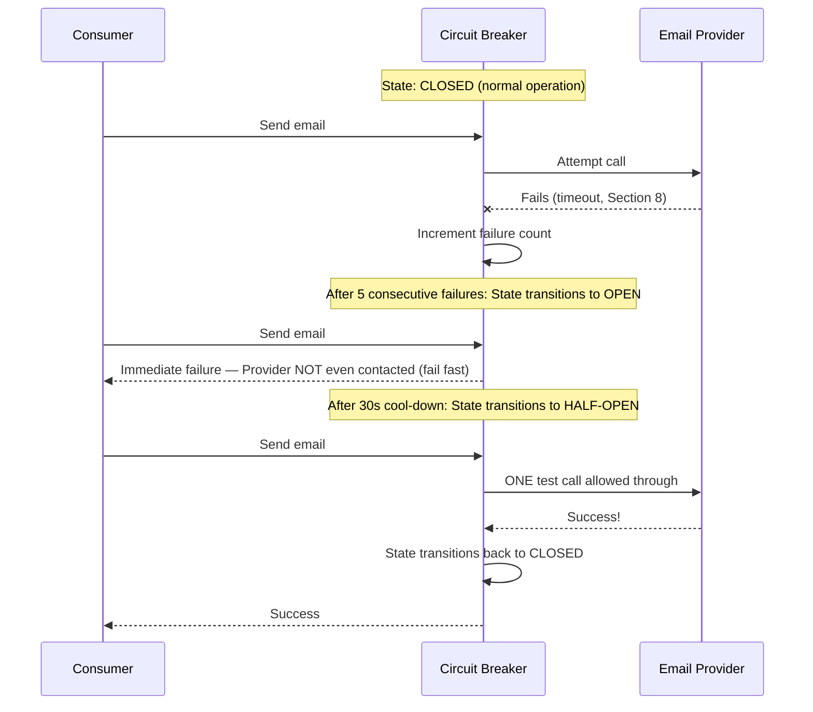
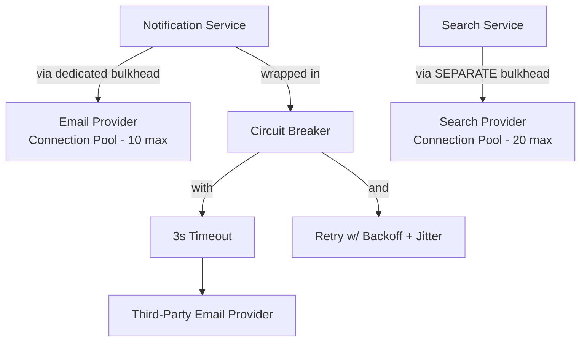
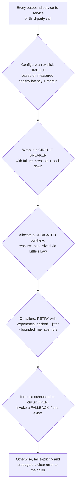
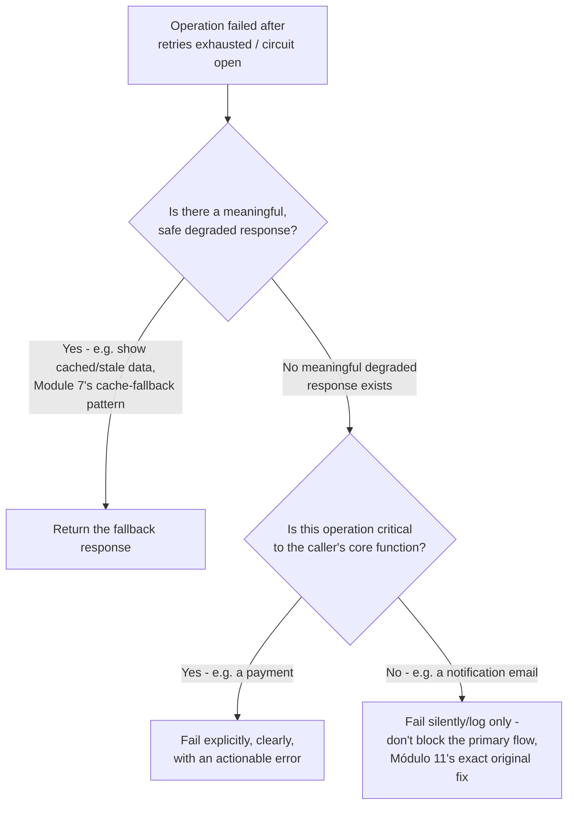
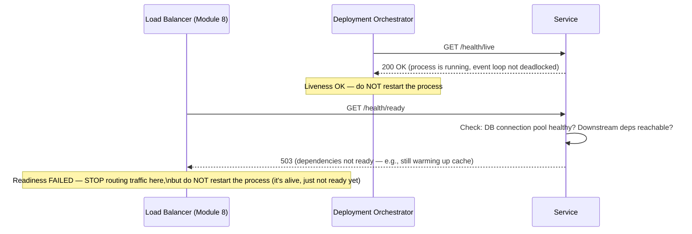
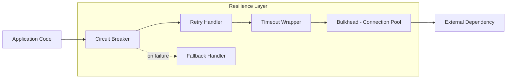
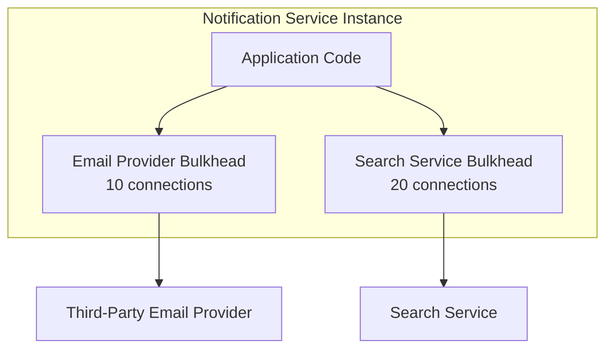

# Module 18 — Reliability & Fault Tolerance

> **Masterclass:** System Design Masterclass (30 Modules)
> **Level:** Advanced
> **Audience:** Node.js backend developers, SDE‑2 / Senior Backend interview candidates, engineers transitioning into architecture roles
> **Prerequisite:** Modules 1–17 (System Design Intro through Event-Driven Systems)

---

## 1. Introduction

Across seventeen modules, we've informally reached for the same handful of resilience techniques whenever a failure scenario came up: Module 8 introduced health checks and draining, Module 9 introduced a working circuit breaker for the API Gateway, Module 11 introduced retries and dead-letter queues, Module 17 introduced idempotent Saga compensations. This module finally gives these techniques their proper, unified names and treatment: **Retry**, **Timeout**, **Circuit Breaker**, **Bulkhead**, **Fallback**, and **Health Checks** — the standard vocabulary of reliability engineering, and the patterns that transform "the system might fail" from an anxious hope into an explicitly engineered, tested property.

This module also directly answers a question every prior module has assumed rather than earned: *why* do these specific patterns, combined, actually produce a reliable system, rather than just adding scattered defensive code?

---

## 2. Learning Objectives

By the end of this module, you will be able to:

1. Explain **Retry** with backoff and jitter, and the specific failure mode (retry storms) that naive retries cause.
2. Explain **Timeout** and why a service call without one is a latent reliability hazard, not a minor omission.
3. Explain the **Circuit Breaker** pattern's three states (Closed, Open, Half-Open) precisely, extending Module 9's working preview into full formal treatment.
4. Explain the **Bulkhead** pattern and how it isolates failures to prevent one dependency from exhausting shared resources.
5. Explain **Fallback** strategies and how they differ from simply failing gracefully.
6. Design a **Health Check** strategy that correctly distinguishes liveness from readiness (extending Module 8's precise distinction).
7. Combine these patterns correctly into a layered reliability strategy, and recognize when they conflict or compound incorrectly if applied naively.

---

## 3. Why This Concept Exists

Module 12 established that failures in distributed systems are ambiguous, partial, and inevitable — not a rare edge case, but a certainty over any sufficiently long time horizon. Every module since has, in some specific context, built a targeted defense against one specific failure scenario: Module 8's health checks against zombie servers, Module 9's circuit breaker against a slow downstream gateway dependency, Module 11's dead-letter queue against poison messages. This module exists to step back and ask: **what is the complete, general-purpose toolkit of resilience patterns**, independent of any single scenario, and how do they compose into a coherent strategy rather than a pile of ad-hoc, scenario-specific fixes?

The patterns in this module exist because **failure handling code that isn't deliberately designed tends to be either absent (an unhandled crash) or naively harmful (a retry loop that makes an outage worse, not better)**. Reliability engineering is the discipline of replacing both of these default outcomes with deliberate, tested, and — critically — *composed* behavior, where each pattern addresses a specific, named failure mode without accidentally undermining another pattern's protection.

---

## 4. Problem Statement

> Our blog platform's Notification Service (Module 4, 11) calls a third-party email provider that occasionally has brief outages. During a recent 45-second outage, three separate problems compounded: (1) every failed call was immediately retried with no delay, generating a retry storm that made the provider's recovery *slower*; (2) calls with no timeout configured hung for the provider's full, very long default timeout (30 seconds), exhausting the Notification Service's connection pool; and (3) this connection pool exhaustion caused the *unrelated* Search Service's calls to the same shared HTTP client library to also fail, because they shared a connection pool. Diagnose each of the three failures using this module's named patterns, and redesign the system so a repeat of this exact incident cannot recur.

---

## 5. Real-World Analogy

**A naive retry-immediately policy is like a crowd repeatedly slamming into a stuck revolving door the instant it stops moving — instead of pausing to let it reset, every failed attempt adds more pressure at the exact wrong moment, making it harder for the door to ever get moving again.** This is precisely Section 4's problem (1): a retry storm actively working against the very recovery it's hoping for. **Backoff** is the crowd deliberately waiting a few seconds longer after each failed attempt before trying again, giving the door — and the provider on the other end — actual room to recover.

**A missing timeout is like waiting in a single-file line at a bank teller who has gone completely unresponsive, with no rule allowing you to give up and walk away — every person behind you is now stuck waiting indefinitely too**, even though the actual problem is with one specific teller. **A timeout** is the explicit, self-imposed rule: "if this teller hasn't helped me within 2 minutes, I leave the line" — protecting *you*, and, transitively, everyone in line behind you, from one broken interaction.

**A missing bulkhead is a building with no fire doors between departments — a fire (failure) starting in the mail room can spread to consume the entire building, including departments that had nothing to do with the mail room at all.** This is precisely Section 4's problem (3): the Search Service, entirely unrelated to the failing email provider, was still burned by a shared resource pool with no isolating "fire door" between them. **A bulkhead** is literally that fire door — a dedicated, isolated resource pool per dependency, ensuring one dependency's fire cannot spread into another's territory.

---

## 6. Technical Definition

**Retry:** Re-attempting a failed operation, typically with a **backoff** strategy (increasing delay between attempts) and **jitter** (randomized variation in delay) to avoid synchronized retry storms.

**Timeout:** An explicit maximum duration a caller will wait for an operation to complete before abandoning it and treating it as failed.

**Circuit Breaker:** A pattern that tracks a dependency's recent failure rate and, upon exceeding a threshold, "opens" to reject calls immediately (without attempting them) for a cool-down period, before cautiously testing recovery — extending Module 9's working preview to its full three-state model.

**Bulkhead:** A pattern that isolates resources (connection pools, thread pools, memory) allocated to different dependencies, ensuring one dependency's resource exhaustion cannot starve another's.

**Fallback:** A predefined, degraded-but-functional alternative response used when the primary operation fails, rather than propagating the failure directly to the caller.

**Health Check:** A mechanism for determining whether a service instance is capable of correctly handling requests (extending Module 8's active/passive distinction with the further liveness/readiness distinction, Section 8).

---

## 7. Core Terminology

| Term | Precise Definition | One-line Intuition |
|---|---|---|
| **Exponential Backoff** | A retry delay strategy where each successive attempt waits exponentially longer than the last | "Wait 1s, then 2s, then 4s, then 8s..." |
| **Jitter** | Randomization added to a backoff delay to prevent many clients from retrying in lockstep | "Don't let everyone retry at exactly the same instant" |
| **Retry Storm** | A cascading failure amplification caused by many clients retrying a failing dependency simultaneously and aggressively | "The revolving-door crowd making things worse" |
| **Closed State (Circuit Breaker)** | Normal operation — calls pass through to the dependency, failures are counted | "The door is open for business as usual" |
| **Open State (Circuit Breaker)** | Calls are rejected immediately, without attempting the dependency, for a cool-down period | "The door is shut — don't even try" |
| **Half-Open State (Circuit Breaker)** | A limited number of test calls are allowed through to check if the dependency has recovered | "Cautiously cracking the door to check" |
| **Liveness Check** | Confirms a process is running and not deadlocked/crashed | "Is the heart still beating?" |
| **Readiness Check** | Confirms a process is not just alive, but currently able to correctly serve traffic | "Is the heart beating AND is the patient conscious and able to work?" |

---

## 8. Internal Working

### Why naive, immediate retries cause a retry storm, and how backoff with jitter fixes it, precisely

Section 4's problem (1) occurs because immediate, un-delayed retries mean the **total request rate to the failing provider never actually drops**, even during the outage — every failed call is instantly replaced by another attempt, and if the provider's failure was caused by being overwhelmed in the first place, this sustained pressure directly prevents recovery. This is the exact mechanism behind a retry storm: retries meant to help the caller recover **actively work against** the callee's ability to recover, and because the callee's continued failure causes yet more retries, the system can enter a self-sustaining failure loop that persists well beyond the *original* triggering issue.

**Exponential backoff with jitter fixes this precisely:**

```javascript
async function retryWithBackoff(fn, maxRetries = 5) {
  for (let attempt = 0; attempt <= maxRetries; attempt++) {
    try {
      return await fn();
    } catch (err) {
      if (attempt === maxRetries) throw err; // exhausted retries — propagate failure
      const baseDelay = Math.min(1000 * 2 ** attempt, 30000); // exponential, capped at 30s
      const jitter = Math.random() * baseDelay * 0.5; // up to 50% random variation
      await sleep(baseDelay + jitter);
    }
  }
}
```

**Why jitter specifically matters, beyond just backoff alone:** if 1,000 Notification Service instances all failed at the exact same moment (the provider's outage began) and all use *identical* exponential backoff with no randomization, they will all retry again at the *exact same* moment too — recreating a smaller, but still synchronized, retry storm at each backoff interval. **Jitter breaks this synchronization**, spreading the 1,000 instances' retry attempts across a randomized window instead of a single instant, directly preventing the "smaller storms at regular intervals" failure mode that backoff alone doesn't fully solve.

### Why a missing timeout is a latent hazard, and its correct configuration, precisely

Section 4's problem (2) occurs because the Notification Service's HTTP client had **no explicit timeout**, inheriting the underlying library's (or the provider's) default — in this case, a very long 30 seconds. During the outage, every call hung for the **full** 30 seconds before failing, meaning the Notification Service's limited connection pool (Module 5, Section 20's lesson, applied to an HTTP client instead of a database) filled up with hung connections far faster than they could be released, exhausting the pool and causing *even unrelated, healthy* calls to fail while waiting for a pool slot.

**The correct timeout value should be based on the dependency's own measured, healthy-state latency — with headroom, not an arbitrary guess or an inherited library default:**

```javascript
const emailClient = axios.create({
  timeout: 3000, // based on measured p99 healthy latency (~800ms) + generous margin
});
```

**Why 3 seconds, not 30, precisely resolves the hazard:** even under total provider failure, each hung call now ties up a connection for at most 3 seconds instead of 30 — a 10x reduction in how quickly the connection pool can be exhausted under the exact same failure rate, directly buying the system meaningfully more time and headroom before Section 4's cascading pool-exhaustion failure occurs.

### Why a missing bulkhead let an unrelated service fail, and its correct implementation

Section 4's problem (3) occurred because the Notification Service and (in this illustrative scenario) the Search Service's outbound HTTP calls shared **one global connection pool** — when the email provider calls exhausted it, *every* outbound call sharing that pool, including entirely unrelated Search Service calls, was starved of available connections.

```javascript
// WITHOUT bulkheads: one shared, global agent for ALL outbound calls
const globalAgent = new https.Agent({ maxSockets: 50 }); // shared pool — Section 4's actual bug

// WITH bulkheads: a DEDICATED, isolated connection pool per dependency
const emailProviderAgent = new https.Agent({ maxSockets: 10 }); // isolated to email calls ONLY
const searchServiceAgent = new https.Agent({ maxSockets: 20 }); // isolated to Search Service calls ONLY

const emailClient = axios.create({ httpsAgent: emailProviderAgent, timeout: 3000 });
const searchClient = axios.create({ httpsAgent: searchServiceAgent, timeout: 3000 });
```

**Why this precisely and completely resolves Section 4's problem (3):** even if `emailProviderAgent`'s entire 10-connection pool is exhausted by a total email provider outage, `searchServiceAgent`'s separate, independent 20-connection pool is **completely unaffected** — this is the bulkhead pattern's exact mechanism, and it's the direct, working fix for the specific cross-contamination Section 4 describes.

---

## 9. Request Lifecycle

### Mermaid Sequence Diagram — Circuit Breaker's Three States, in Sequence



**Step-by-step explanation, extending Module 9's working preview to the full model:** the critical addition beyond Module 9's simpler version is the **Half-Open state** — rather than either staying permanently open (never recovering automatically) or immediately snapping back to fully Closed (risking another retry storm if the provider is still actually unhealthy), Half-Open allows a small, controlled number of test calls to verify recovery *before* fully reopening the floodgates — directly preventing the circuit breaker itself from causing a smaller-scale version of Section 4's original retry-storm problem the moment the provider comes back.

---

## 10. Architecture Overview



**HLD-level insight, directly resolving all three of Section 4's problems in one diagram:** notice **all four patterns are layered together** around a single outbound call: the bulkhead (dedicated pool) prevents cross-contamination (problem 3), the timeout prevents pool exhaustion from a single hung call (problem 2), and the circuit breaker plus retry-with-backoff prevents both wasted repeated attempts and a retry storm (problem 1) — this is precisely what "a layered reliability strategy" (Section 2's learning objective) looks like in a single, concrete architecture, not four separate, disconnected fixes.

---

## 11. Capacity Estimation

**Scenario:** Estimating the connection pool size needed for the email provider bulkhead (Section 8), given our established throughput.

**Given:** Module 11's figure of 500 comments/second at peak, each potentially triggering an email notification, and each email call taking ~800ms under healthy conditions (Section 8's measured p99 basis).

**Step 1 — Concurrent in-flight calls needed (Little's Law: concurrency = throughput × latency):**
```
500 calls/sec × 0.8 sec (latency) = 400 concurrent in-flight calls needed at peak
```

**Step 2 — Comparing against Section 8's illustrative `maxSockets: 10`:**
```
10 is drastically undersized for 400 concurrent calls — this pool size was illustrative,
not a real recommendation; a correctly-sized bulkhead needs headroom above the
calculated 400 concurrent-call requirement, e.g., 500-600 max sockets
```

**Conclusion, directly connecting Little's Law to bulkhead sizing:** this calculation demonstrates that bulkhead sizing isn't an arbitrary, "smaller is safer" choice — an **undersized** bulkhead would itself become a bottleneck under normal, healthy peak load, causing calls to queue or fail even with no actual provider outage at all. Correct bulkhead sizing requires exactly this kind of throughput-times-latency capacity math, not a guessed, conservative-sounding round number.

---

## 12. High-Level Design (HLD)



**HLD-level insight:** this flow is the **general-purpose, reusable template** this module's four failure scenarios (Section 4) all map onto — every reliable outbound call in any system built across this masterclass should be able to answer "yes" to each of these five questions, and a call that can't is a specific, identifiable reliability gap, not a vague concern.

---

## 13. Low-Level Design (LLD)

### A complete, composed implementation combining all five patterns (directly resolving Section 4 end to end)

```javascript
class ResilientClient {
  constructor({ agent, timeout, failureThreshold, cooldownMs, fallback }) {
    this.client = axios.create({ httpsAgent: agent, timeout }); // bulkhead + timeout
    this.failureThreshold = failureThreshold;
    this.cooldownMs = cooldownMs;
    this.fallback = fallback;
    this.state = 'CLOSED';
    this.failureCount = 0;
    this.openedAt = null;
  }

  async call(requestFn) {
    if (this.state === 'OPEN') {
      if (Date.now() - this.openedAt < this.cooldownMs) {
        return this.invokeFallback('circuit open'); // fail fast, no attempt at all
      }
      this.state = 'HALF_OPEN'; // cool-down elapsed — cautiously test recovery
    }

    try {
      const result = await this.retryWithBackoff(requestFn);
      this.onSuccess();
      return result;
    } catch (err) {
      this.onFailure();
      return this.invokeFallback(err.message);
    }
  }

  async retryWithBackoff(requestFn, maxRetries = 3) {
    for (let attempt = 0; attempt <= maxRetries; attempt++) {
      try {
        return await requestFn(this.client);
      } catch (err) {
        if (attempt === maxRetries) throw err;
        const delay = Math.min(1000 * 2 ** attempt, 10000) + Math.random() * 500; // Section 8
        await new Promise(res => setTimeout(res, delay));
      }
    }
  }

  onSuccess() {
    this.failureCount = 0;
    this.state = 'CLOSED'; // Half-Open test succeeded — fully close the circuit
  }

  onFailure() {
    this.failureCount++;
    if (this.failureCount >= this.failureThreshold || this.state === 'HALF_OPEN') {
      this.state = 'OPEN';
      this.openedAt = Date.now();
    }
  }

  invokeFallback(reason) {
    console.warn(`Falling back due to: ${reason}`);
    return this.fallback ? this.fallback() : Promise.reject(new Error('No fallback available'));
  }
}
```

**LLD-level design note, directly demonstrating pattern composition:** notice `call()` checks the circuit breaker state *before* attempting any retries at all — this ordering matters precisely: retrying against an already-known-failing dependency (Open state) would be wasted, storm-risking effort; the circuit breaker's fail-fast check must gate the retry logic, not run alongside or after it, or the two patterns would actively undermine each other rather than compose correctly.

---

## 14. ASCII Diagrams

```
CIRCUIT BREAKER STATE MACHINE

  ┌─────────┐  failures ≥ threshold   ┌──────┐
  │ CLOSED  │────────────────────────▶│ OPEN │
  │(normal) │                          │(fail │
  └─────────┘◀────success─────┐        │ fast)│
       ▲                       │        └──┬───┘
       │                  ┌────┴─────┐      │ cooldown elapsed
       └──success─────────│HALF-OPEN │◀─────┘
                     failure  │(testing) │
                       └──────┴──────────┘
                       (any failure → back to OPEN)
```

```
BULKHEAD ISOLATION — WITHOUT vs WITH

  WITHOUT (Section 4's actual bug)          WITH (Section 8's fix)

  [Email calls]  ──┐                        [Email calls]  ──▶ [Pool A: 10 max]
                    ├──▶ [SHARED Pool: 50]                                (isolated)
  [Search calls] ──┘        │                [Search calls] ──▶ [Pool B: 20 max]
                    Email outage exhausts                                 (isolated)
                    pool → Search calls        Email outage exhausts Pool A ONLY —
                    ALSO fail (contamination)  Search calls in Pool B unaffected
```

---

## 15. Mermaid Flowcharts

*(Section 12 covers the canonical five-question reliability template for this module.)*

### Decision Flow: Does This Failure Warrant a Fallback?



---

## 16. Mermaid Sequence Diagrams

*(Section 9 covers the canonical circuit breaker state-transition sequence diagram. Additional diagram below.)*

### Liveness vs. Readiness — Correctly Distinguishing Health Check Types



**Why conflating these two checks is a real, damaging mistake:** if a single `/health` endpoint answers both questions at once, a service that's alive but temporarily not ready (e.g., still populating its cache on startup, Module 7) risks being **killed and restarted** by an orchestrator that misinterprets "not ready" as "not alive" — potentially causing a restart loop that *never* lets the service become ready, since it keeps getting killed during its warm-up window. Separating these into `/health/live` (should the process be restarted?) and `/health/ready` (should traffic be routed here right now?) — directly extending Module 8's health-check discussion — resolves this precisely.

---

## 17. Component Diagrams



**Why the ordering (Circuit Breaker → Retry → Timeout → Bulkhead) matters, precisely, mirroring Section 13's implementation:** each layer must correctly wrap the one beneath it — the Circuit Breaker must check state *before* any retry attempts occur (else retries proceed uselessly against an already-open circuit); each retry attempt must be individually subject to the timeout (else one very slow retry attempt could still hang far longer than intended); and every attempt, retried or not, flows through the same bulkhead-isolated resource pool (else the bulkhead's isolation guarantee wouldn't actually hold for retried calls).

---

## 18. Deployment Diagrams



**Deployment-level note:** bulkheads are typically configured **per-instance**, not shared across a fleet — each Notification Service instance independently maintains its own isolated pools, meaning the *total* concurrent capacity to the email provider across your whole fleet is `(per-instance pool size) × (instance count)`, a number worth explicitly reconciling against the provider's own documented rate limits (Module 21 preview) to avoid inadvertently triggering *their* rate limiting from your side.

---

## 19. Network Diagrams

Reliability patterns don't introduce new network topology, but they do change **how failures manifest** at the network layer — a well-configured timeout converts an indefinitely-hanging TCP connection (Module 3/4's connection-lifecycle lesson) into a bounded-duration, explicitly-closed one:

```
  WITHOUT timeout: TCP connection held open indefinitely,
                    waiting for a response that may never come
                    (ties up a socket/file descriptor the whole time)

  WITH timeout:     TCP connection explicitly closed after N seconds,
                    socket/file descriptor immediately freed for reuse
                    (directly prevents Section 4's connection-pool exhaustion)
```

---

## 20. Database Design

Reliability patterns apply directly to database access, not just third-party/service calls — a database query without a statement timeout is exactly as hazardous as an HTTP call without one:

```sql
-- PostgreSQL: set a statement timeout to prevent a single slow/stuck query
-- from holding a connection (and, transitively, a pool slot) indefinitely
SET statement_timeout = '5s';
```

```javascript
const pool = new Pool({
  max: 20,
  statement_timeout: 5000, // enforced at the connection level for every query on this pool
  connectionTimeoutMillis: 3000, // separate timeout for ACQUIRING a connection from the pool
});
```

**Why two separate timeouts matter, precisely:** `connectionTimeoutMillis` bounds how long you'll wait to *get* a connection from an exhausted pool (protecting the caller from an indefinite wait if the pool itself is the bottleneck); `statement_timeout` bounds how long any individual *query* can run once it has a connection (protecting against a single runaway query monopolizing that connection) — these are two distinct failure points, each needing its own explicit bound, directly echoing this module's "every outbound call needs a timeout" principle applied at the database layer specifically.

---

## 21. API Design

A well-designed API should communicate, where relevant, that a response came from a **fallback** rather than the primary path — directly extending Module 10's `Cache-Control`-style explicit labeling discipline to reliability-driven degraded responses:

```javascript
app.get('/posts/:id/related', async (req, res) => {
  try {
    const related = await recommendationService.getRelated(req.params.id); // Section 13's resilient client
    res.status(200).json({ data: related, degraded: false });
  } catch (err) {
    const fallbackResults = await getPopularPostsFallback(); // Section 15's fallback branch
    res.status(200).json({ data: fallbackResults, degraded: true }); // explicit signal to the client
  }
});
```

**Why the explicit `degraded: true` flag matters:** it lets API consumers (and your own monitoring, Section 26) distinguish "this is a genuinely personalized, primary-path response" from "this is a safe, functional, but degraded fallback" — information that's valuable both for client-side UX decisions and for your own operational visibility into how often fallbacks are actually being triggered in production.

---

## 22. Scalability Considerations

| Consideration | Impact |
|---|---|
| Bulkhead pool sizing at scale | Must be recalculated (Section 11's Little's Law) as traffic grows — a bulkhead sized for today's throughput becomes an artificial bottleneck as legitimate traffic grows past it |
| Circuit breaker state sharing across instances | Each instance maintaining independent circuit breaker state (Section 13) means different instances may have different views of a dependency's health — acceptable for most cases, but worth knowing as a real, if usually minor, inconsistency |
| Retry amplification under fleet-wide scale | A fleet of 100 instances each independently retrying failed calls multiplies total retry volume 100x — bulkhead and circuit breaker limits must account for this fleet-wide multiplication, not just per-instance behavior |

---

## 23. Reliability & Fault Tolerance

*(This module's entire content is, itself, the Reliability & Fault Tolerance treatment other modules have referenced piecemeal — this section instead consolidates the meta-lesson.)*

- **These patterns compose, and composition order matters** (Section 13/17) — applying them independently, without attention to how they interact, risks each pattern individually working correctly while the *combination* fails (e.g., retries proceeding despite an open circuit, or a fallback itself lacking its own timeout).
- **Every pattern in this module has a corresponding failure mode if misconfigured** — retries without backoff cause storms; timeouts set too aggressively cause false-positive failures under normal, brief latency spikes; circuit breakers with too-low a threshold trip on normal transient blips; bulkheads sized too small become artificial bottlenecks (Section 22). Reliability engineering is precisely the discipline of tuning each of these correctly, based on measurement (Section 11), not guessing.
- **Fallbacks are not free** — a fallback that itself makes an unprotected, un-timed-out call to a *different* dependency simply relocates the reliability risk rather than eliminating it; fallbacks need the same rigor (timeouts, ideally their own circuit breaker) as primary paths.

---

## 24. Security Considerations

- **Circuit breakers and timeouts are also a defense against a specific class of denial-of-service risk** — a slow or unresponsive dependency, whether failing organically or targeted by an attacker, cannot be allowed to consume unbounded resources on your side; these patterns provide this protection as a direct side effect of their normal operation.
- **Fallback responses must not leak sensitive information** intended only for the primary path — a fallback error message revealing internal system details (echoing Module 9's gateway information-disclosure caution) is a real, if easy-to-overlook, risk.
- **Retry logic must not amplify an attack** — if a downstream dependency is being deliberately overwhelmed (a DDoS-adjacent scenario), naive retries from your side could inadvertently contribute additional load to an already-struggling, possibly-attacked system.

---

## 25. Performance Optimization

- **Tune timeout values from measured p99 latency, not guesses** (Section 8) — too aggressive causes unnecessary failures during normal variance; too lax delays failure detection and prolongs resource consumption during real outages.
- **Size bulkheads using Little's Law** (Section 11), reviewed periodically as traffic grows, not set once and forgotten.
- **Cap maximum retry attempts and total retry duration** — an unbounded retry policy, even with correct backoff, can still keep a request "alive" far longer than a caller's own patience or upstream timeout budget allows (echoing Module 9's end-to-end latency-budget concern).

---

## 26. Monitoring & Observability

- **Circuit breaker state transitions** (Closed → Open → Half-Open → Closed) as a first-class, logged/alerted event stream — frequent, rapid oscillation between states is itself a diagnostic signal (often indicating a threshold tuned too sensitively, Section 23).
- **Fallback invocation rate** — directly measuring how often the system is operating in a degraded mode, a critical operational health signal that a simple "up/down" status check would completely miss.
- **Retry attempt counts and eventual success/failure rate** — distinguishing "retries that eventually succeeded" (the pattern working as intended) from "retries that were ultimately futile" (wasted effort, possible signal to shorten the retry budget).
- **Bulkhead pool utilization**, per dependency — approaching the configured maximum is an early warning sign, exactly mirroring Module 5's database connection-pool monitoring lesson, now generalized to every isolated resource pool in the system.

---

## 27. Common Bottlenecks

| Bottleneck | Symptom | Root Cause |
|---|---|---|
| Retry storm | Outage duration and severity worse than the original triggering failure | No backoff/jitter, or backoff without jitter causing synchronized retry waves (Section 8) |
| Connection pool exhaustion cascading to unrelated calls | Unrelated service calls fail during an unrelated dependency's outage | No bulkhead isolation (Section 8/18) |
| Restart loop preventing successful startup | Service never becomes ready, is repeatedly killed and restarted | Liveness and readiness checks conflated into one endpoint (Section 16) |
| Circuit breaker flapping | Rapid, frequent state oscillation, degraded overall throughput | Failure threshold tuned too sensitively relative to normal, healthy transient variance |
| Silent, unmonitored fallback usage | Users receive degraded responses for extended periods with no operational alert | No fallback-invocation-rate monitoring (Section 26) |

---

## 28. Trade-off Analysis

> "I chose to implement **per-dependency bulkheads with dedicated, Little's-Law-sized connection pools**, optimizing for **failure isolation, preventing exactly the cross-contamination incident described in Section 4**, at the cost of **more configuration and slightly less efficient overall resource utilization compared to one large, shared pool**, which is acceptable because the isolation benefit — preventing an unrelated service's outage from cascading — is worth the marginal efficiency cost."

> "I chose a **3-second timeout for the email provider client**, based on measured p99 healthy latency of ~800ms plus generous margin, rather than the library's 30-second default, optimizing for **fast failure detection and reduced connection-pool exhaustion risk during an outage**, at the cost of **a small risk of false-positive timeouts during unusually slow but still-healthy provider responses**, which is acceptable because the cost of a occasional unnecessary retry is far lower than the cost of Section 4's actual, much more severe incident."

---

## 29. Anti-patterns & Common Mistakes

1. **Retrying without backoff and jitter** — the single most direct cause of retry storms, and Section 4's problem (1) precisely.
2. **No explicit timeout on any outbound call**, inheriting an often-unsuitable library or provider default (Section 4's problem (2)).
3. **Sharing a single resource pool across unrelated dependencies** — the direct cause of cross-contamination cascading failures (Section 4's problem (3)).
4. **Conflating liveness and readiness checks into one endpoint**, risking restart loops during legitimate startup/warm-up windows (Section 16).
5. **Circuit breakers or retries applied independently, without attention to composition order** — risking each pattern individually "working" while their combination fails to actually protect the system (Section 17/23).
6. **Fallback responses that themselves lack timeouts or circuit breakers**, merely relocating the reliability risk rather than eliminating it (Section 23).
7. **No monitoring of fallback invocation rate or circuit breaker state**, leaving the system operating in a degraded mode invisibly, for extended periods, with no operational awareness (Section 26).

---

## 30. Production Best Practices

- **Give every outbound call, database query, and third-party dependency an explicit, measured timeout** — no exceptions, no inherited defaults trusted blindly.
- **Always pair retries with exponential backoff and jitter**, and cap both maximum attempts and total retry duration.
- **Isolate every distinct dependency behind its own bulkhead**, sized via Little's Law and revisited as traffic grows.
- **Implement circuit breakers for any dependency with a meaningful, plausible failure mode**, with thresholds and cool-downs tuned from real, measured failure/recovery behavior — not arbitrary defaults.
- **Separate liveness and readiness health checks explicitly**, never conflating "should this process be restarted" with "should traffic be routed here right now."
- **Design and test fallbacks with the same rigor as primary paths**, including their own timeouts and monitoring.
- **Monitor circuit breaker state, fallback invocation rate, retry outcomes, and bulkhead utilization** as first-class, dedicated reliability metrics — not as an afterthought to primary business metrics.

---

## 31. Real-World Examples

- **Netflix's Hystrix library** (referenced across Modules 9 and 16, and the direct historical origin of the modern Circuit Breaker pattern's popularity in industry) explicitly implements every pattern in this module — timeouts, circuit breakers, bulkheads (via dedicated thread pools per dependency), and fallbacks — as a unified library specifically because Netflix's engineering team identified these exact, composed patterns as necessary for surviving dependency failures at their scale; though Hystrix itself is now in maintenance mode, its design directly shaped the entire industry's vocabulary and expectations for resilience engineering (including this module's terminology).
- **AWS's own documented best practices for SDK clients** recommend exactly this module's timeout and retry-with-jitter configuration by default in their SDKs, a direct, productized acknowledgment that these patterns are necessary baseline behavior, not optional advanced tuning, for any production system calling AWS services.
- **The 2015 AWS DynamoDB outage's cascading effects** (documented in AWS's own public post-incident summary) illustrated, at massive real-world scale, precisely how a lack of adequate bulkhead isolation and circuit breaking in downstream systems calling a struggling dependency can amplify and prolong an outage's blast radius far beyond the originating service — a sobering, real-world validation of this entire module's motivating concern.

---

## 32. Node.js Implementation Examples

### Little's-Law-informed bulkhead sizing calculator (operationalizing Section 11)

```javascript
function calculateBulkheadSize(throughputPerSecond, avgLatencySeconds, headroomMultiplier = 1.5) {
  const requiredConcurrency = throughputPerSecond * avgLatencySeconds; // Little's Law
  return Math.ceil(requiredConcurrency * headroomMultiplier);
}

// Section 11's exact numbers, reproduced as a reusable, documented calculation
const emailBulkheadSize = calculateBulkheadSize(500, 0.8, 1.5); // → 600
console.log(`Recommended email provider bulkhead size: ${emailBulkheadSize}`);
```

**Why encoding this as a reusable function, rather than a one-off manual calculation, matters:** it turns Section 11's capacity estimation into a **repeatable, documented, re-runnable process** — as measured throughput or latency changes over time (Section 26's monitoring), this same function can be re-invoked with updated real numbers to determine whether the bulkhead needs resizing, directly operationalizing Section 22's "must be recalculated as traffic grows" scalability consideration.

---

## 33. Interview Questions

### Easy
1. What is a retry storm, and what two techniques prevent it?
2. Why does every outbound call need an explicit timeout, even if the dependency "usually" responds quickly?
3. Explain the three states of a circuit breaker and what triggers each transition.
4. What is a bulkhead, and what specific failure mode does it prevent?
5. What's the difference between a liveness check and a readiness check?
6. What is a fallback, and how does it differ from simply returning an error?

### Medium
7. Design a resilient HTTP client wrapper combining timeout, retry with backoff/jitter, and a circuit breaker, explaining the correct composition order.
8. Explain why conflating liveness and readiness checks into one endpoint can cause a restart loop during service startup.
9. Using Little's Law, calculate the required bulkhead size for a dependency handling 200 requests/second with an average latency of 500ms.
10. Why must a fallback response itself have a timeout, rather than being assumed inherently safe?
11. Explain why jitter is necessary even when exponential backoff is already implemented correctly.
12. Design a monitoring strategy that would have caught Section 4's original incident earlier, before it fully cascaded.

### Hard
13. Design a complete, layered reliability strategy for a service making calls to three different third-party dependencies with different latency and failure characteristics, addressing timeout, retry, circuit breaker, and bulkhead configuration for each.
14. Explain, precisely, why applying a circuit breaker without also applying a bulkhead can still allow one dependency's failure to affect unrelated calls sharing the same underlying resource pool.
15. A circuit breaker is "flapping" — rapidly oscillating between Open and Half-Open states. Diagnose the likely causes and propose specific configuration changes.
16. Design a fallback strategy for a personalized recommendation service, addressing what degraded response is safe and meaningful, and how you'd monitor its invocation rate in production.
17. Discuss how retry amplification at fleet scale (100 instances, each independently retrying) should inform your circuit breaker and bulkhead configuration differently than a single-instance deployment would.

---

## 34. Scenario-Based Design Questions

1. **Scenario:** Reproduce and diagnose Module 18's exact Section 4 incident: a third-party dependency outage causing a retry storm, connection pool exhaustion, and cross-contamination of an unrelated service. Walk through the specific fix for each of the three compounding problems.
2. **Scenario:** Your service's health check endpoint queries the database on every check. During a brief database slowdown, all instances are marked unhealthy simultaneously and removed from rotation, causing a full outage despite the application code itself being perfectly healthy. Diagnose and redesign using this module's liveness/readiness distinction.
3. **Scenario:** A circuit breaker's failure threshold is set to trip after just 2 failures within 10 seconds, and it's now flapping open and closed every few minutes under completely normal, healthy traffic. Diagnose and propose corrected configuration.
4. **Scenario:** Your team debates whether a failed notification email should have a fallback, or should simply fail and be logged. Walk through the deciding factors, referencing Module 11's original incident motivation.
5. **Scenario:** A fleet of 200 service instances all begin retrying a failing downstream dependency at the exact same moment, because they all use identical exponential backoff with no jitter. Diagnose the resulting pattern and the specific fix.
6. **Scenario:** Your bulkhead for a specific dependency was sized correctly six months ago but is now consistently saturated during normal peak traffic. Diagnose using Little's Law and propose the recalculation process.
7. **Scenario:** An interviewer asks you to design the resilience strategy for a payment service calling a third-party payment processor. Walk through your timeout, retry, circuit breaker, bulkhead, and fallback decisions, explicitly justifying why a payment service's fallback options are more constrained than, say, a recommendation service's.
8. **Scenario:** A fallback response for a "related posts" feature itself makes a slow, un-timed-out call to a secondary data source, and during an incident, this fallback call itself hangs, compounding the original outage. Diagnose and fix.
9. **Scenario:** Your monitoring shows a rising fallback invocation rate for the past week, with no alerts firing, because you only monitor primary-path error rates. Propose the monitoring gap fix and explain the risk of not having caught this sooner.
10. **Scenario:** A dependency your service calls has a well-documented, stated rate limit of 1,000 requests/second. Your fleet has grown to 50 instances, each with a bulkhead sized for 30 concurrent connections. Assess whether this configuration risks violating the dependency's rate limit, and propose a fix if so.

---

## 35. Hands-on Exercises

1. Implement the `retryWithBackoff` function from Section 8, deliberately make a function fail the first 3 times and succeed on the 4th, and verify the retry delays grow exponentially with jitter applied.
2. Implement the `ResilientClient` class from Section 13, simulate a dependency failing 6 times in a row, and verify the circuit breaker correctly transitions to Open and begins failing fast without attempting further calls.
3. Implement separate bulkheads for two simulated dependencies sharing process-level resources, artificially exhaust one bulkhead's pool, and verify the other dependency's calls remain completely unaffected.
4. Implement separate `/health/live` and `/health/ready` endpoints for a simple service, simulate a "still warming up" state, and verify a load balancer-style check correctly stops routing traffic without triggering a restart.
5. Use the `calculateBulkheadSize` function from Section 32 to size a bulkhead for three different hypothetical throughput/latency scenarios, and write a short justification for each result.

---

## 36. Mini Project

**Build:** A fully resilient Notification Service client for the blog platform, directly resolving Module 18's exact Section 4 incident end to end.

**Requirements:**
- Implement the `ResilientClient` class (Section 13) wrapping calls to a simulated, occasionally-failing email provider.
- Configure a correctly-sized bulkhead (Section 11/32) using Little's Law, based on your own assumed throughput and latency figures.
- Configure a measured, justified timeout (Section 8), rather than an inherited default.
- Implement a safe fallback (log-and-continue, per Module 11's original resolution) for failed notification attempts.
- Simulate the exact Section 4 incident (a 45-second total provider outage under sustained load) and demonstrate, via logs and metrics, that no retry storm, pool exhaustion, or cross-service contamination occurs.

**Success criteria:** Your simulated incident replay shows bounded, backoff-respecting retry behavior, a circuit breaker correctly opening and later recovering, a bulkhead that remains isolated from any other simulated dependency's pool, and clean, monitored fallback invocation throughout — a complete, empirical resolution of the module's opening incident.

---

## 37. Advanced Project

**Build:** Extend the Mini Project with fleet-scale simulation, liveness/readiness separation, and a full reliability dashboard.

1. Simulate a fleet of 20 independent service instances (or 20 independent `ResilientClient` instances within one process, standing in for a fleet), each experiencing the same simulated outage, and verify jitter successfully prevents synchronized retry waves across all 20.
2. Implement separate liveness and readiness endpoints (Section 16) for your service, and write a test simulating a "warming up" state where readiness correctly fails while liveness correctly succeeds, verifying no restart is triggered.
3. Build a small reliability dashboard (even a simple logged summary or a basic HTML page) reporting circuit breaker state, fallback invocation rate, and bulkhead utilization in real time during your simulated incident.
4. Recalculate your bulkhead size (Section 32) after artificially tripling your simulated throughput, and demonstrate that the original bulkhead size would have become an artificial bottleneck, while the recalculated size correctly accommodates the new load.

**Success criteria:** You have a working, fleet-scale simulation demonstrating jitter's storm-prevention benefit empirically, a correctly-separated liveness/readiness implementation with a passing "no false restart" test, a working reliability dashboard surfacing this module's key metrics in real time, and a demonstrated bulkhead-resizing process responding to real, measured growth — setting up Module 19 (Observability), which formalizes the logging, metrics, and tracing disciplines this module's dashboard and monitoring sections have been informally building toward throughout.

---

## 38. Summary

- **Retry with exponential backoff and jitter** prevents retry storms — the specific, dangerous failure amplification pattern where recovery attempts actively worsen the underlying outage.
- **Timeouts** convert indefinite waits into bounded, explicit failures, directly preventing resource (connection pool) exhaustion from a single hung call.
- **Circuit breakers**, with their full three-state model (Closed, Open, Half-Open), fail fast during known outages and cautiously test recovery, avoiding both wasted effort and a smaller-scale storm at the moment of recovery.
- **Bulkheads** isolate resource pools per dependency, preventing one dependency's failure from starving unrelated calls of shared resources.
- **Fallbacks** provide safe, functional degraded responses — but require the same reliability rigor (timeouts, monitoring) as primary paths, or they merely relocate risk rather than eliminating it.
- **Liveness and readiness checks answer different questions** and must be implemented separately, to avoid restart loops during legitimate startup or dependency-warm-up windows.
- **These patterns must be composed correctly, in the right order**, or applying them independently can still leave gaps where their combination fails to actually protect the system.

---

## 39. Revision Notes

- Retry storm = naive retries actively worsening recovery — fix: exponential backoff + JITTER (jitter breaks synchronized retry waves)
- Timeout = bounds every outbound call's max wait, based on MEASURED p99 latency + margin, never an inherited default
- Circuit breaker: Closed (normal) → Open (fail fast, no attempt) → Half-Open (test recovery) → Closed or back to Open
- Bulkhead = dedicated, isolated resource pool per dependency — sized via Little's Law (throughput × latency × headroom)
- Fallback = safe degraded response, but needs its OWN timeout/monitoring — doesn't eliminate risk, relocates it if unprotected
- Liveness ≠ Readiness — liveness = "restart me or not," readiness = "route traffic here or not" — NEVER conflate them
- Composition order matters: Circuit Breaker gates Retry gates Timeout gates Bulkhead — wrong order breaks the combined guarantee

---

## 40. One-Page Cheat Sheet

```
SYSTEM DESIGN — MODULE 18 CHEAT SHEET
─────────────────────────────────────
RETRY            → exponential backoff + JITTER (jitter prevents synchronized storms)
TIMEOUT           → bound EVERY outbound call, based on MEASURED p99 + margin
CIRCUIT BREAKER   → Closed → Open (fail fast) → Half-Open (test) → Closed/Open
BULKHEAD          → dedicated, ISOLATED pool per dependency (Little's Law sizing)
FALLBACK          → safe degraded response — needs ITS OWN timeout/monitoring too

LITTLE'S LAW (bulkhead/pool sizing)
  required concurrency = throughput × avg latency (+ headroom multiplier)

LIVENESS vs READINESS
  Liveness  → "is the process alive? restart if not"
  Readiness → "can it serve traffic RIGHT NOW? route away if not"
  NEVER conflate — conflating risks restart loops during warm-up

COMPOSITION ORDER (outermost → innermost)
  Circuit Breaker → Retry → Timeout → Bulkhead → Dependency

GOLDEN RULES
  No outbound call without an explicit, measured timeout — ever
  No retry without backoff AND jitter — jitter is not optional
  One bulkhead PER dependency — never share pools across unrelated calls
  Monitor fallback invocation rate — degraded mode should never be invisible
```

---

## Key Takeaways

- Reliability patterns must be composed deliberately, in the correct order — each pattern individually correct doesn't guarantee the combination protects the system, and Module 18's own worked example (Section 4's three compounding failures) shows exactly how gaps in one pattern can undermine the others.
- Every quantitative decision in this module — timeout duration, bulkhead size, circuit breaker threshold — should come from measurement (Little's Law, p99 latency), not intuition or inherited defaults.
- Liveness and readiness are a precise, easily-conflated distinction with a real, damaging failure mode (restart loops) if confused — a small but consequential piece of vocabulary discipline.

## 20 Practice Questions
*(See Section 33 — 6 Easy, 6 Medium, 5 Hard — plus 3 rapid-fire additions:)*
18. Why must the Circuit Breaker's state check happen before, not after, the Retry logic in a correctly composed resilient client?
19. What specific risk does an unprotected (no timeout, no circuit breaker) fallback call introduce, compared to a properly protected one?
20. Why should bulkhead sizing be revisited periodically rather than set once at initial deployment?

## 10 Scenario-Based Questions
*(See Section 34 in full.)*

## 5 Design Assignments
*(See Sections 36–37 — Mini Project and Advanced Project — plus:)*
1. Design a complete resilience strategy (timeout, retry, circuit breaker, bulkhead, fallback) for a ride-sharing app's third-party mapping/routing API dependency.
2. Write a one-page postmortem (real or hypothetical) for a retry-storm incident, including root cause, immediate mitigation, and the specific backoff/jitter configuration that would prevent recurrence.
3. Propose a liveness and readiness check design for a service with a slow, multi-second startup/cache-warming process, ensuring no restart loop can occur during that window.

## Suggested Next Module

**→ Module 19: Observability** — with the resilience patterns themselves now fully understood, we formalize the three pillars — logging, metrics, and tracing — needed to actually see these patterns working (or failing) in production, completing the monitoring and dashboard threads this module has repeatedly referenced but deferred to their proper, dedicated treatment.
