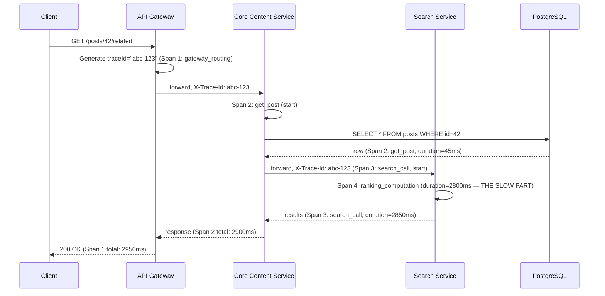
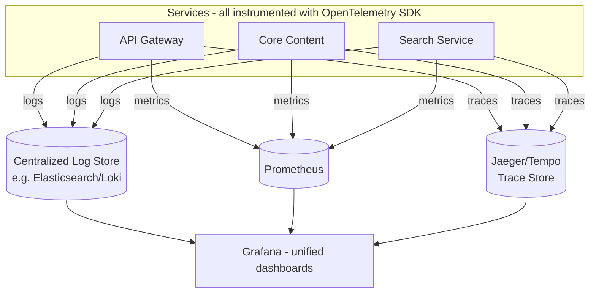
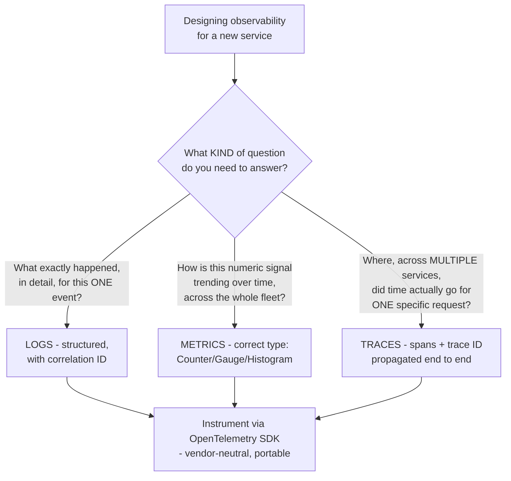
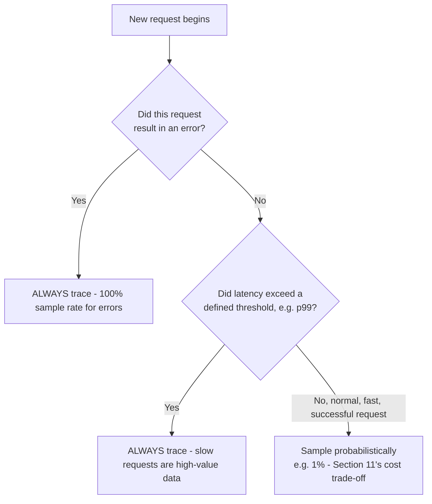
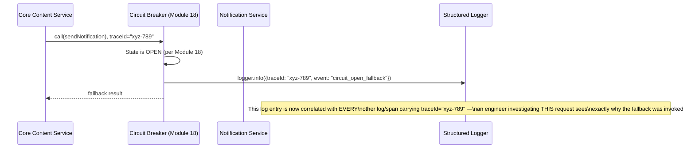
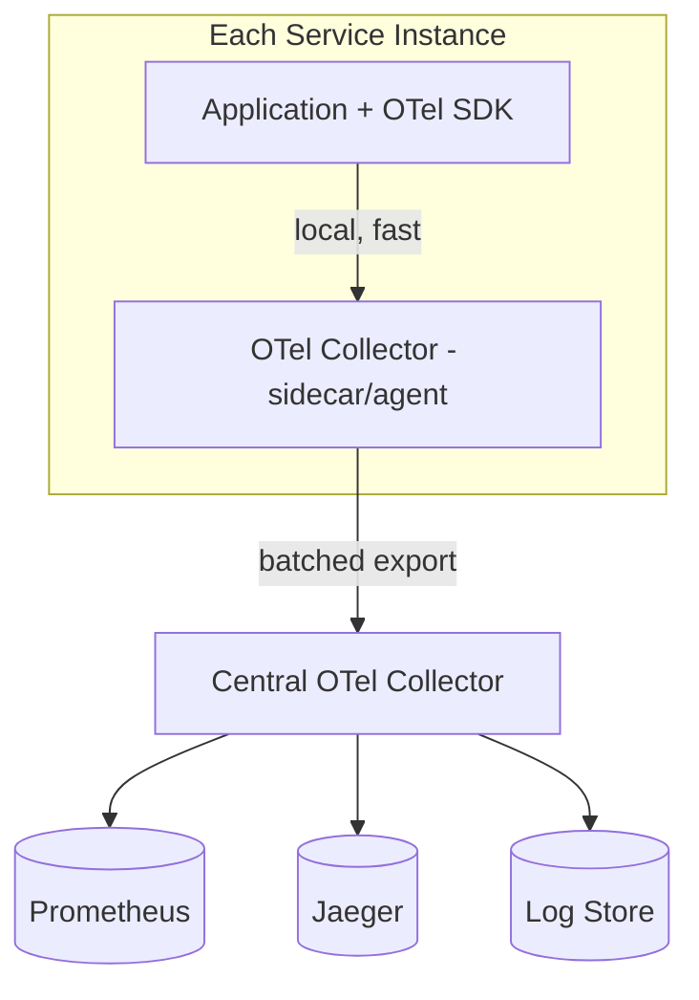

# Module 19 — Observability

> **Masterclass:** System Design Masterclass (30 Modules)
> **Level:** Advanced
> **Audience:** Node.js backend developers, SDE‑2 / Senior Backend interview candidates, engineers transitioning into architecture roles
> **Prerequisite:** Modules 1–18 (System Design Intro through Reliability & Fault Tolerance)

---

## 1. Introduction

Module 18 built a fully resilient Notification Service client — timeouts, retries, circuit breakers, bulkheads, fallbacks — and then repeatedly said "monitor this" without ever formalizing *how*. Module 16's distributed tracing was named but deferred. Every module since Module 8 has referenced "logs," "metrics," and "dashboards" as if their design were self-evident. This module finally makes it explicit: **observability** is not "having logs" — it's the deliberate engineering discipline of being able to answer *any* question about your system's internal state from its external outputs, without having to ship new code to add the ability to ask that question.

This distinction — between *monitoring* (watching for problems you anticipated) and *observability* (being able to investigate problems you didn't anticipate) — is the conceptual center of this module, and it's what separates a system with "some logging" from one you can actually debug at 3 AM during an unprecedented incident.

---

## 2. Learning Objectives

By the end of this module, you will be able to:

1. Distinguish **monitoring** from **observability** precisely, and explain why the latter is a strictly harder, more valuable property.
2. Explain the **three pillars of observability** — Logs, Metrics, and Traces — and what distinct question each is best suited to answer.
3. Design **structured logging** that is queryable and correlatable, not just human-readable text.
4. Explain **distributed tracing** mechanically — spans, trace IDs, context propagation — completing Module 16's deferred requirement.
5. Design **metrics** using the correct aggregation type (counter, gauge, histogram) for a given signal.
6. Explain **OpenTelemetry** as the vendor-neutral standard unifying all three pillars, and why standardization matters.
7. Design **Prometheus and Grafana**-based monitoring for a real service, connecting metrics collection to visualization and alerting.

---

## 3. Why This Concept Exists

Every module from 8 onward has produced a system that *can* fail in specific, named ways — a zombie server (Module 8), a cascading circuit-breaker failure (Module 9), a growing message queue backlog (Module 11), a lagging read replica (Module 14), a hot shard (Module 15), a flapping circuit breaker (Module 18). In each case, the module's "Monitoring & Observability" section named a specific metric to watch. But a system built entirely from a checklist of "metrics to watch for problems we already anticipated" will always be blind to the failure mode nobody wrote a section about — and production systems reliably, repeatedly fail in ways their designers didn't anticipate.

Observability exists to solve this asymmetry. Instead of asking "what metrics do I need to detect the failures I expect," observability asks "what data do I need to emit so that, when something unexpected happens, I can *ask new questions* of already-collected data and get answers" — without needing to redeploy new logging statements *after* the incident has already started, which is usually too late to catch the actual root cause.

---

## 4. Problem Statement

> Our blog platform, across Modules 1–18, has scattered `console.log` statements, a few Module 8-style health checks, and Module 18's circuit breaker state logging. During a recent incident, users reported slow page loads, but the on-call engineer couldn't determine *why* — was it the database (Module 5), the cache (Module 7), the load balancer (Module 8), the API Gateway (Module 9), or one of the three downstream microservices (Module 16) a single request now passes through? Each service's logs were separate, unindexed text files with no way to correlate "this specific slow request" across all the systems it touched. Design the observability architecture that would let the next incident be diagnosed in minutes, not hours.

---

## 5. Real-World Analogy

**Monitoring is a car's dashboard with pre-installed warning lights: "check engine," "low oil," "low fuel."** These lights answer the *specific* questions the manufacturer anticipated you'd need answered. This is valuable — but if your car starts making a strange noise the dashboard has no light for, the dashboard is completely silent, even though something is clearly wrong.

**Observability is having a skilled mechanic's diagnostic toolkit and the actual data trail needed to use it** — sensor logs, a complete history of recent events, the ability to ask "what was the engine RPM at exactly 3:42 PM when the noise started" and get a real, specific answer, even though nobody anticipated *that specific question* when the sensors were installed. The mechanic isn't limited to the manufacturer's pre-chosen warning lights; they can investigate a genuinely novel problem using the raw data trail the car happened to be recording all along.

**The three pillars map directly onto this: Logs are the detailed, timestamped mechanic's notes ("at 3:42:07, RPM spiked to 4500 for 200ms") — rich, specific, but expensive to sift through in bulk. Metrics are the dashboard's numeric gauges (current RPM, current temperature) — cheap to store and graph over time, but lacking the specific narrative detail of what exactly happened. Traces are the full route the car took on this specific trip, moment by moment** — exactly which roads (services) a single journey (request) passed through, and how long it spent on each one, which is precisely what Section 4's engineer was missing: the ability to see *one specific slow request's* complete journey across every system it touched.

---

## 6. Technical Definition

**Monitoring:** The practice of collecting and displaying predefined metrics and alerts for known, anticipated failure conditions.

**Observability:** The property of a system that allows an operator to understand its internal state and diagnose novel, previously-unanticipated problems, purely from its external outputs (logs, metrics, traces), without needing to modify or redeploy the system to gather new information.

**Structured Logging:** Emitting log entries as machine-parseable, queryable data (typically JSON) with consistent fields, rather than unstructured free-text strings.

**Distributed Trace:** A record of a single request's complete journey across multiple services, composed of a **Trace ID** (identifying the overall request) and multiple **Spans** (each representing one unit of work within one service, with parent-child relationships reconstructing the full call graph).

**OpenTelemetry:** A vendor-neutral, open-source standard and set of APIs/SDKs for generating, collecting, and exporting logs, metrics, and traces in a consistent format, regardless of which backend (Prometheus, Jaeger, a commercial APM tool) ultimately stores and visualizes them.

---

## 7. Core Terminology

| Term | Precise Definition | One-line Intuition |
|---|---|---|
| **Span** | A single unit of work within a distributed trace, with a start time, duration, and metadata | "One leg of the journey" |
| **Trace ID** | A unique identifier shared by every span belonging to the same end-to-end request | "The trip's itinerary number, stamped on every leg" |
| **Correlation ID** | A general term for an identifier propagated across logs/services to link related events (often the same as, or derived from, a Trace ID) | "The shared reference number tying scattered records together" |
| **Counter (metric type)** | A cumulative metric that only ever increases (e.g., total requests served) | "An odometer — only goes up" |
| **Gauge (metric type)** | A metric representing a current, point-in-time value that can go up or down (e.g., current memory usage) | "A speedometer — reflects right now" |
| **Histogram (metric type)** | A metric recording the distribution of values (e.g., request latencies), enabling percentile calculations (p50, p99) | "A bucketed tally of how many requests fell into each speed range" |
| **Cardinality** | The number of unique label/tag combinations a metric can have | "How many distinct dashboard gauges this one metric definition could explode into" |

---

## 8. Internal Working

### Why unstructured logs fail Section 4's exact scenario, and how structured logging fixes it

A traditional log line like:
```
[2026-07-04 14:32:07] Request to /posts/42 took 3200ms
```
is readable by a human scanning one file, but **cannot be reliably queried** across potentially dozens of service instances and multiple different services' log files — "show me every log line related to this specific slow request, across every service it touched" requires either manual, painstaking cross-referencing by timestamp (unreliable, per Module 12's clock-drift lesson) or, in practice, is simply never done, which is exactly Section 4's reported failure.

**Structured logging fixes this by making every log entry a machine-parseable object with a consistent, shared correlation field:**

```javascript
logger.info({
  traceId: 'abc-123-def',       // shared across EVERY service this request touches
  service: 'core-content-api',
  event: 'request_completed',
  path: '/posts/42',
  durationMs: 3200,
  timestamp: Date.now(),
});
```

Once every service emits logs in this shape, with the **same `traceId`** propagated through every hop (Section 9 shows exactly how), an engineer can query a centralized log aggregator with `traceId = "abc-123-def"` and instantly retrieve **every log line, from every service, related to that one specific request** — precisely, completely resolving Section 4's diagnostic gap, and turning an hours-long manual cross-referencing exercise into a single, few-second query.

### Why choosing the correct metric type matters, precisely

Consider Module 8's per-server request count. If implemented as a **Gauge** (a snapshot value), querying it only tells you the count *at the moment you happened to check* — you'd need to poll constantly to reconstruct a rate. If implemented as a **Counter** (cumulative, ever-increasing), your monitoring system (Prometheus, Section 30) can calculate the **rate of increase over any time window you choose** *after the fact* — "requests per second over the last 5 minutes" becomes a query against already-collected data, not something you needed to have specifically anticipated and pre-calculated. This is a direct, concrete instance of observability's core promise: **collect the right raw data once, and ask many different questions of it later**, rather than pre-computing only the specific answers you anticipated needing.

**Histograms solve a different, specific problem** — Module 1's distinction between average and percentile latency. Averaging request latencies hides the fact that, e.g., 95% of requests are fast but 5% are catastrophically slow (exactly the kind of tail behavior Module 18's timeout tuning depends on knowing precisely) — a Histogram metric records values into buckets, letting you calculate p50, p95, p99 accurately after the fact, rather than only ever having a potentially misleading average.

### How distributed tracing actually propagates a Trace ID across service boundaries

```javascript
// At the API Gateway (Module 9) — the entry point, where a trace begins
app.use((req, res, next) => {
  req.traceId = req.headers['x-trace-id'] || crypto.randomUUID(); // reuse if already present, else generate
  res.set('x-trace-id', req.traceId);
  next();
});

// When calling a downstream service (Module 4's HTTP client, Module 18's ResilientClient)
async function callSearchService(query, traceId) {
  return axios.get('http://search-service.internal/search', {
    params: { q: query },
    headers: { 'x-trace-id': traceId }, // PROPAGATE the same trace ID onward
  });
}
```

**This simple mechanism — reading an incoming trace ID, or generating one if absent, and forwarding it on every outbound call — is the entire, complete answer to "how does distributed tracing work" at a mechanical level.** Every service, upon receiving a request, checks for this header; if present, it's part of an existing trace (append a new span); if absent, it's the start of a new trace. Module 16's every service-to-service call, Module 9's gateway routing, and Module 11's message queue publishing (the trace ID travels *inside* the message payload, not just HTTP headers) all need this same propagation discipline applied consistently, or the trace breaks at exactly that hop — precisely why Section 4's engineer had no way to reconstruct the full journey: no such propagation existed anywhere in the system.

---

## 9. Request Lifecycle

### Mermaid Sequence Diagram — A Fully Traced Request, Directly Resolving Section 4



**Step-by-step explanation, precisely resolving Section 4:** with this trace collected, an engineer querying `traceId = "abc-123"` immediately sees **exactly** where the 2950ms went — not in the Gateway, not in the database query (45ms), not in the network hop to Search, but specifically in Search's `ranking_computation` span (2800ms). This is the complete, precise, few-seconds diagnosis Section 4's original incident lacked entirely — the difference between "something is slow, somewhere, across several systems" and "the ranking computation in the Search Service is the bottleneck."

---

## 10. Architecture Overview



**HLD-level insight, resolving Section 4's architecture requirement completely:** notice all three pillars flow through a **single instrumentation layer** (the OpenTelemetry SDK, Section 6) embedded in every service, but are exported to **different, purpose-built backends** — logs to a search-optimized store, metrics to a time-series-optimized store (Prometheus), and traces to a trace-optimized store (Jaeger) — each pillar's storage matched to its own access pattern, directly echoing Module 5's "match the tool to the access pattern" principle, now applied to observability data itself.

---

## 11. Capacity Estimation

**Scenario:** Estimating the log and trace data volume our fully-instrumented platform would generate, given established traffic figures.

**Given:** 5,000 req/s peak (Module 7), and assume each request generates an average of 5 log lines (across all services it touches) and 1 trace with an average of 8 spans.

**Step 1 — Log volume:**
```
5,000 req/s × 5 log lines × ~300 bytes/line (structured JSON) ≈ 7.5 MB/sec
≈ 648 GB/day (before any sampling or retention policy)
```

**Step 2 — Trace volume:**
```
5,000 req/s × 8 spans × ~500 bytes/span ≈ 20 MB/sec ≈ 1.7 TB/day (before sampling)
```

**Conclusion, directly motivating a real, necessary practice this module must name — sampling:** these numbers are substantial, and at genuine production scale, **collecting and storing 100% of traces is often prohibitively expensive and unnecessary** — this is precisely why production tracing systems implement **sampling** (e.g., trace only 1% of normal requests, but 100% of requests that resulted in an error or exceeded a latency threshold) — a deliberate, quantified trade-off between complete data (ideal for observability) and manageable cost (a real operational constraint), directly continuing this course's discipline of every architectural decision being a stated, justified trade-off rather than a default.

---

## 12. High-Level Design (HLD)



**HLD-level insight, directly answering Section 2's learning objective:** this decision flow is the precise, reusable answer to "what distinct question does each pillar answer" — logs answer **what happened**, metrics answer **how is it trending**, and traces answer **where did time go across services** — and a mature observability strategy deliberately uses all three together, because they answer genuinely different questions, not because "more monitoring is always better" as a vague instinct.

---

## 13. Low-Level Design (LLD)

### A complete, structured logger with automatic trace-ID correlation (Node.js)

```javascript
const { AsyncLocalStorage } = require('async_hooks');
const traceContext = new AsyncLocalStorage();

function withTraceId(traceId, fn) {
  return traceContext.run({ traceId }, fn); // makes traceId available to ALL nested async code
}

const logger = {
  info(fields) {
    const context = traceContext.getStore();
    console.log(JSON.stringify({
      level: 'info',
      traceId: context?.traceId ?? 'no-trace',
      timestamp: new Date().toISOString(),
      ...fields,
    }));
  },
};

// Usage — Express middleware establishing the trace context for the whole request lifecycle
app.use((req, res, next) => {
  const traceId = req.headers['x-trace-id'] || crypto.randomUUID();
  res.set('x-trace-id', traceId);
  withTraceId(traceId, () => next()); // EVERY subsequent logger.info() call in this request automatically includes traceId
});

app.get('/posts/:id', async (req, res) => {
  logger.info({ event: 'request_started', path: req.path }); // traceId automatically included
  const post = await postRepository.findById(req.params.id);
  logger.info({ event: 'db_query_completed', postId: req.params.id });
  res.json(post);
});
```

**LLD-level design note:** using Node.js's `AsyncLocalStorage` means **every** `logger.info()` call anywhere in the request's async call chain — including deep inside a repository or a third-party library call — automatically includes the correct `traceId`, **without needing to manually thread it through every single function's parameters.** This directly solves a real, practical Node.js-specific implementation challenge: correlation IDs are easy to lose across `async`/`await` boundaries if not deliberately preserved this way.

---

## 14. ASCII Diagrams

```
THE THREE PILLARS — DIFFERENT QUESTIONS, DIFFERENT SHAPES

  LOGS                    METRICS                   TRACES
  ┌──────────────┐        ┌──────────────┐          ┌──────────────┐
  │ {             │        │ req_total{    │          │ Span: gateway │
  │  traceId:...  │        │  service=api  │          │  ├─Span: core │
  │  event:...    │        │ } = 48291     │          │  │ ├─Span: db │
  │  ...          │        │               │          │  └─Span:search│
  │ }             │        │ (a NUMBER,    │          │   └─Span:rank │
  │ (rich detail, │        │  cheap, but   │          │ (the SHAPE of │
  │  expensive    │        │  no per-event │          │  one request's│
  │  to store all)│        │  detail)      │          │  full journey)│
  └──────────────┘        └──────────────┘          └──────────────┘
```

```
METRIC TYPES — CHOOSE CORRECTLY

  COUNTER (only up)         GAUGE (current value)      HISTOGRAM (distribution)
    │      ╱                    ╲    ╱                    ▓▓
    │    ╱                       ╲  ╱                    ▓▓▓▓
    │  ╱                          ╲╱                    ▓▓▓▓▓▓
    │╱                                                  ▓▓▓▓▓▓▓▓
  ──┴────────▶ time              current only          [buckets: latency ranges]
  total requests served       current memory usage    request latency distribution
```

---

## 15. Mermaid Flowcharts

*(Section 12 covers the canonical "which pillar answers which question" decision flow.)*

### Decision Flow: Should This Trace Be Sampled?



**Why this sampling policy, precisely:** it directly implements Section 11's cost-quantified conclusion — normal, healthy requests are sampled sparingly (they're the least interesting data, statistically redundant with millions of similar requests), while **every** error and **every** unusually slow request is captured completely, because these are exactly the events an engineer will actually need to investigate, and they're comparatively rare, so capturing 100% of them remains affordable even under Section 11's volume constraints.

---

## 16. Mermaid Sequence Diagrams

*(Section 9 covers the canonical fully-traced request sequence diagram. Additional diagram below.)*

### Correlating a Circuit Breaker Event (Module 18) With a Trace



**Why this directly unifies Module 18 with this module:** Module 18 established *what* to log (circuit breaker state transitions, fallback invocations) but this module supplies the missing mechanism — *how* that log entry becomes findable and correlatable with the specific request that triggered it, completing the observability loop Module 18's "Monitoring & Observability" sections all implicitly assumed existed.

---

## 17. Component Diagrams

```mermaid
flowchart LR
    subgraph Application Code
        BusinessLogic[Business Logic]
    end
    subgraph OpenTelemetry SDK - vendor neutral
        LogAPI[Logging API]
        MetricsAPI[Metrics API]
        TracingAPI[Tracing API]
    end
    subgraph Exporters - pluggable, swappable
        LogExporter[Log Exporter]
        MetricsExporter[Metrics Exporter]
        TraceExporter[Trace Exporter]
    end
    BusinessLogic --> LogAPI & MetricsAPI & TracingAPI
    LogAPI --> LogExporter --> AnyLogBackend[(Any backend:\nELK, Loki, Datadog...)]
    MetricsAPI --> MetricsExporter --> AnyMetricsBackend[(Prometheus, CloudWatch...)]
    TracingAPI --> TraceExporter --> AnyTraceBackend[(Jaeger, Tempo, X-Ray...)]
```

**Why vendor-neutral instrumentation (OpenTelemetry, Section 6) matters, structurally:** `BusinessLogic` calls a **standard**, vendor-neutral API — if the company later switches from a self-hosted Jaeger deployment to a commercial APM tool, **only the exporter configuration changes**, not a single line of instrumented application code — directly mirroring this course's repeated Repository-pattern principle (Modules 1, 5, 7, 9, 11, 15, 16), now applied to observability tooling itself: isolate what changes (the backend vendor) from what stays stable (the instrumentation calls in your business logic).

---

## 18. Deployment Diagrams



**Deployment-level note:** using a local **OTel Collector** as a sidecar/agent on each instance, rather than having application code export directly to remote backends, means the application's own request-handling latency is never blocked by observability-backend network calls (Module 18's own timeout/bulkhead principles, self-applied to observability infrastructure) — the local collector buffers and batches data, exporting asynchronously, so a slow or briefly-unavailable central collector never becomes a new reliability hazard for the actual business logic it's meant to be observing.

---

## 19. Network Diagrams

Observability infrastructure follows Module 3's standard network isolation principles, with one specific addition worth naming: **the observability pipeline itself must never become a single point of failure for the business logic it observes** (directly echoing Section 18's collector-buffering design):

```
  App Instance ──▶ Local OTel Collector (in-process buffer,
                     survives brief network hiccups to the
                     central collector without blocking the app)
                          │
                          ▼ (async, batched, retries with backoff — Module 18's own patterns!)
                   Central Collector (private subnet)
                          │
                          ▼
                   Observability Backends (Prometheus/Jaeger/Log Store)
```

**Why this diagram is a nice, self-referential capstone:** the observability pipeline's own reliability is protected using **this course's own Module 18 patterns** (buffering, async export, backoff) — a genuinely elegant illustration that the principles taught throughout this masterclass apply recursively, even to the tooling used to observe the rest of the system.

---

## 20. Database Design

Log and trace storage have specific schema/indexing considerations distinct from Module 5's transactional data modeling: **observability data is overwhelmingly write-heavy, append-only, and queried primarily by time range and correlation ID** — a workload profile that maps directly back to Module 5's polyglot persistence lesson.

```
-- Time-series/log stores (Elasticsearch, Loki, Prometheus) are purpose-built
-- for exactly this access pattern, and are NOT a good fit as a substitute
-- for your primary transactional database (Module 5), or vice versa —
-- observability data has its OWN, distinct access pattern, per Module 5's
-- core "match the tool to the access pattern" principle.
```

**Why this brief callback matters:** it's tempting, especially early on, to "just log to the same PostgreSQL database" — but Module 5's entire lesson applies directly here: logs and traces have a fundamentally different access pattern (write-heavy, time-range queries, high cardinality) than transactional business data, and deserve their own purpose-built storage, exactly as Module 6 argued for large binary blobs.

---

## 21. API Design

A well-designed API should **echo the trace ID back to the client** (Section 9's Gateway example), enabling a genuinely powerful support/debugging workflow: a user or client-side error report can include the trace ID, letting an engineer jump *directly* to that specific request's complete cross-service trace, rather than needing to search logs by approximate timestamp:

```
Response headers:
  X-Trace-Id: abc-123-def

Client-side error reporting:
  "Something went wrong. Please include this reference: abc-123-def"
```

**Why this small detail has outsized diagnostic value:** it converts "a user vaguely reported something was slow around 2:30 PM" (Section 4's exact original problem) into "here is the *exact* trace ID for the *exact* request that failed" — the difference between an educated guess and a precise, immediate lookup.

---

## 22. Scalability Considerations

| Consideration | Impact |
|---|---|
| Log/trace volume at scale | Grows linearly with traffic (Section 11) — sampling (Section 15) and retention policies become necessary, not optional, cost controls |
| Cardinality explosion | A metric labeled with unbounded values (e.g., `userId` as a label) can create millions of unique time series, overwhelming a metrics backend — labels must be chosen deliberately, with bounded cardinality |
| Centralized collector scaling | The central OTel Collector (Section 18) must itself scale with fleet size — becoming a bottleneck here undermines the entire pipeline's reliability |
| Query performance on large trace/log volumes | Requires purpose-built backends (Section 20) with appropriate indexing — a naive, unindexed store degrades badly at real production log volumes |

---

## 23. Reliability & Fault Tolerance

- **The observability pipeline itself must apply Module 18's own resilience patterns** (Section 18/19's buffering, async export, backoff) — an observability system that can itself cause application-level failures (e.g., blocking on a slow trace export) has inverted its own purpose.
- **Sampling decisions (Section 15) must never accidentally drop the data you'd need during an actual incident** — the "always trace errors and slow requests" rule exists precisely to guarantee the highest-value data is never sacrificed to a cost-driven sampling policy, even while less valuable, routine data is aggressively sampled down.
- **Observability data should itself be treated as having a reliability requirement** — losing your trace/log data *during* an incident (the exact moment you need it most) due to an unrelated observability-pipeline failure is a particularly painful, avoidable compounding failure.

---

## 24. Security Considerations

- **Structured logs must never include sensitive data in plaintext** (passwords, full payment card numbers, personal data subject to compliance requirements) — a genuinely common, real-world security incident source, since logs are often replicated, retained long-term, and accessed by a broader set of engineers than the primary database.
- **Trace and log data access should be governed by least-privilege principles**, same as any other sensitive system (Module 20 preview) — a trace can reveal significant internal architecture and business logic detail, valuable to an attacker performing reconnaissance.
- **Correlation IDs themselves are generally safe to expose to clients** (Section 21) since they're opaque, random identifiers carrying no sensitive information on their own — but the *data they correlate to*, once looked up internally, must remain properly access-controlled.

---

## 25. Performance Optimization

- **Use asynchronous, batched export** for all three pillars (Section 18) — synchronous, per-event network calls to an observability backend would add unacceptable per-request latency overhead, directly undermining the very performance the system is trying to observe.
- **Sample deliberately** (Section 15) rather than capturing 100% of everything — full-fidelity data is valuable, but its marginal value drops sharply for routine, successful, fast requests once you already have millions of similar examples.
- **Choose bounded-cardinality labels for metrics** (Section 22) — a metric that's technically correct but explodes into millions of unique series can itself degrade the metrics backend's performance, a genuine, common operational pitfall.

---

## 26. Monitoring & Observability

*(This module's entire content is the formal treatment of this section's topic for every prior module — the meta-lesson here is what to monitor about your observability pipeline itself.)*

- **Observability pipeline health**: export success/failure rate, collector queue depth, and backend ingestion latency — monitoring the monitoring system, a legitimate and necessary practice.
- **Sampling rate and its actual effect on data completeness** — periodically verify that your "always trace errors" rule is actually functioning as intended, not silently degraded by a misconfiguration.
- **Log/metric/trace volume trends over time**, directly validating Section 11's capacity estimates against real, evolving production data.

---

## 27. Common Bottlenecks

| Bottleneck | Symptom | Root Cause |
|---|---|---|
| Broken trace continuity | Traces show gaps, or separate, disconnected traces for what should be one request | Trace ID not correctly propagated across a specific service boundary or message queue hop (Section 8) |
| Cardinality explosion | Metrics backend degraded or refusing new data | Unbounded label values (e.g., raw user IDs) used in metric labels (Section 22) |
| Missing correlation in logs | Unable to reconstruct a specific request's full story across services | Structured logging without a shared, propagated correlation ID (Section 8's exact original problem) |
| Observability pipeline blocking application logic | Added, unexpected latency correlated with logging/tracing calls | Synchronous, unbuffered export instead of async, batched local buffering (Section 18/25) |
| Excessive storage cost | Rapidly growing observability infrastructure bill | No sampling policy, retaining 100% of all three pillars indefinitely (Section 11) |

---

## 28. Trade-off Analysis

> "I chose to **instrument every service with OpenTelemetry and propagate a trace ID across every service and message-queue boundary**, optimizing for **the ability to diagnose exactly Section 4's original incident in minutes rather than hours**, at the cost of **instrumentation overhead in every codebase and a new, need-to-maintain observability pipeline**, which is acceptable because the diagnostic capability directly, measurably reduces incident resolution time — a cost with a clear, demonstrable return."

> "I chose a **sampling policy of 100% for errors and slow requests, 1% for normal successful requests**, optimizing for **keeping the highest-value diagnostic data complete while controlling overall storage cost (Section 11)**, at the cost of **not having complete, full-fidelity data for the 99% of routine, successful requests**, which is acceptable because routine, successful requests rarely need individual-level post-hoc investigation, while errors and slow requests almost always do."

---

## 29. Anti-patterns & Common Mistakes

1. **Confusing "we have logs" with "we have observability"** — Section 4's original scattered, uncorrelated logs are a real, common example of the former without the latter.
2. **Unstructured, free-text logging**, making programmatic querying and correlation across services effectively impossible (Section 8).
3. **No correlation/trace ID propagation across service or message-queue boundaries**, silently breaking a trace exactly at that hop, often invisibly, until someone needs the missing data during an actual incident.
4. **Choosing the wrong metric type** — using a Gauge where a Counter (for rate calculation) or Histogram (for percentile calculation) is actually needed (Section 8's precise distinction).
5. **Unbounded-cardinality metric labels**, risking backend overload or refusal (Section 22/27).
6. **Logging sensitive data in plaintext** (Section 24) — a genuinely common, damaging real-world security mistake.
7. **No sampling policy at real production scale**, leading to unmanageable storage costs, or — the opposite failure — an overly aggressive sampling policy that accidentally drops error/slow-request data too.

---

## 30. Production Best Practices

- **Adopt OpenTelemetry from the start** — vendor-neutral instrumentation avoids costly, painful re-instrumentation if you switch observability backends later.
- **Propagate a trace/correlation ID across every service boundary and message queue hop**, with zero exceptions — a single missed propagation point breaks the trace exactly there.
- **Use structured (JSON) logging exclusively**, with consistent, well-defined fields across all services.
- **Choose metric types deliberately** — Counter for cumulative totals, Gauge for point-in-time values, Histogram for distributions needing percentile analysis.
- **Sample intelligently**: always capture errors and slow requests in full; sample routine traffic to control cost.
- **Never log sensitive data in plaintext**; treat log/trace access with the same least-privilege discipline as your primary database.
- **Apply your own reliability patterns (Module 18) to your observability pipeline itself** — buffered, async, backoff-protected export, never blocking application logic.

---

## 31. Real-World Examples

- **Google's Dapper paper** (the foundational, widely-cited research publication describing Google's internal distributed tracing system) directly established much of the vocabulary and mechanics — spans, trace IDs, sampling — that this module and the entire industry's tracing tools (Jaeger, Zipkin, OpenTelemetry) build directly upon.
- **The Cloud Native Computing Foundation's adoption of OpenTelemetry** as its recommended standard (merging two earlier, competing standards, OpenTracing and OpenCensus) is a well-documented, real-world validation of Section 17's vendor-neutrality argument — the industry converged specifically because avoiding vendor lock-in for instrumentation was recognized as a widespread, genuine need.
- **Honeycomb.io's engineering blog and public talks** (by observability pioneers including Charity Majors) are widely-cited, foundational sources for precisely this module's Section 3 "monitoring vs. observability" distinction — a legitimate, citable articulation of the difference this module opens with, useful to reference if pushed for depth in a rigorous interview setting.

---

## 32. Node.js Implementation Examples

### A minimal Prometheus-style metrics implementation illustrating all three metric types

```javascript
const client = require('prom-client');

// Counter — cumulative, only increases (Section 8's rate-calculation benefit)
const requestCounter = new client.Counter({
  name: 'http_requests_total',
  help: 'Total HTTP requests served',
  labelNames: ['service', 'status_code'], // BOUNDED cardinality — Section 22's lesson
});

// Gauge — current value, can rise or fall
const activeConnectionsGauge = new client.Gauge({
  name: 'active_connections',
  help: 'Current number of active connections',
});

// Histogram — distribution, enables percentile calculation (Module 1's p99 lesson)
const requestDurationHistogram = new client.Histogram({
  name: 'http_request_duration_seconds',
  help: 'Request duration in seconds',
  buckets: [0.01, 0.05, 0.1, 0.5, 1, 3, 5], // tuned to expected latency range
});

app.use((req, res, next) => {
  const start = Date.now();
  activeConnectionsGauge.inc();
  res.on('finish', () => {
    requestCounter.inc({ service: 'core-content', status_code: res.statusCode });
    requestDurationHistogram.observe((Date.now() - start) / 1000);
    activeConnectionsGauge.dec();
  });
  next();
});

app.get('/metrics', async (req, res) => {
  res.set('Content-Type', client.register.contentType);
  res.end(await client.register.metrics()); // Prometheus scrapes this endpoint
});
```

**Why `labelNames: ['service', 'status_code']` and not `labelNames: ['userId']`, precisely:** `status_code` has a small, bounded set of possible values (200, 404, 500, etc.); `userId` could have millions of unique values, and using it as a label would directly cause Section 22's cardinality explosion — this single code-level choice is the concrete, practical application of that entire scalability lesson.

---

## 33. Interview Questions

### Easy
1. What is the difference between monitoring and observability?
2. Name the three pillars of observability and the distinct question each answers.
3. What is a structured log, and why is it more useful than free-text logging for debugging distributed systems?
4. What is a trace ID, and what problem does it solve?
5. Explain the difference between a Counter, a Gauge, and a Histogram metric.
6. What is OpenTelemetry, and why does vendor-neutral instrumentation matter?

### Medium
7. Design a trace-ID propagation strategy for a request that flows through an API Gateway, two microservices, and a message queue.
8. Explain why using a raw user ID as a metric label is a common, damaging mistake.
9. A team has extensive logging but still can't diagnose cross-service incidents quickly. Diagnose the likely gap using this module's concepts.
10. Design a sampling policy for a high-traffic service that balances data completeness against storage cost.
11. Why must an observability pipeline's own export mechanism be asynchronous and buffered, rather than synchronous and blocking?
12. Explain why average latency can be a misleading metric, and how a histogram-based percentile calculation addresses this.

### Hard
13. Design a complete observability architecture for a 5-service microservices platform, addressing structured logging, metric types and cardinality management, distributed tracing propagation (including through a message queue), and sampling policy.
14. Explain, precisely, how Node.js's `AsyncLocalStorage` solves the correlation-ID-threading problem across asynchronous call chains, and what would go wrong without it.
15. A production incident requires investigating why a specific user's specific request failed 3 days ago, but your sampling policy only captures 1% of traffic and this request wasn't sampled. Discuss the trade-off this reveals and how you'd address it going forward.
16. Design a cardinality-safe metrics strategy for tracking per-endpoint latency across a service with hundreds of dynamic URL paths (e.g., `/posts/:id`).
17. Discuss why "monitoring vs. observability" is a meaningful, non-pedantic distinction in a system design interview, using a concrete example of a failure mode monitoring alone would miss.

---

## 34. Scenario-Based Design Questions

1. **Scenario:** Reproduce and resolve Module 19's exact Section 4 incident: a slow page load spanning multiple services with no way to correlate logs. Design the specific instrumentation changes needed, and demonstrate how the redesigned system would diagnose the same incident in minutes.
2. **Scenario:** Your metrics backend has become slow and is refusing new data. Investigation reveals a metric labeled with raw session IDs. Diagnose and propose the fix.
3. **Scenario:** A user reports an error and provides a trace ID from their error message. Walk through exactly how an on-call engineer would use this to investigate, step by step.
4. **Scenario:** Your team's tracing system only samples 1% of requests, and a critical, rare bug affecting 0.1% of requests is never captured. Propose a sampling policy adjustment that would catch this without dramatically increasing cost.
5. **Scenario:** Your observability pipeline's central collector goes down for 10 minutes. Using this module's design principles, explain what should and shouldn't happen to your application services during this window.
6. **Scenario:** Two engineers are debating whether a "current queue depth" signal (Module 11) should be a Counter or a Gauge. Resolve the debate with justification.
7. **Scenario:** A trace shows a request passing cleanly through the Gateway and Core Content Service, but then simply disappears — no further spans exist, even though the user confirms the request eventually succeeded via an asynchronous email notification. Diagnose the likely propagation gap.
8. **Scenario:** Your company is deciding between a commercial APM tool and a self-hosted OpenTelemetry-based stack. Discuss the trade-offs, referencing this module's vendor-neutrality argument.
9. **Scenario:** A security review flags that your structured logs include full user email addresses and, in one service, a partially-unmasked payment token. Propose the remediation and a policy to prevent recurrence.
10. **Scenario:** An interviewer asks you to design observability for a system you've never seen before, with only 10 minutes. Walk through your prioritized approach, using this module's three-pillar framework to organize your answer.

---

## 35. Hands-on Exercises

1. Implement the structured logger with `AsyncLocalStorage`-based trace-ID correlation (Section 13), and verify that log calls from within a nested, awaited async function still correctly include the trace ID established at the top of the request.
2. Implement the three Prometheus metric types (Section 32) for a simple Express app, run a short load test, and query the resulting `/metrics` endpoint to confirm all three are populating correctly.
3. Implement basic trace-ID propagation (Section 8) across two locally-running Node.js services making a call to each other, and verify via logs that both services' log entries share the same trace ID for a single, traced request.
4. Deliberately introduce a cardinality explosion (label a metric with a randomly-generated UUID per request) and observe the resulting metrics backend behavior/size growth, then fix it by removing the high-cardinality label.
5. Design (in Mermaid) the full observability architecture — logs, metrics, traces, and their respective backends — for a hypothetical 4-service system, labeling exactly which pillar you'd use to answer three specific example diagnostic questions you define yourself.

---

## 36. Mini Project

**Build:** A fully-instrumented, correlatable observability layer for the blog platform's Core Content and Search Service (from Module 16), directly resolving Module 19's Section 4 incident.

**Requirements:**
- Implement structured, JSON-based logging with automatic trace-ID correlation (Section 13) in both services.
- Implement trace-ID propagation across the HTTP call from Core Content to Search Service.
- Implement all three Prometheus metric types (Section 32) for at least one endpoint in each service: a request counter, an active-connections gauge, and a latency histogram.
- Simulate a slow request (artificially delay the Search Service's response) and demonstrate, via your logs filtered by trace ID, that you can pinpoint exactly which service and which operation caused the slowness.

**Success criteria:** Given only a trace ID from a simulated slow request, you can query your logs and reconstruct the complete cross-service timeline, correctly identifying the specific bottleneck — a direct, empirical resolution of the module's opening incident.

---

## 37. Advanced Project

**Build:** Extend the Mini Project with real distributed tracing visualization, sampling, and an end-to-end incident simulation.

1. Integrate a real, free/open-source tracing backend (e.g., Jaeger, run locally via Docker) using the OpenTelemetry SDK, and verify a traced request from Core Content through Search Service renders correctly as a visual, hierarchical trace with accurate span durations.
2. Implement the sampling policy from Section 15 (always trace errors and slow requests; sample 1% of normal traffic), and write a test verifying an artificially-triggered error is always captured regardless of the sampling rate, while routine successful requests are only sometimes captured.
3. Extend your metrics setup with a bounded-cardinality, per-endpoint latency histogram (Section 22's cardinality-safe design, using route *patterns* like `/posts/:id`, not raw, unbounded URLs), and visualize p50/p95/p99 latency in a simple Grafana dashboard (or equivalent).
4. Simulate Module 18's exact circuit-breaker-flapping incident from that module's Section 34, but this time with full observability in place, and write a short incident report demonstrating how much faster and more precisely the root cause is identified compared to Module 18's original, pre-observability diagnosis.

**Success criteria:** You have a working, visualized distributed trace spanning multiple services, a correctly-functioning sampling policy that never drops error/slow-request data, a cardinality-safe latency histogram with real p50/p95/p99 visualization, and a comparative incident report demonstrating this module's concrete diagnostic value — setting up Module 20 (Security in Distributed Systems), which addresses the authentication, authorization, and data-protection concerns this module's own Section 24 has flagged but deferred throughout every prior module's brief security mentions.

---

## 38. Summary

- **Observability is a strictly stronger property than monitoring** — it enables answering novel, unanticipated questions from already-collected data, rather than only detecting the specific failure conditions someone thought to watch for in advance.
- **The three pillars answer distinct questions**: Logs answer "what exactly happened" (rich detail, one event), Metrics answer "how is this trending" (cheap, aggregated, fleet-wide), and Traces answer "where did time go across services" (one request's complete cross-service journey).
- **Structured logging with propagated correlation/trace IDs** is what actually makes cross-service diagnosis possible — unstructured, uncorrelated logs (this module's opening incident) leave you unable to reconstruct a request's story even when every individual log line was captured correctly.
- **Choosing the correct metric type** (Counter, Gauge, Histogram) is not a cosmetic detail — it determines what questions can even be asked of that data later.
- **OpenTelemetry's vendor neutrality** protects against costly re-instrumentation if backend tooling changes, directly applying this course's repeated "isolate what changes from what stays stable" principle to observability tooling itself.
- **Sampling is a necessary, deliberate cost-control trade-off** at real production scale — but must never silently drop the highest-value data (errors, slow requests).

---

## 39. Revision Notes

- Monitoring = detects anticipated failures; Observability = answers unanticipated questions from already-collected data
- Logs = "what happened" (rich, one event) | Metrics = "how's it trending" (cheap, aggregate) | Traces = "where did time go across services" (one request's journey)
- Structured (JSON) logs + propagated trace ID = the mechanism that makes cross-service diagnosis actually possible
- Counter = cumulative, only up (rate calc); Gauge = current value; Histogram = distribution (percentile calc)
- OpenTelemetry = vendor-neutral instrumentation — swap backends without re-instrumenting application code
- Sampling: 100% for errors/slow requests, sample routine traffic — never silently drop high-value data
- Bounded-cardinality metric labels only — never raw user IDs or unbounded values as labels
- Observability pipeline must apply Module 18's own resilience patterns (async, buffered, backoff) — never block the app it observes

---

## 40. One-Page Cheat Sheet

```
SYSTEM DESIGN — MODULE 19 CHEAT SHEET
─────────────────────────────────────
MONITORING     → detects failures you ANTICIPATED
OBSERVABILITY  → answers questions you DIDN'T anticipate, from existing data

THREE PILLARS
  Logs     → "what exactly happened" (rich, per-event, structured JSON + trace ID)
  Metrics  → "how is it trending" (cheap, aggregated, correct TYPE matters)
  Traces   → "where did time go" across MULTIPLE services, for ONE request

METRIC TYPES
  Counter    → cumulative, only increases → enables RATE calculation
  Gauge      → current point-in-time value → up or down
  Histogram  → distribution of values → enables PERCENTILE calculation (p99!)

TRACE PROPAGATION
  Every service boundary + message queue hop MUST forward the trace ID
  ONE missed hop = broken trace at exactly that point

SAMPLING POLICY
  100% of ERRORS + SLOW requests — never sacrifice this to cost
  Sample routine, successful traffic (e.g., 1%) — cost control

GOLDEN RULES
  Structured (JSON) logs only — never free text
  Bounded-cardinality metric labels only — never raw user IDs
  Observability pipeline: async, buffered — NEVER blocks the app it observes
  Never log sensitive data in plaintext
```

---

## Key Takeaways

- Observability's real value is revealed precisely when something goes wrong that nobody anticipated — a system with only anticipated-failure monitoring will always have exactly the blind spot that matters most during a genuinely novel incident.
- Trace-ID propagation across every single service and message-queue boundary is the specific, mechanical discipline that turns scattered, per-service logs into a genuinely diagnosable, correlated system — and it only takes one missed propagation point to break it.
- Choosing metric types deliberately (Counter vs. Gauge vs. Histogram) determines, in advance, what questions your future self will even be able to ask of the data — a decision made once at instrumentation time, with consequences felt much later during an actual incident.

## 20 Practice Questions
*(See Section 33 — 6 Easy, 6 Medium, 5 Hard — plus 3 rapid-fire additions:)*
18. Why is a Histogram metric more useful than a simple average for latency, specifically in the context of Module 18's timeout-tuning decisions?
19. What's the precise risk of sampling routine traffic too aggressively, versus sampling errors and slow requests too aggressively — are these equally risky?
20. Why does using Node.js's `AsyncLocalStorage` (or an equivalent context-propagation mechanism) matter more in an async, non-blocking runtime than it might in a purely synchronous one?

## 10 Scenario-Based Questions
*(See Section 34 in full.)*

## 5 Design Assignments
*(See Sections 36–37 — Mini Project and Advanced Project — plus:)*
1. Design a complete observability strategy for a payment processing service, addressing which events must always be logged/traced in full versus which can be safely sampled.
2. Write a one-page postmortem (real or hypothetical) for an incident that took hours to diagnose due to missing trace-ID propagation, including the specific fix.
3. Propose a cardinality-safe metrics naming and labeling convention for a hypothetical 10-service platform, anticipating future growth in service and endpoint count.

## Suggested Next Module

**→ Module 20: Security in Distributed Systems** — with the ability to see and diagnose our system now fully established, we turn to protecting it: authentication, authorization, encryption, and the broader security architecture that every prior module's brief security callouts (Modules 3, 6, 9, 18, 19) have consistently deferred to this dedicated, comprehensive treatment.
