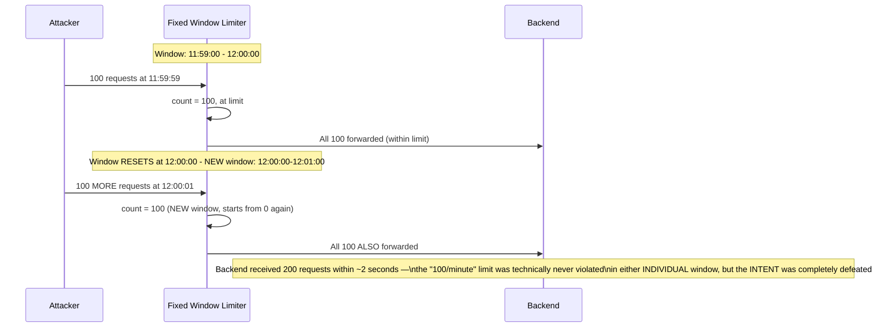
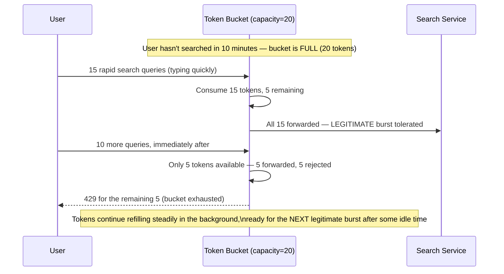
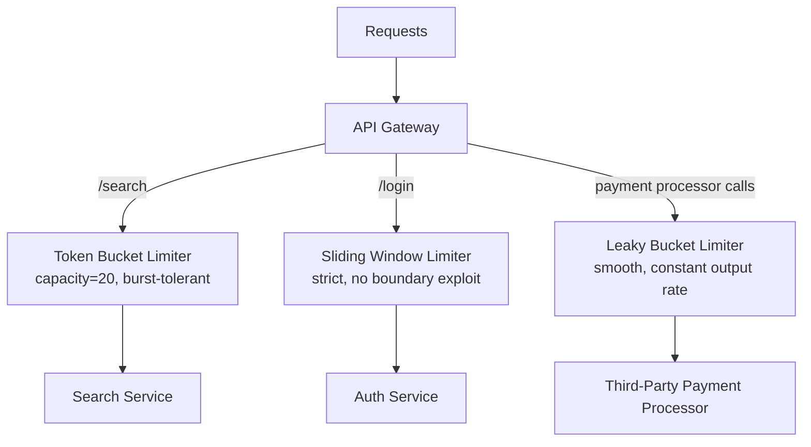
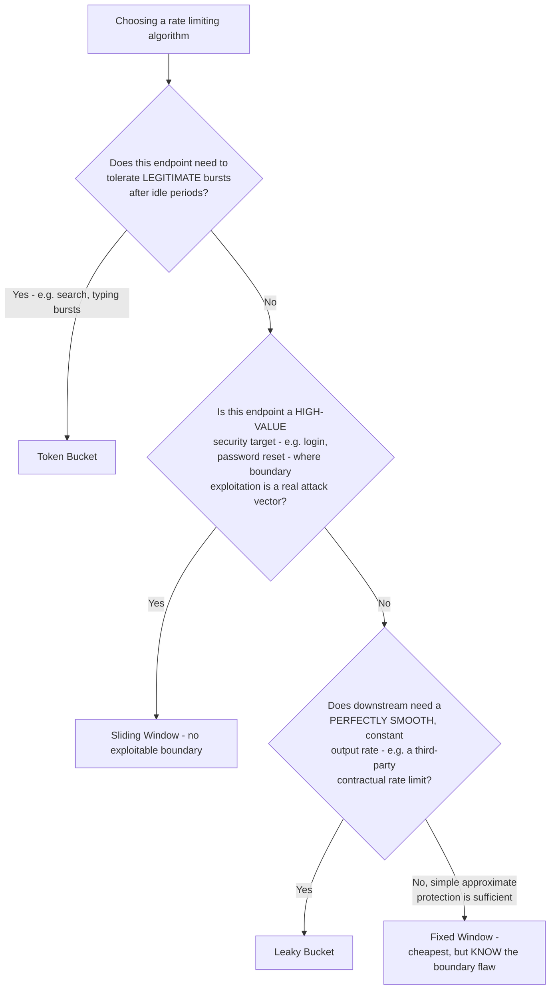
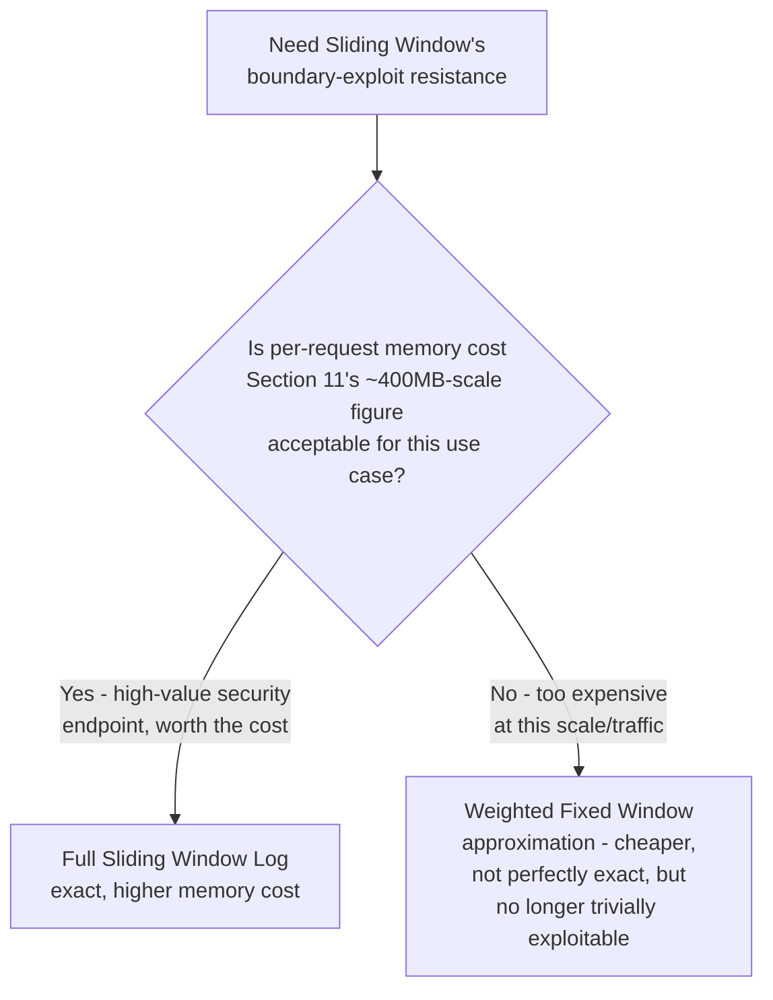
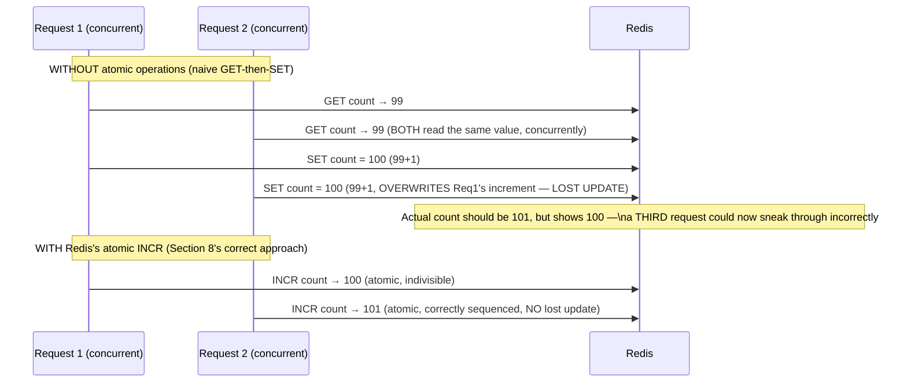
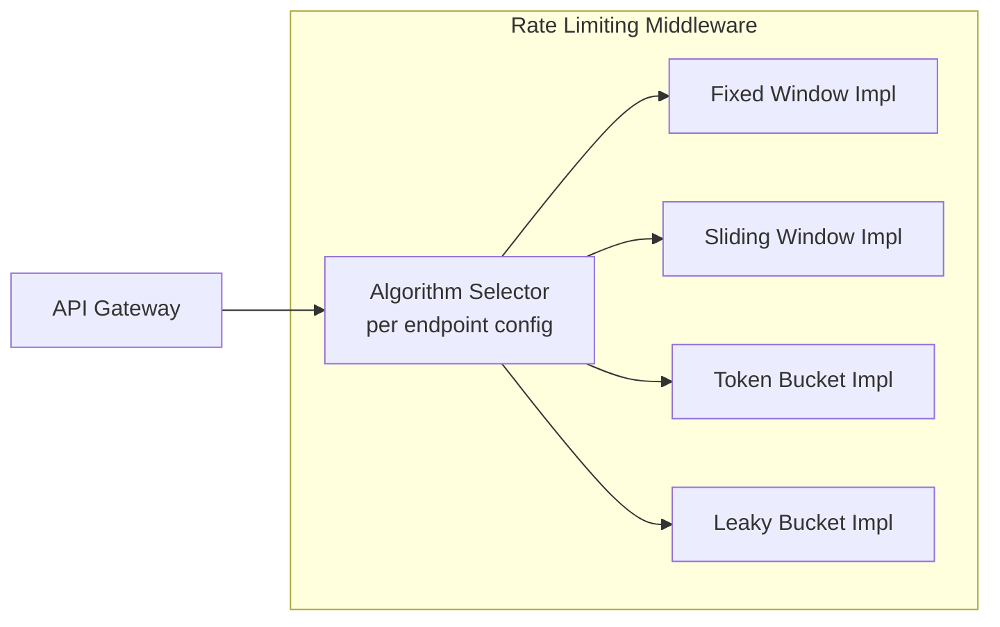

# Module 21 — Rate Limiting

> **Masterclass:** System Design Masterclass (30 Modules)
> **Level:** Advanced
> **Audience:** Node.js backend developers, SDE‑2 / Senior Backend interview candidates, engineers transitioning into architecture roles
> **Prerequisite:** Modules 1–20 (System Design Intro through Security in Distributed Systems)

---

## 1. Introduction

Module 9's API Gateway implemented a simple fixed-window rate limiter with a single line of Redis code. Module 18's bulkhead sizing depended on knowing a dependency's stated rate limit. Module 20's WAF and authentication-failure monitoring referenced abuse prevention without specifying the actual mechanism. This module finally gives rate limiting its complete, rigorous treatment: the **four standard algorithms** — Token Bucket, Leaky Bucket, Fixed Window, and Sliding Window — their precise mechanics, their distinct trade-offs, and a real, working Redis-backed implementation of each.

This module's central technical lesson, which Module 9's simple fixed-window implementation glossed over: **fixed window counting has a specific, exploitable edge-case flaw**, and understanding exactly what it is — and which of the other three algorithms fixes it, at what cost — is the difference between "I added rate limiting" and "I correctly rate limited this system."

---

## 2. Learning Objectives

By the end of this module, you will be able to:

1. Explain the **Fixed Window** algorithm and its precise, exploitable boundary-burst flaw.
2. Explain the **Sliding Window** algorithm (both log-based and counter-based variants) and how it resolves the Fixed Window flaw.
3. Explain the **Token Bucket** algorithm and why it naturally accommodates controlled bursts, unlike the window-based approaches.
4. Explain the **Leaky Bucket** algorithm and how it differs from Token Bucket in its output-smoothing behavior.
5. Implement a correct, atomic, Redis-backed rate limiter avoiding race conditions under concurrent access.
6. Design a **multi-tier rate limiting strategy** (per-IP, per-user, per-endpoint) matched to different abuse scenarios.
7. Choose the correct algorithm for a given system requirement, rather than defaulting to the simplest option without justification.

---

## 3. Why This Concept Exists

Module 9's gateway rate limiter existed to protect backend services from being overwhelmed by any single client — a direct, necessary application of Module 18's bulkhead-adjacent thinking, but applied to *request rate* rather than *concurrent connections*. Module 20's WAF blocks malicious *content*; rate limiting defends against malicious or merely excessive *volume*, a genuinely distinct threat that even perfectly well-formed, entirely legitimate-looking requests can pose if sent too fast or too often.

But "add a rate limiter" is not a single, unambiguous decision — the *algorithm* chosen determines precisely how strict, how burst-tolerant, and how exploitable the limit actually is. Module 9's simple fixed-window implementation was correct enough to illustrate the *concept*, but this module exists because that implementation has a **real, well-known flaw** that a careful system design interview answer — or a careful production system — must know about and address deliberately, not accidentally inherit.

---

## 4. Problem Statement

> Our blog platform's API Gateway (Module 9) currently uses fixed-window rate limiting: 100 requests per user per 60-second window. A security review discovers that a malicious client can send 100 requests at 11:59:59, and then another 100 requests at 12:00:01 — 200 requests within a 2-second span, despite the "100 requests per minute" limit theoretically being enforced throughout. Additionally, our platform needs a *different* rate-limiting behavior for three distinct scenarios: (1) the public `/search` endpoint, which should tolerate brief bursts from legitimate users typing multiple queries quickly, (2) the `/login` endpoint, which must strictly cap attempts to prevent credential-stuffing attacks (Module 20), and (3) an internal service-to-service call to a third-party payment processor with a hard, contractually-stated rate limit that must never be exceeded. Diagnose the fixed-window flaw precisely, and design the correct algorithm for each of the three scenarios.

---

## 5. Real-World Analogy

**Fixed Window rate limiting is a nightclub that resets its "100 people per hour" capacity count at the top of every clock hour, with no memory of the previous hour.** If 100 people arrive at 10:59 PM (just before the reset) and *another* 100 people arrive at 11:01 PM (just after the reset), the club has let in 200 people within a 2-minute span — technically compliant with "100 per hour, per hour-bucket," but obviously violating the actual *intent* of "roughly 100 people per hour, at any given time." This is Section 4's exact, precise flaw.

**Sliding Window is the same nightclub instead asking, at any given moment, "how many people have entered in the last 60 minutes, counting backward from right now" — not from an arbitrary clock boundary.** This eliminates the boundary-exploitation trick entirely, because there's no fixed reset moment for an attacker to time their burst around.

**Token Bucket is a nightclub that hands out a fixed number of admission tokens into a bucket at a steady trickle rate (say, 1 new token every 36 seconds, refilling to a max of 100), and admits one person per token spent.** If nobody has entered for a while, tokens accumulate up to the bucket's capacity — meaning a burst of previously-patient people can all enter at once when they finally arrive, up to the bucket's saved-up capacity, but the *sustained, long-run* rate is still strictly capped by the trickle refill rate. This is precisely why Token Bucket is the right fit for Section 4's search endpoint: it tolerates a **legitimate burst** (a user typing several quick searches) while still capping the long-run average.

**Leaky Bucket is a bucket with a hole in the bottom, leaking out at a constant, fixed rate, regardless of how fast water is poured in — and if you pour in faster than it leaks, the bucket simply overflows and the excess spills out (is rejected).** The key distinguishing behavior versus Token Bucket: Leaky Bucket's *output* rate is always perfectly smooth and constant, useful when you need to guarantee a steady, capped rate to something downstream (Section 4's third scenario — the third-party payment processor with a hard contractual rate limit) rather than tolerating bursty admission.

---

## 6. Technical Definition

**Fixed Window:** A rate limiting algorithm that counts requests within discrete, non-overlapping time intervals (e.g., each calendar minute), resetting the count to zero at each interval boundary.

**Sliding Window:** A rate limiting algorithm that counts requests within a continuously-moving time window measured backward from the current moment, rather than from a fixed clock boundary.

**Token Bucket:** A rate limiting algorithm where tokens accumulate in a bucket at a fixed refill rate up to a maximum capacity, and each request consumes one token — requests are permitted only while tokens are available, naturally allowing bursts up to the bucket's saved capacity.

**Leaky Bucket:** A rate limiting algorithm where incoming requests are queued into a bucket that "leaks" (processes) at a fixed, constant output rate — excess requests beyond the bucket's capacity are rejected, and the processing rate never exceeds the fixed leak rate regardless of burst input.

---

## 7. Core Terminology

| Term | Precise Definition | One-line Intuition |
|---|---|---|
| **Boundary Burst Problem** | The Fixed Window flaw allowing up to 2x the intended limit within a short span straddling a window boundary | "The nightclub's clock-reset exploit" |
| **Refill Rate (Token Bucket)** | The steady rate at which new tokens are added to the bucket | "The trickle of new admission tokens" |
| **Bucket Capacity** | The maximum number of tokens (Token Bucket) or queued items (Leaky Bucket) a bucket can hold | "How much burst can be saved up, or how much can queue before overflow" |
| **Weighted Fixed Window** | An approximation of Sliding Window that blends the current and previous fixed window's counts, proportionally weighted | "A cheaper, approximate fix for the boundary burst problem" |
| **Atomic Operation (rate limiting context)** | An operation (like Redis's `INCR`) guaranteed to execute without interference from concurrent requests | "No two requests can sneak past the counter check simultaneously" |
| **Rate Limit Key** | The identifier (user ID, IP address, API key) that a rate limit is scoped to | "Whose bucket/window this request counts against" |

---

## 8. Internal Working

### Diagnosing Section 4's fixed-window flaw, precisely, mechanically

```javascript
// Module 9's original, simplified fixed-window implementation
async function rateLimit(userId) {
  const key = `ratelimit:${userId}`;
  const count = await redis.incr(key);
  if (count === 1) await redis.expire(key, 60); // reset every 60s, from a FIXED starting point
  return count <= 100;
}
```

The flaw is structural: `redis.expire(key, 60)` starts a **fixed 60-second countdown from whenever the first request in that window happened to arrive.** If a user's first request in a new window arrives at `11:59:59`, that window's boundary is `11:59:59` to `12:00:59` — but a *second*, independent user (or an attacker manipulating request timing) whose first request arrives at exactly `12:00:00` starts a **completely separate window**, `12:00:00` to `12:01:00`. **This means two windows can overlap almost entirely in real, wall-clock time**, and a client who sends 100 requests right before their window resets, then another 100 immediately after, has sent 200 requests within roughly 1-2 seconds of real time — precisely Section 4's reported vulnerability, now shown at the exact code level that produces it.

### How Sliding Window (log-based) resolves this precisely

```javascript
async function slidingWindowRateLimit(userId, limit = 100, windowMs = 60000) {
  const key = `ratelimit:sliding:${userId}`;
  const now = Date.now();
  const windowStart = now - windowMs;

  await redis.zremrangebyscore(key, 0, windowStart); // remove entries older than the window
  const count = await redis.zcard(key); // count remaining entries — i.e., requests in the last 60s, from NOW

  if (count >= limit) return false; // limit exceeded

  await redis.zadd(key, now, `${now}-${Math.random()}`); // record this request's timestamp
  await redis.expire(key, Math.ceil(windowMs / 1000));
  return true;
}
```

**Why this precisely eliminates Section 4's flaw:** there is no fixed reset boundary at all — `windowStart` is *always* recalculated as "60 seconds before right now," continuously sliding forward with real time. A client sending 100 requests at `11:59:59` and then more at `12:00:01` would find that, at `12:00:01`, the sliding window (`11:59:01` to `12:00:01`) **still includes** most of the requests sent at `11:59:59` — correctly rejecting the second burst, because there's no clock-boundary "reset" for the attacker to time their burst around.

**The trade-off, precisely:** this log-based approach requires storing a sorted set entry **per request** (via `zadd`), which is more memory-intensive than Fixed Window's single integer counter — a real, quantifiable cost (Section 11) for the correctness improvement.

### How Token Bucket allows Section 4's search-endpoint burst tolerance, mechanically

```javascript
async function tokenBucketRateLimit(userId, capacity = 20, refillRatePerSecond = 0.33) {
  const key = `ratelimit:bucket:${userId}`;
  const now = Date.now() / 1000;

  const bucket = await redis.hgetall(key);
  let tokens = bucket.tokens ? parseFloat(bucket.tokens) : capacity; // start full
  const lastRefill = bucket.lastRefill ? parseFloat(bucket.lastRefill) : now;

  const elapsedSeconds = now - lastRefill;
  tokens = Math.min(capacity, tokens + elapsedSeconds * refillRatePerSecond); // refill based on elapsed time

  if (tokens < 1) return false; // no tokens available — reject

  tokens -= 1; // consume one token for this request
  await redis.hset(key, { tokens: tokens.toString(), lastRefill: now.toString() });
  return true;
}
```

**Why this precisely resolves Section 4's search-endpoint requirement:** with `capacity=20` and `refillRatePerSecond=0.33` (≈ 20 tokens per minute, matching a 100-per-5-minutes-style long-run rate), a user who hasn't searched in a while has a **full bucket of 20 tokens** — letting them fire off 20 rapid, back-to-back searches (exactly the legitimate "typing several quick queries" burst behavior) before being throttled, while the bucket's steady refill rate still strictly caps their **long-run, sustained** average rate. Fixed or Sliding Window, by contrast, would throttle this same legitimate burst behavior identically to a malicious one, since neither distinguishes "burst after being idle" from "sustained high rate."

---

## 9. Request Lifecycle

### Mermaid Sequence Diagram — Fixed Window's Boundary Burst Exploit, Precisely Illustrated



### Mermaid Sequence Diagram — Token Bucket Correctly Handling a Legitimate Burst (Search Endpoint)



---

## 10. Architecture Overview



**HLD-level insight, resolving all three of Section 4's distinct scenarios with three distinct, deliberately-chosen algorithms:** notice **no single algorithm is used uniformly** — this is the direct, architectural consequence of Section 5's analogy: search needs burst tolerance (Token Bucket), login needs strict, unexploitable capping (Sliding Window, since credential-stuffing attacks specifically try to exploit any boundary weakness), and the payment processor call needs a perfectly smooth, constant, contractually-compliant output rate (Leaky Bucket) — each algorithm chosen because it's the *correct fit* for that specific threat model, not out of habit.

---

## 11. Capacity Estimation

**Scenario:** Comparing the memory cost of Fixed Window versus Sliding Window (log-based) rate limiting at our established scale.

**Given:** 100,000 active users, each rate-limited independently.

**Fixed Window memory cost:**
```
100,000 users × 1 integer counter (a few bytes) ≈ negligible, well under 1 MB total
```

**Sliding Window (log-based) memory cost, assuming 100 requests/window stored as sorted-set entries:**
```
100,000 users × 100 entries × ~40 bytes/entry (timestamp + random suffix) ≈ 400 MB
```

**Conclusion, directly informing Section 8's stated trade-off with real numbers:** Sliding Window's correctness improvement comes at a **genuinely non-trivial, quantifiable memory cost** — 400 MB versus negligible — a real, worth-stating trade-off in an interview, and precisely why some production systems instead choose the **counter-based Sliding Window approximation** (Section 15's Weighted Fixed Window, from Section 7's terminology) as a cheaper middle ground between Fixed Window's flaw and full Sliding Window's memory cost.

---

## 12. High-Level Design (HLD)



**HLD-level insight:** this decision flow directly operationalizes Section 4's three-scenario resolution into a general, reusable template — Fixed Window remains a legitimate, valid choice (Branch H) for low-stakes endpoints where the boundary flaw's impact is negligible, but it must be a **deliberate, informed choice**, not a default applied uniformly out of habit, as Module 9's original implementation implicitly was.

---

## 13. Low-Level Design (LLD)

### Leaky Bucket implementation for the third-party payment processor scenario (Section 4's requirement 3)

```javascript
class LeakyBucketQueue {
  constructor(leakRatePerSecond, capacity) {
    this.queue = [];
    this.leakRatePerSecond = leakRatePerSecond; // e.g., 5 requests/sec, matching processor's contract
    this.capacity = capacity;
    this.processing = false;
  }

  enqueue(requestFn) {
    if (this.queue.length >= this.capacity) {
      return Promise.reject(new Error('Bucket overflow — request rejected'));
    }
    return new Promise((resolve, reject) => {
      this.queue.push({ requestFn, resolve, reject });
      this.startLeaking();
    });
  }

  async startLeaking() {
    if (this.processing) return;
    this.processing = true;
    while (this.queue.length > 0) {
      const { requestFn, resolve, reject } = this.queue.shift();
      try {
        resolve(await requestFn());
      } catch (err) {
        reject(err);
      }
      await new Promise(res => setTimeout(res, 1000 / this.leakRatePerSecond)); // FIXED, constant output rate
    }
    this.processing = false;
  }
}

// Usage — guarantees NEVER exceeding the payment processor's contractual rate limit
const paymentQueue = new LeakyBucketQueue(5, 100); // 5 req/sec leak rate, buffer up to 100 queued
await paymentQueue.enqueue(() => paymentProcessorClient.charge(orderId, amount));
```

**LLD-level design note, directly contrasting with Section 8's Token Bucket implementation:** notice this implementation **actively processes a queue at a fixed interval** (`setTimeout(..., 1000 / leakRatePerSecond)`), rather than merely checking token availability — this is the precise mechanical difference Section 6 names: Token Bucket controls *admission* (bursty, up to capacity), while Leaky Bucket controls *output* (perfectly smooth, always exactly the leak rate), which is exactly the guarantee Section 4's payment-processor contractual requirement needs.

---

## 14. ASCII Diagrams

```
FIXED WINDOW'S BOUNDARY BURST FLAW

  Window 1: [11:59:00 ─────────────── 12:00:00)   Window 2: [12:00:00 ─────────────── 12:01:00)
             │                          │▲│         │▲│                          │
             │                     100 reqs         100 reqs
             │                     (11:59:59)      (12:00:01)
             └──────── ~2 seconds of REAL TIME, 200 requests total ────────┘


TOKEN BUCKET vs LEAKY BUCKET — the key behavioral difference

  TOKEN BUCKET (bursty ADMISSION, capped long-run rate)
    Idle period → bucket fills to capacity → burst of N requests admitted instantly
    Long-run average still capped by refill rate

  LEAKY BUCKET (smooth OUTPUT, regardless of input burstiness)
    Burst of N requests arrives → queued → processed ONE AT A TIME at fixed interval
    Output rate is ALWAYS constant — never bursty, even if input was
```

---

## 15. Mermaid Flowcharts

*(Section 12 covers the canonical algorithm-selection decision flow for this module.)*

### Decision Flow: Full Sliding Window Log, or the Cheaper Weighted Approximation?



---

## 16. Mermaid Sequence Diagrams

*(Section 9 covers the two canonical sequence diagrams for this module. Additional diagram below.)*

### Race Condition Risk in Naive Rate Limiting, and Redis's Atomic Fix



**Why this matters, directly connecting to Module 12's concurrency lessons:** a naive "read the count, check it, then write the incremented value" implementation has a genuine **race condition** — exactly the kind of concurrent-access ambiguity Module 12 warned about — allowing two simultaneous requests to both read the same "under limit" count and both proceed, silently violating the intended limit. Redis's `INCR` (and the `EVAL`-based atomic scripts used in more complex algorithms like Token Bucket, Section 8) are **atomic**, guaranteeing this exact race condition cannot occur, which is why every rate limiter implementation in this module deliberately uses Redis's atomic primitives rather than a naive read-then-write sequence.

---

## 17. Component Diagrams



**Why an `AlgorithmSelector` abstraction, rather than hardcoding one algorithm gateway-wide:** this directly enables Section 10's per-endpoint algorithm choice — `/search` configured for Token Bucket, `/login` for Sliding Window, entirely through configuration rather than different gateway deployments — mirroring this course's repeated Repository-pattern discipline (Modules 1, 5, 7, 9, 11, 15, 16, 19), now applied to rate-limiting algorithm choice itself.

---

## 18. Deployment Diagrams

```mermaid
flowchart TB
    subgraph Gateway Fleet - stateless, per Module 9
        GW1[Gateway Instance 1]
        GW2[Gateway Instance 2]
    end
    subgraph Shared Rate Limit State
        Redis[(Redis - shared counters/buckets\nacross ALL gateway instances)]
    end
    GW1 & GW2 --> Redis
```

**Deployment-level note, directly connecting to Module 2's statelessness principle:** rate limit state (counters, token buckets, sliding-window logs) **must be shared** across every gateway instance via Redis, exactly like Module 2's session-store lesson — if each gateway instance tracked rate limits in its own local memory, a client could trivially bypass the intended limit simply by having requests routed (Module 8's load balancing) across multiple instances, each independently believing the client is still under its own local count.

---

## 19. Network Diagrams

Rate limiting introduces no new network topology beyond what Module 9's gateway architecture already established — but it does reinforce *why* rate limiting belongs at the gateway/edge layer specifically: **rejecting an over-limit request at the earliest possible point** (the gateway, before any backend service is even contacted) directly extends Module 9, Section 16's exact lesson — the Core API is completely shielded from abusive traffic, never spending a single backend resource on a request that was always going to be rejected.

---

## 20. Database Design

Rate limiting doesn't typically involve a relational database schema — Redis's in-memory, TTL-native data structures (Module 7) are purpose-built for exactly this access pattern (frequent increments/checks, short-lived state) — directly reapplying Module 5's "match the tool to the access pattern" principle, now specifically to rate-limit state rather than durable business data.

```
Key naming convention, extending Module 7 Section 20's structured-key discipline:
  ratelimit:{algorithm}:{scope}:{identifier}
  e.g., ratelimit:token-bucket:endpoint:search:user:123
        ratelimit:sliding-window:endpoint:login:ip:203.0.113.10
```

**Why encoding the algorithm and scope directly into the key:** this makes it trivially possible to apply *different* algorithms to *different* scopes for the *same* user simultaneously (e.g., a per-user AND a per-IP limit on `/login`, Section 4's requirement 2, potentially needing both dimensions) without any risk of key collision or ambiguity about which limiter a given Redis key belongs to.

---

## 21. API Design

Rate-limited endpoints should return standard, informative headers — a well-established, RFC-influenced convention worth following precisely:

```
HTTP/1.1 429 Too Many Requests
X-RateLimit-Limit: 100
X-RateLimit-Remaining: 0
X-RateLimit-Reset: 1720100460
Retry-After: 42
```

**Why these specific headers matter:** `Retry-After` tells a well-behaved client **exactly** how long to wait before retrying — directly enabling Module 18's client-side backoff logic to be *informed* rather than guessed, and `X-RateLimit-Remaining` lets a client proactively throttle itself *before* even hitting the limit, reducing unnecessary rejected requests and wasted round trips.

---

## 22. Scalability Considerations

| Consideration | Fixed Window | Sliding Window (log) | Token Bucket | Leaky Bucket |
|---|---|---|---|---|
| Memory cost | Lowest (single counter) | Highest (per-request entries, Section 11) | Low (2 values: tokens, timestamp) | Moderate (queue depth) |
| Computational cost per check | Lowest | Moderate (range removal + count) | Low | Requires active queue processing |
| Horizontal scaling | Trivial (Redis-backed, shared) | Trivial, but memory scales with traffic | Trivial | Requires careful queue-ownership design if distributed across instances |

---

## 23. Reliability & Fault Tolerance

- **Rate limiter backing store (Redis) unavailability is a genuine reliability decision point**, directly echoing Module 13's fail-open-vs-fail-closed trade-off — a rate limiter that fails closed (rejecting everything) during a Redis outage converts a rate-limiting infrastructure problem into a full outage; failing open (allowing everything) during the same outage briefly sacrifices abuse protection for availability — this must be a deliberate, stated choice, exactly as Module 9, Section 23 originally flagged but deferred to this module's full treatment.
- **The Leaky Bucket's active queue processing (Section 13) introduces its own failure mode**: if the processing loop itself crashes, queued requests are silently lost unless the queue is itself durable (Module 11's message-queue durability lessons become directly relevant if this matters for a given use case).
- **Rate limits should be tuned with headroom for legitimate traffic spikes** (e.g., a viral post, Module 7's hot-key scenario) — an overly strict limit risks rejecting genuine, desired traffic during exactly the moments a system's success matters most.

---

## 24. Security Considerations

- **Rate limiting is a direct, necessary defense against credential-stuffing and brute-force attacks** (Module 20's login-endpoint concern, Section 4's requirement 2) — Sliding Window's boundary-exploit resistance is specifically valuable here because attackers actively probe for and exploit exactly this kind of algorithmic weakness.
- **Per-IP rate limiting alone is insufficient against a distributed attack** (many IPs, coordinated) — combining per-IP and per-user (or per-API-key) limiting, as Section 20's key-naming convention enables, provides defense in depth (Module 20's core principle), directly relevant here too.
- **Rate limit responses (429s) should not leak information useful to an attacker** about exactly how close to the limit a specific account is, beyond the standard headers (Section 21) — this is a minor, but real, information-disclosure consideration (Module 20, Section 24's broader principle).

---

## 25. Performance Optimization

- **Choose the cheapest algorithm that still meets the actual requirement** (Section 12's decision flow) — Fixed Window's low cost is a genuine advantage for low-stakes endpoints, and reaching for Sliding Window's higher memory cost everywhere, "to be safe," is an avoidable over-engineering cost (echoing this course's repeated premature-complexity warnings, Module 1 onward).
- **Use Redis Lua scripting (`EVAL`) for multi-step atomic operations** (like Token Bucket's read-refill-check-decrement sequence, Section 8) to guarantee atomicity in a single round trip, rather than multiple separate Redis calls that could be interleaved by concurrent requests (Section 16's race-condition lesson, extended).
- **Batch rate-limit checks where possible** for bulk operations, rather than checking once per individual item in a batch, reducing Redis round-trip overhead (Module 7's batching lesson, applied here).

---

## 26. Monitoring & Observability

Directly extending Module 19's framework to rate-limiting-specific signals:

- **429 response rate, per endpoint and per rate-limit key scope** — a sudden spike often signals either an active abuse attempt or a limit that's now too strict for legitimate, organically-growing traffic (Section 23's headroom concern).
- **Rate limiter backing-store (Redis) health**, directly informing the fail-open/fail-closed decision's real-world behavior (Section 23).
- **Distribution of "how close to the limit" legitimate users typically get** — informs whether current limits are well-calibrated or need adjustment, a genuinely data-driven tuning process rather than a one-time guess.

---

## 27. Common Bottlenecks

| Bottleneck | Symptom | Root Cause |
|---|---|---|
| Boundary burst exploitation | Rate limit technically "enforced" but real abuse volume far exceeds intent | Fixed Window used for a high-stakes endpoint where the flaw matters (Section 4/8) |
| Race condition under concurrent load | Rate limit occasionally allows more than the configured maximum | Non-atomic read-then-write implementation instead of Redis's atomic primitives (Section 16) |
| Excessive Redis memory usage | Rate limiter's own infrastructure becomes a cost/capacity concern | Sliding Window log chosen without justification for a very high-traffic, low-stakes endpoint (Section 11/25) |
| Legitimate bursty traffic rejected | Users complain of being throttled despite reasonable usage patterns | Fixed or Sliding Window applied where Token Bucket's burst tolerance was actually needed (Section 8) |
| Third-party contractual rate limit violated | External API returns errors or suspends access | No Leaky Bucket (or equivalent smoothing) applied to outbound calls with a hard external rate cap (Section 13) |

---

## 28. Trade-off Analysis

> "I chose **Sliding Window (log-based)** for the `/login` endpoint specifically, optimizing for **eliminating the boundary-burst exploit that a credential-stuffing attacker would specifically target**, at the cost of **higher per-user memory usage (Section 11's ~400MB-scale figure) compared to Fixed Window**, which is acceptable because login is a high-value security target where this specific exploitability matters far more than the memory cost, unlike a low-stakes endpoint where Fixed Window's cheaper approximation would be perfectly adequate."

> "I chose **Token Bucket** for the `/search` endpoint, optimizing for **tolerating legitimate rapid-fire query bursts from real users**, at the cost of **allowing a technically higher instantaneous request rate than a strict window-based limiter would**, which is acceptable because search is a low-risk, read-only operation where burst tolerance improves genuine user experience without meaningfully increasing abuse risk."

---

## 29. Anti-patterns & Common Mistakes

1. **Using Fixed Window uniformly across all endpoints without considering the boundary-burst flaw's actual impact for each** — Section 4's precise, motivating incident.
2. **Implementing rate limiting with non-atomic read-then-write logic**, introducing a genuine race condition under concurrent load (Section 16).
3. **Applying the same, single algorithm to genuinely different threat models** (burst-tolerant search vs. strictly-capped login vs. smoothly-output-rate-limited third-party calls) — Section 4's core, resolved lesson.
4. **Storing rate limit state in local, per-instance memory** instead of a shared store (Section 18), allowing trivial bypass via load-balanced request distribution.
5. **No defined fail-open/fail-closed policy** for rate limiter backing-store unavailability, discovering the actual behavior only during a real Redis outage (Section 23).
6. **Rate limits tuned once and never revisited**, becoming either too strict (rejecting legitimate growth) or too lax (no longer providing meaningful protection) as traffic patterns evolve (Section 26's monitoring exists precisely to catch this).

---

## 30. Production Best Practices

- **Choose the rate-limiting algorithm deliberately, per endpoint, based on its specific threat model and burst-tolerance needs** — never apply one algorithm uniformly by default.
- **Always use atomic Redis operations** (`INCR`, `EVAL`-based Lua scripts) for any multi-step rate-limit logic, never a naive read-then-write sequence.
- **Store rate limit state in a shared backing store** (Redis), never per-instance local memory, given a load-balanced, horizontally-scaled gateway fleet (Module 2, 8, 9).
- **Return standard, informative rate-limit headers** (`X-RateLimit-*`, `Retry-After`) to enable well-behaved client-side backoff.
- **Explicitly decide and document the fail-open/fail-closed policy** for rate limiter backing-store unavailability.
- **Monitor 429 rates and near-limit distribution continuously**, treating rate limits as tunable, data-informed parameters, not static, one-time settings.

---

## 31. Real-World Examples

- **Stripe's publicly documented API rate limiting** uses a Token Bucket-style approach explicitly, and their API documentation directly explains the burst-tolerance behavior this module's Section 8 describes — a real, citable, production example of exactly this algorithm choice for exactly this reason (accommodating legitimate bursty API usage patterns from integrators).
- **GitHub's API rate limiting** returns exactly the `X-RateLimit-Limit`, `X-RateLimit-Remaining`, and `X-RateLimit-Reset` headers described in Section 21, and is one of the most widely-referenced, real-world examples of this now-standard convention across the API industry.
- **Cloudflare's and AWS's DDoS mitigation services** rely heavily on sliding-window-style rate limiting and anomaly detection specifically because Fixed Window's boundary-exploitability (Section 4/8) is a well-known, actively-targeted weakness that sophisticated attackers specifically design their traffic patterns around — a direct, large-scale validation of why the algorithm choice, not just "having a rate limiter," genuinely matters.

---

## 32. Node.js Implementation Examples

### A complete, atomic Token Bucket implementation using Redis Lua scripting (resolving Section 25's atomicity recommendation)

```javascript
const TOKEN_BUCKET_SCRIPT = `
  local key = KEYS[1]
  local capacity = tonumber(ARGV[1])
  local refillRate = tonumber(ARGV[2])
  local now = tonumber(ARGV[3])

  local bucket = redis.call('HMGET', key, 'tokens', 'lastRefill')
  local tokens = tonumber(bucket[1]) or capacity
  local lastRefill = tonumber(bucket[2]) or now

  local elapsed = now - lastRefill
  tokens = math.min(capacity, tokens + elapsed * refillRate)

  if tokens < 1 then
    redis.call('HMSET', key, 'tokens', tokens, 'lastRefill', now)
    return 0
  end

  tokens = tokens - 1
  redis.call('HMSET', key, 'tokens', tokens, 'lastRefill', now)
  redis.call('EXPIRE', key, 3600)
  return 1
`;

async function atomicTokenBucketCheck(userId, capacity, refillRate) {
  const result = await redis.eval(
    TOKEN_BUCKET_SCRIPT, 1, `ratelimit:bucket:${userId}`,
    capacity, refillRate, Date.now() / 1000
  );
  return result === 1;
}
```

**Why this Lua-script version is the correct, production-grade implementation, versus Section 8's simpler illustrative version:** Section 8's version made **two separate Redis round trips** (`hgetall` then `hset`) — between those two calls, another concurrent request could read the *same* pre-decrement token count, precisely Section 16's race condition, now applied to Token Bucket specifically. Redis's `EVAL` executes the entire read-refill-check-decrement sequence as **one atomic, indivisible operation** on the Redis server itself, completely eliminating this race condition — the genuinely correct way to implement any multi-step rate-limiting logic in production.

---

## 33. Interview Questions

### Easy
1. Explain the Fixed Window rate limiting algorithm and its known flaw.
2. What is the boundary burst problem, precisely?
3. How does Token Bucket differ from Leaky Bucket?
4. Why must rate limit state be stored in a shared backing store rather than per-instance local memory?
5. What HTTP headers should a rate-limited API return, and why?
6. Why is a naive read-then-write rate limiter implementation vulnerable to a race condition?

### Medium
7. Design a Sliding Window rate limiter, explaining precisely how it avoids the Fixed Window boundary exploit.
8. Explain why Token Bucket is well-suited to a search endpoint but poorly suited to a login endpoint.
9. Calculate the approximate memory cost difference between Fixed Window and log-based Sliding Window for 50,000 users at 50 requests/window.
10. Explain why Redis's atomic `INCR` or Lua `EVAL` is necessary for a correct rate limiter implementation.
11. Design a rate limiting strategy combining both per-IP and per-user limits for a login endpoint, and explain why neither alone is sufficient.
12. Explain the fail-open versus fail-closed trade-off for rate limiter backing-store unavailability, and propose a choice for a public content API versus a payment API.

### Hard
13. Design a complete, multi-tier rate limiting architecture for an API platform with public unauthenticated endpoints, authenticated user endpoints, and third-party integration partners each with contractually different rate limits.
14. Explain, precisely, why Leaky Bucket's smoothing behavior is necessary (not just nice-to-have) for a service with a hard, contractual third-party rate limit, and what would go wrong using Token Bucket instead for this specific case.
15. A security review discovers that your Sliding Window rate limiter's memory usage has grown to an unsustainable level under real production traffic. Propose a redesign using the Weighted Fixed Window approximation, and explain the accuracy trade-off it introduces.
16. Design an atomic, Lua-script-based Sliding Window implementation (rather than the sorted-set-based version), discussing the trade-offs of this alternative approach.
17. Discuss how you would rate limit a GraphQL API, where a single request can vary enormously in computational cost, compared to rate limiting a traditional REST API where each endpoint has a more predictable cost profile.

---

## 34. Scenario-Based Design Questions

1. **Scenario:** A security audit reproduces Module 21's exact Section 4 boundary-burst exploit against your production `/login` endpoint. Walk through your immediate mitigation and long-term redesign.
2. **Scenario:** Legitimate users complain that typing multiple quick searches triggers rate limiting unnecessarily, while your security team wants stricter limits overall. Propose an algorithm change resolving both concerns.
3. **Scenario:** Your third-party payment processor begins returning errors, and investigation reveals your service occasionally sends brief bursts exceeding their stated rate limit despite an average rate well under it. Diagnose the algorithmic mismatch and propose the fix.
4. **Scenario:** During a Redis outage, your rate limiter's fail-open policy allows a coordinated abuse attack to proceed unchecked for several minutes. Propose both an immediate response and a longer-term architectural improvement.
5. **Scenario:** Two engineers debate whether rate limiting should happen at the API Gateway or within each individual backend service. Walk through the trade-offs, referencing Module 9's architecture.
6. **Scenario:** Your rate limiter occasionally allows slightly more requests through than configured under high concurrent load. Diagnose using this module's race-condition concepts and propose the specific code fix.
7. **Scenario:** A new third-party API integration partner requests a much higher rate limit than your standard tier. Design a multi-tier rate limiting configuration accommodating this without a full architectural redesign.
8. **Scenario:** An interviewer asks you to design rate limiting for a "trending topics" endpoint that becomes extremely popular during breaking news events. Discuss algorithm choice and capacity planning for this specific, bursty-by-nature use case.
9. **Scenario:** Your monitoring shows the 429 rate for a specific endpoint has grown steadily over 3 months with no corresponding increase in reported abuse. Propose your diagnostic and remediation approach.
10. **Scenario:** You must rate limit both a public, unauthenticated endpoint (by IP) and an authenticated endpoint (by user ID) that happen to share the same underlying business logic. Design the combined rate-limiting strategy.

---

## 35. Hands-on Exercises

1. Implement the Fixed Window rate limiter from Section 8, and write a test that deliberately reproduces the boundary-burst exploit, sending requests timed just before and just after a window reset.
2. Implement the log-based Sliding Window rate limiter from Section 8, run the same boundary-timed test against it, and verify the exploit no longer succeeds.
3. Implement the atomic, Lua-script-based Token Bucket from Section 32, and write a test firing many concurrent requests simultaneously, verifying the token count never goes negative or allows more requests than the bucket capacity permits.
4. Implement the Leaky Bucket queue from Section 13, submit a burst of 50 requests at once, and measure/log the actual timing of each processed request, verifying they're spaced according to the configured leak rate.
5. Measure the actual Redis memory usage of 10,000 simulated users under both Fixed Window and log-based Sliding Window, reproducing Section 11's capacity estimation empirically.

---

## 36. Mini Project

**Build:** A multi-algorithm rate limiting middleware for the blog platform's API Gateway, directly resolving Module 21's Section 4 scenarios.

**Requirements:**
- Implement Token Bucket (atomic, Lua-script-based per Section 32) for the `/search` endpoint.
- Implement Sliding Window (log-based) for the `/login` endpoint.
- Implement Leaky Bucket for a simulated outbound call to a "third-party payment processor" with a hard rate limit.
- Return standard `X-RateLimit-*` and `Retry-After` headers on all rate-limited responses.
- Write a test reproducing the Fixed Window boundary-burst exploit against a naive implementation, and a corresponding test proving your Sliding Window implementation resists it.

**Success criteria:** Each of the three endpoints behaves correctly according to its chosen algorithm's specific characteristics (burst tolerance for search, exploit resistance for login, smooth output for the payment call), verified by automated tests, with correct, standard rate-limit headers returned throughout.

---

## 37. Advanced Project

**Build:** Extend the Mini Project with a fail-open/fail-closed policy, multi-tier limiting, and a full monitoring dashboard.

1. Implement a configurable fail-open/fail-closed policy (Section 23) for Redis backing-store unavailability, and write a test simulating a Redis outage, verifying your chosen policy behaves as documented for both the `/login` (likely fail-closed) and `/search` (likely fail-open) endpoints.
2. Implement combined per-IP and per-user rate limiting for the `/login` endpoint (Section 24), and write a test demonstrating that an attacker distributing requests across multiple accounts from one IP is still correctly throttled by the per-IP limit.
3. Implement 429-rate and near-limit-distribution monitoring (Section 26), directly reusing Module 19's structured logging and metrics patterns, and simulate a gradually-tightening traffic pattern to verify your monitoring correctly surfaces the trend before it becomes a full-blown incident.
4. Write a decision document proposing a complete, multi-tier rate limiting strategy (public/unauthenticated, authenticated, and partner-tier third-party integrations) for the full blog platform built throughout this masterclass, using Section 12's decision framework explicitly for each tier and endpoint category.

**Success criteria:** You have a working, tested fail-open/fail-closed policy correctly differentiated by endpoint criticality, working combined per-IP/per-user limiting resistant to a simulated distributed attack, functioning rate-limit-specific monitoring, and a complete, framework-justified multi-tier strategy document — setting up Module 22 (Distributed Locking), which formalizes the mutual-exclusion patterns needed when rate limiting's simple counters aren't sufficient and genuine cross-instance coordination over a shared, contested resource is required.

---

## 38. Summary

- **Fixed Window** is the cheapest algorithm but has a real, exploitable boundary-burst flaw allowing up to 2x the intended limit within a short span straddling the window reset.
- **Sliding Window** (log-based or weighted-approximation) eliminates this flaw by continuously recalculating the window relative to the current moment, at a real, quantifiable memory cost for the log-based variant.
- **Token Bucket** naturally tolerates legitimate bursts after idle periods while still capping the long-run sustained rate — the correct fit for burst-tolerant, low-risk endpoints like search.
- **Leaky Bucket** guarantees a perfectly smooth, constant output rate regardless of input burstiness — the correct fit when a downstream system (a third-party contractual rate limit) needs guaranteed, never-exceeded steady throughput.
- **Rate limiter implementations must use atomic operations** (Redis `INCR` or Lua `EVAL`) to avoid race conditions under concurrent access — a naive read-then-write sequence is a genuine, exploitable correctness bug, not just a theoretical concern.
- **The correct algorithm choice depends on the specific endpoint's threat model and burst-tolerance needs** — no single algorithm should be applied uniformly across an entire platform by default.

---

## 39. Revision Notes

- Fixed Window: cheap, but boundary-burst flaw allows ~2x limit near window reset — know this exploit precisely
- Sliding Window (log-based): eliminates the flaw, exact, but memory cost scales with per-request entries
- Token Bucket: bursty ADMISSION up to capacity, capped long-run rate — best for burst-tolerant, low-risk endpoints (search)
- Leaky Bucket: smooth, constant OUTPUT rate regardless of input burst — best for hard external/contractual rate limits
- Always use atomic Redis operations (INCR, Lua EVAL) — naive read-then-write is a real race condition
- Store rate-limit state in shared backing store (Redis), never per-instance local memory
- Return X-RateLimit-Limit/Remaining/Reset + Retry-After headers — standard, client-actionable convention
- Choose algorithm PER endpoint, based on threat model — never one algorithm uniformly by default

---

## 40. One-Page Cheat Sheet

```
SYSTEM DESIGN — MODULE 21 CHEAT SHEET
─────────────────────────────────────
FIXED WINDOW    → cheap, BUT boundary-burst flaw (~2x limit exploitable near reset)
SLIDING WINDOW  → fixes the flaw, exact, higher memory cost (per-request log entries)
TOKEN BUCKET    → bursty ADMISSION (up to capacity), capped long-run rate
                  → best for: burst-tolerant, low-risk (search, typing bursts)
LEAKY BUCKET    → smooth, constant OUTPUT rate, regardless of input burst
                  → best for: hard external/contractual rate limits (payment API)

ALWAYS USE ATOMIC OPERATIONS
  Redis INCR (simple counters) or Lua EVAL (multi-step logic)
  Naive read-then-write = REAL race condition, not theoretical

STANDARD RATE-LIMIT HEADERS
  X-RateLimit-Limit / X-RateLimit-Remaining / X-RateLimit-Reset / Retry-After

FAIL-OPEN vs FAIL-CLOSED (backing store unavailable)
  Fail OPEN  → availability favored (low-stakes endpoints)
  Fail CLOSED → security favored (login, payments)

GOLDEN RULE
  Choose the algorithm PER ENDPOINT, based on its threat model —
  never apply one algorithm uniformly across the whole platform by default.
```

---

## Key Takeaways

- "Add rate limiting" is not one decision — it's a choice among four algorithms with genuinely different, precisely-defined behaviors, and the wrong choice for a given endpoint's threat model is either exploitable (Fixed Window on a security-critical endpoint) or needlessly restrictive (Sliding Window on a burst-tolerant, low-risk one).
- Every rate limiter implementation must be atomic — this module's race-condition demonstration (Section 16) is not a theoretical edge case but a genuine, exploitable correctness bug in any naive read-then-write implementation.
- Rate limiting is best applied per-endpoint, matched deliberately to that endpoint's specific burst-tolerance needs and threat model, continuing this course's consistent discipline of justified, deliberate architectural choices over defaults.

## 20 Practice Questions
*(See Section 33 — 6 Easy, 6 Medium, 5 Hard — plus 3 rapid-fire additions:)*
18. Why does the Weighted Fixed Window approximation reduce, but not fully eliminate, boundary-exploit risk compared to a true log-based Sliding Window?
19. Why is a per-instance, local-memory rate limiter implementation fundamentally broken in a horizontally-scaled, load-balanced deployment?
20. Why might a GraphQL API need a fundamentally different rate-limiting approach (e.g., cost-based limiting) than a traditional REST API?

## 10 Scenario-Based Questions
*(See Section 34 in full.)*

## 5 Design Assignments
*(See Sections 36–37 — Mini Project and Advanced Project — plus:)*
1. Design a complete rate limiting strategy for a ride-sharing app's API, distinguishing driver-location-update traffic (very high frequency, bursty) from ride-booking traffic (lower frequency, security-sensitive).
2. Write a one-page postmortem (real or hypothetical) for a boundary-burst exploit incident against a login endpoint, including root cause and the specific algorithmic fix.
3. Propose a cost-based rate limiting design for a GraphQL API, where different queries consume different amounts of a shared "budget" per time window.

## Suggested Next Module

**→ Module 22: Distributed Locking** — with request-rate control now fully specified, we turn to a related but distinct coordination problem: when multiple instances of a service must ensure only ONE of them performs a specific action at a time (not just limit the RATE of actions), completing the toolkit for coordinating access to shared, contested resources across a distributed system.
