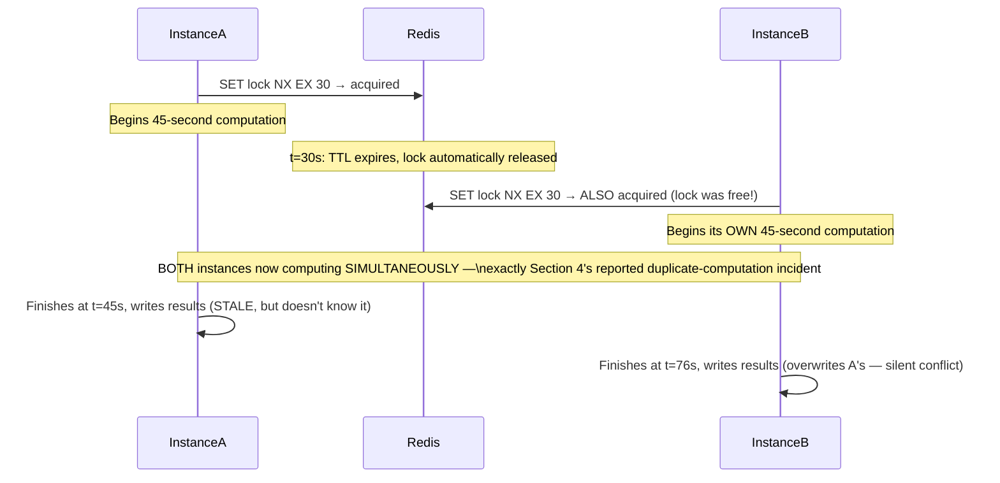
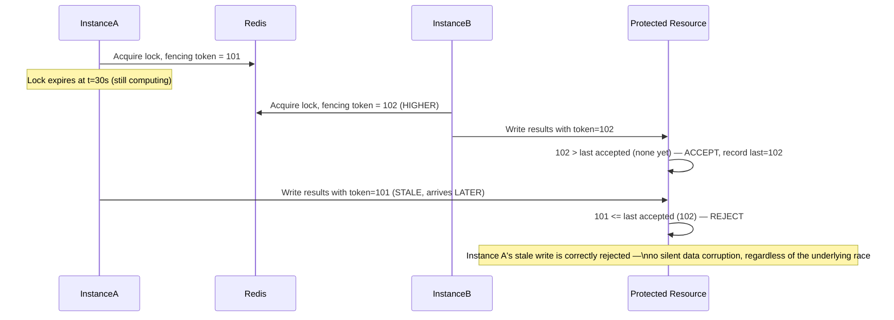
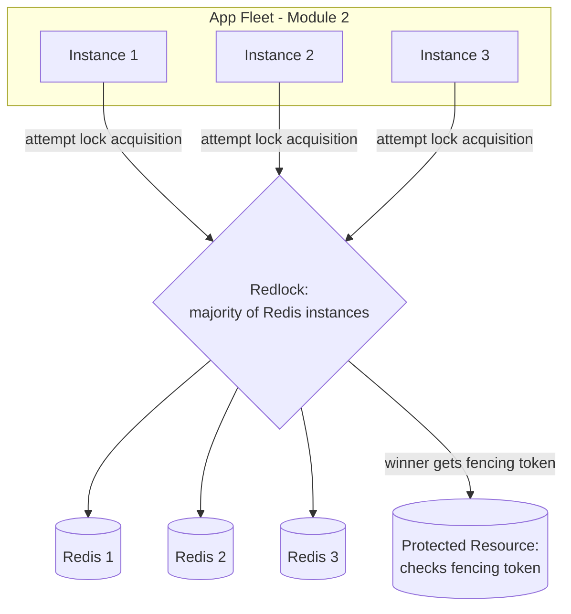
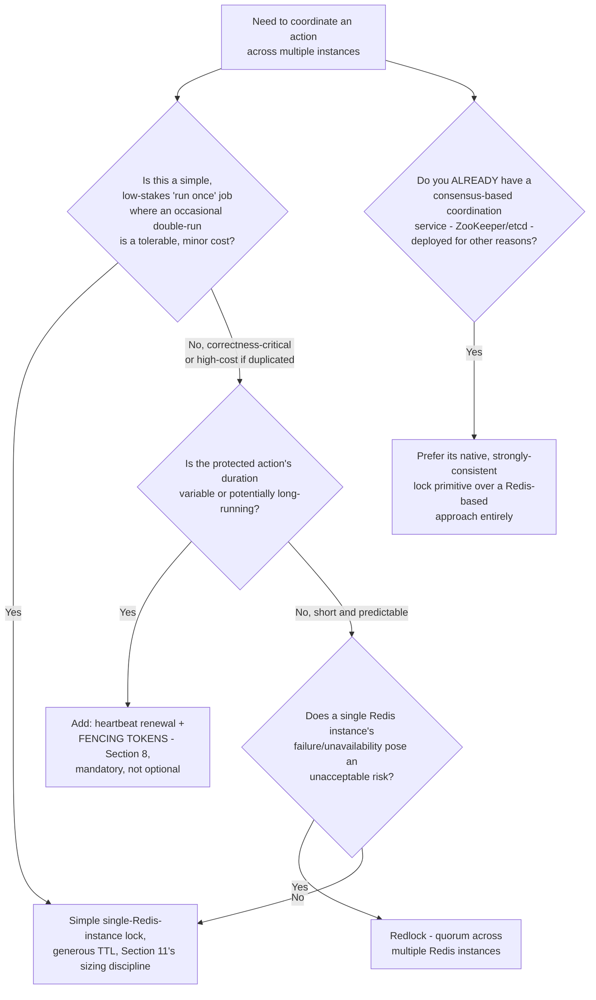
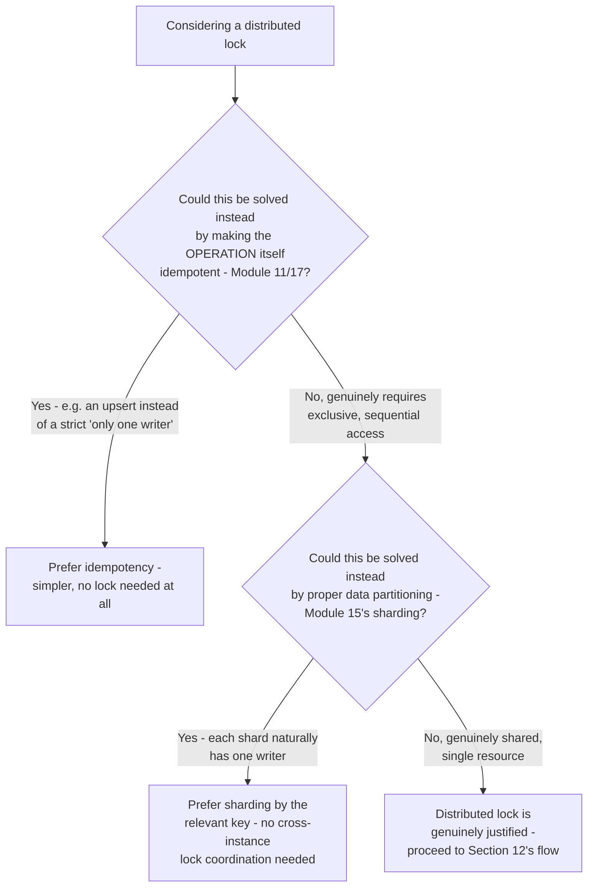
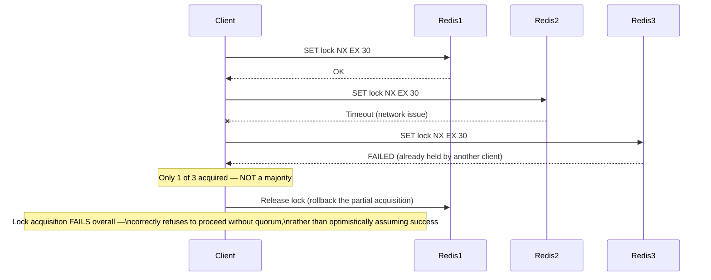
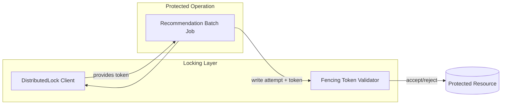
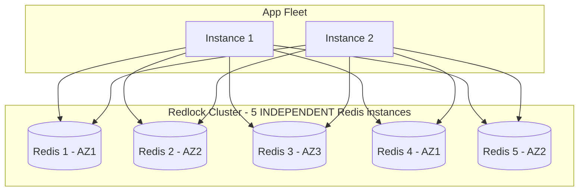

# Module 22 — Distributed Locking

> **Masterclass:** System Design Masterclass (30 Modules)
> **Level:** Advanced
> **Audience:** Node.js backend developers, SDE‑2 / Senior Backend interview candidates, engineers transitioning into architecture roles
> **Prerequisite:** Modules 1–21 (System Design Intro through Rate Limiting)

---

## 1. Introduction

Module 21 closed with a precise distinction: rate limiting controls *how often* something happens, but says nothing about ensuring *only one instance* performs a specific action at all. Module 12 named leader election as a form of this problem, and Module 17's Saga orchestrator implicitly assumed only one process was driving a given workflow at a time. This module makes that assumption an explicit, engineered guarantee: **distributed locking** — how multiple independent service instances (Module 2's stateless fleet) coordinate to ensure mutual exclusion over a shared resource, using Redis-based locks, the **Redlock** algorithm, and — where genuinely available — **ZooKeeper**-style coordination services.

This module's central, hard-won lesson: a distributed lock is deceptively easy to implement *incorrectly* in a way that looks correct in testing and fails exactly when it matters — under the same partial-failure ambiguity Module 12 established as fundamental, not incidental, to distributed systems.

---

## 2. Learning Objectives

By the end of this module, you will be able to:

1. Explain **why a single, uncoordinated instance's local lock (a mutex) does not work** in a horizontally-scaled, multi-instance system.
2. Implement a correct, TTL-based **Redis distributed lock**, including the critical fencing-token safeguard against lock expiry races.
3. Explain the **Redlock algorithm** and the specific single-point-of-failure problem it addresses beyond a single-Redis-instance lock.
4. Explain how **ZooKeeper** (or etcd) provides distributed locking via a fundamentally different mechanism than Redis's TTL-based approach.
5. Diagnose the **"lock expired while still holding useful work" race condition** and design the fencing-token fix precisely.
6. Choose between a **simple Redis lock, Redlock, and a consensus-based coordination service** for a given reliability requirement.
7. Recognize when distributed locking is being reached for as a workaround for a design problem better solved differently (e.g., via Module 17's idempotency or Module 15's proper data partitioning).

---

## 3. Why This Concept Exists

Module 2 established that horizontal scaling requires stateless, interchangeable service instances — any instance can handle any request. But some operations genuinely require **exactly one** instance to perform them at a time, even across a fleet of many: a scheduled job that must run once, not once per instance (Module 11's cron-like tasks); a critical section updating a shared resource where two simultaneous updates would corrupt data (a variant of Module 12's split-brain concern, now at the application-logic level rather than the database-replication level); or a Saga orchestrator (Module 17) that must not have two competing instances simultaneously driving the same workflow to conflicting conclusions.

A single-machine mutex (a standard concurrency primitive from any programming language) solves this trivially *within one process* — but Module 2's entire premise is that your system runs as **many** processes, on **many** machines, and a local mutex has zero visibility into, or effect on, any other machine's local mutex. Distributed locking exists to extend "mutual exclusion" across this exact gap — providing a shared, externally-visible lock that every instance, regardless of which machine it runs on, can check and respect.

---

## 4. Problem Statement

> Our blog platform runs a nightly job (Module 6's backup process) that must execute exactly once, even though it's triggered by a cron-like scheduler running identically on all 5 of our app server instances (Module 2's horizontally-scaled fleet) — without coordination, all 5 instances would each independently kick off the backup simultaneously. Additionally, our Recommendation Service (Module 16) has a batch computation step that takes 45 seconds, and a naive Redis lock with a 30-second TTL was observed to expire *while the computation was still running*, allowing a second instance to begin a conflicting, duplicate computation. Diagnose the exact failure mode in the second scenario, and design a correct distributed locking solution for both.

---

## 5. Real-World Analogy

**A distributed lock is a single physical key to a shared conference room, kept at a front desk that every department (service instance) must check with before entering.** Whoever has the key can use the room exclusively; everyone else must wait. This solves Section 4's first scenario directly: the nightly backup job is "the conference room," and only the one instance holding the key actually runs it — the other four correctly see the key is taken and skip their own attempt.

**The TTL-expiry race condition is the front desk automatically taking the key back after exactly 30 minutes, regardless of whether the meeting inside the room is actually finished.** If a meeting (Section 4's 45-second batch computation) runs long, the front desk reissues the "available" key to a *second* department at the 30-minute mark — and now **two departments are both physically in the room simultaneously**, each believing they have exclusive access, precisely Section 4's second, more subtle and dangerous failure.

**A fencing token is each key issuance being stamped with an increasing serial number, and the room's own equipment (the shared resource itself) refusing to accept any instruction from a key with a lower serial number than the last one it obeyed.** Even if the front desk mistakenly reissues a "new" key while the original meeting is still ongoing, the room's actual equipment (e.g., the projector) will reject commands from the *original* meeting's now-superseded key the moment a higher-numbered key has been issued — providing a second, independent safety check beyond merely trusting the front desk's TTL bookkeeping, exactly the mechanism this module's Section 8 formalizes as the correct fix.

**Redlock is requiring a majority of 5 independent front desks (rather than trusting just one) to all agree the key is available before granting it** — directly extending Module 12's quorum concept to distributed locking specifically, so that one single front desk's malfunction or unavailability can't incorrectly grant two conflicting keys.

---

## 6. Technical Definition

**Distributed Lock:** A mutual-exclusion mechanism that coordinates access to a shared resource across multiple, independent processes or machines, typically implemented via a shared, externally-visible store (Redis, ZooKeeper, etcd) rather than in-process memory.

**Fencing Token:** A monotonically increasing number issued alongside a distributed lock acquisition, which the protected resource itself checks and rejects if a request arrives bearing a token lower than the highest one it has already seen — providing a safeguard against a stale lock holder acting after its lock has expired.

**Redlock:** An algorithm (proposed by Redis's creator) for acquiring a distributed lock with stronger guarantees than a single-Redis-instance lock, by requiring a majority of independent Redis instances to agree on the lock's acquisition — directly applying Module 12's quorum principle to locking.

**ZooKeeper / etcd:** Consensus-based coordination services (built on Paxos/Raft-family consensus algorithms, Module 12) providing strongly-consistent primitives — including distributed locks — as a first-class, purpose-built service, rather than a pattern layered on top of a general-purpose data store like Redis.

---

## 7. Core Terminology

| Term | Precise Definition | One-line Intuition |
|---|---|---|
| **Mutex (local)** | An in-process mutual-exclusion primitive, visible and effective only within a single process/machine | "A lock only your own office can see" |
| **Lock TTL (Time To Live)** | The duration a distributed lock automatically remains held before being released, protecting against a crashed holder never releasing it | "The front desk's automatic key-reclaim timer" |
| **Lock Renewal (Heartbeat)** | Periodically extending a held lock's TTL while the holder's work is still in progress | "Calling the front desk mid-meeting to extend your booking" |
| **Split-Brain (locking context)** | Two processes simultaneously believing they hold the same exclusive lock — directly extending Module 12's split-brain concept to application-level locking | "Two departments both in the conference room at once" |
| **Optimistic Locking** | A non-blocking alternative to a distributed lock, where an update is conditionally applied only if the resource hasn't changed since it was last read (e.g., via a version number) | "Proceed, but verify nothing changed before committing" |
| **Lease** | A time-bound grant of exclusive access, functionally similar to a lock but emphasizing its expiring nature | "A rental agreement with a hard end date" |

---

## 8. Internal Working

### Diagnosing Section 4's exact TTL-expiry race condition, precisely

```javascript
// The BROKEN, naive version — reproduces Section 4's exact incident
async function runBatchComputationNaive() {
  const acquired = await redis.set('lock:recommendation-batch', 'instance-A', 'NX', 'EX', 30); // 30s TTL
  if (!acquired) return; // another instance holds the lock

  await computeRecommendations(); // takes 45 seconds — LONGER than the 30s TTL!

  await redis.del('lock:recommendation-batch'); // released, but the lock ALREADY expired 15s ago
}
```

**The precise failure sequence:** at `t=0`, Instance A acquires the lock with a 30-second TTL. At `t=30`, Redis automatically expires and releases the lock — **while Instance A's computation is still running**, because the actual work (45 seconds) exceeds the TTL. At `t=31`, Instance B's own scheduler attempts to acquire the now-available lock, **succeeds**, and begins its own, conflicting computation — meaning **two instances are now simultaneously computing recommendations**, exactly Section 4's reported "duplicate, conflicting computation" symptom, and structurally identical to the split-brain risk Module 12 warned about, now occurring at the application-logic layer rather than the database-consensus layer.

### Why lock renewal alone is an incomplete fix, and fencing tokens are the complete one

A first, intuitive fix is **lock renewal** (a heartbeat, Section 7): Instance A periodically extends its TTL while still working, preventing the premature expiry. This helps, but does **not fully eliminate the risk** — if Instance A experiences a long garbage-collection pause, a network partition (Module 12's exact ambiguity), or any delay that prevents its renewal heartbeat from reaching Redis in time, the lock can *still* expire and be granted to Instance B, **even though Instance A believes it's still the legitimate holder and may resume work after its pause, unaware anything happened.**

**Fencing tokens solve this completely, by moving the safety check to the protected resource itself, not just the locking mechanism:**

```javascript
async function acquireLockWithFencingToken(lockKey) {
  const token = await redis.incr('fencing-token-counter'); // monotonically increasing, globally
  const acquired = await redis.set(lockKey, token, 'NX', 'EX', 30);
  return acquired ? token : null;
}

// The PROTECTED RESOURCE (e.g., the recommendation database write) itself checks the token
async function writeRecommendations(results, fencingToken) {
  const lastAcceptedToken = await redis.get('recommendations:last-fencing-token');
  if (lastAcceptedToken && Number(fencingToken) <= Number(lastAcceptedToken)) {
    throw new Error(`Stale fencing token ${fencingToken} — a newer holder has already acted. Rejecting write.`);
  }
  await db.query('UPDATE recommendations SET data = $1 WHERE ...', [results]);
  await redis.set('recommendations:last-fencing-token', fencingToken);
}
```

**Why this precisely and completely resolves Section 4's second scenario:** even if Instance A's lock expired and Instance B acquired a *new*, higher-numbered fencing token and completed its own computation first, **Instance A's eventual, stale write attempt is explicitly rejected by the resource itself**, because it presents a *lower* fencing token than the one the resource has already accepted from Instance B. This is a genuinely stronger guarantee than lock renewal alone: it doesn't just try to *prevent* the race — it makes the *outcome* safe even if the race occurs, exactly mirroring Module 18's defense-in-depth philosophy (don't rely on a single layer being perfect).

### Why Redlock addresses a different, additional risk beyond fencing tokens

Even with fencing tokens, a **single Redis instance** granting the lock is itself a single point of failure (Module 1's founding principle) — if that Redis instance fails or becomes briefly unavailable, either no instance can acquire the lock (an availability problem) or, in certain failure/failover scenarios, two Redis instances (an old primary and a newly-promoted replica, Module 15) could theoretically disagree about who holds the lock. **Redlock** directly applies Module 12's quorum principle: acquire the lock from a **majority** (e.g., 3 of 5) independent Redis instances, and only consider the lock genuinely held if that majority agreement is achieved — meaning a single instance's failure or disagreement cannot, by the same quorum mathematics Module 12 and Module 15 already established, cause two clients to both believe they hold the lock.

---

## 9. Request Lifecycle

### Mermaid Sequence Diagram — Section 4's Exact TTL-Expiry Race, Illustrated



### Mermaid Sequence Diagram — The Fencing Token Fix, Precisely Resolving It



**Step-by-step explanation, directly resolving Section 4:** notice the fencing token fix doesn't actually *prevent* the race from occurring (Instance A's lock still expired prematurely) — it makes the race **safe** by ensuring the resource itself, not just the lock, enforces correct ordering, precisely the "defense in depth, don't rely on a single layer" principle Module 20 established for security, now applied to distributed coordination correctness.

---

## 10. Architecture Overview



**HLD-level insight, resolving both of Section 4's scenarios in one architecture:** the nightly backup job (scenario 1) needs only a simple, single-Redis-instance lock with a generous TTL (the job's failure mode of "occasionally runs twice due to a rare Redis blip" is low-stakes); the Recommendation batch computation (scenario 2), given its observed TTL-expiry incident, needs **both** the Redlock quorum (reducing the *chance* of a problematic race) **and** fencing tokens (making the *outcome* safe even if a race occurs) — a layered, severity-matched response, not a single, one-size-fits-all locking solution applied uniformly.

---

## 11. Capacity Estimation

Distributed locking doesn't have a traditional throughput-style capacity estimation, but choosing an appropriate TTL relative to actual work duration is a directly quantifiable decision, extending Module 18's measured-timeout discipline:

**Scenario:** Determining the correct TTL for the Recommendation batch lock, given Section 4's 45-second computation.

**Step 1 — Measure actual work duration under realistic conditions, including tail latency (Module 1's p99 lesson):**
```
Observed: p50 = 45s, p99 = 68s (accounting for occasional slower runs, GC pauses, etc.)
```

**Step 2 — Set TTL with generous headroom above the p99, NOT the average:**
```
TTL = 68s × 1.5 (safety margin) ≈ 100s, PLUS implement heartbeat renewal (Section 8)
   as a second, independent safeguard, not a substitute for a correctly-sized initial TTL
```

**Conclusion, directly correcting Section 4's original mistake:** the original 30-second TTL was sized far below even the *median* (45s) work duration, let alone the tail — a TTL must always be set with real, measured headroom above the *worst-case*, realistic work duration, exactly Module 18's "measure p99, not average" discipline, now applied to lock TTL sizing specifically, and combined with both heartbeat renewal and fencing tokens as compounding, not substitutable, safeguards.

---

## 12. High-Level Design (HLD)



**HLD-level insight:** this decision flow makes explicit that fencing tokens are not an optional refinement for correctness-critical, long-running work — they're a **mandatory** safeguard once Section 8's TTL-expiry race becomes a realistic risk, directly correcting the too-common real-world pattern of implementing a Redis lock, testing it under short, controlled conditions where the race never manifests, and shipping it without this critical safeguard.

---

## 13. Low-Level Design (LLD)

### A complete, correct distributed lock client combining heartbeat renewal and fencing tokens

```javascript
class DistributedLock {
  constructor(redisClient, lockKey, ttlSeconds = 30) {
    this.redis = redisClient;
    this.lockKey = lockKey;
    this.ttlSeconds = ttlSeconds;
    this.renewalInterval = null;
  }

  async acquire() {
    const fencingToken = await this.redis.incr(`${this.lockKey}:fencing-counter`);
    const acquired = await this.redis.set(this.lockKey, fencingToken, 'NX', 'EX', this.ttlSeconds);
    if (!acquired) return null;

    // Heartbeat renewal — a SECOND, complementary safeguard, not a substitute for fencing tokens
    this.renewalInterval = setInterval(async () => {
      const current = await this.redis.get(this.lockKey);
      if (Number(current) === fencingToken) {
        await this.redis.expire(this.lockKey, this.ttlSeconds); // extend, only if still the rightful holder
      }
    }, (this.ttlSeconds * 1000) / 3); // renew well before expiry

    return fencingToken;
  }

  async release(fencingToken) {
    clearInterval(this.renewalInterval);
    const current = await this.redis.get(this.lockKey);
    if (Number(current) === fencingToken) {
      await this.redis.del(this.lockKey); // only release if we're still the rightful holder
    }
  }
}

// Usage — resolving Section 4's exact scenario, correctly
const lock = new DistributedLock(redis, 'lock:recommendation-batch', 100); // Section 11's correctly-sized TTL
const fencingToken = await lock.acquire();
if (fencingToken) {
  try {
    const results = await computeRecommendations();
    await writeRecommendations(results, fencingToken); // Section 8's fencing-token-checked write
  } finally {
    await lock.release(fencingToken);
  }
}
```

**LLD-level design note:** notice `release()` **also** checks the fencing token before deleting the lock — this prevents a subtle additional bug where a *stale*, delayed release call from Instance A (after its lock already expired and was reacquired by Instance B) could incorrectly delete Instance B's *legitimate*, currently-held lock — the same "verify before acting" discipline applied consistently to every operation touching the shared lock state, not just the initial acquisition.

---

## 14. ASCII Diagrams

```
FENCING TOKEN — WHY IT WORKS EVEN WHEN THE RACE OCCURS

  Instance A: lock (token=101) ──expires early──▶ [continues working, unaware]
                                                          │
  Instance B: lock (token=102) ──acquires, WORKS──▶ writes with token=102 ──▶ RESOURCE accepts (102 > none)
                                                          │
  Instance A eventually: writes with token=101 ──────────┘──▶ RESOURCE REJECTS (101 <= 102, STALE)

  The RACE still happened — but the OUTCOME is safe,
  because the resource itself enforces monotonic token ordering
```

```
REDLOCK — QUORUM ACROSS INDEPENDENT REDIS INSTANCES

  Client attempts lock acquisition against 5 independent Redis instances:
    Redis 1: ACQUIRED     Redis 2: ACQUIRED     Redis 3: ACQUIRED   ← majority (3 of 5)
    Redis 4: unreachable  Redis 5: unreachable

  3 of 5 = quorum reached (Module 12's math) → lock considered VALID
  (mirrors Module 12/15's exact quorum principle, applied to locking)
```

---

## 15. Mermaid Flowcharts

*(Section 12 covers the canonical distributed-locking decision flow for this module.)*

### Decision Flow: Is a Distributed Lock Even the Right Tool?



**Why this decision flow exists, precisely echoing Module 1's premature-complexity warning:** distributed locking is a genuinely complex, easy-to-get-subtly-wrong mechanism (Section 8's entire lesson) — before reaching for it, this flow forces the deliberate check of whether a **simpler** approach (idempotency, Module 11/17's own pattern; or correct partitioning, Module 15) would eliminate the need for cross-instance coordination entirely, which is almost always preferable when available.

---

## 16. Mermaid Sequence Diagrams

*(Section 9 covers the two canonical sequence diagrams for this module — the TTL-expiry race and its fencing-token fix. Additional diagram below.)*

### Redlock Acquisition Attempt, Failing to Reach Quorum



**Why the explicit rollback matters:** a correct Redlock implementation must **release any partial acquisitions** if quorum isn't reached — leaving Redis 1's lock held indefinitely, despite the overall attempt failing, would itself become a bug, needlessly blocking a future, legitimate acquisition attempt until that TTL naturally expires.

---

## 17. Component Diagrams



**Why `FencingCheck` is modeled as a distinct component from `LockClient`, and specifically sits at the write boundary of the protected resource, not the locking layer:** this directly reflects Section 8's precise insight — the safety guarantee fencing tokens provide comes from the **resource itself** enforcing ordering, not from the lock acquisition mechanism, so architecturally, the validation logic belongs at the resource's write path, not bundled into the generic locking client.

---

## 18. Deployment Diagrams



**Deployment-level note, directly connecting to Module 12's failure-domain isolation lesson:** the 5 Redis instances used for Redlock's quorum must be **genuinely independent** — different processes, ideally different physical machines and availability zones — using 5 connections to what is secretly the *same* underlying Redis instance (or 5 replicas of one primary, Module 15) would completely defeat Redlock's purpose, since a single underlying failure could then still affect a "majority."

---

## 19. Network Diagrams

Distributed lock backing stores (Redis, ZooKeeper) follow Module 3's standard private-subnet isolation, with one addition specific to Redlock: **the 5 Redis instances should be network-reachable independently from each app instance**, without routing through any single shared intermediary that could itself become a hidden single point of failure undermining the quorum's independence guarantee:

```
  App Instance ──▶ Redis 1 (direct)
               ──▶ Redis 2 (direct)
               ──▶ Redis 3 (direct)
               ──▶ Redis 4 (direct)
               ──▶ Redis 5 (direct)

  (NOT: App Instance ──▶ [single load balancer] ──▶ Redis pool —
   that would reintroduce a single point of failure the quorum was meant to eliminate)
```

---

## 20. Database Design

Fencing token state (Section 8/13) requires careful, deliberate storage design — the "last accepted fencing token" must be stored **alongside, and updated atomically with, the actual protected data**, not as a separate, independently-updatable value:

```sql
CREATE TABLE recommendations (
    post_id UUID PRIMARY KEY,
    data JSONB NOT NULL,
    last_fencing_token BIGINT NOT NULL DEFAULT 0
);

-- Atomic, single-statement check-and-update — directly extending Module 5's
-- transactional guarantees to enforce the fencing-token safety check
UPDATE recommendations
SET data = $1, last_fencing_token = $2
WHERE post_id = $3 AND last_fencing_token < $2; -- the actual fencing check, enforced by the DB itself
```

**Why this single-statement `UPDATE ... WHERE last_fencing_token < $2` matters, precisely:** it makes the fencing-token check and the actual data update **one atomic database operation** (Module 5's ACID guarantee), directly avoiding Section 16's own lesson about race conditions in multi-step, non-atomic check-then-act sequences — a naive "SELECT last token, compare in application code, THEN UPDATE" implementation would reintroduce exactly the race condition Module 21, Section 16 warned about, now at the fencing-token layer itself.

---

## 21. API Design

Distributed locking is almost always an **internal implementation detail**, not something exposed directly in a public API — but internal, service-to-service "trigger this coordinated job" endpoints should clearly document their locking behavior:

```
POST /internal/v1/recommendations/trigger-batch
  Behavior: acquires a distributed lock before proceeding;
            returns 409 Conflict if another instance already holds it
            (rather than silently queuing or blocking indefinitely)
```

**Why returning `409 Conflict` rather than silently blocking matters:** an internal caller (e.g., a cron trigger hitting all 5 instances, Section 4's scenario 1) should get an **immediate, clear signal** that the job is already in progress elsewhere, rather than each of the 4 "losing" instances hanging indefinitely waiting for a lock that may take 100 seconds (Section 11's TTL) to become available — directly echoing Module 18's "fail fast" philosophy, now applied to lock contention specifically.

---

## 22. Scalability Considerations

| Consideration | Simple Redis Lock | Redlock | ZooKeeper/etcd |
|---|---|---|---|
| Setup complexity | Low | Moderate (5 independent instances) | Higher (dedicated consensus cluster) |
| Failure tolerance | None — single Redis instance is a SPOF | Tolerates minority instance failures (Module 12's quorum math) | Very high — purpose-built consensus (Module 12's Raft/Paxos) |
| Best fit | Low-stakes, tolerable-if-occasionally-wrong locks | Correctness-critical locks without an existing consensus service | Systems already running ZooKeeper/etcd for other coordination needs (e.g., Kubernetes, Module 16's service discovery) |

---

## 23. Reliability & Fault Tolerance

- **Fencing tokens are the primary, non-negotiable safety net** — Section 8/9's entire lesson: even a well-configured Redlock setup can theoretically experience edge-case failures (extreme clock skew, Module 12's clock-drift lesson, applied here), and fencing tokens ensure the *protected resource* remains correct even if the *locking mechanism* somehow fails.
- **Lock acquisition failure must have a defined, sensible fallback behavior** — Section 21's `409 Conflict` for the batch job; a different design might queue the request (Module 11) rather than reject it, depending on the specific use case's tolerance for delay versus immediate failure.
- **Never assume a distributed lock provides perfect mutual exclusion under all conceivable failure conditions** — Module 12's foundational lesson (partial failure is fundamentally ambiguous) applies here as much as anywhere else in this course; fencing tokens exist precisely because "the lock will definitely prevent both instances from acting" is not a claim any distributed locking mechanism can make with absolute certainty.

---

## 24. Security Considerations

- **Lock keys should be namespaced and access-controlled** (Module 7, Section 20's structured-key discipline, applied here) to prevent one service's lock operations from accidentally (or maliciously) colliding with another's.
- **Fencing token counters must themselves be tamper-resistant** — if an attacker could reset or manipulate the fencing counter, they could potentially bypass the ordering guarantee it provides; least-privilege access (Module 20) to the Redis instance backing the counter is directly relevant.

---

## 25. Performance Optimization

- **Size TTLs based on measured p99 work duration** (Section 11), never a guess or the observed average — Section 4's original incident was caused by exactly this mistake.
- **Use heartbeat renewal for any lock protecting variable-duration work**, reducing (though never eliminating, hence fencing tokens remain mandatory) the likelihood of premature expiry.
- **Avoid holding a lock longer than strictly necessary** — acquire it immediately before the critical section, release it immediately after, rather than holding it across unrelated, slower operations that don't actually need protection.

---

## 26. Monitoring & Observability

Directly extending Module 19's framework to locking-specific signals:

- **Lock acquisition failure/contention rate** — a rising rate may indicate either genuinely increased contention (multiple instances legitimately racing) or a lock being held too long (Section 25).
- **Fencing token rejection rate** — any non-zero rate here is a direct, empirical signal that Section 8/9's race condition is *actually occurring* in production, not just theoretically possible — a critical, otherwise-invisible signal worth alerting on.
- **Lock hold duration distribution** — validating that actual hold times remain safely within the configured TTL's margin (Section 11), and catching drift over time as the protected operation's performance characteristics evolve.

---

## 27. Common Bottlenecks

| Bottleneck | Symptom | Root Cause |
|---|---|---|
| TTL-expiry race | Duplicate, conflicting work performed by two instances | TTL sized below realistic (p99) work duration, no fencing tokens (Section 4/8/11) |
| Lock contention causing cascading delays | Multiple instances repeatedly failing to acquire, retrying aggressively | No backoff on failed acquisition attempts (Module 18's retry-storm lesson, applicable here too) |
| Redlock quorum failures | Lock acquisition intermittently fails despite Redis instances being individually healthy | Redis instances not genuinely independent (Section 18), or network partition (Module 12) affecting a majority |
| Stale lock never released | A crashed holder's lock blocks all other instances until TTL expiry | No TTL at all (a critical, basic mistake) or an excessively long TTL relative to actual need |

---

## 28. Trade-off Analysis

> "I chose to implement **fencing tokens in addition to Redlock's quorum-based acquisition**, optimizing for **correctness even under the TTL-expiry race condition that a lock alone cannot fully prevent**, at the cost of **additional implementation complexity — a monotonic counter and a check-and-update at the resource's write boundary**, which is acceptable because Section 4's actual, observed incident proves this race condition is a real, not merely theoretical, risk for our Recommendation batch job specifically."

> "I chose a **simple, single-Redis-instance lock without Redlock's quorum** for the nightly backup trigger, optimizing for **implementation simplicity**, at the cost of **a small, accepted risk that a rare Redis instance failure could theoretically allow the backup to run zero or two times instead of exactly once**, which is acceptable because an occasional duplicate or skipped backup run is a low-severity, easily-detected-and-corrected outcome, unlike the Recommendation batch's data-corruption risk."

---

## 29. Anti-patterns & Common Mistakes

1. **Using a local, in-process mutex and assuming it provides mutual exclusion across a horizontally-scaled fleet** — a fundamental misunderstanding of Module 2's multi-instance architecture, and this module's most basic, foundational mistake to avoid.
2. **Setting a lock TTL based on average, not p99, work duration** — Section 4/11's precise, motivating incident.
3. **Implementing lock renewal (heartbeat) without also implementing fencing tokens**, leaving the system vulnerable to the exact edge cases (extreme pauses, network partitions) that renewal alone cannot fully cover.
4. **Reaching for a distributed lock before checking whether idempotency (Module 11/17) or proper data partitioning (Module 15) would eliminate the need for cross-instance coordination entirely** (Section 15).
5. **Implementing Redlock across Redis instances that aren't genuinely independent** (e.g., a primary and its own replicas), completely defeating the quorum's fault-isolation purpose (Section 18).
6. **No monitoring of fencing-token rejection rate**, missing the single most direct, empirical signal that the race condition this entire module exists to address is actually happening in production.

---

## 30. Production Best Practices

- **Always size lock TTLs from measured p99 work duration**, with generous headroom, and treat this as a data-driven, re-verified decision, not a one-time guess.
- **Implement fencing tokens for any lock protecting correctness-critical or long-running work** — treat this as mandatory, not optional, once the TTL-expiry race is a realistic risk.
- **Use heartbeat renewal as a complementary, not substitute, safeguard alongside fencing tokens.**
- **Prefer Redlock's quorum-based approach, or a dedicated consensus service (ZooKeeper/etcd), for correctness-critical locks**, reserving a simple single-instance lock for genuinely low-stakes, tolerable-if-occasionally-wrong use cases.
- **Before implementing any distributed lock, explicitly check whether idempotency or data partitioning would eliminate the need for cross-instance coordination entirely** — the simpler alternative, when available, is almost always preferable.
- **Monitor fencing-token rejection rate and lock contention/failure rate** as first-class, alerted signals.

---

## 31. Real-World Examples

- **Martin Kleppmann's widely-cited, detailed critique of the original Redlock algorithm** (a well-known, publicly-documented technical debate within the distributed systems community) directly raised the exact TTL-expiry and clock-assumption concerns this module addresses, and the fencing-token pattern is his specifically recommended mitigation — a legitimate, citable, real-world source directly validating this module's central technical argument, useful to reference if pushed for depth in a rigorous interview setting.
- **Kubernetes' own leader-election mechanism** (used internally for coordinating which control-plane instance is active) is built directly on top of etcd's consensus-based locking primitives (Section 6) rather than a Redis-based approach — a real, large-scale, production system explicitly choosing the "already have a consensus service, use its native primitive" branch of Section 12's decision flow.
- **Distributed cron job schedulers** (e.g., patterns documented by companies running large Node.js/microservices fleets) are among the most common, practical, real-world use cases for exactly Section 4's scenario 1 — ensuring a scheduled job triggered identically across every instance in a fleet actually executes exactly once, a problem virtually every horizontally-scaled production system eventually encounters.

---

## 32. Node.js Implementation Examples

### Combining a distributed lock with Module 11's idempotency lesson for the safest possible design

```javascript
async function runNightlyBackupSafely() {
  const lock = new DistributedLock(redis, 'lock:nightly-backup', 3600); // Section 11's generous TTL
  const fencingToken = await lock.acquire();
  if (!fencingToken) {
    console.log('Backup already running elsewhere — skipping (Section 21 principle)');
    return;
  }

  try {
    const backupId = `backup-${new Date().toISOString().slice(0, 10)}`; // deterministic, date-based ID
    const alreadyExists = await checkBackupExists(backupId); // Module 11's idempotency check, LAYERED on top
    if (alreadyExists) {
      console.log('Backup for today already completed — idempotent no-op');
      return;
    }
    await performBackup(backupId);
  } finally {
    await lock.release(fencingToken);
  }
}
```

**Why this combines, rather than chooses between, locking and idempotency — directly resolving Section 15's decision flow's spirit:** the distributed lock prevents the **common case** of 5 simultaneous attempts (efficient — 4 instances immediately skip rather than doing wasted work); the **idempotency check** (a deterministic, date-based backup ID) provides a *second*, independent safety net catching the rare case where the lock somehow fails to prevent a genuine double-run — exactly this course's repeated defense-in-depth discipline (Module 18, Module 20), now applied to coordination correctness specifically.

---

## 33. Interview Questions

### Easy
1. Why doesn't a standard, in-process mutex provide mutual exclusion across a horizontally-scaled fleet of service instances?
2. What is a distributed lock's TTL, and why is it necessary?
3. What is a fencing token, and what specific problem does it solve?
4. What is the Redlock algorithm, and what does it add beyond a single-Redis-instance lock?
5. Why might idempotency be preferable to a distributed lock for certain use cases?
6. What's the difference between a distributed lock backed by Redis versus one backed by ZooKeeper/etcd?

### Medium
7. Diagnose precisely why a Redis lock with a TTL shorter than the protected work's actual duration is dangerous, and design the fix.
8. Explain why heartbeat renewal alone does not fully eliminate the TTL-expiry race condition.
9. Design a fencing-token-based write-protection mechanism for a shared resource, including the exact database-level check needed to enforce it atomically.
10. Why must Redlock's 5 Redis instances be genuinely independent, and what specifically goes wrong if they're actually replicas of one primary?
11. Explain the trade-off between choosing a simple single-instance lock versus Redlock for a given use case.
12. Design a lock-acquisition failure policy (immediate rejection vs. queuing) for two different hypothetical use cases, justifying each choice.

### Hard
13. Design a complete distributed locking strategy for a scheduled job system running across a fleet of 10 instances, addressing TTL sizing, fencing tokens, and monitoring.
14. Explain, precisely, Martin Kleppmann's critique of the original Redlock algorithm regarding clock and timing assumptions, and how fencing tokens address the specific concern he raised.
15. A production incident reveals two instances both believed they held the same distributed lock simultaneously, despite a correctly-configured Redlock setup. Using this module's concepts, enumerate every possible root cause and how you'd investigate each.
16. Design a combined locking-and-idempotency strategy for a critical, correctness-sensitive batch job, explaining why relying on either mechanism alone is insufficient.
17. Discuss when a consensus-based coordination service (ZooKeeper/etcd) is the better architectural choice over a Redis-based Redlock approach, beyond simply "if you already have one deployed."

---

## 34. Scenario-Based Design Questions

1. **Scenario:** Reproduce and resolve Module 22's exact Section 4 incident: a 45-second batch computation racing past a 30-second lock TTL, causing duplicate work. Walk through the specific fix, including corrected TTL sizing and fencing tokens.
2. **Scenario:** Your nightly backup job occasionally runs twice, roughly once every few months. Assess whether this justifies the added complexity of Redlock or fencing tokens, or whether a simpler mitigation is more appropriate.
3. **Scenario:** A teammate proposes using a local, in-process mutex to "prevent duplicate processing" in a service that runs as 8 horizontally-scaled instances. Explain precisely why this won't work.
4. **Scenario:** Your Redlock implementation is failing to acquire locks intermittently, and investigation reveals your "5 independent" Redis instances are actually 1 primary and 4 replicas. Diagnose the architectural flaw.
5. **Scenario:** A security review asks whether your fencing-token counter could be manipulated by an attacker with database access. Discuss the risk and appropriate mitigations.
6. **Scenario:** Your team is deciding whether a specific coordination need justifies deploying a full ZooKeeper cluster versus using a simpler Redis-based Redlock approach. Walk through the deciding factors.
7. **Scenario:** An interviewer asks you to design coordination for a distributed cron system running the same job definitions across a large, dynamically-scaling fleet. Walk through your complete design, including lock TTL strategy and fallback behavior.
8. **Scenario:** During a network partition (Module 12), your distributed lock's TTL expires and is reacquired by another instance, but the fencing-token check at your protected resource was implemented as two separate, non-atomic database calls. Diagnose the residual risk this introduces.
9. **Scenario:** You need to ensure a Saga orchestrator (Module 17) has exactly one active instance driving a given workflow at a time, across a horizontally-scaled orchestrator fleet. Design the locking strategy, including what happens if the active orchestrator crashes mid-workflow.
10. **Scenario:** Your monitoring shows a non-zero, but low, fencing-token rejection rate in production. Discuss whether this is a sign of a problem needing immediate action, or an expected, acceptable outcome of the safety mechanism functioning correctly.

---

## 35. Hands-on Exercises

1. Implement the naive, TTL-based lock from Section 8, reproduce the exact race condition by having a simulated "instance" hold the lock for longer than its TTL, and verify a second instance incorrectly acquires it during that window.
2. Implement the fencing-token-checked resource write from Section 8/20, and verify that a stale write (lower token) is correctly rejected even after the race from Exercise 1 occurs.
3. Implement the complete `DistributedLock` class with heartbeat renewal from Section 13, and verify that a correctly-renewed lock survives past its original TTL without being prematurely reacquired by a second instance.
4. Simulate a basic Redlock acquisition across 3 locally-running Redis instances (via Docker), and verify quorum-based acquisition succeeds with 2 of 3 available but fails when only 1 of 3 is reachable.
5. Implement the combined lock-plus-idempotency pattern from Section 32, and write a test proving the job runs exactly once even if the lock mechanism is deliberately bypassed for the test.

---

## 36. Mini Project

**Build:** A correct, fencing-token-protected distributed locking system for the blog platform's Recommendation batch job, directly resolving Module 22's Section 4 scenario 2.

**Requirements:**
- Implement the `DistributedLock` class (Section 13) with heartbeat renewal.
- Correctly size the TTL based on a simulated p99 work duration (Section 11), not the average.
- Implement the fencing-token-checked atomic write (Section 20) at the protected resource.
- Write a test that deliberately triggers the TTL-expiry race condition (by simulating an artificially slow computation) and verifies the fencing-token mechanism correctly rejects the stale write.

**Success criteria:** Your test suite demonstrates both the race condition occurring (proving it's a real risk under your test conditions) and the fencing-token mechanism correctly preventing any resulting data corruption — a direct, empirical resolution of the module's opening incident.

---

## 37. Advanced Project

**Build:** Extend the Mini Project with Redlock, combined idempotency, and a full monitoring dashboard.

1. Implement a basic Redlock-style quorum acquisition across 3 locally-simulated Redis instances (Docker), and write a test verifying correct behavior both when quorum is reachable and when it isn't.
2. Implement the combined lock-plus-idempotency pattern (Section 32) for the nightly backup job (Section 4's scenario 1), and write a test proving the backup runs exactly once even under a simulated lock failure.
3. Implement fencing-token-rejection-rate and lock-contention monitoring (Section 26), directly reusing Module 19's structured logging and metrics patterns, and simulate a sustained period of lock contention to verify your monitoring correctly surfaces it.
4. Write a decision document evaluating, for at least 3 different coordination needs across the full 30-module blog platform built throughout this masterclass, whether a simple lock, Redlock, fencing tokens, idempotency alone, or proper data partitioning is the correct choice — using Section 15 and Section 12's decision frameworks explicitly for each.

**Success criteria:** You have a working, tested Redlock implementation with correct quorum behavior, a working combined lock-plus-idempotency safeguard for the backup job, functioning fencing-token and contention monitoring, and a complete, framework-justified coordination-strategy document — setting up Module 23 (Search Systems), which examines how our platform's Search Service (referenced throughout Modules 9, 16, and 17) actually implements full-text search, ranking, and indexing at the depth this course has so far only assumed.

---

## 38. Summary

- **A local, in-process mutex provides no mutual exclusion across a horizontally-scaled fleet** — distributed locking exists specifically to extend this guarantee across independent machines, using a shared, externally-visible store.
- **A naive TTL-based lock has a real, precisely-diagnosable race condition**: if the protected work outlasts the TTL, the lock is prematurely released and can be acquired by a second instance, causing conflicting, duplicate work.
- **Fencing tokens are the mandatory, complete safeguard** against this race — they don't prevent the race, but make the *outcome* safe by having the protected resource itself reject stale, superseded write attempts.
- **Redlock extends Module 12's quorum principle to locking**, requiring a majority of genuinely independent Redis instances to agree, protecting against a single Redis instance's failure undermining the lock's guarantee.
- **Before reaching for a distributed lock, check whether idempotency (Module 11/17) or proper data partitioning (Module 15) eliminates the need for cross-instance coordination entirely** — simpler alternatives, when available, are almost always preferable.
- **Lock TTLs must be sized from measured p99 work duration, with generous headroom** — sizing from average duration is a specific, well-documented, and entirely avoidable mistake.

---

## 39. Revision Notes

- Local mutex ≠ distributed lock — a local mutex has zero effect across a horizontally-scaled fleet
- TTL-expiry race: work outlasts TTL → lock prematurely released → second instance acquires → duplicate/conflicting work
- Fencing tokens: monotonically increasing, resource itself rejects stale (lower) tokens — makes the OUTCOME safe even if the race occurs
- Heartbeat renewal = complementary safeguard, NOT a substitute for fencing tokens
- Redlock = Module 12's quorum principle applied to locking — majority of GENUINELY independent Redis instances
- Size TTL from measured p99 work duration, with generous headroom — never from average
- Before locking: check if idempotency or proper data partitioning eliminates the coordination need entirely

---

## 40. One-Page Cheat Sheet

```
SYSTEM DESIGN — MODULE 22 CHEAT SHEET
─────────────────────────────────────
LOCAL MUTEX   → works within ONE process only, ZERO effect across a fleet
DISTRIBUTED LOCK → shared, externally-visible store (Redis/ZooKeeper) coordinating across ALL instances

TTL-EXPIRY RACE (the core failure mode to know precisely)
  Work outlasts TTL → lock auto-released → 2nd instance acquires → BOTH now working simultaneously

FENCING TOKEN (the mandatory fix)
  Monotonically increasing token per acquisition
  Resource itself REJECTS any write with a token ≤ the last one it accepted
  → Makes the OUTCOME safe even though the race still technically happens

REDLOCK = Module 12's QUORUM, applied to locking
  Majority of GENUINELY INDEPENDENT Redis instances must agree
  NOT: 1 primary + N replicas (defeats the whole purpose)

TTL SIZING RULE
  Size from MEASURED P99 work duration + generous margin — NEVER from average

BEFORE REACHING FOR A LOCK, CHECK
  ☐ Would idempotency (Module 11/17) eliminate the need entirely?
  ☐ Would proper data partitioning (Module 15) eliminate the need entirely?

GOLDEN RULE
  Fencing tokens are MANDATORY for correctness-critical or long-running locks.
  Heartbeat renewal alone is NOT sufficient — it's complementary, not a substitute.
```

---

## Key Takeaways

- Distributed locking's core danger is that a naive implementation *looks* correct under short, controlled testing conditions and fails exactly when real-world variability (a slower-than-usual run, a network hiccup) pushes protected work past the lock's TTL — this module's entire Section 4 incident is that exact, realistic scenario, not a contrived edge case.
- Fencing tokens represent this course's defense-in-depth principle applied precisely to coordination correctness: don't just try to prevent the race, make the outcome safe even when it happens anyway.
- The most sophisticated, correct answer to "do I need a distributed lock" is often "check first whether idempotency or proper partitioning removes the need entirely" — reaching for locking as a first resort, when a simpler pattern would suffice, is itself a design smell this course has consistently warned against.

## 20 Practice Questions
*(See Section 33 — 6 Easy, 6 Medium, 5 Hard — plus 3 rapid-fire additions:)*
18. Why does releasing a lock also need to check the fencing token, not just the acquisition step?
19. What specifically goes wrong if Redlock's "5 independent Redis instances" are actually just 5 connections to the same underlying Redis deployment?
20. Why is a non-zero fencing-token rejection rate in production a sign the safety mechanism is working, rather than necessarily a sign something is broken?

## 10 Scenario-Based Questions
*(See Section 34 in full.)*

## 5 Design Assignments
*(See Sections 36–37 — Mini Project and Advanced Project — plus:)*
1. Design a complete distributed locking and idempotency strategy for a flash-sale inventory-decrement system where overselling even one unit is unacceptable.
2. Write a one-page postmortem (real or hypothetical) for a TTL-expiry race incident causing duplicate financial transactions, including the specific fencing-token fix.
3. Propose a decision framework (as a flowchart or written policy) for your engineering team, codifying when to use a simple lock, Redlock, fencing tokens, idempotency, or data partitioning for a new coordination requirement.

## Suggested Next Module

**→ Module 23: Search Systems** — with coordination and mutual exclusion now fully specified, we turn to a capability referenced but never built throughout this course: how full-text search, ranking, and indexing actually work, completing the Search Service architecture that Modules 9, 16, and 17 have consistently assumed existed.
