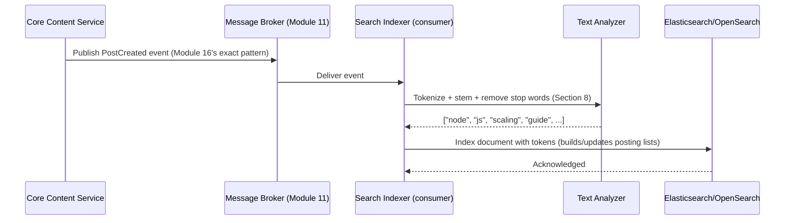
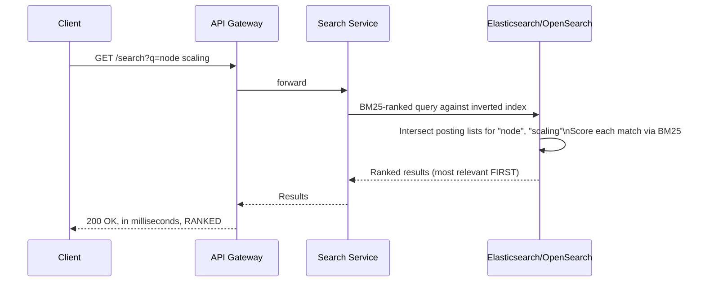
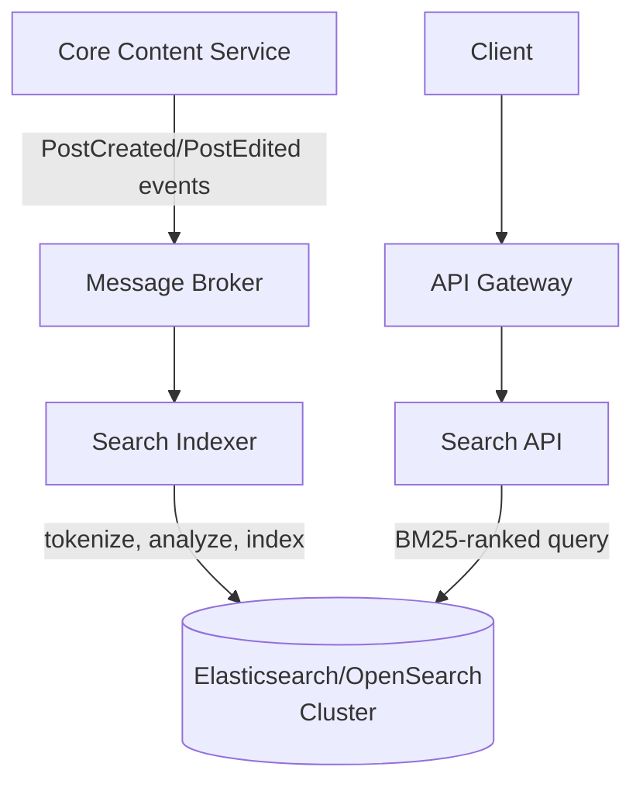
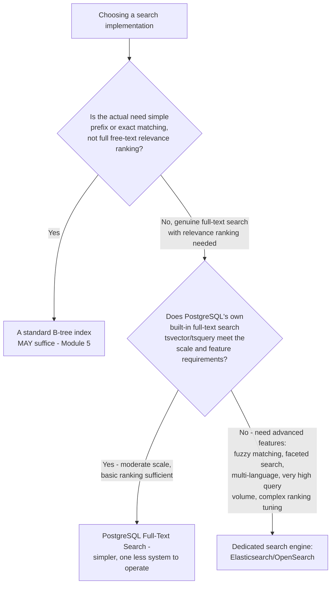
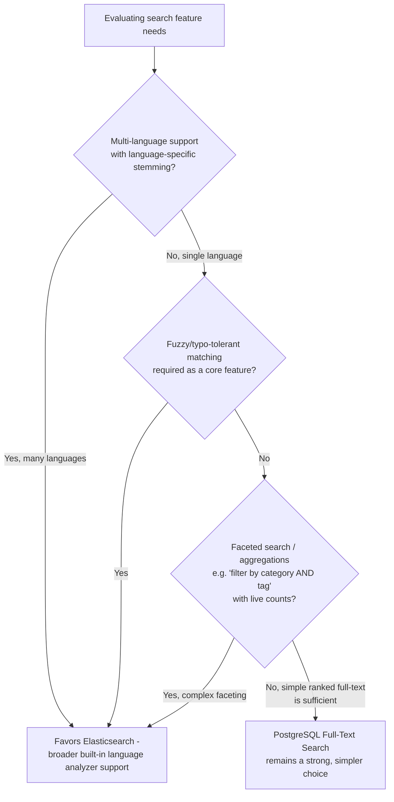
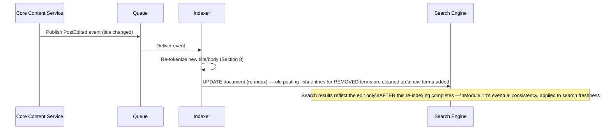
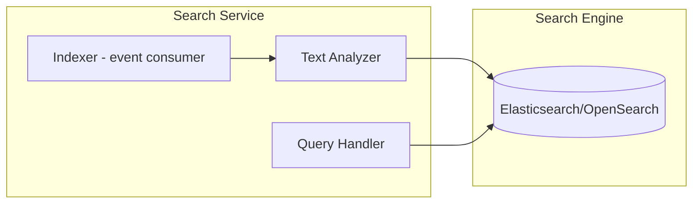
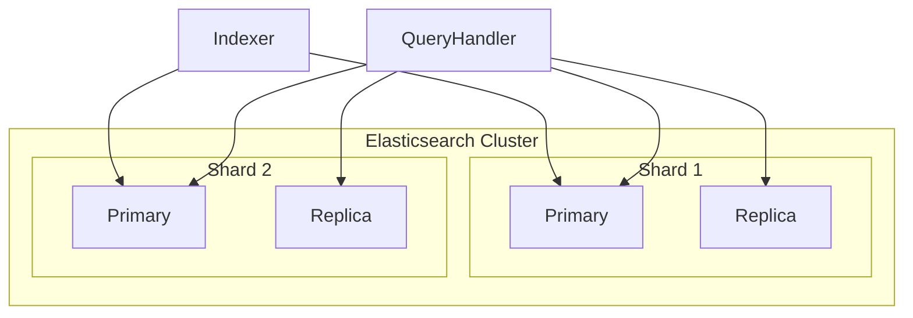

# Module 23 — Search Systems

> **Masterclass:** System Design Masterclass (30 Modules)
> **Level:** Advanced
> **Audience:** Node.js backend developers, SDE‑2 / Senior Backend interview candidates, engineers transitioning into architecture roles
> **Prerequisite:** Modules 1–22 (System Design Intro through Distributed Locking)

---

## 1. Introduction

Since Module 9, the "Search Service" has been a named box in nearly every diagram — receiving `PostCreated` events (Module 16, 17), sitting behind path-based gateway routing (Module 9), owning its own denormalized read model (Module 16, Section 20) — without ever explaining what actually happens inside it. This module finally opens that box: **full-text search**, **inverted indexes**, **relevance ranking**, and the real architectural choice between building this on Elasticsearch/OpenSearch versus attempting it with a relational database's `LIKE` operator.

This module's central technical revelation: search is not "a database query that happens to use `ILIKE '%term%'`" — it's a fundamentally different data structure and algorithm, and understanding *why* `LIKE` fails at real scale is what makes the case for a dedicated search system rigorous rather than assumed.

---

## 2. Learning Objectives

By the end of this module, you will be able to:

1. Explain precisely **why `LIKE '%term%'` queries fail to scale** for full-text search, at the algorithmic level.
2. Explain the **inverted index** data structure and how it makes full-text search fast.
3. Explain **tokenization, stemming, and stop-word removal** and how they transform raw text into searchable terms.
4. Explain **relevance ranking** — TF-IDF and BM25 — and why "contains the word" is insufficient for useful search results.
5. Design the **indexing pipeline** connecting a source-of-truth database (Module 16's Core Content) to a search index, including the freshness trade-offs involved.
6. Explain **Elasticsearch/OpenSearch's** architecture at a conceptual level — shards, replicas — connecting directly to Module 15's sharding lessons.
7. Choose between PostgreSQL full-text search and a dedicated search engine, based on genuine scale and feature requirements rather than default preference.

---

## 3. Why This Concept Exists

Every module treating "search" as a black box has quietly relied on the assumption that finding posts matching a query is just another kind of database read. It isn't. A relational database's B-tree index (Module 5, Section 8) is built for **exact-match or range queries on structured, ordered values** — `WHERE id = 42` or `WHERE created_at > '2026-01-01'`. It is fundamentally unsuited to answering "find every document containing the *words* 'node' and 'scaling' in *any order*, ranked by *relevance*" — a question about **unstructured, unordered text content**, not a value comparable to a B-tree's ordering.

Search systems exist because this is a genuinely different computational problem, requiring a genuinely different data structure (the inverted index) and a genuinely different notion of a "match" (relevance ranking, not boolean containment). Recognizing this — rather than reaching for `WHERE title LIKE '%query%'` and being surprised when it becomes catastrophically slow at scale — is precisely the system design maturity this module builds.

---

## 4. Problem Statement

> Our blog platform's Search Service (Modules 9, 16) currently uses `SELECT * FROM posts WHERE title ILIKE '%' || $1 || '%' OR body ILIKE '%' || $1 || '%'` against PostgreSQL. At 500,000 posts, this query now takes 8 seconds — unacceptable against Module 1's latency expectations — and results are returned in arbitrary database order, with no notion of which matches are more relevant. Diagnose precisely why this query is slow at the algorithmic level, and design the correct architecture — including whether PostgreSQL's own full-text search capabilities suffice, or a dedicated search engine (Elasticsearch/OpenSearch) is genuinely warranted.

---

## 5. Real-World Analogy

**A `LIKE '%term%'` query is searching for a phrase in a book by reading every single page from cover to cover, every single time someone asks.** There's no shortcut — the database must scan every row's text content character-by-character (a "leading wildcard" pattern like `%term%` cannot use a standard B-tree index at all, Section 8 explains precisely why) looking for the substring, exactly like manually flipping through 500,000 book pages for every search request.

**An inverted index is the book's own index at the back — "scaling: pages 42, 108, 301; node: pages 12, 42, 89, 301" — built once, in advance, so finding every page mentioning "scaling" is an instant lookup, not a page-by-page scan.** This is the entire, foundational trick behind every fast search system ever built: **invert** the natural document-to-words relationship into a words-to-documents relationship, precomputed once at indexing time, so that query time is a fast lookup rather than a full scan.

**Relevance ranking is the difference between the index simply listing every page mentioning "scaling" versus a librarian who's also read every book and can tell you which of those 50 matching pages is actually the most *useful*, *central* discussion of the topic, versus a page where "scaling" appears once, in passing, in an unrelated context.** Section 4's original query has no equivalent to this librarian at all — it returns matches in arbitrary order, exactly the gap this module's ranking algorithms (TF-IDF, BM25) exist to fill.

---

## 6. Technical Definition

**Inverted Index:** A data structure mapping each unique term (word) to a list of the documents (and often positions within them) containing that term — the inverse of the natural "document contains these words" relationship, enabling fast term-based lookup.

**Tokenization:** The process of splitting raw text into individual searchable units (tokens/terms), typically words, as a prerequisite step before building or querying an inverted index.

**Stemming/Lemmatization:** Reducing words to a common root form (e.g., "running," "runs," "ran" → "run") so that searches match grammatical variants of a word, not just its exact form.

**TF-IDF (Term Frequency–Inverse Document Frequency):** A relevance scoring formula weighting a term's importance to a specific document higher when it appears frequently in that document (Term Frequency) but rarely across the entire document collection (Inverse Document Frequency) — common words like "the" score low; distinctive, topic-specific words score high.

**BM25 (Best Match 25):** A refined, industry-standard relevance ranking algorithm building on TF-IDF's principles, additionally accounting for document length normalization and diminishing returns from repeated term occurrences — the default ranking algorithm in Elasticsearch/OpenSearch.

---

## 7. Core Terminology

| Term | Precise Definition | One-line Intuition |
|---|---|---|
| **Stop Words** | Extremely common words (the, a, is, and) typically excluded from indexing since they carry little distinguishing meaning | "Words too common to be useful search signals" |
| **Analyzer** | The complete pipeline (tokenizer + filters like stemming/stop-word removal) transforming raw text into indexed terms | "The recipe for turning a sentence into searchable tokens" |
| **Posting List** | The list of document IDs (and metadata) associated with a single term in an inverted index | "One index entry's full list of matching pages" |
| **Shard (search context)** | A horizontal partition of the search index, directly extending Module 15's sharding concept to search-specific storage | "One drawer of the search index's filing cabinet" |
| **Boolean Query** | A search query combining terms with AND/OR/NOT logic | "Must contain X, and either Y or Z, but not W" |
| **Fuzzy Matching** | Matching terms that are similar but not identical to the query (handling typos), typically via edit-distance algorithms | "Finding 'nodejs' when the user typed 'noedjs'" |

---

## 8. Internal Working

### Why `LIKE '%term%'` is algorithmically incapable of using a standard index, precisely

Recall Module 5, Section 8's B-tree explanation: a B-tree index works by maintaining values in **sorted order**, enabling binary-search-style narrowing (`O(log n)`). A B-tree on the `title` column can efficiently answer `WHERE title = 'exact value'` or `WHERE title LIKE 'prefix%'` (both can use the sorted order to narrow the search). But `WHERE title LIKE '%term%'` — a **leading wildcard** — asks "does this substring appear *anywhere* within the value," a question that has **no relationship to sorted order at all**: "Node.js Scaling Guide" and "A Complete Guide to Scaling" could sort very differently alphabetically while both containing "Guide," making the B-tree's sorted structure completely useless for this query shape. PostgreSQL is forced to fall back to a **sequential scan** — checking every single row's `title` and `body` columns character-by-character — precisely Section 4's `O(n)` behavior, which degrades linearly and predictably as the `posts` table grows, exactly matching the observed 8-second query at 500,000 rows.

### How the inverted index makes this fast, mechanically

```
Indexing time (done ONCE per document, not per search):
  Document 42: "Node.js Scaling Guide for Production Systems"
  → Tokenize: [node, js, scaling, guide, production, systems] (stop words removed)
  → For each token, ADD document 42 to that token's posting list

Resulting inverted index (conceptual):
  "scaling"    → [42, 108, 301, 512, ...]
  "node"       → [12, 42, 89, 301, ...]
  "production" → [42, 77, 301, ...]
```

**Query time, now a fast lookup instead of a scan:** searching for "node scaling" becomes: look up `"node"`'s posting list, look up `"scaling"`'s posting list, and **intersect** them (find document IDs present in both) — a fast set-intersection operation on **pre-computed, already-sorted lists**, fundamentally `O(matching documents)`, not `O(total documents)`. This is the precise, mechanical reason inverted-index-based search doesn't degrade as the total document count grows the way Section 4's sequential scan does — the query's cost scales with the *size of the relevant posting lists*, not the size of the entire dataset.

### Why relevance ranking (BM25) matters beyond simple boolean matching

Section 4's original query returns matches with **no notion of quality** — a post mentioning "scaling" once in a footnote ranks identically to a post whose entire title and first paragraph are about scaling. BM25 (Section 6) scores each match by combining:

1. **Term frequency** — how often "scaling" appears in *this specific* document (more occurrences → generally more relevant, with diminishing returns to avoid rewarding simple word-stuffing).
2. **Inverse document frequency** — how rare "scaling" is across the *entire* collection (a term appearing in every single document, like "the," provides no distinguishing signal and is weighted near zero).
3. **Document length normalization** — a short document mentioning "scaling" 3 times is likely more focused on the topic than a very long document mentioning it 3 times among thousands of other words.

**This is precisely the "librarian" from Section 5's analogy, formalized into a computable, consistent scoring function** — and it's the specific, concrete capability entirely absent from Section 4's `ILIKE`-based query, which cannot express "how relevant" at all, only "matches or doesn't."

---

## 9. Request Lifecycle

### Mermaid Sequence Diagram — Indexing Pipeline (Connecting Module 16/17's Event-Driven Pattern to Search-Specific Processing)



**Step-by-step explanation, directly reusing Module 16's exact choreography pattern:** notice this is **precisely** the same event-consumption architecture Module 16, Section 9 already established for the Search Service's denormalized read model — this module simply specifies *what actually happens* inside the "index this post" step, which was previously a black box.

### Mermaid Sequence Diagram — Query-Time Search, Resolving Section 4



**Why this directly resolves Section 4's two complaints simultaneously:** the query is now a fast posting-list intersection (not a sequential scan — resolving the 8-second latency) **and** results arrive pre-ranked by BM25 relevance (resolving the "arbitrary order" complaint) — both problems traced to the same root cause (using the wrong data structure and algorithm for this specific kind of query) and both resolved by the same architectural fix.

---

## 10. Architecture Overview



**HLD-level insight, directly connecting to Module 16's Database-per-Service principle:** notice Elasticsearch/OpenSearch is the Search Service's **own, exclusively-owned data store** — Core Content never queries it directly, and Search Service never queries Core Content's database directly; the *only* connection between them is the event stream, exactly Module 16's Database-per-Service boundary, now shown with the *specific* technology (a dedicated search engine, not a second PostgreSQL instance) that the Search Service's genuinely distinct data-structure needs (Section 8) actually warrant.

---

## 11. Capacity Estimation

**Scenario:** Estimating the indexing throughput and storage needed for our search index, given established platform figures.

**Given:** 10,000 new posts/day (Module 1), average post length ~2,000 words, and an inverted index typically requiring roughly 30-40% of the original text size in index storage (a reasonable rule of thumb for a well-tuned analyzer).

**Step 1 — Daily indexing volume:**
```
10,000 posts/day × 2,000 words ≈ 20 million tokens/day to process through the analyzer pipeline
```

**Step 2 — Index storage growth:**
```
Assume 2,000 words × ~6 bytes/word average ≈ 12 KB raw text per post
10,000 posts/day × 12 KB × 0.35 (index overhead ratio) ≈ 42 MB/day ≈ 15 GB/year
```

**Conclusion, directly informing the PostgreSQL-vs-dedicated-engine decision (Section 12):** 15 GB/year is entirely modest — this number alone doesn't force the decision toward Elasticsearch; the decision is driven by **query latency and ranking quality requirements** (Section 4's actual complaints), not raw storage volume. This is an important, precise point: don't justify a dedicated search engine purely on data volume grounds when the real driver is algorithmic capability (inverted index + BM25) that PostgreSQL's `LIKE` genuinely lacks, regardless of how small the dataset is.

---

## 12. High-Level Design (HLD)



**HLD-level insight:** this decision flow directly corrects a common industry over-reach — **PostgreSQL's built-in full-text search (`tsvector`/`tsquery`) is itself inverted-index-based** (Section 8's exact data structure, implemented natively within PostgreSQL) and is a genuinely legitimate, simpler alternative to a full Elasticsearch deployment for many real workloads — reaching for a dedicated search engine should be justified by specific, unmet feature or scale requirements (Section 30 elaborates), not assumed as the only "real" way to do search.

---

## 13. Low-Level Design (LLD)

### PostgreSQL's native full-text search (the "Branch E" alternative, shown concretely)

```sql
ALTER TABLE posts ADD COLUMN search_vector tsvector;

UPDATE posts SET search_vector = to_tsvector('english', title || ' ' || body);

CREATE INDEX idx_posts_search ON posts USING GIN(search_vector); -- inverted-index-backed, Section 8's structure

-- Query with ranking, directly analogous to Elasticsearch's BM25 (Section 6)
SELECT id, title, ts_rank(search_vector, query) AS relevance
FROM posts, to_tsquery('english', 'node & scaling') query
WHERE search_vector @@ query
ORDER BY relevance DESC
LIMIT 20;
```

**Why this is a legitimate, working solution to Section 4's exact problem, without introducing Elasticsearch at all:** `to_tsvector` performs Section 8's exact tokenization/stemming pipeline (PostgreSQL's `'english'` configuration includes stop-word removal and stemming natively), the `GIN` index is a genuine inverted-index data structure (not a sequential scan), and `ts_rank` provides real relevance scoring — this query will be **dramatically** faster than Section 4's `ILIKE` version, and for many real-world scales, this is the **complete, sufficient fix**, without any need for a separate search engine or Module 16's event-driven indexing pipeline at all.

### Elasticsearch query (the "Branch F" alternative, for comparison)

```javascript
const result = await esClient.search({
  index: 'posts',
  body: {
    query: {
      multi_match: {
        query: 'node scaling',
        fields: ['title^2', 'body'], // title weighted 2x more heavily than body
        fuzziness: 'AUTO', // handles typos, Section 7's fuzzy matching
      },
    },
  },
});
```

**Why `fields: ['title^2', 'body']` and `fuzziness: 'AUTO'` represent genuine capability beyond Section 13's PostgreSQL version:** field-weighting (title matches count more than body matches) and built-in typo tolerance are real, meaningfully more sophisticated features than PostgreSQL's native full-text search readily provides — this is precisely the kind of *specific, concrete feature gap* that should justify Branch F's added operational complexity, rather than a vague sense that "Elasticsearch is what real search looks like."

---

## 14. ASCII Diagrams

```
SEQUENTIAL SCAN (Section 4's broken approach)     INVERTED INDEX LOOKUP (the fix)

  Query: "scaling"                                  Query: "scaling"
    │                                                   │
    ▼                                                   ▼
  Check row 1: does title/body contain "scaling"?    Look up "scaling" in the index
    │  NO → next row                                    │
  Check row 2: ...                                    Posting list: [42, 108, 301, ...]
    │  NO → next row                                    │
  Check row 3: ...                                    DONE — no scanning required
    │  ... (continues for ALL 500,000 rows)
  O(n) — degrades LINEARLY with dataset size         O(matching documents) — scales with
                                                       RESULT size, not TOTAL dataset size
```

---

## 15. Mermaid Flowcharts

*(Section 12 covers the canonical PostgreSQL-vs-dedicated-engine decision flow for this module.)*

### Decision Flow: Which Text Analysis Features Are Actually Needed?



---

## 16. Mermaid Sequence Diagrams

*(Section 9 covers the two canonical sequence diagrams for this module. Additional diagram below.)*

### Handling an Edit — Re-Indexing, Directly Extending Module 16/17's Event Pattern



**Why this directly connects to Module 14:** search index freshness is a **direct instance** of Module 14's eventual consistency spectrum — a user editing their post's title won't see the updated title reflected in *search results* the instant they save (though it appears immediately via Core Content's own read model, per Module 16) until the indexing pipeline catches up; this staleness window is a genuine, quantifiable trade-off (Module 14, Section 11's exact methodology) worth measuring and communicating, not an unexamined side effect.

---

## 17. Component Diagrams



**Why `Analyzer` is a distinct, reusable component shared by both indexing and querying paths:** the **same** tokenization/stemming logic must be applied consistently at both index time (Section 9's first diagram) and query time (searching for "running" must be stemmed to "run" exactly as "running" was stemmed when indexed) — a mismatch between the two analyzer configurations is a subtle, real bug class where perfectly valid search terms silently fail to match documents that logically should, precisely because the indexing and querying pipelines tokenized text differently.

---

## 18. Deployment Diagrams



**Deployment-level note, directly extending Module 15's sharding lesson to search infrastructure specifically:** Elasticsearch's own architecture **is** Module 15's sharding and replication pattern, applied natively to the inverted index — the total index is split into shards (each an independent Lucene index) for write/storage scaling, and each shard has replicas for read scaling and durability, exactly mirroring Module 15's dual "sharding solves write/storage, replication solves read/durability" lesson, now shown as the actual, built-in architecture of the search engine itself, not a pattern you'd need to build manually on top of it.

---

## 19. Network Diagrams

The Search Service and its Elasticsearch cluster follow Module 3's standard private-subnet isolation, with Module 16's Database-per-Service boundary directly enforced: **only the Search Service's own components (Indexer, Query Handler) have network access to the Elasticsearch cluster** — Core Content, Notification, and Recommendation services have no route to it at all, exactly Module 16, Section 19's network-level enforcement, now applied to this specific data store.

---

## 20. Database Design

Search index "schema" design (Elasticsearch mappings) is conceptually similar to Module 5's schema design but with search-specific considerations:

```javascript
const postMapping = {
  properties: {
    title: { type: 'text', analyzer: 'english' }, // full-text searchable, stemmed
    body: { type: 'text', analyzer: 'english' },
    authorId: { type: 'keyword' }, // EXACT match only, NOT tokenized — for filtering, not searching
    publishedAt: { type: 'date' }, // for range queries and sorting, not full-text search
    tags: { type: 'keyword' }, // exact-match facet field
  },
};
```

**Why `authorId` and `tags` are `keyword` type, not `text`:** this is a precise, important distinction — `text` fields go through Section 8's full tokenization/analysis pipeline (appropriate for `title`/`body`, where you want to search for individual words within them); `keyword` fields are indexed as **exact, whole values** (appropriate for filtering — "show only posts by author X" — where partial or fuzzy matching would be actively wrong behavior). Conflating these two field types is a common, real mapping mistake that produces either overly-loose or overly-strict matching behavior.

---

## 21. API Design

```
GET /search?q=node+scaling&filter[author]=user123&sort=relevance
GET /search?q=node+scaling&sort=date  → override default relevance ranking with recency
```

**Why supporting an explicit `sort` parameter matters:** relevance ranking (BM25, Section 8) is usually the right *default*, but not always what a user wants — "show me the newest posts about X" is a legitimate, different query than "show me the most relevant posts about X," and a well-designed search API should let the client choose, rather than only ever returning one fixed ordering.

---

## 22. Scalability Considerations

| Consideration | PostgreSQL Full-Text Search | Elasticsearch/OpenSearch |
|---|---|---|
| Query throughput ceiling | Bound by the same database instance serving transactional traffic (Module 5) — competes for resources | Dedicated, independently-scaled cluster (Module 16's independent-scaling benefit) |
| Horizontal scaling | Requires the same sharding/replication techniques as any PostgreSQL data (Module 15) | Native, built-in sharding and replication (Section 18) |
| Advanced ranking tuning | Limited, coarser control | Fine-grained control over scoring, boosting, custom analyzers |
| Operational overhead | Lower — one less system to run | Higher — a genuinely separate, stateful system to operate and monitor |

---

## 23. Reliability & Fault Tolerance

- **Search index staleness (Section 16) should have a defined, monitored bound** — directly extending Module 14's replication-lag monitoring lesson to indexing lag specifically; an indexing pipeline silently falling behind (Module 11's consumer-lag concept) produces a subtle, easy-to-miss "search results are outdated" symptom.
- **The search index can always be fully rebuilt by replaying Core Content's data** (or, if using Module 17's event sourcing, replaying the event log) — this is a genuine, valuable reliability property: a corrupted or lost search index is *recoverable*, not catastrophic, precisely because Core Content remains the true source of truth and the search index is, by Module 16's Database-per-Service design, a derived, rebuildable projection.
- **Elasticsearch cluster health (shard allocation, replica status) must be actively monitored** — an under-replicated or unbalanced cluster (Section 18) has reduced fault tolerance even if it appears to be serving queries correctly in the moment.

---

## 24. Security Considerations

- **Search results must respect the same authorization boundaries as the underlying data** (Module 20's authorization principle) — if a post can be restricted to certain viewers, the search index and query logic must enforce this too, not merely rely on the fact that Core Content's own API enforces it, since the search index is a separate, independently-queryable copy of the data.
- **Query input must be validated/sanitized** even though Elasticsearch's query DSL isn't vulnerable to traditional SQL injection (Module 5) — a related class of injection risk exists if user input is unsafely concatenated into raw query strings rather than using parameterized query builders, echoing Module 20's WAF-and-input-validation discipline in a search-specific context.

---

## 25. Performance Optimization

- **Weight fields appropriately** (Section 13's `title^2` example) to match actual relevance intuition — a match in the title is usually more significant than the same match buried in a long body, and this should be reflected in scoring, not left to default, undifferentiated weighting.
- **Cache frequent or expensive queries** (Module 7's caching principles, directly applicable here) — a trending search term queried thousands of times per minute benefits from the same cache-aside pattern as any other hot, read-heavy data.
- **Tune shard count deliberately** (Module 15's sharding-key-selection discipline, applied to Elasticsearch specifically) — too many shards for a modest dataset adds unnecessary per-query coordination overhead; too few limits horizontal scaling headroom.

---

## 26. Monitoring & Observability

Directly extending Module 19's framework to search-specific signals:

- **Indexing lag** (event published → document searchable) — the search-specific instance of Module 14's staleness-window monitoring.
- **Query latency percentiles (p50/p95/p99)** — directly validating whether Section 4's original 8-second problem is genuinely resolved, with real, measured numbers, not just an assumption that "using Elasticsearch fixed it."
- **Zero-result query rate** — a rising rate of searches returning no results at all is a valuable, often-overlooked product signal (are users searching for something the index genuinely lacks, or is there a tokenization/analyzer mismatch, Section 17's exact failure mode, silently causing valid matches to be missed).

---

## 27. Common Bottlenecks

| Bottleneck | Symptom | Root Cause |
|---|---|---|
| Sequential scan on `LIKE '%term%'` | Query latency grows linearly with table size (Section 4's exact incident) | Leading-wildcard pattern cannot use a standard B-tree index (Section 8) |
| Indexing lag under high write volume | Search results noticeably stale after a burst of new posts | Indexer consumer under-provisioned relative to publish rate (Module 11's consumer-scaling lesson) |
| Analyzer mismatch between index and query time | Valid search terms return zero results unexpectedly | Different tokenization/stemming configuration applied at index vs. query time (Section 17) |
| Unbalanced shard allocation | Some queries slow, others fast, inconsistent latency | Poor shard count/sizing decision (Section 25), directly echoing Module 15's hot-shard lesson |
| Over-adoption of a dedicated search engine for simple needs | Unnecessary operational overhead, two systems to maintain | PostgreSQL Full-Text Search would have sufficed (Section 12's Branch E), but Elasticsearch was adopted by default |

---

## 28. Trade-off Analysis

> "I chose **PostgreSQL's native full-text search (`tsvector`/`GIN` index)** over deploying Elasticsearch, optimizing for **operational simplicity — one fewer stateful system to run, monitor, and scale**, at the cost of **less sophisticated ranking tuning, fuzzy matching, and faceted search capability**, which is acceptable because our current requirements (Section 4's core complaint: slow, unranked results) are fully resolved by PostgreSQL's built-in inverted-index and `ts_rank` capabilities, without needing Elasticsearch's more advanced, but currently unneeded, feature set."

> "I chose to **decouple the Search Service's index from Core Content via asynchronous events** (Module 16/17's pattern) rather than synchronously updating the search index within the same transaction as a post edit, optimizing for **Core Content's write-path latency remaining unaffected by search-indexing cost**, at the cost of **a measurable, monitored staleness window (Section 16/23) before edits are reflected in search results**, which is acceptable because near-immediate (not instantaneous) search freshness is a reasonable, common trade-off for this kind of content."

---

## 29. Anti-patterns & Common Mistakes

1. **Using `LIKE '%term%'` for full-text search at any meaningful scale** — Section 4's precise, motivating incident, and one of the most common real-world performance anti-patterns in systems that "grew into" needing real search without revisiting the original approach.
2. **Adopting Elasticsearch by default, without checking whether PostgreSQL's native full-text search would suffice** (Section 12's decision flow) — unjustified operational complexity, directly echoing this course's repeated premature-complexity warnings.
3. **Inconsistent analyzer configuration between indexing and query time** (Section 17) — a subtle, hard-to-diagnose bug class causing valid searches to silently return no results.
4. **No monitoring of indexing lag**, leaving search staleness invisible until users notice and report it (Section 26).
5. **Treating relevance ranking as unnecessary "polish"** rather than a core correctness requirement — Section 4's "arbitrary order" complaint is a genuine usability failure, not a minor cosmetic gap.
6. **Search index not enforcing the same authorization rules as the source data** (Section 24), potentially leaking restricted content through search results even though the primary API correctly restricts it.

---

## 30. Production Best Practices

- **Never use leading-wildcard `LIKE` queries for full-text search at scale** — recognize this pattern immediately as a sequential-scan anti-pattern, regardless of dataset size, since the *degradation curve* is the real problem, not just today's specific latency number.
- **Start with PostgreSQL's native full-text search** for moderate-scale, single-language, ranking-sufficient needs, and only adopt a dedicated search engine when a **specific, named feature gap** (fuzzy matching, faceting, multi-language, extreme query volume) genuinely requires it.
- **Keep indexing and query-time analyzer configuration in sync**, ideally defined once and shared/versioned rather than duplicated across two separate code paths.
- **Monitor indexing lag and query latency percentiles** as first-class, dedicated search-system metrics.
- **Enforce the same authorization boundaries in search results as in the primary data API** — never assume the search index is exempt from access-control requirements.
- **Design the indexing pipeline to be fully rebuildable** from the source-of-truth data, treating the search index as a derived, recoverable projection, not irreplaceable primary data.

---

## 31. Real-World Examples

- **Elasticsearch's own architecture and documentation** explicitly describe its sharding and replication model in terms directly mirroring Module 15's sharding lessons — a real, production search engine's actual internals, not a hypothetical, validating this module's Section 18 architectural mapping precisely.
- **GitHub's well-documented migration of code search infrastructure** (discussed in various GitHub engineering blog posts over the years) illustrates real-world grappling with exactly this module's core tension — balancing indexing freshness, query performance, and infrastructure cost at genuinely massive scale, a useful, citable real-world case study of this module's trade-offs playing out in practice.
- **Many real-world PostgreSQL-based applications** (including numerous documented case studies from companies at moderate-to-large scale) successfully rely on native full-text search for years before, if ever, needing to adopt a dedicated search engine — direct, real-world validation that Section 12's "PostgreSQL may suffice" branch is a genuinely common, correct outcome, not merely a theoretical fallback.

---

## 32. Node.js Implementation Examples

### A shared analyzer configuration, avoiding Section 17's index/query mismatch bug

```javascript
// shared-analyzer-config.js — imported by BOTH indexing and query code paths
const STOP_WORDS = new Set(['the', 'a', 'an', 'is', 'and', 'or', 'of', 'in', 'to']);

function analyze(text) {
  return text
    .toLowerCase()
    .split(/\W+/)
    .filter(token => token.length > 0 && !STOP_WORDS.has(token))
    .map(stem); // a real implementation would use a proper stemming library (e.g., 'natural')
}

function stem(word) {
  // simplified illustrative stemmer — a real system uses a library like Porter/Snowball stemming
  return word.replace(/(ing|ed|s)$/, '');
}

module.exports = { analyze };
```

```javascript
// indexer.js
const { analyze } = require('./shared-analyzer-config');
async function indexPost(post) {
  const tokens = analyze(`${post.title} ${post.body}`);
  await esClient.index({ index: 'posts', id: post.id, body: { ...post, tokens } });
}

// queryHandler.js — imports the SAME analyze() function, guaranteeing consistency
const { analyze } = require('./shared-analyzer-config');
async function search(query) {
  const queryTokens = analyze(query); // identical tokenization logic as indexing
  return esClient.search({ index: 'posts', body: { query: { terms: { tokens: queryTokens } } } });
}
```

**Why sharing one `analyze()` function between both files is the concrete fix for Section 17's exact bug class:** if `indexer.js` and `queryHandler.js` each implemented their *own*, separately-written tokenization logic, any future change to one (adding a new stop word, fixing a stemming rule) risks silently diverging from the other — guaranteeing consistency by construction, not by discipline, is the same principle this course has repeatedly applied (Modules 1, 5, 9, 16, 19) to isolate what changes from what stays stable.

---

## 33. Interview Questions

### Easy
1. Why is `LIKE '%term%'` unable to use a standard B-tree index?
2. What is an inverted index, and how does it make search fast?
3. What is the difference between tokenization and stemming?
4. What is TF-IDF, and what problem does it solve that simple keyword matching doesn't?
5. When might PostgreSQL's native full-text search be sufficient, without needing Elasticsearch?
6. Why must the same analyzer configuration be used at both indexing and query time?

### Medium
7. Explain precisely why `WHERE title LIKE '%term%'` forces a sequential scan, while `WHERE title LIKE 'term%'` (no leading wildcard) can still use a B-tree index.
8. Design an inverted index structure for a small, 5-document collection, showing the resulting posting lists for at least 3 terms.
9. Explain BM25's three main scoring factors and why each contributes to better relevance than simple term-frequency counting alone.
10. Why does decoupling the search index from the source-of-truth database via asynchronous events (Module 16/17) introduce a staleness trade-off, and how would you measure and communicate it?
11. Design the field-mapping strategy for a search index needing both full-text search (title, body) and exact-match filtering (author, category).
12. Explain why Elasticsearch's sharding and replication architecture directly mirrors Module 15's database sharding lessons.

### Hard
13. Design a complete search system architecture for an e-commerce product catalog, addressing indexing pipeline, field weighting, faceted search, and freshness requirements.
14. A search feature returns zero results for a query the user is certain should match existing content. Diagnose the most likely root causes using this module's concepts, in priority order.
15. Explain, with a worked example, how BM25's document-length normalization prevents a very long document from unfairly dominating rankings purely due to having more opportunities to mention a term.
16. Design a strategy for keeping a search index's authorization boundaries synchronized with the source-of-truth data's access-control rules, addressing what happens when a previously-public post becomes restricted.
17. Discuss the trade-offs of rebuilding an entire search index from scratch (replaying all historical data) versus incrementally repairing a suspected-corrupted subset, and propose criteria for choosing between them during an incident.

---

## 34. Scenario-Based Design Questions

1. **Scenario:** Reproduce and resolve Module 23's exact Section 4 incident: an 8-second `ILIKE` search query at 500,000 rows. Walk through both the PostgreSQL full-text search fix and the Elasticsearch alternative, and justify which you'd choose for this specific platform's scale.
2. **Scenario:** Users report that searching for "running" doesn't return posts containing the word "run," even though intuitively it should. Diagnose using this module's tokenization/stemming concepts.
3. **Scenario:** Your search index shows posts that were deleted from Core Content over a week ago. Diagnose the likely root cause and propose a fix.
4. **Scenario:** A search feature for a multi-tenant SaaS platform must ensure Tenant A never sees Tenant B's documents in search results, even if both tenants happen to search for the same term. Design the authorization-aware search architecture.
5. **Scenario:** Your team is debating whether to add Elasticsearch to a system currently at 50,000 documents with simple search needs. Walk through your recommendation using Section 12's decision framework.
6. **Scenario:** A search query for "node.js scaling guide" returns a result where "guide" appears once, in an unrelated context, ranked above a result that's substantively about the topic. Diagnose using BM25 concepts and propose a tuning fix.
7. **Scenario:** Your indexing pipeline has fallen 20 minutes behind during a traffic spike, and users are complaining that just-published posts don't appear in search. Propose both an immediate mitigation and a longer-term scaling fix.
8. **Scenario:** An interviewer asks you to design search for a job listings platform, needing both full-text search AND faceted filtering (location, salary range, job type) with live result counts per facet. Discuss why this specific requirement set pushes toward Elasticsearch over PostgreSQL's native full-text search.
9. **Scenario:** A security review discovers that your search index contains full document content for posts that are supposed to be restricted to premium subscribers only, and this content is retrievable via a crafted search query. Diagnose and propose the fix.
10. **Scenario:** You need to migrate from PostgreSQL full-text search to Elasticsearch without downtime or search functionality gaps. Design the migration strategy, including how you'd validate the new system's ranking behaves acceptably before fully cutting over.

---

## 35. Hands-on Exercises

1. Create a PostgreSQL table with 100,000+ synthetic rows of text content, run a `LIKE '%term%'` query and measure its latency, then add a `tsvector`/GIN index and measure the latency improvement empirically.
2. Implement a simple, from-scratch inverted index in Node.js (a JavaScript object mapping terms to arrays of document IDs) for a small set of sample documents, and implement a basic AND-query (intersection of posting lists) against it.
3. Implement a simplified TF-IDF scoring function from scratch, and rank a small set of sample documents against a test query, verifying the scores match your manual expectations of relevance.
4. Set up a local Elasticsearch or OpenSearch instance (via Docker), index a small set of sample blog posts, and run both a simple `match` query and a `multi_match` query with field weighting, comparing the resulting ranking order.
5. Deliberately misconfigure your indexing and query-time analyzers to differ (e.g., different stop-word lists), reproduce Section 17's exact bug (a valid search returning zero results), then fix it using the shared-analyzer pattern from Section 32.

---

## 36. Mini Project

**Build:** A correct, ranked full-text search feature for the blog platform, directly resolving Module 23's Section 4 incident.

**Requirements:**
- Implement PostgreSQL native full-text search (`tsvector`, GIN index, `ts_rank`) for the `posts` table (Section 13).
- Measure and document the latency improvement compared to the original `ILIKE` query, at a realistic dataset size (100,000+ rows).
- Implement field weighting (title matches ranked higher than body matches) using PostgreSQL's `setweight()` function or equivalent.
- Add a `sort` query parameter allowing clients to choose between relevance ranking and recency ordering (Section 21).

**Success criteria:** Your search endpoint returns results in well under 100ms at 100,000+ rows (versus the original multi-second `ILIKE` query), with title matches correctly ranked above body-only matches, and clients can explicitly choose sort order.

---

## 37. Advanced Project

**Build:** Extend the Mini Project with a full Elasticsearch-based implementation and an event-driven indexing pipeline, directly connecting to Module 16/17's architecture.

1. Set up Elasticsearch/OpenSearch, define a proper field mapping (Section 20) distinguishing `text` and `keyword` fields, and implement the shared-analyzer-consistency pattern (Section 32) between your indexing and query code.
2. Implement the full event-driven indexing pipeline (Section 9's first diagram) — Core Content publishes `PostCreated`/`PostEdited` events, a Search Indexer consumer processes them and updates Elasticsearch — reusing Module 11's idempotent-consumer pattern for safe redelivery handling.
3. Implement indexing-lag monitoring (Section 26), and simulate a traffic burst causing measurable lag, verifying your monitoring correctly surfaces the growing staleness window.
4. Write a comparative report measuring query latency, ranking quality (a subjective but documented assessment), and operational complexity between your Section 36 PostgreSQL implementation and this Elasticsearch implementation, concluding with a recommendation for which you'd deploy for the blog platform's actual, current scale — explicitly applying Section 12's decision framework with real, measured evidence rather than assumption.

**Success criteria:** You have a working, event-driven Elasticsearch indexing pipeline with demonstrated analyzer consistency, functioning indexing-lag monitoring with a simulated-burst validation, and a genuine, evidence-based comparative recommendation between the two approaches — setting up Module 24 (Recommendation Systems), which examines the next capability referenced throughout this masterclass (Module 16, 17's Recommendation Service) but never built: how collaborative filtering and content-based recommendation algorithms actually work.

---

## 38. Summary

- **`LIKE '%term%'` cannot use a standard B-tree index** — the leading wildcard makes the query fundamentally incompatible with sorted-order-based lookup, forcing an `O(n)` sequential scan that degrades linearly and predictably as data grows.
- **The inverted index** — mapping terms to the documents containing them, built once at indexing time — is the foundational data structure making fast, scalable full-text search possible, turning query time into a fast posting-list intersection rather than a full scan.
- **Tokenization, stemming, and stop-word removal** transform raw text into consistent, searchable terms — and this exact pipeline must be applied identically at both indexing and query time, or valid matches will silently fail.
- **BM25 (building on TF-IDF's principles)** provides genuine relevance ranking — term frequency, inverse document frequency, and length normalization combined — addressing the real usability gap that simple boolean matching leaves unaddressed.
- **PostgreSQL's native full-text search is a legitimate, often-sufficient alternative** to a dedicated search engine, itself built on an inverted index — the decision to adopt Elasticsearch should be driven by specific, named feature or scale requirements, not assumed by default.
- **Elasticsearch's own architecture directly mirrors Module 15's sharding and replication lessons**, applied natively to inverted-index storage.

---

## 39. Revision Notes

- `LIKE '%term%'` = leading wildcard = no B-tree index use = O(n) sequential scan, degrades linearly with data size
- Inverted index = term → list of documents containing it, built once, queried via fast posting-list intersection
- Tokenization + stemming + stop-word removal = the analyzer pipeline; MUST be identical at index AND query time
- TF-IDF/BM25 = relevance ranking: term frequency (in this doc) × inverse document frequency (across all docs) × length normalization
- PostgreSQL's tsvector/GIN = a genuine inverted index, natively — often sufficient before reaching for Elasticsearch
- Elasticsearch adoption should be justified by specific feature gaps (fuzzy matching, faceting, multi-language, extreme scale), not assumed by default
- Elasticsearch's shard/replica architecture = Module 15's sharding/replication, natively built into the search engine

---

## 40. One-Page Cheat Sheet

```
SYSTEM DESIGN — MODULE 23 CHEAT SHEET
─────────────────────────────────────
WHY LIKE '%term%' FAILS
  Leading wildcard → can't use sorted B-tree index → O(n) sequential scan
  Degrades LINEARLY as data grows — this is the core diagnosis to state precisely

INVERTED INDEX (the fix)
  term → [list of documents containing it]  (built ONCE, at index time)
  Query = fast posting-list INTERSECTION, not a full scan
  Scales with RESULT size, not TOTAL dataset size

ANALYZER PIPELINE (must be IDENTICAL at index AND query time)
  Tokenize → remove stop words → stem
  Mismatch here = valid searches silently return ZERO results

RELEVANCE RANKING
  TF-IDF: term frequency (in doc) × inverse document frequency (across all docs)
  BM25: TF-IDF + document-length normalization (industry standard, ES/OpenSearch default)

POSTGRESQL FULL-TEXT SEARCH vs ELASTICSEARCH
  PostgreSQL (tsvector/GIN) → simpler, often sufficient, genuine inverted index natively
  Elasticsearch → justified by SPECIFIC gaps: fuzzy match, faceting, multi-language, extreme scale
  → NEVER adopt Elasticsearch "by default" — justify it explicitly

GOLDEN RULE
  Search is a different DATA STRUCTURE problem, not "a database query with LIKE."
  Diagnose LIKE's failure at the algorithmic level before reaching for any fix.
```

---

## Key Takeaways

- The precise, algorithmic reason `LIKE '%term%'` fails at scale — its incompatibility with sorted-order B-tree indexing — is the single most important diagnostic fact in this module, and stating it correctly (not just "it's slow") is what separates genuine understanding from pattern-matching to "use Elasticsearch for search."
- The inverted index is the foundational trick behind every fast search system, including PostgreSQL's own native full-text search — recognizing this means the PostgreSQL-vs-Elasticsearch decision is genuinely about specific feature and scale requirements, not "real search" versus "fake search."
- Relevance ranking is a correctness requirement for a usable search feature, not an optional refinement — BM25's three factors (term frequency, inverse document frequency, length normalization) directly address the real usability gap Section 4's original, unranked query left completely unaddressed.

## 20 Practice Questions
*(See Section 33 — 6 Easy, 6 Medium, 5 Hard — plus 3 rapid-fire additions:)*
18. Why does a search index's staleness window represent a direct instance of Module 14's eventual consistency spectrum, rather than a search-specific new concept?
19. Why must exact-match filter fields (like an author ID) be mapped as `keyword`, not `text`, in a search engine's field mapping?
20. Why is a search index considered a "derived, rebuildable projection" rather than primary data, and why does this matter for reliability planning?

## 10 Scenario-Based Questions
*(See Section 34 in full.)*

## 5 Design Assignments
*(See Sections 36–37 — Mini Project and Advanced Project — plus:)*
1. Design a complete search architecture for a recipe website, addressing full-text search across ingredients/instructions plus faceted filtering by cuisine, dietary restriction, and cook time.
2. Write a one-page diagnostic runbook for "search returns zero results for a query that should match," covering every likely root cause from this module in priority order.
3. Propose a field-weighting and BM25-tuning strategy for a job-listings search feature, where job title matches should be weighted significantly higher than job description matches.

## Suggested Next Module

**→ Module 24: Recommendation Systems** — with full-text search now fully specified, we turn to the next referenced-but-unbuilt capability: how collaborative filtering, content-based filtering, and hybrid recommendation approaches actually generate "related posts" and "people you may know" style suggestions, completing the Recommendation Service architecture this course has assumed since Module 16.
