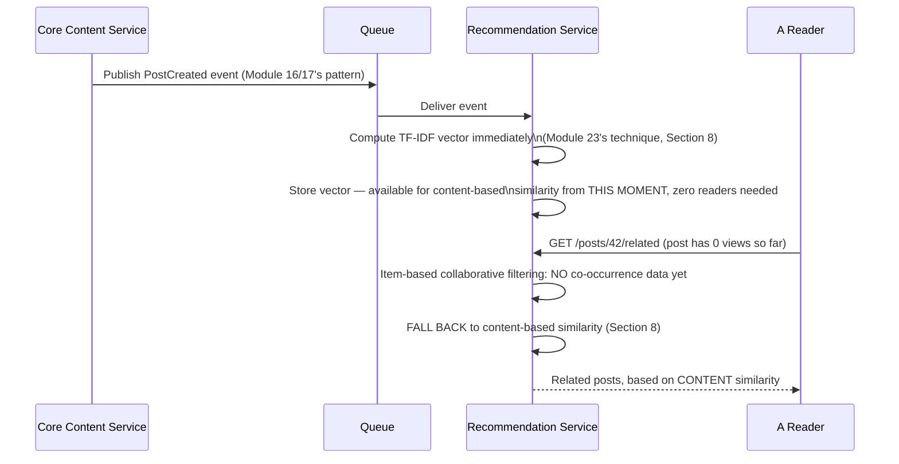
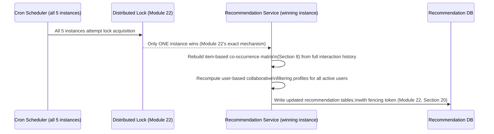
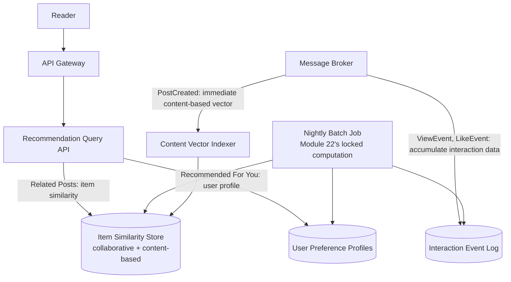
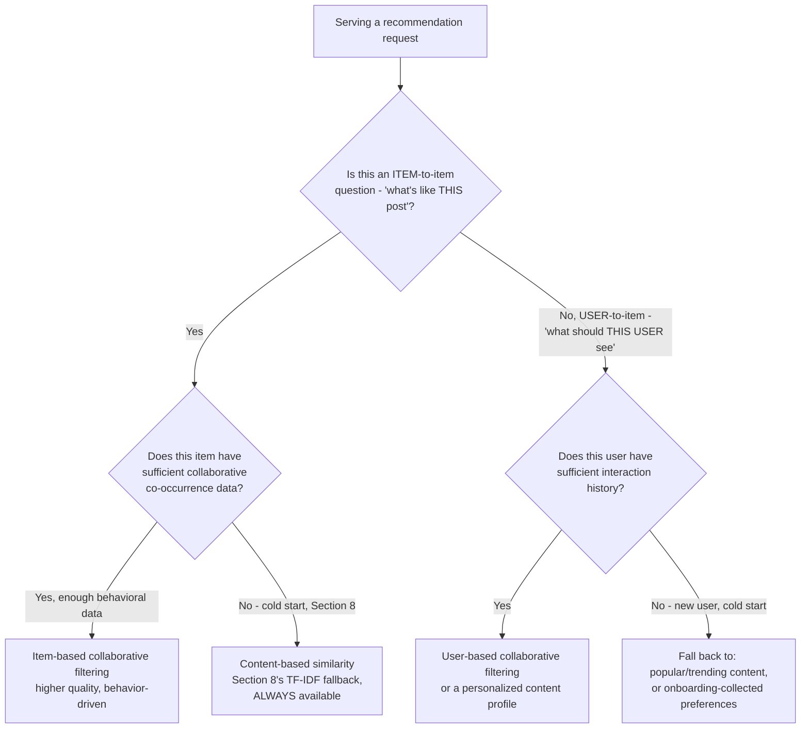
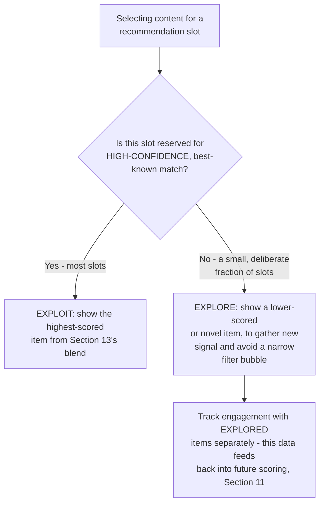
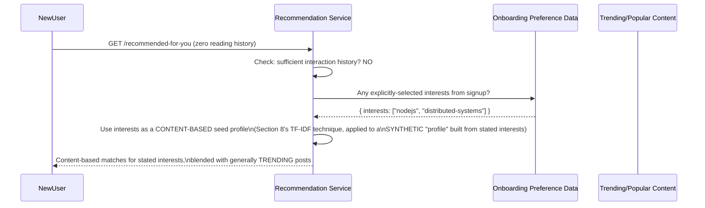
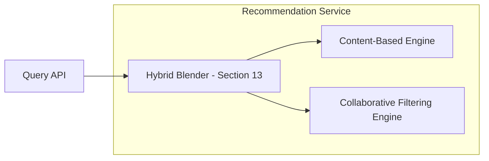
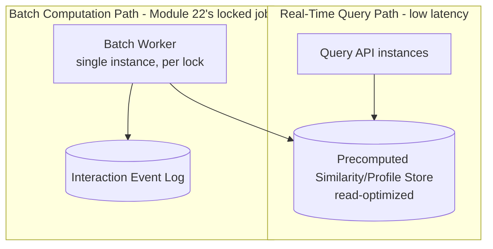

# Module 24 — Recommendation Systems

> **Masterclass:** System Design Masterclass (30 Modules)
> **Level:** Advanced
> **Audience:** Node.js backend developers, SDE‑2 / Senior Backend interview candidates, engineers transitioning into architecture roles
> **Prerequisite:** Modules 1–23 (System Design Intro through Search Systems)

---

## 1. Introduction

The Recommendation Service has appeared in diagrams since Module 16 — subscribing to `PostCreated` events, running periodic batch computation (Module 22's exact locking scenario), owning its own database — without ever explaining what it actually *computes*. This module opens that box: **collaborative filtering**, **content-based filtering**, and **hybrid approaches**, the three foundational strategies behind every "related posts," "people you may know," and "recommended for you" feature you've ever used.

This module's organizing distinction, which most engineers encountering recommendations for the first time miss: collaborative filtering and content-based filtering answer **fundamentally different questions** — "what did people *like you* engage with" versus "what is *similar in content* to what you already engaged with" — and most production recommendation systems succeed precisely by combining both, compensating for each one's specific, named weakness with the other's specific, named strength.

---

## 2. Learning Objectives

By the end of this module, you will be able to:

1. Explain **collaborative filtering** — both user-based and item-based — and the mathematical intuition behind similarity computation.
2. Explain **content-based filtering** and how it uses item attributes rather than other users' behavior.
3. Explain the **cold start problem** precisely, and why it affects collaborative and content-based filtering asymmetrically.
4. Explain **hybrid recommendation** approaches and why combining strategies compensates for each one's specific weakness.
5. Design the **data pipeline** connecting user interaction events (Module 17's event sourcing) to a recommendation model, including the batch-computation architecture Module 22 assumed.
6. Reason about the **explore-exploit trade-off** in recommendation systems, and why always showing the "best" recommendation is itself a design flaw.
7. Evaluate recommendation quality using appropriate metrics, and recognize when a recommendation system is solving the wrong problem.

---

## 3. Why This Concept Exists

Module 23 established that finding content matching an explicit query is a distinct computational problem from ordinary database lookups. Recommendation systems exist to solve a related but distinct problem: finding content relevant to a user **who hasn't typed a query at all** — inferring what they'd want to see next from either their own past behavior, other similar users' behavior, or the intrinsic properties of content they've already engaged with. This is valuable precisely because most user engagement (the home feed, "you might also like" sections) happens without an explicit search intent (Module 23's domain) at all.

Recommendation systems exist as their own discipline because naive approaches fail in specific, well-understood ways: showing every user the same "most popular" content ignores individual preference entirely; showing content identical to what a user already viewed produces a narrow, repetitive "filter bubble"; and any approach relying purely on *other users'* behavior fails completely for a brand-new user or a brand-new post with no interaction history yet (the **cold start problem**, Section 6). Understanding these specific failure modes — and the two foundational strategies that each address different halves of the problem — is what separates a recommendation feature from an underspecified request to "add AI".

---

## 4. Problem Statement

> Our blog platform's Recommendation Service (Modules 16, 17, 22) needs to power two distinct features: (1) a "Related Posts" section shown at the bottom of every post, and (2) a "Recommended For You" section on the user's homepage, personalized to their reading history. A newly-published post with zero views has nothing to recommend it via user-behavior data, and a brand-new user with zero reading history has nothing to personalize recommendations from. Design both features, explicitly addressing the cold start problem for each, and explain why a single algorithm cannot correctly serve both use cases.

---

## 5. Real-World Analogy

**Collaborative filtering is asking, "what did people with similar taste to you enjoy?"** — like a friend who's read many of the same books as you finally recommending a new one: "you liked X and Y, and so did I, and I also loved Z — you probably will too." This works beautifully once there's enough shared history to identify "people like you" and what they enjoyed — but it says nothing at all about a **brand-new** book nobody has read yet (Section 6's item cold-start problem), and nothing useful for a person who's read only one book ever (Section 6's user cold-start problem) — there's no "history" yet to find similar people from.

**Content-based filtering is instead asking, "what is this new thing actually *about*, and does that match what you've liked before?"** — like a librarian who's read the book's jacket description and genre classification, and can recommend it to you purely because "this is a mystery novel, and you've read and enjoyed several mystery novels," **without needing anyone else to have read it first.** This is precisely why content-based filtering resolves the *item* cold-start problem collaborative filtering cannot — a brand-new post's title, tags, and body text are immediately available, even with zero views.

**A hybrid approach is the friend and the librarian working together** — the librarian's genre-based suggestion gets you started immediately (solving cold start), and once enough people have actually read and reacted to the book, the friend's "people like you enjoyed this too" signal becomes available and often more precise, gradually taking over as more real behavioral data accumulates.

---

## 6. Technical Definition

**Collaborative Filtering:** A recommendation strategy inferring a user's likely preferences from the collective behavior of many users, based on the principle that users who agreed in the past tend to agree in the future — requiring no knowledge of item content, only interaction data (views, likes, ratings).

**Content-Based Filtering:** A recommendation strategy inferring relevance from the intrinsic attributes of items (text content, tags, category, metadata) and a user's own historical preferences for those attributes — requiring no data from other users.

**Cold Start Problem:** The specific failure mode where a recommendation system lacks sufficient data to make meaningful recommendations — occurring in two distinct forms: **user cold start** (a new user with no interaction history) and **item cold start** (a new item with no interaction history from any user).

**Hybrid Recommendation:** An approach combining collaborative and content-based filtering (or multiple collaborative techniques), typically to compensate for each individual strategy's specific weaknesses with the other's specific strengths.

**Explore-Exploit Trade-off:** The tension between showing content the system is confident the user will like (exploit) versus showing less-certain content to gather more data and avoid narrow, repetitive recommendations (explore).

---

## 7. Core Terminology

| Term | Precise Definition | One-line Intuition |
|---|---|---|
| **User-Based Collaborative Filtering** | Recommending items liked by users with similar interaction history to the target user | "People like you also liked..." |
| **Item-Based Collaborative Filtering** | Recommending items similar to ones the target user has already liked, based on co-occurrence patterns across all users | "People who liked THIS also liked THAT" |
| **Cosine Similarity** | A mathematical measure of similarity between two vectors (e.g., two users' or items' interaction patterns), based on the angle between them | "How aligned two preference patterns are, regardless of raw magnitude" |
| **Feature Vector (content-based)** | A numeric representation of an item's attributes (e.g., TF-IDF weighted terms, Module 23) used to compute content similarity | "A post's content, translated into comparable numbers" |
| **Implicit Feedback** | Inferred preference signals from behavior (views, time-on-page, clicks) rather than explicit ratings | "What you DID, not what you SAID you liked" |
| **Matrix Factorization** | A technique decomposing a large, sparse user-item interaction matrix into smaller, dense latent-factor matrices, uncovering hidden patterns | "Compressing millions of individual preferences into a handful of underlying 'taste dimensions'" |

---

## 8. Internal Working

### How item-based collaborative filtering resolves Section 4's "Related Posts" feature, mechanically

The core insight: rather than comparing users to users (which requires a *lot* of overlapping history to be reliable), item-based collaborative filtering asks a narrower, more stable question: **"across all users, which pairs of posts tend to be read by the same people?"** This co-occurrence pattern is typically far more stable over time than any individual user's evolving preferences.

```javascript
// Simplified item-based collaborative filtering: co-occurrence counting
function buildItemSimilarityMatrix(userReadingHistory) {
  // userReadingHistory: { userId: [postId1, postId2, ...] }
  const coOccurrence = {}; // { postId: { otherPostId: count } }

  for (const posts of Object.values(userReadingHistory)) {
    for (const postA of posts) {
      for (const postB of posts) {
        if (postA === postB) continue;
        coOccurrence[postA] = coOccurrence[postA] || {};
        coOccurrence[postA][postB] = (coOccurrence[postA][postB] || 0) + 1;
      }
    }
  }
  return coOccurrence;
}

function getRelatedPosts(postId, coOccurrence, topN = 5) {
  const related = coOccurrence[postId] || {};
  return Object.entries(related)
    .sort((a, b) => b[1] - a[1]) // sort by co-occurrence count, descending
    .slice(0, topN)
    .map(([id]) => id);
}
```

**Why this is well-suited to Section 4's "Related Posts" feature specifically, but fails completely for a brand-new post:** once a post has accumulated even a modest amount of reading history, its co-occurrence pattern with other posts becomes a genuinely useful, stable signal — but a **brand-new post with zero readers has an empty entry in `coOccurrence` entirely**, precisely Section 6's item cold-start problem, made concrete: there is *no data at all* for this algorithm to work with until at least a few users have read it.

### How content-based filtering resolves the same feature's cold-start gap

```javascript
// Content-based similarity using TF-IDF vectors (directly reusing Module 23's exact technique)
function cosineSimilarity(vectorA, vectorB) {
  const terms = new Set([...Object.keys(vectorA), ...Object.keys(vectorB)]);
  let dotProduct = 0, magnitudeA = 0, magnitudeB = 0;
  for (const term of terms) {
    const a = vectorA[term] || 0;
    const b = vectorB[term] || 0;
    dotProduct += a * b;
    magnitudeA += a * a;
    magnitudeB += b * b;
  }
  return dotProduct / (Math.sqrt(magnitudeA) * Math.sqrt(magnitudeB) || 1);
}

function getContentBasedRelatedPosts(targetPostId, allPostTfIdfVectors, topN = 5) {
  const targetVector = allPostTfIdfVectors[targetPostId];
  return Object.entries(allPostTfIdfVectors)
    .filter(([id]) => id !== targetPostId)
    .map(([id, vector]) => ({ id, similarity: cosineSimilarity(targetVector, vector) }))
    .sort((a, b) => b.similarity - a.similarity)
    .slice(0, topN)
    .map(r => r.id);
}
```

**Why this precisely, completely resolves the item cold-start gap collaborative filtering cannot:** a brand-new post's TF-IDF vector (Module 23's exact technique, reused directly here) is available **the instant it's published**, computed purely from its own title and body text — no reader history required at all. This is the concrete, working answer to Section 4's stated requirement: for a new post, serve content-based related-posts immediately; as reading history accumulates, blend in or transition to item-based collaborative filtering (Section 12 formalizes this blending decision).

### Diagnosing why the same algorithm can't serve both of Section 4's features well

"Related Posts" (feature 1) is fundamentally an **item-to-item similarity** question — "what's like *this specific post*" — well-served by either item-based collaborative filtering or content-based similarity, neither of which requires knowing anything about the *specific viewing user* at all. "Recommended For You" (feature 2) is fundamentally a **user-to-item** question — "what does *this specific user's* history suggest they'd enjoy" — requiring either user-based collaborative filtering or a content-based profile built from *that user's* aggregated reading history. These are genuinely different computations, over genuinely different data shapes, and conflating them (using one algorithm's output to naively serve both features) produces a system that does neither well — precisely the reason Section 4 explicitly separates the two features rather than treating "recommendations" as one monolithic capability.

---

## 9. Request Lifecycle

### Mermaid Sequence Diagram — Content-Based Cold-Start Path for a Brand-New Post



**Step-by-step explanation, directly resolving Section 4's cold-start requirement:** notice the fallback happens **automatically and immediately** — there's no "waiting period" where a new post shows no related content at all; the moment collaborative filtering's co-occurrence data is empty (a directly checkable condition), the system falls back to the always-available content-based signal, exactly the hybrid strategy this module's Section 6 names.

### Mermaid Sequence Diagram — Batch Recommendation Computation (Connecting to Module 22's Exact Locking Scenario)



**Why this is precisely, mechanically the scenario Module 22 assumed but didn't detail:** this is exactly the "45-second batch computation" Module 22's Section 4 referenced — now shown as *what the computation actually is*: rebuilding the collaborative filtering matrices from accumulated interaction data, a genuinely correctness-critical, long-running operation, exactly matching Module 22's justification for requiring both distributed locking *and* fencing tokens.

---

## 10. Architecture Overview



**HLD-level insight, resolving both of Section 4's features in one architecture:** notice **two entirely different data pipelines feed the same Item Similarity Store** — `BatchIndexer` populates content-based vectors **immediately** upon post creation (cold-start coverage), while the nightly `CronJob` populates collaborative-filtering co-occurrence data as interaction history accumulates (higher-quality, behavior-based signal) — the query API can blend or prefer whichever signal is available for a given post, directly implementing Section 9's fallback logic architecturally.

---

## 11. Capacity Estimation

**Scenario:** Estimating the computational cost of rebuilding the item-based co-occurrence matrix (Section 8), given our platform's scale.

**Given:** 500,000 posts (Module 15's figure) and 100,000 daily active readers, each averaging 10 posts read per session.

**Step 1 — Naive co-occurrence computation cost (all pairs within each user's session):**
```
100,000 users × (10 posts)² pairs per user ≈ 10,000,000 pair-updates per batch run
```

**Step 2 — Comparing this to Module 22's 45-second observed computation time:** this pairwise computation is exactly the kind of workload that produces Module 22's variable, potentially-long batch duration — directly validating why Module 22's fencing-token safeguard (not just a correctly-sized TTL) was the *mandatory*, not optional, fix: this computation's duration will vary as user count and average session length grow, making any fixed TTL assumption fragile over time.

**Conclusion:** at this scale, a naive O(n²) all-pairs computation remains tractable (10 million updates is a manageable batch job), but this calculation directly demonstrates *why* recommendation computation is specifically the kind of variable-duration, growing-over-time workload that Module 22's complete locking discipline (TTL sizing from measured p99, plus fencing tokens as a mandatory safeguard) was built to handle correctly — not a coincidental example, but the precise, motivating real-world workload behind that module's entire concern.

---

## 12. High-Level Design (HLD)



**HLD-level insight:** this decision flow directly operationalizes Section 9's automatic-fallback architecture into a general, reusable template — every recommendation request should be routed through an explicit "do I have sufficient data for the higher-quality signal" check, falling back gracefully (never returning nothing) when cold start applies, exactly the discipline Module 18 established for reliability, now applied to recommendation quality specifically.

---

## 13. Low-Level Design (LLD)

### A hybrid scoring function blending both signals, weighted by data availability

```javascript
function getHybridRelatedPosts(postId, { coOccurrence, tfidfVectors }, topN = 5) {
  const collaborativeCandidates = coOccurrence[postId] || {};
  const hasEnoughCollaborativeData = Object.keys(collaborativeCandidates).length >= 3; // Section 8's threshold

  const contentCandidates = getContentBasedRelatedPosts(postId, tfidfVectors, 20); // wider candidate pool

  const scores = {};
  for (const candidateId of contentCandidates) {
    const contentScore = cosineSimilarity(tfidfVectors[postId], tfidfVectors[candidateId]);
    const collaborativeScore = hasEnoughCollaborativeData
      ? (collaborativeCandidates[candidateId] || 0) / Math.max(...Object.values(collaborativeCandidates))
      : 0;

    // Weighted blend: favor collaborative signal MORE as it becomes available, never fully discard content
    const weight = hasEnoughCollaborativeData ? 0.7 : 0;
    scores[candidateId] = weight * collaborativeScore + (1 - weight) * contentScore;
  }

  return Object.entries(scores).sort((a, b) => b[1] - a[1]).slice(0, topN).map(([id]) => id);
}
```

**LLD-level design note, directly implementing Section 12's decision flow as working code:** notice the blend **weight itself shifts** based on data availability (`hasEnoughCollaborativeData`) — this is the concrete, quantitative realization of Section 5's analogy: the librarian's content-based suggestion always contributes at least *some* signal, but the friend's collaborative signal takes on progressively more weight as real behavioral data accumulates, rather than an abrupt, all-or-nothing switch between the two strategies.

---

## 14. ASCII Diagrams

```
COLLABORATIVE FILTERING vs CONTENT-BASED FILTERING — what each requires

  COLLABORATIVE FILTERING                    CONTENT-BASED FILTERING
    Requires: OTHER USERS' behavior            Requires: ONLY the item's own attributes
    "People who read X also read Y"            "This post is ABOUT scaling, tagged 'nodejs'"
    Fails for: brand-new items (item            Fails for: brand-new USERS (no preference
    cold start) — zero behavioral data          history to build a content profile FROM)
    Strength: captures subtle, non-obvious      Strength: works IMMEDIATELY, zero
    patterns humans wouldn't predict             interaction history needed
```

```
HYBRID BLENDING WEIGHT — SHIFTS as data accumulates

  Post age:     [Just published]────────────────────────▶ [Weeks old, many readers]
  Weight:       100% content-based ─────gradually shifts──▶ 70% collaborative, 30% content
                (Section 13's exact blending logic, visualized over time)
```

---

## 15. Mermaid Flowcharts

*(Section 12 covers the canonical recommendation-strategy decision flow for this module.)*

### Decision Flow: Explore or Exploit for This Recommendation Slot?



**Why explore-exploit matters, precisely, beyond the pure scoring logic of Section 13:** if a system **only ever** shows the highest-scored item (pure exploit), it never gathers data on how a user would respond to anything else — potentially locking a user into an increasingly narrow set of recommendations (a well-documented, real "filter bubble" phenomenon) and never discovering that a lower-scored-but-untested item might actually be a better match. A small, deliberate fraction of "explore" slots keeps the system's own data collection healthy, directly feeding back into more accurate future scoring.

---

## 16. Mermaid Sequence Diagrams

*(Section 9 covers this module's two canonical sequence diagrams. Additional diagram below.)*

### New User Cold Start — Onboarding-Driven Fallback



**Why this resolves the user cold-start half of Section 4's requirement:** rather than showing a new user either nothing or purely generic "most popular" content, the system builds a **synthetic content-based profile** from any explicit signal available at signup (interests selected during onboarding) — directly reusing Section 8's content-based technique, just seeded differently (declared interests instead of accumulated reading history) — and blends this with trending content as a further fallback, ensuring the recommendation slot is never empty even for a user with zero prior interaction.

---

## 17. Component Diagrams



**Why `ContentEngine` and `CollaborativeEngine` are separate, independently-testable components feeding into `HybridBlender`:** this mirrors Module 23's `Analyzer`-sharing lesson and this course's repeated isolation principle — each engine can be developed, tested, and even scaled (Section 22 preview) independently, with `HybridBlender` as the single place where Section 12's decision logic and Section 13's weighting formula live, rather than scattered across both engines.

---

## 18. Deployment Diagrams



**Deployment-level note, directly extending Module 17's CQRS lesson to recommendations specifically:** notice the **query path** (fast, read-only, horizontally scaled per Module 2) is entirely separate from the **batch computation path** (Module 22's single, lock-protected instance, periodically recomputing) — this is precisely Module 17's Command-Query separation, applied here: computing recommendations is the "write" side (expensive, infrequent, coordinated), serving them is the "read" side (cheap, frequent, independently scaled).

---

## 19. Network Diagrams

The Recommendation Service's interaction event log and precomputed similarity store follow Module 16's Database-per-Service boundary — no other service queries them directly; the only inputs are Module 11/17's event stream (interaction events, `PostCreated`) and the only outputs are the Recommendation Service's own query API, consistent with every prior module's network-isolation discipline.

---

## 20. Database Design

The interaction event log directly extends Module 17's event-sourcing pattern to recommendation-relevant data specifically:

```sql
CREATE TABLE interaction_events (
    id BIGSERIAL PRIMARY KEY,
    user_id UUID NOT NULL,
    post_id UUID NOT NULL,
    event_type VARCHAR(20) NOT NULL, -- 'view', 'like', 'comment', 'share'
    weight FLOAT NOT NULL, -- implicit feedback strength (Section 7) — a 'share' counts more than a 'view'
    created_at TIMESTAMP DEFAULT NOW()
);

CREATE INDEX idx_interactions_user ON interaction_events(user_id, created_at);
CREATE INDEX idx_interactions_post ON interaction_events(post_id, created_at);
```

**Why `weight` matters, precisely:** not all implicit feedback signals (Section 7) are equally strong evidence of genuine interest — a passive "view" is weaker evidence than an active "like," which is weaker than a "share" (a user actively recommending it to others) — encoding this as a numeric weight lets the collaborative filtering computation (Section 8) weight co-occurrence contributions accordingly, rather than treating every interaction type as identical signal strength.

---

## 21. API Design

```
GET /posts/:id/related              → item-to-item, hybrid-blended (Section 12/13)
GET /users/me/recommended-for-you   → user-to-item, personalized, cold-start-aware (Section 16)
GET /trending                       → the ultimate fallback — no personalization needed at all
```

**Why `/trending` exists as a distinct, always-available endpoint:** it's the final, guaranteed-non-empty fallback layer beneath even Section 16's onboarding-seeded cold-start handling — if a user has no interaction history *and* provided no onboarding interests, trending content ensures the recommendation slot is never simply empty, directly echoing Module 18's "always have a fallback" reliability discipline, now applied to recommendation-quality degradation rather than infrastructure failure.

---

## 22. Scalability Considerations

| Consideration | Impact |
|---|---|
| Batch computation cost growth | Grows with both user count and average interaction count (Section 11's O(n²)-style co-occurrence cost) — must be monitored and potentially optimized (e.g., matrix factorization, Section 7) as scale increases |
| Query-path independence | The read-optimized precomputed store (Section 18) scales independently of batch computation cost, per Module 17's CQRS principle |
| Content-based vector computation | Scales linearly with new post volume (Module 23's TF-IDF cost), independent of user/interaction growth — a more predictable cost than collaborative filtering's growth curve |

---

## 23. Reliability & Fault Tolerance

- **The batch computation's distributed locking and fencing tokens (Module 22)** directly protect this exact workload's correctness — a duplicate, conflicting batch run here wouldn't just waste compute, it could produce genuinely corrupted, contradictory similarity data if two runs' results are interleaved incorrectly.
- **A stale precomputed similarity store is a degraded-quality, not a broken, failure mode** — directly echoing Module 14's staleness-window framing: recommendations based on last night's batch run are still functional, just slightly less current than they could be, a genuinely different (and more tolerable) failure mode than an outright unavailable feature.
- **The content-based fallback (Section 8) provides a genuine reliability backstop** if the batch computation pipeline fails entirely for an extended period — recommendations degrade to content-similarity-only, rather than disappearing completely, directly extending Module 18's fallback discipline to recommendation-quality degradation.

---

## 24. Security Considerations

- **Recommendations must respect the same authorization boundaries as the underlying content** (directly echoing Module 23, Section 24's identical concern for search) — a restricted or unpublished post must never surface in "related posts" or "recommended for you" for users who shouldn't have access to it.
- **Interaction event logs (Section 20) constitute meaningful behavioral data about individual users** — access to this data should be governed by the same least-privilege principles (Module 20) as any other sensitive user data, since it reveals detailed reading patterns and interests.

---

## 25. Performance Optimization

- **Precompute and cache recommendation results** (Module 7's caching principles, directly applicable) rather than computing similarity scores at request time — the batch computation (Section 18) already produces this precomputed store specifically to keep the query path fast.
- **Limit the candidate pool before scoring** (Section 13's `getContentBasedRelatedPosts(postId, tfidfVectors, 20)` — a wider pool of 20 candidates, not all 500,000 posts) — computing similarity against every single item in the platform for every request would be prohibitively expensive; a cheaper pre-filter (e.g., same category/tag) narrows the candidate set before the more expensive similarity computation.
- **Consider matrix factorization (Section 7)** at larger scale, compressing the interaction matrix into dense latent factors, trading some computation upfront (during the batch job) for dramatically cheaper similarity lookups at query time.

---

## 26. Monitoring & Observability

Directly extending Module 19's framework to recommendation-specific signals:

- **Recommendation click-through rate (CTR)**, segmented by which strategy produced the recommendation (collaborative vs. content-based vs. trending fallback) — directly measuring whether the hybrid blending (Section 13) is actually producing better engagement than either strategy alone.
- **Cold-start fallback invocation rate** — how often users/items lack sufficient data for the higher-quality signal, directly informing whether onboarding (Section 16) or content-based coverage needs improvement.
- **Batch computation duration trend over time** — directly validating Module 22's TTL-sizing assumptions remain valid as the computation's underlying cost (Section 11/22) grows with scale.

---

## 27. Common Bottlenecks

| Bottleneck | Symptom | Root Cause |
|---|---|---|
| New posts have no related content | "Related Posts" section empty or irrelevant for recent posts | No content-based fallback implemented, relying solely on collaborative filtering (Section 8's item cold-start) |
| New users see generic, unpersonalized recommendations indefinitely | Poor early user experience, potential churn | No onboarding-seeded cold-start handling (Section 16) |
| Batch computation duration growing unmanageably | Increasing risk of Module 22's TTL-expiry race, longer staleness windows | O(n²)-style co-occurrence cost growing with scale, unaddressed by more efficient techniques (Section 25's matrix factorization) |
| Narrow, repetitive recommendations | Users report seeing "the same kind of thing" repeatedly | No explore-exploit balance (Section 15) — pure exploitation of the highest-scored match every time |
| Recommendations leaking restricted content | A security/authorization gap | Recommendation index not filtering by the same access-control rules as the primary content API (Section 24) |

---

## 28. Trade-off Analysis

> "I chose a **hybrid approach blending content-based and collaborative filtering**, with the blend weight shifting based on data availability (Section 13), optimizing for **cold-start coverage without sacrificing collaborative filtering's higher-quality signal once available**, at the cost of **additional implementation complexity — maintaining two separate engines and a blending function**, which is acceptable because Section 4's explicit requirement (both new posts and new users must receive meaningful recommendations) cannot be satisfied by either strategy alone."

> "I chose to **compute recommendations via a nightly batch job** (Module 22's locked, fencing-token-protected pattern) rather than real-time, per-request computation, optimizing for **query-path latency and predictable, bounded computational cost**, at the cost of **a real, monitored staleness window (Section 23) between a user's new interactions and their reflection in future recommendations**, which is acceptable because recommendation freshness at the scale of hours, not seconds, is a reasonable trade-off for this feature's actual user value."

---

## 29. Anti-patterns & Common Mistakes

1. **Using a single algorithm (usually collaborative filtering alone) for both item-to-item and user-to-item recommendation needs** — Section 4's precise, resolved lesson: these are genuinely different computations requiring different data and, often, different fallback strategies.
2. **No content-based fallback for new items**, leaving recently-published content with an empty or irrelevant "related posts" section until enough behavioral data accumulates (Section 8's exact gap, if unaddressed).
3. **No onboarding-driven or trending fallback for new users**, providing a poor initial experience precisely when first impressions matter most (Section 16).
4. **Pure exploitation with no explore component**, risking narrow, repetitive recommendations and a stalled data-collection feedback loop (Section 15).
5. **Recommendation index not enforcing the same authorization rules as primary content** (Section 24), directly echoing Module 23's identical search-specific risk.
6. **Underestimating batch computation cost growth over time**, risking Module 22's TTL-expiry race resurfacing as scale increases, if not proactively monitored (Section 26/27).

---

## 30. Production Best Practices

- **Implement both content-based and collaborative filtering, blended deliberately** (Section 12/13), rather than relying on a single strategy for all use cases.
- **Always provide a content-based or onboarding-seeded fallback for cold-start scenarios** — never leave a recommendation slot empty due to insufficient data.
- **Include a deliberate, monitored explore component** alongside pure exploitation, to avoid narrow recommendation loops and maintain healthy ongoing data collection.
- **Weight implicit feedback signals appropriately** (Section 20) rather than treating all interaction types as equally strong evidence of preference.
- **Enforce the same authorization boundaries in recommendation results as in the primary content API.**
- **Monitor batch computation duration trends and cold-start fallback rates** as first-class, dedicated recommendation-system metrics.

---

## 31. Real-World Examples

- **Netflix's publicly documented recommendation architecture** (extensively covered in their engineering blog and the well-known "Netflix Prize" competition history) explicitly combines collaborative filtering, content-based signals, and additional contextual factors into a hybrid system — a large-scale, thoroughly-documented, real-world validation of this module's core Section 6 hybrid-approach recommendation.
- **Amazon's "customers who bought this also bought" feature** is one of the most widely-cited, real-world examples of item-based collaborative filtering (Section 8) at massive commercial scale, directly validating both the technique and its enormous practical value for e-commerce-style "related item" recommendations.
- **Spotify's well-documented "Discover Weekly" feature** explicitly blends collaborative filtering (other users with similar listening history) with content-based audio analysis (the actual acoustic properties of songs) — a widely-referenced, real-world hybrid system directly paralleling this module's Section 4 "Related Posts" and "Recommended For You" distinction, applied to music instead of blog posts.

---

## 32. Node.js Implementation Examples

### A simplified explore-exploit slot allocator (implementing Section 15's decision flow)

```javascript
function allocateRecommendationSlots(scoredCandidates, totalSlots = 10, exploreRatio = 0.2) {
  const exploitCount = Math.floor(totalSlots * (1 - exploreRatio));
  const exploreCount = totalSlots - exploitCount;

  const sorted = [...scoredCandidates].sort((a, b) => b.score - a.score);
  const exploitSlots = sorted.slice(0, exploitCount); // highest-scored — the confident matches

  // Explore slots: randomly sampled from the REMAINING, lower-scored candidates
  const remaining = sorted.slice(exploitCount);
  const exploreSlots = [];
  for (let i = 0; i < exploreCount && remaining.length > 0; i++) {
    const randomIndex = Math.floor(Math.random() * remaining.length);
    exploreSlots.push(remaining.splice(randomIndex, 1)[0]);
  }

  return {
    slots: [...exploitSlots, ...exploreSlots],
    exploreItemIds: exploreSlots.map(s => s.id), // tagged for separate engagement tracking (Section 15)
  };
}
```

**Why tagging `exploreItemIds` separately matters, directly connecting to Section 26's monitoring:** tracking engagement with explore-slot items *separately* from exploit-slot items lets the system measure whether the explore mechanism is actually surfacing genuinely good matches the exploit-only scoring missed — direct, empirical feedback validating (or invalidating) the explore-exploit trade-off's real value for this specific platform.

---

## 33. Interview Questions

### Easy
1. What is the difference between collaborative filtering and content-based filtering?
2. What is the cold start problem, and why does it affect items and users differently?
3. Why can't a single algorithm typically serve both "related posts" and "recommended for you" equally well?
4. What is implicit feedback, and how does it differ from explicit ratings?
5. What is the explore-exploit trade-off in the context of recommendations?
6. Why is a hybrid recommendation approach generally preferred over a single strategy?

### Medium
7. Design an item-based collaborative filtering approach for a "related posts" feature, and explain precisely why it fails for a brand-new post.
8. Explain how a content-based approach resolves the item cold-start problem, using TF-IDF vectors as a concrete mechanism.
9. Design a cold-start strategy for a brand-new user with zero interaction history but explicit onboarding-selected interests.
10. Why should implicit feedback signals (views, likes, shares) be weighted differently rather than treated as equally strong evidence of preference?
11. Explain why a pure-exploitation recommendation system risks producing a narrow "filter bubble," and how a deliberate explore component mitigates this.
12. Design a hybrid blending function that shifts weight from content-based to collaborative filtering as an item accumulates interaction history.

### Hard
13. Design a complete recommendation system architecture for an e-commerce platform, addressing both "customers who bought this also bought" and personalized homepage recommendations, including cold-start handling for both new products and new customers.
14. Explain, precisely, why the batch computation approach to recommendation generation (rather than real-time, per-request computation) directly connects to and justifies Module 22's distributed locking and fencing-token requirements.
15. A recommendation system's click-through rate has plateaued despite growing user and content volume. Using this module's concepts, propose at least three distinct hypotheses for the plateau and how you'd investigate each.
16. Design a matrix factorization-based approach to collaborative filtering for a platform with millions of users and items, explaining why this scales better than naive pairwise co-occurrence counting at that scale.
17. Discuss the security and authorization implications of a recommendation system that operates on a separately-maintained, potentially-stale copy of content metadata, referencing Module 23's parallel search-system concern.

---

## 34. Scenario-Based Design Questions

1. **Scenario:** Reproduce and resolve Module 24's exact Section 4 incident: a brand-new post with zero views and a brand-new user with zero reading history, both needing meaningful recommendations. Walk through the specific cold-start handling for each.
2. **Scenario:** Users report that "Related Posts" recommendations feel repetitive and narrow, always showing very similar content. Diagnose using the explore-exploit concept and propose a fix.
3. **Scenario:** A security review discovers that a post restricted to premium subscribers is appearing in the public "Recommended For You" feed for non-subscribers. Diagnose and propose the fix.
4. **Scenario:** Your batch recommendation computation, which used to take 45 seconds, now takes 4 minutes as your user base has grown 10x. Diagnose using Section 11/22's concepts and propose both an immediate and a longer-term fix.
5. **Scenario:** An interviewer asks you to design "Spotify's Discover Weekly" feature. Walk through your reasoning for combining collaborative and content-based signals, referencing Section 31's real-world example.
6. **Scenario:** Your platform wants to A/B test whether hybrid recommendations genuinely outperform pure collaborative filtering. Design the experiment, including what metrics you'd measure.
7. **Scenario:** A new content category is launched with 50 initial posts, none of which have any reader interaction yet. Design the recommendation strategy for this specific "cold category" launch scenario.
8. **Scenario:** Your recommendation system's explore slots are consistently producing poor engagement, worse than random chance would predict. Discuss what this might reveal and how you'd investigate.
9. **Scenario:** A user complains that the platform "still recommends things I've already read." Diagnose the likely gap in the recommendation pipeline and propose a fix.
10. **Scenario:** You must choose between real-time recommendation computation (fresher, but expensive per-request) and nightly batch computation (cheaper, but stale) for a new feature. Walk through the deciding factors.

---

## 35. Hands-on Exercises

1. Implement the item-based collaborative filtering co-occurrence function from Section 8, using a small, synthetic dataset of user reading histories, and verify the resulting related-posts output matches your manual expectations.
2. Implement the content-based TF-IDF similarity function from Section 8 (reusing Module 23's technique), and verify it correctly identifies similar posts based purely on shared vocabulary, with zero interaction data.
3. Implement the hybrid blending function from Section 13, and test it against both a "cold" post (no collaborative data) and a "warm" post (substantial collaborative data), verifying the blend weight shifts as expected.
4. Implement the explore-exploit slot allocator from Section 32, run it against a sample scored candidate list, and verify the correct proportion of exploit versus explore slots is produced.
5. Design (in Mermaid) a complete cold-start decision tree for a hypothetical video-streaming platform's recommendation system, covering new users, new videos, and a newly-launched content category.

---

## 36. Mini Project

**Build:** A hybrid "Related Posts" and "Recommended For You" recommendation feature for the blog platform, directly resolving Module 24's Section 4 requirements.

**Requirements:**
- Implement content-based TF-IDF similarity (Section 8) for immediate, zero-interaction-data related-posts coverage.
- Implement item-based collaborative filtering co-occurrence (Section 8) from simulated interaction event data.
- Implement the hybrid blending function (Section 13), verified to correctly shift weight as simulated interaction data accumulates for a given post.
- Implement a cold-start path for new users (Section 16), falling back to onboarding interests or trending content.

**Success criteria:** A simulated brand-new post correctly receives content-based related-posts recommendations immediately; a simulated post with substantial interaction history correctly shows collaborative-filtering-weighted results; and a simulated new user with no history receives non-empty, reasonably relevant recommendations via the cold-start fallback path.

---

## 37. Advanced Project

**Build:** Extend the Mini Project with the full batch computation architecture (connecting to Module 22), explore-exploit allocation, and a monitoring dashboard.

1. Implement the nightly batch computation job using Module 22's exact `DistributedLock` with fencing tokens, rebuilding both the co-occurrence matrix and TF-IDF vectors from simulated interaction data, and write a test reproducing Module 22's TTL-expiry race scenario against this specific workload, verifying the fencing-token safeguard correctly prevents data corruption.
2. Implement the explore-exploit slot allocator (Section 32), and simulate engagement tracking on both exploit and explore slots, producing a simple report comparing their relative engagement rates.
3. Implement recommendation-specific monitoring (Section 26) — click-through rate by strategy, cold-start fallback invocation rate, and batch computation duration trend — directly reusing Module 19's structured logging and metrics patterns.
4. Write a comparative evaluation report measuring recommendation quality (using a documented, if necessarily somewhat subjective, methodology) for pure collaborative filtering, pure content-based filtering, and your hybrid blend, across both a "cold" and a "warm" simulated post, concluding with a data-informed recommendation for the production configuration.

**Success criteria:** You have a working batch computation pipeline correctly protected by Module 22's exact locking discipline with a demonstrated fencing-token safeguard, a functioning explore-exploit allocator with comparative engagement data, working recommendation-specific monitoring, and a genuine, evidence-based comparative evaluation across all three strategies — setting up Module 25 (Real-time Systems), which examines the WebSocket, SSE, and live-presence architecture needed for features requiring instantaneous, rather than batch-computed, updates.

---

## 38. Summary

- **Collaborative filtering** infers preferences from other users' collective behavior, producing high-quality signal once sufficient interaction data exists, but failing completely for brand-new items or users (the cold start problem).
- **Content-based filtering** infers relevance from an item's own intrinsic attributes, available immediately with zero interaction history, directly resolving the item cold-start gap collaborative filtering cannot address.
- **The cold start problem has two distinct forms** — user cold start and item cold start — each requiring its own specific fallback strategy (content-based similarity for items; onboarding-seeded or trending content for users).
- **Hybrid approaches blend both strategies deliberately**, shifting weight toward collaborative filtering as real behavioral data accumulates, while never fully discarding the always-available content-based signal.
- **The explore-exploit trade-off** ensures a recommendation system doesn't narrow into repetitive, filter-bubble-style suggestions, and maintains healthy ongoing data collection for future scoring improvements.
- **Recommendation computation is typically a batch process**, directly connecting to and justifying Module 22's distributed locking and fencing-token requirements for exactly this kind of variable-duration, correctness-critical, long-running work.

---

## 39. Revision Notes

- Collaborative filtering: infers from OTHER USERS' behavior — high quality once data exists, fails on cold start (new items/users)
- Content-based filtering: infers from ITEM'S OWN attributes (TF-IDF, Module 23's technique) — available immediately, zero interaction data needed
- Cold start has TWO forms: item cold start (new post) and user cold start (new user) — each needs its own fallback
- Hybrid blending: weight shifts toward collaborative as real interaction data accumulates, content-based never fully discarded
- Explore-exploit: reserve a small slot fraction for lower-scored/novel items — prevents filter bubbles, feeds future scoring data
- Recommendation computation = Module 22's exact batch-job scenario — distributed locking + fencing tokens directly apply
- Recommendations must respect the SAME authorization boundaries as primary content (Module 20/23's identical lesson)

---

## 40. One-Page Cheat Sheet

```
SYSTEM DESIGN — MODULE 24 CHEAT SHEET
─────────────────────────────────────
COLLABORATIVE FILTERING           CONTENT-BASED FILTERING
  Needs: OTHER USERS' behavior      Needs: ONLY the item's own attributes
  "People like you also liked..."   "This IS ABOUT X, matches your history"
  Fails: cold start (new item/user) Fails: N/A for items — always available
  Strength: subtle, high-quality     Strength: works IMMEDIATELY, zero
  once data exists                   interaction data needed

COLD START — TWO DISTINCT FORMS
  Item cold start → fallback: content-based similarity (immediate)
  User cold start → fallback: onboarding interests, then trending content

HYBRID BLENDING
  Weight shifts: content-based (new) → collaborative (as data accumulates)
  NEVER fully discard content-based — it's the permanent cold-start backstop

EXPLORE-EXPLOIT
  ~80% exploit (best-known match) + ~20% explore (novel/lower-scored)
  Prevents filter bubbles, generates data for future scoring improvement

RECOMMENDATION COMPUTATION = Module 22's BATCH JOB SCENARIO
  Distributed lock + fencing tokens directly apply (variable-duration,
  correctness-critical, long-running work)

GOLDEN RULE
  "Related posts" (item-to-item) and "recommended for you" (user-to-item)
  are DIFFERENT computations — never serve both from one undifferentiated algorithm.
```

---

## Key Takeaways

- Collaborative and content-based filtering answer genuinely different questions — "what do people like you enjoy" versus "what is this actually about" — and recognizing this distinction is what makes the hybrid approach a deliberate architectural choice rather than "using more algorithms to be safe."
- The cold start problem has two distinct, asymmetric forms, and a production-grade recommendation system must have an explicit, working fallback for each — an empty recommendation slot is a design failure, not an acceptable edge case.
- Recommendation batch computation is the concrete, real-world workload behind Module 22's entire distributed-locking treatment — this module closes the loop on why that module's fencing-token safeguard was framed as mandatory, not optional, for exactly this kind of variable-duration, growing-over-time computation.

## 20 Practice Questions
*(See Section 33 — 6 Easy, 6 Medium, 5 Hard — plus 3 rapid-fire additions:)*
18. Why does item-based collaborative filtering tend to be more stable over time than user-based collaborative filtering?
19. Why is a "trending content" fallback considered a lower-quality, but still valuable, layer beneath even onboarding-seeded cold-start handling?
20. Why does matrix factorization become increasingly valuable as user and item counts grow, compared to naive pairwise co-occurrence counting?

## 10 Scenario-Based Questions
*(See Section 34 in full.)*

## 5 Design Assignments
*(See Sections 36–37 — Mini Project and Advanced Project — plus:)*
1. Design a complete recommendation system for a podcast platform, addressing both "similar podcasts" and personalized episode recommendations, with explicit cold-start handling for new shows and new listeners.
2. Write a one-page evaluation methodology for comparing two recommendation strategies' quality using A/B testing, specifying the metrics you'd track and how you'd determine statistical significance.
3. Propose an explore-exploit ratio and justification for a news platform's "recommended articles" feature, considering the unique freshness and diversity needs of news content.

## Suggested Next Module

**→ Module 25: Real-time Systems** — with recommendation computation now fully specified as a batch process, we turn to the opposite end of the freshness spectrum: WebSocket, Server-Sent Events, live chat, notifications, and presence systems, where updates must reach users instantaneously rather than after a nightly batch job.
