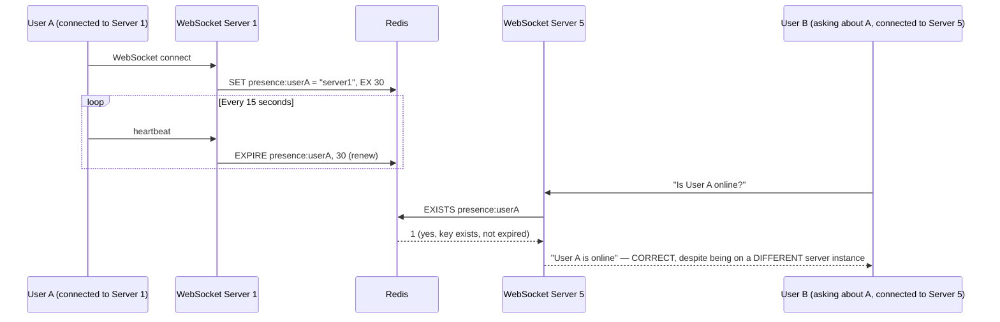
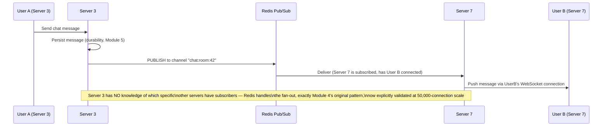
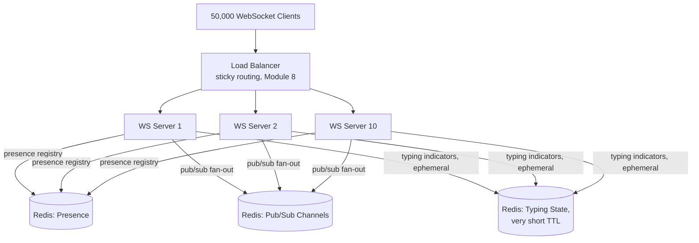
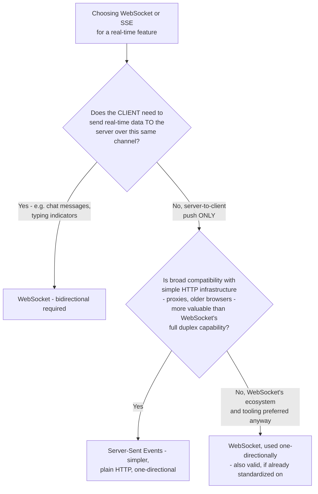
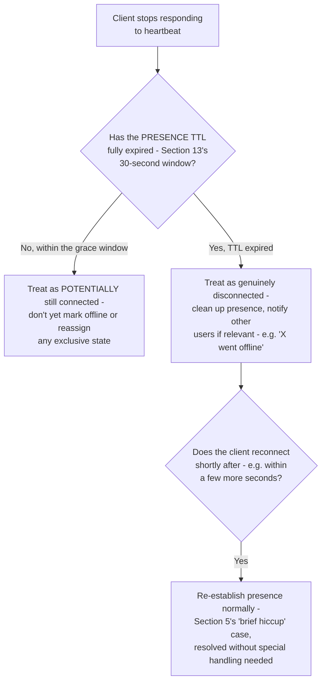
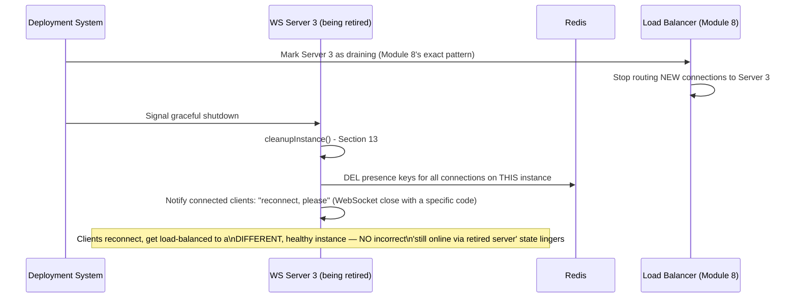
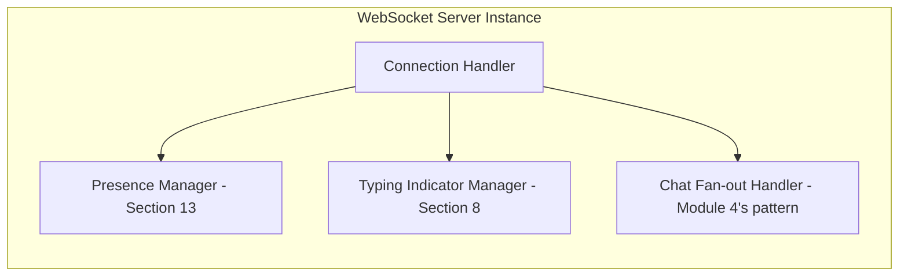

# Module 25 — Real-time Systems

> **Masterclass:** System Design Masterclass (30 Modules)
> **Level:** Expert
> **Audience:** Node.js backend developers, SDE‑2 / Senior Backend interview candidates, engineers transitioning into architecture roles
> **Prerequisite:** Modules 1–24 (System Design Intro through Recommendation Systems)

---

## 1. Introduction

Module 24 closed at the slow end of the freshness spectrum: recommendations computed nightly, staleness measured in hours, and that being a perfectly acceptable trade-off. This module goes to the opposite extreme. Module 4 first introduced WebSocket as the mechanism enabling server-initiated push, and Module 4's Advanced Project built a working live-comment feed with Redis Pub/Sub fan-out across multiple WebSocket server instances. This module now builds the **complete real-time systems discipline** on top of that foundation: **live chat** architecture at scale, **typing indicators** and **presence** (who's online right now), and the precise choice between **WebSocket** and **Server-Sent Events** for each specific real-time feature.

This module's central technical challenge, which Module 4 only partially addressed: presence — "is this user currently online" — is a genuinely harder distributed systems problem than it first appears, because it requires every server instance to have a consistent, real-time view of connection state that's constantly changing and prone to exactly the ambiguous-failure problems Module 12 established as fundamental.

---

## 2. Learning Objectives

By the end of this module, you will be able to:

1. Explain **presence systems** and why "is this user online" is a genuinely hard distributed systems problem, not a simple boolean flag.
2. Design a **typing indicator** feature correctly, balancing real-time responsiveness against unnecessary network chatter.
3. Design a **live chat system's** complete architecture, extending Module 4's comment-feed pattern to full bidirectional messaging with delivery guarantees.
4. Explain **notification fan-out** at scale, and the specific challenges of delivering to millions of simultaneously-connected clients.
5. Choose correctly between **WebSocket** and **Server-Sent Events** for a given real-time feature, using precise, stated criteria.
6. Design **heartbeat and reconnection** logic that correctly distinguishes a genuinely disconnected client from a briefly unresponsive one (Module 12's ambiguity, applied here).
7. Reason about the **connection-state scaling** challenge unique to real-time systems, distinct from Module 2's stateless-request scaling model.

---

## 3. Why This Concept Exists

Every module before this one has, implicitly or explicitly, treated "the current state of the system" as something a client discovers by asking (a request/response cycle). Real-time systems exist because some information's *entire value* depends on arriving **without being asked** — a chat message, a typing indicator, a "user X just came online" notification are all worthless if the recipient has to poll for them; their value is precisely in their immediacy.

Module 4 established the mechanical foundation (WebSocket's persistent, bidirectional connection) and the architectural pattern (Redis Pub/Sub fan-out across stateful WebSocket server instances) for this. But Module 4 stopped short of the deeper challenges real production real-time systems face: how do you know, reliably, across a fleet of many WebSocket servers, whether a specific user is currently connected *anywhere*? How do you avoid a typing indicator feature generating so much network traffic it becomes its own scaling problem? How do you distinguish a client that's merely on a slow mobile connection from one that's genuinely gone? This module exists to answer these questions precisely.

---

## 4. Problem Statement

> Our blog platform's live comment feature (Module 4) needs three new capabilities: (1) a "typing..." indicator showing when another user is composing a comment, (2) a presence indicator showing whether a post's author is "currently online" to answer questions in real time, and (3) the ability for the live comment feature to scale to 50,000 concurrent WebSocket connections across a fleet of 10 server instances, with correct message delivery even as connections are load-balanced (Module 8) across instances and instances are added or removed. Design all three capabilities, addressing why presence specifically is harder to implement correctly than it first appears.

---

## 5. Real-World Analogy

**A typing indicator is a courtesy signal — like seeing someone at a old-fashioned switchboard visibly holding a phone receiver to their ear before they actually speak.** It only needs to convey "something is about to happen," not a precise, guaranteed transcript of every keystroke — this distinction is precisely why a naive implementation (broadcasting every single keystroke event) is overkill, and a throttled, debounced signal ("still typing" sent at most once every 2 seconds) is the correct, efficient design.

**Presence is deceptively hard because it's really asking "is this specific person reachable through ANY of dozens of possible switchboards right now" — and switchboards occasionally have their own brief hiccups indistinguishable from the person actually hanging up.** If a user's WebSocket connection briefly drops due to a mobile network hiccup (a genuine, common occurrence) and reconnects two seconds later, does the system correctly show them as "briefly offline, now back," or does it flicker misleadingly, or worse, get confused about which of the multiple switchboards (server instances) they're actually connected through *right now*? This is exactly Module 12's partial-failure ambiguity, reappearing at the presence layer: a brief disconnection is genuinely indistinguishable, in the moment, from a permanent one.

**Scaling live chat to 50,000 connections across 10 servers is like running 10 separate switchboard offices that must all agree, instantly, on who's connected to which office, and relay messages between offices seamlessly** — precisely the architecture Module 4's Redis Pub/Sub fan-out began to address, now formalized for the specific demands of bidirectional chat rather than one-directional comment broadcast.

---

## 6. Technical Definition

**Presence:** A real-time indicator of whether a specific user currently has an active connection to the system, typically implemented via connection tracking combined with heartbeat-based liveness confirmation.

**Typing Indicator:** A transient, real-time signal indicating a user is actively composing input, typically throttled and automatically expiring rather than requiring an explicit "stopped typing" signal.

**Fan-out:** The process of delivering a single event to potentially many recipients, each of which may be connected to a different server instance in a horizontally-scaled fleet (directly extending Module 4 and Module 11's pub/sub concepts).

**Heartbeat (real-time systems context):** A periodic, lightweight message exchanged between client and server confirming the connection is still alive, distinct from Module 8's server-health-check heartbeat but serving an analogous liveness-confirmation purpose at the connection level.

**Server-Sent Events (SSE):** A one-directional (server-to-client only) persistent connection protocol built on standard HTTP, offering a simpler alternative to WebSocket when bidirectional communication isn't required (first introduced in Module 4).

---

## 7. Core Terminology

| Term | Precise Definition | One-line Intuition |
|---|---|---|
| **Connection Registry** | A shared, cross-instance data structure tracking which server instance each connected user is currently attached to | "The shared directory of who's connected where" |
| **Debouncing** | Delaying or suppressing repeated event emissions until a pause in activity occurs, reducing redundant signal traffic | "Wait for a pause before declaring 'done typing'" |
| **Throttling** | Limiting the rate at which repeated events are emitted, regardless of how frequently the underlying activity occurs | "At most one 'still typing' signal per 2 seconds, no matter how fast they type" |
| **Graceful Disconnect** | A client-initiated, clean connection closure (e.g., closing a browser tab), distinguishable from an ungraceful one | "Hanging up the phone properly vs. the line going dead" |
| **Ungraceful Disconnect** | A connection loss without an explicit closure signal (network failure, crash), requiring heartbeat-based detection | "The line just goes dead, no goodbye" |
| **Sticky Session (real-time context)** | Routing a specific client's WebSocket connection consistently to the same server instance for its duration (Module 8's exact concept, applied here) | "Once connected to Office 3, stay connected to Office 3" |

---

## 8. Internal Working

### Why presence is genuinely hard, precisely, and how a correct implementation resolves it

A naive presence implementation might simply set `user.online = true` on WebSocket connection and `user.online = false` on disconnect, stored in a local, per-instance variable. This fails **immediately** in a multi-instance fleet (Section 4's requirement 3): if User A is connected to Server 1 and someone on Server 5 asks "is User A online," Server 5 has no idea — it only knows about *its own* local connections, precisely the same stateful-service problem Module 2 first identified for session data.

**The correct fix, directly extending Module 4's Redis-backed approach:**

```javascript
// On WebSocket connection — register in a SHARED, cross-instance registry
async function onConnect(socket, userId) {
  const instanceId = process.env.INSTANCE_ID;
  await redis.set(`presence:${userId}`, instanceId, 'EX', 30); // TTL — Section 8's heartbeat-driven renewal
  await redis.sadd(`instance:${instanceId}:connections`, userId); // for cleanup on instance shutdown
}

// Heartbeat, sent periodically by the CLIENT (Section 6's definition)
socket.on('heartbeat', async () => {
  await redis.expire(`presence:${userId}`, 30); // renew the TTL — still alive
});

// On disconnect (graceful OR ungraceful — the 'close' event fires for both)
socket.on('close', async () => {
  await redis.del(`presence:${userId}`);
  await redis.srem(`instance:${instanceId}:connections`, userId);
});

// Checking presence — ANY instance can answer this correctly now
async function isUserOnline(userId) {
  return (await redis.exists(`presence:${userId}`)) === 1;
}
```

**Why the TTL-based approach, rather than a simple boolean flag, precisely resolves Section 5's "brief hiccup vs. permanent disconnect" ambiguity:** if a client's connection drops ungracefully (a network hiccup) and the `close` event fires as expected, the presence key is correctly removed. But if the *server itself* crashes before firing `close` for any of its connections, the presence key **still expires naturally via TTL** within 30 seconds — this is precisely Module 8's health-check philosophy (a heartbeat-driven, self-expiring signal, not an manually-toggled flag) applied to presence specifically, ensuring a crashed instance's "phantom online" users don't remain incorrectly marked online indefinitely.

### How typing indicators avoid becoming their own scaling problem

A naive implementation broadcasting an event on **every single keystroke** would generate enormous, unnecessary traffic — a user typing a 200-character comment at a normal pace could generate 200 separate WebSocket messages, each requiring Module 4's exact fan-out mechanism, for information that's genuinely only useful as a coarse "someone is typing right now" signal.

```javascript
let typingTimeout = null;

function onKeystroke(postId, userId) {
  if (!typingTimeout) {
    broadcastTypingEvent(postId, userId, true); // only send on the FIRST keystroke after a pause
  }
  clearTimeout(typingTimeout);
  typingTimeout = setTimeout(() => {
    broadcastTypingEvent(postId, userId, false); // auto-expire after 3s of no further keystrokes
    typingTimeout = null;
  }, 3000);
}
```

**Why this debouncing (Section 7) precisely resolves Section 4's requirement 1 without excessive traffic:** regardless of how fast or long the user types, at most **two** events are sent per "typing session" — one when typing starts, one 3 seconds after the last keystroke (auto-expiring, with no explicit "stopped" signal required from the client, directly resolving Section 5's "courtesy signal" framing — the system doesn't need to know precisely when they stopped, just that they've paused long enough for the indicator to no longer be useful).

---

## 9. Request Lifecycle

### Mermaid Sequence Diagram — Correct, Cross-Instance Presence Check (Resolving Section 4's Requirement 2)



**Step-by-step explanation, directly resolving Section 4's requirement 2:** notice Server 5 **never directly communicates with Server 1** — the shared Redis registry is the *only* coordination mechanism needed, exactly mirroring Module 4's original WebSocket fan-out architecture (Redis Pub/Sub for message delivery; here, Redis key-existence for presence state) — both problems solved by the same underlying pattern: push the cross-instance coordination burden onto a shared, external store rather than requiring servers to discover and query each other directly.

### Mermaid Sequence Diagram — Live Chat Fan-Out at Section 4's Requirement 3 Scale (50,000 Connections, 10 Instances)



---

## 10. Architecture Overview



**HLD-level insight, resolving all three of Section 4's requirements in one architecture:** notice **three logically distinct uses of Redis**, potentially even physically separate Redis instances/databases at real scale — presence (long-ish TTL, frequently renewed), pub/sub (transient, no persistence needed for delivery), and typing state (extremely short TTL, high write frequency but tiny payloads) — each with a genuinely different access pattern, directly echoing Module 5's "match the tool to the access pattern" principle, now applied *within* a single technology (Redis) to three distinct real-time sub-problems.

---

## 11. Capacity Estimation

**Scenario:** Estimating the connection and message-throughput capacity needed for Section 4's 50,000-connection, 10-instance requirement.

**Step 1 — Connections per instance:**
```
50,000 connections / 10 instances = 5,000 connections per instance (average, assuming even distribution)
```

**Step 2 — Memory cost per connection (a rough, illustrative WebSocket connection overhead estimate):**
```
5,000 connections × ~10 KB overhead per connection (buffers, connection state) ≈ 50 MB per instance
— comfortably within a modest instance's memory budget
```

**Step 3 — Typing indicator traffic, given Section 8's debounced design:**
```
Assume 5% of connected users are actively typing at any given moment = 2,500 users
Each generates at most 1 "start typing" + 1 "stop typing" event per typing session (Section 8)
≈ far lower message volume than a naive per-keystroke approach would produce —
   directly, numerically validating Section 8's debouncing design choice
```

**Conclusion:** this capacity math confirms Section 4's stated scale (50,000 connections, 10 instances) is comfortably achievable with the debounced typing-indicator design and Redis-backed presence/fan-out architecture — and, notably, validates that the *design choices* made in Section 8 (debouncing specifically) are not just elegant but **numerically necessary** to keep real-time overhead proportionate at this connection scale.

---

## 12. High-Level Design (HLD)



**HLD-level insight, directly resolving Section 4's implicit WebSocket-vs-SSE question:** live chat and typing indicators (Section 4's requirements 1 and 3) **genuinely require** bidirectional communication — the client sends messages/keystrokes, the server pushes others' messages/indicators back — making WebSocket the correct, necessary choice (Branch C), not merely a default; a feature like a live "view count ticking up" display, by contrast, would be purely server-to-client and a strong candidate for SSE's simplicity (Branch D), directly reprising Module 4, Section 32's original SSE example with a now fully-justified decision framework.

---

## 13. Low-Level Design (LLD)

### A complete presence and heartbeat implementation with correct disconnect handling

```javascript
const HEARTBEAT_INTERVAL_MS = 15000;
const PRESENCE_TTL_SECONDS = 30; // generous margin above heartbeat interval (Module 18's timeout-margin discipline)

class PresenceManager {
  constructor(redisClient, instanceId) {
    this.redis = redisClient;
    this.instanceId = instanceId;
  }

  async registerConnection(userId, socket) {
    await this.redis.set(`presence:${userId}`, this.instanceId, 'EX', PRESENCE_TTL_SECONDS);
    await this.redis.sadd(`instance:${this.instanceId}:users`, userId);

    const heartbeatCheck = setInterval(() => {
      socket.ping(); // application-level ping — Section 6's heartbeat mechanism
    }, HEARTBEAT_INTERVAL_MS);

    socket.on('pong', async () => {
      await this.redis.expire(`presence:${userId}`, PRESENCE_TTL_SECONDS); // renew on confirmed liveness
    });

    socket.on('close', async () => {
      clearInterval(heartbeatCheck);
      await this.redis.del(`presence:${userId}`);
      await this.redis.srem(`instance:${this.instanceId}:users`, userId);
    });
  }

  async isOnline(userId) {
    return (await this.redis.exists(`presence:${userId}`)) === 1;
  }

  // Called on instance SHUTDOWN — proactively clean up, rather than waiting for TTL expiry
  async cleanupInstance() {
    const users = await this.redis.smembers(`instance:${this.instanceId}:users`);
    for (const userId of users) {
      await this.redis.del(`presence:${userId}`);
    }
    await this.redis.del(`instance:${this.instanceId}:users`);
  }
}
```

**LLD-level design note, directly connecting to Module 8's graceful-shutdown lesson:** `cleanupInstance()` is called during a deliberate, graceful instance shutdown (Module 8's drain-before-terminate pattern) — proactively clearing presence entries rather than waiting up to 30 seconds for TTL expiry, ensuring a planned deployment doesn't cause a brief, unnecessary window of incorrect "still online" presence data for users who were connected to the instance being retired.

---

## 14. ASCII Diagrams

```
NAIVE PER-KEYSTROKE TYPING INDICATOR         DEBOUNCED TYPING INDICATOR (Section 8)

  Keystroke ──▶ broadcast event                Keystroke ──▶ [is this the FIRST after a pause?]
  Keystroke ──▶ broadcast event                              │ YES → broadcast "typing=true"
  Keystroke ──▶ broadcast event                              │ NO  → just reset the 3s timer
  Keystroke ──▶ broadcast event                Keystroke ──▶ [reset timer]
  ... (200 events for a 200-char comment)      Keystroke ──▶ [reset timer]
                                                ... (only timer resets, NO broadcasts)
                                                [3s pass with no keystroke] ──▶ broadcast "typing=false"

                                                TOTAL: 2 broadcast events, regardless of comment length
```

```
PRESENCE TTL LIFECYCLE

  Connect ──▶ [presence:user = TTL 30s] ──▶ heartbeat every 15s ──▶ [TTL renewed to 30s]
                     │                                                      │
                     └── graceful disconnect: DELETE immediately            │
                     └── ungraceful (crash/network loss): TTL simply EXPIRES naturally
                          (no explicit action needed — Module 8's health-check philosophy)
```

---

## 15. Mermaid Flowcharts

*(Section 12 covers the canonical WebSocket-vs-SSE decision flow for this module.)*

### Decision Flow: Distinguishing a Genuine Disconnect from a Brief Hiccup



**Why this flow directly embodies Module 12's core lesson, applied to presence specifically:** notice the system **never claims certainty** about *why* the client stopped responding — it simply applies a consistent, TTL-based policy (Section 8) and lets reconnection, if it happens, resolve the ambiguity naturally, rather than trying to definitively diagnose the cause in real time — exactly Module 12's guidance that ambiguous failure should be handled by policy, not by an attempt at impossible certainty.

---

## 16. Mermaid Sequence Diagrams

*(Section 9 covers the two canonical sequence diagrams for this module. Additional diagram below.)*

### Instance Shutdown During a Deployment — Graceful Presence Cleanup



**Why this directly extends Module 8's draining pattern to the real-time, connection-stateful context:** Module 8's original draining concept was built for stateless HTTP requests (let in-flight requests finish, stop routing new ones); this diagram shows the **connection-stateful** equivalent — existing WebSocket connections must be explicitly, gracefully terminated (with clients instructed to reconnect elsewhere), not merely left to time out, since a lingering connection to a retiring instance would otherwise leave presence data incorrectly pointing at an instance about to disappear.

---

## 17. Component Diagrams



**Why these three managers are modeled as distinct components, despite all operating over the same underlying WebSocket connection:** each has a genuinely different data lifecycle and Redis access pattern (Section 10's "three logically distinct Redis uses") — bundling them into one undifferentiated "WebSocket handler" would obscure that presence needs long-ish TTLs, typing needs very short TTLs and high write frequency, and chat fan-out needs no persistence at all beyond delivery — three different problems sharing only the transport layer.

---

## 18. Deployment Diagrams

```mermaid
flowchart TB
    subgraph Region - Multi-AZ, per Module 8's redundancy principle
        LB[Load Balancer - sticky routing]
        subgraph AZ1
            WS1[WS Server 1]
            WS2[WS Server 2]
        end
        subgraph AZ2
            WS3[WS Server 3]
            WS4[WS Server 4]
        end
    end
    subgraph Shared State
        RedisCluster[(Redis Cluster - presence,\npub/sub, typing state)]
    end
    LB --> WS1 & WS2 & WS3 & WS4
    WS1 & WS2 & WS3 & WS4 --> RedisCluster
```

**Deployment-level note, directly connecting to Module 8's sticky-session discussion:** WebSocket connections are inherently stateful at the TCP level (Module 4, Section 22 of that module's exact lesson) — the load balancer must maintain sticky routing for the *duration* of a connection, but this diagram shows that the sticky-routing constraint applies only to **which server a given connection is attached to**, not to any cross-instance coordination need, since presence, fan-out, and typing state are all correctly externalized to the shared Redis cluster, exactly as Module 4's original architecture established.

---

## 19. Network Diagrams

Real-time WebSocket infrastructure follows Module 3's standard network topology — public-facing load balancer, private-subnet WebSocket servers, private-subnet Redis — with one specific consideration worth naming: **WebSocket connections, being long-lived, may need explicit keep-alive configuration at intermediate network devices** (load balancers, proxies) that might otherwise time out an apparently-idle-but-still-valid long-lived connection, a real, practical operational detail distinct from the HTTP-request-per-call model most of this course's networking discussion has assumed.

---

## 20. Database Design

Chat message persistence (for history, distinct from real-time delivery) directly extends Module 5's schema design, with one real-time-specific consideration: **the write path for persistence should not block the real-time delivery path**, directly echoing Module 11's decoupling principle:

```javascript
async function sendChatMessage(roomId, userId, text) {
  const message = { roomId, userId, text, timestamp: Date.now() };

  // Real-time delivery — FAST, no waiting on persistence
  await redis.publish(`chat:room:${roomId}`, JSON.stringify(message));

  // Persistence — happens independently, doesn't block the above (Module 11's async decoupling)
  await messageQueue.publish('chat-message-persist', message);
}
```

**Why decoupling delivery from persistence matters, precisely, extending Module 11's original motivation:** if message persistence (a database write) were on the critical path of real-time delivery, a slow database write would directly translate into delayed chat message delivery — exactly the kind of unnecessary coupling Module 11 solved for asynchronous side effects, now applied specifically to keep the real-time delivery path as fast as possible.

---

## 21. API Design

Real-time features are typically not exposed via traditional REST endpoints but via a WebSocket message protocol — worth documenting with the same rigor as any other API contract:

```
WebSocket message types (client → server):
  { type: "chat:send", roomId, text }
  { type: "typing:start", roomId }         (Section 8's debounced client-side logic sends this)

WebSocket message types (server → client):
  { type: "chat:message", roomId, userId, text, timestamp }
  { type: "typing:indicator", roomId, userId, isTyping }
  { type: "presence:update", userId, isOnline }
```

**Why documenting this message protocol explicitly matters, echoing Module 9's API-contract discipline applied to WebSocket:** unlike REST's self-documenting HTTP verbs and paths, a WebSocket connection's message protocol is entirely custom — without explicit documentation, client and server implementations can silently drift out of sync in ways that are much harder to detect than a mismatched REST endpoint.

---

## 22. Scalability Considerations

| Consideration | Impact |
|---|---|
| Connection count per instance | Bound by memory (Section 11) and OS file-descriptor limits — a genuinely different scaling constraint than Module 2's stateless-request-throughput model |
| Presence registry write volume | Scales with connection count × heartbeat frequency — a real, continuous background load on Redis, distinct from request-driven traffic |
| Fan-out breadth | A single chat message to a very large room (thousands of simultaneous recipients) stresses Redis Pub/Sub's delivery fan-out — directly echoing Module 11's "point-to-point vs. pub/sub" scaling distinction |
| Sticky routing constraint | Limits the load balancer's ability to freely redistribute load (Module 8's exact trade-off, revisited) since existing connections can't be transparently moved |

---

## 23. Reliability & Fault Tolerance

- **Presence's TTL-based design is itself a reliability mechanism** — a crashed instance's connections don't leave permanently-stale "online" state, since Section 13's TTL expires naturally without requiring the crashed instance to perform any cleanup action itself, directly mirroring Module 8's health-check philosophy (self-expiring, not manually toggled).
- **Client-side reconnection logic with backoff** (Module 18's exact retry-with-backoff pattern, applied here) is essential — a WebSocket connection dropping due to a brief network hiccup should reconnect automatically, not require the user to manually refresh the page.
- **Decoupling delivery from persistence** (Section 20) means a temporary database slowdown degrades message *history availability*, not real-time *delivery* — a genuinely valuable failure-isolation property, directly extending Module 11's original motivation.

---

## 24. Security Considerations

- **WebSocket connections must be authenticated at connection time**, directly extending Module 20's JWT-based authentication to the WebSocket handshake (typically via a token passed during the initial upgrade request) — an unauthenticated WebSocket connection is a serious, real security gap.
- **Presence information can itself be sensitive** — "is this user currently online" reveals real-time behavioral data some users may not want broadly visible; presence visibility should respect user privacy preferences and, where relevant, Module 20's authorization principles (not every user should be able to query every other user's presence).
- **Rate limit WebSocket message sending** (Module 21's exact algorithms, applied per-connection rather than per-HTTP-request) to prevent a single client from flooding a chat room with excessive messages.

---

## 25. Performance Optimization

- **Debounce and throttle high-frequency real-time signals** (Section 8) — the single highest-leverage optimization for reducing unnecessary real-time traffic.
- **Batch presence renewal writes where possible** at very high connection counts, rather than one Redis call per heartbeat per connection, directly echoing Module 7 and Module 11's batching lessons.
- **Use binary or compact message encoding** (rather than verbose JSON) for very high-frequency real-time messages at extreme scale, trading some human-readability for reduced bandwidth and parsing cost — a genuine, quantifiable optimization once message volume becomes the bottleneck.

---

## 26. Monitoring & Observability

Directly extending Module 19's framework to real-time-specific signals:

- **Active connection count per instance** — directly validating Module 8's sticky-routing load distribution remains balanced across the fleet, not concentrated on a subset of instances.
- **Presence registry size and write rate** — a direct, measurable signal of Section 22's continuous background load.
- **Message delivery latency (publish-to-receive)** — the real-time-specific equivalent of Module 19's general request-latency monitoring, but measured end-to-end across the pub/sub fan-out path specifically.
- **Reconnection rate** — a rising rate can signal either genuine network instability affecting users, or a server-side issue causing unexpected disconnections worth investigating.

---

## 27. Common Bottlenecks

| Bottleneck | Symptom | Root Cause |
|---|---|---|
| Excessive typing-indicator traffic | Unnecessary load on Redis Pub/Sub, degraded latency for genuine chat messages | No debouncing/throttling (Section 8) — naive per-keystroke broadcasting |
| Incorrect presence flickering | Users appear to rapidly go online/offline | TTL too short relative to heartbeat interval, or heartbeat interval too infrequent (Section 13's margin discipline) |
| Stale presence after instance crash | Users incorrectly shown online long after their server crashed | No TTL-based self-expiry — relying solely on graceful disconnect cleanup (Section 8's core fix) |
| Connection imbalance across fleet | Some instances near connection-count capacity, others idle | Sticky routing combined with uneven initial distribution or instance restarts (Module 8's load-balancing lesson, applied here) |
| Slow message delivery under high fan-out | Chat messages arrive noticeably delayed in very large rooms | Redis Pub/Sub fan-out breadth exceeding practical limits — may require sharding large rooms or a more specialized fan-out architecture at extreme scale |

---

## 28. Trade-off Analysis

> "I chose a **TTL-based, heartbeat-renewed presence system** over a simple boolean online/offline flag, optimizing for **automatic, correct cleanup even when a server instance crashes without performing graceful shutdown**, at the cost of **a brief window (up to the TTL duration) where a genuinely disconnected user might still appear online**, which is acceptable because this window is small, bounded, and self-correcting, unlike a boolean flag's risk of remaining permanently, incorrectly stuck in the 'online' state after an ungraceful failure."

> "I chose **debounced typing indicators (start/stop events only, with a 3-second auto-expiry)** over per-keystroke broadcasting, optimizing for **dramatically reduced real-time message volume (Section 11's capacity math)**, at the cost of **slightly less granular, real-time-per-character feedback**, which is acceptable because a typing indicator's actual value ('someone is composing a response') doesn't require character-level fidelity to be useful."

---

## 29. Anti-patterns & Common Mistakes

1. **Implementing presence as a local, in-memory boolean flag per instance** — Module 2's exact stateful-service mistake, reappearing specifically for presence (Section 8's precise, motivating diagnosis).
2. **Broadcasting a real-time event on every single keystroke or high-frequency micro-action**, without debouncing or throttling — an unnecessary, avoidable scaling cost (Section 8/11).
3. **Relying solely on graceful disconnect cleanup**, with no TTL-based self-expiry safeguard — leaves the system vulnerable to permanently-stale presence data after any ungraceful instance failure.
4. **No client-side reconnection logic with backoff**, leaving users to manually refresh after any brief network hiccup, a poor and avoidable user experience.
5. **Coupling message persistence to the real-time delivery critical path** (Section 20), letting a database slowdown directly degrade real-time responsiveness.
6. **No authentication at the WebSocket connection/handshake level** (Section 24), leaving a genuine, serious security gap distinct from, and easy to overlook alongside, standard REST endpoint authentication.

---

## 30. Production Best Practices

- **Always implement presence via a shared, TTL-based registry**, never local per-instance state, and always pair heartbeat renewal with self-expiring TTL as the ungraceful-failure safeguard.
- **Debounce and throttle all high-frequency real-time signals** (typing indicators, cursor-position updates in collaborative editing, and similar) rather than broadcasting every raw event.
- **Decouple real-time delivery from persistence**, keeping the delivery path as fast and unencumbered as possible.
- **Implement client-side reconnection with exponential backoff** (Module 18's exact pattern) as a standard, expected part of any real-time feature's client implementation.
- **Authenticate WebSocket connections at handshake time**, with the same rigor as any REST API endpoint.
- **Gracefully drain WebSocket connections during planned instance shutdown/deployment** (Section 16), explicitly instructing clients to reconnect rather than allowing connections to simply time out.

---

## 31. Real-World Examples

- **Slack's and Discord's publicly documented real-time architecture** both rely on exactly this module's core pattern — WebSocket connections fanned out via a shared pub/sub layer, with TTL-based presence tracking — at massive, millions-of-concurrent-connection scale, directly validating this module's architectural choices as production-proven, not merely theoretical.
- **Google Docs' collaborative cursor and typing-presence indicators** (conceptually related to Module 17's CRDT discussion) demonstrate the same debouncing/throttling discipline (Section 8) applied to a different, but structurally similar, high-frequency real-time signal — cursor position updates, rather than typing indicators specifically.
- **WhatsApp's well-documented "last seen" and online-status feature** is a widely-used, real-world example of exactly Section 8's presence design tension — balancing real-time accuracy against the genuine difficulty of distinguishing a brief network interruption from an actual, sustained disconnection, and WhatsApp's own privacy controls around this feature directly reflect Section 24's presence-privacy consideration.

---

## 32. Node.js Implementation Examples

### Client-side reconnection with exponential backoff (directly reusing Module 18's exact pattern)

```javascript
class ResilientWebSocketClient {
  constructor(url) {
    this.url = url;
    this.reconnectAttempt = 0;
    this.connect();
  }

  connect() {
    this.socket = new WebSocket(this.url);

    this.socket.onopen = () => {
      this.reconnectAttempt = 0; // reset backoff on successful connection
      console.log('Connected');
    };

    this.socket.onclose = () => {
      const delay = Math.min(1000 * 2 ** this.reconnectAttempt, 30000) + Math.random() * 500; // Module 18's exact formula
      this.reconnectAttempt++;
      setTimeout(() => this.connect(), delay);
    };
  }

  send(message) {
    if (this.socket.readyState === WebSocket.OPEN) {
      this.socket.send(JSON.stringify(message));
    } // else: silently queue or drop, depending on the message's tolerance for loss (Module 18's fallback discipline)
  }
}
```

**Why reusing Module 18's exact exponential-backoff-with-jitter formula here matters:** a WebSocket client reconnecting immediately and repeatedly after a server-side outage would recreate exactly Module 18's retry-storm risk, now at the connection-establishment level rather than the HTTP-request level — the same underlying problem, the same correct fix, directly demonstrating this course's recurring theme that foundational patterns (backoff, jitter, TTL-based state) apply consistently across seemingly different problem domains.

---

## 33. Interview Questions

### Easy
1. Why doesn't a simple boolean "online" flag work correctly for presence in a multi-instance deployment?
2. What is debouncing, and why is it important for typing indicators?
3. What's the difference between a graceful and an ungraceful disconnect?
4. When should you choose WebSocket over Server-Sent Events for a real-time feature?
5. Why should message persistence be decoupled from real-time delivery?
6. Why do WebSocket connections need client-side reconnection logic?

### Medium
7. Design a TTL-based presence system, explaining precisely how it handles a server instance crashing without graceful shutdown.
8. Explain why per-keystroke typing indicator broadcasting is a scaling anti-pattern, and design the debounced alternative.
9. Design the graceful shutdown sequence for a WebSocket server instance being retired during a deployment, addressing what happens to its existing connections.
10. Why must WebSocket connections be authenticated at handshake time rather than relying on a later, in-band authentication message?
11. Explain how Redis Pub/Sub enables message fan-out across a horizontally-scaled WebSocket server fleet without servers needing direct knowledge of each other.
12. Design a rate-limiting strategy for WebSocket message sending, referencing Module 21's algorithms applied per-connection.

### Hard
13. Design a complete real-time chat system architecture supporting 100,000 concurrent connections across 20 server instances, addressing presence, typing indicators, message fan-out, and graceful deployment handling.
14. Explain, precisely, why presence is a genuinely harder distributed systems problem than it first appears, connecting this explicitly to Module 12's partial-failure ambiguity.
15. A production incident reveals presence "flickering" — users rapidly appearing online and offline. Diagnose the likely root cause using this module's TTL/heartbeat concepts and propose the fix.
16. Design a fan-out architecture for a chat room with 50,000 simultaneous members (e.g., a massive live-event chat), discussing why standard Redis Pub/Sub might need augmentation at this scale.
17. Discuss the trade-offs of building presence on top of Redis TTLs versus using a purpose-built presence service or protocol, and when the added complexity of the latter would be justified.

---

## 34. Scenario-Based Design Questions

1. **Scenario:** Reproduce and resolve Module 25's exact Section 4 requirements: typing indicators, cross-instance presence, and 50,000-connection chat scaling. Walk through your complete architecture.
2. **Scenario:** Users report seeing another user's "online" status flicker rapidly between online and offline over a few seconds. Diagnose using this module's TTL/heartbeat concepts.
3. **Scenario:** During a deployment, several users report their chat connections were abruptly cut with no warning, versus others who reconnected seamlessly. Diagnose the difference and propose the fix using Section 16's graceful shutdown pattern.
4. **Scenario:** Your typing indicator feature is generating enough Redis Pub/Sub traffic to noticeably degrade actual chat message delivery latency. Diagnose and propose the specific fix.
5. **Scenario:** A security review discovers that WebSocket connections can be established without any authentication check. Propose the remediation.
6. **Scenario:** An interviewer asks you to design "Slack's presence indicator" feature. Walk through your architecture, explicitly addressing why a naive per-instance boolean flag fails.
7. **Scenario:** Your platform needs to support a live chat room for a major live-streamed event, expecting 50,000 simultaneous chat participants in a SINGLE room. Discuss why this specific scenario stresses your fan-out architecture differently than 50,000 total connections spread across many smaller rooms.
8. **Scenario:** A mobile user reports their WebSocket connection frequently drops due to network switching (WiFi to cellular), and they experience a jarring, repeated "reconnecting" UI flicker. Propose both client and server-side improvements.
9. **Scenario:** Your team debates whether "last seen 5 minutes ago" (a coarser signal) is preferable to precise real-time online/offline for user privacy and product experience reasons. Discuss the trade-offs.
10. **Scenario:** You need to add a "who's currently viewing this post" live indicator, similar to presence but scoped to a specific page rather than platform-wide. Design this using the patterns from this module.

---

## 35. Hands-on Exercises

1. Implement the `PresenceManager` class from Section 13, run it across two locally-running Node.js WebSocket server processes sharing a local Redis instance, and verify a presence check from one process correctly reports a user connected to the other process.
2. Implement the debounced typing indicator logic from Section 8, and write a test simulating rapid keystrokes, verifying only two events (start and stop) are emitted regardless of typing speed or duration.
3. Implement the `ResilientWebSocketClient` from Section 32, deliberately kill the server mid-connection, and verify the client correctly attempts reconnection with growing, jittered delays.
4. Simulate an ungraceful server crash (kill the process without calling `cleanupInstance()`) and verify presence data for its connected users correctly self-expires via TTL within the configured window, without requiring any explicit cleanup action.
5. Implement the graceful shutdown sequence from Section 16, and verify that connections are cleanly redirected (via an explicit close-and-reconnect signal) rather than left to time out naturally.

---

## 36. Mini Project

**Build:** A complete real-time chat feature for the blog platform, extending Module 4's live comment feed with typing indicators and presence, directly resolving Module 25's Section 4 requirements.

**Requirements:**
- Implement the TTL-based `PresenceManager` (Section 13), correctly functioning across at least 2 simulated server instances sharing Redis.
- Implement debounced typing indicators (Section 8).
- Implement client-side reconnection with exponential backoff and jitter (Section 32, reusing Module 18's exact formula).
- Implement graceful shutdown handling (Section 16) ensuring no stale presence data lingers after a planned instance retirement.

**Success criteria:** A user connected to one server instance can correctly see another user's presence status even when that user is connected to a different instance; typing indicators generate at most 2 events per typing session regardless of message length; and a simulated instance crash results in presence data self-correcting within the configured TTL window without manual intervention.

---

## 37. Advanced Project

**Build:** Extend the Mini Project to Section 4's full 50,000-connection, 10-instance scale simulation, with monitoring and security hardening.

1. Simulate a larger fleet (10 locally-running or containerized instances) and load-test with a realistic number of simulated concurrent WebSocket connections, measuring actual per-instance memory usage and comparing it against Section 11's capacity estimate.
2. Implement WebSocket handshake authentication (Section 24), reusing Module 20's JWT verification pattern, and write a test verifying an unauthenticated connection attempt is correctly rejected before any message exchange occurs.
3. Implement per-connection rate limiting for chat message sending (Section 24, reusing Module 21's Token Bucket algorithm), and write a test verifying a flooding client is correctly throttled without affecting other connections.
4. Implement message-delivery-latency and active-connection-count monitoring (Section 26), directly reusing Module 19's structured logging and metrics patterns, and produce a simple dashboard visualizing these signals under your load test.

**Success criteria:** You have measured, real evidence of your system's behavior at meaningful simulated scale, working WebSocket handshake authentication with a passing rejection test, functioning per-connection rate limiting, and real-time-specific monitoring surfacing connection count, presence registry size, and delivery latency — setting up Module 26 (Large Scale Data Processing), which examines the batch and stream processing architectures (Spark, Flink, Kafka Streams) needed when data volume grows beyond what any single real-time pipeline or batch job, as built so far, can efficiently handle.

---

## 38. Summary

- **Presence is a genuinely hard distributed systems problem**, not a simple boolean flag — a correct implementation requires a shared, TTL-based, heartbeat-renewed registry that self-corrects after ungraceful failures, directly extending Module 2's stateless-service and Module 8's health-check philosophies.
- **Typing indicators and similar high-frequency real-time signals must be debounced and throttled**, not broadcast on every raw event, to keep real-time infrastructure load proportionate to actual user value delivered.
- **WebSocket is required for genuinely bidirectional real-time features** (chat, typing); Server-Sent Events remain the simpler, correct choice for purely server-to-client push, directly completing the decision framework Module 4 introduced but didn't fully resolve.
- **Message delivery should be decoupled from persistence**, keeping the real-time path fast regardless of database performance, directly extending Module 11's asynchronous decoupling principle.
- **Client-side reconnection with exponential backoff and jitter** (Module 18's exact pattern, reapplied) is a standard, necessary part of any production real-time feature.
- **Graceful shutdown must explicitly handle existing stateful connections**, not merely stop routing new ones, extending Module 8's draining pattern to the connection-stateful reality of WebSocket infrastructure.

---

## 39. Revision Notes

- Presence = shared, TTL-based registry + heartbeat renewal — NEVER a local per-instance boolean flag (Module 2's exact mistake, applied here)
- TTL expiry = the self-correcting safeguard for ungraceful disconnects/crashes — no manual cleanup required
- Typing indicators: debounce/throttle — send only "start" (first keystroke after pause) and "stop" (3s auto-expiry), never per-keystroke
- WebSocket = required for bidirectional (chat, typing); SSE = sufficient and simpler for server-to-client-only push
- Decouple real-time delivery from persistence — don't let a slow DB write delay message delivery
- Client reconnection = exponential backoff + jitter (Module 18's exact formula, reused directly)
- Graceful shutdown must explicitly redirect existing connections — not just stop routing new ones (extends Module 8's draining)

---

## 40. One-Page Cheat Sheet

```
SYSTEM DESIGN — MODULE 25 CHEAT SHEET
─────────────────────────────────────
PRESENCE — the hard problem
  NEVER a local per-instance boolean flag (Module 2's stateful-service trap)
  ALWAYS: shared registry (Redis) + TTL + heartbeat renewal
  TTL expiry = self-correcting safeguard for CRASHES (no manual cleanup needed)

TYPING INDICATORS / high-frequency signals
  DEBOUNCE + THROTTLE — never broadcast per-keystroke
  Pattern: 1 event on "start" (first keystroke after pause) + 1 on "stop" (N-second auto-expiry)

WEBSOCKET vs SSE
  WebSocket → bidirectional REQUIRED (chat, typing indicators)
  SSE       → server→client ONLY, simpler, plain HTTP — sufficient when no client→server needed

REAL-TIME DELIVERY vs PERSISTENCE
  Decouple them — publish for delivery FIRST, persist ASYNCHRONOUSLY (Module 11's pattern)

RECONNECTION
  Exponential backoff + jitter (Module 18's exact formula) — mandatory client-side logic

GRACEFUL SHUTDOWN (connection-stateful — extends Module 8)
  Don't just stop routing NEW connections — explicitly close EXISTING ones,
  instruct clients to reconnect elsewhere, clean up presence proactively

GOLDEN RULE
  Presence is Module 12's partial-failure ambiguity, reincarnated —
  handle it with a self-expiring POLICY (TTL), never an attempt at certainty.
```

---

## Key Takeaways

- Presence's real difficulty is that "is this user online" requires the exact same partial-failure reasoning Module 12 established as fundamental to distributed systems — a TTL-based, self-expiring design is the correct policy response to genuine, irreducible ambiguity, not a workaround for a solvable certainty problem.
- Debouncing and throttling aren't optional polish for high-frequency real-time signals — they're the specific, quantifiable mechanism (Section 11's capacity math) that keeps real-time infrastructure load proportionate to the actual value delivered.
- This module's patterns — TTL-based state, exponential backoff with jitter, decoupled delivery and persistence — are the same foundational patterns from Modules 7, 11, 12, and 18, now shown recombining to solve the specific demands of connection-stateful, instantaneous-delivery systems.

## 20 Practice Questions
*(See Section 33 — 6 Easy, 6 Medium, 5 Hard — plus 3 rapid-fire additions:)*
18. Why does the presence TTL need a generous margin above the heartbeat interval, mirroring Module 18's timeout-sizing discipline?
19. Why is decoupling message persistence from real-time delivery specifically valuable during a database slowdown, rather than just a general best practice?
20. Why does sticky routing (Module 8) apply differently to WebSocket connections than to ordinary stateless HTTP requests?

## 10 Scenario-Based Questions
*(See Section 34 in full.)*

## 5 Design Assignments
*(See Sections 36–37 — Mini Project and Advanced Project — plus:)*
1. Design a complete real-time collaborative document editing system's presence and cursor-position architecture, addressing debouncing for cursor movements and presence for active editors.
2. Write a one-page postmortem (real or hypothetical) for a presence-flickering incident, including root cause diagnosis and the specific TTL/heartbeat fix.
3. Propose a fan-out architecture for a single chat room supporting 100,000 simultaneous participants, discussing where standard Redis Pub/Sub would need augmentation.

## Suggested Next Module

**→ Module 26: Large Scale Data Processing** — with real-time, instantaneous delivery now fully specified, we turn to the opposite architectural challenge at genuinely massive scale: batch and stream processing frameworks (Spark, Flink, Kafka Streams) needed when data volume exceeds what any single service, database, or real-time pipeline built so far can efficiently process.
