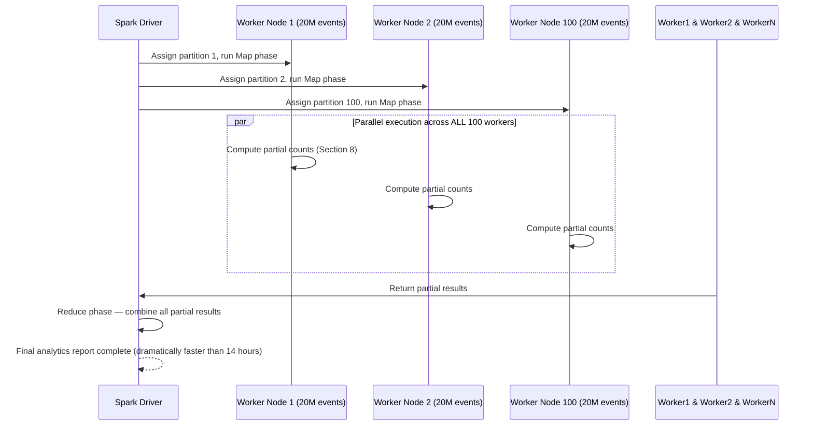
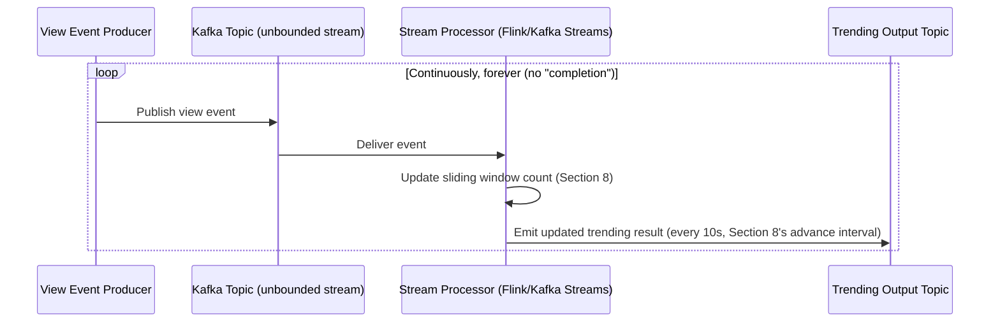
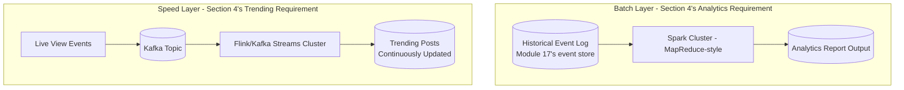
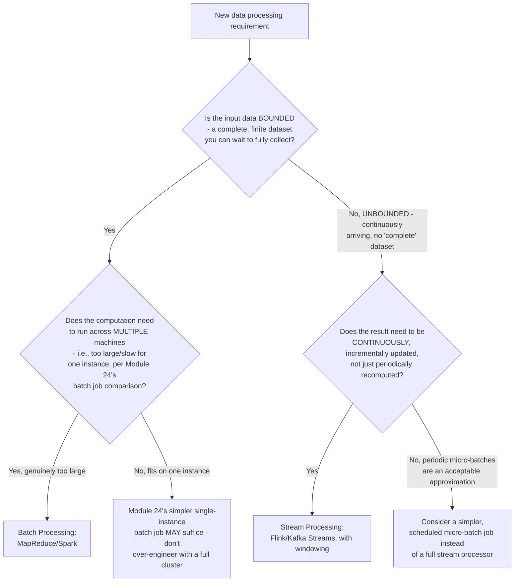
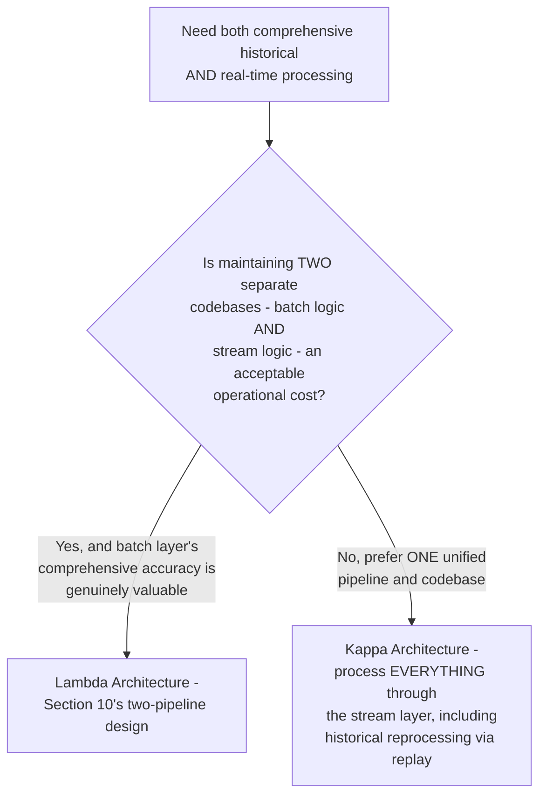
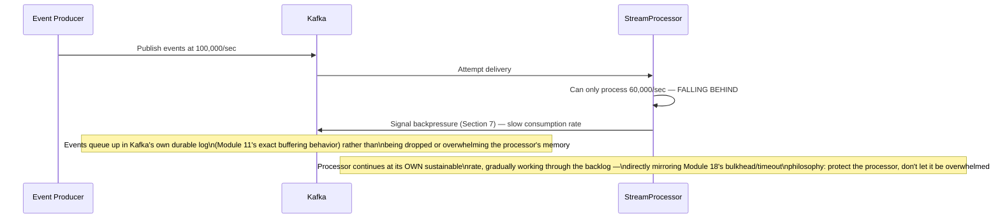
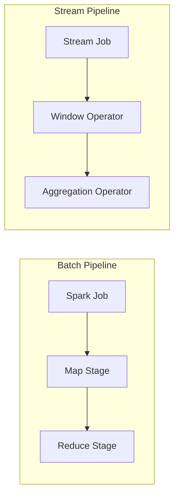

# Module 26 — Large Scale Data Processing

> **Masterclass:** System Design Masterclass (30 Modules)
> **Level:** Expert
> **Audience:** Node.js backend developers, SDE‑2 / Senior Backend interview candidates, engineers transitioning into architecture roles
> **Prerequisite:** Modules 1–25 (System Design Intro through Real-time Systems)

---

## 1. Introduction

Module 24's recommendation batch job processed a manageable 10 million pairwise updates on a single, lock-protected instance. Module 11's message consumers processed events one (or one small batch) at a time. Module 25's real-time pipeline delivered messages in milliseconds. This module addresses the point where all three of these approaches break down simultaneously: when data volume grows large enough that no single machine can hold it, no single-instance batch job can process it in a reasonable time, and no simple message consumer can keep pace with the ingestion rate.

This is **large-scale data processing** — the discipline of **batch processing** (Spark-style, processing bounded, already-collected datasets) and **stream processing** (Flink/Kafka Streams-style, processing unbounded, continuously-arriving data) at a scale where the data itself must be distributed across many machines to be processed at all, not merely to be stored (Module 15) or delivered (Module 11).

---

## 2. Learning Objectives

By the end of this module, you will be able to:

1. Explain the distinction between **batch processing** and **stream processing**, and when each is the correct model for a given data problem.
2. Explain the **MapReduce** paradigm precisely, as the foundational abstraction underlying Spark and most large-scale batch processing.
3. Explain **Spark's** in-memory processing model and why it improves on MapReduce's original disk-based approach.
4. Explain **stream processing windowing** — tumbling, sliding, and session windows — and the specific problems each solves.
5. Explain the **Lambda and Kappa architectures** for combining batch and stream processing, and their respective trade-offs.
6. Reason about **exactly-once processing semantics** in a stream-processing context, extending Module 11's delivery-guarantee lessons to continuous computation.
7. Design a large-scale data processing pipeline for a genuine big-data workload, distinguishing it from workloads that Modules 11, 17, and 24's simpler approaches already handle adequately.

---

## 3. Why This Concept Exists

Module 24's recommendation batch job worked because 10 million pairwise updates fit comfortably in one instance's memory and completed in under a minute. But consider what happens as a platform grows to genuinely massive scale: analyzing billions of user interaction events to compute engagement trends, processing petabytes of clickstream data, or continuously aggregating metrics across millions of events per second. At this scale, **no single machine can hold the data in memory, and no single machine can process it in acceptable time** — this is a fundamentally different problem from Module 15's sharding (which distributes *storage*) or Module 11's message queues (which distribute *delivery*), because here the **computation itself** must be distributed across many machines working in parallel on different slices of the data.

Large-scale data processing frameworks exist to provide the programming model, fault tolerance, and coordination (directly building on Module 12's distributed systems foundations) needed to write "process this data" logic *once*, in a relatively simple form, and have the framework handle distributing it correctly across potentially thousands of machines — precisely the abstraction that turns an otherwise intractable engineering problem (manually coordinating distributed computation) into a tractable one.

---

## 4. Problem Statement

> Our blog platform has grown to the point where the Recommendation Service's batch job (Module 24) — previously processing 10 million pairwise updates in under a minute — now needs to process a full year of interaction history: 2 billion events, to compute both the recommendation model *and* a separate, comprehensive analytics report on reading trends by category, device type, and time-of-day. This computation, run on a single instance, is now estimated to take over 14 hours — and separately, the platform needs a live, continuously-updated "trending posts right now" feature that must reflect activity from the last 5 minutes, updated every 10 seconds, processing an ongoing stream of view events rather than a fixed, bounded dataset. Design both: the large-scale batch analytics job, and the continuous stream-processing pipeline, explaining precisely why they require fundamentally different processing models.

---

## 5. Real-World Analogy

**Batch processing is a census — collecting all the data first, over months, and then processing the complete, finished dataset all at once to produce a final report.** The 2-billion-event analytics report (Section 4's first requirement) is exactly this: a large, but *bounded and complete* dataset, processed once (or on a recurring schedule) to produce a comprehensive result. You wait for all the data to exist before you start counting.

**Stream processing is a highway traffic sensor system that continuously reports "current traffic density" every few seconds, forever — there is no "final," complete dataset to wait for, because cars keep arriving.** The "trending posts right now" feature (Section 4's second requirement) is exactly this: an **unbounded** stream of events that never completes, requiring continuous, incremental computation over a moving, recent slice of time (the last 5 minutes) rather than a fixed, complete collection.

**MapReduce is dividing the census-counting work among many county offices (Map), each counting their own local population and tallying it by category, then having a smaller number of regional offices combine (Reduce) those county-level tallies into state and national totals.** No single office needs to see the entire nation's raw data — each processes only its own local slice, and the "Reduce" step combines already-summarized results, which is dramatically cheaper than any single office trying to process the entire nation's raw census forms alone.

---

## 6. Technical Definition

**Batch Processing:** Processing a finite, already-collected (bounded) dataset in its entirety, typically on a scheduled or triggered basis, producing a complete result once processing finishes.

**Stream Processing:** Processing a continuous, theoretically infinite (unbounded) sequence of events as they arrive, producing incrementally-updated results in near-real-time rather than waiting for a complete dataset.

**MapReduce:** A programming model for processing large datasets across a distributed cluster, decomposing computation into a **Map** phase (applying a transformation to each data element independently, in parallel, across many machines) and a **Reduce** phase (aggregating the Map phase's outputs into final results).

**Windowing (stream processing):** The technique of grouping an unbounded stream's events into finite, processable chunks based on time or count, since aggregate operations (sums, counts, averages) require a bounded scope to be computable at all over infinite data.

**Lambda Architecture:** A data processing architecture running both a batch layer (for comprehensive, eventually-accurate historical processing) and a speed/stream layer (for immediate, approximate real-time results) in parallel, reconciling their outputs.

---

## 7. Core Terminology

| Term | Precise Definition | One-line Intuition |
|---|---|---|
| **Tumbling Window** | A fixed-size, non-overlapping time window (e.g., "every 5-minute block") | "Discrete, back-to-back time buckets" |
| **Sliding Window** | A fixed-size window that moves continuously, often overlapping with adjacent windows | "A constantly-moving 5-minute lookback, recalculated every few seconds" |
| **Session Window** | A window whose boundaries are defined by gaps in activity, not fixed time intervals | "Group events until there's a pause, then start a new group" |
| **Watermark** | A stream-processing mechanism marking the point up to which all events are assumed to have arrived, handling out-of-order or late-arriving data | "A cutoff line: 'we've probably seen everything before this timestamp now'" |
| **Backpressure (stream processing)** | A mechanism preventing a stream processor from being overwhelmed by an ingestion rate exceeding its processing capacity | "Signal upstream to slow down — I can't keep up" |
| **Kappa Architecture** | A simplified alternative to Lambda architecture, processing all data (both "historical" and "real-time") through a single stream-processing pipeline | "One pipeline for everything, no separate batch layer" |

---

## 8. Internal Working

### Why Section 4's 2-billion-event analytics job requires the MapReduce/Spark model, precisely

A single instance processing 2 billion events sequentially, even at an optimistic 1 million events/second processing rate, would take `2,000,000,000 / 1,000,000 = 2,000 seconds` (~33 minutes) for a *single pass* — and Section 4's requirement (aggregating by category, device type, *and* time-of-day simultaneously) likely requires multiple passes or a genuinely complex in-memory aggregation structure that may not fit in one machine's RAM at all, directly explaining the reported 14-hour estimate once realistic overhead (I/O, memory pressure, complex aggregation logic) is accounted for.

**The MapReduce fix, precisely:** split the 2 billion events across, say, 100 machines (20 million events each) — each machine's **Map** phase independently computes partial counts for its own 20 million events (e.g., `{category: "nodejs", device: "mobile", hour: 14} → 4,201`), entirely in parallel, with **zero coordination needed between machines during this phase.** The **Reduce** phase then combines these 100 machines' partial results (already dramatically smaller than the raw event data) into final, complete totals.

```javascript
// Conceptual Map phase — runs INDEPENDENTLY on each of 100 machines, over its own 20M-event slice
function mapPhase(events) {
  const partialCounts = {};
  for (const event of events) {
    const key = `${event.category}:${event.deviceType}:${event.hour}`;
    partialCounts[key] = (partialCounts[key] || 0) + 1;
  }
  return partialCounts; // a MUCH smaller object than the raw 20M events it summarizes
}

// Conceptual Reduce phase — combines the 100 machines' partial results
function reducePhase(allPartialCounts) {
  const finalCounts = {};
  for (const partial of allPartialCounts) {
    for (const [key, count] of Object.entries(partial)) {
      finalCounts[key] = (finalCounts[key] || 0) + count;
    }
  }
  return finalCounts;
}
```

**Why this is dramatically faster than the single-instance approach:** the 100 Map tasks run **entirely in parallel**, meaning the wall-clock time for the Map phase is roughly `(single machine's time to process 20M events)`, not `100×` that — a direct, quantifiable parallelization benefit, precisely mirroring Module 15's sharding lesson (distributing write load across shards), now applied to distributing **computation** rather than storage or writes.

### Why Spark improves on the original MapReduce model, precisely

The original MapReduce (Hadoop's implementation) writes intermediate results **to disk** between the Map and Reduce phases, and between any chained MapReduce jobs — a real, measurable I/O cost (Module 6's disk-latency lessons apply directly) that becomes especially painful for **iterative** algorithms (like Module 24's collaborative filtering, which might need many passes over the same data) or complex, multi-stage analytics pipelines (Section 4's category/device/hour aggregation, potentially requiring several chained transformations).

**Spark's core improvement:** keep intermediate results **in memory** (an RDD — Resilient Distributed Dataset, or more modern DataFrame abstraction) across multiple processing stages, only writing to disk when memory is insufficient or explicit persistence is needed — directly analogous to Module 7's caching lesson (keep frequently-reused data in fast memory rather than repeatedly paying disk-access cost), now applied to the intermediate results of a multi-stage distributed computation rather than database query results.

### Why Section 4's "trending posts right now" feature requires stream processing, not batch, precisely

A batch job, by definition, processes a **bounded** dataset and completes. "Trending right now, updated every 10 seconds, reflecting the last 5 minutes" has **no bounded dataset to wait for** — new view events keep arriving continuously, forever, and the computation must produce updated results *incrementally*, without ever "finishing." This is Section 6's unbounded-stream definition, made concrete: framing this as "run a batch job every 10 seconds over the last 5 minutes of data" is *technically* a workable approximation (a micro-batch approach, which Spark Streaming historically used), but a true stream processor (Flink, Kafka Streams) handles this more naturally and efficiently via **windowing** (Section 7) directly built into its core processing model.

```javascript
// Conceptual sliding-window trending computation (Kafka Streams-style pseudocode)
stream
  .groupByKey() // group view events by postId
  .windowedBy(TimeWindows.of(Duration.ofMinutes(5)).advanceBy(Duration.ofSeconds(10))) // SLIDING window, Section 7
  .count() // running count of views within each 5-minute window, recalculated every 10 seconds
  .toStream()
  .filter((postId, count) => count > TRENDING_THRESHOLD)
  .to('trending-posts-output-topic');
```

**Why the sliding window (not a tumbling window) is the correct choice here:** a tumbling window would produce a fresh, disconnected count every 5 minutes, with no update in between; a **sliding** window (5-minute width, advancing every 10 seconds) continuously recalculates a *moving* 5-minute count, updated every 10 seconds — precisely matching Section 4's stated requirement, and directly distinguishing this from a simple batch job's "process everything, then stop" model.

---

## 9. Request Lifecycle

### Mermaid Sequence Diagram — MapReduce/Spark Batch Job, Resolving Section 4's Analytics Requirement



### Mermaid Sequence Diagram — Continuous Stream Processing, Resolving Section 4's Trending Requirement



**Step-by-step comparison, directly illustrating Section 6's core distinction:** the first diagram has a clear **start and end** — the Driver eventually produces a final, complete result and the job terminates. The second diagram has **no end at all** — it's a `loop... forever` structure, continuously updating its output as new events arrive, precisely the bounded-versus-unbounded distinction this module's entire framing rests on.

---

## 10. Architecture Overview



**HLD-level insight, directly implementing the Lambda Architecture (Section 6) to resolve both of Section 4's requirements simultaneously:** notice these are **two entirely separate pipelines**, each optimized for its own processing model — the batch layer for comprehensive, complete historical analysis; the speed layer for immediate, continuously-updated approximate results — exactly the Lambda Architecture pattern, chosen here because Section 4's two requirements genuinely need different processing models, not because "using two systems" is inherently more sophisticated.

---

## 11. Capacity Estimation

**Scenario:** Estimating the Spark cluster size needed to bring Section 4's 14-hour analytics job down to a reasonable, e.g., 20-minute, target.

**Step 1 — Assume roughly linear speedup with parallelism (a simplifying, illustrative assumption — real speedup has diminishing returns due to coordination overhead):**
```
14 hours = 840 minutes
Target: 20 minutes
Required speedup factor: 840 / 20 = 42x
```

**Step 2 — Approximate worker count needed:**
```
Given some overhead (assume 70% parallel efficiency, a realistic real-world figure
accounting for coordination and data-skew costs):
Required workers ≈ 42 / 0.7 ≈ 60 worker nodes
```

**Conclusion, directly connecting to Module 2's horizontal scaling lesson:** this is precisely Module 2's horizontal scaling principle, now applied to computation rather than request-serving capacity — the same "add more machines, get more throughput" logic, but with an important, realistic caveat (the 70% efficiency assumption) directly extending Module 2's original acknowledgment that horizontal scaling isn't perfectly linear in practice, due to coordination overhead (Module 12) and uneven data distribution (an analytics-specific version of Module 15's hot-shard concern).

---

## 12. High-Level Design (HLD)



**HLD-level insight, directly extending Module 1's premature-complexity discipline to this module's specific technologies:** Branch E and Branch H exist precisely to prevent reflexively reaching for Spark or Flink whenever "big data" is mentioned — exactly as Module 23 warned against defaulting to Elasticsearch, this module's decision flow insists on confirming the *actual* scale and freshness requirement genuinely exceeds what a simpler approach (Module 24's single-instance batch job, or a scheduled micro-batch) can handle, before adopting a full distributed processing framework's operational complexity.

---

## 13. Low-Level Design (LLD)

### A tumbling-window aggregation, contrasted with Section 8's sliding-window example

```javascript
// Tumbling window: DISCRETE, non-overlapping 5-minute blocks (Section 7)
stream
  .groupByKey()
  .windowedBy(TimeWindows.of(Duration.ofMinutes(5))) // NO .advanceBy() — this makes it TUMBLING, not sliding
  .count()
  .toStream()
  .to('hourly-view-counts-per-post'); // a fresh, disconnected count every 5 minutes, useful for reporting,
                                        // but NOT for a continuously-updating "trending right now" feature
```

**Why this is the correct choice for a *different* hypothetical requirement than Section 4's "trending right now" feature:** if the actual need were "how many views did each post get in each discrete 5-minute reporting interval" (e.g., for a historical dashboard showing 5-minute buckets), a **tumbling** window is the right, simpler choice — it's cheaper to compute (no overlapping recomputation) and matches the "discrete time buckets" semantic exactly; using a sliding window here would be unnecessary overhead for a requirement that doesn't actually need continuous, overlapping recalculation.

### Watermark handling for late-arriving events (extending Section 7's definition)

```javascript
stream
  .assignTimestampsAndWatermarks(
    WatermarkStrategy.forBoundedOutOfOrderness(Duration.ofSeconds(30)) // tolerate up to 30s of lateness
  )
  .windowedBy(TimeWindows.of(Duration.ofMinutes(5)))
  .count();
// Events arriving MORE than 30 seconds "late" (relative to their own timestamp) are
// dropped or routed to a separate "late events" handling path, rather than
// silently corrupting an already-closed window's final count
```

**Why watermarks matter, precisely, connecting directly to Module 3's networking-unreliability lesson:** events don't always arrive in perfect timestamp order — network delays (Module 3), client-side buffering, or mobile connectivity gaps (Module 25's exact concern) can cause an event timestamped at 2:00:05 to actually arrive at the stream processor at 2:00:40. A watermark is the stream processor's explicit, deliberate policy for "how late is too late" — directly mirroring Module 18's timeout-configuration discipline (a deliberate, measured trade-off), now applied to event-time lateness rather than request-response latency.

---

## 14. ASCII Diagrams

```
MAPREDUCE — the foundational split

  Raw Data (2 billion events)
       │
       ├─── Partition 1 (20M) ──▶ MAP ──▶ partial counts ──┐
       ├─── Partition 2 (20M) ──▶ MAP ──▶ partial counts ──┤
       ├─── ...                                             ├──▶ REDUCE ──▶ Final Result
       └─── Partition 100 (20M) ▶ MAP ──▶ partial counts ──┘

  Map phase: fully PARALLEL, zero coordination needed
  Reduce phase: combines already-small partial results
```

```
TUMBLING vs SLIDING WINDOW

  TUMBLING (discrete, non-overlapping)
    [0:00-0:05] [0:05-0:10] [0:10-0:15]  ← each window computed ONCE, independently

  SLIDING (overlapping, continuously advancing)
    [0:00-0:05]
       [0:00:10-0:05:10]
          [0:00:20-0:05:20]
             ... (recomputed every 10s, Section 8's advance interval, ALWAYS overlapping)
```

---

## 15. Mermaid Flowcharts

*(Section 12 covers the canonical batch-vs-stream decision flow for this module.)*

### Decision Flow: Lambda or Kappa Architecture?



**Why Kappa (Section 6) is a legitimate, simpler alternative worth naming explicitly:** rather than maintaining Section 10's two separate pipelines (batch logic in Spark, stream logic in Flink — genuinely different codebases, a real, ongoing maintenance cost), Kappa Architecture processes **all** data — both "historical" and "live" — through a single stream-processing pipeline, treating historical reprocessing as simply replaying old events through the same stream processor from the beginning (directly reusing Module 17's event-sourcing replay concept) — a meaningfully simpler operational model when the added complexity of a separate batch layer isn't specifically justified.

---

## 16. Mermaid Sequence Diagrams

*(Section 9 covers the two canonical sequence diagrams for this module. Additional diagram below.)*

### Backpressure Handling When Ingestion Outpaces Processing



**Why this directly extends Module 11's message-queue buffering to stream processing specifically:** backpressure is Module 11's exact "let messages queue up in the durable broker rather than overwhelming the consumer" principle, now framed as an explicit, first-class mechanism in stream-processing frameworks — the stream processor's inability to keep pace doesn't cause data loss (Kafka's durable log, Module 11, absorbs the backlog) or processor crash (Module 18's resource-protection philosophy), just a temporarily-growing, monitorable lag (directly connecting to Module 19's observability lesson on consumer lag).

---

## 17. Component Diagrams



**Why these two pipelines remain architecturally distinct components, even under a shared Lambda Architecture umbrella:** each has a genuinely different execution model (bounded-and-terminating vs. unbounded-and-continuous) and different operational characteristics (Spark jobs are scheduled/triggered; stream jobs run continuously as long-lived services) — conflating them into one undifferentiated "data processing" component would obscure this course's repeated lesson that different access/processing patterns deserve different, purpose-built tools (Module 5's original framing, now applied at the computation layer).

---

## 18. Deployment Diagrams

```mermaid
flowchart TB
    subgraph Batch Cluster - ephemeral, spun up per job
        SparkMaster[Spark Master]
        SparkWorkers[60 Worker Nodes\nSection 11's capacity estimate]
    end
    subgraph Stream Cluster - long-running, always-on
        FlinkJobManager[Flink Job Manager]
        FlinkTaskManagers[Task Manager Nodes]
    end
    SparkMaster --> SparkWorkers
    FlinkJobManager --> FlinkTaskManagers
```

**Deployment-level note, directly connecting to Module 2's cost-conscious scaling lesson:** the batch cluster is typically **ephemeral** — spun up when the scheduled job runs, torn down afterward — while the stream cluster is **long-running**, since the underlying data source (live view events) never stops. This is a genuinely important cost and operational distinction: paying for 60 worker nodes only during the (now ~20-minute, per Section 11) batch job's actual run is far more cost-effective than running them continuously, directly echoing Module 2's original "match provisioned capacity to actual, measured need" principle.

---

## 19. Network Diagrams

Large-scale data processing clusters follow Module 3's standard network isolation principles, with one specific consideration: **inter-worker network bandwidth within the cluster is often the binding constraint**, not the external network path — Spark's shuffle phase (redistributing data between Map and Reduce stages when keys don't align neatly with existing partitions) can generate substantial internal cluster traffic, making high-bandwidth, low-latency networking *between* worker nodes (not just from the outside world to the cluster) a genuine, specific capacity planning concern distinct from this course's earlier, more externally-focused networking discussions.

---

## 20. Database Design

Large-scale processing pipelines typically read from and write to purpose-built storage distinct from Module 5's transactional databases:

```
Batch layer INPUT:  distributed file storage (e.g., a data lake, built on Module 6's
                     object storage principles) holding the full historical event log
Batch layer OUTPUT: an analytics-optimized store (a data warehouse, or even a
                     simple aggregated table back in PostgreSQL if the OUTPUT is small
                     enough, per Module 24's exact "batch computation feeds a small,
                     precomputed result store" pattern)

Stream layer:        reads from Kafka (Module 11's durable log), writes to a
                     low-latency store suited for the "trending posts" query pattern
                     (potentially Redis, per Module 7's exact caching principles,
                     since "trending right now" is inherently a fast, frequently-read,
                     short-lived value)
```

**Why this reuses, rather than replaces, this course's established storage principles:** the *input* to large-scale processing is often Module 6's object storage (a data lake is, at its core, just object storage holding structured/semi-structured files); the *output* is often exactly the kind of small, precomputed, fast-read store Module 7 and Module 24 already established — large-scale processing frameworks are the *computation* layer sitting between familiar, already-understood storage patterns, not a wholesale replacement of them.

---

## 21. API Design

Large-scale processing pipelines are rarely exposed via direct, synchronous APIs — their *outputs* are what downstream services query, using patterns already established:

```
GET /analytics/reading-trends?category=nodejs&period=2026-Q2
  → served from the PRECOMPUTED batch-layer output (Module 24's exact "query the result, not the computation" pattern)

GET /trending
  → served from the CONTINUOUSLY-UPDATED stream-layer output (Module 7's caching pattern,
    but the "cache" is kept fresh by the stream processor itself, not by cache-aside logic)
```

**Why no API directly triggers or waits on the processing itself:** exactly mirroring Module 17's CQRS principle and Module 24's batch-computation-feeds-a-read-model pattern — the expensive, potentially long-running computation is entirely decoupled from the fast, simple act of reading its most recent output, ensuring API latency is never coupled to processing latency.

---

## 22. Scalability Considerations

| Consideration | Batch (Spark) | Stream (Flink/Kafka Streams) |
|---|---|---|
| Scaling dimension | Add more worker nodes for a given job run (Section 11) | Add more partitions/task managers for sustained throughput (Module 15's partitioning lesson, applied to stream parallelism) |
| Cost model | Pay for compute only during the job's run (ephemeral, Section 18) | Pay for continuously-running infrastructure (always-on, Section 18) |
| Data skew risk | Uneven key distribution can create a "long tail" of slow reducers, directly echoing Module 15's hot-shard concern | Uneven event-key distribution across partitions can similarly bottleneck specific stream partitions |

---

## 23. Reliability & Fault Tolerance

- **Spark's fault tolerance relies on RDD lineage** — if a worker node fails mid-job, Spark can recompute *only* the lost partition's work by replaying its lineage (the sequence of transformations that produced it) from the original, durable input data, rather than restarting the entire job — a direct, elegant application of Module 18's "isolate and recover from partial failure, don't fail the whole system" philosophy.
- **Stream processing's exactly-once semantics** directly extend Module 11's delivery-guarantee discussion: Flink's checkpointing mechanism periodically snapshots the entire pipeline's processing state, allowing exact recovery to a consistent point after a failure — achieving, for continuous computation, the same practically-important guarantee Module 11 achieved for message consumers via idempotency, but now formalized as a first-class framework feature rather than application-level code.
- **Backpressure (Section 16) is itself a reliability mechanism** — preventing an overwhelmed stream processor from crashing or dropping data, directly mirroring Module 18's bulkhead philosophy applied to processing throughput rather than connection pools.

---

## 24. Security Considerations

- **Large-scale processing clusters often have broad read access to sensitive historical data** (the full interaction event log, potentially containing detailed user behavior) — least-privilege access controls (Module 20) and audit logging for who submits jobs and what data they access are directly relevant, at potentially higher stakes than a single service's narrower data access.
- **Multi-tenant processing clusters** (if the same Spark/Flink infrastructure serves multiple teams or purposes) need job-level isolation to prevent one team's job from starving another's of cluster resources — directly echoing Module 18's bulkhead principle, applied to compute-cluster resource allocation.

---

## 25. Performance Optimization

- **Minimize shuffle operations** (Section 19's network-bandwidth concern) — restructuring a Spark job to reduce how much data must be redistributed between Map and Reduce stages is often the single highest-leverage batch-job optimization.
- **Choose window size and advance interval deliberately** (Section 8/13) — a smaller, more frequently-advancing sliding window provides fresher results at a real computational cost; matching this to the actual freshness requirement (Section 4's specific "every 10 seconds" spec), not defaulting to the smallest possible interval, is the correct discipline.
- **Partition stream data by a key that distributes load evenly** (directly reapplying Module 15's sharding-key-selection lesson to stream partitioning) to avoid the data-skew risk named in Section 22.

---

## 26. Monitoring & Observability

Directly extending Module 19's framework to large-scale-processing-specific signals:

- **Batch job duration trend over time** — directly validating whether Section 11's capacity planning remains accurate as data volume continues growing, exactly mirroring Module 22's batch-computation-duration-trend monitoring lesson.
- **Stream processing lag** (how far behind the latest event the processor currently is) — the stream-processing-specific instance of Module 11's consumer-lag monitoring, now specifically relevant to Section 16's backpressure scenario.
- **Data skew metrics** (per-partition/per-reducer processing time variance) — directly surfacing the Section 22 hot-partition risk before it becomes the job's dominant bottleneck.

---

## 27. Common Bottlenecks

| Bottleneck | Symptom | Root Cause |
|---|---|---|
| Excessive shuffle cost | Batch job spends most of its time on data movement between stages, not actual computation | Poor partitioning strategy generating unnecessary data redistribution (Section 25) |
| Data skew | A small number of reducers/partitions take dramatically longer than others | Uneven key distribution — directly Module 15's hot-shard lesson, applied to computation |
| Growing stream processing lag | "Trending" results become noticeably stale under load | Processor under-provisioned relative to sustained ingestion rate, or backpressure absorbing more load than intended long-term (Section 16/26) |
| Late-arriving events corrupting aggregates | Occasional, hard-to-reproduce incorrect trending counts | No watermark strategy (Section 13), or a watermark tolerance mismatched to actual real-world event lateness |
| Over-engineering with a full cluster for a modest workload | Unnecessary operational complexity and cost | Module 24's simpler single-instance batch job would have sufficed (Section 12's Branch E, unheeded) |

---

## 28. Trade-off Analysis

> "I chose a **Lambda Architecture** (separate Spark batch layer and Flink stream layer) over a unified Kappa Architecture, optimizing for **the batch layer's ability to reprocess historical data with algorithms too complex or resource-intensive for the stream layer's continuous, low-latency constraints**, at the cost of **maintaining two separate codebases and processing paradigms**, which is acceptable because Section 4's analytics report genuinely benefits from batch processing's comprehensive, unhurried computation model, distinct from the trending feature's fundamentally different freshness requirement."

> "I chose a **sliding window with a 10-second advance interval** for the trending-posts feature, optimizing for **near-real-time freshness matching the stated product requirement**, at the cost of **continuous recomputation overhead, since each 10-second advance recalculates over a mostly-overlapping 5-minute window**, which is acceptable because the trending feature's core value depends on this specific freshness, and the computational cost, at our current scale, remains well within the stream cluster's provisioned capacity."

---

## 29. Anti-patterns & Common Mistakes

1. **Reaching for Spark/Flink for a workload that fits comfortably on a single instance** (Module 24's exact simpler batch job) — unjustified operational complexity, directly echoing this course's repeated premature-complexity warnings, now applied to big-data tooling specifically.
2. **Using a tumbling-window batch approximation for a genuinely continuous, incrementally-updating requirement** (Section 8's precise distinction) — produces a noticeably less responsive, "chunky" user experience than a true sliding-window stream computation would.
3. **No watermark strategy for out-of-order or late-arriving events**, risking silently incorrect aggregates when real-world network/client delays (Module 3, 25) inevitably cause some events to arrive later than their timestamp suggests.
4. **Ignoring data skew**, allowing one or a few slow reducers/partitions to dominate overall job duration, directly echoing Module 15's hot-shard anti-pattern at the computation layer.
5. **No exactly-once/checkpointing strategy for stream processing**, risking either duplicated or lost aggregate contributions on processor restart — directly echoing Module 11's delivery-guarantee lesson, unheeded at the stream-computation layer.
6. **Treating the batch and stream layers' outputs as needing to be perfectly, immediately consistent with each other** in a Lambda Architecture — some acceptable reconciliation lag between the "eventually comprehensive" batch result and the "immediately available" stream result is an inherent, expected property of this architecture, not a bug to eliminate.

---

## 30. Production Best Practices

- **Confirm the workload genuinely exceeds single-instance processing capacity** (Module 24's simpler alternative) before adopting a distributed processing framework's operational complexity.
- **Choose window type (tumbling, sliding, session) deliberately**, matched to the specific freshness and semantic requirement, not defaulted.
- **Implement watermark strategies for any stream processing job dealing with real-world, potentially out-of-order event arrival.**
- **Monitor data skew explicitly**, not just aggregate job duration, to catch hot-partition problems before they dominate processing time.
- **Implement checkpointing/exactly-once semantics for any stream processing job whose correctness genuinely depends on it** — not every stream job needs this rigor, but correctness-critical ones (financial aggregates, for instance) do.
- **Choose Lambda versus Kappa Architecture deliberately**, based on whether maintaining two separate processing codebases is genuinely justified by a real need for the batch layer's distinct capabilities.

---

## 31. Real-World Examples

- **Google's original MapReduce paper** (2004, a foundational, widely-cited publication in distributed systems literature) directly established the programming model this module's Section 6/8 formalizes — the paper's own motivating examples (web-scale indexing, log analysis) are precisely the kind of "too large for one machine" workload this module's Section 4 scenario represents.
- **LinkedIn's development of Apache Kafka and Apache Samza** (both originating internally at LinkedIn before becoming widely-adopted open-source projects) directly addressed exactly this module's stream-processing motivation — LinkedIn's publicly documented engineering blog posts describe their transition from batch-only to combined batch-and-stream processing for exactly the kind of "immediate + comprehensive" dual requirement Section 4 poses.
- **Twitter's well-documented real-time analytics infrastructure** (including their historical use of Storm and later transition toward Flink-based processing) is a widely-cited, real-world validation of this module's stream-processing windowing and exactly-once semantics discussion, at a scale directly comparable to Section 4's "trending posts" feature, just at even larger scale.

---

## 32. Node.js Implementation Examples

### A simplified, illustrative MapReduce implementation demonstrating the core parallelization concept

```javascript
const { Worker } = require('worker_threads');

async function mapReduce(dataPartitions, mapFn, reduceFn) {
  // Map phase — run in PARALLEL across Node.js worker threads (a local analog to Spark's distributed workers)
  const mapResults = await Promise.all(
    dataPartitions.map(partition =>
      new Promise((resolve) => {
        const worker = new Worker('./mapWorker.js', { workerData: { partition, mapFn: mapFn.toString() } });
        worker.on('message', resolve);
      })
    )
  );

  // Reduce phase — combine all partial results (Section 8's exact logic)
  return reduceFn(mapResults);
}

// Usage — a LOCAL, illustrative analog to Section 8's distributed Spark example
const partitions = chunkArray(twoBillionEventsSubset, 8); // 8 local worker threads, illustrative scale
const result = await mapReduce(
  partitions,
  (events) => events.reduce((acc, e) => { acc[e.category] = (acc[e.category] || 0) + 1; return acc; }, {}),
  (partials) => partials.reduce((final, p) => {
    for (const [k, v] of Object.entries(p)) final[k] = (final[k] || 0) + v;
    return final;
  }, {})
);
```

**Why this Node.js `worker_threads`-based version, while a genuine simplification of Spark's actual distributed, multi-machine architecture, still correctly demonstrates the core MapReduce principle:** the Map phase's parallel execution across independent workers, with **zero coordination needed between them during processing**, and the Reduce phase's combination of already-small partial results, are exactly the same structural pattern Section 8's distributed Spark example uses — the difference is purely one of scale (threads on one machine vs. processes across a genuine cluster), not of underlying algorithmic principle.

---

## 33. Interview Questions

### Easy
1. What is the difference between batch processing and stream processing?
2. Explain the Map and Reduce phases of MapReduce in your own words.
3. What is a tumbling window, and how does it differ from a sliding window?
4. What is a watermark in stream processing, and what problem does it solve?
5. Why does Spark's in-memory processing model improve on the original disk-based MapReduce approach?
6. What is backpressure, and why is it a reliability mechanism rather than a flaw?

### Medium
7. Design a MapReduce job for computing word frequency across a very large text corpus, explaining the Map and Reduce logic precisely.
8. Explain why a sliding window is the correct choice for a continuously-updating "trending now" feature, while a tumbling window would be better suited to discrete hourly reporting.
9. Explain data skew in the context of large-scale processing, and design a mitigation strategy.
10. Why does a genuinely unbounded data stream make "wait for all the data, then process it" fundamentally impossible, unlike batch processing?
11. Design a watermark strategy for a stream processing job that must tolerate up to 1 minute of event lateness, and explain what happens to events arriving later than that.
12. Explain the trade-off between Lambda and Kappa architectures, and propose a scenario where each would be the better choice.

### Hard
13. Design a complete large-scale data processing architecture for an analytics platform needing both comprehensive historical reporting and real-time dashboards, addressing batch and stream layers, window choices, and reconciliation between them.
14. Explain, precisely, how Spark's RDD lineage enables fault-tolerant recovery from a worker node failure without restarting an entire job, and why this is more efficient than simple checkpointing alone.
15. A stream processing job's lag has grown steadily over several weeks despite stable event volume. Using this module's concepts, enumerate the possible root causes and how you'd distinguish between them.
16. Design an exactly-once processing guarantee for a stream aggregation job whose correctness is financially significant (e.g., real-time revenue tracking), addressing checkpointing and idempotent output writes.
17. Discuss when a Kappa Architecture's "replay historical data through the stream pipeline" approach for reprocessing would be impractical compared to a dedicated batch layer, considering computational complexity differences between typical batch and stream processing capabilities.

---

## 34. Scenario-Based Design Questions

1. **Scenario:** Reproduce and resolve Module 26's exact Section 4 requirements: a 14-hour single-instance analytics job and a continuously-updating trending feature. Design both pipelines, explaining precisely why they need different processing models.
2. **Scenario:** Your Spark job's overall duration is dominated by a small number of unusually slow reducers, while most complete quickly. Diagnose using this module's data-skew concept and propose a fix.
3. **Scenario:** Your "trending posts" stream processing job occasionally shows an incorrect, briefly-inflated count for a post, traced to a burst of late-arriving events from a mobile network outage. Diagnose using this module's watermark concept and propose the fix.
4. **Scenario:** Your team is debating whether to build a Lambda Architecture or a Kappa Architecture for a new analytics requirement needing both real-time dashboards and comprehensive monthly reports. Walk through the deciding factors.
5. **Scenario:** An engineer proposes running a full Spark cluster for a job currently processing 50,000 rows in 2 minutes on a single instance "to future-proof it." Evaluate this proposal using Section 12's decision framework.
6. **Scenario:** Your stream processing cluster's lag has grown from seconds to several minutes over the past month as user traffic has grown. Propose both an immediate mitigation and a longer-term capacity-planning fix.
7. **Scenario:** An interviewer asks you to design "Twitter's trending hashtags" feature. Walk through your windowing strategy, watermark tolerance, and how you'd handle a hashtag suddenly going viral (a data-skew-adjacent scenario).
8. **Scenario:** A financial reporting job's stream-computed real-time revenue figure occasionally disagrees with the batch layer's comprehensive, end-of-day reconciled figure. Discuss whether this discrepancy is inherently expected in a Lambda Architecture, and how you'd communicate this to stakeholders.
9. **Scenario:** Your batch analytics job processes a full year of data every time it runs, even though only the most recent day's data has actually changed. Propose an incremental processing strategy to avoid this waste.
10. **Scenario:** You need to choose a window advance interval for a live dashboard, balancing freshness against computational cost. Walk through your decision process, given a stated business requirement of "updates within 30 seconds are acceptable."

---

## 35. Hands-on Exercises

1. Implement the `mapReduce` function from Section 32 using Node.js `worker_threads`, and use it to compute word frequency across a large, synthetic text dataset, verifying the parallelized result matches a simple single-threaded computation.
2. Implement both a tumbling-window and a sliding-window aggregation (using a stream-processing library, or a simplified custom implementation) over a simulated event stream, and compare their outputs side by side.
3. Implement a basic watermark-based late-event-handling policy, simulate a burst of artificially-delayed events, and verify events beyond your configured tolerance are correctly excluded from an already-closed window's final count.
4. Simulate data skew by generating a synthetic dataset where one key accounts for 80% of all events, run your Section 32 MapReduce implementation against it, and measure how much longer the "hot" partition's processing takes compared to the others.
5. Design (in Mermaid) a complete Lambda Architecture for a hypothetical e-commerce platform needing both real-time inventory-level alerts and comprehensive monthly sales reports, explicitly identifying which layer serves each requirement.

---

## 36. Mini Project

**Build:** A working MapReduce-style batch analytics job and a stream-processing trending feature for the blog platform, directly resolving Module 26's Section 4 requirements.

**Requirements:**
- Implement the `worker_threads`-based MapReduce job (Section 32) computing category/device/hour aggregates over a large, synthetic interaction-event dataset.
- Implement a sliding-window trending computation (using a stream-processing library or a simplified custom implementation) over a simulated, continuous view-event stream.
- Implement a watermark-based late-event policy for the stream job.
- Measure and document the MapReduce job's actual speedup as you increase the number of parallel workers, comparing against Section 11's illustrative capacity-estimation methodology.

**Success criteria:** Your MapReduce implementation demonstrates measurable speedup with increased parallelism, your sliding-window trending computation correctly and continuously updates as simulated events arrive, and your watermark policy correctly excludes artificially-delayed events beyond the configured tolerance.

---

## 37. Advanced Project

**Build:** Extend the Mini Project into a full Lambda Architecture with backpressure handling, data-skew mitigation, and monitoring.

1. Implement backpressure handling (Section 16) for your stream processing job — simulate an ingestion rate exceeding processing capacity, and verify events correctly queue in a durable buffer (reusing Module 11's message-queue pattern) rather than being dropped or crashing the processor.
2. Deliberately introduce data skew (Exercise 4's pattern) into your MapReduce job, measure the resulting imbalance, and implement a mitigation strategy (e.g., a more granular or salted partitioning key) that improves the balance, with before/after measurements.
3. Implement batch-job-duration and stream-processing-lag monitoring (Section 26), directly reusing Module 19's structured logging and metrics patterns, and simulate both a growing batch dataset and a sustained ingestion-rate increase, verifying your monitoring correctly surfaces both trends.
4. Write a comparative report evaluating a Lambda Architecture (your current design) against a hypothetical Kappa Architecture for the same two requirements, using Section 15's decision framework explicitly, and conclude with a recommendation for the blog platform's actual, current scale.

**Success criteria:** You have working, measured backpressure handling proving no data loss under simulated overload, a demonstrated data-skew mitigation with before/after measurements, functioning batch-duration and stream-lag monitoring, and a genuine, evidence-based Lambda-versus-Kappa comparative recommendation — setting up Module 27 (Designing Popular Systems), which applies every pattern from this entire masterclass to the complete, end-to-end design of real-world systems like URL shorteners, Instagram, WhatsApp, and Netflix.

---

## 38. Summary

- **Batch processing handles bounded, complete datasets**; **stream processing handles unbounded, continuously-arriving data** — this distinction, not raw data volume alone, determines which processing model a given requirement genuinely needs.
- **MapReduce's Map and Reduce phases** decompose computation into fully-parallel, independent local processing (Map) followed by aggregation of already-small partial results (Reduce) — the foundational abstraction underlying Spark and most large-scale batch processing.
- **Spark's in-memory processing** improves on MapReduce's original disk-based intermediate storage, directly analogous to Module 7's caching principle applied to multi-stage distributed computation.
- **Windowing (tumbling, sliding, session)** provides the mechanism for computing bounded aggregates over an otherwise-infinite stream, with the correct window type depending on the specific freshness and semantic requirement.
- **Watermarks** provide a deliberate, configurable policy for handling real-world out-of-order and late-arriving events, directly extending this course's repeated "handle ambiguity with explicit policy" theme (Module 12) to event-time processing specifically.
- **Lambda and Kappa architectures** represent two different trade-offs for combining comprehensive historical processing with immediate, continuous results — Lambda's two-pipeline complexity for genuine capability differences, Kappa's unified simplicity when a single stream-processing model suffices for both needs.

---

## 39. Revision Notes

- Batch = bounded, complete dataset, processes once and finishes; Stream = unbounded, continuous, never "finishes"
- MapReduce: Map = fully parallel, independent, no coordination; Reduce = combines already-small partial results
- Spark improves on MapReduce via in-memory intermediate results (Module 7's caching principle, applied to computation)
- Tumbling window = discrete, non-overlapping; Sliding window = continuously advancing, overlapping — choose based on actual freshness need
- Watermarks = explicit, deliberate policy for "how late is too late" for out-of-order events (Module 18's timeout-discipline, applied to event time)
- Lambda Architecture = separate batch + stream pipelines; Kappa = unified stream-only pipeline, historical reprocessing via replay
- Confirm genuine scale need (Module 24's simpler alternative) before adopting Spark/Flink's operational complexity

---

## 40. One-Page Cheat Sheet

```
SYSTEM DESIGN — MODULE 26 CHEAT SHEET
─────────────────────────────────────
BATCH PROCESSING   → bounded, complete dataset, runs and FINISHES
STREAM PROCESSING  → unbounded, continuous, NEVER finishes

MAPREDUCE
  Map    → fully parallel, independent, ZERO coordination needed
  Reduce → combines already-SMALL partial results from Map

SPARK vs original MapReduce
  Keeps intermediate results IN MEMORY (Module 7's caching principle)
  vs. disk-based — big win for iterative/multi-stage computation

WINDOWING (bounding an otherwise-infinite stream)
  Tumbling → discrete, non-overlapping (e.g., hourly reports)
  Sliding  → continuously advancing, overlapping (e.g., "trending NOW")
  Session  → boundaries defined by activity GAPS, not fixed time

WATERMARKS
  Explicit policy: "how late is too late" for out-of-order events
  (Module 18's timeout-margin discipline, applied to EVENT time)

LAMBDA vs KAPPA ARCHITECTURE
  Lambda → separate batch + stream pipelines (2 codebases, more capability)
  Kappa  → ONE stream pipeline for everything (simpler, replay for "batch")

GOLDEN RULE
  Confirm the workload GENUINELY exceeds single-instance capacity
  (Module 24's simpler batch job) before reaching for Spark/Flink.
```

---

## Key Takeaways

- The batch-versus-stream distinction is about whether the data is bounded or unbounded, not merely about size — a genuinely large but bounded dataset still calls for batch processing (Spark), while a continuously-arriving, never-complete stream calls for a fundamentally different processing model regardless of its instantaneous volume.
- MapReduce's core insight — fully parallel, independent local computation followed by combination of already-small partial results — is the same "distribute the work, then aggregate" principle this course has applied to sharding (Module 15) and recommendation batch jobs (Module 24), now generalized into a complete, formal programming model.
- Watermarks and backpressure are this module's concrete instances of a theme running throughout this entire course: distributed systems must handle real-world ambiguity (late events, overwhelming load) via explicit, deliberate, measured policy — never an unstated assumption of perfect, well-behaved conditions.

## 20 Practice Questions
*(See Section 33 — 6 Easy, 6 Medium, 5 Hard — plus 3 rapid-fire additions:)*
18. Why is Section 4's 2-billion-event analytics job a batch problem while the "trending now" feature is a stream problem, even though both involve "a lot of data"?
19. Why does Spark's RDD lineage-based recovery avoid the need to restart an entire job after a single worker failure?
20. Why might a Kappa Architecture struggle with a batch algorithm that's fundamentally too computationally expensive to run within a stream processor's low-latency constraints?

## 10 Scenario-Based Questions
*(See Section 34 in full.)*

## 5 Design Assignments
*(See Sections 36–37 — Mini Project and Advanced Project — plus:)*
1. Design a complete Lambda Architecture for a ride-sharing platform needing both real-time surge-pricing calculations and comprehensive monthly driver-earnings reports.
2. Write a one-page postmortem (real or hypothetical) for a stream-processing incident caused by unhandled late-arriving events, including the specific watermark-policy fix.
3. Propose a data-skew mitigation strategy for a MapReduce job aggregating social media posts by hashtag, where a small number of hashtags account for a disproportionate share of all posts.

## Suggested Next Module

**→ Module 27: Designing Popular Systems** — with every individual pattern from this masterclass now established, we apply them together to the complete, end-to-end design of real-world systems engineers are most frequently asked to design in interviews: a URL shortener, Instagram's feed, WhatsApp, YouTube, Uber, and more — synthesizing thirty modules of individual techniques into complete, coherent architectures.
