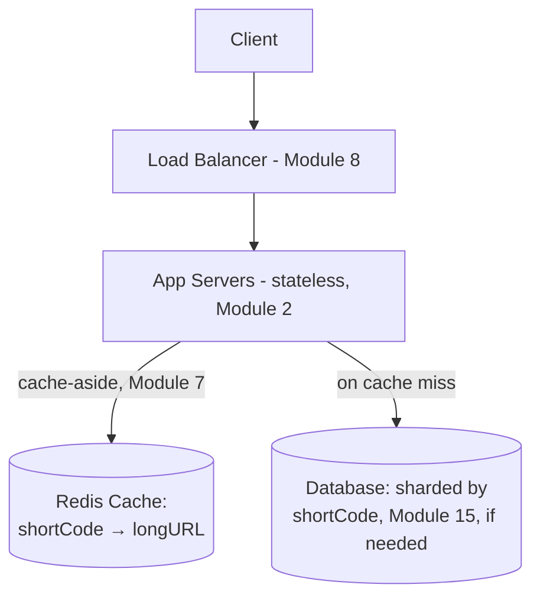
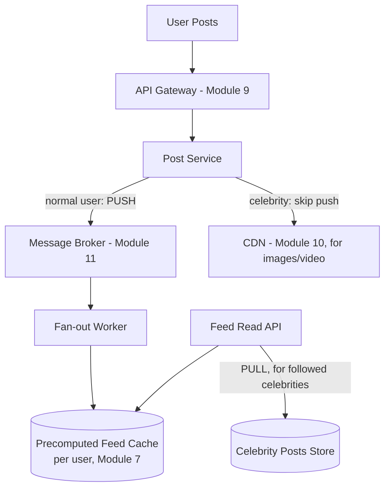
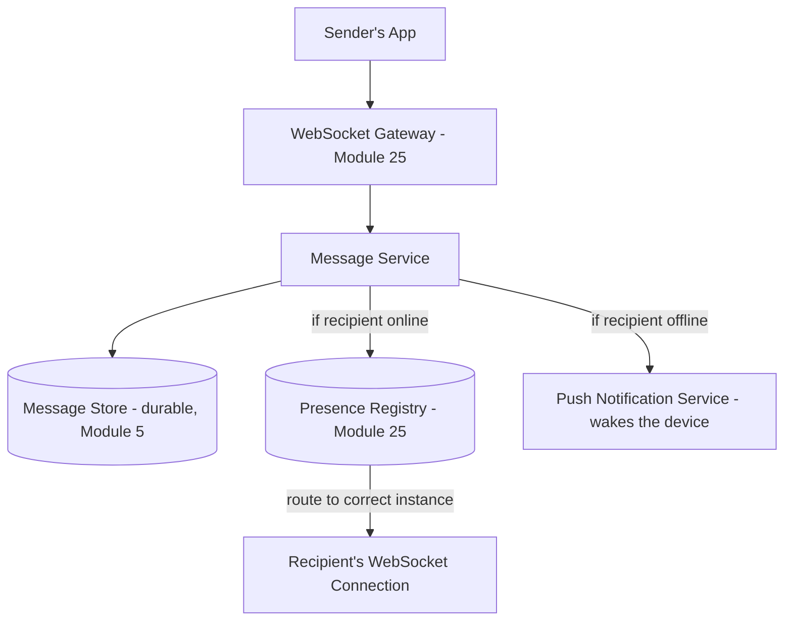
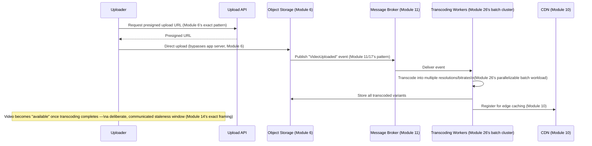
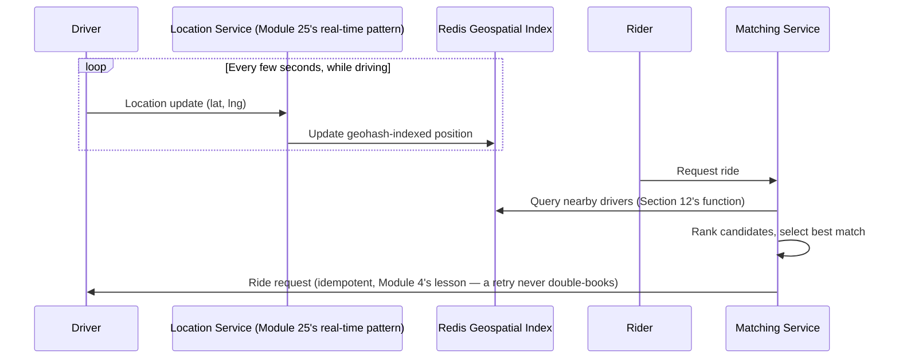
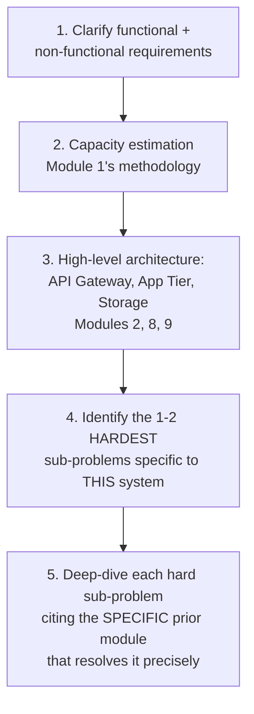
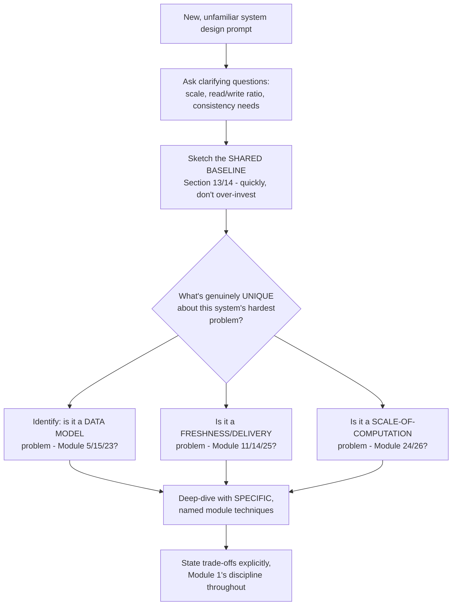
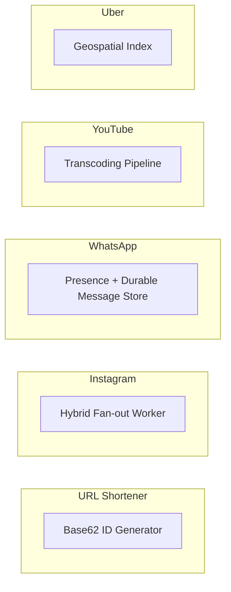

# Module 27 — Designing Popular Systems

> **Masterclass:** System Design Masterclass (30 Modules)
> **Level:** Expert
> **Audience:** Node.js backend developers, SDE‑2 / Senior Backend interview candidates, engineers transitioning into architecture roles
> **Prerequisite:** Modules 1–26 (the entire masterclass — this module is pure synthesis)

---

## 1. Introduction

Twenty-six modules have each isolated one technique — sharding, caching, consensus, event sourcing — and studied it in careful, deliberate depth. Real system design interviews, and real engineering work, never ask for one technique in isolation. They ask "design Instagram" or "design a URL shortener," and the actual skill being assessed is whether you can **select, combine, and sequence** the right subset of everything you've learned into a coherent whole, under real constraints and real interview time pressure.

This module is that synthesis. We design five of the most commonly asked systems — **URL Shortener**, **Instagram's Feed**, **WhatsApp**, **YouTube**, and **Uber** — each end to end, each explicitly citing which prior module's pattern is being applied and why. The goal is not to introduce new techniques (there are none left to introduce) but to build the *judgment* of composition: which five or six modules out of the prior twenty-six actually matter for *this specific* system, in *this specific* order.

---

## 2. Learning Objectives

By the end of this module, you will be able to:

1. Apply the **requirement-gathering framework** (functional/non-functional, capacity estimation) to any new system design prompt within the first few minutes.
2. Design a **URL Shortener**, correctly applying ID generation, caching, and read/write ratio reasoning.
3. Design **Instagram's feed**, correctly applying fan-out strategies, CQRS, and CDN-based media delivery.
4. Design **WhatsApp**, correctly applying Module 25's real-time architecture, message delivery guarantees, and end-to-end considerations.
5. Design **YouTube**, correctly applying video storage, transcoding pipelines, and CDN delivery at scale.
6. Design **Uber**, correctly applying geospatial indexing, real-time location tracking, and matching-algorithm trade-offs.
7. Recognize the **recurring skeleton** underlying all five designs, and use it as a starting template for any novel system design prompt.

---

## 3. Why This Concept Exists

Every module in this course has deliberately isolated one concern to study it without distraction — Module 15 studied sharding without simultaneously worrying about caching; Module 21 studied rate limiting without simultaneously worrying about consensus. This isolation was pedagogically necessary, but it created an implicit gap: **knowing twenty-six individual tools does not automatically produce the judgment of which five to pick up for a specific job.** A system design interview, and real architectural work, is fundamentally a **selection and sequencing** problem — most of the modules in this course will be *irrelevant* to any single given system, and correctly identifying which ones matter, in which order, under time pressure, is itself a skill requiring deliberate practice.

This module exists to provide that practice directly, using the five systems most commonly requested in real interviews — not because memorizing these five specific designs is the goal, but because working through them explicitly, always citing *which* module justifies *which* decision, builds the transferable pattern-recognition needed for the sixth, novel system you'll actually be asked to design.

---

## 4. Problem Statement

> For each of the five systems below, produce a complete design following the same disciplined sequence: (1) clarify functional and non-functional requirements, (2) perform capacity estimation, (3) produce a high-level architecture, (4) identify the one or two hardest sub-problems specific to this system, and (5) explicitly cite which prior module's pattern resolves each hard sub-problem. This structure itself — not any single system's specific answer — is the actual, transferable deliverable of this module.

---

## 5. Real-World Analogy

**Designing a popular system in an interview is like a chef being asked to cook a specific, named dish under a time limit, having spent months separately mastering individual techniques — knife skills, sauce reduction, protein searing — in isolated lessons.** The chef who succeeds isn't the one who mechanically recites every technique they know; it's the one who instantly recognizes "this dish needs a reduction and a careful sear, but no complex knife work at all," and confidently skips the ninety percent of their training that's irrelevant to *this specific plate.* This module is that recognition practice, dish by dish.

---

## 6. Technical Definition

**System Design Interview Framework:** A disciplined, repeatable sequence — clarify requirements, estimate capacity, sketch high-level architecture, identify and deep-dive the hardest sub-problems, discuss trade-offs — applied consistently regardless of which specific system is being designed.

**Fan-out (feed systems):** The strategy determining when a post becomes visible to followers — computed eagerly at write time ("push," Module 11's pub/sub applied to feed generation) or lazily at read time ("pull," computed on demand) — directly extending Module 16's choreography/orchestration distinction to feed architecture specifically.

**Geospatial Indexing:** A technique (e.g., geohashing, quadtrees) for efficiently querying "what's near this location," foundational to ride-sharing and delivery-matching systems.

---

## 7. Core Terminology

| Term | Precise Definition | One-line Intuition |
|---|---|---|
| **Push Model (fan-out)** | Pre-computing and delivering a post to every follower's feed at write time | "Deliver to everyone's mailbox immediately" |
| **Pull Model (fan-out)** | Computing a user's feed on demand at read time, by querying who they follow | "Assemble the newspaper only when someone asks to read it" |
| **Celebrity Problem** | The fan-out cost explosion when a user with millions of followers posts, making push-model fan-out prohibitively expensive for that one user | "One mailing costing millions of stamps at once" |
| **Geohashing** | Encoding a latitude/longitude pair into a short string such that nearby locations share string prefixes, enabling efficient proximity queries | "Zip codes for exact coordinates, with nesting" |
| **Chunked/Adaptive Bitrate Streaming** | Splitting video into small segments encoded at multiple quality levels, letting a client switch quality dynamically based on network conditions | "Choosing a lower-resolution TV channel automatically when your signal weakens" |
| **Idempotent Ride Request** | A ride-booking request designed so a client's retry (Module 4's idempotency lesson) never creates two separate ride bookings | "Retrying 'hail a cab' never accidentally calls two cabs" |

---

## 8. Internal Working — Design 1: URL Shortener

### Requirements

**Functional:** Given a long URL, generate a short, unique alias; given the alias, redirect to the original URL.
**Non-functional:** Extremely read-heavy (Module 7's exact caching justification — reads vastly outnumber writes), low latency redirects, high availability, uniqueness guaranteed under concurrent creation.

### Capacity Estimation (Module 1's methodology, applied)

```
Assume 100M new URLs/month, 100:1 read:write ratio
Writes: 100,000,000 / (30 × 86,400) ≈ 39 writes/sec average
Reads: 39 × 100 ≈ 3,900 reads/sec average (peak, ×5 factor ≈ 19,500 reads/sec)
Storage: 100M URLs/month × 500 bytes/record × 12 months × 5 years ≈ 3 TB over 5 years — trivial (Module 6)
```

### The one hard sub-problem: unique ID generation under concurrency

A naive auto-incrementing counter (Module 5) becomes a bottleneck and single point of failure at scale (Module 1's SPOF principle) if centralized, and a UUID (Module 5) is safe but produces a long, non-shortened-feeling alias. The standard resolution: **base62-encode a distributed, monotonically-increasing ID** (Module 22's fencing-token counter concept, reused directly) or use a **pre-generated pool of unique IDs** distributed across app servers (avoiding Module 22's coordination cost entirely for the common case).

```javascript
function toBase62(num) {
  const chars = 'abcdefghijklmnopqrstuvwxyzABCDEFGHIJKLMNOPQRSTUVWXYZ0123456789';
  let result = '';
  while (num > 0) {
    result = chars[num % 62] + result;
    num = Math.floor(num / 62);
  }
  return result;
}
// A 7-character base62 string covers 62^7 ≈ 3.5 trillion unique URLs — more than sufficient
```

### Architecture



**Module citations, explicitly:** Module 7's cache-aside pattern (the overwhelming read majority means nearly every redirect is a cache hit); Module 2's stateless app tier; Module 15's sharding *only* if storage/write volume genuinely exceeds a single instance's capacity (Section 12's decision discipline — at 3TB/5 years, this system likely does NOT need sharding, a deliberate, stated non-decision).

---

## 9. Internal Working — Design 2: Instagram's Feed

### Requirements

**Functional:** Users follow other users; a home feed shows recent posts from followed accounts, roughly chronological or ranked.
**Non-functional:** Extremely read-heavy, must handle users with millions of followers (the celebrity problem, Section 6) without degrading system-wide performance, low feed-load latency.

### The one hard sub-problem: push vs. pull fan-out, and the celebrity problem

**Push (write-time fan-out):** when User A posts, immediately write that post into every one of A's followers' precomputed feed lists (Module 16's choreography pattern, Module 17's CQRS write-side). Fast reads (the feed is already assembled), but catastrophic for a celebrity with 50 million followers — a single post would require 50 million writes (Section 7's named celebrity problem).

**Pull (read-time fan-out):** when a user opens their feed, query all accounts they follow and merge recent posts on demand. No celebrity problem (one post, one write, regardless of follower count), but slow reads for a user following thousands of accounts (many queries merged at read time).

**The resolution, directly extending Module 24's hybrid-blending discipline:** a **hybrid** — push for the vast majority of normal users (fast reads, tolerable write cost), pull specifically for celebrity accounts' posts (avoiding the write explosion), merged at read time for any user following at least one celebrity.

```javascript
async function getFeed(userId) {
  const precomputedFeed = await getPrecomputedFeed(userId); // push-model result (Module 7-cached)
  const followedCelebrities = await getFollowedCelebrities(userId); // accounts using PULL model
  const celebrityPosts = await Promise.all(
    followedCelebrities.map(c => getRecentPosts(c.id))
  );
  return mergeAndRank([...precomputedFeed, ...celebrityPosts.flat()]); // Module 24's ranking discipline
}
```

### Architecture



**Module citations, explicitly:** Module 11's async queue for fan-out (never block the post-creation request on fanning out to millions of followers — directly Module 11's original motivation); Module 10's CDN for image/video delivery (Module 6's storage principle: never store media blobs in the primary database); Module 24's ranking/blending discipline for merging push and pull results.

---

## 10. Internal Working — Design 3: WhatsApp

### Requirements

**Functional:** One-to-one and group messaging, delivery/read receipts, online presence, media sharing.
**Non-functional:** Extremely low latency, message delivery must survive brief disconnections (Module 12's ambiguity), end-to-end privacy expectations.

### The one hard sub-problem: guaranteed message delivery across unreliable mobile connections

Directly extending Module 25's real-time architecture: a WebSocket connection (Module 4, 25) delivers messages while a client is connected — but mobile clients disconnect constantly (network switching, backgrounding). **The message must not be lost** if the recipient is briefly offline, requiring Module 11's exact durable-queue philosophy applied to person-to-person messaging specifically.

```javascript
async function sendMessage(senderId, recipientId, text) {
  const message = { id: generateId(), senderId, recipientId, text, status: 'sent', timestamp: Date.now() };
  await db.insert('messages', message); // DURABLE persistence FIRST (Module 5's ACID guarantee)

  const recipientOnline = await presenceManager.isOnline(recipientId); // Module 25's exact presence check
  if (recipientOnline) {
    await deliverViaWebSocket(recipientId, message); // real-time delivery
    await updateStatus(message.id, 'delivered');
  }
  // If offline: message sits durably in the DB. On the recipient's NEXT connect,
  // undelivered messages are queried and pushed — directly Module 11's "queue absorbs
  // the backlog until the consumer is ready" principle, applied to a HUMAN consumer
}
```

### Architecture



**Module citations, explicitly:** Module 25's presence and WebSocket architecture (directly reused, not reinvented); Module 5's durable persistence as the source of truth (never trust real-time delivery alone for something as important as a message); Module 11's "durable buffer absorbs the gap until the consumer returns" philosophy, applied to a temporarily-offline human recipient rather than a temporarily-slow service consumer; Module 4's exact idempotency lesson for retry-safe message sending (a client retrying a "send" after an ambiguous timeout must not create a duplicate message — Module 4/11's idempotency key pattern, reused).

---

## 11. Internal Working — Design 4: YouTube

### Requirements

**Functional:** Users upload video; other users stream video, adapting to their network conditions.
**Non-functional:** Enormous storage volume, video delivery must be low-latency globally, upload-to-available latency should be reasonable but not necessarily instant.

### The one hard sub-problem: transcoding pipeline and adaptive delivery

A single uploaded video file must be transcoded into **multiple resolutions and bitrates** (Section 7's adaptive bitrate streaming) before it can be efficiently, adaptively delivered — a genuinely large-scale, variable-duration batch computation, directly Module 26's exact domain.



**Module citations, explicitly:** Module 6's presigned-URL upload pattern (never route large video files through the app server); Module 11's event-driven pipeline (decouple upload confirmation from the slow, variable-duration transcoding work); Module 26's batch processing model (transcoding a video into multiple formats is exactly the parallelizable, MapReduce-adjacent workload that module addressed, though here parallelized across resolution variants rather than data partitions); Module 10's CDN for actual video delivery, the single most important module for this system's core, defining latency requirement (Module 3's distance-latency problem, at its most consequential for large binary payloads).

---

## 12. Internal Working — Design 5: Uber

### Requirements

**Functional:** Riders request rides; the system matches them with nearby available drivers; both parties track the ride's real-time location.
**Non-functional:** Extremely low latency for location updates and matching, must handle a genuinely two-sided, geographically-distributed real-time marketplace.

### The one hard sub-problem: efficient proximity queries and real-time location tracking

"Find available drivers within 2km of this rider" is a fundamentally different query shape than anything Module 5's B-tree indexing handles well (a 2D proximity query, not a 1D sorted-value lookup) — directly extending Module 23's "different data structure for a different question" lesson to geospatial data specifically.

```javascript
// Geohashing (Section 7): encode lat/lng into a string where shared prefixes mean geographic proximity
function geohash(lat, lng, precision = 6) {
  // simplified conceptual encoding — real implementations use a proper geohash library
  // Nearby coordinates produce STRINGS SHARING A COMMON PREFIX, enabling efficient prefix-based lookup
}

async function findNearbyDrivers(riderLat, riderLng, radiusKm) {
  const riderHash = geohash(riderLat, riderLng, 5); // precision level tuned to radiusKm
  const neighboringHashes = getNeighboringGeohashes(riderHash); // adjacent grid cells too (boundary cases)
  const candidateDrivers = await redis.sunion(
    ...neighboringHashes.map(h => `drivers:geohash:${h}`) // Module 7's Redis set operations, geospatially applied
  );
  return candidateDrivers.filter(d => haversineDistance(riderLat, riderLng, d.lat, d.lng) <= radiusKm);
}
```

**Driver location updates as a real-time, high-frequency stream** — directly Module 25's presence architecture, generalized from "online/offline" to "online AND at this specific, continuously-updating location," and Module 26's stream processing model for aggregating location updates at city-wide scale.



**Module citations, explicitly:** Module 25's real-time, presence-style architecture (generalized to continuously-updating location, not just binary online/offline); Module 5/23's "different data structure for a different question" principle, applied to geospatial indexing specifically; Module 4's idempotency for ride-request retries (a critical, real-world correctness requirement — a network-retried ride request must never book two separate cars); Module 15's sharding by geographic region at true global scale (a natural, low-collision sharding key, directly Module 15's key-selection discipline).

---

## 13. The Recurring Skeleton — Extracting the Transferable Pattern

Across all five designs, notice the **same five-step sequence** and a **strikingly small, recurring set of modules** doing the heavy lifting every time:



**The recurring "usual suspects," across all five designs:** Module 2 (stateless scaling) and Module 8 (load balancing) appear in *every* design's baseline architecture, unremarkably. Module 7 (caching) appears in four of five. Module 11 (async decoupling) appears in four of five, always at the exact point where a slow or unbounded operation must not block a fast, user-facing response. **The differentiating modules** — the ones that actually distinguish one system's hard problem from another's — are usually just one or two: Module 22's ID-generation-adjacent counter for the URL shortener; Module 16/24's fan-out and hybrid blending for Instagram; Module 25's presence and delivery guarantees for WhatsApp; Module 26's batch transcoding for YouTube; Module 23's alternative-data-structure lesson (applied to geospatial indexing) for Uber.

**This is the actual, transferable skill this module builds:** in a new, unfamiliar system design prompt, the baseline architecture (Modules 2, 7, 8, 9, 11) is nearly always correct to sketch quickly and move past — the interview (and the real engineering value) is almost entirely in correctly identifying *that system's specific* one or two hard sub-problems and reaching for the *specific* right module's technique, not in re-deriving load balancing from scratch every time.

---

## 14. ASCII Diagrams — The Shared Baseline, Visualized Once

```
EVERY ONE OF THESE FIVE SYSTEMS SHARES THIS UNREMARKABLE BASELINE:

  Client ──▶ [Load Balancer, Module 8] ──▶ [API Gateway, Module 9] ──▶ [Stateless App Tier, Module 2]
                                                                              │
                                                          ┌───────────────────┼───────────────────┐
                                                          ▼                   ▼                   ▼
                                                   [Cache, Module 7]   [Async Queue,        [Durable Storage,
                                                                        Module 11]           Module 5/6/15]

  WHAT ACTUALLY DIFFERS, system to system, is what plugs into the RIGHT-HAND side:
    URL Shortener → simple KV lookup, Module 22-style ID generation
    Instagram     → Module 16/24's fan-out + hybrid ranking
    WhatsApp      → Module 25's presence + delivery-guarantee durability
    YouTube       → Module 26's transcoding pipeline + Module 10's CDN
    Uber          → Module 23-style alternative indexing (geospatial) + Module 25's location stream
```

---

## 15. Mermaid Flowcharts — A General-Purpose Interview Approach



---

## 16. Mermaid Sequence Diagrams

*(Sections 8–12 each include the canonical sequence/architecture diagram for their specific system. This module's diagrams are distributed across those sections rather than centralized, since each system's "hard problem" diagram is the pedagogically important one.)*

---

## 17. Component Diagrams — Comparing All Five Designs' "Differentiator" Component



**Why isolating exactly one "differentiator" component per system is the pedagogically correct simplification:** in a real interview or design document, dozens of components exist — but this module's discipline of naming *the one that actually makes this system hard*, and tracing it back to a specific prior module, is precisely the compression that turns twenty-six modules of individual knowledge into usable, applied judgment.

---

## 18. Deployment Diagrams — Where These Five Systems' Scale Genuinely Differs

```mermaid
flowchart TB
    subgraph URL Shortener - modest scale
        Small[Single-region, Module 15 sharding likely UNNEEDED]
    end
    subgraph Instagram/YouTube/Uber - massive, global scale
        Large[Multi-region, Module 15 sharding REQUIRED,\nModule 10 CDN ESSENTIAL, not optional]
    end
```

**Why this deployment-scale distinction matters, directly connecting to Module 1's premature-complexity discipline:** a correct URL shortener design explicitly, deliberately does *not* need Module 15's sharding or a multi-region deployment at any realistic scale — stating this explicitly, rather than defaulting to maximal complexity for every system regardless of its actual requirements, is itself a demonstration of the judgment this entire module aims to build.

---

## 19. Network Diagrams

Every one of these five systems follows Module 3's identical network-isolation baseline (public load balancer, private app tier, private data tier) — this module deliberately does not re-derive that baseline five times, precisely because Section 13's "recurring skeleton" lesson is that this part of the architecture is unremarkable and should be dispatched quickly in any real interview, reserving time for each system's actual differentiator.

---

## 20. Database Design — Contrasting Choices Across the Five Systems

| System | Primary Data Store Choice | Module Justification |
|---|---|---|
| URL Shortener | Simple key-value (Redis-cached, relational or KV backing) | Module 5's "simple access pattern → simple store" principle |
| Instagram | Relational (users/posts) + object storage (media) + cache (feed) | Module 5's polyglot persistence, Module 6's blob-storage separation |
| WhatsApp | Relational/durable log (messages) — durability is paramount | Module 5's ACID guarantee as the correctness backbone |
| YouTube | Object storage (video) + relational (metadata) | Module 6's exact "never store large blobs in a relational DB" lesson |
| Uber | Geospatial index (Redis/specialized) + relational (ride records) | Module 23's "different data structure for a different question" |

---

## 21. API Design — A Shared Discipline Across All Five

Every system's API should, per Module 9 and Module 21's disciplines, clearly document authentication requirements, rate limits, and idempotency guarantees per endpoint — this is not system-specific; it's Module 20/21's universal API-contract discipline, applied identically regardless of which system is being designed.

---

## 22. Scalability Considerations — The Same Question, Five Different Answers

For every system, ask Module 2's exact question — "which specific component is the actual bottleneck, and does scaling it require Module 2's simple horizontal replication, or Module 15's sharding?" — URL Shortener's answer is almost always "neither, yet"; Instagram, YouTube, and Uber's answer is almost always "both, and soon."

---

## 23. Reliability & Fault Tolerance — Applying Module 18 Uniformly

Every external call in every one of these five systems (a database query, a third-party geocoding API, a payment processor) should have Module 18's full treatment — timeout, retry with backoff, circuit breaker, bulkhead — applied by default, not as a system-specific consideration. This module does not re-derive Module 18's patterns per system precisely because they apply identically everywhere; the differentiator is *which specific calls* need this treatment, not *whether* the treatment itself changes.

---

## 24. Security Considerations — Applying Module 20 Uniformly

Similarly, Module 20's authentication/authorization/least-privilege discipline applies identically across all five systems — WhatsApp's end-to-end privacy expectations are a *heightened*, not fundamentally different, version of the same authorization principles Module 20 already established.

---

## 25. Performance Optimization — Where the Five Systems Actually Diverge

This is where genuine system-specific divergence occurs: URL Shortener optimizes for cache hit ratio (Module 7); Instagram optimizes for fan-out cost (Section 9); WhatsApp optimizes for delivery latency (Module 25); YouTube optimizes for transcoding throughput (Module 26) and CDN hit ratio (Module 10); Uber optimizes for geospatial query latency (Section 12) and location-update throughput (Module 25/26).

---

## 26. Monitoring & Observability — Applying Module 19 With System-Specific Signals

Module 19's three-pillar framework applies universally, but the *specific* signals worth watching differ meaningfully: URL Shortener watches cache hit ratio; Instagram watches fan-out queue depth and celebrity-post detection accuracy; WhatsApp watches message delivery latency and presence accuracy; YouTube watches transcoding queue depth and CDN cache hit ratio; Uber watches geospatial query latency and driver-location-update freshness.

---

## 27. Common Bottlenecks — A Comparative Table

| System | Most Likely First Bottleneck | Module Addressing It |
|---|---|---|
| URL Shortener | Database write contention under extreme, unlikely viral growth | Module 15 (sharding), if ever actually needed |
| Instagram | Celebrity-post fan-out cost | Module 16/24's hybrid push/pull |
| WhatsApp | WebSocket connection count per instance | Module 25's connection-state scaling |
| YouTube | Transcoding pipeline throughput | Module 26's parallel batch processing |
| Uber | Geospatial query latency under high driver density | Module 23's indexing structure choice |

---

## 28. Trade-off Analysis — One Explicit Example Per System

> **URL Shortener:** "I chose NOT to shard the database initially, optimizing for simplicity, accepting the (currently negligible) risk of eventually needing Module 15's sharding as data grows — a deliberate, stated non-decision, not an oversight."

> **Instagram:** "I chose a hybrid push/pull fan-out model, optimizing for avoiding the celebrity-post write explosion while keeping normal-user reads fast, at the cost of more complex merge logic at read time."

> **WhatsApp:** "I chose to persist every message durably before attempting real-time delivery, optimizing for zero message loss even under a recipient's brief disconnection, at the cost of a small, additional write-latency overhead on every single message."

> **YouTube:** "I chose an asynchronous, event-driven transcoding pipeline, optimizing for upload-request responsiveness, at the cost of a deliberate, communicated delay before a video becomes fully available in all resolutions."

> **Uber:** "I chose geohashing over a naive full-table proximity scan, optimizing for query latency at scale, at the cost of needing to handle geohash boundary edge cases (Section 12's neighboring-hash lookup) explicitly."

---

## 29. Anti-patterns & Common Mistakes

1. **Diving immediately into a specific technology choice** ("I'll use Kafka") before clarifying requirements and estimating capacity — Module 1's opening discipline, most commonly abandoned under interview time pressure.
2. **Spending disproportionate interview time on the shared baseline** (Section 13/14) rather than the system's actual, differentiating hard problem — a common, avoidable time-management failure.
3. **Applying Module 15's sharding, or Module 26's Spark/Flink, reflexively to every system** regardless of actual, stated scale — this module's URL Shortener design deliberately demonstrates the opposite discipline.
4. **Failing to explicitly name which prior technique is being applied and why** — a design that "happens to look like" a cache-aside pattern without the candidate explicitly stating "this is cache-aside, chosen because reads vastly outnumber writes" signals memorization, not understanding.
5. **Treating all five systems as needing an identical architecture** — precisely the opposite of this module's Section 13 lesson: the baseline is shared, but the differentiator is not.

---

## 30. Production Best Practices

- **Always sequence: requirements → capacity estimation → baseline architecture → hard-problem deep-dive → trade-offs** — the same five-step discipline, every time, regardless of which system is being designed.
- **Identify the one or two genuinely hard, system-specific sub-problems explicitly**, and spend the majority of available time there.
- **Cite the specific prior technique by name and module** when applying it — this signals genuine understanding, not pattern-matched vocabulary.
- **State explicitly when a technique is deliberately NOT needed** for the current system's stated scale (the URL Shortener's non-sharding decision) — this is as valuable a signal as correctly applying a technique when it IS needed.
- **Practice this exact five-step sequence on unfamiliar systems**, not just memorizing these five specific designs, since the transferable skill is the sequence and judgment, not the specific answers.

---

## 31. Real-World Examples

- **Bitly's publicly documented architecture** for URL shortening directly validates Section 8's core design — a simple, cache-heavy, minimally-sharded system at even very large real-world scale, confirming this module's "don't over-engineer" lesson with real, citable evidence.
- **Instagram's engineering blog's well-documented discussion of their feed architecture's evolution** directly confirms Section 9's hybrid push/pull approach and the specific celebrity-problem motivation, at real, massive production scale.
- **WhatsApp's famously small engineering team supporting an enormous user base** (widely discussed in industry retrospectives) is frequently cited as validation that Module 25's core real-time patterns, applied with discipline, scale further with less organizational overhead than commonly assumed — a useful, real-world counter to any instinct toward unnecessary architectural complexity.

---

## 32. Node.js Implementation Examples

*(Each of Sections 8–12 already includes complete, working Node.js code for that system's specific hard sub-problem — the base62 ID generator, the hybrid feed-merging function, the durable-then-real-time message send, the transcoding-pipeline event flow, and the geospatial nearby-drivers query. This module's implementation examples are deliberately distributed across those sections, since presenting them in context, immediately following each system's specific problem statement, is pedagogically more effective than a separate, decontextualized code appendix.)*

---

## 33. Interview Questions

### Easy
1. What are the five steps of a disciplined system design interview approach?
2. Why doesn't a URL shortener typically need database sharding at most realistic scales?
3. What is the celebrity problem in feed system design, and which fan-out model does it primarily affect?
4. Why must a chat application persist a message durably before attempting real-time delivery?
5. Why can't a video be made available for streaming immediately upon upload completion?
6. Why is a standard B-tree index poorly suited to "find nearby drivers" queries?

### Medium
7. Design the ID-generation strategy for a URL shortener, comparing a centralized counter, UUIDs, and a distributed pre-allocated pool.
8. Explain the push versus pull fan-out trade-off for a social media feed, and design a hybrid approach resolving both models' weaknesses.
9. Design the message delivery flow for a chat application, addressing both the online and offline recipient cases.
10. Design a video transcoding pipeline, explaining why it should be asynchronous and event-driven rather than synchronous with the upload request.
11. Explain geohashing and how it enables efficient "nearby" queries, including how boundary cases between adjacent geohash cells are handled.
12. For each of the five systems in this module, name the ONE module whose technique is most critical to that system's core hard problem.

### Hard
13. Design a complete URL shortener system end to end, including capacity estimation, ID generation, caching strategy, and an explicit justification for why sharding is or isn't needed at the stated scale.
14. Design Instagram's complete feed architecture, addressing normal-user push fan-out, celebrity-account pull fan-out, and the read-time merge/ranking logic.
15. Design WhatsApp's complete message delivery architecture, addressing presence, real-time delivery, offline message queuing, and idempotent retry handling.
16. Design YouTube's complete video pipeline, from presigned upload through transcoding to adaptive-bitrate CDN delivery, citing the specific prior modules justifying each stage.
17. Design Uber's complete ride-matching architecture, addressing real-time driver location tracking, geospatial candidate search, and idempotent ride-request handling.

---

## 34. Scenario-Based Design Questions

1. **Scenario:** You're asked to design a URL shortener but the interviewer adds "expect a link to occasionally go viral, generating 100,000 reads/second for that one link." Diagnose whether this changes your architecture and how.
2. **Scenario:** A specific celebrity account on your Instagram-like platform has 200 million followers. Walk through exactly what would happen if you used pure push-model fan-out for this account, with real numbers.
3. **Scenario:** A WhatsApp user sends a message, their phone loses signal for 30 seconds, then reconnects. Walk through the complete message flow and confirm no message is lost or duplicated.
4. **Scenario:** A YouTube video is uploaded but a bug causes the transcoding pipeline to silently fail for the 1080p variant only, while other resolutions succeed. Design the monitoring that would catch this.
5. **Scenario:** An Uber rider is in a sparsely-populated area with no drivers within the default 2km search radius. Design the fallback behavior.
6. **Scenario:** An interviewer asks you to design a system genuinely novel to you — a food delivery platform's real-time order tracking. Walk through applying this module's Section 15 five-step framework live, reasoning about which prior modules apply.
7. **Scenario:** You're asked to estimate whether a URL shortener needs multi-region deployment. Walk through the reasoning, referencing Module 3's distance-latency lesson and this module's Section 18 deployment-scale distinction.
8. **Scenario:** Your Instagram-like feed's hybrid fan-out correctly handles celebrities but is now slow for a "power user" who follows 10,000 accounts, none of which are celebrities. Diagnose and propose a fix.
9. **Scenario:** A security review asks whether your WhatsApp-like system's message store, if compromised, would expose message content. Discuss end-to-end encryption's architectural implications on this module's design.
10. **Scenario:** You must justify, to a skeptical stakeholder, why Uber's driver-matching system needs geospatial indexing rather than "just querying all drivers and filtering in application code." Provide the precise, quantified argument.

---

## 35. Hands-on Exercises

1. Implement the base62 ID generator from Section 8, and build a complete, working URL shortener API (create + redirect endpoints) with Redis caching.
2. Implement the hybrid feed-merging function from Section 9 against a small, synthetic dataset of "normal" and "celebrity" accounts, verifying the correct fan-out model is applied to each.
3. Implement the durable-then-real-time message send flow from Section 10, simulating both an online and an offline recipient, verifying correct behavior in both cases.
4. Implement a simplified transcoding-pipeline event flow (Section 11) using a local message queue, simulating multiple resolution variants being processed independently.
5. Implement the geohashing-based nearby-drivers query from Section 12 against a small, synthetic set of driver locations, verifying correct proximity results including a boundary case.

---

## 36. Mini Project

**Build:** A complete, working URL shortener, directly implementing Module 27's Design 1 end to end.

**Requirements:**
- Implement the base62 ID generation strategy (Section 8), with a documented capacity estimation justifying your chosen ID length.
- Implement cache-aside Redis caching (Module 7) for redirects.
- Implement basic rate limiting (Module 21) on the URL-creation endpoint.
- Write a one-page design document following this module's exact five-step sequence (Section 15), explicitly citing which prior modules justify each decision, and explicitly stating why sharding is not yet needed.

**Success criteria:** Your working API correctly creates and redirects shortened URLs, your cache hit ratio is measurably high under a read-heavy simulated load test, and your design document demonstrates the complete, disciplined five-step sequence with explicit module citations throughout.

---

## 37. Advanced Project

**Build:** A complete design document (not necessarily full implementation, given scope) for all five systems in this module, applying the five-step framework rigorously to each.

1. For each of the five systems, produce the full five-step design document (requirements, capacity estimation, architecture diagram, hard-problem deep-dive, trade-off statement), explicitly citing specific prior modules throughout, following Sections 8–12's exact structure as your template.
2. Additionally choose ONE genuinely novel system not covered in this module (e.g., a hotel booking platform, a stock trading platform, or a food delivery service) and apply the identical five-step framework to it from scratch, demonstrating the transferable skill this module aims to build.
3. For your novel system, explicitly complete Section 13's "recurring skeleton" exercise: identify which modules form the unremarkable shared baseline, and which one or two modules resolve the system's actual, unique hard problem.
4. Present all six design documents (the five from this module, plus your novel sixth) with a final, one-page reflection explaining what, if anything, surprised you about how consistently the same small set of foundational modules (2, 7, 8, 9, 11) reappeared as baseline infrastructure across every single system.

**Success criteria:** You have six complete, disciplined design documents, each following the identical five-step sequence, each explicitly citing specific prior modules for every major decision, and a genuine, reflective demonstration that you've internalized the transferable pattern-recognition skill this module exists to build — setting up Module 28 (Distributed System Design Patterns), which catalogs the remaining named patterns (CQRS, Saga, Event Sourcing, Outbox, Sidecar, Strangler Fig, and others) as a complete, referenceable pattern-language capstone to this masterclass's theoretical content.

---

## 38. Summary

- **Every system design interview follows the same five-step sequence**: clarify requirements, estimate capacity, sketch a baseline architecture, identify and deep-dive the system's specific hard problem(s), and state trade-offs explicitly.
- **The baseline architecture — stateless app tier, load balancer, gateway, cache, async queue — is nearly identical across most systems** and should be dispatched efficiently, reserving the majority of design time for what's genuinely unique to the specific system at hand.
- **Each of the five systems examined has exactly one or two genuinely differentiating hard problems**: ID generation for URL shorteners, fan-out/celebrity handling for feeds, delivery guarantees for chat, transcoding pipelines for video, and geospatial indexing for ride-sharing.
- **Explicitly citing which prior module's technique resolves each hard problem**, and why, is the single clearest signal of genuine understanding versus memorized pattern-matching.
- **Explicitly stating when a technique is deliberately NOT needed** (the URL shortener's non-sharding decision) is as valuable a signal of judgment as correctly applying a technique when it is needed.
- **This module's real deliverable is the transferable five-step framework and pattern-recognition skill**, not memorization of these five specific designs — the same discipline applies directly to any novel, unfamiliar system design prompt.

---

## 39. Revision Notes

- Five-step sequence: requirements → capacity estimation → baseline architecture → hard-problem deep-dive → trade-offs
- Baseline (nearly universal): Module 2 (stateless), Module 7 (cache), Module 8 (LB), Module 9 (gateway), Module 11 (async queue)
- URL Shortener's hard problem: unique ID generation (base62, distributed counter) — sharding usually NOT needed
- Instagram's hard problem: push vs. pull fan-out, celebrity problem — hybrid resolution
- WhatsApp's hard problem: guaranteed delivery across unreliable connections — durable-first, then real-time
- YouTube's hard problem: transcoding pipeline (Module 26's batch model) + CDN delivery (Module 10)
- Uber's hard problem: geospatial indexing (geohashing) + real-time location streaming (Module 25)
- The transferable skill: correctly identify WHICH 1-2 modules matter for a NEW, unfamiliar system

---

## 40. One-Page Cheat Sheet

```
SYSTEM DESIGN — MODULE 27 CHEAT SHEET
─────────────────────────────────────
THE FIVE-STEP SEQUENCE (apply to ANY system)
  1. Clarify functional + non-functional requirements
  2. Capacity estimation (Module 1's methodology)
  3. Sketch the BASELINE (Modules 2, 7, 8, 9, 11 — usually unremarkable)
  4. Identify the 1-2 GENUINELY HARD, system-specific sub-problems
  5. Deep-dive each, citing the SPECIFIC prior module — state trade-offs

FIVE WORKED EXAMPLES — hard problem → module
  URL Shortener → unique ID generation → Module 22-style counter, base62
  Instagram     → push/pull fan-out, celebrity problem → Module 16/24 hybrid
  WhatsApp      → guaranteed delivery, offline gaps → Module 11/25 durable+real-time
  YouTube       → transcoding pipeline → Module 26 batch + Module 10 CDN
  Uber          → geospatial "nearby" queries → Module 23-style alt. indexing (geohash)

GOLDEN RULE
  The baseline is nearly IDENTICAL across systems — don't over-invest there.
  The interview (and the value) is almost ENTIRELY in the 1-2 differentiators.
  ALWAYS name which specific prior module/technique you're applying, and why.
  ALWAYS state explicitly when a technique is NOT needed at the given scale.
```

---

## Key Takeaways

- Every system design prompt, however unfamiliar, responds to the same disciplined five-step sequence — the skill this entire masterclass has been building toward is not memorizing individual techniques but developing the judgment to select and sequence the right handful of them under pressure.
- The overwhelming majority of any system's architecture is an unremarkable, shared baseline (stateless scaling, caching, gateways, async decoupling) — genuine design skill, and genuine interview signal, lives almost entirely in correctly identifying and deep-diving the one or two problems that are actually unique to the system at hand.
- Explicitly citing which prior module and technique resolves a given problem — and explicitly stating when a technique is deliberately not needed — is the clearest, most reliable signal separating real understanding from surface-level pattern recall.

## 20 Practice Questions
*(See Section 33 — 6 Easy, 6 Medium, 5 Hard — plus 3 rapid-fire additions:)*
18. Why does this module deliberately avoid re-deriving Module 3's network isolation baseline for each of the five systems individually?
19. What single capacity-estimation number most directly determines whether a URL shortener needs Module 15's sharding?
20. Why is "explicitly stating a technique is not needed" considered as valuable an interview signal as correctly applying one that is?

## 10 Scenario-Based Questions
*(See Section 34 in full.)*

## 5 Design Assignments
*(See Sections 36–37 — Mini Project and Advanced Project — plus:)*
1. Apply this module's five-step framework to design a hotel booking platform from scratch, explicitly identifying its baseline versus its genuinely unique hard problem(s).
2. Write a one-page comparison of Instagram's and Twitter's likely fan-out architectures, given their different follower-graph characteristics (Instagram's more symmetric follows vs. Twitter's more one-directional, celebrity-heavy structure).
3. Propose a complete design for a Netflix-style video streaming platform's "continue watching" feature, citing which specific prior modules justify your design choices.

## Suggested Next Module

**→ Module 28: Distributed System Design Patterns** — with five complete system designs now built end to end, we catalog the complete, named pattern language underlying all of them: CQRS, Saga, Event Sourcing, Outbox, Inbox, Sidecar, Strangler Fig, Circuit Breaker, Bulkhead, Retry, and Cache-Aside, presented as a unified, referenceable capstone to every individual technique this masterclass has taught.
