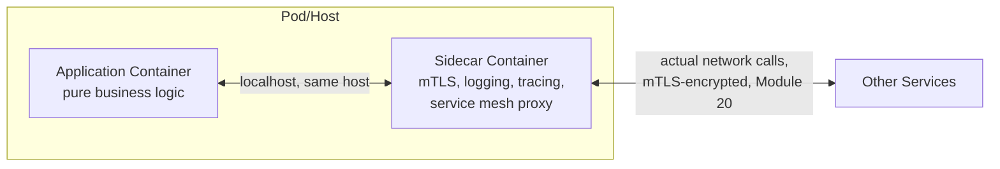
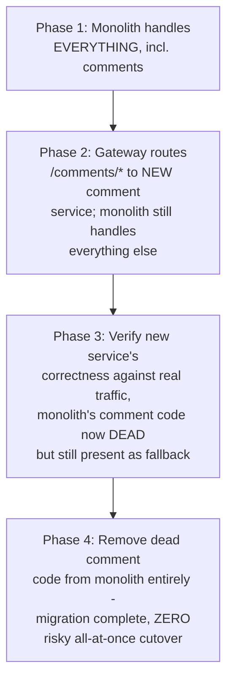
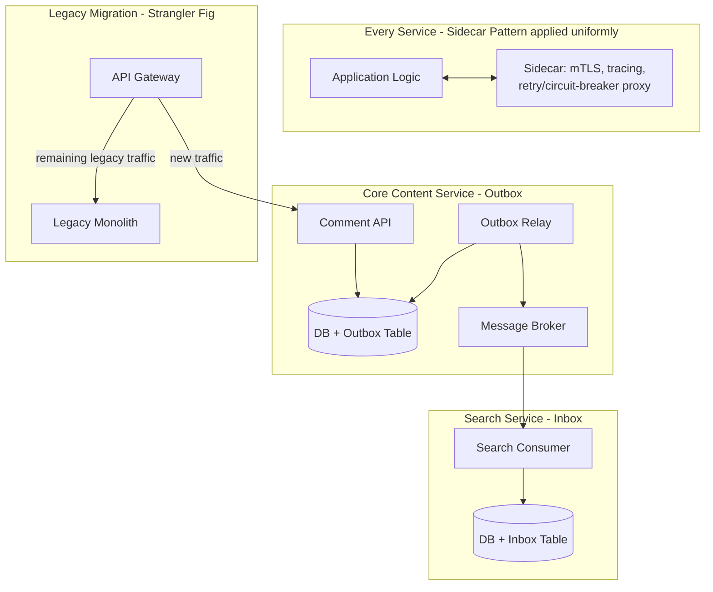
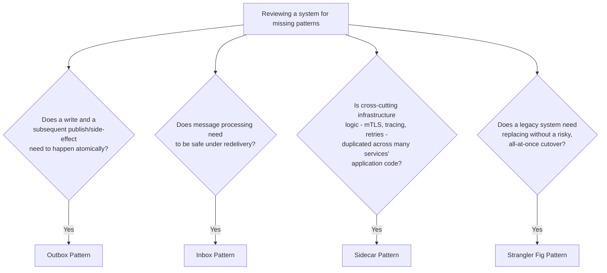
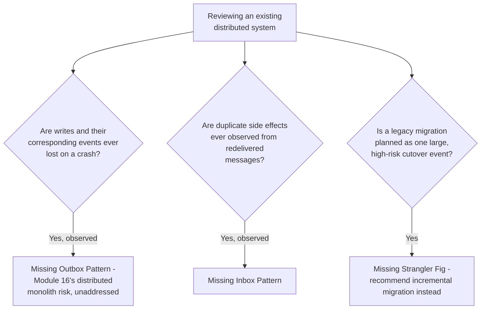
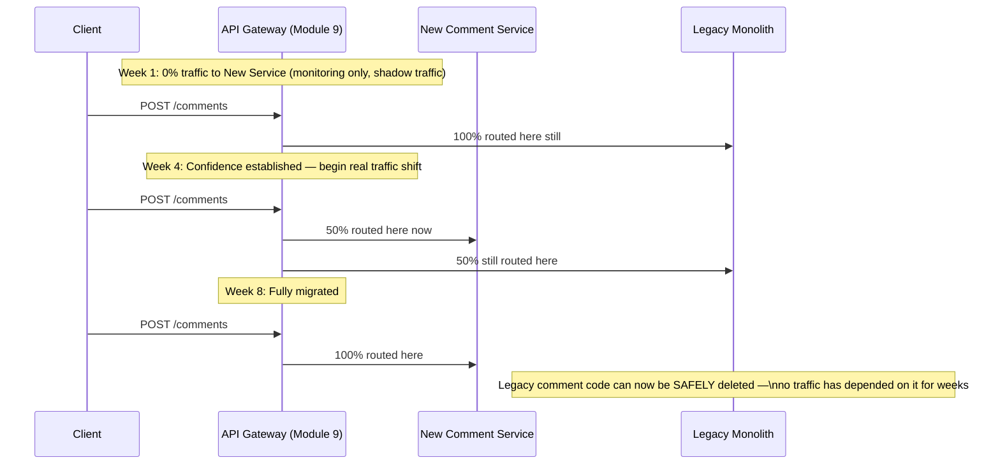
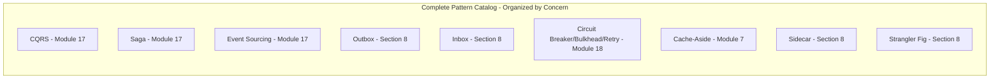
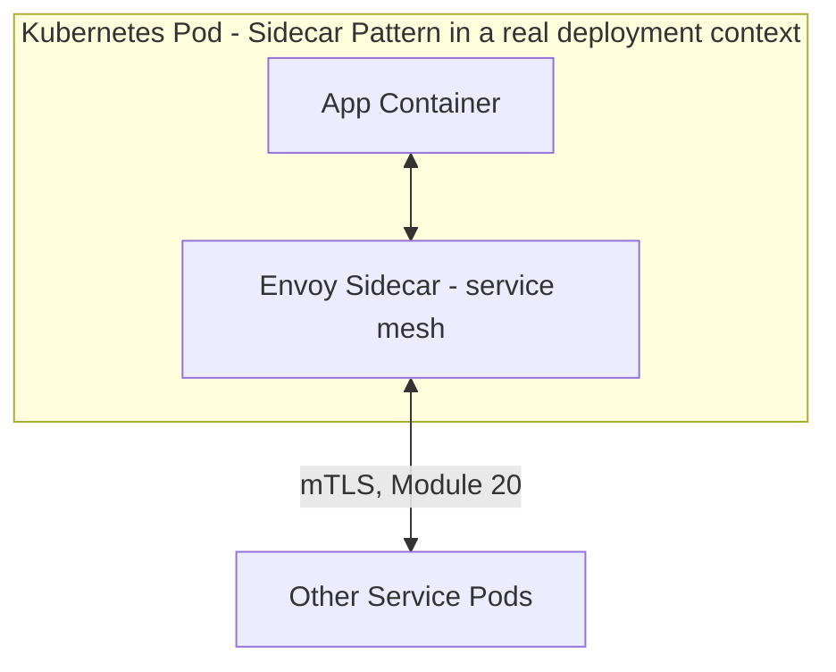

# Module 28 — Distributed System Design Patterns

> **Masterclass:** System Design Masterclass (30 Modules)
> **Level:** Expert
> **Audience:** Node.js backend developers, SDE‑2 / Senior Backend interview candidates, engineers transitioning into architecture roles
> **Prerequisite:** Modules 1–27 (the entire masterclass — this module is a unifying catalog)

---

## 1. Introduction

Module 27 extracted a recurring skeleton from five complete system designs and noticed the same small set of patterns reappearing everywhere. This module makes that pattern language **complete and explicit**. Some of these patterns already received full treatment — CQRS, Saga, and Event Sourcing in Module 17; Circuit Breaker, Bulkhead, and Retry in Module 18; Cache-Aside in Module 7 — and this module deliberately does not re-teach them from scratch, only catalogs them in relation to the others. Three patterns have so far only been *named in passing*: the **Outbox Pattern** (mentioned in Module 11 and Module 16), the **Inbox Pattern** (its natural but never-introduced counterpart), the **Sidecar Pattern**, and the **Strangler Fig Pattern** (named as terminology in Module 16 but never fully built). This module gives all four their complete, proper treatment for the first time, and organizes the entire eleven-pattern set into one coherent reference.

The organizing insight for this module: every one of these eleven patterns solves a **problem of coordination or consistency across a boundary** — a service boundary, a network call, a message delivery, a version rollout — and grouping them by *which specific boundary problem* they solve is what turns eleven memorized names into one usable, applied taxonomy.

---

## 2. Learning Objectives

By the end of this module, you will be able to:

1. Explain the **Outbox Pattern** precisely, completing Module 11's deferred "atomic write-then-publish" requirement with full rigor.
2. Explain the **Inbox Pattern** as the Outbox's natural, symmetric counterpart — guaranteeing exactly-once *processing* on the consumer side.
3. Explain the **Sidecar Pattern** and how it externalizes cross-cutting infrastructure concerns from application code.
4. Explain the **Strangler Fig Pattern** and design a complete, incremental migration from a monolith to microservices without a risky, all-at-once cutover.
5. Correctly categorize all eleven patterns in this catalog by **which specific coordination problem** each one solves.
6. Recognize which combinations of patterns are **commonly and correctly used together** versus which represent redundant or conflicting choices.
7. Apply the complete pattern catalog to review and critique an existing distributed system's design.

---

## 3. Why This Concept Exists

Modules 7 through 22 each taught one pattern in isolated depth. This produces real, deep understanding of each pattern individually — but a working engineer facing an actual system design problem doesn't experience patterns one at a time in module order; they experience a *tangle* of related coordination problems simultaneously, and must recognize which named pattern (if any) already solves each one. Module 27 demonstrated this recognition process for five complete systems. This module goes one step further: it completes the catalog with the remaining, never-fully-taught patterns, and organizes **all eleven** into a single reference document — because the actual skill tested in a senior engineering interview or real architectural review is rarely "explain Circuit Breaker" in isolation; it's "here's a system with three problems, which patterns apply to each, and do any of your proposed patterns conflict with each other."

---

## 4. Problem Statement

> Our blog platform's Notification Service (Module 11) currently uses the Transactional Outbox Pattern conceptually (Module 11, Section 20) but was never given a complete, working implementation — a recent incident showed a comment being saved but its corresponding notification event never being published, due to a crash between the two operations. Separately, the same consumer occasionally processes a redelivered message twice (Module 11's at-least-once semantics), and while Module 17's idempotency check example handled this for one specific case, the team wants a **general, reusable pattern** for this, not one-off idempotency checks scattered through the codebase. Finally, the team is planning to incrementally migrate the aging Core Content monolith (Module 1) into the microservices architecture built since Module 16, without a risky, all-at-once cutover. Design solutions to all three, naming the specific pattern for each.

---

## 5. Real-World Analogy

**The Outbox Pattern is a store clerk who, in a single till transaction, both records a sale in the register AND drops a receipt into a physical "orders to fulfill" tray — both actions happen as one atomic act of closing the till drawer, so it's impossible for the sale to be recorded without the fulfillment tray also getting the order slip.** A separate warehouse worker later empties the tray and ships each order — but the *guarantee* that every recorded sale has a corresponding tray slip was established at the moment of the till transaction itself, not left to chance afterward.

**The Inbox Pattern is the warehouse worker keeping their own log of "order slip numbers I've already shipped," checking it before shipping anything** — so if the same order slip somehow gets picked up twice (a duplicate delivery from the store), the warehouse worker recognizes it's already been fulfilled and doesn't ship a second, duplicate package.

**The Sidecar Pattern is every food truck at a large festival being required to plug into an identical, festival-provided generator, water hookup, and waste-disposal unit — standing right next to each truck — rather than every truck owner needing to build their own power/water/waste system from scratch.** The truck (application code) focuses purely on cooking (business logic); the sidecar unit (a separate, attached process) handles the shared infrastructure concerns (logging, monitoring, network proxying) uniformly, regardless of what each truck actually cooks.

**The Strangler Fig Pattern is named directly after the actual botanical strangler fig vine, which grows around a host tree, gradually taking over its structural role, until eventually the original tree can be entirely removed while the fig, now self-supporting, continues standing in its exact shape.** A monolith is incrementally "strangled" by routing more and more traffic to new microservices standing alongside it, until the monolith can finally be switched off entirely, having never needed a single risky, all-at-once cutover moment.

---

## 6. Technical Definition

**Outbox Pattern:** A pattern ensuring an event is reliably published if and only if its corresponding database transaction commits, by writing both the business data change and an "outbox" event record within the same atomic database transaction, then relaying the outbox record to a message broker via a separate, asynchronous process.

**Inbox Pattern:** A pattern ensuring a consumer processes a given message exactly once (in terms of business effect) despite at-least-once delivery, by recording each processed message's unique ID in an "inbox" table within the same transaction as the message's business-logic side effect, checking for prior processing before acting.

**Sidecar Pattern:** An architectural pattern deploying auxiliary, cross-cutting functionality (logging, service mesh networking, monitoring agents) as a separate process running alongside a primary application, rather than embedding that functionality as a library within the application's own code.

**Strangler Fig Pattern:** An incremental migration strategy that gradually replaces a legacy system's functionality with new implementations by routing an increasing proportion of traffic to the new system, allowing the legacy system to be safely, incrementally decommissioned rather than replaced in one risky, all-at-once cutover.

---

## 7. Core Terminology — The Complete Eleven-Pattern Catalog, Categorized by Coordination Problem

| Category | Pattern | Problem Solved | Full Treatment |
|---|---|---|---|
| **Write/Read Separation** | CQRS | Different needs for write vs. read models | Module 17 |
| **Cross-Service Transactions** | Saga | No cross-service ACID rollback (Module 16's Database-per-Service) | Module 17 |
| **Historical State** | Event Sourcing | Complete audit trail, arbitrary historical reconstruction | Module 17 |
| **Atomic Write-then-Publish** | Outbox | DB write succeeds but event publish is lost on crash | This module, Section 8 |
| **Exactly-Once Processing** | Inbox | Redelivered message processed twice, causing duplicate side effects | This module, Section 8 |
| **Resilience to Failure** | Circuit Breaker | Wasted effort calling a known-failing dependency | Module 18 |
| **Resource Isolation** | Bulkhead | One dependency's failure starving unrelated calls | Module 18 |
| **Transient Failure Recovery** | Retry (+ backoff/jitter) | Temporary failures needing re-attempt without storms | Module 18 |
| **Read Performance** | Cache-Aside | Repeated, expensive reads of the same data | Module 7 |
| **Infrastructure Externalization** | Sidecar | Cross-cutting concerns coupled into application code | This module, Section 8 |
| **Incremental Migration** | Strangler Fig | Risky, all-at-once legacy system replacement | This module, Section 8 |

---

## 8. Internal Working

### The Outbox Pattern, given its first complete, working implementation (completing Module 11's deferral)

```javascript
// The core guarantee: writing the business change AND the outbox event
// in ONE atomic database transaction (Module 5's ACID guarantee)
async function createCommentWithOutbox(postId, userId, body) {
  const client = await pgPool.connect();
  try {
    await client.query('BEGIN');
    const comment = await client.query(
      'INSERT INTO comments (post_id, user_id, body) VALUES ($1, $2, $3) RETURNING *',
      [postId, userId, body]
    );
    await client.query(
      `INSERT INTO outbox_events (id, event_type, payload, published)
       VALUES ($1, 'CommentCreated', $2, false)`,
      [generateId(), JSON.stringify({ commentId: comment.rows[0].id, postId, userId })]
    );
    await client.query('COMMIT'); // BOTH succeed or BOTH fail — atomicity guarantees no gap
    return comment.rows[0];
  } catch (err) {
    await client.query('ROLLBACK');
    throw err;
  } finally {
    client.release();
  }
}

// A SEPARATE relay process — polls for unpublished outbox events and publishes them
async function outboxRelay() {
  while (true) {
    const unpublished = await pgPool.query(
      'SELECT * FROM outbox_events WHERE published = false ORDER BY created_at LIMIT 100'
    );
    for (const event of unpublished.rows) {
      await messageQueue.publish(event.event_type, event.payload); // Module 11's exact publish call
      await pgPool.query('UPDATE outbox_events SET published = true WHERE id = $1', [event.id]);
    }
    await sleep(1000); // poll interval — a real, tunable trade-off (delivery latency vs. polling overhead)
  }
}
```

**Why this precisely, completely resolves Section 4's exact reported incident:** the comment and its corresponding outbox event are written in the **same database transaction** — a crash *anywhere* in this function either commits both rows or neither, making "comment saved but event never recorded" structurally impossible. The **separate relay process** then handles the actual publish, and if the relay itself crashes mid-run, it simply resumes on restart, since unpublished events remain correctly marked `published = false` in the durable database — this is precisely the atomic-decision-plus-separate-async-execution split this pattern is named for.

### The Inbox Pattern, as the Outbox's natural, symmetric counterpart

```javascript
async function handleCommentCreatedEventWithInbox(event) {
  const client = await pgPool.connect();
  try {
    await client.query('BEGIN');

    // Check the inbox FIRST, within the same transaction as the actual side effect
    const alreadyProcessed = await client.query(
      'SELECT 1 FROM inbox_events WHERE event_id = $1', [event.id]
    );
    if (alreadyProcessed.rows.length > 0) {
      await client.query('ROLLBACK'); // safe no-op — genuinely nothing to do
      return;
    }

    await client.query(
      'INSERT INTO search_index (post_id, comment_text) VALUES ($1, $2)',
      [event.postId, event.body]
    ); // the actual business-logic side effect
    await client.query(
      'INSERT INTO inbox_events (event_id, processed_at) VALUES ($1, NOW())', [event.id]
    ); // record processing, ATOMICALLY with the side effect itself

    await client.query('COMMIT'); // BOTH succeed or BOTH fail — same atomicity guarantee, mirrored
  } catch (err) {
    await client.query('ROLLBACK');
    throw err;
  } finally {
    client.release();
  }
}
```

**Why this is a genuine, general-purpose upgrade over Module 17's original, one-off idempotency check (directly resolving Section 4's stated request):** Module 17's original example used a simple Redis key check, which is a perfectly valid, lightweight idempotency mechanism, but is a **separate, non-atomic** operation from the actual side effect (the search-index write) — under a specific, rare failure (crash between the Redis check and the DB write), a gap could still exist. The Inbox Pattern makes the "have I processed this" check and the actual side effect **transactionally atomic with each other**, exactly mirroring the Outbox Pattern's own guarantee, providing a genuinely stronger, reusable, and — crucially — **symmetric** consistency guarantee, closing the loop that Module 11's original problem statement opened.

### The Sidecar Pattern, resolving cross-cutting concerns Module 19 and Module 20 left as "application code"

Module 19's OpenTelemetry instrumentation and Module 20's mTLS certificate handling were both shown as code living **inside** the application process. At real scale, with dozens of services (Module 16) each needing identical logging, tracing, and mTLS behavior, embedding this logic separately in every service's codebase (even via a shared library) still couples infrastructure-level concerns to each application's deployment lifecycle. The Sidecar Pattern externalizes this into a **separate, co-located process**:



**Why this precisely resolves the coupling Module 19/20 left implicit:** the application container communicates with `localhost` (its own sidecar), never directly with the network — the sidecar transparently handles Module 20's mTLS handshake, Module 19's trace-header propagation, and even Module 18's retry/circuit-breaker logic, **without the application code needing to import or configure any of it directly.** Upgrading the mTLS library or the tracing SDK becomes a sidecar-image update, not a re-deployment of every single application service — directly extending this course's repeated "isolate what changes from what stays stable" principle to infrastructure-versus-business-logic coupling itself.

### The Strangler Fig Pattern, resolving Section 4's monolith-migration requirement



**Why this precisely resolves Section 4's stated migration requirement:** at every phase, the **system as a whole remains fully functional** — Phase 2's gateway routing (Module 9's exact path-based routing capability) lets the new Comment Service take over *specifically and only* the comment functionality, while the monolith continues serving everything else completely unaffected, exactly the incremental, low-risk migration Section 4 requested, in direct contrast to a single, high-stakes "flip the switch on launch day" cutover.

---

## 9. Request Lifecycle

### Mermaid Sequence Diagram — Outbox and Inbox Working Together, End to End

```mermaid
sequenceDiagram
    participant API as Comment API
    participant DB as PostgreSQL (Core Content)
    participant Relay as Outbox Relay
    participant Queue as Message Broker
    participant Consumer as Search Indexer

    API->>DB: BEGIN; INSERT comment; INSERT outbox_event; COMMIT (Section 8's atomic write)
    Note over DB: If a crash happens here, EITHER both rows exist or NEITHER does
    Relay->>DB: Poll for unpublished outbox events
    DB-->>Relay: CommentCreated event found
    Relay->>Queue: Publish
    Relay->>DB: Mark published = true
    Queue->>Consumer: Deliver (possibly redelivered later, Module 11's at-least-once)
    Consumer->>Consumer: BEGIN; check inbox_events; INSERT search_index; INSERT inbox_events; COMMIT
    Note over Consumer: If this exact event is redelivered, the inbox check\ncorrectly makes the SECOND delivery a safe no-op
```

**Step-by-step explanation, directly resolving both of Section 4's first two incidents in one, unified flow:** notice the **entire pipeline, from write to eventual processing, is now doubly-guaranteed** — the Outbox ensures the event is never silently lost between the comment write and the publish; the Inbox ensures the event's *processing* is never silently duplicated between redeliveries. These are genuinely symmetric, complementary guarantees on the two ends of the same asynchronous pipeline.

---

## 10. Architecture Overview



**HLD-level insight:** notice this single diagram combines **four** of this module's patterns simultaneously — Sidecar (applied uniformly, infrastructure-wide), Outbox (Core Content's write-side guarantee), Inbox (Search's processing-side guarantee), and Strangler Fig (the Gateway's incremental traffic-splitting) — directly demonstrating that these patterns are not mutually exclusive alternatives but **frequently, correctly composed together** within the same overall system.

---

## 11. Capacity Estimation

**Scenario:** Estimating the Outbox relay's polling overhead and delivery latency trade-off.

**Given:** 500 comments/second (Module 11's figure), and a relay polling interval of 1 second (Section 8's example).

**Step 1 — Worst-case additional latency introduced by the Outbox pattern:**
```
Up to 1 second delay (the polling interval) between commit and actual publish —
a DIRECT, quantifiable trade-off: reliability (never lost) vs. a small, bounded latency cost
```

**Step 2 — Relay query load:**
```
1 poll/second × up to 500 unpublished rows per poll (worst case, at peak) = manageable,
well within a single relay process's capacity — no need for Module 15's sharding of this specific table
```

**Conclusion, directly extending Module 24's "quantify, don't guess" discipline to this pattern:** the Outbox Pattern's cost is a **precisely bounded, small latency addition** (at most one polling interval), a trade-off almost always worth accepting for the reliability guarantee it provides — and this calculation is exactly the kind of concrete number that should accompany any recommendation to adopt this pattern, rather than a vague appeal to "it's more reliable."

---

## 12. High-Level Design (HLD)



**HLD-level insight:** this decision flow, combined with Section 7's full eleven-pattern categorization table, is the complete, transferable artifact this module produces — a single reference for scanning any existing or proposed system and asking, pattern by pattern, "does this specific coordination problem exist here, and if so, which named pattern resolves it?"

---

## 13. Low-Level Design (LLD)

### A combined Outbox + Inbox schema, shown together for the first time

```sql
-- OUTBOX (producer side, Section 8)
CREATE TABLE outbox_events (
    id UUID PRIMARY KEY,
    event_type VARCHAR(100) NOT NULL,
    payload JSONB NOT NULL,
    published BOOLEAN DEFAULT false,
    created_at TIMESTAMP DEFAULT NOW()
);
CREATE INDEX idx_outbox_unpublished ON outbox_events(published) WHERE published = false;

-- INBOX (consumer side, Section 8) — deliberately symmetric structure
CREATE TABLE inbox_events (
    event_id UUID PRIMARY KEY, -- the SAME id the outbox originally generated
    processed_at TIMESTAMP DEFAULT NOW()
);
```

**Why the partial index `WHERE published = false` matters, precisely, extending Module 5's indexing discipline:** the relay's polling query (`SELECT * FROM outbox_events WHERE published = false`) only ever needs to efficiently find the **small, active subset** of unpublished rows — a partial index covering only this subset is dramatically smaller and faster to maintain than a full index across the entire, ever-growing `outbox_events` table, directly applying Module 5, Section 25's "index deliberately, based on real query patterns" lesson.

---

## 14. ASCII Diagrams

```
OUTBOX AND INBOX — SYMMETRIC GUARANTEES ON OPPOSITE ENDS OF ONE PIPELINE

  PRODUCER SIDE (Outbox)                    CONSUMER SIDE (Inbox)
    [DB write] + [outbox row]                 [inbox check] + [DB side effect]
         │         SAME TXN                          │            SAME TXN
         └─────────┬─────────┘                       └──────┬─────┘
                    │                                        │
              Guarantees: event                        Guarantees: side effect
              NEVER silently lost                       NEVER silently duplicated
              (crash-safe PUBLISH)                      (crash-safe PROCESSING)
```

```
SIDECAR PATTERN — INFRASTRUCTURE EXTERNALIZED

  WITHOUT Sidecar                        WITH Sidecar

  [App code]                             [App code] ──localhost──▶ [Sidecar]
    ├─ business logic                                                  │
    ├─ mTLS handling (Module 20)          [App code stays PURE           ├─ mTLS
    ├─ tracing (Module 19)                 business logic]               ├─ tracing
    └─ retry/circuit breaker (Module 18)                                └─ retry/CB
  (infra logic duplicated,               (infra logic centralized,
   coupled to EVERY service)              upgraded in ONE place)
```

---

## 15. Mermaid Flowcharts

*(Section 12 covers the canonical pattern-selection decision flow for this module.)*

### Decision Flow: Is This Existing System a Distributed Monolith or a Correctly-Applied Pattern Set?



---

## 16. Mermaid Sequence Diagrams

*(Section 9 covers the canonical combined Outbox+Inbox sequence diagram for this module.)*

### Strangler Fig — Traffic Splitting Over Time



**Why this gradual, monitored traffic shift (not a single cutover) is the pattern's defining characteristic:** at every single point in this timeline, the system remains fully operational and the risk of any single change is small and reversible (Module 9's gateway routing config can simply be reverted to send traffic back to the monolith if the new service shows problems) — directly extending Module 18's incremental, fail-safe philosophy to migration strategy itself.

---

## 17. Component Diagrams



**Why this final, complete catalog diagram is this module's actual deliverable:** every box here was independently, deeply taught somewhere across Modules 1–27 — this module's contribution is the **organization**, making the relationships and boundaries between them explicit and referenceable in one place, exactly Module 27's "recurring skeleton" insight, now completed with the patterns that were previously only partially introduced.

---

## 18. Deployment Diagrams



**Deployment-level note, directly grounding Section 8's Sidecar explanation in real infrastructure:** this is precisely how **Istio** and similar service mesh technologies deploy in practice — an Envoy proxy sidecar container running alongside every application container within the same Kubernetes pod, handling exactly the mTLS, retry, and observability concerns Section 8 described, as genuine, widely-adopted production infrastructure rather than a theoretical pattern.

---

## 19. Network Diagrams

The Sidecar Pattern introduces one specific, important network detail: **application-to-sidecar communication happens over `localhost`**, never traversing the actual network — this is precisely why the sidecar can transparently intercept and augment outbound calls (adding mTLS, Module 20; retries, Module 18) without the application code needing any awareness that this interception is happening at all.

---

## 20. Database Design

The Outbox and Inbox tables (Section 13) share a design discipline worth stating explicitly: **both tables should have an aggressive retention/cleanup policy**, since their historical rows (once published/processed) serve no ongoing purpose beyond the deduplication window:

```sql
-- Periodic cleanup — old outbox/inbox rows no longer serve any purpose
DELETE FROM outbox_events WHERE published = true AND created_at < NOW() - INTERVAL '7 days';
DELETE FROM inbox_events WHERE processed_at < NOW() - INTERVAL '7 days';
```

**Why a 7-day (or similar) retention window, not indefinite retention:** the Inbox table's entire purpose is catching redeliveries, which (per Module 11's typical broker configuration) essentially never occur more than a few days after original delivery — retaining these rows indefinitely provides no additional safety while imposing an unbounded, unnecessary storage growth cost (directly echoing Module 6's storage-tiering discipline, applied to operational metadata rather than business data).

---

## 21. API Design

The Strangler Fig Pattern has a direct, important API-design implication: **the new service's API contract must be identical to (or a superset of) the legacy monolith's, from the client's perspective**, so that Section 16's gradual traffic-shifting is genuinely transparent — clients should never need to know or care which system actually handled their request at any given point in the migration.

---

## 22. Scalability Considerations

| Pattern | Scalability Note |
|---|---|
| Outbox | Relay process itself must scale with event volume (Module 2's principle); can be horizontally scaled with careful row-locking to avoid double-publishing |
| Inbox | Inbox table grows with message volume until cleanup (Section 20) — a genuine, bounded storage cost |
| Sidecar | Adds a small, per-request latency overhead (localhost call) and per-instance resource cost (Section 11's exact quantification discipline should be applied here too) |
| Strangler Fig | Migration pace should be tunable and reversible — a slow, cautious rollout is a legitimate, deliberate choice, not a sign of hesitation |

---

## 23. Reliability & Fault Tolerance

- **Outbox and Inbox together provide end-to-end, crash-safe, exactly-once-effective processing** — directly resolving the theoretical gap Module 11's original "achieve exactly-once processing via at-least-once delivery plus idempotency" promise left between the producer and consumer sides.
- **The Sidecar Pattern centralizes reliability logic (Module 18's retry/circuit-breaker) in one place**, meaning an improvement to that logic (a better backoff algorithm, a smarter circuit-breaker threshold) benefits every single service simultaneously, rather than requiring a coordinated update across dozens of independent codebases.
- **The Strangler Fig Pattern is itself a reliability strategy for migrations** — the alternative (a single, all-at-once cutover) is a genuine, well-documented source of major production incidents, and this pattern's incremental, reversible nature is a direct, deliberate mitigation.

---

## 24. Security Considerations

- **The Sidecar Pattern is precisely where mTLS (Module 20) is most commonly implemented in real production systems** — centralizing certificate management and rotation in the sidecar layer, rather than requiring every application team to correctly implement Module 20's mTLS code themselves.
- **Outbox/Inbox tables may contain event payloads with sensitive data** — the same least-privilege, no-plaintext-secrets discipline (Module 19, 20) applies to these tables as to any other data store.

---

## 25. Performance Optimization

- **Tune the Outbox relay's polling interval deliberately** (Section 11) — balancing delivery latency against polling overhead, using measured, real event volume rather than a default guess.
- **Batch Inbox cleanup operations** (Section 20) rather than deleting rows one at a time, directly reapplying Module 7/11's batching discipline.
- **Minimize sidecar-added latency** by keeping the localhost hop as lightweight as possible — this is a real, measurable overhead (Section 22) that compounds across every single outbound call in a request's full chain.

---

## 26. Monitoring & Observability

- **Outbox relay lag** (how far behind real-time the relay's publishing currently is) — directly extending Module 14's replication-lag monitoring discipline to this specific pipeline.
- **Inbox rejection/deduplication rate** — directly reusing Module 22's "fencing-token rejection rate is a healthy signal, not necessarily a problem" framing, now applied to Inbox deduplication hits.
- **Strangler Fig migration progress** — traffic percentage routed to the new service over time, and error-rate comparison between old and new paths, directly informing the pace of Section 16's gradual traffic shift.

---

## 27. Common Bottlenecks

| Bottleneck | Symptom | Root Cause |
|---|---|---|
| Growing outbox table | Relay polling query slows over time | No cleanup policy (Section 20), or missing partial index (Section 13) |
| Duplicate side effects still occurring | Users report seeing duplicated notifications/effects | Inbox check implemented non-atomically with the side effect (Section 8's exact contrast with a naive Redis-only check) |
| Sidecar latency overhead | Slightly elevated per-request latency across the board | Sidecar's own resource under-provisioning, or unnecessarily heavy processing within it |
| Stalled or abandoned Strangler Fig migration | Legacy monolith code still handling a lingering, un-migrated fraction of traffic indefinitely | No firm migration timeline/ownership, or insufficient confidence in the new service's correctness to complete the final traffic shift |

---

## 28. Trade-off Analysis

> "I chose to implement **both the Outbox and Inbox patterns together** for the comment-to-search-indexing pipeline, optimizing for **complete, symmetric, crash-safe guarantees on both the publish and processing sides**, at the cost of **additional schema complexity and a relay/cleanup process to maintain on each side**, which is acceptable because Section 4's actual, reported incident (a lost notification event) demonstrates this isn't a theoretical concern for our system."

> "I chose the **Strangler Fig Pattern** over a single, scheduled cutover for the Core Content migration, optimizing for **incremental risk reduction and reversibility at every stage**, at the cost of **a longer overall migration timeline and the operational burden of running both the monolith and new service simultaneously for weeks**, which is acceptable because a failed all-at-once cutover for our core content system would be a significantly more severe incident than a slower, safer migration."

---

## 29. Anti-patterns & Common Mistakes

1. **Implementing Outbox without a corresponding Inbox**, leaving the consumer side still vulnerable to duplicate-processing under redelivery — Section 4's stated, incomplete original state.
2. **A naive, non-atomic idempotency check** (a bare Redis lookup separate from the actual side effect's transaction) presented as equivalent to a true Inbox Pattern — a subtly weaker guarantee, per Section 8's precise distinction.
3. **Embedding infrastructure logic (mTLS, tracing) directly in every service's application code** instead of centralizing it via a Sidecar, creating exactly the duplicated-logic maintenance burden this pattern exists to eliminate.
4. **Attempting a single, all-at-once legacy system cutover** instead of an incremental Strangler Fig migration, accepting unnecessary, avoidable risk.
5. **No cleanup policy for Outbox/Inbox tables**, allowing them to grow unboundedly and eventually degrade the very pipeline they're meant to protect (Section 20/27).
6. **Treating this module's eleven patterns as competing alternatives** rather than recognizing that most real systems correctly compose several of them together simultaneously (Section 10's combined architecture diagram).

---

## 30. Production Best Practices

- **Always pair Outbox with Inbox** for any pipeline where both lost events and duplicated processing are genuine risks — treat them as a matched, symmetric pair, not independent, optional choices.
- **Adopt the Sidecar Pattern (or a managed service mesh) once cross-cutting infrastructure logic genuinely needs to be centralized** across a meaningful number of independent services (Module 16's decision criteria for microservices adoption, applied here too).
- **Always prefer the Strangler Fig Pattern over an all-at-once cutover** for any consequential legacy migration.
- **Maintain a retention/cleanup policy for any Outbox/Inbox implementation from day one.**
- **Use this module's complete eleven-pattern catalog (Section 7) as a systematic review checklist** when auditing an existing distributed system, rather than relying on ad-hoc, incomplete recall of individual patterns.

---

## 31. Real-World Examples

- **Debezium and similar Change Data Capture (CDC) tools** implement a widely-used, productized variant of the Outbox Pattern's relay process — reading a database's write-ahead log (Module 15's exact WAL mechanism) directly, rather than polling an explicit outbox table, to detect and publish committed changes — a real, well-documented industry evolution of this exact pattern.
- **Istio, Linkerd, and Envoy** are the dominant, real-world service mesh implementations of the Sidecar Pattern, deployed across a substantial fraction of production Kubernetes clusters industry-wide, directly validating Section 18's deployment diagram as genuine, widely-adopted infrastructure rather than a theoretical construct.
- **Martin Fowler's original, widely-cited articulation of the Strangler Fig Pattern** (drawing the explicit botanical analogy this module's Section 5 uses) remains one of the most frequently-referenced sources on incremental legacy migration strategy in the software engineering literature, directly validating this pattern's naming and core approach as an established, respected industry standard.

---

## 32. Node.js Implementation Examples

### A unified helper combining Outbox-write and Inbox-check into reusable, general-purpose functions

```javascript
// Generalized OUTBOX helper — any service can reuse this exact function
async function writeWithOutboxEvent(client, businessWriteFn, eventType, payload) {
  await client.query('BEGIN');
  try {
    const result = await businessWriteFn(client); // the caller's own INSERT/UPDATE logic
    await client.query(
      `INSERT INTO outbox_events (id, event_type, payload, published) VALUES ($1, $2, $3, false)`,
      [generateId(), eventType, JSON.stringify(payload)]
    );
    await client.query('COMMIT');
    return result;
  } catch (err) {
    await client.query('ROLLBACK');
    throw err;
  }
}

// Generalized INBOX helper — any consumer can reuse this exact function
async function processWithInboxCheck(client, eventId, sideEffectFn) {
  await client.query('BEGIN');
  try {
    const seen = await client.query('SELECT 1 FROM inbox_events WHERE event_id = $1', [eventId]);
    if (seen.rows.length > 0) {
      await client.query('ROLLBACK');
      return { alreadyProcessed: true };
    }
    const result = await sideEffectFn(client);
    await client.query('INSERT INTO inbox_events (event_id) VALUES ($1)', [eventId]);
    await client.query('COMMIT');
    return { alreadyProcessed: false, result };
  } catch (err) {
    await client.query('ROLLBACK');
    throw err;
  }
}
```

**Why generalizing these into reusable helper functions directly resolves Section 4's stated request ("a general, reusable pattern, not one-off idempotency checks"):** any service in the platform can now adopt Outbox/Inbox guarantees by wrapping their existing write or side-effect logic in these two functions, rather than each team re-deriving the atomic-transaction discipline from scratch — precisely the kind of shared, reusable infrastructure this course has repeatedly favored (Modules 1, 5, 7, 9's Repository pattern) applied here to a cross-cutting reliability pattern.

---

## 33. Interview Questions

### Easy
1. What problem does the Outbox Pattern solve, precisely?
2. What is the Inbox Pattern, and how does it relate to the Outbox Pattern?
3. What is the Sidecar Pattern, and what kind of concerns does it typically externalize?
4. What is the Strangler Fig Pattern, and why is it preferred over an all-at-once cutover?
5. Name three patterns from this course's earlier modules that this module catalogs but doesn't re-teach from scratch.
6. Why should Outbox and Inbox tables have a retention/cleanup policy?

### Medium
7. Design a complete Outbox implementation, explaining precisely why the business write and the outbox event write must be in the same transaction.
8. Explain why a simple, standalone idempotency check (e.g., a bare Redis lookup) provides a weaker guarantee than a true Inbox Pattern implementation.
9. Design a Strangler Fig migration plan for replacing a monolith's user-authentication logic with a new, independent Auth Service.
10. Explain how the Sidecar Pattern centralizes mTLS and retry logic, and what specifically improves when this logic needs to change.
11. Why does the Outbox Pattern introduce a small, bounded latency cost, and how would you tune it?
12. Categorize each of this module's eleven patterns by which specific coordination problem it solves.

### Hard
13. Design a complete, end-to-end pipeline using both Outbox and Inbox patterns together, addressing schema design, relay process, and cleanup policy for both sides.
14. Explain how a service mesh (Istio/Envoy) implements the Sidecar Pattern in a real Kubernetes deployment, and what specific problems it solves that embedding the same logic as a shared library would not.
15. Design a complete Strangler Fig migration timeline for a genuinely large, multi-team monolith decomposition, addressing traffic-shifting strategy, rollback criteria, and how you'd know the migration is safe to complete.
16. A system uses CQRS, Event Sourcing, and Sagas together for its order-processing pipeline. Explain how these three patterns compose, and what specific role each plays in the overall design.
17. Discuss the trade-offs of Debezium-style Change Data Capture (reading the WAL directly) versus an explicit outbox table with a polling relay, for implementing the Outbox Pattern.

---

## 34. Scenario-Based Design Questions

1. **Scenario:** Reproduce and resolve Module 28's exact Section 4 incidents: a lost notification event, a duplicated side effect, and a planned risky monolith cutover. Design the specific pattern resolving each.
2. **Scenario:** Your Outbox relay process has crashed and been down for 6 hours. Walk through exactly what happens to the backlog of unpublished events once it restarts, and confirm no events are lost.
3. **Scenario:** A teammate implements idempotency using only a Redis `SETNX` check, separate from the actual database write. Explain the residual risk this leaves compared to a true Inbox Pattern, with a specific failure scenario.
4. **Scenario:** Your team is evaluating whether to adopt a service mesh (Sidecar Pattern) for a 6-service microservices platform. Walk through the deciding factors, referencing Module 16's "when are microservices justified" criteria as an analogy.
5. **Scenario:** A migration using the Strangler Fig Pattern has stalled at 60% traffic migrated for several months, with no clear plan to complete it. Diagnose likely organizational and technical causes and propose next steps.
6. **Scenario:** An interviewer presents a system diagram and asks you to identify which of this module's eleven patterns are present, missing, or potentially conflicting. Walk through your systematic review process.
7. **Scenario:** Your Outbox table has grown to 50 million rows because no cleanup policy was ever implemented, and the relay's polling query has become slow. Diagnose and propose the fix.
8. **Scenario:** A security review asks whether your sidecar-based service mesh's mTLS certificates are being correctly rotated. Discuss how centralizing this in the Sidecar Pattern makes this easier to audit and fix platform-wide.
9. **Scenario:** You're migrating a payments-critical monolith component using the Strangler Fig Pattern and need extremely high confidence before completing the final traffic shift. Design your verification and rollback strategy.
10. **Scenario:** A new engineer asks why your platform uses "so many different patterns" (Outbox, Inbox, Sidecar, Circuit Breaker, all at once) instead of "just one consistent approach." Provide the precise, well-reasoned response.

---

## 35. Hands-on Exercises

1. Implement the generalized `writeWithOutboxEvent` and `processWithInboxCheck` helper functions from Section 32, and use them to build a complete comment-creation-to-search-indexing pipeline with both guarantees in place.
2. Write a test that simulates a crash immediately after the business write but before the outbox insert would have occurred (by deliberately throwing an error mid-transaction), verifying the ROLLBACK correctly leaves no orphaned business-data row.
3. Write a test that redelivers the same event twice to your Inbox-protected consumer, verifying the side effect occurs exactly once and the second delivery is correctly recognized as already processed.
4. Design (in Mermaid) a Sidecar-based architecture for a hypothetical 5-service platform, showing exactly which cross-cutting concerns (mTLS, tracing, retry) are centralized in the sidecar versus what remains in each application's own code.
5. Design and document a complete Strangler Fig migration plan (in writing, with a Mermaid timeline diagram) for incrementally replacing one specific feature of a hypothetical existing monolith.

---

## 36. Mini Project

**Build:** A complete, working Outbox + Inbox pipeline for the blog platform, directly resolving Module 28's Section 4 incidents.

**Requirements:**
- Implement the generalized Outbox and Inbox helper functions (Section 32).
- Apply them to the comment-creation-to-search-indexing flow end to end.
- Implement a working Outbox relay process with a configurable polling interval.
- Implement a cleanup job for both tables with a configurable retention window.
- Write tests reproducing both original incidents (a simulated crash between write and publish; a simulated message redelivery) and verifying both are now correctly handled.

**Success criteria:** Your test suite demonstrates that a crash between the business write and the outbox insert never leaves an orphaned event, and that a redelivered message never causes a duplicated side effect — both of Module 28's opening incidents fully, empirically resolved.

---

## 37. Advanced Project

**Build:** Extend the Mini Project with a Sidecar-based observability layer and a complete Strangler Fig migration simulation.

1. Implement a simple, local "sidecar" process (even a lightweight local proxy) that intercepts outbound calls from your Comment API to add tracing headers (Module 19) and retry logic (Module 18), demonstrating the application code itself remains free of this logic.
2. Simulate a complete Strangler Fig migration: build a minimal "legacy monolith" comment handler and a new, independent Comment Service, and implement gateway-based traffic-percentage routing (Module 9) that you can adjust from 0% to 100% over a simulated timeline, with monitoring comparing error rates between the two paths at each stage.
3. Write a complete pattern-audit document reviewing the full, 28-module blog platform built throughout this masterclass, systematically applying Section 7's eleven-pattern catalog to identify which patterns are correctly present, which might be missing, and which combinations are being used together deliberately.
4. Present a final architecture diagram for the entire blog platform, annotated with every one of this module's eleven patterns shown at the specific point in the architecture where each applies.

**Success criteria:** You have a working sidecar-intercepted call demonstrating clean separation of infrastructure from business logic, a working, monitored Strangler Fig traffic-shift simulation, a complete, systematic pattern audit of the full platform, and a final, fully-annotated architecture diagram — setting up Module 29 (FAANG System Design Interviews), which takes this module's complete pattern catalog and Module 27's five-step framework and applies both under realistic, timed interview conditions across 50+ scenario walkthroughs.

---

## 38. Summary

- **The Outbox Pattern** guarantees an event is never silently lost between a database write and its corresponding publish, by making both operations part of one atomic transaction, with a separate relay process handling actual delivery.
- **The Inbox Pattern** is the Outbox's symmetric counterpart, guaranteeing a consumer's processing of a redelivered message never causes a duplicated side effect, by making the "already processed" check atomic with the side effect itself.
- **The Sidecar Pattern** externalizes cross-cutting infrastructure concerns (mTLS, tracing, retry logic) into a separate, co-located process, letting application code remain pure business logic while infrastructure improvements happen in one centralized place.
- **The Strangler Fig Pattern** enables incremental, low-risk migration from a legacy system to a new one via gradual, reversible traffic shifting, avoiding the significant risk of an all-at-once cutover.
- **All eleven patterns in this module's complete catalog** solve distinct, nameable coordination or consistency problems, and real systems correctly compose several of them together simultaneously — recognizing which pattern (if any) applies to a given problem, and how they combine, is the actual, transferable skill this module builds.

---

## 39. Revision Notes

- Outbox: write business change + event record in ONE transaction; separate relay publishes asynchronously — never lose an event to a crash
- Inbox: check "already processed" + perform side effect in ONE transaction — never duplicate a side effect on redelivery
- Outbox + Inbox = symmetric guarantees on opposite ends of one async pipeline
- Sidecar: externalize mTLS/tracing/retry into a co-located process — app code stays pure business logic, infra upgrades happen in ONE place
- Strangler Fig: gradual, reversible traffic-shifting migration — never an all-at-once, high-risk cutover
- Complete 11-pattern catalog (Section 7): organize by WHICH coordination problem each solves, not by memorized name alone
- Real systems compose MULTIPLE patterns together simultaneously — they are not mutually exclusive alternatives

---

## 40. One-Page Cheat Sheet

```
SYSTEM DESIGN — MODULE 28 CHEAT SHEET
─────────────────────────────────────
COMPLETE 11-PATTERN CATALOG (by coordination problem solved)
  CQRS              → different write vs. read needs (Module 17)
  Saga              → no cross-service ACID rollback (Module 17)
  Event Sourcing    → complete audit trail / history (Module 17)
  OUTBOX            → DB write + event publish, ATOMIC (crash-safe PUBLISH)
  INBOX             → "already processed" check + side effect, ATOMIC (crash-safe PROCESSING)
  Circuit Breaker   → fail fast on known-bad dependency (Module 18)
  Bulkhead          → isolate resource pools per dependency (Module 18)
  Retry (+jitter)   → transient failure recovery, no storms (Module 18)
  Cache-Aside       → read performance (Module 7)
  SIDECAR           → externalize mTLS/tracing/retry from app code
  STRANGLER FIG     → incremental, reversible legacy migration (no big-bang cutover)

OUTBOX + INBOX = SYMMETRIC GUARANTEES
  Producer side (Outbox): never lose an event to a crash
  Consumer side (Inbox): never duplicate a side effect on redelivery

GOLDEN RULE
  These 11 patterns are NOT competing alternatives.
  Real systems correctly compose SEVERAL of them together, simultaneously.
  The skill: recognize WHICH pattern (if any) solves the problem in front of you.
```

---

## Key Takeaways

- The Outbox and Inbox patterns are genuinely symmetric — one guarantees an event is never lost on the producer side, the other guarantees it's never double-processed on the consumer side, and together they complete the "exactly-once effective processing via at-least-once delivery" promise Module 11 first made but couldn't fully deliver alone.
- The Sidecar Pattern is this course's "isolate what changes from what stays stable" principle applied at the infrastructure-versus-business-logic boundary, and its real-world embodiment (Istio, Envoy) is genuinely widespread, production-proven technology, not an abstract idea.
- This module's actual deliverable is the complete, eleven-pattern catalog itself, organized by the specific coordination problem each pattern solves — the transferable skill is recognizing which of these (often several at once) apply to a system in front of you, not recalling any single pattern's name in isolation.

## 20 Practice Questions
*(See Section 33 — 6 Easy, 6 Medium, 5 Hard — plus 3 rapid-fire additions:)*
18. Why must the Inbox check and the side effect it guards be in the same database transaction, rather than a check-then-act sequence across two separate calls?
19. What specifically would degrade if a Sidecar's own resource allocation were insufficient, given that every outbound call now routes through it?
20. Why is a Strangler Fig migration's traffic-shift percentage a good candidate for real-time monitoring and instant rollback capability?

## 10 Scenario-Based Questions
*(See Section 34 in full.)*

## 5 Design Assignments
*(See Sections 36–37 — Mini Project and Advanced Project — plus:)*
1. Design a complete Outbox+Inbox implementation for a payment-processing pipeline where both lost events and duplicate charges are unacceptable, with specific schema and relay-process details.
2. Write a one-page comparison of implementing the Sidecar Pattern via a full service mesh (Istio) versus a lighter-weight, custom-built sidecar process, for a mid-sized (10-service) platform.
3. Propose a complete Strangler Fig migration and rollback plan for replacing a legacy monolith's search functionality with the Elasticsearch-based Search Service from Module 23.

## Suggested Next Module

**→ Module 29: FAANG System Design Interviews** — with the complete pattern catalog and Module 27's five-step framework now fully assembled, we apply both under realistic, timed interview conditions: requirement-gathering strategy, capacity estimation shortcuts, trade-off articulation, and over 50 scenario walkthroughs simulating real senior/staff-level system design interviews.
