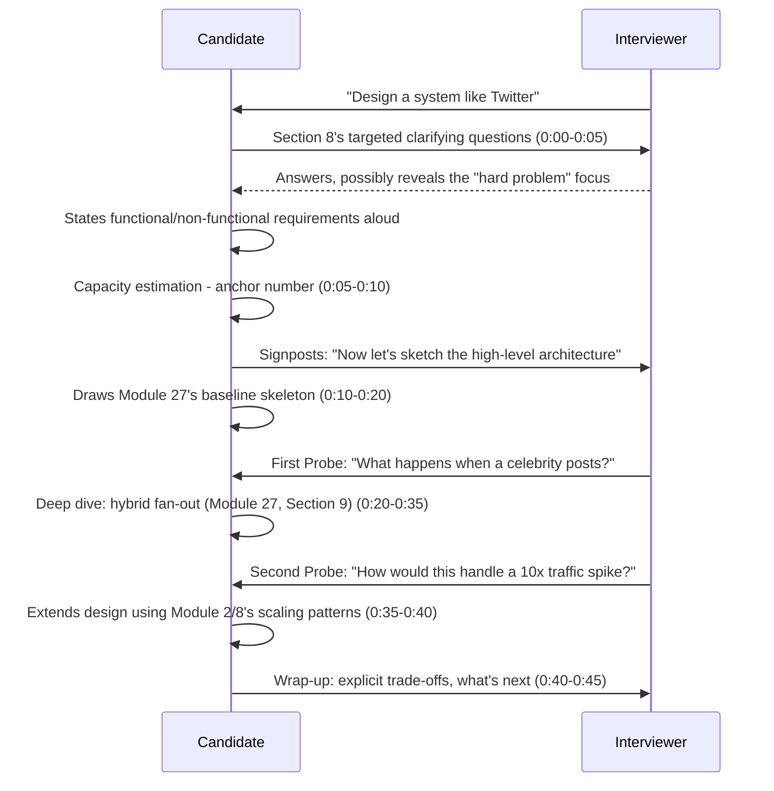
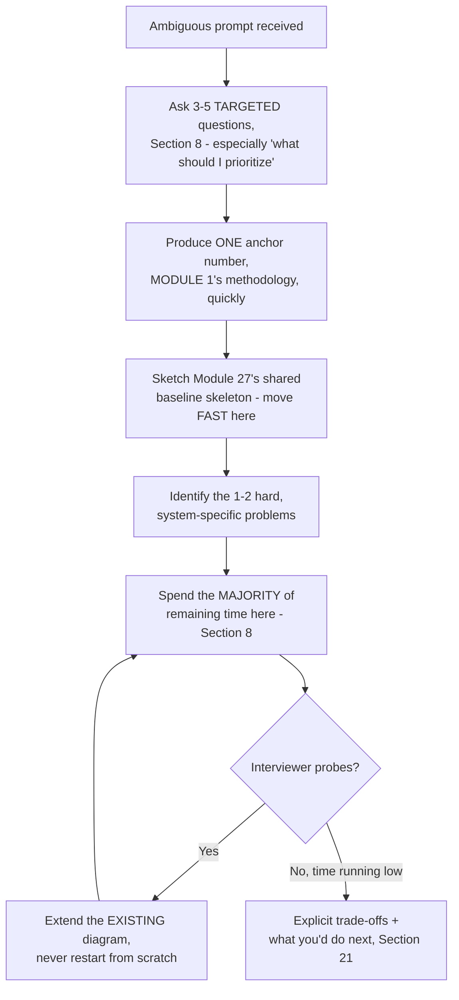
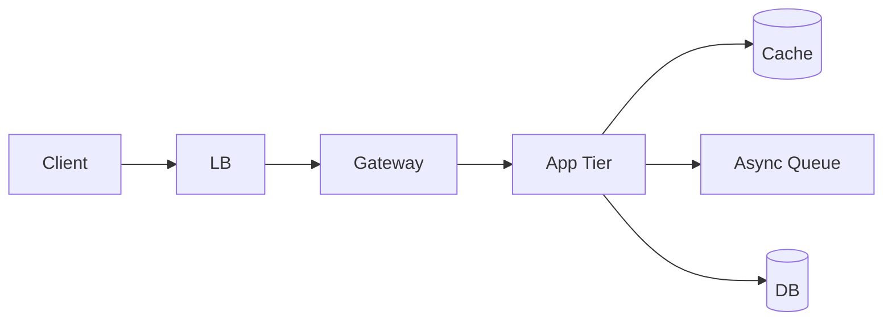
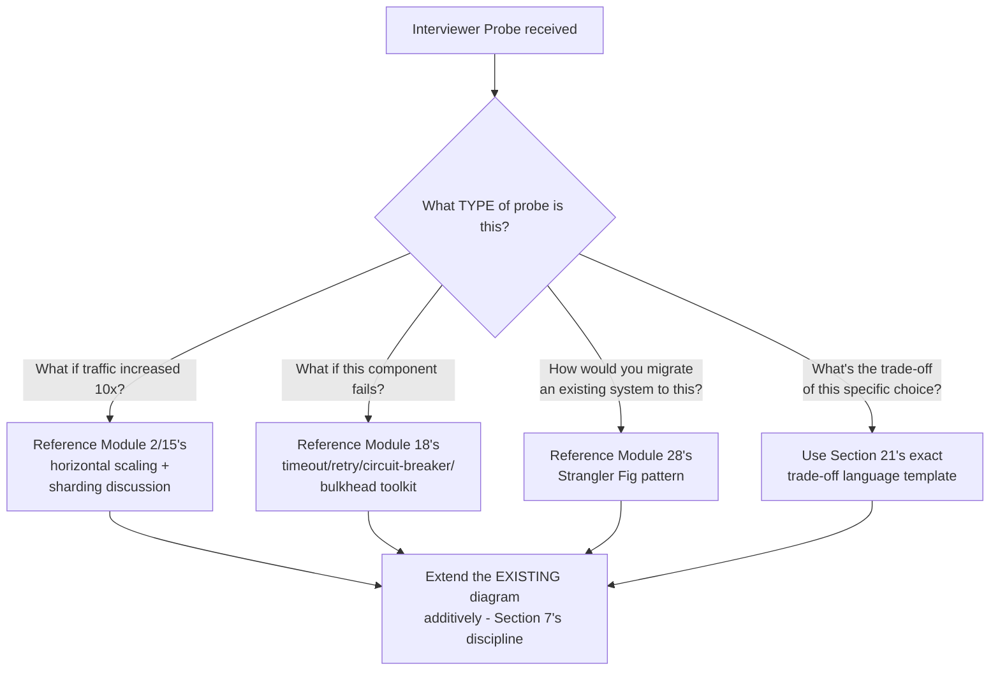
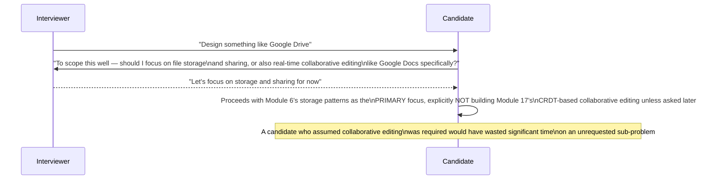

# Module 29 — FAANG System Design Interviews

> **Masterclass:** System Design Masterclass (30 Modules)
> **Level:** Expert
> **Audience:** Node.js backend developers, SDE‑2 / Senior Backend interview candidates, engineers transitioning into architecture roles
> **Prerequisite:** Modules 1–28 (the entire masterclass — this module is interview execution under time pressure)

---

## 1. Introduction

Every module before this one taught *what* to know. This module teaches *how to perform what you know inside a 45-minute room, live, with someone watching and interrupting.* Module 27 gave you a five-step framework and applied it, unhurried, to five systems. Module 28 gave you a complete pattern catalog. This module compresses both into interview conditions: strict time budgets per phase, the specific verbal habits that signal seniority, the exact clarifying questions that separate a strong opening from a wasted five minutes, and — because volume matters for building real fluency — a library of over fifty scenario prompts spanning the full breadth of what FAANG-style interviews actually ask.

The single biggest adjustment this module makes to everything taught so far: **in an unhurried classroom, thoroughness is a virtue. In a 45-minute interview, thoroughness applied to the wrong 80% of the problem is a failure.** This module is about triage under pressure — the same judgment Module 27 built, now compressed to interview-realistic time constraints.

---

## 2. Learning Objectives

By the end of this module, you will be able to:

1. Execute a **time-boxed interview structure** (requirements, estimation, HLD, deep-dive, wrap-up) within a realistic 45-minute window.
2. Ask **effective clarifying questions** in the first five minutes that meaningfully shape the rest of the interview, rather than generic, low-value questions.
3. Perform **capacity estimation shortcuts** that produce defensible numbers quickly, without getting lost in unnecessary precision.
4. Articulate **trade-offs verbally**, in the specific structured language interviewers are listening for.
5. Recognize and correctly respond to the **most common interviewer follow-up probes** (scaling further, handling a specific failure, adding a new requirement mid-interview).
6. Distinguish **SDE-2, Senior, and Staff-level** expectations for the same prompt, and calibrate your depth accordingly.
7. Work through a substantial library of **scenario prompts** spanning data-intensive, real-time, infrastructure, and novel/ambiguous system categories.

---

## 3. Why This Concept Exists

Everything in Modules 1–28 is necessary but not sufficient for interview success. A candidate who deeply understands Module 15's sharding trade-offs can still fail an interview by spending fifteen minutes on database schema before ever mentioning scale, or by silently designing in their head instead of narrating their reasoning, or by treating an interviewer's "what if traffic increased 100x" as an attack to defend against rather than an invitation to extend the design. These are not knowledge gaps — they are **execution and communication gaps**, and they are the specific, well-documented reasons technically strong candidates fail system design interviews.

This module exists because interview performance is a distinct skill from architectural knowledge, trainable through the same deliberate practice this course has applied to every other topic — time-boxing, verbal habits, and volume of repetition across varied prompts, not more theoretical study.

---

## 4. Problem Statement

> You have 45 minutes. The interviewer says: "Design a system like Twitter." No other information is given. Using this module's complete framework, walk through exactly what you say and do in each of the first five minutes, the next ten, the following twenty, and the final ten — and explain precisely what an interviewer is listening for at each phase that a purely correct but poorly time-managed answer would miss.

---

## 5. Real-World Analogy

**A system design interview is a timed cooking competition, not a leisurely dinner party.** At a dinner party (an unhurried design review), a chef can spend forty minutes perfecting one sauce because there's no clock and no judge comparing plates at the 45-minute mark. In the competition, the same chef must decide, in the first sixty seconds, which two or three elements of the dish will actually be judged most heavily, and allocate their limited time ruthlessly toward those — a technically superior sauce that arrives after the buzzer scores zero, regardless of how good it tastes.

**The clarifying-questions phase is the competition's ingredient-reveal moment** — contestants who skip reading the mystery basket carefully and start cooking immediately often build a dish around the wrong assumption entirely, wasting far more time recovering than the sixty seconds of careful reading would have cost.

---

## 6. Technical Definition

**Time-Boxing (interview context):** Deliberately allocating fixed, approximate time budgets to each phase of a system design interview, and actively self-monitoring against that budget rather than letting any one phase expand to consume the whole session.

**Clarifying Question:** A question asked at the start of an interview specifically to narrow scope, surface hidden requirements, or reveal the interviewer's actual area of interest — as distinct from a generic question asked merely to appear thorough.

**Depth Calibration:** Adjusting the level of technical detail and the specific sub-problems chosen for deep-dive based on the target level (SDE-2, Senior, Staff) the interview is assessing for.

---

## 7. Core Terminology

| Term | Precise Definition | One-line Intuition |
|---|---|---|
| **The Narration Habit** | Continuously verbalizing your reasoning process, not just your conclusions, throughout the interview | "Think out loud, always" |
| **The Anchor Number** | The single most important capacity-estimation figure (usually peak req/s or total data volume) that most subsequent architecture decisions should visibly trace back to | "The one number everything else answers to" |
| **The Probe** | An interviewer's mid-interview question testing whether you can extend or defend your design under a new constraint | "The follow-up that's actually part of the test" |
| **Signposting** | Explicitly telling the interviewer what phase you're moving to and why ("Now that we've established X, let's estimate capacity") | "Narrating your own outline as you go" |
| **The Whiteboard Discipline** | Keeping the diagram legible and incrementally built, never erasing and redrawing from scratch mid-interview | "Build additively, don't restart" |
| **Level-Appropriate Depth** | The specific sub-problems and rigor expected at SDE-2 versus Senior versus Staff calibration | "How deep is deep enough for THIS interview" |

---

## 8. Internal Working

### The disciplined 45-minute time budget, precisely, resolving Section 4

```
0:00–0:05   REQUIREMENTS: Ask 3-5 targeted clarifying questions (Section 8's exact list below).
             State functional AND non-functional requirements explicitly, out loud.

0:05–0:10   CAPACITY ESTIMATION: Produce Section 7's "anchor number" (peak req/s or
             storage volume) using Module 1's methodology. State it, then move on —
             this phase is NOT where deep analysis happens.

0:10–0:20   HIGH-LEVEL DESIGN: Draw the Module 27 "baseline skeleton" (LB, gateway,
             app tier, cache, async queue, storage) QUICKLY. Narrate each box's purpose
             in one sentence. This phase should feel unremarkable and fast, per
             Module 27, Section 13's exact "recurring skeleton" lesson.

0:20–0:40   DEEP DIVE: Identify the ONE or TWO genuinely hard, system-specific
             sub-problems (Module 27's exact framework) and spend the MAJORITY of
             remaining time here. This is where the interview is actually won or lost.

0:40–0:45   WRAP-UP: Explicitly state 2-3 trade-offs made (Section 21's language),
             and proactively mention what you'd do differently with more time
             or different constraints.
```

**Why this specific allocation, and why the Deep Dive gets the largest share, precisely:** an interviewer who has watched hundreds of candidates has seen the "baseline skeleton" (Module 27, Section 13's unremarkable, shared architecture) a hundred times — it demonstrates competence but doesn't differentiate. The **Deep Dive phase is the only phase where a candidate's individual judgment, depth, and ability to reason about a genuinely hard trade-off is actually visible** — precisely why Section 4's answer must ruthlessly protect this block of time, even if it means the HLD phase feels rushed or incomplete.

### The specific clarifying questions that matter, versus generic ones

**Weak, generic clarifying questions** (waste of the first five minutes): "What's the tech stack?" "Should it be scalable?" "Do we need it to be secure?" — these signal a checklist mentality, not genuine scoping.

**Strong, targeted clarifying questions**, directly extending Module 1's capacity-estimation methodology to the interview's opening moments:

```
1. "What's the expected scale — daily active users, or requests per second at peak?"
   (directly sets up Section 8's anchor number)
2. "Is this read-heavy or write-heavy, roughly?"
   (directly determines whether Module 7's caching or Module 15's sharding
    dominates the eventual deep-dive)
3. "Are there any specific features I should prioritize, or is a broad but
    shallow design preferred?"
   (directly surfaces which sub-problem the INTERVIEWER wants to see explored —
    often the single most valuable question in the entire interview)
4. "What consistency guarantees matter here — is eventual consistency
    acceptable for [specific feature], or does it need to be strongly consistent?"
   (directly and immediately demonstrates Module 13/14 fluency, very early,
    which most candidates never surface until much later, if at all)
```

**Why question 3 is disproportionately valuable, precisely:** it directly asks the interviewer to reveal what Module 27 calls "the system's hard problem" — many interviewers, especially at Senior/Staff calibration, have a specific sub-area they want explored deeply (e.g., "I mainly want to see how you handle the celebrity fan-out problem" for a Twitter-style prompt) and will simply tell you if asked, converting Section 4's entire 45 minutes from a guessing exercise into a directed one.

### Depth calibration across SDE-2, Senior, and Staff levels, precisely

```
SDE-2 expectation:
  - Correct baseline architecture (Module 27's skeleton)
  - Identifies AT LEAST ONE genuine hard problem and proposes a reasonable solution
  - Can explain individual patterns (Module 7's cache, Module 8's load balancer) correctly

Senior expectation:
  - Everything above, PLUS:
  - Proactively identifies MULTIPLE hard problems and prioritizes them
  - Articulates trade-offs precisely (Section 21's language), not just describes choices
  - Anticipates and pre-empts likely interviewer probes (Section 7's "The Probe")

Staff expectation:
  - Everything above, PLUS:
  - Considers organizational/team boundaries (Module 16's bounded contexts) explicitly
  - Discusses migration/evolution strategy (Module 28's Strangler Fig) for how the
    system would grow or change over time, not just its initial-state design
  - Comfortably discusses cost trade-offs, not just technical ones
```

**Why this calibration matters, precisely, for how you should adjust Section 4's answer:** the *same* prompt ("design Twitter") should produce a *different* depth and breadth of answer depending on the target level — an SDE-2 candidate correctly, confidently solving the celebrity fan-out problem (Module 27, Section 9) alone is a strong, complete answer for that level; a Staff candidate giving the identical answer, without also discussing team ownership boundaries or a migration path from an earlier, simpler architecture, would be underperforming their level's bar, even though the individual technical content was entirely correct.

---

## 9. Request Lifecycle — The Interview Itself, Narrated as a Sequence

### Mermaid Sequence Diagram — The Complete 45-Minute Interview Flow



**Step-by-step explanation, directly demonstrating Section 8's timing discipline in context:** notice the interviewer's **Probes** arrive during the Deep Dive phase, not before it — this is typical and expected; a strong candidate treats each Probe as an invitation to extend the existing diagram (Section 7's Whiteboard Discipline — build additively) rather than a challenge requiring a defensive restart.

---

## 10. Architecture Overview — The Candidate's Own Internal Decision Process



**HLD-level insight:** this is the candidate's own internal decision-loop, made explicit — notice it's a direct, compressed re-application of Module 27's five-step framework, with Section 8's strict time discipline layered on top as the interview-specific addition.

---

## 11. Capacity Estimation — Shortcuts for Interview Speed

The full rigor of Module 1's capacity estimation (multi-step, careful unit conversions) is appropriate for a design document; an interview needs a **faster, still-defensible version**:

```
SHORTCUT METHOD (produces a defensible anchor number in under 2 minutes):

1. Round generously: "Let's say 100 million daily active users" (don't ask for
   exact figures if the interviewer doesn't offer them — assume and STATE the assumption)
2. Estimate ONE action rate: "If each user posts twice a day, that's 200M posts/day"
3. Convert to per-second, using 100,000 (not 86,400) as a rounding-friendly
   seconds-per-day approximation: 200,000,000 / 100,000 = 2,000 writes/sec average
4. Apply a peak multiplier (Module 1's exact 3-10x factor): ~10,000 writes/sec peak
5. STATE the number, and move on — do not spend further time refining it
```

**Why the deliberately rounded "100,000 seconds/day" approximation, instead of the precise 86,400, is the correct interview-specific choice:** the goal of this calculation, under time pressure, is a **directionally correct, quickly-produced anchor number**, not a mathematically precise one — and explicitly stating "I'm rounding for speed here" is itself a positive signal, demonstrating you understand the difference between an interview's time constraints and a real design document's precision requirements.

---

## 12. High-Level Design (HLD) — The Interview-Speed Version of Module 27's Skeleton



**Why this diagram should be drawn in under two minutes, narrated in one sentence per box:** "Requests hit a load balancer, routed through a gateway for auth and rate limiting, to a stateless app tier that checks a cache before hitting the database, and publishes events asynchronously for anything that doesn't need to block the response" — one breath, one diagram, moving immediately into Section 8's Deep Dive phase where the actual interview signal lives.

---

## 13. Low-Level Design (LLD) — Reserved for the Deep Dive Phase Only

Unlike earlier modules, this module deliberately does **not** provide a general LLD section — per Section 8's timing discipline, low-level code/schema detail should appear **only** within the Deep Dive phase, applied specifically to the system's one or two hard problems, never as a general exercise applied uniformly across the whole design. Attempting LLD-level detail on every component is precisely the "thoroughness applied to the wrong 80%" failure mode this module's Section 1 opened with.

---

## 14. ASCII Diagrams — The Time Budget, Visualized

```
45-MINUTE INTERVIEW TIME ALLOCATION

  |--5min--|--5min--|-----10min-----|----------20min----------|--5min--|
  Requirements Capacity   HLD Skeleton      DEEP DIVE (the interview   Wrap-up
  (targeted    (anchor    (Module 27's       is WON OR LOST here)      (trade-offs,
   questions)   number)    baseline, fast)                              what's next)

  COMMON FAILURE PATTERN — DO NOT DO THIS:

  |----15min----|----15min----|--------10min--------|--5min--|
  Requirements    HLD Skeleton    Deep Dive (RUSHED,    Wrap-up
  (over-thorough,  (over-drawn,    insufficient time     (rushed)
   generic Qs)      excessive      for the actual signal)
                    detail)
```

---

## 15. Mermaid Flowcharts — Handling the Most Common Interviewer Probes



**Why recognizing the probe TYPE quickly matters, precisely:** each of these four common probe categories maps directly onto a **specific, already-mastered module** from this course — a candidate who's internalized this mapping doesn't need to invent a novel solution live under pressure; they recognize "this is a Module 18 question" and confidently apply already-rehearsed content, which is precisely why the deliberate practice this module provides (Section 34's 50+ scenarios) builds genuine interview speed, not just theoretical knowledge.

---

## 16. Mermaid Sequence Diagrams

*(Section 9 covers the canonical full-interview sequence diagram for this module.)*

### Handling an Ambiguous, Under-Specified Prompt Gracefully



**Why this exact clarifying exchange is a strong, level-appropriate opening move:** it directly demonstrates Section 8's "ask what to prioritize" discipline, and — critically — the candidate's **subsequent behavior** (deliberately not building collaborative editing) shows they actually *used* the answer to shape their design, rather than asking the question performatively and then proceeding with a generic, unfocused design regardless of the answer.

---

## 17. Component Diagrams — This Module Has None New

This module deliberately introduces no new component patterns — every component (load balancer, gateway, cache, queue) was fully specified in its originating module. This section exists to explicitly note that omission: in an interview, **do not spend time re-explaining what a load balancer is** — name it, draw it, move on, exactly Section 12's disciplined pace.

---

## 18. Deployment Diagrams — Rarely Interview-Relevant

Full deployment topology (availability zones, specific instance counts) is almost never the right place to spend interview time, unless the prompt specifically asks about multi-region or disaster-recovery scenarios. This module deliberately deprioritizes this section, mirroring the actual triage a real interview demands.

---

## 19. Network Diagrams — Similarly Deprioritized for Interview Time

Module 3's full network-isolation diagram (public/private subnets, security groups) is foundational knowledge but is rarely the differentiating content in a system design interview — mentioning it briefly ("obviously the database sits in a private subnet, unreachable directly") in one sentence is sufficient; drawing the full topology is time better spent on Section 8's Deep Dive.

---

## 20. Database Design — Applied Only Within the Deep Dive

Directly mirroring Section 13's LLD discipline: schema-level detail belongs in the Deep Dive phase, applied specifically to the system's hard problem (e.g., the sharding key choice for a specific hot entity), never as a generic, complete-ERD exercise applied to the whole system.

---

## 21. API Design — The Trade-off Language Template

This section is this module's actual, reusable deliverable for the wrap-up phase. Every trade-off statement in an interview should follow this precise, three-part structure (directly reusing the format this entire course has modeled since Module 1):

```
"I chose [X] over [Y], optimizing for [specific quality],
 at the cost of [specific, named cost],
 which is acceptable because [tie back to the stated requirement/number]."
```

**Why using this exact template, out loud, in every trade-off statement, is a disproportionately high-value interview habit:** it is the single most reliable verbal signal of Module 1's foundational discipline — most candidates state a *choice* without stating the *trade-off*, and the interviewer is specifically listening for the second half of this sentence, not just the first.

---

## 22. Scalability Considerations — A Pre-Rehearsed Answer Bank

Directly extending Section 15's probe-handling table, memorize (through Section 34's repeated practice, not rote memorization alone) the following pre-rehearsed scaling answers:

```
"How would you scale the DATABASE further?"     → Module 15: sharding key selection
"How would you scale READS specifically?"        → Module 7: caching, Module 15: read replicas
"How would you scale WRITES specifically?"       → Module 15: sharding (replication alone doesn't help)
"How would you reduce LATENCY for global users?" → Module 10: CDN, Module 3's distance-latency lesson
```

---

## 23. Reliability & Fault Tolerance — A Pre-Rehearsed Answer Bank

```
"What if this SERVICE goes down?"                → Module 8: redundancy, health checks
"What if this DEPENDENCY is slow/failing?"        → Module 18: timeout, circuit breaker, bulkhead
"What if a MESSAGE is lost?"                       → Module 11: durable queue, Module 28: Outbox
"What if the same ACTION happens TWICE?"           → Module 4/11: idempotency, Module 28: Inbox
```

---

## 24. Security Considerations — A Pre-Rehearsed Answer Bank

```
"How do you AUTHENTICATE users?"                  → Module 20: OAuth2, JWT
"How do you SECURE service-to-service calls?"      → Module 20: mTLS
"How do you PREVENT abuse?"                        → Module 21: rate limiting (name the right algorithm)
```

---

## 25. Performance Optimization — A Pre-Rehearsed Answer Bank

```
"This is too SLOW, how would you speed it up?"    → Module 7: caching (check hit ratio first),
                                                       Module 23: correct indexing/data structure
"This is too EXPENSIVE, how would you reduce cost?" → Module 6: storage tiering, Module 2: right-sizing
```

---

## 26. Monitoring & Observability — A Pre-Rehearsed Answer Bank

```
"How would you KNOW if this broke in production?" → Module 19: the three pillars, name SPECIFIC
                                                       metrics for THIS system (not generic ones)
```

---

## 27. Common Bottlenecks — What Interviewers Are Actually Testing With Each Probe Type

| Probe Category | What It Actually Tests |
|---|---|
| "Scale it further" | Do you know Module 2 vs. Module 15's distinction (replication doesn't scale writes) |
| "Handle a failure" | Do you reach for Module 18's specific, named patterns, not vague "add redundancy" |
| "Add a new feature mid-interview" | Can you extend your EXISTING diagram, not restart (Section 7's Whiteboard Discipline) |
| "Justify a specific choice" | Can you use Section 21's exact trade-off template, unprompted |
| "What would you do differently with more time?" | Do you have genuine, specific self-awareness of your design's limitations |

---

## 28. Trade-off Analysis — Applying Section 21's Template to Section 4's Twitter Prompt

> "I chose a **hybrid push/pull fan-out model** over pure push, optimizing for **avoiding the celebrity-post write explosion (Module 27, Section 9)**, at the cost of **more complex read-time merge logic for users following celebrities**, which is acceptable because our stated scale (100M DAU, some accounts with 10M+ followers) makes pure push's write cost genuinely prohibitive, not just theoretically concerning."

---

## 29. Anti-patterns & Common Mistakes — The Specific Interview Failure Modes

1. **Diving into architecture before asking any clarifying questions** — Section 8's opening discipline, most commonly skipped under nervousness.
2. **Spending more than ~10 minutes on the baseline skeleton** — Section 14's "common failure pattern" diagram, the single most frequent time-management mistake.
3. **Treating an interviewer's Probe as a challenge to defend against, rather than an invitation to extend the design** — a genuine, common mismatch in framing that produces defensive, less collaborative-sounding answers.
4. **Stating a choice without stating its trade-off** — Section 21's exact, most commonly missing verbal habit.
5. **Applying identical depth regardless of target level** — Section 8's calibration discipline, unheeded; an SDE-2-appropriate answer given in a Staff interview under-delivers, and vice versa an over-long, over-broad answer wastes an SDE-2 interview's limited time.
6. **Silent thinking** — designing correctly in your head but failing to narrate the reasoning (Section 7's Narration Habit), leaving the interviewer unable to assess the *process*, only the *final diagram*.

---

## 30. Production Best Practices — Practicing This Module Itself

- **Rehearse the exact time-boxed structure (Section 8) until it's automatic**, not something you have to consciously think about mid-interview.
- **Build a personal "pre-rehearsed answer bank"** (Sections 22–26) for the most common probe categories, so you're retrieving already-organized content under pressure, not inventing it live.
- **Practice the trade-off template (Section 21) explicitly**, out loud, until it becomes a natural sentence structure rather than a forced formula.
- **Do mock interviews with a strict timer**, specifically to build the internal sense of Section 8's time budget without needing to watch a clock.
- **After each practice session, explicitly identify which phase you overran**, and adjust — this module's discipline is itself learned iteratively, exactly like every technical pattern in this course.

---

## 31. Real-World Examples

- **Widely-documented, publicly shared interview debrief accounts** (from various tech-industry interview-preparation communities and published retrospectives) consistently identify time management and trade-off articulation — not raw technical knowledge — as the most common reasons technically capable candidates receive "no hire" recommendations at FAANG-tier companies, directly validating this module's core premise.
- **Google's and other major tech companies' publicly published interview guidance** explicitly states that interviewers are trained to evaluate communication and reasoning process, not just final answer correctness — a direct, official validation of Section 7's Narration Habit as genuine, intentional interview signal, not merely this module's own recommendation.

---

## 32. Node.js Implementation Examples

*(This module deliberately contains no new code examples — every technical pattern referenced throughout Sections 22–26's answer banks has its complete, working implementation in its originating module. Re-deriving code here would contradict this module's own core lesson: reuse and rapid retrieval of already-mastered content, not fresh derivation under time pressure.)*

---

## 33. Interview Questions — Meta: Questions About the Interview Process Itself

### Easy
1. What are the five phases of a disciplined 45-minute system design interview, and their approximate time budgets?
2. Why is "what should I prioritize" considered one of the most valuable clarifying questions to ask?
3. What is the difference between a generic and a targeted clarifying question?
4. Why should the baseline architecture (load balancer, gateway, cache) be sketched quickly rather than explained in depth?
5. What is the three-part trade-off statement template, and why does using it explicitly matter?
6. Why should an interviewer's mid-interview probe be treated as an invitation to extend the design, not a challenge to defend against?

### Medium
7. Design the exact clarifying questions you would ask for a "design a ride-sharing app" prompt, and explain what each is trying to surface.
8. Explain how depth calibration should differ between an SDE-2 and a Staff-level interview for the identical prompt.
9. Walk through the interview-speed capacity estimation shortcut, and explain why deliberate rounding is appropriate here but not in a real design document.
10. Categorize the four most common interviewer probe types and the specific prior module each maps to.
11. Explain why silent, un-narrated reasoning is a significant interview weakness even if the final design is correct.
12. Design a wrap-up statement for a system design interview with 3 minutes remaining, following Section 21's template.

### Hard
13. Walk through a complete, time-boxed 45-minute mock interview for "design a payment processing system," narrating your own internal decision process at each phase.
14. Discuss how you would recover gracefully if you realize, twenty minutes in, that you misunderstood the interviewer's actual priority based on an early clarifying-question answer.
15. Design your personal pre-rehearsed answer bank (Sections 22–26) for a category of systems not explicitly covered in this module (e.g., analytics/data platforms), citing the specific prior modules each answer would draw from.
16. Explain how you would calibrate your answer differently if the same "design Instagram" prompt were asked in an SDE-2 interview versus a Staff interview, being specific about what content you would add or omit.
17. Discuss the tension between thoroughness and time management, and propose a personal decision rule for when to go deeper on a sub-problem versus when to move on.

---

## 34. Scenario-Based Design Questions — The 50+ Interview Scenario Library

*(Organized by category. For each, the disciplined approach is: identify the anchor number, sketch the baseline fast, and — most importantly — correctly identify the ONE OR TWO genuinely hard sub-problems, citing the specific prior module that resolves each, exactly as modeled in Sections 8–12 and throughout Module 27.)*

**Category A — Data-Intensive / Storage-Heavy Systems**
1. Design a URL shortener (fully worked in Module 27).
2. Design a distributed key-value store (touches Module 15's sharding, Module 13's CAP trade-offs).
3. Design a distributed file storage system like Dropbox (Module 6's storage patterns, Module 17's CRDT-adjacent sync conflict resolution).
4. Design a web crawler (Module 26's batch/distributed processing, Module 22's coordination for avoiding duplicate crawling).
5. Design a pastebin service (nearly identical skeleton to #1, with a TTL/expiry twist — Module 7's cache-eviction lesson).
6. Design a distributed cache (Module 7's own internals, Module 15's sharding applied to the cache itself).
7. Design a rate limiter as a standalone service (fully worked in Module 21).
8. Design a distributed logging/metrics aggregation system (Module 19's pillars, Module 26's stream processing).
9. Design a content moderation queue system (Module 11's async processing, Module 17's Saga for multi-step review workflows).
10. Design an ad click-tracking and aggregation system (Module 26's exact stream-processing windowing lesson).

**Category B — Social / Feed-Based Systems**
11. Design Instagram's feed (fully worked in Module 27).
12. Design Twitter/X (Section 4's exact worked example this module).
13. Design a "Stack Overflow"-style Q&A platform (Module 23's search, Module 24's related-question recommendations).
14. Design a news aggregator with personalized ranking (Module 24's hybrid recommendation approach).
15. Design a LinkedIn-style professional network with connection suggestions (Module 24's collaborative filtering, applied to "people you may know").
16. Design a Reddit-style voting and ranking system (Module 14's eventual consistency for vote counts, Module 13's AP-leaning choice).
17. Design a comments/threading system at scale (Module 14's causal consistency for reply ordering).
18. Design a notification aggregation system across multiple apps/channels (Module 11's fan-out, Module 25's real-time delivery).
19. Design a "trending topics" system (Module 26's sliding-window stream computation, fully worked in Module 26).
20. Design a content recommendation engine for a general platform (fully worked in Module 24).

**Category C — Real-Time / Communication Systems**
21. Design WhatsApp (fully worked in Module 27).
22. Design a live chat/customer support widget (Module 25's presence and delivery guarantees, at smaller scale).
23. Design a video conferencing signaling system (Module 25's real-time architecture, with an emphasis on connection establishment).
24. Design a collaborative document editor like Google Docs (Module 17's CRDT-adjacent conflict resolution, Module 25's presence/cursor tracking).
25. Design a live sports score/commentary update system (Module 25's SSE-vs-WebSocket decision, one-directional push).
26. Design a multiplayer game's real-time state synchronization (Module 25's real-time patterns, at very low latency tolerance).
27. Design a push notification delivery system at scale (Module 11's fan-out, Module 18's retry/circuit-breaker for third-party providers).
28. Design an online auction/bidding system with real-time price updates (Module 22's distributed locking for bid conflicts, Module 25's real-time push).
29. Design a stock trading order book system (Module 12's consensus concerns, extreme low-latency requirements).
30. Design a live polling/audience Q&A system for events (Module 25's presence at a smaller, event-scoped scale).

**Category D — Media / Streaming Systems**
31. Design YouTube (fully worked in Module 27).
32. Design Netflix's video streaming and "continue watching" feature (Module 10's CDN, Module 26's transcoding, Module 24's recommendations).
33. Design Spotify's music streaming and playlist system (Module 24's real-world hybrid recommendation example from Module 24, Section 31).
34. Design a podcast platform with download/offline sync (Module 6's storage patterns, Module 14's sync consistency).
35. Design a photo-sharing app's upload and processing pipeline (Module 6's presigned uploads, Module 26's image-processing batch pipeline).
36. Design a live video streaming platform (Twitch-style) (Module 25's real-time chat alongside Module 10's video CDN delivery).

**Category E — Marketplace / Logistics Systems**
37. Design Uber (fully worked in Module 27).
38. Design a food delivery platform (Uber's geospatial patterns, plus Module 17's Saga for the multi-step order/prepare/deliver workflow).
39. Design an e-commerce checkout and inventory system (Module 22's distributed locking for inventory decrement, Module 17's Saga for payment/inventory/shipping coordination).
40. Design a hotel/flight booking system (Module 22's locking for seat/room inventory, Module 13's CP-leaning consistency choice).
41. Design a parking spot reservation system (smaller-scale variant of #40, good for calibrating SDE-2-level depth).
42. Design a warehouse/inventory management system (Module 26's batch reconciliation, Module 15's sharding by warehouse region).
43. Design a package/shipment tracking system (Module 17's event sourcing for complete shipment history).

**Category F — Infrastructure / Platform Systems**
44. Design a distributed task scheduler/cron system (Module 22's exact distributed-locking scenario, fully worked).
45. Design an API rate limiter and gateway (fully worked across Modules 9 and 21).
46. Design a CI/CD deployment pipeline system (Module 28's Strangler Fig for gradual rollout, Module 18's rollback-on-failure).
47. Design a feature-flag/experimentation platform (Module 7's caching for flag lookups, Module 14's consistency requirements for flag evaluation).
48. Design a distributed configuration management system (Module 12's consensus, similar to ZooKeeper/etcd's own purpose).
49. Design a search autocomplete/typeahead system (Module 23's inverted index, adapted for prefix matching).
50. Design a distributed ID generation service (Module 27's URL-shortener ID generation, generalized into a standalone service).
51. Design a webhook delivery system for a developer platform (Module 11's durable queue, Module 18's retry with backoff for unreliable receiving endpoints).
52. Design a multi-tenant SaaS platform's tenant isolation architecture (Module 20's authorization, Module 15's sharding-by-tenant strategy).

---

## 35. Hands-on Exercises

1. Set a 45-minute timer and complete a full mock interview for "design a URL shortener," strictly following Section 8's time budget, and afterward document exactly where you over- or under-ran each phase.
2. Practice the Section 11 capacity-estimation shortcut on five different prompts from Section 34's library, timing yourself to under 2 minutes each.
3. Write out, from memory, your personal pre-rehearsed answer bank (Sections 22–26), then check it against this module's version, identifying any gaps.
4. Record yourself (audio or video) doing a mock interview, and review specifically for Section 7's Narration Habit — are you actually verbalizing your reasoning, or thinking silently and only speaking conclusions?
5. Pick three prompts from three different categories in Section 34, and for each, write only the clarifying questions you'd ask and the anchor number you'd expect to produce — practicing the first ten minutes specifically, repeatedly, across varied prompts.

---

## 36. Mini Project

**Build:** A complete, timed mock interview response for Section 4's exact "design Twitter" prompt, written out in full.

**Requirements:**
- Write out your exact clarifying questions (Section 8) and plausible interviewer answers.
- Write your capacity estimation using the interview-speed shortcut (Section 11).
- Sketch the baseline architecture (Section 12) with one-sentence-per-component narration.
- Write your complete Deep Dive on the celebrity fan-out problem, citing Module 27's exact resolution.
- Write your wrap-up trade-off statement using Section 21's exact template.
- Annotate the entire document with the approximate time each section should take, confirming it fits within 45 minutes.

**Success criteria:** Your written mock interview, read aloud at a natural pace, fits within the 45-minute budget with time allocated according to Section 8's proportions, and every trade-off statement uses Section 21's exact three-part template.

---

## 37. Advanced Project

**Build:** A complete personal interview-preparation system covering Section 34's full scenario library.

1. For at least 15 scenarios spanning all six categories in Section 34, write a one-paragraph "hard problem identification" — the ONE or TWO sub-problems you'd deep-dive, and which specific prior module resolves each — without writing the full design, practicing the pattern-recognition speed this module's Section 15 flowchart requires.
2. Conduct at least 5 full, timed, 45-minute mock interviews (with a study partner, a mock-interview platform, or self-recorded), covering at least 3 different categories from Section 34, and log your time-per-phase for each.
3. Build your personal, finalized pre-rehearsed answer bank (extending Sections 22–26), customized with your own preferred specific technical choices (e.g., your default choice for "how would you scale reads" — Redis vs. Memcached, with your own stated justification).
4. Write a final, reflective document identifying your own most common failure pattern (Section 29's list) across your 5 mock interviews, and a specific, concrete plan to address it in future practice.

**Success criteria:** You have 15 rapid hard-problem identifications demonstrating pattern-recognition speed across categories, 5 logged, timed mock interviews with documented phase-by-phase timing, a finalized personal answer bank, and an honest, specific self-assessment of your own recurring interview weakness — setting up Module 30 (Production Architecture Masterclass), which takes everything built across this entire course and assembles it into one final, complete, annotated production-scale architecture diagram as the masterclass's capstone deliverable.

---

## 38. Summary

- **A system design interview is a distinct, trainable skill from architectural knowledge** — time management, targeted clarifying questions, and verbal trade-off articulation are the specific, well-documented differentiators between technically similar candidates.
- **The disciplined 45-minute structure** (5 min requirements, 5 min estimation, 10 min HLD, 20 min deep dive, 5 min wrap-up) protects the phase — the Deep Dive — where actual differentiation happens, and prevents the common failure of over-investing in the unremarkable, shared baseline.
- **"What should I prioritize?" is disproportionately valuable** as a clarifying question, often directly revealing what the interviewer actually wants to assess.
- **Depth calibration must match the target level** — the same prompt warrants genuinely different breadth and depth at SDE-2, Senior, and Staff calibration.
- **Interviewer probes should be treated as invitations to extend, not challenges to defend against**, and recognizing the probe's category (scaling, failure-handling, migration, trade-off justification) lets you retrieve already-rehearsed content rather than inventing it live.
- **This module's over-fifty-scenario library**, worked through via Section 15's hard-problem-identification discipline, builds the pattern-recognition fluency that makes real interview performance fast and confident rather than effortful and slow.

---

## 39. Revision Notes

- 45-min structure: 5 requirements + 5 estimation + 10 HLD + 20 DEEP DIVE + 5 wrap-up — protect the deep dive
- Best clarifying question: "what should I prioritize" — directly reveals the interviewer's actual focus
- Capacity estimation shortcut: round generously (100,000 sec/day), state the anchor number, move on
- Depth calibration: SDE-2 (one hard problem, solved) → Senior (multiple, prioritized, trade-offs explicit) → Staff (+ org boundaries, migration strategy)
- Trade-off template: "Chose X over Y, optimizes [A], costs [B], acceptable because [requirement/number]"
- Probes = invitations to EXTEND the existing diagram, never restart from scratch
- Pre-rehearsed answer banks (Sections 22-26) turn live invention into fast retrieval under pressure

---

## 40. One-Page Cheat Sheet

```
SYSTEM DESIGN — MODULE 29 CHEAT SHEET
─────────────────────────────────────
45-MINUTE TIME BUDGET
  0:00-0:05  Requirements — targeted Qs, ESPECIALLY "what should I prioritize"
  0:05-0:10  Capacity estimation — ONE anchor number, rounded, move on
  0:10-0:20  HLD — Module 27's baseline skeleton, FAST, one sentence per box
  0:20-0:40  DEEP DIVE — the 1-2 hard problems — THIS IS WHERE YOU'RE JUDGED
  0:40-0:45  Wrap-up — explicit trade-offs (template below) + what's next

TRADE-OFF TEMPLATE (use it OUT LOUD, every time)
  "Chose X over Y, optimizing for [A], at the cost of [B],
   acceptable because [ties back to stated requirement/number]"

PROBE TYPE → WHICH MODULE TO RETRIEVE FROM
  "Scale it further"        → Module 2 (replicas) vs Module 15 (sharding)
  "Handle a failure"        → Module 18 (timeout/retry/breaker/bulkhead)
  "Migrate an existing sys" → Module 28 (Strangler Fig)
  "Justify this choice"     → Trade-off template, above

GOLDEN RULES
  NEVER dive into architecture before asking "what should I prioritize"
  NEVER spend >10 min on the baseline — it's unremarkable, move fast
  ALWAYS narrate your reasoning OUT LOUD — silent correctness isn't visible
  ALWAYS extend the diagram on a probe — never erase and restart
  Calibrate depth to the LEVEL — SDE-2 ≠ Senior ≠ Staff, same prompt
```

---

## Key Takeaways

- Interview performance is a distinct, trainable skill layered on top of architectural knowledge — the specific habits this module teaches (time-boxing, targeted clarifying questions, explicit trade-off language) are what convert deep technical understanding into a visible, assessable signal within a compressed, high-pressure 45-minute window.
- The single highest-leverage discipline in this entire module is protecting the Deep Dive phase's time budget — the baseline architecture is necessary but unremarkable, and genuine differentiation happens almost entirely in the one or two problems that are actually unique to the system at hand, exactly Module 27's lesson, now under a strict clock.
- Building genuine interview fluency requires volume and repetition across varied prompts, not deeper study of any single one — Section 34's fifty-plus scenario library exists specifically to build the fast, confident pattern-recognition this module's entire framework depends on.

## 20 Practice Questions
*(See Section 33 — 6 Easy, 6 Medium, 5 Hard — plus 3 rapid-fire additions:)*
18. Why is spending 15 minutes on the baseline skeleton considered a common, significant interview mistake even if every component drawn is technically correct?
19. What's the practical difference between asking "should it be scalable" and asking "what's the expected scale in requests per second"?
20. Why does treating an interviewer's probe as a collaborative extension, rather than a defensive challenge, tend to produce a stronger overall interview impression?

## 10 Scenario-Based Questions
*(See Section 34's full 50+ scenario library, organized by category, for the complete scenario set.)*

## 5 Design Assignments
*(See Sections 36–37 — Mini Project and Advanced Project — plus:)*
1. Write a complete, timed mock interview response for "design a distributed task scheduler" (Section 34, #44), following this module's exact structure and citing Module 22's distributed locking explicitly.
2. Conduct a self-assessment: review a past real or practice interview you've given, and score it against Section 8's time budget and Section 29's anti-pattern list.
3. Design a study plan allocating practice time across Section 34's six categories, prioritized by which categories you find personally most difficult to triage quickly.

## Suggested Next Module

**→ Module 30: Production Architecture Masterclass** — with interview execution now fully trained, we assemble everything from this entire 30-module masterclass into one final, complete, production-scale architecture — building the full system, from users through the CDN, load balancer, API gateway, microservices, databases, caches, message queues, and observability stack, as this course's capstone deliverable.
