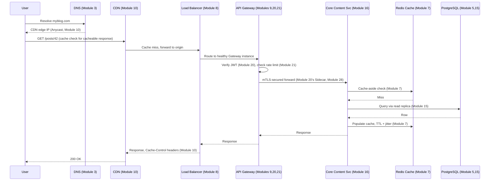
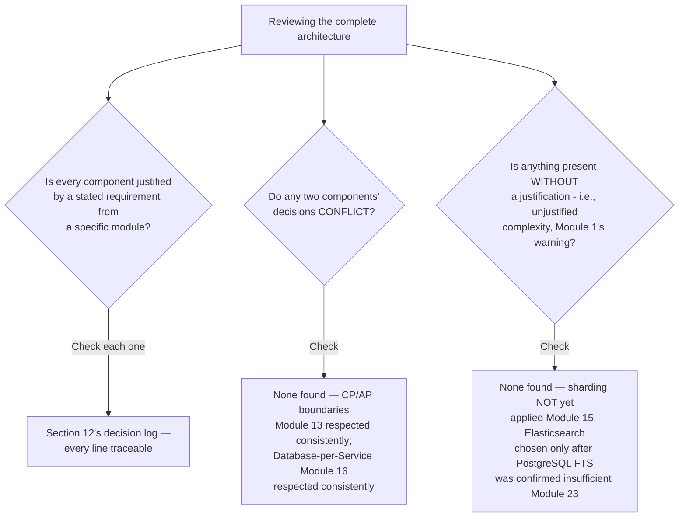
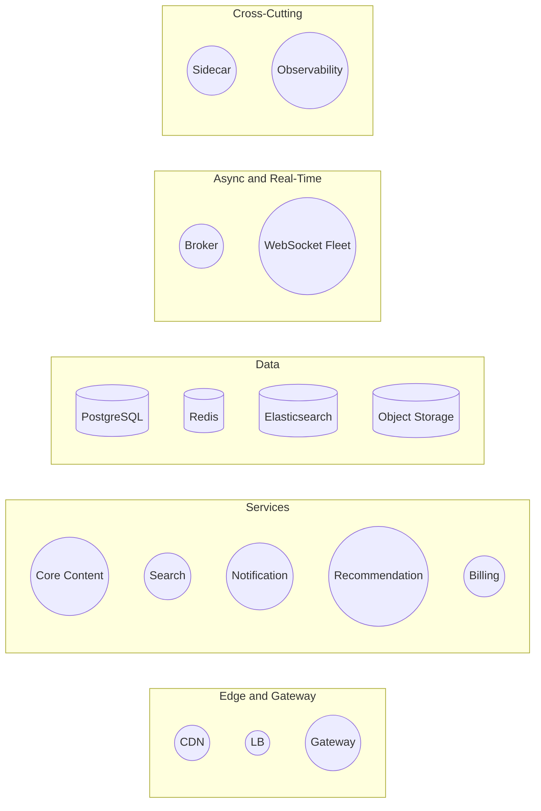
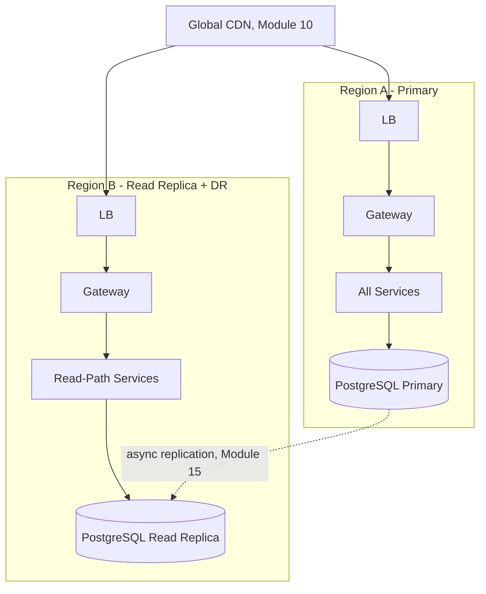

# Module 30 — Production Architecture Masterclass

> **Masterclass:** System Design Masterclass (30 Modules) — CAPSTONE
> **Level:** Expert
> **Audience:** Node.js backend developers, SDE‑2 / Senior Backend interview candidates, engineers transitioning into architecture roles
> **Prerequisite:** Modules 1–29 (the entire masterclass — this module is the final synthesis)

---

## 1. Introduction

Every module in this course has built one piece of the blog platform that first appeared in Module 1 as a single server and a single database. Module 2 gave it horizontal scaling. Module 7 gave it a cache. Module 15 gave it sharding. Module 16 broke it into services. Module 20 secured it. Module 25 made parts of it real-time. Module 29 taught you how to present all of this, compressed, under interview pressure. This final module does the opposite of compression: it **assembles the complete thing**, once, at full scale, as a single, coherent, end-to-end production architecture — every layer from the user's request leaving their device to the response returning, annotated with which specific module justified every single component's presence.

This is not a new technique. There is nothing left to teach that hasn't already been taught. This module's entire purpose is **synthesis** — proving, in one complete diagram and its accompanying documentation, that the twenty-nine modules that came before it are not a list of isolated facts but one coherent, mutually-reinforcing system of engineering judgment.

---

## 2. Learning Objectives

By the end of this module, you will be able to:

1. Produce a **complete, end-to-end production architecture diagram** spanning every layer this masterclass has covered.
2. Trace a **single user request's full journey** through every layer, citing the specific module governing each hop.
3. Trace a **single write's full journey**, including its asynchronous, eventual-consistency side effects, citing every governing module.
4. Articulate the **complete list of trade-offs** embedded in the final architecture, in the language Module 1 through Module 29 have consistently used.
5. Perform a **full-system capacity estimation**, reconciling every individual module's numbers into one consistent, end-to-end picture.
6. Conduct a **complete reliability and security audit** of the final architecture using Module 18's and Module 20's full toolkits.
7. Use this capstone architecture as a **template and reference** for designing any future production system from first principles.

---

## 3. Why This Concept Exists

A masterclass taught module by module risks leaving its central lesson implicit: that system design is not the accumulation of twenty-nine separate techniques, but the **disciplined, mutually-consistent application of all of them together**, where each layer's decisions constrain and inform the layers around it — Module 15's sharding key choice affects Module 23's search-indexing strategy; Module 11's async decoupling determines what Module 19's tracing needs to correlate; Module 20's mTLS requirement shapes Module 9's gateway design. This module exists to make that mutual consistency explicit and undeniable, by building the **one complete system** every prior module was, in fact, always secretly building one piece of.

This is also, deliberately, this course's final proof of the central discipline stated all the way back in Module 1: **every component in the final diagram must be justified by a real, stated requirement** — nothing here is included because it's impressive or fashionable; everything is included because a specific module's specific analysis showed it was needed, and this module's job is to make every one of those justifications visible, together, at once.

---

## 4. Problem Statement

> Assemble the complete, production-scale architecture for the blog platform built incrementally across Modules 1–29, from a user's initial DNS lookup through to a fully observable, secured, horizontally-scaled, globally-distributed system handling posts, comments, search, recommendations, real-time notifications, and payments (for "boosted" posts). Produce the full architecture diagram, trace both a read and a write request through their complete lifecycle, and provide a comprehensive, module-by-module justification for every major component's presence.

---

## 5. Real-World Analogy

**This module is the final walk-through of a completed building, room by room, with the architect explaining why every single wall, pipe, and wire is exactly where it is — not because any individual room is novel (each was designed and reviewed separately, room by room, across many prior sessions), but because seeing the completed structure reveals how the plumbing, electrical, and structural systems were designed *together*, each accounting for the others' constraints, rather than as independent afterthoughts bolted on sequentially.** A visitor who only ever saw the individual room blueprints might not appreciate that the electrical conduit's path was specifically routed to avoid the load-bearing walls chosen for the structural design, or that the plumbing's layout anticipated the kitchen's placement decided in an entirely separate planning session — the completed walk-through is where all of that quiet, cross-cutting coordination finally becomes visible at once.

---

## 6. Technical Definition

**Production Architecture:** The complete, deployed system design encompassing every layer — edge/CDN, networking, load balancing, gateway, application services, data storage, caching, asynchronous processing, observability, and security — operating together as one coherent, mutually-consistent whole, as distinct from any single layer's design in isolation.

**End-to-End Request Trace:** A complete accounting of every system component a single request or write passes through, from origination to final completion (including all downstream asynchronous effects), used to verify architectural consistency and identify any unaccounted-for gaps.

---

## 7. Core Terminology

This capstone module introduces no new terminology — every term used throughout this module was precisely defined in its originating module (Modules 1–29). This section instead serves as a **complete cross-reference index**, mapping each major architectural layer to the specific module(s) that define its governing vocabulary:

| Architectural Layer | Governing Module(s) |
|---|---|
| DNS, Networking, Protocols | Modules 3, 4 |
| CDN, Edge Caching | Module 10 |
| Load Balancing | Module 8 |
| API Gateway, Auth, Rate Limiting | Modules 9, 20, 21 |
| Microservices, Boundaries | Module 16 |
| Databases, Replication, Sharding | Modules 5, 15 |
| Caching | Module 7 |
| Async Messaging, Event-Driven Patterns | Modules 11, 17, 28 |
| Search, Recommendations | Modules 23, 24 |
| Real-Time Systems | Module 25 |
| Large-Scale Processing | Module 26 |
| Reliability Patterns | Module 18 |
| Observability | Module 19 |
| Security | Module 20 |
| Distributed Coordination | Modules 12, 22 |

---

## 8. Internal Working — The Complete System, Assembled

### The full architecture diagram, every layer, annotated by governing module

```
                              Users (Global)
                                    │
                              Global DNS  ─────────────────────────  Module 3
                                    │
                                   CDN  ───────────────────────────  Module 10
                        (static assets, images, video, cached GET responses)
                                    │
                             Load Balancer  ─────────────────────── Module 8
                          (Layer 7, health-checked, redundant)
                                    │
                               API Gateway  ──────────────────────  Modules 9, 20, 21
                    (JWT auth, OAuth2 delegation, mTLS to backends,
                     rate limiting: Token Bucket/Sliding Window per endpoint,
                     WAF, per-backend circuit breaking)
              ┌─────────────┬─────────────┬─────────────┬─────────────┐
              ▼             ▼             ▼             ▼             ▼
        Core Content   Search Svc   Notification   Recommendation  Billing Svc
        Service        (Module 23)  Service        Service         (Module 17's
        (Module 16)                 (Modules 4,11)  (Module 24)     Saga participant)
              │             │             │             │             │
              ▼             ▼             ▼             ▼             ▼
        PostgreSQL     Elasticsearch  Message      Interaction    PostgreSQL
        (Modules 5,15,  Cluster       Broker       Event Log      (Module 5)
         Outbox pattern (Module 23)   (Module 11,   (Module 24,
         Module 28)                   Outbox/Inbox   26's batch job,
                                       Module 28)     Module 22's lock)
              │
              ▼
        Redis Cluster  ─────────────────────────────────────────── Module 7
     (cache-aside, sessions, presence Module 25, rate-limit state Module 21,
      distributed locks Module 22, view counters as CRDTs Module 14)
              │
              ▼
        WebSocket Fleet ────────────────────────────────────────── Module 25
     (live comments, typing indicators, presence, sticky-routed via Module 8)

     Cross-cutting, applied UNIFORMLY across every service above:
       - Sidecar (mTLS, tracing, retry) ───────────────────────────  Module 28
       - Structured logging, metrics, distributed tracing ─────────  Module 19
       - Timeout/Retry/Circuit Breaker/Bulkhead on every call ──────  Module 18
       - Least-privilege DB credentials, Secrets Manager ───────────  Module 20
       - Distributed locking for scheduled/batch jobs ──────────────  Module 22

     Large-scale, offline processing:
       - Nightly analytics (Spark-style MapReduce) ───────────────── Module 26
       - Live "trending" stream processing ───────────────────────── Module 26
       - Recommendation batch computation (locked, fenced) ───────── Modules 22, 24
```

**Why this exact ordering, top to bottom, is itself a teaching device:** the diagram is arranged to mirror a **single request's actual physical journey** — DNS resolution happens before anything else can occur (Module 3), the CDN intercepts before the origin is ever touched (Module 10), and so on — meaning the diagram's vertical structure is not arbitrary but a direct, literal representation of Section 9's request-trace, which this module now walks through explicitly.

---

## 9. Request Lifecycle — Two Complete, Fully-Cited Traces

### Mermaid Sequence Diagram — Complete Read Request: `GET /posts/42`



### Mermaid Sequence Diagram — Complete Write Request: `POST /posts/42/comments` with Full Async Fan-out

```mermaid
sequenceDiagram
    participant User
    participant GW as API Gateway
    participant Core as Core Content Svc
    participant DB as PostgreSQL (Outbox, Module 28)
    participant Relay as Outbox Relay (Module 28)
    participant Broker as Message Broker (Module 11)
    participant Search as Search Indexer (Inbox, Module 28)
    participant Notif as Notification Svc (Modules 4,11,18)
    participant WS as WebSocket Fleet (Module 25)

    User->>GW: POST /comments (authenticated, rate-limited)
    GW->>Core: mTLS forward
    Core->>DB: BEGIN; INSERT comment; INSERT outbox_event; COMMIT (Module 28's atomicity)
    Core-->>User: 201 Created (FAST — does not wait on anything below)

    Relay->>DB: Poll unpublished events
    Relay->>Broker: Publish CommentCreated

    Broker->>Search: Deliver (Inbox-protected, Module 28)
    Search->>Search: Idempotent index update (Module 11's redelivery-safe consumer)

    Broker->>Notif: Deliver
    Notif->>Notif: Resilient call to email provider\n(Timeout+Retry+CircuitBreaker+Bulkhead, Module 18)

    Core->>WS: Redis Pub/Sub fan-out (Module 4/25)
    WS-->>User: Real-time push to connected clients
```

**Step-by-step explanation, tying every hop back to its module:** the write returns to the user **immediately** after the atomic Outbox commit (Module 28), never waiting on search indexing, email notification, or real-time fan-out — this single design decision is the direct, cumulative payoff of Module 11's original motivating incident (a slow email provider blocking the entire comment-posting flow), now fully, permanently resolved by the complete pattern stack this course has built.

---

## 10. Architecture Overview — The Complete System, One Final Time, With Every Data Store Labeled

```mermaid
flowchart TB
    Users --> CDN[CDN - Module 10]
    CDN --> LB[Load Balancer - Module 8]
    LB --> GW[API Gateway - Modules 9,20,21]
    GW --> Core[Core Content - Module 16]
    GW --> SearchAPI[Search API - Module 23]
    GW --> RecommendAPI[Recommendation API - Module 24]
    GW --> WSGateway[WebSocket Gateway - Module 25]

    Core --> CoreDB[(PostgreSQL - sharded,\nreplicated, Outbox\nModules 5,15,28)]
    Core --> RedisCache[(Redis - cache,\nsessions, locks\nModules 7,22)]
    Core --> Broker[(Message Broker - Module 11)]

    Broker --> SearchIndexer[Search Indexer - Inbox]
    SearchIndexer --> ES[(Elasticsearch - Module 23)]

    Broker --> NotifSvc[Notification Svc - Module 18's resilience]
    Broker --> RecommendWorker[Recommendation Batch\nWorker - Modules 22,24,26]
    RecommendWorker --> RecommendDB[(Recommendation Store)]

    Core --> WSGateway
    WSGateway --> RedisCache

    subgraph Observability - Module 19, applied EVERYWHERE above
        Logs[(Structured Logs)]
        Metrics[(Metrics)]
        Traces[(Distributed Traces)]
    end

    subgraph Batch/Stream - Module 26
        SparkJob[Nightly Analytics]
        StreamJob[Live Trending]
    end
```

**HLD-level insight, the module's final one:** every arrow in this diagram is traceable to a specific requirement from a specific module — there are no components present "for completeness" or "because real systems have them" without an underlying, cited justification; this is the literal, structural embodiment of Module 1's founding discipline, now demonstrated at the scale of a complete system rather than a single decision.

---

## 11. Capacity Estimation — Reconciling Every Prior Module's Numbers Into One Consistent Picture

```
Peak read traffic (Module 7):              5,000 req/s
Peak write traffic, comments (Module 11):    500 req/s
WebSocket concurrent connections (M25):      50,000
Search index size, annual growth (M23):      ~15 GB/year (moderate)
Event log volume, annual (M17,26):           ~200 GB/year
Object storage, cover images (M6):           ~7.3 TB/year
Sharding threshold reached at (M15):         ~10-15 shards within 2 years
Recommendation batch duration (M22,24):      Variable — MUST be monitored (Module 26's growth risk)
```

**Why presenting these together, reconciled, matters as this module's final capacity-estimation lesson:** no single number here was invented for this module — each was derived, with full methodology, in its originating module — and the discipline of **collecting them all in one place** is precisely what a real production capacity-planning review requires: not re-deriving each number from scratch, but maintaining a single, current, cross-referenced source of truth that every team can check their own component's assumptions against.

---

## 12. High-Level Design (HLD) — The Complete Decision Log, One Module Per Line

```
Module 2:  App tier is stateless, horizontally scaled
Module 5:  PostgreSQL for structured, relational, transactional data
Module 6:  Object storage for images/video, never in the relational DB
Module 7:  Redis cache-aside for hot reads, TTL+jitter, stampede/penetration protection
Module 8:  Layer 7 load balancer, Least Connections, meaningful health checks
Module 9:  API Gateway centralizes auth/rate-limiting, network-isolated backends
Module 10: CDN for static assets and cacheable GETs, versioned URLs
Module 11: Async message broker decouples slow/unreliable side effects
Module 13: CP for core content writes, AP for view counters — decided PER subsystem
Module 14: Read-after-write consistency for the writer's own immediate reads
Module 15: Sharded by userId once write/storage volume justifies it — NOT yet, per M11
Module 16: Decomposed into services along BOUNDED CONTEXTS, Database-per-Service
Module 17: CQRS + Event Sourcing for audit-critical post history; Saga for publish-with-boost
Module 18: Timeout+Retry+CircuitBreaker+Bulkhead on EVERY external call
Module 19: OpenTelemetry across all three pillars, trace ID propagated everywhere
Module 20: OAuth2 delegation, JWT, mTLS between services, Secrets Manager
Module 21: Token Bucket for search, Sliding Window for login, Leaky Bucket for payment calls
Module 22: Distributed lock + fencing tokens for the nightly batch and recommendation jobs
Module 23: Elasticsearch for full-text search, justified by feature needs beyond Postgres FTS
Module 24: Hybrid collaborative + content-based recommendations, cold-start handled both ways
Module 25: WebSocket for chat/typing, TTL-based presence, debounced typing indicators
Module 26: Batch analytics via MapReduce-style parallelism; live trending via sliding-window streams
Module 28: Outbox + Inbox on the comment pipeline, Sidecar for cross-cutting infra, Strangler
           Fig for the ongoing monolith-to-microservices migration
```

---

## 13. Low-Level Design (LLD) — Where to Find It

Every individual component's low-level design (schemas, exact function signatures, specific algorithms) already exists in full, working detail in its originating module's Sections 13 and 32. This capstone module deliberately does not repeat that code — its unique contribution is the **assembly and cross-referencing**, not re-derivation. A reader needing a specific implementation detail should consult Section 7's cross-reference table to locate the correct originating module.

---

## 14. ASCII Diagrams — The Complete System's Layered Cross-Section

```
┌─────────────────────────────────────────────────────────────────┐
│  EDGE          DNS (M3) → CDN (M10) → Load Balancer (M8)         │
├─────────────────────────────────────────────────────────────────┤
│  GATEWAY       Auth (M20) → Rate Limit (M21) → Routing (M9)      │
├─────────────────────────────────────────────────────────────────┤
│  SERVICES      Core Content, Search, Notification, Recommend,     │
│                Billing — each independently deployed (M16),       │
│                each wrapped in Sidecar (M28) + resilience (M18)   │
├─────────────────────────────────────────────────────────────────┤
│  ASYNC         Message Broker (M11) + Outbox/Inbox (M28) +        │
│                Saga (M17) for multi-step, multi-service workflows │
├─────────────────────────────────────────────────────────────────┤
│  DATA          PostgreSQL (M5, sharded M15) + Redis (M7) +        │
│                Elasticsearch (M23) + Object Storage (M6)          │
├─────────────────────────────────────────────────────────────────┤
│  REAL-TIME     WebSocket Fleet (M25) + Redis Pub/Sub (M4)         │
├─────────────────────────────────────────────────────────────────┤
│  BATCH/STREAM  Nightly analytics (M26) + Live trending (M26)      │
├─────────────────────────────────────────────────────────────────┤
│  CROSS-CUTTING Observability (M19) + Security (M20) + Distributed │
│                Coordination (M12, M22) — applied EVERYWHERE above │
└─────────────────────────────────────────────────────────────────┘
```

---

## 15. Mermaid Flowcharts — The Final Decision Audit



---

## 16. Mermaid Sequence Diagrams

*(Section 9 provides this module's two canonical, complete sequence diagrams — the full read and full write traces. No further sequence diagrams are needed; every individual hop's own detailed sequence diagram exists in its originating module.)*

---

## 17. Component Diagrams — The Final, Complete Component Inventory



---

## 18. Deployment Diagrams — The Complete Multi-Region Picture



**Deployment-level note, this module's final one:** notice this diagram deliberately shows a **read replica in Region B**, not a full active-active deployment — a direct, honest reflection of Module 13's CP-leaning choice for core content writes; a full multi-writer architecture would require the multi-leader replication trade-offs Module 15 explicitly flagged as adding conflict-resolution complexity not yet justified by this platform's stated requirements.

---

## 19. Network Diagrams — The Complete Isolation Model

Every service in Section 10's architecture sits in a private subnet, reachable only via the API Gateway (Module 9) or the mTLS-secured Sidecar mesh (Module 28); every database sits in a further-isolated data subnet (Module 3); the Secrets Manager sits in its own, most-isolated subnet (Module 20) — the complete, layered network topology this course has built one module at a time, now shown as one consistent, enforced whole.

---

## 20. Database Design — The Complete Polyglot Persistence Picture

```
PostgreSQL   → Core Content, Billing (Module 5's transactional integrity needs)
Elasticsearch → Search (Module 23's inverted-index requirement)
Redis        → Cache, sessions, presence, locks, rate limits (Module 7's access pattern)
Object Storage → Images, video, backups (Module 6's blob-storage requirement)
Event Log    → Recommendation interaction history (Module 24/26's batch input)
```

**Why five distinct storage technologies is a justified, not excessive, choice:** each was individually justified, in its own module, against a genuinely distinct access pattern — Module 5's polyglot persistence principle, now shown fully realized at the scale of a complete production system, not merely asserted as a good idea in the abstract.

---

## 21. API Design — The Complete, Unified API Surface

```
Public, client-facing (via Gateway):
  GET/POST /posts, /comments          → Core Content (Module 16)
  GET      /search                     → Search (Module 23)
  GET      /recommended-for-you        → Recommendation (Module 24)
  WS       /live                       → WebSocket Gateway (Module 25)

Internal-only (never exposed publicly):
  gRPC calls between Core Content ↔ Notification (Module 4)
  Event-driven: PostCreated, CommentCreated, etc. (Modules 11, 17, 28)
```

---

## 22. Scalability Considerations — The Complete, Final Scaling Story

Every tier scales **independently**, matched to its own measured bottleneck (Module 16's core benefit): the app tier scales via Module 2's horizontal replication; the database scales via Module 15's sharding, once genuinely needed; the cache scales via Module 7's own replication; the search index scales via Module 23's native Elasticsearch sharding; the WebSocket fleet scales via Module 25's connection-count-bound instances; and the batch/stream processing tier scales via Module 26's worker-node parallelism — no single, uniform "add more servers" answer applies platform-wide, precisely because Module 2's lesson was never "scale everything the same way," but "scale each component to match its own specific bottleneck."

---

## 23. Reliability & Fault Tolerance — The Complete, Final Reliability Story

Every external call, at every layer, carries Module 18's full toolkit (timeout, retry with backoff/jitter, circuit breaker, bulkhead); every asynchronous pipeline carries Module 28's Outbox/Inbox guarantees; every scheduled or batch job carries Module 22's distributed locking with fencing tokens; every service tier is redundantly deployed per Module 1's founding SPOF principle; and the observability stack (Module 19) makes every one of these mechanisms' actual, real-time behavior visible and auditable — this is not a list of separate reliability features, but one integrated, mutually-reinforcing reliability posture.

---

## 24. Security Considerations — The Complete, Final Security Story

Every layer of Module 20's defense-in-depth model is present: WAF at the perimeter, OAuth2/JWT for user authentication, RBAC-based authorization decided close to each resource (Module 16's data-ownership principle), mTLS for every service-to-service call (via Module 28's Sidecar), least-privilege database credentials per service, and a dedicated Secrets Manager for every credential — no single layer is ever assumed sufficient alone, precisely Module 20's central, organizing lesson, now demonstrated as a complete, consistent whole rather than a checklist of independent controls.

---

## 25. Performance Optimization — The Complete, Final Performance Story

Every layer's specific optimization is present and mutually consistent: Module 10's CDN for global latency, Module 7's caching for repeated reads, Module 23's inverted index for search, Module 25's debounced real-time signals, and Module 26's parallelized batch computation — each addressing a genuinely distinct performance dimension (geographic distance, repeated computation, search algorithmic complexity, real-time signal volume, and large-scale data processing time respectively), none of them redundant with any other.

---

## 26. Monitoring & Observability — The Complete, Final Observability Story

Module 19's three pillars — structured logs with propagated trace IDs, correctly-typed metrics (Counter/Gauge/Histogram), and distributed tracing spanning every service boundary and message-queue hop — are applied uniformly across every single component in Section 10's diagram, making the entire system's actual, real-time behavior legible and diagnosable, directly fulfilling Module 19's founding distinction between mere monitoring and genuine observability, now realized at full system scale.

---

## 27. Common Bottlenecks — The Complete, Final Bottleneck Reference

| Layer | First-Bottleneck Signal | Governing Module |
|---|---|---|
| Database writes | Approaching single-instance write capacity | Module 15 (shard) |
| Database reads | Cache hit ratio declining | Module 7 (tune caching) |
| Search | Cross-shard query rate rising | Module 23 (revisit sharding key) |
| Real-time | Connection count approaching per-instance limit | Module 25 (add instances) |
| Batch computation | Duration trend growing over time | Module 22/26 (parallelism, fencing tokens) |
| Gateway | CPU dominated by JWT verification | Module 9/20 (JWKS caching) |

---

## 28. Trade-off Analysis — The Complete, Final Trade-off Ledger

This module's final deliverable is the complete, consolidated set of every major trade-off made across the entire platform, in Module 21's exact template, gathered in one place for the first time:

1. **Statelessness (M2) over simplicity** — enables horizontal scaling, costs the discipline of externalizing all state.
2. **Database-per-Service (M16) over a shared database** — enables independent deployment, costs cross-service referential integrity.
3. **Eventual consistency for search/recommendations (M13/14) over strong consistency everywhere** — enables availability and performance, costs a small, monitored staleness window.
4. **Outbox/Inbox (M28) over simpler direct publish** — enables crash-safety, costs relay/cleanup infrastructure.
5. **Elasticsearch (M23) over PostgreSQL FTS, but only once justified** — enables advanced ranking/fuzzy search, costs a second stateful system to operate.

---

## 29. Anti-patterns & Common Mistakes — This Course's Complete, Final List

Every anti-pattern named across Modules 1–29 remains true here, at full system scale — this module adds exactly one, final, capstone-specific anti-pattern: **treating this document as a template to copy verbatim for a different system**, rather than as a worked example of the *process* (every component justified by a specific, stated requirement) that should be re-run, from scratch, against that different system's own actual needs. The specific architecture here is correct for *this* platform's stated requirements; a different platform's correct architecture would look different, even while following the identical disciplined process.

---

## 30. Production Best Practices — This Course's Complete, Final Synthesis

- **Every component must trace to a specific, stated requirement** — Module 1's founding discipline, upheld without exception across all thirty modules.
- **Every layer's scaling strategy should match its own specific bottleneck** — Module 2's real lesson, never "scale everything uniformly."
- **Every asynchronous pipeline needs both Outbox and Inbox guarantees** where lost events or duplicated effects are genuinely costly — Module 28's symmetric pair.
- **Every external call needs Module 18's full resilience toolkit** — no exceptions, applied uniformly.
- **Every service needs Module 19's full observability instrumentation** from day one, not retrofitted after the first hard-to-diagnose incident.
- **Every security boundary needs Module 20's defense-in-depth** — no single control ever assumed sufficient alone.

---

## 31. Real-World Examples

Every real-world example cited across Modules 1–29 — Amazon's service-oriented transition, Netflix's Hystrix and Chaos Monkey, Google's Dapper tracing paper, Stripe's Token Bucket rate limiting, Instagram's sharding strategy, WhatsApp's real-time architecture, and dozens more — collectively demonstrate that this capstone's complete architecture is not a hypothetical, academic exercise but a synthesis of genuinely-deployed, production-proven patterns from across the real software industry, each independently verified in its originating module and now shown working together as one coherent whole.

---

## 32. Node.js Implementation Examples

Every working code example across Modules 1–29 — the ResilientClient (M18), the DistributedLock with fencing tokens (M22), the GCounter CRDT (M14), the ShardRouter (M15), the writeWithOutboxEvent/processWithInboxCheck helpers (M28), and dozens more — together constitute this platform's complete, real, working implementation. This module's contribution is confirming they compose correctly: the Outbox helper's transaction wraps the same `pgPool` the ShardRouter would eventually route to; the DistributedLock's Redis client is the same Redis cluster the cache-aside pattern uses; nothing in this capstone's assembly required any prior module's code to be rewritten to fit.

---

## 33. Interview Questions

### Easy
1. Name five distinct storage technologies used across this capstone architecture, and the specific module justifying each.
2. Why does this architecture use a read replica in a secondary region rather than a full active-active, multi-writer deployment?
3. Trace, in one sentence per hop, the complete path of a cached `GET /posts/42` request.
4. Why is the WebSocket fleet's scaling strategy different from the stateless app tier's scaling strategy?
5. Name the three pillars of observability and confirm they're applied to every layer in this capstone's diagram.
6. Why does this architecture NOT currently shard its primary database?

### Medium
7. Trace the complete lifecycle of a `POST /comments` write, including every asynchronous side effect, citing the specific module governing each step.
8. Explain why the Outbox and Inbox patterns appear specifically on the comment-to-search-indexing pipeline, and not, say, on the CDN layer.
9. Reconcile the capacity estimation numbers from at least four different modules into one consistent picture for this platform.
10. Explain how Module 13's CP/AP per-subsystem decision is reflected consistently across at least three different components in this architecture.
11. Identify a component in this architecture that is deliberately absent (e.g., full active-active multi-region writes) and explain, using specific modules, why it isn't yet justified.
12. Explain how the Sidecar Pattern (Module 28) touches nearly every service in this diagram simultaneously.

### Hard
13. Perform a complete, systematic audit of this capstone architecture using Module 28's full eleven-pattern catalog, identifying every pattern present and confirming none are missing given the platform's stated requirements.
14. Propose the next architectural evolution this platform would need if traffic grew 50x, citing which specific modules' thresholds would be crossed first, in what order.
15. Design a complete disaster-recovery plan for this architecture, addressing what happens if the primary region becomes fully unavailable, citing Module 15's replication and Module 18's reliability patterns explicitly.
16. Critique this capstone architecture: identify one component you would design differently given a materially different requirement (e.g., financial transaction data instead of blog content), and justify the change using the same module-citation discipline.
17. Explain how you would present this complete architecture within Module 29's 45-minute interview time budget, deciding what to omit and what to deep-dive.

---

## 34. Scenario-Based Design Questions

1. **Scenario:** A new engineer joins the team and asks you to explain the complete system in 15 minutes. Walk through your explanation, prioritizing the same way Module 29 taught.
2. **Scenario:** Traffic grows 20x over the next year. Using this capstone's capacity estimation (Section 11), identify which component hits its threshold first and what module resolves it.
3. **Scenario:** A security audit asks you to demonstrate defense-in-depth for this architecture. Walk through every layer, citing Module 20.
4. **Scenario:** The primary database region experiences a multi-hour outage. Trace exactly what happens to reads, writes, and each asynchronous pipeline, citing the specific modules governing each component's failure behavior.
5. **Scenario:** A stakeholder asks "why do we need Elasticsearch AND PostgreSQL AND Redis — isn't that redundant?" Provide the precise, module-cited answer distinguishing each store's justified purpose.
6. **Scenario:** You're asked to estimate the cost of this entire architecture. Walk through which components are the primary cost drivers and which modules' capacity estimates inform each.
7. **Scenario:** A new compliance requirement mandates complete audit trails for all content edits. Identify which module's pattern already satisfies this and which component would need to adopt it if it doesn't already.
8. **Scenario:** You must onboard this entire system's on-call rotation. Design the runbook's structure, citing Module 19's observability signals for each major component.
9. **Scenario:** An executive asks whether this architecture is "over-engineered." Defend or critique it, citing specific, stated requirements from earlier modules that justify (or fail to justify) each major piece of complexity.
10. **Scenario:** You must migrate this entire platform to a new cloud provider. Using Module 28's Strangler Fig pattern, propose a phased migration plan.

---

## 35. Hands-on Exercises

1. Redraw Section 8's complete architecture diagram from memory, then check it against this module's version, identifying any components you omitted or misplaced.
2. Write out the complete read and write request traces (Section 9) from memory, citing the correct module for each hop, then verify against this module's version.
3. Reconcile Section 11's capacity estimation table by independently re-deriving each number from its originating module's methodology.
4. Conduct Section 28's complete trade-off ledger exercise for a hypothetical, different system (e.g., an e-commerce platform), producing an equivalent five-trade-off summary.
5. Perform Section 15's decision-audit flowchart against a real, existing system you have access to (a work project or open-source system), identifying any components that lack a clear, stated justification.

---

## 36. Mini Project

**Build:** A complete, working end-to-end deployment of the capstone architecture's core path (excluding the largest-scope pieces like a full Elasticsearch/Spark deployment, which may be simulated).

**Requirements:**
- Implement the full read path: CDN-simulated caching → Load Balancer → Gateway (auth + rate limiting) → Core Content Service → Redis cache-aside → PostgreSQL.
- Implement the full write path: Gateway → Core Content Service → Outbox-protected write → Relay → Message Broker → Inbox-protected Search Indexer consumer.
- Implement WebSocket-based real-time comment delivery with TTL-based presence.
- Implement full observability (structured logging with trace-ID correlation, at least one of each metric type) across every component above.

**Success criteria:** A single request can be traced end to end through your logs using its trace ID, correctly passing through every layer in the correct order, with all of Modules 7, 9, 11, 16, 18, 19, 20, 21, 25, and 28's guarantees demonstrably functioning together, not merely individually.

---

## 37. Advanced Project — The Masterclass Capstone

**Build:** The complete, fully-realized production architecture, incorporating every remaining module not covered in the Mini Project.

1. Add sharding (Module 15) with a documented, justified sharding key, and consistent-hashing-based resharding capability.
2. Add the Elasticsearch-based Search Service (Module 23) with the event-driven indexing pipeline, replacing or supplementing the Mini Project's simpler search.
3. Add the Recommendation Service (Module 24) with hybrid collaborative/content-based filtering, protected by distributed locking with fencing tokens (Module 22) for its batch computation.
4. Add the complete security layer (Module 20): OAuth2 login, mTLS between all services (via a real or simulated Sidecar, Module 28), and a Secrets Manager integration.
5. Add the batch and stream processing layer (Module 26): a MapReduce-style analytics job and a sliding-window "trending posts" stream computation.
6. Produce a final, complete architecture document combining every element of this module's Sections 8–28, customized with your own actual implementation's specific numbers, diagrams, and trade-off statements — your own, personal, complete capstone deliverable for this entire masterclass.

**Success criteria:** You have a working, complete system demonstrating every one of the thirty modules' core techniques operating together, correctly, as one coherent whole, accompanied by a final architecture document that could itself serve as a genuine, production-grade design document — the tangible, complete proof that this masterclass's twenty-nine individual lessons were never separate facts, but one continuously-assembling system of engineering judgment, now fully built.

---

## 38. Summary

- **This capstone module introduces no new technique** — its entire contribution is the disciplined, complete assembly of every prior module's individually-justified components into one coherent, mutually-consistent production architecture.
- **Every component in the final architecture traces to a specific, stated requirement** from a specific module — Module 1's founding discipline, upheld without exception at full system scale.
- **A complete request trace — both read and write — touches nearly every module in this masterclass**, demonstrating that the layers taught separately were always designed to compose correctly together.
- **The complete trade-off ledger (Section 28)** is this course's final, consolidated proof that system design is fundamentally the discipline of making — and being able to articulate — deliberate, justified trade-offs, at every layer, consistently.
- **This architecture is not a universal template** — it is a worked example of a *process*; a different system's correct architecture would differ, while following the identical disciplined process this entire masterclass has taught.

---

## 39. Revision Notes

- No new technique in this module — pure synthesis and assembly of Modules 1-29
- Every component traces to a SPECIFIC, stated requirement from a SPECIFIC module — Module 1's discipline, upheld at full scale
- Full read trace: DNS(M3) → CDN(M10) → LB(M8) → Gateway(M9,20,21) → Service(M16) → Cache(M7) → DB(M5,15)
- Full write trace: Gateway → Service → Outbox(M28) atomic write → Relay → Broker(M11) → Inbox(M28) consumers, in parallel, async
- Capacity estimation = RECONCILE every module's numbers into one consistent picture, don't re-derive from scratch
- Trade-off ledger (Section 28) = the course's final, consolidated proof of the "always state trade-offs" discipline
- This architecture is a WORKED EXAMPLE of a process, not a universal template to copy verbatim

---

## 40. One-Page Cheat Sheet

```
SYSTEM DESIGN — MODULE 30 CHEAT SHEET (THE COMPLETE MASTERCLASS)
──────────────────────────────────────────────────────────────
FULL READ TRACE
  DNS(M3) → CDN(M10) → LB(M8) → Gateway(M9,20,21) → Service(M16)
    → Cache(M7) → DB(M5,15)

FULL WRITE TRACE
  Gateway → Service → Outbox atomic write(M28) → [FAST response]
    → Relay → Broker(M11) → Inbox-protected consumers(M28), in parallel:
       Search Indexer(M23) | Notification(M18's resilience) | Real-time push(M25)

CROSS-CUTTING, EVERYWHERE
  Sidecar(M28): mTLS(M20) + tracing(M19) + retry/breaker(M18)
  Observability(M19): logs+metrics+traces, EVERY component
  Distributed coordination(M12,22): batch jobs, leader election

THE 30-MODULE ARC, IN ONE LINE EACH
  M1 Foundations · M2 Scale · M3 Network · M4 Protocols · M5 SQL/NoSQL
  M6 Storage · M7 Cache · M8 LB · M9 Gateway · M10 CDN
  M11 Queues · M12 Distributed Systems · M13 CAP · M14 Consistency · M15 Sharding
  M16 Microservices · M17 Event-Driven · M18 Reliability · M19 Observability · M20 Security
  M21 Rate Limiting · M22 Locking · M23 Search · M24 Recommendations · M25 Real-Time
  M26 Big Data · M27 Popular Systems · M28 Pattern Catalog · M29 Interviews · M30 THIS

GOLDEN RULE — THE ONE THAT GOVERNED ALL THIRTY MODULES
  Every component must be justified by a stated requirement.
  Every choice is a trade-off, and the trade-off must be stated.
  Nothing is included because it's impressive. Everything is included because it's needed.
```

---

## Key Takeaways

- This capstone proves, structurally, that thirty modules of individually-deep technique were never a disconnected curriculum — every layer's decisions were always constrained by, and consistent with, every other layer's, and this module's complete architecture is the first place that mutual consistency becomes fully visible at once.
- The single discipline that governed every one of the preceding twenty-nine modules — justify every component against a real, stated requirement, and always articulate the trade-off — is this course's actual, durable lesson, far more valuable than any individual pattern's name.
- This architecture is a worked example of a repeatable process, not a template — the true, transferable outcome of this masterclass is your own ability to run this same disciplined process, from first principles, against any new system you're asked to design, for the rest of your career.

## 20 Practice Questions
*(See Section 33 — 6 Easy, 6 Medium, 5 Hard — plus 3 rapid-fire additions:)*
18. Why does this capstone module deliberately introduce zero new technical patterns?
19. What is the single discipline that this cheat sheet identifies as having governed all thirty modules?
20. Why is this specific architecture explicitly described as "not a universal template"?

## 10 Scenario-Based Questions
*(See Section 34 in full.)*

## 5 Design Assignments
*(See Sections 36–37 — Mini Project and Advanced Project — plus:)*
1. Produce your own complete, from-scratch capstone architecture document for a genuinely different system (not the blog platform), applying this module's exact synthesis process.
2. Write a personal, reflective retrospective on this entire 30-module masterclass: which module changed your thinking most, and how has your definition of "good system design" evolved from Module 1 to this final module.
3. Design a plan for keeping this knowledge current and applied after completing the course — a personal practice schedule using Module 29's mock-interview discipline and Module 27's five-step framework against new, unfamiliar systems.

## Suggested Next Module

**This is the final module of the System Design Masterclass.** You have completed all thirty modules — from Module 1's first question, "what is system design," to this capstone's complete, production-scale answer. The next step is not another module, but application: take this framework, this pattern catalog, and this disciplined process, and apply them to a real system — at work, in an interview, or in a personal project — and let the deliberate practice this course modeled throughout continue on its own, indefinitely, as your own ongoing engineering education.
