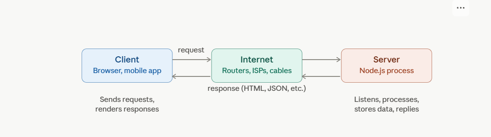
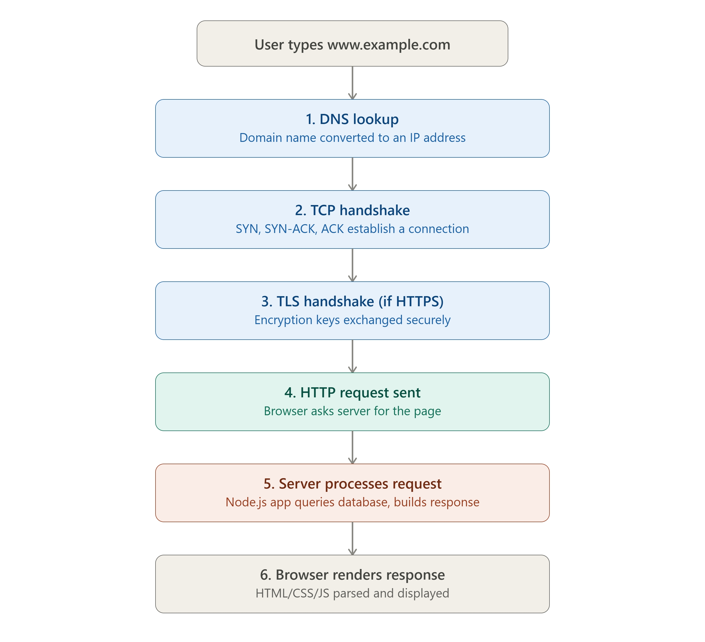

# DAY 2 — The Plumbing of the Internet

### (Client-Server Architecture, DNS, HTTP/HTTPS Deep Dive, TCP vs UDP)

> **Why this day matters:** Every system design diagram you'll ever draw has boxes connected by arrows. Today you learn EXACTLY what those arrows mean at a technical level. Once you understand this, every future "Client → Load Balancer → Server" diagram stops being an abstract picture and becomes something you can explain down to the packet level — which is exactly what separates a senior engineer's answer from a junior one in interviews.

> Two diagrams were rendered above in this conversation — refer back to them as you read **Section 1** (client-server roles) and **Section 2.4** (the full URL-to-webpage journey). They are part of this lesson; re-explain them using the labels and click-prompts shown.

---

## TABLE OF CONTENTS — DAY 2

1. Client-Server Architecture
2. DNS (Domain Name System) — Deep Dive
3. IP Addresses — the basics you need
4. HTTP/HTTPS Deep Dive (Methods, Status Codes, Headers, Versions)
5. TCP vs UDP
6. Putting it all together: the full journey of a URL
7. Day 2 Cheat Sheet

---

## 1. CLIENT-SERVER ARCHITECTURE

### What

Client-Server is an architectural pattern where work is divided between two roles:

- **Client**: The one who _requests_ something. Initiates communication. Examples: a web browser, a mobile app, a Postman request, another backend service calling your API.
- **Server**: The one who _listens and responds_. Holds the data/logic and waits passively until a client asks for something. Example: your Node.js + Express application.

This is the diagram you saw rendered above this section — Client and Server are two separate machines/processes, talking to each other across "the internet" in the middle, with requests flowing one way and responses flowing back.

### Why

Before client-server architecture became standard, many systems were **mainframe-based** — a single giant computer did everything, and "dumb terminals" (just a screen and keyboard, no processing power) connected to it. This didn't scale well for the web because:

1. You can't put a mainframe in every household.
2. If the mainframe goes down, literally everyone loses access — total dependency on one machine.

Client-server splits responsibility: the client handles **presentation** (what the user sees, local interactivity), and the server handles **data and business logic** (the things that need to be centralized, secured, and shared across users). This separation is also what allows you, as a backend developer, to build ONE API that many different clients (web app, iOS app, Android app, third-party developers) can all use simultaneously.

### Background

The client-server model emerged in the 1980s as personal computers became powerful enough to do some processing themselves (unlike dumb terminals), while still needing centralized data (like a shared company database). The World Wide Web (1990s, invented by Tim Berners-Lee at CERN) is built entirely on client-server architecture: browsers (clients) request documents from web servers.

Over time, this evolved further:

- **2-tier architecture**: Client talks directly to a Database. (Simple, but the client has too much responsibility/security risk.)
- **3-tier architecture**: Client → Application Server (your Node.js logic) → Database. (The model almost everyone uses today — this is what you build as a backend developer.)
- **N-tier / Microservices**: Client → API Gateway → Multiple specialized backend services → Multiple databases. (Covered in Week 3.)

### How

1. The client constructs a **request** (e.g., "GET me the user profile for user ID 42") and sends it over a network.
2. The request travels across physical infrastructure (cables, routers, switches — the "Internet" box in the diagram above) to reach the server.
3. The server's operating system receives the raw network data, and hands it to the application listening on a specific **port** (e.g., your Node.js process listening on port 3000).
4. Your Node.js/Express code processes the request — this might mean querying a database, running business logic, calling another service.
5. The server constructs a **response** (e.g., HTTP status 200, with JSON body `{ "name": "Asha", "age": 28 }`) and sends it back across the network.
6. The client receives the response and does something with it (a browser renders HTML; a mobile app updates its UI; another backend service uses the JSON data).

### Implementation — A minimal client and server in Node.js, to make this concrete

**Server** (listens for requests):

```js
const express = require("express");
const app = express();

// This route is the "contract" your server offers to any client
app.get("/api/user/:id", (req, res) => {
  const userId = req.params.id;
  // In a real app, you'd query a database here
  const user = { id: userId, name: "Asha", age: 28 };
  res.json(user); // sends an HTTP response with JSON body
});

app.listen(3000, () => console.log("Server listening on port 3000"));
```

**Client** (initiates the request) — this could be a browser, but here's a Node.js script acting as a client to show the symmetry:

```js
const axios = require("axios");

async function getUserProfile() {
  // The CLIENT initiates contact — the server never calls the client first
  const response = await axios.get("http://localhost:3000/api/user/42");
  console.log(response.data); // { id: '42', name: 'Asha', age: 28 }
}

getUserProfile();
```

Notice the fundamental asymmetry: **the server is always passively listening; the client always initiates.** A server never randomly decides to push data to a regular HTTP client out of nowhere — if you need server-initiated communication (like live chat notifications), you need different tools (WebSockets, Server-Sent Events, or polling) — these are explored on Day 3.

### Real-world example

When you open Instagram on your phone (client), it sends requests to Instagram's servers asking "give me the latest posts for my feed." Instagram's servers (often thousands of machines behind the scenes) process this and return data. Your phone never directly touches Instagram's database — it only ever talks to the server, which is the gatekeeper. This gatekeeping is also a **security boundary**: clients can be tampered with (a hacked app), so servers never fully trust input from a client and always validate it server-side.

### Trade-offs

- **Pro**: Centralizes business logic and sensitive data (the database is never exposed directly to users), security validation happens server-side, you can update server logic without forcing users to update their app.
- **Con**: The server becomes a potential bottleneck (it has to handle ALL clients) and a single point of failure if there's only one server — which is precisely why the rest of this 30-day plan exists (load balancing, scaling, replication).

### Interview Angle

You won't usually be asked "what is client-server" directly in a senior interview, but you're expected to use this vocabulary fluently while explaining any system: "the client sends a request to our API gateway, which routes it to the appropriate microservice..." — using these words precisely (not mixing up client/server roles) signals fluency.

### How to teach this

> "A restaurant: you (the client) don't walk into the kitchen and cook your own food. You sit at a table and place an order with a waiter, who takes it to the kitchen (the server). The kitchen has all the ingredients, recipes, and equipment (the data and logic) — you never see or touch those directly. You just send a request ('I'd like the pasta') and receive a response (the cooked dish). This separation is exactly what client-server architecture is."

---

## 2. DNS (DOMAIN NAME SYSTEM) — DEEP DIVE

### What

DNS is the system that translates human-readable domain names (like `www.google.com`) into machine-readable IP addresses (like `142.250.183.196`) that computers actually use to locate each other on a network. It's often called **"the phonebook of the internet."**

### Why

Computers communicate using IP addresses (numbers), not names. But humans are terrible at remembering numbers and great at remembering words. Imagine if, instead of typing `youtube.com`, you had to type `142.250.190.78` every time, and that number changed whenever YouTube moved servers — completely unusable. DNS solves this by giving every "address" a memorable name, and handling the (often changing) underlying number behind the scenes.

### Background

In the very early ARPANET (the precursor to the internet, 1970s-80s), there were so few computers that a single text file called `HOSTS.TXT` was manually maintained and distributed to every machine, mapping names to addresses. As the network grew to thousands and then millions of computers, manually updating and distributing a single file became impossible. **Paul Mockapetris invented DNS in 1983** — a _distributed, hierarchical_ system, so no single server needs to know about every domain in the world; the responsibility is split across millions of servers worldwide. This hierarchical, distributed design is itself a foundational system design lesson: **never centralize something that needs to scale globally.**

### How — The DNS Resolution Process (step by step)

When you type `www.example.com` into your browser, here's exactly what happens:

1. **Browser cache check**: Has this domain been looked up recently? If yes, and the cached result hasn't expired (see TTL below), use it immediately — no network call needed.
2. **OS cache check**: If not in browser cache, the operating system checks its own DNS cache.
3. **Recursive resolver (ISP or public, e.g., Google's 8.8.8.8)**: If still not found, the request goes to a **recursive resolver** — usually run by your ISP, or a public one like Google DNS (8.8.8.8) or Cloudflare (1.1.1.1). This resolver does the heavy work of finding the answer on your behalf.
4. **Root nameserver**: The recursive resolver asks one of 13 logical **root servers** (the very top of the DNS hierarchy) — "where do I find `.com` domains?" The root server replies with the address of the `.com` **TLD (Top-Level Domain) nameserver**.
5. **TLD nameserver**: The resolver then asks the `.com` TLD server — "who is responsible for `example.com`?" It replies with the address of `example.com`'s **authoritative nameserver**.
6. **Authoritative nameserver**: This is the server that actually KNOWS the IP address for `www.example.com` (it's configured by whoever owns the domain, e.g., via their DNS provider — GoDaddy, Cloudflare, Route53). It replies with the actual IP address.
7. **Resolver caches and returns**: The recursive resolver caches this result (for future requests) and finally returns the IP address to your browser.
8. **Browser connects**: Now your browser knows the IP address and can begin the actual TCP connection to the server.

This sounds like a lot of steps, but it usually takes **single-digit milliseconds** because of caching at every layer — most lookups never go all the way to the root server; they're answered from a cache somewhere along the chain.

### Key DNS record types (you must know these)

| Record Type | Purpose                                              | Example                                    |
| ----------- | ---------------------------------------------------- | ------------------------------------------ |
| **A**       | Maps a domain to an IPv4 address                     | `example.com → 93.184.216.34`              |
| **AAAA**    | Maps a domain to an IPv6 address                     | `example.com → 2606:2800:220:1::`          |
| **CNAME**   | Maps a domain to ANOTHER domain (alias)              | `www.example.com → example.com`            |
| **MX**      | Specifies mail servers for the domain                | Used for email routing                     |
| **TXT**     | Arbitrary text, often for verification               | Domain ownership verification, SPF records |
| **NS**      | Specifies the authoritative nameservers for a domain | Points to who manages this domain's DNS    |

### TTL (Time To Live) — a crucial caching concept

Every DNS record has a **TTL**, in seconds, telling resolvers how long they're allowed to cache the result before checking again. Example: TTL of 3600 means "cache this for 1 hour."

**Why TTL matters in system design**: If you're about to migrate your server to a new IP address (e.g., switching cloud providers), you should **lower your DNS TTL in advance** (e.g., to 60 seconds) so that when you make the switch, users worldwide start hitting the new server quickly instead of some of them being stuck hitting the old, possibly-shutdown server for hours due to stale cached DNS records. This is a real, practical operational concern that comes up constantly in production migrations.

### Implementation — DNS lookups in Node.js

```js
const dns = require("dns");

// Basic lookup - get the IP address for a domain
dns.lookup("example.com", (err, address, family) => {
  console.log(`Address: ${address}, IPv${family}`);
});

// Resolve specific record types
dns.resolve4("example.com", (err, addresses) => {
  console.log("IPv4 addresses:", addresses); // could be multiple - DNS load balancing!
});

dns.resolveMx("example.com", (err, addresses) => {
  console.log("Mail servers:", addresses);
});
```

**A neat system design trick**: DNS can return **multiple A records** for one domain (multiple IP addresses). This is a simple, primitive form of load balancing called **DNS round-robin** — each time a client resolves the domain, it might get a different IP address among several servers, spreading load roughly evenly (though it has limitations we'll discuss on Day 4 vs proper load balancers).

### Real-world example

- **Cloudflare and Route53** are popular "authoritative DNS" providers — when companies want fast, reliable DNS responses (since slow DNS = slow perceived website load for users), they use specialized DNS providers with servers distributed globally (anycast networks) rather than running DNS themselves.
- **GitHub outage example**: A misconfigured DNS record has, historically, caused major company-wide outages (the site/API is technically running fine, but nobody can find its address) — showing DNS, despite being "just a phonebook," is a critical single point of failure if not configured redundantly.

### Trade-offs

- DNS caching (TTL) trades **freshness for speed**: longer TTL = faster repeat lookups, but slower to propagate changes (like server migrations) worldwide.
- Using a third-party DNS provider trades **control for reliability/performance** — you depend on their infrastructure, but you get global anycast networks you couldn't build yourself.

### Interview Angle

A common interview question: "Why might a DNS change take time to take effect everywhere?" → Answer: TTL caching at multiple layers (browser, OS, ISP resolver) means old records linger until their TTL expires, even after you've updated the record at the authoritative server.

### How to teach this

> "DNS is exactly like a contact list translating a person's name into their actual phone number. You don't memorize phone numbers for everyone you know — you save 'Mom' in your contacts, and your phone looks up the number behind the scenes. DNS does this for the internet: you type a name, and behind the scenes, a hierarchy of phonebooks (root → .com → example.com) is consulted, until your computer knows the actual 'phone number' (IP address) to call."

---

## 3. IP ADDRESSES — WHAT A BACKEND DEVELOPER NEEDS TO KNOW

### What

An IP (Internet Protocol) address is a unique numerical identifier assigned to every device on a network, so data knows where to go — similar to a postal address for a house.

- **IPv4**: The older format, written as 4 numbers (0-255) separated by dots, e.g., `192.168.1.1`. Only about 4.3 billion possible addresses — and the world ran out of new ones years ago, due to the explosion of internet-connected devices.
- **IPv6**: The newer format, written as 8 groups of hexadecimal digits, e.g., `2001:0db8:85a3:0000:0000:8a2e:0370:7334`. Has a vastly larger address space (340 undecillion addresses — practically unlimited for the foreseeable future).

### Why this matters for a backend developer

- You'll see IP addresses in logs, and need to know that a request's source IP can be used for rate limiting (Day 18), geo-location (showing currency or language based on user location), and security blocking.
- **Private vs Public IPs**: Inside a company's internal network (or a Docker/Kubernetes cluster), machines often use **private IP ranges** (like `10.0.0.0/8`, `172.16.0.0/12`, `192.168.0.0/16`) that aren't reachable directly from the public internet — only a designated gateway/load balancer has a public IP. This is a basic but important security and architecture pattern: **don't expose your database or internal services directly to the internet; only your gateway/load balancer should have a public IP.**

### Implementation — getting client IP in an Express app

```js
app.get("/api/data", (req, res) => {
  // req.ip gives the client's IP, but behind a load balancer/proxy,
  // this might be the LOAD BALANCER's IP, not the real client!
  const clientIp = req.headers["x-forwarded-for"] || req.socket.remoteAddress;
  console.log(`Request from: ${clientIp}`);
  res.json({ message: "Hello", yourIp: clientIp });
});
```

**Important real-world gotcha**: When your Node.js app sits behind a load balancer or reverse proxy (Nginx, AWS ALB, Cloudflare), `req.ip` often shows the **proxy's** IP, not the real client's. The proxy must add an `X-Forwarded-For` header containing the original client IP for your app to know the true source — this is a genuinely common bug that trips up rate-limiting and logging in production Node.js apps.

### How to teach this

> "An IP address is like a house's postal address — it's how data knows physically (well, logically) where to be delivered. IPv4 is like an older city that's run out of street addresses to assign to new houses; IPv6 is like a brand-new city planned with so many possible addresses, it'll never run out."

---

## 4. HTTP / HTTPS DEEP DIVE

### What

HTTP (HyperText Transfer Protocol) is the application-level protocol that defines the RULES for how clients and servers exchange messages on the web — what a "request" looks like, what a "response" looks like, and what different kinds of actions (GET, POST, etc.) mean. **HTTPS** is simply HTTP **encrypted** using TLS (Transport Layer Security), so data can't be read or tampered with in transit.

### Why

Before HTTP, there was no standard way for a browser and a server to "agree" on the format of a request/response — every system would invent its own rules, making the web impossible to build broadly. HTTP gave the entire industry a shared, simple, text-based contract: every browser, every server, every language, all speak the same protocol. HTTPS exists because plain HTTP sends data as **plaintext** — anyone intercepting your network traffic (a hacker on public WiFi, your ISP, a malicious router) could read passwords, credit card numbers, or session tokens being sent. This is a massive, completely real security problem that HTTPS solves via encryption.

### Background

HTTP was invented by **Tim Berners-Lee in 1989-1991** alongside HTML and the concept of URLs, as the foundation of the World Wide Web. It went through major versions:

- **HTTP/1.0 (1996)**: One request per TCP connection (very inefficient — every single image, CSS file, etc., needed a brand-new TCP handshake).
- **HTTP/1.1 (1997)**: Introduced "persistent connections" (keep-alive) — reuse one TCP connection for multiple requests, much faster. Still standard today for many systems.
- **HTTP/2 (2015)**: Introduced **multiplexing** — multiple requests/responses can be in flight simultaneously over a SINGLE connection (instead of one-at-a-time), plus header compression. Big performance gains for sites with many resources.
- **HTTP/3 (2022, increasingly standard)**: Runs over **QUIC** (built on UDP instead of TCP) to avoid certain TCP-level delays entirely, especially helpful on unreliable mobile networks.

### How — Anatomy of an HTTP Request and Response

**HTTP Request structure:**

```
GET /api/users/42 HTTP/1.1
Host: api.example.com
Authorization: Bearer eyJhbGc...
Content-Type: application/json
User-Agent: Mozilla/5.0...

(body, if any - e.g., for POST/PUT)
```

- **Method** (GET) + **Path** (/api/users/42) + **Version** (HTTP/1.1)
- **Headers**: metadata about the request (what format you accept, your auth token, etc.)
- **Body**: the actual data payload (only for methods like POST, PUT, PATCH)

**HTTP Response structure:**

```
HTTP/1.1 200 OK
Content-Type: application/json
Content-Length: 87

{"id": 42, "name": "Asha", "age": 28}
```

- **Status line**: protocol version + status code + status text
- **Headers**: metadata about the response (content type, caching rules, etc.)
- **Body**: the actual data being returned

### HTTP Methods (you MUST know these cold for interviews)

| Method     | Purpose                             | Idempotent?  | Has Body?    | Example                      |
| ---------- | ----------------------------------- | ------------ | ------------ | ---------------------------- |
| **GET**    | Retrieve data, no side effects      | Yes          | No           | Fetch a user profile         |
| **POST**   | Create a new resource / submit data | No           | Yes          | Create a new order           |
| **PUT**    | Replace an entire resource          | Yes          | Yes          | Replace user's full profile  |
| **PATCH**  | Partially update a resource         | No (usually) | Yes          | Update just the user's email |
| **DELETE** | Remove a resource                   | Yes          | No (usually) | Delete a post                |

**Idempotent** is a critical word for interviews: it means **calling the operation multiple times has the SAME EFFECT as calling it once**. GET is idempotent — reading data 100 times doesn't change anything. PUT is idempotent — replacing a resource with the same data 5 times leaves it in the same final state as doing it once. POST is generally NOT idempotent — calling "create an order" 3 times creates 3 separate orders! **This connects directly back to Day 1's idempotency-key discussion** for safe retries — POST endpoints that aren't naturally idempotent need explicit idempotency keys to make retries safe.

### HTTP Status Codes (grouped — know the categories AND key specific codes)

| Range   | Category      | Key codes to know                                                                                    |
| ------- | ------------- | ---------------------------------------------------------------------------------------------------- |
| **1xx** | Informational | 100 Continue                                                                                         |
| **2xx** | Success       | 200 OK, 201 Created, 204 No Content                                                                  |
| **3xx** | Redirection   | 301 Moved Permanently, 302 Found (temp redirect), 304 Not Modified (caching!)                        |
| **4xx** | Client Error  | 400 Bad Request, 401 Unauthorized, 403 Forbidden, 404 Not Found, 409 Conflict, 429 Too Many Requests |
| **5xx** | Server Error  | 500 Internal Server Error, 502 Bad Gateway, 503 Service Unavailable, 504 Gateway Timeout             |

**Critical distinction interviewers love asking: 401 vs 403**

- **401 Unauthorized**: "I don't know who you are" — you're not authenticated (missing/invalid login credentials/token).
- **403 Forbidden**: "I know who you are, but you're not allowed to do this" — you ARE authenticated, but lack permission (authorization) for this specific action.

**Critical distinction: 502 vs 503 vs 504** (these come up constantly in real production debugging)

- **502 Bad Gateway**: A server acting as a proxy/gateway got an INVALID response from the upstream server (e.g., your Node.js app crashed and Nginx got garbage back).
- **503 Service Unavailable**: The server is UP but deliberately not handling requests right now (overloaded, in maintenance mode).
- **504 Gateway Timeout**: A proxy/gateway waited for the upstream server to respond, and it took too long — it gave up.

### Implementation — Express.js handling methods, status codes, and headers properly

```js
const express = require("express");
const app = express();
app.use(express.json());

// GET - idempotent, no body needed, just retrieve
app.get("/api/orders/:id", async (req, res) => {
  const order = await db.orders.findById(req.params.id);
  if (!order) {
    return res.status(404).json({ error: "Order not found" }); // 404 = doesn't exist
  }
  res.status(200).json(order); // 200 = success, here's your data
});

// POST - NOT idempotent, creates a new resource each time called
app.post("/api/orders", async (req, res) => {
  const order = await db.orders.create(req.body);
  // 201 Created is the CORRECT code here, not 200 -
  // it signals "a new resource was created", and convention
  // is to also return a Location header pointing to the new resource
  res.status(201).location(`/api/orders/${order.id}`).json(order);
});

// PUT - idempotent, replaces the entire resource
app.put("/api/orders/:id", async (req, res) => {
  const order = await db.orders.replace(req.params.id, req.body);
  res.status(200).json(order);
});

// PATCH - partial update
app.patch("/api/orders/:id", async (req, res) => {
  const order = await db.orders.update(req.params.id, req.body); // only updates given fields
  res.status(200).json(order);
});

// DELETE - idempotent (deleting an already-deleted thing is still "deleted")
app.delete("/api/orders/:id", async (req, res) => {
  await db.orders.delete(req.params.id);
  res.status(204).send(); // 204 No Content - success, but nothing to return
});

// Middleware example showing 401 vs 403 distinction
function authenticate(req, res, next) {
  const token = req.headers.authorization;
  if (!token) return res.status(401).json({ error: "Not authenticated" }); // who are you?
  req.user = verifyToken(token); // attach decoded user info
  next();
}

function requireAdmin(req, res, next) {
  if (req.user.role !== "admin") {
    return res.status(403).json({ error: "Forbidden: admin access required" }); // you, but not allowed
  }
  next();
}

app.delete(
  "/api/admin/users/:id",
  authenticate,
  requireAdmin,
  async (req, res) => {
    await db.users.delete(req.params.id);
    res.status(204).send();
  },
);
```

### Key HTTP headers you should know

| Header                        | Purpose                                                                                      |
| ----------------------------- | -------------------------------------------------------------------------------------------- |
| `Content-Type`                | Format of the body (`application/json`, `text/html`, `multipart/form-data`)                  |
| `Authorization`               | Credentials, e.g., `Bearer <token>` for JWT auth (Day 25)                                    |
| `Cache-Control`               | Caching rules (`max-age=3600`, `no-cache`) — directly used in CDN/browser caching (Day 5)    |
| `ETag`                        | A version identifier for a resource, used for cache validation (works with 304 Not Modified) |
| `Set-Cookie` / `Cookie`       | Session management                                                                           |
| `X-Forwarded-For`             | Original client IP when behind a proxy/load balancer (mentioned above)                       |
| `Access-Control-Allow-Origin` | CORS — controls which domains can call your API from a browser                               |

### HTTPS — How encryption actually works (TLS handshake)

This is the step labeled "3. TLS handshake" in the URL-journey diagram rendered earlier — here's what happens inside that box:

1. Client says "hello," lists which encryption algorithms it supports.
2. Server responds with its **digital certificate** (issued by a trusted Certificate Authority like Let's Encrypt or DigiCert) containing its public key, and picks an encryption algorithm both sides support.
3. Client verifies the certificate is legitimate (signed by a CA the browser trusts) — this is what stops fake/impersonating servers.
4. Client and server use asymmetric encryption (public/private key cryptography) briefly to securely agree on a **shared symmetric session key**.
5. From this point on, ALL data is encrypted using that fast symmetric key (symmetric encryption is much faster than asymmetric, which is why it's used for the bulk of the actual data transfer, not just the handshake).

### Real-world example

Every time you see the padlock icon in your browser's address bar, a TLS handshake like this has already happened, and you're now sending data through an encrypted tunnel — meaning even if someone is sniffing your WiFi traffic at a coffee shop, they only see scrambled bytes, not your actual password or data.

### Trade-offs

- HTTPS adds a small amount of computational overhead (encryption/decryption) and slightly increases initial connection latency (the TLS handshake adds round trips) — but this cost is now considered completely worth it for security, and modern optimizations (TLS 1.3, session resumption) have made it nearly negligible. There is effectively NO valid reason to run a production system on plain HTTP today.
- Choosing precise status codes (201 vs 200, 401 vs 403) might feel like a minor detail, but it has REAL consequences: client-side code, monitoring/alerting systems, and other engineers all rely on these codes to correctly handle different scenarios. Using "200 OK" for everything (a common shortcut) breaks client error-handling logic and monitoring dashboards.

### Interview Angle

Extremely commonly tested: "What's the difference between PUT and PATCH?" "What does idempotent mean and which methods are idempotent?" "Explain 401 vs 403." "What happens during a TLS handshake (at a high level)?" Know these cold — they come up in almost every backend/system design interview as quick-fire questions before the main design problem even starts.

### How to teach this

> "HTTP is the _language_ and _grammar_ that browsers and servers agree to speak. A GET request is like asking a librarian 'can I see this book?' — nothing changes by asking again. A POST request is like saying 'please add this NEW book to the shelf' — if you say it 3 times, you get 3 new books, which might not be what you wanted! Status codes are like the librarian's reply: '200, here you go,' '404, that book doesn't exist,' '403, you're a member but you're not allowed in the restricted archive,' '401, I don't even know who you are, please show your library card first.' HTTPS is simply doing this entire conversation inside a locked, soundproof box, so nobody walking by can eavesdrop or tamper with what's being said."

---

## 5. TCP vs UDP

### What

TCP and UDP are the two main **transport layer** protocols — they sit one level below HTTP and are responsible for actually moving bytes of data across the network between two machines.

- **TCP (Transmission Control Protocol)**: A **connection-oriented**, reliable protocol. It guarantees that data arrives, arrives in the correct order, and isn't corrupted — but this reliability comes at a performance cost.
- **UDP (User Datagram Protocol)**: A **connectionless**, "fire and forget" protocol. It sends data without any guarantee of delivery, order, or integrity — but it's much faster and has lower overhead.

### Why both exist

Different applications have fundamentally different needs:

- A bank transfer absolutely cannot have a missing or duplicated packet — it needs TCP's guarantees.
- A live video call can tolerate losing a tiny fragment of a frame (you might see a brief glitch) far better than it can tolerate the delay caused by TCP stopping everything to re-request and wait for a lost packet. For real-time media, UDP's speed is more valuable than TCP's perfect reliability.

If only TCP existed, every real-time application (video calls, live gaming, DNS lookups) would feel sluggish. If only UDP existed, every application requiring data integrity (file transfers, web pages, financial transactions) would be unreliable. **Both are necessary tools for different jobs.**

### Background

Both protocols were defined in the late 1970s/early 1980s as part of the foundational **TCP/IP** suite that the modern internet is built on (work led by Vint Cerf and Bob Kahn, often called "fathers of the internet"). The original design philosophy: keep the core network simple (IP just moves packets, doesn't guarantee anything), and let the TRANSPORT layer (TCP or UDP) decide how much reliability to add on top, depending on what the application needs. This layering principle — separating concerns into layers, each handling one responsibility — is itself a system design lesson used constantly (we'll see this again in the OSI model concept, and again in software architecture across all 30 days).

### How — TCP's Three-Way Handshake (the famous interview topic)

Before ANY data is sent over TCP, the two sides must establish a connection:

1. **SYN**: Client sends a "synchronize" packet to the server: "I want to connect, here's my starting sequence number."
2. **SYN-ACK**: Server responds: "Acknowledged, here's MY starting sequence number too."
3. **ACK**: Client responds: "Acknowledged" — connection is now established.

Only after this handshake completes can actual data (like your HTTP request) start flowing. This is exactly the "2. TCP handshake" step in the URL-journey diagram from earlier in this lesson.

**Why does TCP need this handshake?** It lets both sides agree on starting sequence numbers (used to track packet order and detect loss) and confirms BOTH directions of communication actually work before wasting time sending real data over a potentially broken connection.

### How TCP guarantees reliability (the mechanisms)

- **Sequence numbers**: Every byte sent is numbered, so the receiver can detect missing or out-of-order packets and reassemble them correctly.
- **Acknowledgments (ACKs)**: The receiver tells the sender which data it has successfully received.
- **Retransmission**: If the sender doesn't get an ACK within an expected time, it assumes the packet was lost and resends it.
- **Flow control & congestion control**: TCP dynamically slows down or speeds up data transmission based on how fast the receiver can process data and how congested the network currently is, to avoid overwhelming either side.

### How UDP works (by contrast — it's much simpler)

UDP just sends packets ("datagrams") immediately, with no handshake, no sequence tracking, no acknowledgment, no retransmission. If a packet is lost, UDP does nothing about it — it's entirely up to the APPLICATION (if it cares) to detect and handle that loss itself.

### Implementation — TCP and UDP in Node.js

**TCP server/client (this is literally what Express/HTTP is built on top of):**

```js
const net = require("net");

// TCP Server
const server = net.createServer((socket) => {
  console.log("Client connected (after 3-way handshake completed)");
  socket.on("data", (data) => {
    console.log("Received:", data.toString());
    socket.write("Got your message!"); // guaranteed to arrive, in order
  });
});
server.listen(4000);

// TCP Client
const client = net.createConnection({ port: 4000 }, () => {
  client.write("Hello server"); // Node.js handles the handshake internally
});
```

**UDP server/client (note: no "connection," no handshake, just send/receive):**

```js
const dgram = require("dgram");

// UDP Server
const udpServer = dgram.createSocket("udp4");
udpServer.on("message", (msg, rinfo) => {
  console.log(`Received: ${msg} from ${rinfo.address}:${rinfo.port}`);
  // No automatic reply mechanism, no guarantee this server even
  // received every packet sent - some could be silently lost
});
udpServer.bind(5000);

// UDP Client
const udpClient = dgram.createSocket("udp4");
const message = Buffer.from("Hello via UDP");
udpClient.send(message, 5000, "localhost", () => {
  console.log("Sent (no guarantee it arrived!)");
  udpClient.close();
});
```

Notice the UDP code has NO logic for retries, ordering, or confirming delivery — that's the entire point. If your application needs those guarantees while using UDP (e.g., for a custom game protocol), YOU have to build that logic yourself at the application layer, which is a meaningful amount of extra engineering work — this is exactly the trade-off being made.

### Real-world examples

| Use case                                 | Protocol       | Why                                                                                                                                                                         |
| ---------------------------------------- | -------------- | --------------------------------------------------------------------------------------------------------------------------------------------------------------------------- |
| Web browsing (HTTP/HTTPS up to HTTP/2)   | TCP            | Pages must load completely and correctly                                                                                                                                    |
| Video/voice calls (Zoom, WhatsApp calls) | UDP            | Speed and low latency matter more than occasional glitches                                                                                                                  |
| DNS lookups                              | UDP (mostly)   | Tiny request/response, speed matters, app can just retry if no answer                                                                                                       |
| Online multiplayer gaming                | UDP            | Player position updates need to be instant; a slightly stale lost packet is fine, a delayed one is not                                                                      |
| File transfer (FTP), email (SMTP)        | TCP            | Data integrity is non-negotiable                                                                                                                                            |
| HTTP/3 (newest)                          | UDP (via QUIC) | Interestingly, HTTP/3 builds its OWN reliability on top of UDP, to avoid certain TCP-specific delays while still ensuring data integrity — best of both worlds, but complex |

### Trade-offs

|                              | TCP                                                 | UDP                                                    |
| ---------------------------- | --------------------------------------------------- | ------------------------------------------------------ |
| Reliability                  | Guaranteed delivery, order, integrity               | No guarantees at all                                   |
| Speed                        | Slower (handshake + ACKs + retransmission overhead) | Faster (no overhead)                                   |
| Use case fit                 | Data correctness matters                            | Speed matters more than occasional loss                |
| Complexity for app developer | Low (the protocol handles reliability for you)      | High (you must handle reliability yourself, if needed) |

### Interview Angle

"Explain the TCP three-way handshake" and "When would you choose UDP over TCP?" are extremely common questions, especially for backend/infrastructure-leaning roles. A strong answer always anchors to a CONCRETE example (e.g., "I'd use UDP for a real-time multiplayer game's position updates, because a stale position packet should just be discarded and replaced by the next one rather than retransmitted, which would actually make the game feel WORSE, not better").

### How to teach this

> "TCP is like sending a registered, tracked courier package — you get confirmation it was picked up, confirmation it arrived, and if it gets lost, it's automatically resent. This is reliable, but takes a bit more time and paperwork. UDP is like shouting a message across a noisy room — fast and simple, but you have no idea if the other person actually heard you, and you're not going to repeat yourself unless THEY ask you to. For a love letter (data that must arrive intact), use TCP. For shouting 'duck!' as a warning in real time (speed matters more than guaranteed delivery, and a repeat doesn't help if it's already too late), UDP-style communication makes more sense."

---

## 6. PUTTING IT ALL TOGETHER — THE FULL JOURNEY OF A URL

Refer back to the 6-step diagram rendered earlier in this lesson. Here is the same journey, narrated end-to-end, tying together every concept from today:

1. **DNS Lookup** (Section 2): Your browser needs the IP address of the server. It checks caches, then potentially walks the DNS hierarchy (root → TLD → authoritative) to resolve `www.example.com` into an IP address.
2. **TCP Handshake** (Section 5): Using that IP address, your browser's OS initiates a TCP connection to the server's IP on port 443 (HTTPS) — SYN, SYN-ACK, ACK.
3. **TLS Handshake** (Section 4): Since this is HTTPS, immediately after the TCP connection is established, a TLS handshake happens — certificates are verified, encryption keys are exchanged.
4. **HTTP Request Sent** (Section 4): Now, over this secure, reliable TCP connection, your browser sends an actual HTTP GET request: `GET / HTTP/1.1` with headers like `Host: www.example.com`.
5. **Server Processes Request** (Section 1): The server's Node.js process receives this request, perhaps queries a database, runs business logic, and constructs an HTTP response with a status code (200 OK, hopefully) and a body (HTML, or JSON for an API).
6. **Browser Renders Response**: The browser receives the response over the same TCP connection, and if it's HTML, parses and renders it — which itself often triggers MORE requests (for CSS, JS, images), each potentially repeating some of these steps (though many will reuse the already-open, already-resolved connection thanks to HTTP/1.1 keep-alive or HTTP/2 multiplexing).

**This entire flow, from typing a URL to seeing a page, typically happens in under 200-300 milliseconds for a well-optimized site** — and now you know exactly which of those milliseconds is DNS, which is TCP, which is TLS, and which is your actual server's processing time. This breakdown is EXACTLY what tools like Chrome DevTools' "Network" tab show you (look for "DNS Lookup," "Initial Connection," "SSL," "Waiting (TTFB)," and "Content Download" timings next time you inspect a request) — now you know what each of those labels actually means underneath.

### How to teach this (the full script, end to end)

> "Imagine ordering food for delivery through an app. First, you need the restaurant's actual address — that's DNS, translating the name into a location. Then a delivery route gets established between you and the restaurant — that's TCP, a reliable connection. If it's a sensitive order needing privacy (say, a courier service that handles confidential documents), you'd also seal everything in a locked box only you and the restaurant have the key to — that's TLS/HTTPS. Then you actually place your order with specific instructions — that's the HTTP request. The kitchen prepares your order using their internal processes — that's the server processing the request, possibly checking inventory (the database). Finally, the food arrives and you consume it — that's the browser rendering the response. Every single web request you've ever made follows this exact sequence, whether you realized it or not."

---

## 7. DAY 2 CHEAT SHEET

```
CLIENT-SERVER
  Client = initiates requests (browser, app, another service)
  Server = listens, processes, responds (your Node.js app)
  3-tier: Client -> App Server -> Database (standard backend pattern)

DNS = translates domain names -> IP addresses
  Order: Browser cache -> OS cache -> Recursive resolver ->
         Root server -> TLD server -> Authoritative server
  Record types: A (IPv4), AAAA (IPv6), CNAME (alias), MX (mail), TXT, NS
  TTL = how long a record can be cached before re-checking

IP ADDRESSES
  IPv4 = 4.3 billion addresses (exhausted), IPv6 = practically unlimited
  Private IPs (internal-only) vs Public IPs (internet-reachable)
  Behind a load balancer, use X-Forwarded-For header for real client IP

HTTP METHODS (know idempotency!)
  GET     - read, idempotent, no body
  POST    - create, NOT idempotent, has body
  PUT     - replace entirely, idempotent, has body
  PATCH   - partial update, not idempotent (usually), has body
  DELETE  - remove, idempotent, usually no body

STATUS CODES
  2xx success | 3xx redirect | 4xx client error | 5xx server error
  401 = who are you? (not authenticated)
  403 = I know you, but you can't do this (not authorized)
  502 = upstream gave garbage | 503 = server deliberately unavailable
  504 = upstream took too long, gateway gave up

HTTPS = HTTP + TLS encryption
  TLS handshake: hello -> certificate verification -> shared key agreed
  -> all further data encrypted with fast symmetric key

TCP vs UDP
  TCP = reliable, ordered, connection-based (3-way handshake: SYN, SYN-ACK, ACK)
        Use for: web pages, file transfer, anything needing correctness
  UDP = fast, no guarantees, connectionless
        Use for: video calls, gaming, DNS - speed over perfect reliability

FULL URL JOURNEY:
  DNS lookup -> TCP handshake -> TLS handshake -> HTTP request sent
  -> server processes -> HTTP response -> browser renders
```

---

### What's next (Day 3 preview)

Tomorrow we go one level UP from raw HTTP into how APIs are actually DESIGNED: REST principles in depth (with the Richardson Maturity Model — a favorite interview topic), GraphQL (what problem it solves that REST doesn't), gRPC (used heavily in microservices for fast internal communication), and WebSockets (for real-time, server-initiated communication — solving the exact limitation of plain HTTP we mentioned today). You'll build a working REST API AND a WebSocket server in Node.js, and understand exactly when to reach for each one.

**Say "Day 3" whenever you're ready.**



