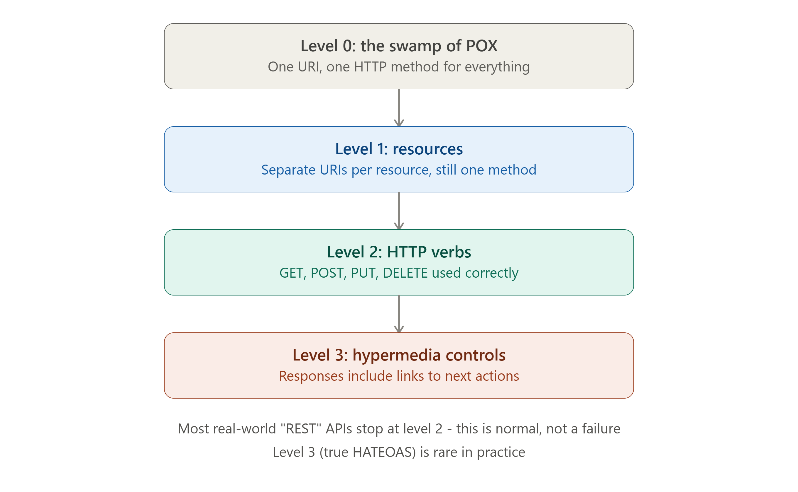
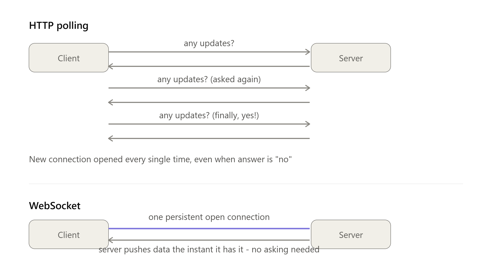

# DAY 3 — API Design Paradigms

### (REST Deep Dive, Richardson Maturity Model, GraphQL, gRPC, WebSockets)

> **Why this day matters:** Day 2 taught you the raw protocol — HTTP, TCP, the wire-level mechanics. Today is one level up: **how do you design the actual API contract** that clients use to talk to your backend? As a Node.js developer, this is the single most common decision you'll make on every project: "should this be REST, GraphQL, gRPC, or a WebSocket?" By the end of today, you'll never have to guess again — you'll know exactly which tool fits which job, and you'll have built all four.

> Two diagrams were rendered above — refer to them as you read **Section 1.4** (Richardson Maturity Model levels) and **Section 4** (polling vs WebSocket communication pattern).

---

## TABLE OF CONTENTS — DAY 3

1. REST — What, Why, Background, How, Richardson Maturity Model, Implementation
2. GraphQL — What, Why, Background, How, Implementation
3. gRPC — What, Why, Background, How, Implementation
4. WebSockets — What, Why, Background, How, Implementation
5. Side-by-Side Comparison — When to Use Which
6. Day 3 Cheat Sheet

---

## 1. REST (REPRESENTATIONAL STATE TRANSFER)

### What

REST is an **architectural style** (not a protocol, not a library, not a strict standard) for designing networked APIs, built on a set of constraints layered on top of HTTP. A REST API exposes **resources** (nouns — like `users`, `orders`, `products`) at distinct URLs, and lets clients perform actions on those resources using standard HTTP methods (verbs — GET, POST, PUT, DELETE), which you already learned in depth on Day 2.

In plain words: instead of having one giant endpoint that does everything (`/doStuff`), REST says: organize your API around the THINGS in your system (resources), and use HTTP's existing vocabulary of verbs to act on them. `GET /users/42` means "get me user 42." `DELETE /users/42` means "delete user 42." The URL is a noun; the HTTP method is the verb.

### Why

Before REST became standard (roughly pre-2000), most web service APIs used **SOAP (Simple Object Access Protocol)** — XML-based, heavyweight, with rigid contracts (WSDL files), and every single operation (even reading data) typically went through HTTP POST with custom XML bodies describing the "method" being called, ignoring most of what HTTP already offered for free (caching, status codes, standard verbs). This was complex to write, complex to parse, and didn't take advantage of HTTP's built-in infrastructure (browsers, proxies, and caches all understand GET/POST/status codes natively).

**Roy Fielding**, in his **2000 PhD dissertation**, formally described REST as a style that leverages HTTP's _existing_ semantics fully, rather than building a custom protocol on top of it. The benefit: simpler, more cacheable, more scalable (because REST encourages **statelessness** — explained below — which directly enables horizontal scaling, a Day 1 concept), and tools that already understand HTTP (browsers, CDNs, proxies, monitoring tools) work with REST APIs automatically, with zero extra configuration.

### Background

REST exploded in popularity through the 2000s-2010s as the web moved from "static pages" to "dynamic APIs powering apps." Twitter, Facebook, and most major companies built their first public APIs as REST APIs. It became the **default choice** for public/external APIs and is still extremely dominant today, especially for simpler CRUD-style applications.

### How — The Core Constraints of REST (what actually makes something "RESTful")

1. **Client-Server separation** (you learned this Day 2) — clean separation of concerns.
2. **Statelessness** — Each request must contain ALL the information needed to process it. The server should NOT store any session state about the client between requests. This is the single most important constraint for **system design specifically**, because a stateless server can be **horizontally scaled trivially** — any server instance behind a load balancer can handle any request, since no server is "remembering" anything about a specific client (this directly connects to Day 1's discussion of stateless services).
3. **Cacheability** — Responses must explicitly indicate whether they're cacheable, so clients/proxies/CDNs can reuse responses and reduce server load (using headers like `Cache-Control`, learned Day 2 — fully explored Day 5).
4. **Uniform Interface** — A consistent way of interacting with resources, primarily through:
   - **Resource identification in URLs**: `/users/42`, not `/getUserById?id=42`.
   - **Standard HTTP methods**: GET/POST/PUT/PATCH/DELETE used per their actual semantics (Day 2).
   - **Self-descriptive messages**: the request/response itself contains enough info to understand it (e.g., `Content-Type` headers).
5. **Layered system** — Clients shouldn't need to know if they're talking directly to the server or through intermediaries (load balancers, caches, gateways) — this enables you to add a CDN or load balancer in front of your API later WITHOUT clients needing to change anything.
6. **Code on demand** (optional, rarely used in practice) — server can optionally send executable code (like JavaScript) to the client.

### The Richardson Maturity Model (extremely common interview topic)

This is a model (created by Leonard Richardson) describing **how "RESTful" an API actually is**, in 4 levels — refer to the pyramid diagram rendered above.

- **Level 0 — "The Swamp of POX" (Plain Old XML)**: One single URI for everything, one HTTP method (usually POST) for every operation. Example: `POST /api` with a body like `{"action": "getUser", "id": 42}`. This is basically RPC-over-HTTP, not REST at all — HTTP is just being used as a "dumb tunnel."
- **Level 1 — Resources**: Multiple URIs, one per resource (`/users`, `/orders`), but still typically using only one HTTP method (often just POST) for all actions on that resource.
- **Level 2 — HTTP Verbs**: Resources have distinct URIs AND you correctly use GET/POST/PUT/DELETE per their actual meaning, plus proper status codes (200, 404, etc. — Day 2). **This is what 95%+ of "REST APIs" in the real world actually are.** When someone says "I built a REST API," they almost always mean Level 2.
- **Level 3 — Hypermedia Controls (HATEOAS — Hypermedia As The Engine Of Application State)**: Responses include **links** describing what actions you can take next. Example: a response for an order might include a `links` field saying you can `cancel` (DELETE this URL) or `track` (GET that URL) — the client discovers available actions from the response itself, instead of having that knowledge hardcoded. This is rarely implemented fully in real-world APIs, because it adds complexity that most teams decide isn't worth the benefit for typical internal/B2B APIs — but it IS the "real," complete definition of REST per Fielding's original dissertation.

**Interview tip**: If asked "is your API truly RESTful?", the strong answer is: "It's Level 2 on the Richardson Maturity Model — which is the pragmatic industry standard — but not Level 3/true HATEOAS, since hypermedia controls add complexity that isn't justified for our use case." This shows you know the theory AND can make pragmatic real-world trade-off calls.



### Implementation — A well-designed REST API in Node.js/Express

```js
const express = require("express");
const app = express();
app.use(express.json());

// LEVEL 2 REST design: resource-based URLs + correct HTTP verbs

// Collection endpoint - operations on the SET of orders
app.get("/api/orders", async (req, res) => {
  // Support filtering/pagination via query params - standard REST practice
  const { status, page = 1, limit = 20 } = req.query;
  const orders = await db.orders
    .find({ status })
    .skip((page - 1) * limit)
    .limit(limit);
  res
    .status(200)
    .json({ data: orders, page: Number(page), limit: Number(limit) });
});

app.post("/api/orders", async (req, res) => {
  const order = await db.orders.create(req.body);
  res.status(201).location(`/api/orders/${order.id}`).json(order);
});

// Item endpoint - operations on ONE SPECIFIC order
app.get("/api/orders/:id", async (req, res) => {
  const order = await db.orders.findById(req.params.id);
  if (!order) return res.status(404).json({ error: "Order not found" });
  res.status(200).json(order);
});

app.patch("/api/orders/:id", async (req, res) => {
  const order = await db.orders.update(req.params.id, req.body);
  res.status(200).json(order);
});

app.delete("/api/orders/:id", async (req, res) => {
  await db.orders.delete(req.params.id);
  res.status(204).send();
});

// Sub-resource pattern - REST handles relationships via nested URLs
app.get("/api/orders/:id/items", async (req, res) => {
  const items = await db.orderItems.findByOrderId(req.params.id);
  res.status(200).json(items);
});

app.listen(3000);
```

**A Level 3 (HATEOAS) example, for comparison** — notice the `links` field added to the response:

```js
app.get("/api/orders/:id", async (req, res) => {
  const order = await db.orders.findById(req.params.id);
  if (!order) return res.status(404).json({ error: "Order not found" });

  res.status(200).json({
    ...order,
    links: [
      { rel: "self", href: `/api/orders/${order.id}`, method: "GET" },
      { rel: "cancel", href: `/api/orders/${order.id}`, method: "DELETE" },
      { rel: "items", href: `/api/orders/${order.id}/items`, method: "GET" },
    ],
  });
});
```

With this design, the client doesn't need to hardcode "to cancel an order, send DELETE to /api/orders/:id" — it just reads the available `links` from each response and follows them. This is powerful in theory but adds real complexity to both server and client code, which is exactly why most teams skip it.

### Real-world example

Stripe's API, GitHub's API, and Twitter's (X's) API are all classic, well-regarded Level 2 REST APIs — resource-based URLs, proper HTTP verbs, proper status codes, and excellent, predictable documentation. They are widely used as "gold standard" examples to study REST API design.

### Trade-offs

- **Pro**: Simple, widely understood, naturally cacheable (GET requests can be cached by browsers/CDNs automatically), great tooling support (every language/platform understands HTTP).
- **Con**: **Over-fetching/under-fetching** — a classic REST problem. If a mobile app screen needs just a user's name and avatar, but `/users/42` returns 30 fields, you've **over-fetched** (wasted bandwidth). If you need data from 3 different resources (user, their orders, their reviews) to render one screen, you might need 3 separate REST calls — this is **under-fetching**, requiring multiple round trips. **This exact problem is what GraphQL was invented to solve** (next section).

### Interview Angle

Expect: "Design a REST API for X" (be ready to name resources, URLs, methods, status codes fluently). "What makes an API RESTful?" (the 6 constraints, statelessness especially). "What's the Richardson Maturity Model?" "What are the downsides of REST?" (over/under-fetching is the #1 expected answer, leading naturally into a GraphQL discussion).

### How to teach this

> "REST is like a well-organized library where every book has a predictable address based on subject and author (the URL = the resource), and there's a small, fixed set of things you're allowed to do at the front desk: borrow it, return it, renew it, or just look at the catalog entry (GET/POST/PUT/DELETE). You don't need a different process for each individual book — the SAME four actions work for every resource in the entire library. That predictability is REST's superpower."

---

## 2. GRAPHQL

### What

GraphQL is a **query language for APIs**, plus a runtime for executing those queries, that lets the CLIENT specify exactly what data it needs in a single request — rather than the server dictating fixed response shapes per endpoint (as in REST). Instead of many fixed URLs, GraphQL typically exposes a **single endpoint** (commonly `/graphql`), and the client sends a query describing the precise shape of data it wants back.

### Why

Directly solves REST's over-fetching/under-fetching problem (mentioned above). Imagine a mobile app's home screen needs: the user's name, their 3 most recent orders (just the order ID and total, not full details), and their unread notification count. In REST, this typically means 3 separate API calls to 3 different endpoints, each returning more fields than actually needed. In GraphQL, the client sends **one query** describing exactly these fields across these "types," and gets back **exactly that shape**, in **one round trip** — nothing more, nothing less.

### Background

GraphQL was developed internally at **Facebook starting in 2012**, driven by exactly the problem above: Facebook's mobile app needed highly specific, deeply nested data (e.g., a post, its comments, each comment's author, that author's other recent posts...) and REST's fixed-shape responses were causing either huge over-fetched payloads or dozens of sequential API calls — both bad for mobile performance, especially on slower mobile networks where Facebook had a huge global user base. Facebook open-sourced GraphQL in 2015, and it's now used heavily by GitHub (their v4 API is GraphQL), Shopify, and many companies with complex, deeply nested data and many different client types (web, iOS, Android) each needing different shapes of the same underlying data.

### How

**A GraphQL Schema** defines the types of data available and how they relate:

```graphql
type User {
  id: ID!
  name: String!
  email: String!
  orders: [Order!]!
}

type Order {
  id: ID!
  total: Float!
  items: [OrderItem!]!
}

type Query {
  user(id: ID!): User
}
```

**A client query**, requesting EXACTLY the fields it needs, nothing more:

```graphql
query {
  user(id: "42") {
    name
    orders {
      id
      total
    }
  }
}
```

**The response shape matches the query shape exactly:**

```json
{
  "data": {
    "user": {
      "name": "Asha",
      "orders": [
        { "id": "101", "total": 49.99 },
        { "id": "102", "total": 12.5 }
      ]
    }
  }
}
```

Notice: no `email` field was requested, so it's not in the response — zero over-fetching. And this single query fetched a user AND their orders in ONE round trip — zero under-fetching either.

### Resolvers — how a GraphQL server actually works

Every field in the schema has a corresponding **resolver function** — the actual code that fetches that piece of data. This is the key implementation concept.

```js
const { ApolloServer, gql } = require("apollo-server");

const typeDefs = gql`
  type User {
    id: ID!
    name: String!
    orders: [Order!]!
  }
  type Order {
    id: ID!
    total: Float!
  }
  type Query {
    user(id: ID!): User
  }
`;

const resolvers = {
  Query: {
    // resolver for the top-level "user" field
    user: async (_, { id }) => {
      return await db.users.findById(id);
    },
  },
  User: {
    // resolver for "orders" field WITHIN a User - only runs if the
    // client actually asked for orders in their query!
    orders: async (parent) => {
      return await db.orders.findByUserId(parent.id);
    },
  },
};

const server = new ApolloServer({ typeDefs, resolvers });
server.listen(4000).then(() => console.log("GraphQL server running"));
```

**Key insight**: the `orders` resolver only executes if the client's query actually includes the `orders` field. If a client asks only for `name`, the (potentially expensive) database call to fetch orders never happens. This is GraphQL's efficiency model in action, at the code level.

### The N+1 Query Problem (a REAL, very common GraphQL gotcha)

If you query 100 users and each user's resolver independently fetches their orders, you get **1 query for users + 100 separate queries for each user's orders = 101 database queries** — a serious performance problem at scale. The standard fix is the **DataLoader** pattern, which batches and caches these individual lookups within a single request:

```js
const DataLoader = require("dataloader");

const orderLoader = new DataLoader(async (userIds) => {
  // Instead of N separate queries, ONE query for ALL needed users at once
  const orders = await db.orders.findByUserIds(userIds);
  // Group results back by userId, matching the order of input userIds
  return userIds.map((id) => orders.filter((o) => o.userId === id));
});

// In the resolver, replace the direct DB call:
orders: (parent) => orderLoader.load(parent.id);
```

This is a **must-know** practical GraphQL implementation detail — interviewers who've actually used GraphQL in production will often ask about this directly.

### Real-world example

GitHub's GraphQL API (v4) lets you fetch a repository, its issues, each issue's comments, and each commenter's profile — all nested arbitrarily deep — in a single request, which would take many sequential REST calls otherwise.

### Trade-offs

- **Pro**: Solves over/under-fetching elegantly, strongly typed schema (self-documenting, great tooling/autocomplete), great for apps with many different clients needing different data shapes from the same backend.
- **Con**: **Caching is much harder** — REST's GET-based caching (browsers, CDNs) works because URLs are unique per resource; GraphQL typically uses POST to a single endpoint, so the same simple HTTP-level caching doesn't apply automatically (you need specialized caching at the application/library level). Also has a steeper learning curve, and a poorly-designed schema can allow clients to request deeply nested/expensive queries that overload your server (a thing REST's fixed endpoints naturally prevent) — this requires you to add query complexity limits as a defensive measure.

### Interview Angle

"When would you choose GraphQL over REST?" → Multiple different client types (web/iOS/Android) needing different data shapes, deeply nested/related data, mobile apps on slow networks where minimizing round trips matters a lot. "What's the N+1 problem and how do you solve it?" (DataLoader/batching) is a very common, very practical follow-up.

### How to teach this

> "REST is like a restaurant with a fixed menu — you order 'the combo meal' and get exactly what's on that combo, even if you only wanted the fries. GraphQL is like build-your-own-bowl: you specify exactly what ingredients (fields) you want, and you get exactly that, in one trip to the counter — no more, no less, and you don't have to make 3 separate trips for rice, then protein, then toppings."

---

## 3. gRPC

### What

gRPC (gRPC Remote Procedure Call) is a high-performance framework for calling functions/methods on a REMOTE server as if they were local function calls. Instead of thinking in terms of "resources and HTTP verbs" (REST) or "queries and types" (GraphQL), gRPC thinks in terms of: **"call this specific function on that other server, and get a typed response back."** It uses **Protocol Buffers (protobuf)** — a compact binary serialization format — instead of JSON, and runs over **HTTP/2** by default.

### Why

REST/JSON over HTTP/1.1 is human-readable and universally compatible, but that comes at a cost: JSON parsing is relatively slow, JSON payloads are larger (text-based) than binary formats, and REST doesn't have a strict, enforced contract (you can accidentally send/receive mismatched fields, and only catch it at runtime). For **internal microservice-to-microservice communication** — where you control BOTH ends (your own services calling each other, not public, browser-facing APIs) — gRPC gives you: much smaller payloads (binary, not text), much faster serialization/deserialization, a strict typed contract enforced at compile time (catch mismatches before deployment, not in production), and built-in support for **streaming** (sending a continuous stream of messages, not just one request/one response).

### Background

gRPC was developed by **Google** (built on Google's internal RPC system called "Stubby," used for years internally before being generalized and open-sourced in 2015) to handle the MASSIVE internal service-to-service communication happening inside Google's infrastructure, where performance at scale (every millisecond and every byte matters when you're making billions of internal calls per day) is far more important than human-readability. It has since become the standard choice for **microservices architectures** (Week 3 topic) across the industry — used heavily by Netflix, Square, Cisco, and many cloud-native companies.

### How

**Step 1: Define the contract in a `.proto` file** (this is the strict, language-agnostic schema):

```protobuf
syntax = "proto3";

service UserService {
  rpc GetUser (GetUserRequest) returns (UserResponse);
  rpc StreamOrders (GetUserRequest) returns (stream OrderResponse); // streaming!
}

message GetUserRequest {
  string user_id = 1;
}

message UserResponse {
  string id = 1;
  string name = 2;
  string email = 3;
}

message OrderResponse {
  string id = 1;
  double total = 2;
}
```

This file is then run through a **protobuf compiler**, which auto-generates client and server code in whatever language you need (Node.js, Python, Go, Java, etc.) — both sides get strongly-typed code, guaranteed to match this exact contract.

**Step 2: Implement the server in Node.js:**

```js
const grpc = require("@grpc/grpc-js");
const protoLoader = require("@grpc/proto-loader");

const packageDef = protoLoader.loadSync("user_service.proto");
const proto = grpc.loadPackageDefinition(packageDef);

function getUser(call, callback) {
  const userId = call.request.user_id;
  const user = { id: userId, name: "Asha", email: "asha@example.com" };
  callback(null, user); // typed response, matching UserResponse exactly
}

function streamOrders(call) {
  const orders = [
    { id: "1", total: 49.99 },
    { id: "2", total: 12.5 },
  ];
  orders.forEach((order) => call.write(order)); // stream multiple messages
  call.end();
}

const server = new grpc.Server();
server.addService(proto.UserService.service, { getUser, streamOrders });
server.bindAsync(
  "0.0.0.0:50051",
  grpc.ServerCredentials.createInsecure(),
  () => {
    server.start();
    console.log("gRPC server running on port 50051");
  },
);
```

**Step 3: Call it from another Node.js service (the client side):**

```js
const client = new proto.UserService(
  "localhost:50051",
  grpc.credentials.createInsecure(),
);

// Feels like calling a LOCAL function, even though it's a remote network call
client.getUser({ user_id: "42" }, (err, response) => {
  console.log(response); // strongly typed UserResponse object
});

// Consuming a stream
const call = client.streamOrders({ user_id: "42" });
call.on("data", (order) => console.log("Received order:", order));
call.on("end", () => console.log("Stream finished"));
```

### Real-world example

Inside a typical microservices setup: your public-facing **API Gateway** (Day 19) might expose a normal REST or GraphQL API to mobile/web clients, but internally, that gateway talks to your `OrderService`, `PaymentService`, and `InventoryService` using gRPC — because those are all internal calls where speed and strict typing matter far more than human-readability or browser-compatibility (browsers historically couldn't easily make raw gRPC calls, though gRPC-Web now partially addresses this).

### Trade-offs

- **Pro**: Very fast (binary serialization, HTTP/2 multiplexing), strict contracts catch bugs at compile time rather than runtime, native streaming support, great for polyglot microservices (a Go service and a Node.js service can both use the same `.proto` contract).
- **Con**: Not human-readable (you can't just "look at" a gRPC request like you can a REST JSON body in your browser/Postman easily — though tools like `grpcurl`/BloomRPC help), historically poor direct browser support (needs gRPC-Web + a proxy translation layer for browser clients), steeper learning curve, overkill for simple public APIs or small projects.

### Interview Angle

"When would you use gRPC instead of REST?" → Internal service-to-service communication in a microservices architecture, performance-critical paths, when you need streaming, when you control both client and server and want enforced strict typing. This question often appears specifically when discussing microservices architecture (Day 19-20).

### How to teach this

> "REST/GraphQL are like writing a formal letter — flexible, universally readable by anyone, but verbose and a bit slow to write and parse. gRPC is like two people who already deeply know each other using a private shorthand code — much faster to communicate, but useless to an outsider who doesn't know the code (the .proto contract) in advance. You use the 'shorthand' (gRPC) between your OWN services that you control, and the 'formal letter' (REST/GraphQL) for the public-facing API anyone might call."

---

## 4. WEBSOCKETS



### What

WebSocket is a protocol providing a **full-duplex, persistent connection** between client and server over a single TCP connection — meaning BOTH sides can send messages to each other AT ANY TIME, without the request-response pattern that HTTP requires. Refer to the diagram rendered above this lesson comparing polling vs WebSockets.

### Why

Plain HTTP is fundamentally **client-initiated only** (Day 1/2 concept) — the server can NEVER push data to the client out of nowhere; it can only respond to a request the client already sent. But many real applications need the OPPOSITE: a chat app needs to instantly show a new message the SECOND it arrives, not whenever the client happens to ask. A stock ticker needs to push live price updates. A multiplayer game needs to broadcast other players' moves instantly.

Before WebSockets, the only way to fake "real-time" behavior over plain HTTP was **polling** — the client repeatedly asks "anything new?" every few seconds (see the polling diagram above). This wastes bandwidth (most polls return "no, nothing new"), adds latency (you only find out about new data on your NEXT poll, not the instant it happens), and creates unnecessary server load (handling thousands of repeated, mostly-empty requests). WebSockets solve this by keeping ONE connection open, letting the server push data the INSTANT it has something — zero polling needed.

### Background

WebSockets were standardized around **2011 (RFC 6455)**, driven by the rise of real-time web applications (chat, collaborative editing like Google Docs, live dashboards, multiplayer browser games) that polling handled poorly. It's built as an **upgrade** from an initial HTTP connection: the client sends a normal HTTP request asking to "upgrade" the connection to a WebSocket, and if the server agrees, that same TCP connection (you learned this on Day 2) is repurposed to carry WebSocket frames instead of further HTTP request/response cycles.

### How — The WebSocket Handshake

1. Client sends a normal-looking HTTP GET request, but with special headers: `Upgrade: websocket` and `Connection: Upgrade`.
2. Server responds with status `101 Switching Protocols` if it supports WebSockets and agrees to the upgrade.
3. From this point on, the SAME underlying TCP connection is no longer used for HTTP — it's now a raw WebSocket connection, where either side can send a message at any time, with very low overhead per message (no repeated headers like a fresh HTTP request would have).
4. The connection stays open until either side closes it (or the network drops).

### Implementation — A WebSocket chat server in Node.js (using the `ws` library)

**Server:**

```js
const WebSocket = require("ws");
const wss = new WebSocket.Server({ port: 8080 });

const clients = new Set();

wss.on("connection", (socket) => {
  console.log("New client connected");
  clients.add(socket);

  // Server can push a message to THIS client anytime, unprompted
  socket.send(JSON.stringify({ type: "welcome", message: "Connected!" }));

  // Listen for messages FROM this client
  socket.on("message", (data) => {
    const msg = JSON.parse(data);
    console.log("Received:", msg);

    // Broadcast to ALL connected clients - this is the key real-time behavior
    // Notice: the SERVER is initiating these sends, not responding to a request
    for (const client of clients) {
      if (client.readyState === WebSocket.OPEN) {
        client.send(
          JSON.stringify({ type: "chat", text: msg.text, from: msg.from }),
        );
      }
    }
  });

  socket.on("close", () => {
    clients.delete(socket);
    console.log("Client disconnected");
  });
});
```

**Client (browser JavaScript):**

```js
const socket = new WebSocket("ws://localhost:8080");

socket.onopen = () => {
  console.log("Connected to server");
  socket.send(
    JSON.stringify({ type: "chat", text: "Hello everyone!", from: "Asha" }),
  );
};

// This fires WHENEVER the server sends something - no polling, no asking
socket.onmessage = (event) => {
  const data = JSON.parse(event.data);
  console.log("Received from server:", data);
};

socket.onclose = () => console.log("Disconnected");
```

Notice the architectural difference from every REST/GraphQL/gRPC example above: in those, the client ALWAYS initiates, and the server ALWAYS just replies. Here, `socket.send()` can be called by either side, at any time, completely independent of whether the other side just sent something. This is the literal meaning of "full-duplex."

### Alternative: Server-Sent Events (SSE) — a simpler, one-directional cousin

Worth knowing: if you only need server-to-client push (NOT client-to-server messages over the same channel — e.g., a live notification feed, live sports scores), **Server-Sent Events (SSE)** is a simpler alternative built on plain HTTP (not requiring the WebSocket upgrade), where the server keeps a single HTTP response open and streams events down to the client over time. It's one-directional and simpler to scale through standard HTTP infrastructure than full WebSockets, making it the right, simpler choice when you genuinely don't need the client to also push data back over that same connection.

### Real-world example

WhatsApp Web/Slack/Discord use WebSocket-like persistent connections so messages appear instantly without the client needing to constantly poll. Multiplayer browser games use WebSockets to broadcast player positions in near real-time. Stock trading platforms use WebSockets (or SSE) to push live price ticks to a dashboard.

### Trade-offs

- **Pro**: True real-time, bidirectional communication, much lower overhead per message than repeated HTTP polling, dramatically lower latency for "push" use cases.
- **Con**: **Stateful** — unlike REST's stateless ideal (Section 1), a WebSocket connection IS inherently tied to one specific server process for its entire lifetime. This creates a real horizontal-scaling complication (Day 1 concept): if you have 10 server instances behind a load balancer and a client's WebSocket connects to instance #3, any message meant for that client MUST be routed through instance #3 specifically — solving this at scale typically requires a shared pub/sub backplane (like Redis Pub/Sub, covered Day 16) so any instance can publish a message that gets relayed to whichever instance actually holds that client's connection. Also, WebSockets generally need "sticky sessions" at the load balancer level, harder to scale/debug than simple stateless REST calls, and not naturally cacheable the way GET requests are.

### Interview Angle

"How would you implement real-time notifications/chat?" is an EXTREMELY common system design question, and the expected answer almost always starts with "WebSockets" (sometimes "SSE" if it's one-directional), followed immediately by the scaling discussion above (sticky sessions + pub/sub backplane) — interviewers specifically want to see that you know WebSockets aren't "free" to scale horizontally the way stateless REST APIs are.

### How to teach this

> "Regular HTTP (REST/GraphQL) is like sending letters back and forth — you write a letter (request), wait for a reply (response), and that's it until you write another letter. WebSockets are like being on an open phone call — once connected, either person can speak at any moment without 'waiting their turn' to send a new letter. This is perfect for a conversation (chat), but it also means the phone line has to stay open and connected to ONE specific person on the other end the whole time — which is exactly why it's harder to hand off to a different operator (server instance) midway through the call, unlike letters, which any postal worker could deliver."

---

## 5. SIDE-BY-SIDE COMPARISON — WHEN TO USE WHICH

|                         | REST                                          | GraphQL                                            | gRPC                                        | WebSockets                             |
| ----------------------- | --------------------------------------------- | -------------------------------------------------- | ------------------------------------------- | -------------------------------------- |
| **Best for**            | Public APIs, simple CRUD, broad compatibility | Multiple client types needing flexible data shapes | Internal microservice-to-microservice calls | Real-time, bidirectional communication |
| **Data format**         | JSON (text)                                   | JSON (text)                                        | Protocol Buffers (binary)                   | Any (often JSON over WS frames)        |
| **Caching**             | Easy (GET + HTTP caching)                     | Hard (mostly POST to one endpoint)                 | N/A (point-to-point calls)                  | N/A (persistent connection)            |
| **Communication style** | Request-Response                              | Request-Response (flexible shape)                  | Request-Response + Streaming                | Full-duplex, persistent                |
| **Stateless?**          | Yes (ideally)                                 | Yes (ideally)                                      | Yes (ideally)                               | No (inherently stateful)               |
| **Human-readable?**     | Yes                                           | Yes                                                | No (binary)                                 | Depends on payload format              |
| **Browser support**     | Native                                        | Native (via HTTP)                                  | Limited (needs gRPC-Web)                    | Native                                 |
| **Typical user**        | Public/external-facing APIs                   | Mobile apps, complex nested data needs             | Internal backend services                   | Chat, live feeds, gaming, collab tools |

### A realistic full-stack scenario (tying it all together)

Picture a modern e-commerce platform's actual architecture:

- The **mobile app and web frontend** talk to a **GraphQL API** (or REST, many still choose this) at the edge — because different screens on iOS/Android/Web need different shapes of overlapping data, and minimizing round trips matters on mobile networks.
- Behind that GraphQL/REST layer, an **API Gateway** routes requests to internal **microservices** (`OrderService`, `InventoryService`, `PaymentService`) — and THOSE services talk to each OTHER using **gRPC**, because it's internal, performance-critical, and strictly typed.
- Meanwhile, a separate **WebSocket server** handles real-time order-status updates ("Your order has shipped!") pushed instantly to the user's open app, without them needing to refresh or poll.

This is genuinely how large-scale systems are built today — it's rarely "pick ONE of these four forever"; it's "pick the right tool for each specific communication need within the same system."

### Interview Angle

A great way to demonstrate seniority: when asked to design any system, proactively mention which of these four you'd use for which part, and WHY — e.g., "I'd expose REST for the public API since it's simple and cacheable, use gRPC between our internal services for performance, and add a WebSocket connection specifically for the live notification feature." This single sentence demonstrates mastery of this entire day's content.

---

## 6. DAY 3 CHEAT SHEET

```
REST
  Resources (nouns) as URLs + HTTP verbs as actions
  Core constraints: client-server, STATELESS, cacheable, uniform interface
  Richardson Maturity Model:
    L0 - one URI, one method (RPC-over-HTTP, not really REST)
    L1 - multiple URIs (resources), still one method
    L2 - proper HTTP verbs + status codes <- 95% of "REST APIs" stop here
    L3 - HATEOAS, responses include links to next actions (rare in practice)
  Weakness: over-fetching / under-fetching -> solved by GraphQL

GRAPHQL
  Client specifies EXACT shape of data wanted, single endpoint, one round trip
  Schema (types) + Resolvers (functions that fetch each field)
  Solves over/under-fetching from REST
  Watch out for: N+1 query problem -> fix with DataLoader (batching)
  Weakness: caching is hard (no per-resource URLs to cache against)

GRPC
  Remote calls that feel like local function calls
  .proto file defines strict, typed contract -> generates client+server code
  Binary (Protocol Buffers) + HTTP/2 = very fast, supports streaming
  Best for: internal microservice-to-microservice communication
  Weakness: not human readable, limited native browser support

WEBSOCKETS
  Full-duplex, PERSISTENT connection - either side sends anytime
  Starts as HTTP request -> "Upgrade" -> 101 Switching Protocols -> raw WS
  Solves: server can't push over plain HTTP (only client can initiate)
  Best for: chat, live feeds, multiplayer, real-time anything
  Weakness: STATEFUL (tied to one server instance) -> scaling needs
            sticky sessions + pub/sub backplane (Redis, Day 16)
  Simpler one-way alternative: Server-Sent Events (SSE)

DECISION RULE OF THUMB:
  Public API, simple CRUD           -> REST
  Multiple clients, flexible shape  -> GraphQL
  Internal service-to-service       -> gRPC
  Real-time, bidirectional          -> WebSockets
```

---

### What's next (Day 4 preview)

Tomorrow we move from "how clients and servers talk" into "how you survive when millions of them talk to you at once" — Vertical vs Horizontal Scaling (building on Day 1's intro), Stateless vs Stateful services (building directly on today's REST-statelessness and WebSocket-statefulness discussion), and **Load Balancers** in full depth — the algorithms they use (Round Robin, Least Connections, IP Hash, Weighted), the difference between Layer 4 and Layer 7 load balancing, and you'll implement a simple load balancer yourself in Node.js.

**Say "Day 4" whenever you're ready.**
