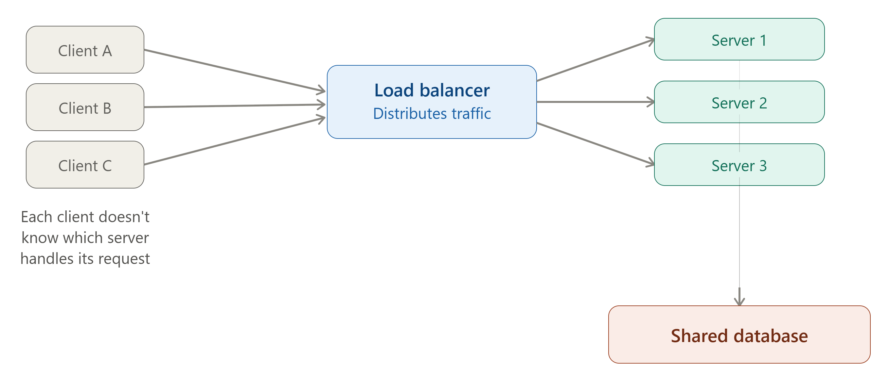
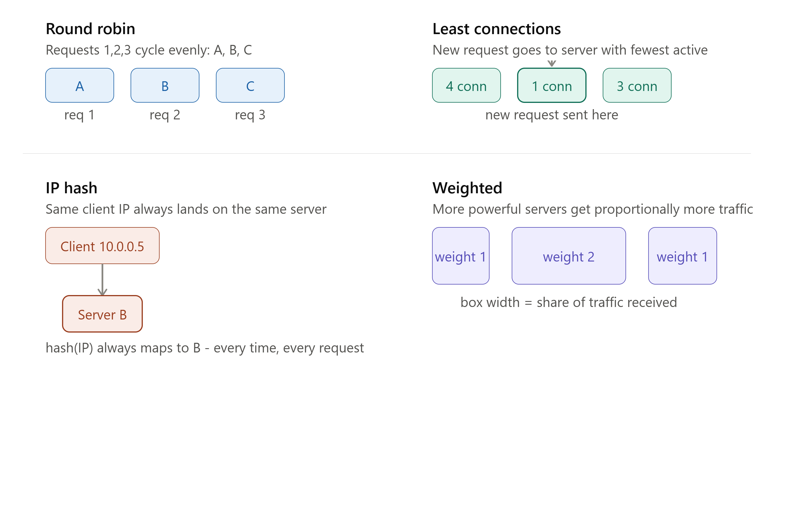

# DAY 4 — Scaling and Load Balancing

### (Vertical vs Horizontal Scaling Revisited, Stateless vs Stateful, Load Balancers Deep Dive, Algorithms, L4 vs L7)

> **Why this day matters:** Days 1-3 gave you the vocabulary and the protocols. Today is where you build the FIRST real piece of "system design" infrastructure — the component that sits at the very front door of almost every diagram you will EVER draw for the rest of this course: the load balancer. By the end of today, you'll understand exactly how traffic gets spread across multiple servers, and you'll have built a working one yourself.

> Two diagrams were rendered above — refer to them as you read **Section 3.1** (where the load balancer sits in the architecture) and **Section 3.3** (the four load balancing algorithms compared side by side).

---

## TABLE OF CONTENTS — DAY 4

1. Scaling Revisited — Vertical vs Horizontal (deeper this time)
2. Stateless vs Stateful Services
3. Load Balancers — What, Why, Background, How, Algorithms, L4 vs L7
4. Implementation — Build a Load Balancer in Node.js
5. Health Checks and Failure Handling
6. Day 4 Cheat Sheet

---

## 1. SCALING REVISITED — VERTICAL vs HORIZONTAL

You met these terms on Day 1. Today we go deeper, because load balancing only exists to support ONE of these two strategies — and you need to understand exactly why.

### Quick recap (What)

- **Vertical scaling (scale up)**: make ONE machine bigger/faster.
- **Horizontal scaling (scale out)**: add MORE machines, and spread the work across them.

### Why we're revisiting this today specifically

**A load balancer is the piece of infrastructure that MAKES horizontal scaling actually possible in practice.** Without something deciding "which of these 10 servers should handle THIS particular incoming request," horizontal scaling is just... 10 separate, disconnected servers, each only reachable at their own individual address — useless to a client who just wants to hit "the website" at one single address and not worry about which physical machine answers.

### Background — why this combination became essential

As discussed Day 1, vertical scaling hits a hard ceiling (and creates a single point of failure). The moment a company's traffic outgrows a single machine — which happens to almost every successful product eventually — horizontal scaling becomes mandatory, not optional. But horizontal scaling INTRODUCES a brand-new problem that didn't exist before: **"if I now have 10 servers, how does a client's request get routed to ONE of them, and how is that choice made fairly and reliably?"** This exact problem is what load balancers were invented to solve. You cannot meaningfully discuss "horizontal scaling" in an interview without immediately discussing load balancing — they are two halves of the same idea.

### How they connect (the chain of reasoning, step by step)

1. Traffic grows beyond what one server can handle.
2. You add more server instances (horizontal scaling).
3. Now clients need ONE stable address to hit (they shouldn't need to know or care that there are 10 servers behind the scenes).
4. You place a **load balancer** in front of all of them, and that's the ONLY address clients ever talk to.
5. The load balancer decides, for each incoming request, which backend server should actually handle it.
6. For this whole system to work correctly, your backend servers generally need to be **stateless** (next section) — because the load balancer might send any two requests from the SAME client to two DIFFERENT servers, and if server-specific memory mattered, things would break unpredictably.

### How to teach this

> "Horizontal scaling without a load balancer is like opening 10 new checkout counters in a supermarket but not telling any customers where they are, and not having anyone direct the line. Customers would all crowd into counter 1 out of habit, while counters 2 through 10 sit empty. The load balancer is the store greeter standing at the entrance, looking at all 10 counters, and actively directing each new customer to whichever counter will serve them fastest."

---

## 2. STATELESS vs STATEFUL SERVICES

### What

- **Stateless service**: Each request is handled with NO reliance on data stored from a previous request on that SAME server. Every request carries everything needed to process it (e.g., an auth token identifying the user), and the server doesn't need to "remember" anything about that specific client between requests.
- **Stateful service**: The server DOES retain information about a specific client/session in its own memory or local disk, and subsequent requests from that same client depend on that retained state being present on THAT SPECIFIC server.

### Why this distinction is one of the most important in all of system design

This is the **direct, practical reason** vertical-vs-horizontal scaling and load balancing actually work (or don't) for a given application. If your app is stateful in the wrong way, horizontal scaling silently breaks things, in a way that's notoriously hard to debug (it often "mostly works," failing intermittently only for some users, which is one of the most frustrating categories of production bug to chase down).

### Background

In the earliest web apps, it was extremely common (and, frankly, the easiest thing to do) to store a user's session data directly in a single server process's memory — for example, storing `req.session.cartItems` in an in-memory object on that one Express server. This worked perfectly... as long as there was only ONE server. The moment companies added a second server for scaling, a genuinely confusing bug appeared: a user would add an item to their cart (handled by Server A, which remembered it in memory), then their NEXT request would happen to be routed by the load balancer to Server B — which has NEVER heard of this user's cart, because that memory lives only inside Server A's process. The cart appears to "randomly disappear." This exact, very real historical pain point is why "always design stateless services" became one of the most repeated mantras in backend engineering.

### How — Concrete illustration of the problem

**The broken, stateful version:**

```js
// Server A and Server B are both running this EXACT same code,
// but each has its OWN separate in-memory `cartStorage` object
const cartStorage = {}; // lives only in THIS process's RAM

app.post("/cart/add", (req, res) => {
  const { userId, item } = req.body;
  if (!cartStorage[userId]) cartStorage[userId] = [];
  cartStorage[userId].push(item);
  res.json({ cart: cartStorage[userId] });
});

app.get("/cart", (req, res) => {
  const { userId } = req.query;
  // If THIS request lands on a DIFFERENT server than the one that
  // handled the 'add' request above, cartStorage[userId] is EMPTY here,
  // even though the user definitely added items moments ago!
  res.json({ cart: cartStorage[userId] || [] });
});
```

**The correct, stateless version** — push the state OUT of the server's memory into a shared store EVERY server instance can access (this directly reuses the Redis pattern from Day 1):

```js
const redisClient = require("redis").createClient();

app.post("/cart/add", async (req, res) => {
  const { userId, item } = req.body;
  // Stored in REDIS, not in this server's local memory -
  // ANY server instance can read this back, not just this one
  await redisClient.rPush(`cart:${userId}`, JSON.stringify(item));
  const cart = await redisClient.lRange(`cart:${userId}`, 0, -1);
  res.json({ cart: cart.map(JSON.parse) });
});

app.get("/cart", async (req, res) => {
  const { userId } = req.query;
  const cart = await redisClient.lRange(`cart:${userId}`, 0, -1);
  res.json({ cart: cart.map(JSON.parse) }); // works correctly NO MATTER which
  // server instance handles this request
});
```

This is the core technique: **don't store anything important in server-process memory; push it to a shared backing store (Redis, a database) that all instances can equally access.** Once you do this, it genuinely does not matter which server any given request lands on — which is EXACTLY the property that makes horizontal scaling and load balancing work cleanly.

### The hard case: WebSockets (connecting back to Day 3)

You already learned on Day 3 that WebSocket connections are inherently stateful — a specific open TCP connection is tied to ONE specific server process for its entire lifetime; you genuinely cannot "push that connection itself" into Redis. The standard solution (previewed Day 3, will be built in full on Day 16) is:

1. Use **sticky sessions** at the load balancer (explained in Section 3 below) so a given client's WebSocket connection always reaches the SAME server instance for the life of that connection.
2. Use a shared **pub/sub backplane** (Redis Pub/Sub) so that if Server A needs to push a message to a client connected to Server B, Server A publishes the message to Redis, and Server B (subscribed to the relevant channel) picks it up and forwards it down its own WebSocket connection to that client.

### Real-world example

Almost every major cloud platform's documentation (AWS, GCP, Azure) explicitly recommends designing services to be stateless wherever possible, specifically so their auto-scaling groups can freely add/remove server instances at any time, for any reason (traffic spikes, instance failures, deployments), without breaking active user sessions. This is considered a foundational best practice for any application meant to run at scale.

### Trade-offs

- **Stateless**: Easier to scale horizontally, easier to recover from a server crash (just route to another instance, nothing is lost), but requires an extra network call to a shared store (Redis/DB) for state that could otherwise have been an instant in-memory read — a small latency cost, almost always worth paying.
- **Stateful**: Can be faster for certain workloads (no extra network hop to fetch state), but makes horizontal scaling, failover, and deployments significantly more complicated (you must carefully handle "session affinity" / sticky sessions, and a server crash can mean real data loss if that in-memory state was never persisted anywhere else).

### Interview Angle

"Why should backend services be stateless?" is asked constantly, almost always as a precursor to a bigger system design question. The expected answer: it enables horizontal scaling and load balancing to work correctly and simply, and improves fault tolerance (any server can handle any request, and losing one server doesn't lose unique data). Be ready to explain HOW you'd handle a case that seems inherently stateful (like WebSockets, or file uploads being processed in multiple steps) — the answer is almost always "externalize the state to a shared store."

### How to teach this

> "A stateless server is like a hotel receptionist with amnesia who relies entirely on your room key card (the token/request data) to know who you are and what you're allowed to do — any receptionist on duty (any server instance) can help you, because none of them need to PERSONALLY remember you; the key card carries all the necessary information. A stateful server is like a personal assistant who actually remembers your preferences in their own head — incredibly convenient, UNTIL that specific assistant is unavailable (or you get assigned a different one), and suddenly nobody else knows anything about you."

---

## 3. LOAD BALANCERS — DEEP DIVE



### What

A load balancer is a component (hardware device or software) that sits BETWEEN clients and a group ("pool" or "fleet") of backend servers, and decides, for every incoming request, WHICH specific backend server should handle it — distributing the overall traffic load across the available servers rather than letting it all pile onto one. Refer to the architecture diagram rendered above this lesson: clients only ever talk to the load balancer; they never know or care which actual server instance answers.

### Why

Without a load balancer:

- Clients would need to somehow know about all 10 (or 1,000) individual server addresses, and decide themselves which one to use — completely impractical and fragile (what happens when you add an 11th server, or one crashes?).
- There would be no way to evenly distribute traffic — some servers could be overloaded while others sit idle, wasting resources and degrading performance for users unlucky enough to land on an overloaded server.
- There would be no clean way to detect and route AROUND a failed/crashed server — directly hurting **availability** (Day 1 concept).

A load balancer solves all three: it gives clients ONE stable address, it actively spreads load using a chosen algorithm, and it continuously checks server health (Section 5) to automatically stop sending traffic to failed instances.

### Background

Load balancing as a concept predates the modern web — it traces back to telecommunications networks needing to distribute phone calls across multiple switches. As web traffic exploded in the late 1990s/2000s, dedicated hardware load balancers (from companies like F5 and Cisco) became standard equipment in data centers. Over time, **software load balancers** (Nginx, HAProxy) became dominant because they're cheaper, more flexible, and easier to automate/configure as code — which fits perfectly with how modern cloud infrastructure (AWS ALB/ELB, GCP Load Balancer, Kubernetes Ingress) is managed today, entirely through configuration rather than physical hardware.

### How — The General Flow

1. A request arrives at the load balancer's public address.
2. The load balancer consults its current list of healthy backend servers (maintained via health checks, Section 5).
3. It applies a chosen **algorithm** (Section 3.2 below) to pick exactly ONE server from that healthy list.
4. It forwards (proxies) the request to that chosen server.
5. It receives the response from that server, and relays it back to the original client — the client never directly talks to the backend server; it only ever talks to the load balancer.

### 3.1 — Layer 4 vs Layer 7 Load Balancing (a very commonly tested distinction)

This refers to WHICH layer of the network stack (recall Day 2's TCP/IP layering discussion) the load balancer makes its routing decision at.

**Layer 4 (Transport Layer) Load Balancing:**

- Operates at the TCP/UDP level (Day 2). It looks ONLY at IP addresses and ports — it does NOT look inside the actual data/content of the request (it doesn't parse HTTP headers, URLs, or bodies at all).
- **How it works**: it essentially just forwards raw network packets to a chosen backend, based on connection-level information, without understanding or caring what's inside.
- **Pros**: Very fast (minimal processing per packet), works for ANY TCP/UDP-based protocol (not just HTTP).
- **Cons**: Can't make smart, content-aware routing decisions (e.g., "send all `/api/video` traffic to these specific specialized servers" is impossible at L4, because it doesn't even look at the URL).

**Layer 7 (Application Layer) Load Balancing:**

- Operates at the HTTP level (Day 2/3 concepts) — it actually reads and understands the full request: the URL path, HTTP headers, cookies, even the body if needed.
- **How it works**: it can make routing decisions based on the ACTUAL CONTENT of the request — e.g., "requests to `/api/images` go to the image-processing server pool; everything else goes to the general app server pool," or "requests with this specific cookie always go to this specific server" (session affinity / sticky sessions).
- **Pros**: Much smarter, content-aware routing; can also do things like SSL termination (decrypting HTTPS at the load balancer so backend servers don't each need to handle TLS individually — connects back to Day 2's TLS handshake discussion), URL rewriting, and request/response modification.
- **Cons**: More processing overhead per request (since it has to actually parse the HTTP content), slightly higher latency than L4.

**In practice**: most modern web applications use **Layer 7 load balancers** (Nginx, AWS Application Load Balancer, Kubernetes Ingress) because the ability to route based on URL/content is extremely valuable, and the performance overhead is negligible for the vast majority of applications. **Layer 4 load balancers** (AWS Network Load Balancer) are chosen specifically when raw performance/throughput matters more than content-aware routing, or for non-HTTP protocols.

### 3.2 — Load Balancing Algorithms (refer to the comparison diagram rendered above this lesson)



**1. Round Robin**

- **What**: Requests are distributed to servers in strict, repeating sequential order — Server A, then B, then C, then back to A, and so on.
- **Why**: Dead simple to implement, and works reasonably well when all servers have roughly equal capacity and all requests are roughly equal "cost" (processing time).
- **How**: The load balancer keeps a simple pointer/counter, incrementing through the server list, wrapping back to the start after reaching the end.
- **Weakness**: It doesn't account for server load AT ALL — if Server A happens to be handling several slow, expensive requests right now, round robin will still blindly send it the next new request anyway, because it doesn't know or care that A is currently busier than B or C.

**2. Least Connections**

- **What**: The load balancer tracks how many ACTIVE connections each server currently has, and routes each new request to whichever server currently has the FEWEST active connections.
- **Why**: This adapts to real-time load far better than round robin — if one server is bogged down handling several long-running requests, least-connections naturally avoids piling MORE work onto it.
- **How**: Requires the load balancer to maintain a live count of in-flight requests per server, incrementing when a request starts and decrementing when it completes.
- **Weakness**: Slightly more bookkeeping overhead than round robin (need to track live connection counts), and "number of connections" isn't always a perfect proxy for "actual server load" (a server could have few connections that are each individually very CPU-heavy).

**3. IP Hash**

- **What**: The load balancer computes a hash of the CLIENT's IP address, and uses that hash to consistently determine which server handles requests from that specific client — meaning the SAME client will (almost) always be routed to the SAME backend server, every time.
- **Why**: Useful when you need **session affinity / sticky sessions** WITHOUT needing a shared session store — e.g., simple in-memory caching per-user data on a specific server, or, importantly, for routing WebSocket connections consistently (connects directly to Section 2's discussion of WebSocket statefulness).
- **How**: `serverIndex = hash(clientIp) % numberOfServers` — a simple, deterministic calculation that always gives the same answer for the same input IP (as long as the number of servers doesn't change).
- **Weakness**: If one particular client (or many clients sharing one IP, e.g., behind a corporate NAT/proxy) sends disproportionately more traffic than others, that ONE assigned server can become overloaded while others sit idle — it doesn't dynamically rebalance based on actual load, only based on the IP hash. Also, if a server is added or removed, many clients' hash results shift to different servers all at once (this exact problem is solved properly by **Consistent Hashing**, which you'll learn in full on Day 11/22 — IP hash is the "naive" version of that more sophisticated technique).

**4. Weighted (Round Robin or Least Connections)**

- **What**: Each server is assigned a "weight" reflecting its relative capacity (e.g., a more powerful machine gets weight 2, a smaller one gets weight 1), and traffic is distributed proportionally to those weights — a weight-2 server receives roughly twice as much traffic as a weight-1 server.
- **Why**: Real-world server fleets are often NOT all identical — maybe you're gradually migrating to bigger/newer instance types, or running a heterogeneous mix of hardware. Treating all servers as equal (plain round robin) would underutilize the bigger machines and overload the smaller ones.
- **How**: Combine the weight value with either round robin or least-connections logic — e.g., a weighted round robin might use a sequence like A, B, B, C (if B has weight 2 and A, C have weight 1) instead of a strict A, B, C cycle.
- **Weakness**: Requires someone to correctly determine and maintain the right weight values, and weights can become stale/wrong if server capacity changes over time without updating the configuration.

### Interview Angle

"How does a load balancer decide which server to send a request to?" expects you to name and briefly explain at least Round Robin, Least Connections, and IP Hash, and ideally to reason about WHEN you'd pick one over another — e.g., "I'd use IP hash if I need sticky sessions for WebSocket connections without a shared session store, but least-connections for a typical stateless REST API with uneven request costs."

### How to teach this

> "Round robin is like a teacher calling on students in seat order, no matter who already answered a hard question and is still thinking. Least connections is like calling on whichever student's hand has been DOWN the longest (i.e., who's currently free, not still working on something). IP hash is like always assigning the SAME specific student to answer questions from the SAME specific row of the classroom, every single time, no matter how busy that student already is. Weighted is like asking the smartest student in the room twice as many questions as everyone else, because you know they can genuinely handle a heavier load."

---

## 4. IMPLEMENTATION — BUILD A LOAD BALANCER IN NODE.JS

This is a real, working reverse-proxy load balancer using Node's built-in `http` module, implementing both **Round Robin** and **Least Connections**, so you can see exactly how the algorithms differ in actual code.

```js
const http = require("http");

// Our pool of backend servers (in a real system, these would be separate
// machines/processes; here we just use different ports on localhost)
const backendServers = [
  { host: "localhost", port: 4001, activeConnections: 0 },
  { host: "localhost", port: 4002, activeConnections: 0 },
  { host: "localhost", port: 4003, activeConnections: 0 },
];

let roundRobinIndex = 0;

// ALGORITHM 1: Round Robin selection
function getServerRoundRobin() {
  const server = backendServers[roundRobinIndex];
  roundRobinIndex = (roundRobinIndex + 1) % backendServers.length;
  return server;
}

// ALGORITHM 2: Least Connections selection
function getServerLeastConnections() {
  // Find the server with the fewest CURRENT active connections
  return backendServers.reduce((least, server) =>
    server.activeConnections < least.activeConnections ? server : least,
  );
}

// Choose which algorithm to use here - swap this line to compare behavior
const selectServer = getServerLeastConnections; // or getServerRoundRobin

const loadBalancer = http.createServer((clientReq, clientRes) => {
  const target = selectServer();
  target.activeConnections++; // track that this server is now busier

  console.log(
    `Routing request to ${target.host}:${target.port} (active: ${target.activeConnections})`,
  );

  // Proxy the request to the chosen backend server
  const proxyReq = http.request(
    {
      host: target.host,
      port: target.port,
      path: clientReq.url,
      method: clientReq.method,
      headers: clientReq.headers,
    },
    (proxyRes) => {
      // Relay the backend's response straight back to the original client -
      // the client never knows or cares which backend actually answered
      clientRes.writeHead(proxyRes.statusCode, proxyRes.headers);
      proxyRes.pipe(clientRes);
      proxyRes.on("end", () => target.activeConnections--); // free up the slot
    },
  );

  clientReq.pipe(proxyReq);

  proxyReq.on("error", (err) => {
    target.activeConnections--;
    console.error(`Backend ${target.port} failed:`, err.message);
    clientRes.writeHead(502); // Bad Gateway - exactly the status code from Day 2!
    clientRes.end("Backend server error");
  });
});

loadBalancer.listen(3000, () =>
  console.log("Load balancer listening on port 3000"),
);
```

**A simple backend server (run 3 copies of this on ports 4001, 4002, 4003 to test):**

```js
const http = require("http");
const PORT = process.argv[2] || 4001;

http
  .createServer((req, res) => {
    // Simulate some servers being "slower" to clearly see least-connections in action
    const delay = Math.random() * 500;
    setTimeout(() => {
      res.writeHead(200, { "Content-Type": "application/json" });
      res.end(
        JSON.stringify({
          handledBy: `Server on port ${PORT}`,
          delayMs: Math.round(delay),
        }),
      );
    }, delay);
  })
  .listen(PORT, () => console.log(`Backend server running on port ${PORT}`));
```

**How to actually try this yourself**: run the backend server script three times (`node backend.js 4001`, `node backend.js 4002`, `node backend.js 4003`), run the load balancer (`node load-balancer.js`), then fire many requests at `http://localhost:3000` (e.g., using a quick script with `axios` in a loop, or a tool like `autocannon`). Watch the console logs to see how round robin cycles strictly in order regardless of delay, while least-connections naturally favors whichever backend just freed up — this is the clearest way to internalize the difference between the two algorithms beyond just reading about them.

**A note on real-world usage**: in production, you would almost never hand-roll your own load balancer like this — you'd use **Nginx**, **HAProxy**, or a managed cloud load balancer (AWS ALB/NLB, GCP Load Balancer). This implementation exists purely so you deeply understand the MECHANISM underneath those tools — which is exactly what an interviewer wants to hear you explain, even though you'd never actually deploy this hand-rolled version to production.

---

## 5. HEALTH CHECKS AND FAILURE HANDLING

### What

A health check is a periodic, automated request the load balancer sends to each backend server to verify it's still alive and capable of correctly handling traffic. You actually already saw the backend side of this on Day 1 (the `/health` endpoint example) — today we look at it from the LOAD BALANCER's side.

### Why

Without health checks, if a backend server crashes, the load balancer would keep blindly sending it traffic (using whichever algorithm), and every one of those requests would fail or time out — directly destroying availability (Day 1) for whichever unlucky clients get routed to the dead server. Health checks let the load balancer DETECT failed servers and automatically stop routing to them, routing all traffic only to the servers confirmed to still be healthy.

### How

1. The load balancer periodically (e.g., every 5-10 seconds) sends a lightweight request (often `GET /health`) to each backend server.
2. If a server responds successfully (e.g., HTTP 200) within an expected time, it's marked healthy and remains in the pool of servers eligible to receive real traffic.
3. If a server fails to respond, or responds with an error, for a configured number of CONSECUTIVE checks (to avoid overreacting to one single network blip), it's marked unhealthy and temporarily REMOVED from the pool — the load balancer stops sending it any traffic.
4. The load balancer CONTINUES health-checking even unhealthy servers in the background, and automatically adds them back to the pool the moment they start responding successfully again (this is critical — it means a server that crashes and restarts, or finishes an overload spike, can rejoin automatically, without a human needing to intervene).

### Implementation — adding basic health checking to our load balancer

```js
const http = require("http");

const backendServers = [
  { host: "localhost", port: 4001, healthy: true, activeConnections: 0 },
  { host: "localhost", port: 4002, healthy: true, activeConnections: 0 },
  { host: "localhost", port: 4003, healthy: true, activeConnections: 0 },
];

function checkHealth(server) {
  const req = http.get(
    { host: server.host, port: server.port, path: "/health", timeout: 2000 },
    (res) => {
      server.healthy = res.statusCode === 200;
    },
  );
  req.on("error", () => {
    server.healthy = false;
  });
  req.on("timeout", () => {
    req.destroy();
    server.healthy = false;
  });
}

// Run health checks every 5 seconds, for every server in the pool
setInterval(() => backendServers.forEach(checkHealth), 5000);

function getHealthyServerLeastConnections() {
  const healthyServers = backendServers.filter((s) => s.healthy);
  if (healthyServers.length === 0)
    throw new Error("No healthy backend servers available!");
  return healthyServers.reduce((least, s) =>
    s.activeConnections < least.activeConnections ? s : least,
  );
}

// ... rest of the load balancer logic uses getHealthyServerLeastConnections()
// instead of considering ALL servers, so unhealthy ones are simply skipped
```

Notice the `if (healthyServers.length === 0)` case — this is a genuinely important real-world scenario to think about: **what should happen if EVERY backend server is down?** There's no universally "correct" answer (it depends on the system), but options include: returning a clear 503 Service Unavailable to the client, or — in more advanced setups — automatically triggering infrastructure to spin up a fresh replacement server (this connects forward to auto-scaling concepts, touched on in Week 4).

### Real-world example

AWS's Application Load Balancer lets you configure the exact health check path, interval, timeout, and the number of consecutive successes/failures needed to mark an instance healthy/unhealthy — these are real, commonly-tuned production settings, and getting them wrong (e.g., too aggressive, marking servers unhealthy from one slow response during a brief traffic spike) is a genuinely common, real operational mistake.

### Trade-offs

Health checks add a small amount of constant background network traffic and processing overhead (the cost of checking, even when everything is fine), and choosing the check interval/threshold involves a real trade-off: checking too frequently/aggressively can cause "flapping" (servers rapidly marked healthy/unhealthy back and forth) under borderline conditions; checking too rarely/leniently means a genuinely failed server keeps receiving (and failing) real user traffic for longer before being removed.

### Interview Angle

"How does a load balancer know if a backend is down?" → health checks, explained with the consecutive-failure threshold detail (showing you understand WHY a single failed check shouldn't immediately pull a server out — avoiding false positives from transient blips).

### How to teach this

> "A health check is like a manager periodically walking by each cashier's counter and asking 'you doing okay, can you keep taking customers?' If a cashier doesn't answer (or says no) a few times in a row, the manager stops sending new customers their way — but keeps checking back periodically, so the moment that cashier says 'I'm ready again,' they're back in rotation, all without needing someone to manually flip a switch."

---

## 6. DAY 4 CHEAT SHEET

```
SCALING RECAP
  Vertical = bigger machine (ceiling, single point of failure)
  Horizontal = more machines (needs a load balancer + stateless services to work)

STATELESS vs STATEFUL
  Stateless = no server-specific memory needed between requests
              -> push shared state to Redis/DB -> any server can handle any request
  Stateful  = server remembers client-specific data in its own memory
              -> breaks under load balancing unless using sticky sessions
              -> WebSockets are inherently stateful (sticky session + pub/sub backplane needed)

LOAD BALANCER = sits between clients and a server pool, decides which
                server handles each request; clients only ever see ONE address

LAYER 4 vs LAYER 7
  L4 = routes based on IP/port only, doesn't read HTTP content, very fast,
       protocol-agnostic
  L7 = reads full HTTP request (URL, headers, cookies), smart content-aware
       routing, SSL termination, slightly more overhead
  Most web apps today use L7 (Nginx, ALB, Kubernetes Ingress)

ALGORITHMS
  Round Robin       - cycles servers in strict order, ignores current load
  Least Connections - sends to whichever server has fewest active connections
                       (adapts to real-time load)
  IP Hash           - same client IP always -> same server (sticky sessions,
                       WebSocket routing) - naive precursor to consistent hashing
  Weighted          - bigger/more capable servers get proportionally more traffic

HEALTH CHECKS
  Load balancer periodically pings each server (e.g., GET /health)
  N consecutive failures -> mark unhealthy -> remove from rotation
  Keeps checking unhealthy servers -> auto re-adds them once healthy again
  Protects AVAILABILITY (Day 1) by routing around failed servers automatically
```

---

### What's next (Day 5 preview)

Tomorrow we go even further up the stack with two of the most powerful tools for making systems fast: **Proxy vs Reverse Proxy** (clarifying exactly how a load balancer relates to these terms), **CDNs** (how Netflix/YouTube serve video to the entire world quickly), and **Caching fundamentals** — client-side, CDN-level, and server-side caching, plus the cache eviction policies (LRU, LFU, FIFO) that decide what gets kicked out when a cache fills up. You'll implement a working LRU cache in Node.js from scratch, which is also one of the most commonly asked coding-adjacent system design interview questions.

**Say "Day 5" whenever you're ready.**
