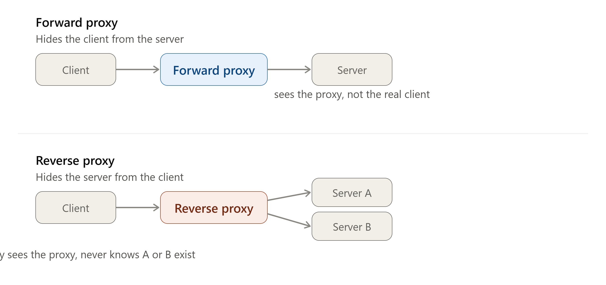
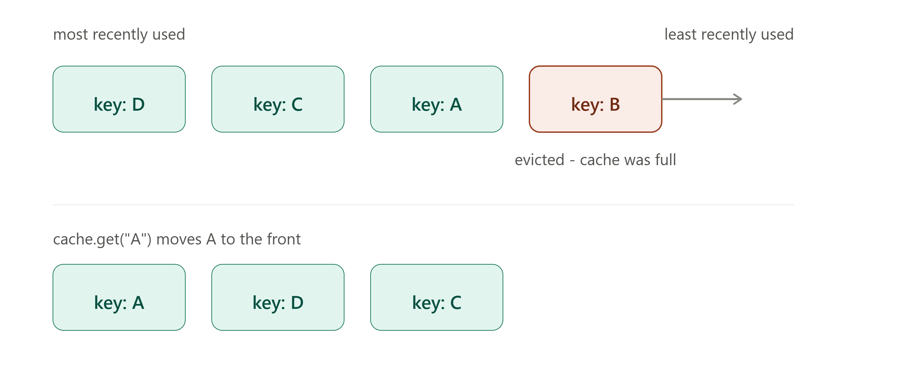

# DAY 5 — Proxies, CDNs, and Caching

### (Proxy vs Reverse Proxy, CDN Deep Dive, Caching Fundamentals, Eviction Policies, Build an LRU Cache)

> **Why this day matters:** Caching is, without exaggeration, the single highest-leverage technique in all of system design — it's usually the FIRST thing a senior engineer reaches for when a system is too slow or a database is overloaded. Today you learn every layer where caching happens (client, CDN, server), the vocabulary around proxies that every cloud architecture diagram uses, and you'll hand-write an LRU cache — one of the most asked "system design meets coding" interview questions there is.

> Two diagrams were rendered above — refer to them as you read **Section 1** (forward vs reverse proxy) and **Section 4** (the LRU eviction mechanism).

---

## TABLE OF CONTENTS — DAY 5

1. Proxy vs Reverse Proxy
2. CDN (Content Delivery Network) Deep Dive
3. Caching Fundamentals — Where Caching Happens
4. Cache Eviction Policies (LRU, LFU, FIFO)
5. Implementation — Build an LRU Cache in Node.js (from scratch)
6. Day 5 Cheat Sheet

---

## 1. PROXY vs REVERSE PROXY



### What

A **proxy** (or "forward proxy") is a server that sits IN FRONT OF CLIENTS, forwarding their requests onward and hiding the CLIENT's identity from whatever server they're ultimately talking to. A **reverse proxy** is a server that sits IN FRONT OF SERVERS, receiving client requests and forwarding them to the appropriate backend, hiding the SERVER's identity (and the existence of multiple backend servers) from the client.

This distinction confuses almost everyone the first time they hear it — and it's one of the most commonly tested vocabulary questions in system design interviews. The diagram rendered above this section shows both side by side: notice which side of the proxy is "hidden" in each case.

### Why this distinction matters

**You actually already built a reverse proxy on Day 4** — your load balancer! A load balancer IS a specific kind of reverse proxy (one whose main job is distributing load across multiple backends). Understanding "reverse proxy" as the general category, and "load balancer" as one specialized USE of that category, clarifies a LOT of confusing terminology you'll see in real infrastructure diagrams, documentation, and job descriptions (e.g., "Nginx as a reverse proxy" vs "Nginx as a load balancer" — often the exact same software, configured for slightly different primary purposes).

### Background

Both concepts emerged from the same general need: adding an intermediary between two parties for control, security, or performance reasons — but from OPPOSITE sides of that relationship. Forward proxies became common in the 1990s-2000s as companies wanted to control and monitor employees' internet access (and later, as a way for individuals to mask their identity/location, e.g., for accessing geo-restricted content or for privacy). Reverse proxies became essential as websites grew beyond a single server and needed something to sit in front of multiple backend servers, hiding that complexity from the outside world — this is the exact same motivation you learned for load balancers on Day 4.

### How

**Forward Proxy — How it works:**

1. A client is configured (explicitly, e.g., browser proxy settings, or transparently via network configuration) to send ALL its outgoing requests through the forward proxy, instead of directly to the destination server.
2. The forward proxy receives the client's request, and forwards it to the actual destination server, but using **its own** identity (IP address) — the destination server sees the PROXY's IP, not the original client's IP.
3. The response comes back to the proxy, which relays it back to the original client.

**Common forward proxy uses:**

- **Corporate content filtering**: a company routes all employee internet traffic through a proxy that blocks certain websites and logs activity.
- **Anonymity/privacy**: hiding your real IP address from the destination website (this is also conceptually how a VPN behaves, though VPNs add encryption and operate slightly differently at a technical level).
- **Bypassing geo-restrictions**: routing your traffic through a proxy located in a different country so a destination server thinks you're located there.
- **Caching for an organization**: a school or company might cache frequently-requested external content (e.g., software update files) once at the proxy, so future requests from ANY employee on that network are served instantly from the proxy's cache rather than re-fetching from the internet every time.

**Reverse Proxy — How it works:**

1. A client sends a request to what it believes is "the server" — really, this is the reverse proxy's public address.
2. The reverse proxy receives the request, and based on its own configuration/logic, forwards it to one of potentially MANY actual backend servers sitting behind it.
3. The backend server processes the request and returns a response to the reverse proxy.
4. The reverse proxy relays that response back to the client — the client never sees or knows about the real backend server(s) at all.

**Common reverse proxy uses (notice the overlap with Day 4's load balancer discussion):**

- **Load balancing** (Day 4) — distributing requests across multiple backend instances.
- **SSL/TLS termination** — handling the HTTPS encryption/decryption (Day 2's TLS handshake) at the proxy level, so backend servers can communicate with the proxy over plain, unencrypted HTTP internally (faster, simpler), while the CLIENT-facing connection remains fully encrypted.
- **Caching** (this entire day) — storing copies of responses so repeated identical requests don't need to hit the backend at all.
- **Security** — hiding internal server details/architecture from the public internet, and providing a single point to apply security rules (rate limiting, Day 18; firewall rules; DDoS protection).
- **Compression** — compressing responses (e.g., gzip) before sending them to clients, offloading that CPU work from the actual application servers.

### Implementation — A reverse proxy in Node.js (using Nginx-style logic, hand-rolled)

```js
const http = require("http");
const httpProxy = require("http-proxy"); // a common real-world library for this

const proxy = httpProxy.createProxyServer({});

const backendServer = { host: "localhost", port: 4001 };

const reverseProxyServer = http.createServer((req, res) => {
  console.log(`Reverse proxy received request for: ${req.url}`);
  // Forward to the backend - the client has NO idea this backend even exists
  proxy.web(req, res, {
    target: `http://${backendServer.host}:${backendServer.port}`,
  });
});

reverseProxyServer.listen(80, () =>
  console.log("Reverse proxy listening on port 80"),
);
```

**A forward proxy in Node.js**, for contrast — notice the structural difference: this proxy is configured as the OUTGOING gateway for a client, not as the public-facing entry point for a server:

```js
const http = require("http");

// A minimal forward proxy: clients configure THIS as their proxy server,
// and it forwards their requests onward to wherever THEY are trying to reach
const forwardProxyServer = http.createServer((clientReq, clientRes) => {
  const targetUrl = new URL(clientReq.url);

  const proxyReq = http.request(
    {
      host: targetUrl.hostname,
      port: targetUrl.port || 80,
      path: targetUrl.pathname,
      method: clientReq.method,
      headers: clientReq.headers,
    },
    (targetRes) => {
      clientRes.writeHead(targetRes.statusCode, targetRes.headers);
      targetRes.pipe(clientRes);
    },
  );
  clientReq.pipe(proxyReq);
});

forwardProxyServer.listen(8080, () =>
  console.log("Forward proxy listening on port 8080"),
);
```

### Real-world example

- **Nginx** is the single most common piece of software used as a reverse proxy in the entire industry — sitting in front of Node.js apps, handling SSL termination, load balancing, and serving static files, while Node.js itself just handles the dynamic application logic.
- **Corporate VPN/proxy software** at many large companies is a forward proxy, controlling and monitoring what employees can access.

### Trade-offs

Both add a network hop (latency cost) and a new potential single point of failure if not made redundant — but in exchange, you gain centralized control over caching, security, SSL, and routing logic, which is almost always worth the small latency cost for any system beyond the simplest single-server setup.

### Interview Angle

"What's the difference between a proxy and a reverse proxy?" is asked constantly as a quick vocabulary check before diving into a bigger system design question. The cleanest possible answer: **"A forward proxy hides the client from the server. A reverse proxy hides the server from the client."** Memorize this exact sentence.

### How to teach this

> "Imagine a celebrity (the server) who never talks to fans (clients) directly — they always go through their manager (reverse proxy), who decides which assistant actually handles each fan's request, while the fan only ever sees 'the manager.' Now imagine a whistleblower (the client) who never contacts a journalist directly with their own identity — they go through an anonymizing intermediary (forward proxy) so the journalist (the server) only ever sees the intermediary, never the whistleblower's real identity. Same shape of relationship — a go-between — but protecting the OPPOSITE side in each case."

---

## 2. CDN (CONTENT DELIVERY NETWORK) DEEP DIVE

### What

A CDN is a geographically distributed network of servers that cache and serve content (images, videos, CSS/JS files, and sometimes entire web pages) from a location PHYSICALLY CLOSE to the end user, rather than every single user's request traveling all the way back to one origin server which might be located on the other side of the planet.

### Why

Physics imposes a hard limit here: data cannot travel faster than the speed of light, and real-world network routing adds even more delay on top of that theoretical limit. If your origin server is in Virginia, USA, and a user in Mumbai, India requests a large video file, that data has to physically travel roughly 13,000+ km round trip, adding very real, unavoidable latency (often 200ms+ just for the round trip, before any actual processing) — and that's assuming a perfect, uncongested path, which real internet routing rarely provides. A CDN solves this by placing copies of your content on servers distributed across the globe, so the Mumbai user's request is served from a nearby CDN node (perhaps in Mumbai or Singapore) instead of traveling all the way to Virginia.

### Background

CDNs emerged in the late 1990s as the web shifted from mostly-text pages to media-rich content (images, eventually video). **Akamai**, founded in 1998 (spun out of MIT research), pioneered commercial CDN technology specifically to solve the "flash crowd" problem — sudden traffic spikes (e.g., a breaking news event) overwhelming a single origin server. Today, CDNs are essential infrastructure for almost every major website — **Cloudflare**, **Akamai**, **Amazon CloudFront**, and **Fastly** are major commercial providers, and companies like **Netflix** even built their OWN custom CDN (called "Open Connect") specifically because video streaming at their scale required infrastructure even more specialized and deeply embedded within ISP networks than general-purpose commercial CDNs could offer.

### How — Two Models: Push vs Pull CDN

**Pull CDN (more common):**

1. The CDN does NOT have your content initially.
2. The FIRST time a user in a particular region requests a piece of content, the nearby CDN server ("edge server" or "Point of Presence" / PoP) doesn't have it cached yet — this is called a **cache miss**.
3. The CDN edge server fetches ("pulls") the content from your **origin server** (your actual backend), caches a copy locally, AND returns it to that first user.
4. EVERY SUBSEQUENT request for that same content, from any user near that same edge server, is now served directly from the CDN's cache — a **cache hit** — without ever touching your origin server again (until the cached copy expires, based on TTL/Cache-Control headers, which you learned about on Day 2).

- **Pros**: Simple to set up — you just point your CDN configuration at your origin, and it handles the rest automatically.
- **Cons**: The very FIRST user in each region experiences a slower request (cache miss, has to reach all the way to origin) before the content becomes cached there.

**Push CDN (less common, used for specific scenarios):**

1. YOU proactively upload ("push") your content directly to the CDN's servers in advance, before any user requests it.
2. EVERY request, even the very first one in any region, is served from cache immediately — there's never a "cold," uncached first request.

- **Pros**: No cold-start cache miss penalty, ever.
- **Cons**: You must manage uploading/updating content yourself (more operational overhead), and it doesn't make sense for highly dynamic content that changes constantly — it's typically reserved for large, relatively static files known in advance (e.g., a major movie release going live on a streaming platform at a scheduled time, pre-positioned on CDN servers globally beforehand).

### What CDNs are good for (and not good for)

- **Excellent for**: static assets — images, videos, CSS, JavaScript bundles, downloadable files — anything that doesn't change per-request and can be safely reused across many different users.
- **Not suitable for**: highly personalized, dynamic content that's different for every single user/request (e.g., a user's private account dashboard data) — though modern CDNs increasingly support more sophisticated edge logic (like Cloudflare Workers) that can do limited dynamic processing at the edge too, blurring this line somewhat in advanced setups.

### Implementation — Configuring caching headers correctly for CDN behavior in Express

A CDN's caching behavior is driven almost entirely by the `Cache-Control` HTTP header (introduced Day 2) that YOUR origin server sends — getting this right is a real, practical skill:

```js
const express = require("express");
const app = express();

// Static assets (images, CSS, JS bundles) - cache aggressively and for a long time,
// since these typically have a version/hash in the filename and never change
// once deployed (e.g., "app.a3f9c2.js")
app.use(
  "/static",
  express.static("public", {
    maxAge: "1y", // tells the CDN/browser: cache this for 1 year
    immutable: true, // tells caches this will NEVER change at this URL - safe to skip re-validation entirely
  }),
);

// API responses that change occasionally but can tolerate brief staleness
app.get("/api/popular-products", async (req, res) => {
  const products = await db.products.findPopular();
  res.set("Cache-Control", "public, max-age=300"); // cache for 5 minutes
  res.json(products);
});

// Highly personalized/sensitive data - must NEVER be cached by a shared CDN,
// since caching it could leak one user's private data to another user
// requesting the same URL from the same nearby CDN edge node!
app.get("/api/my-account", authenticate, async (req, res) => {
  const account = await db.accounts.findById(req.user.id);
  res.set("Cache-Control", "private, no-store"); // private = browser may cache, CDN must NOT
  res.json(account);
});
```

**This last example is a genuinely important, real security consideration**: if you accidentally mark a personalized/sensitive endpoint as publicly cacheable, a CDN could serve User A's private account data to User B, simply because they both requested the same URL and the CDN didn't realize the response should have been unique per-user. Always be deliberate about `Cache-Control: private` vs `public` for anything involving user-specific data.

### Real-world example

When you stream a popular show on Netflix, you are almost certainly NOT pulling that video data from a single data center in the US — Netflix's Open Connect CDN places caching appliances directly inside many ISPs' own networks worldwide, so the video data travels the shortest possible physical distance to reach you, dramatically reducing both latency (faster start times, fewer buffering pauses) and the bandwidth costs Netflix would otherwise pay to transmit the same popular content repeatedly over long distances to every individual ISP.

### Trade-offs

CDNs add cost (you pay for the CDN service, typically based on bandwidth/requests served) and a layer of operational complexity (cache invalidation — making sure outdated content gets refreshed when you update something — is a famously tricky problem, often joked about as one of the two hardest problems in computer science, alongside cache invalidation... and off-by-one errors). But for any content serving global users, the latency and origin-server-load benefits are almost always overwhelmingly worth it.

### Interview Angle

"How would you reduce latency for users far from your data center?" → CDN is almost always part of the expected answer, alongside discussing WHICH content is CDN-appropriate (static/semi-static) vs not (highly personalized/dynamic), and correctly setting `Cache-Control` headers to control exactly how long content stays cached.

### How to teach this

> "Imagine a popular bakery with only ONE location, in one city, and people across the entire country want fresh bread NOW. Instead of shipping bread from that one bakery to every single customer nationwide (slow, and the bread gets stale during the long trip), the bakery opens small local kiosks in every major city, each kiosk stocked with the bakery's most popular items. Most customers get their bread instantly from their nearby kiosk (a cache hit). Only if a kiosk runs out, or someone wants something genuinely unusual, does an order need to go all the way back to the original bakery (a cache miss, fetched from origin)."

---

## 3. CACHING FUNDAMENTALS — WHERE CACHING HAPPENS

### What

Caching is the general technique of storing a copy of data in a fast-access location, so that future requests for that same data can be served quickly, without redoing the (often expensive) work of computing/fetching it again from the original source. The CDN you just learned is actually just ONE layer of caching — system design interviews expect you to know that caching happens at MULTIPLE layers simultaneously.

### Why

This is genuinely one of the most important general principles in all of computer systems: **accessing data is usually MUCH faster from memory (RAM) than from disk, and faster from a nearby location than a far one, and faster to reuse a previous answer than to recompute it from scratch.** Caching exploits exactly these facts, at every layer of a system, to dramatically improve performance and reduce load on slower, more expensive resources (like your primary database).

### Background

Caching as a concept comes from computer hardware itself — CPUs have had multiple levels of cache (L1, L2, L3) for decades, exploiting the fact that RAM is much slower than the CPU itself, so frequently-accessed data is kept in small, extremely fast on-chip memory. Software engineers borrowed this exact same idea and applied it at every layer of web application architecture, because the underlying principle (recently/frequently used data is worth keeping somewhere faster to access) applies universally, not just inside a CPU.

### How — The Layers of Caching (from closest to the user, to furthest)

**1. Browser/Client-side caching**

- The user's own browser stores responses locally (driven by `Cache-Control` headers, as shown above), so revisiting a page or asset doesn't require ANY network request at all if the cache is still valid.
- **Example**: your website's logo image, loaded once, stays in the user's browser cache and isn't re-downloaded on every page navigation within your site.

**2. CDN caching** (just covered in depth, Section 2)

- A geographically distributed layer of caching, shared across MANY different users near each CDN edge location.

**3. Reverse proxy / Web server caching**

- A reverse proxy (Section 1) like Nginx, sitting in front of your application servers, can itself cache responses, serving repeated identical requests without even reaching your actual Node.js application process.

**4. Application-level caching (in-memory or Redis)**

- Inside your own backend code, you cache the results of expensive operations — most commonly, database query results — in a fast in-memory store (Redis is the overwhelmingly standard choice for this in production, because, as you learned Day 1/4, it's a SHARED store all your server instances can access, unlike each server's own local memory).
- **Example**: caching a user's profile data in Redis after the first database fetch, so the next 1,000 requests for that same user within the cache's validity window hit Redis (sub-millisecond) instead of the database (likely several milliseconds, and consuming real database resources).

**5. Database-level caching**

- Most database systems have their own internal caching (e.g., a "buffer pool" caching recently-accessed disk pages in memory) — this happens automatically, mostly invisible to you as an application developer, but it's worth knowing it exists as yet another layer.

### Caching Strategies (a preview — covered in FULL depth on Day 17, but introduced here conceptually)

- **Cache-aside (lazy loading)**: your application code checks the cache first; if missing (a cache miss), it fetches from the database, then stores the result in the cache for next time.
- **Write-through**: every write goes to the cache AND the database simultaneously, keeping them always in sync.
- **Write-back**: writes go to the cache first (fast), and are asynchronously persisted to the database later.

We'll explore exactly how and when to use each of these strategies, plus the genuinely tricky problem of cache invalidation, in full depth on **Day 17** — today's goal is just to understand that caching happens at ALL these different layers, and WHY each layer exists.

### Implementation — A simple application-level cache-aside pattern, using Redis

```js
const redisClient = require("redis").createClient();
const express = require("express");
const app = express();

app.get("/api/products/:id", async (req, res) => {
  const cacheKey = `product:${req.params.id}`;

  // 1. Check the cache FIRST
  const cached = await redisClient.get(cacheKey);
  if (cached) {
    console.log("Cache HIT - served from Redis, no database query needed");
    return res.json(JSON.parse(cached));
  }

  // 2. Cache MISS - fetch from the actual database (the slower, "source of truth")
  console.log("Cache MISS - querying database");
  const product = await db.products.findById(req.params.id);
  if (!product) return res.status(404).json({ error: "Not found" });

  // 3. Store in cache for NEXT time, with an expiration (TTL) so it
  //    doesn't serve stale data forever if the underlying product changes
  await redisClient.set(cacheKey, JSON.stringify(product), { EX: 3600 }); // expires in 1 hour

  res.json(product);
});
```

This single pattern — check cache, on miss fetch from source and populate cache, on hit return immediately — is, without exaggeration, one of the single most repeated patterns in all backend development, and you will use a variant of this code in nearly every real-world Node.js project you ever build professionally.

### Real-world example

Almost every high-traffic website (Twitter, Reddit, e-commerce sites) caches "hot" data — trending posts, popular product listings, frequently viewed pages — in Redis or a similar in-memory store, specifically because hitting the primary database for the SAME popular data millions of times per day would either require an enormously expensive database setup, or simply fall over under the load. Caching the popular 1% of data that accounts for the majority of traffic is often dramatically cheaper and faster than scaling the database itself to handle that same load directly.

### Trade-offs

Caching introduces the risk of serving **stale data** (data that's changed at the source but the cache hasn't caught up yet) — this is an unavoidable, fundamental trade-off, not a bug to be "fixed" away entirely; it's why choosing the RIGHT TTL (how long to cache) and the right invalidation strategy for each specific piece of data matters so much (we'll go deep on this Day 17). Caching also adds infrastructure complexity (now you have Redis to deploy, monitor, and keep available, on top of your database).

### Interview Angle

"How would you reduce load on the database?" or "How would you make this API faster?" → caching is almost always a core part of the expected answer, and a strong candidate explicitly names WHICH layer(s) of caching they'd add (CDN for static assets, Redis for expensive/frequent database query results) rather than just saying "add a cache" vaguely.

### How to teach this

> "Imagine you're asked the same trivia question 500 times a day. The FIRST time, you have to actually think hard and look up the answer (a cache miss, hitting the database). But you're smart — you write that answer on a sticky note on your desk (the cache). Every time someone asks again, you just glance at the sticky note (a cache hit) instead of re-researching the answer from scratch. The only risk: if the real answer ever CHANGES, and you forget to update your sticky note, you'll confidently give someone the WRONG, outdated answer — that's exactly the 'stale data' risk that comes with caching."

---

## 4. CACHE EVICTION POLICIES (LRU, LFU, FIFO)



### What

A cache has LIMITED space (it's stored in RAM, which is finite and relatively expensive compared to disk). An eviction policy is the RULE the cache uses to decide WHICH item to remove/discard when the cache is full and a new item needs to be added.

### Why

If a cache had infinite space, eviction would never be necessary — but in reality, you might be caching millions of potential keys (every product, every user profile) while only having enough RAM to comfortably hold, say, the 100,000 most useful ones at a time. You need a smart, principled way to decide what to KEEP and what to THROW AWAY, ideally keeping whatever is MOST LIKELY to be requested again soon, and discarding whatever is least likely to be needed again.

### Background

These eviction algorithms were originally developed for operating system memory management and CPU cache design (deciding which "pages" to keep in fast memory vs slower disk/storage) decades before they became standard vocabulary in web caching systems like Redis and CDNs — yet another example (like load balancing's roots in telecom) of a core computer science idea originating in one context and being directly reapplied in modern distributed systems.

### How — The Three Main Policies

**1. LRU (Least Recently Used)**

- **What**: Evicts whichever item has gone the LONGEST without being accessed (read OR written). Refer to the diagram rendered earlier in this lesson: items are ordered by recency, and when the cache is full, the item that's been untouched the longest (furthest right) gets evicted to make room for the new one — and any time an item IS accessed, it jumps back to the "most recent" position.
- **Why it's the most popular choice by far**: it's based on a very reasonable real-world assumption called "temporal locality" — data accessed recently is statistically likely to be accessed again soon (think: a trending news article right now vs one from 3 years ago). This assumption holds true for the vast majority of real-world caching workloads.
- **How**: Implemented using a combination of a **hash map** (for O(1) lookups by key) and a **doubly linked list** (for O(1) reordering — moving an accessed item to the "most recent" end, and O(1) removal of the "least recent" end when eviction is needed). We'll build this exact data structure from scratch in Section 5.

**2. LFU (Least Frequently Used)**

- **What**: Evicts whichever item has been accessed the FEWEST total number of times, regardless of HOW RECENTLY it was accessed.
- **Why you'd choose this over LRU**: useful when "popularity over time" matters more than "recency" — e.g., a piece of content that's been steadily, consistently popular for months shouldn't be evicted just because nobody happened to view it in the last 5 minutes, whereas a brand-new item that got one single burst of views (then went completely quiet) probably SHOULD be evicted, even though that one access was relatively recent.
- **How**: Requires tracking an access COUNT per item (not just recency), and evicting the lowest-count item — slightly more bookkeeping overhead than LRU.
- **Weakness**: A genuinely tricky edge case — a NEW item just added to the cache naturally starts with a low access count, and could get unfairly evicted almost immediately, before it has any chance to accumulate hits and prove itself popular. Real LFU implementations need extra logic to handle this fairly (e.g., aging mechanisms that gradually decay old counts over time).

**3. FIFO (First In, First Out)**

- **What**: Evicts whichever item was added to the cache FIRST (longest ago by insertion time), completely ignoring how often or how recently it's actually been accessed since then.
- **Why you'd choose this**: it's the simplest possible policy to implement, and can make sense for certain specific workloads where insertion order genuinely correlates with relevance (e.g., a cache of "the last 100 events in a log stream," where you genuinely just want to discard the oldest entries regardless of access pattern).
- **Weakness**: This is usually a poor general-purpose choice for typical web caching, because it completely ignores actual usage patterns — a wildly popular, constantly-accessed item could get evicted purely because it happened to be cached a while ago, while a never-touched-since item that was added moments later survives. For most real caching use cases (database query results, session data, API responses), LRU is a meaningfully better default than FIFO.

### Comparison Table

| Policy   | Evicts based on                | Good for                                      | Weakness                                            |
| -------- | ------------------------------ | --------------------------------------------- | --------------------------------------------------- |
| **LRU**  | Longest time since last access | General-purpose caching (most common default) | Doesn't account for overall frequency, just recency |
| **LFU**  | Lowest total access count      | Long-term popularity patterns                 | New items unfairly penalized; needs aging logic     |
| **FIFO** | Oldest insertion time          | Simple queue-like/log-like data               | Ignores actual usage entirely                       |

### Real-world example

**Redis** supports multiple eviction policies you can configure directly (`maxmemory-policy`), including `allkeys-lru`, `allkeys-lfu`, and others — in production, you genuinely choose between these based on your specific access patterns, and `allkeys-lru` is the most commonly used default across the industry for exactly the "temporal locality" reasoning explained above.

### Interview Angle

"Implement an LRU cache" is one of the most famous, frequently-asked questions across BOTH coding interviews AND system design interviews (it sits right at the intersection of the two). You are expected to know not just the CONCEPT, but to actually be able to CODE it, with the correct time complexity (O(1) for both `get` and `put` operations) — which is exactly what Section 5 below walks you through.

### How to teach this

> "LRU is like a stack of recently worn clothes on your chair — when you wear something, you put it back on TOP of the pile. When the chair gets too full, you donate whatever's at the very BOTTOM (untouched the longest). LFU is like deciding what to donate based on a tally of how many times you've worn EACH item this year, regardless of when you last wore it. FIFO is like a 'first bought, first donated' rule, ignoring how much you actually wear things at all — simple, but not very smart about what you'd actually miss."

---

## 5. IMPLEMENTATION — BUILD AN LRU CACHE IN NODE.JS (FROM SCRATCH)

### Why build this from scratch

In a real production system, you'd use Redis (which has LRU built in) rather than hand-rolling your own. But this exercise exists because **understanding HOW to achieve O(1) get and O(1) put, with correct LRU eviction, is one of the most respected, foundational data-structure exercises in software engineering** — it combines a hash map and a doubly linked list in a way that beautifully demonstrates WHY you'd combine two different data structures to get the best properties of both.

### The core insight (How, conceptually, before the code)

- A **hash map** alone gives you O(1) lookup by key, but no efficient way to track/update "recency order."
- A **doubly linked list** alone gives you O(1) reordering (moving a node to the front) and O(1) removal of the tail, but O(n) lookup by key (you'd have to scan the whole list to find a specific key).
- **Combine them**: the hash map stores `key -> node reference` (giving O(1) lookup), and that SAME node lives inside a doubly linked list maintaining recency order (most-recently-used at the head, least-recently-used at the tail) — giving you O(1) for everything.

### Implementation

```js
class Node {
  constructor(key, value) {
    this.key = key;
    this.value = value;
    this.prev = null;
    this.next = null;
  }
}

class LRUCache {
  constructor(capacity) {
    this.capacity = capacity;
    this.map = new Map(); // key -> Node, for O(1) lookup

    // Dummy head/tail sentinel nodes - a common trick that avoids tons of
    // null-checking edge cases when adding/removing at the boundaries
    this.head = new Node(null, null); // most-recently-used side
    this.tail = new Node(null, null); // least-recently-used side
    this.head.next = this.tail;
    this.tail.prev = this.head;
  }

  // Remove a node from its current position in the linked list
  _remove(node) {
    node.prev.next = node.next;
    node.next.prev = node.prev;
  }

  // Insert a node right after the head (i.e., mark it as most-recently-used)
  _insertAtFront(node) {
    node.next = this.head.next;
    node.prev = this.head;
    this.head.next.prev = node;
    this.head.next = node;
  }

  get(key) {
    if (!this.map.has(key)) return -1; // not found

    const node = this.map.get(key);
    // Accessing an item makes it "most recently used" - move it to the front
    this._remove(node);
    this._insertAtFront(node);

    return node.value;
  }

  put(key, value) {
    if (this.map.has(key)) {
      // Key already exists - update its value and refresh its recency
      const node = this.map.get(key);
      node.value = value;
      this._remove(node);
      this._insertAtFront(node);
      return;
    }

    // New key - check if we're at capacity BEFORE inserting
    if (this.map.size >= this.capacity) {
      // Evict the LEAST recently used item - that's the node right before
      // the tail sentinel (refer to the eviction diagram earlier in this lesson)
      const lruNode = this.tail.prev;
      this._remove(lruNode);
      this.map.delete(lruNode.key);
      console.log(`Evicted key: ${lruNode.key} (least recently used)`);
    }

    const newNode = new Node(key, value);
    this.map.set(key, newNode);
    this._insertAtFront(newNode);
  }
}

// --- Demonstration matching the eviction diagram shown earlier ---
const cache = new LRUCache(3);
cache.put("A", 1);
cache.put("B", 2);
cache.put("C", 3);
console.log(cache.get("A")); // 1 - this access moves A to the front (most recent)

cache.put("D", 4); // cache is full (capacity 3) - evicts B, since A was just
// refreshed, C is more recent than B, and B is now the
// least recently used item

console.log(cache.get("B")); // -1 - confirmed evicted, no longer in cache
```

**Walking through why this achieves O(1) for everything:**

- `get(key)`: `this.map.get(key)` is O(1). `_remove` and `_insertAtFront` each just rewire a few `prev`/`next` pointers — O(1), regardless of how many total items are in the cache.
- `put(key, value)`: Same O(1) map lookup/insert, same O(1) pointer rewiring for eviction (removing the tail's neighbor) and insertion (adding at the head).
- **Nothing in this implementation ever needs to loop through the entire cache** — that's precisely the property that makes this the "correct," interview-expected solution, as opposed to a naive approach (e.g., storing items in a plain array and scanning it for recency) which would be O(n).

### How to use this knowledge in a real Node.js project

While you'd typically rely on Redis's built-in `maxmemory-policy: allkeys-lru` for a distributed/shared cache in production, this EXACT same `LRUCache` class is genuinely useful as a simple **in-process** cache for things like memoizing expensive computations within a single Node.js process (e.g., caching parsed configuration, compiled templates, or computed results that don't need to be shared across multiple server instances) — there are also well-maintained npm packages (like `lru-cache`) implementing this exact pattern, production-hardened, for exactly this use case.

---

## 6. DAY 5 CHEAT SHEET

```
PROXY vs REVERSE PROXY
  Forward proxy = hides the CLIENT from the server (corporate filtering, anonymity, VPNs)
  Reverse proxy = hides the SERVER from the client (load balancing, SSL termination, caching)
  A load balancer (Day 4) IS a type of reverse proxy

CDN
  Geographically distributed cache servers, close to users, reduce latency
  Pull CDN: fetches from origin on first request (cache miss), caches for next time
  Push CDN: you upload content in advance, no cold-start cache miss ever
  Good for: static assets. NOT for: highly personalized per-user dynamic data
  Cache-Control header drives CDN behavior - use "private, no-store" for
  personal/sensitive data to avoid leaking it across users via a shared cache

CACHING LAYERS (closest to user -> furthest)
  Browser cache -> CDN -> Reverse proxy cache -> Application cache (Redis) ->
  Database internal cache
  Pattern: cache-aside (check cache -> miss -> fetch source -> populate cache)
  Trade-off: caching ALWAYS risks serving stale data - choose TTL wisely

EVICTION POLICIES
  LRU (Least Recently Used)   - evict longest-untouched item (most common default)
  LFU (Least Frequently Used) - evict lowest total access count (long-term popularity)
  FIFO (First In First Out)   - evict oldest inserted item (simplest, least smart)

LRU CACHE IMPLEMENTATION
  HashMap (key -> node, O(1) lookup) + Doubly Linked List (O(1) reorder/evict)
  get(key)  -> found? move to front (most recent) : return -1
  put(key)  -> exists? update + move to front
             : full? evict tail.prev (least recent) : insert at front
  Both operations: O(1) time complexity - this is the expected interview answer
```

---

### What's next (Day 6 preview)

Tomorrow wraps up Week 1 with two crucial, very practical skills: a deeper look at **DNS** specifically through the lens of failure scenarios and operational gotchas, the precise distinction between **Latency and Throughput** (a classic interview confusion point, just like Reliability vs Availability was on Day 1), and — most importantly — **back-of-the-envelope estimation**: the actual MATH you do in the first few minutes of any real system design interview to calculate requests-per-second, storage needs, and bandwidth, so every design decision you make afterward is grounded in real numbers instead of guesswork.

**Say "Day 6" whenever you're ready.**
