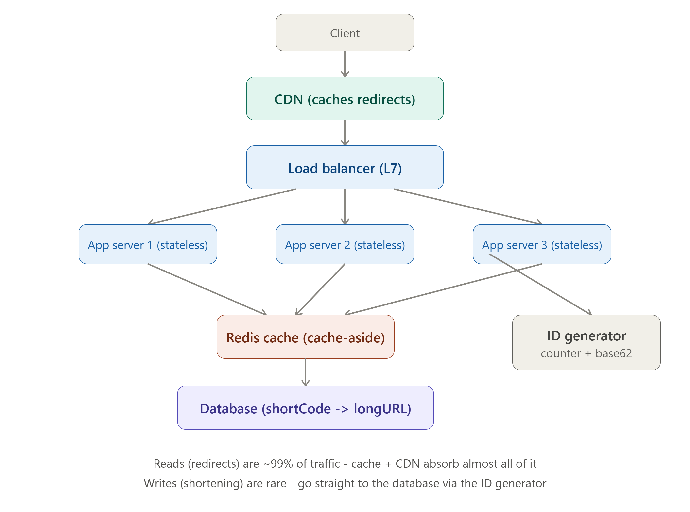

# DAY 7 — WEEK 1 CAPSTONE

### Design a URL Shortener (End-to-End, Applying Everything from Days 1–6)



> **Why this day matters:** This is where theory becomes practice. You are going to take EVERY concept from this week — requirements gathering, the 4 pillars, client-server, HTTP, REST, scaling, stateless design, load balancing, caching, CDNs, and back-of-the-envelope estimation — and apply ALL of it to one single, complete, real interview question. "Design a URL Shortener" (like bit.ly or tinyurl.com) is one of the most frequently asked system design interview questions in the entire industry — by the end of today, you will be able to answer it completely, confidently, and teach it to someone else from memory.

> The full architecture diagram rendered above this lesson is the END STATE we're building toward — refer back to it as each section below adds another piece of it.

---

## TABLE OF CONTENTS — DAY 7

1. Step 1: Clarify Requirements (Functional & Non-Functional)
2. Step 2: Back-of-the-Envelope Estimation
3. Step 3: API Design
4. Step 4: High-Level Architecture
5. Step 5: Deep Dive — How Do We Generate Unique Short Codes?
6. Step 5 (continued): Deep Dive — Database Schema & Choice
7. Step 5 (continued): Deep Dive — Caching Strategy
8. Step 6: Identifying Bottlenecks & Single Points of Failure
9. Step 7: Trade-offs Discussion (Summary)
10. Full Working Node.js Implementation
11. How to Present This Entire Answer in a Real Interview (Timing Guide)
12. Day 7 / Week 1 Cheat Sheet

---

## STEP 1: CLARIFY REQUIREMENTS

Per the **Day 1 framework**, we NEVER start by drawing boxes. We start by asking questions and stating assumptions out loud.

### Questions you'd ask an interviewer (and the answers we'll assume for this design)

- "Should short URLs be permanent, or can they expire?" → Assume: optional expiration, but most links are effectively permanent.
- "Can a user choose a custom alias (like `bit.ly/my-brand`), or only auto-generated codes?" → Assume: support BOTH, auto-generated being the default/common case.
- "Do we need analytics (click counts, geographic data) on each link?" → Assume: basic click count, full analytics is OUT OF SCOPE for this design (explicitly stating scope, per Day 1's "common mistakes" lesson).
- "What's the expected scale?" → Assume: 100 million new URLs shortened PER MONTH, and a 100:1 read-to-write ratio (people click links far more often than they create them — a very realistic assumption for this kind of product).

### Functional Requirements (FR)

1. Given a long URL, the system generates a unique, short URL.
2. Given a short URL, the system redirects the user to the original long URL.
3. Users can optionally specify a custom alias.
4. Links can optionally expire after a set time.
5. (Basic) The system tracks the number of times each short link has been clicked.

### Non-Functional Requirements (NFR) — using the 4 Pillars from Day 1

- **Availability**: HIGH priority. If the redirect service is down, every single shared short link across the internet breaks instantly and visibly — this is a consumer-facing, latency-sensitive, high-visibility failure. We will prioritize availability heavily.
- **Latency**: The redirect (read path) must be VERY fast — ideally under 100ms — because a slow redirect is a uniquely bad, visible user experience (a perceptible delay before a page even starts loading).
- **Scalability**: Must handle a heavily READ-skewed load (we'll calculate the exact ratio in Step 2).
- **Consistency**: We can tolerate EVENTUAL consistency for click-count analytics (it's fine if a click count is a few seconds stale), but the actual short-code-to-long-URL mapping must be STRONGLY consistent — redirecting to the WRONG url, or failing to redirect at all, is unacceptable. This is a great example of the Day 1 lesson: prioritize NFRs differently for different parts of the SAME system.
- **Uniqueness**: Every generated short code must be unique — two different long URLs must never accidentally receive the same short code (a "collision").

### How to teach this step

> "Notice we didn't just jump in and start designing. We figured out exactly what 'done' looks like first — what the system MUST do, and which qualities matter most. Specifically here: redirects need to be both NEAR-INSTANT and ALWAYS CORRECT, but a click counter being a few seconds out of date is totally fine. That single distinction — strong consistency for the mapping, eventual consistency for the analytics — is going to shape several of our design decisions later."

---

## STEP 2: BACK-OF-THE-ENVELOPE ESTIMATION

Using the **Day 6 estimation framework**, with units written out explicitly at every step.

### Write Volume (Step 1: DAU/usage → requests/day → RPS)

```
New URLs shortened per month = 100,000,000
New URLs shortened per day  = 100,000,000 / 30 ≈ 3,333,333 URLs/day

Average write RPS = 3,333,333 / 86,400 seconds ≈ 39 writes/sec

Peak write RPS (using a 3x peak factor, per Day 6) ≈ 39 x 3 ≈ ~120 writes/sec
```

### Read Volume (using our assumed 100:1 read-to-write ratio)

```
Average read RPS = 39 writes/sec x 100 = ~3,900 reads/sec
Peak read RPS (3x factor)              = ~3,900 x 3 = ~11,700 reads/sec
```

**What this immediately tells us** (connecting numbers to decisions, per Day 6's lesson): ~120 peak writes/sec is trivial for a single, well-indexed database to handle directly. ~11,700 peak reads/sec is meaningfully higher — this is exactly the kind of number that justifies adding a caching layer (Day 5) in front of the database for the read path, even though it's not so extreme that we'd need to shard the database purely for load reasons (Week 2 topic) at this particular scale.

### Storage Estimation

```
Assume each stored record (short code + long URL + metadata) ≈ 500 bytes

Storage needed per day = 3,333,333 URLs/day x 500 bytes ≈ 1,666,666,500 bytes/day
                        ≈ 1.67 GB/day

Storage over 5 years = 1.67 GB/day x 365 days/year x 5 years
                      ≈ 1.67 GB x 1,825 days
                      ≈ ~3,048 GB ≈ ~3 TB over 5 years
```

**What this tells us**: ~3 TB over 5 years is a very manageable amount of data for a single, modern database server (or a small, simply-replicated cluster) to hold comfortably — this is NOT "big data" by industry standards, and reinforces that database SHARDING (splitting data across multiple database servers, a Week 2 topic) is likely NOT strictly necessary purely for storage volume reasons at this scale, though we may still want **read replicas** (also Week 2) purely to handle the read RPS calculated above, which is a different motivation than storage volume.

### How many unique short codes do we actually need to support?

```
If short codes are 7 characters, using base62 (a-z, A-Z, 0-9 = 62 possible characters per position):
Total possible combinations = 62^7 ≈ 3.5 trillion unique codes

Compare to our actual need: 100,000,000 URLs/month x 12 months x 5 years
                           = 6,000,000,000 (6 billion) URLs over 5 years

3.5 trillion possible codes vs 6 billion needed -> 7 characters gives us
an enormous, comfortable safety margin (roughly 580x more capacity than needed)
```

This calculation directly justifies our choice of **7-character short codes** in the design below — not 5 (which might run out: 62^5 ≈ 916 million, uncomfortably close to our 6 billion need over 5 years) and not 10 (which would be unnecessarily long for no real benefit).

---

## STEP 3: API DESIGN

Following **Day 3's REST principles** (Level 2 on the Richardson Maturity Model — resource-based URLs, correct HTTP verbs):

```
POST /api/urls
  Body: { "longUrl": "https://example.com/some/very/long/path", "customAlias": "optional", "expiresAt": "optional ISO date" }
  Response: 201 Created -> { "shortUrl": "https://short.ly/aZ3bK9x", "longUrl": "...", "createdAt": "..." }

GET /:shortCode
  Response: 301 Moved Permanently, with Location header set to the long URL
  (Using the Day 2 status code knowledge deliberately: 301, not 302 - more on this choice in Step 5)

GET /api/urls/:shortCode/stats
  Response: 200 OK -> { "shortCode": "aZ3bK9x", "clickCount": 4821, "createdAt": "..." }

DELETE /api/urls/:shortCode
  Response: 204 No Content
```

---

## STEP 4: HIGH-LEVEL ARCHITECTURE

Refer to the full architecture diagram rendered above this lesson — here is the reasoning behind each box, piece by piece, directly reusing Week 1's components:

1. **CDN** (Day 5): Since redirects are simple, repeatable, cacheable responses (a given short code ALWAYS maps to the same long URL, until/unless deleted), we can cache the redirect response itself at the CDN edge — meaning a popular short link can be resolved almost entirely WITHOUT ever reaching our origin servers at all, dramatically reducing both load and latency for hot links.
2. **Load Balancer** (Day 4): An L7 load balancer distributing traffic across our app server pool — chosen as L7 specifically because we may want content-aware routing later (e.g., routing `/api/*` write traffic differently from `/:shortCode` read traffic), and because L7's overhead is negligible at our calculated scale.
3. **Stateless App Servers** (Day 4): Multiple Node.js/Express instances, horizontally scaled, holding NO server-specific memory — any instance can handle any request, exactly per the Day 4 principle.
4. **Redis Cache** (Day 5): Sitting between the app servers and the database, using the cache-aside pattern, specifically to absorb our calculated ~11,700 peak reads/sec without hammering the database directly.
5. **Database**: Stores the actual shortCode → longURL mapping durably (the permanent source of truth).
6. **ID Generator**: A dedicated piece of logic (detailed in Step 5) responsible for producing unique short codes for new URLs.

---

## STEP 5: DEEP DIVE — GENERATING UNIQUE SHORT CODES

This is the single most interesting, most commonly probed part of this entire design — interviewers will almost always push here.

### What — The Core Problem

We need to convert each new long URL into a SHORT, UNIQUE string (the short code), with NO collisions ever (two different long URLs must never produce the same code), working correctly even with MULTIPLE app servers running concurrently (recall: we deliberately made our app servers stateless and horizontally scaled in Step 4 — so this ID generation logic must work correctly across all of them simultaneously, not just on one).

### Approach 1: Hash the Long URL (and why it has a real problem)

**How**: Take the long URL, run it through a hash function (e.g., MD5), and take the first 7 characters of the resulting hash as the short code.

**The problem (Why this is risky)**: Hash functions can produce **collisions** — two different inputs producing the same output, especially once you TRUNCATE the hash down to just 7 characters (the full hash is much longer; truncating dramatically increases collision likelihood). You'd need to detect a collision (check if that code already exists, mapped to a DIFFERENT long URL) and handle it (e.g., append a character and re-hash) — this added complexity, and even small but non-zero collision probability for something that absolutely must be 100% unique, is why most real-world systems prefer Approach 2 instead.

### Approach 2: Auto-Incrementing Counter + Base62 Encoding (the standard, recommended approach)

**What**: Maintain a single, globally unique, ever-increasing COUNTER (e.g., 1, 2, 3, 4...). For each new URL, take the NEXT counter value, and encode that NUMBER into a short string using **Base62 encoding** (using the 62 characters: a-z, A-Z, 0-9).

**Why this completely solves the collision problem**: Since the counter only ever increases and is never reused, EVERY value is, by definition, unique — there is mathematically no possibility of a collision, ever, with zero need for any "check and retry" logic.

**How — Base62 encoding, explained step by step**:
Just like how our normal "base 10" number system uses 10 digits (0-9) and a number like "42" really means `4×10¹ + 2×10⁰`, Base62 uses 62 "digits" (a-z, A-Z, 0-9) and works the same way, just with a base of 62 instead of 10. To encode a counter value into Base62:

```
function encodeBase62(num) {
  const chars = 'abcdefghijklmnopqrstuvwxyzABCDEFGHIJKLMNOPQRSTUVWXYZ0123456789';
  if (num === 0) return chars[0];
  let result = '';
  while (num > 0) {
    result = chars[num % 62] + result;
    num = Math.floor(num / 62);
  }
  return result;
}

console.log(encodeBase62(125));        // a short, few-character string
console.log(encodeBase62(99999999999)); // still compact, even for huge counter values
```

A counter value like `1,000,000,000` (one billion), which would be 10 characters long in plain decimal, becomes only about 6 characters long in Base62 — this is PRECISELY why Base62 encoding is used: it gives us short, URL-safe strings (no special characters that would need URL-encoding) representing very large numbers compactly.

### The REAL hard problem: generating the counter value correctly across MULTIPLE, stateless app servers

Here's where this connects directly back to Day 4's stateless services lesson: if EACH app server tried to keep its own local counter (e.g., a simple in-memory `let counter = 0`), TWO different servers would both eventually produce the SAME counter value (e.g., both servers independently reach counter=500 at some point) — generating a DUPLICATE short code for two different URLs. This is the exact "broken stateful service" bug pattern from Day 4, just applied to ID generation instead of shopping carts.

**The fix, option A — Database auto-increment**: Let the DATABASE itself be the single source of truth for the counter (most relational databases have a built-in auto-increment primary key feature) — every INSERT gets a guaranteed-unique, ever-increasing ID from the database itself, regardless of which stateless app server initiated the insert. Simple, reliable, but ties your ID generation directly to your single database's throughput capacity.

**The fix, option B — A dedicated, centralized counter service (using Redis)**: Use Redis's `INCR` command, which is **atomic** (guaranteed to safely handle many simultaneous increment requests from different app servers without any two of them ever getting the same resulting value):

```js
const redisClient = require("redis").createClient();

async function getNextShortCode() {
  // Redis INCR is atomic - even if 100 app servers call this at the
  // exact same instant, Redis guarantees each one gets a DIFFERENT,
  // sequentially-increasing number back - no collisions, ever
  const nextId = await redisClient.incr("url_shortener:counter");
  return encodeBase62(nextId);
}
```

This is exactly the "ID generator" box shown in the architecture diagram rendered above — a small, focused, centralized service whose ENTIRE job is producing the next unique counter value safely, no matter how many stateless app servers are calling it concurrently. (A more advanced, even more scalable approach to this exact problem — avoiding even Redis as a single bottleneck — is the **Snowflake ID algorithm**, which we will cover in full depth on **Day 23**; for our current scale of ~120 peak writes/sec, a single Redis counter is comfortably more than sufficient, and reaching for Snowflake here would be over-engineering for the stated scale, per Day 1's "common mistakes" lesson.)

### Handling Custom Aliases (from our Functional Requirements)

If a user requests a custom alias (e.g., `short.ly/my-brand`) instead of an auto-generated code, we skip the counter/Base62 process entirely, and instead simply check if that exact requested string already exists as a key in our database — if not, we use the database's natural uniqueness constraint on the shortCode column (covered in Step 6 below) to guarantee no two users can simultaneously claim the same custom alias.

### Interview Angle

"How would you generate unique short codes?" is THE signature question for this entire problem. The expected progression of a strong answer: mention hashing first (showing you considered it), explain WHY it's risky (collision handling complexity), then confidently land on counter + Base62 as the better approach, and PROACTIVELY raise the "but how do multiple servers share one counter safely" follow-up yourself, rather than waiting for the interviewer to ask it — this is a strong signal of seniority.

---

## STEP 5 (CONTINUED): DATABASE SCHEMA & CHOICE

### Schema

```sql
CREATE TABLE urls (
  short_code   VARCHAR(10) PRIMARY KEY,   -- our base62 code, indexed for fast lookup
  long_url     TEXT NOT NULL,
  created_at   TIMESTAMP DEFAULT NOW(),
  expires_at   TIMESTAMP NULL,            -- NULL means "never expires"
  click_count  BIGINT DEFAULT 0
);
```

Making `short_code` the **PRIMARY KEY** automatically gives us both: (1) a guaranteed uniqueness constraint at the database level (the database itself will reject any attempt to insert a duplicate — a crucial safety net, especially for the custom-alias case above), and (2) an automatically-created index, meaning lookups by `short_code` (our entire read path) are fast — this connects directly back to Day 1's database indexing preview and will be covered in full depth on Day 9.

### Database choice — SQL or NoSQL? (a full preview of Day 8's topic)

This particular data model — a simple key-value mapping (short_code → long_url), with no complex relationships or joins needed — is actually a textbook-perfect fit for a **NoSQL key-value store** (like DynamoDB or Cassandra) just as much as a traditional SQL database. Either genuinely works well here; the deciding factor in a real interview would typically come down to your team's existing operational expertise, and whether you anticipate needing more complex relational queries later (e.g., "find all URLs created by user X, sorted by click count" benefits from SQL's flexible querying; a system that will ALWAYS only ever look up by short_code might lean toward a simpler, often cheaper-at-scale key-value NoSQL store). We will cover this exact SQL vs NoSQL decision framework in full depth tomorrow, Day 8.

---

## STEP 5 (CONTINUED): CACHING STRATEGY

Directly applying **Day 5's cache-aside pattern**, justified by our **Step 2 calculation** of ~11,700 peak reads/sec:

```js
const redisClient = require("redis").createClient();

async function resolveShortCode(shortCode) {
  // 1. Check cache first (Day 5 cache-aside pattern)
  const cached = await redisClient.get(`url:${shortCode}`);
  if (cached) return cached; // cache HIT - sub-millisecond, no database touched

  // 2. Cache MISS - fall back to the database (our source of truth)
  const row = await db.query(
    "SELECT long_url, expires_at FROM urls WHERE short_code = $1",
    [shortCode],
  );
  if (!row) return null; // doesn't exist

  if (row.expires_at && new Date(row.expires_at) < new Date()) {
    return null; // expired - treat as not found (an FR we stated in Step 1)
  }

  // 3. Populate the cache for next time - using a TTL (per Day 5) so that
  //    a later DELETE of this short link eventually reflects in the cache
  //    too, even without explicit cache invalidation logic
  await redisClient.set(`url:${shortCode}`, row.long_url, { EX: 86400 }); // cache for 24 hours

  return row.long_url;
}
```

### Why this caching layer is THE single most impactful design decision in this entire system

Recall our Step 2 numbers: ~11,700 peak reads/sec vs only ~120 peak writes/sec. Given that real-world traffic also follows a **power-law distribution** (a small number of links — viral tweets, popular marketing campaigns — receive a hugely disproportionate share of all clicks, while the vast majority of links receive very few), an LRU-style cache (Day 5) is EXCEPTIONALLY effective here: the small set of "hot" viral links will almost always be sitting in the cache, meaning the database barely needs to handle ANY of the actual peak read traffic in practice — directly explaining why a relatively modest single database (per our storage/write estimates in Step 2) can comfortably support this system even at meaningfully high read volumes.

### 301 vs 302 redirect — a subtle but real caching-related decision

We chose `301 Moved Permanently` (Day 2) in our API design (Step 3) rather than `302 Found` (temporary redirect) — and this choice has a DIRECT, practical consequence: browsers and CDNs (Day 5) will CACHE a 301 response themselves, meaning a returning visitor's browser might redirect them WITHOUT EVEN CONTACTING OUR SERVERS AT ALL on subsequent visits. This is fantastic for performance, BUT it creates a real trade-off: if we ever needed to change where a short code points (or wanted accurate click-count analytics on EVERY single click, including repeat visits from the same browser), a 301's aggressive caching would actively work against us. A real system might deliberately choose `302` specifically to preserve accurate click tracking (our Functional Requirement #5) at the cost of slightly more repeated server round-trips — this is a genuine, debate-worthy trade-off worth raising explicitly in an interview.

---

## STEP 6: IDENTIFYING BOTTLENECKS & SINGLE POINTS OF FAILURE

Per Day 1's framework, let's explicitly hunt for weaknesses in our own design:

1. **The Redis counter (ID generator) is a single point of failure for WRITES.** If Redis goes down, we cannot generate any new short codes. **Fix**: Redis can be configured with replication (a Week 2 topic) for durability, and since writes are a comparatively low ~120/sec at peak, even a brief failover window has a relatively small "blast radius" compared to if reads were affected.
2. **The database is a single point of failure if not replicated.** **Fix**: Add read replicas (Week 2) — since our system is so heavily read-skewed, replicating purely for read scaling/redundancy is a very natural fit here.
3. **A single Redis cache instance is also a single point of failure for our READ path** — if it goes down, ALL traffic suddenly falls through to the database simultaneously (a "cache stampede" / "thundering herd" scenario, which we'll cover in detail on Day 17). **Fix**: Redis Cluster (replication + sharding) for the cache layer itself.
4. **Using the Day 1 series-vs-parallel availability math**: Client → CDN → Load Balancer → App Server → Cache → Database is a LONG chain of components in series, which, per Day 1, multiplies failure probabilities together. This is exactly WHY we add redundancy (parallel instances) at every single layer — multiple app servers, replicated cache, replicated database — to counteract that series-chain math with parallel-redundancy math at each stage.

---

## STEP 7: TRADE-OFFS DISCUSSION (SUMMARY)

- We chose **counter + Base62** over **hashing** specifically to eliminate collision-handling complexity, at the cost of needing a centralized, atomic counter mechanism (Redis INCR) — a complexity trade, not a complexity removal.
- We chose **eventual consistency for click counts** but **strong consistency for the URL mapping itself** — recognizing that NOT every piece of data in the same system needs the same consistency guarantee (a nuanced, senior-level point worth stating explicitly).
- We chose **301 vs 302** as an open, debate-worthy trade-off between performance (301's aggressive caching) and analytics accuracy (302 ensures every click reaches our servers) — a great example of there being no single "correct" answer, only a justified choice given your stated priorities.
- We deliberately did NOT reach for advanced techniques like Snowflake ID generation or database sharding, explicitly because our Step 2 estimation showed our scale doesn't yet justify that complexity — demonstrating the Day 1 lesson about avoiding over-engineering.

---

## FULL WORKING NODE.JS IMPLEMENTATION

Bringing every piece above together into one runnable Express application:

```js
const express = require("express");
const redis = require("redis");
const { Pool } = require("pg"); // PostgreSQL client, as an example SQL choice

const app = express();
app.use(express.json());

const redisClient = redis.createClient();
const db = new Pool({ connectionString: process.env.DATABASE_URL });

const BASE62_CHARS =
  "abcdefghijklmnopqrstuvwxyzABCDEFGHIJKLMNOPQRSTUVWXYZ0123456789";

function encodeBase62(num) {
  if (num === 0) return BASE62_CHARS[0];
  let result = "";
  while (num > 0) {
    result = BASE62_CHARS[num % 62] + result;
    num = Math.floor(num / 62);
  }
  return result;
}

// POST /api/urls - the WRITE path (Step 5 deep dive, in action)
app.post("/api/urls", async (req, res) => {
  const { longUrl, customAlias, expiresAt } = req.body;

  if (!longUrl) {
    return res.status(400).json({ error: "longUrl is required" }); // Day 2 status code usage
  }

  let shortCode;

  if (customAlias) {
    // Custom alias path - rely on the DB's primary key uniqueness constraint
    shortCode = customAlias;
  } else {
    // Auto-generated path - atomic Redis counter + Base62 (Step 5)
    const nextId = await redisClient.incr("url_shortener:counter");
    shortCode = encodeBase62(nextId);
  }

  try {
    await db.query(
      "INSERT INTO urls (short_code, long_url, expires_at) VALUES ($1, $2, $3)",
      [shortCode, longUrl, expiresAt || null],
    );
  } catch (err) {
    if (err.code === "23505") {
      // Postgres unique_violation error code
      return res
        .status(409)
        .json({ error: "That custom alias is already taken" }); // 409 Conflict, Day 2
    }
    throw err;
  }

  res
    .status(201)
    .location(`/${shortCode}`)
    .json({
      shortUrl: `https://short.ly/${shortCode}`,
      longUrl,
      createdAt: new Date(),
    });
});

// GET /:shortCode - the READ path (cache-aside pattern from Step 5, in action)
app.get("/:shortCode", async (req, res) => {
  const { shortCode } = req.params;

  // 1. Check cache first
  const cachedUrl = await redisClient.get(`url:${shortCode}`);
  if (cachedUrl) {
    incrementClickCountAsync(shortCode); // fire-and-forget, eventual consistency is fine here (Step 1 NFR)
    return res.redirect(301, cachedUrl);
  }

  // 2. Cache miss - check the database
  const result = await db.query(
    "SELECT long_url, expires_at FROM urls WHERE short_code = $1",
    [shortCode],
  );

  if (result.rows.length === 0) {
    return res.status(404).send("Short URL not found"); // Day 2 status code usage
  }

  const { long_url, expires_at } = result.rows[0];

  if (expires_at && new Date(expires_at) < new Date()) {
    return res.status(410).send("This link has expired"); // 410 Gone - precise status code choice
  }

  // 3. Populate cache for next time
  await redisClient.set(`url:${shortCode}`, long_url, { EX: 86400 });

  incrementClickCountAsync(shortCode);
  res.redirect(301, long_url);
});

// Click count update - deliberately NOT awaited in the request path above,
// because we decided (Step 1) this can be eventually consistent -
// we should never make a user wait on analytics bookkeeping
async function incrementClickCountAsync(shortCode) {
  try {
    await db.query(
      "UPDATE urls SET click_count = click_count + 1 WHERE short_code = $1",
      [shortCode],
    );
  } catch (err) {
    console.error("Failed to update click count:", err.message); // non-critical, just log
  }
}

// GET /api/urls/:shortCode/stats
app.get("/api/urls/:shortCode/stats", async (req, res) => {
  const result = await db.query(
    "SELECT short_code, click_count, created_at FROM urls WHERE short_code = $1",
    [req.params.shortCode],
  );
  if (result.rows.length === 0)
    return res.status(404).json({ error: "Not found" });
  res.status(200).json(result.rows[0]);
});

app.listen(3000, () =>
  console.log("URL shortener service running on port 3000"),
);
```

**Notice how almost every line of this implementation directly traces back to a specific decision made earlier in this document** — the 301 redirect (Step 5 trade-off discussion), the fire-and-forget click count update (Step 1's eventual-consistency NFR), the 409 conflict handling for custom aliases (Step 5's database uniqueness constraint), the cache-aside flow (Step 5's caching strategy). This is exactly what a complete, well-reasoned system design answer looks like — not just a diagram, but actual code that's a direct, traceable CONSEQUENCE of every decision before it.

---

## HOW TO PRESENT THIS ENTIRE ANSWER IN A REAL INTERVIEW (TIMING GUIDE)

A typical system design interview is 45-60 minutes. Here's roughly how to pace THIS exact answer:

- **Requirements (Step 1)**: 5 minutes — ask your clarifying questions, state FR/NFR out loud.
- **Estimation (Step 2)**: 5 minutes — do the read/write RPS and storage math on a whiteboard, out loud.
- **API Design (Step 3)**: 3 minutes — write the 3-4 endpoints.
- **High-Level Design (Step 4)**: 10 minutes — draw the architecture diagram, explaining each box as you go.
- **Deep Dive (Step 5)**: 15-20 minutes — this is where most of your SCORE comes from; the ID generation discussion specifically is where interviewers expect the most depth and back-and-forth discussion.
- **Bottlenecks & Trade-offs (Steps 6-7)**: 5-10 minutes — proactively raise these yourself rather than waiting to be asked; this is a strong signal of seniority.

**The single biggest difference between a mediocre and an excellent answer to this exact question** is almost always how deeply and confidently the candidate handles the ID-generation deep dive (Step 5) — it's the part of this problem that's genuinely interesting and has real design choices with real trade-offs, as opposed to the relatively standard, repeatable architecture (load balancer + cache + database) that appears in nearly every system design answer regardless of the specific product being designed.

---

## DAY 7 / WEEK 1 CHEAT SHEET

```
THE 7-STEP FRAMEWORK, APPLIED END-TO-END:
1. Requirements: FR (shorten, redirect, custom alias, expiry, click count)
                 NFR (high availability, low read latency, strong consistency
                 for mapping, eventual consistency OK for click counts)
2. Estimation:   ~120 peak writes/sec, ~11,700 peak reads/sec (100:1 ratio),
                 ~3TB storage over 5 years, 7-char base62 codes (3.5 trillion
                 capacity vs 6 billion actual need)
3. API:          POST /api/urls | GET /:shortCode | GET /api/urls/:code/stats
4. Architecture: Client -> CDN -> LB (L7) -> Stateless App Servers ->
                 Redis Cache (cache-aside) -> Database
                                            -> ID Generator (Redis INCR + base62)
5. Deep dives:   ID generation (counter+base62 over hashing - no collisions)
                 Database schema (short_code as PRIMARY KEY = uniqueness + index)
                 Caching strategy (cache-aside, justified by 100:1 read ratio)
                 301 vs 302 trade-off (caching/perf vs click-tracking accuracy)
6. Bottlenecks:  Redis counter (SPOF for writes), DB (SPOF without replicas),
                 cache (SPOF causing thundering herd) -> redundancy at every layer
7. Trade-offs:   counter+base62 vs hashing | per-data consistency choices |
                 301 vs 302 | deliberately avoiding over-engineering (no
                 sharding/Snowflake needed at this calculated scale)

KEY LESSON OF DAY 7: every single box in the architecture, every line of
code, and every design choice is a DIRECT, JUSTIFIED CONSEQUENCE of the
requirements and the numbers calculated in Steps 1-2. Nothing in a strong
system design answer should feel like "best practice for its own sake" -
it should feel like the obviously correct response to a specific, stated need.
```

---

# WEEK 1 COMPLETE

You now have a fully reusable mental model AND a fully worked, teachable example for the most common category of system design interview question. Days 8 onward shift focus to **databases and storage** — starting tomorrow with SQL vs NoSQL, the different types of NoSQL databases, and ACID properties, which is exactly the next layer of depth this URL shortener (and every system you design from here on) will need once data starts genuinely outgrowing a single, simple database server.

**Say "Day 8" whenever you're ready to begin Week 2.**
