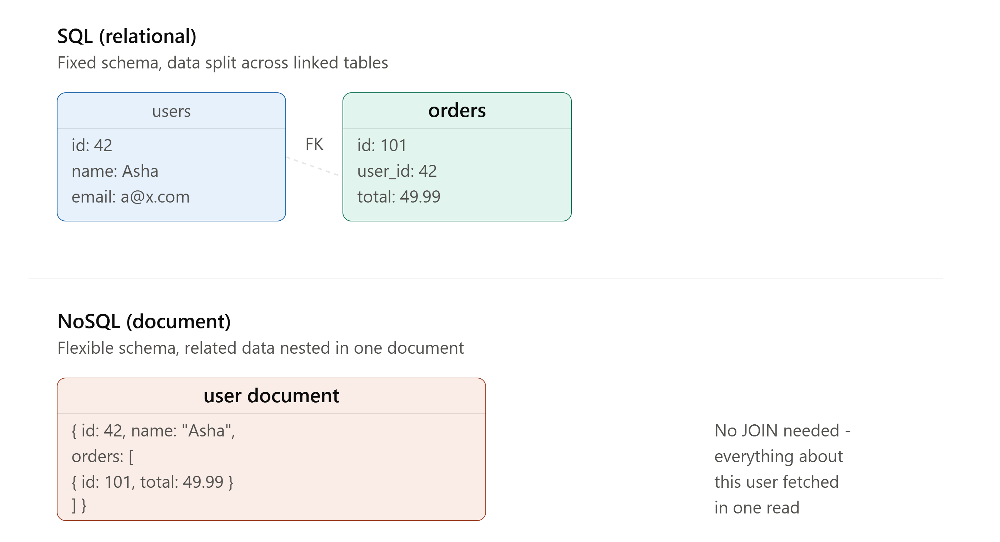

# DAY 8 — Database Fundamentals

### (SQL vs NoSQL, Types of NoSQL Databases, ACID Properties)

> **Why this day matters:** Welcome to Week 2. Everything so far (load balancers, caching, CDNs) was about getting REQUESTS to your application efficiently. Starting today, we go one layer deeper: how does the DATA itself get stored, structured, and kept correct? This is the foundation for everything in Week 2 — indexing, replication, sharding, the CAP theorem — none of it makes sense without first understanding the fundamental SQL vs NoSQL choice and what ACID actually guarantees.

> The diagram rendered above this lesson shows the structural difference between SQL's table-and-foreign-key model and NoSQL's nested-document model — refer back to it throughout Section 1.

---

## TABLE OF CONTENTS — DAY 8



1. SQL Databases — What, Why, Background, How
2. NoSQL Databases — What, Why, Background, How
3. Types of NoSQL Databases (Document, Key-Value, Column-Family, Graph)
4. SQL vs NoSQL — The Decision Framework
5. ACID Properties Deep Dive
6. Implementation — Connecting to SQL and NoSQL from Node.js
7. Day 8 Cheat Sheet

---

## 1. SQL DATABASES

### What

SQL (Structured Query Language) databases — also called **relational databases** — store data in **tables** made up of rows and columns, with a **fixed, predefined schema** (every row in a table must have the same set of columns, with the same data types). Relationships BETWEEN tables are expressed using **foreign keys** (a column in one table that refers to a row in another table), and data is queried using SQL — a declarative language for asking precise questions of your data ("give me all orders over $50 placed by users in Mumbai, joined with their user details").

### Why

Businesses have always needed to track structured, interrelated data — customers, orders, inventory, transactions — where the RELATIONSHIPS between pieces of data matter just as much as the data itself (which user placed which order; which order contains which products). SQL databases were built specifically to model these relationships rigorously, enforce consistency rules (a foreign key literally cannot point to a non-existent row — the database itself rejects that), and answer complex, ad-hoc questions across multiple related tables reliably.

### Background

The relational model was proposed by **Edgar F. Codd at IBM in 1970**, in a now-famous paper arguing that data should be organized into simple tables with mathematical (set-theory-based) operations to query them — a radical simplification compared to the more complex, hard-to-query database models that existed before it (hierarchical and network databases, which tightly coupled the data's physical storage structure to how you were allowed to query it). This led to the first commercial relational databases in the late 1970s-80s (Oracle, IBM DB2), followed by open-source options (MySQL in 1995, PostgreSQL with roots going back to 1986). For roughly 30+ years (1980s through the 2000s), relational databases were essentially the ONLY mainstream choice for backend application data — "database" and "SQL database" were almost synonymous, until NoSQL emerged as a genuine alternative (Section 2).

### How — Core Concepts You Must Know

- **Tables, Rows, Columns**: The basic structure — a `users` table has columns like `id`, `name`, `email`, and each ROW is one specific user.
- **Primary Key**: A column (or set of columns) that uniquely identifies each row (you used this in Day 7's `short_code` example).
- **Foreign Key**: A column in one table referencing the primary key of another table, enforcing that relationships stay valid (you cannot insert an order with a `user_id` that doesn't actually exist in the `users` table — the database enforces this automatically).
- **JOIN**: The operation that combines rows from multiple tables based on a related column, letting you ask questions that span multiple tables at once.
- **Schema**: The fixed structure (table names, column names, data types, constraints) that EVERY row must conform to — defined upfront, and changed deliberately via "migrations" when the application's needs evolve.

### Implementation — A simple relational schema and query

```sql
CREATE TABLE users (
  id SERIAL PRIMARY KEY,
  name VARCHAR(100) NOT NULL,
  email VARCHAR(100) UNIQUE NOT NULL
);

CREATE TABLE orders (
  id SERIAL PRIMARY KEY,
  user_id INTEGER NOT NULL REFERENCES users(id), -- foreign key
  total DECIMAL(10,2) NOT NULL,
  created_at TIMESTAMP DEFAULT NOW()
);

-- A JOIN: answering a question that spans BOTH tables in one query
SELECT users.name, orders.total, orders.created_at
FROM orders
JOIN users ON orders.user_id = users.id
WHERE orders.total > 50
ORDER BY orders.created_at DESC;
```

This single query — "give me the name and order details for every order over $50, newest first" — combining two separate tables, is exactly the kind of relational query SQL databases are optimized for, and is genuinely awkward or inefficient to express in many NoSQL systems (more on this in Section 4).

### Trade-offs

- **Pro**: Strong consistency guarantees (ACID, Section 5), enforces data integrity automatically (foreign keys, constraints), excellent for complex queries spanning multiple related entities, mature tooling and decades of operational knowledge across the industry.
- **Con**: The fixed schema makes it harder/slower to change your data structure later (a "schema migration" on a huge table can be a genuinely risky, slow production operation), and traditional relational databases historically scale HORIZONTALLY (Day 1) less easily than many NoSQL systems — this is the single biggest reason NoSQL emerged, which we cover next.

---

## 2. NOSQL DATABASES

### What

NoSQL ("Not Only SQL") is an umbrella term for databases that DON'T use the rigid, table-based relational model — instead using more flexible data models (documents, key-value pairs, wide columns, or graphs — Section 3), typically with a flexible or absent schema (different "rows"/"records" can have different fields), and typically designed from the ground up with horizontal scaling as a first-class goal.

### Why

By the mid-2000s, companies like Google, Amazon, and Facebook were operating at a scale where traditional relational databases — historically run on a SINGLE powerful machine (vertical scaling, Day 1), with horizontal scaling being notoriously difficult for relational systems specifically because JOINs and strict consistency guarantees become much harder to maintain once your data is split across many machines — were becoming a genuine bottleneck. These companies needed databases that could be horizontally scaled across THOUSANDS of cheap, commodity servers, even if that meant relaxing some of the strict guarantees (like strong consistency, or rich JOIN support) that relational databases provided. NoSQL databases were built specifically to make that trade deliberately.

### Background

Google published influential internal papers on **Bigtable** (2006) and **MapReduce** (2004), and Amazon published the **Dynamo** paper (2007) — both describing how they built massively horizontally-scalable data storage systems internally, sacrificing some relational features and strict consistency for massive scale and availability. These papers directly inspired the first wave of popular open-source NoSQL databases: **MongoDB** (document store, 2009), **Cassandra** (column-family, originally built at Facebook, open-sourced 2008), and **Redis** (key-value, 2009 — which you've already used extensively in Days 1, 4, 5, and 7!). The "NoSQL movement" of the late 2000s/early 2010s was explicitly a reaction to relational databases' scaling limitations at internet scale.

### How — The General Philosophy

Instead of normalizing data across many small, strictly related tables (the SQL approach), NoSQL databases typically encourage **denormalization** — duplicating or nesting related data together so that a SINGLE read can fetch everything needed, without requiring a JOIN across multiple separate locations (look back at the diagram rendered above this lesson: the NoSQL document nests the user's orders directly inside the user record itself, rather than splitting them into a separate linked table). This trades some storage efficiency and update complexity (if a piece of duplicated data changes, you may need to update it in multiple places) for dramatically simpler, faster reads at scale — which is exactly the right trade for many real-world, read-heavy application patterns (recall Day 7's URL shortener and Day 6's photo app — both overwhelmingly read-heavy).

### Trade-offs

- **Pro**: Flexible/no schema (add new fields to new records without a database-wide migration), typically much easier horizontal scaling (built-in sharding in many NoSQL systems — previewed Day 1, full depth Day 11), often better raw read/write performance for simple access patterns.
- **Con**: Weaker consistency guarantees by default in many NoSQL systems (though this varies hugely by specific database — more in Day 12's CAP theorem lesson), no enforced relationships between records (your APPLICATION code, not the database, is responsible for keeping related data consistent), and complex multi-entity queries (the equivalent of a SQL JOIN) are often awkward, slow, or simply unsupported.

---

## 3. TYPES OF NOSQL DATABASES

This is a critical distinction for interviews: **"NoSQL" is NOT one single type of database — it's an umbrella term covering at least four genuinely different data models**, each suited to different problems.

### 3.1 — Document Stores

**What**: Store data as flexible, semi-structured "documents" (typically JSON or JSON-like/BSON), where each document can have a different set of fields, and related data is commonly nested directly inside a single document (as shown in the diagram above).
**Examples**: **MongoDB**, Couchbase.
**Best for**: Content management systems, product catalogs, user profiles — anything where each "record" is naturally a self-contained, somewhat irregularly-structured object, and you usually want to fetch/update one whole record at a time rather than running complex cross-entity queries.
**Example document** (a product in an e-commerce catalog):

```json
{
  "_id": "prod_123",
  "name": "Wireless Mouse",
  "price": 29.99,
  "specs": { "color": "black", "wireless": true, "battery": "AA x2" },
  "reviews": [{ "user": "Asha", "rating": 5, "comment": "Great mouse!" }]
}
```

Notice `specs` and `reviews` are nested directly — a totally different product (say, a t-shirt) could have a completely different `specs` shape (`size`, `material` instead of `battery`), with NO schema migration needed — this flexibility is the document model's core defining trait.

### 3.2 — Key-Value Stores

**What**: The simplest possible data model — every piece of data is stored as a `key` mapped to a `value` (the value is often an opaque blob to the database itself — it doesn't necessarily understand or query INSIDE the value, it just stores and retrieves it by key, extremely fast).
**Examples**: **Redis** (which you've used constantly already), **DynamoDB**, Memcached.
**Best for**: Caching (exactly how you've used Redis all week), session storage, simple lookups by a known ID — anywhere the access pattern is fundamentally "give me the key, give me back the value," with no need for complex querying.
**Example**:

```
SET user:42:session  '{"loggedIn": true, "cartItems": 3}'
GET user:42:session  -> '{"loggedIn": true, "cartItems": 3}'
```

This is the EXACT pattern you've been using since Day 1 and Day 4 — you already have real, hands-on key-value store experience.

### 3.3 — Column-Family (Wide-Column) Stores

**What**: Data is stored in a way optimized for reading/writing entire COLUMNS efficiently across huge numbers of rows (rather than entire ROWS, which is how both SQL and document stores typically optimize) — conceptually, think of an extremely large, sparse table where different rows can have wildly different sets of columns, and the storage engine is specifically optimized for "give me this one column's values across millions of rows" style access.
**Examples**: **Cassandra**, HBase, Google Bigtable.
**Best for**: Massive-scale time-series data, IoT sensor data, analytics workloads — situations involving enormous write volumes spread across a distributed cluster, where you typically know your query patterns in advance and design the column structure specifically around those patterns.
**Why this is genuinely different from a document store**: a document store optimizes for "give me this ENTIRE document, all its fields, in one read" — a column-family store optimizes for "give me just THIS column's data, across potentially billions of rows, extremely fast" — these are different access patterns suited to different problems (the former: user profiles, product catalogs; the latter: "what was every sensor's temperature reading every minute for the last year").

### 3.4 — Graph Databases

**What**: Data is stored explicitly as **nodes** (entities) and **edges** (relationships between entities), with the database engine specifically optimized for efficiently traversing relationships — answering questions like "find all of this person's friends-of-friends" extremely fast, even many relationship-hops deep, which would require many expensive, slow JOINs in a relational database.
**Examples**: **Neo4j**, Amazon Neptune.
**Best for**: Social networks (friend/follow relationships), recommendation engines ("people who bought X also bought Y"), fraud detection (finding suspicious clusters of connected accounts/transactions).
**Why this is genuinely different**: relational databases CAN model relationships (via foreign keys and JOINs), but become progressively slower the MORE relationship-hops deep a query needs to traverse (a "friends of friends of friends" query in SQL requires multiple expensive JOINs); graph databases are purpose-built so that traversing relationships, even many hops deep, remains fast, because the relationships themselves are first-class, directly-stored data, not something computed on-the-fly via a JOIN at query time.

### Quick Reference Table

| Type          | Examples        | Best for                         | Core access pattern                           |
| ------------- | --------------- | -------------------------------- | --------------------------------------------- |
| Document      | MongoDB         | Catalogs, profiles, CMS          | Fetch/update one flexible record              |
| Key-Value     | Redis, DynamoDB | Caching, sessions                | Lookup by exact key                           |
| Column-Family | Cassandra       | Time-series, IoT, analytics      | Write/read huge volumes, known query patterns |
| Graph         | Neo4j           | Social networks, recommendations | Traverse relationships, many hops deep        |

### Interview Angle

"What's the difference between MongoDB and Cassandra?" or "When would you use a graph database?" — these test whether you understand NoSQL as a SPECTRUM of different tools, not one monolithic alternative to SQL. A strong answer always names the SPECIFIC type and the SPECIFIC access pattern it's optimized for, rather than saying "NoSQL" vaguely.

### How to teach this

> "SQL is like a perfectly organized filing cabinet with labeled folders that all follow the exact same format, and a master index connecting folders to each other. NoSQL isn't ONE alternative to that cabinet — it's actually four different alternatives, each good at a different thing: a document store is like keeping each customer's ENTIRE file as one self-contained folder, varying in contents customer to customer. A key-value store is like a coat check — you get a ticket number (key), and you get your coat back (value), nothing more complex than that. A column-family store is like a spreadsheet built for asking 'what's in column C across ALL ten million rows,' instantly. A graph database is like a literal map of who-knows-who, built specifically to trace connections fast, many people deep."

---

## 4. SQL vs NOSQL — THE DECISION FRAMEWORK

### What

A structured way to decide which to use for a given system — this is one of the most commonly asked open-ended system design questions, and the framework below is exactly what a strong answer walks through.

### The Key Questions to Ask

1. **How structured and stable is your data?** Highly structured, well-understood-in-advance, with clear relationships → leans SQL. Rapidly evolving, varied, or unpredictable structure → leans NoSQL (document store especially).
2. **Do you need complex queries/JOINs across multiple entities?** Yes, frequently → leans SQL. Mostly simple lookups by a known key/ID → leans NoSQL.
3. **What's your consistency requirement?** Must be strongly consistent (financial transactions, inventory counts that can never be wrong) → leans SQL (or a NoSQL system specifically configured for strong consistency — this nuance is covered fully on Day 12). Can tolerate eventual consistency → opens up more NoSQL options comfortably.
4. **What's your expected scale, and what KIND of scale?** Massive write volume, need to scale horizontally easily → leans NoSQL. Moderate scale, comfortably fits read replicas/vertical scaling for a while → SQL remains completely viable (recall: Day 7's URL shortener, at ~120 peak writes/sec and ~3TB over 5 years, did NOT need to reach for NoSQL purely for scale reasons).

### A Crucial, Often-Missed Point: You Can Use BOTH (Polyglot Persistence)

Real-world systems very often use MULTIPLE different databases simultaneously, each for the part of the system it's best suited to — this is called **polyglot persistence**. Recall Day 7's URL shortener: we used Redis (key-value) for the atomic counter AND the cache, alongside a relational database for the actual durable URL mapping — TWO different database types, in the SAME system, each doing the job it's genuinely best at. A senior-level system design answer actively looks for these opportunities, rather than forcing one single database type to handle every single need in a system.

### Real-world example

A large e-commerce platform might use: a relational database (PostgreSQL/MySQL) for orders and inventory (needs strong consistency — you cannot oversell inventory; needs complex queries joining orders, users, products); a document store (MongoDB) for the product catalog (highly variable product attributes — a book has different fields than a TV); Redis for session/cart caching (Day 4/5's exact patterns); and a graph database for "customers who bought this also bought" recommendations.

### Interview Angle

"Would you use SQL or NoSQL for this system?" — the WEAK answer picks one and stops. The STRONG answer walks through the 4 questions above explicitly, and often lands on "actually, I'd use BOTH, here's where each one fits" — directly demonstrating the polyglot persistence concept.

---

## 5. ACID PROPERTIES DEEP DIVE

### What

ACID is an acronym describing four guarantees that a TRANSACTION (a group of one or more database operations that should happen together, as a single unit) provides in a properly-designed relational database system:

- **A — Atomicity**: All operations in a transaction either ALL succeed, or ALL fail and are rolled back — there is no "partially completed" state ever visible.
- **C — Consistency**: A transaction can only bring the database from one VALID state to another valid state — it can never leave the data violating defined rules/constraints (like a foreign key pointing to a non-existent row).
- **I — Isolation**: Concurrent transactions (multiple things happening AT THE SAME TIME) do not interfere with or see each other's incomplete, in-progress changes.
- **D — Durability**: Once a transaction is confirmed/committed, it is PERMANENTLY saved, even if the database crashes immediately afterward (e.g., power loss) — it survives.

### Why

Imagine a bank transfer: $100 must be DEDUCTED from Account A and ADDED to Account B. If the system crashes after deducting from A but BEFORE adding to B, $100 has simply vanished — a catastrophic, unacceptable bug. ACID exists specifically to make these kinds of multi-step, "this must ALL happen or NONE of it happens" operations safe, even in the presence of crashes, concurrent users, and system failures.

### Background

ACID was formally defined by computer scientists (notably Theo Härder and Andreas Reuter, in a 1983 paper) as a way to precisely specify the reliability guarantees a "transaction processing system" should provide — directly growing out of decades of practical experience with banking and business systems where partial, inconsistent updates had real, costly consequences. It became (and remains) the gold-standard vocabulary for describing relational database reliability.

### How — Each Property in Concrete Detail

**Atomicity — Example:**

```sql
BEGIN TRANSACTION;
  UPDATE accounts SET balance = balance - 100 WHERE id = 'A';
  UPDATE accounts SET balance = balance + 100 WHERE id = 'B';
COMMIT;
```

If ANYTHING fails between `BEGIN` and `COMMIT` (a crash, an error, a constraint violation), the database automatically ROLLS BACK every change made so far in this transaction — Account A's deduction is undone, exactly as if neither line had ever run. There is no possible outcome where A loses money but B never receives it.

**Consistency — Example:**
If `accounts.balance` has a database-level constraint `CHECK (balance >= 0)` (preventing negative balances), a transaction that would result in a negative balance is REJECTED entirely — the database refuses to move into that invalid state, protecting a business rule at the data layer itself, not relying solely on application code to remember to check this.

**Isolation — Example (the trickiest one to understand):**
Imagine two transactions running at the SAME TIME: one reading Account A's balance to display it to a user, while another is in the middle of transferring money INTO Account A. Isolation guarantees the READING transaction either sees the balance BEFORE the transfer, or AFTER it completes — never a weird, "half-updated" intermediate value. Databases implement this using different **isolation levels** (a more advanced topic), trading off strictness against performance — but the GUARANTEE, at minimum, is that you'll never see genuinely corrupted, half-written data.

**Durability — Example:**
The moment your application receives a `COMMIT` confirmation, that data is guaranteed saved — typically because the database has already written it to durable disk storage (and often to a separate transaction log too) BEFORE confirming success back to your application — even a power outage one millisecond later cannot undo it.

### Implementation — Using transactions in Node.js

```js
const { Pool } = require("pg");
const db = new Pool();

async function transferMoney(fromAccountId, toAccountId, amount) {
  const client = await db.connect();
  try {
    await client.query("BEGIN"); // start the transaction (Atomicity begins here)

    const fromResult = await client.query(
      "UPDATE accounts SET balance = balance - $1 WHERE id = $2 AND balance >= $1 RETURNING balance",
      [amount, fromAccountId],
    );

    if (fromResult.rowCount === 0) {
      // Insufficient funds - the WHERE balance >= $1 check failed to match any row
      throw new Error("Insufficient funds");
    }

    await client.query(
      "UPDATE accounts SET balance = balance + $1 WHERE id = $2",
      [amount, toAccountId],
    );

    await client.query("COMMIT"); // Durability guaranteed from this point on
    console.log("Transfer succeeded");
  } catch (err) {
    await client.query("ROLLBACK"); // Atomicity: undo EVERYTHING in this transaction
    console.error("Transfer failed, rolled back:", err.message);
    throw err;
  } finally {
    client.release();
  }
}
```

Notice the `try/catch/ROLLBACK` pattern — this is the standard, must-know way to correctly use transactions in real Node.js code: ALWAYS wrap multi-step database operations in `BEGIN`/`COMMIT`, and ALWAYS `ROLLBACK` on any failure, so partial updates never persist.

### ACID and NoSQL — an important nuance

Many NoSQL databases historically provided WEAKER guarantees than full ACID (often only guaranteeing atomicity for a SINGLE document/row, not across multiple documents/rows in one transaction) — this was historically one of the deliberate trade-offs made in exchange for easier horizontal scaling (Section 2). However, this has been evolving — MongoDB, for instance, added multi-document ACID transaction support in more recent versions. **The honest, nuanced, interview-ready answer**: "ACID is the traditional, strong guarantee from relational databases; many — but not all — NoSQL databases relax some of these guarantees in exchange for scale, though the specifics vary significantly by which specific NoSQL database you're discussing, and this has been improving over time across the industry."

### Interview Angle

"Explain ACID" is asked constantly, often as a precursor to deeper questions about transactions, concurrency, or distributed systems trade-offs (this connects directly forward to **Day 12's CAP theorem** and **Day 13's distributed transactions** topics). Be ready to give the bank-transfer example immediately and fluently — it's the canonical, universally-understood illustration of WHY all four properties matter together.

### How to teach this

> "ACID is the rulebook that makes a bank transfer safe. Atomicity: the money move happens completely, or not at all — never half. Consistency: the books always balance according to the bank's rules — money can't just appear or vanish in violation of how accounts are supposed to work. Isolation: if you check your balance WHILE a transfer is happening, you see either the BEFORE picture or the AFTER picture, never some bizarre in-between snapshot. Durability: once the bank confirms 'transfer complete,' that's permanent — even if the bank's server catches fire one second later, your money's new location is already safely recorded elsewhere."

---

## 6. IMPLEMENTATION — CONNECTING TO SQL AND NOSQL FROM NODE.JS

A quick, practical side-by-side, since as a Node.js developer you'll regularly work with both:

**PostgreSQL (SQL) using the `pg` library:**

```js
const { Pool } = require("pg");
const pool = new Pool({ connectionString: process.env.DATABASE_URL });

async function getUserOrders(userId) {
  const result = await pool.query(
    `SELECT orders.id, orders.total, orders.created_at
     FROM orders
     WHERE orders.user_id = $1
     ORDER BY orders.created_at DESC`,
    [userId],
  );
  return result.rows;
}
```

**MongoDB (NoSQL document store) using `mongoose`:**

```js
const mongoose = require("mongoose");

const productSchema = new mongoose.Schema(
  {
    name: String,
    price: Number,
    specs: mongoose.Schema.Types.Mixed, // deliberately flexible - no fixed shape
    reviews: [{ user: String, rating: Number, comment: String }],
  },
  { strict: false },
); // allows fields not explicitly defined in the schema

const Product = mongoose.model("Product", productSchema);

async function getProduct(productId) {
  // No JOIN needed - reviews are already nested inside the SAME document
  return await Product.findById(productId);
}
```

Notice the MongoDB query needs no JOIN at all to get a product AND its reviews together — they were already stored together, exactly as the diagram rendered at the start of this lesson illustrated.

---

## 7. DAY 8 CHEAT SHEET

```
SQL (RELATIONAL)
  Fixed schema, tables + rows + columns, relationships via FOREIGN KEYS,
  queried via JOINs. Strong consistency (ACID). Harder to scale horizontally.
  Examples: PostgreSQL, MySQL

NOSQL
  Umbrella term, NOT one model. Flexible/no schema. Built for horizontal
  scale. Often relaxes strict consistency for performance/scale.

  4 TYPES:
  Document       (MongoDB)   - flexible nested records, fetch whole record
  Key-Value      (Redis)     - simplest, fastest, lookup by exact key
  Column-Family  (Cassandra) - massive write volume, optimized per-column reads
  Graph          (Neo4j)     - relationships as first-class data, fast traversal

DECISION FRAMEWORK (ask these 4 questions)
  1. How structured/stable is the data? -> stable=SQL, evolving=NoSQL
  2. Need complex JOINs across entities? -> yes=SQL, simple lookups=NoSQL
  3. Consistency requirement?            -> strict=SQL, eventual OK=NoSQL ok
  4. Scale/growth pattern?                -> massive horizontal=NoSQL
  REMEMBER: polyglot persistence - real systems often use BOTH,
  each for what it's best at (see Day 7's URL shortener: SQL + Redis together)

ACID (transactions in relational databases)
  Atomicity   - all steps succeed together, or all roll back, no partial state
  Consistency - transaction can't leave data violating defined rules/constraints
  Isolation   - concurrent transactions don't see each other's half-finished work
  Durability  - once committed, survives crashes permanently
  Canonical example: bank transfer (deduct from A + add to B, must be atomic)
  Many NoSQL databases historically relax ACID guarantees for scale -
  varies a lot by specific database, and has been improving industry-wide
```

---

### What's next (Day 9 preview)

Tomorrow we go deep into **Database Indexing** — exactly HOW a database finds a specific row in milliseconds out of billions, using B-Tree and B+Tree data structures, hash indexes, and the very real trade-off that indexes speed up reads but slow down writes. You'll create actual indexes on a real database from Node.js and benchmark the difference yourself, so you SEE the performance gap, not just read about it.

**Say "Day 9" whenever you're ready.**
