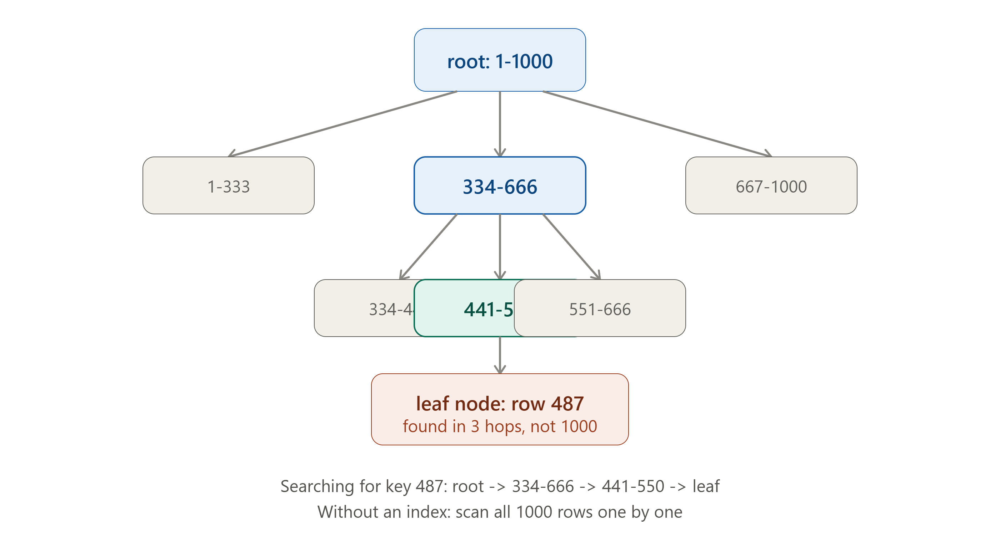

# DAY 9 — Database Indexing



### (B-Tree, B+Tree, Hash Indexes, The Read/Write Trade-off, Benchmarking It Yourself)

> **Why this day matters:** This is the single most practically useful thing you'll learn this entire month for your day-to-day job as a Node.js backend developer. "Why is this query slow?" is one of the most common real-world problems you will ever debug, and the answer is overwhelmingly likely to be "missing index" or "wrong index." Today you learn EXACTLY how indexes work internally — not just "add an index, it gets faster" — and you'll prove it to yourself with a real benchmark.

> The diagram rendered above this lesson shows a B-Tree search path — refer back to it throughout Section 1.

---

## TABLE OF CONTENTS — DAY 9

1. What Is a Database Index, Really? (The Core Problem)
2. B-Tree Indexes — Deep Dive
3. B+Tree — The Refinement Almost Every Database Actually Uses
4. Hash Indexes
5. The Trade-off: Why Indexes Speed Up Reads but Slow Down Writes
6. Implementation — Create Indexes and Benchmark Them Yourself
7. Choosing What to Index (Practical Guidance)
8. Day 9 Cheat Sheet

---

## 1. WHAT IS A DATABASE INDEX, REALLY? (THE CORE PROBLEM)

### What

A database index is an auxiliary data structure that stores a SORTED (or otherwise organized) copy of one or more columns' values, along with a pointer back to the location of the full row — allowing the database to find specific rows WITHOUT scanning every single row in the table.

### Why

Without an index, finding a row matching a condition (e.g., `WHERE email = 'asha@example.com'`) requires the database to perform a **full table scan** — checking every single row, one by one, from the first to the last, until it finds matches (or confirms there are none). For a table with 10 rows, this is instant. For a table with 100 million rows, this could mean reading 100 million rows from disk, one at a time — taking seconds or even minutes, for a query that a user expects to complete in milliseconds. This is, without exaggeration, **the single most common cause of "why is my application slow" in real-world backend development.**

### Background

The need to find specific records quickly, without scanning everything, predates modern databases entirely — it's the same fundamental problem solved by a phone book being alphabetically sorted (so you can flip directly to "S" instead of reading every single name from "A"), or a library's card catalog. Early database systems in the 1970s-80s adapted these same "organize data so you can jump directly to what you need" ideas, and the **B-Tree** data structure (invented by Rudolf Bayer and Edward McCreight in 1971, originally for organizing data on tape/disk drives efficiently) became — and remains, over 50 years later — the dominant underlying structure for database indexes across virtually every major relational database system in existence.

### How — The Core Insight (Before the Data Structure Details)

The fundamental trick of ANY good index is the same one used in a phone book or dictionary: **keep the index data SORTED (or otherwise organized for fast lookup), so you can use a search strategy dramatically better than checking every single entry one by one** — specifically, something like binary search (repeatedly cutting the remaining search space in half) rather than linear search (checking one at a time). The specific data structures below (B-Tree, B+Tree, Hash) are different concrete IMPLEMENTATIONS of this same core idea, each with different trade-offs.

### How to teach this

> "Imagine a massive phone book with 10 million names, completely UNSORTED, randomly thrown together. Finding 'Asha Patel' means checking every single page until you stumble onto her, possibly all 10 million entries. Now imagine the SAME phone book, alphabetically sorted. You flip straight to roughly the 'P' section, and within a handful of page-flips, you've found her — maybe 25 comparisons total instead of 10 million. A database index is exactly this: organizing data so the database can 'flip straight to the right section' instead of reading the entire book."

---

## 2. B-TREE INDEXES — DEEP DIVE

### What

A B-Tree ("Balanced Tree") is a tree data structure where each node can have MULTIPLE children (not just 2, like a simpler binary tree), keeps its keys SORTED within each node, and — critically — remains perfectly **balanced** (every path from the root down to a leaf is the same length), which guarantees consistently fast lookups no matter which specific value you're searching for.

### Why this specific structure, and not a simpler one

You might wonder: why not just use a simple binary search tree (2 children per node)? The answer is rooted in how computers actually access data on disk: reading from disk happens in fixed-size "blocks" or "pages" (e.g., 4KB or 8KB at a time), and each disk read has real, relatively significant latency (even on fast SSDs, far slower than reading from RAM). A B-Tree is specifically designed so that EACH NODE corresponds to roughly one disk page, and by allowing MANY keys per node (not just one, like a binary tree), the tree stays very SHALLOW (few levels deep) even for enormous amounts of data — meaning very few actual disk reads are needed to find any given row, since each "hop" down the tree corresponds to one disk read, and there are very few hops.

### Background

This direct mapping to physical disk access patterns is exactly why Bayer and McCreight invented the B-Tree in 1971 specifically for managing data on then-current disk/tape storage hardware — and remarkably, even though underlying storage hardware (now SSDs, sometimes even pure RAM) has changed dramatically since 1971, the core insight (minimize the NUMBER of "hops"/reads needed by keeping the tree wide and shallow) remains exactly as valuable today, which is why this 50+ year old data structure is still the industry-standard choice.

### How — The Structure, Step by Step (refer to the diagram rendered above this lesson)

1. **Root node**: The top of the tree, containing a small number of sorted key ranges, each pointing to a CHILD node responsible for that range.
2. **Internal nodes**: Similarly contain sorted key ranges and pointers to further child nodes — there can be multiple LEVELS of these, depending on how much data there is.
3. **Leaf nodes**: The bottom level, containing the actual sorted key values, each paired with a pointer to the FULL row of data (its physical location on disk).
4. **Searching**: To find a specific value (e.g., key = 487, as shown in the diagram), the database starts at the root, determines WHICH child's range contains 487, follows that pointer, repeats at the next level, and so on, until it reaches a leaf node containing the actual answer. **Each level is one "hop" — and because the tree is so WIDE (many keys per node) and therefore so SHALLOW (few levels), even a table with millions or billions of rows might only need 3-4 hops total to find any specific row.**

### Why this matters for performance, concretely

For a table with **1 billion rows**, a B-Tree index (because it's wide and shallow) might only need around **4 hops** (4 disk reads) to find any specific row — compared to a full table scan needing, in the worst case, up to 1 billion reads. This is the literal, concrete reason a well-indexed query on a massive table can still complete in milliseconds.

### Real-world example

**PostgreSQL** and **MySQL (InnoDB engine)** both use B-Tree (specifically, the refined B+Tree variant, Section 3) as their DEFAULT index type for almost all standard `CREATE INDEX` operations — this is genuinely the data structure doing the work behind the scenes every single time you index a column in either of these databases.

### Interview Angle

"How does a database index actually work internally?" — be ready to describe the B-Tree structure, and SPECIFICALLY explain WHY it's wide/shallow rather than just saying "it's a tree" vaguely — the disk-I/O-minimization reasoning is exactly the kind of depth that distinguishes a strong answer.

---

## 3. B+TREE — THE REFINEMENT ALMOST EVERY DATABASE ACTUALLY USES

### What

A B+Tree is a refinement of the basic B-Tree with one key structural difference: **ALL actual data pointers live ONLY in the leaf nodes** (internal/root nodes contain ONLY keys and child pointers, used purely for navigation — no actual row data); additionally, the **leaf nodes are linked together in a chain** (each leaf node has a pointer to the NEXT leaf node in sorted order).

### Why this specific refinement matters

Two concrete benefits over a plain B-Tree:

1. **More keys fit per internal node** (since internal nodes don't need to also store data pointers, just navigation keys), making the tree even SHALLOWER for the same amount of data — fewer hops, even faster lookups.
2. **Range queries become extremely efficient**: because leaf nodes are linked together in sorted order, a query like `WHERE price BETWEEN 50 AND 100` can find the FIRST matching leaf node (via a normal tree search), and then simply WALK ALONG the linked leaf chain collecting matching values, without needing to re-traverse the tree from the root for each subsequent value — a hugely common and hugely important real-world query pattern (range queries, sorting, pagination) that plain B-Trees handle less efficiently.

### Background

This refinement emerged directly from real-world relational database engineering through the 1970s-80s, as engineers building actual production database engines (rather than the original, more theoretical B-Tree paper) discovered that range queries (extremely common in real applications — "orders from this month," "products under $50," "users created between these two dates") were disproportionately important to optimize for, leading to this now-near-universal refinement.

### How it changes the diagram from Section 1

Picture the EXACT same tree shape shown in the diagram rendered earlier — but now imagine EVERY leaf node also has an extra arrow pointing sideways to the NEXT leaf node in sorted order. A range query for "everything between 441 and 666" would: find the leaf containing 441 (a normal root-to-leaf search, exactly as shown), then simply follow the sideways leaf-to-leaf pointers rightward, collecting every value until it passes 666 — no need to go back up to the root and search again for each individual value in that range.

### Real-world example

This is genuinely what's running under the hood whenever you use a standard index in **PostgreSQL, MySQL, SQLite, Oracle, SQL Server** — when people informally say "it uses a B-Tree index," they almost always technically mean a B+Tree, since that's what's actually implemented in essentially every production relational database system today.

### Interview Angle

"What's the difference between a B-Tree and a B+Tree?" is a real, specific follow-up question that distinguishes candidates who've gone one level deeper than the surface-level "databases use trees for indexing" answer. The expected answer: data pointers ONLY in leaves (not internal nodes), AND leaves are linked together for efficient range scans.

---

## 4. HASH INDEXES

### What

A hash index uses a **hash function** (a function that converts an input value into a fixed-size number, the "hash") to map each key directly to a specific "bucket" location, allowing for extremely fast **exact-match** lookups — O(1) (constant time) in the ideal case, rather than the B-Tree's O(log n).

### Why you'd consider this instead of (or alongside) a B-Tree

If your ENTIRE query pattern is always "find the exact row where `column = specific_value`" (and you NEVER need range queries like `BETWEEN` or `>`, and never need sorted results), a hash index can theoretically be even faster than a B-Tree, since it doesn't need to traverse multiple tree levels — it computes the hash once, and jumps DIRECTLY to the right location.

### Background

Hash tables, as a general data structure, are one of the most fundamental tools in all of computer science (you've likely used JavaScript objects/Maps, which are themselves hash tables, throughout your career as a Node.js developer already) — applying this same idea to database indexing is a natural, long-standing technique, used selectively where its specific strength (exact-match speed) outweighs its specific weakness (explained below).

### How

1. A hash function takes the indexed column's value (e.g., an email address) and computes a hash (a number).
2. That hash determines which "bucket" the corresponding row pointer is stored in.
3. To look up a value, the database computes the SAME hash for the search value, jumps directly to that bucket, and checks the (typically very small number of) entries there for an exact match.

### The Critical Weakness — Why B-Trees Remain the Default Choice for Most Use Cases

**Hash indexes CANNOT efficiently support range queries.** Because the hash function scrambles values into essentially random bucket locations (that's the whole point of a hash function — similar input values do NOT end up near each other), there's no way to ask "give me everything between X and Y" efficiently — you'd be back to checking almost everything. This is precisely WHY B-Trees (which preserve SORTED order) remain the default, general-purpose choice across the industry, while hash indexes are used more selectively, specifically for columns you're CERTAIN will only ever be queried via exact-match lookups.

### Real-world example

**Redis** (which you've used constantly as a key-value store) is fundamentally built around hash-table-style lookups internally — this is exactly why Redis `GET key` operations are so extremely fast: it's a textbook hash-index-style exact-match lookup, with no need to ever support range queries the way a relational database's B+Tree index does. **PostgreSQL** also offers an explicit `CREATE INDEX ... USING HASH` option for specific exact-match-only use cases, though B-Tree (the default) remains far more commonly used in practice, precisely because most real applications eventually need at least SOME range/sort queries on most indexed columns.

### Comparison Table

|                                     | B-Tree / B+Tree                    | Hash Index                                    |
| ----------------------------------- | ---------------------------------- | --------------------------------------------- |
| Exact match lookup                  | Fast (O(log n))                    | Faster (O(1) ideal case)                      |
| Range queries (`BETWEEN`, `>`, `<`) | Efficient                          | Not supported efficiently                     |
| Sorted output (`ORDER BY`)          | Can use the index's existing order | Not supported (no inherent order)             |
| General-purpose default             | Yes                                | No — only for specific exact-match-only cases |

### Interview Angle

"When would you use a hash index instead of a B-Tree?" → ONLY when you're confident the column will EXCLUSIVELY ever be queried via exact match, never range/sort — and even then, many engineers still default to B-Tree simply because future query patterns are hard to predict with certainty, and B-Tree's exact-match performance, while technically slightly slower than hash in theory, is still extremely fast in practice.

---

## 5. THE TRADE-OFF: WHY INDEXES SPEED UP READS BUT SLOW DOWN WRITES

### What

Every index you create on a table must be UPDATED every single time a row is inserted, updated, or deleted — meaning each additional index adds extra WORK to every write operation, even though it speeds up READ operations on that column.

### Why this trade-off exists, fundamentally

An index is, by definition, a SEPARATE, ADDITIONAL data structure that must stay perfectly in sync with the actual table data at all times. If you insert a new row, the database must ALSO insert a corresponding entry into EVERY index defined on that table — re-balancing the B-Tree structure as needed to maintain its sorted, balanced properties (refer back to Section 2's structure). The more indexes a table has, the more of this extra bookkeeping work happens on every single write.

### Background

This is a fundamental, unavoidable trade-off inherent to ANY indexing scheme, not a flaw specific to any one database — it traces directly back to the core insight from Section 1: keeping data "organized for fast lookup" REQUIRES continuously re-organizing it as new data arrives, which is inherently extra work compared to simply appending new data without maintaining any particular order (which is roughly what an un-indexed table effectively does).

### How — Concretely, What Happens on a Write

1. `INSERT INTO users (email, ...) VALUES (...)` — the actual row data is written to the table.
2. For EACH index defined on the `users` table (say, an index on `email`, and another on `created_at`), the database must ALSO insert a new entry into EACH of those index structures, in the correct sorted position — this might require re-balancing the relevant B-Tree (Section 2), splitting nodes that have become too full, and updating sibling-leaf pointers (Section 3) to maintain the structure's integrity.
3. The MORE indexes exist on a table, the more of these additional update operations must happen, for EVERY single write — this is real, measurable additional latency and CPU/disk work per write operation.

### The Practical Implication

This is exactly why "just add an index to every column, to be safe" is BAD advice, despite sounding intuitively safe — excessive indexing measurably slows down INSERT/UPDATE/DELETE operations (and consumes additional disk space, since each index is its own separate stored structure), often without providing proportional benefit if those particular columns are rarely or never used in `WHERE`/`ORDER BY`/`JOIN` clauses. **Good indexing is a deliberate trade-off decision, not a "more is always better" decision.**

### Interview Angle

"What's the downside of adding too many indexes?" — expect: slower writes (every index must be updated on every insert/update/delete), increased storage usage, and the importance of indexing DELIBERATELY based on actual query patterns, not indexing everything "just in case."

### How to teach this

> "An index is like keeping a perfectly alphabetized card catalog alongside your actual bookshelf. Looking up a book by title becomes instant (fast reads). But every single time a NEW book arrives, you now have to ALSO go update the card catalog — find the exact right alphabetical spot, insert a new card — not just shove the book onto a shelf. The more separate catalogs you maintain (indexed by title, by author, by genre...), the more extra filing work happens every time a new book arrives. If you have 10 catalogs but only ever actually USE 2 of them, you're doing 8 catalogs' worth of unnecessary extra filing work on every new arrival, for no real benefit."

---

## 6. IMPLEMENTATION — CREATE INDEXES AND BENCHMARK THEM YOURSELF

This is the part where you stop reading about indexing and actually SEE it, with real numbers, on your own machine.

### Step 1: Set up a table with a meaningful amount of data

```js
const { Pool } = require("pg");
const db = new Pool({ connectionString: process.env.DATABASE_URL });

async function setup() {
  await db.query(`
    CREATE TABLE IF NOT EXISTS users (
      id SERIAL PRIMARY KEY,
      email VARCHAR(100),
      created_at TIMESTAMP
    );
  `);

  console.log("Inserting 1,000,000 rows... this will take a moment");
  // Insert a million rows with realistic-ish, randomized data, in batches
  for (let batch = 0; batch < 100; batch++) {
    const values = [];
    const params = [];
    for (let i = 0; i < 10000; i++) {
      const n = batch * 10000 + i;
      values.push(`($${params.length + 1}, $${params.length + 2})`);
      params.push(`user${n}@example.com`, new Date(2020, 0, 1 + (n % 1800)));
    }
    await db.query(
      `INSERT INTO users (email, created_at) VALUES ${values.join(",")}`,
      params,
    );
  }
  console.log("Done inserting 1,000,000 rows");
}

setup();
```

### Step 2: Benchmark a query WITHOUT an index

```js
async function benchmarkWithoutIndex() {
  const start = Date.now();
  const result = await db.query(
    `SELECT * FROM users WHERE email = 'user543210@example.com'`,
  );
  const elapsed = Date.now() - start;
  console.log(
    `WITHOUT index: found ${result.rows.length} row(s) in ${elapsed}ms`,
  );
}

benchmarkWithoutIndex();
// Typical real-world result on a 1-million-row table: anywhere from
// tens to hundreds of milliseconds, because Postgres has to perform
// a full sequential scan, checking rows one by one (Section 1's core problem)
```

### Step 3: Create the index, then benchmark again

```js
async function createIndexAndBenchmark() {
  console.log("Creating index on email column...");
  const indexStart = Date.now();
  await db.query(`CREATE INDEX idx_users_email ON users(email)`); // builds a B-Tree, Section 2/3
  console.log(`Index created in ${Date.now() - indexStart}ms`);

  const start = Date.now();
  const result = await db.query(
    `SELECT * FROM users WHERE email = 'user543210@example.com'`,
  );
  const elapsed = Date.now() - start;
  console.log(`WITH index: found ${result.rows.length} row(s) in ${elapsed}ms`);
}

createIndexAndBenchmark();
// Typical real-world result: under 1-2ms - often 50-200x faster than the
// unindexed version above, on a table this size. The exact numbers
// will vary by machine, but the ORDER OF MAGNITUDE difference is the point.
```

### Step 4: See the actual B-Tree traversal using `EXPLAIN ANALYZE`

This is how you'd ACTUALLY verify and debug indexing behavior in a real job, not just in this exercise:

```js
async function explainQuery() {
  const result = await db.query(
    `EXPLAIN ANALYZE SELECT * FROM users WHERE email = 'user543210@example.com'`,
  );
  result.rows.forEach((row) => console.log(row["QUERY PLAN"]));
}

explainQuery();
// BEFORE the index, you'd see "Seq Scan on users" in the output - confirming
// a full table scan (Section 1's exact problem) is happening.
// AFTER the index, you'd see "Index Scan using idx_users_email" - confirming
// Postgres is now using the B-Tree (Section 2/3) instead of scanning everything.
```

**This `EXPLAIN ANALYZE` command is genuinely one of the most useful, frequently-used real-world debugging tools** for any backend developer working with SQL databases — it tells you EXACTLY what strategy the database chose for a given query, which is precisely how you'd diagnose a slow query in a real production system: run `EXPLAIN ANALYZE` on it, look for `Seq Scan` where you expected (and need) an `Index Scan`, and add the missing index.

### Step 5: Demonstrate the write-side cost (closing the loop on Section 5)

```js
async function benchmarkInsertSpeed(label) {
  const start = Date.now();
  for (let i = 0; i < 1000; i++) {
    await db.query(`INSERT INTO users (email, created_at) VALUES ($1, $2)`, [
      `newuser${i}@example.com`,
      new Date(),
    ]);
  }
  console.log(`${label}: 1000 inserts took ${Date.now() - start}ms`);
}

// Run this BEFORE creating any indexes, note the time.
// Then create 3-4 additional indexes on different columns, and run it AGAIN -
// you should observe a measurable SLOWDOWN in insert speed, directly
// demonstrating Section 5's trade-off with your own eyes, on your own machine.
```

**The full exercise, start to finish**: run Step 1 (setup), then Step 2 (benchmark without index — note the time), then Step 3 (create index, benchmark again — note the dramatically lower time), then Step 4 (confirm with `EXPLAIN ANALYZE` that the strategy actually changed from Seq Scan to Index Scan), then Step 5 (observe the write-side slowdown after adding several indexes). This single, hands-on exercise will teach you more about indexing, viscerally, than any amount of further reading — you will have personally MEASURED both sides of the fundamental trade-off this entire lesson is built around.

---

## 7. CHOOSING WHAT TO INDEX (PRACTICAL GUIDANCE)

Direct, practical rules a real backend developer uses day to day:

1. **Index columns used in `WHERE` clauses frequently.** If you constantly query `WHERE status = 'active'`, that column is a strong indexing candidate.
2. **Index columns used in `JOIN` conditions.** Foreign key columns (like `orders.user_id`) are almost always worth indexing, since JOINs constantly need to match rows across tables by these columns.
3. **Index columns used in `ORDER BY`,** especially for paginated results — an index can let the database return already-sorted results directly from the index structure (recall Section 3's leaf-chain explanation), without a separate, expensive sorting step.
4. **Consider composite (multi-column) indexes** for queries that always filter on MULTIPLE columns together (e.g., `WHERE user_id = ? AND status = 'active'`) — a single index on `(user_id, status)` together can be more effective than two separate single-column indexes for this specific combined query pattern.
5. **Don't index columns you rarely query by**, and don't index EVERY column "just in case" (Section 5's trade-off) — every unnecessary index is pure overhead on every write, for zero real-world read benefit.
6. **Re-evaluate as query patterns evolve.** An index that made sense for your application 2 years ago might be entirely unused today if your actual query patterns have changed — most databases provide ways to check index usage statistics (e.g., Postgres's `pg_stat_user_indexes`) to identify and remove indexes that aren't actually helping anymore.

### Interview Angle

"How would you decide what to index on this table?" — walk through the actual, real query patterns the system needs to support (tying back to the API design / access patterns from earlier days), and explicitly name WHICH columns appear in `WHERE`/`JOIN`/`ORDER BY` clauses for those specific queries — this is a very concrete, practical question that rewards specificity over generic "I'd add an index" answers.

---

## 8. DAY 9 CHEAT SHEET

```
WHY INDEXES EXIST
  Without one: full table scan, checking every row (slow at scale)
  With one: organized structure lets the DB jump directly to matching rows

B-TREE
  Multi-child, SORTED, perfectly BALANCED tree
  Wide + shallow -> very few "hops" (disk reads) even for huge tables
  Built specifically to minimize disk I/O (1971, still the standard today)

B+TREE (what databases actually use, in practice)
  Refinement: data pointers ONLY in leaf nodes (internal nodes = pure navigation)
  Leaf nodes LINKED together -> efficient RANGE queries (BETWEEN, >, <, ORDER BY)
  This is what Postgres/MySQL/SQLite actually implement for "B-Tree" indexes

HASH INDEX
  Hash function -> direct O(1) bucket lookup
  FAST for exact match, USELESS for range queries (hashing scrambles order)
  Used selectively; B-Tree remains the general-purpose default
  (Redis's GET is conceptually this kind of lookup)

THE CORE TRADE-OFF
  Indexes speed up READS (faster lookups)
  Indexes slow down WRITES (every insert/update/delete must update EVERY
  index on that table too, with possible tree re-balancing)
  More indexes = more write overhead + more storage, for indexes that may
  or may not ever actually get used by real queries

HOW TO VERIFY IN REAL LIFE
  EXPLAIN ANALYZE <query>
  "Seq Scan"   = full table scan happening (likely needs an index)
  "Index Scan" = B-Tree index is being used correctly

WHAT TO INDEX
  WHERE columns, JOIN/foreign key columns, ORDER BY columns,
  composite indexes for multi-column filter patterns
  DON'T index everything "just in case" - deliberate, query-pattern-driven choice
```

---

### What's next (Day 10 preview)

Tomorrow we move from "how ONE database finds data fast" to "how do we make sure that data SURVIVES even if that one database server dies" — **Database Replication**: Leader-Follower (Master-Slave) setups, Multi-leader replication, Leaderless replication, and the crucial difference between Synchronous and Asynchronous replication — including exactly what trade-off each makes between data safety and performance. You'll also see how read replicas directly connect back to several of the read-heavy scaling problems you've already calculated numbers for (Day 6, Day 7).

**Say "Day 10" whenever you're ready.**
