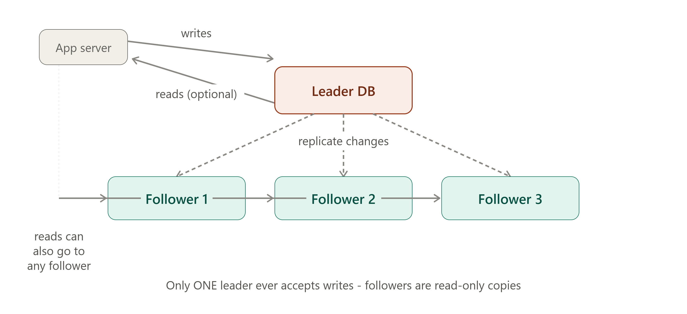

# DAY 10 — Database Replication



### (Leader-Follower, Multi-Leader, Leaderless Replication, Synchronous vs Asynchronous)

> **Why this day matters:** Day 9 made a single database fast to READ FROM. Today solves a completely different problem: what happens when that ONE database server dies, or simply can't handle all the read traffic alone? Replication — keeping multiple copies of your data on multiple machines — is how real systems achieve both durability (Day 1's Reliability) and read scalability, and it directly solves the exact read-heavy bottlenecks you calculated numbers for back on Day 6 and Day 7.

> The diagram rendered above this lesson shows the Leader-Follower topology — refer back to it throughout Section 1.

---

## TABLE OF CONTENTS — DAY 10

1. Why Replication Exists (The Two Problems It Solves)
2. Leader-Follower (Master-Slave) Replication
3. Multi-Leader Replication
4. Leaderless Replication
5. Synchronous vs Asynchronous Replication
6. Replication Lag — The Practical Consequence You Must Design Around
7. Implementation — Read/Write Splitting in Node.js
8. Day 10 Cheat Sheet

---

## 1. WHY REPLICATION EXISTS (THE TWO PROBLEMS IT SOLVES)

### What

Database replication is the practice of maintaining multiple copies of the SAME data across multiple database servers (often called "nodes"), kept in sync with each other, so that no single server is the sole holder of your data.

### Why — Two Genuinely Different Motivations

This is worth being explicit about, because interviewers will probe which motivation applies to YOUR specific design:

**Motivation 1 — Durability/Availability (Day 1 concepts, applied to data)**: If you only have ONE copy of your data, on ONE server, and that server's disk fails (a real, common event at scale — recall Day 1's mention that hard disks fail constantly across large server fleets), you could lose ALL your data permanently. Keeping multiple synchronized copies on separate machines means a single server failure doesn't mean data loss — this is "redundancy in parallel," directly applying the Day 1 availability math (parallel redundant components increase overall availability).

**Motivation 2 — Read Scalability**: Recall Day 6 and Day 7's calculations — many real systems are heavily READ-skewed (a 100:1 read-to-write ratio was our URL shortener example). A single database server has a finite capacity for how many reads/sec it can serve. Replication lets you spread READ traffic across MULTIPLE copies of the data (each replica can independently answer read queries), multiplying your effective read capacity, while writes still go through a controlled, single path (explained in Section 2) to keep the data consistent.

### Background

Replication as a concept is as old as the need for backup copies of important data — but SYSTEMATIC, automated database replication (where copies stay continuously, automatically synchronized, rather than periodic manual backups) became essential as internet-scale companies in the 2000s needed BOTH durability AND the ability to serve enormous read volumes that a single machine simply could not handle, no matter how powerful (recall Day 1's vertical scaling ceiling). Replication directly extends Day 4's "horizontal scaling" concept specifically to the DATABASE layer — which, as discussed on Day 8, is historically the hardest part of a system to scale horizontally.

---

## 2. LEADER-FOLLOWER (MASTER-SLAVE) REPLICATION

### What

One database node is designated the **Leader** (or "Master") — it is the ONLY node that accepts WRITE operations. All other nodes, called **Followers** (or "Replicas"/"Slaves"), receive a continuous stream of the leader's changes and apply them locally, keeping their own copy of the data up to date. Followers can serve READ queries, but never accept writes directly. Refer to the diagram rendered above this lesson.

### Why this is the most common replication topology by far

It's conceptually simple: there's never any ambiguity about WHICH copy of the data is the "true," authoritative one at any given moment — it's always the leader. This sidesteps an entire category of hard problems (explored in Section 3) that arise when MULTIPLE nodes are allowed to accept writes simultaneously.

### Background

This pattern (sometimes still called "master-slave" in older documentation and some tools, though the industry has been actively shifting to "leader-follower" terminology) has been the default replication strategy for relational databases (MySQL, PostgreSQL) for decades, and remains the default, recommended starting point for the vast majority of real-world systems needing replication — you should generally reach for THIS pattern first, and only consider the more complex alternatives (Sections 3-4) when you have a SPECIFIC reason to need them.

### How

1. The application sends ALL write operations to the Leader.
2. The Leader applies the write to its own data, AND records the change in a **replication log** (e.g., PostgreSQL's "Write-Ahead Log"/WAL, MySQL's "binary log"/binlog) — essentially a sequential record of every change made.
3. Each Follower continuously reads this replication log from the Leader and applies the SAME changes, in the SAME order, to its own local copy of the data — keeping itself synchronized.
4. The application can send READ queries to EITHER the Leader OR any Follower — spreading read load across multiple machines (directly solving Motivation 2 from Section 1).
5. If the Leader fails, one of the Followers can be **promoted** to become the new Leader (a process called **failover** — covered in full depth in Week 4's High Availability topics) — directly solving Motivation 1 from Section 1.

### Implementation — Read/Write Splitting Conceptually (full code in Section 7)

The KEY application-level change this pattern requires: your Node.js code must explicitly decide, for every single database operation, whether it's a write (→ always goes to the Leader) or a read (→ can go to a Follower):

```js
// Conceptual outline - full working version in Section 7
async function createOrder(orderData) {
  return await leaderPool.query("INSERT INTO orders ...", [orderData]); // WRITE -> Leader only
}

async function getOrderHistory(userId) {
  return await followerPool.query("SELECT * FROM orders WHERE user_id = $1", [
    userId,
  ]); // READ -> Follower OK
}
```

### Real-world example

**Amazon RDS** (AWS's managed relational database service) offers "Read Replicas" as a literal, named feature directly implementing this exact pattern — you click a button, AWS provisions a Follower automatically, continuously replicating from your Leader, and gives you a separate connection endpoint specifically for routing read queries to it.

### Trade-offs

- **Pro**: Simple mental model (one authoritative source of truth), solves both Motivation 1 and 2 from Section 1, mature and extremely well-supported across virtually every database technology.
- **Con**: WRITE throughput is still fundamentally limited by the Leader's single-machine capacity (replication scales READS, not writes) — and there's an unavoidable delay between a write happening on the Leader and that same write becoming visible on the Followers, called **replication lag** (Section 6, a genuinely important practical concern).

### Interview Angle

"How would you scale reads for a read-heavy system?" → Leader-Follower replication, with read replicas, is almost always the expected first answer — directly connecting back to the read-heavy numbers you've calculated multiple times already this course (Day 6, Day 7).

### How to teach this

> "Imagine a single, official whiteboard (the Leader) where ONLY the teacher is allowed to write new information. Several students (Followers) continuously copy down whatever's written, keeping their own notebooks updated. ANYONE can read from either the whiteboard OR any student's notebook — but only the teacher's whiteboard is ever the place where NEW information actually gets written first. This avoids total confusion about 'whose version is correct' — there's only ever ONE place where truth originates, even though many places can be read from."

---

## 3. MULTI-LEADER REPLICATION

### What

MULTIPLE nodes are each allowed to accept WRITE operations independently (each one acting as a "leader" for its own writes), and these nodes continuously replicate their changes to EACH OTHER, so all copies eventually converge to contain the same data.

### Why you'd want this, despite the added complexity

The single biggest motivation: **geographic distribution**. If you have users in the US and users in Europe, having them both write to a SINGLE leader located in only one of those regions means one group of users always experiences higher latency (recall Day 2's discussion of physical distance and latency) for every single write. Multi-leader replication lets you place a "leader" in EACH region — US users write to the US leader (low latency for them), European users write to the European leader (low latency for them) — and the two leaders replicate changes to each other in the background.

### Background

This pattern grew directly out of the practical needs of truly global applications (think: a globally-used collaboration tool, or a company with offices/users genuinely spread worldwide) where Leader-Follower's single-write-location model would force a meaningful fraction of users into an inherently worse experience purely due to geography (the literal speed-of-light latency cost discussed back on Day 5's CDN section) — multi-leader directly extends that exact "bring it closer to the user" CDN logic to the database WRITE path, not just cached reads.

### How — And the Hard Problem It Introduces: Write Conflicts

Here's the core difficulty multi-leader replication MUST solve: what happens if a user in the US updates a record (say, the SAME shopping cart) at the EXACT same moment a user in Europe updates that SAME record, on their respective regional leaders, BEFORE either leader has heard about the other's change? You now have a genuine **conflict** — two different, simultaneous, mutually-unaware writes to the same piece of data.

**Conflict resolution strategies** (the actual hard engineering problem here):

- **Last Write Wins (LWW)**: Attach a timestamp to every write, and when a conflict is detected during replication, simply keep whichever write has the LATER timestamp, discarding the other. Simple, but can silently and invisibly lose a legitimate update.
- **Application-specific merge logic**: For some data types, you can merge conflicting changes intelligently (e.g., if two leaders each recorded a DIFFERENT item being added to the SAME shopping cart, the "merge" is simply: keep BOTH items — a union, rather than picking one write as the "winner").
- **Conflict-free Replicated Data Types (CRDTs)**: Specialized data structures mathematically designed so that concurrent updates can ALWAYS be merged automatically, consistently, and without conflicts, regardless of the order they're applied in — an advanced technique used in some collaborative/real-time applications.

### Real-world example

Multi-region database deployments (e.g., CockroachDB, or multi-region configurations of various cloud databases) are built specifically to handle this scenario, and many large-scale collaborative applications (think real-time collaborative document editors with users worldwide) rely on CRDTs or similar conflict-resolution techniques specifically to handle simultaneous edits from geographically distributed users gracefully.

### Trade-offs

- **Pro**: Low write latency for geographically distributed users (each region writes locally), and continues accepting writes in EACH region even if one region's leader becomes unreachable from another.
- **Con**: Genuinely significant added complexity — you MUST have a real, deliberate conflict-resolution strategy, and even the best strategies sometimes involve real trade-offs (LWW can silently lose data; application-level merging requires real, careful, use-case-specific engineering effort).

### Interview Angle

"How would you design a system for users distributed globally, needing low write latency everywhere?" → Multi-leader replication, and PROACTIVELY raising the write-conflict problem (and naming at least one resolution strategy) yourself is a strong signal — this is exactly the kind of "the interesting part of this problem" depth interviewers are listening for, similar to how Day 7's URL shortener deep-dived into ID generation rather than stopping at a generic architecture diagram.

---

## 4. LEADERLESS REPLICATION

### What

There is NO designated leader at all — ANY node can accept BOTH reads AND writes directly from clients, and nodes replicate changes to each other in a peer-to-peer fashion, without any single node being the "authoritative" source.

### Why

This goes even further than multi-leader in prioritizing AVAILABILITY (Day 1): since there's no leader at all, there's no single node whose failure requires a "promotion"/failover process (Section 2's weakness) — ANY node can serve ANY request, ANY time, even if several OTHER nodes are completely unreachable. This trades away strong, immediate consistency guarantees even further (beyond multi-leader) in exchange for maximizing availability and fault tolerance — directly foreshadowing **Day 12's CAP theorem**, which formalizes EXACTLY this kind of trade-off.

### Background

This approach was pioneered and popularized by **Amazon's Dynamo paper (2007)** — the same paper that, as mentioned on Day 8, inspired the broader NoSQL movement — specifically because Amazon needed their shopping cart service to remain available and writable EVEN DURING significant network problems or node failures, prioritizing "always accept the write, resolve any conflicts later" over strict consistency. **Cassandra** and **DynamoDB** (both mentioned on Day 8 as column-family/key-value NoSQL examples) directly implement leaderless replication models inspired by this exact paper.

### How — Quorum Reads and Writes (the key mechanism)

Since there's no single authoritative node, leaderless systems typically use a **quorum** approach to balance consistency and availability:

- A write is considered successful once it's been confirmed by AT LEAST **W** nodes (out of N total replica nodes) — not necessarily ALL of them.
- A read queries AT LEAST **R** nodes, and uses the MOST RECENT version among their responses (nodes typically attach version information to detect which response is newest).
- **The famous formula**: if **W + R > N**, you're mathematically guaranteed that every read will overlap with at least one node that has the latest write — giving you a configurable, tunable balance between consistency and performance/availability, rather than a fixed, one-size-fits-all guarantee.

**Example**: with N=3 replicas, you might configure W=2 (a write needs 2 of 3 nodes to confirm) and R=2 (a read checks 2 of 3 nodes) — since W+R=4 > N=3, you're guaranteed reads will see the latest write, while still tolerating ONE node being slow or unreachable for either operation.

### Real-world example

**DynamoDB** and **Cassandra** both expose tunable consistency settings directly reflecting this W/R/N quorum model — as a Node.js developer using either of these databases, you genuinely will encounter and configure these exact settings (often called "consistency level" in Cassandra's API) in real projects.

### Trade-offs

- **Pro**: Maximum availability and fault tolerance — no single point of failure, no failover process needed, continues operating even with multiple simultaneous node failures (as long as enough nodes remain for the configured quorum).
- **Con**: Genuinely weaker, more complex consistency guarantees by default (different clients querying different nodes can briefly see different, conflicting answers), and the W/R/N tuning itself requires real understanding to configure correctly for your specific needs.

### Interview Angle

"What's leaderless replication, and when would you use it?" → maximum availability/fault tolerance use cases (Amazon's shopping cart being the canonical, famous example), tunable consistency via quorum reads/writes, and — critically — recognizing this trades away strong consistency, which connects directly into Day 12's CAP theorem discussion.

---

## 5. SYNCHRONOUS vs ASYNCHRONOUS REPLICATION

### What

This dimension applies ACROSS all the topologies above (Leader-Follower, Multi-Leader) and describes WHEN the Leader considers a write "successful" relative to the Followers receiving it:

- **Synchronous replication**: The Leader waits for confirmation that at least one (or all, depending on configuration) Follower has successfully received and applied the write, BEFORE telling the original client "your write succeeded."
- **Asynchronous replication**: The Leader confirms the write as successful to the client IMMEDIATELY, without waiting for any Follower to confirm — the replication to Followers happens "in the background," shortly afterward.

### Why this distinction is a real, important trade-off

This is fundamentally a trade-off between **data safety** and **write latency/performance**:

- Synchronous replication GUARANTEES that if the Leader confirms a write succeeded, that data is ALREADY safely present on at least one other machine — meaning if the Leader fails immediately after, no data is lost (the Follower already has it). But the client must WAIT for that extra round trip (Leader → Follower → confirmation back) before getting their "success" response, adding real latency to every write.
- Asynchronous replication makes writes feel FASTER from the client's perspective (no waiting for Followers), but introduces a genuine risk: if the Leader crashes in the brief window AFTER confirming success to the client but BEFORE the Follower actually received the change, that write is **permanently lost** — the client was told "success," but the data never actually made it anywhere durable.

### Background

This exact trade-off — wait for confirmation (safer, slower) vs. don't wait (faster, riskier) — is a recurring pattern throughout distributed systems generally (you'll see very similar reasoning again in Day 13's discussion of distributed transactions, and it directly echoes Day 1's broader theme that Reliability and pure speed are often in tension). Database engineers explicitly expose this as a CONFIGURABLE setting precisely because different applications have genuinely different risk tolerances for this exact trade-off.

### How — A Common Middle Ground: Semi-Synchronous Replication

Many real production systems use a practical middle ground: the Leader waits for confirmation from just ONE Follower (not all of them) before confirming success to the client, while OTHER Followers replicate asynchronously. This gets MOST of the safety benefit (at least one other copy is confirmed before telling the client "success") without paying the FULL latency cost of waiting for every single Follower, especially if you have many Followers spread across different, possibly distant, geographic locations.

### Implementation — Configuring this trade-off (conceptual, PostgreSQL example)

```sql
-- PostgreSQL: configuring a specific named follower as synchronous
-- (this is a server configuration setting, not application code, but
-- understanding WHAT it controls is exactly the system design knowledge here)
synchronous_standby_names = 'follower_1'  -- this ONE follower must confirm
                                            -- before any write is considered committed;
                                            -- other followers remain asynchronous
```

As a Node.js developer, you typically won't write this configuration yourself (it's usually managed by your database administrator or cloud provider's settings) — but understanding WHAT this setting controls, and being able to discuss WHY you'd choose one mode over another for a given system, is exactly the system design knowledge being tested here.

### Real-world example

A banking/financial system handling money transfers would very likely choose SYNCHRONOUS replication (at least to one Follower) for critical write operations — the cost of occasionally slower writes is far preferable to the risk of silently losing a confirmed financial transaction. A social media "like" counter, by contrast, would likely choose ASYNCHRONOUS replication — the tiny risk of occasionally losing a single like-count increment during a rare Leader crash is a complete non-issue compared to the real, constant benefit of faster writes at massive scale.

### Trade-offs Summary

|                             | Synchronous                              | Asynchronous                                              |
| --------------------------- | ---------------------------------------- | --------------------------------------------------------- |
| Write latency               | Higher (waits for Follower confirmation) | Lower (doesn't wait)                                      |
| Data safety on Leader crash | Strong (Follower already has it)         | Weak (recent writes can be lost)                          |
| Best for                    | Financial transactions, critical data    | High-volume, loss-tolerant data (likes, views, analytics) |

### Interview Angle

"Would you use synchronous or asynchronous replication here?" — a strong answer NAMES the specific risk being traded (latency vs potential data loss on failure) and explicitly ties the choice to the SPECIFIC data's importance — exactly the same "different NFR priorities for different parts of the same system" reasoning from Day 7's URL shortener (strong consistency for the URL mapping, eventual consistency for the click counter).

---

## 6. REPLICATION LAG — THE PRACTICAL CONSEQUENCE YOU MUST DESIGN AROUND

### What

Replication lag is the time delay between a write happening on the Leader and that same write becoming visible/available on a Follower. Even with otherwise well-functioning replication, this delay is never EXACTLY zero — it might typically be milliseconds, but under load or network issues, can grow to seconds or even longer.

### Why this causes real, practical application bugs

Imagine: a user submits a new comment (a WRITE, going to the Leader). Your application then immediately tries to display the updated comment list by READING from a Follower (a completely reasonable thing to do, given Section 2's read/write splitting pattern) — but if that Follower hasn't yet received the new comment due to replication lag, the user sees their OWN comment mysteriously missing, immediately after posting it. This specific, very real bug pattern is sometimes called **"read-your-own-writes" inconsistency**, and it's one of the most common, genuinely confusing bugs introduced by naive read replica usage.

### How to actually handle this in real applications

1. **Read-after-write consistency for specific critical paths**: For operations where a user needs to immediately see their OWN recent write (like the comment example), route that SPECIFIC read to the LEADER (not a Follower) for some time window after the user's own write, while routing all OTHER reads to Followers as normal.
2. **Sticky sessions to the Leader after a write**: Some systems route ALL of a given user's reads to the Leader for a short period after they perform any write, then fall back to Followers afterward.
3. **Monitor replication lag directly**: Most database systems expose a metric for current replication lag — in a real production system, you'd monitor this (connecting forward to Day 24's observability topic) and potentially route reads away from a Follower that's fallen significantly behind, treating it almost like a Day 4 "unhealthy" server.

### Implementation — A simple read-after-write pattern in Node.js

```js
const leaderPool = new Pool({ connectionString: process.env.LEADER_DB_URL });
const followerPool = new Pool({
  connectionString: process.env.FOLLOWER_DB_URL,
});

async function postComment(req, res) {
  const comment = await leaderPool.query(
    "INSERT INTO comments (user_id, text) VALUES ($1, $2) RETURNING *",
    [req.user.id, req.body.text],
  );

  // Mark this user as "recently wrote" - for the next few seconds,
  // route THEIR reads to the Leader to avoid the read-your-own-writes bug
  await redisClient.set(`recent_write:${req.user.id}`, "1", { EX: 5 }); // 5 second window

  res.status(201).json(comment.rows[0]);
}

async function getComments(req, res) {
  const recentlyWrote = await redisClient.get(`recent_write:${req.user.id}`);
  // Choose the pool based on whether THIS user just wrote something recently
  const pool = recentlyWrote ? leaderPool : followerPool;

  const result = await pool.query(
    "SELECT * FROM comments ORDER BY created_at DESC LIMIT 50",
  );
  res.json(result.rows);
}
```

Notice this directly reuses the Redis key-value pattern (Day 1, Day 4, Day 8) for a brand-new purpose: tracking "has this specific user written something recently" to make a smart, per-request routing decision — a great example of how the SAME small set of tools (Redis, in this case) keeps reappearing to solve genuinely different problems throughout system design.

### Interview Angle

"What problems can read replicas introduce?" → replication lag, and SPECIFICALLY the read-your-own-writes inconsistency bug, with at least one concrete mitigation strategy (routing recent writers' reads to the Leader temporarily) — this is exactly the kind of "I understand the REAL, practical consequence of this pattern, not just the textbook benefit" depth that strong answers demonstrate.

---

## 7. IMPLEMENTATION — READ/WRITE SPLITTING IN NODE.JS

Bringing Sections 2 and 6 together into one complete, realistic pattern:

```js
const { Pool } = require("pg");

const leaderPool = new Pool({ connectionString: process.env.LEADER_DB_URL });
const followerPools = [
  new Pool({ connectionString: process.env.FOLLOWER_1_URL }),
  new Pool({ connectionString: process.env.FOLLOWER_2_URL }),
];

let followerIndex = 0;
function getFollowerPool() {
  // Simple round robin across followers (directly reusing Day 4's algorithm!)
  const pool = followerPools[followerIndex];
  followerIndex = (followerIndex + 1) % followerPools.length;
  return pool;
}

// A small query helper that makes the read/write decision explicit
// and centralized, rather than scattered throughout the codebase
const database = {
  write: (text, params) => leaderPool.query(text, params),
  read: (text, params) => getFollowerPool().query(text, params),
  readFromLeader: (text, params) => leaderPool.query(text, params), // for read-your-own-writes cases
};

// Usage throughout the application:
app.post("/api/orders", async (req, res) => {
  const order = await database.write(
    "INSERT INTO orders (user_id, total) VALUES ($1, $2) RETURNING *",
    [req.user.id, req.body.total],
  );
  res.status(201).json(order.rows[0]);
});

app.get("/api/products", async (req, res) => {
  // Product catalog browsing - totally fine to read from any follower,
  // no read-your-own-writes concern for this kind of generic, shared data
  const products = await database.read("SELECT * FROM products LIMIT 50");
  res.json(products.rows);
});
```

Notice this implementation directly reuses Day 4's round-robin load balancing ALGORITHM, just applied to a different layer (spreading reads across database followers, rather than spreading requests across app servers) — a great concrete example of how the SAME underlying techniques recur at different layers of a system's architecture.

---

## 8. DAY 10 CHEAT SHEET

```
WHY REPLICATION EXISTS
  Motivation 1: Durability/Availability - survive a server failure
  Motivation 2: Read Scalability - spread read load (Day 6/7's read-heavy math)

LEADER-FOLLOWER (most common, default choice)
  ONE leader accepts writes -> replicates to many followers
  Followers serve reads (round robin or otherwise distributed)
  Simple, no write conflicts possible, mature/well-supported
  Weakness: write throughput limited to one machine; replication lag exists

MULTI-LEADER
  MULTIPLE leaders accept writes independently (e.g., one per region)
  Use case: geographically distributed users needing low WRITE latency
  Hard problem: WRITE CONFLICTS -> resolve via Last-Write-Wins,
  application-specific merging, or CRDTs

LEADERLESS
  NO leader - any node accepts reads/writes, peer-to-peer replication
  Maximizes availability/fault tolerance (Amazon Dynamo, Cassandra, DynamoDB)
  Uses QUORUM: W + R > N guarantees reads see the latest write
  Most complex consistency model of the three topologies

SYNCHRONOUS vs ASYNCHRONOUS (applies across all topologies)
  Synchronous  - wait for follower confirmation before confirming to client
                 SAFER (no data loss on leader crash), SLOWER
  Asynchronous - confirm to client immediately, replicate in background
                 FASTER, RISKIER (recent writes can be lost on leader crash)
  Choose based on the DATA's importance: financial=sync, like-counts=async

REPLICATION LAG
  Time delay between a write on Leader and visibility on Follower
  Causes: "read-your-own-writes" bug (user's own write appears missing)
  Fix: route that user's reads to the LEADER for a short window after
  their own write (implemented above using Redis, reusing Day 1/4 patterns)
```

---

### What's next (Day 11 preview)

Tomorrow we tackle the OTHER half of database scaling: **Sharding/Partitioning** — what happens when even replication isn't enough, because a single Leader's WRITE capacity (or total storage) is the actual bottleneck, not just reads. You'll learn Range-based, Hash-based, and Geo-based sharding strategies, and — critically — **Consistent Hashing**, one of the most important and most frequently asked algorithms in all of system design, which you'll implement from scratch in Node.js.

**Say "Day 11" whenever you're ready.**
