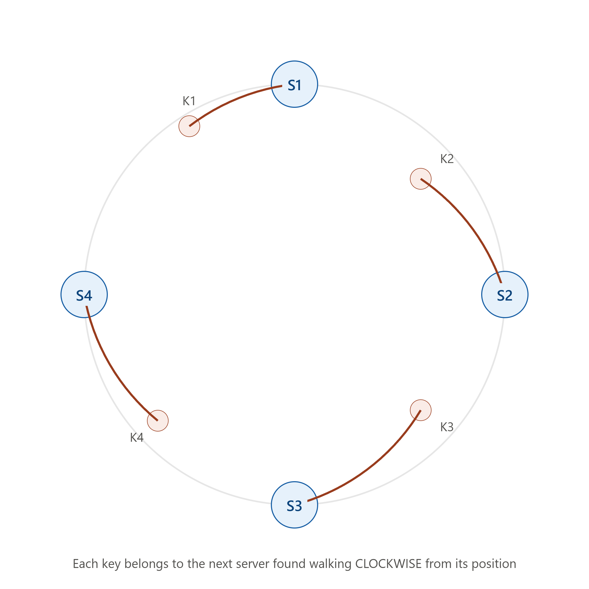
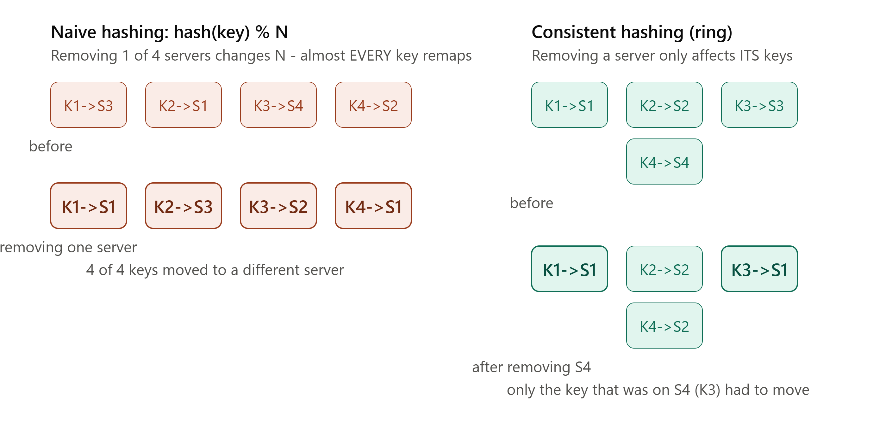

# DAY 11 — Sharding and Consistent Hashing

### (Range-based, Hash-based, Geo-based Sharding, and Consistent Hashing From Scratch)

> **Why this day matters:** Day 10's replication solved READ scalability and durability — but it did NOT solve what happens when your WRITE volume or total DATA SIZE outgrows what a single Leader machine can hold or handle, even with zero read traffic at all. That's what sharding solves. And consistent hashing — the algorithm at the heart of today's lesson — is one of the single most frequently asked, most elegant, and most widely-applicable algorithms in all of distributed systems. You'll understand it deeply, and build it yourself.

> Two diagrams were rendered above — refer to them throughout **Section 4** (the consistent hashing ring) and **Section 4.4** (the naive-vs-consistent remapping comparison, which is the entire REASON this algorithm exists).

---

## TABLE OF CONTENTS — DAY 11

1. What Is Sharding, and Why Replication Alone Isn't Enough
2. Range-Based Sharding
3. Hash-Based Sharding
4. Consistent Hashing — Deep Dive and Implementation
5. Geo-Based Sharding
6. The Hard Problems Sharding Introduces
7. Day 11 Cheat Sheet

---

## 1. WHAT IS SHARDING, AND WHY REPLICATION ALONE ISN'T ENOUGH

### What

Sharding (also called partitioning) is the practice of splitting your DATA itself across multiple database servers, where EACH server holds only a SUBSET of the total data — as opposed to replication (Day 10), where every server holds a COMPLETE copy of ALL the data.

### Why

Recall Day 10's Leader-Follower model: it solves READ scalability beautifully (spread reads across many Followers), but every single Follower still holds a FULL copy of the ENTIRE dataset, and — critically — ALL writes still funnel through the ONE Leader. If your WRITE volume exceeds what one Leader machine can handle, or your total DATA SIZE exceeds what fits comfortably on one machine's disk, replication alone cannot help — you need to split the data itself across multiple independent machines, each handling only ITS slice of both the writes AND the storage for that slice. This is sharding.

### Background

This need emerged from exactly the same internet-scale pressures discussed on Day 8 (the NoSQL movement) and Day 10 (replication) — Google's Bigtable and Amazon's Dynamo papers both describe sharding (often called "partitioning" in their terminology) as a CORE part of how they distribute enormous datasets across thousands of commodity machines, none of which individually could hold or serve the full dataset alone.

### How — The Core Challenge

The fundamental question sharding must answer, for EVERY single read or write request: **"given this particular piece of data (e.g., a specific user ID), WHICH shard (which specific server) actually holds it?"** This routing decision must be FAST, consistent (the same key must always map to the same shard, or your data becomes impossible to find), and ideally should distribute data EVENLY across all shards (so no single shard becomes a hot, overloaded outlier while others sit nearly empty). The next three sections cover the three main STRATEGIES for making this exact decision.

### How replication and sharding combine in real systems

These are NOT mutually exclusive — in fact, most large-scale real systems use BOTH together: data is SHARDED across many groups of servers (solving the write/storage scale problem), and WITHIN each shard, that shard's data is ALSO replicated using Day 10's Leader-Follower pattern (solving durability and read scaling WITHIN that shard). Picture, for example, 10 shards, each shard being its own Leader-Follower replica set — giving you both horizontal write/storage scaling (10 shards) AND durability/read-scaling within each one (replication).

### How to teach this

> "Replication is like having 5 identical, complete copies of the ENTIRE company's filing cabinet, so any one office burning down doesn't lose anything, and any employee can go to whichever copy is nearest them to read a file. Sharding is a completely different idea: instead of 5 complete copies, you have 5 DIFFERENT cabinets, each holding a DIFFERENT slice of the files — Cabinet A holds customers A-F, Cabinet B holds G-M, and so on. Now no single cabinet needs to hold the ENTIRE company's files, which matters once the company has grown too large for any one cabinet to physically fit everything. Real large companies usually do BOTH: multiple sharded cabinets, AND each cabinet has its own backup copies."

---

## 2. RANGE-BASED SHARDING



### What

Data is split across shards based on RANGES of a chosen key — e.g., users with IDs 1-1,000,000 go to Shard 1, users with IDs 1,000,001-2,000,000 go to Shard 2, and so on. Similarly, this could be based on alphabetical ranges (A-F, G-M, N-S, T-Z) or date ranges (January's data on Shard 1, February's on Shard 2).

### Why

The biggest advantage: **range queries remain efficient** — directly connecting back to Day 9's B+Tree lesson about why sorted-order range scans are valuable. If you need "all orders from March 2024," and your sharding scheme is date-range-based, you know EXACTLY which single shard to query — you don't need to ask EVERY shard and merge results.

### How

A central routing layer (or the application itself) maintains a mapping of key-ranges to shard servers, and consults this mapping to decide where to send each request.

### The Critical Weakness — Hotspots

Range-based sharding can create deeply uneven load if the key you're sharding by isn't evenly distributed in PRACTICE. The classic example: sharding by date range means whichever shard holds "TODAY's" date range receives ALL of today's new writes, while shards holding old historical dates sit nearly idle — a severe hotspot on exactly one shard, defeating the entire purpose of spreading load across multiple machines.

### Real-world example

HBase and early versions of MongoDB's sharding both support range-based partitioning — genuinely useful specifically when range queries are a dominant, important access pattern, and when you can either choose a key that's naturally evenly distributed, or actively manage/rebalance ranges over time to avoid the hotspot problem.

### Interview Angle

"What's the weakness of range-based sharding?" → hotspots, with the date-range example being the canonical, instantly understandable illustration.

---

## 3. HASH-BASED SHARDING

### What

Instead of using ranges, you run the sharding key through a HASH FUNCTION, and use the resulting hash value (typically `hash(key) % number_of_shards`) to decide which shard a given piece of data belongs to.

### Why

This directly solves Range-based sharding's hotspot weakness: a good hash function scrambles input values into seemingly random, evenly-spread output values — meaning even if your actual keys are NOT naturally evenly distributed (e.g., sequential user IDs, or skewed-toward-today's-date timestamps), the HASHES of those keys will be evenly spread across all shards, giving you genuinely balanced load distribution.

### How

```
shardIndex = hash(key) % numberOfShards
```

For example, with 4 shards: `hash("user_12345") % 4` might give `2` — meaning that user's data always lives on Shard 2 (as long as `numberOfShards` never changes — see the critical weakness below).

### The Critical Weakness — Exactly What the Diagrams Rendered Above This Lesson Show

Look at the **naive-vs-consistent remapping diagram** rendered earlier: if you ever need to ADD or REMOVE a shard (because your data has grown, or a server failed), the `numberOfShards` value in `hash(key) % numberOfShards` CHANGES — and because the modulo operation's result depends entirely on this number, changing it causes **almost EVERY single key to map to a DIFFERENT shard than before**. This means adding or removing just ONE server from a 4-server cluster could require re-shuffling (physically moving) nearly 100% of your entire dataset across the network to its new "correct" shard — a massive, slow, expensive, disruptive operation, especially for a system holding terabytes of data, exactly the kind of operation you'd want to AVOID needing whenever your cluster size changes even slightly.

### Interview Angle

"What problem does naive hash-based sharding have when you add or remove a server?" → near-total data reshuffling, because the modulo's divisor changes. This is THE exact, expected setup question that leads directly into consistent hashing (Section 4) as the solution.

### How to teach this

> "Imagine sorting students into 4 groups using `(student's ID number) % 4`. This works fine, perfectly evenly, until a 5th group gets added — and suddenly almost EVERY student's `% 5` result is different from their old `% 4` result, meaning nearly the entire school has to physically walk to a new classroom. That's the exact problem. We need a smarter scheme where adding ONE new classroom only moves a SMALL, proportional number of students — not nearly everyone."

---

## 4. CONSISTENT HASHING — DEEP DIVE AND IMPLEMENTATION



### What

Consistent hashing is a hashing scheme specifically designed so that adding or removing a shard/server only requires remapping a SMALL, proportional fraction of keys (roughly `1/N` of the total, where N is the number of servers) — NOT nearly the entire dataset, solving Section 3's critical weakness directly. Refer to BOTH diagrams rendered above this lesson throughout this section.

### Why this specific, clever idea matters so much

Consistent hashing isn't just useful for database sharding — you've actually ALREADY encountered a simplified PREVIEW of this exact idea back on **Day 4**, when discussing the "IP Hash" load balancing algorithm's weakness (recall: it doesn't gracefully handle servers being added/removed either). Consistent hashing is the SOPHISTICATED, properly engineered solution to that exact same general class of problem — "map keys to servers, evenly, in a way that survives the server pool changing size" — and it shows up repeatedly across distributed systems: database sharding (today's focus), distributed caching (Memcached famously popularized this technique), CDN routing, and more. This is genuinely one of the highest-leverage algorithms to deeply understand in this entire 30-day course.

### Background

Consistent hashing was introduced in a **1997 academic paper** by Karger et al., originally designed for distributed web caching systems (specifically to solve exactly the cache-server-pool-resizing problem) — and was famously, prominently adopted in **Amazon's Dynamo paper (2007)**, the same paper that, as discussed Day 8 and Day 10, shaped an enormous amount of modern NoSQL and leaderless-replication thinking. It has since become one of the most widely re-implemented algorithms across distributed databases (Cassandra, DynamoDB) and distributed caches (Memcached) industry-wide.

### How — The Hash Ring (refer to the first diagram rendered above this lesson)

1. Imagine a circular number line (a "ring") representing the full output range of a hash function (e.g., 0 to some very large maximum value, then wrapping back around to 0).
2. Each SERVER is placed at a specific position on this ring, by hashing the server's identifier (e.g., its IP address or name) — `position = hash(serverId)`.
3. Each KEY (e.g., a user ID, a cache key) is ALSO placed on the SAME ring, by hashing the key itself — `position = hash(key)`.
4. **The assignment rule**: a key belongs to whichever SERVER is the NEXT one found walking CLOCKWISE around the ring from that key's position. (Look at the first diagram: K1 walks clockwise and lands on S1; K2 walks clockwise and lands on S2; and so on.)

### How adding/removing a server only affects a small slice (refer to the SECOND diagram rendered above this lesson)

**When a server is REMOVED** (e.g., S4 in the second diagram): only the keys that WERE assigned to S4 (the keys sitting in the ring-segment immediately counter-clockwise of S4's old position) need to be reassigned — they simply move to whichever server is now the NEXT one clockwise (in the example, that's S1). EVERY OTHER key, anywhere else on the ring, is COMPLETELY UNAFFECTED — their "next server clockwise" never changed, because nothing about their specific neighborhood of the ring changed. Compare this DIRECTLY to the naive hashing diagram right next to it, where removing one server reshuffled ALL 4 keys — consistent hashing reshuffled only 1.

**When a server is ADDED**: similarly, only the keys that fall into the NEW server's section of the ring (between the new server's position and the PREVIOUS server going counter-clockwise) get reassigned to it — pulled away from whichever server was previously responsible for that entire stretch. Again, every other key elsewhere on the ring is untouched.

### The Refinement: Virtual Nodes

A real, practical problem with the basic scheme above: if you only place EACH physical server at ONE single position on the ring, the ring segments can end up very UNEVEN by sheer chance (one server might happen to "own" a much larger arc of the ring than another, purely from where their hash values happened to land) — leading to uneven load even with consistent hashing's improved remapping behavior. The standard fix: give each PHYSICAL server MULTIPLE positions on the ring (called **virtual nodes**, often 100-200+ per physical server), each one independently hashed (e.g., `hash("server1-vnode1")`, `hash("server1-vnode2")`, etc.) — spreading each physical server's "true" responsibility across MANY small arcs scattered around the ring, rather than one single large arc, which averages out to a much more EVENLY balanced load distribution across all physical servers, even though each one is now represented by many scattered virtual points rather than just one.

### Implementation — Consistent Hashing From Scratch in Node.js

```js
const crypto = require("crypto");

class ConsistentHashRing {
  constructor(virtualNodesPerServer = 150) {
    this.virtualNodesPerServer = virtualNodesPerServer;
    this.ring = new Map(); // hash position -> serverId
    this.sortedPositions = []; // kept sorted for efficient lookup
  }

  _hash(input) {
    // Hash to a number we can place on the ring - using the first 8 hex
    // characters of an MD5 hash, converted to an integer, is a common,
    // simple approach for this kind of exercise
    const hash = crypto.createHash("md5").update(input).digest("hex");
    return parseInt(hash.substring(0, 8), 16);
  }

  addServer(serverId) {
    for (let i = 0; i < this.virtualNodesPerServer; i++) {
      const position = this._hash(`${serverId}-vnode-${i}`);
      this.ring.set(position, serverId);
    }
    this._rebuildSortedPositions();
    console.log(
      `Added server: ${serverId} (${this.virtualNodesPerServer} virtual nodes)`,
    );
  }

  removeServer(serverId) {
    for (let i = 0; i < this.virtualNodesPerServer; i++) {
      const position = this._hash(`${serverId}-vnode-${i}`);
      this.ring.delete(position);
    }
    this._rebuildSortedPositions();
    console.log(`Removed server: ${serverId}`);
  }

  _rebuildSortedPositions() {
    this.sortedPositions = Array.from(this.ring.keys()).sort((a, b) => a - b);
  }

  // The core lookup: given a key, find which server it belongs to,
  // by walking CLOCKWISE (i.e., finding the next position >= the key's hash)
  getServerForKey(key) {
    if (this.sortedPositions.length === 0) return null;

    const keyHash = this._hash(key);

    // Binary search for the first ring position >= keyHash (clockwise lookup)
    let low = 0,
      high = this.sortedPositions.length - 1;
    while (low < high) {
      const mid = Math.floor((low + high) / 2);
      if (this.sortedPositions[mid] < keyHash) low = mid + 1;
      else high = mid;
    }

    // If we walked past the end of the ring, wrap around to position 0
    // (this is what makes it a RING, not just a line)
    const position =
      this.sortedPositions[low] >= keyHash
        ? this.sortedPositions[low]
        : this.sortedPositions[0];

    return this.ring.get(position);
  }
}

// --- Demonstration: showing the SAME property illustrated in the diagrams ---
const ring = new ConsistentHashRing();
ring.addServer("ServerA");
ring.addServer("ServerB");
ring.addServer("ServerC");
ring.addServer("ServerD");

const testKeys = ["user_1", "user_2", "user_3", "user_4", "user_5", "user_6"];

console.log("\n--- Assignments with 4 servers ---");
const before = {};
testKeys.forEach((key) => {
  before[key] = ring.getServerForKey(key);
  console.log(`${key} -> ${before[key]}`);
});

console.log("\n--- Removing ServerB ---");
ring.removeServer("ServerB");

console.log("\n--- Assignments with 3 servers ---");
let movedCount = 0;
testKeys.forEach((key) => {
  const after = ring.getServerForKey(key);
  const moved = after !== before[key];
  if (moved) movedCount++;
  console.log(`${key} -> ${after}${moved ? "  (MOVED)" : "  (unchanged)"}`);
});

console.log(
  `\n${movedCount} out of ${testKeys.length} keys moved (expect roughly 1/4, NOT all of them)`,
);
```

**What running this actually demonstrates**: only the keys that were specifically assigned to `ServerB` will show `(MOVED)` after it's removed — everything else prints `(unchanged)`, EXACTLY matching the second diagram rendered above this lesson. This is the live, working proof of the entire point of this algorithm — try running it yourself and confirm the count is roughly 1/4 of your test keys (since we started with 4 servers), not anywhere close to all of them, which is exactly what naive `hash % N` sharding would have produced instead.

### Real-world example

**Memcached** clients widely use consistent hashing to decide which cache server holds which key, specifically so that adding/removing a cache server doesn't invalidate/relocate the ENTIRE cache (which would otherwise cause a massive, sudden wave of cache misses hitting your database all at once — connecting back to Day 5's caching lesson). **Cassandra** and **DynamoDB** use consistent hashing as their core mechanism for distributing data across nodes in a cluster — this is genuinely the SAME algorithm you just built, running inside real, production, planet-scale databases.

### Interview Angle

"Implement consistent hashing" or "How would you design a system that can add/remove cache servers without massive disruption?" — be ready to explain the ring concept, the clockwise-lookup rule, AND the virtual nodes refinement (many candidates know the basic ring idea but forget virtual nodes, which is usually the exact follow-up question that distinguishes a complete answer).

### How to teach this

> "Imagine a circular seating arrangement at a huge round table (the ring), and you assign each waiter (server) a few RANDOM seats around the table (virtual nodes) rather than just one seat each — this way, each waiter ends up covering several small, scattered sections instead of one big continuous one, which evens things out. Every customer (key) is also assigned a seat, and 'their waiter' is simply whoever's nearest seat is the next one going clockwise. If ONE waiter goes home sick (server removed), only the customers who were specifically sitting near THAT waiter's seats need a new waiter — everyone else at the table is completely undisturbed, because their nearest clockwise waiter never changed."

---

## 5. GEO-BASED SHARDING

### What

Data is partitioned based on the GEOGRAPHIC LOCATION it's associated with — e.g., all European users' data lives on shards physically located in European data centers, all US users' data lives on shards in US data centers.

### Why

This directly combines TWO benefits you've already learned: reduced latency (Day 2/5 — data physically closer to the user it belongs to is faster to access) AND, often, **regulatory compliance** — many countries/regions have data residency laws (e.g., GDPR-related requirements in the EU) requiring certain categories of personal data to be physically stored within specific geographic/legal boundaries. Geo-based sharding can satisfy BOTH the performance motivation and the legal requirement simultaneously.

### How

Similar in spirit to Day 10's multi-leader replication discussion (and often used TOGETHER with it) — a routing layer determines a user's region (often from their account settings, IP-derived location from Day 2, or explicit data-residency requirements) and routes their data to the shard physically located in/serving that region.

### Real-world example

Large global platforms (social media, SaaS companies serving EU customers) very commonly implement geo-based sharding specifically to comply with regulations requiring EU citizens' personal data to remain stored within the EU — this is a genuinely common, real, legally-mandated system design requirement in the industry today, not just a performance optimization.

### Trade-offs

- **Pro**: Lower latency for users (data is physically nearby), satisfies data residency/compliance requirements.
- **Con**: Uneven shard sizes if user populations are uneven across regions (a hotspot risk, similar in spirit to range-based sharding's weakness), and cross-region queries (e.g., "show me data spanning both a US and EU user") become genuinely more complex, since the relevant data now lives on physically separate, possibly geographically distant shards.

### Interview Angle

"How would you handle data residency requirements for EU users?" → geo-based sharding is the direct, expected answer, and proactively mentioning the regulatory (not just performance) motivation shows real-world awareness beyond pure technical optimization.

---

## 6. THE HARD PROBLEMS SHARDING INTRODUCES

Briefly previewing problems that sharding creates, which later days/weeks address in full depth — it's important to know these exist, even before the full solutions are covered:

1. **Cross-shard queries/JOINs become genuinely hard.** If `users` are sharded by user ID, but you need "all orders across ALL users placed yesterday," that data might be scattered across EVERY shard — requiring you to query all of them and merge results in your application code, since the database itself can no longer do a simple JOIN across shard boundaries.
2. **Cross-shard transactions become genuinely hard.** Recall Day 8's ACID Atomicity guarantee — that guarantee was scoped to a SINGLE database. If a single logical operation needs to update data on TWO different shards atomically (all-or-nothing), you need specialized distributed transaction techniques — covered in full on **Day 13** (Two-Phase Commit, Saga Pattern).
3. **Resharding (changing the number of shards later) is operationally complex**, even WITH consistent hashing minimizing the disruption — it still requires carefully, safely moving real data between live servers without losing anything or causing downtime.
4. **Choosing the right shard key is a critical, hard-to-reverse decision.** Pick poorly (e.g., a key that's NOT evenly distributed in practice, recreating Section 2's hotspot problem even with hash-based sharding, if your hash input itself is skewed) and you can end up with a severely unbalanced system that's painful to fix later.

### Interview Angle

A senior-level system design answer PROACTIVELY raises at least one or two of these challenges when proposing sharding, rather than presenting sharding as a clean, consequence-free solution — exactly the same "name your own trade-offs" instinct demonstrated throughout this entire course (Day 1's framework, Day 7's capstone).

---

## 7. DAY 11 CHEAT SHEET

```
SHARDING vs REPLICATION
  Replication = EVERY server holds a FULL copy (Day 10: durability + read scale)
  Sharding    = EACH server holds a SLICE of the data (write scale + storage scale)
  Real systems use BOTH together: N shards, each shard internally replicated

RANGE-BASED SHARDING
  Split by key RANGES (ID ranges, alphabetical, date ranges)
  Pro: efficient range queries (one shard, not all of them)
  Weakness: HOTSPOTS if the range isn't evenly accessed (e.g., "today" shard)

HASH-BASED SHARDING (naive)
  shardIndex = hash(key) % numberOfShards
  Pro: evenly distributes even skewed keys
  Weakness: changing numberOfShards reshuffles NEARLY ALL keys (modulo changes)

CONSISTENT HASHING (the fix)
  Ring of hash positions; each key belongs to the next server CLOCKWISE
  Adding/removing ONE server only remaps ~1/N of keys, not everything
  Virtual nodes (100-200+ per physical server) -> even load distribution
  Used by: Memcached, Cassandra, DynamoDB
  Also solves Day 4's IP-hash load balancer weakness - same core idea

GEO-BASED SHARDING
  Split by geographic region - lower latency + data residency/compliance (GDPR)
  Weakness: uneven regional population sizes, harder cross-region queries

HARD PROBLEMS SHARDING INTRODUCES (preview, solved later in the course)
  Cross-shard JOINs - app must query multiple shards and merge
  Cross-shard transactions - needs 2-Phase Commit or Saga Pattern (Day 13)
  Resharding is operationally complex even with consistent hashing
  Choosing the wrong shard key is a costly, hard-to-reverse mistake
```

---

### What's next (Day 12 preview)

Tomorrow is one of the single most important theoretical foundations in all of distributed systems: the **CAP Theorem** — formally proving WHY you can't have perfect Consistency, Availability, and Partition tolerance simultaneously, the related **PACELC theorem** (an important, often-missed extension), and the spectrum of **Consistency Models** (Strong, Eventual, Causal). We'll look at exactly where real systems — DynamoDB, Cassandra, MongoDB — position themselves on this spectrum, and why, tying together almost everything from Days 8-11 into one unifying theoretical framework.

**Say "Day 12" whenever you're ready.**
