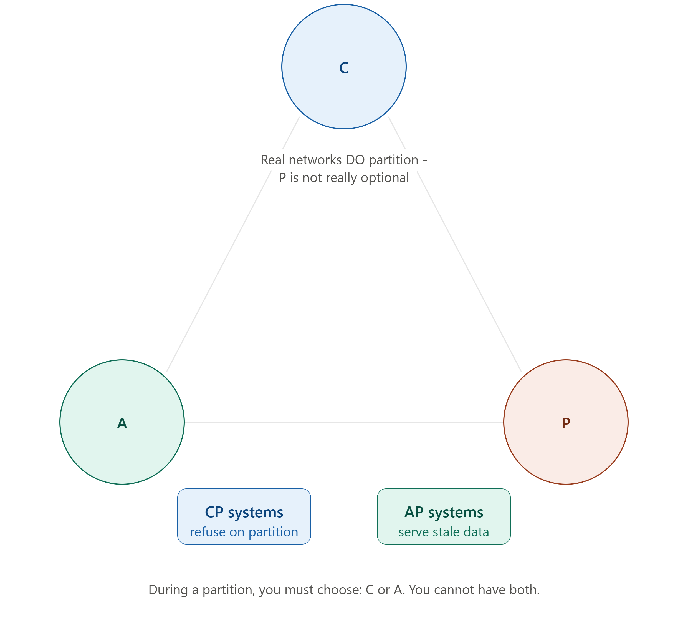

# DAY 12 — CAP Theorem, PACELC, and Consistency Models

### (The Theoretical Foundation Tying Together Days 8–11)

> **Why this day matters:** Every choice you made across Days 8-11 — SQL vs NoSQL, which replication topology, sync vs async, leaderless quorums — was secretly a decision about ONE underlying trade-off. Today gives you the formal theory that explains WHY that trade-off is mathematically unavoidable, not just an engineering inconvenience. Once you understand CAP and PACELC, you'll be able to look at ANY database (DynamoDB, Cassandra, MongoDB, PostgreSQL) and immediately understand WHERE it sits and WHY — and you'll never again confuse "consistency" in this distributed-systems sense with "consistency" in Day 8's ACID sense (a common, costly interview mix-up).

> The triangle diagram rendered above this lesson is the visual anchor for Section 1 — refer back to it throughout.

---

## TABLE OF CONTENTS — DAY 12

1. The CAP Theorem — What, Why, Background, How
2. Why "Pick 2 of 3" Is Misleading — The Real Choice Is C or A During a Partition
3. CP Systems vs AP Systems — Real Examples
4. The PACELC Theorem — The Extension Most People Miss
5. Consistency Models — Strong, Eventual, Causal
6. Where Real Databases Position Themselves (and Why)
7. Implementation — Simulating the CAP Trade-off in Node.js
8. Day 12 Cheat Sheet

---

## 1. THE CAP THEOREM



### What

The CAP theorem states that any distributed data system can provide AT MOST TWO of the following three guarantees SIMULTANEOUSLY, but never all three at once:

- **Consistency (C)**: Every read receives the MOST RECENT write, or an error — every node in the system sees the SAME data at the SAME time. (Important: this is a DIFFERENT, stricter meaning of "consistency" than Day 8's ACID "C" — more on this critical distinction in Section 1's "How" below.)
- **Availability (A)**: Every request to a non-failing node receives a (non-error) response — the system keeps responding, even if it can't guarantee that response is the absolute latest data.
- **Partition Tolerance (P)**: The system continues to operate even when network communication between nodes is broken or delayed (a "network partition" — some nodes simply cannot talk to other nodes for some period of time).

### Why this matters

Every single distributed database, replication scheme, and consistency setting you've learned across Days 8-11 (Leader-Follower vs Leaderless replication, sharding, quorum reads/writes) is, underneath, a specific position taken on EXACTLY this trade-off. Understanding CAP gives you the vocabulary and mental model to instantly understand WHY any given database behaves the way it does, instead of memorizing each database's behavior as an unrelated, isolated fact.

### Background

The CAP theorem was first proposed informally by computer scientist **Eric Brewer in a 2000 keynote speech**, and was later formally proven as a theorem by Seth Gilbert and Nancy Lynch in **2002**. It became hugely influential during exactly the period (mid-to-late 2000s) when companies were grappling with the NoSQL/distributed-systems questions covered on Day 8 and Day 10 — CAP gave the industry a shared, rigorous vocabulary for discussing WHY certain databases made certain design choices, replacing what had previously been a much vaguer, less precise conversation.

### How — The Critical Clarification: "Partition Tolerance" Isn't Really a CHOICE

Here's the single most important nuance, and the thing that trips up almost everyone learning CAP for the first time: **in any REAL distributed system spanning multiple machines/networks, network partitions WILL eventually happen** — a cable gets cut, a router fails, a data center loses connectivity, a network has a temporary hiccup. This is a fact of physical reality, not a choice you get to opt out of. **So the real, practical choice CAP describes is NOT "pick any 2 of 3" — it's specifically: "WHEN a partition inevitably happens, do you sacrifice Consistency, or do you sacrifice Availability?"** This is exactly why the diagram rendered above this lesson shows P sitting almost as a "given," with the REAL decision being the C-vs-A line directly between the other two corners.

### How to teach this

> "Imagine two bank branches (two nodes in a distributed system) that normally talk to each other constantly to stay in sync. Now imagine the phone line between them goes dead for an hour (a network partition — this WILL happen eventually, in any real system, it's not optional). During that hour, a customer walks into Branch A and tries to withdraw money. Branch A has two choices, and ONLY two: (1) REFUSE the withdrawal, because it can't confirm with Branch B that this won't cause an overdraft — sacrificing Availability to protect Consistency. Or (2) ALLOW the withdrawal based on its own last-known information, risking that Branch B might have ALSO allowed a conflicting withdrawal during the same outage — sacrificing strict Consistency to protect Availability. There is no third option where the customer gets served AND the two branches are guaranteed perfectly in sync, while the phone line is down. That's the entire CAP theorem, in one scenario."

---

## 2. WHY "PICK 2 OF 3" IS MISLEADING — THE REAL CHOICE IS C OR A DURING A PARTITION

### What

The popular shorthand "CAP means you pick 2 of the 3 letters" is a useful MEMORY AID but is technically imprecise, and can lead to confused thinking if taken too literally — Section 1's "How" already explained why. This section makes the practical implication completely explicit.

### Why this precision matters for interviews specifically

Interviewers actively listen for whether a candidate understands this nuance — saying "this database is AP, so it gives up Partition tolerance" is a **direct, embarrassing, common mistake** (it's backwards — AP systems give up Consistency, not Partition tolerance; ALL serious distributed systems must handle partitions, since refusing to would mean simply not working at all whenever any network hiccup occurs). The correct framing: **"CP systems sacrifice Availability during a partition. AP systems sacrifice Consistency during a partition. ALL real distributed systems must handle partition tolerance, because partitions are a fact of physical networks — you don't get to skip P."**

### How — Restating the actual decision tree

1. Is your system distributed across multiple nodes/networks? (If genuinely no — a single machine — CAP doesn't apply at all; this entire theorem is specifically about DISTRIBUTED systems.)
2. Given that partitions WILL happen eventually (an unavoidable fact), when one occurs, does your system:
   - (a) Refuse to serve some requests until the partition heals, to guarantee every response reflects the latest data → **you've chosen CP** (Consistency over Availability).
   - (b) Continue serving requests from whichever nodes ARE reachable, accepting that some of those responses might be stale/outdated until the partition heals → **you've chosen AP** (Availability over Consistency).

### Interview Angle

"Explain the CAP theorem" → give the three definitions, BUT immediately follow with the partition-tolerance clarification above — this single addition is what separates a memorized-definition answer from a genuinely understood one.

---

## 3. CP SYSTEMS vs AP SYSTEMS — REAL EXAMPLES

### CP Systems (Consistency over Availability)

**What this looks like in practice**: during a network partition, the system will return an ERROR (or simply hang/time out) rather than risk returning potentially-stale or conflicting data.

**Why you'd choose this**: for data where returning a WRONG answer is worse than returning NO answer — recall Day 8's bank transfer example. If your account balance check might be wrong during a partition, it's safer to refuse to answer than to confidently tell someone an incorrect number they might act on.

**Real-world examples**: Traditional relational databases configured with synchronous replication (Day 10) lean CP — they'll often refuse a write if they can't confirm it's been safely replicated. **HBase**, **MongoDB** (in many of its default configurations, particularly for a given shard's primary), and **Zookeeper** (a coordination service used heavily in distributed systems infrastructure) are commonly cited as CP-leaning systems.

### AP Systems (Availability over Consistency)

**What this looks like in practice**: during a network partition, the system continues responding to requests using whatever data each reachable node currently has, even if that means different nodes might give different, conflicting answers until the partition heals and they resynchronize.

**Why you'd choose this**: for data where ALWAYS getting SOME answer matters more than that answer being perfectly up-to-the-millisecond — recall the connection to Day 10's leaderless replication discussion, and specifically Amazon's famous motivation: a shopping cart should ALWAYS let you add an item, even during a partition, rather than showing an error — worst case, you sort out a minor conflict (e.g., merge duplicate cart entries) once connectivity is restored, which is a far better customer experience than refusing the request outright.

**Real-world examples**: **Cassandra** and **DynamoDB** (both already discussed Day 8/10 as leaderless-replication NoSQL systems) are classic, deliberately-designed AP systems. **CouchDB** is another commonly cited example.

### A Crucial Nuance: Many Modern Databases Are TUNABLE

This is genuinely important and often missed: many real production NoSQL databases (Cassandra and DynamoDB especially) aren't PERMANENTLY locked into being purely CP or purely AP — recall Day 10's quorum (W/R/N) discussion. By adjusting the quorum settings (how many nodes must confirm a read/write), you can shift the SAME underlying database CLOSER to CP behavior (require more nodes to agree, sacrificing some availability for more consistency) or CLOSER to AP behavior (require fewer nodes, prioritizing availability) — **CAP positioning is often a CONFIGURABLE DIAL, not a fixed, unchangeable property of "this database = CP" or "that database = AP."**

### Interview Angle

"Is MongoDB CP or AP?" — the strong, nuanced answer acknowledges it depends on configuration (read/write concern settings) rather than confidently declaring one fixed label — showing you understand the "tunable dial" nuance above, rather than having memorized a simplistic, sometimes-wrong label for each named database.

---

## 4. THE PACELC THEOREM — THE EXTENSION MOST PEOPLE MISS

### What

PACELC (pronounced "pass-elk") is an extension of CAP, proposed to address a real gap: **CAP only describes what happens DURING a network Partition. But what about NORMAL operation, when there's no partition at all?** PACELC states: **"if there is a Partition (P), how do you trade off Availability (A) and Consistency (C)? Else (E), when the system is running normally with no partition, how do you trade off Latency (L) and Consistency (C)?"**

### Why this extension genuinely matters

CAP alone gives the impression that consistency trade-offs ONLY matter during the relatively rare event of a network partition — but in reality, even during PERFECTLY NORMAL operation (no partition at all), there's STILL a meaningful trade-off between consistency and LATENCY (Day 6 concept!). Recall Day 10's Synchronous vs Asynchronous replication discussion: even with zero network partition happening, WAITING for a Follower to confirm a write (synchronous, more consistent) takes longer than NOT waiting (asynchronous, faster, but a brief window of potential inconsistency exists) — this trade-off exists EVERY SINGLE DAY, in totally normal operation, not just during rare outages.

### Background

PACELC was proposed by **Daniel Abadi in 2010**, specifically because he observed that CAP's narrow focus on partition-time behavior was causing people to under-appreciate the EQUALLY important, much more FREQUENTLY relevant latency-consistency trade-off that applies during normal, partition-free operation — which, for most systems, is the vast majority of the time.

### How — Classifying Systems Using PACELC

A system's full PACELC classification has TWO parts:

- **First part (during Partition)**: PA (prioritize Availability) or PC (prioritize Consistency) — this is exactly CAP's C-vs-A choice from Sections 1-3.
- **Second part (Else, normal operation)**: EL (prioritize Latency) or EC (prioritize Consistency) — this is the NEW dimension PACELC adds, directly connecting to Day 10's sync/async replication trade-off.

**Examples**:

- **DynamoDB** is typically classified as **PA/EL**: during a partition, prioritizes availability (consistent with Section 3's AP description); during normal operation, ALSO prioritizes low latency over strict consistency (e.g., its default read behavior favors speed over guaranteed-absolute-latest data, though — exactly like Section 3's nuance — this is configurable).
- **MongoDB** (in many configurations) is often classified as **PC/EC**: prioritizes consistency both during partitions AND during normal operation, generally accepting higher latency as the cost.
- Traditional relational databases using SYNCHRONOUS replication (Day 10) are leaning **PC/EC** — consistency prioritized both during partitions and in normal day-to-day operation.

### Interview Angle

Mentioning PACELC, UNPROMPTED, after explaining CAP, is one of the single clearest signals of genuine depth versus surface-level memorization in a system design interview — very few candidates know this extension exists, and bringing it up naturally (e.g., "...and beyond CAP, there's also PACELC, which captures the latency-consistency trade-off that exists even WITHOUT a partition, which is honestly the more common scenario in day-to-day operation") demonstrates real command of the topic.

### How to teach this

> "CAP is about the rare emergency — what happens during a power outage. PACELC adds the EVERYDAY question: even when the power is working completely fine, do you want your lights to turn on the INSTANT you flip the switch (low latency), or are you willing to wait half a second while the system double-checks with every other room in the house that nothing's gone wrong first (strong consistency)? That second question matters every single day, not just during rare emergencies — which is exactly why PACELC exists alongside CAP."

---

## 5. CONSISTENCY MODELS — STRONG, EVENTUAL, CAUSAL

### What

Beyond the binary "Consistency vs Availability" framing of CAP, real systems actually offer a SPECTRUM of more nuanced consistency guarantees, called consistency models — describing PRECISELY what guarantees you get about how quickly, and in what order, writes become visible to readers.

### 5.1 — Strong Consistency

**What**: Every read reflects the most recent write, immediately, with no delay — as if there were only ONE copy of the data, even though it's actually distributed across multiple nodes.
**Why**: Required for data where ANY staleness is unacceptable — recall Day 7's URL shortener explicitly choosing strong consistency for the short-code-to-URL mapping (redirecting to a wrong/missing URL is unacceptable), and Day 8's bank transfer example.
**Trade-off**: Achieving this typically requires the synchronous coordination discussed in Day 10 (waiting for confirmation across nodes) — directly costing LATENCY (the PACELC "Else" trade-off from Section 4) and sometimes AVAILABILITY (the CAP trade-off from Sections 1-3), since you may need to refuse requests when that coordination can't complete.

### 5.2 — Eventual Consistency

**What**: If no new writes occur, ALL replicas will EVENTUALLY converge to the same value — but there's no guarantee about exactly HOW LONG "eventually" takes, and in the meantime, different reads might return different (stale) answers.
**Why**: This is exactly the model behind asynchronous replication (Day 10) and AP systems (Section 3) — accepting a temporary, bounded window of potential staleness in exchange for much better availability and latency. Recall Day 1 and Day 7's repeated examples: a "like" count, a view counter, a click count — these are PERFECT candidates for eventual consistency, since a few seconds of staleness has essentially zero real-world cost.
**Trade-off**: Application code sometimes needs to be specifically designed to tolerate or gracefully handle momentarily-stale reads (recall Day 10's "read-your-own-writes" problem and its fix).

### 5.3 — Causal Consistency

**What**: A middle ground between the two extremes above — it guarantees that operations which are CAUSALLY RELATED (one happened because of, or after seeing, another) are seen by everyone in the SAME relative order, even though COMPLETELY UNRELATED operations might be seen in different orders by different observers, without any real-world problem.
**Why**: Many real scenarios don't actually need FULL strong consistency (which is expensive) but DO need to avoid certain specific, jarring inconsistencies. Classic example: in a social media comment thread, if User A posts a comment, and User B then REPLIES to that comment, every single viewer must see A's comment BEFORE B's reply (the causal relationship — B's reply literally doesn't make sense without A's comment existing first). But two completely UNRELATED comments on the SAME post, posted at roughly the same time by two different unrelated users, can reasonably be seen in slightly different orders by different viewers, with zero actual problem.
**How**: Implementing this typically involves tracking causal dependencies between operations (e.g., using "vector clocks" or similar mechanisms — an advanced implementation detail beyond today's scope, but the CONCEPT is what matters for interview-level understanding) to ensure causally-dependent writes are always applied/displayed in the correct relative order, while unrelated writes are free to be reordered without consequence.

### Comparison Table

| Model    | Guarantee                                                             | Cost                                        | Good for                                             |
| -------- | --------------------------------------------------------------------- | ------------------------------------------- | ---------------------------------------------------- |
| Strong   | Always see the latest write, instantly                                | Highest latency, can sacrifice availability | Financial data, inventory, the URL-shortener mapping |
| Causal   | Causally-related ops seen in correct order; unrelated ops can reorder | Moderate                                    | Comment threads, social feeds, collaborative editing |
| Eventual | Eventually converges, no ordering/timing guarantee                    | Lowest latency, highest availability        | Like counts, view counts, analytics, caches          |

### Interview Angle

"What consistency model would you use for X?" — a strong answer doesn't just say "eventual consistency" reflexively for everything; it correctly identifies cases needing genuinely STRONG consistency (money, inventory, unique-code mappings), cases where CAUSAL consistency specifically matters (anything with a reply/thread/ordering relationship), and cases where EVENTUAL consistency is perfectly fine (counters, analytics) — exactly mirroring Day 7's URL shortener lesson about applying DIFFERENT consistency requirements to DIFFERENT pieces of data within the SAME system.

---

## 6. WHERE REAL DATABASES POSITION THEMSELVES (AND WHY)

| Database                                               | CAP leaning                             | PACELC                                                   | Why                                                                                                                                                       |
| ------------------------------------------------------ | --------------------------------------- | -------------------------------------------------------- | --------------------------------------------------------------------------------------------------------------------------------------------------------- |
| **PostgreSQL/MySQL** (single Leader, sync replication) | CP                                      | PC/EC                                                    | Prioritizes correctness; traditional relational guarantees (Day 8's ACID)                                                                                 |
| **MongoDB** (typical config)                           | CP (tunable)                            | PC/EC (tunable)                                          | Strong consistency by default for a given shard's primary; configurable read/write concerns                                                               |
| **Cassandra**                                          | AP (tunable via quorum)                 | PA/EL (tunable)                                          | Built for massive availability/scale (Day 10's leaderless model); quorum settings let you dial toward more consistency if needed                          |
| **DynamoDB**                                           | AP (tunable)                            | PA/EL (tunable, has a "strongly consistent read" option) | Same Amazon Dynamo lineage as Cassandra; offers an explicit choice between eventually-consistent (default, cheaper, faster) and strongly-consistent reads |
| **Redis** (single instance)                            | N/A (not really distributed by default) | Effectively strong, very low latency                     | Single-node by default; Redis Cluster introduces its own distributed trade-offs                                                                           |

### How to teach this

> "You can now read ANY database's marketing page or documentation and immediately decode what they actually mean. When DynamoDB says 'choose between eventually consistent reads and strongly consistent reads,' you now know EXACTLY what's happening underneath: it's a tunable dial between the AP and CP ends of the very same spectrum we just learned, and the 'eventually consistent' option is faster specifically because it's not paying the latency cost of cross-node coordination."

---

## 7. IMPLEMENTATION — SIMULATING THE CAP TRADE-OFF IN NODE.JS

A simplified simulation showing exactly how a CP-style vs AP-style system behaves differently during a simulated network partition:

```js
class SimulatedNode {
  constructor(id) {
    this.id = id;
    this.data = new Map();
    this.isPartitioned = false;
  }
  write(key, value) {
    this.data.set(key, { value, timestamp: Date.now() });
  }
  read(key) {
    return this.data.get(key);
  }
}

class DistributedStore {
  constructor(nodes, mode) {
    this.nodes = nodes; // array of SimulatedNode
    this.mode = mode; // 'CP' or 'AP'
  }

  write(key, value) {
    const reachableNodes = this.nodes.filter((n) => !n.isPartitioned);

    if (this.mode === "CP") {
      // CP: require ALL nodes to confirm, refuse if any are unreachable
      // (a simplified stand-in for requiring a full/majority quorum, Day 10)
      if (reachableNodes.length < this.nodes.length) {
        throw new Error(
          "CP mode: cannot guarantee consistency during partition - write REFUSED",
        );
      }
      this.nodes.forEach((n) => n.write(key, value));
      return { success: true, mode: "CP", confirmedBy: this.nodes.length };
    }

    if (this.mode === "AP") {
      // AP: write to whichever nodes ARE reachable, accept the rest will catch up later
      reachableNodes.forEach((n) => n.write(key, value));
      return {
        success: true,
        mode: "AP",
        confirmedBy: reachableNodes.length,
        totalNodes: this.nodes.length,
      };
    }
  }

  read(key) {
    const reachableNodes = this.nodes.filter((n) => !n.isPartitioned);
    if (reachableNodes.length === 0)
      throw new Error("No reachable nodes - cannot serve read at all");
    // Just reads from the first reachable node - in AP mode this could be stale
    return reachableNodes[0].read(key);
  }
}

// --- Demonstration ---
const nodes = [
  new SimulatedNode("N1"),
  new SimulatedNode("N2"),
  new SimulatedNode("N3"),
];

console.log("--- Simulating a network partition: N3 becomes unreachable ---");
nodes[2].isPartitioned = true;

const cpStore = new DistributedStore(nodes, "CP");
try {
  cpStore.write("inventory_count", 42);
} catch (err) {
  console.log("CP system result:", err.message); // refuses - sacrifices Availability
}

const apStore = new DistributedStore(nodes, "AP");
const apResult = apStore.write("inventory_count", 42);
console.log("AP system result:", apResult);
// succeeds, but only 2 of 3 nodes have the new value -
// N3 is now "behind" until the partition heals - sacrifices Consistency
```

**What this demonstrates, very concretely**: with the EXACT same underlying network condition (N3 unreachable), the CP-configured system REFUSES the write entirely (protecting consistency at the direct cost of availability), while the AP-configured system SUCCEEDS but leaves the cluster in a temporarily inconsistent state (N3 doesn't have the update yet) — this is the CAP theorem, made completely concrete and observable in runnable code, rather than remaining purely abstract theory.

---

## 8. DAY 12 CHEAT SHEET

```
CAP THEOREM
  Consistency (C) - every read sees the latest write, everywhere, immediately
  Availability (A) - every request gets a (non-error) response
  Partition tolerance (P) - system keeps working despite network splits
  YOU CANNOT HAVE ALL THREE AT ONCE - and P isn't really optional in real
  distributed systems, so the REAL choice is: during a partition, C or A?
  CP = refuse requests to protect consistency (banking, inventory, Day 7's URL map)
  AP = keep serving, accept temporary staleness (shopping carts, social feeds)
  MANY real databases (Cassandra, DynamoDB) are TUNABLE, not fixed CP or AP

PACELC (the extension)
  P: during Partition, A or C? (exactly CAP's choice)
  ELSE: during normal operation (no partition), Latency or Consistency?
  This second half matters EVERY DAY, not just during rare outages
  DynamoDB/Cassandra ~ PA/EL | strict relational w/ sync replication ~ PC/EC

CONSISTENCY MODELS (a spectrum, not just CAP's binary)
  Strong   - always latest, instantly, everywhere (highest cost)
  Causal   - causally-related ops stay in order; unrelated ops can reorder freely
  Eventual - converges eventually, no timing guarantee (lowest cost, AP-style)
  Apply DIFFERENT models to DIFFERENT data in the SAME system (Day 7 lesson,
  reapplied: strong for money/unique-mappings, eventual for counters/analytics)

CRITICAL INTERVIEW TRAP TO AVOID
  CAP's "C" (this lesson) != ACID's "C" (Day 8) - DIFFERENT meanings!
  ACID Consistency = transactions don't violate data integrity RULES/constraints
  CAP Consistency   = all nodes see the SAME data at the SAME time
  Conflating these two is one of the most common, most noticeable mistakes
```

---

### What's next (Day 13 preview)

Tomorrow closes out our deep dive into distributed data with **Transactions in Distributed Systems** — specifically, what happens when a single logical operation must update data across MULTIPLE shards/services atomically (the exact hard problem flagged at the end of Day 11). You'll learn the **Two-Phase Commit** protocol and the **Saga Pattern** (the modern, more popular alternative used heavily in microservices), plus practical, everyday concepts you'll use constantly as a Node.js developer: database **connection pooling**, and how ORMs like Prisma/Sequelize actually work under the hood compared to writing raw queries.

**Say "Day 13" whenever you're ready.**
