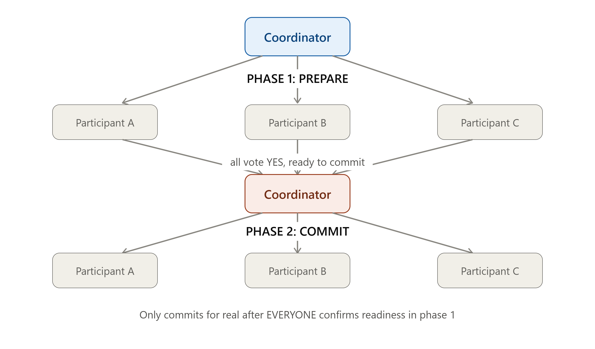
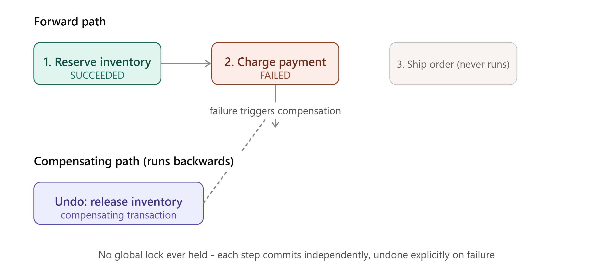
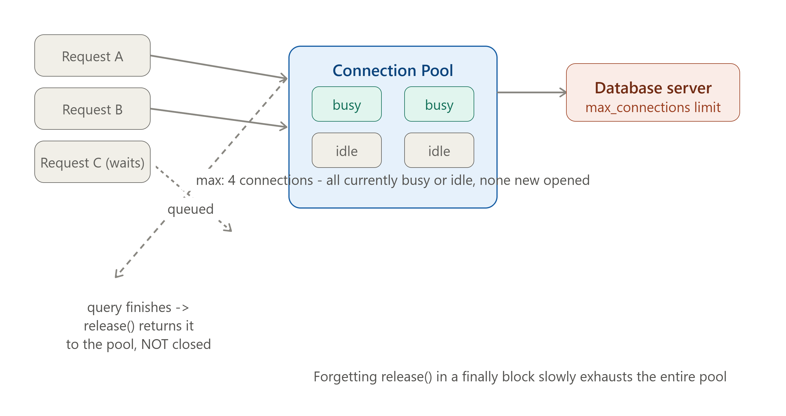
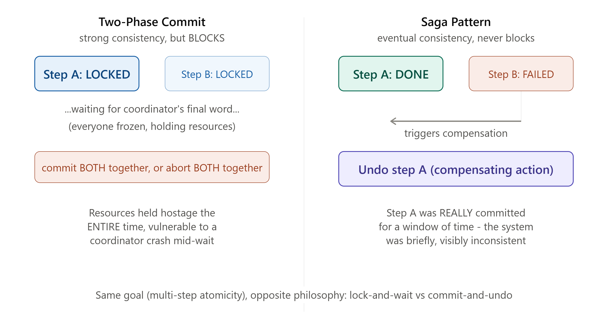

# DAY 13 — Distributed Transactions, Connection Pooling, and ORMs

### (Two-Phase Commit, Saga Pattern, Connection Pooling, ORMs vs Raw Queries)

> **Why this day matters:** This is the final day of Week 2's deep dive into data — and it closes the exact loop left open at the end of Day 11 ("cross-shard transactions are hard") and Day 12 (CAP's trade-offs, now applied to a concrete protocol). Then we land on two extremely practical, every-single-day-of-your-career topics: connection pooling (a thing every Node.js backend needs and most developers misconfigure) and ORMs (a thing you almost certainly already use, but maybe haven't seen "under the hood").

> Two diagrams were rendered above — refer to them throughout **Section 1** (Two-Phase Commit) and **Section 2** (the Saga Pattern's compensating transaction).

---

## TABLE OF CONTENTS — DAY 13

1. Two-Phase Commit (2PC)
2. The Saga Pattern
3. 2PC vs Saga — The Decision
4. Database Connection Pooling
5. ORMs vs Raw Queries
6. Day 13 / Week 2 Cheat Sheet

---

## 1. TWO-PHASE COMMIT (2PC)



### What

Two-Phase Commit is a protocol that allows a transaction spanning MULTIPLE separate databases/services (recall Day 11's "cross-shard transactions are hard" problem) to be committed ATOMICALLY — all participants commit together, or all participants abort together — coordinated by a designated **Coordinator** node. Refer to the diagram rendered above this lesson.

### Why

Day 8 taught you ACID's Atomicity guarantee — but that guarantee was naturally scoped to a SINGLE database engine, which can easily track everything happening within itself. The moment your transaction needs to touch data living on TWO OR MORE separate database servers (exactly the scenario Day 11 introduced — sharded data, or simply different microservices each owning their own database), there's no longer one single engine that can naturally guarantee atomicity across all of them. 2PC is the classic protocol designed to recreate that SAME atomicity guarantee, but across multiple, independent, separately-running database systems.

### Background

2PC emerged from distributed database research in the late 1970s-1980s, as the FIRST formal, rigorous solution to the cross-system-atomicity problem. It became foundational, widely-implemented technology (e.g., the **XA standard**, used by many traditional enterprise databases and message queues) for decades — but, as you'll see in Section 3, it has real, significant weaknesses that have made it progressively LESS popular in modern, internet-scale, microservices-based system design, in favor of the Saga Pattern (Section 2).

### How — The Two Phases, Step by Step (refer to the diagram above)

**Phase 1 — Prepare (the "voting" phase):**

1. The Coordinator sends a `PREPARE` message to EVERY participant (every database/service involved in this transaction).
2. Each participant does all the WORK needed to be ready to commit (locks any necessary resources, writes the change to a temporary/pending state) — but does NOT actually finalize/commit it yet.
3. Each participant replies to the Coordinator with either `YES` (I'm ready, I can commit this) or `NO` (I cannot — e.g., a constraint violation, insufficient funds, a conflict).

**Phase 2 — Commit (or Abort):** 4. If — and ONLY if — **ALL** participants replied `YES`, the Coordinator sends a `COMMIT` message to everyone, and each participant finalizes its change for real. 5. If **ANY** participant replied `NO` (or failed to respond at all within a timeout), the Coordinator sends an `ABORT` message to everyone, and each participant rolls back/discards its pending change — exactly as if the transaction had never started anywhere.

### The Critical Weakness — Blocking, and the "Coordinator Failure" Problem

Here's the genuinely serious problem that has driven much of the industry away from 2PC for new system designs: **during Phase 1, after a participant votes `YES`, it must HOLD its locks/pending state and WAIT for the Coordinator's final decision** — it cannot unilaterally decide to commit or abort on its own; it's fundamentally STUCK waiting. **If the Coordinator itself crashes or becomes unreachable AFTER collecting votes but BEFORE sending the final Commit/Abort decision, every single participant is left BLOCKED indefinitely** — holding locks on real resources, unable to proceed in either direction, until the Coordinator recovers. This directly connects back to **Day 12's CAP theorem**: 2PC is fundamentally a CP-style protocol (it sacrifices Availability — participants literally cannot make progress — to protect Consistency), and this blocking behavior is EXACTLY the kind of availability cost that CP systems pay during exactly the failure scenarios (a node going down) that distributed systems must expect to handle gracefully.

### Implementation — A Simplified 2PC Coordinator in Node.js

```js
class TwoPhaseCommitCoordinator {
  constructor(participants) {
    this.participants = participants; // array of objects with prepare()/commit()/abort() methods
  }

  async executeTransaction() {
    console.log("--- PHASE 1: PREPARE ---");
    const votes = await Promise.all(
      this.participants.map(async (p) => {
        try {
          const canCommit = await p.prepare();
          console.log(`${p.name} voted: ${canCommit ? "YES" : "NO"}`);
          return canCommit;
        } catch (err) {
          console.log(`${p.name} failed to respond: treating as NO`);
          return false; // a non-response is treated as a NO vote (a timeout, in reality)
        }
      }),
    );

    const allAgreed = votes.every((vote) => vote === true);

    console.log(`--- PHASE 2: ${allAgreed ? "COMMIT" : "ABORT"} ---`);
    if (allAgreed) {
      await Promise.all(this.participants.map((p) => p.commit()));
      return { success: true };
    } else {
      await Promise.all(this.participants.map((p) => p.abort()));
      return { success: false, reason: "One or more participants voted NO" };
    }
  }
}

// Example participant - e.g., an inventory database
class InventoryParticipant {
  constructor(name) {
    this.name = name;
    this.pendingChange = null;
  }
  async prepare() {
    // Check if we CAN make this change, and hold a pending/locked state
    const hasStock = true; // simplified check
    if (hasStock) {
      this.pendingChange = { reserved: 1 };
      return true;
    }
    return false;
  }
  async commit() {
    console.log(`${this.name}: change finalized`);
    this.pendingChange = null;
  }
  async abort() {
    console.log(`${this.name}: change discarded`);
    this.pendingChange = null;
  }
}

const coordinator = new TwoPhaseCommitCoordinator([
  new InventoryParticipant("InventoryService"),
  new InventoryParticipant("PaymentService"),
]);
coordinator.executeTransaction();
```

Notice the **real-world risk this simplified code doesn't fully show**: in a genuine production 2PC implementation, if the COORDINATOR PROCESS ITSELF crashes between collecting votes and sending the final commit/abort decision, every participant is left holding its `pendingChange` indefinitely — this implementation, like most simplified examples, glosses over exactly the failure mode that makes real 2PC implementations genuinely complex (requiring persistent logs the Coordinator can recover from after a crash, timeout/recovery protocols, etc.).

### Interview Angle

"How would you handle a transaction spanning multiple databases?" → 2PC is the textbook, formally correct answer — but a STRONG answer immediately follows up by naming its blocking/availability weakness and PROACTIVELY suggesting the Saga Pattern (Section 2) as the more commonly-used modern alternative, especially in microservices architectures.

---

## 2. THE SAGA PATTERN



### What

A Saga breaks a single, logical multi-step transaction into a SEQUENCE of separate, independent LOCAL transactions, each committed individually and immediately (no waiting, no global locks) — and if any step FAILS partway through, instead of a true rollback, the Saga executes a series of **compensating transactions** that explicitly UNDO the effects of the steps that already succeeded. Refer to the diagram rendered above this lesson.

### Why this has become the dominant modern approach over 2PC

Directly solving 2PC's biggest weakness (Section 1): there is **no Coordinator holding everyone hostage waiting for a final decision, and no participant ever blocks waiting indefinitely.** Each step in a Saga commits FOR REAL, immediately, on its own — there's no "pending, waiting for permission" state at all. This makes Sagas dramatically more resilient to individual service failures, and a much more natural fit for modern microservices architectures (Day 19-20 topics), where each service independently owns and manages its own database, and you genuinely don't want one slow/down service to BLOCK every other service in the transaction.

### Background

The Saga Pattern's name and original concept trace back to a **1987 database research paper** (predating microservices entirely!) but it was specifically REVIVED and popularized over the last ~10-15 years as microservices architectures became mainstream and engineers needed a practical, non-blocking way to handle multi-service business transactions WITHOUT reaching for 2PC's blocking weaknesses — this is a great example of an old academic idea finding renewed, massive practical relevance decades later as the industry's architectural needs shifted (microservices specifically created exactly the problem Sagas were originally designed to solve).

### How — Walking Through the Diagram's Example

Imagine an e-commerce checkout flow spanning 3 independent services, each with their OWN database:

1. **Reserve Inventory** (Inventory Service) — succeeds, commits immediately, for real.
2. **Charge Payment** (Payment Service) — FAILS (e.g., the customer's card is declined).
3. **Ship Order** (Shipping Service) — never even runs, since step 2 failed.

Since step 1 ALREADY committed for real (unlike 2PC's "pending" state), simply stopping here would leave the customer's inventory reserved with no corresponding successful payment — a genuinely broken, inconsistent state. The Saga's answer: execute a **compensating transaction** — "release inventory" — which explicitly, deliberately UNDOES step 1's effect. The end result is logically equivalent to the whole transaction never having happened, but it was achieved through an EXPLICIT undo action, not a true database-level rollback (which wouldn't even be possible here, since step 1 was a fully separate, already-committed transaction in a completely different database).

### The Critical Distinction: Compensating Transactions Are NOT True Rollbacks

This is a genuinely important, often-tested nuance: a database ROLLBACK (Day 8) reverts changes that were never actually finalized/committed in the first place. A **compensating transaction** undoes the EFFECT of a change that WAS already fully, successfully committed — meaning, for a brief window of time, the system genuinely WAS in that "inventory reserved, no payment yet" intermediate state, visible to anyone looking at the Inventory Service directly. This is a real, deliberate trade-off: Sagas give up the cleaner "nothing happened until everything happened" guarantee of 2PC/ACID, in exchange for the much better resilience/availability properties described above. This connects DIRECTLY to **Day 12's eventual consistency concept** — a Saga is, fundamentally, an EVENTUALLY CONSISTENT approach to a multi-step transaction, rather than a STRONGLY consistent one.

### Two Saga Coordination Styles

- **Orchestration**: A central "orchestrator" service explicitly tells each participant what to do next, and explicitly triggers compensating transactions on failure — similar in SPIRIT to 2PC's Coordinator, but critically, the orchestrator does NOT hold anyone in a blocked "pending" state; each step still commits immediately, independently.
- **Choreography**: There's NO central coordinator at all — each service listens for events (directly connecting to **Day 15-16's Message Queues / Pub-Sub topics**, covered next week) from other services, and reacts independently (e.g., the Payment Service listens for an "InventoryReserved" event and reacts by attempting a charge; if it fails, it publishes a "PaymentFailed" event, which the Inventory Service listens for and reacts to by releasing the reservation).

### Implementation — A Saga with Orchestration in Node.js

```js
class OrderSaga {
  constructor(inventoryService, paymentService, shippingService) {
    this.inventoryService = inventoryService;
    this.paymentService = paymentService;
    this.shippingService = shippingService;
    this.completedSteps = []; // track what's succeeded, for compensation if needed
  }

  async execute(order) {
    try {
      await this.inventoryService.reserve(order.items);
      this.completedSteps.push("inventory");
      console.log("Step 1 succeeded: inventory reserved");

      await this.paymentService.charge(order.userId, order.total);
      this.completedSteps.push("payment");
      console.log("Step 2 succeeded: payment charged");

      await this.shippingService.ship(order.id);
      this.completedSteps.push("shipping");
      console.log("Step 3 succeeded: order shipped");

      return { success: true };
    } catch (err) {
      console.log(
        `Saga failed at step ${this.completedSteps.length + 1}: ${err.message}`,
      );
      await this.compensate(order);
      return { success: false, reason: err.message };
    }
  }

  // Compensating transactions run in REVERSE order of what actually succeeded
  async compensate(order) {
    console.log("--- Running compensating transactions ---");
    if (this.completedSteps.includes("payment")) {
      await this.paymentService.refund(order.userId, order.total);
      console.log("Compensated: payment refunded");
    }
    if (this.completedSteps.includes("inventory")) {
      await this.inventoryService.release(order.items);
      console.log("Compensated: inventory released");
    }
  }
}

// Simulated services - paymentService.charge() deliberately fails here
const inventoryService = {
  reserve: async (items) => true,
  release: async (items) => true,
};
const paymentService = {
  charge: async (userId, total) => {
    throw new Error("Card declined");
  },
  refund: async (userId, total) => true,
};
const shippingService = { ship: async (orderId) => true };

const saga = new OrderSaga(inventoryService, paymentService, shippingService);
saga.execute({
  id: "order_1",
  userId: "user_42",
  items: ["item_1"],
  total: 49.99,
});
```

Notice the `compensate()` method runs steps in **REVERSE order** of completion — this matters in real sagas with more steps, since later compensations might depend on earlier ones still being intact at the moment they run.

### Interview Angle

"How would you handle a multi-step checkout process across microservices?" → Saga Pattern is the expected modern answer, and explaining the compensating-transaction concept (with the explicit "this is NOT a true rollback, it's eventually consistent" nuance) plus naming orchestration vs choreography demonstrates real depth here.

---

## 3. 2PC vs SAGA — THE DECISION

|                    | Two-Phase Commit                                                         | Saga Pattern                                                             |
| ------------------ | ------------------------------------------------------------------------ | ------------------------------------------------------------------------ |
| Consistency model  | Strong (Day 12) — all-or-nothing, immediately                            | Eventual (Day 12) — temporarily inconsistent during failure/compensation |
| Blocking behavior  | YES — participants block awaiting Coordinator's decision                 | NO — each step commits independently and immediately                     |
| Failure resilience | Weak — Coordinator crash can block everyone indefinitely                 | Strong — failures are handled explicitly via compensation                |
| Best fit           | Tightly-coupled systems, fewer participants, strong consistency required | Microservices, many independent services, availability prioritized       |
| Complexity         | Conceptually simpler, but production-hardening (crash recovery) is hard  | Requires designing a compensating transaction for EVERY step upfront     |

### How to teach this

> "2PC is like a wedding where the officiant asks EVERYONE — the couple, both sets of parents, the caterer, the venue — to confirm they're 100% ready, and ONLY then does the ceremony actually happen, all at once. If the officiant has a heart attack right after collecting everyone's confirmation but before saying 'I now pronounce you...', everyone is just standing there, frozen, unable to proceed OR leave. A Saga is more like a sequence of separate, smaller commitments — booking the venue (commits for real, immediately), THEN booking the caterer (commits for real, immediately) — and if the caterer falls through, you explicitly go back and CANCEL the venue booking (a compensating action) rather than the whole thing having been held in suspended animation the entire time."

---

## 4. DATABASE CONNECTION POOLING

### What

A connection pool is a CACHE of already-established, ready-to-use database connections that your application reuses across many requests, instead of opening a brand-new connection from scratch for every single database query and closing it afterward.

### Why

Establishing a NEW database connection is a genuinely expensive operation — it typically involves a TCP handshake (Day 2), authentication, and sometimes a TLS handshake (Day 2) too — easily adding tens of milliseconds of pure overhead, EVERY SINGLE TIME, before your actual query even runs. For a Node.js API handling thousands of requests per second (recall Day 6/7's RPS calculations), opening and closing a brand-new database connection for EVERY request would be catastrophically wasteful and slow — connection pooling solves this by keeping a set of connections permanently open and ready, simply HANDING ONE OUT to whichever request needs it, and taking it BACK (not closing it) when that request is done.

### Background

This is a direct, practical application of the EXACT same "reuse expensive resources instead of recreating them" principle behind Day 2's HTTP/1.1 "keep-alive" connections and HTTP/2's connection multiplexing — connection pooling applies this same idea specifically to DATABASE connections, which are even MORE expensive to establish than a typical HTTP connection (due to the additional authentication/handshake overhead specific to database protocols).

### How — The Pool Lifecycle



1. When your application starts, it creates a pool with a configured number of connections (e.g., a minimum of 5, a maximum of 20) — some are opened immediately, others are opened on-demand up to the maximum.
2. When a request needs to run a query, it asks the pool for a connection. If one is FREE (idle, not currently in use), the pool hands it over immediately.
3. The request uses that connection to run its query, then RELEASES it back to the pool (rather than closing it) — the connection stays open, ready for the NEXT request that needs one.
4. If ALL connections are currently busy when a new request arrives, that request WAITS in a queue until one becomes free (or until a configured timeout is reached, at which point it fails with a timeout error).

### The Real, Practical Tuning Problem: Pool Size

This is something you will GENUINELY need to configure correctly in real Node.js projects, and getting it wrong causes real, hard-to-diagnose production problems:

- **Pool size TOO SMALL**: Under real traffic, requests start queueing up waiting for a free connection (even though your database itself could easily handle more concurrent queries), creating artificial latency and bottlenecks that have NOTHING to do with your actual database's capacity — purely an artifact of your pool configuration being too conservative.
- **Pool size TOO LARGE**: Your database server has its OWN hard limit on how many total simultaneous connections it can handle (this is a real, configurable database server setting, e.g., PostgreSQL's `max_connections`) — and if you have MULTIPLE app server instances (recall Day 4's horizontal scaling!), each with their OWN pool, the connections multiply: 10 app server instances × a pool size of 50 each = 500 total connections all competing for your database's limit, which might genuinely be far lower than that, causing connection failures/refusals under load.

### Implementation — Configuring a Connection Pool in Node.js

```js
const { Pool } = require("pg");

const pool = new Pool({
  connectionString: process.env.DATABASE_URL,
  min: 5, // keep at least 5 connections open, ready, even when idle
  max: 20, // never open more than 20 connections from THIS pool
  idleTimeoutMillis: 30000, // close an idle connection after 30s of not being used
  connectionTimeoutMillis: 5000, // if no connection becomes free within 5s, fail with an error
});

// Using the pool - notice you DON'T manually open/close a connection here;
// the pool handles borrowing and returning it transparently
app.get("/api/orders/:id", async (req, res) => {
  const result = await pool.query("SELECT * FROM orders WHERE id = $1", [
    req.params.id,
  ]);
  res.json(result.rows[0]);
});

// For a multi-step TRANSACTION (Day 8), you DO need to manually
// check out and release a single, specific connection - because all the
// steps of one transaction MUST run on the SAME underlying connection
async function transferMoney(fromId, toId, amount) {
  const client = await pool.connect(); // explicitly borrow ONE connection from the pool
  try {
    await client.query("BEGIN");
    await client.query(
      "UPDATE accounts SET balance = balance - $1 WHERE id = $2",
      [amount, fromId],
    );
    await client.query(
      "UPDATE accounts SET balance = balance + $1 WHERE id = $2",
      [amount, toId],
    );
    await client.query("COMMIT");
  } catch (err) {
    await client.query("ROLLBACK");
    throw err;
  } finally {
    client.release(); // ALWAYS return the connection to the pool, even on error -
    // forgetting this is one of the most common, genuinely
    // damaging real-world Node.js bugs: a "connection pool leak"
    // that gradually exhausts the pool until everything hangs
  }
}
```

**The `client.release()` in that `finally` block is one of the single most important lines in this entire lesson for your real day job.** Forgetting to release a manually-checked-out connection (especially when an error is thrown and a developer forgets a `finally`/`catch` path releases it too) causes a slow, creeping production bug where the pool gradually runs out of available connections over hours/days, eventually causing every new request to hang waiting for a connection that will never free up — a genuinely common, genuinely painful real-world Node.js incident.

### Interview Angle

"What is connection pooling and why does it matter?" → the TCP/TLS handshake overhead reasoning, PLUS being ready to discuss the pool-size tuning trade-off (too small = artificial bottleneck, too large = overwhelms the database's own connection limit, MULTIPLIED across however many app server instances you're running) shows real, practical, production-level understanding.

---



## 5. ORMs vs RAW QUERIES

### What

An ORM (Object-Relational Mapper) is a library that lets you interact with your database using your programming language's native objects/methods (e.g., `User.findById(42)`) instead of writing raw SQL strings directly — the ORM translates your method calls into the actual SQL queries behind the scenes. Examples in the Node.js ecosystem: **Prisma**, **Sequelize**, **TypeORM**.

### Why

Writing raw SQL strings throughout your application code works, but has real downsides: it's easy to introduce SQL injection vulnerabilities if you're not careful about parameterization, it's verbose for simple, repetitive CRUD operations, and it doesn't get the benefit of your editor's autocomplete/type-checking the way native method calls do. ORMs aim to make the COMMON case (simple CRUD: create, read, update, delete) faster and safer to write, while still allowing you to "drop down" to raw SQL for complex queries when needed.

### How — What an ORM Actually Does Underneath

```js
// Using Prisma (an ORM) - this method call:
const user = await prisma.user.findUnique({ where: { id: 42 } });

// gets translated by Prisma, internally, into something equivalent to this raw SQL:
// SELECT * FROM users WHERE id = 42 LIMIT 1;

// Similarly, this:
const newOrder = await prisma.order.create({
  data: { userId: 42, total: 49.99 },
});

// becomes, internally:
// INSERT INTO orders (user_id, total) VALUES (42, 49.99) RETURNING *;
```

The ORM is doing EXACTLY the same underlying database work either way — it's purely a translation/convenience layer sitting on top of the raw SQL and the connection pool (Section 4) underneath.

### The Genuine Trade-off — When ORMs Help, and When They Hurt

**Where ORMs genuinely help**:

- Simple CRUD operations (the majority of typical backend code) — faster to write, less error-prone, automatic protection against SQL injection (since parameters are handled safely by default).
- Database portability — switching from PostgreSQL to MySQL is often easier with an ORM, since much of your code doesn't directly reference database-specific SQL syntax.
- Schema migrations — most ORMs include built-in tooling for managing schema changes over time (directly connecting to Day 8's discussion of SQL's fixed-schema trade-off — ORMs make MANAGING those schema changes more structured and repeatable).

**Where ORMs genuinely hurt — and you should drop to raw SQL**:

- **Complex queries with multiple JOINs, subqueries, or advanced aggregations** — ORMs often generate genuinely INEFFICIENT SQL for complex queries (sometimes issuing MANY separate small queries where a single, well-crafted JOIN would be far faster — this is actually a close cousin of **Day 3's GraphQL N+1 problem**, just manifesting in the ORM layer instead), and the resulting generated SQL can be hard to predict or tune.
- **Performance-critical paths** where you need precise control over EXACTLY which index gets used, or need database-specific features the ORM doesn't expose well.
- **Bulk operations** (inserting/updating thousands of rows at once) — ORMs are often NOT optimized for this, and raw, hand-tuned bulk SQL is frequently dramatically faster.

### Implementation — Knowing When to Drop to Raw SQL, Even Within an ORM-based Project

Most real-world ORMs explicitly support escaping to raw SQL for exactly these cases — using BOTH approaches in the SAME project is completely normal, professional practice, not a sign of doing something wrong:

```js
// Simple CRUD - let the ORM handle it, it's faster to write and perfectly efficient here
const user = await prisma.user.findUnique({ where: { id: 42 } });

// Complex analytical query - drop to raw SQL for full control and predictable performance
const topSpenders = await prisma.$queryRaw`
  SELECT users.name, SUM(orders.total) as total_spent
  FROM users
  JOIN orders ON orders.user_id = users.id
  WHERE orders.created_at > NOW() - INTERVAL '30 days'
  GROUP BY users.id, users.name
  ORDER BY total_spent DESC
  LIMIT 10
`;
```

### Real-world example

Many large-scale Node.js production systems use an ORM (Prisma is currently very popular) for the bulk of straightforward CRUD application code, while deliberately writing raw, hand-optimized SQL for specific known-heavy reporting/analytics queries — this hybrid approach is genuinely the industry norm at scale, not an either/or decision.

### Interview Angle

"Would you use an ORM or write raw SQL?" — the strong answer is explicitly "both, for different parts of the same system" (directly echoing the SQL-vs-NoSQL "polyglot persistence" lesson from Day 8) — using the ORM for everyday CRUD, dropping to raw SQL for complex/performance-critical queries, rather than dogmatically picking one approach for an entire project.

---

## 6. DAY 13 / WEEK 2 CHEAT SHEET

```
TWO-PHASE COMMIT (2PC)
  Phase 1 (Prepare): Coordinator asks all participants "can you commit?" -
                      each locks/prepares but does NOT finalize yet
  Phase 2 (Commit/Abort): if ALL said yes -> commit everywhere;
                           if ANY said no -> abort everywhere
  Weakness: BLOCKING - if Coordinator crashes mid-process, participants
            are stuck holding locks indefinitely (CP-style, sacrifices
            Availability - Day 12 connection)

SAGA PATTERN (the modern alternative)
  Sequence of independent LOCAL transactions, each commits for real, immediately
  On failure: run COMPENSATING transactions (explicit undo, NOT a true rollback)
              in REVERSE order of what succeeded
  Eventually consistent (Day 12), NOT blocking, much better failure resilience
  Two styles: Orchestration (central coordinator directs steps) vs
              Choreography (services react to each other's events, no center)
  Best fit: microservices, many independent services, availability matters

CONNECTION POOLING
  Reuse open DB connections instead of opening a new one per request
  (new connections are expensive: TCP handshake + auth + maybe TLS, Day 2)
  Pool too small -> artificial queueing/latency bottleneck
  Pool too large -> can exceed DB's max_connections, WORSENED by having
                    many app server instances (Day 4) each with their own pool
  ALWAYS release() a manually-borrowed connection in a finally block -
  forgetting this causes a slow, creeping "pool exhaustion" production bug

ORMs vs RAW SQL
  ORM (Prisma/Sequelize/TypeORM): translates method calls -> SQL underneath
  Good for: simple CRUD, safety (injection protection), portability, migrations
  Bad for: complex JOINs/aggregations (can generate inefficient SQL,
           similar to GraphQL's N+1 problem), bulk operations, fine-tuned perf
  BEST PRACTICE: use BOTH in the same project - ORM for everyday CRUD,
  raw SQL (most ORMs support $queryRaw or equivalent) for complex/critical paths
```

---

# WEEK 2 COMPLETE

Across Days 8-13, you've built a complete mental model of how data is stored, found, replicated, split, and kept consistent across distributed systems:

- **Day 8**: SQL vs NoSQL, the 4 types of NoSQL, ACID properties.
- **Day 9**: How indexes actually work (B-Tree/B+Tree/Hash) and the read/write trade-off — proven with your own benchmark.
- **Day 10**: Replication (Leader-Follower, Multi-Leader, Leaderless) and the safety/speed trade-off of sync vs async.
- **Day 11**: Sharding strategies, and Consistent Hashing — built from scratch.
- **Day 12**: The CAP theorem, PACELC, and the consistency-model spectrum that explains WHY every Day 8-11 trade-off exists.
- **Day 13**: Distributed transactions (2PC vs Saga), connection pooling, and ORMs vs raw SQL.

**Day 14 is your Week 2 capstone**: designing the storage layer for an Instagram/Twitter-style social feed — applying sharding strategy, replication, caching, and consistency decisions together into one complete, end-to-end schema and Node.js data access layer, exactly the way Day 7 brought all of Week 1 together for the URL shortener.

**Say "Day 14" whenever you're ready.**
