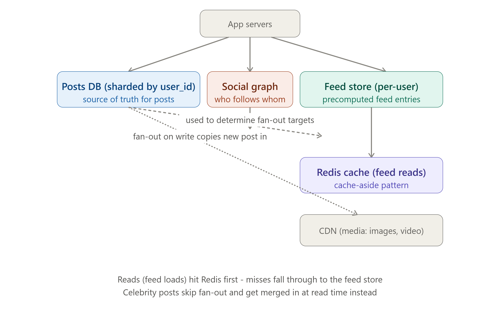
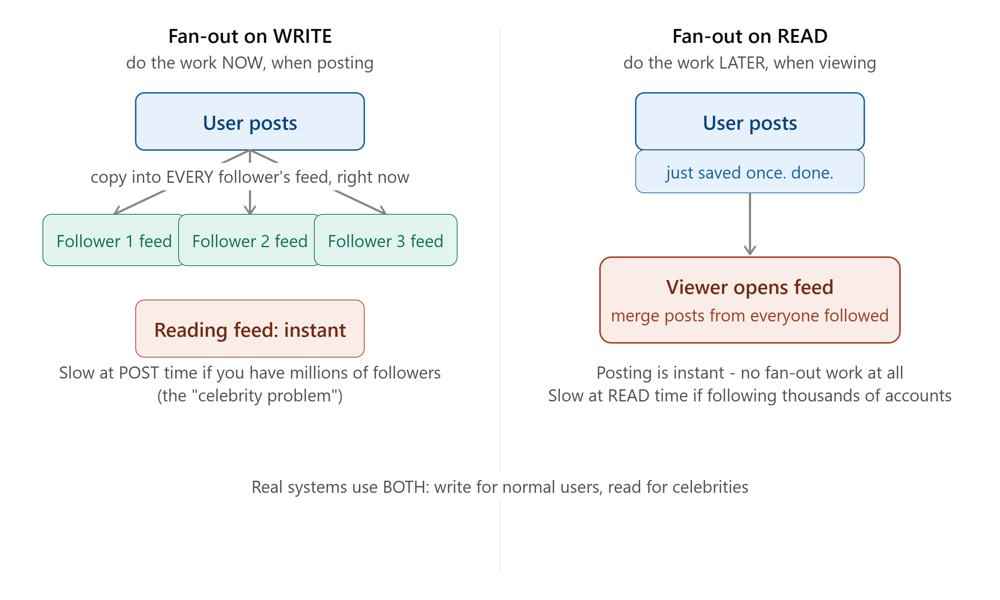

# DAY 14 — WEEK 2 CAPSTONE

### Design the Storage Layer for a Social Feed (Instagram/Twitter-Style)



> **Why this day matters:** Day 7 proved you could apply Week 1's concepts end-to-end. Today proves the same for Week 2: SQL vs NoSQL, ACID, indexing, replication, sharding, consistent hashing, CAP/PACELC, and distributed transactions all get applied to ONE real, famous system design problem — designing how posts, feeds, likes, and follows are actually STORED and RETRIEVED at scale. "Design Instagram" / "Design Twitter" is, alongside Day 7's URL shortener, one of the most frequently asked system design interview questions in the industry.

> Two diagrams were rendered above — refer to them throughout **Section 4** (fan-out on write vs fan-out on read) and **Section 5** (the full storage architecture).

---

## TABLE OF CONTENTS — DAY 14

1. Step 1: Requirements (Reusing Day 1's Framework)
2. Step 2: Estimation (Reusing Day 6's Framework)
3. Step 3: Data Model — What Are We Actually Storing?
4. Step 4: The Core Hard Problem — Fan-out on Write vs Fan-out on Read
5. Step 5: Full Storage Architecture
6. Step 6: Sharding Strategy for Posts and Feeds
7. Step 7: Where Each Week 2 Concept Applies (Explicit Mapping)
8. Step 8: Bottlenecks and Trade-offs
9. Full Implementation — Node.js Data Access Layer
10. Day 14 / Week 2 Cheat Sheet

---

## STEP 1: REQUIREMENTS

### Functional Requirements (FR)

1. Users can create posts (text + optional image/video).
2. Users can follow/unfollow other users.
3. Users can view a "feed" — a reverse-chronological (or ranked) stream of posts from everyone they follow.
4. Users can like/comment on posts.
5. Some users ("celebrities") may have tens of millions of followers — this single fact, stated explicitly upfront, is going to drive the single most important design decision in this entire lesson (Section 4).

### Non-Functional Requirements (NFR) — Using Day 1's 4 Pillars and Day 12's Consistency Models

- **Availability**: Very high. A social feed being briefly down is a highly visible, broadly felt failure.
- **Latency**: Feed loads must feel instant — sub-200ms is a reasonable target, directly echoing Day 6's percentile-based latency thinking (we'd want this at p99, not just on average).
- **Consistency**: Mixed, deliberately, exactly like Day 7's URL shortener and Day 12's lesson about applying different models to different data:
  - Posting a photo: needs **durability** (Day 1) — never silently lose a user's post.
  - Feed contents: **eventual consistency** is completely fine (Day 10/12) — it's a non-issue if a brand-new post takes a few seconds to appear in followers' feeds.
  - Like counts: **eventual consistency**, exactly like Day 7's click-counter reasoning.
  - Follow/unfollow relationship itself: should be reasonably fresh, but a few seconds of lag here is also tolerable.
- **Read-heavy skew**: Overwhelmingly read-heavy — people view feeds vastly more often than they post (directly echoing Day 6/7's 100:1-style ratios).

---

## STEP 2: ESTIMATION

Using **Day 6's exact framework**, with assumptions stated explicitly:

```
Assume: 500 million Daily Active Users (DAU)
Each user views their feed ~15 times/day, each "view" loads ~20 posts
Each user posts ~once every 5 days (0.2 posts/user/day)
Average follower count per user: ~300 (heavily skewed - most have few,
a small number of celebrities have millions - this skew is exactly
what makes Section 4 interesting)

READ VOLUME:
Total feed-view requests/day = 500,000,000 x 15 = 7,500,000,000/day
Average read RPS = 7,500,000,000 / 86,400 ≈ 86,800 RPS
Peak read RPS (3x factor, Day 6) ≈ 260,000 RPS

WRITE VOLUME (posts):
Total posts/day = 500,000,000 x 0.2 = 100,000,000 posts/day
Average write RPS = 100,000,000 / 86,400 ≈ 1,157 RPS
Peak write RPS (3x factor) ≈ 3,470 RPS

Read:Write ratio ≈ 75:1 - heavily read-skewed, exactly as expected
```

**What these numbers immediately tell us** (directly reusing Day 6's "connect every number to a decision" lesson): ~260,000 peak read RPS is FAR beyond anything a single database (even with Day 9's indexing) could serve directly — this single number justifies BOTH heavy caching (Day 5) AND a precomputation strategy for feeds (Section 4), not just simple query optimization. ~3,470 peak write RPS, while much smaller, still needs to be spread across multiple shards (Day 11) rather than one single Leader (Day 10).

---

## STEP 3: DATA MODEL — WHAT ARE WE ACTUALLY STORING?

Applying **Day 8's SQL vs NoSQL decision framework** to each distinct piece of data separately (rather than forcing one database type to handle everything — "polyglot persistence," directly reused from Day 8):

### Posts (Document store — MongoDB-style, or a wide-column store)

```json
{
  "postId": "post_8847291",
  "userId": "user_42",
  "content": "Check out this sunset!",
  "mediaUrl": "https://cdn.example.com/media/8847291.jpg",
  "createdAt": "2026-06-27T18:30:00Z",
  "likeCount": 0,
  "commentCount": 0
}
```

**Why a document store fits here**: each post is a self-contained, independently-read/written record with no complex cross-post relational queries needed (Day 8's document-store reasoning) — we almost never need to JOIN posts against each other.

### Social Graph (who follows whom)

This is a CLASSIC graph-database use case (directly reusing **Day 8's Section 3.4**) — "find all of User X's followers" or "find everyone User X follows" are exactly the relationship-traversal queries graph databases are built for. In practice, given the read pattern is overwhelmingly "list of IDs," many real systems implement this more simply as a **key-value store** (Redis, or a simple indexed SQL table: `follows(follower_id, followee_id)`) since the queries needed here are usually simple lookups, not deep multi-hop traversals — a graph database becomes more clearly justified specifically for RECOMMENDATION features ("people you may know," "people who follow people you follow") rather than the basic follow relationship itself.

### Feed Store (the precomputed, per-user feed — central to Section 4)

```
Key-Value structure: feed:{userId} -> sorted list of postIds, newest first
feed:user_99  ->  [post_8847291, post_8847102, post_8846950, ...]
```

A simple, sorted, key-value structure — directly reusing **Day 8's key-value store reasoning** and **Day 5's caching patterns** — this is PRECISELY the kind of data Redis (a sorted set, specifically) is built to hold efficiently.

### Likes/Comments (high write volume, simple structure)

A key-value or wide-column store (Day 8's Cassandra-style reasoning) fits well here too — extremely high write volume (every like is a write), simple access pattern (count + list, by post), and eventual consistency is explicitly fine (Step 1's NFRs).

---

## STEP 4: THE CORE HARD PROBLEM — FAN-OUT ON WRITE vs FAN-OUT ON READ



This is THE signature deep-dive for this entire problem, exactly the way ID generation was the signature deep-dive for Day 7's URL shortener. Refer to the **first diagram rendered above this lesson** throughout this section.

### What — The Core Question

When User A (who has, say, 300 followers) posts something new, HOW does that post actually get into all 300 followers' feeds? There are two fundamentally different strategies, doing the SAME total amount of work, but at COMPLETELY DIFFERENT TIMES:

### Approach 1: Fan-out on Write (precompute at post time)

**What**: The MOMENT a user posts, the system immediately writes a copy of that post's reference into the precomputed Feed Store (Section 3) of EVERY single follower, all at once.
**Why**: This makes READING a feed trivially fast — `GET feed:{userId}` is a single, simple key-value lookup (Day 8) against ALREADY-prepared data; no real-time computation or merging needed at read time at all.
**How**:

```
On new post by User A:
  followers = getFollowers(userA)  // could be 300, could be 30 million
  for each follower in followers:
    feedStore.prepend(`feed:${follower.id}`, newPost.id)
```

**The Critical Weakness — "The Celebrity Problem"**: Recall Step 1's explicit Functional Requirement: SOME users have tens of millions of followers. If a celebrity with 50 million followers posts, fan-out-on-write would need to perform 50 MILLION individual write operations, ALL triggered by that ONE post — this could take minutes to fully complete, creates a massive, sudden write-spike (directly stressing whatever Day 11 sharding scheme holds the Feed Store), and means some followers might not see the celebrity's post for a noticeable delay while the fan-out is still working through the list.

### Approach 2: Fan-out on Read (compute at view time)

**What**: Posting does ALMOST NO extra work — just save the post once (Section 3's Posts store). When a user OPENS their feed, the system, AT THAT MOMENT, looks up everyone they follow, fetches each of those users' recent posts, and MERGES them together (typically sorted by recency) into the feed shown to that one viewer.
**Why**: Posting becomes instant and cheap, REGARDLESS of follower count — a celebrity with 50 million followers posts EXACTLY as fast as someone with 10 followers, since no fan-out work happens at post time at all.
**How**:

```
On feed view by User X:
  following = getFollowing(userX)  // who does X follow? could be hundreds or thousands
  recentPosts = []
  for each followedUser in following:
    recentPosts.push(...getRecentPosts(followedUser.id))
  feed = sortByRecency(recentPosts).slice(0, 20)
```

**The Critical Weakness**: If a user follows thousands of accounts, EVERY single feed load now requires fetching and merging data from thousands of different sources, in real time, while the user is actively waiting for their feed to render — directly threatening our Step 1 latency NFR (sub-200ms), especially given Step 2's enormous READ volume (260,000 peak RPS) — doing this much real-time computation for EVERY single one of those reads is a serious performance risk.

### The Real-World Solution: A Hybrid Approach

Neither approach alone is good enough given Step 1's explicit celebrity requirement — and this is EXACTLY the kind of nuanced, "the real answer is a hybrid" insight that distinguishes a strong system design answer (echoing Day 8's polyglot-persistence lesson, applied here to STRATEGY rather than database type):

- **For regular users** (the vast majority, with hundreds, not millions, of followers): use **fan-out on write**. The fan-out cost is small and manageable, and it keeps reads fast for the overwhelming majority of feed views.
- **For celebrities/high-follower accounts** (a small, identifiable minority): use **fan-out on read** — DON'T pre-push their posts into millions of feeds. Instead, at read time, separately check "does this viewer follow any celebrities?" and merge THOSE posts in on the fly, alongside the precomputed regular-fan-out feed.
- This means a TYPICAL feed read does: (1) a fast lookup of the precomputed feed (covers all regular follows), PLUS (2) a small, bounded number of extra lookups for the handful of celebrities the viewer follows (bounded because, realistically, even a very engaged user follows a relatively small NUMBER of celebrity-tier accounts, even if each of THOSE celebrities has millions of followers) — giving you the speed benefit of fan-out-on-write for the common case, without ever paying the "50 million writes for one post" cost for celebrity posts.

### Real-world example

This EXACT hybrid strategy is well known to be used by Twitter/X internally — their engineering team has discussed publicly that high-follower accounts are deliberately excluded from the normal fan-out-on-write pipeline specifically because of this exact celebrity problem, with their content merged in separately at read time instead.

### Interview Angle

"How would you design the feed so a celebrity's post doesn't crash the system?" is THE expected, specific follow-up question for this entire problem — exactly parallel to Day 7's "how do you generate unique codes across multiple servers" follow-up. A strong answer reaches fan-out-on-write as the default, IMMEDIATELY identifies the celebrity weakness without being prompted, and proposes the hybrid solution.

### How to teach this

> "Fan-out on write is like a newspaper delivery service that, the INSTANT a new edition is printed, immediately drives a copy to every single subscriber's doorstep — so when subscribers wake up, the paper is just THERE, no waiting. But if ONE newspaper suddenly has 50 million subscribers, that delivery run becomes enormous and slow. Fan-out on read is the opposite: nobody delivers anything in advance — each subscriber, when THEY want to read news, calls every publisher they're interested in and asks 'what's new?', compiling their own digest on the spot. That's flexible and avoids any single huge delivery spike, but if a subscriber follows thousands of publishers, compiling their own digest every single time becomes slow. The real solution real newspapers (and real social networks) use: deliver the small, normal-sized publications to doorsteps in advance (fan-out on write), but handle the rare, massively-subscribed publications by having subscribers check in for those specific ones on demand instead (fan-out on read) — best of both, applied selectively."

---

## STEP 5: FULL STORAGE ARCHITECTURE

Refer to the **second diagram rendered above this lesson** — here's the reasoning for each piece, directly reusing components from across Week 2:

1. **Posts DB, sharded by `user_id`** (Day 11): Each user's posts live together on the same shard — directly enabling fast "get all of User X's recent posts" lookups (needed for Section 4's fan-out-on-read path), using **consistent hashing** (Day 11) so the cluster can grow without a massive reshuffling event.
2. **Social Graph store**: Holds follow/followed-by relationships — consulted both at POST time (to know WHO to fan out to) and at READ time (to know whose celebrity posts to merge in).
3. **Feed Store**: The precomputed, per-user feed list (Section 3/4) — populated via fan-out-on-write for regular accounts.
4. **Redis cache in front of the Feed Store** (Day 5's cache-aside pattern, directly reused): given our calculated 260,000 peak read RPS, even reading from the Feed Store directly, for EVERY single feed view, would be a heavy load — caching the MOST RECENTLY computed feed for active users avoids redundant lookups for users who refresh their feed repeatedly in a short window.
5. **CDN for media** (Day 5, directly reused): photos/videos are exactly the kind of static, cacheable content Day 5 explained CDNs are built for — keeping this enormous bandwidth load entirely OFF our origin servers and database layer.

### Replication Applied (Day 10, directly reused)

EVERY one of the data stores above would, in a real production system, ALSO be replicated using Day 10's Leader-Follower pattern — both for durability (Day 1) and to spread our enormous calculated read load (Step 2) across multiple Followers per shard, exactly the same reasoning applied in Day 7's capstone.

---

## STEP 6: SHARDING STRATEGY FOR POSTS AND FEEDS

Applying **Day 11's three sharding strategies** explicitly, and choosing deliberately for each store:

- **Posts DB**: **Hash-based sharding by `user_id`**, using **consistent hashing** (Day 11) specifically — NOT range-based, because range-based-by-user-ID would risk exactly the kind of hotspot Day 11 warned about if user IDs were assigned in any way correlated with activity level; hashing spreads users (and their write/read load) evenly, and consistent hashing specifically avoids the "add a shard, reshuffle everything" problem as our user base grows.
- **Feed Store**: Sharded by the VIEWING user's ID (since `feed:{userId}` is always looked up by that one specific user) — same hash-based/consistent-hashing reasoning as above.
- **Why NOT geo-based sharding here** (Day 11's third option): unlike Day 11's GDPR/data-residency example, there's no strong REGULATORY reason driving this particular design, and a user's followers/following could be ANYWHERE globally — geo-sharding would actually make the cross-shard "fetch all my followers' posts" queries (needed for fan-out) MORE complex, not less, since followers would be scattered across multiple geo-shards rather than groupable by a single consistent-hash lookup. This is a great example of Day 11's lesson that shard-key choice should be driven by your SPECIFIC access patterns, not applied as a default.

---

## STEP 7: WHERE EACH WEEK 2 CONCEPT APPLIES (EXPLICIT MAPPING)

This is the single most important section for cementing Week 2 as ONE connected body of knowledge rather than 6 separate days:

| Week 2 Concept                             | Where it applies in THIS system                                                                                                                                                                                                                                                                                                                                        |
| ------------------------------------------ | ---------------------------------------------------------------------------------------------------------------------------------------------------------------------------------------------------------------------------------------------------------------------------------------------------------------------------------------------------------------------- |
| **SQL vs NoSQL (Day 8)**                   | Posts = document store; Feed = key-value; Social graph = key-value or graph DB — different data, different database types, in the SAME system                                                                                                                                                                                                                          |
| **ACID (Day 8)**                           | A single post creation is a simple atomic write; we deliberately do NOT need cross-store ACID transactions for the like-counter or feed entries (eventual consistency is fine, Step 1)                                                                                                                                                                                 |
| **Indexing (Day 9)**                       | Posts indexed by `user_id` + `created_at` (for fast "recent posts by this user" lookups, needed by both fan-out approaches)                                                                                                                                                                                                                                            |
| **Replication (Day 10)**                   | Every store replicated Leader-Follower style, for durability + spreading our 260,000 peak read RPS                                                                                                                                                                                                                                                                     |
| **Sharding + Consistent Hashing (Day 11)** | Posts DB and Feed Store both hash-sharded by user ID, specifically to avoid Day 11's reshuffling problem as the system grows                                                                                                                                                                                                                                           |
| **CAP/PACELC (Day 12)**                    | Feed/like-count data deliberately leans AP/eventual consistency (Day 12's Cassandra/DynamoDB-style reasoning); post creation itself leans more CP-ish (don't want to silently lose a user's post)                                                                                                                                                                      |
| **2PC vs Saga (Day 13)**                   | NOT needed for most of this design (most operations are single-store), but a "delete my account" flow (deleting posts, removing from feeds, removing follow relationships, ALL across separate stores) would be a great candidate for a **Saga** (Day 13) — independent local deletions, each committing immediately, with no need for blocking 2PC-style coordination |
| **Connection Pooling (Day 13)**            | Every app server instance maintains pools to each sharded store — sized carefully given how many app server instances exist (Day 4/13's multiplication concern)                                                                                                                                                                                                        |
| **ORMs vs raw SQL (Day 13)**               | Simple post/like CRUD via an ORM; the complex "merge posts from thousands of followed accounts" fan-out-on-read query is exactly the kind of case Day 13 flagged for dropping to raw, hand-tuned queries                                                                                                                                                               |

---

## STEP 8: BOTTLENECKS AND TRADE-OFFS

1. **The celebrity problem (Section 4)** is the headline bottleneck — solved via the hybrid fan-out strategy.
2. **Hot shards**: even with consistent hashing (Day 11), if a small number of EXTREMELY active users happen to land on the same shard, that shard could still become disproportionately loaded — a real, residual risk even after choosing hash-based sharding correctly; monitoring per-shard load (a Day 24 topic) is essential to catch this in practice.
3. **Feed Store storage cost**: fan-out-on-write means the SAME post ID gets duplicated across potentially hundreds of different followers' feed lists — a deliberate storage-for-speed trade-off (more storage used, in exchange for much faster reads), directly echoing Day 8's "NoSQL denormalization" philosophy.
4. **Replication lag (Day 10)** could cause a brand-new post to be momentarily missing from a follower's feed if the Feed Store's Follower replica hasn't caught up yet — explicitly ACCEPTABLE here, per Step 1's NFRs, unlike Day 10's bank-transfer-style example where this would be unacceptable.

---

## FULL IMPLEMENTATION — NODE.JS DATA ACCESS LAYER

```js
const redisClient = require("redis").createClient();
const CELEBRITY_FOLLOWER_THRESHOLD = 100000; // Section 4's hybrid strategy cutoff

// --- POSTING (Section 4: hybrid fan-out decision happens here) ---
async function createPost(userId, content, mediaUrl) {
  const post = await postsDb.insert({
    userId,
    content,
    mediaUrl,
    createdAt: new Date(),
    likeCount: 0,
  }); // Day 9: indexed by (userId, createdAt) for fast lookups either direction

  const followerCount = await socialGraphDb.getFollowerCount(userId);

  if (followerCount < CELEBRITY_FOLLOWER_THRESHOLD) {
    // Regular user - fan-out on WRITE (Section 4, Approach 1)
    await fanOutToFollowers(userId, post.id);
  } else {
    // Celebrity - SKIP fan-out entirely; their posts are picked up
    // at READ time instead (Section 4, Approach 2) - this is the
    // exact mechanism that avoids the celebrity-problem write-spike
    console.log(
      `Skipping fan-out for high-follower user ${userId} (${followerCount} followers)`,
    );
  }

  return post;
}

async function fanOutToFollowers(userId, postId) {
  const followers = await socialGraphDb.getFollowers(userId); // could be hundreds
  // In a real system, this would be pushed onto a message queue (Day 15)
  // rather than done synchronously in the request - previewing next week
  await Promise.all(
    followers.map((follower) => feedStoreDb.prependToFeed(follower.id, postId)),
  );
}

// --- READING THE FEED (Section 4: hybrid merge happens here) ---
async function getFeed(userId, limit = 20) {
  const cacheKey = `feed:${userId}`;

  // Day 5's cache-aside pattern
  const cached = await redisClient.get(cacheKey);
  if (cached) return JSON.parse(cached);

  // 1. Get the precomputed feed (covers all REGULAR follows, via fan-out-on-write)
  const precomputedPostIds = await feedStoreDb.getFeed(userId, limit);

  // 2. Separately check: does this user follow any CELEBRITIES? If so, merge
  //    their recent posts in now, at READ time (Section 4, Approach 2)
  const celebritiesFollowed =
    await socialGraphDb.getFollowedCelebrities(userId);
  const celebrityPosts = await Promise.all(
    celebritiesFollowed.map((celeb) => postsDb.getRecentPosts(celeb.id, 5)),
  );

  // 3. Merge both sources, sort by recency, trim to the requested limit
  const allCandidatePosts = [
    ...(await postsDb.getByIds(precomputedPostIds)),
    ...celebrityPosts.flat(),
  ];
  const feed = allCandidatePosts
    .sort((a, b) => b.createdAt - a.createdAt)
    .slice(0, limit);

  await redisClient.set(cacheKey, JSON.stringify(feed), { EX: 30 }); // short TTL -
  // intentionally short (Day 5), since feed freshness matters more here
  // than for, say, Day 7's URL mappings

  return feed;
}

// --- LIKES (Day 12: deliberately eventually consistent) ---
async function likePost(userId, postId) {
  await likesDb.insert({ userId, postId, createdAt: new Date() });
  // Fire-and-forget count update - exactly Day 7's click-counter pattern,
  // reused here for the exact same reasoning (eventual consistency is fine)
  incrementLikeCountAsync(postId);
}

async function incrementLikeCountAsync(postId) {
  try {
    await postsDb.increment(postId, "likeCount", 1);
  } catch (err) {
    console.error("Like count update failed (non-critical):", err.message);
  }
}
```

Notice how almost every function here directly cites and reuses a SPECIFIC Day 8-13 concept — exactly Day 7's capstone lesson applied again: a strong system design answer's CODE is a traceable consequence of its earlier reasoning, not an unrelated afterthought.

---

## DAY 14 / WEEK 2 CHEAT SHEET

```
THE SIGNATURE PROBLEM: FAN-OUT ON WRITE vs FAN-OUT ON READ
  Fan-out on WRITE: push new post into every follower's feed AT POST TIME
                     -> fast reads, but the "celebrity problem" (millions
                        of writes for one post) at write time
  Fan-out on READ:  do nothing at post time, merge followed users' posts
                     AT READ TIME -> fast/cheap posting, but slow reads
                        for users following many accounts
  REAL ANSWER: HYBRID - fan-out on write for regular users (the default),
               fan-out on read specifically for celebrity/high-follower
               accounts, merged in at read time alongside the precomputed feed

DATA MODEL (polyglot persistence, Day 8, reused)
  Posts          -> document store (self-contained records)
  Social graph   -> key-value or graph DB (relationship lookups)
  Feed store     -> key-value, sorted list per user (Redis sorted sets fit well)
  Likes/comments -> key-value/wide-column (high write volume, simple access)

SHARDING (Day 11, reused)
  Posts DB + Feed Store: HASH-based sharding by user_id, via CONSISTENT HASHING
  (avoids Day 11's reshuffling problem as the user base grows)
  Geo-sharding deliberately AVOIDED here - no regulatory driver, and it would
  complicate fan-out's cross-shard follower lookups

CONSISTENCY CHOICES (Day 12, reused)
  Post durability: lean toward NOT losing it (closer to CP-style care)
  Feed contents, like counts: deliberately EVENTUALLY CONSISTENT (AP-style) -
  a few seconds of staleness is completely fine for this kind of data

WHERE EVERY OTHER WEEK 2 DAY SHOWS UP
  Day 8 ACID: not needed across stores here - eventual consistency by design
  Day 9 Indexing: posts indexed by (user_id, created_at)
  Day 10 Replication: every store replicated for durability + read scaling
  Day 13 Saga: account deletion across multiple stores = good Saga candidate
  Day 13 Pooling/ORMs: ORM for simple CRUD, raw query for the read-time merge
```

---

# WEEK 2 COMPLETE

You've now built two full, complete, end-to-end system designs (Day 7's URL shortener, today's social feed) that each apply an entire week's worth of concepts coherently, with explicit, justified reasoning at every step — this is genuinely the exact skill a system design interview is testing for, and you now have TWO worked, teachable examples to study, reuse, and adapt.

**Week 3 starts tomorrow** with **Day 15**: Message Queues — the asynchronous communication backbone that several of today's "in a real system, this would be pushed onto a queue" mentions (like the fan-out operation above) were quietly previewing. You'll learn WHY decoupling services with queues matters, Kafka vs RabbitMQ vs SQS's actual architectural differences, and implement a working producer-consumer system yourself.

**Say "Day 15" whenever you're ready.**
